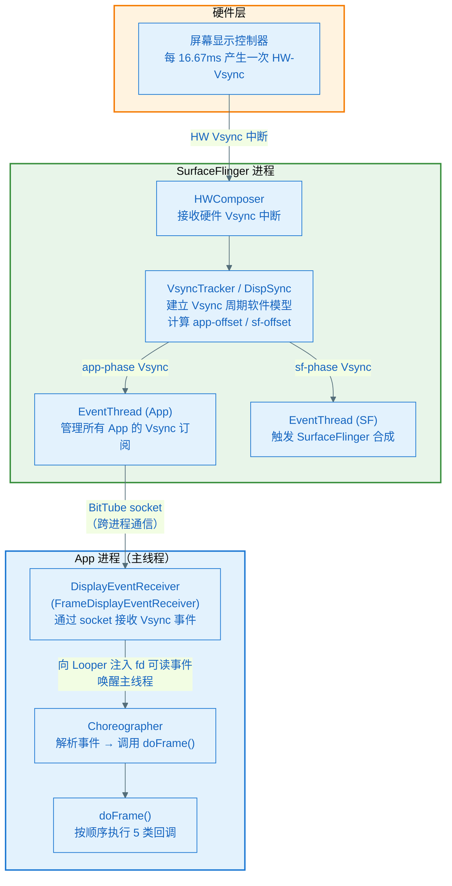

# Vsync 传递链路与 Choreographer 架构

> **核心问题**：Vsync 从屏幕硬件出发，经过哪些中间层，最终怎么唤醒 App 主线程？

---

## 1. 全链路一图看懂



**协作者与过程说明**

1. **触发与入口**：屏幕控制器在每个刷新周期（60Hz=16.67ms）产生一次硬件 Vsync 中断，通知 `HWComposer`
2. **SurfaceFlinger 建模**：`VsyncTracker`（Android 10+）或 `DispSync`（旧版）对硬件 Vsync 进行统计建模，生成准确的软件 Vsync 时间线，并加入两个相位偏移：`app-offset`（触发 App 渲染）和 `sf-offset`（触发 SurfaceFlinger 合成），让两者错开避免 CPU/GPU 争抢
3. **EventThread 分发**：SurfaceFlinger 有两个 `EventThread`：一个服务于所有已注册的 App，一个服务于 SurfaceFlinger 自身。EventThread 只在有订阅者（App 已请求 Vsync）时才分发信号，否则静默
4. **跨进程传递**：`EventThread` 通过 `BitTube`（本质是一对 socket）把 Vsync 事件写入管道的写端；App 进程里的 `DisplayEventReceiver` 持有读端的文件描述符
5. **唤醒主线程**：`DisplayEventReceiver` 把这个 fd 注册到主线程的 `Looper`（通过 `addFd`），当 Vsync 数据到来时，Looper 的 `epoll` 感知到 fd 可读，唤醒主线程，回调 `FrameDisplayEventReceiver.onVsync()`
6. **Choreographer.doFrame()**：`onVsync()` 调用 `Choreographer.doFrame(frameTimeNanos, frame)`，开始执行本帧所有回调
7. **正常结束**：doFrame 执行完 5 类回调后，Choreographer 不再持有待执行回调（除非 Animation 或 Traversal 再次注册），停止请求下一个 Vsync
8. **异常分支（跳帧）**：若 `onVsync()` 被调用时，当前时间已超过 `frameTimeNanos + frame_period`，说明这个 Vsync 来晚了（主线程被占用），Choreographer 记录跳帧数并丢弃此帧，直接等下一个 Vsync

---

## 2. 为什么不直接用硬件 Vsync？

App 收到的 Vsync 并非直接来自硬件，中间有 `VsyncTracker` 的软件模型。原因：

**硬件 Vsync 不稳定**：实际硬件的 Vsync 间隔会有几十微秒的抖动（jitter）。如果 App 直接响应每一次硬件中断，帧率会不稳定。`VsyncTracker` 对多次硬件 Vsync 采样，拟合出一个稳定的周期模型，再用这个模型预测未来的 Vsync 时间点，消除抖动。

**功耗考虑**：当所有 App 和 SurfaceFlinger 都空闲时，SurfaceFlinger 会关闭硬件 Vsync 的回调（`HWComposer::setVsyncEnabled(false)`），完全靠软件模型维持时间线，减少中断唤醒次数。

---

## 3. App 如何"订阅"Vsync

App 不是持续接收 Vsync 的，而是**按需请求**。

```
Choreographer.postCallback(type, runnable, token)
  → scheduleFrameLocked()
    → scheduleVsyncLocked()
      → DisplayEventReceiver.scheduleVsync()
        → 向 EventThread 发送订阅请求
          → 下一个 Vsync 到来时，EventThread 才分发给这个 App
```

**关键**：调用 `scheduleVsync()` 只预订一次。收到 Vsync、执行 doFrame() 之后，如果没有新的回调注册，就不会再请求下一个 Vsync。这是 Choreographer 节能设计的核心——**拉模式**，不是推模式。

---

## 4. Choreographer 的内部结构

```
Choreographer
  ├── mDisplayEventReceiver (FrameDisplayEventReceiver)
  │     └── 持有 socket 读端 fd，注册到 Looper
  │         Vsync 到来时回调 onVsync()
  │
  ├── mCallbackQueues[5]  ← 5 个回调队列（按类型）
  │     [0] CALLBACK_INPUT
  │     [1] CALLBACK_ANIMATION
  │     [2] CALLBACK_INSETS_ANIMATION
  │     [3] CALLBACK_TRAVERSAL
  │     [4] CALLBACK_COMMIT
  │
  ├── mFrameScheduled  ← 是否已请求 Vsync 的标志位（防重复请求）
  │
  └── mLastFrameTimeNanos  ← 上一帧的 Vsync 时间戳
```

---

## 5. 两个 Vsync 信号的相位偏移

SurfaceFlinger 产生两路相位不同的 Vsync：

```
时间轴（60Hz，16.67ms 周期）：
 0ms        16.67ms      33.33ms
 ├──────────┼────────────┼──────
 ↑          ↑            ↑
HW-Vsync   HW-Vsync    HW-Vsync

 ├──4ms──↑──────────────↑
         Vsync-App       (App 开始渲染)

 ├──8ms──────↑──────────────↑
             Vsync-SF        (SurfaceFlinger 开始合成)
```

`app-offset`（通常 4~8ms）：让 App 在硬件 Vsync 后稍晚一点开始工作，给 SurfaceFlinger 上一帧的合成留出时间

`sf-offset`（通常 8~12ms）：让 SurfaceFlinger 合成时，App 的新帧已经大概率渲染完毕

这两个偏移值在不同厂商设备上可能不同，可以通过 `adb shell dumpsys SurfaceFlinger` 查看。

---

## 6. 关键类对应关系

| 类名 | 所在进程/层 | 职责 |
|------|-----------|------|
| `HWComposer` | SurfaceFlinger / Native | 接收硬件 Vsync 中断 |
| `VsyncTracker` | SurfaceFlinger / Native | 建立 Vsync 软件模型，消除抖动 |
| `VsyncDispatch` | SurfaceFlinger / Native | 按相位分发 Vsync 给各消费者 |
| `EventThread` | SurfaceFlinger / Native | 管理订阅者，跨进程分发 Vsync |
| `BitTube` | 跨进程 | socket 对，传递 Vsync 事件 |
| `DisplayEventReceiver` | App / Java+Native | 接收 Vsync 事件的 App 侧接口 |
| `FrameDisplayEventReceiver` | App / Java | Choreographer 内部的 DisplayEventReceiver 子类 |
| `Choreographer` | App / Java | 帧调度核心，持有 5 类回调队列 |

---

## 7. 小结

- Vsync 路径：**硬件中断 → HWComposer → VsyncTracker（建模） → EventThread → BitTube（socket）→ DisplayEventReceiver（fd 触发 Looper）→ Choreographer.doFrame()**
- App 收到的是**软件模拟的 Vsync**，经过相位偏移（app-offset），不是原始硬件信号
- Choreographer 是**拉模式**：有回调时请求 Vsync，没有时不接收，节省功耗
- 两路 Vsync（app-phase / sf-phase）错开，避免 App 和 SurfaceFlinger 同时抢 CPU/GPU

下一章：**doFrame() 内部发生了什么，以及 invalidate() 到 onDraw() 的完整链路。**
