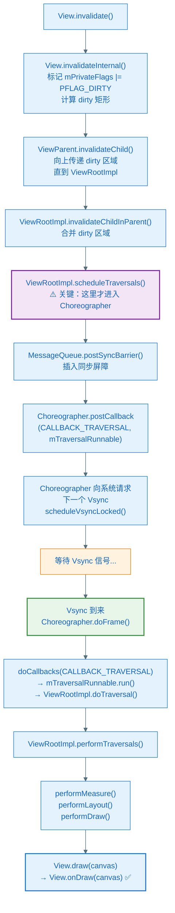

# doFrame 与回调链

> **核心问题**：Vsync 到来后，Choreographer 内部按什么顺序做什么事？`invalidate()` 到 `onDraw()` 的完整链路是什么？

---

## 1. doFrame() 的内部执行顺序

`doFrame(frameTimeNanos, frame)` 是 Choreographer 收到 Vsync 后的入口，内部严格按以下顺序执行：

```
doFrame(frameTimeNanos)
  │
  ├── [0] 跳帧检测
  │     当前时间 - frameTimeNanos > frame_period？
  │     是 → 记录跳过的帧数，打印 log，更新 frameTimeNanos 为当前时间
  │
  ├── [1] doCallbacks(CALLBACK_INPUT, frameTimeNanos)
  │     处理触摸/按键事件
  │     → InputEventReceiver.dispatchInputEvent()
  │
  ├── [2] doCallbacks(CALLBACK_ANIMATION, frameTimeNanos)
  │     推进所有属性动画
  │     → AnimationHandler → ValueAnimator.doAnimationFrame()
  │
  ├── [3] doCallbacks(CALLBACK_INSETS_ANIMATION, frameTimeNanos)
  │     处理软键盘/状态栏插入动画（Android 11+）
  │
  ├── [4] doCallbacks(CALLBACK_TRAVERSAL, frameTimeNanos)
  │     View 树遍历（measure → layout → draw）
  │     → ViewRootImpl.mTraversalRunnable.run()
  │     → ViewRootImpl.doTraversal()
  │
  └── [5] doCallbacks(CALLBACK_COMMIT, frameTimeNanos)
        帧提交后回调，FrameMetrics 在这里收集数据
```

**顺序为什么这样设计？**

- Input 必须最先处理：触摸事件可能改变 View 状态，影响动画目标值和布局
- Animation 在 Traversal 前：动画每帧推进一个值（如 `translationX`），Traversal 时读取这个值绘制，保证动画和绘制在同一帧内对齐
- Traversal 最后：所有状态确定后再 measure/layout/draw，避免重复绘制

---

## 2. 5 类回调的注册方式

### CALLBACK_TRAVERSAL：由 ViewRootImpl 注册

```kotlin
// ViewRootImpl.java
fun scheduleTraversals() {
    if (!mTraversalScheduled) {
        mTraversalScheduled = true
        mTraversalBarrier = mHandler.getLooper().getQueue()
                                    .postSyncBarrier()  // ← 插入同步屏障，阻塞普通消息
        mChoreographer.postCallback(
            Choreographer.CALLBACK_TRAVERSAL,
            mTraversalRunnable,   // ← doTraversal() 的 Runnable
            null
        )
    }
}
```

注意 `postSyncBarrier()`：在消息队列里插入一个**同步屏障**，阻止普通同步消息执行，让 Choreographer 的异步消息（TRAVERSAL 回调）优先被处理。这保证了 Vsync 到来时，绘制工作不会被其他消息延迟。

### CALLBACK_ANIMATION：由 AnimationHandler 注册

```kotlin
// AnimationHandler.java（ValueAnimator 内部）
fun scheduleAnimation() {
    if (!mAnimationScheduled) {
        mChoreographer.postCallback(Choreographer.CALLBACK_ANIMATION, mRunnable, null)
        mAnimationScheduled = true
    }
}
```

每次 `ValueAnimator.start()` 或动画每帧结束后，AnimationHandler 都会向 Choreographer 注册 ANIMATION 回调，等待下一帧继续推进。

### CALLBACK_INPUT：由 InputEventReceiver 注册

触摸事件通过 InputDispatcher（SurfaceFlinger 进程）发给 App，App 收到后注册 INPUT 回调，在下一个 Vsync 帧里统一处理。

### 用户可注册的 FrameCallback（等价于 CALLBACK_ANIMATION）

```kotlin
Choreographer.getInstance().postFrameCallback(object : Choreographer.FrameCallback {
    override fun doFrame(frameTimeNanos: Long) {
        // 在 CALLBACK_ANIMATION 阶段被调用
        // frameTimeNanos：本帧 Vsync 的纳秒时间戳
    }
})
```

`postFrameCallback` 本质是注册一个 `CALLBACK_ANIMATION` 类型的回调。

---

## 3. invalidate() → onDraw() 完整链路

这是你之前问的问题，现在可以给出完整答案：



**协作者与过程说明**

1. **触发**：`View.invalidate()` 标记自己为"脏"，把 dirty 矩形向上传给 ViewRootImpl
2. **scheduleTraversals() 是关键节点**：ViewRootImpl 在这里向 Choreographer 注册 TRAVERSAL 回调；如果已经注册过（`mTraversalScheduled == true`），会直接忽略，避免同一帧内重复注册
3. **同步屏障**：`postSyncBarrier()` 让消息队列优先处理 Choreographer 的异步消息，防止其他消息插队导致绘制延迟
4. **等待 Vsync**：`postCallback` 触发 `scheduleVsync()`，主线程不阻塞，继续处理其他消息（如果有的话），直到 Vsync 回来
5. **doFrame 执行 TRAVERSAL**：Vsync 到来后，doFrame 执行到 CALLBACK_TRAVERSAL，`mTraversalRunnable.run()` 调用 `ViewRootImpl.doTraversal()`，再进入 `performTraversals()`
6. **measure/layout/draw**：`performMeasure`（计算大小）→ `performLayout`（确定位置）→ `performDraw`（触发绘制），最终调用到被标记为 dirty 的 View 的 `onDraw()`
7. **结束**：`mTraversalScheduled` 置为 false，`removeSyncBarrier()` 移除同步屏障，恢复正常消息处理

**关键结论**：`invalidate()` 到 `onDraw()` 至少要等一个 Vsync 周期（最多等两个：刚好错过当前帧时）。`onDraw()` 不是立刻调用的。

---

## 4. requestLayout() 和 invalidate() 的区别

两者都通过 `scheduleTraversals()` 进入 Choreographer，但触发的 `performTraversals()` 行为不同：

| | `invalidate()` | `requestLayout()` |
|--|----------------|-------------------|
| 触发阶段 | 只触发 `performDraw()` | 触发 `performMeasure()` + `performLayout()` + `performDraw()` |
| 使用场景 | 只有内容变了（颜色、图片等） | 大小或位置变了 |
| 性能开销 | 较小 | 较大（需要重新测量布局整棵树） |
| 向上传播 | dirty 区域向上 | layout 请求向上直到根节点 |

---

## 5. 动画帧的调度：Animation 回调的循环

属性动画（`ValueAnimator`/`ObjectAnimator`）的每一帧都通过 Choreographer 驱动：

```
第 N 帧：
  Vsync → doFrame() → CALLBACK_ANIMATION
    → ValueAnimator.doAnimationFrame(frameTimeNanos)
      → 计算当前进度（插值器）
      → 更新属性值（translationX = 150f）
      → 如果动画未结束：再次注册 CALLBACK_ANIMATION（等待下一个 Vsync）
      → 如果属性变化触发了 invalidate：同时注册 CALLBACK_TRAVERSAL

第 N 帧（TRAVERSAL）：
  → performDraw() → onDraw()（用新的 translationX 绘制）
```

这就是为什么属性动画天然和帧率对齐——每帧只推进一步，不会出现跳帧或过度计算。

---

## 6. 帧时间戳 frameTimeNanos 的用法

所有在同一帧内执行的回调，拿到的 `frameTimeNanos` 是**同一个值**（本帧 Vsync 的时间点）。

这保证了一帧内所有动画的时间基准一致：

```kotlin
// ValueAnimator 内部
val fraction = (frameTimeNanos - startTimeNanos) / durationNanos.toFloat()
```

如果用 `System.nanoTime()` 代替 `frameTimeNanos`，同一帧内不同动画可能读到不同的时间，产生视觉上的不一致。

---

## 7. 跳帧检测：Choreographer 怎么知道掉帧了

`doFrame()` 的第一步就是跳帧检测：

```java
// Choreographer.java（简化）
val intendedFrameTimeNanos = frameTimeNanos
val startNanos = System.nanoTime()
val jitterNanos = startNanos - frameTimeNanos

if (jitterNanos >= mFrameIntervalNanos) {
    val skippedFrames = (jitterNanos / mFrameIntervalNanos).toLong()
    if (skippedFrames >= SKIPPED_FRAME_WARNING_LIMIT) {  // 默认 30 帧
        Log.i(TAG, "Skipped $skippedFrames frames! "
            + "The application may be doing too much work on its main thread.")
    }
    // 更新 frameTimeNanos 为最近的 Vsync 时间点
    frameTimeNanos = startNanos - (jitterNanos % mFrameIntervalNanos)
}
```

**`jitterNanos = 当前时间 - Vsync 预期时间`**

如果 `jitterNanos > 16.67ms`，说明主线程从 Vsync 到来到执行 `doFrame()` 之间被阻塞了超过一帧，跳过了若干帧。

这就是 Logcat 里经常看到的：
```
Skipped 35 frames! The application may be doing too much work on its main thread.
```

---

## 8. 小结

| 概念 | 关键结论 |
|------|---------|
| doFrame() 顺序 | INPUT → ANIMATION → INSETS_ANIMATION → TRAVERSAL → COMMIT |
| invalidate() 的本质 | 向 Choreographer 注册 TRAVERSAL 回调，等下一个 Vsync 才执行 onDraw |
| scheduleTraversals() | 同时插入同步屏障，保证绘制优先 |
| requestLayout() vs invalidate() | 前者触发完整 measure/layout/draw，后者只触发 draw |
| 动画每帧调度 | 每帧结束时重新注册 ANIMATION 回调，天然与 Vsync 对齐 |
| 跳帧检测 | doFrame() 开头比较当前时间与 frameTimeNanos，差距超过一帧则记录跳帧 |

下一章：**如何用 Choreographer 实现帧率监控、如何用 Perfetto 定位卡顿、以及常见卡顿的原因与解决方案。**
