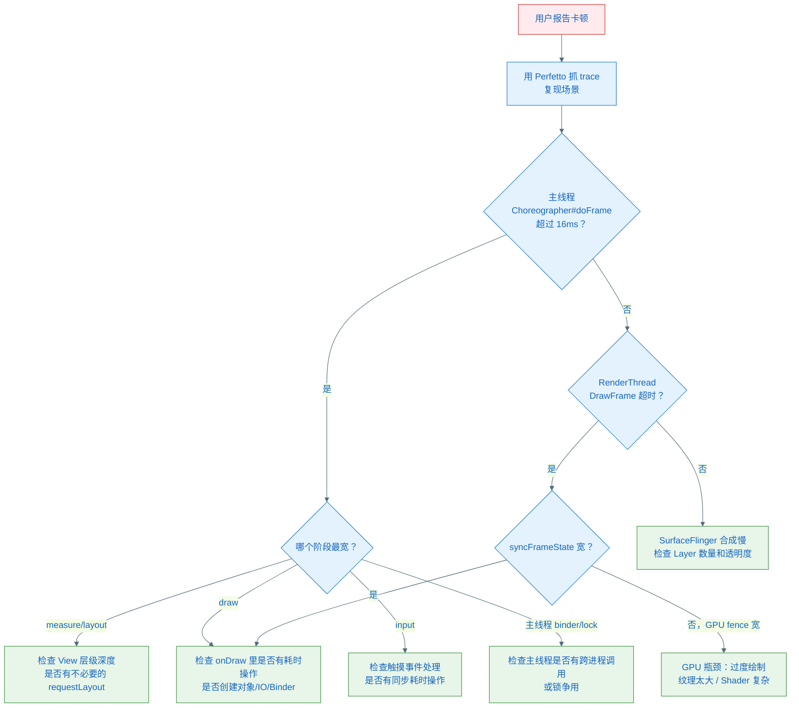

# 帧率监控与卡顿分析

> **目标**：能自己实现帧率监控工具；能在 Perfetto 里看懂帧调度 trace；能根据 trace 定位卡顿原因并给出解决方案。

---

## 1. 用 Choreographer 实现帧率监控

### 1.1 基本原理

`postFrameCallback` 在每一帧的 `CALLBACK_ANIMATION` 阶段被调用，携带本帧的 `frameTimeNanos`。用相邻两帧的时间差，可以计算瞬时帧率和跳帧数：

```kotlin
class FrameMonitor {

    private var lastFrameTimeNanos = 0L
    private var isRunning = false

    private val frameCallback = object : Choreographer.FrameCallback {
        override fun doFrame(frameTimeNanos: Long) {
            if (!isRunning) return

            if (lastFrameTimeNanos != 0L) {
                val elapsedNanos = frameTimeNanos - lastFrameTimeNanos
                val elapsedMs = elapsedNanos / 1_000_000f

                // 计算跳帧数（比预期多用了几个 Vsync 周期）
                val frameIntervalNanos = Choreographer.getInstance().frameIntervalNanos
                val droppedFrames = (elapsedNanos / frameIntervalNanos).toInt() - 1

                // 计算瞬时帧率
                val fps = 1_000_000_000f / elapsedNanos

                onFrameStats(fps, droppedFrames, elapsedMs)
            }

            lastFrameTimeNanos = frameTimeNanos
            // 重新注册，监听下一帧
            Choreographer.getInstance().postFrameCallback(this)
        }
    }

    fun start() {
        isRunning = true
        lastFrameTimeNanos = 0L
        Choreographer.getInstance().postFrameCallback(frameCallback)
    }

    fun stop() {
        isRunning = false
        Choreographer.getInstance().removeFrameCallback(frameCallback)
    }

    // 子类重写此方法处理数据
    open fun onFrameStats(fps: Float, droppedFrames: Int, elapsedMs: Float) {
        if (droppedFrames > 0) {
            Log.w("FrameMonitor", "掉帧 $droppedFrames 帧，耗时 ${elapsedMs}ms，FPS=$fps")
        }
    }
}
```

### 1.2 获取 frameIntervalNanos

```kotlin
// API 33+ 可以直接获取
val interval = Choreographer.getInstance().frameIntervalNanos  // 单位纳秒

// 旧版通过反射获取
val field = Choreographer::class.java.getDeclaredField("mFrameIntervalNanos")
field.isAccessible = true
val intervalNanos = field.getLong(Choreographer.getInstance())
```

### 1.3 精度说明

这个方案的**局限**：

- 只能监控 ANIMATION 阶段到下一帧 ANIMATION 阶段的时间，包含了 TRAVERSAL 和 RenderThread 的耗时
- 如果 RenderThread 慢（GPU 瓶颈），此方案**感知不到**（主线程时间正常，但实际帧延迟）
- 要监控完整帧耗时，需要结合 `FrameMetrics`

### 1.4 更准确：FrameMetrics API（API 24+）

```kotlin
// 在 Activity 里注册
window.addOnFrameMetricsAvailableListener(
    { window, frameMetrics, dropCountSinceLastInvocation ->
        val totalDuration = frameMetrics.getMetric(FrameMetrics.TOTAL_DURATION)
        val inputDuration = frameMetrics.getMetric(FrameMetrics.INPUT_HANDLING_DURATION)
        val animDuration = frameMetrics.getMetric(FrameMetrics.ANIMATION_DURATION)
        val layoutDuration = frameMetrics.getMetric(FrameMetrics.LAYOUT_MEASURE_DURATION)
        val drawDuration = frameMetrics.getMetric(FrameMetrics.DRAW_DURATION)
        val gpuDuration = frameMetrics.getMetric(FrameMetrics.GPU_DURATION)
        // 单位：纳秒
    },
    Handler(Looper.getMainLooper())
)
```

`FrameMetrics` 能区分每帧各阶段的耗时，比 Choreographer 回调更准确，包含 GPU 时间。

---

## 2. Perfetto：图形 trace 的读法

### 2.1 抓取方式

```bash
# 方式 1：Android Studio Profiler（推荐新手）
# CPU Profiler → System Trace → Record

# 方式 2：命令行
adb shell perfetto \
  -c - --txt \
  -o /data/misc/perfetto-traces/trace.pftrace \
  <<EOF
buffers: { size_kb: 63488 fill_policy: RING_BUFFER }
data_sources: { config { name: "linux.ftrace"
  ftrace_config {
    ftrace_events: "sched/sched_switch"
    ftrace_events: "view/view_invalidate"
    atrace_categories: "gfx"
    atrace_categories: "view"
    atrace_categories: "wm"
  }
}}
duration_ms: 5000
EOF
```

### 2.2 关键 Track 说明

打开 trace 后，找到你的 App 进程，关注以下 Track：

```
App 进程 (com.example.myapp)
│
├── 主线程 (main)                   ← 最重要
│   ├── Choreographer#doFrame       ← 一帧的起点
│   │   ├── input                  ← INPUT 阶段耗时
│   │   ├── animation              ← ANIMATION 阶段耗时
│   │   └── traversal              ← TRAVERSAL 阶段耗时
│   │       ├── measure
│   │       ├── layout
│   │       └── draw
│   └── ...
│
├── RenderThread                    ← GPU 渲染耗时
│   ├── DrawFrame                  ← RenderThread 一帧的工作
│   │   ├── syncFrameState         ← 等待主线程同步
│   │   ├── ...OpenGL commands...  ← GPU 指令提交
│   │   └── eglSwapBuffers         ← 提交给 SurfaceFlinger
│   └── ...
│
SurfaceFlinger 进程
│
└── SF 主线程
    └── onMessageReceived          ← SurfaceFlinger 合成耗时
```

### 2.3 如何判断是哪个阶段导致掉帧

**Step 1**：找到掉帧的帧——相邻两个 `Choreographer#doFrame` 之间的间距超过 16.67ms（或 8.33ms for 120Hz）

**Step 2**：看主线程的 `Choreographer#doFrame` slice 宽度
- 正常：< 16ms（60Hz）
- 异常：> 16ms → 主线程超时，看是哪个子阶段（input/animation/traversal/draw）宽

**Step 3**：如果主线程正常，看 RenderThread 的 `DrawFrame`
- `syncFrameState` 很宽 → 等主线程释放（主线程还没完成 draw）
- `eglSwapBuffers` 很宽 → GPU 压力大，等 GPU 完成
- 整体 `DrawFrame` 很宽 → RenderThread 工作量大（DisplayList 复杂）

**Step 4**：对照 Vsync 信号的竖线，看 SurfaceFlinger 合成是否及时

```
正常帧（16ms 内完成）：
 ──[Vsync]──────────────────────[Vsync]──
    │ doFrame(16ms以内) │
                        │DrawFrame │

掉帧（主线程超时）：
 ──[Vsync]──────────────────────[Vsync]──────────────────[Vsync]──
    │ doFrame(超过16ms) ─────────────────────────│
                                                  │DrawFrame│
                                                  （错过了这个Vsync，下一个才合成）
```

### 2.4 常见 trace 特征与原因

| Trace 特征 | 原因 | 解决方向 |
|-----------|------|---------|
| `measure` 很宽 | View 层级深、RelativeLayout 嵌套多 | 减少层级，用 ConstraintLayout |
| `layout` 很宽 | requestLayout 触发了过多上层重新布局 | 精确调用 requestLayout，检查是否有不必要的传播 |
| `draw` 很宽 | onDraw 里有耗时操作（文件 IO、创建对象） | 把耗时操作移到 onDraw 外，复用对象 |
| `DrawFrame` 宽但主线程正常 | GPU 压力大，过度绘制 | 减少透明 Layer，启用 GPU 过度绘制调试 |
| `syncFrameState` 很宽 | 主线程 draw 太慢，RenderThread 等待 | 优化主线程 onDraw |
| `input` 异常宽 | 触摸事件处理里有耗时操作 | 将触摸处理逻辑异步化 |
| 主线程有大段 `binder transaction` | 主线程做了跨进程调用（如读取 ContentProvider） | 将 Binder 调用移到工作线程 |
| 主线程有 `monitor contention` | 锁争用，主线程等待某个锁 | 检查同步代码，减少主线程持锁时间 |

---

## 3. 卡顿（Jank）完整分析框架

### 3.1 卡顿的本质

一帧的完整时间预算（60Hz）= 16.67ms，分配如下：

```
主线程工作：
  Input 处理      < 1ms（正常情况）
  Animation 计算  < 1ms（简单动画）
  Measure         2~4ms（中等布局）
  Layout          1~2ms
  Draw（录制DL）  2~3ms

RenderThread 工作：
  syncFrameState  < 0.5ms
  GPU 渲染        3~6ms
  eglSwapBuffers  < 1ms

SurfaceFlinger 合成：2~4ms
```

任一阶段超出预算，就可能掉帧。

### 3.2 常见卡顿原因与解决方案

#### 类型 1：onDraw() 里有耗时操作

```kotlin
// ❌ 错误：每次 onDraw 都创建对象
override fun onDraw(canvas: Canvas) {
    val paint = Paint()          // 每帧都分配内存，触发 GC
    val path = Path()
    path.addCircle(cx, cy, r, Path.Direction.CW)
    canvas.drawPath(path, paint)
}

// ✅ 正确：在构造函数或 init 里创建，onDraw 里复用
private val paint = Paint().apply { color = Color.RED; isAntiAlias = true }
private val path = Path()

override fun onDraw(canvas: Canvas) {
    path.reset()
    path.addCircle(cx, cy, r, Path.Direction.CW)
    canvas.drawPath(path, paint)
}
```

#### 类型 2：不必要的全量重绘

```kotlin
// ❌ 错误：invalidate() 触发整个 View 重绘
fun updateProgress(progress: Float) {
    this.progress = progress
    invalidate()  // 全量重绘，包括不变的背景
}

// ✅ 正确：只重绘进度条部分
fun updateProgress(progress: Float) {
    val oldRight = progressBar.right
    this.progress = progress
    val newRight = (width * progress).toInt()
    // 只 invalidate 变化的区域
    invalidate(oldRight.coerceAtMost(newRight), 0, oldRight.coerceAtLeast(newRight), height)
}
```

#### 类型 3：View 层级过深（measure/layout 慢）

```
症状：Perfetto 里 measure/layout 耗时 5ms+
原因：多层 LinearLayout 嵌套，measure 多次遍历
解法：用 ConstraintLayout 替代多层嵌套；使用 ViewStub 延迟加载
```

#### 类型 4：主线程做了 IO/网络/Binder 调用

```kotlin
// ❌ 主线程里做文件读取
override fun onResume() {
    val config = File(cacheDir, "config.json").readText()  // IO 阻塞主线程
    updateUI(config)
}

// ✅ 异步读取，结果回到主线程更新 UI
lifecycleScope.launch(Dispatchers.IO) {
    val config = File(cacheDir, "config.json").readText()
    withContext(Dispatchers.Main) { updateUI(config) }
}
```

#### 类型 5：过度绘制（Overdraw）

过度绘制 = 同一个像素在一帧里被画了多次（被上层 View 完全覆盖的下层 View 仍在绘制）。

```
检测方式：开发者选项 → 调试 GPU 过度绘制
颜色含义：
  无色 = 1x（正常）
  蓝色 = 2x（可接受）
  绿色 = 3x（需注意）
  粉色 = 4x（需优化）
  红色 = 5x+（严重问题）
```

解决：
- 移除不可见的背景（`android:background="@null"`）
- 使用 `canvas.clipRect()` 裁剪不需要绘制的区域
- 减少透明 View 叠加层数

#### 类型 6：动画在主线程执行属性以外的逻辑

```kotlin
// ❌ 属性动画的更新监听里有耗时操作
animator.addUpdateListener {
    val value = it.animatedValue as Float
    heavyComputation(value)  // 每帧都执行耗时计算
    view.translationX = value
}

// ✅ 只修改属性，计算移到其他地方
animator.addUpdateListener {
    view.translationX = it.animatedValue as Float
}
```

---

## 4. 诊断卡顿的标准流程



---

## 5. 快速检查清单

遇到卡顿时，按以下顺序快速排查：

- [ ] `onDraw()` 里有没有 `new Paint()`、`new Bitmap()`、`new Path()`？
- [ ] `onDraw()` 里有没有文件 IO、网络、数据库操作？
- [ ] `invalidate()` 是否总是全量重绘？能不能只 invalidate 变化区域？
- [ ] 动画的 `updateListener` 里有没有耗时操作？
- [ ] View 层级是否超过 5 层？RelativeLayout 有没有多层嵌套？
- [ ] 主线程有没有执行 Binder 跨进程调用（如 `ContentProvider.query()`）？
- [ ] 是否有多个透明 View 叠加？背景是否都有必要？
- [ ] 列表 Item 是否过于复杂（嵌套 RecyclerView / 多层 include）？
