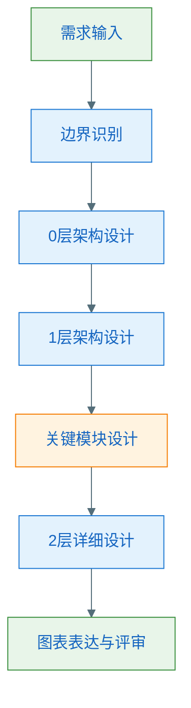
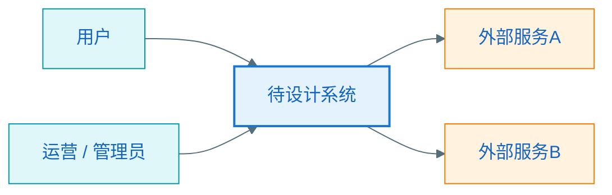
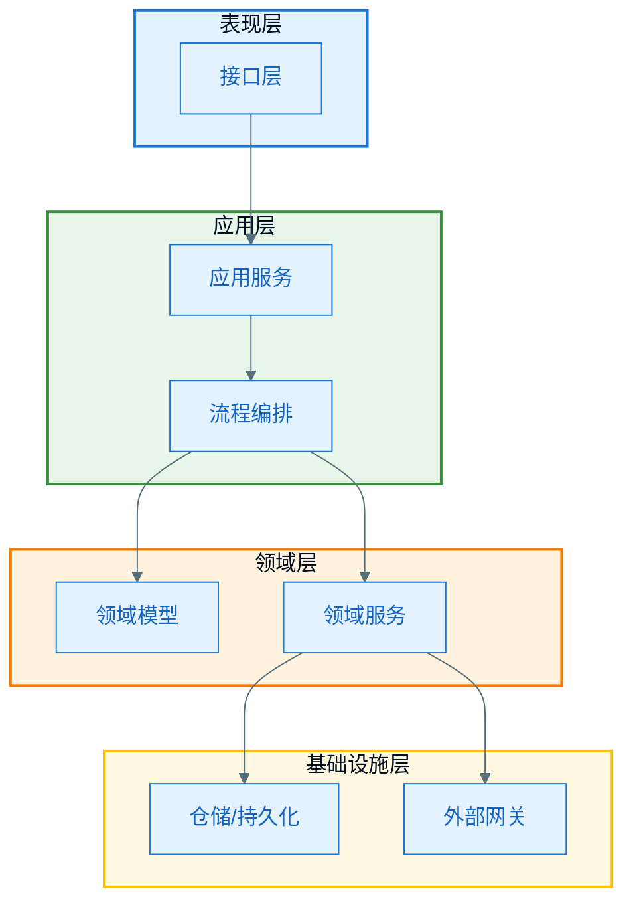

# 从需求到架构设计｜分层架构与设计视角

## 1. 为什么一定要分层看设计

如果没有分层视角，最常见的问题是把所有事情混在一起讨论：

- 系统和谁交互
- 内部有哪些模块
- 一个接口怎么实现
- 某个类怎么命名

这些问题并不在同一层。  
`0` 层、`1` 层、`2` 层设计的价值，就在于把不同问题放到不同层次处理。

## 2. 三层设计分别在回答什么问题

### `0` 层架构设计

回答：

- 系统在更大环境里的位置是什么
- 系统与哪些角色、外部系统交互
- 系统边界在哪里
- 核心输入输出是什么

### `1` 层架构设计

回答：

- 系统内部应该如何分层、分模块
- 每个模块负责什么
- 模块之间如何协作
- 数据流和调用流如何流动

### `2` 层详细设计

回答：

- 关键模块内部有哪些对象和接口
- 主流程和异常流程如何协作
- 数据结构和状态如何组织
- 如何落到可实现的设计粒度

## 3. 三层设计之间的关系

最容易犯的错，是把三层设计当成三张互不相关的图。  
实际上，它们之间应该有明确推导关系：

## 4. `0` 层架构设计怎么想

### 核心关注点

- 这是一个什么系统
- 系统服务谁
- 它依赖谁
- 业务边界在哪里

### 常见产物

- 系统上下文图
- 外部依赖表
- 边界说明

### 画图时要克制

`0` 层不要画太多内部模块，否则就变成 `1` 层了。

### 一张典型 `0` 层图

## 5. `1` 层架构设计怎么想

### 核心关注点

- 系统内部有哪些大模块
- 每个模块负责什么
- 哪些模块相互依赖
- 调用方向和依赖方向是否清晰

### 常见产物

- 分层图
- 模块图
- 模块职责表

### 一个典型 `1` 层图

## 6. `2` 层详细设计怎么想

### 核心关注点

- 类和接口如何划分职责
- 谁发起，谁编排，谁执行业务规则
- 持久化和外部依赖如何隔离
- 正常流程和异常流程如何处理

### 常见产物

- 类图
- 时序图
- 流程图
- 数据结构说明

### 判断是否该进入 `2` 层

出现以下情况时就应该继续下钻：

- 模块职责已经确定
- 主流程已经明确
- 存在实现风险或复杂规则
- 需要和研发、测试详细对齐

## 7. 三层设计最容易混淆的地方

### 把 `0` 层当成 `1` 层

如果上下文图里已经出现很多内部模块，说明过早进入系统内部设计了。

### 把 `1` 层当成 `2` 层

如果模块图里已经塞满具体类、接口和方法，说明粒度太细了。

### 直接从需求跳到 `2` 层

这会导致对象设计脱离系统边界和模块职责。

## 8. 一张对比表

| 层次 | 核心问题 | 典型产物 | 关注对象 |
|------|----------|----------|----------|
| `0` 层 | 系统在整体环境中的位置 | 上下文图、边界说明 | 用户、外部系统、系统边界 |
| `1` 层 | 系统内部如何分工 | 分层图、模块图、职责表 | 模块、层次、数据流 |
| `2` 层 | 关键模块如何落地实现 | 类图、时序图、流程图 | 类、接口、协作、异常 |

## 9. 本章小结

本章最重要的结论是：

- `0` 层看外部位置
- `1` 层看内部结构
- `2` 层看实现协作

只有先把上层问题想清楚，下层设计才不会漂。
