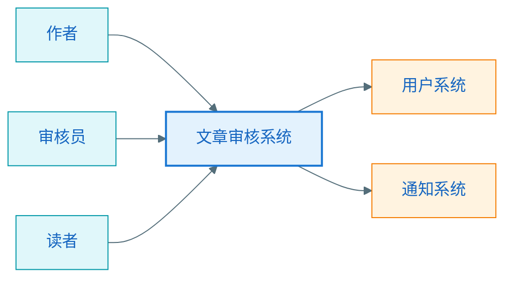
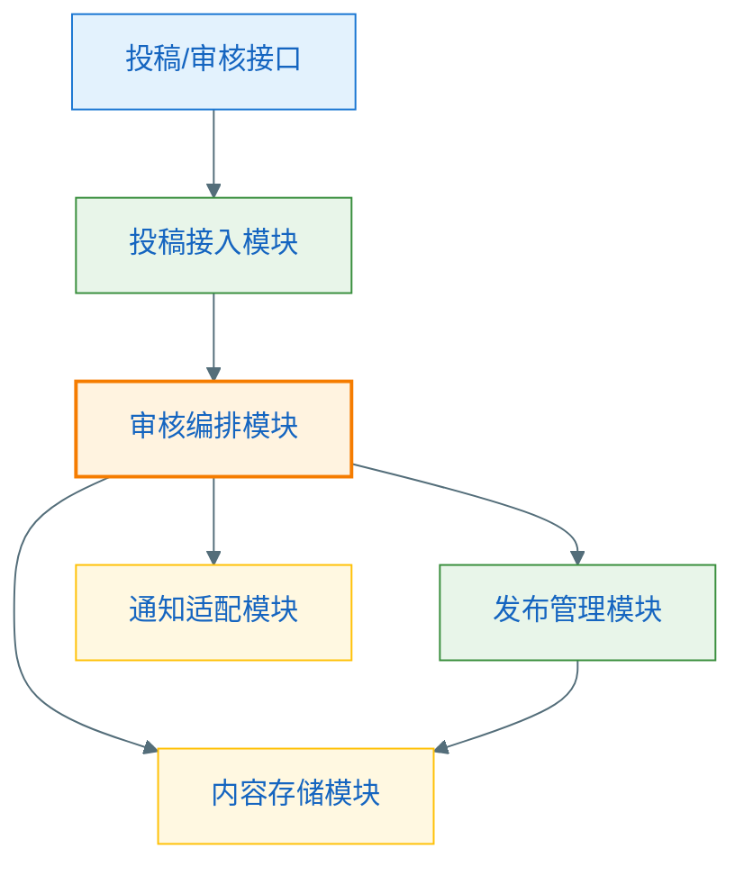
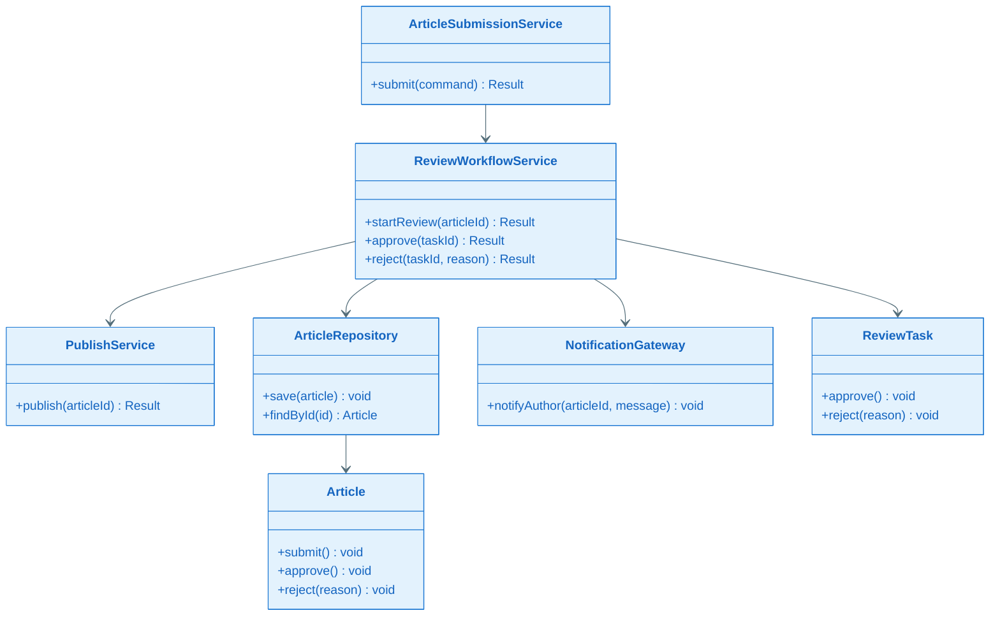
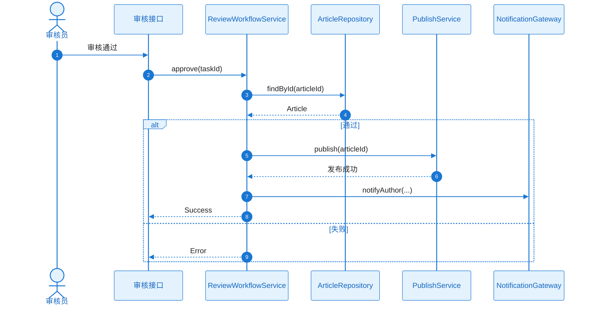

# 从需求到架构设计｜关键设计方法与案例

## 1. 关键设计方法

### 1.1 从需求抽取“设计关注点”

不要把需求原文直接等同于设计输入。  
更好的做法是从需求里抽取下面这些设计关注点：

- 核心业务流程
- 关键参与角色
- 状态流转
- 外部依赖
- 风险点
- 高变化点

### 1.2 用“职责”而不是“技术栈”拆模块

模块划分优先按照职责、变化和边界，而不是先按技术名词拆：

- 好的拆法：审核编排、内容存储、通知网关
- 弱的拆法：Controller 模块、Service 模块、Utils 模块

### 1.3 用“编排”和“规则”分离复杂度

对于复杂业务流程，经常要区分：

- 谁负责编排流程
- 谁负责承载业务规则

否则一个对象容易同时承担：

- 接口适配
- 流程控制
- 规则判断
- 数据存储
- 外部调用

最终变成巨型服务类。

### 1.4 用“重点下钻”控制设计深度

不是每个模块都要画类图和时序图。  
优先对以下模块下钻：

- 业务规则密集
- 状态流转复杂
- 外部依赖多
- 性能风险高
- 容易发生错误

## 2. 一个完整案例：文章发布与审核系统

下面用一个“文章发布与审核系统”的案例，演示这条链路如何工作。

## 3. 第一步：需求输入

需求描述可以简化为：

- 作者可以提交文章
- 审核员可以审核文章
- 审核通过后文章才对读者可见
- 审核失败可以退回修改
- 后续希望支持自动审核能力

把它转成设计输入：

| 项目 | 内容 |
|------|------|
| 目标 | 建立投稿、审核、发布的闭环 |
| 用户 | 作者、审核员、读者 |
| 输入 | 文章内容、审核动作 |
| 输出 | 发布结果、审核结果、通知 |
| 约束 | 状态清晰、支持扩展自动审核 |
| 非目标 | 当前不做推荐系统和内容分发优化 |

## 4. 第二步：边界识别

识别后得到：

- 本系统负责：投稿、审核编排、发布状态管理
- 外部系统负责：通知发送、用户体系
- 核心域：文章和审核流程
- 支撑域：通知与持久化

## 5. 第三步：推到 `0` 层架构

此时回答的是“系统在世界中的位置”。

## 6. 第四步：推到 `1` 层架构

现在开始思考系统内部如何分工：

- 投稿接入
- 审核编排
- 内容存储
- 发布管理
- 通知适配

## 7. 第五步：识别关键模块

在这个案例里，最值得深入的是“审核编排模块”，因为它：

- 状态流转复杂
- 需要连接投稿、发布、通知
- 未来要兼容自动审核
- 容易成为系统复杂度中心

所以它是关键模块。

## 8. 第六步：进入 `2` 层详细设计

可以抽出这些核心对象：

- `ArticleSubmissionService`
- `ReviewWorkflowService`
- `PublishService`
- `ArticleRepository`
- `NotificationGateway`
- `Article`
- `ReviewTask`

### 一个简化类图

### 一个简化时序图

## 9. 从案例里总结出来的方法

这个案例说明了一件事：

- 不是先想类，而是先想边界
- 不是先想接口，而是先想主流程
- 不是先画细图，而是先确定关键模块

所以真正的方法不是“画图技巧”，而是“推导顺序”。

## 10. 本章小结

本章最值得记住的是：

- 好的架构设计，是从需求一步步推出来的
- `0` 层、`1` 层、`2` 层之间必须有明确递进关系
- 关键模块是设计深度控制的核心抓手
