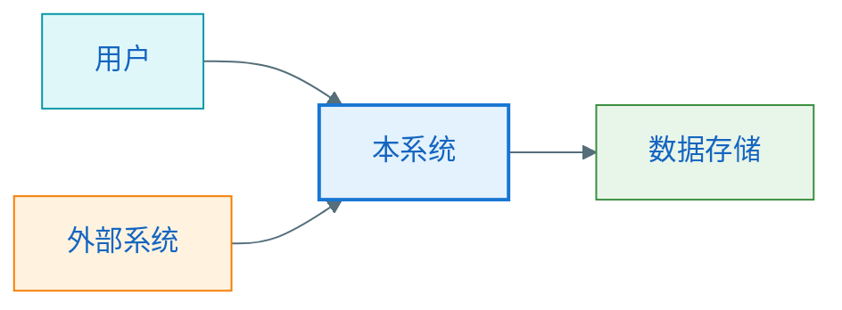

# 从需求到架构设计

## 1. 一句话理解

从需求到架构设计，不是直接开始画图，而是先把需求转成“问题、边界、协作、权衡”，再逐层推导出 `0` 层架构、`1` 层架构、关键模块设计和 `2` 层详细设计。

## 2. 这个设计主题为什么重要

很多人会画图，但不知道为什么这样画，也不知道图和需求之间如何建立因果关系。真正的架构设计能力，不是会套模板，而是能从需求出发，逐步推导出合理的系统边界、模块职责、对象协作和实现约束。

如果这条链路不清楚，就很容易出现这些问题：

- 直接跳到分层图，导致边界是拍脑袋划分的
- 模块很多，但职责不清，后续实现互相穿透
- 类图和时序图只是画出来好看，无法支撑真实实现
- 架构看起来很“高级”，但并不解决当前需求中的核心矛盾

## 3. 背景与历史演进

早期很多系统体量较小，需求也相对简单，开发者常常直接从代码结构出发组织实现。但随着业务复杂度增加，系统需要面对：

- 更多参与角色
- 更复杂的上下游依赖
- 更高的可扩展性与可维护性要求
- 更频繁的需求变更

于是，架构设计逐渐演化为一套分层思考方法：

- 先看系统在业务环境中的位置
- 再看系统内部如何分工
- 再深入关键模块的职责和协作
- 最后落到对象、接口、流程和异常处理

这也是为什么今天常见的软件设计会分成 `0` 层架构、`1` 层架构、`2` 层详细设计，以及配套的类图、时序图和流程图。

## 4. 它解决的核心问题

这个主题主要解决四个问题：

1. 拿到需求后，应该先想什么，后想什么
2. 怎样从业务问题推到系统边界和模块划分
3. 怎样把架构设计逐步落到关键模块和详细设计
4. 怎样用图表和文档把思考结果表达清楚

## 5. 核心概念与方法

### 5.1 总体设计链路

建议固定使用下面这条设计链路：

1. 需求输入与问题澄清
2. 业务边界与系统边界识别
3. `0` 层架构设计
4. `1` 层架构设计
5. 关键模块设计
6. `2` 层详细设计
7. 图表表达与设计文档化
8. 评审、收敛与迭代

### 5.2 第一步：需求输入与问题澄清

这一步不要急着画图，而是先把需求转换成设计输入。

必须回答：

- 这个需求真正要解决什么问题
- 用户是谁，核心场景是什么
- 输入是什么，输出是什么
- 成功标准是什么
- 有哪些约束条件
- 哪些内容不在本次设计范围内

建议形成一页“设计输入”：

```markdown
## 设计输入
- 需求目标
- 用户与场景
- 输入输出
- 约束条件
- 成功指标
- 非目标
```

### 5.3 第二步：业务边界与系统边界识别

这一步的目标，是把产品语言翻译成架构语言。

重点识别：

- 系统自己负责什么
- 外部系统负责什么
- 哪些能力属于核心域
- 哪些能力属于支撑域
- 哪些问题本次解决，哪些问题暂不解决

这一步做不好，后面的分层和模块都会变形。

### 5.4 第三步：0 层架构设计

`0` 层架构关注的是系统在更大业务环境中的位置。

它主要回答：

- 系统和谁交互
- 它在整体业务环境中的位置
- 系统边界在哪里
- 外部依赖有哪些
- 核心输入输出和主业务流是什么

这一步常见产物：

- 系统上下文图
- 系统边界说明
- 外部依赖表
- 核心业务流概览

一个简单的上下文图示意：



### 5.5 第四步：1 层架构设计

`1` 层架构关注系统内部的大模块和分层。

它主要回答：

- 系统内部有哪些核心模块
- 每个模块的职责是什么
- 模块之间如何协作
- 数据流和调用流如何流动
- 哪些模块变化频繁，需要隔离

常见产物：

- 分层图
- 模块图
- 模块职责表
- 数据流或调用流概览

### 5.6 第五步：关键模块设计

并不是所有模块都要同样细。关键模块通常是：

- 高复杂度模块
- 高风险模块
- 高价值模块
- 变化频繁模块
- 容易出错的模块

对关键模块，需要继续明确：

- 模块职责
- 输入输出
- 内部状态
- 对外接口
- 依赖关系
- 扩展点
- 异常处理

### 5.7 第六步：2 层详细设计

`2` 层详细设计开始进入对象和协作层面。

常见内容包括：

- 类图
- 时序图
- 流程图
- 接口定义
- 数据结构
- 错误处理
- 状态机

这一层要回答的问题是：

- 核心对象如何划分职责
- 请求主链路如何流转
- 异常路径怎么处理
- 数据结构是否支撑业务
- 是否便于扩展和维护

### 5.8 第七步：图表表达与设计文档化

图表不是起点，而是思考结果的结构化表达。

常见图表对应的问题：

- 上下文图：系统在大盘子里的位置
- 分层图 / 模块图：系统内部如何分工
- 类图：静态结构如何组织
- 时序图：动态调用链如何协作
- 流程图：业务判断和分支如何流转

### 5.9 第八步：评审、收敛与迭代

设计不是画完图就结束，还要回到问题本身审视：

- 是否真的解决了核心问题
- 是否职责清晰、边界清晰
- 是否存在过度设计
- 是否兼顾实现成本与收益
- 是否满足性能、稳定性、扩展性等质量属性

## 6. 一个典型案例

假设需求是“为一个内容平台设计文章发布与审核系统”。

### 从需求开始

- 用户：作者、审核员、读者
- 核心目标：让作者提交文章，审核通过后对读者可见
- 约束：需要支持审核状态、退回修改、后续扩展自动审核

### 推到 0 层

识别出：

- 用户系统
- 内容管理系统
- 审核系统
- 通知系统

### 推到 1 层

内容管理系统内部可以拆成：

- 投稿接入模块
- 审核编排模块
- 内容存储模块
- 通知模块

### 推到关键模块设计

审核编排模块是关键模块，因为它承担：

- 状态流转
- 人工审核与后续自动审核衔接
- 退回与重新提交

### 推到 2 层详细设计

可以继续抽出：

- `ArticleSubmissionService`
- `ReviewWorkflowService`
- `ArticleRepository`
- `NotificationGateway`
- `Article`
- `ReviewTask`

然后再为“提交文章”和“审核通过”画时序图和流程图。

## 7. 与相近方法的区别

### 和“直接画模块图”的区别

这个方法不是先画一个模块图，而是先从需求推导出边界、职责和协作，再决定模块如何存在。

### 和“只学 DDD”的区别

DDD 更偏领域建模和边界上下文，而这里讲的是更完整的架构设计递进链路。DDD 是其中一个重要方法，但不是全部。

### 和“只做详细设计”的区别

如果没有 `0` 层和 `1` 层设计，详细设计很容易变成局部最优、整体失真。

## 8. 常见误区与边界

### 常见误区

- 一拿到需求就开始画类图
- 直接套分层模板，不先理解系统边界
- 把 `0` 层、`1` 层、`2` 层混在一起
- 图很多，但每张图没有明确回答一个问题
- 过早进入实现细节，忽略质量属性和权衡

### 适用边界

这条方法适用于中大型业务系统、复杂模块设计、架构评审准备和设计能力训练。  
对于非常简单的小功能，不一定需要完整走完所有层次，但“先问题、再边界、再协作”的顺序仍然值得保留。

## 9. 5 个自测题

1. 为什么拿到需求后不应该直接画类图？
2. `0` 层架构设计和 `1` 层架构设计最核心的区别是什么？
3. 为什么不是每个模块都需要做同样深度的设计？
4. 类图、时序图、流程图分别更适合回答什么问题？
5. 为什么说图表只是思考结果的表达，而不是设计的起点？

## 10. 下一步建议

建议继续按下面顺序深入：

1. `0层架构设计`
2. `1层架构设计`
3. `关键模块设计`
4. `2层详细设计`
5. `DDD`
6. `架构评审与设计权衡`

适合立刻实践的 3 个小练习：

1. 随便拿一个你熟悉的需求，先只做“设计输入”与“边界识别”。
2. 为这个需求画一张 `0` 层上下文图和一张 `1` 层模块图。
3. 从中挑一个关键模块，继续补一张类图和一张时序图。
