# Mermaid 高级配色方案

> 四套精心设计的配色方案，涵盖莫兰迪风格与 Material Design，满足不同场景需求。

---

## 配色方案速览

| 方案 | 风格 | 适用场景 |
|------|------|----------|
| **莫兰迪灰粉系** | 优雅柔和、高级感 | 正式文档、商业报告 |
| **清新薄荷系** | 清爽自然、舒适 | 技术文档、教程 |
| **奶茶暖调系** | 温暖治愈、精致 | 产品设计、用户手册 |
| **Material Design** | 鲜明现代、专业 | 技术架构、开发文档 |

---

# 方案一：莫兰迪灰粉系

> 低饱和度的灰粉、灰蓝、灰绿，营造优雅高级的视觉感受。

## 🎨 色板

| 用途 | 颜色 | 色值 |
|------|------|------|
| 主色（灰粉） |  | `#d4c4bc` |
| 辅色1（灰蓝） |  | `#b8c5d6` |
| 辅色2（灰绿） |  | `#c2cfc2` |
| 辅色3（灰紫） |  | `#c9c0d3` |
| 辅色4（灰杏） |  | `#ddd0c8` |
| 边框深色 |  | `#8b7d74` |
| 文字色 |  | `#5d5348` |
| 背景色 |  | `#f8f6f4` |

---

### 1.1 架构图 - 莫兰迪灰粉系

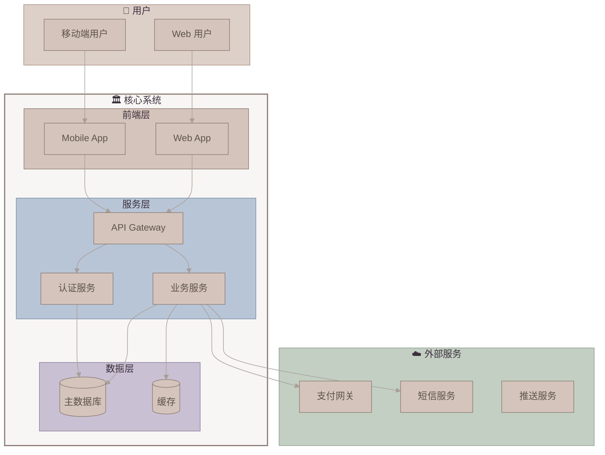
```mermaid
%%{init: {'theme': 'base', 'themeVariables': { 'primaryColor': '#d4c4bc', 'primaryTextColor': '#5d5348', 'primaryBorderColor': '#8b7d74', 'lineColor': '#a89f97', 'secondaryColor': '#b8c5d6', 'tertiaryColor': '#c2cfc2', 'background': '#f8f6f4', 'mainBkg': '#d4c4bc', 'nodeBorder': '#8b7d74'}}}%%
flowchart TB
    subgraph External["☁️ 外部服务"]
        direction TB
        PaymentGW["支付网关"]
        SMS["短信服务"]
        Push["推送服务"]
    end

    subgraph Users["👥 用户"]
        direction TB
        Mobile["移动端用户"]
        Web["Web 用户"]
    end

    subgraph System["🏛️ 核心系统"]
        direction TB
        
        subgraph Frontend["前端层"]
            App["Mobile App"]
            WebApp["Web App"]
        end
        
        subgraph Backend["服务层"]
            Gateway["API Gateway"]
            Auth["认证服务"]
            Business["业务服务"]
        end
        
        subgraph Data["数据层"]
            DB[("主数据库")]
            Cache[("缓存")]
        end
    end

    Mobile --> App
    Web --> WebApp
    App --> Gateway
    WebApp --> Gateway
    Gateway --> Auth
    Gateway --> Business
    Auth --> DB
    Business --> DB
    Business --> Cache
    Business --> PaymentGW
    Business --> SMS

    style System fill:#f8f6f4,stroke:#8b7d74,stroke-width:2px
    style Frontend fill:#d4c4bc,stroke:#8b7d74
    style Backend fill:#b8c5d6,stroke:#7a8fa3
    style Data fill:#c9c0d3,stroke:#8b7d9c
    style External fill:#c2cfc2,stroke:#8a9c8a
    style Users fill:#ddd0c8,stroke:#a89080
```

---

### 1.2 类图 - 莫兰迪灰粉系

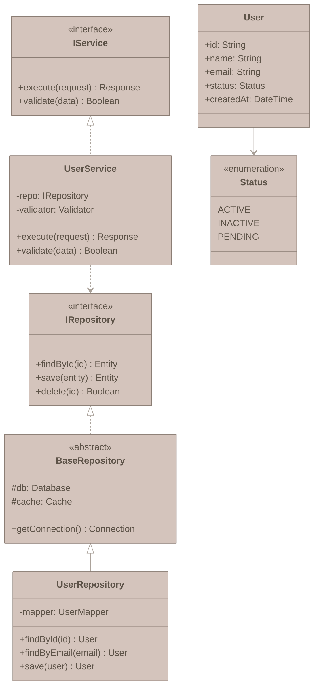
```mermaid
%%{init: {'theme': 'base', 'themeVariables': { 'primaryColor': '#d4c4bc', 'primaryTextColor': '#5d5348', 'primaryBorderColor': '#8b7d74', 'lineColor': '#a89f97'}}}%%
classDiagram
    direction TB

    class IRepository {
        <<interface>>
        +findById(id) Entity
        +save(entity) Entity
        +delete(id) Boolean
    }

    class IService {
        <<interface>>
        +execute(request) Response
        +validate(data) Boolean
    }

    class BaseRepository {
        <<abstract>>
        #db: Database
        #cache: Cache
        +getConnection() Connection
    }

    class UserRepository {
        -mapper: UserMapper
        +findById(id) User
        +findByEmail(email) User
        +save(user) User
    }

    class UserService {
        -repo: IRepository
        -validator: Validator
        +execute(request) Response
        +validate(data) Boolean
    }

    class User {
        +id: String
        +name: String
        +email: String
        +status: Status
        +createdAt: DateTime
    }

    class Status {
        <<enumeration>>
        ACTIVE
        INACTIVE
        PENDING
    }

    IRepository <|.. BaseRepository
    BaseRepository <|-- UserRepository
    IService <|.. UserService
    UserService ..> IRepository
    User --> Status
```

---

### 1.3 时序图 - 莫兰迪灰粉系

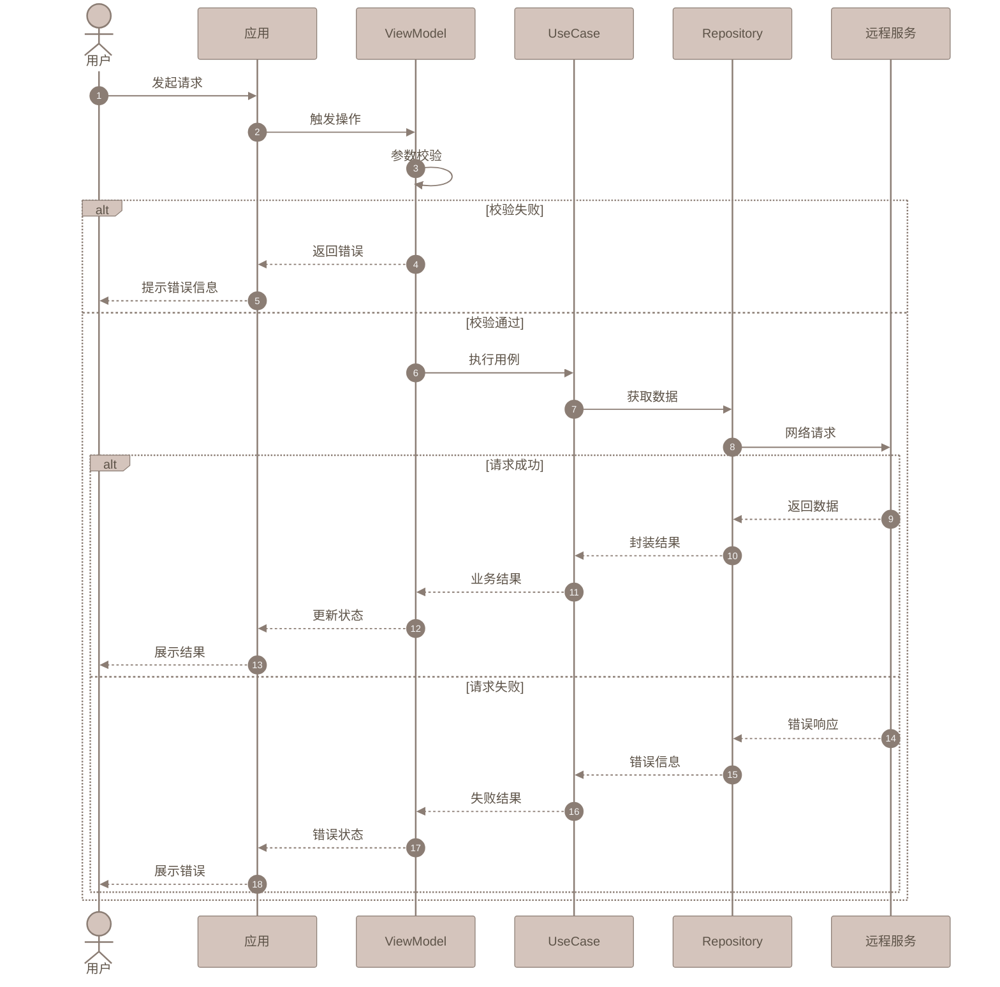
```mermaid
%%{init: {'theme': 'base', 'themeVariables': { 'actorBkg': '#d4c4bc', 'actorBorder': '#8b7d74', 'actorTextColor': '#5d5348', 'signalColor': '#8b7d74', 'signalTextColor': '#5d5348', 'noteBkgColor': '#f8f6f4', 'noteBorderColor': '#a89f97'}}}%%
sequenceDiagram
    autonumber
    
    actor User as 用户
    participant App as 应用
    participant VM as ViewModel
    participant UC as UseCase
    participant Repo as Repository
    participant API as 远程服务

    User->>App: 发起请求
    App->>VM: 触发操作
    VM->>VM: 参数校验
    
    alt 校验失败
        VM-->>App: 返回错误
        App-->>User: 提示错误信息
    else 校验通过
        VM->>UC: 执行用例
        UC->>Repo: 获取数据
        Repo->>API: 网络请求
        
        alt 请求成功
            API-->>Repo: 返回数据
            Repo-->>UC: 封装结果
            UC-->>VM: 业务结果
            VM-->>App: 更新状态
            App-->>User: 展示结果
        else 请求失败
            API-->>Repo: 错误响应
            Repo-->>UC: 错误信息
            UC-->>VM: 失败结果
            VM-->>App: 错误状态
            App-->>User: 展示错误
        end
    end
```

---

### 1.4 流程图 - 莫兰迪灰粉系

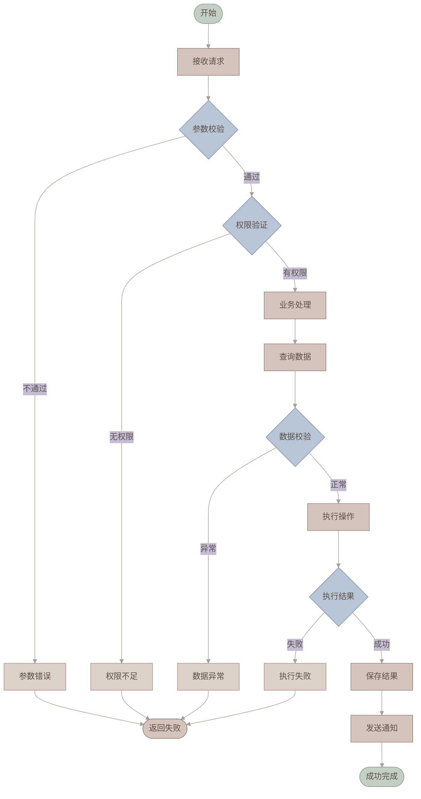
```mermaid
%%{init: {'theme': 'base', 'themeVariables': { 'primaryColor': '#d4c4bc', 'primaryTextColor': '#5d5348', 'primaryBorderColor': '#8b7d74', 'lineColor': '#a89f97'}}}%%
flowchart TD
    Start([开始]) --> Input[接收请求]
    Input --> Validate{参数校验}
    
    Validate -->|不通过| ErrValidate[参数错误]
    Validate -->|通过| Auth{权限验证}
    
    Auth -->|无权限| ErrAuth[权限不足]
    Auth -->|有权限| Process[业务处理]
    
    Process --> Query[查询数据]
    Query --> Check{数据校验}
    
    Check -->|异常| ErrData[数据异常]
    Check -->|正常| Execute[执行操作]
    
    Execute --> Result{执行结果}
    
    Result -->|失败| ErrExec[执行失败]
    Result -->|成功| Save[保存结果]
    
    Save --> Notify[发送通知]
    Notify --> Success([成功完成])
    
    ErrValidate --> Fail([返回失败])
    ErrAuth --> Fail
    ErrData --> Fail
    ErrExec --> Fail

    style Start fill:#c2cfc2,stroke:#8a9c8a
    style Success fill:#c2cfc2,stroke:#8a9c8a
    style Fail fill:#d4c4bc,stroke:#8b7d74
    style ErrValidate fill:#ddd0c8,stroke:#a89080
    style ErrAuth fill:#ddd0c8,stroke:#a89080
    style ErrData fill:#ddd0c8,stroke:#a89080
    style ErrExec fill:#ddd0c8,stroke:#a89080
    style Validate fill:#b8c5d6,stroke:#7a8fa3
    style Auth fill:#b8c5d6,stroke:#7a8fa3
    style Check fill:#b8c5d6,stroke:#7a8fa3
    style Result fill:#b8c5d6,stroke:#7a8fa3
```

---

### 1.5 分层架构图 - 莫兰迪灰粉系

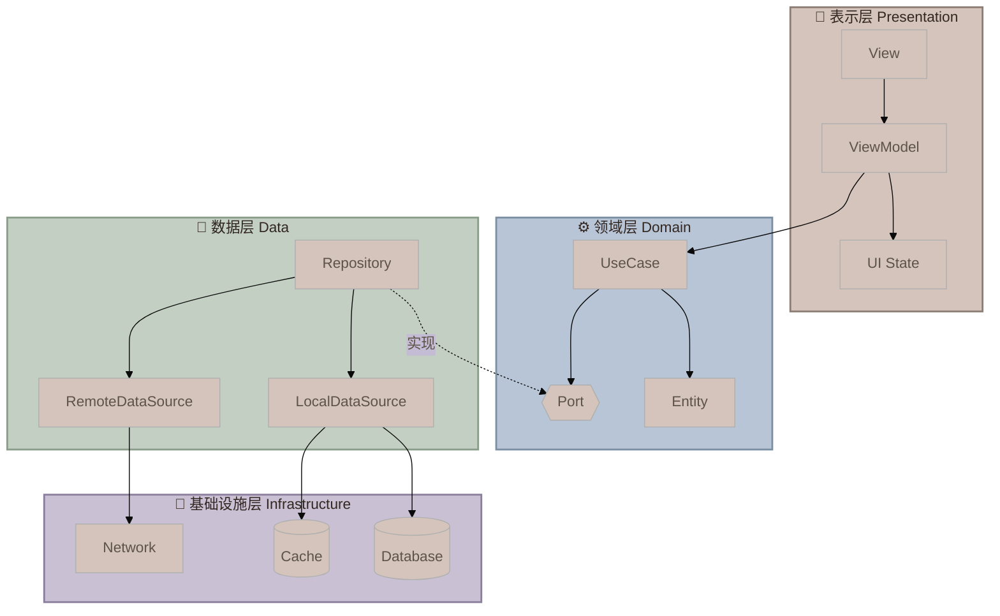
```mermaid
%%{init: {'theme': 'base', 'themeVariables': { 'primaryColor': '#d4c4bc', 'primaryTextColor': '#5d5348'}}}%%
flowchart TB
    subgraph UI["🎨 表示层 Presentation"]
        direction LR
        View["View"]
        ViewModel["ViewModel"]
        State["UI State"]
    end

    subgraph Domain["⚙️ 领域层 Domain"]
        direction LR
        UseCase["UseCase"]
        Entity["Entity"]
        Port{{"Port"}}
    end

    subgraph Data["💾 数据层 Data"]
        direction LR
        Repository["Repository"]
        LocalDS["LocalDataSource"]
        RemoteDS["RemoteDataSource"]
    end

    subgraph Infra["🔧 基础设施层 Infrastructure"]
        direction LR
        Database[("Database")]
        Network["Network"]
        Cache[("Cache")]
    end

    View --> ViewModel
    ViewModel --> State
    ViewModel --> UseCase
    UseCase --> Entity
    UseCase --> Port
    Repository -.->|实现| Port
    Repository --> LocalDS
    Repository --> RemoteDS
    LocalDS --> Database
    LocalDS --> Cache
    RemoteDS --> Network

    style UI fill:#d4c4bc,stroke:#8b7d74,stroke-width:2px
    style Domain fill:#b8c5d6,stroke:#7a8fa3,stroke-width:2px
    style Data fill:#c2cfc2,stroke:#8a9c8a,stroke-width:2px
    style Infra fill:#c9c0d3,stroke:#8b7d9c,stroke-width:2px
```

---

# 方案二：清新薄荷系

> 清爽的薄荷绿、天空蓝、淡粉色，给人舒适自然的感觉。

## 🎨 色板

| 用途 | 颜色 | 色值 |
|------|------|------|
| 主色（薄荷绿） |  | `#a8e6cf` |
| 辅色1（天空蓝） |  | `#a8d8ea` |
| 辅色2（淡粉） |  | `#ffd3b6` |
| 辅色3（淡紫） |  | `#dcedc1` |
| 辅色4（浅黄） |  | `#fff5ba` |
| 边框深色 |  | `#5a9c8c` |
| 文字色 |  | `#4a6572` |
| 背景色 |  | `#f9fcfb` |

---

### 2.1 架构图 - 清新薄荷系

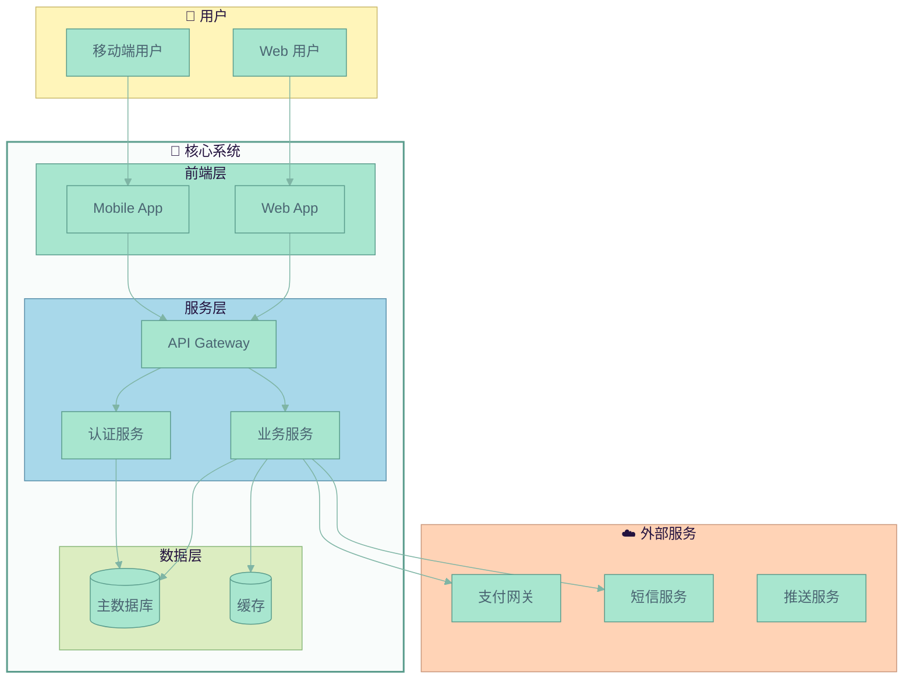
```mermaid
%%{init: {'theme': 'base', 'themeVariables': { 'primaryColor': '#a8e6cf', 'primaryTextColor': '#4a6572', 'primaryBorderColor': '#5a9c8c', 'lineColor': '#7fb5a5', 'secondaryColor': '#a8d8ea', 'tertiaryColor': '#dcedc1', 'background': '#f9fcfb'}}}%%
flowchart TB
    subgraph External["☁️ 外部服务"]
        direction TB
        PaymentGW["支付网关"]
        SMS["短信服务"]
        Push["推送服务"]
    end

    subgraph Users["👥 用户"]
        direction TB
        Mobile["移动端用户"]
        Web["Web 用户"]
    end

    subgraph System["🌿 核心系统"]
        direction TB
        
        subgraph Frontend["前端层"]
            App["Mobile App"]
            WebApp["Web App"]
        end
        
        subgraph Backend["服务层"]
            Gateway["API Gateway"]
            Auth["认证服务"]
            Business["业务服务"]
        end
        
        subgraph Data["数据层"]
            DB[("主数据库")]
            Cache[("缓存")]
        end
    end

    Mobile --> App
    Web --> WebApp
    App --> Gateway
    WebApp --> Gateway
    Gateway --> Auth
    Gateway --> Business
    Auth --> DB
    Business --> DB
    Business --> Cache
    Business --> PaymentGW
    Business --> SMS

    style System fill:#f9fcfb,stroke:#5a9c8c,stroke-width:2px
    style Frontend fill:#a8e6cf,stroke:#5a9c8c
    style Backend fill:#a8d8ea,stroke:#5a8faa
    style Data fill:#dcedc1,stroke:#8ab87a
    style External fill:#ffd3b6,stroke:#c9967a
    style Users fill:#fff5ba,stroke:#c9b86a
```

---

### 2.2 类图 - 清新薄荷系

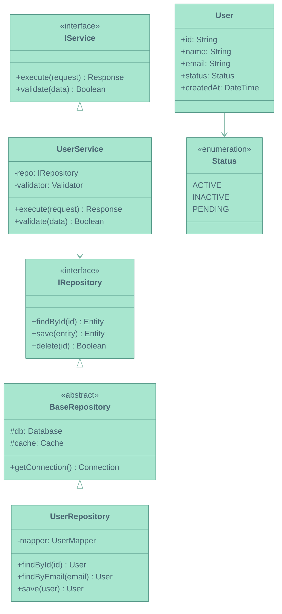
```mermaid
%%{init: {'theme': 'base', 'themeVariables': { 'primaryColor': '#a8e6cf', 'primaryTextColor': '#4a6572', 'primaryBorderColor': '#5a9c8c', 'lineColor': '#7fb5a5'}}}%%
classDiagram
    direction TB

    class IRepository {
        <<interface>>
        +findById(id) Entity
        +save(entity) Entity
        +delete(id) Boolean
    }

    class IService {
        <<interface>>
        +execute(request) Response
        +validate(data) Boolean
    }

    class BaseRepository {
        <<abstract>>
        #db: Database
        #cache: Cache
        +getConnection() Connection
    }

    class UserRepository {
        -mapper: UserMapper
        +findById(id) User
        +findByEmail(email) User
        +save(user) User
    }

    class UserService {
        -repo: IRepository
        -validator: Validator
        +execute(request) Response
        +validate(data) Boolean
    }

    class User {
        +id: String
        +name: String
        +email: String
        +status: Status
        +createdAt: DateTime
    }

    class Status {
        <<enumeration>>
        ACTIVE
        INACTIVE
        PENDING
    }

    IRepository <|.. BaseRepository
    BaseRepository <|-- UserRepository
    IService <|.. UserService
    UserService ..> IRepository
    User --> Status
```

---

### 2.3 时序图 - 清新薄荷系

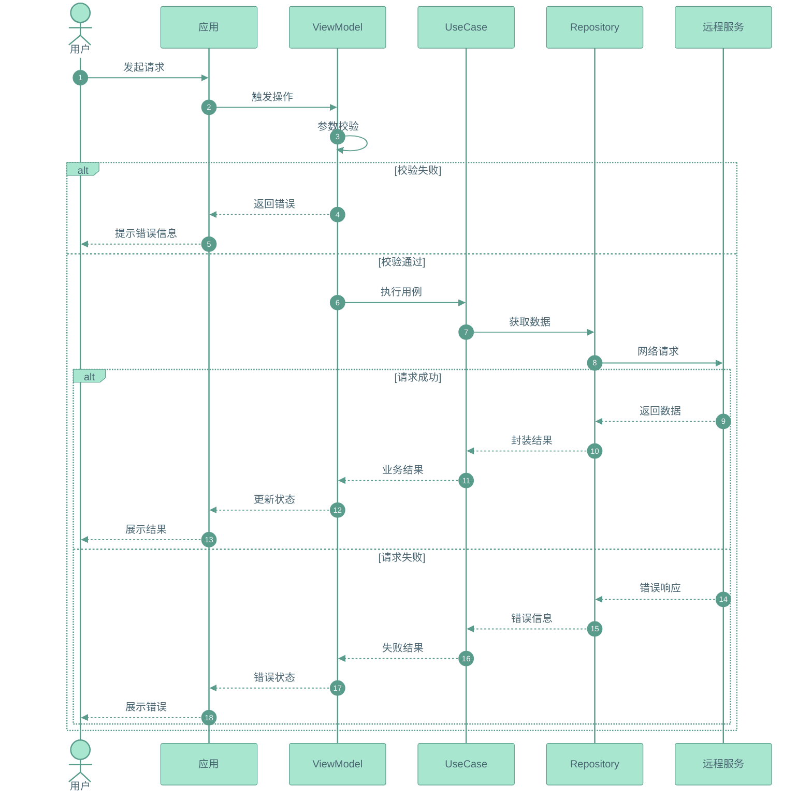
```mermaid
%%{init: {'theme': 'base', 'themeVariables': { 'actorBkg': '#a8e6cf', 'actorBorder': '#5a9c8c', 'actorTextColor': '#4a6572', 'signalColor': '#5a9c8c', 'signalTextColor': '#4a6572', 'noteBkgColor': '#f9fcfb', 'noteBorderColor': '#7fb5a5'}}}%%
sequenceDiagram
    autonumber
    
    actor User as 用户
    participant App as 应用
    participant VM as ViewModel
    participant UC as UseCase
    participant Repo as Repository
    participant API as 远程服务

    User->>App: 发起请求
    App->>VM: 触发操作
    VM->>VM: 参数校验
    
    alt 校验失败
        VM-->>App: 返回错误
        App-->>User: 提示错误信息
    else 校验通过
        VM->>UC: 执行用例
        UC->>Repo: 获取数据
        Repo->>API: 网络请求
        
        alt 请求成功
            API-->>Repo: 返回数据
            Repo-->>UC: 封装结果
            UC-->>VM: 业务结果
            VM-->>App: 更新状态
            App-->>User: 展示结果
        else 请求失败
            API-->>Repo: 错误响应
            Repo-->>UC: 错误信息
            UC-->>VM: 失败结果
            VM-->>App: 错误状态
            App-->>User: 展示错误
        end
    end
```

---

### 2.4 流程图 - 清新薄荷系

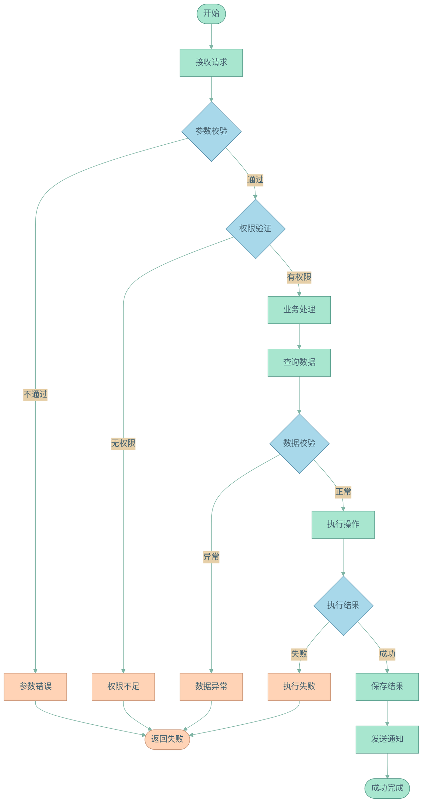
```mermaid
%%{init: {'theme': 'base', 'themeVariables': { 'primaryColor': '#a8e6cf', 'primaryTextColor': '#4a6572', 'primaryBorderColor': '#5a9c8c', 'lineColor': '#7fb5a5'}}}%%
flowchart TD
    Start([开始]) --> Input[接收请求]
    Input --> Validate{参数校验}
    
    Validate -->|不通过| ErrValidate[参数错误]
    Validate -->|通过| Auth{权限验证}
    
    Auth -->|无权限| ErrAuth[权限不足]
    Auth -->|有权限| Process[业务处理]
    
    Process --> Query[查询数据]
    Query --> Check{数据校验}
    
    Check -->|异常| ErrData[数据异常]
    Check -->|正常| Execute[执行操作]
    
    Execute --> Result{执行结果}
    
    Result -->|失败| ErrExec[执行失败]
    Result -->|成功| Save[保存结果]
    
    Save --> Notify[发送通知]
    Notify --> Success([成功完成])
    
    ErrValidate --> Fail([返回失败])
    ErrAuth --> Fail
    ErrData --> Fail
    ErrExec --> Fail

    style Start fill:#a8e6cf,stroke:#5a9c8c
    style Success fill:#a8e6cf,stroke:#5a9c8c
    style Fail fill:#ffd3b6,stroke:#c9967a
    style ErrValidate fill:#ffd3b6,stroke:#c9967a
    style ErrAuth fill:#ffd3b6,stroke:#c9967a
    style ErrData fill:#ffd3b6,stroke:#c9967a
    style ErrExec fill:#ffd3b6,stroke:#c9967a
    style Validate fill:#a8d8ea,stroke:#5a8faa
    style Auth fill:#a8d8ea,stroke:#5a8faa
    style Check fill:#a8d8ea,stroke:#5a8faa
    style Result fill:#a8d8ea,stroke:#5a8faa
```

---

### 2.5 分层架构图 - 清新薄荷系

```mermaid
%%{init: {'theme': 'base', 'themeVariables': { 'primaryColor': '#a8e6cf', 'primaryTextColor': '#4a6572'}}}%%
flowchart TB
    subgraph UI["🎨 表示层 Presentation"]
        direction LR
        View["View"]
        ViewModel["ViewModel"]
        State["UI State"]
    end

    subgraph Domain["⚙️ 领域层 Domain"]
        direction LR
        UseCase["UseCase"]
        Entity["Entity"]
        Port{{"Port"}}
    end

    subgraph Data["💾 数据层 Data"]
        direction LR
        Repository["Repository"]
        LocalDS["LocalDataSource"]
        RemoteDS["RemoteDataSource"]
    end

    subgraph Infra["🔧 基础设施层 Infrastructure"]
        direction LR
        Database[("Database")]
        Network["Network"]
        Cache[("Cache")]
    end

    View --> ViewModel
    ViewModel --> State
    ViewModel --> UseCase
    UseCase --> Entity
    UseCase --> Port
    Repository -.->|实现| Port
    Repository --> LocalDS
    Repository --> RemoteDS
    LocalDS --> Database
    LocalDS --> Cache
    RemoteDS --> Network

    style UI fill:#a8e6cf,stroke:#5a9c8c,stroke-width:2px
    style Domain fill:#a8d8ea,stroke:#5a8faa,stroke-width:2px
    style Data fill:#dcedc1,stroke:#8ab87a,stroke-width:2px
    style Infra fill:#fff5ba,stroke:#c9b86a,stroke-width:2px
```

---

# 方案三：奶茶暖调系

> 温暖的奶茶色、焦糖色、米白色，营造舒适治愈的氛围。

## 🎨 色板

| 用途 | 颜色 | 色值 |
|------|------|------|
| 主色（奶茶） |  | `#e8d5c4` |
| 辅色1（焦糖） |  | `#c9a87c` |
| 辅色2（米白） |  | `#f5ebe0` |
| 辅色3（淡棕） |  | `#d5c4a1` |
| 辅色4（烟粉） |  | `#e6ccb2` |
| 边框深色 |  | `#9c7a5c` |
| 文字色 |  | `#5c4a3a` |
| 背景色 |  | `#fdfbf7` |

---

### 3.1 架构图 - 奶茶暖调系

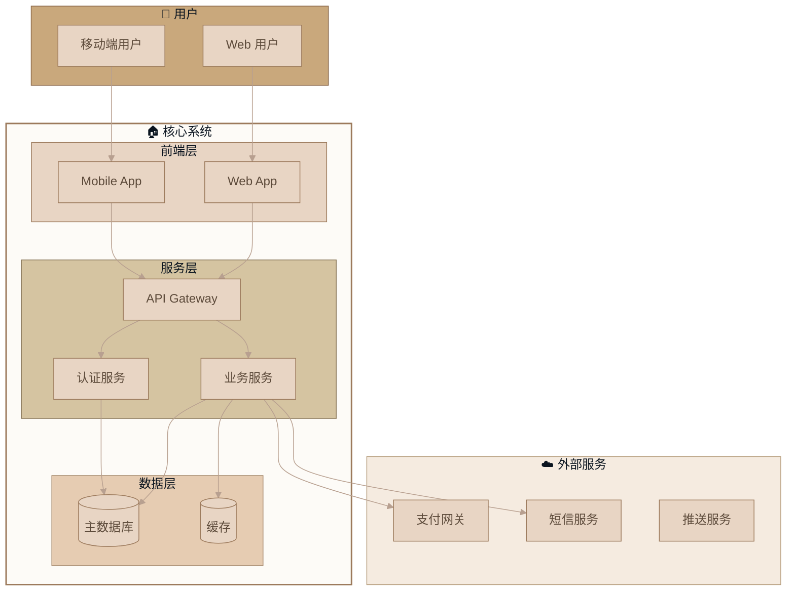
```mermaid
%%{init: {'theme': 'base', 'themeVariables': { 'primaryColor': '#e8d5c4', 'primaryTextColor': '#5c4a3a', 'primaryBorderColor': '#9c7a5c', 'lineColor': '#b8a090', 'secondaryColor': '#d5c4a1', 'tertiaryColor': '#f5ebe0', 'background': '#fdfbf7'}}}%%
flowchart TB
    subgraph External["☁️ 外部服务"]
        direction TB
        PaymentGW["支付网关"]
        SMS["短信服务"]
        Push["推送服务"]
    end

    subgraph Users["👥 用户"]
        direction TB
        Mobile["移动端用户"]
        Web["Web 用户"]
    end

    subgraph System["🏠 核心系统"]
        direction TB
        
        subgraph Frontend["前端层"]
            App["Mobile App"]
            WebApp["Web App"]
        end
        
        subgraph Backend["服务层"]
            Gateway["API Gateway"]
            Auth["认证服务"]
            Business["业务服务"]
        end
        
        subgraph Data["数据层"]
            DB[("主数据库")]
            Cache[("缓存")]
        end
    end

    Mobile --> App
    Web --> WebApp
    App --> Gateway
    WebApp --> Gateway
    Gateway --> Auth
    Gateway --> Business
    Auth --> DB
    Business --> DB
    Business --> Cache
    Business --> PaymentGW
    Business --> SMS

    style System fill:#fdfbf7,stroke:#9c7a5c,stroke-width:2px
    style Frontend fill:#e8d5c4,stroke:#9c7a5c
    style Backend fill:#d5c4a1,stroke:#8c7a5c
    style Data fill:#e6ccb2,stroke:#a6896c
    style External fill:#f5ebe0,stroke:#b8a080
    style Users fill:#c9a87c,stroke:#8c6a4c
```

---

### 3.2 类图 - 奶茶暖调系

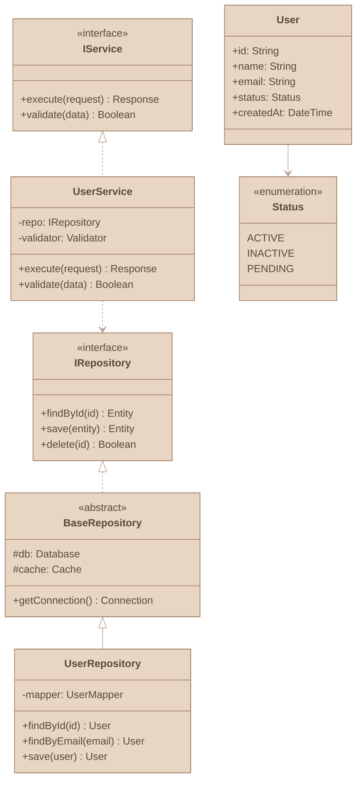
```mermaid
%%{init: {'theme': 'base', 'themeVariables': { 'primaryColor': '#e8d5c4', 'primaryTextColor': '#5c4a3a', 'primaryBorderColor': '#9c7a5c', 'lineColor': '#b8a090'}}}%%
classDiagram
    direction TB

    class IRepository {
        <<interface>>
        +findById(id) Entity
        +save(entity) Entity
        +delete(id) Boolean
    }

    class IService {
        <<interface>>
        +execute(request) Response
        +validate(data) Boolean
    }

    class BaseRepository {
        <<abstract>>
        #db: Database
        #cache: Cache
        +getConnection() Connection
    }

    class UserRepository {
        -mapper: UserMapper
        +findById(id) User
        +findByEmail(email) User
        +save(user) User
    }

    class UserService {
        -repo: IRepository
        -validator: Validator
        +execute(request) Response
        +validate(data) Boolean
    }

    class User {
        +id: String
        +name: String
        +email: String
        +status: Status
        +createdAt: DateTime
    }

    class Status {
        <<enumeration>>
        ACTIVE
        INACTIVE
        PENDING
    }

    IRepository <|.. BaseRepository
    BaseRepository <|-- UserRepository
    IService <|.. UserService
    UserService ..> IRepository
    User --> Status
```

---

### 3.3 时序图 - 奶茶暖调系

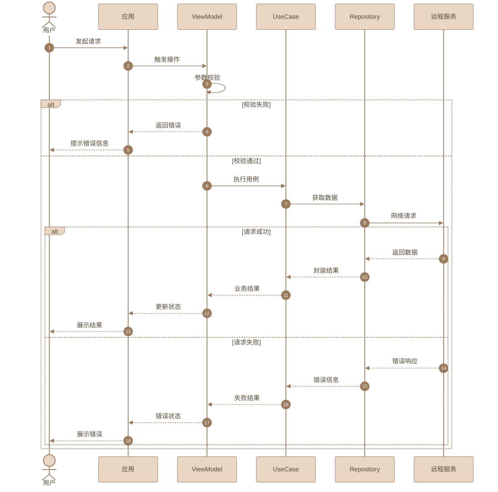
```mermaid
%%{init: {'theme': 'base', 'themeVariables': { 'actorBkg': '#e8d5c4', 'actorBorder': '#9c7a5c', 'actorTextColor': '#5c4a3a', 'signalColor': '#9c7a5c', 'signalTextColor': '#5c4a3a', 'noteBkgColor': '#fdfbf7', 'noteBorderColor': '#b8a090'}}}%%
sequenceDiagram
    autonumber
    
    actor User as 用户
    participant App as 应用
    participant VM as ViewModel
    participant UC as UseCase
    participant Repo as Repository
    participant API as 远程服务

    User->>App: 发起请求
    App->>VM: 触发操作
    VM->>VM: 参数校验
    
    alt 校验失败
        VM-->>App: 返回错误
        App-->>User: 提示错误信息
    else 校验通过
        VM->>UC: 执行用例
        UC->>Repo: 获取数据
        Repo->>API: 网络请求
        
        alt 请求成功
            API-->>Repo: 返回数据
            Repo-->>UC: 封装结果
            UC-->>VM: 业务结果
            VM-->>App: 更新状态
            App-->>User: 展示结果
        else 请求失败
            API-->>Repo: 错误响应
            Repo-->>UC: 错误信息
            UC-->>VM: 失败结果
            VM-->>App: 错误状态
            App-->>User: 展示错误
        end
    end
```

---

### 3.4 流程图 - 奶茶暖调系

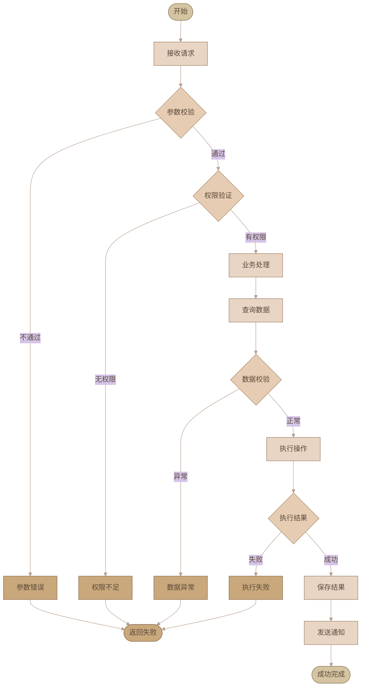
```mermaid
%%{init: {'theme': 'base', 'themeVariables': { 'primaryColor': '#e8d5c4', 'primaryTextColor': '#5c4a3a', 'primaryBorderColor': '#9c7a5c', 'lineColor': '#b8a090'}}}%%
flowchart TD
    Start([开始]) --> Input[接收请求]
    Input --> Validate{参数校验}
    
    Validate -->|不通过| ErrValidate[参数错误]
    Validate -->|通过| Auth{权限验证}
    
    Auth -->|无权限| ErrAuth[权限不足]
    Auth -->|有权限| Process[业务处理]
    
    Process --> Query[查询数据]
    Query --> Check{数据校验}
    
    Check -->|异常| ErrData[数据异常]
    Check -->|正常| Execute[执行操作]
    
    Execute --> Result{执行结果}
    
    Result -->|失败| ErrExec[执行失败]
    Result -->|成功| Save[保存结果]
    
    Save --> Notify[发送通知]
    Notify --> Success([成功完成])
    
    ErrValidate --> Fail([返回失败])
    ErrAuth --> Fail
    ErrData --> Fail
    ErrExec --> Fail

    style Start fill:#d5c4a1,stroke:#8c7a5c
    style Success fill:#d5c4a1,stroke:#8c7a5c
    style Fail fill:#c9a87c,stroke:#8c6a4c
    style ErrValidate fill:#c9a87c,stroke:#8c6a4c
    style ErrAuth fill:#c9a87c,stroke:#8c6a4c
    style ErrData fill:#c9a87c,stroke:#8c6a4c
    style ErrExec fill:#c9a87c,stroke:#8c6a4c
    style Validate fill:#e6ccb2,stroke:#a6896c
    style Auth fill:#e6ccb2,stroke:#a6896c
    style Check fill:#e6ccb2,stroke:#a6896c
    style Result fill:#e6ccb2,stroke:#a6896c
```

---

### 3.5 分层架构图 - 奶茶暖调系

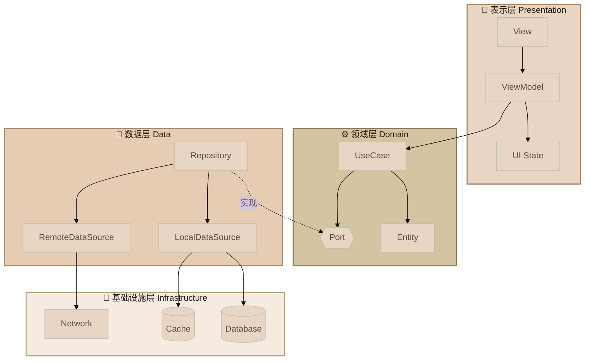
```mermaid
%%{init: {'theme': 'base', 'themeVariables': { 'primaryColor': '#e8d5c4', 'primaryTextColor': '#5c4a3a'}}}%%
flowchart TB
    subgraph UI["🎨 表示层 Presentation"]
        direction LR
        View["View"]
        ViewModel["ViewModel"]
        State["UI State"]
    end

    subgraph Domain["⚙️ 领域层 Domain"]
        direction LR
        UseCase["UseCase"]
        Entity["Entity"]
        Port{{"Port"}}
    end

    subgraph Data["💾 数据层 Data"]
        direction LR
        Repository["Repository"]
        LocalDS["LocalDataSource"]
        RemoteDS["RemoteDataSource"]
    end

    subgraph Infra["🔧 基础设施层 Infrastructure"]
        direction LR
        Database[("Database")]
        Network["Network"]
        Cache[("Cache")]
    end

    View --> ViewModel
    ViewModel --> State
    ViewModel --> UseCase
    UseCase --> Entity
    UseCase --> Port
    Repository -.->|实现| Port
    Repository --> LocalDS
    Repository --> RemoteDS
    LocalDS --> Database
    LocalDS --> Cache
    RemoteDS --> Network

    style UI fill:#e8d5c4,stroke:#9c7a5c,stroke-width:2px
    style Domain fill:#d5c4a1,stroke:#8c7a5c,stroke-width:2px
    style Data fill:#e6ccb2,stroke:#a6896c,stroke-width:2px
    style Infra fill:#f5ebe0,stroke:#b8a080,stroke-width:2px
```

---

# 方案四：Material Design

> Google 官方设计语言，鲜明的色彩、清晰的层次、现代专业的视觉风格。

## 🎨 色板

| 用途 | 颜色 | 色值 | Material 名称 |
|------|------|------|---------------|
| 主色（蓝色） |  | `#1976D2` | Blue 700 |
| 辅色1（绿色） |  | `#388E3C` | Green 700 |
| 辅色2（橙色） |  | `#F57C00` | Orange 700 |
| 辅色3（紫色） |  | `#7B1FA2` | Purple 700 |
| 辅色4（青色） |  | `#0097A7` | Cyan 700 |
| 错误色（红色） |  | `#D32F2F` | Red 700 |
| 浅色背景 |  | `#E3F2FD` | Blue 50 |
| 文字色 |  | `#212121` | Grey 900 |

---

### 4.1 架构图 - Material Design

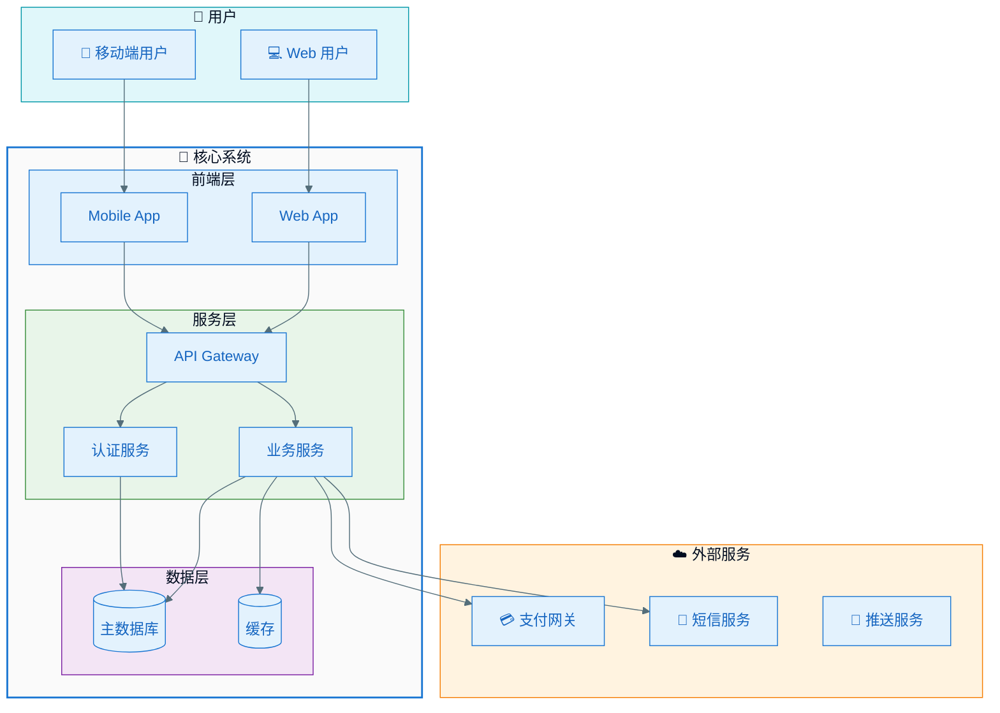
```mermaid
%%{init: {'theme': 'base', 'themeVariables': { 'primaryColor': '#E3F2FD', 'primaryTextColor': '#1565C0', 'primaryBorderColor': '#1976D2', 'lineColor': '#546E7A', 'secondaryColor': '#E8F5E9', 'tertiaryColor': '#FFF3E0', 'background': '#FAFAFA'}}}%%
flowchart TB
    subgraph External["☁️ 外部服务"]
        direction TB
        PaymentGW["💳 支付网关"]
        SMS["📱 短信服务"]
        Push["🔔 推送服务"]
    end

    subgraph Users["👥 用户"]
        direction TB
        Mobile["📱 移动端用户"]
        Web["💻 Web 用户"]
    end

    subgraph System["🏢 核心系统"]
        direction TB
        
        subgraph Frontend["前端层"]
            App["Mobile App"]
            WebApp["Web App"]
        end
        
        subgraph Backend["服务层"]
            Gateway["API Gateway"]
            Auth["认证服务"]
            Business["业务服务"]
        end
        
        subgraph Data["数据层"]
            DB[("主数据库")]
            Cache[("缓存")]
        end
    end

    Mobile --> App
    Web --> WebApp
    App --> Gateway
    WebApp --> Gateway
    Gateway --> Auth
    Gateway --> Business
    Auth --> DB
    Business --> DB
    Business --> Cache
    Business --> PaymentGW
    Business --> SMS

    style System fill:#FAFAFA,stroke:#1976D2,stroke-width:2px
    style Frontend fill:#E3F2FD,stroke:#1976D2
    style Backend fill:#E8F5E9,stroke:#388E3C
    style Data fill:#F3E5F5,stroke:#7B1FA2
    style External fill:#FFF3E0,stroke:#F57C00
    style Users fill:#E0F7FA,stroke:#0097A7
```

---

### 4.2 类图 - Material Design

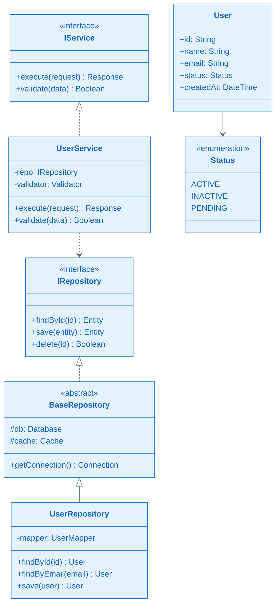
```mermaid
%%{init: {'theme': 'base', 'themeVariables': { 'primaryColor': '#E3F2FD', 'primaryTextColor': '#1565C0', 'primaryBorderColor': '#1976D2', 'lineColor': '#546E7A'}}}%%
classDiagram
    direction TB

    class IRepository {
        <<interface>>
        +findById(id) Entity
        +save(entity) Entity
        +delete(id) Boolean
    }

    class IService {
        <<interface>>
        +execute(request) Response
        +validate(data) Boolean
    }

    class BaseRepository {
        <<abstract>>
        #db: Database
        #cache: Cache
        +getConnection() Connection
    }

    class UserRepository {
        -mapper: UserMapper
        +findById(id) User
        +findByEmail(email) User
        +save(user) User
    }

    class UserService {
        -repo: IRepository
        -validator: Validator
        +execute(request) Response
        +validate(data) Boolean
    }

    class User {
        +id: String
        +name: String
        +email: String
        +status: Status
        +createdAt: DateTime
    }

    class Status {
        <<enumeration>>
        ACTIVE
        INACTIVE
        PENDING
    }

    IRepository <|.. BaseRepository
    BaseRepository <|-- UserRepository
    IService <|.. UserService
    UserService ..> IRepository
    User --> Status
```

---

### 4.3 时序图 - Material Design

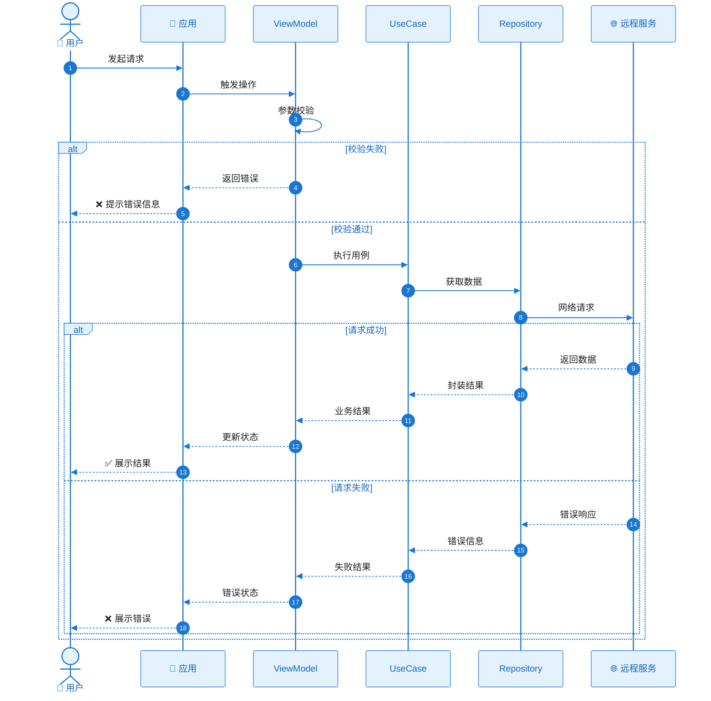
```mermaid
%%{init: {'theme': 'base', 'themeVariables': { 'actorBkg': '#E3F2FD', 'actorBorder': '#1976D2', 'actorTextColor': '#1565C0', 'signalColor': '#1976D2', 'signalTextColor': '#212121', 'noteBkgColor': '#FFF8E1', 'noteBorderColor': '#FFC107'}}}%%
sequenceDiagram
    autonumber
    
    actor User as 👤 用户
    participant App as 📱 应用
    participant VM as ViewModel
    participant UC as UseCase
    participant Repo as Repository
    participant API as 🌐 远程服务

    User->>App: 发起请求
    App->>VM: 触发操作
    VM->>VM: 参数校验
    
    alt 校验失败
        VM-->>App: 返回错误
        App-->>User: ❌ 提示错误信息
    else 校验通过
        VM->>UC: 执行用例
        UC->>Repo: 获取数据
        Repo->>API: 网络请求
        
        alt 请求成功
            API-->>Repo: 返回数据
            Repo-->>UC: 封装结果
            UC-->>VM: 业务结果
            VM-->>App: 更新状态
            App-->>User: ✅ 展示结果
        else 请求失败
            API-->>Repo: 错误响应
            Repo-->>UC: 错误信息
            UC-->>VM: 失败结果
            VM-->>App: 错误状态
            App-->>User: ❌ 展示错误
        end
    end
```

---

### 4.4 流程图 - Material Design

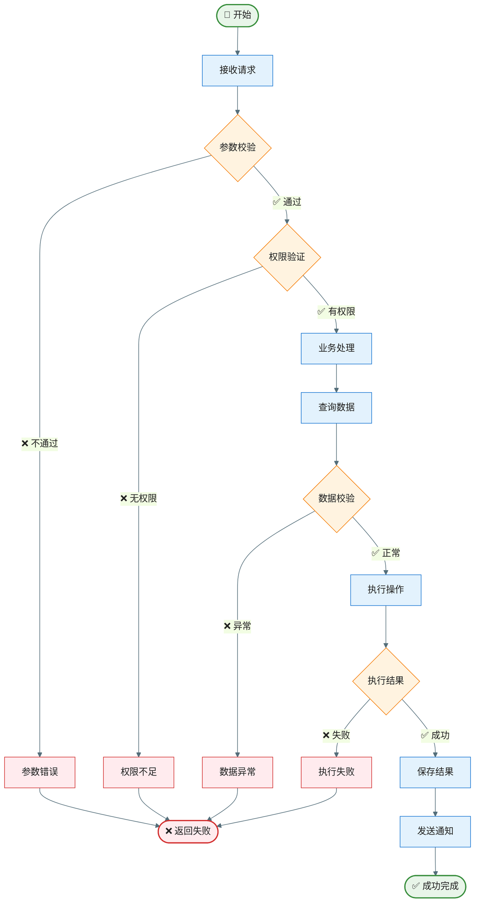
```mermaid
%%{init: {'theme': 'base', 'themeVariables': { 'primaryColor': '#E3F2FD', 'primaryTextColor': '#212121', 'primaryBorderColor': '#1976D2', 'lineColor': '#546E7A'}}}%%
flowchart TD
    Start([🚀 开始]) --> Input[接收请求]
    Input --> Validate{参数校验}
    
    Validate -->|❌ 不通过| ErrValidate[参数错误]
    Validate -->|✅ 通过| Auth{权限验证}
    
    Auth -->|❌ 无权限| ErrAuth[权限不足]
    Auth -->|✅ 有权限| Process[业务处理]
    
    Process --> Query[查询数据]
    Query --> Check{数据校验}
    
    Check -->|❌ 异常| ErrData[数据异常]
    Check -->|✅ 正常| Execute[执行操作]
    
    Execute --> Result{执行结果}
    
    Result -->|❌ 失败| ErrExec[执行失败]
    Result -->|✅ 成功| Save[保存结果]
    
    Save --> Notify[发送通知]
    Notify --> Success([✅ 成功完成])
    
    ErrValidate --> Fail([❌ 返回失败])
    ErrAuth --> Fail
    ErrData --> Fail
    ErrExec --> Fail

    style Start fill:#E8F5E9,stroke:#388E3C,stroke-width:2px
    style Success fill:#E8F5E9,stroke:#388E3C,stroke-width:2px
    style Fail fill:#FFEBEE,stroke:#D32F2F,stroke-width:2px
    style ErrValidate fill:#FFEBEE,stroke:#D32F2F
    style ErrAuth fill:#FFEBEE,stroke:#D32F2F
    style ErrData fill:#FFEBEE,stroke:#D32F2F
    style ErrExec fill:#FFEBEE,stroke:#D32F2F
    style Validate fill:#FFF3E0,stroke:#F57C00
    style Auth fill:#FFF3E0,stroke:#F57C00
    style Check fill:#FFF3E0,stroke:#F57C00
    style Result fill:#FFF3E0,stroke:#F57C00
    style Process fill:#E3F2FD,stroke:#1976D2
    style Query fill:#E3F2FD,stroke:#1976D2
    style Execute fill:#E3F2FD,stroke:#1976D2
    style Save fill:#E3F2FD,stroke:#1976D2
    style Notify fill:#E3F2FD,stroke:#1976D2
```

---

### 4.5 分层架构图 - Material Design

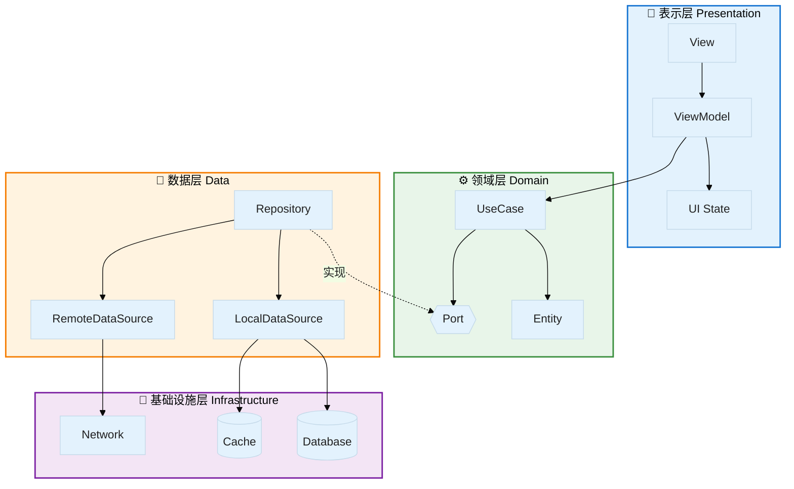
```mermaid
%%{init: {'theme': 'base', 'themeVariables': { 'primaryColor': '#E3F2FD', 'primaryTextColor': '#212121'}}}%%
flowchart TB
    subgraph UI["🎨 表示层 Presentation"]
        direction LR
        View["View"]
        ViewModel["ViewModel"]
        State["UI State"]
    end

    subgraph Domain["⚙️ 领域层 Domain"]
        direction LR
        UseCase["UseCase"]
        Entity["Entity"]
        Port{{"Port"}}
    end

    subgraph Data["💾 数据层 Data"]
        direction LR
        Repository["Repository"]
        LocalDS["LocalDataSource"]
        RemoteDS["RemoteDataSource"]
    end

    subgraph Infra["🔧 基础设施层 Infrastructure"]
        direction LR
        Database[("Database")]
        Network["Network"]
        Cache[("Cache")]
    end

    View --> ViewModel
    ViewModel --> State
    ViewModel --> UseCase
    UseCase --> Entity
    UseCase --> Port
    Repository -.->|实现| Port
    Repository --> LocalDS
    Repository --> RemoteDS
    LocalDS --> Database
    LocalDS --> Cache
    RemoteDS --> Network

    style UI fill:#E3F2FD,stroke:#1976D2,stroke-width:2px
    style Domain fill:#E8F5E9,stroke:#388E3C,stroke-width:2px
    style Data fill:#FFF3E0,stroke:#F57C00,stroke-width:2px
    style Infra fill:#F3E5F5,stroke:#7B1FA2,stroke-width:2px
```

---

# 配置模板速查

## 复制即用的主题配置

### 莫兰迪灰粉系
```
%%{init: {'theme': 'base', 'themeVariables': { 
  'primaryColor': '#d4c4bc', 
  'primaryTextColor': '#5d5348', 
  'primaryBorderColor': '#8b7d74', 
  'lineColor': '#a89f97', 
  'secondaryColor': '#b8c5d6', 
  'tertiaryColor': '#c2cfc2',
  'background': '#f8f6f4'
}}}%%
```

### 清新薄荷系
```
%%{init: {'theme': 'base', 'themeVariables': { 
  'primaryColor': '#a8e6cf', 
  'primaryTextColor': '#4a6572', 
  'primaryBorderColor': '#5a9c8c', 
  'lineColor': '#7fb5a5', 
  'secondaryColor': '#a8d8ea', 
  'tertiaryColor': '#dcedc1',
  'background': '#f9fcfb'
}}}%%
```

### 奶茶暖调系
```
%%{init: {'theme': 'base', 'themeVariables': { 
  'primaryColor': '#e8d5c4', 
  'primaryTextColor': '#5c4a3a', 
  'primaryBorderColor': '#9c7a5c', 
  'lineColor': '#b8a090', 
  'secondaryColor': '#d5c4a1', 
  'tertiaryColor': '#f5ebe0',
  'background': '#fdfbf7'
}}}%%
```

### Material Design
```
%%{init: {'theme': 'base', 'themeVariables': { 
  'primaryColor': '#E3F2FD', 
  'primaryTextColor': '#1565C0', 
  'primaryBorderColor': '#1976D2', 
  'lineColor': '#546E7A', 
  'secondaryColor': '#E8F5E9', 
  'tertiaryColor': '#FFF3E0',
  'background': '#FAFAFA'
}}}%%
```

---

## 时序图专用配置

### 莫兰迪灰粉系
```
%%{init: {'theme': 'base', 'themeVariables': { 
  'actorBkg': '#d4c4bc', 
  'actorBorder': '#8b7d74', 
  'actorTextColor': '#5d5348', 
  'signalColor': '#8b7d74', 
  'signalTextColor': '#5d5348',
  'noteBkgColor': '#f8f6f4',
  'noteBorderColor': '#a89f97'
}}}%%
```

### 清新薄荷系
```
%%{init: {'theme': 'base', 'themeVariables': { 
  'actorBkg': '#a8e6cf', 
  'actorBorder': '#5a9c8c', 
  'actorTextColor': '#4a6572', 
  'signalColor': '#5a9c8c', 
  'signalTextColor': '#4a6572',
  'noteBkgColor': '#f9fcfb',
  'noteBorderColor': '#7fb5a5'
}}}%%
```

### 奶茶暖调系
```
%%{init: {'theme': 'base', 'themeVariables': { 
  'actorBkg': '#e8d5c4', 
  'actorBorder': '#9c7a5c', 
  'actorTextColor': '#5c4a3a', 
  'signalColor': '#9c7a5c', 
  'signalTextColor': '#5c4a3a',
  'noteBkgColor': '#fdfbf7',
  'noteBorderColor': '#b8a090'
}}}%%
```

### Material Design
```
%%{init: {'theme': 'base', 'themeVariables': { 
  'actorBkg': '#E3F2FD', 
  'actorBorder': '#1976D2', 
  'actorTextColor': '#1565C0', 
  'signalColor': '#1976D2', 
  'signalTextColor': '#212121',
  'noteBkgColor': '#FFF8E1',
  'noteBorderColor': '#FFC107'
}}}%%
```

---

## Style 样式速查表

### 莫兰迪灰粉系节点样式
```
style NodeName fill:#d4c4bc,stroke:#8b7d74  %% 主色-灰粉
style NodeName fill:#b8c5d6,stroke:#7a8fa3  %% 辅色-灰蓝
style NodeName fill:#c2cfc2,stroke:#8a9c8a  %% 辅色-灰绿
style NodeName fill:#c9c0d3,stroke:#8b7d9c  %% 辅色-灰紫
style NodeName fill:#ddd0c8,stroke:#a89080  %% 辅色-灰杏
```

### 清新薄荷系节点样式
```
style NodeName fill:#a8e6cf,stroke:#5a9c8c  %% 主色-薄荷绿
style NodeName fill:#a8d8ea,stroke:#5a8faa  %% 辅色-天空蓝
style NodeName fill:#dcedc1,stroke:#8ab87a  %% 辅色-淡绿
style NodeName fill:#ffd3b6,stroke:#c9967a  %% 辅色-淡粉
style NodeName fill:#fff5ba,stroke:#c9b86a  %% 辅色-浅黄
```

### 奶茶暖调系节点样式
```
style NodeName fill:#e8d5c4,stroke:#9c7a5c  %% 主色-奶茶
style NodeName fill:#d5c4a1,stroke:#8c7a5c  %% 辅色-淡棕
style NodeName fill:#e6ccb2,stroke:#a6896c  %% 辅色-烟粉
style NodeName fill:#f5ebe0,stroke:#b8a080  %% 辅色-米白
style NodeName fill:#c9a87c,stroke:#8c6a4c  %% 辅色-焦糖
```

### Material Design 节点样式
```
style NodeName fill:#E3F2FD,stroke:#1976D2  %% Blue - 主色/UI层
style NodeName fill:#E8F5E9,stroke:#388E3C  %% Green - 成功/Domain层
style NodeName fill:#FFF3E0,stroke:#F57C00  %% Orange - 判断/Data层
style NodeName fill:#F3E5F5,stroke:#7B1FA2  %% Purple - 基础设施层
style NodeName fill:#E0F7FA,stroke:#0097A7  %% Cyan - 用户/外部
style NodeName fill:#FFEBEE,stroke:#D32F2F  %% Red - 错误
style NodeName fill:#FFF8E1,stroke:#FFC107  %% Amber - 警告/注释
```
