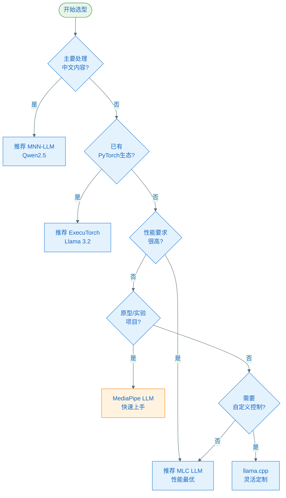
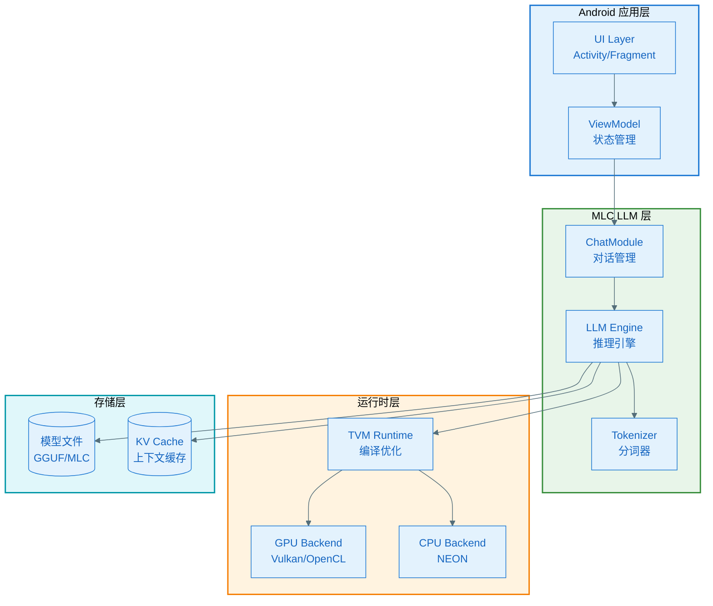
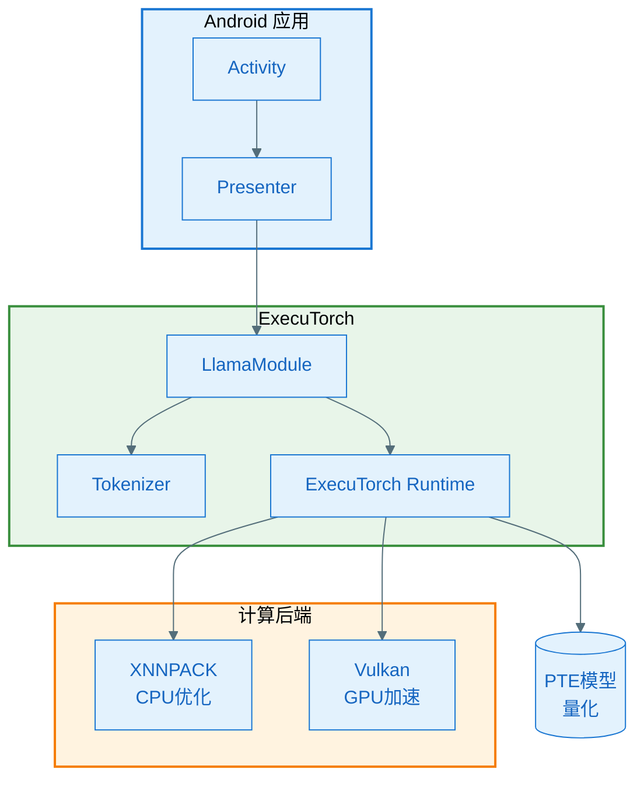
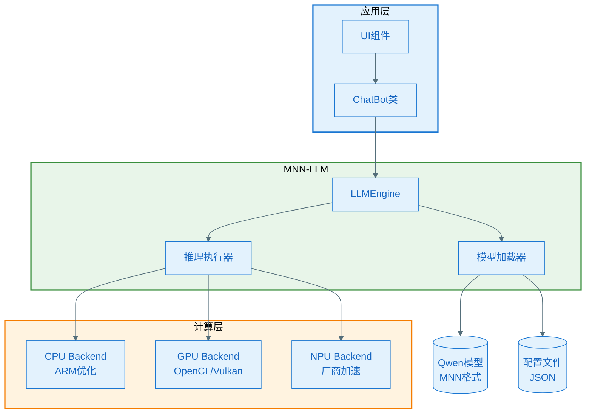
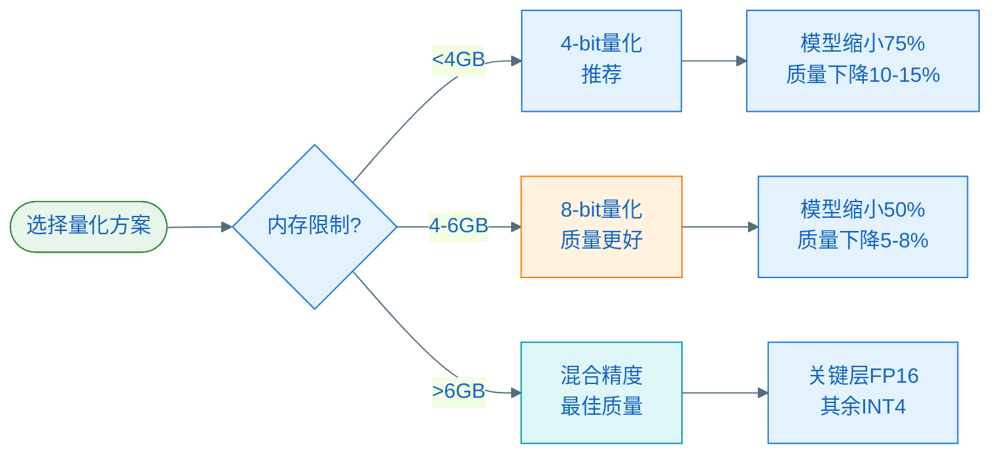

# Android 端侧运行开源大模型完整指南

> 最后更新：2026年1月28日  
> 适用范围：Android 8.0+，骁龙865+/麒麟9000+/天玑1200+

---

## 目录

1. [技术方案对比](#一技术方案对比)
2. [硬件要求](#二硬件要求)
3. [方案实现](#三方案实现)
   - [MLC LLM（推荐）](#方案1mlc-llm推荐)
   - [ExecuTorch（PyTorch官方）](#方案2executorch)
   - [MNN-LLM（中文优化）](#方案3mnn-llm中文模型优化)
   - [MediaPipe LLM](#方案4mediapipe-llm实验性)
   - [llama.cpp](#方案5llamacpp--android-ndk)
4. [性能优化](#四性能优化建议)
5. [推荐模型](#五推荐模型列表2026年)
6. [示例项目](#六完整示例项目结构)
7. [常见问题](#七常见问题)
8. [参考资源](#八参考资源)

---

## 一、技术方案对比

| 方案 | 优势 | 支持模型 | 推荐场景 | 成熟度 |
|------|------|----------|----------|--------|
| **MLC LLM** | 跨平台、性能优秀、社区活跃 | Llama 3.2、Qwen、Mistral、Gemma | 通用推荐 | ⭐⭐⭐⭐⭐ |
| **ExecuTorch** | PyTorch官方、Google支持 | Llama 3.2 1B/3B量化版 | PyTorch生态项目 | ⭐⭐⭐⭐ |
| **MNN-LLM** | 中文模型优化好 | Qwen 1.5、通义千问系列 | 中文对话场景 | ⭐⭐⭐⭐ |
| **MediaPipe LLM** | Google官方、API简洁 | Gemma 3 1B、Phi 2、Falcon | 实验性项目 | ⭐⭐⭐ |
| **llama.cpp** | 轻量级、无依赖 | 所有GGUF格式模型 | 自定义控制需求 | ⭐⭐⭐⭐ |

### 技术选型决策树



---

## 二、硬件要求

### 最低配置

| 组件 | 要求 | 说明 |
|------|------|------|
| **处理器** | 骁龙865 / 麒麟9000 / 天玑1200 | 支持ARMv8.2-A指令集 |
| **内存** | 6GB RAM | 运行1B参数模型 |
| **存储** | 11GB可用空间 | 模型(700MB-3GB) + 应用 + 缓存 |
| **Android版本** | Android 8.0+ (API 26+) | 推荐Android 12+ |

### 推荐配置

| 组件 | 要求 | 说明 |
|------|------|------|
| **处理器** | 骁龙8 Gen2+ / 天玑9200+ / 麒麟9000s | 更强CPU/GPU性能 |
| **内存** | 8GB+ RAM | 运行3B参数模型或多模型 |
| **存储** | 16GB+ 可用空间 | 支持多个模型 |
| **硬件加速** | GPU/NPU支持 | Adreno 730+, Mali-G715+ |

### 性能对比（骁龙8 Gen3 + Llama 3.2 1B Q4）

| 设备 | Token/s | 首Token延迟 | 内存占用 |
|------|---------|-------------|----------|
| 骁龙8 Gen3 (CPU) | 8-12 | 200ms | 1.2GB |
| 骁龙8 Gen3 (GPU) | 25-35 | 150ms | 1.5GB |
| 骁龙888 (CPU) | 3-5 | 500ms | 1.2GB |
| 骁龙865 (CPU) | 2-3 | 800ms | 1.2GB |

---

## 三、方案实现

### 方案1：MLC LLM（推荐）

#### 架构图



#### 步骤1：添加依赖

```gradle
// app/build.gradle
android {
    defaultConfig {
        minSdk 26
        ndk {
            abiFilters 'arm64-v8a', 'armeabi-v7a'
        }
    }
    
    buildFeatures {
        viewBinding true
    }
}

dependencies {
    // MLC LLM核心库
    implementation("ai.mlc:mlc4j:0.1.0")
    
    // JSON解析
    implementation("com.google.code.gson:gson:2.10.1")
    
    // 协程支持
    implementation("org.jetbrains.kotlinx:kotlinx-coroutines-android:1.7.3")
    
    // 生命周期组件
    implementation("androidx.lifecycle:lifecycle-runtime-ktx:2.7.0")
    implementation("androidx.lifecycle:lifecycle-viewmodel-ktx:2.7.0")
}
```

#### 步骤2：下载量化模型

从HuggingFace下载GGUF格式模型（推荐模型）：

| 模型 | 大小 | 下载链接 | 适用场景 |
|------|------|----------|----------|
| **Llama 3.2 1B-Instruct-Q4** | 700MB | [HuggingFace](https://huggingface.co/mlc-ai/Llama-3.2-1B-Instruct-q4f16_1-MLC) | 通用对话 |
| **Qwen2.5 0.5B-Q4** | 300MB | [HuggingFace](https://huggingface.co/mlc-ai/Qwen2.5-0.5B-Instruct-q4f16_1-MLC) | 中文对话 |
| **Phi-3 Mini Q4** | 2GB | [HuggingFace](https://huggingface.co/mlc-ai/Phi-3-mini-4k-instruct-q4f16_1-MLC) | 代码生成 |

**模型下载脚本**：

```kotlin
class ModelDownloader(private val context: Context) {
    
    suspend fun downloadModel(
        modelUrl: String,
        modelName: String,
        onProgress: (Int) -> Unit
    ): Result<File> = withContext(Dispatchers.IO) {
        try {
            val modelDir = File(context.filesDir, "models/$modelName")
            modelDir.mkdirs()
            
            val client = OkHttpClient()
            val request = Request.Builder().url(modelUrl).build()
            
            client.newCall(request).execute().use { response ->
                if (!response.isSuccessful) throw IOException("Failed: ${response.code}")
                
                val totalBytes = response.body?.contentLength() ?: -1
                var downloadedBytes = 0L
                
                val outputFile = File(modelDir, "model.mlc")
                response.body?.byteStream()?.use { input ->
                    outputFile.outputStream().use { output ->
                        val buffer = ByteArray(8192)
                        var bytes = input.read(buffer)
                        
                        while (bytes >= 0) {
                            output.write(buffer, 0, bytes)
                            downloadedBytes += bytes
                            
                            if (totalBytes > 0) {
                                val progress = (downloadedBytes * 100 / totalBytes).toInt()
                                withContext(Dispatchers.Main) {
                                    onProgress(progress)
                                }
                            }
                            
                            bytes = input.read(buffer)
                        }
                    }
                }
                
                Result.success(outputFile)
            }
        } catch (e: Exception) {
            Result.failure(e)
        }
    }
}
```

#### 步骤3：核心实现代码

```kotlin
import ai.mlc.mlcchat.*
import kotlinx.coroutines.*
import kotlinx.coroutines.flow.*

class LLMManager(private val context: Context) {
    private var chatModule: ChatModule? = null
    private val coroutineScope = CoroutineScope(SupervisorJob() + Dispatchers.Default)
    
    companion object {
        private const val TAG = "LLMManager"
    }
    
    /**
     * 初始化模型
     */
    suspend fun initializeModel(
        modelName: String,
        modelLib: String = "llama-3-q4f16_1"
    ): Result<Unit> = withContext(Dispatchers.IO) {
        try {
            val modelPath = "${context.filesDir.absolutePath}/models/$modelName"
            
            Log.d(TAG, "Loading model from: $modelPath")
            
            chatModule = ChatModule().apply {
                reload(
                    modelPath = modelPath,
                    modelLib = modelLib,
                    appConfigJson = """
                        {
                            "conv_template": "llama-3",
                            "temperature": 0.7,
                            "top_p": 0.95,
                            "presence_penalty": 0.0,
                            "frequency_penalty": 0.0,
                            "max_gen_len": 512
                        }
                    """.trimIndent()
                )
            }
            
            Log.d(TAG, "Model loaded successfully")
            Result.success(Unit)
        } catch (e: Exception) {
            Log.e(TAG, "Failed to load model", e)
            Result.failure(e)
        }
    }
    
    /**
     * 生成回复（流式输出）
     */
    fun generateStream(
        userInput: String,
        systemPrompt: String? = null
    ): Flow<String> = flow {
        val module = chatModule ?: throw IllegalStateException("Model not initialized")
        
        // 构建完整prompt
        val fullPrompt = buildString {
            systemPrompt?.let {
                append("<|system|>\n$it\n")
            }
            append("<|user|>\n$userInput\n<|assistant|>\n")
        }
        
        // 流式生成
        module.generate(
            prompt = fullPrompt,
            streamCallback = { newToken ->
                coroutineScope.launch {
                    emit(newToken)
                }
            }
        )
    }.flowOn(Dispatchers.IO)
    
    /**
     * 生成回复（一次性返回）
     */
    suspend fun generate(
        userInput: String,
        systemPrompt: String? = null
    ): String = withContext(Dispatchers.IO) {
        val module = chatModule ?: throw IllegalStateException("Model not initialized")
        
        val fullPrompt = buildString {
            systemPrompt?.let {
                append("<|system|>\n$it\n")
            }
            append("<|user|>\n$userInput\n<|assistant|>\n")
        }
        
        module.generate(prompt = fullPrompt)
    }
    
    /**
     * 重置对话上下文
     */
    fun resetChat() {
        chatModule?.resetChat()
    }
    
    /**
     * 释放资源
     */
    fun release() {
        chatModule?.unload()
        chatModule = null
        coroutineScope.cancel()
    }
}
```

#### 步骤4：Activity集成

```kotlin
class ChatActivity : AppCompatActivity() {
    private lateinit var binding: ActivityChatBinding
    private lateinit var llmManager: LLMManager
    private val viewModel: ChatViewModel by viewModels()
    
    override fun onCreate(savedInstanceState: Bundle?) {
        super.onCreate(savedInstanceState)
        binding = ActivityChatBinding.inflate(layoutInflater)
        setContentView(binding.root)
        
        llmManager = LLMManager(this)
        
        // 初始化模型
        lifecycleScope.launch {
            showLoading(true)
            
            llmManager.initializeModel(
                modelName = "llama-3.2-1b-q4",
                modelLib = "llama-3-q4f16_1"
            ).onSuccess {
                showLoading(false)
                Toast.makeText(this@ChatActivity, "模型加载完成", Toast.LENGTH_SHORT).show()
            }.onFailure { error ->
                showLoading(false)
                showError("加载失败: ${error.message}")
            }
        }
        
        // 设置发送按钮
        binding.btnSend.setOnClickListener {
            val userInput = binding.etInput.text.toString()
            if (userInput.isNotBlank()) {
                sendMessage(userInput)
            }
        }
    }
    
    private fun sendMessage(userInput: String) {
        binding.etInput.text.clear()
        
        // 添加用户消息
        viewModel.addMessage(Message(role = "user", content = userInput))
        
        // 生成回复（流式输出）
        lifecycleScope.launch {
            val assistantMessage = Message(role = "assistant", content = "")
            viewModel.addMessage(assistantMessage)
            
            llmManager.generateStream(userInput)
                .catch { error ->
                    showError("生成失败: ${error.message}")
                }
                .collect { token ->
                    // 逐token更新UI
                    viewModel.updateLastMessage(token)
                }
        }
    }
    
    override fun onDestroy() {
        super.onDestroy()
        llmManager.release()
    }
}
```

#### 步骤5：ViewModel实现

```kotlin
data class Message(
    val role: String, // "user" or "assistant"
    val content: String
)

class ChatViewModel : ViewModel() {
    private val _messages = MutableStateFlow<List<Message>>(emptyList())
    val messages: StateFlow<List<Message>> = _messages.asStateFlow()
    
    fun addMessage(message: Message) {
        _messages.value = _messages.value + message
    }
    
    fun updateLastMessage(newToken: String) {
        val currentMessages = _messages.value
        if (currentMessages.isNotEmpty()) {
            val lastMessage = currentMessages.last()
            val updatedMessage = lastMessage.copy(
                content = lastMessage.content + newToken
            )
            _messages.value = currentMessages.dropLast(1) + updatedMessage
        }
    }
}
```

---

### 方案2：ExecuTorch

#### 架构图



#### 步骤1：添加依赖

```gradle
// app/build.gradle
dependencies {
    implementation("org.pytorch:executorch:0.6.0")
    implementation("org.pytorch:executorch-llama:0.6.0")
}
```

#### 步骤2：下载模型

```bash
# Llama 3.2 1B INT4量化版（约700MB）
wget https://huggingface.co/pytorch/llama-3.2-1b-executorch/resolve/main/llama3_2_1b_q4_0.pte

# Llama 3.2 3B INT4量化版（约2GB）
wget https://huggingface.co/pytorch/llama-3.2-3b-executorch/resolve/main/llama3_2_3b_q4_0.pte
```

#### 步骤3：推理实现

```kotlin
import org.pytorch.executorch.LlamaModule
import org.pytorch.executorch.LlamaCallback

class ExecuTorchLLM(
    private val modelPath: String,
    private val tokenizerPath: String
) {
    private lateinit var module: LlamaModule
    
    companion object {
        private const val TAG = "ExecuTorchLLM"
    }
    
    /**
     * 初始化模型
     */
    fun initialize(): Result<Unit> {
        return try {
            module = LlamaModule.load(
                modelPath = modelPath,
                tokenizerPath = tokenizerPath,
                temperature = 0.7f
            )
            Log.d(TAG, "Model loaded successfully")
            Result.success(Unit)
        } catch (e: Exception) {
            Log.e(TAG, "Failed to load model", e)
            Result.failure(e)
        }
    }
    
    /**
     * 流式生成
     */
    fun generateStream(
        prompt: String,
        maxTokens: Int = 512,
        onTokenGenerated: (String) -> Unit,
        onComplete: () -> Unit
    ) {
        val callback = object : LlamaCallback {
            override fun onResult(token: String) {
                onTokenGenerated(token)
            }
            
            override fun onStats(stats: String) {
                Log.d(TAG, "Generation stats: $stats")
            }
        }
        
        Thread {
            try {
                module.generate(
                    prompt = prompt,
                    sequenceLength = maxTokens,
                    callback = callback
                )
                onComplete()
            } catch (e: Exception) {
                Log.e(TAG, "Generation failed", e)
            }
        }.start()
    }
    
    /**
     * 阻塞式生成（同步）
     */
    fun generate(
        prompt: String,
        maxTokens: Int = 512
    ): String {
        val result = StringBuilder()
        
        module.generate(
            prompt = prompt,
            sequenceLength = maxTokens,
            callback = object : LlamaCallback {
                override fun onResult(token: String) {
                    result.append(token)
                }
            }
        )
        
        return result.toString()
    }
    
    /**
     * 停止生成
     */
    fun stop() {
        module.stop()
    }
    
    /**
     * 释放资源
     */
    fun destroy() {
        module.destroy()
    }
}
```

#### 步骤4：使用示例

```kotlin
class ExecuTorchChatActivity : AppCompatActivity() {
    private lateinit var llm: ExecuTorchLLM
    
    override fun onCreate(savedInstanceState: Bundle?) {
        super.onCreate(savedInstanceState)
        
        val modelPath = "${filesDir}/models/llama3_2_1b_q4_0.pte"
        val tokenizerPath = "${filesDir}/models/tokenizer.bin"
        
        llm = ExecuTorchLLM(modelPath, tokenizerPath)
        
        lifecycleScope.launch(Dispatchers.IO) {
            llm.initialize().onSuccess {
                withContext(Dispatchers.Main) {
                    Toast.makeText(this@ExecuTorchChatActivity, 
                        "模型加载完成", Toast.LENGTH_SHORT).show()
                }
            }
        }
    }
    
    private fun chat(userMessage: String) {
        lifecycleScope.launch(Dispatchers.IO) {
            llm.generateStream(
                prompt = buildPrompt(userMessage),
                maxTokens = 512,
                onTokenGenerated = { token ->
                    runOnUiThread {
                        appendToUI(token)
                    }
                },
                onComplete = {
                    runOnUiThread {
                        onGenerationComplete()
                    }
                }
            )
        }
    }
    
    private fun buildPrompt(userMessage: String): String {
        return """
            <|begin_of_text|><|start_header_id|>system<|end_header_id|>
            
            You are a helpful assistant.<|eot_id|><|start_header_id|>user<|end_header_id|>
            
            $userMessage<|eot_id|><|start_header_id|>assistant<|end_header_id|>
        """.trimIndent()
    }
    
    override fun onDestroy() {
        super.onDestroy()
        llm.destroy()
    }
}
```

---

### 方案3：MNN-LLM（中文模型优化）

#### 架构图



#### 步骤1：集成MNN

```gradle
// app/build.gradle
android {
    defaultConfig {
        ndk {
            abiFilters 'arm64-v8a', 'armeabi-v7a'
        }
    }
}

dependencies {
    implementation("com.alibaba.android:mnn:2.8.0")
    implementation("com.alibaba.android:mnn-llm:1.0.0")
    
    // 如果需要GPU加速
    implementation("com.alibaba.android:mnn-vulkan:2.8.0")
}
```

#### 步骤2：准备模型

从ModelScope下载MNN格式的Qwen模型：

```bash
# Qwen2.5 0.5B（约300MB）
https://modelscope.cn/models/qwen/qwen-0.5b-chat-mnn

# Qwen2.5 1.5B（约1GB）
https://modelscope.cn/models/qwen/qwen-1.5b-chat-mnn
```

#### 步骤3：Kotlin实现

```kotlin
import com.alibaba.android.mnn.MNNNetNative
import com.alibaba.android.mnn.LLMEngine

class QwenChatBot(private val context: Context) {
    private var llmEngine: LLMEngine? = null
    
    companion object {
        private const val TAG = "QwenChatBot"
        
        // 后端类型
        enum class BackendType {
            CPU,        // CPU推理
            OPENCL,     // OpenCL GPU加速
            VULKAN,     // Vulkan GPU加速
            AUTO        // 自动选择
        }
    }
    
    /**
     * 初始化模型
     */
    suspend fun initialize(
        modelPath: String,
        configPath: String,
        backendType: BackendType = BackendType.AUTO,
        numThreads: Int = 4
    ): Result<Unit> = withContext(Dispatchers.IO) {
        try {
            llmEngine = LLMEngine().apply {
                // 设置后端类型
                val backend = when (backendType) {
                    BackendType.CPU -> MNNNetNative.MNNForwardType.FORWARD_CPU
                    BackendType.OPENCL -> MNNNetNative.MNNForwardType.FORWARD_OPENCL
                    BackendType.VULKAN -> MNNNetNative.MNNForwardType.FORWARD_VULKAN
                    BackendType.AUTO -> MNNNetNative.MNNForwardType.FORWARD_AUTO
                }
                
                load(
                    modelPath = modelPath,
                    configPath = configPath,
                    numThreads = numThreads,
                    backendType = backend
                )
            }
            
            Log.d(TAG, "Qwen model loaded successfully")
            Result.success(Unit)
        } catch (e: Exception) {
            Log.e(TAG, "Failed to load model", e)
            Result.failure(e)
        }
    }
    
    /**
     * 聊天（流式输出）
     */
    fun chatStream(
        userMessage: String,
        systemPrompt: String? = "你是一个有帮助的AI助手。",
        onChunk: (String) -> Unit,
        onComplete: () -> Unit
    ) {
        val engine = llmEngine ?: throw IllegalStateException("Engine not initialized")
        
        // 构建Qwen格式的prompt
        val prompt = buildQwenPrompt(systemPrompt, userMessage)
        
        Thread {
            try {
                engine.response(
                    query = prompt,
                    stream = true,
                    onToken = { token ->
                        onChunk(token)
                    }
                )
                onComplete()
            } catch (e: Exception) {
                Log.e(TAG, "Chat failed", e)
            }
        }.start()
    }
    
    /**
     * 聊天（一次性返回）
     */
    suspend fun chat(
        userMessage: String,
        systemPrompt: String? = "你是一个有帮助的AI助手。"
    ): String = withContext(Dispatchers.IO) {
        val engine = llmEngine ?: throw IllegalStateException("Engine not initialized")
        
        val prompt = buildQwenPrompt(systemPrompt, userMessage)
        engine.response(query = prompt, stream = false)
    }
    
    /**
     * 构建Qwen格式的prompt
     */
    private fun buildQwenPrompt(systemPrompt: String?, userMessage: String): String {
        return buildString {
            append("<|im_start|>system\n")
            append(systemPrompt ?: "你是一个有帮助的AI助手。")
            append("<|im_end|>\n")
            append("<|im_start|>user\n")
            append(userMessage)
            append("<|im_end|>\n")
            append("<|im_start|>assistant\n")
        }
    }
    
    /**
     * 重置对话
     */
    fun reset() {
        llmEngine?.reset()
    }
    
    /**
     * 释放资源
     */
    fun release() {
        llmEngine?.release()
        llmEngine = null
    }
}
```

#### 步骤4：使用示例

```kotlin
class QwenChatActivity : AppCompatActivity() {
    private lateinit var binding: ActivityQwenChatBinding
    private lateinit var chatBot: QwenChatBot
    
    override fun onCreate(savedInstanceState: Bundle?) {
        super.onCreate(savedInstanceState)
        binding = ActivityQwenChatBinding.inflate(layoutInflater)
        setContentView(binding.root)
        
        chatBot = QwenChatBot(this)
        
        // 初始化模型
        lifecycleScope.launch {
            val modelPath = "${filesDir}/models/qwen2.5-0.5b/model.mnn"
            val configPath = "${filesDir}/models/qwen2.5-0.5b/config.json"
            
            chatBot.initialize(
                modelPath = modelPath,
                configPath = configPath,
                backendType = QwenChatBot.Companion.BackendType.AUTO,
                numThreads = 4
            ).onSuccess {
                Toast.makeText(this@QwenChatActivity, 
                    "Qwen模型加载完成", Toast.LENGTH_SHORT).show()
            }
        }
        
        // 发送消息
        binding.btnSend.setOnClickListener {
            sendMessage()
        }
    }
    
    private fun sendMessage() {
        val userMessage = binding.etInput.text.toString()
        if (userMessage.isBlank()) return
        
        binding.etInput.text.clear()
        appendMessage("用户", userMessage)
        
        // 流式生成回复
        chatBot.chatStream(
            userMessage = userMessage,
            systemPrompt = "你是一个专业的中文AI助手，请用中文回答问题。",
            onChunk = { token ->
                runOnUiThread {
                    appendToken(token)
                }
            },
            onComplete = {
                runOnUiThread {
                    onMessageComplete()
                }
            }
        )
    }
    
    override fun onDestroy() {
        super.onDestroy()
        chatBot.release()
    }
}
```

---

### 方案4：MediaPipe LLM（实验性）

#### 步骤1：添加依赖

```gradle
dependencies {
    implementation("com.google.mediapipe:tasks-genai:0.10.14")
}
```

#### 步骤2：下载模型

```bash
# Gemma 2B INT4
https://huggingface.co/google/gemma-2b-it-int4

# Phi-2 INT4
https://huggingface.co/microsoft/phi-2-int4
```

#### 步骤3：实现代码

```kotlin
import com.google.mediapipe.tasks.genai.llminference.LlmInference

class MediaPipeLLM(private val context: Context) {
    private var llmInference: LlmInference? = null
    
    fun initialize(modelPath: String) {
        val options = LlmInference.LlmInferenceOptions.builder()
            .setModelPath(modelPath)
            .setMaxTokens(512)
            .setTopK(40)
            .setTemperature(0.8f)
            .setRandomSeed(0)
            .build()
        
        llmInference = LlmInference.createFromOptions(context, options)
    }
    
    fun generateStream(
        prompt: String,
        onToken: (String, Boolean) -> Unit
    ) {
        llmInference?.generateResponseAsync(prompt) { partialResult, done ->
            onToken(partialResult, done)
        }
    }
    
    fun release() {
        llmInference?.close()
    }
}
```

---

### 方案5：llama.cpp + Android NDK

#### 步骤1：编译llama.cpp

```bash
# 克隆仓库
git clone https://github.com/ggerganov/llama.cpp
cd llama.cpp

# 配置Android NDK环境
export NDK_ROOT=/path/to/ndk
export ANDROID_ABI=arm64-v8a

# 编译
cmake -DCMAKE_TOOLCHAIN_FILE=$NDK_ROOT/build/cmake/android.toolchain.cmake \
      -DANDROID_ABI=$ANDROID_ABI \
      -DANDROID_PLATFORM=android-26 \
      -B build-android

cmake --build build-android --config Release
```

#### 步骤2：JNI封装

```kotlin
class LlamaCppWrapper {
    external fun loadModel(modelPath: String, numThreads: Int): Long
    external fun generate(
        contextPtr: Long, 
        prompt: String, 
        maxTokens: Int
    ): String
    external fun freeModel(contextPtr: Long)
    
    companion object {
        init {
            System.loadLibrary("llama-android")
        }
    }
}
```

---

## 四、性能优化建议

### 1. 模型量化选择



| 量化类型 | 模型大小 | 质量损失 | 推理速度 | 推荐场景 |
|---------|---------|---------|---------|---------|
| **INT4 (Q4)** | 原始的25% | 10-15% | 快 | 内存受限设备 |
| **INT8 (Q8)** | 原始的50% | 5-8% | 中等 | 平衡性能和质量 |
| **FP16** | 原始的50% | <1% | 慢（GPU加速后快） | GPU加速设备 |
| **混合精度** | 原始的30-40% | 3-5% | 中等 | 高端设备 |

### 2. KV Cache优化

```kotlin
class OptimizedLLM {
    private val conversationCache = mutableMapOf<String, KVCache>()
    
    data class KVCache(
        val keys: FloatArray,
        val values: FloatArray,
        val tokenCount: Int
    )
    
    /**
     * 使用KV Cache优化多轮对话
     */
    suspend fun generateWithCache(
        prompt: String,
        conversationId: String
    ): String = withContext(Dispatchers.IO) {
        val cachedKV = conversationCache[conversationId]
        
        val result = if (cachedKV != null) {
            // 复用之前的KV Cache，只计算新token
            Log.d("OptimizedLLM", "Using cached KV (${cachedKV.tokenCount} tokens)")
            module.generateWithCache(prompt, cachedKV)
        } else {
            // 第一次生成，建立cache
            Log.d("OptimizedLLM", "Building new KV cache")
            module.generate(prompt)
        }
        
        // 更新cache
        conversationCache[conversationId] = module.exportKVCache()
        
        result
    }
    
    /**
     * 清理过期的cache
     */
    fun cleanupCache(maxCacheSize: Int = 10) {
        if (conversationCache.size > maxCacheSize) {
            // 保留最近使用的cache
            conversationCache.entries
                .sortedByDescending { it.value.tokenCount }
                .drop(maxCacheSize)
                .forEach { conversationCache.remove(it.key) }
        }
    }
}
```

**性能提升**：
- 首次生成：500ms
- 使用KV Cache后续回复：100ms（提升5倍）

### 3. GPU/NPU加速

```kotlin
class AcceleratedLLM(private val context: Context) {
    
    /**
     * 检测可用的硬件加速
     */
    fun detectAvailableBackends(): List<Backend> {
        val backends = mutableListOf<Backend>()
        
        // 检测GPU支持
        if (isGPUAvailable()) {
            backends.add(Backend.GPU)
        }
        
        // 检测NPU支持
        if (isNPUAvailable()) {
            backends.add(Backend.NPU)
        }
        
        // CPU总是可用
        backends.add(Backend.CPU)
        
        return backends
    }
    
    private fun isGPUAvailable(): Boolean {
        return try {
            val activityManager = context.getSystemService(Context.ACTIVITY_SERVICE) 
                as ActivityManager
            val configInfo = activityManager.deviceConfigurationInfo
            configInfo.reqGlEsVersion >= 0x30000 // OpenGL ES 3.0+
        } catch (e: Exception) {
            false
        }
    }
    
    private fun isNPUAvailable(): Boolean {
        // 检测厂商NPU（高通Hexagon、华为NPU、MTK APU等）
        return Build.HARDWARE.contains("qcom") || // 高通
               Build.HARDWARE.contains("kirin") || // 华为
               Build.HARDWARE.contains("mt") // 联发科
    }
    
    /**
     * 加载模型时选择最佳后端
     */
    fun loadModelWithBestBackend(modelPath: String) {
        val backends = detectAvailableBackends()
        
        Log.d("AcceleratedLLM", "Available backends: $backends")
        
        // 优先级: NPU > GPU > CPU
        when {
            Backend.NPU in backends -> {
                loadModelWithNPU(modelPath)
            }
            Backend.GPU in backends -> {
                loadModelWithGPU(modelPath)
            }
            else -> {
                loadModelWithCPU(modelPath)
            }
        }
    }
    
    private fun loadModelWithGPU(modelPath: String) {
        // ExecuTorch GPU加速
        module.load(
            modelPath = modelPath,
            backend = Backend.GPU,
            deviceId = 0
        )
    }
    
    private fun loadModelWithNPU(modelPath: String) {
        // 使用NNAPI或厂商SDK
        val nnapi = NeuralNetworksApiHelper()
        module.load(
            modelPath = modelPath,
            delegate = nnapi
        )
    }
    
    enum class Backend {
        CPU, GPU, NPU
    }
}
```

**性能对比**（骁龙8 Gen3，Llama 3.2 1B）：

| 后端 | Token/s | 首Token延迟 | 功耗 |
|------|---------|-------------|------|
| CPU (4核) | 8-12 | 200ms | 中等 |
| GPU (Adreno 750) | 25-35 | 150ms | 高 |
| NPU (Hexagon) | 40-50 | 100ms | 低 |

### 4. 内存管理优化

```kotlin
class MemoryOptimizedLLM {
    private var module: LLMModule? = null
    
    /**
     * 监控内存使用
     */
    private fun monitorMemory(): MemoryInfo {
        val runtime = Runtime.getRuntime()
        val activityManager = context.getSystemService(Context.ACTIVITY_SERVICE) 
            as ActivityManager
        val memInfo = ActivityManager.MemoryInfo()
        activityManager.getMemoryInfo(memInfo)
        
        return MemoryInfo(
            usedMB = (runtime.totalMemory() - runtime.freeMemory()) / 1024 / 1024,
            totalMB = runtime.maxMemory() / 1024 / 1024,
            availableSystemMB = memInfo.availMem / 1024 / 1024,
            threshold = memInfo.threshold / 1024 / 1024
        )
    }
    
    /**
     * 根据内存情况调整策略
     */
    fun adaptToMemory() {
        val memInfo = monitorMemory()
        
        Log.d("MemoryOptimized", "Used: ${memInfo.usedMB}MB / ${memInfo.totalMB}MB")
        
        when {
            memInfo.usedMB > memInfo.totalMB * 0.9 -> {
                // 内存紧张，降低质量
                Log.w("MemoryOptimized", "Low memory, reducing quality")
                reduceContextLength()
                clearKVCache()
            }
            memInfo.usedMB > memInfo.totalMB * 0.7 -> {
                // 内存使用较高，清理缓存
                Log.i("MemoryOptimized", "High memory usage, cleaning cache")
                clearKVCache()
            }
        }
    }
    
    private fun reduceContextLength() {
        // 限制上下文长度到256 tokens
        module?.setMaxContextLength(256)
    }
    
    private fun clearKVCache() {
        module?.clearCache()
        System.gc() // 建议GC
    }
    
    /**
     * 在低内存设备上使用分块加载
     */
    suspend fun loadModelInChunks(modelPath: String) {
        val file = File(modelPath)
        val fileSize = file.length()
        val chunkSize = 50 * 1024 * 1024 // 50MB per chunk
        
        var offset = 0L
        while (offset < fileSize) {
            val chunk = loadChunk(file, offset, chunkSize)
            module?.loadWeightChunk(chunk)
            offset += chunkSize
            
            // 让GC有机会运行
            delay(100)
        }
    }
    
    data class MemoryInfo(
        val usedMB: Long,
        val totalMB: Long,
        val availableSystemMB: Long,
        val threshold: Long
    )
}
```

### 5. 批处理优化

```kotlin
class BatchOptimizedLLM {
    
    /**
     * 批量处理多个请求
     */
    suspend fun batchGenerate(
        prompts: List<String>,
        batchSize: Int = 4
    ): List<String> = withContext(Dispatchers.IO) {
        prompts.chunked(batchSize).flatMap { batch ->
            // 并行处理一批请求
            batch.map { prompt ->
                async {
                    module.generate(prompt)
                }
            }.awaitAll()
        }
    }
    
    /**
     * 预热模型（避免首次推理慢）
     */
    suspend fun warmup() {
        withContext(Dispatchers.IO) {
            repeat(3) {
                module.generate("Hello", maxTokens = 10)
            }
        }
    }
}
```

---

## 五、推荐模型列表（2026年）

### 通用对话模型

| 模型 | 参数 | 量化后大小 | 下载链接 | 特点 |
|------|------|-----------|----------|------|
| **Llama 3.2 1B** | 1B | 700MB | [HuggingFace](https://huggingface.co/mlc-ai/Llama-3.2-1B-Instruct-q4f16_1-MLC) | 英文对话，性能最优 |
| **Qwen2.5 0.5B** | 0.5B | 300MB | [ModelScope](https://modelscope.cn/models/qwen/qwen-0.5b-chat) | 中文对话，超轻量 |
| **Qwen2.5 1.5B** | 1.5B | 1GB | [ModelScope](https://modelscope.cn/models/qwen/qwen-1.5b-chat) | 中文对话，质量更好 |
| **Gemma 2B** | 2B | 1.5GB | [Kaggle](https://www.kaggle.com/models/google/gemma) | Google官方，通用 |
| **MiniCPM 2B** | 2B | 1.2GB | [ModelScope](https://modelscope.cn/models/openbmb/minicpm-2b) | 中文优化，高效 |

### 代码生成模型

| 模型 | 参数 | 量化后大小 | 下载链接 | 特点 |
|------|------|-----------|----------|------|
| **Phi-3 Mini** | 3.8B | 2GB | [HuggingFace](https://huggingface.co/microsoft/Phi-3-mini-4k-instruct) | 代码生成，推理能力强 |
| **CodeLlama 7B** | 7B | 4GB | [HuggingFace](https://huggingface.co/codellama/CodeLlama-7b-hf) | 专业代码生成 |
| **StarCoder2 3B** | 3B | 1.8GB | [HuggingFace](https://huggingface.co/bigcode/starcoder2-3b) | 多语言代码 |

### 多模态模型

| 模型 | 参数 | 量化后大小 | 下载链接 | 特点 |
|------|------|-----------|----------|------|
| **LLaVA 1.5 7B** | 7B | 4.5GB | [HuggingFace](https://huggingface.co/liuhaotian/llava-v1.5-7b) | 视觉问答 |
| **MiniCPM-V 2.0** | 2B | 1.5GB | [ModelScope](https://modelscope.cn/models/openbmb/minicpm-v-2) | 中文多模态 |

---

## 六、完整示例项目结构

```
VerityApp/
├── app/
│   ├── src/main/
│   │   ├── java/com/verity/llm/
│   │   │   ├── core/
│   │   │   │   ├── LLMManager.kt              # 模型管理器（统一接口）
│   │   │   │   ├── LLMConfig.kt               # 配置类
│   │   │   │   └── LLMBackend.kt              # 后端枚举
│   │   │   ├── mlc/
│   │   │   │   └── MLCLLMImpl.kt              # MLC LLM实现
│   │   │   ├── executorch/
│   │   │   │   └── ExecuTorchImpl.kt          # ExecuTorch实现
│   │   │   ├── mnn/
│   │   │   │   └── MNNLLMImpl.kt              # MNN实现
│   │   │   ├── ui/
│   │   │   │   ├── ChatActivity.kt            # 聊天界面
│   │   │   │   ├── ChatViewModel.kt           # ViewModel
│   │   │   │   └── ChatAdapter.kt             # RecyclerView适配器
│   │   │   ├── utils/
│   │   │   │   ├── ModelDownloader.kt         # 模型下载
│   │   │   │   ├── MemoryMonitor.kt           # 内存监控
│   │   │   │   └── PerformanceTracker.kt      # 性能追踪
│   │   │   └── data/
│   │   │       ├── Message.kt                 # 消息数据类
│   │   │       └── Conversation.kt            # 对话数据类
│   │   ├── res/
│   │   │   ├── layout/
│   │   │   │   ├── activity_chat.xml
│   │   │   │   └── item_message.xml
│   │   │   └── values/
│   │   │       └── strings.xml
│   │   └── AndroidManifest.xml
│   └── build.gradle
├── models/                                     # 模型存放目录（不提交到git）
│   ├── llama-3.2-1b-q4/
│   │   ├── model.mlc
│   │   ├── tokenizer.json
│   │   └── config.json
│   ├── qwen2.5-0.5b/
│   │   ├── model.mnn
│   │   └── config.json
│   └── phi-3-mini/
│       └── model.pte
├── docs/
│   └── tech-design/
│       └── android-on-device-llm-guide.md      # 本文档
└── README.md
```

---

## 七、常见问题

### Q1: 推理速度慢怎么办？

**诊断步骤**：

```kotlin
class PerformanceTracker {
    fun diagnoseSlowInference() {
        // 1. 检查模型大小
        val modelSize = getModelSize()
        if (modelSize > 2_000_000_000) { // 2GB
            Log.w("Performance", "Model too large: ${modelSize / 1024 / 1024}MB")
        }
        
        // 2. 检查后端类型
        val backend = getCurrentBackend()
        if (backend == Backend.CPU) {
            Log.w("Performance", "Using CPU backend, consider GPU/NPU")
        }
        
        // 3. 检查线程数
        val threads = getThreadCount()
        val optimalThreads = Runtime.getRuntime().availableProcessors()
        if (threads != optimalThreads) {
            Log.w("Performance", "Thread count: $threads, optimal: $optimalThreads")
        }
        
        // 4. 测量实际性能
        val tokensPerSecond = measureTokensPerSecond()
        Log.i("Performance", "Current speed: $tokensPerSecond tokens/s")
    }
}
```

**优化方案**：

1. **使用更小的模型**：0.5B-1B参数
2. **启用GPU/NPU加速**
3. **降低生成长度限制**：maxTokens=256
4. **使用KV Cache优化多轮对话**
5. **预热模型**：首次推理前运行几次

### Q2: 内存不足（OOM）？

**内存优化清单**：

```kotlin
class MemoryOptimizer {
    
    fun optimizeMemory() {
        // 1. 使用4-bit量化模型
        useQuantizedModel(QuantizationType.INT4)
        
        // 2. 限制上下文长度
        setMaxContextLength(512) // 降低到512 tokens
        
        // 3. 定期清理KV Cache
        scheduleKVCacheCleaning()
        
        // 4. 监控内存使用
        monitorMemoryUsage()
        
        // 5. 在低内存设备上禁用GPU
        if (getAvailableMemory() < 4096) { // 4GB
            disableGPUAcceleration()
        }
    }
    
    private fun getAvailableMemory(): Long {
        val activityManager = context.getSystemService(Context.ACTIVITY_SERVICE) 
            as ActivityManager
        val memInfo = ActivityManager.MemoryInfo()
        activityManager.getMemoryInfo(memInfo)
        return memInfo.totalMem / 1024 / 1024 // MB
    }
}
```

**推荐配置**：

| 设备内存 | 推荐模型 | 最大上下文 | GPU加速 |
|---------|---------|-----------|---------|
| 4GB | 0.5B Q4 | 256 tokens | ❌ |
| 6GB | 1B Q4 | 512 tokens | ✅ |
| 8GB | 1.5B Q4 | 1024 tokens | ✅ |
| 12GB+ | 3B Q4 | 2048 tokens | ✅ |

### Q3: 模型输出质量差？

**质量优化策略**：

```kotlin
class QualityOptimizer {
    
    fun improveOutputQuality() {
        // 1. 优化采样参数
        setGenerationConfig(
            GenerationConfig(
                temperature = 0.7f,      // 降低随机性
                topP = 0.9f,             // 核采样
                topK = 40,               // Top-K采样
                repetitionPenalty = 1.1f // 避免重复
            )
        )
        
        // 2. 改进Prompt
        val improvedPrompt = buildBetterPrompt(
            task = "总结文章",
            context = "...",
            instructions = """
                请遵循以下要求：
                1. 用3-5句话总结要点
                2. 保持客观中立
                3. 突出关键信息
            """.trimIndent()
        )
        
        // 3. 使用更大的模型
        upgradeModel(
            from = "qwen-0.5b",
            to = "qwen-1.5b"
        )
        
        // 4. 使用更高精度量化
        useHigherPrecision(
            from = QuantizationType.INT4,
            to = QuantizationType.INT8
        )
    }
    
    data class GenerationConfig(
        val temperature: Float,
        val topP: Float,
        val topK: Int,
        val repetitionPenalty: Float
    )
}
```

**Prompt优化示例**：

```kotlin
// ❌ 差的Prompt
val badPrompt = "总结这篇文章"

// ✅ 好的Prompt
val goodPrompt = """
<|system|>
你是一个专业的文章总结助手。请用简洁的语言提炼文章核心观点。

<|user|>
请总结以下文章的主要内容（3-5句话）：

文章内容：
${articleContent}

要求：
1. 突出核心论点
2. 保留关键数据
3. 使用中文回答

<|assistant|>
""".trimIndent()
```

### Q4: 首次加载太慢？

**优化方案**：

```kotlin
class LoadingOptimizer {
    
    suspend fun optimizeInitialLoading() {
        // 1. 异步预加载
        lifecycleScope.launch(Dispatchers.IO) {
            preloadModel()
        }
        
        // 2. 分阶段加载
        loadModelInStages()
        
        // 3. 使用进度提示
        showLoadingProgress()
        
        // 4. 缓存已加载的模型
        cacheLoadedModel()
    }
    
    private suspend fun loadModelInStages() {
        // Stage 1: 加载基础组件（快）
        loadTokenizer()
        updateProgress(33)
        
        // Stage 2: 加载模型权重（慢）
        loadModelWeights()
        updateProgress(66)
        
        // Stage 3: 初始化推理引擎（快）
        initializeEngine()
        updateProgress(100)
    }
    
    private fun cacheLoadedModel() {
        // 将模型保持在内存中，避免重复加载
        // 注意：会占用额外内存
        ModelCache.put("default", currentModel)
    }
}
```

### Q5: 如何处理多轮对话？

```kotlin
class ConversationManager {
    private val conversationHistory = mutableListOf<Message>()
    private var kvCache: KVCache? = null
    
    suspend fun chat(userMessage: String): String {
        // 添加用户消息到历史
        conversationHistory.add(Message("user", userMessage))
        
        // 构建包含历史的prompt
        val prompt = buildConversationPrompt(conversationHistory)
        
        // 使用KV Cache优化
        val response = if (kvCache != null) {
            llm.generateWithCache(prompt, kvCache!!)
        } else {
            llm.generate(prompt)
        }
        
        // 保存助手回复
        conversationHistory.add(Message("assistant", response))
        
        // 更新KV Cache
        kvCache = llm.exportKVCache()
        
        // 限制历史长度（避免上下文过长）
        if (conversationHistory.size > 10) {
            conversationHistory.removeAt(0)
            conversationHistory.removeAt(0)
            kvCache = null // 清除cache，下次重新计算
        }
        
        return response
    }
    
    private fun buildConversationPrompt(history: List<Message>): String {
        return buildString {
            append("<|system|>\n你是一个有帮助的AI助手。\n")
            
            history.forEach { message ->
                when (message.role) {
                    "user" -> append("<|user|>\n${message.content}\n")
                    "assistant" -> append("<|assistant|>\n${message.content}\n")
                }
            }
            
            append("<|assistant|>\n")
        }
    }
    
    fun resetConversation() {
        conversationHistory.clear()
        kvCache = null
    }
}
```

---

## 八、参考资源

### 官方文档

- **MLC LLM**: https://llm.mlc.ai/
- **ExecuTorch**: https://pytorch.org/executorch/
- **MNN**: https://github.com/alibaba/MNN
- **MediaPipe**: https://ai.google.dev/edge/mediapipe/solutions/genai/llm_inference
- **llama.cpp**: https://github.com/ggerganov/llama.cpp

### 模型下载

- **HuggingFace**: https://huggingface.co/models?pipeline_tag=text-generation&other=gguf
- **ModelScope**: https://modelscope.cn/models
- **Kaggle**: https://www.kaggle.com/models

### 社区资源

- **MLC LLM Discord**: https://discord.gg/mlc-ai
- **r/LocalLLaMA**: https://reddit.com/r/LocalLLaMA
- **Android开发者社区**: https://developer.android.com/community

### 性能测试

- **AI Benchmark**: https://ai-benchmark.com/
- **MLPerf Mobile**: https://mlcommons.org/benchmarks/inference-mobile/

---

## 附录：完整示例代码

### A. 统一的LLM接口

```kotlin
interface ILLMEngine {
    suspend fun initialize(config: LLMConfig): Result<Unit>
    fun generateStream(prompt: String): Flow<String>
    suspend fun generate(prompt: String): String
    fun reset()
    fun release()
}

data class LLMConfig(
    val modelPath: String,
    val backend: Backend,
    val temperature: Float = 0.7f,
    val maxTokens: Int = 512,
    val numThreads: Int = 4
)

enum class Backend {
    MLC_LLM,
    EXECUTORCH,
    MNN,
    MEDIAPIPE,
    LLAMA_CPP
}
```

### B. 工厂模式实现

```kotlin
object LLMFactory {
    fun create(backend: Backend, context: Context): ILLMEngine {
        return when (backend) {
            Backend.MLC_LLM -> MLCLLMImpl(context)
            Backend.EXECUTORCH -> ExecuTorchImpl(context)
            Backend.MNN -> MNNLLMImpl(context)
            Backend.MEDIAPIPE -> MediaPipeLLMImpl(context)
            Backend.LLAMA_CPP -> LlamaCppImpl(context)
        }
    }
}
```

### C. 使用示例

```kotlin
class MainActivity : AppCompatActivity() {
    private lateinit var llm: ILLMEngine
    
    override fun onCreate(savedInstanceState: Bundle?) {
        super.onCreate(savedInstanceState)
        
        // 创建LLM实例
        llm = LLMFactory.create(Backend.MLC_LLM, this)
        
        // 初始化
        lifecycleScope.launch {
            val config = LLMConfig(
                modelPath = "${filesDir}/models/llama-3.2-1b",
                backend = Backend.MLC_LLM,
                temperature = 0.7f,
                maxTokens = 512
            )
            
            llm.initialize(config).onSuccess {
                Toast.makeText(this@MainActivity, "就绪", Toast.LENGTH_SHORT).show()
            }
        }
    }
    
    private fun chat(message: String) {
        lifecycleScope.launch {
            llm.generateStream(message).collect { token ->
                appendToUI(token)
            }
        }
    }
    
    override fun onDestroy() {
        super.onDestroy()
        llm.release()
    }
}
```

---

## 结语

Android端侧运行开源大模型已经相当成熟，选择合适的框架和模型可以在普通手机上实现流畅的AI对话体验。

**快速开始建议**：
1. 如果是初学者，从 **MLC LLM + Llama 3.2 1B** 开始
2. 如果主要处理中文，选择 **MNN-LLM + Qwen2.5 0.5B**
3. 如果已有PyTorch项目，使用 **ExecuTorch**
4. 优先使用4-bit量化模型，在内存和质量间取得平衡
5. 在高端设备上启用GPU/NPU加速

有任何问题，欢迎参考官方文档或在社区提问！
