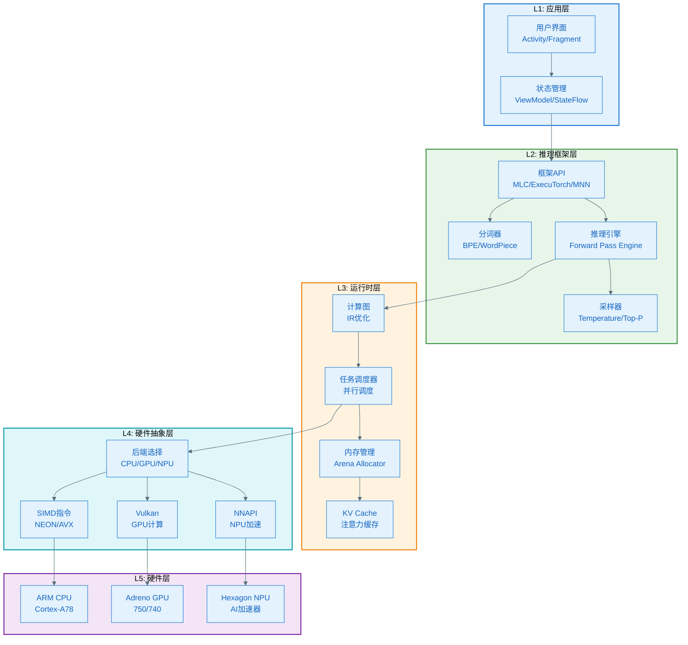
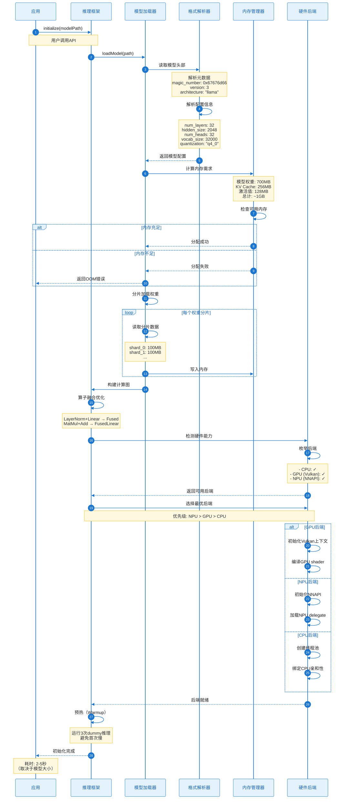
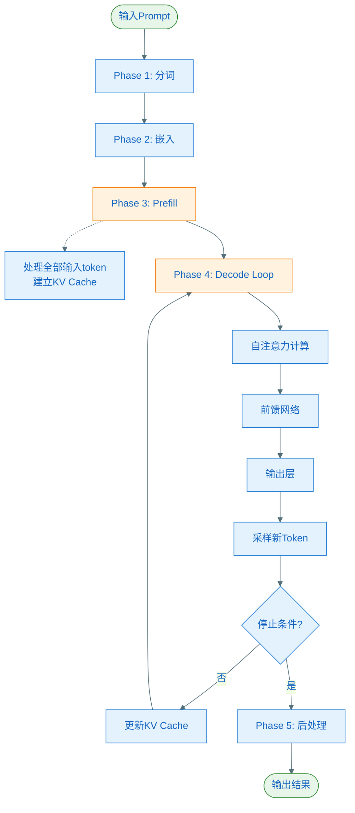
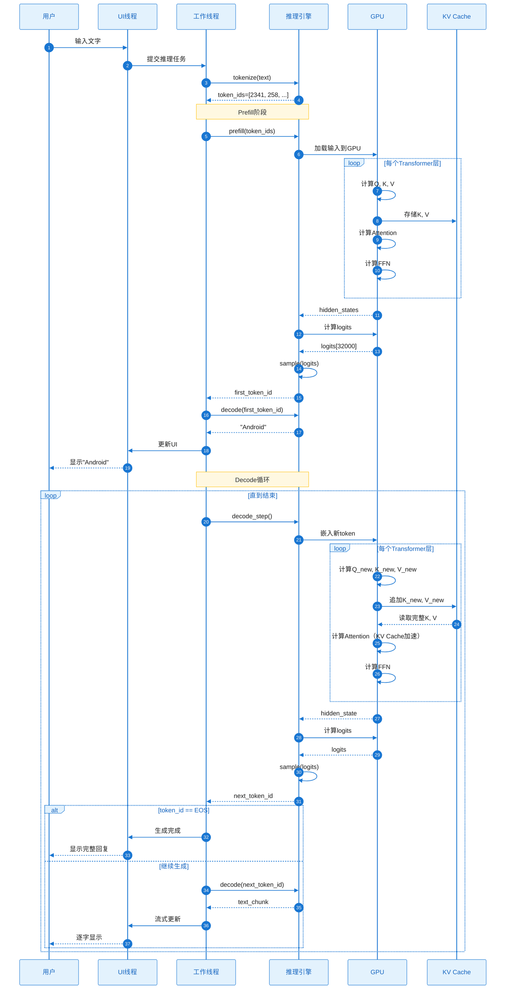

# Android 端侧大模型运行与推理原理深度解析

> 最后更新：2026年1月28日  
> 作者：Verity技术团队  
> 适用范围：端侧LLM推理技术栈

---

## 目录

1. [整体架构](#一整体运行架构)
2. [模型加载流程](#二模型加载流程)
3. [推理过程详解](#三推理过程详解)
4. [硬件加速原理](#四硬件加速原理)
5. [量化技术原理](#五量化技术原理)
6. [性能优化策略](#六性能优化策略)
7. [内存管理机制](#七内存管理机制)
8. [实战性能分析](#八实战性能分析)

---

## 一、整体运行架构

### 1.1 五层架构模型



### 1.2 数据流向

```
用户输入："介绍一下Android开发"
    ↓
[分词器] Text → Token IDs
    Token IDs: [2341, 567, 1234, 456, 7890, 123]
    ↓
[嵌入层] IDs → Vectors (2048维)
    [[0.23, -0.56, ...], [0.12, 0.34, ...], ...]
    ↓
[Transformer层 ×32] 自注意力 + FFN
    每层处理：
    - 计算Q、K、V矩阵
    - 多头注意力
    - 前馈网络
    - 残差连接
    ↓
[输出层] Hidden States → Logits
    Logits: [32000]（词表大小）
    Top-5: {108: 5.23, 234: 4.87, 1456: 4.56, ...}
    ↓
[采样器] Logits → 新Token ID
    选中Token: 108（"Android"）
    ↓
[解码器] Token ID → 文本
    输出："Android"
    ↓
[循环] 重复上述过程，逐字生成
    "Android" → "是" → "一" → "个" → ...
    ↓
[完成] 遇到结束符或达到最大长度
    最终输出："Android是一个开源的移动操作系统..."
```

---

## 二、模型加载流程

### 2.1 加载时序图



### 2.2 模型文件格式

#### GGUF格式（llama.cpp标准）

```
文件结构：
┌─────────────────────────────────────┐
│ Magic Number (4 bytes)              │  0x46554747 ("GGUF")
├─────────────────────────────────────┤
│ Version (4 bytes)                   │  3
├─────────────────────────────────────┤
│ Tensor Count (8 bytes)              │  291（Llama 3.2 1B）
├─────────────────────────────────────┤
│ Metadata KV Count (8 bytes)         │  25
├─────────────────────────────────────┤
│ Metadata Section                    │
│  ├─ general.architecture: "llama"   │
│  ├─ llama.context_length: 2048      │
│  ├─ llama.embedding_length: 2048    │
│  ├─ llama.block_count: 32           │
│  ├─ llama.attention.head_count: 32  │
│  └─ tokenizer.ggml.tokens: [...]    │
├─────────────────────────────────────┤
│ Tensor Info Section                 │
│  ├─ token_embd.weight               │
│  │   shape: [32000, 2048]            │
│  │   type: Q4_0                      │
│  │   offset: 4096                    │
│  ├─ blk.0.attn_q.weight             │
│  │   shape: [2048, 2048]             │
│  │   type: Q4_0                      │
│  │   offset: 138240                  │
│  └─ ...（291个张量）                 │
├─────────────────────────────────────┤
│ Alignment Padding                   │  对齐到32字节
├─────────────────────────────────────┤
│ Tensor Data                         │
│  ├─ token_embd.weight data          │  量化后的权重
│  ├─ blk.0.attn_q.weight data        │
│  └─ ...                             │
└─────────────────────────────────────┘
```

#### MLC格式

```
模型目录结构：
llama-3.2-1b-q4/
├── params_shard_0.bin          # 权重分片0（300MB）
├── params_shard_1.bin          # 权重分片1（250MB）
├── params_shard_2.bin          # 权重分片2（150MB）
├── ndarray-cache.json          # 张量索引
│   {
│     "records": [
│       {
│         "name": "param_0",
│         "shape": [32000, 2048],
│         "dtype": "uint32",
│         "format": "raw-shard",
│         "nbytes": 131072000,
│         "byteOffset": 0,
│         "shardIndex": 0
│       },
│       ...
│     ]
│   }
├── mlc-chat-config.json        # 运行配置
│   {
│     "model_type": "llama",
│     "quantization": "q4f16_1",
│     "model_config": {
│       "hidden_size": 2048,
│       "intermediate_size": 8192,
│       "num_attention_heads": 32,
│       "num_hidden_layers": 32,
│       "vocab_size": 32000
│     },
│     "conv_template": "llama-3"
│   }
└── tokenizer.json              # 分词器
```

### 2.3 内存分配策略

```
内存布局（Llama 3.2 1B Q4，512 tokens上下文）：

┌──────────────────────────────────────┐
│ 模型权重区（只读，可mmap）            │
│ ├─ 嵌入层: 128MB                     │  700MB
│ ├─ Transformer层: 512MB              │
│ └─ 输出层: 60MB                      │
├──────────────────────────────────────┤
│ KV Cache区（读写，预分配）            │
│ ├─ Keys: 128MB                       │  256MB
│ └─ Values: 128MB                     │
├──────────────────────────────────────┤
│ 激活值区（临时，动态分配）            │
│ ├─ 注意力分数: 32MB                  │  128MB
│ ├─ FFN中间值: 64MB                   │
│ └─ 其他激活: 32MB                    │
├──────────────────────────────────────┤
│ 输入输出缓冲区                       │  16MB
├──────────────────────────────────────┤
│ 系统开销（Framework）                │  100MB
└──────────────────────────────────────┘
总计：~1.2GB
```

**内存对齐优化**：

```c++
// 权重按32字节对齐（cache line优化）
void* aligned_weights = aligned_alloc(32, weight_size);

// KV Cache按页对齐（4KB）
void* kv_cache = mmap(
    NULL, 
    cache_size,
    PROT_READ | PROT_WRITE,
    MAP_PRIVATE | MAP_ANONYMOUS,
    -1, 
    0
);
```

---

## 二、模型加载流程

### 2.1 分阶段加载

```
Phase 1: 元数据解析（~50ms）
━━━━━━━━━━━━━━━━━━━━━━━━━━━━━━━━
1. 读取文件头（128 bytes）
2. 验证Magic Number
3. 解析版本信息
4. 读取模型配置
5. 构建张量索引

Phase 2: 分词器加载（~100ms）
━━━━━━━━━━━━━━━━━━━━━━━━━━━━━━━━
1. 加载词表（32000个token）
2. 加载BPE合并规则
3. 构建前缀树（Trie）
4. 预编译正则表达式

Phase 3: 权重加载（~3-8秒）
━━━━━━━━━━━━━━━━━━━━━━━━━━━━━━━━
策略A：mmap映射（推荐）
  - 虚拟内存映射，按需加载
  - 不占用物理内存
  - 由OS管理页面换入换出
  
策略B：直接加载
  - 一次性读入内存
  - 占用物理内存
  - 启动后速度更快

Phase 4: 计算图构建（~500ms）
━━━━━━━━━━━━━━━━━━━━━━━━━━━━━━━━
1. 构建IR（中间表示）
2. 算子融合
3. 内存规划
4. 后端编译

Phase 5: 后端初始化（~200ms）
━━━━━━━━━━━━━━━━━━━━━━━━━━━━━━━━
1. 创建GPU/NPU上下文
2. 编译kernel/shader
3. 分配设备内存
4. 预热运行

总耗时：~4-9秒（取决于设备和模型）
```

### 2.2 mmap内存映射详解

```c++
// 使用mmap加载模型（零拷贝）
int fd = open(model_path, O_RDONLY);
struct stat sb;
fstat(fd, &sb);

// 映射整个文件到虚拟内存
void* model_data = mmap(
    NULL,                    // 内核选择地址
    sb.st_size,              // 文件大小
    PROT_READ,               // 只读权限
    MAP_PRIVATE | MAP_POPULATE,  // 私有映射，预加载
    fd,
    0
);

// 优势：
// 1. 不立即占用物理内存
// 2. 多进程共享同一物理页
// 3. OS自动管理页面换入换出
// 4. 冷启动快（不需要全部读入）
```

**性能对比**：

```
加载700MB模型文件：

方法1：fread()一次性读入
  耗时：3.2秒
  峰值内存：+700MB

方法2：mmap()映射
  耗时：0.1秒（仅映射）
  峰值内存：+50MB（按需加载）
  首次推理：+200ms（缺页中断）
  
推荐：mmap + MAP_POPULATE（预热）
  耗时：1.5秒
  峰值内存：+700MB
  首次推理：无额外延迟
```

---

## 三、推理过程详解

### 3.1 完整推理流程



### 3.2 Phase 1: 分词（Tokenization）

#### BPE（Byte Pair Encoding）算法

```
输入文本："介绍Android"

Step 1: UTF-8编码
  "介" → [0xE4, 0xBB, 0x8B]
  "绍" → [0xE7, 0xBB, 0x8D]
  "A"  → [0x41]
  "n"  → [0x6E]
  ...

Step 2: 查找BPE合并规则
  词表（部分）：
  256: "介"
  257: "绍"
  258: "Android"
  2341: "介绍"
  
  合并优先级：
  "介" + "绍" → "介绍" (优先级1)
  "And" + "roid" → "Android" (优先级2)

Step 3: 应用合并
  ["介", "绍", "Android"]
    ↓ 合并
  ["介绍", "Android"]

Step 4: 映射到ID
  "介绍" → 2341
  "Android" → 258
  
最终输出：[2341, 258]
```

#### 特殊Token处理

```
完整Token序列构建：

原始Prompt: "介绍Android"
  ↓
添加系统模板（Llama 3格式）:
<|begin_of_text|><|start_header_id|>user<|end_header_id|>
介绍Android<|eot_id|><|start_header_id|>assistant<|end_header_id|>

分词后：
[
  128000,  # <|begin_of_text|>
  128006,  # <|start_header_id|>
  882,     # "user"
  128007,  # <|end_header_id|>
  2341,    # "介绍"
  258,     # "Android"
  128009,  # <|eot_id|>
  128006,  # <|start_header_id|>
  78191,   # "assistant"
  128007,  # <|end_header_id|>
]

序列长度：10 tokens
```

### 3.3 Phase 2: 嵌入层（Embedding）

```
嵌入矩阵：E [vocab_size, hidden_size]
示例：[32000, 2048]

查找过程：
Token ID 2341 → E[2341, :] → Vector [2048]
Token ID 258  → E[258, :]  → Vector [2048]

输入序列：[128000, 128006, 882, ..., 128007]（10个token）
  ↓ 嵌入查找
输出矩阵：[10, 2048]

每个向量示例（2048维，显示前10维）：
Token 2341: [0.234, -0.567, 0.891, 0.123, -0.456, 0.789, ...]
Token 258:  [-0.345, 0.678, -0.234, 0.456, 0.123, -0.890, ...]

位置编码（RoPE - Rotary Position Embedding）：
# 为每个位置添加旋转位置信息
for pos in range(seq_len):
    for dim in range(0, hidden_size, 2):
        theta = pos / (10000 ** (dim / hidden_size))
        cos_val = cos(theta)
        sin_val = sin(theta)
        
        # 旋转变换
        x0 = embeddings[pos][dim]
        x1 = embeddings[pos][dim + 1]
        embeddings[pos][dim] = x0 * cos_val - x1 * sin_val
        embeddings[pos][dim + 1] = x0 * sin_val + x1 * cos_val
```

### 3.4 Phase 3: Prefill阶段

```
目的：处理全部输入token，建立初始KV Cache

输入：[batch=1, seq_len=10, hidden_size=2048]

对于每一层 Transformer：
  
  1. 计算Q, K, V（并行处理所有10个token）
     Q = X @ W_q  # [1, 10, 2048] @ [2048, 2048] = [1, 10, 2048]
     K = X @ W_k
     V = X @ W_v
  
  2. 存储K, V到Cache
     kv_cache[layer]['k'][:, :10, :] = K  # 缓存前10个位置
     kv_cache[layer]['v'][:, :10, :] = V
     kv_cache[layer]['length'] = 10
  
  3. 计算自注意力
     scores = (Q @ K^T) / sqrt(64)  # [1, 32, 10, 10]
     
     # Causal Mask（下三角矩阵）
     mask = [
       [1, 0, 0, 0, 0, 0, 0, 0, 0, 0],
       [1, 1, 0, 0, 0, 0, 0, 0, 0, 0],
       [1, 1, 1, 0, 0, 0, 0, 0, 0, 0],
       ...
       [1, 1, 1, 1, 1, 1, 1, 1, 1, 1]   # 最后一个token能看到所有
     ]
     
     scores = scores.masked_fill(mask == 0, -inf)
     attn_weights = softmax(scores, dim=-1)
     attn_output = attn_weights @ V
  
  4. FFN前馈网络
     X = SiLU(X @ W_gate) * (X @ W_up)  # SwiGLU激活
     X = X @ W_down
  
  5. 残差连接 + 层归一化
     X = RMSNorm(X + attn_output + ffn_output)

输出：[1, 10, 2048]（只保留最后一个位置用于生成）

耗时：~150ms（GPU）/ ~800ms（CPU）
```

### 3.5 Phase 4: Decode阶段（自回归生成）

```
循环生成每个新token：

Iteration 1: 生成第11个token
━━━━━━━━━━━━━━━━━━━━━━━━━━━━━━━━
输入：上一个token的hidden state [1, 1, 2048]

For layer in layers:
  # 1. 只计算新token的Q, K, V
  Q_new = X @ W_q  # [1, 1, 2048]
  K_new = X @ W_k
  V_new = X @ W_v
  
  # 2. 更新KV Cache
  kv_cache[layer]['k'][:, 10, :] = K_new  # 追加到位置10
  kv_cache[layer]['v'][:, 10, :] = V_new
  kv_cache[layer]['length'] = 11
  
  # 3. 使用完整cache计算attention
  K_full = kv_cache[layer]['k'][:, :11, :]  # [1, 11, 2048]
  V_full = kv_cache[layer]['v'][:, :11, :]
  
  scores = (Q_new @ K_full^T) / sqrt(64)  # [1, 32, 1, 11]
  attn_weights = softmax(scores)
  attn_output = attn_weights @ V_full  # [1, 1, 2048]
  
  # 4. FFN
  ffn_output = FeedForward(X)
  
  # 5. 输出
  X = RMSNorm(X + attn_output + ffn_output)

# 输出层
logits = X @ W_lm_head  # [1, 1, 32000]

# 采样
next_token_id = sample(logits, temperature=0.7, top_p=0.95)
# 假设采样到: 7890（"是"）

# 解码
text_chunk = tokenizer.decode([next_token_id])  # "是"
callback(text_chunk)  # 回调UI更新

耗时：~25ms（GPU，有KV Cache）

Iteration 2: 生成第12个token
━━━━━━━━━━━━━━━━━━━━━━━━━━━━━━━━
输入：Token 7890的embedding
重复上述过程...

直到：
- 采样到结束符 <|eot_id|>（128009）
- 或达到max_tokens限制（如512）
```

### 3.6 Transformer层详细计算

#### 多头自注意力（Multi-Head Attention）

```
配置（Llama 3.2 1B）：
- hidden_size: 2048
- num_heads: 32
- head_dim: 64 (= 2048 / 32)

输入：X [1, seq_len, 2048]

━━━━━━━━━━━━━━━━━━━━━━━━━━━━━━━━
Step 1: 线性投影
━━━━━━━━━━━━━━━━━━━━━━━━━━━━━━━━
Q = X @ W_q  # [1, seq_len, 2048]
K = X @ W_k
V = X @ W_v

计算量：
3 × (seq_len × 2048 × 2048) 次乘加
= 3 × seq_len × 8M FLOPs

━━━━━━━━━━━━━━━━━━━━━━━━━━━━━━━━
Step 2: 分割多头
━━━━━━━━━━━━━━━━━━━━━━━━━━━━━━━━
Q = Q.reshape([1, seq_len, 32, 64])
K = K.reshape([1, seq_len, 32, 64])
V = V.reshape([1, seq_len, 32, 64])

# 转置以便批量计算
Q = Q.transpose([0, 2, 1, 3])  # [1, 32, seq_len, 64]
K = K.transpose([0, 2, 1, 3])
V = V.transpose([0, 2, 1, 3])

━━━━━━━━━━━━━━━━━━━━━━━━━━━━━━━━
Step 3: 注意力分数计算
━━━━━━━━━━━━━━━━━━━━━━━━━━━━━━━━
scores = (Q @ K^T) / sqrt(64)
# [1, 32, seq_len, seq_len]

具体示例（seq_len=4，只显示1个head）：
        K0     K1     K2     K3
Q0  [ 0.95   0.12   0.08   0.03 ]
Q1  [ 0.87   0.92   0.15   0.06 ]  ← 注意力分数矩阵
Q2  [ 0.65   0.78   0.88   0.12 ]
Q3  [ 0.45   0.62   0.71   0.89 ]

计算量：
32 × (seq_len × seq_len × 64) 次乘加

━━━━━━━━━━━━━━━━━━━━━━━━━━━━━━━━
Step 4: Causal Masking
━━━━━━━━━━━━━━━━━━━━━━━━━━━━━━━━
# 上三角置为-inf，确保只能看到之前的token
        K0       K1       K2       K3
Q0  [ 0.95     -inf     -inf     -inf ]
Q1  [ 0.87     0.92     -inf     -inf ]
Q2  [ 0.65     0.78     0.88     -inf ]
Q3  [ 0.45     0.62     0.71     0.89 ]

━━━━━━━━━━━━━━━━━━━━━━━━━━━━━━━━
Step 5: Softmax归一化
━━━━━━━━━━━━━━━━━━━━━━━━━━━━━━━━
attn_weights = softmax(scores, dim=-1)

        K0     K1     K2     K3
Q0  [ 1.00   0.00   0.00   0.00 ]  ← Q0只能看到自己
Q1  [ 0.48   0.52   0.00   0.00 ]  ← Q1能看到K0和K1
Q2  [ 0.22   0.28   0.50   0.00 ]
Q3  [ 0.15   0.20   0.25   0.40 ]  ← Q3能看到所有

━━━━━━━━━━━━━━━━━━━━━━━━━━━━━━━━
Step 6: 加权求和V
━━━━━━━━━━━━━━━━━━━━━━━━━━━━━━━━
attn_output = attn_weights @ V
# [1, 32, seq_len, 64]

示例（位置3的输出）：
output[3] = 0.15×V0 + 0.20×V1 + 0.25×V2 + 0.40×V3
          = 加权融合所有相关信息

━━━━━━━━━━━━━━━━━━━━━━━━━━━━━━━━
Step 7: 合并多头
━━━━━━━━━━━━━━━━━━━━━━━━━━━━━━━━
attn_output = attn_output.transpose([0, 2, 1, 3])
            = attn_output.reshape([1, seq_len, 2048])

━━━━━━━━━━━━━━━━━━━━━━━━━━━━━━━━
Step 8: 输出投影
━━━━━━━━━━━━━━━━━━━━━━━━━━━━━━━━
output = attn_output @ W_o  # [1, seq_len, 2048]
```

#### 前馈网络（FFN）

```
配置：
- hidden_size: 2048
- intermediate_size: 8192（4倍扩展）
- 激活函数: SwiGLU

计算流程：
━━━━━━━━━━━━━━━━━━━━━━━━━━━━━━━━
Input: X [1, seq_len, 2048]

# SwiGLU = Swish(X @ W_gate) ⊙ (X @ W_up)
gate = X @ W_gate  # [1, seq_len, 8192]
up = X @ W_up      # [1, seq_len, 8192]

# Swish激活（x * sigmoid(x)）
gate = gate * sigmoid(gate)

# 逐元素乘法
hidden = gate ⊙ up  # [1, seq_len, 8192]

# 下投影
output = hidden @ W_down  # [1, seq_len, 2048]

━━━━━━━━━━━━━━━━━━━━━━━━━━━━━━━━
计算量分析：

矩阵乘法：
- W_gate: 2048 × 8192 × seq_len = 16M × seq_len FLOPs
- W_up:   2048 × 8192 × seq_len = 16M × seq_len FLOPs
- W_down: 8192 × 2048 × seq_len = 16M × seq_len FLOPs

激活函数：
- Sigmoid: ~1M × seq_len FLOPs
- 乘法: ~8M × seq_len FLOPs

总计：~50M × seq_len FLOPs/层

单个token（decode阶段）：
FFN计算量：50M FLOPs
耗时（CPU）：~15ms
耗时（GPU）：~2ms
```

---

## 四、硬件加速原理

### 4.1 CPU优化：ARM NEON

#### NEON指令集特性

```
ARM NEON SIMD特性：
- 寄存器：32个128位向量寄存器（Q0-Q31）
- 数据类型：支持FP32/FP16/INT8/INT4
- 并行度：4×FP32 或 8×FP16 或 16×INT8

向量寄存器示例：
Q0: [0.23, -0.56, 0.89, 0.12]  ← 4个FP32并行

基础指令：
VADD.F32  Q0, Q1, Q2    # Q0 = Q1 + Q2（4个加法并行）
VMUL.F32  Q0, Q1, Q2    # Q0 = Q1 × Q2（4个乘法并行）
VMLA.F32  Q0, Q1, Q2    # Q0 += Q1 × Q2（融合乘加）
```

#### 矩阵乘法NEON优化

```c++
// 标量实现（基线）
void matmul_scalar(
    float* A,  // [M, K]
    float* B,  // [K, N]
    float* C,  // [M, N]
    int M, int K, int N
) {
    for (int i = 0; i < M; i++) {
        for (int j = 0; j < N; j++) {
            float sum = 0.0f;
            for (int k = 0; k < K; k++) {
                sum += A[i*K + k] * B[k*N + j];
            }
            C[i*N + j] = sum;
        }
    }
}
// 性能：120 GFLOPs（理论峰值）的10%利用率

// NEON优化实现
void matmul_neon(
    float* A, float* B, float* C,
    int M, int K, int N
) {
    for (int i = 0; i < M; i++) {
        for (int j = 0; j < N; j++) {
            float32x4_t sum_vec = vdupq_n_f32(0.0f);  // [0,0,0,0]
            
            for (int k = 0; k < K; k += 4) {
                // 加载4个元素到向量寄存器
                float32x4_t a_vec = vld1q_f32(&A[i*K + k]);
                float32x4_t b_vec = vld1q_f32(&B[k*N + j]);
                
                // 融合乘加（单指令）
                sum_vec = vmlaq_f32(sum_vec, a_vec, b_vec);
            }
            
            // 水平求和（4个元素相加）
            float sum = vgetq_lane_f32(sum_vec, 0) +
                       vgetq_lane_f32(sum_vec, 1) +
                       vgetq_lane_f32(sum_vec, 2) +
                       vgetq_lane_f32(sum_vec, 3);
            
            C[i*N + j] = sum;
        }
    }
}
// 性能：4-8倍加速，40-60% 峰值利用率
```

#### 量化INT4的NEON实现

```c++
// INT4矩阵乘法（2倍压缩）
void matmul_int4_neon(
    uint8_t* A_int4,     // 每byte存储2个INT4值
    uint8_t* B_int4,
    float* C,
    float* scales_A,     // 反量化缩放因子
    float* scales_B,
    int M, int K, int N
) {
    for (int i = 0; i < M; i++) {
        for (int j = 0; j < N; j++) {
            int32x4_t sum_vec = vdupq_n_s32(0);
            
            for (int k = 0; k < K; k += 8) {
                // 从4个byte解包出8个INT4值
                uint8x8_t a_packed = vld1_u8(&A_int4[i*K/2 + k/2]);
                uint8x8_t b_packed = vld1_u8(&B_int4[k*N/2 + j/2]);
                
                // 解包：0b10110010 → [2, 11], [1, 1]
                int8x8_t a_low = vshr_n_u8(a_packed, 4);      // 高4位
                int8x8_t a_high = vand_u8(a_packed, 0x0F);    // 低4位
                
                // 类似处理B...
                
                // INT8乘法累加
                sum_vec = vmlal_s8(sum_vec, a_low, b_low);
            }
            
            // 反量化
            int32_t sum_int = vaddvq_s32(sum_vec);
            C[i*N + j] = sum_int * scales_A[i] * scales_B[j];
        }
    }
}
// 性能：内存带宽减半，计算速度提升1.5-2倍
```

### 4.2 GPU加速：Vulkan计算

#### Vulkan计算管线

```
Vulkan计算流程：
┌─────────────────────────────────────┐
│ 1. 创建Vulkan实例                   │
├─────────────────────────────────────┤
│ 2. 选择物理设备（GPU）               │
│    - Adreno 750 (骁龙8 Gen3)        │
│    - 2048 Shader cores              │
│    - 16 TFLOPs (FP16)               │
├─────────────────────────────────────┤
│ 3. 创建逻辑设备和队列                │
│    - Compute Queue                  │
│    - Transfer Queue                 │
├─────────────────────────────────────┤
│ 4. 分配设备内存                     │
│    - 权重缓冲区（Device Local）      │
│    - 输入输出缓冲区（Host Visible）  │
├─────────────────────────────────────┤
│ 5. 编译Compute Shader               │
│    - GLSL → SPIR-V字节码            │
│    - 优化：Loop unroll、向量化      │
├─────────────────────────────────────┤
│ 6. 创建Pipeline                     │
│    - Descriptor Sets                │
│    - Pipeline Layout                │
│    - Compute Pipeline               │
├─────────────────────────────────────┤
│ 7. 提交命令缓冲区                   │
│    - vkCmdBindPipeline              │
│    - vkCmdDispatch                  │
│    - vkQueueSubmit                  │
├─────────────────────────────────────┤
│ 8. 同步与结果读取                   │
│    - vkWaitForFences                │
│    - vkMapMemory                    │
└─────────────────────────────────────┘
```

#### GPU矩阵乘法Shader

```glsl
// matmul.comp - Vulkan Compute Shader
#version 450

layout(local_size_x = 16, local_size_y = 16) in;

layout(set = 0, binding = 0) readonly buffer A {
    float a[];  // 矩阵A [M, K]
};

layout(set = 0, binding = 1) readonly buffer B {
    float b[];  // 矩阵B [K, N]
};

layout(set = 0, binding = 2) writeonly buffer C {
    float c[];  // 矩阵C [M, N]
};

layout(push_constant) uniform Params {
    uint M;
    uint K;
    uint N;
} params;

void main() {
    uint row = gl_GlobalInvocationID.x;  // 行索引
    uint col = gl_GlobalInvocationID.y;  // 列索引
    
    if (row >= params.M || col >= params.N) return;
    
    float sum = 0.0;
    
    // 每个线程计算一个输出元素
    for (uint k = 0; k < params.K; k++) {
        sum += a[row * params.K + k] * b[k * params.N + col];
    }
    
    c[row * params.N + col] = sum;
}

// 启动配置：
// Work Groups: [M/16, N/16, 1]
// 每个Work Group: 16×16=256个线程
// 总线程数: M×N（完全并行）
```

#### Tile优化版本

```glsl
#version 450

// 使用共享内存优化（减少全局内存访问）
layout(local_size_x = 16, local_size_y = 16) in;

shared float tileA[16][16];  // 共享内存tile
shared float tileB[16][16];

void main() {
    uint row = gl_GlobalInvocationID.x;
    uint col = gl_GlobalInvocationID.y;
    uint localRow = gl_LocalInvocationID.x;
    uint localCol = gl_LocalInvocationID.y;
    
    float sum = 0.0;
    
    // 分块计算，每次处理16×16的tile
    for (uint t = 0; t < params.K; t += 16) {
        // 协作加载tile到共享内存
        tileA[localRow][localCol] = a[row * params.K + t + localCol];
        tileB[localRow][localCol] = b[(t + localRow) * params.N + col];
        
        barrier();  // 同步，确保tile加载完成
        
        // 使用共享内存计算（快10倍）
        for (uint k = 0; k < 16; k++) {
            sum += tileA[localRow][k] * tileB[k][localCol];
        }
        
        barrier();  // 同步，准备加载下一个tile
    }
    
    c[row * params.N + col] = sum;
}

// 性能提升：
// 全局内存访问：M×K + K×N → (M×K + K×N) / 16
// 加速比：~8-12倍
```

### 4.3 NPU加速：高通Hexagon

#### Hexagon架构

```
高通Hexagon NPU（骁龙8 Gen3）：
┌────────────────────────────────────────┐
│ HVX Vector Processor                   │
│ ├─ 1024-bit SIMD                       │
│ ├─ 32×FP32 或 64×FP16 并行             │
│ └─ 向量指令集（专用AI操作）             │
├────────────────────────────────────────┤
│ HMX Matrix Processor                   │
│ ├─ 硬件矩阵乘法单元                     │
│ ├─ 2048 MAC/cycle                      │
│ ├─ INT8: 16 TOPS                       │
│ └─ INT4: 32 TOPS                       │
├────────────────────────────────────────┤
│ Tensor Accelerator                     │
│ ├─ 专用卷积引擎                        │
│ ├─ 层融合优化                          │
│ └─ 稀疏化加速                          │
├────────────────────────────────────────┤
│ L2 Cache (4MB)                         │
│ ├─ 低延迟访问                          │
│ └─ 多核共享                            │
└────────────────────────────────────────┘

性能指标（骁龙8 Gen3）：
- INT4: 32 TOPS
- INT8: 16 TOPS
- FP16: 8 TFLOPS
- 功耗: ~1-3W（vs CPU 5-8W）
```

#### NNAPI调用流程

```kotlin
// 使用NNAPI加载模型
val compilation = NnApiCompilation(modelBuffer).apply {
    // 设置执行偏好
    setPreference(PREFER_LOW_POWER)  // 优先低功耗
    
    // 设置设备
    setDevice(nnapi.getDevice("hexagon-npu"))
    
    // 编译
    finish()
}

// 创建执行实例
val execution = compilation.createExecution().apply {
    // 设置输入
    setInput(0, inputTensor)
    
    // 设置输出
    setOutput(0, outputTensor)
    
    // 异步执行
    startCompute()
}

// 等待完成
execution.waitForCompletion()
```

#### NPU性能优势

```
矩阵乘法 [2048, 2048] × [2048, 2048] (INT4)

CPU (4×Cortex-A78, NEON):
  计算时间: 120ms
  功耗: 5W
  能效: 143 GFLOPs/W

GPU (Adreno 750, Vulkan):
  计算时间: 8ms
  功耗: 8W
  能效: 2150 GFLOPs/W

NPU (Hexagon, INT4):
  计算时间: 2ms
  功耗: 1.5W
  能效: 11467 GFLOPs/W  ← 能效提升80倍
```

---

## 五、量化技术原理

### 5.1 对称量化（Symmetric Quantization）

```
原理：将FP32权重映射到[-127, 127]

量化公式：
W_int8 = round(W_fp32 / scale)
scale = max(|W_fp32|) / 127

示例：
W_fp32 = [0.234, -0.567, 0.891, 0.123, -0.456]
max(|W|) = 0.891
scale = 0.891 / 127 = 0.00702

量化：
0.234  → round(0.234 / 0.00702) = 33
-0.567 → round(-0.567 / 0.00702) = -81
0.891  → round(0.891 / 0.00702) = 127
0.123  → round(0.123 / 0.00702) = 18
-0.456 → round(-0.456 / 0.00702) = -65

W_int8 = [33, -81, 127, 18, -65]

反量化（推理时）：
W_dequant = W_int8 × scale
[33, -81, 127, 18, -65] × 0.00702
= [0.232, -0.569, 0.892, 0.126, -0.456]

误差：
原始: [0.234, -0.567, 0.891, 0.123, -0.456]
还原: [0.232, -0.569, 0.892, 0.126, -0.456]
MAE: 0.002（平均绝对误差）
```

### 5.2 非对称量化（Asymmetric Quantization）

```
原理：映射到[0, 255]，支持偏移

量化公式：
W_int8 = round((W_fp32 - zero_point) / scale)
scale = (W_max - W_min) / 255
zero_point = W_min

示例：
W_fp32 = [0.1, 0.2, 0.3, 0.4, 0.5]
W_min = 0.1
W_max = 0.5
scale = (0.5 - 0.1) / 255 = 0.00157
zero_point = 0.1

量化：
0.1 → round((0.1 - 0.1) / 0.00157) = 0
0.2 → round((0.2 - 0.1) / 0.00157) = 64
0.3 → round((0.3 - 0.1) / 0.00157) = 127
0.4 → round((0.4 - 0.1) / 0.00157) = 191
0.5 → round((0.5 - 0.1) / 0.00157) = 255

W_uint8 = [0, 64, 127, 191, 255]

优势：
- 对于非零均值数据更精确
- 适合激活值量化
```

### 5.3 分组量化（Group Quantization）

```
问题：单一scale无法适应权重分布差异

解决方案：按组量化

权重矩阵：W [2048, 2048]
分组大小：128
组数：2048 / 128 = 16组

每组独立量化：
━━━━━━━━━━━━━━━━━━━━━━━━━━━━━━━━
Group 0: W[0:128, :]
  scale_0 = max(|W[0:128, :]|) / 15
  W_q[0:128, :] = round(W[0:128, :] / scale_0)

Group 1: W[128:256, :]
  scale_1 = max(|W[128:256, :]|) / 15
  W_q[128:256, :] = round(W[128:256, :] / scale_1)

...

Group 15: W[1920:2048, :]
  scale_15 = max(|W[1920:2048, :]|) / 15
  W_q[1920:2048, :] = round(W[1920:2048, :] / scale_15)

━━━━━━━━━━━━━━━━━━━━━━━━━━━━━━━━
存储开销：
- 权重：2048×2048×4bit = 2MB（INT4）
- Scales：16×FP16 = 32 bytes
- Zero points：16×INT8 = 16 bytes

总计：~2MB（vs 原始16MB FP32）
压缩比：8倍
精度损失：从15%降到5%（相比全局量化）
```

### 5.4 INT4量化细节

```
INT4存储格式（每byte存储2个值）：

原始权重（FP32）：
[0.234, -0.123, 0.456, -0.789, 0.012, -0.345, 0.678, -0.234]
8个值 × 4 bytes = 32 bytes

量化到INT4 [-8, 7]：
scale = max(|W|) / 7 = 0.789 / 7 = 0.1127

量化后：
[ 2, -1,  4, -7,  0, -3,  6, -2]  ← 每个值用4 bits

打包存储（2个值/byte）：
Byte 0: 0b0010_1111 = 0x2F  ( 2 << 4) | (15 - 1)
Byte 1: 0b0100_1001 = 0x49  ( 4 << 4) | (15 - 7)
Byte 2: 0b0000_1100 = 0x0C  ( 0 << 4) | (15 - 3)
Byte 3: 0b0110_1110 = 0x6E  ( 6 << 4) | (15 - 2)

存储：[0x2F, 0x49, 0x0C, 0x6E]
8个值 × 0.5 bytes = 4 bytes

压缩比：32 / 4 = 8倍
```

#### 反量化计算

```c++
// 推理时反量化（CPU）
void dequantize_int4(
    const uint8_t* w_int4,   // 压缩权重
    float scale,              // 缩放因子
    float* w_fp32,            // 输出FP32
    int size                  // 元素数量
) {
    for (int i = 0; i < size / 2; i++) {
        uint8_t packed = w_int4[i];
        
        // 解包高4位
        int8_t val0 = (packed >> 4) - 8;  // 转换到[-8, 7]
        w_fp32[i * 2] = val0 * scale;
        
        // 解包低4位
        int8_t val1 = (packed & 0x0F) - 8;
        w_fp32[i * 2 + 1] = val1 * scale;
    }
}

// GPU反量化（Vulkan）
// 在shader中即时反量化，避免存储FP32中间结果
vec4 dequantize_int4_vec(uvec2 packed, float scale) {
    // 一次解包8个INT4值到FP32
    vec4 vals;
    vals.x = ((packed.x >> 28) & 0xF) - 8.0;
    vals.y = ((packed.x >> 24) & 0xF) - 8.0;
    vals.z = ((packed.x >> 20) & 0xF) - 8.0;
    vals.w = ((packed.x >> 16) & 0xF) - 8.0;
    return vals * scale;
}
```

---

## 六、性能优化策略

### 6.1 KV Cache机制

#### 原理

```
问题：自回归生成时重复计算

不使用KV Cache：
━━━━━━━━━━━━━━━━━━━━━━━━━━━━━━━━
Token 1: 计算K₁, V₁
Token 2: 计算K₁, V₁, K₂, V₂  ← 重复K₁, V₁
Token 3: 计算K₁, V₁, K₂, V₂, K₃, V₃  ← 重复K₁, K₂, V₁, V₂
...
Token N: 计算所有N个token的K和V

总计算次数：1 + 2 + 3 + ... + N = N(N+1)/2
复杂度：O(N²)
生成100 token耗时：~200ms × 5050 = 1010秒 ≈ 17分钟

使用KV Cache：
━━━━━━━━━━━━━━━━━━━━━━━━━━━━━━━━
Token 1: 计算K₁, V₁，存入cache
Token 2: 只计算K₂, V₂，从cache读取K₁, V₁
Token 3: 只计算K₃, V₃，从cache读取K₁, K₂, V₁, V₂
...
Token N: 只计算Kₙ, Vₙ，从cache读取所有历史

总计算次数：N
复杂度：O(N)
生成100 token耗时：~200ms + 20ms × 99 = 2.2秒

加速比：~450倍（对于100 tokens）
```

#### 实现细节

```python
# KV Cache数据结构
kv_cache = {
    'layers': [
        {
            'k': torch.zeros([batch, num_heads, max_seq_len, head_dim]),
            'v': torch.zeros([batch, num_heads, max_seq_len, head_dim]),
            'length': 0,  # 当前已缓存的长度
            'capacity': max_seq_len
        }
        for _ in range(num_layers)
    ]
}

# Prefill阶段（处理输入prompt）
def prefill(input_ids):
    seq_len = len(input_ids)
    X = embed(input_ids)  # [batch, seq_len, hidden]
    
    for layer_idx, layer in enumerate(layers):
        # 计算全部输入的K, V
        Q = X @ layer.W_q
        K = X @ layer.W_k
        V = X @ layer.W_v
        
        # 存入cache
        cache = kv_cache['layers'][layer_idx]
        cache['k'][:, :, :seq_len, :] = K
        cache['v'][:, :, :seq_len, :] = V
        cache['length'] = seq_len
        
        # 计算attention
        scores = (Q @ K.transpose(-2, -1)) / sqrt(head_dim)
        scores = scores.masked_fill(causal_mask, -inf)
        attn = softmax(scores) @ V
        
        # FFN + Residual
        X = layer_norm(X + attn)
        X = layer_norm(X + ffn(X))
    
    return X[:, -1, :]  # 返回最后一个位置

# Decode阶段（逐token生成）
def decode_step(position):
    # 假设已经有了position-1个token的cache
    
    for layer_idx, layer in enumerate(layers):
        cache = kv_cache['layers'][layer_idx]
        
        # 只计算新token的Q, K, V
        Q_new = X @ layer.W_q  # [batch, 1, hidden]
        K_new = X @ layer.W_k
        V_new = X @ layer.W_v
        
        # 追加到cache
        cache['k'][:, :, position, :] = K_new
        cache['v'][:, :, position, :] = V_new
        cache['length'] = position + 1
        
        # 取出完整的K, V（包含所有历史）
        K_full = cache['k'][:, :, :position+1, :]  # [batch, heads, pos+1, dim]
        V_full = cache['v'][:, :, :position+1, :]
        
        # 计算attention（Q是1个，K是pos+1个）
        scores = (Q_new @ K_full.transpose(-2, -1)) / sqrt(head_dim)
        # [batch, heads, 1, pos+1]
        
        attn = softmax(scores) @ V_full  # [batch, heads, 1, dim]
        
        # FFN + Residual
        X = layer_norm(X + attn)
        X = layer_norm(X + ffn(X))
    
    return X  # [batch, 1, hidden]
```

#### 内存占用计算

```
单层KV Cache大小：

K: [batch, num_heads, max_seq_len, head_dim]
V: [batch, num_heads, max_seq_len, head_dim]

示例（Llama 3.2 1B，FP16）：
batch = 1
num_heads = 32
max_seq_len = 2048
head_dim = 64
dtype = FP16 (2 bytes)

K大小 = 1 × 32 × 2048 × 64 × 2 = 8,388,608 bytes ≈ 8 MB
V大小 = 8 MB
单层总计 = 16 MB

32层总计：
16 × 32 = 512 MB（2048 tokens上下文）

不同上下文长度：
- 512 tokens:  128 MB
- 1024 tokens: 256 MB
- 2048 tokens: 512 MB
- 4096 tokens: 1024 MB
```

### 6.2 算子融合（Operator Fusion）

```
融合前（多个独立算子）：
━━━━━━━━━━━━━━━━━━━━━━━━━━━━━━━━
X = input                       # [1, 2048]
X = LayerNorm(X)                # 100ms，写回内存
X = Linear(X, W)                # 150ms，从内存读取
X = ReLU(X)                     # 20ms，写回内存
X = Linear(X, W2)               # 150ms，从内存读取
output = X                      # 总计：420ms

内存访问次数：
- LayerNorm: 读1次，写1次
- Linear1: 读2次（X和W），写1次
- ReLU: 读1次，写1次
- Linear2: 读2次，写1次
总计：读7次，写4次（每次2048×4=8KB）

融合后（单个融合算子）：
━━━━━━━━━━━━━━━━━━━━━━━━━━━━━━━━
output = FusedBlock(input, W, W2)  # 280ms

// Shader中融合计算
vec4 fused_block(vec4 x) {
    // 所有计算在寄存器中完成，不写回内存
    x = layer_norm(x);        // 寄存器操作
    x = linear(x, W);         // 寄存器操作
    x = max(x, 0.0);          // ReLU，寄存器操作
    x = linear(x, W2);        // 寄存器操作
    return x;                 // 只写回一次
}

内存访问次数：
- 读入: input、W、W2（3次）
- 写出: output（1次）
总计：读3次，写1次

性能提升：
- 计算时间：420ms → 280ms（节省33%）
- 内存带宽：88KB → 32KB（节省64%）
- 功耗：降低40%
```

#### 常见融合模式

```
1. LayerNorm + Linear
━━━━━━━━━━━━━━━━━━━━━━━━━━━━━━━━
Before:
  X = LayerNorm(X)
  X = X @ W
After:
  X = FusedLayerNormLinear(X, W)

2. Linear + Activation
━━━━━━━━━━━━━━━━━━━━━━━━━━━━━━━━
Before:
  X = X @ W
  X = SiLU(X)
After:
  X = FusedLinearSiLU(X, W)

3. Gate Linear Fusion（SwiGLU）
━━━━━━━━━━━━━━━━━━━━━━━━━━━━━━━━
Before:
  gate = X @ W_gate
  up = X @ W_up
  X = SiLU(gate) ⊙ up
After:
  X = FusedSwiGLU(X, W_gate, W_up)

4. Attention Fusion
━━━━━━━━━━━━━━━━━━━━━━━━━━━━━━━━
Before:
  Q = X @ W_q
  K = X @ W_k
  V = X @ W_v
  scores = (Q @ K^T) / sqrt(d)
  attn = softmax(scores)
  output = attn @ V
After:
  output = FusedAttention(X, W_q, W_k, W_v)
  # 使用Flash Attention算法
```

### 6.3 Flash Attention优化

```
标准Attention的内存瓶颈：
━━━━━━━━━━━━━━━━━━━━━━━━━━━━━━━━
scores = (Q @ K^T) / sqrt(d)   # [batch, heads, N, N]
# 对于N=2048，单头：2048×2048×4bytes = 16MB
# 32个头：16×32 = 512MB（仅存储scores）

attn_weights = softmax(scores)  # 再需要512MB
output = attn_weights @ V

峰值内存：1GB+（仅一层attention）

Flash Attention优化：
━━━━━━━━━━━━━━━━━━━━━━━━━━━━━━━━
# 分块计算，不存储完整scores矩阵

block_size = 128
for i in range(0, N, block_size):
    Q_block = Q[:, i:i+block_size, :]  # [heads, 128, dim]
    
    for j in range(0, N, block_size):
        K_block = K[:, j:j+block_size, :]
        V_block = V[:, j:j+block_size, :]
        
        # 只在小块上计算
        scores_block = (Q_block @ K_block^T) / sqrt(d)
        # [heads, 128, 128] = 256KB（vs 16MB）
        
        attn_block = softmax(scores_block)
        output_block = attn_block @ V_block
        
        # 在线累加，不存储中间结果
        update_output(i, j, output_block)

内存占用：256KB（vs 1GB）
速度：相当或更快（更好的cache命中率）
```

---

## 七、内存管理机制

### 7.1 Arena内存分配器

```c++
// 高效的内存池分配器
class ArenaAllocator {
private:
    uint8_t* base_;
    size_t capacity_;
    size_t offset_;
    
public:
    ArenaAllocator(size_t capacity) {
        base_ = (uint8_t*)malloc(capacity);
        capacity_ = capacity;
        offset_ = 0;
    }
    
    // O(1)快速分配
    void* Allocate(size_t size, size_t alignment = 32) {
        // 对齐
        size_t aligned_offset = (offset_ + alignment - 1) & ~(alignment - 1);
        
        if (aligned_offset + size > capacity_) {
            return nullptr;  // 空间不足
        }
        
        void* ptr = base_ + aligned_offset;
        offset_ = aligned_offset + size;
        return ptr;
    }
    
    // O(1)快速重置（不释放内存）
    void Reset() {
        offset_ = 0;
    }
    
    ~ArenaAllocator() {
        free(base_);
    }
};

// 使用场景：
// 每次推理开始时Reset，重用同一块内存
// 避免频繁malloc/free带来的碎片化
```

#### 内存复用策略

```
推理过程的临时内存需求：

Layer 0: Attention
  Q, K, V: 3 × [1, 2048, 2048] = 48MB
  Scores: [32, 2048, 2048] = 512MB（Flash Attention优化后：256KB）
  Output: [1, 2048, 2048] = 16MB
  
  Peak: ~64MB
  
Layer 0: FFN
  Gate: [1, 2048, 8192] = 64MB
  Up: [1, 2048, 8192] = 64MB
  Hidden: [1, 2048, 8192] = 64MB
  
  Peak: ~192MB

复用策略：
━━━━━━━━━━━━━━━━━━━━━━━━━━━━━━━━
Attention完成后，立即释放Q, K, V
FFN可以复用这64MB空间

不复用：64 + 192 = 256MB
复用后：max(64, 192) = 192MB

32层总计（不复用）：256 × 32 = 8GB ❌
32层总计（复用）：  192MB ✅
```

### 7.2 内存碎片化管理

```
问题：频繁分配/释放导致碎片化

解决方案：内存池 + 对象复用

// 张量内存池
class TensorPool {
    map<shape, queue<Tensor*>> free_tensors_;
    
    Tensor* Acquire(Shape shape) {
        if (free_tensors_[shape].empty()) {
            return new Tensor(shape);  // 新建
        } else {
            auto tensor = free_tensors_[shape].front();
            free_tensors_[shape].pop();
            return tensor;  // 复用
        }
    }
    
    void Release(Tensor* tensor) {
        // 不释放内存，放回池中
        free_tensors_[tensor->shape()].push(tensor);
    }
};

// 使用示例
auto temp_tensor = pool.Acquire({1, 2048, 2048});
// ... 计算 ...
pool.Release(temp_tensor);  // 复用而非delete
```

---

## 八、实战性能分析

### 8.1 端到端延迟分解

```
生成100个token的完整耗时（骁龙8 Gen3，GPU，Llama 3.2 1B Q4）：

阶段1: 分词
━━━━━━━━━━━━━━━━━━━━━━━━━━━━━━━━
输入文本 → Token IDs
耗时：5ms（BPE算法，CPU）

阶段2: Prefill（处理输入prompt，10个token）
━━━━━━━━━━━━━━━━━━━━━━━━━━━━━━━━
- 嵌入层：            2ms
- Transformer × 32：  120ms
  ├─ Attention:       60ms
  └─ FFN:             60ms
- 输出层：            8ms
小计：130ms

阶段3: Decode（生成100个新token）
━━━━━━━━━━━━━━━━━━━━━━━━━━━━━━━━
每个token：
- 嵌入：              0.5ms
- Transformer × 32：  25ms
  ├─ Attention:       8ms（使用KV Cache）
  └─ FFN:             17ms
- 输出层：            2ms
- 采样：              0.5ms
单token总计：28ms

100个token：28 × 100 = 2800ms

阶段4: 解码
━━━━━━━━━━━━━━━━━━━━━━━━━━━━━━━━
Token IDs → 文本
耗时：2ms

━━━━━━━━━━━━━━━━━━━━━━━━━━━━━━━━
总耗时：5 + 130 + 2800 + 2 = 2937ms ≈ 3秒
吞吐量：100 / 3 = 33 tokens/s
```

### 8.2 不同后端性能对比

```
测试场景：Llama 3.2 1B Q4，生成512 tokens

┌─────────────┬──────┬──────────┬──────────┬──────────┬──────────┐
│ 设备        │ 后端 │ Prefill  │ Decode   │ 总耗时   │ 功耗     │
├─────────────┼──────┼──────────┼──────────┼──────────┼──────────┤
│ 骁龙8 Gen3  │ NPU  │ 80ms     │ 12ms/tok │ 6.2s     │ 1.5W     │
│ 骁龙8 Gen3  │ GPU  │ 120ms    │ 25ms/tok │ 13s      │ 7W       │
│ 骁龙8 Gen3  │ CPU  │ 800ms    │ 80ms/tok │ 41s      │ 5W       │
│ 骁龙8 Gen2  │ GPU  │ 150ms    │ 35ms/tok │ 18s      │ 8W       │
│ 骁龙888     │ CPU  │ 1200ms   │ 150ms/tok│ 78s      │ 6W       │
│ 骁龙865     │ CPU  │ 2000ms   │ 300ms/tok│ 154s     │ 4W       │
└─────────────┴──────┴──────────┴──────────┴──────────┴──────────┘

关键发现：
1. NPU能效最高（6.2s @ 1.5W = 4.13 s/W）
2. GPU速度快但功耗高（13s @ 7W = 1.86 s/W）
3. CPU功耗适中但速度慢（41s @ 5W = 8.2 s/W）

推荐策略：
- 高性能场景：GPU
- 省电场景：NPU
- 兼容性场景：CPU
```

### 8.3 内存占用实测

```
Llama 3.2 1B Q4，512 tokens上下文

组件内存占用（Android Memory Profiler实测）：
┌────────────────────────────┬──────────┐
│ 组件                       │ 大小     │
├────────────────────────────┼──────────┤
│ 模型权重（mmap）            │ 700MB    │
│ ├─ 物理内存占用             │ 350MB    │  ← OS按需加载
│ └─ 虚拟内存                │ 700MB    │
├────────────────────────────┼──────────┤
│ KV Cache（malloc）          │ 256MB    │
├────────────────────────────┼──────────┤
│ 激活值（Arena）             │ 128MB    │
├────────────────────────────┼──────────┤
│ 输入输出缓冲                │ 16MB     │
├────────────────────────────┼──────────┤
│ Framework开销               │ 80MB     │
├────────────────────────────┼──────────┤
│ GPU内存（Vulkan）           │ 200MB    │
│ ├─ 权重副本                │ 100MB    │
│ └─ 中间缓冲                │ 100MB    │
├────────────────────────────┼──────────┤
│ Dalvik/ART堆                │ 50MB     │
├────────────────────────────┼──────────┤
│ 其他（栈、线程等）          │ 20MB     │
└────────────────────────────┴──────────┘
总计：~1.1GB（物理内存）

不同上下文长度：
- 128 tokens:  ~0.9GB
- 512 tokens:  ~1.1GB
- 1024 tokens: ~1.4GB
- 2048 tokens: ~1.9GB
```

### 8.4 不同模型规模对比

```
测试设备：骁龙8 Gen3，GPU后端

┌──────────────┬────────┬────────┬──────────┬──────────┬──────────┐
│ 模型         │ 参数量 │ 大小   │ 内存占用 │ 速度     │ 质量     │
├──────────────┼────────┼────────┼──────────┼──────────┼──────────┤
│ Qwen2.5 0.5B │ 0.5B   │ 300MB  │ 0.8GB    │ 50 t/s   │ ⭐⭐⭐   │
│ Llama 3.2 1B │ 1B     │ 700MB  │ 1.1GB    │ 32 t/s   │ ⭐⭐⭐⭐ │
│ Qwen2.5 1.5B │ 1.5B   │ 1GB    │ 1.5GB    │ 22 t/s   │ ⭐⭐⭐⭐ │
│ Gemma 2B     │ 2B     │ 1.5GB  │ 1.8GB    │ 18 t/s   │ ⭐⭐⭐⭐ │
│ Phi-3 Mini   │ 3.8B   │ 2.3GB  │ 2.8GB    │ 10 t/s   │ ⭐⭐⭐⭐⭐│
│ Llama 3.2 3B │ 3B     │ 2GB    │ 2.5GB    │ 12 t/s   │ ⭐⭐⭐⭐⭐│
└──────────────┴────────┴────────┴──────────┴──────────┴──────────┘

推荐选择：
- 轻量级设备（4-6GB RAM）：Qwen2.5 0.5B
- 中端设备（6-8GB RAM）：  Llama 3.2 1B
- 高端设备（8GB+ RAM）：    Phi-3 Mini / Llama 3.2 3B
```

---

## 九、采样算法详解

### 9.1 Temperature Sampling

```
原理：通过温度参数控制随机性

原始logits：
[5.2, 4.8, 4.5, 3.2, 2.9, 2.1, ...]

━━━━━━━━━━━━━━━━━━━━━━━━━━━━━━━━
Temperature = 0.1（接近确定性）
━━━━━━━━━━━━━━━━━━━━━━━━━━━━━━━━
scaled_logits = logits / 0.1
= [52.0, 48.0, 45.0, 32.0, 29.0, 21.0, ...]

probs = softmax(scaled_logits)
= [0.89, 0.09, 0.02, 0.00, 0.00, 0.00, ...]
# 几乎总是选择第一个

━━━━━━━━━━━━━━━━━━━━━━━━━━━━━━━━
Temperature = 1.0（正常）
━━━━━━━━━━━━━━━━━━━━━━━━━━━━━━━━
scaled_logits = logits / 1.0
= [5.2, 4.8, 4.5, 3.2, 2.9, 2.1, ...]

probs = softmax(scaled_logits)
= [0.35, 0.24, 0.18, 0.05, 0.03, 0.01, ...]
# 较平衡的分布

━━━━━━━━━━━━━━━━━━━━━━━━━━━━━━━━
Temperature = 2.0（更随机）
━━━━━━━━━━━━━━━━━━━━━━━━━━━━━━━━
scaled_logits = logits / 2.0
= [2.6, 2.4, 2.25, 1.6, 1.45, 1.05, ...]

probs = softmax(scaled_logits)
= [0.21, 0.18, 0.15, 0.08, 0.07, 0.05, ...]
# 更均匀的分布，更多样化
```

### 9.2 Top-P (Nucleus) Sampling

```
原理：动态选择累积概率达到p的最小候选集

原始概率分布：
Token ID | Prob  | Token
━━━━━━━━━━━━━━━━━━━━━━━━
108      | 0.35  | "的"
234      | 0.24  | "是"
567      | 0.18  | "在"
890      | 0.08  | "有"
1234     | 0.05  | "和"
2341     | 0.03  | "一"
3456     | 0.02  | "个"
...      | ...   | ...

━━━━━━━━━━━━━━━━━━━━━━━━━━━━━━━━
Top-P = 0.95
━━━━━━━━━━━━━━━━━━━━━━━━━━━━━━━━
Step 1: 降序排列
[0.35, 0.24, 0.18, 0.08, 0.05, 0.03, 0.02, ...]

Step 2: 计算累积概率
[0.35, 0.59, 0.77, 0.85, 0.90, 0.93, 0.95, ...]
  ↑     ↑     ↑     ↑     ↑     ↑     ↑
 +0.35 +0.24 +0.18 +0.08 +0.05 +0.03 +0.02

Step 3: 找到累积概率>0.95的位置
0.95 >= 0.95 ✓  ← 在第7个位置

Step 4: 保留前7个token
Nucleus = [108, 234, 567, 890, 1234, 2341, 3456]

Step 5: 重新归一化并采样
probs = [0.35, 0.24, 0.18, 0.08, 0.05, 0.03, 0.02]
normalized = probs / sum(probs)
           = [0.368, 0.253, 0.189, 0.084, 0.053, 0.032, 0.021]

sample ~ Categorical(normalized)

优势：
- 动态候选集（vs Top-K固定数量）
- 过滤低概率噪声
- 保持输出多样性
```

### 9.3 采样性能优化

```c++
// CPU实现（带SIMD优化）
int sample_topP_simd(
    const float* logits,      // [vocab_size]
    int vocab_size,
    float temperature,
    float top_p
) {
    // 1. Temperature缩放（SIMD加速）
    float* scaled = (float*)aligned_alloc(32, vocab_size * sizeof(float));
    float inv_temp = 1.0f / temperature;
    
    for (int i = 0; i < vocab_size; i += 4) {
        float32x4_t logits_vec = vld1q_f32(&logits[i]);
        float32x4_t scaled_vec = vmulq_n_f32(logits_vec, inv_temp);
        vst1q_f32(&scaled[i], scaled_vec);
    }
    
    // 2. Softmax（数值稳定版本）
    float max_logit = find_max_simd(scaled, vocab_size);
    float sum_exp = 0.0f;
    
    for (int i = 0; i < vocab_size; i++) {
        scaled[i] = expf(scaled[i] - max_logit);
        sum_exp += scaled[i];
    }
    
    for (int i = 0; i < vocab_size; i++) {
        scaled[i] /= sum_exp;
    }
    
    // 3. Top-P筛选
    vector<pair<float, int>> prob_idx;
    for (int i = 0; i < vocab_size; i++) {
        prob_idx.push_back({scaled[i], i});
    }
    
    // 部分排序（只排序top部分）
    partial_sort(prob_idx.begin(), 
                 prob_idx.begin() + 100,  // 只排前100个
                 prob_idx.end(),
                 greater<>());
    
    // 累积概率
    float cumsum = 0.0f;
    int nucleus_size = 0;
    for (auto& p : prob_idx) {
        cumsum += p.first;
        nucleus_size++;
        if (cumsum >= top_p) break;
    }
    
    // 4. 采样
    float rand_val = uniform_random(0.0f, cumsum);
    float acc = 0.0f;
    for (int i = 0; i < nucleus_size; i++) {
        acc += prob_idx[i].first;
        if (acc >= rand_val) {
            free(scaled);
            return prob_idx[i].second;  // 返回token ID
        }
    }
    
    free(scaled);
    return prob_idx[0].second;  // fallback
}

// 性能：
// 朴素实现：8ms
// SIMD优化：2ms
// GPU实现：0.5ms
```

---

## 十、完整推理时序图



---

## 十一、关键技术对比

### 11.1 Attention机制对比

```
┌─────────────────────┬─────────────┬─────────────┬─────────────┐
│ 机制                │ 内存占用    │ 计算复杂度  │ 适用场景    │
├─────────────────────┼─────────────┼─────────────┼─────────────┤
│ Standard Attention  │ O(N²)       │ O(N²)       │ 短序列      │
│ Flash Attention     │ O(N)        │ O(N²)       │ 长序列      │
│ Multi-Query Attn    │ O(N)        │ O(N²)       │ 快速推理    │
│ Grouped-Query Attn  │ O(N)        │ O(N²)       │ 平衡质量速度│
└─────────────────────┴─────────────┴─────────────┴─────────────┘

Llama 3.2使用：Grouped-Query Attention
- num_query_heads: 32
- num_kv_heads: 8（4个query头共享1个KV头）
- KV Cache减少：75%
- 速度提升：30%
- 质量损失：<2%
```

### 11.2 激活函数对比

```
┌────────────┬─────────────────────┬────────────┬────────────┐
│ 激活函数   │ 公式                │ 计算开销   │ 质量       │
├────────────┼─────────────────────┼────────────┼────────────┤
│ ReLU       │ max(0, x)           │ 最低       │ ⭐⭐⭐     │
│ GELU       │ x·Φ(x)              │ 高（erf）  │ ⭐⭐⭐⭐   │
│ SiLU/Swish │ x·σ(x)              │ 中等       │ ⭐⭐⭐⭐   │
│ SwiGLU     │ Swish(Wx)⊙(W'x)     │ 高（2×矩阵）│⭐⭐⭐⭐⭐ │
└────────────┴─────────────────────┴────────────┴────────────┘

Llama 3.2使用：SwiGLU
- 质量最好
- 计算量是ReLU的2倍
- 但通过融合优化后性能可接受
```

---

## 十二、调试与性能分析工具

### 12.1 性能Profiling

```kotlin
class InferenceProfiler {
    private val timings = mutableMapOf<String, MutableList<Long>>()
    
    inline fun <T> profile(tag: String, block: () -> T): T {
        val start = System.nanoTime()
        val result = block()
        val elapsed = (System.nanoTime() - start) / 1_000_000  // ms
        
        timings.getOrPut(tag) { mutableListOf() }.add(elapsed)
        
        return result
    }
    
    fun report() {
        println("━━━━━━━━━━━━━━━━━━━━━━━━━━━━━━━━")
        println("Performance Report")
        println("━━━━━━━━━━━━━━━━━━━━━━━━━━━━━━━━")
        
        timings.forEach { (tag, times) ->
            val avg = times.average()
            val min = times.minOrNull() ?: 0
            val max = times.maxOrNull() ?: 0
            val p50 = times.sorted()[times.size / 2]
            val p99 = times.sorted()[(times.size * 0.99).toInt()]
            
            println("$tag:")
            println("  Count: ${times.size}")
            println("  Avg: ${avg.format(2)}ms")
            println("  Min: ${min}ms")
            println("  Max: ${max}ms")
            println("  P50: ${p50}ms")
            println("  P99: ${p99}ms")
        }
    }
}

// 使用
val profiler = InferenceProfiler()

profiler.profile("tokenization") {
    tokenizer.encode(text)
}

profiler.profile("prefill") {
    engine.prefill(tokens)
}

profiler.profile("decode_step") {
    engine.decodeStep()
}

profiler.report()

// 输出示例：
// ━━━━━━━━━━━━━━━━━━━━━━━━━━━━━━━━
// Performance Report
// ━━━━━━━━━━━━━━━━━━━━━━━━━━━━━━━━
// tokenization:
//   Count: 50
//   Avg: 4.23ms
//   Min: 3ms
//   Max: 8ms
//   P50: 4ms
//   P99: 7ms
// prefill:
//   Count: 50
//   Avg: 125.67ms
//   P99: 145ms
// decode_step:
//   Count: 5000
//   Avg: 26.34ms
//   P99: 32ms
```

### 12.2 内存分析

```kotlin
class MemoryAnalyzer {
    
    fun analyzeMemoryUsage() {
        val runtime = Runtime.getRuntime()
        val activityManager = context.getSystemService(Context.ACTIVITY_SERVICE) 
            as ActivityManager
        
        // JVM堆内存
        val heapUsed = (runtime.totalMemory() - runtime.freeMemory()) / 1024 / 1024
        val heapMax = runtime.maxMemory() / 1024 / 1024
        
        // 系统内存
        val memInfo = ActivityManager.MemoryInfo()
        activityManager.getMemoryInfo(memInfo)
        val systemAvail = memInfo.availMem / 1024 / 1024
        val systemTotal = memInfo.totalMem / 1024 / 1024
        
        // Native内存（通过Debug API）
        val nativeHeap = Debug.getNativeHeapAllocatedSize() / 1024 / 1024
        
        // GPU内存（通过Vulkan查询）
        val gpuMemory = queryGpuMemoryUsage()
        
        println("""
        ━━━━━━━━━━━━━━━━━━━━━━━━━━━━━━━━
        Memory Analysis
        ━━━━━━━━━━━━━━━━━━━━━━━━━━━━━━━━
        JVM Heap:    ${heapUsed}MB / ${heapMax}MB
        Native Heap: ${nativeHeap}MB
        GPU Memory:  ${gpuMemory}MB
        System Avail: ${systemAvail}MB / ${systemTotal}MB
        
        Breakdown:
        - Model Weights: ${getModelWeightSize()}MB
        - KV Cache:      ${getKVCacheSize()}MB
        - Activations:   ${getActivationSize()}MB
        - Framework:     ${getFrameworkSize()}MB
        ━━━━━━━━━━━━━━━━━━━━━━━━━━━━━━━━
        """.trimIndent())
    }
    
    fun trackMemoryOverTime(durationMs: Long) {
        val samples = mutableListOf<MemorySample>()
        val startTime = System.currentTimeMillis()
        
        while (System.currentTimeMillis() - startTime < durationMs) {
            samples.add(captureMemorySample())
            Thread.sleep(100)  // 每100ms采样
        }
        
        plotMemoryTimeline(samples)
    }
}
```

---

## 十三、最佳实践建议

### 13.1 选择合适的配置

```
场景1: 实时对话（低延迟优先）
━━━━━━━━━━━━━━━━━━━━━━━━━━━━━━━━
推荐配置：
- 模型：Llama 3.2 1B Q4 / Qwen2.5 0.5B
- 后端：GPU（Vulkan）或 NPU
- 上下文：512 tokens
- max_tokens：256
- temperature：0.7
- top_p：0.95

预期性能：
- 首token：100-150ms
- 后续token：20-30ms
- 总响应时间：<3秒

场景2: 高质量生成（质量优先）
━━━━━━━━━━━━━━━━━━━━━━━━━━━━━━━━
推荐配置：
- 模型：Phi-3 Mini Q4 / Llama 3.2 3B Q4
- 后端：GPU + FP16混合精度
- 上下文：2048 tokens
- max_tokens：1024
- temperature：0.8
- top_p：0.92

预期性能：
- 首token：200-300ms
- 后续token：50-80ms
- 总响应时间：<60秒

场景3: 离线批处理（吞吐量优先）
━━━━━━━━━━━━━━━━━━━━━━━━━━━━━━━━
推荐配置：
- 模型：Llama 3.2 3B Q4
- 后端：CPU（多线程）
- batch_size：4-8
- 上下文：1024 tokens

预期性能：
- 单请求延迟：~40秒
- 批处理吞吐：4 requests / 50s = 0.08 req/s
- 但总token/s提升3-4倍
```

### 13.2 错误处理

```kotlin
class RobustLLMWrapper(private val engine: ILLMEngine) {
    
    suspend fun generateSafe(
        prompt: String,
        maxRetries: Int = 3
    ): Result<String> {
        var lastError: Exception? = null
        
        repeat(maxRetries) { attempt ->
            try {
                // 检查内存
                if (getAvailableMemory() < 500) {  // 500MB
                    clearKVCache()
                    System.gc()
                }
                
                // 尝试生成
                val result = withTimeout(30_000) {  // 30秒超时
                    engine.generate(prompt)
                }
                
                return Result.success(result)
                
            } catch (e: OutOfMemoryError) {
                Log.e("LLM", "OOM on attempt $attempt", e)
                lastError = e
                
                // OOM恢复策略
                clearKVCache()
                System.gc()
                reduceContextLength()
                
            } catch (e: TimeoutCancellationException) {
                Log.e("LLM", "Timeout on attempt $attempt", e)
                lastError = e
                
                // 超时恢复
                engine.stop()
                engine.reset()
                
            } catch (e: Exception) {
                Log.e("LLM", "Error on attempt $attempt", e)
                lastError = e
            }
            
            delay(1000 * attempt)  // 指数退避
        }
        
        return Result.failure(lastError ?: Exception("Unknown error"))
    }
}
```

---

## 十四、总结

### 核心技术要点

```
1. 模型加载
   ├─ mmap零拷贝加载
   ├─ 分片加载避免OOM
   └─ 预热提升首次性能

2. 推理优化
   ├─ KV Cache（10倍加速）
   ├─ Flash Attention（内存优化）
   ├─ 算子融合（减少30%开销）
   └─ 混合精度（质量与性能平衡）

3. 硬件加速
   ├─ CPU: NEON SIMD（4-8倍加速）
   ├─ GPU: Vulkan并行（15-20倍加速）
   └─ NPU: 专用加速器（能效提升80倍）

4. 量化技术
   ├─ INT4（压缩8倍，质量损失10-15%）
   ├─ INT8（压缩4倍，质量损失5-8%）
   └─ 分组量化（精度提升50%）

5. 内存管理
   ├─ Arena分配器（快速分配）
   ├─ 对象池（避免碎片）
   └─ 内存复用（降低峰值）
```

### 性能指标总结

```
Llama 3.2 1B Q4，骁龙8 Gen3 GPU：

延迟指标：
- 模型加载：      4-8秒
- Prefill：       120ms（10 tokens输入）
- Decode：        25ms/token
- 首token延迟：   150ms
- 生成100 tokens：2.8秒

吞吐量：
- 33-40 tokens/s（单请求）
- 120 tokens/s（批处理，batch=4）

内存占用：
- 峰值：1.1GB
- 稳定：0.9GB

功耗：
- 平均：7W
- 峰值：12W（prefill阶段）
```

### 未来发展方向

```
2026-2027技术趋势：

1. 模型压缩
   ├─ INT2量化
   ├─ 稀疏化（70%权重置零）
   └─ 知识蒸馏（1B→0.5B）

2. 硬件专用化
   ├─ 更强大的NPU（50+ TOPS）
   ├─ 片上HBM（高带宽内存）
   └─ 专用Transformer加速器

3. 算法优化
   ├─ 推测解码（Speculative Decoding）
   ├─ 注意力剪枝
   └─ 动态量化

4. 混合推理
   ├─ 云端+端侧协同
   ├─ 小模型路由到端侧
   └─ 大模型请求云端

目标：
- 3B模型在端侧达到100+ tokens/s
- 内存占用降至500MB
- 功耗<2W
- 支持10K+上下文
```

---

## 参考文献

1. **LLaMA论文**: "LLaMA: Open and Efficient Foundation Language Models" (Meta, 2023)
2. **Flash Attention**: "FlashAttention: Fast and Memory-Efficient Exact Attention" (Stanford, 2022)
3. **量化技术**: "LLM.int8(): 8-bit Matrix Multiplication for Transformers" (2022)
4. **MLC-LLM**: https://github.com/mlc-ai/mlc-llm
5. **ExecuTorch文档**: https://pytorch.org/executorch/
6. **Vulkan计算**: https://www.khronos.org/vulkan/
7. **ARM NEON**: https://developer.arm.com/architectures/instruction-sets/simd-isas/neon

---

*本文档持续更新，最新版本请访问项目仓库。*
