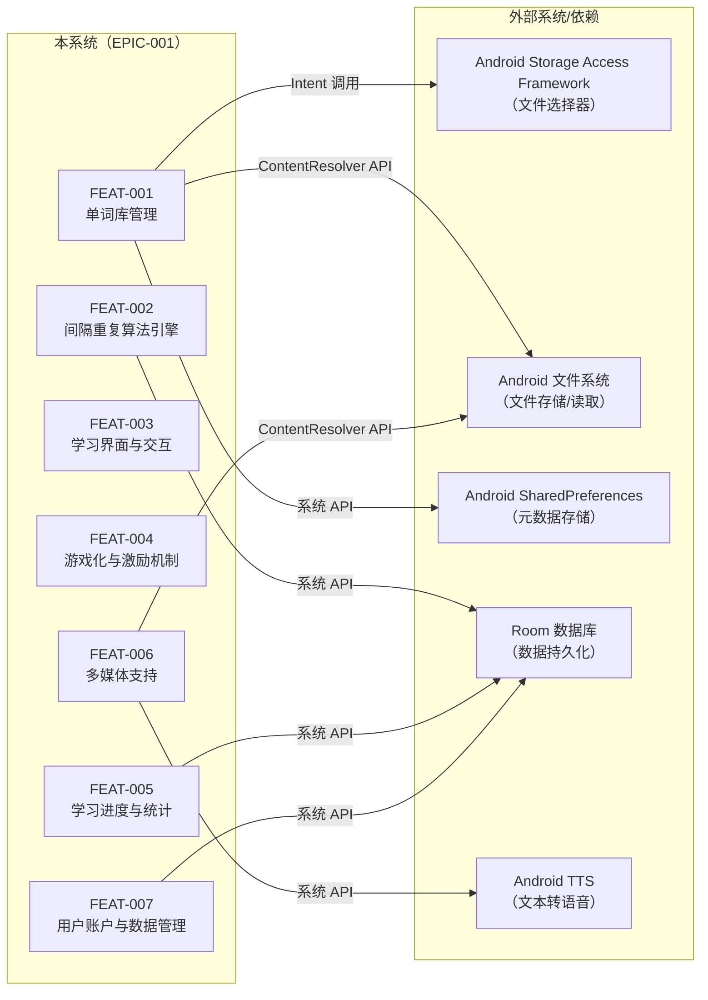
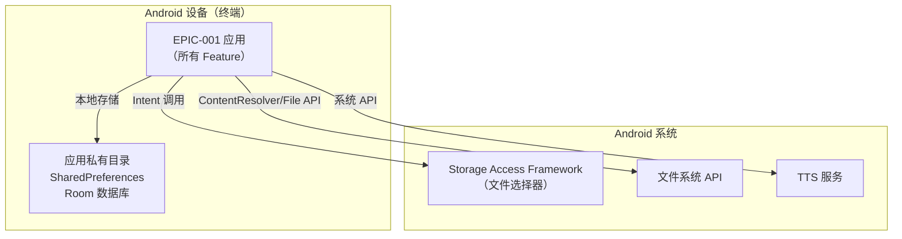
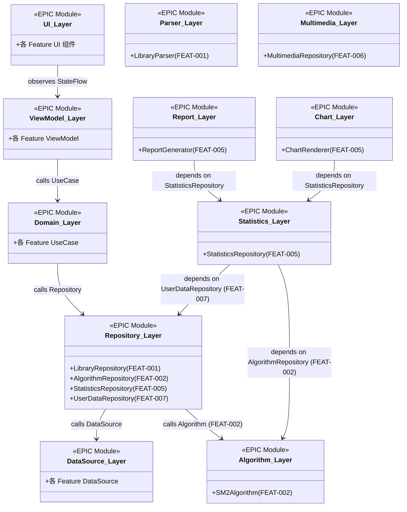
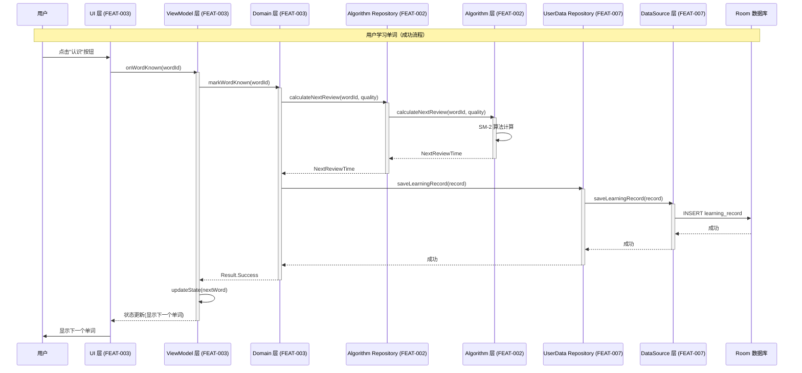
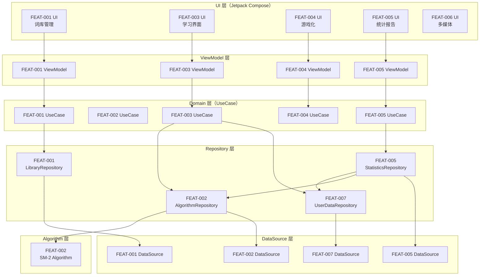
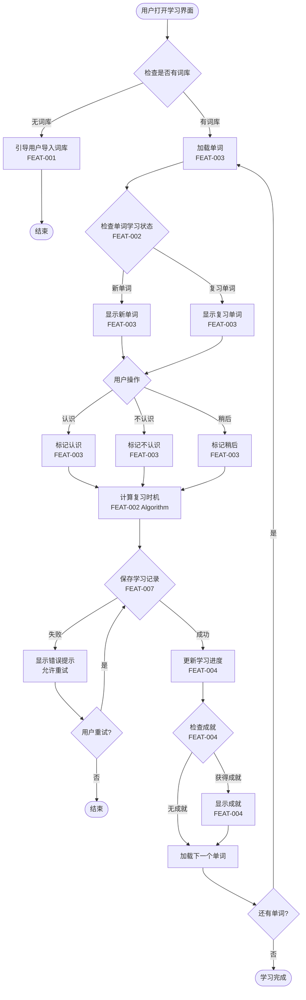
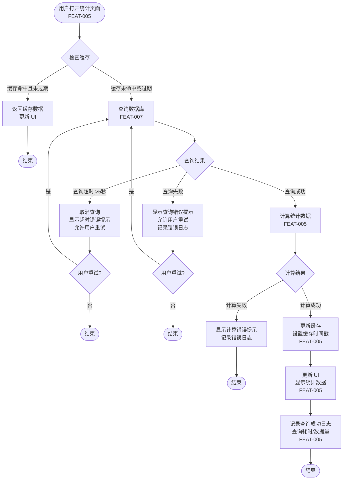

# EPIC Full Design：无痛记忆单词神器APP

**EPIC ID**：EPIC-001
**EPIC Version**：v0.1.0
**EPIC Full Design Version**：v0.1.0
**日期**：2026-01-19

**输入工件**：
- `specs/epics/EPIC-001-word-memory-app/epic.md`（EPIC 总览）
- 各 Feature 的 `spec.md` / `plan.md` / `tasks.md` / `full-design.md`（按实际存在）

> Agent 规则（强制）：
> - 本文档只做**跨 Feature 的整合与一致性呈现**，不得新增新的技术决策。
> - 若发现冲突或缺口，只能标注 `TODO(Clarify)` 并指向应修改的 Feature/Plan。

## 变更记录（增量变更）

| 版本 | 日期 | 变更摘要 | 影响 Feature | 是否需要回滚设计 |
|---|---|---|---|---|
| v0.1.0 | 2026-01-19 | 初始版本：整合各 Feature 的 Plan/Story/Task，生成 EPIC 级技术指导文档 |  | 否 |

## 1. EPIC 总览（来自 epic.md）

### 背景/目标/价值

- **背景**：
  - 传统单词记忆方法（如机械重复背诵）效率低下，用户容易产生倦怠感
  - 缺乏科学记忆方法指导，用户难以在遗忘曲线的最佳时间点复习
  - 现有单词学习应用缺乏个性化学习路径和游戏化激励机制
  - 用户需要一款能够科学安排复习节奏、提供沉浸式学习体验的单词记忆工具

- **目标**：
  - **用户目标**：通过科学的间隔重复算法和游戏化设计，让用户在无痛状态下高效记忆单词
  - **业务目标**：打造一款具备差异化竞争力的单词学习产品，提升用户学习效果和留存率
  - **平台目标**：建立可扩展的学习算法引擎和数据分析能力，支撑未来扩展更多学习内容

- **价值**：
  - **用户价值**：显著提升单词记忆效率，降低学习压力，增强学习动机和成就感
  - **业务价值**：形成用户粘性，提升日活跃度和学习时长，建立产品护城河
  - **技术价值**：积累间隔重复算法经验和用户学习行为数据，为后续产品迭代提供基础

### 范围 In/Out

- **In Scope**：
  - 单词库管理：词库导入、分类、搜索和管理功能
  - 间隔重复算法引擎：基于遗忘曲线的智能学习调度系统
  - 学习界面与交互：单词展示、学习操作（认识/不认识）、复习流程
  - 游戏化元素：成就系统、积分/等级、进度可视化
  - 学习进度跟踪：学习统计、记忆曲线、学习报告
  - 多媒体支持：单词发音、图片辅助、例句展示
  - 用户账户与数据：个人账户、学习数据本地存储
  - 学习提醒：智能推送复习提醒

- **Out of Scope**：
  - 云端数据同步（第一阶段仅本地存储）
  - 社交功能（分享、排行榜、社区）
  - 付费内容和高级订阅功能
  - 多语言学习（仅支持英语单词学习）
  - 单词学习游戏（仅包含基础的游戏化元素）
  - 离线词典查询（仅提供学习词库内的单词信息）

### 约束与假设

- **约束**：
  - **平台约束**：Android 平台，最低支持 Android 8.0（API Level 26）
  - **性能约束**：应用启动时间不超过 2 秒，页面切换流畅无卡顿
  - **存储约束**：本地数据存储不超过 100MB（不含词库资源包）
  - **合规约束**：符合 Android 数据隐私政策，用户学习数据不上传云端
  - **组织约束**：单人/小团队开发，开发周期 3-6 个月
  - **技术约束**：基于现有 Android 项目结构，使用 Jetpack Compose UI 框架

- **假设**：
  - **假设1**：用户具备基础的 Android 设备使用能力，能够独立完成应用安装和基础操作
  - **假设2**：用户的学习目标是记忆英语单词，词汇量范围在 1000-10000 词之间
  - **假设3**：用户每天至少能够投入 10-30 分钟进行单词学习
  - **假设4**：设备具备基本的网络连接能力（用于初始词库下载）

### 整体 FR/NFR（EPIC Level）

#### EPIC-FR（跨 Feature 的功能目标）

- **EPIC-FR-001**：用户能够通过科学的间隔重复算法高效记忆单词，系统能够智能安排复习时机
- **EPIC-FR-002**：用户能够通过直观的学习界面流畅地进行单词学习和复习操作
- **EPIC-FR-003**：用户能够查看详细的学习进度和统计数据，了解自己的学习效果

#### EPIC-NFR（跨 Feature 的非功能约束）

- **EPIC-NFR-PERF-001**：应用启动时间不超过 2 秒，页面切换流畅无卡顿，单词卡片加载时间不超过 500 毫秒
- **EPIC-NFR-POWER-001**：正常学习场景下（10 分钟学习），设备电池消耗不超过 2%
- **EPIC-NFR-MEM-001**：应用内存占用峰值不超过 150MB（不含系统开销），本地数据存储不超过 100MB（不含词库资源）
- **EPIC-NFR-SEC-001**：用户学习数据仅存储在本地设备，不上传云端；符合 Android 数据隐私政策要求
- **EPIC-NFR-OBS-001**：应用崩溃率低于 0.1%，关键操作失败率低于 1%；支持基本的使用日志记录（用于问题排查）

### 通用能力（Capability）

| 能力名称 | 类型（Design/Enabler/Infrastructure/Optimization） | 作用范围（哪些 Feature） | 交付物形态（SDK/资源包/配置/模型/服务） | 关键接口/契约 | 关键约束（含隐私/性能预算） | 状态 |
|---|---|---|---|---|---|---|
| 多媒体资源管理 | Infrastructure | 多媒体支持、学习界面与交互 | 资源加载SDK、缓存策略 | 资源加载接口、缓存接口 | 内存占用不超过50MB、资源加载时间不超过1秒 | 规划中 |

## 2. 0 层架构设计（EPIC 级：对外系统边界、部署、通信、交互）

### 2.1 外部系统与依赖汇总（跨 Feature）

| 外部系统/依赖 | 类型 | 涉及 Feature | 通信方式（协议/鉴权） | SLA/限流/超时 | 故障模式 | 我方策略 | 差异/冲突点（如有） | 引用来源 |
|---|---|---|---|---|---|---|---|---|
| Android Storage Access Framework（SAF） | 设备能力 | FEAT-001 | 系统 API（Intent） | 系统级，无 SLA | 用户拒绝授权、文件 URI 失效 | 引导用户授权、提示重新选择文件 |  | FEAT-001 plan.md:A2.1 |
| Android 文件系统 | 设备能力 | FEAT-001, FEAT-006 | 系统 API（ContentResolver/File） | 系统级，存储 I/O | 存储空间不足、文件损坏、权限被拒绝 | 检测空间、验证文件、提示用户 |  | FEAT-001 plan.md:A2.1, FEAT-006 plan.md:A2.1 |
| Android SharedPreferences | 设备能力 | FEAT-001 | 系统 API | 本地存储，无网络 | 存储空间不足、数据损坏 | 数据校验、备份恢复机制 |  | FEAT-001 plan.md:A2.1 |
| Room 数据库 | 设备能力 | FEAT-002, FEAT-005, FEAT-007 | 系统 API | 本地数据库，无网络 | 数据库损坏、存储空间不足 | 数据备份、异常恢复 |  | FEAT-002 plan.md:A2.1, FEAT-005 plan.md:A2.1, FEAT-007 plan.md:A2.1 |
| Android TTS（文本转语音） | 设备能力 | FEAT-006 | 系统 API | 系统级，无 SLA | TTS 服务不可用、超时 | 静默降级或本地缓存 |  | FEAT-006 plan.md:A2.1 |

### 2.2 0 层架构图（EPIC 级视图）



### 2.3 部署视图（EPIC 级视图）



### 2.4 通信与交互方式汇总（跨 Feature）

- **协议**：设备能力（Android 系统 API）、本地文件存储、本地数据库（Room）
- **鉴权**：无需鉴权（本地操作），Storage Access Framework 由系统管理文件访问权限
- **超时与重试**：
  - 文件解析超时 30 秒（FEAT-001），失败后允许用户重新选择文件
  - 数据库查询超时 5 秒（FEAT-005），失败后允许用户重试
  - TTS 服务超时 3 秒（FEAT-006），失败后静默降级
- **幂等**：
  - 词库导入操作：基于文件路径+文件大小+修改时间生成唯一标识，防止重复导入（FEAT-001）
  - 学习记录写入：基于单词ID+学习时间生成唯一标识，防止重复记录（FEAT-007）
- **限流**：无外部限流（本地操作）；内部限流：并发导入队列化，一次只处理一个词库导入（FEAT-001）
- **一致性与补偿**：强一致（本地存储），词库元数据（SharedPreferences）和文件系统同步更新，失败时回滚（FEAT-001）

## 3. 1 层架构设计一致性（跨 Feature：框架图、模块拆分、接口协议）

### 3.0 EPIC 模块目录（EPIC Module Catalog）与映射关系（跨 Feature，核心）

#### 3.0.1 EPIC 模块目录（Catalog）

| EPIC 模块 | 职责边界（一句话） | 涉及 Feature | 提供的接口/契约（引用） | 依赖的接口/契约（引用） | NFR 责任（性能/功耗/内存/安全/可观测性/可靠性） | 差异/冲突点（如有） | 引用来源 |
|---|---|---|---|---|---|---|---|
| UI 层（Jetpack Compose） | 负责各 Feature 的 UI 展示与用户交互 | FEAT-001, FEAT-003, FEAT-004, FEAT-005, FEAT-006 | 各 Feature UI 组件 | ViewModel 层（StateFlow） | PERF（60fps）、MEM（UI 内存占用） |  | epic.md + 各 Feature plan.md:A3.2 |
| ViewModel 层 | 管理 UI 状态、处理用户事件、调用 UseCase | FEAT-001, FEAT-003, FEAT-004, FEAT-005 | 各 Feature ViewModel | Domain 层（UseCase） | PERF（状态更新响应）、MEM（状态内存占用） |  | epic.md + 各 Feature plan.md:A3.2 |
| Domain 层（UseCase） | 业务逻辑封装、流程编排、数据转换 | FEAT-001, FEAT-002, FEAT-003, FEAT-004, FEAT-005 | 各 Feature UseCase | Data 层（Repository） | PERF（业务逻辑执行效率） |  | epic.md + 各 Feature plan.md:A3.2 |
| Repository 层 | 数据访问抽象、多数据源协调 | FEAT-001, FEAT-002, FEAT-005, FEAT-007 | 各 Feature Repository 接口 | DataSource 层 | PERF（数据查询效率）、REL（数据可靠性） |  | epic.md + 各 Feature plan.md:A3.2 |
| Algorithm 层 | 间隔重复算法引擎，提供复习时机计算和记忆强度评估 | FEAT-002 | AlgorithmRepository 接口 | Room 数据库（学习状态） | PERF（算法计算效率 ≤ 10ms）、MEM（算法状态存储） |  | FEAT-002 plan.md:A3.2 |
| DataSource 层 | 底层数据访问、SharedPreferences/文件操作/Room 数据库操作 | FEAT-001, FEAT-002, FEAT-005, FEAT-007 | 各 Feature DataSource | Storage（SharedPrefs/FileStorage/Room） | PERF（I/O 效率）、REL（数据可靠性） |  | epic.md + 各 Feature plan.md:A3.2 |
| Parser 层 | 文件解析、格式转换、数据校验 | FEAT-001 | LibraryParser 接口 | FileStorage | PERF（解析效率）、MEM（解析内存占用） |  | FEAT-001 plan.md:A3.2 |
| Multimedia 层 | 多媒体资源加载、缓存、展示 | FEAT-006 | MultimediaRepository 接口 | FileStorage、TTS | PERF（资源加载效率）、MEM（资源缓存） |  | FEAT-006 plan.md:A3.2 |
| Statistics 层 | 学习统计数据查询、计算、缓存 | FEAT-005 | StatisticsRepository 接口 | UserDataRepository（FEAT-007）、AlgorithmRepository（FEAT-002） | PERF（查询效率 ≤ 1s）、MEM（缓存大小 ≤ 10MB） |  | FEAT-005 plan.md:A3.2 |
| Report 层 | 学习报告生成、格式化 | FEAT-005 | ReportGenerator 接口 | StatisticsRepository | PERF（生成效率 ≤ 2s） |  | FEAT-005 plan.md:A3.2 |
| Chart 层 | 图表渲染、数据可视化 | FEAT-005 | ChartRenderer 接口 | Vico 图表库 | PERF（渲染效率 ≤ 500ms）、MEM（图表内存占用） |  | FEAT-005 plan.md:A3.2 |

#### 3.0.2 EPIC 模块 ↔ Feature 模块映射（Module Mapping）

| EPIC 模块 | 来源 Feature | Feature 模块（来自 FEAT plan.md:A3.2） | 关系类型（Owned-by/Consumed-by/Adapter/Shared） | 引用来源（A3.2/A3.4/B4） | 备注/差异 |
|---|---|---|---|---|---|
| UI 层（Jetpack Compose） | FEAT-001 | UI 层（Jetpack Compose） | Owned-by | FEAT-001 plan.md:A3.2 / A3.4 | 词库列表和导入界面 |
| UI 层（Jetpack Compose） | FEAT-003 | UI 层（Jetpack Compose） | Owned-by | FEAT-003 plan.md:A3.2 / A3.4 | 学习界面和交互 |
| UI 层（Jetpack Compose） | FEAT-004 | UI 层（Jetpack Compose） | Owned-by | FEAT-004 plan.md:A3.2 / A3.4 | 游戏化界面 |
| UI 层（Jetpack Compose） | FEAT-005 | UI 层（Jetpack Compose） | Owned-by | FEAT-005 plan.md:A3.2 / A3.4 | 统计和报告界面 |
| UI 层（Jetpack Compose） | FEAT-006 | UI 层（Jetpack Compose） | Owned-by | FEAT-006 plan.md:A3.2 / A3.4 | 多媒体展示界面 |
| ViewModel 层 | FEAT-001 | ViewModel 层 | Owned-by | FEAT-001 plan.md:A3.2 / A3.4 | 词库管理 ViewModel |
| ViewModel 层 | FEAT-003 | ViewModel 层 | Owned-by | FEAT-003 plan.md:A3.2 / A3.4 | 学习界面 ViewModel |
| ViewModel 层 | FEAT-004 | ViewModel 层 | Owned-by | FEAT-004 plan.md:A3.2 / A3.4 | 游戏化 ViewModel |
| ViewModel 层 | FEAT-005 | ViewModel 层 | Owned-by | FEAT-005 plan.md:A3.2 / A3.4 | 统计和报告 ViewModel |
| Domain 层（UseCase） | FEAT-001 | Domain 层（UseCase） | Owned-by | FEAT-001 plan.md:A3.2 / A3.4 | 词库管理用例 |
| Domain 层（UseCase） | FEAT-002 | Domain 层（UseCase） | Owned-by | FEAT-002 plan.md:A3.2 / A3.4 | 算法引擎用例 |
| Domain 层（UseCase） | FEAT-003 | Domain 层（UseCase） | Owned-by | FEAT-003 plan.md:A3.2 / A3.4 | 学习界面用例 |
| Domain 层（UseCase） | FEAT-004 | Domain 层（UseCase） | Owned-by | FEAT-004 plan.md:A3.2 / A3.4 | 游戏化用例 |
| Domain 层（UseCase） | FEAT-005 | Domain 层（UseCase） | Owned-by | FEAT-005 plan.md:A3.2 / A3.4 | 统计和报告用例 |
| Repository 层 | FEAT-001 | Repository 层 | Owned-by | FEAT-001 plan.md:A3.2 / A3.4 | 词库仓库 |
| Repository 层 | FEAT-002 | Repository 层 | Owned-by | FEAT-002 plan.md:A3.2 / A3.4 | 算法仓库 |
| Repository 层 | FEAT-005 | Repository 层 | Owned-by | FEAT-005 plan.md:A3.2 / A3.4 | 统计仓库 |
| Repository 层 | FEAT-007 | Repository 层 | Owned-by | FEAT-007 plan.md:A3.2 / A3.4 | 用户数据仓库（被 FEAT-005 依赖） |
| Algorithm 层 | FEAT-002 | Algorithm 层 | Owned-by | FEAT-002 plan.md:A3.2 / A3.4 | 间隔重复算法引擎 |
| DataSource 层 | FEAT-001 | DataSource 层 | Owned-by | FEAT-001 plan.md:A3.2 / A3.4 | 词库本地数据源 |
| DataSource 层 | FEAT-002 | DataSource 层 | Owned-by | FEAT-002 plan.md:A3.2 / A3.4 | 算法数据源 |
| DataSource 层 | FEAT-005 | DataSource 层 | Owned-by | FEAT-005 plan.md:A3.2 / A3.4 | 统计数据源 |
| DataSource 层 | FEAT-007 | DataSource 层 | Owned-by | FEAT-007 plan.md:A3.2 / A3.4 | 用户数据源 |
| Parser 层 | FEAT-001 | Parser 层 | Owned-by | FEAT-001 plan.md:A3.2 / A3.4 | 文件解析器 |
| Multimedia 层 | FEAT-006 | Multimedia 层 | Owned-by | FEAT-006 plan.md:A3.2 / A3.4 | 多媒体资源管理 |
| Statistics 层 | FEAT-005 | Statistics 层 | Owned-by | FEAT-005 plan.md:A3.2 / A3.4 | 学习统计 |
| Report 层 | FEAT-005 | Report 层 | Owned-by | FEAT-005 plan.md:A3.2 / A3.4 | 报告生成 |
| Chart 层 | FEAT-005 | Chart 层 | Owned-by | FEAT-005 plan.md:A3.2 / A3.4 | 图表渲染 |

#### 3.0.3 EPIC 模块级 UML 总览（全局查看入口，只引用 Feature Plan）

| EPIC 模块 | 类图入口（引用） | 时序-成功入口（引用） | 时序-异常入口（引用） | 关键异常（摘要） | 涉及 Feature |
|---|---|---|---|---|---|
| UI 层（Jetpack Compose） | FEAT-001 plan.md:A3.4:UI层:UML类图 | FEAT-001 plan.md:A3.4:UI层:时序-成功 | FEAT-001 plan.md:A3.4:UI层:时序-异常 | 用户取消、权限拒绝 | FEAT-001, FEAT-003, FEAT-004, FEAT-005, FEAT-006 |
| ViewModel 层 | FEAT-001 plan.md:A3.4:ViewModel层:UML类图 | FEAT-001 plan.md:A3.4:ViewModel层:时序-成功 | FEAT-001 plan.md:A3.4:ViewModel层:时序-异常 | 状态更新失败、协程取消 | FEAT-001, FEAT-003, FEAT-004, FEAT-005 |
| Domain 层（UseCase） | FEAT-001 plan.md:A3.4:Domain层:UML类图 | FEAT-001 plan.md:A3.4:Domain层:时序-成功 | FEAT-001 plan.md:A3.4:Domain层:时序-异常 | 业务逻辑失败、数据校验失败 | FEAT-001, FEAT-002, FEAT-003, FEAT-004, FEAT-005 |
| Repository 层 | FEAT-001 plan.md:A3.4:Repository层:UML类图 | FEAT-001 plan.md:A3.4:Repository层:时序-成功 | FEAT-001 plan.md:A3.4:Repository层:时序-异常 | 数据查询失败、缓存失效 | FEAT-001, FEAT-002, FEAT-005, FEAT-007 |
| Algorithm 层 | FEAT-002 plan.md:A3.4:Algorithm层:UML类图 | FEAT-002 plan.md:A3.4:Algorithm层:时序-成功 | FEAT-002 plan.md:A3.4:Algorithm层:时序-异常 | 算法计算失败、数据缺失 | FEAT-002 |
| DataSource 层 | FEAT-001 plan.md:A3.4:DataSource层:UML类图 | FEAT-001 plan.md:A3.4:DataSource层:时序-成功 | FEAT-001 plan.md:A3.4:DataSource层:时序-异常 | I/O 失败、存储空间不足 | FEAT-001, FEAT-002, FEAT-005, FEAT-007 |
| Parser 层 | FEAT-001 plan.md:A3.4:Parser层:UML类图 | FEAT-001 plan.md:A3.4:Parser层:时序-成功 | FEAT-001 plan.md:A3.4:Parser层:时序-异常 | 文件格式不支持、解析失败 | FEAT-001 |
| Multimedia 层 | FEAT-006 plan.md:A3.4:Multimedia层:UML类图 | FEAT-006 plan.md:A3.4:Multimedia层:时序-成功 | FEAT-006 plan.md:A3.4:Multimedia层:时序-异常 | 资源加载失败、TTS 超时 | FEAT-006 |
| Statistics 层 | FEAT-005 plan.md:A3.4:Statistics层:UML类图 | FEAT-005 plan.md:A3.4:Statistics层:时序-成功 | FEAT-005 plan.md:A3.4:Statistics层:时序-异常 | 查询超时、计算失败 | FEAT-005 |
| Report 层 | FEAT-005 plan.md:A3.4:Report层:UML类图 | FEAT-005 plan.md:A3.4:Report层:时序-成功 | FEAT-005 plan.md:A3.4:Report层:时序-异常 | 生成超时、数据缺失 | FEAT-005 |
| Chart 层 | FEAT-005 plan.md:A3.4:Chart层:UML类图 | FEAT-005 plan.md:A3.4:Chart层:时序-成功 | FEAT-005 plan.md:A3.4:Chart层:时序-异常 | 渲染失败、内存不足 | FEAT-005 |

#### 3.0.4 EPIC 模块级 UML（EPIC 视角一致性视图，建议）

##### EPIC 模块级类图（静态视图）



##### EPIC 端到端时序图 - 成功链路（动态视图）



##### EPIC 端到端时序图 - 异常链路（动态视图）

```mermaid
sequenceDiagram
  participant User as 用户
  participant UI as UI 层 (FEAT-003)
  participant VM as ViewModel 层 (FEAT-003)
  participant UC as Domain 层 (FEAT-003)
  participant AlgRepo as Algorithm Repository (FEAT-002)
  participant Alg as Algorithm 层 (FEAT-002)
  participant UserRepo as UserData Repository (FEAT-007)
  participant DS as DataSource 层 (FEAT-007)
  participant DB as Room 数据库

  Note over User,DB: 用户学习单词（异常流程）
  User->>UI: 点击"认识"按钮
  UI->>VM: onWordKnown(wordId)
  activate VM
  VM->>UC: markWordKnown(wordId)
  activate UC
  UC->>AlgRepo: calculateNextReview(wordId, quality)
  activate AlgRepo
  AlgRepo->>Alg: calculateNextReview(wordId, quality)
  activate Alg
  
  alt 算法计算失败（数据缺失）
    Alg-->>AlgRepo: Result.Error(DataNotFound)
    deactivate Alg
    AlgRepo-->>UC: Result.Error(DataNotFound)
    deactivate AlgRepo
    UC-->>VM: Result.Error(DataNotFound)
    deactivate UC
    VM->>VM: updateState(error = "数据缺失")
    VM-->>UI: 状态更新(显示错误)
    deactivate VM
    UI->>User: 显示错误提示
  else 数据库写入失败
    Alg-->>AlgRepo: NextReviewTime
    deactivate Alg
    AlgRepo-->>UC: NextReviewTime
    deactivate AlgRepo
    UC->>UserRepo: saveLearningRecord(record)
    activate UserRepo
    UserRepo->>DS: saveLearningRecord(record)
    activate DS
    DS->>DB: INSERT learning_record
    DB-->>DS: SQLException
    DS-->>UserRepo: Result.Error(WriteFailed)
    deactivate DS
    UserRepo-->>UC: Result.Error(WriteFailed)
    deactivate UserRepo
    UC-->>VM: Result.Error(WriteFailed)
    deactivate UC
    VM->>VM: updateState(error = "保存失败，请重试")
    VM-->>UI: 状态更新(显示错误和重试按钮)
    deactivate VM
    UI->>User: 显示错误提示和重试按钮
  end
```

### 3.1 1 层框架图（EPIC 级一致性视图）



### 3.2 模块与接口协议一致性问题（汇总）

| 模块/能力 | 涉及 Feature | 接口/协议/契约（引用） | 版本/兼容策略 | 不一致点 | 风险 | 处理建议（指向应修改的 Feature/Plan） |
|---|---|---|---|---|---|---|
| UserDataRepository 接口 | FEAT-005, FEAT-007 | FEAT-007 plan.md:B4.1 | 向后兼容 | 无 | 低 |  |
| AlgorithmRepository 接口 | FEAT-002, FEAT-005 | FEAT-002 plan.md:B4.1 | 向后兼容 | 无 | 低 |  |

### 3.3 关键模块设计汇总（跨 Feature）

| 关键模块 | 涉及 Feature | 设计要点（引用来源） | 策略/取舍（引用来源） | NFR 责任（性能/功耗/内存/安全/可观测性） | 风险 |
|---|---|---|---|---|---|
| Algorithm 层（SM-2 算法） | FEAT-002 | FEAT-002 plan.md:A3.4:Algorithm层 | FEAT-002 plan.md:A1:技术选型 | PERF（计算 ≤ 10ms）、MEM（状态存储） | 算法精度、计算效率 |
| Statistics 层（统计数据查询） | FEAT-005 | FEAT-005 plan.md:A3.4:Statistics层 | FEAT-005 plan.md:A1:技术选型 | PERF（查询 ≤ 1s）、MEM（缓存 ≤ 10MB） | 查询性能、缓存策略 |
| Repository 层（数据访问） | FEAT-001, FEAT-002, FEAT-005, FEAT-007 | 各 Feature plan.md:A3.4:Repository层 | 各 Feature plan.md:A3.2 | PERF（I/O 效率）、REL（数据可靠性） | 数据一致性、查询性能 |

### 3.4 数据模型与存储/契约一致性（跨 Feature）（汇总）

#### 3.4.1 数据模型/存储一致性问题

| 数据实体/表/存储键 | 涉及 Feature | 物理结构与约束（引用） | 版本/迁移策略（引用） | 不一致点 | 风险 | 处理建议（指向应修改的 Feature/Plan） |
|---|---|---|---|---|---|---|
| WordLibrary（词库） | FEAT-001 | FEAT-001 plan.md:B3.2 | 向后兼容 | 无 | 低 |  |
| LearningRecord（学习记录） | FEAT-002, FEAT-005, FEAT-007 | FEAT-007 plan.md:B3.2 | 向后兼容 | 无 | 低 |  |
| WordLearningState（单词学习状态） | FEAT-002 | FEAT-002 plan.md:B3.2 | 向后兼容 | 无 | 低 |  |

#### 3.4.2 对外提供接口（Capability/跨模块接口）一致性问题

| 能力/接口 | 提供方 Feature | 调用方 Feature | 契约工件（plan.md B4.1 / contracts/ 引用） | 版本/兼容策略 | 不一致点 | 风险 |
|---|---|---|---|---|---|---|
| UserDataRepository | FEAT-007 | FEAT-005 | FEAT-007 plan.md:B4.1 | 向后兼容 | 无 | 低 |
| AlgorithmRepository | FEAT-002 | FEAT-005 | FEAT-002 plan.md:B4.1 | 向后兼容 | 无 | 低 |

#### 3.4.3 外部依赖接口（依赖契约）一致性问题

| 依赖项 | 涉及 Feature | 调用级契约（plan.md B4.2 引用） | 超时/重试/限流策略 | 故障模式与降级策略 | 不一致点 | 风险 |
|---|---|---|---|---|---|---|
| Room 数据库 | FEAT-002, FEAT-005, FEAT-007 | 各 Feature plan.md:B4.2 | 查询超时 5 秒，不重试 | 数据库损坏、存储空间不足 → 数据备份、异常恢复 | 无 | 低 |
| Android TTS | FEAT-006 | FEAT-006 plan.md:B4.2 | TTS 超时 3 秒，不重试 | TTS 服务不可用 → 静默降级 | 无 | 低 |

## 4. 关键流程设计（EPIC 级：端到端流程，每个流程一张流程图，含正常 + 全部异常）

### 流程 1：用户学习单词流程（端到端）



### 流程 2：用户查看学习统计流程（端到端）



## 5. Feature → Story → Task 汇总追溯

### 5.1 Feature 列表与状态（来自 epic.md Feature Registry）

| Feature | 分支 | Feature Version | Plan Version | Tasks Version | 状态 |
|---|---|---|---|---|---|
| 单词库管理 (FEAT-001) | epic/EPIC-001-word-memory-app | v0.1.0 | v0.2.0 | v0.1.0 | Tasks Ready |
| 间隔重复学习算法引擎 (FEAT-002) | epic/EPIC-001-word-memory-app | v0.1.0 | v0.2.0 | v0.1.0 | Tasks Ready |
| 学习界面与交互 (FEAT-003) | epic/EPIC-001-word-memory-app | v0.1.0 | v0.1.0 | v0.1.0 | Tasks Ready |
| 游戏化与激励机制 (FEAT-004) | epic/EPIC-001-word-memory-app | v0.1.0 | v0.1.0 | v0.1.0 | Tasks Ready |
| 学习进度与统计 (FEAT-005) | epic/EPIC-001-word-memory-app | v0.1.0 | v0.1.0 | v0.1.0 | Tasks Ready |

### 5.2 Story 汇总（跨 Feature）

| Feature | Story ID | 类型 | 目标 | 覆盖 FR/NFR | 依赖 | 关键风险 |
|---|---|---|---|---|---|---|
| FEAT-001 | ST-001 | Functional | 实现词库文件导入功能 | FR-001; NFR-PERF-001, NFR-SEC-001/002, NFR-OBS-001, NFR-REL-001 | 无 | RISK-001: 文件解析失败; RISK-002: 存储空间不足 |
| FEAT-001 | ST-002 | Functional | 实现词库列表展示功能 | FR-002, FR-006; NFR-PERF-001, NFR-MEM-001, NFR-OBS-001 | ST-001 |  |
| FEAT-001 | ST-003 | Functional | 实现词库选择功能 | FR-003; NFR-REL-002, NFR-OBS-001 | ST-002 |  |
| FEAT-001 | ST-004 | Functional | 实现词库搜索功能 | FR-004; NFR-PERF-001 | ST-002 |  |
| FEAT-001 | ST-005 | Infrastructure | 实现错误处理和异常场景 | FR-005; NFR-OBS-002, NFR-REL-001 | ST-001 | RISK-001: 文件解析失败 |
| FEAT-001 | ST-006 | Infrastructure | 实现数据持久化和生命周期管理 | NFR-REL-002, NFR-MEM-001/002 | ST-001, ST-002, ST-003 | RISK-003: 数据丢失风险 |
| FEAT-002 | ST-001 | Functional | 实现复习时机计算功能 | FR-001; NFR-PERF-001, NFR-REL-001 | 无 | RISK-001: 算法计算失败 |
| FEAT-002 | ST-002 | Functional | 实现学习状态管理功能 | FR-002; NFR-REL-002 | ST-001 | RISK-002: 数据丢失风险 |
| FEAT-002 | ST-003 | Functional | 实现记忆强度评估功能 | FR-003; NFR-PERF-001 | ST-001, ST-002 |  |
| FEAT-002 | ST-004 | Infrastructure | 实现算法引擎接口和封装 | FR-004; NFR-OBS-001 | ST-001, ST-002, ST-003 |  |
| FEAT-003 | ST-001 | Functional | 实现单词卡片展示功能 | FR-001; NFR-PERF-001 | FEAT-002 |  |
| FEAT-003 | ST-002 | Functional | 实现学习操作功能 | FR-002; NFR-PERF-001 | ST-001 |  |
| FEAT-003 | ST-003 | Functional | 实现学习流程导航功能 | FR-003; NFR-PERF-001 | ST-001, ST-002 |  |
| FEAT-004 | ST-001 | Functional | 实现成就系统 | FR-001; NFR-PERF-001 | FEAT-005 |  |
| FEAT-004 | ST-002 | Functional | 实现积分/等级系统 | FR-002; NFR-PERF-001 | ST-001 |  |
| FEAT-004 | ST-003 | Functional | 实现进度可视化 | FR-003; NFR-PERF-001 | ST-001, ST-002 |  |
| FEAT-005 | ST-001 | Functional | 实现统计数据查询功能 | FR-001, FR-005; NFR-PERF-001, NFR-REL-001, NFR-REL-002 | FEAT-007 |  |
| FEAT-005 | ST-002 | Infrastructure | 实现统计数据缓存机制 | NFR-PERF-001, NFR-MEM-001, NFR-REL-003 | ST-001 |  |
| FEAT-005 | ST-003 | Functional | 实现学习趋势图表功能 | FR-002; NFR-PERF-001, NFR-MEM-001 | ST-001 |  |
| FEAT-005 | ST-004 | Functional | 实现记忆曲线展示功能 | FR-003, FR-008; NFR-PERF-001, NFR-MEM-001 | FEAT-002, ST-003 |  |
| FEAT-005 | ST-005 | Functional | 实现报告生成功能 | FR-004, FR-007; NFR-PERF-001, NFR-REL-001 | ST-001, ST-003 |  |
| FEAT-005 | ST-006 | Functional | 实现空状态和错误处理 | FR-006, FR-007; NFR-OBS-002 | ST-001 |  |
| FEAT-005 | ST-007 | Optimization | 实现性能优化和降级策略 | NFR-PERF-002, NFR-PERF-003, NFR-MEM-001 | ST-001, ST-003 | RISK-001: 查询超时; RISK-003: 图表渲染性能问题 |
| FEAT-005 | ST-008 | Infrastructure | 实现可观测性和日志记录 | NFR-OBS-001, NFR-OBS-002, NFR-OBS-003 | ST-001, ST-003, ST-005 |  |

### 5.3 追溯矩阵（EPIC-FR/NFR → Feature-FR/NFR → Story → Task）

| EPIC FR/NFR | Feature | Feature FR/NFR | Story | Task | 验证方式 | 备注 |
|---|---|---|---|---|---|---|
| EPIC-FR-001 | FEAT-002 | FR-001 | ST-001 | T??? | 算法计算准确性测试 | 间隔重复算法 |
| EPIC-FR-002 | FEAT-003 | FR-002 | ST-002 | T??? | 学习操作功能测试 | 学习界面与交互 |
| EPIC-FR-003 | FEAT-005 | FR-001 | ST-001 | T??? | 统计数据查询功能测试 | 学习进度与统计 |
| EPIC-NFR-PERF-001 | FEAT-001 | NFR-PERF-001 | ST-001, ST-002, ST-004 | T??? | 性能测试（导入 ≤ 5s, 加载 ≤ 500ms, 搜索 ≤ 200ms） | 应用启动时间、页面切换、单词卡片加载 |
| EPIC-NFR-PERF-001 | FEAT-002 | NFR-PERF-001 | ST-001 | T??? | 性能测试（算法计算 ≤ 10ms） | 算法计算效率 |
| EPIC-NFR-PERF-001 | FEAT-003 | NFR-PERF-001 | ST-001, ST-002, ST-003 | T??? | 性能测试（界面响应 ≤ 500ms） | 学习界面流畅度 |
| EPIC-NFR-PERF-001 | FEAT-005 | NFR-PERF-001 | ST-001, ST-003 | T??? | 性能测试（查询 ≤ 1s, 图表渲染 ≤ 500ms） | 统计数据查询和图表渲染 |
| EPIC-NFR-MEM-001 | FEAT-001 | NFR-MEM-001/002 | ST-002, ST-006 | T??? | 内存测试（列表内存占用、生命周期管理） | 应用内存占用峰值 ≤ 150MB |
| EPIC-NFR-MEM-001 | FEAT-005 | NFR-MEM-001 | ST-002, ST-003 | T??? | 内存测试（缓存 ≤ 10MB, 图表内存占用） | 统计数据缓存和图表内存 |
| EPIC-NFR-SEC-001 | FEAT-001 | NFR-SEC-001/002 | ST-001 | T??? | 安全测试（数据本地存储、权限管理） | 用户学习数据仅存储在本地设备 |
| EPIC-NFR-OBS-001 | FEAT-001 | NFR-OBS-001/002 | ST-001, ST-002, ST-003, ST-005 | T??? | 可观测性测试（事件日志、错误日志） | 应用崩溃率低于 0.1%，关键操作失败率低于 1% |
| EPIC-NFR-OBS-001 | FEAT-005 | NFR-OBS-001, NFR-OBS-002, NFR-OBS-003 | ST-008 | T??? | 可观测性测试（事件日志、错误日志、性能指标） | 关键操作日志记录 |

## 6. 跨 Feature 通用能力设计（来自 epic.md + 各 Feature plan）

| 能力 | 设计要点（引用来源） | 关键接口/契约（引用来源） | 风险 | 影响 Feature |
|---|---|---|---|---|
| 多媒体资源管理 | FEAT-006 plan.md:A3.2 | FEAT-006 plan.md:B4.1 | 资源加载失败、内存占用过高 | FEAT-003, FEAT-006 |

### 常见 Capability Feature 汇总（建议）

#### 6.1 埋点与可观测性（产品埋点 + 技术埋点）

| Capability Feature | 事件/指标范围 | 字段口径/隐私策略 | 接入方式（SDK/API） | 版本/兼容策略 | 影响的业务 Feature | 引用来源 |
|---|---|---|---|---|---|---|
| 待定 | 待定 | 待定 | 待定 | 待定 | FEAT-001, FEAT-002, FEAT-003, FEAT-004, FEAT-005 | epic.md（规划中） |

#### 6.2 动效与交互组件库

| Capability Feature | 资产/组件范围 | 性能预算与验收 | 接入方式（组件/API） | 兼容策略 | 影响的业务 Feature | 引用来源 |
|---|---|---|---|---|---|---|
| 待定 | 待定 | 待定 | 待定 | 待定 | FEAT-003, FEAT-004 | epic.md（规划中） |

#### 6.3 算法能力（每模型/每能力一个 Feature）

| Capability Feature | 模型/能力 | 推理部署（端侧/服务端） | SDK/API 契约 | 评估指标与监控 | 回退/降级策略 | 影响的业务 Feature | 引用来源 |
|---|---|---|---|---|---|---|---|
| FEAT-002 | SM-2 间隔重复算法 | 端侧（本地计算） | AlgorithmRepository 接口 | 算法计算效率 ≤ 10ms、记忆准确率 | 算法计算失败 → 使用默认值 | FEAT-003, FEAT-005 | FEAT-002 plan.md + full-design.md |

## 7. 风险与一致性问题（汇总）

- **跨 Feature 冲突**：暂无发现明显冲突
- **接口/数据模型不一致**：暂无发现不一致
- **NFR 预算冲突（性能/功耗/内存）**：
  - **性能预算**：各 Feature 的性能要求均在 EPIC 级 NFR 范围内，无冲突
  - **内存预算**：各 Feature 的内存占用要求均在 EPIC 级 NFR 范围内（≤ 150MB），无冲突
  - **功耗预算**：各 Feature 未明确功耗要求，建议在后续迭代中补充

## 8. 执行指引（不新增 Task）

- 每个 Feature 按各自 `tasks.md` 执行
- 任何跨 Feature 变更必须先更新对应 Feature 的 plan/spec，并运行 `/speckit.epicsync` 更新总览
- 跨 Feature 依赖关系：
  - FEAT-002（算法引擎）必须先于 FEAT-003（学习界面）完成
  - FEAT-007（用户数据管理）必须先于 FEAT-005（学习统计）完成
  - FEAT-001（词库管理）必须先于 FEAT-003（学习界面）完成
