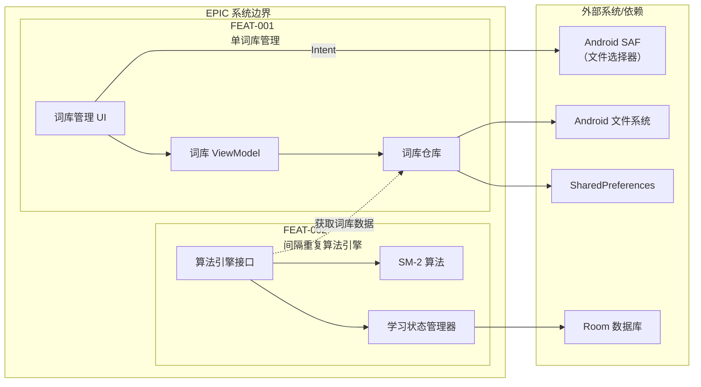
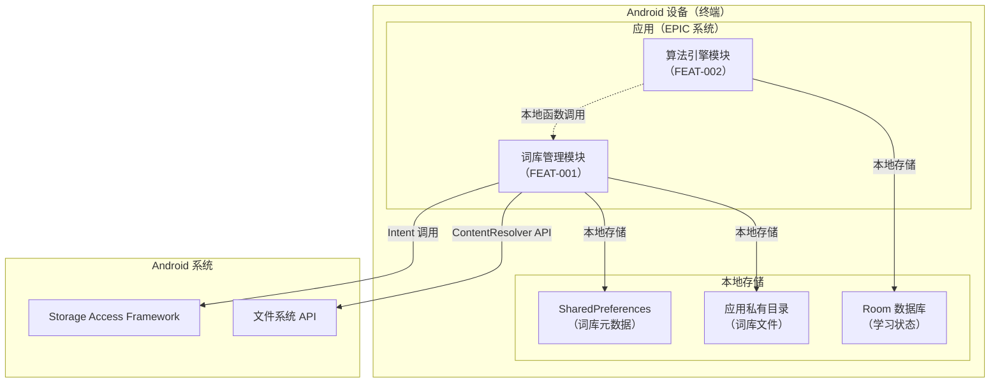
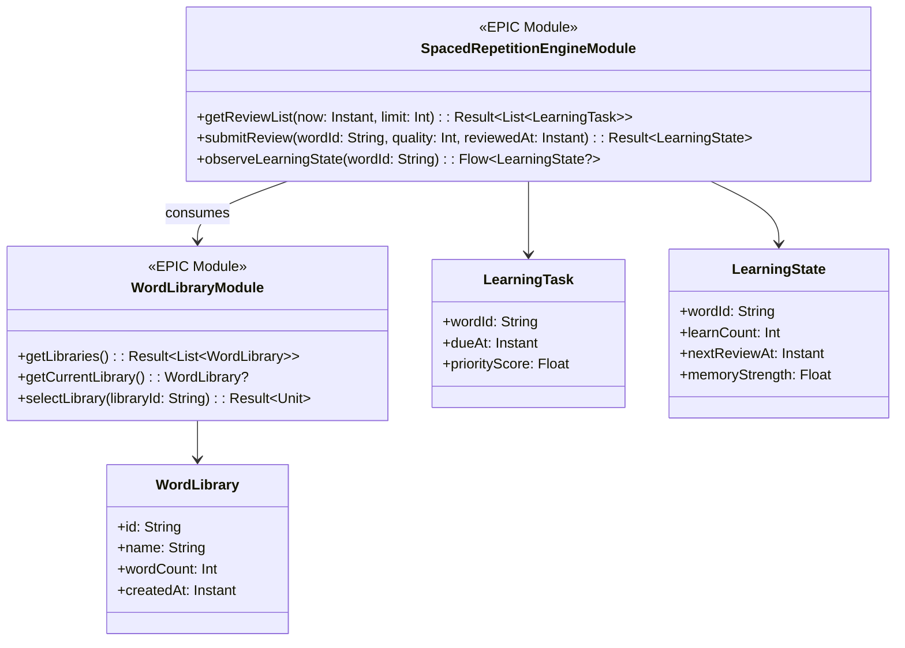
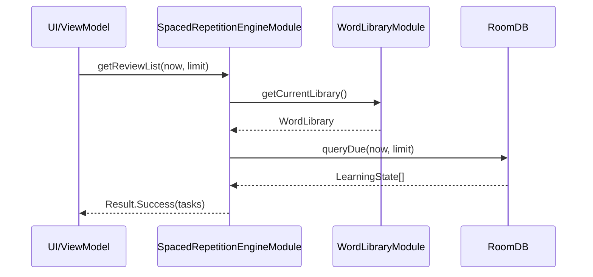
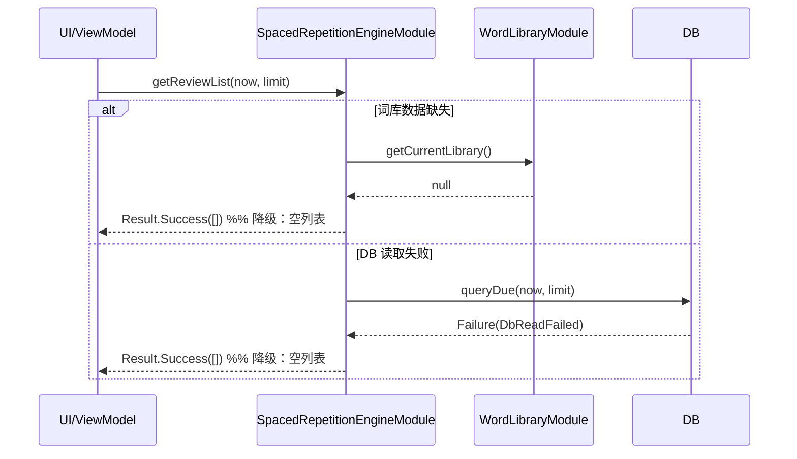
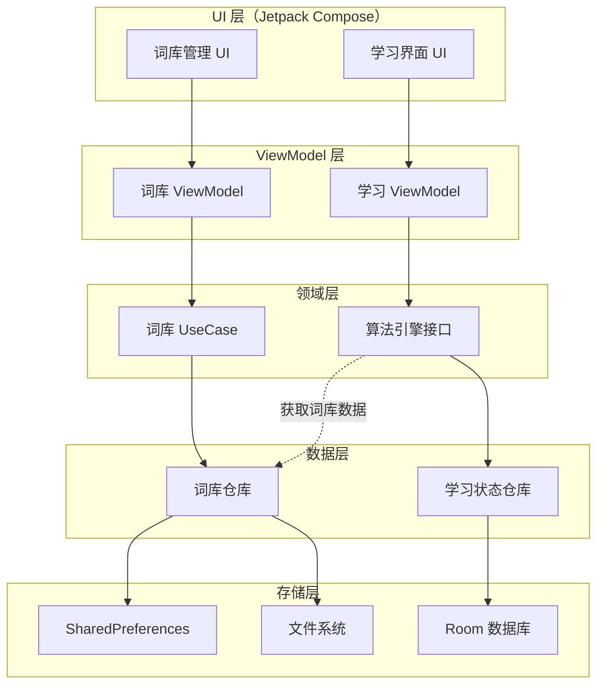
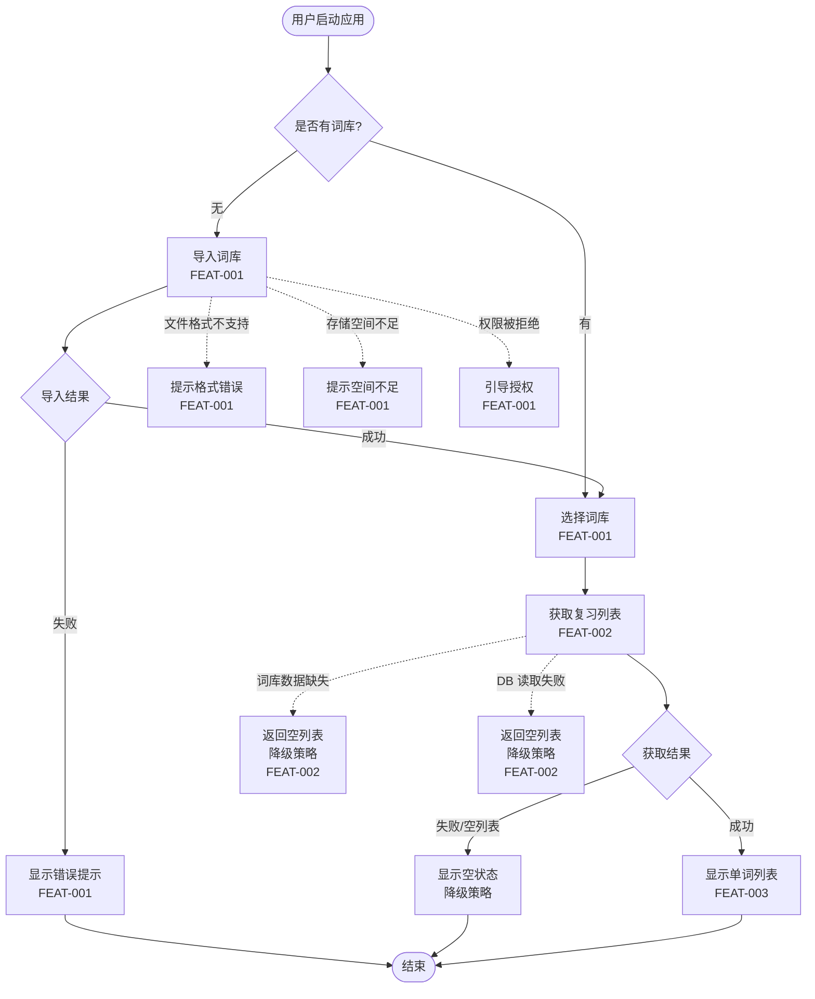
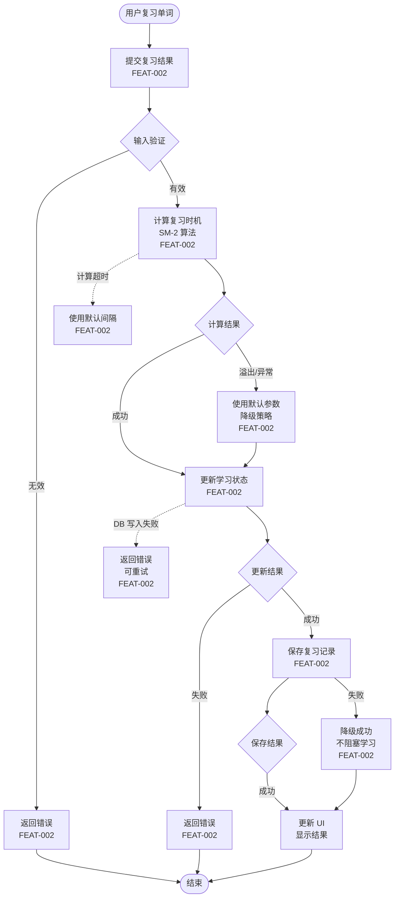

# EPIC Full Design：无痛记忆单词神器APP

**EPIC ID**：EPIC-001
**EPIC Version**：v0.1.0
**EPIC Full Design Version**：v0.1.0
**日期**：2026-01-21

**输入工件**：
- `specs/epics/EPIC-001-word-memory-app/epic.md`（EPIC 总览）
- `specs/epics/EPIC-001-word-memory-app/features/FEAT-001-word-library-management/spec.md` / `plan.md` / `tasks.md` / `full-design.md`
- `specs/epics/EPIC-001-word-memory-app/features/FEAT-002-spaced-repetition-algorithm/spec.md` / `plan.md` / `tasks.md` / `full-design.md`

> Agent 规则（强制）：
> - 本文档只做**跨 Feature 的整合与一致性呈现**，不得新增新的技术决策。
> - 若发现冲突或缺口，只能标注 `TODO(Clarify)` 并指向应修改的 Feature/Plan。

## 变更记录（增量变更）

| 版本 | 日期 | 变更摘要 | 影响 Feature | 是否需要回滚设计 |
|---|---|---|---|---|
| v0.1.0 | 2026-01-21 | 初始版本：整合 FEAT-001 和 FEAT-002 的 Plan/Story/Task，生成 EPIC 级技术指导文档 | 无 | 否 |

## 1. EPIC 总览（来自 epic.md）

- **背景/目标/价值**：
  - **背景**：传统单词记忆方法效率低下，缺乏科学记忆方法指导，用户需要一款能够科学安排复习节奏的单词记忆工具
  - **用户目标**：通过科学的间隔重复算法和游戏化设计，让用户在无痛状态下高效记忆单词
  - **业务目标**：打造具备差异化竞争力的单词学习产品，提升用户学习效果和留存率
  - **技术价值**：积累间隔重复算法经验和用户学习行为数据，为后续产品迭代提供基础

- **范围 In/Out**：
  - **In Scope**：单词库管理、间隔重复算法引擎、学习界面与交互、游戏化元素、学习进度跟踪、多媒体支持、用户账户与数据、学习提醒
  - **Out of Scope**：云端数据同步（第一阶段仅本地存储）、社交功能、付费内容、多语言学习、单词学习游戏、离线词典查询

- **约束与假设**：
  - **平台约束**：Android 8.0+（API Level 26）
  - **性能约束**：应用启动时间不超过 2 秒，页面切换流畅无卡顿
  - **存储约束**：本地数据存储不超过 100MB（不含词库资源包）
  - **合规约束**：符合 Android 数据隐私政策，用户学习数据不上传云端
  - **技术约束**：基于现有 Android 项目结构，使用 Jetpack Compose UI 框架

- **整体 FR/NFR（EPIC Level）**：
  - **EPIC-FR-001**：用户能够通过科学的间隔重复算法高效记忆单词，系统能够智能安排复习时机
  - **EPIC-FR-002**：用户能够通过直观的学习界面流畅地进行单词学习和复习操作
  - **EPIC-FR-003**：用户能够查看详细的学习进度和统计数据，了解自己的学习效果
  - **EPIC-NFR-PERF-001**：应用启动时间不超过 2 秒，页面切换流畅无卡顿，单词卡片加载时间不超过 500 毫秒
  - **EPIC-NFR-POWER-001**：正常学习场景下（10 分钟学习），设备电池消耗不超过 2%
  - **EPIC-NFR-MEM-001**：应用内存占用峰值不超过 150MB（不含系统开销），本地数据存储不超过 100MB（不含词库资源）
  - **EPIC-NFR-SEC-001**：用户学习数据仅存储在本地设备，不上传云端；符合 Android 数据隐私政策要求
  - **EPIC-NFR-OBS-001**：应用崩溃率低于 0.1%，关键操作失败率低于 1%；支持基本的使用日志记录（用于问题排查）

- **通用能力（Capability）**：
  - **多媒体资源管理**：Infrastructure 类型，作用范围：多媒体支持、学习界面与交互；交付物：资源加载SDK、缓存策略；关键约束：内存占用不超过50MB、资源加载时间不超过1秒

## 2. 0 层架构设计（EPIC 级：对外系统边界、部署、通信、交互）

> 定义：0 层架构设计反映"本系统与外部系统之间的关系"。在 EPIC 级别，本节用于跨 Feature 汇总对外边界、部署拓扑、通信与交互方式，并显式暴露差异与冲突。

### 2.1 外部系统与依赖汇总（跨 Feature）

| 外部系统/依赖 | 类型 | 涉及 Feature | 通信方式（协议/鉴权） | SLA/限流/超时 | 故障模式 | 我方策略 | 差异/冲突点（如有） | 引用来源 |
|---|---|---|---|---|---|---|---|---|
| Android Storage Access Framework（SAF） | 设备能力 | FEAT-001 | 系统 API（Intent） | 系统级，无 SLA | 用户拒绝授权、文件 URI 失效 | 引导用户授权、提示重新选择文件 | 无 | FEAT-001 plan.md:A2.1 |
| Android 文件系统 | 设备能力 | FEAT-001 | 系统 API（ContentResolver/File） | 系统级，存储 I/O | 存储空间不足、文件损坏、权限被拒绝 | 检测空间、验证文件、提示用户 | 无 | FEAT-001 plan.md:A2.1 |
| Android SharedPreferences | 设备能力 | FEAT-001 | 系统 API | 本地存储，无网络 | 存储空间不足、数据损坏 | 数据校验、备份恢复机制 | 无 | FEAT-001 plan.md:A2.1 |
| 单词库管理（FEAT-001） | 内部 Feature | FEAT-002 | Kotlin 函数调用（Repository 接口） | 本地调用，无网络 | 词库数据缺失、数据格式错误 | 返回空列表，记录错误日志 | 无 | FEAT-002 plan.md:A2.1 |
| 用户账户与数据管理（FEAT-007） | 内部 Feature | FEAT-002 | Kotlin 函数调用（Repository 接口） | 本地数据库，无网络 | 数据库不可用、数据损坏 | 使用默认参数，容错处理，记录错误日志 | 无 | FEAT-002 plan.md:A2.1 |
| Android Room 数据库 | 设备能力 | FEAT-002 | 系统 API | 本地数据库，无网络 | 数据库操作失败、存储空间不足 | 捕获异常，使用默认参数，记录错误日志 | 无 | FEAT-002 plan.md:A2.1 |

### 2.2 0 层架构图（EPIC 级视图）

### 2.3 部署视图（EPIC 级视图）

### 2.4 通信与交互方式汇总（跨 Feature）

- **协议**：设备能力（Android 系统 API）、本地文件存储、本地函数调用（Kotlin）
- **鉴权**：无需鉴权（本地操作），Storage Access Framework 由系统管理文件访问权限
- **超时与重试**：
  - FEAT-001：文件解析超时 30 秒，失败后允许用户重新选择文件；文件 I/O 不重试（本地操作，失败即提示用户）
  - FEAT-002：算法计算超时保护（100ms），超时使用默认参数或上次成功结果；数据库操作失败可重试（最多 3 次）
- **幂等**：
  - FEAT-001：词库导入操作基于文件路径+文件大小+修改时间生成唯一标识，防止重复导入
  - FEAT-002：学习状态更新基于单词 ID + 时间戳去重，确保幂等
- **限流**：
  - FEAT-001：无外部限流（本地操作）；内部限流：并发导入队列化，一次只处理一个词库导入
  - FEAT-002：算法计算限制并发数（最多 10 个），批量计算分批处理
- **一致性与补偿**：
  - FEAT-001：强一致（本地存储），词库元数据和文件系统同步更新，失败时回滚
  - FEAT-002：强一致（Room 事务），学习状态更新使用事务确保一致性；复习记录写入失败可降级（不阻塞学习主流程）

## 3. 1 层架构设计一致性（跨 Feature：框架图、模块拆分、接口协议）

> 定义：1 层架构设计描述"系统内部的模块拆分与协作"。在 EPIC 级别，本节用于汇总各 Feature 的 1 层框架与关键模块设计，并显式标注不一致之处与对齐建议（不新增决策）。

### 3.0 EPIC 模块目录（EPIC Module Catalog）与映射关系（跨 Feature，核心）

> 目标：从 EPIC 视角定义"模块/能力"的全局目录，并把它与各 Feature 的模块拆分建立明确映射，支持端到端一致性评审。

#### 3.0.1 EPIC 模块目录（Catalog）

| EPIC 模块 | 职责边界（一句话） | 涉及 Feature | 提供的接口/契约（引用） | 依赖的接口/契约（引用） | NFR 责任（性能/功耗/内存/安全/可观测性/可靠性） | 差异/冲突点（如有） | 引用来源 |
|---|---|---|---|---|---|---|---|
| 词库管理模块 | 提供词库导入、列表展示、选择、搜索能力，管理词库元数据和文件存储 | FEAT-001 | 词库 Repository 接口（获取词库列表、当前选择） | Android SAF、文件系统 API | PERF（导入 ≤ 5s/10MB，列表加载 ≤ 500ms p95）、MEM（词库列表内存占用）、SEC（本地存储，符合隐私要求）、OBS（导入/选择事件）、REL（数据持久化） | 无 | epic.md + FEAT-001 plan.md:A3.2 |
| 间隔重复算法引擎模块 | 提供复习时机计算、学习状态管理、复习列表生成能力，封装 SM-2 算法实现 | FEAT-002 | SpacedRepetitionEngine 接口（getReviewList、submitReview、observeLearningState） | 词库管理模块（获取词库数据）、Room 数据库（学习状态存储） | PERF（计算 ≤ 10ms p95，列表生成 ≤ 200ms p95）、POWER（每日 ≤ 2mAh）、MEM（峰值 ≤ 30MB）、SEC（本地计算，不上传）、OBS（算法计算/状态更新事件）、REL（计算成功率 ≥ 99.9%，状态持久化 100%） | 无 | epic.md + FEAT-002 plan.md:A3.2 |

#### 3.0.2 EPIC 模块 ↔ Feature 模块映射（Module Mapping）

| EPIC 模块 | 来源 Feature | Feature 模块/组件（来自 FEAT plan.md:A3.2） | 关系类型（Owned-by/Consumed-by/Adapter/Shared） | 引用来源（A3.1/A3.4/B4） | 备注/差异 |
|---|---|---|---|---|---|
| 词库管理模块 | FEAT-001 | UI 层（Jetpack Compose） | Owned-by | FEAT-001 plan.md:A3.2 | 词库列表展示、导入界面 |
| 词库管理模块 | FEAT-001 | ViewModel 层 | Owned-by | FEAT-001 plan.md:A3.2 | 管理 UI 状态、处理用户事件 |
| 词库管理模块 | FEAT-001 | Domain 层（UseCase） | Owned-by | FEAT-001 plan.md:A3.2 | 业务逻辑封装、流程编排 |
| 词库管理模块 | FEAT-001 | Repository 层 | Owned-by | FEAT-001 plan.md:A3.2 | 数据访问抽象、多数据源协调 |
| 词库管理模块 | FEAT-001 | Parser 层 | Owned-by | FEAT-001 plan.md:A3.2 | 文件解析、格式转换 |
| 词库管理模块 | FEAT-001 | DataSource 层 | Owned-by | FEAT-001 plan.md:A3.2 | 底层数据访问、SharedPreferences/文件操作 |
| 间隔重复算法引擎模块 | FEAT-002 | 算法引擎接口层 | Owned-by | FEAT-002 plan.md:A3.2 | 提供统一接口，封装算法实现细节 |
| 间隔重复算法引擎模块 | FEAT-002 | SM-2 算法实现 | Owned-by | FEAT-002 plan.md:A3.2 | 实现 SM-2 算法，计算复习间隔和记忆强度 |
| 间隔重复算法引擎模块 | FEAT-002 | 记忆强度评估器 | Owned-by | FEAT-002 plan.md:A3.2 | 评估单词记忆强度，用于优先级排序 |
| 间隔重复算法引擎模块 | FEAT-002 | 复习调度器 | Owned-by | FEAT-002 plan.md:A3.2 | 生成待复习单词列表，按优先级排序 |
| 间隔重复算法引擎模块 | FEAT-002 | 学习状态管理器 | Owned-by | FEAT-002 plan.md:A3.2 | 管理单词学习状态，跟踪学习进度 |
| 间隔重复算法引擎模块 | FEAT-002 | 复习时机计算器 | Owned-by | FEAT-002 plan.md:A3.2 | 计算单词的下次复习时间 |
| 间隔重复算法引擎模块 | FEAT-002 | 学习状态仓库 | Owned-by | FEAT-002 plan.md:A3.2 | 提供学习状态数据的访问接口 |
| 间隔重复算法引擎模块 | FEAT-002 | 复习记录仓库 | Owned-by | FEAT-002 plan.md:A3.2 | 提供复习历史记录的访问接口 |
| 间隔重复算法引擎模块 | FEAT-002 | 词库管理模块（FEAT-001） | Consumed-by | FEAT-002 plan.md:A2.1 | 获取词库数据和单词列表 |

#### 3.0.3 EPIC 模块级 UML 总览（全局查看入口，只引用 Feature Plan）

| EPIC 模块 | 类图入口（引用） | 时序-成功入口（引用） | 时序-异常入口（引用） | 关键异常（摘要） | 涉及 Feature |
|---|---|---|---|---|---|
| 词库管理模块 | FEAT-001 plan.md:A3.4（若存在） | FEAT-001 plan.md:A3.3.1（若存在） | FEAT-001 plan.md:A3.3.1（若存在） | 文件格式不支持、解析失败、存储空间不足、权限被拒绝 | FEAT-001 |
| 间隔重复算法引擎模块 | FEAT-002 plan.md:A3.2.1 | FEAT-002 plan.md:A3.3.1:SEQ-001/SEQ-003 | FEAT-002 plan.md:A3.3.1:SEQ-002/SEQ-004 | 参数无效、计算溢出、DB 失败、数据损坏 | FEAT-002 |

#### 3.0.4 EPIC 模块级 UML（EPIC 视角一致性视图，建议）

> 目标：从 EPIC 角度给出"模块/能力"的整体静态/动态视图，便于端到端一致性评审。

##### EPIC 模块级类图（静态视图）

##### EPIC 端到端时序图 - 成功链路（动态视图）

##### EPIC 端到端时序图 - 异常链路（动态视图）

### 3.1 1 层框架图（EPIC 级一致性视图）

### 3.2 模块与接口协议一致性问题（汇总）

| 模块/能力 | 涉及 Feature | 接口/协议/契约（引用） | 版本/兼容策略 | 不一致点 | 风险 | 处理建议（指向应修改的 Feature/Plan） |
|---|---|---|---|---|---|---|
| 词库数据访问 | FEAT-001, FEAT-002 | FEAT-001 plan.md:B4.1（若存在） / FEAT-002 plan.md:B4.2 | 向后兼容，新增字段使用默认值 | TODO(Clarify): FEAT-001 的 Repository 接口尚未在 plan.md:B4.1 明确定义 | 中 | 建议在 FEAT-001 plan.md:B4.1 补充词库 Repository 对外接口契约 |

### 3.3 关键模块设计汇总（跨 Feature）

| 关键模块 | 涉及 Feature | 设计要点（引用来源） | 策略/取舍（引用来源） | NFR 责任（性能/功耗/内存/安全/可观测性） | 风险 |
|---|---|---|---|---|---|
| 词库管理模块 | FEAT-001 | 使用 SharedPreferences + 文件系统存储；Storage Access Framework 文件访问；异步解析 + 流式处理大文件 | FEAT-001 plan.md:A1 | PERF（导入 ≤ 5s/10MB）、MEM（列表内存占用）、SEC（本地存储，符合隐私）、OBS（导入/选择事件）、REL（数据持久化） | 文件解析失败、存储空间不足 |
| 间隔重复算法引擎模块 | FEAT-002 | SM-2 算法实现；Room 数据库存储学习状态；协程异步计算；统一接口封装 | FEAT-002 plan.md:A1 | PERF（计算 ≤ 10ms p95）、POWER（每日 ≤ 2mAh）、MEM（峰值 ≤ 30MB）、SEC（本地计算）、OBS（算法计算/状态更新事件）、REL（计算成功率 ≥ 99.9%） | 算法计算异常、数据丢失风险 |

### 3.4 数据模型与存储/契约一致性（跨 Feature）（汇总）

#### 3.4.1 数据模型/存储一致性问题

| 数据实体/表/存储键 | 涉及 Feature | 物理结构与约束（引用） | 版本/迁移策略（引用） | 不一致点 | 风险 | 处理建议（指向应修改的 Feature/Plan） |
|---|---|---|---|---|---|---|
| 词库元数据 | FEAT-001 | SharedPreferences（键值对存储） | 数据结构向后兼容，新增字段使用默认值 | 无 | 低 | - |
| 词库文件 | FEAT-001 | 应用私有目录（文件系统） | 文件格式版本化（JSON schema 版本字段） | 无 | 低 | - |
| 学习状态 | FEAT-002 | Room 数据库（LearningStateEntity 表） | Room Migration，Schema 版本化 | 无 | 低 | - |
| 复习记录 | FEAT-002 | Room 数据库（ReviewRecordEntity 表） | Room Migration，Schema 版本化 | 无 | 低 | - |

#### 3.4.2 对外提供接口（Capability/跨模块接口）一致性问题

| 能力/接口 | 提供方 Feature | 调用方 Feature | 契约工件（plan.md B4.1 / contracts/ 引用） | 版本/兼容策略 | 不一致点 | 风险 |
|---|---|---|---|---|---|---|
| 词库 Repository 接口 | FEAT-001 | FEAT-002 | TODO(Clarify): FEAT-001 plan.md:B4.1 尚未定义 | 向后兼容 | 接口契约未明确 | 中 |
| SpacedRepetitionEngine 接口 | FEAT-002 | FEAT-003（未来） | FEAT-002 plan.md:B4.1（若存在） | 向后兼容 | 无 | 低 |

#### 3.4.3 外部依赖接口（依赖契约）一致性问题

| 依赖项 | 涉及 Feature | 调用级契约（plan.md B4.2 引用） | 超时/重试/限流策略 | 故障模式与降级策略 | 不一致点 | 风险 |
|---|---|---|---|---|---|---|
| Android SAF | FEAT-001 | FEAT-001 plan.md:A2.1 | 无超时（用户交互），不重试 | 用户拒绝授权、文件 URI 失效 → 引导用户授权、提示重新选择 | 无 | 低 |
| Room 数据库 | FEAT-002 | FEAT-002 plan.md:A2.1 | 无超时（本地操作），失败可重试（最多 3 次） | 数据库操作失败、存储空间不足 → 捕获异常，使用默认参数，记录错误日志 | 无 | 低 |

## 4. 关键流程设计（EPIC 级：端到端流程，每个流程一张流程图，含正常 + 全部异常）

> 定义：在 EPIC 级别，关键流程应覆盖跨 Feature 的端到端用户旅程/系统链路。

### 流程 1：用户导入词库并开始学习（跨 Feature 端到端）

### 流程 2：用户复习单词并更新学习状态（跨 Feature 端到端）

## 5. Feature → Story → Task 汇总追溯

### 5.1 Feature 列表与状态（来自 epic.md Feature Registry）

| Feature | 分支 | Feature Version | Plan Version | Tasks Version | 状态 |
|---|---|---|---|---|---|
| 单词库管理 (FEAT-001) | epic/EPIC-001-word-memory-app | v0.1.0 | v0.1.0 | v0.1.0 | Tasks Ready |
| 间隔重复学习算法引擎 (FEAT-002) | epic/EPIC-001-word-memory-app | v0.1.0 | v0.1.1 | v0.1.0 | Tasks Ready |

### 5.2 Story 汇总（跨 Feature）

| Feature | Story ID | 类型 | 目标 | 覆盖 FR/NFR | 依赖 | 关键风险 |
|---|---|---|---|---|---|---|
| FEAT-001 | ST-001 | Functional | 用户能够成功导入词库文件，导入耗时满足性能要求（10MB 文件 ≤ 5秒） | FR-001；NFR-PERF-001；NFR-SEC-001/002；NFR-OBS-001；NFR-REL-001 | 无 | 是（文件解析失败、存储空间不足） |
| FEAT-001 | ST-002 | Functional | 词库列表能够正确显示词库信息，列表加载时间不超过 500ms（p95） | FR-002；FR-006；NFR-PERF-001；NFR-MEM-001；NFR-OBS-001 | ST-001 | 否 |
| FEAT-001 | ST-003 | Functional | 用户能够选择词库，当前词库被正确标记，选择状态持久化保存 | FR-003；NFR-REL-002；NFR-OBS-001 | ST-002 | 否 |
| FEAT-001 | ST-004 | Functional | 搜索功能正常工作，搜索响应时间不超过 200ms（p95） | FR-004；NFR-PERF-001 | ST-002 | 否 |
| FEAT-001 | ST-005 | Infrastructure | 所有异常场景都有明确的错误提示和引导 | FR-005；NFR-OBS-002；NFR-REL-001 | ST-001 | 是（文件解析失败） |
| FEAT-001 | ST-006 | Infrastructure | 数据能够可靠持久化，应用重启后恢复，内存占用符合要求 | NFR-REL-002；NFR-MEM-001/002 | ST-001, ST-002, ST-003 | 是（数据丢失风险） |
| FEAT-002 | ST-001 | Functional | 算法能够正确计算复习时机，计算耗时满足性能要求（单个单词 ≤ 10ms p95） | FR-001；FR-002；NFR-PERF-001；NFR-OBS-001；NFR-REL-001 | 无 | 是（算法计算异常、算法参数配置错误） |
| FEAT-002 | ST-002 | Functional | 学习状态能够正确跟踪和更新，状态更新耗时满足性能要求（≤ 100ms p95） | FR-003；FR-006；NFR-PERF-001；NFR-MEM-001；NFR-OBS-001；NFR-REL-002 | ST-001 | 是（数据丢失风险） |
| FEAT-002 | ST-003 | Functional | 复习时机计算准确，计算耗时满足性能要求（≤ 10ms p95） | FR-001；NFR-PERF-001；NFR-OBS-001 | ST-001, ST-002 | 否 |
| FEAT-002 | ST-004 | Functional | 记忆强度评估准确，优先级排序正确 | FR-004；NFR-PERF-001 | ST-002 | 否 |
| FEAT-002 | ST-005 | Functional | 复习列表生成正确，列表生成耗时满足性能要求（≤ 200ms p95） | FR-005；NFR-PERF-001 | ST-002, ST-003, ST-004 | 否 |
| FEAT-002 | ST-006 | Infrastructure | 所有异常场景都有明确的错误处理和降级策略 | NFR-OBS-002；NFR-REL-001；NFR-PERF-002 | ST-001 | 是（算法计算异常） |
| FEAT-002 | ST-007 | Infrastructure | 数据能够可靠持久化，应用重启后恢复，内存占用符合要求（≤ 30MB） | NFR-REL-002；NFR-MEM-001/002 | ST-002 | 是（数据丢失风险） |

### 5.3 追溯矩阵（EPIC-FR/NFR → Feature-FR/NFR → Story → Task）

| EPIC FR/NFR | Feature | Feature FR/NFR | Story | Task | 验证方式 | 备注 |
|---|---|---|---|---|---|---|
| EPIC-FR-001 | FEAT-002 | FR-001, FR-002 | ST-001, ST-003 | T??? | 算法计算结果与标准 SM-2 算法一致，计算耗时 ≤ 10ms（p95） |  |
| EPIC-FR-002 | FEAT-001, FEAT-002 | FR-002（词库列表）, FR-005（复习列表） | FEAT-001:ST-002, FEAT-002:ST-005 | T??? | 列表加载时间 ≤ 500ms（p95），复习列表生成 ≤ 200ms（p95） |  |
| EPIC-FR-003 | FEAT-005（未来） | - | - | - | 待 FEAT-005 实现 |  |
| EPIC-NFR-PERF-001 | FEAT-001, FEAT-002 | NFR-PERF-001 | FEAT-001:ST-001/ST-002/ST-004, FEAT-002:ST-001/ST-002/ST-003/ST-004/ST-005 | T??? | 导入 ≤ 5s/10MB，列表加载 ≤ 500ms，搜索 ≤ 200ms，算法计算 ≤ 10ms，列表生成 ≤ 200ms |  |
| EPIC-NFR-POWER-001 | FEAT-002 | NFR-POWER-001 | ST-001, ST-002 | T??? | 每日电池消耗增量 ≤ 2mAh（Top5% 用户模型） |  |
| EPIC-NFR-MEM-001 | FEAT-001, FEAT-002 | NFR-MEM-001 | FEAT-001:ST-002/ST-006, FEAT-002:ST-002/ST-007 | T??? | 应用内存占用峰值 ≤ 150MB（不含系统开销），算法引擎 ≤ 30MB |  |
| EPIC-NFR-SEC-001 | FEAT-001, FEAT-002 | NFR-SEC-001 | FEAT-001:ST-001, FEAT-002:ST-002/ST-007 | T??? | 用户学习数据仅存储在本地设备，不上传云端 |  |
| EPIC-NFR-OBS-001 | FEAT-001, FEAT-002 | NFR-OBS-001/002 | FEAT-001:ST-001/ST-002/ST-003/ST-005, FEAT-002:ST-001/ST-002/ST-003/ST-006 | T??? | 应用崩溃率低于 0.1%，关键操作失败率低于 1% |  |

## 6. 跨 Feature 通用能力设计（来自 epic.md + 各 Feature plan）

| 能力 | 设计要点（引用来源） | 关键接口/契约（引用来源） | 风险 | 影响 Feature |
|---|---|---|---|---|
| 多媒体资源管理 | Infrastructure 类型，资源加载SDK、缓存策略 | 资源加载接口、缓存接口 | 内存占用不超过50MB、资源加载时间不超过1秒 | 多媒体支持、学习界面与交互 |

### 常见 Capability Feature 汇总（建议）

> 说明：当 EPIC 存在横切能力（埋点/动效/算法）时，建议将其作为 Capability Feature 独立交付，并在 EPIC Full Design 中汇总其"交付物与接入契约"，以便业务 Feature 对齐接入方式与验收口径。

#### 6.1 埋点与可观测性（产品埋点 + 技术埋点）

| Capability Feature | 事件/指标范围 | 字段口径/隐私策略 | 接入方式（SDK/API） | 版本/兼容策略 | 影响的业务 Feature | 引用来源 |
|---|---|---|---|---|---|---|
| TODO(Clarify) |  |  |  |  |  | epic.md（通用能力清单中未明确） |

#### 6.2 动效与交互组件库

| Capability Feature | 资产/组件范围 | 性能预算与验收 | 接入方式（组件/API） | 兼容策略 | 影响的业务 Feature | 引用来源 |
|---|---|---|---|---|---|---|
| TODO(Clarify) |  |  |  |  |  | epic.md（通用能力清单中未明确） |

#### 6.3 算法能力（每模型/每能力一个 Feature）

| Capability Feature | 模型/能力 | 推理部署（端侧/服务端） | SDK/API 契约 | 评估指标与监控 | 回退/降级策略 | 影响的业务 Feature | 引用来源 |
|---|---|---|---|---|---|---|---|
| FEAT-002 | SM-2（SuperMemo 2）算法 | 端侧本地计算，Kotlin 协程，IO 线程 | SpacedRepetitionEngine 接口（getReviewList、submitReview、observeLearningState） | 算法计算耗时、准确率（基于测试数据集）、复习时机计算成功率 | 算法计算失败时使用默认参数或上次成功结果，记录错误日志 | 学习界面与交互（FEAT-003）、学习进度与统计（FEAT-005） | epic.md + FEAT-002 plan.md:A3.4 |

## 7. 风险与一致性问题（汇总）

- **跨 Feature 冲突**：
  - TODO(Clarify): FEAT-001 的 Repository 接口尚未在 plan.md:B4.1 明确定义，FEAT-002 依赖该接口获取词库数据。建议在 FEAT-001 plan.md:B4.1 补充词库 Repository 对外接口契约。

- **接口/数据模型不一致**：
  - 无发现的不一致（两个 Feature 的数据模型和接口设计相互独立，通过明确的依赖关系连接）

- **NFR 预算冲突（性能/功耗/内存）**：
  - 无发现冲突（各 Feature 的 NFR 预算在 EPIC 级约束范围内，且相互独立）

## 8. 执行指引（不新增 Task）

- 每个 Feature 按各自 `tasks.md` 执行
- 任何跨 Feature 变更必须先更新对应 Feature 的 plan/spec，并运行 `/speckit.epicsync` 更新总览
- 建议优先处理一致性缺口：FEAT-001 的 Repository 接口契约定义（plan.md:B4.1）
