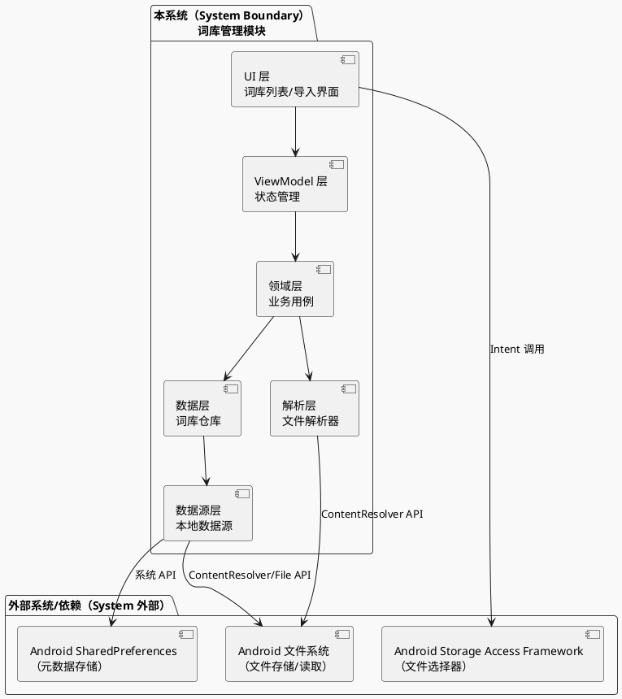
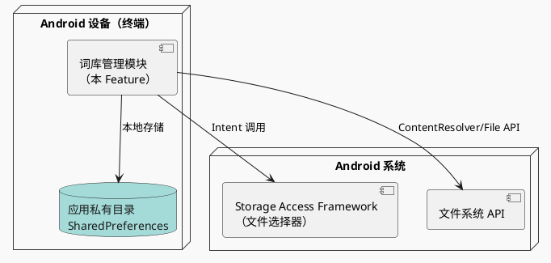
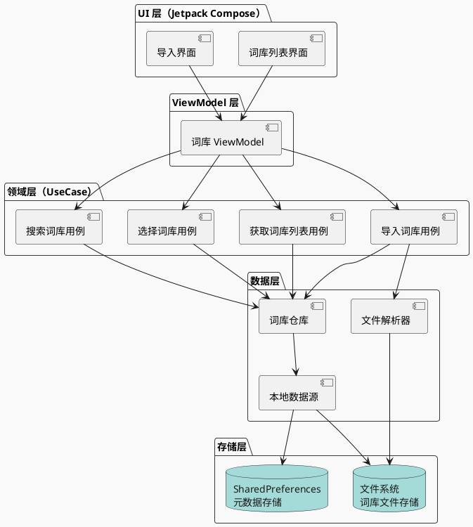
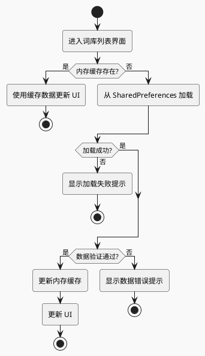
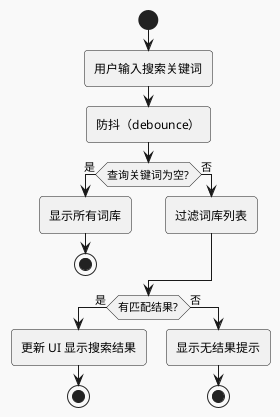

# Full Design：单词库管理

**Epic**：EPIC-001 - 无痛记忆单词神器APP
**Feature ID**：FEAT-001
**Feature Version**：v0.1.0
**Plan Version**：v0.1.0
**Tasks Version**：v0.1.0
**Full Design Version**：v0.1.1

**分支**：`epic/EPIC-001-word-memory-app`
**日期**：2026-01-18
**输入工件**：
- `spec.md`
- `plan.md`
- `tasks.md`
- `research.md` / `data-model.md` / `contracts/` / `quickstart.md`（不存在）

> Agent 规则（强制）：
> - 本文档**只能整合现有产物**（spec/plan/tasks 等），**不得新增技术决策**。
> - 若遇到决策缺口，只能标注为 `TODO(Clarify): ...` 并指向应补齐的来源文档/章节。
> - 本文档用于评审与执行：层次必须清晰、结构化、可追溯。

## 变更记录（增量变更）

| 版本 | 日期 | 变更范围（Feature/Story/Task） | 变更摘要 | 影响模块 | 是否需要回滚设计 |
|---|---|---|---|---|---|
| v0.1.0 | 2026-01-18 | Feature | 初始版本：整合 spec.md、plan.md、tasks.md 生成 Full Design 文档 |  | 否 |
| v0.1.1 | 2026-01-18 | Feature | 更新 0 层架构图和流程 1 流程图，补充完整的设计内容 | 2.2、4.1 | 否 |

## 1. 背景与范围（来自 spec.md）

- **背景**：
  - 用户需要导入和管理单词词库作为学习内容的基础数据源
  - 现有应用缺乏灵活的词库管理能力，用户难以选择和管理多个词库
  - 词库管理是学习功能的基础支撑，需要独立交付以确保学习功能有稳定的数据来源

- **目标**：
  - **用户目标**：用户能够轻松导入、查看、选择和管理多个单词词库
  - **业务目标**：建立词库管理能力，为后续学习功能提供稳定的数据基础
  - **平台目标**：建立可扩展的词库管理框架，支持未来扩展更多词库格式和来源

- **价值**：
  - **用户价值**：用户可以灵活选择学习内容，管理个人词库集合，提升学习个性化
  - **业务价值**：为产品提供词库管理能力，支撑核心学习功能
  - **技术价值**：建立词库数据模型和管理框架，为后续功能提供数据基础

- **In Scope**：
  - 词库文件导入（支持常见格式如 JSON、CSV、TXT 等）
  - 词库列表展示（显示已导入的词库列表）
  - 词库选择/切换（用户可以选择要使用的词库）
  - 词库搜索（在词库列表中搜索词库）
  - 词库基本信息查看（显示词库名称、单词数量、创建时间等）

- **Out of Scope**：
  - 词库编辑（仅支持导入，不支持编辑词库内容）
  - 词库在线同步（第一阶段仅支持本地导入）
  - 自定义词库创建（不支持用户手动创建词库）
  - 词库内容预览（不支持查看词库内单词详情）

- **依赖关系**：
  - **上游依赖**：
    - **词库资源**：需要获取或准备单词词库文件（包含单词、音标、释义等基础信息）
    - **Android 平台**：文件系统访问权限、文件选择器 API
    - **用户账户与数据管理（FEAT-007）**：词库元数据存储和查询（可选，第一阶段可先使用简单存储）
  - **下游影响**：
    - **间隔重复学习算法引擎（FEAT-002）**：依赖词库数据作为学习内容来源
    - **多媒体支持（FEAT-006）**：依赖词库中的多媒体资源（音频、图片、例句）
    - **学习界面与交互（FEAT-003）**：依赖当前选中的词库进行学习

## 2. 0 层架构设计（对外系统边界、部署、通信、交互）（来自 plan.md）

> 定义：0 层架构设计反映"本系统与外部系统之间的关系"。必须覆盖：结构、部署、通信方式、交互方式与边界。
>
> 规则：本节只允许**复用/整合** `plan.md` 中已经明确的内容；不得新增技术决策。若 plan 缺失，用 `TODO(Clarify)` 指回 plan 对应章节补齐。

### 2.1 外部系统与依赖清单（来自 plan.md）

| 外部系统/依赖 | 类型 | 关键能力/数据 | 通信方式（协议/鉴权） | SLA/限流/超时 | 故障模式 | 我方策略 | 引用来源 |
|---|---|---|---|---|---|---|---|
| Android Storage Access Framework（SAF） | 设备能力 | 文件选择器、文件访问 URI | 系统 API（Intent） | 系统级，无 SLA | 用户拒绝授权、文件 URI 失效 | 引导用户授权、提示重新选择文件 | plan.md:A2.1 |
| Android 文件系统 | 设备能力 | 词库文件存储、文件读取 | 系统 API（ContentResolver/File） | 系统级，存储 I/O | 存储空间不足、文件损坏、权限被拒绝 | 检测空间、验证文件、提示用户 | plan.md:A2.1 |
| Android SharedPreferences | 设备能力 | 词库元数据存储（列表、当前选择） | 系统 API | 本地存储，无网络 | 存储空间不足、数据损坏 | 数据校验、备份恢复机制 | plan.md:A2.1 |

### 2.2 0 层架构图（系统边界 + 外部交互）（来自 plan.md）

### 2.3 部署视图（来自 plan.md）

### 2.4 通信与交互说明（来自 plan.md）

- **协议**：设备能力（Android 系统 API）、本地文件存储
- **鉴权**：无需鉴权（本地操作），Storage Access Framework 由系统管理文件访问权限
- **超时与重试**：文件解析超时 30 秒，失败后允许用户重新选择文件；文件 I/O 不重试（本地操作，失败即提示用户）
- **幂等**：词库导入操作：基于文件路径+文件大小+修改时间生成唯一标识，防止重复导入同一文件
- **限流**：无外部限流（本地操作）；内部限流：并发导入队列化，一次只处理一个词库导入
- **数据一致性**：强一致（本地存储），词库元数据（SharedPreferences）和文件系统同步更新，失败时回滚

## 3. 1 层架构设计（系统内部框架图 + 模块拆分 + 接口协议）（来自 plan.md）

> 定义：1 层架构设计描述"系统内部的模块拆分与协作"，包括框架图、模块职责、模块交互、通信方式、接口协议等。

### 3.1 1 层框架图（来自 plan.md）

### 3.2 模块拆分与职责（来自 plan.md）

| 模块 | 职责 | 输入/输出 | 依赖 | 约束 |
|---|---|---|---|---|
| UI 层（Jetpack Compose） | 词库列表展示、导入界面、用户交互 | 输入：用户操作事件 输出：UI 状态展示 | LibraryViewModel | 仅负责 UI 展示，不包含业务逻辑 |
| ViewModel 层 | 管理 UI 状态、处理用户事件、调用 UseCase | 输入：用户事件、UseCase 结果 输出：UI 状态（State） | Domain 层（UseCase） | 不直接访问数据层 |
| Domain 层（UseCase） | 业务逻辑封装、流程编排、数据转换 | 输入：业务请求 输出：业务结果 | Data 层（Repository） | 不依赖 UI 层，可测试性 |
| Repository 层 | 数据访问抽象、多数据源协调 | 输入：数据请求 输出：数据实体 | DataSource | 统一数据访问接口 |
| Parser 层 | 文件解析、格式转换、数据校验 | 输入：文件 URI/流 输出：词库实体 | FileStorage | 支持 JSON/CSV/TXT，流式处理 |
| DataSource 层 | 底层数据访问、SharedPreferences/文件操作 | 输入：数据操作 输出：原始数据 | Storage（SharedPrefs/FileStorage） | 仅负责数据读写 |

### 3.3 模块协作与通信方式（来自 plan.md）

- **调用关系**：
  - UI → ViewModel → UseCase → Repository → DataSource → Storage
  - UI → ViewModel（用户事件、状态观察）
  - ViewModel → UseCase（业务调用，suspend 函数）
  - UseCase → Repository（数据请求）
  - Repository → DataSource（数据访问）
  - Parser → FileStorage（文件读取）

- **通信方式**：
  - 函数调用：Kotlin 函数调用，使用协程处理异步操作
  - 状态管理：ViewModel 使用 StateFlow/Flow 暴露状态，UI 使用 collectAsState 观察
  - 错误处理：使用 Result/Sealed Class 封装成功/失败状态

- **接口协议**：
  - 数据结构：使用 Kotlin data class 定义实体（WordLibrary, LibraryMetadata）
  - 错误码：使用 Sealed Class 定义错误类型（ImportError, ParseError）
  - 版本策略：数据结构向后兼容，新增字段使用默认值
  - 幂等约束：导入操作基于文件指纹（路径+大小+修改时间）去重

- **并发与线程模型**：
  - 主线程：UI 操作、状态更新
  - IO 线程：文件 I/O、SharedPreferences 读写（Dispatchers.IO）
  - 协程：UseCase 和 Repository 使用 suspend 函数，由 ViewModel 在 ViewModelScope 中调用
  - 共享状态保护：ViewModel 使用线程安全的状态容器（StateFlow），避免并发修改

### 3.4 关键模块设计（详细设计 + 取舍）（来自 plan.md）

> 说明：本节用于整合 plan 中"关键模块/高风险模块/承载 NFR 的模块"的详细设计与取舍。
> 若 plan 未提供详细设计，标注 `TODO(Clarify)` 并指回 plan 补齐。

#### 模块：LibraryRepository（词库仓库层）

- **模块定位**：统一词库数据的访问接口，封装底层存储细节，提供数据访问抽象，位于 Data 层，为 UseCase 提供数据访问服务
- **设计目标**：数据一致性、性能优化（缓存）、可测试性、可扩展性（未来支持云端同步）
- **核心数据结构/状态**：
  - 实体：`WordLibrary`（词库实体）、`LibraryMetadata`（元数据）
  - 状态：词库列表（List<WordLibrary>）、当前选择词库 ID（String?）
  - 缓存：内存缓存词库列表，减少重复读取 SharedPreferences
- **对外接口（协议）**：
  - `suspend fun importLibrary(uri: Uri): Result<WordLibrary>`：导入词库
  - `suspend fun getLibraries(): Flow<List<WordLibrary>>`：获取词库列表（Flow 支持实时更新）
  - `suspend fun selectLibrary(libraryId: String): Result<Unit>`：选择词库
  - `suspend fun searchLibraries(query: String): List<WordLibrary>`：搜索词库
  - 错误码：`LibraryError`（Sealed Class：ImportError, NotFoundError, StorageError）
- **策略与算法**：
  - 缓存策略：首次加载后内存缓存，SharedPreferences 变更时更新缓存
  - 去重策略：导入时基于文件指纹（路径+大小+修改时间）检测重复
  - 批量操作：列表更新批量写入 SharedPreferences
- **失败与降级**：
  - SharedPreferences 写入失败：抛出异常，UseCase 层处理
  - 文件读取失败：返回错误 Result，由调用方处理
  - 数据损坏：数据校验，返回错误并记录日志
- **安全与隐私**：
  - 词库文件存储在应用私有目录，不共享
  - 不记录敏感信息（文件路径可记录，但不包含文件内容）
- **可观测性**：
  - 记录导入、选择、搜索操作日志
  - 记录错误操作（导入失败、读取失败）
- **优缺点与替代方案**：
  - **优点**：数据访问统一、易于测试和扩展、支持实时更新（Flow）
  - **缺点/代价**：内存缓存占用少量内存（约 10-20MB）
  - **替代方案与否决理由**：不使用 Room 数据库（数据简单，SharedPreferences 足够）；不使用 DataStore（API 较新，SharedPreferences 成熟稳定）

#### 模块：LibraryParser（文件解析器）

- **模块定位**：负责词库文件的解析，支持多种格式（JSON/CSV/TXT），流式处理大文件，位于 Data 层
- **设计目标**：性能（快速解析）、内存效率（流式处理）、可扩展性（支持新格式）、错误处理
- **核心数据结构/状态**：
  - 输入：文件 URI（Content URI）或文件流
  - 输出：`WordLibrary` 实体（包含单词列表）
  - 解析状态：进度百分比（0-100%）
- **对外接口（协议）**：
  - `suspend fun parseLibrary(uri: Uri, onProgress: (Int) -> Unit): Result<WordLibrary>`：解析词库文件，支持进度回调
  - 错误码：`ParseError`（Sealed Class：FormatError, EncodingError, SizeError, IOError）
- **策略与算法**：
  - JSON 解析：使用 Gson/JsonReader 流式解析，避免一次性加载整个文件
  - CSV 解析：逐行读取，分批处理（每批 1000 行）
  - TXT 解析：逐行读取，每行一个单词
  - 进度计算：基于已读取字节数 / 文件总大小
- **失败与降级**：
  - 格式不支持：返回 FormatError，提示支持的格式
  - 编码错误：尝试自动检测编码（UTF-8/GBK），失败返回 EncodingError
  - 文件过大（>50MB）：警告用户，继续解析（流式处理）
  - 解析超时（>30秒）：取消任务，返回超时错误
- **安全与隐私**：
  - 不解析文件内容到日志
  - 解析完成后立即释放文件句柄
- **可观测性**：
  - 记录解析耗时、文件大小、格式类型
  - 记录解析失败原因
- **优缺点与替代方案**：
  - **优点**：流式处理支持大文件、异步解析不阻塞主线程、支持进度反馈
  - **缺点/代价**：实现复杂度较高（需要处理多种格式和错误场景）
  - **替代方案与否决理由**：不使用同步解析（会阻塞主线程）；不使用一次性加载（内存溢出风险）

## 4. 关键流程设计（每个流程一张流程图，含正常 + 全部异常）（来自 plan.md）

> 定义：每个关键流程必须用 `flowchart` 绘制，且同一张图内覆盖正常流程与全部关键异常分支（失败/超时/并发/生命周期等）。
> 若 plan 仍为拆分的"正常/异常"两张图，需在 plan 侧对齐后再整合到本节（否则标注 `TODO(Clarify)` 指回 plan）。

### 流程 1：词库文件导入流程

```plantuml
@startuml
!theme mars

start
:用户点击导入按钮;

while (导入队列是否空闲?) is (否)
  :加入队列等待;
endwhile (是)

:打开 Storage Access Framework\n文件选择器;

if (用户选择文件?) then (取消)
  :取消导入;
  stop
else (选择文件)
  :获取文件 URI;
endif

if (检查文件访问权限?) then (权限被拒绝)
  :显示权限错误提示\n引导用户到设置授权;
  stop
else (权限正常)
endif

if (检查存储空间 >= 50MB?) then (不足)
  :显示存储空间不足提示\n引导用户清理空间;
  stop
else (充足)
endif

if (检查文件格式 JSON/CSV/TXT?) then (不支持)
  :显示格式错误提示\n说明支持的格式;
  stop
else (支持)
endif

if (检查文件大小 <= 50MB?) then (过大)
  :警告提示文件过大\n询问是否继续;
  if (用户确认继续?) then (否)
    :取消导入;
    stop
  else (是)
  endif
else (正常)
endif

if (检查是否重复导入\n文件指纹匹配?) then (已存在)
  :提示词库已存在\n询问是否覆盖;
  if (用户确认覆盖?) then (否)
    :取消导入;
    stop
  else (是)
  endif
else (新文件)
endif

:开始解析文件\n显示进度;
if (解析结果?) then (失败)
  :显示解析错误提示\n说明失败原因\n记录错误日志;
  stop
elseif (超时)
  :显示超时错误提示\n允许重新选择文件;
  stop
else (成功)
endif

:保存词库文件到\n应用私有目录;
if (保存结果?) then (失败)
  :显示保存错误提示\n回滚操作\n记录错误日志;
  stop
else (成功)
endif

:保存词库元数据到\nSharedPreferences;
if (元数据保存结果?) then (失败)
  :显示保存错误提示\n回滚文件保存\n记录错误日志;
  stop
else (成功)
endif

:更新内存缓存;
:更新 UI\n显示导入成功;
:记录导入成功事件\n词库名称/大小/格式/耗时;
stop

@enduml
```

### 流程 2：词库列表加载流程

### 流程 3：词库搜索流程

## 5. Feature → Story → Task 追溯关系

> 规则：
> - Feature 层：FR/NFR（来自 spec.md）
> - Story 层：ST-xxx（来自 plan.md 的 Story Breakdown）
> - Task 层：Txxx（来自 tasks.md；若缺失则先留空并标注"待生成"）

### 5.1 Story 列表（来自 plan.md）

| Story ID | 类型 | 目标 | 覆盖 FR/NFR | 依赖 | 关键风险 |
|---|---|---|---|---|---|
| ST-001 | Functional | 用户能够成功导入词库文件，词库出现在列表中，导入耗时满足性能要求（10MB 文件 ≤ 5秒） | FR-001；NFR-PERF-001（导入耗时）；NFR-SEC-001/002（存储和权限）；NFR-OBS-001（导入事件记录）；NFR-REL-001（导入成功率） | 无 | RISK-001：文件解析失败；RISK-002：存储空间不足 |
| ST-002 | Functional | 词库列表能够正确显示词库信息，列表加载时间不超过 500ms（p95），空状态提示清晰 | FR-002；FR-006（空状态）；NFR-PERF-001（列表加载时间）；NFR-MEM-001（列表内存占用）；NFR-OBS-001（加载事件） | ST-001 | 无 |
| ST-003 | Functional | 用户能够选择词库，当前词库被正确标记，选择状态持久化保存 | FR-003；NFR-REL-002（状态持久化）；NFR-OBS-001（选择事件记录） | ST-002 | 无 |
| ST-004 | Functional | 搜索功能正常工作，搜索响应时间不超过 200ms（p95），搜索结果实时更新 | FR-004；NFR-PERF-001（搜索响应时间） | ST-002 | 无 |
| ST-005 | Infrastructure | 所有异常场景都有明确的错误提示和引导，用户能够理解错误原因并采取行动 | FR-005；NFR-OBS-002（错误日志记录）；NFR-REL-001（错误处理） | ST-001 | RISK-001：文件解析失败 |
| ST-006 | Infrastructure | 数据能够可靠持久化，应用重启后恢复，内存占用符合要求 | NFR-REL-002（数据持久化）；NFR-MEM-001/002（内存生命周期） | ST-001、ST-002、ST-003 | RISK-003：数据丢失风险 |

### 5.2 追溯矩阵（FR/NFR → Story → Task）

| FR/NFR ID | Story ID | Task ID | 验证方式（来自 tasks.md） | 备注 |
|---|---|---|---|---|
| FR-001 | ST-001 | T100-T105 | 能够导入 JSON/CSV/TXT 格式文件，导入成功率达到 99%，导入耗时符合要求 | 词库文件导入 |
| FR-002 | ST-002 | T200-T205 | 列表正确显示词库信息，加载时间符合要求，内存占用符合要求 | 词库列表展示 |
| FR-003 | ST-003 | T300-T303 | 能够选择词库，当前词库被标记，选择状态持久化 | 词库选择功能 |
| FR-004 | ST-004 | T400-T402 | 搜索功能正常，响应时间符合要求，搜索结果正确 | 词库搜索功能 |
| FR-005 | ST-005 | T500-T503 | 所有异常场景都有明确的错误提示，错误日志正确记录 | 错误处理 |
| FR-006 | ST-002 | T203 | 空状态提示清晰 | 空状态处理（包含在列表展示中） |
| NFR-PERF-001 | ST-001、ST-002、ST-004 | T100、T204、T402 | 列表加载时间 ≤ 500ms（p95），搜索响应时间 ≤ 200ms（p95），文件导入（10MB）≤ 5 秒 | 性能要求（导入、加载、搜索） |
| NFR-MEM-001/002 | ST-002、ST-006 | T201、T602 | 内存占用 ≤ 20MB，应用退出时清理内存 | 内存占用和生命周期 |
| NFR-SEC-001/002 | ST-001 | T100 | 词库文件存储在应用私有目录，使用 Storage Access Framework | 安全隐私要求 |
| NFR-OBS-001/002 | ST-001、ST-002、ST-003、ST-005 | T105、T205、T303、T502 | 记录导入/选择/搜索事件，记录错误日志 | 可观测性要求 |
| NFR-REL-001/002 | ST-001、ST-005、ST-006 | T101、T502、T600 | 导入成功率 ≥ 99%，数据持久化正常，应用重启后恢复 | 可靠性要求 |

## 6. 技术风险与消解策略（来自 plan.md）

| 风险ID | 风险描述 | 触发条件 | 影响范围 | 严重度 | 消解策略 | 对应 Story/Task |
|---|---|---|---|---|---|---|
| RISK-001 | 文件解析失败导致导入功能不可用 | 词库文件格式不规范、编码错误、文件损坏、解析器实现错误 | 用户无法导入词库，核心功能不可用 | High | 1. 严格的格式验证和错误处理 2. 支持多种编码自动检测 3. 提供清晰的错误提示和格式说明 4. 记录详细错误日志用于排查 5. 解析前文件校验（大小、完整性） | ST-001, ST-005 |
| RISK-002 | 存储空间不足导致导入失败 | 设备存储空间不足（<50MB）、应用私有目录配额限制 | 用户无法导入词库，数据丢失风险 | High | 1. 导入前检测可用存储空间 2. 提示用户清理空间或选择较小文件 3. 提供存储空间使用情况显示 4. 支持删除不需要的词库释放空间 | ST-001, ST-005 |
| RISK-003 | 数据持久化失败导致数据丢失 | SharedPreferences 写入失败、文件系统异常、应用崩溃时数据未保存 | 用户词库列表和选择状态丢失，需重新导入 | High | 1. 同步写入 SharedPreferences（apply + commit 组合） 2. 文件复制后更新元数据，失败时回滚 3. 关键操作前检查存储可用性 4. 应用生命周期监听，退出前保存数据 5. 定期备份机制（可选） | ST-006 |
| RISK-004 | 大文件解析导致内存溢出 | 词库文件过大（>50MB）、同步解析大文件、内存管理不当 | 应用崩溃、用户体验下降 | Med | 1. 使用流式解析，分批处理文件内容 2. 异步解析，避免阻塞主线程 3. 文件大小限制检查（>50MB 警告） 4. 解析过程中监控内存使用 5. 失败时立即释放资源 | ST-001 |
| RISK-005 | 文件 URI 失效导致无法访问词库文件 | Storage Access Framework URI 权限过期、文件被删除或移动 | 已导入的词库无法读取，需要重新导入 | Med | 1. 使用 Content URI 持久化权限（takePersistableUriPermission） 2. 定期验证文件 URI 有效性 3. 失效时提示用户重新选择文件 4. 保留文件元数据（名称、大小）用于校验 | ST-001, ST-006 |
| RISK-006 | 性能不达标导致用户体验差 | 列表加载慢、搜索响应慢、文件导入耗时过长 | 用户等待时间长，功能不可用 | Low | 1. 异步加载和缓存机制 2. 搜索使用防抖（debounce）优化 3. 文件解析优化（批量处理、并行解析） 4. 性能监控和告警 5. 降级策略（简化列表、延迟加载） | ST-001, ST-002, ST-004 |

## 7. 异常 & 边界场景梳理（来自 spec.md + plan.md）

- **数据边界**：
  - **空数据**：词库列表为空 → 显示空状态提示，引导用户导入
  - **超大文件**：词库文件 >50MB → 警告提示，询问是否继续，使用流式解析
  - **非法格式**：文件格式不支持（非 JSON/CSV/TXT） → 错误提示，说明支持的格式
  - **格式不规范**：JSON 缺少必要字段、CSV 列不匹配 → 解析失败提示，说明格式要求
  - **重复导入**：同一文件多次导入 → 基于文件路径+大小+修改时间检测重复，提示已存在或允许覆盖
  - **编码问题**：非 UTF-8 编码文件 → 尝试自动检测编码，失败时提示用户
  - **文件损坏**：文件读取失败、数据不完整 → 错误提示，允许重新选择文件

- **状态边界**：
  - **无当前词库**：应用首次启动，未选择词库 → 列表中选择第一个词库或提示用户选择
  - **词库选择状态不一致**：元数据中标记的词库已不存在 → 清除标记，重新选择
  - **导入进行中**：用户多次点击导入按钮 → 队列化处理，一次只处理一个导入
  - **导入中断**：应用崩溃或退出时正在导入 → 保存导入进度（文件 URI），下次启动时继续或提示重新导入

- **生命周期**：
  - **前后台切换**：应用切换到后台时正在导入 → 后台继续导入，恢复时显示进度
  - **屏幕旋转**：导入过程中屏幕旋转 → 使用 ViewModel 保存状态，恢复后继续显示
  - **进程被杀**：系统回收进程时正在导入 → 导入失败，提示用户重新导入
  - **应用重启**：应用重启后 → 从 SharedPreferences 恢复词库列表和当前选择状态
  - **数据恢复**：系统数据恢复（应用数据备份还原） → 验证恢复的数据完整性

- **并发**：
  - **并发导入**：用户快速连续选择多个文件导入 → 队列化处理，依次导入，显示当前导入进度
  - **并发读取**：多个组件同时读取词库列表 → 使用共享的 Repository 单例，避免重复加载
  - **并发写入**：导入过程中用户进行选择操作 → 使用锁或协程互斥，确保数据一致性
  - **竞态条件**：导入完成和列表刷新时间差 → 使用状态同步机制，确保 UI 及时更新

- **用户行为**：
  - **快速连点**：用户快速点击导入按钮 → 防抖处理，只响应第一次点击
  - **取消导入**：导入过程中用户取消 → 停止解析任务，清理临时数据，记录取消事件
  - **权限拒绝**：用户拒绝文件访问权限 → 引导用户到设置中授权，提供设置入口
  - **选择文件后取消**：打开文件选择器后取消选择 → 正常处理，不执行导入操作
  - **搜索频繁输入**：用户快速输入搜索关键词 → 使用防抖（debounce，300ms），减少实时过滤频率
  - **列表滚动时搜索**：列表滚动时用户输入搜索 → 暂停滚动，立即执行搜索过滤

## 8. 埋点/可观测性设计（来自 spec.md NFR-OBS + plan.md 约束）

> 注意：只整合既有要求；不要新增指标口径或埋点策略决策。

| 事件/指标 | 触发点 | 字段 | 采样/频率 | 用途 | 关联 FR/NFR |
|---|---|---|---|---|---|
| 词库导入成功事件 | Repository.importLibrary 成功 | 词库名称、文件大小、格式、耗时 | 全量记录 | 监控导入成功率、性能分析 | NFR-OBS-001 |
| 词库导入失败事件 | Repository.importLibrary 失败 | 错误类型、文件路径（脱敏）、错误详情 | 全量记录 | 问题排查、错误分析 | NFR-OBS-002 |
| 词库选择事件 | Repository.selectLibrary 成功 | 词库 ID、切换前后状态 | 全量记录 | 用户行为分析 | NFR-OBS-001 |
| 词库搜索事件 | Repository.searchLibraries 执行 | 关键词、结果数量 | 采样记录（高频操作） | 用户行为分析 | NFR-OBS-001 |
| 词库列表加载事件 | Repository.getLibraries 成功 | 加载耗时、词库数量 | 全量记录 | 性能监控 | NFR-OBS-001 |
| 错误日志 | 所有错误场景 | 错误类型、错误详情、上下文信息 | 全量记录 | 问题排查 | NFR-OBS-002 |

## 9. 算法 / 性能 / 功耗 / 内存评估结果（来自 plan.md）

### 9.1 算法评估

- **目标**：不适用
- **指标**：不适用
- **验收标准**：不适用
- **测试方法**：不适用

> 说明：词库管理 Feature 不涉及算法模型，无需算法评估（来自 plan.md A7）。

### 9.2 性能评估

- **前台**：
  - 词库列表加载：p50 ≤ 200ms，p95 ≤ 500ms，p99 ≤ 800ms
  - 词库搜索响应：p50 ≤ 50ms，p95 ≤ 200ms，p99 ≤ 400ms
  - 词库选择操作：p50 ≤ 50ms，p95 ≤ 100ms，p99 ≤ 200ms

- **后台**：
  - 词库文件导入（10MB 文件）：p50 ≤ 3 秒，p95 ≤ 5 秒，p99 ≤ 8 秒
  - 文件解析：异步处理，不阻塞主线程，显示进度指示器

- **阈值与验收**：
  - 列表加载时间 p95 ≤ 500ms（测试方法：使用性能测试工具测量加载时间，测试设备：中端 Android 设备）
  - 搜索响应时间 p95 ≤ 200ms（测试方法：输入关键词，测量结果过滤时间）
  - 文件导入时间（10MB）≤ 5 秒（测试方法：导入标准测试文件，测量解析和存储时间）

- **降级策略**：
  - 列表加载超时：显示加载失败提示，允许重新加载
  - 搜索响应慢：减少实时过滤，使用防抖（debounce）延迟处理
  - 文件导入超时：显示进度，允许取消，失败后提示重试

### 9.3 功耗评估

- **Top5% 用户模型**：Android 设备，每天导入 3 个词库（每个 5MB），词库列表浏览和搜索操作
- **预估增量**：每日 mAh 增量 ≤ 5mAh（主要来自文件 I/O 操作，假设每个 5MB 文件导入消耗约 1.5mAh，3 个词库共 4.5mAh，其他操作约 0.5mAh）
- **验收上限**：每日电池消耗增量不超过 5mAh（Top5% 用户模型），超过时需优化文件 I/O 策略
- **降级策略**：无降级策略（词库管理为本地操作，功耗可控）；若功耗超标，优化文件解析策略（批量处理、降低频率）

### 9.4 内存评估

- **峰值/平均增量**：
  - 峰值增量：≤ 20MB（假设 10 个词库，每个词库元数据约 2MB）
  - 平均增量：≤ 10MB（假设 5 个词库的平均场景）

- **生命周期**：
  - **词库列表数据**：Activity/Fragment 生命周期内常驻，应用退出时释放
  - **文件解析临时内存**：解析过程中分配，解析完成后立即释放
  - **SharedPreferences 数据**：系统管理，不占用应用内存

- **验收标准**：
  - 测试方法：使用内存分析工具（如 Android Profiler）测量峰值内存占用，测试场景：导入 10 个词库（每个 2MB 元数据）
  - 阈值：峰值内存增量 ≤ 20MB（不含系统开销）
  - 文件解析临时内存：解析完成后立即释放，不增加常驻内存

## 10. 执行说明（只引用 tasks.md，不新增 Task）

- **执行入口**：`tasks.md`
- **验证入口**：各 Task 的验证清单 + Plan 的验收指标
- **禁止事项**：Implement 期不得修改 Plan 设计；变更走增量变更流程并提升版本

> 说明：详细的执行任务清单请参考 `tasks.md`，包含 33 个任务，覆盖 6 个 Story（ST-001 至 ST-006）。
