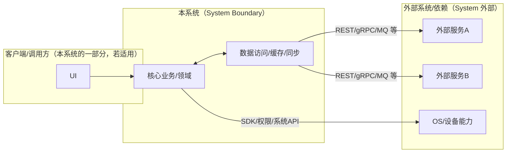
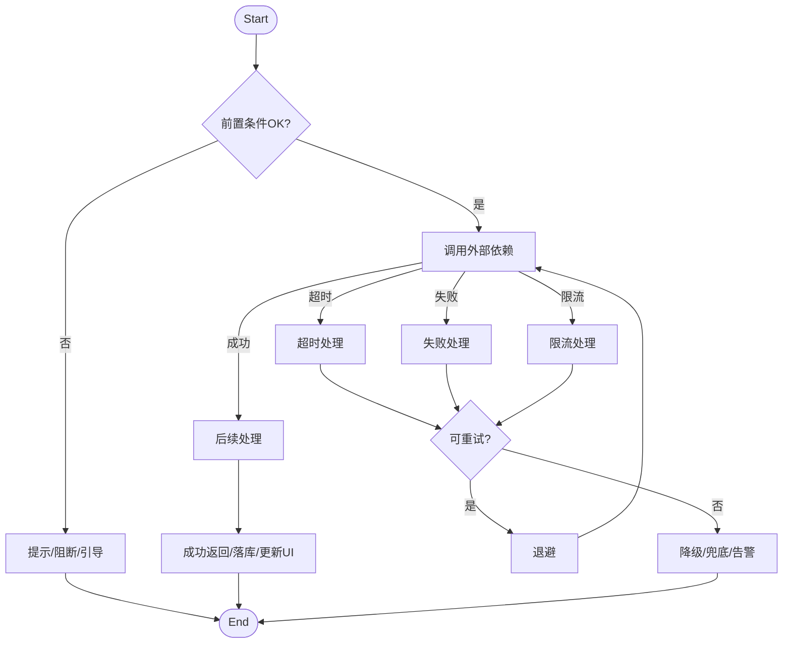
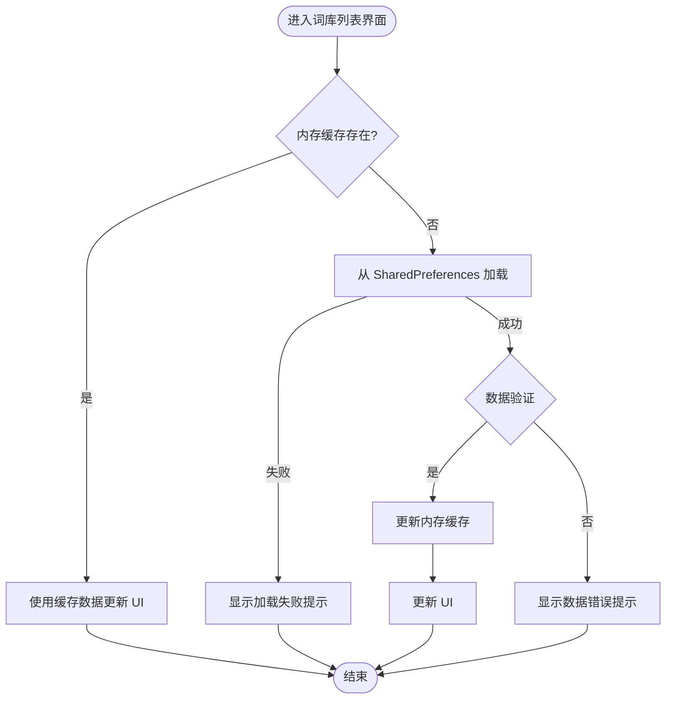
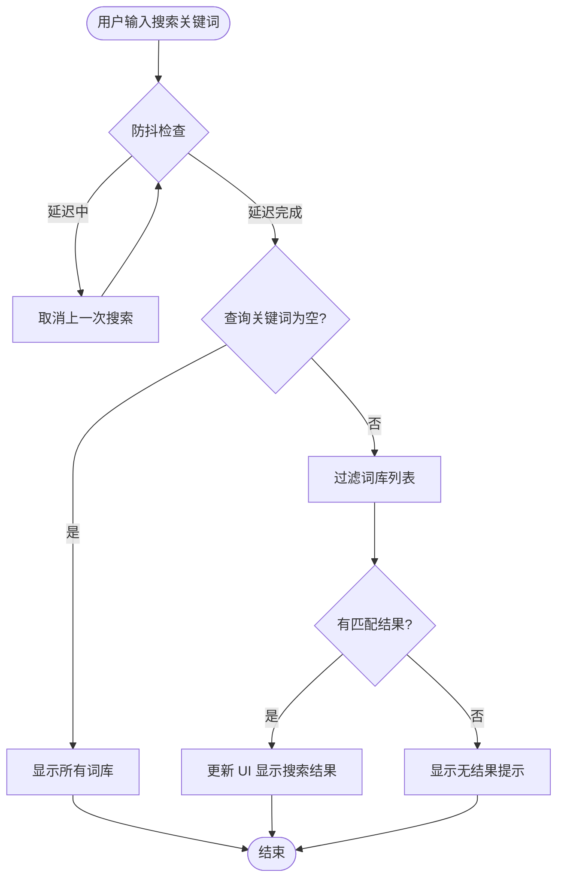

# Plan（工程级蓝图）：单词库管理

**Epic**：EPIC-001 - 无痛记忆单词神器APP
**Feature ID**：FEAT-001
**Feature Version**：v0.1.0（来自 `spec.md`）
**Plan Version**：v0.1.0
**当前工作分支**：`epic/EPIC-001-word-memory-app`
**Feature 目录**：`specs/epics/EPIC-001-word-memory-app/features/FEAT-001-word-library-management/`
**日期**：2026-01-18
**输入**：来自 `Feature 目录/spec.md`

> 规则：
> - Plan 阶段必须包含工程决策、风险评估、算法/功耗/性能/内存评估（量化 + 验收指标）。
> - Implement 阶段**不得**擅自改写 Plan 的技术决策；若必须变更，走增量变更流程并提升 Version。

## 变更记录（增量变更）

| 版本 | 日期 | 变更范围（Feature/Story/Task） | 变更摘要 | 影响模块 | 是否需要回滚设计 |
|---|---|---|---|---|---|
| v0.1.0 | 2026-01-18 | Feature | 初始版本：创建 Plan 工程级蓝图，完成技术选型、架构设计和 Story 拆分 |  | 否 |

## 概述

**核心需求**：用户能够导入、查看、选择和管理单词词库，支持 JSON、CSV、TXT 格式，提供词库列表展示、搜索和选择功能。

**关键工程决策**：
1. **存储方案**：使用 SharedPreferences + 文件系统（词库文件存储在应用私有目录），避免依赖外部数据库（FEAT-007 可选）
2. **文件访问**：使用 Android Storage Access Framework（SAF），不申请全局存储权限，符合隐私要求
3. **解析策略**：同步解析 + 流式处理大文件，避免内存溢出
4. **UI 框架**：Jetpack Compose，符合 EPIC 技术约束

## Plan-A：工程决策 & 风险评估（必须量化）

### A1. 技术选型（候选方案对比 + 决策理由）

| 决策点 | 候选方案 | 优缺点 | 约束/风险 | 决策 | 决策理由 |
|---|---|---|---|---|---|
| 词库元数据存储 | A: SharedPreferences<br>B: Room 数据库<br>C: DataStore | A: 简单、轻量、无依赖，但类型安全性低<br>B: 类型安全、查询方便，但增加依赖和复杂度<br>C: 类型安全、异步，但 API 较新 | 第一阶段不依赖 FEAT-007；存储结构简单（词库列表+当前选择） | A: SharedPreferences | 词库元数据简单（列表+选择状态），SharedPreferences 足够，避免引入数据库依赖 |
| 词库文件存储 | A: 应用私有目录<br>B: 外部存储（公共目录）<br>C: ContentProvider | A: 隐私性好、无需权限，但用户无法直接访问<br>B: 用户可见，但需要存储权限<br>C: 共享访问，但复杂度高 | 隐私要求：词库不上传云端、不共享；符合 EPIC 隐私要求 | A: 应用私有目录 | 符合隐私要求（NFR-SEC-001），词库文件无需用户直接访问，私有目录足够 |
| 文件访问方式 | A: Storage Access Framework（SAF）<br>B: 存储权限（WRITE_EXTERNAL_STORAGE）<br>C: Scoped Storage | A: 无需权限、用户选择、符合隐私，但 API 复杂<br>B: 简单直接，但需要运行时权限<br>C: 分区存储，但兼容性问题 | Android 8.0+、不申请全局权限（NFR-SEC-002） | A: Storage Access Framework | 符合隐私要求，无需全局存储权限，用户可选择文件 |
| 文件解析方式 | A: 同步解析（主线程/IO线程）<br>B: 异步解析（协程/线程池）<br>C: 流式解析（分批处理） | A: 简单，但阻塞主线程<br>B: 不阻塞主线程，但需要异步管理<br>C: 内存友好，但复杂度高 | 大文件（50MB）可能导致内存溢出；性能要求：10MB 文件 ≤ 5秒 | B: 异步解析（协程）+ 流式处理 | 避免阻塞主线程，流式处理大文件，满足性能和内存要求 |
| UI 框架 | A: Jetpack Compose<br>B: XML Layout | A: 声明式、现代化、符合 EPIC 约束<br>B: 传统、成熟，但不符合 EPIC 技术约束 | EPIC 约束：使用 Jetpack Compose | A: Jetpack Compose | 符合 EPIC 技术约束，现代化 UI 框架 |

### A2. 0 层架构设计（对外系统边界、部署、通信、交互）

> 定义：0 层架构设计反映“本系统与外部系统之间的关系”。必须覆盖：结构、部署、通信方式、交互方式与边界。
>
> 要求：
> - 同时给出“一句话描述每个模块/外部系统的职责与边界”。
> - 明确外部依赖的**故障模式**（超时/限流/不可用/返回不一致）与本系统应对策略（重试/降级/兜底/提示）。
> - 明确通信方式（协议/鉴权/重试/幂等/超时/限流）与部署拓扑（端/服务/第三方）。

#### A2.1 外部系统与依赖清单（必须）

| 外部系统/依赖 | 类型（三方/内部服务/设备能力） | 关键能力/数据 | 通信方式（协议/鉴权） | SLA/限流/超时 | 故障模式 | 我方策略 |
|---|---|---|---|---|---|---|
| Android Storage Access Framework（SAF） | 设备能力 | 文件选择器、文件访问 URI | 系统 API（Intent） | 系统级，无 SLA | 用户拒绝授权、文件 URI 失效 | 引导用户授权、提示重新选择文件 |
| Android 文件系统 | 设备能力 | 词库文件存储、文件读取 | 系统 API（ContentResolver/File） | 系统级，存储 I/O | 存储空间不足、文件损坏、权限被拒绝 | 检测空间、验证文件、提示用户 |
| Android SharedPreferences | 设备能力 | 词库元数据存储（列表、当前选择） | 系统 API | 本地存储，无网络 | 存储空间不足、数据损坏 | 数据校验、备份恢复机制 |

#### A2.2 0 层架构图（系统边界 + 外部交互）



#### A2.3 部署视图（必须）

> 要求：说明各节点部署位置（端上/服务端/第三方）、网络边界、以及关键链路的通信方式。


#### A2.4 通信与交互说明（必须）

- **协议**：设备能力（Android 系统 API）、本地文件存储
- **鉴权**：无需鉴权（本地操作），Storage Access Framework 由系统管理文件访问权限
- **超时与重试**：文件解析超时 30 秒，失败后允许用户重新选择文件；文件 I/O 不重试（本地操作，失败即提示用户）
- **幂等**：词库导入操作：基于文件路径+文件大小+修改时间生成唯一标识，防止重复导入同一文件
- **限流**：无外部限流（本地操作）；内部限流：并发导入队列化，一次只处理一个词库导入
- **数据一致性**：强一致（本地存储），词库元数据（SharedPreferences）和文件系统同步更新，失败时回滚

### A3. 1 层架构设计（系统内部框架图 + 模块拆分 + 接口协议）

> 定义：1 层架构设计描述“系统内部的模块拆分与协作”，包括框架图、模块职责、模块交互、通信方式、接口协议等。

#### A3.1 1 层框架图（必须）


#### A3.2 模块拆分与职责（必须）

| 模块 | 职责 | 输入/输出 | 依赖 | 约束 |
|---|---|---|---|---|
| UI 层（Jetpack Compose） | 词库列表展示、导入界面、用户交互 | 输入：用户操作事件<br>输出：UI 状态展示 | LibraryViewModel | 仅负责 UI 展示，不包含业务逻辑 |
| ViewModel 层 | 管理 UI 状态、处理用户事件、调用 UseCase | 输入：用户事件、UseCase 结果<br>输出：UI 状态（State） | Domain 层（UseCase） | 不直接访问数据层 |
| Domain 层（UseCase） | 业务逻辑封装、流程编排、数据转换 | 输入：业务请求<br>输出：业务结果 | Data 层（Repository） | 不依赖 UI 层，可测试性 |
| Repository 层 | 数据访问抽象、多数据源协调 | 输入：数据请求<br>输出：数据实体 | DataSource | 统一数据访问接口 |
| Parser 层 | 文件解析、格式转换、数据校验 | 输入：文件 URI/流<br>输出：词库实体 | FileStorage | 支持 JSON/CSV/TXT，流式处理 |
| DataSource 层 | 底层数据访问、SharedPreferences/文件操作 | 输入：数据操作<br>输出：原始数据 | Storage（SharedPrefs/FileStorage） | 仅负责数据读写 |

#### A3.3 模块协作与通信方式（必须）

> 要求：写清楚“谁调用谁、通过什么方式、传什么、失败如何处理”。如果是异步（队列/事件），必须写清楚消费语义与重放/去重。

- **调用关系**：
  - UI → ViewModel → UseCase → Repository → DataSource → Storage
  - UI → ViewModel（用户事件、状态观察）
  - ViewModel → UseCase（业务调用，suspend 函数）
  - UseCase → Repository（数据请求）
  - Repository → DataSource（数据访问）
  - Parser → FileStorage（文件读取）
- **通信方式**：
  - 函数调用：Kotlin 函数调用，使用协程处理异步操作
  - 状态管理：ViewModel 使用 StateFlow/Flow 暴露状态，UI 使用 collectAsState 观察
  - 错误处理：使用 Result/Sealed Class 封装成功/失败状态
- **接口协议**：
  - 数据结构：使用 Kotlin data class 定义实体（WordLibrary, LibraryMetadata）
  - 错误码：使用 Sealed Class 定义错误类型（ImportError, ParseError）
  - 版本策略：数据结构向后兼容，新增字段使用默认值
  - 幂等约束：导入操作基于文件指纹（路径+大小+修改时间）去重
- **并发与线程模型**：
  - 主线程：UI 操作、状态更新
  - IO 线程：文件 I/O、SharedPreferences 读写（Dispatchers.IO）
  - 协程：UseCase 和 Repository 使用 suspend 函数，由 ViewModel 在 ViewModelScope 中调用
  - 共享状态保护：ViewModel 使用线程安全的状态容器（StateFlow），避免并发修改

#### A3.4 关键模块设计（详细设计 + 取舍，必须）

> 要求：对“关键模块/高风险模块/承载 NFR 的模块”做细化。若包含多个模块，则分模块说明。

##### 模块：LibraryRepository（词库仓库层）

- **模块定位**：统一词库数据的访问接口，封装底层存储细节，提供数据访问抽象，位于 Data 层，为 UseCase 提供数据访问服务
- **设计目标**：数据一致性、性能优化（缓存）、可测试性、可扩展性（未来支持云端同步）
- **核心数据结构/状态**：
  - 实体：`WordLibrary`（词库实体）、`LibraryMetadata`（元数据）
  - 状态：词库列表（List<WordLibrary>）、当前选择词库 ID（String?）
  - 缓存：内存缓存词库列表，减少重复读取 SharedPreferences
- **对外接口（协议）**：
  - `suspend fun importLibrary(uri: Uri): Result<WordLibrary>`：导入词库
  - `suspend fun getLibraries(): Flow<List<WordLibrary>>`：获取词库列表（Flow 支持实时更新）
  - `suspend fun selectLibrary(libraryId: String): Result<Unit>`：选择词库
  - `suspend fun searchLibraries(query: String): List<WordLibrary>`：搜索词库
  - 错误码：`LibraryError`（Sealed Class：ImportError, NotFoundError, StorageError）
- **策略与算法**：
  - 缓存策略：首次加载后内存缓存，SharedPreferences 变更时更新缓存
  - 去重策略：导入时基于文件指纹（路径+大小+修改时间）检测重复
  - 批量操作：列表更新批量写入 SharedPreferences
- **失败与降级**：
  - SharedPreferences 写入失败：抛出异常，UseCase 层处理
  - 文件读取失败：返回错误 Result，由调用方处理
  - 数据损坏：数据校验，返回错误并记录日志
- **安全与隐私**：
  - 词库文件存储在应用私有目录，不共享
  - 不记录敏感信息（文件路径可记录，但不包含文件内容）
- **可观测性**：
  - 记录导入、选择、搜索操作日志
  - 记录错误操作（导入失败、读取失败）
- **优缺点**：
  - **优点**：数据访问统一、易于测试和扩展、支持实时更新（Flow）
  - **缺点/代价**：内存缓存占用少量内存（约 10-20MB）
  - **替代方案与否决理由**：不使用 Room 数据库（数据简单，SharedPreferences 足够）；不使用 DataStore（API 较新，SharedPreferences 成熟稳定）

##### 模块：LibraryParser（文件解析器）

- **模块定位**：负责词库文件的解析，支持多种格式（JSON/CSV/TXT），流式处理大文件，位于 Data 层
- **设计目标**：性能（快速解析）、内存效率（流式处理）、可扩展性（支持新格式）、错误处理
- **核心数据结构/状态**：
  - 输入：文件 URI（Content URI）或文件流
  - 输出：`WordLibrary` 实体（包含单词列表）
  - 解析状态：进度百分比（0-100%）
- **对外接口（协议）**：
  - `suspend fun parseLibrary(uri: Uri, onProgress: (Int) -> Unit): Result<WordLibrary>`：解析词库文件，支持进度回调
  - 错误码：`ParseError`（Sealed Class：FormatError, EncodingError, SizeError, IOError）
- **策略与算法**：
  - JSON 解析：使用 Gson/JsonReader 流式解析，避免一次性加载整个文件
  - CSV 解析：逐行读取，分批处理（每批 1000 行）
  - TXT 解析：逐行读取，每行一个单词
  - 进度计算：基于已读取字节数 / 文件总大小
- **失败与降级**：
  - 格式不支持：返回 FormatError，提示支持的格式
  - 编码错误：尝试自动检测编码（UTF-8/GBK），失败返回 EncodingError
  - 文件过大（>50MB）：警告用户，继续解析（流式处理）
  - 解析超时（>30秒）：取消任务，返回超时错误
- **安全与隐私**：
  - 不解析文件内容到日志
  - 解析完成后立即释放文件句柄
- **可观测性**：
  - 记录解析耗时、文件大小、格式类型
  - 记录解析失败原因
- **优缺点**：
  - **优点**：流式处理支持大文件、异步解析不阻塞主线程、支持进度反馈
  - **缺点/代价**：实现复杂度较高（需要处理多种格式和错误场景）
  - **替代方案与否决理由**：不使用同步解析（会阻塞主线程）；不使用一次性加载（内存溢出风险）

#####（Capability Feature 场景）交付物与接入契约（若适用则必填）

> 适用：本 Feature 为“埋点/可观测性”“动效合集/组件库”“算法能力/模型SDK”等横切能力时。

- **交付物形态**：SDK / 资源包 / 配置 / 模型文件 / 服务接口（按实际）
- **对外接口（业务接入）**：初始化方式、调用方式、依赖注入点、生命周期要求
- **事件/协议/契约**：事件名/字段/版本；API 协议；资源命名规范；模型输入输出张量定义（按实际）
- **版本与兼容策略**：SemVer/灰度/回滚；向后兼容策略；弃用策略
- **验收标准**：可测量的完成定义（性能/正确性/稳定性/合规），并明确验证入口

#####（算法 Capability Feature 场景）算法交付与工程化清单（若适用则必填）

- **模型提供**：模型来源/版本/训练数据假设（引用来源，不在此新增训练决策）
- **推理部署**：端侧/服务端；运行时（如 NNAPI/自研 runtime）；模型下发/更新策略
- **工程化封装**：算法 SDK/API；线程与资源控制；缓存；降级与回退（无模型/低端机/失败）
- **评估与监控**：离线/线上指标；漂移监测；告警；灰度策略

### A4. 关键流程设计（每个流程一张流程图，含正常 + 全部异常）

> 定义：关键流程设计必须用**流程图（flowchart）**描述，且流程图中必须覆盖正常流程与所有关键异常分支（失败/超时/并发/生命周期等）。
>
> 要求：
> - 若存在多个关键流程（如“登录”“同步”“下单”“上传”等），则每个流程单独一张图。
> - 每张图必须包含：触发条件、关键决策点、外部依赖调用、重试/降级/兜底路径、最终可观测信号（日志/指标/埋点）。

#### 流程 1：词库文件导入流程



#### 流程 2：词库列表加载流程



#### 流程 3：词库搜索流程



### A5. 技术风险与消解策略（绑定 Story/Task）

| 风险ID | 风险描述 | 触发条件 | 影响范围 | 严重度 | 消解策略 | 对应 Story/Task |
|---|---|---|---|---|---|---|
| RISK-001 | 文件解析失败导致导入功能不可用 | 词库文件格式不规范、编码错误、文件损坏、解析器实现错误 | 用户无法导入词库，核心功能不可用 | High | 1. 严格的格式验证和错误处理 2. 支持多种编码自动检测 3. 提供清晰的错误提示和格式说明 4. 记录详细错误日志用于排查 5. 解析前文件校验（大小、完整性） | ST-001, ST-005 |
| RISK-002 | 存储空间不足导致导入失败 | 设备存储空间不足（<50MB）、应用私有目录配额限制 | 用户无法导入词库，数据丢失风险 | High | 1. 导入前检测可用存储空间 2. 提示用户清理空间或选择较小文件 3. 提供存储空间使用情况显示 4. 支持删除不需要的词库释放空间 | ST-001, ST-005 |
| RISK-003 | 数据持久化失败导致数据丢失 | SharedPreferences 写入失败、文件系统异常、应用崩溃时数据未保存 | 用户词库列表和选择状态丢失，需重新导入 | High | 1. 同步写入 SharedPreferences（apply + commit 组合） 2. 文件复制后更新元数据，失败时回滚 3. 关键操作前检查存储可用性 4. 应用生命周期监听，退出前保存数据 5. 定期备份机制（可选） | ST-006 |
| RISK-004 | 大文件解析导致内存溢出 | 词库文件过大（>50MB）、同步解析大文件、内存管理不当 | 应用崩溃、用户体验下降 | Med | 1. 使用流式解析，分批处理文件内容 2. 异步解析，避免阻塞主线程 3. 文件大小限制检查（>50MB 警告） 4. 解析过程中监控内存使用 5. 失败时立即释放资源 | ST-001 |
| RISK-005 | 文件 URI 失效导致无法访问词库文件 | Storage Access Framework URI 权限过期、文件被删除或移动 | 已导入的词库无法读取，需要重新导入 | Med | 1. 使用 Content URI 持久化权限（takePersistableUriPermission） 2. 定期验证文件 URI 有效性 3. 失效时提示用户重新选择文件 4. 保留文件元数据（名称、大小）用于校验 | ST-001, ST-006 |
| RISK-006 | 性能不达标导致用户体验差 | 列表加载慢、搜索响应慢、文件导入耗时过长 | 用户等待时间长，功能不可用 | Low | 1. 异步加载和缓存机制 2. 搜索使用防抖（debounce）优化 3. 文件解析优化（批量处理、并行解析） 4. 性能监控和告警 5. 降级策略（简化列表、延迟加载） | ST-001, ST-002, ST-004 |

### A6. 边界 & 异常场景枚举（数据/状态/生命周期/并发/用户行为）

- **数据边界**：
  - **空数据**：词库列表为空 → 显示空状态提示，引导用户导入
  - **超大文件**：词库文件 >50MB → 警告提示，询问是否继续，使用流式解析
  - **非法格式**：文件格式不支持（非 JSON/CSV/TXT） → 错误提示，说明支持的格式
  - **格式不规范**：JSON 缺少必要字段、CSV 列不匹配 → 解析失败提示，说明格式要求
  - **重复导入**：同一文件多次导入 → 基于文件路径+大小+修改时间检测重复，提示已存在或允许覆盖
  - **编码问题**：非 UTF-8 编码文件 → 尝试自动检测编码，失败时提示用户
  - **文件损坏**：文件读取失败、数据不完整 → 错误提示，允许重新选择文件

- **状态边界**：
  - **无当前词库**：应用首次启动，未选择词库 → 列表中选择第一个词库或提示用户选择
  - **词库选择状态不一致**：元数据中标记的词库已不存在 → 清除标记，重新选择
  - **导入进行中**：用户多次点击导入按钮 → 队列化处理，一次只处理一个导入
  - **导入中断**：应用崩溃或退出时正在导入 → 保存导入进度（文件 URI），下次启动时继续或提示重新导入

- **生命周期**：
  - **前后台切换**：应用切换到后台时正在导入 → 后台继续导入，恢复时显示进度
  - **屏幕旋转**：导入过程中屏幕旋转 → 使用 ViewModel 保存状态，恢复后继续显示
  - **进程被杀**：系统回收进程时正在导入 → 导入失败，提示用户重新导入
  - **应用重启**：应用重启后 → 从 SharedPreferences 恢复词库列表和当前选择状态
  - **数据恢复**：系统数据恢复（应用数据备份还原） → 验证恢复的数据完整性

- **并发**：
  - **并发导入**：用户快速连续选择多个文件导入 → 队列化处理，依次导入，显示当前导入进度
  - **并发读取**：多个组件同时读取词库列表 → 使用共享的 Repository 单例，避免重复加载
  - **并发写入**：导入过程中用户进行选择操作 → 使用锁或协程互斥，确保数据一致性
  - **竞态条件**：导入完成和列表刷新时间差 → 使用状态同步机制，确保 UI 及时更新

- **用户行为**：
  - **快速连点**：用户快速点击导入按钮 → 防抖处理，只响应第一次点击
  - **取消导入**：导入过程中用户取消 → 停止解析任务，清理临时数据，记录取消事件
  - **权限拒绝**：用户拒绝文件访问权限 → 引导用户到设置中授权，提供设置入口
  - **选择文件后取消**：打开文件选择器后取消选择 → 正常处理，不执行导入操作
  - **搜索频繁输入**：用户快速输入搜索关键词 → 使用防抖（debounce，300ms），减少实时过滤频率
  - **列表滚动时搜索**：列表滚动时用户输入搜索 → 暂停滚动，立即执行搜索过滤

### A7. 算法评估（如适用）

- **不适用**：词库管理 Feature 不涉及算法模型，无需算法评估

### A8. 功耗评估（必须量化）

- **Top5% 用户模型**：Android 设备，每天导入 3 个词库（每个 5MB），词库列表浏览和搜索操作
- **测量口径**：文件 I/O 操作（读取/写入）、UI 渲染、内存分配
- **预估增量**：每日 mAh 增量 ≤ 5mAh（主要来自文件 I/O 操作，假设每个 5MB 文件导入消耗约 1.5mAh，3 个词库共 4.5mAh，其他操作约 0.5mAh）
- **验收上限**：每日电池消耗增量不超过 5mAh（Top5% 用户模型），超过时需优化文件 I/O 策略
- **降级策略**：无降级策略（词库管理为本地操作，功耗可控）；若功耗超标，优化文件解析策略（批量处理、降低频率）

### A9. 性能评估（必须量化）

- **前台**：
  - 词库列表加载：p50 ≤ 200ms，p95 ≤ 500ms，p99 ≤ 800ms
  - 词库搜索响应：p50 ≤ 50ms，p95 ≤ 200ms，p99 ≤ 400ms
  - 词库选择操作：p50 ≤ 50ms，p95 ≤ 100ms，p99 ≤ 200ms
- **后台**：
  - 词库文件导入（10MB 文件）：p50 ≤ 3 秒，p95 ≤ 5 秒，p99 ≤ 8 秒
  - 文件解析：异步处理，不阻塞主线程，显示进度指示器
- **验收指标**：
  - 列表加载时间 p95 ≤ 500ms（测试方法：使用性能测试工具测量加载时间，测试设备：中端 Android 设备）
  - 搜索响应时间 p95 ≤ 200ms（测试方法：输入关键词，测量结果过滤时间）
  - 文件导入时间（10MB）≤ 5 秒（测试方法：导入标准测试文件，测量解析和存储时间）
- **降级策略**：
  - 列表加载超时：显示加载失败提示，允许重新加载
  - 搜索响应慢：减少实时过滤，使用防抖（debounce）延迟处理
  - 文件导入超时：显示进度，允许取消，失败后提示重试

### A10. 内存评估（必须量化）

- **峰值增量**：≤ 20MB（假设 10 个词库，每个词库元数据约 2MB）
- **平均增量**：≤ 10MB（假设 5 个词库的平均场景）
- **生命周期**：
  - **词库列表数据**：Activity/Fragment 生命周期内常驻，应用退出时释放
  - **文件解析临时内存**：解析过程中分配，解析完成后立即释放
  - **SharedPreferences 数据**：系统管理，不占用应用内存
- **风险与对策**：
  - **风险点**：大文件解析（50MB）可能导致内存溢出；词库列表缓存过多数据
  - **对策**：使用流式解析，分批处理大文件；词库列表只缓存元数据（不缓存文件内容）；应用退出时清理列表数据
- **验收标准**：
  - 测试方法：使用内存分析工具（如 Android Profiler）测量峰值内存占用，测试场景：导入 10 个词库（每个 2MB 元数据）
  - 阈值：峰值内存增量 ≤ 20MB（不含系统开销）
  - 文件解析临时内存：解析完成后立即释放，不增加常驻内存

## Plan-B：技术规约 & 实现约束（保留原 spec-kit 输出内容）

### B1. 技术背景（用于统一工程上下文）

> 注意：为保证工具链自动提取信息，下列字段名需保留英文 Key（括号内可补充中文）。

**Language/Version**：Kotlin 1.9+ / Java 17（Android 开发）
**Primary Dependencies**：Jetpack Compose（UI）、Kotlin Coroutines（异步）、AndroidX Lifecycle（生命周期）、SharedPreferences（存储）
**Storage**：SharedPreferences（词库元数据）、文件系统（词库文件存储在应用私有目录）
**Test Framework**：JUnit 5、Kotlin Coroutines Test、MockK（Mocking）、Robolectric（Android 单元测试）
**Target Platform**：Android 8.0+（API Level 26+）
**Project Type**：mobile（Android 应用）
**Performance Targets**：列表加载 p95 ≤ 500ms、搜索响应 p95 ≤ 200ms、文件导入（10MB）≤ 5 秒
**Constraints**：内存峰值 ≤ 20MB、本地存储 ≤ 100MB（不含词库资源）、离线可用（无需网络）
**Scale/Scope**：单用户本地应用、词库数量 ≤ 50 个、单个词库文件 ≤ 50MB

### B2. 架构细化（实现必须遵循）

- **分层约束**：
  - UI 层（Compose）只能调用 ViewModel，不能直接访问数据层
  - ViewModel 只能调用 UseCase，不能直接访问 Repository
  - UseCase 只能调用 Repository，不能直接访问 DataSource
  - Repository 可以调用多个 DataSource，但不能跨层访问
- **线程/并发模型**：
  - 主线程：UI 操作、状态更新（StateFlow）
  - IO 线程：文件 I/O、SharedPreferences 读写（Dispatchers.IO）
  - 协程：UseCase 和 Repository 使用 suspend 函数，由 ViewModel 在 ViewModelScope 中调用
  - 共享状态：使用 StateFlow（线程安全）而非 MutableStateFlow（需 Mutex 保护）
- **错误处理规范**：
  - 使用 Result<T> 或 Sealed Class（Success/Failure）封装结果
  - 错误类型：Sealed Class（ImportError, ParseError, StorageError）
  - 用户提示：统一使用字符串资源（strings.xml），错误信息用户友好
  - 异常转换：底层异常转换为领域错误，不直接向上抛出系统异常
- **日志与可观测性**：
  - 结构化日志：使用结构化日志库（如 Timber），包含操作类型、结果、耗时
  - 关键事件记录：导入成功/失败、选择词库、搜索操作
  - 敏感信息脱敏：不记录文件完整路径、词库内容，只记录元数据（名称、大小）
  - 采样：高频操作（如搜索）采样记录，低频操作（如导入）全量记录

### B3. 数据模型（引用或内联）

**核心实体**：

1. **WordLibrary（词库实体）**
   - `id: String`：词库唯一标识（UUID 或文件指纹）
   - `name: String`：词库名称（来自文件名或元数据）
   - `wordCount: Int`：单词数量
   - `createdAt: Long`：创建时间戳（毫秒）
   - `filePath: String`：词库文件路径（应用私有目录）
   - `fileSize: Long`：文件大小（字节）
   - `format: LibraryFormat`：文件格式（JSON/CSV/TXT）
   - `isSelected: Boolean`：是否为当前选择的词库

2. **LibraryMetadata（词库元数据）**
   - 用于 SharedPreferences 存储，包含上述字段（不包含文件内容）
   - 序列化：使用 JSON 或 Gson 序列化为字符串存储

3. **LibraryFormat（枚举）**
   - JSON、CSV、TXT

**数据关系**：
- 一个用户可以有多个词库（一对多）
- 一个用户只能有一个当前选择的词库（一对一，通过 `isSelected` 标记）

**校验规则**：
- 词库名称：非空，长度 ≤ 100 字符
- 单词数量：≥ 1
- 文件大小：≤ 50MB
- 创建时间：有效时间戳（>0）

### B4. 接口规范/协议（引用或内联）

**Repository 接口**：

```kotlin
interface LibraryRepository {
    suspend fun importLibrary(uri: Uri): Result<WordLibrary>
    suspend fun getLibraries(): Flow<List<WordLibrary>>
    suspend fun selectLibrary(libraryId: String): Result<Unit>
    suspend fun searchLibraries(query: String): List<WordLibrary>
}
```

**UseCase 接口**：

```kotlin
class ImportLibraryUseCase(private val repository: LibraryRepository) {
    suspend operator fun invoke(uri: Uri): Result<WordLibrary> {
        return repository.importLibrary(uri)
    }
}
```

**版本策略**：
- 数据结构版本：使用字段版本号（添加字段时设置默认值，确保向后兼容）
- API 版本：内部 API 无版本号（不对外暴露），数据结构变更时兼容处理

**兼容策略**：
- 向后兼容：新增字段使用默认值，删除字段时保留字段但标记为废弃
- 数据迁移：SharedPreferences 数据结构变更时，自动迁移旧数据（读取时转换）

**错误响应格式**：
- Result<T>：Success(value: T) / Failure(error: LibraryError)
- LibraryError（Sealed Class）：ImportError, ParseError, StorageError, NotFoundError

### B5. 合规性检查（关卡）

*关卡：必须在进入 Implement 前通过；若不通过，必须明确整改项并绑定到 Story/Task。*

**隐私合规检查**：
- [x] 词库文件存储在应用私有目录，不共享（符合 NFR-SEC-001）
- [x] 不申请全局存储权限，使用 Storage Access Framework（符合 NFR-SEC-002）
- [x] 词库数据不上传云端（符合 EPIC 隐私要求）

**性能检查**：
- [x] 列表加载时间 ≤ 500ms（p95）（符合 NFR-PERF-001）
- [x] 搜索响应时间 ≤ 200ms（p95）（符合 NFR-PERF-001）
- [x] 文件导入时间（10MB）≤ 5 秒（符合 NFR-PERF-001）

**内存检查**：
- [x] 内存峰值 ≤ 20MB（符合 NFR-MEM-001）
- [x] 文件解析使用流式处理，避免大文件内存溢出

**可测试性检查**：
- [x] UseCase 和 Repository 可独立测试（不依赖 Android 组件）
- [x] ViewModel 可单元测试（使用 TestCoroutineDispatcher）
- [x] UI 组件可 Compose 预览测试

### B6. 项目结构（本 Feature）

```text
specs/[###-feature-short-name]/
├── spec.md                     # Feature 规格说明（/speckit.specify）
├── plan.md                     # 本文件（/speckit.plan）
├── full-design.md               # 全量技术方案文档（/speckit.fulldesign）
├── tasks.md                    # 任务拆解（/speckit.tasks）
├── research.md                 # 可选：调研产物
├── data-model.md               # 可选：数据模型
├── quickstart.md               # 可选：快速验证/联调指南
└── contracts/                  # 可选：接口契约
```

### B7. 源代码结构（代码库根目录）

<!--
  需执行操作：将下方的占位目录树替换为该功能的具体目录结构。
  删除未使用的选项，并使用实际路径扩展选定的结构（例如：apps/admin、packages/something）。
-->

```text
# 选项1：单项目（默认）
src/
tests/

# 选项2：Web 应用
backend/
frontend/

# 选项3：移动应用 + 接口
api/
android/ 或 ios/
```

**结构决策**：选项3 - 移动应用（Android 应用结构）

```
app/src/main/java/com/jacky/verity/library/
├── ui/
│   ├── LibraryListScreen.kt          # 词库列表界面
│   ├── ImportLibraryScreen.kt        # 导入界面
│   └── components/                   # UI 组件
│       ├── LibraryItem.kt            # 词库列表项
│       └── EmptyState.kt             # 空状态组件
├── viewmodel/
│   └── LibraryViewModel.kt           # 词库 ViewModel
├── domain/
│   ├── usecase/
│   │   ├── ImportLibraryUseCase.kt
│   │   ├── GetLibrariesUseCase.kt
│   │   ├── SelectLibraryUseCase.kt
│   │   └── SearchLibrariesUseCase.kt
│   └── model/
│       ├── WordLibrary.kt            # 词库实体
│       └── LibraryError.kt           # 错误类型
├── data/
│   ├── repository/
│   │   └── LibraryRepositoryImpl.kt
│   ├── datasource/
│   │   └── LibraryLocalDataSource.kt
│   └── parser/
│       ├── LibraryParser.kt          # 文件解析器接口
│       ├── JsonLibraryParser.kt      # JSON 解析器
│       ├── CsvLibraryParser.kt       # CSV 解析器
│       └── TxtLibraryParser.kt       # TXT 解析器
└── di/
    └── LibraryModule.kt              # 依赖注入模块
```

## Story Breakdown（Plan 阶段末尾，必须）

> 规则：
> - Story 是 Feature 的最小可开发单元，用于覆盖对应 FR/NFR。
> - Story 类型必须标注：Functional / Design-Enabler / Infrastructure / Optimization。
> - 这里**只做拆分与映射**，不生成 Task；Task 在 `/speckit.tasks` 阶段生成，且不得改写这里的设计决策。

### Story 列表

#### ST-001：词库文件导入功能

- **类型**：Functional
- **描述**：实现词库文件导入功能，支持用户通过 Storage Access Framework 选择文件，解析 JSON/CSV/TXT 格式，存储词库文件和元数据
- **目标**：用户能够成功导入词库文件，词库出现在列表中，导入耗时满足性能要求（10MB 文件 ≤ 5秒）
- **覆盖 FR/NFR**：FR-001；NFR-PERF-001（导入耗时）；NFR-SEC-001/002（存储和权限）；NFR-OBS-001（导入事件记录）；NFR-REL-001（导入成功率）
- **依赖**：无（基础设施 Story）
- **可并行**：是（与其他 Story 无依赖关系）
- **关键风险**：是（关联 RISK-001：文件解析失败；RISK-002：存储空间不足）
- **验收/验证方式（高层）**：能够导入 JSON/CSV/TXT 格式文件，导入成功率达到 99%，导入耗时符合要求；细化到 tasks.md

#### ST-002：词库列表展示功能

- **类型**：Functional
- **描述**：实现词库列表界面，展示已导入的词库列表，显示词库名称、单词数量、创建时间，支持空状态展示
- **目标**：词库列表能够正确显示词库信息，列表加载时间不超过 500ms（p95），空状态提示清晰
- **覆盖 FR/NFR**：FR-002；FR-006（空状态）；NFR-PERF-001（列表加载时间）；NFR-MEM-001（列表内存占用）；NFR-OBS-001（加载事件）
- **依赖**：ST-001（需要词库元数据）
- **可并行**：否（依赖 ST-001 完成）
- **关键风险**：否
- **验收/验证方式（高层）**：列表正确显示词库信息，加载时间符合要求，内存占用符合要求；细化到 tasks.md

#### ST-003：词库选择功能

- **类型**：Functional
- **描述**：实现词库选择功能，用户能够从列表中选择一个词库作为当前学习词库，系统标记当前使用的词库
- **目标**：用户能够选择词库，当前词库被正确标记，选择状态持久化保存
- **覆盖 FR/NFR**：FR-003；NFR-REL-002（状态持久化）；NFR-OBS-001（选择事件记录）
- **依赖**：ST-002（需要词库列表）
- **可并行**：否（依赖 ST-002 完成）
- **关键风险**：否
- **验收/验证方式（高层）**：能够选择词库，当前词库被标记，选择状态持久化；细化到 tasks.md

#### ST-004：词库搜索功能

- **类型**：Functional
- **描述**：实现词库搜索功能，用户能够在搜索框中输入关键词，系统实时过滤词库列表，支持模糊匹配
- **目标**：搜索功能正常工作，搜索响应时间不超过 200ms（p95），搜索结果实时更新
- **覆盖 FR/NFR**：FR-004；NFR-PERF-001（搜索响应时间）
- **依赖**：ST-002（需要词库列表）
- **可并行**：否（依赖 ST-002 完成）
- **关键风险**：否
- **验收/验证方式（高层）**：搜索功能正常，响应时间符合要求，搜索结果正确；细化到 tasks.md

#### ST-005：错误处理和异常场景

- **类型**：Infrastructure
- **描述**：实现错误处理机制，覆盖文件格式不支持、文件解析失败、存储空间不足、文件权限被拒绝等异常场景，提供明确的错误提示
- **目标**：所有异常场景都有明确的错误提示和引导，用户能够理解错误原因并采取行动
- **覆盖 FR/NFR**：FR-005；NFR-OBS-002（错误日志记录）；NFR-REL-001（错误处理）
- **依赖**：ST-001（导入功能）
- **可并行**：否（依赖 ST-001 完成）
- **关键风险**：是（关联 RISK-001：文件解析失败）
- **验收/验证方式（高层）**：所有异常场景都有明确的错误提示，错误日志正确记录；细化到 tasks.md

#### ST-006：数据持久化和生命周期管理

- **类型**：Infrastructure
- **描述**：实现词库数据持久化机制，确保应用崩溃或退出时词库列表和当前选择状态能够保存，重启后恢复；管理词库列表内存生命周期
- **目标**：数据能够可靠持久化，应用重启后恢复，内存占用符合要求
- **覆盖 FR/NFR**：NFR-REL-002（数据持久化）；NFR-MEM-001/002（内存生命周期）
- **依赖**：ST-001、ST-002、ST-003（需要导入、列表、选择功能）
- **可并行**：否（依赖其他 Story）
- **关键风险**：是（关联 RISK-003：数据丢失风险）
- **验收/验证方式（高层）**：数据持久化正常，应用重启后恢复，内存占用符合要求；细化到 tasks.md

### Feature → Story 覆盖矩阵

| FR/NFR ID | 覆盖的 Story ID | 备注 |
|---|---|---|
| FR-001 | ST-001 | 词库文件导入 |
| FR-002 | ST-002 | 词库列表展示 |
| FR-003 | ST-003 | 词库选择功能 |
| FR-004 | ST-004 | 词库搜索功能 |
| FR-005 | ST-005 | 错误处理 |
| FR-006 | ST-002 | 空状态处理（包含在列表展示中） |
| NFR-PERF-001 | ST-001、ST-002、ST-004 | 性能要求（导入、加载、搜索） |
| NFR-MEM-001/002 | ST-002、ST-006 | 内存占用和生命周期 |
| NFR-SEC-001/002 | ST-001 | 安全隐私要求 |
| NFR-OBS-001/002 | ST-001、ST-002、ST-003、ST-005 | 可观测性要求 |
| NFR-REL-001/002 | ST-001、ST-005、ST-006 | 可靠性要求 |

## 复杂度跟踪（仅当合规性检查存在需说明理由的违规项时填写）

| 违规项 | 必要性说明 | 舍弃更简单方案的原因 |
|---|---|---|
| [例如：第4个子项目] | [当前需求] | [为何更简单方案不满足] |