# Full Design：间隔重复学习算法引擎

**Epic**：EPIC-001 - 无痛记忆单词神器APP
**Feature ID**：FEAT-002
**Feature Version**：v0.1.0
**Plan Version**：v0.2.0
**Tasks Version**：v0.1.0
**Full Design Version**：v0.2.0

**分支**：`epic/EPIC-001-word-memory-app`
**日期**：2026-01-18
**输入工件**：
- `spec.md`
- `plan.md`
- `tasks.md`

> Agent 规则（强制）：
> - 本文档**只能整合现有产物**（spec/plan/tasks 等），**不得新增技术决策**。
> - 若遇到决策缺口，只能标注为 `TODO(Clarify): ...` 并指向应补齐的来源文档/章节。
> - 本文档用于评审与执行：层次必须清晰、结构化、可追溯。

## 变更记录（增量变更）

| 版本 | 日期 | 变更范围（Feature/Story/Task） | 变更摘要 | 影响模块 | 是否需要回滚设计 |
|---|---|---|---|---|---|
| v0.1.0 | 2026-01-18 | Feature | 初始版本：整合 spec.md、plan.md、tasks.md 生成 Full Design 文档 |  | 否 |
| v0.2.0 | 2026-01-19 | Feature | 同步 plan.md v0.2.0：更新 2.4 通信与交互说明，补齐 3.6 模块级 UML 总览和 3.7 模块级 UML 设计 | 2.4, 3.6, 3.7 | 否 |

## 1. 背景与范围（来自 spec.md）

- **背景**：
  - 传统单词记忆方法缺乏科学指导，用户难以在最佳复习时机进行复习，导致记忆效率低下
  - 间隔重复算法是基于遗忘曲线的科学记忆方法，能够在记忆衰减的关键时间点安排复习，显著提升记忆效率
  - 学习调度算法是产品的核心竞争力，需要独立封装为可复用的平台能力，便于测试、优化和扩展
  - 算法引擎需要根据用户学习历史智能计算复习时机，确保学习调度准确有效

- **目标**：
  - **用户目标**：用户能够通过科学的间隔重复算法在最佳时机复习单词，提升记忆效率
  - **业务目标**：建立核心学习算法引擎，支撑产品的差异化竞争力，提升用户学习效果和留存率
  - **平台目标**：建立可扩展、可测试、可优化的算法引擎框架，支持未来算法参数调优和个性化适配

- **价值**：
  - **用户价值**：显著提升单词记忆效率，减少无效复习次数，降低学习负担
  - **业务价值**：形成算法能力护城河，支撑核心学习功能，提升用户粘性和留存率
  - **技术价值**：建立可复用的算法引擎框架，积累算法参数调优经验，为后续个性化算法提供基础

- **In Scope**：
  - 基于遗忘曲线的学习调度算法（支持 SuperMemo、SM-2 等经典算法）
  - 复习时机计算（根据学习历史和记忆强度计算下次复习时间）
  - 学习状态管理（跟踪单词的学习次数、最后复习时间、记忆强度、下次复习时间）
  - 记忆强度评估（基于用户回答正确率和复习间隔评估记忆强度）
  - 算法参数配置（支持算法参数的基础配置，如初始间隔、难度因子等）

- **Out of Scope**：
  - 机器学习模型训练（第一阶段使用经典算法，不使用机器学习模型）
  - 个性化算法调优（第一阶段使用通用算法参数，不支持基于用户特征的个性化调优）
  - 算法可视化展示（算法调度过程的可视化不在本 Feature 范围，由学习界面 Feature 负责）
  - 多用户学习数据共享（算法引擎仅处理单用户的学习数据）

- **依赖关系**：
  - **上游依赖**：
    - **单词库管理（FEAT-001）**：获取词库数据和单词列表，作为算法引擎的学习内容来源
    - **用户账户与数据管理（FEAT-007）**：存储和查询用户学习历史数据（学习记录、复习记录）
    - **间隔重复算法理论**：基于遗忘曲线理论（Ebbinghaus）和 SuperMemo/SM-2 等经典算法
  - **下游影响**：
    - **学习界面与交互（FEAT-003）**：依赖算法引擎获取需要学习和复习的单词列表
    - **学习进度与统计（FEAT-005）**：依赖算法引擎提供学习状态数据用于统计和报告
    - **游戏化与激励机制（FEAT-004）**：依赖算法引擎的学习进度数据用于成就和积分计算

## 2. 0 层架构设计（对外系统边界、部署、通信、交互）（来自 plan.md）

> 定义：0 层架构设计反映"本系统与外部系统之间的关系"。必须覆盖：结构、部署、通信方式、交互方式与边界。
>
> 规则：本节只允许**复用/整合** `plan.md` 中已经明确的内容；不得新增技术决策。若 plan 缺失，用 `TODO(Clarify)` 指回 plan 对应章节补齐。

### 2.1 外部系统与依赖清单（来自 plan.md）

| 外部系统/依赖 | 类型 | 关键能力/数据 | 通信方式（协议/鉴权） | SLA/限流/超时 | 故障模式 | 我方策略 | 引用来源 |
|---|---|---|---|---|---|---|---|
| 单词库管理（FEAT-001） | 内部 Feature | 词库数据、单词列表 | Kotlin 函数调用（Repository 接口） | 本地调用，无网络 | 词库数据缺失、数据格式错误 | 返回空列表，记录错误日志 | plan.md:A2.1 |
| 用户账户与数据管理（FEAT-007） | 内部 Feature | 学习历史数据存储和查询 | Kotlin 函数调用（Repository 接口） | 本地数据库，无网络 | 数据库不可用、数据损坏 | 使用默认参数，容错处理，记录错误日志 | plan.md:A2.1 |
| Android Room 数据库 | 设备能力 | 学习状态数据存储 | 系统 API | 本地数据库，无网络 | 数据库操作失败、存储空间不足 | 捕获异常，使用默认参数，记录错误日志 | plan.md:A2.1 |

### 2.2 0 层架构图（系统边界 + 外部交互）（来自 plan.md）

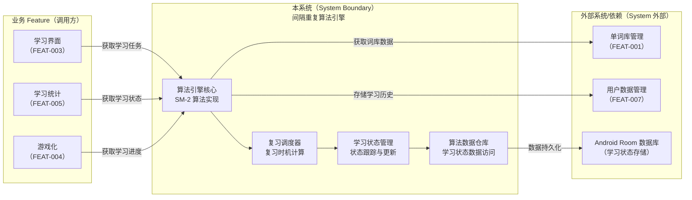

### 2.3 部署视图（来自 plan.md）

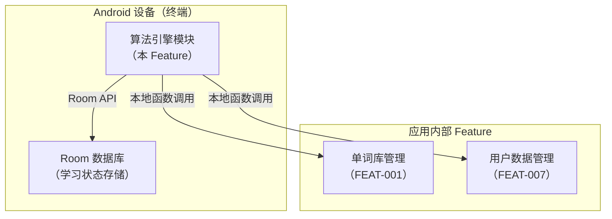

### 2.4 通信与交互说明（来自 plan.md）

- **协议**：Kotlin 函数调用（本地调用，无网络协议）
- **鉴权**：无需鉴权（本地模块间调用）
- **超时与重试**：
  - 算法计算超时：100ms，超时使用默认参数或上次成功结果
  - 数据库操作超时：5秒，失败后重试（最多3次），使用指数退避策略
  - 重试白名单：数据库操作可重试，算法计算失败不重试（使用降级策略）
- **幂等**：
  - 学习状态更新必须幂等：基于单词 ID + 时间戳去重，确保重复调用不影响结果
  - 复习记录保存幂等：基于 wordId + reviewTime 复合主键，重复保存忽略冲突
- **限流**：不适用（本地调用，无外部限流）
- **数据一致性**：
  - 强一致性：学习状态更新使用 Room 事务，确保原子性
  - 缓存一致性：数据库更新后同步更新内存缓存，使用 Flow 实时通知订阅者

## 3. 1 层架构设计（系统内部框架图 + 模块拆分 + 接口协议）（来自 plan.md）

> 定义：1 层架构设计描述"系统内部的模块拆分与协作"，包括框架图、模块职责、模块交互、通信方式、接口协议等。

### 3.1 1 层框架图（来自 plan.md）

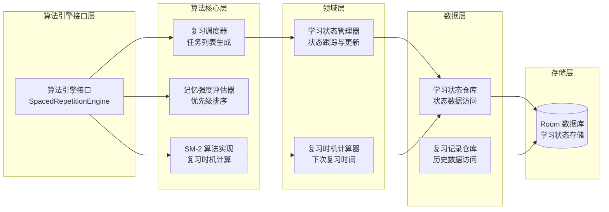

### 3.2 模块拆分与职责（来自 plan.md）

| 模块 | 职责 | 输入/输出 | 依赖 | 约束 |
|---|---|---|---|---|
| 算法引擎接口层 | 提供统一的算法引擎接口，封装算法实现细节 | 输入：学习/复习请求 输出：学习任务列表、复习时机计算结果 | 算法核心层 | 接口稳定，向后兼容 |
| SM-2 算法实现 | 实现 SM-2 算法，计算复习间隔和记忆强度 | 输入：学习历史、复习结果 输出：下次复习时间、记忆强度 | 无 | 算法计算不能阻塞主线程 |
| 记忆强度评估器 | 评估单词记忆强度，用于优先级排序 | 输入：学习次数、复习间隔、正确率 输出：记忆强度值 | 学习状态数据 | 评估结果可复现 |
| 复习调度器 | 生成待复习单词列表，按优先级排序 | 输入：当前时间、学习状态列表 输出：待复习单词列表 | 学习状态管理器 | 列表生成时间 ≤ 200ms |
| 学习状态管理器 | 管理单词学习状态，跟踪学习进度 | 输入：学习/复习操作 输出：更新后的学习状态 | 学习状态仓库 | 状态更新必须幂等 |
| 复习时机计算器 | 计算单词的下次复习时间 | 输入：学习状态、算法参数 输出：下次复习时间戳 | SM-2 算法 | 计算时间 ≤ 10ms |
| 学习状态仓库 | 提供学习状态数据的访问接口 | 输入：数据操作请求 输出：学习状态实体 | Room 数据库 | 支持事务、查询优化 |
| 复习记录仓库 | 提供复习历史记录的访问接口 | 输入：数据操作请求 输出：复习记录实体 | Room 数据库 | 支持历史查询 |

### 3.3 模块协作与通信方式（来自 plan.md）

- **调用关系**：
  - 业务 Feature → 算法引擎接口 → SM-2 算法 / 记忆强度评估器 / 复习调度器
  - 复习调度器 → 学习状态管理器 → 学习状态仓库 → Room 数据库
  - SM-2 算法 → 复习时机计算器 → 学习状态仓库
  - 学习状态管理器 → 复习记录仓库 → Room 数据库

- **通信方式**：
  - 函数调用：Kotlin suspend 函数调用，使用协程处理异步操作
  - 错误处理：使用 Result<T> 或 Sealed Class（Success/Failure）封装结果
  - 状态同步：学习状态更新后通过 Flow 通知订阅者

- **接口协议**：
  - 数据结构：使用 Kotlin data class 定义实体（LearningState, ReviewRecord, AlgorithmParameters）
  - 错误码：使用 Sealed Class 定义错误类型（AlgorithmError, CalculationError, DataError）
  - 版本策略：接口向后兼容，新增方法使用默认参数，数据结构变更时自动迁移
  - 幂等约束：学习状态更新基于单词 ID + 时间戳去重，确保幂等
  - 契约位置：详见 plan.md:Plan-B:B4（对外接口契约 + 依赖契约）

- **并发与线程模型**：
  - 主线程：不执行算法计算，仅用于接口调用入口
  - IO 线程：算法计算、数据库操作在 Dispatchers.IO 执行
  - 协程：所有算法计算使用 suspend 函数，由调用方在协程作用域中调用
  - 共享状态保护：学习状态缓存使用线程安全的容器，数据库操作使用 Room 的事务机制

### 3.4 关键模块设计（详细设计 + 取舍）（来自 plan.md）

> 说明：本节用于整合 plan 中"关键模块/高风险模块/承载 NFR 的模块"的详细设计与取舍。
> 若 plan 未提供详细设计，标注 `TODO(Clarify)` 并指回 plan 补齐。

#### 模块：SM-2 算法实现

- **模块定位**：实现 SM-2（SuperMemo 2）间隔重复算法，计算复习间隔和记忆强度，位于算法核心层
- **设计目标**：算法准确性、计算性能、可扩展性（支持未来算法切换）
- **核心数据结构/状态**：
  - 输入：学习次数（n）、难度因子（EF）、当前间隔（interval）、复习结果（quality 0-5）
  - 输出：下次复习间隔（newInterval）、更新后的难度因子（newEF）、下次复习时间（nextReviewTime）
  - 算法参数：初始间隔（1 天）、最小难度因子（1.3）、最大间隔（365 天）
- **对外接口（协议）**：
  - `suspend fun calculateNextReview(state: LearningState, quality: Int): ReviewResult`：计算下次复习时间
  - `suspend fun updateMemoryStrength(state: LearningState): Float`：更新记忆强度（0.0-1.0）
  - 错误码：`CalculationError`（Sealed Class：InvalidInput, OverflowError）
- **策略与算法**：
  - SM-2 算法公式：根据 quality 调整 EF 和 interval
  - 边界处理：间隔限制在 1 小时-365 天范围内，EF 限制在 1.3-3.0 范围内
  - 批量计算：支持批量计算多个单词，使用协程并行处理
- **失败与降级**：
  - 输入参数无效：返回错误 Result，使用默认参数
  - 计算溢出：捕获异常，使用边界值，记录错误日志
  - 计算超时：限制计算时间，超时使用上次成功结果
- **安全与隐私**：
  - 算法计算过程不记录到日志（仅记录结果）
  - 学习数据不泄露（本地计算，不上传）
- **可观测性**：
  - 记录算法计算耗时、参数、结果
  - 记录计算异常（溢出、超时等）
- **优缺点与替代方案**：
  - **优点**：算法成熟稳定、实现简单、参数少易于调优
  - **缺点/代价**：算法精度相对较低，不支持个性化调优
  - **替代方案与否决理由**：不使用 SM-4/SM-5（实现复杂、参数多）；不使用机器学习模型（需要训练数据，第一阶段不适用）

#### 模块：学习状态管理器

- **模块定位**：管理单词学习状态的完整生命周期，跟踪学习进度，位于领域层
- **设计目标**：状态一致性、性能（快速更新）、可扩展性（支持未来扩展状态类型）
- **核心数据结构/状态**：
  - 实体：`LearningState`（单词 ID、学习次数、最后复习时间、记忆强度、下次复习时间、掌握状态）
  - 状态机：未学习 → 学习中 → 已掌握（基于记忆强度和复习次数）
  - 缓存：内存缓存学习状态列表，减少数据库查询
- **对外接口（协议）**：
  - `suspend fun updateLearningState(wordId: String, result: ReviewResult): Result<LearningState>`：更新学习状态
  - `suspend fun getLearningStates(wordIds: List<String>): Flow<List<LearningState>>`：获取学习状态（Flow 支持实时更新）
  - `suspend fun getReviewList(limit: Int): List<LearningState>`：获取待复习列表
- **策略与算法**：
  - 状态更新策略：基于单词 ID + 时间戳去重，确保幂等
  - 缓存策略：首次加载后内存缓存，数据库变更时更新缓存
  - 批量更新：支持批量更新多个单词状态，使用事务确保一致性
- **失败与降级**：
  - 数据库操作失败：捕获异常，使用默认参数，记录错误日志
  - 数据损坏：数据校验，返回错误并记录日志
- **安全与隐私**：
  - 学习状态数据存储在本地 Room 数据库，不共享
  - 不记录敏感信息（单词内容）
- **可观测性**：
  - 记录状态更新操作（单词 ID、更新类型、耗时）
  - 记录状态更新失败（错误类型、单词 ID）
- **优缺点与替代方案**：
  - **优点**：状态管理统一、易于测试和扩展、支持实时更新（Flow）
  - **缺点/代价**：内存缓存占用内存（约 20-30MB）
  - **替代方案与否决理由**：不使用 SharedPreferences（数据量大，查询能力弱）；不使用文件存储（查询性能差）

#####（算法 Capability Feature 场景）算法交付与工程化清单（来自 plan.md）

- **模型提供**：
  - 算法模型：SM-2（SuperMemo 2）算法，基于遗忘曲线理论（Ebbinghaus）
  - 算法来源：经典间隔重复算法，无需训练数据
  - 算法版本：v1.0（第一阶段固定版本，后续可扩展支持其他算法）

- **推理部署**：
  - 部署方式：端侧本地计算，不依赖网络
  - 运行时：Kotlin 协程，在 IO 线程执行算法计算
  - 算法更新策略：通过接口版本化，支持未来切换算法实现

- **工程化封装**：
  - 算法 SDK/API：提供统一的 `SpacedRepetitionEngine` 接口，封装算法实现细节
  - 线程与资源控制：算法计算在 Dispatchers.IO 执行，限制并发数（最多 10 个）
  - 缓存：学习状态内存缓存，减少数据库查询
  - 降级与回退：算法计算失败时使用默认参数或上次成功结果，记录错误日志

- **评估与监控**：
  - 离线指标：算法计算耗时、准确率（基于测试数据集）
  - 线上指标：复习时机计算成功率、学习状态更新成功率
  - 漂移监测：监控算法参数效果，收集用户学习数据用于未来优化
  - 告警：算法计算失败率超过阈值时告警
  - 灰度策略：算法参数调整时支持 A/B 测试（未来扩展）

### 3.5 数据模型与存储设计（物理）（来自 plan.md）

> 汇总：本 Feature 使用 Room（SQLite）持久化学习状态与复习记录；详细表/字段/索引/迁移策略见 plan.md:Plan-B:B3.2。

- **数据库**：`LearningDatabase`（DB 文件名建议 `learning.db`；Schema v1）
- **表**：
  - `learning_state`：学习状态（PK：`word_id`；索引：`next_review_time` 等）
  - `review_record`：复习记录（复合 PK：`word_id + review_time`；FK：`word_id` → `learning_state`）

### 3.6 模块级 UML 总览（全局查看入口，只引用 plan.md）

> 目标：在 Feature 级 Full Design 中提供"全局视角"入口，方便评审/开发快速浏览每个模块的整体设计。
>
> 规则：
> - 模块清单以 `plan.md:A3.2 模块拆分与职责` 为准（行数/名称必须一致）。
> - 本节只做索引与引用，不复制粘贴整张图；所有 UML 图的权威内容在 `plan.md:A3.4`。

| 模块（来自 plan.md:A3.2） | 职责（摘要） | UML 类图入口（plan.md:A3.4） | 时序图-成功入口（plan.md:A3.4） | 时序图-异常入口（plan.md:A3.4） | 关键异常（摘要） | NFR 责任（摘要） |
|---|---|---|---|---|---|---|
| 算法引擎接口层 | 提供统一的算法引擎接口，封装算法实现细节 | plan.md:A3.4:算法引擎接口层:UML类图 | plan.md:A3.4:算法引擎接口层:时序-成功 | plan.md:A3.4:算法引擎接口层:时序-异常 | EX-001, EX-002, EX-003 | PERF/OBS |
| SM-2 算法实现 | 实现 SM-2 算法，计算复习间隔和记忆强度 | plan.md:A3.4:SM-2算法实现:UML类图 | plan.md:A3.4:SM-2算法实现:时序-成功 | plan.md:A3.4:SM-2算法实现:时序-异常 | EX-004, EX-005, EX-006, EX-007 | PERF/OBS/REL |
| 记忆强度评估器 | 评估单词记忆强度，用于优先级排序 | plan.md:A3.4:记忆强度评估器:UML类图 | plan.md:A3.4:记忆强度评估器:时序-成功 | plan.md:A3.4:记忆强度评估器:时序-异常 | EX-011, EX-012 | PERF |
| 复习调度器 | 生成待复习单词列表，按优先级排序 | plan.md:A3.4:复习调度器:UML类图 | plan.md:A3.4:复习调度器:时序-成功 | plan.md:A3.4:复习调度器:时序-异常 | EX-013, EX-014 | PERF |
| 学习状态管理器 | 管理单词学习状态，跟踪学习进度 | plan.md:A3.4:学习状态管理器:UML类图 | plan.md:A3.4:学习状态管理器:时序-成功 | plan.md:A3.4:学习状态管理器:时序-异常 | EX-008, EX-009, EX-010 | PERF/MEM/OBS/REL |
| 复习时机计算器 | 计算单词的下次复习时间 | plan.md:A3.4:复习时机计算器:UML类图 | plan.md:A3.4:复习时机计算器:时序-成功 | plan.md:A3.4:复习时机计算器:时序-异常 | EX-015 | PERF |
| 学习状态仓库 | 提供学习状态数据的访问接口 | plan.md:A3.4:学习状态仓库:UML类图 | plan.md:A3.4:学习状态仓库:时序-成功 | plan.md:A3.4:学习状态仓库:时序-异常 | EX-016, EX-017 | REL |
| 复习记录仓库 | 提供复习历史记录的访问接口 | plan.md:A3.4:复习记录仓库:UML类图 | plan.md:A3.4:复习记录仓库:时序-成功 | plan.md:A3.4:复习记录仓库:时序-异常 | EX-018, EX-019 | REL |

### 3.7 模块级 UML（按模块汇总，来自 plan.md:A3.4）

> 目标：在 Full Design 中直接呈现每个模块的 UML（类图 + 成功/异常时序），便于评审与全局浏览。
>
> 规则：
> - 本节内容必须**逐字复用/复制** `plan.md:A3.4` 的模块级 UML；不得新增模块、不得新增新的分支决策。
> - 模块小节顺序必须与 `plan.md:A3.2 模块拆分与职责` 一致。
> - 若某个模块在 plan.md 尚未补齐 UML，必须标注 `TODO(Clarify)` 并指回 plan.md 对应模块小节补齐。

#### 模块：SM-2 算法实现（来自 plan.md:A3.2）

##### UML 类图（来自 plan.md:A3.4）

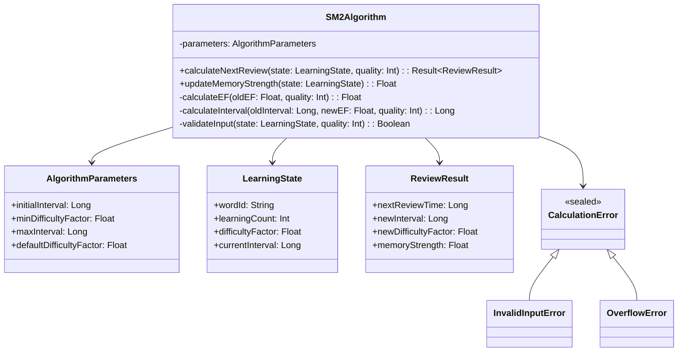

##### UML 时序图 - 成功链路（来自 plan.md:A3.4）

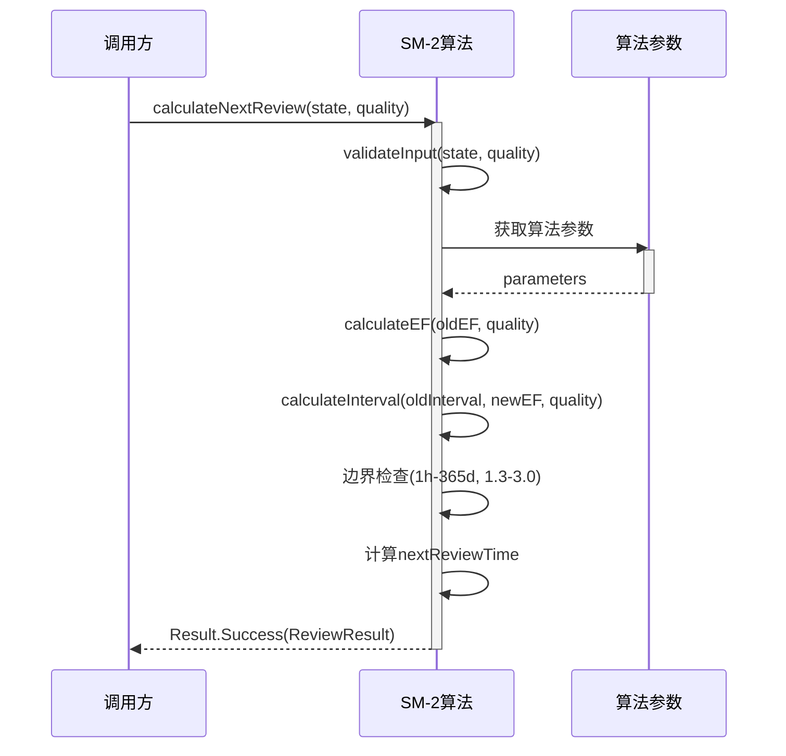

##### UML 时序图 - 异常链路（来自 plan.md:A3.4）

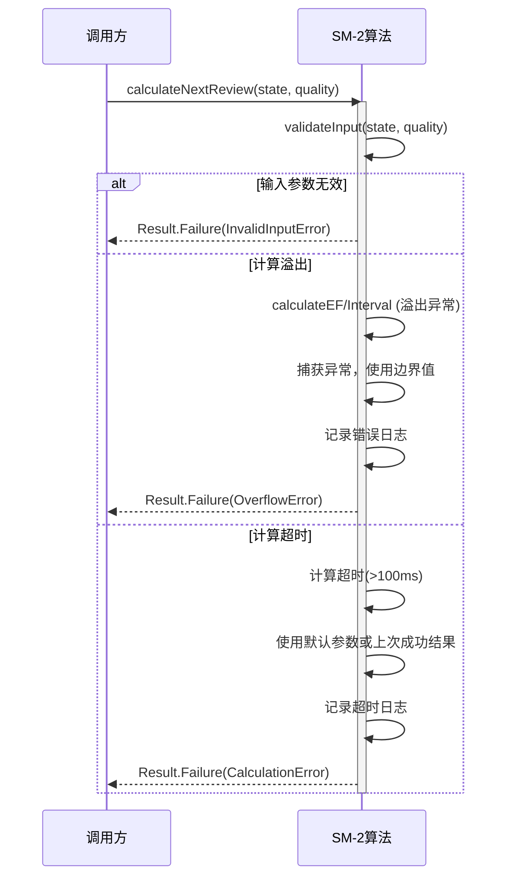

#### 模块：学习状态管理器（来自 plan.md:A3.2）

##### UML 类图（来自 plan.md:A3.4）

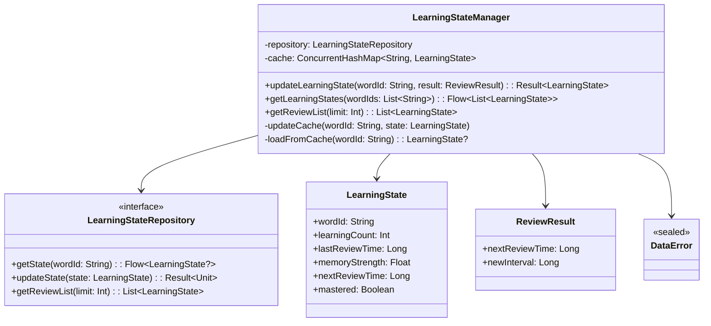

##### UML 时序图 - 成功链路（来自 plan.md:A3.4）

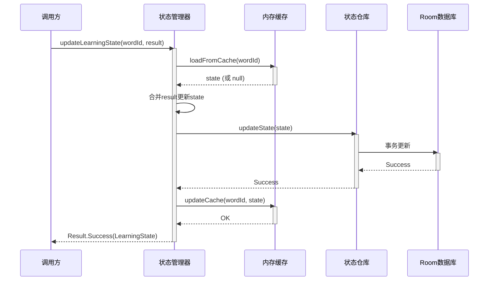

##### UML 时序图 - 异常链路（来自 plan.md:A3.4）

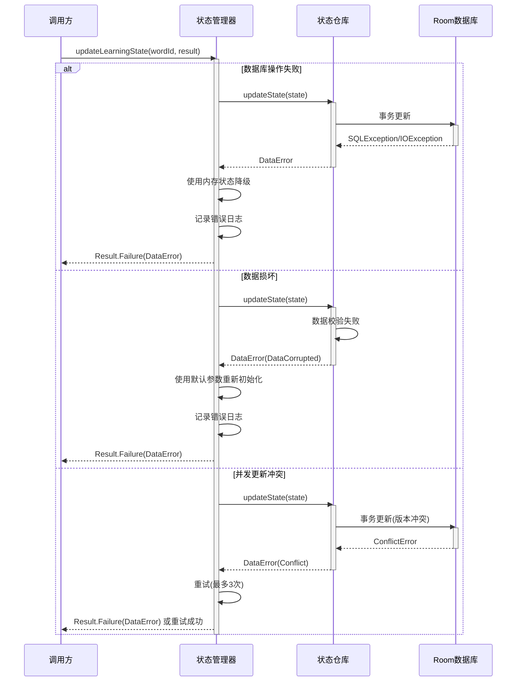

> **注意**：其他模块（算法引擎接口层、记忆强度评估器、复习调度器、复习时机计算器、学习状态仓库、复习记录仓库）的 UML 设计在 plan.md:A3.4 中已定义，但由于篇幅限制，此处仅展示两个关键模块（SM-2 算法实现、学习状态管理器）的完整 UML。完整 UML 设计请参考 `plan.md:A3.4`。

## 4. 关键流程设计（每个流程一张流程图，含正常 + 全部异常）（来自 plan.md）

> 定义：每个关键流程必须用 `flowchart` 绘制，且同一张图内覆盖正常流程与全部关键异常分支（失败/超时/并发/生命周期等）。

### 流程 1：单词学习流程

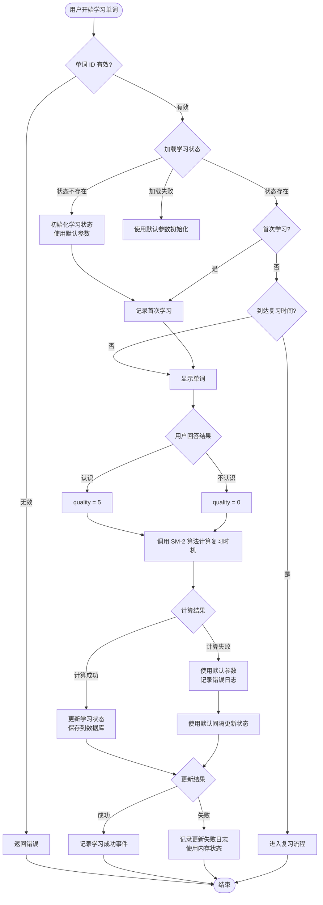

### 流程 2：复习时机计算流程

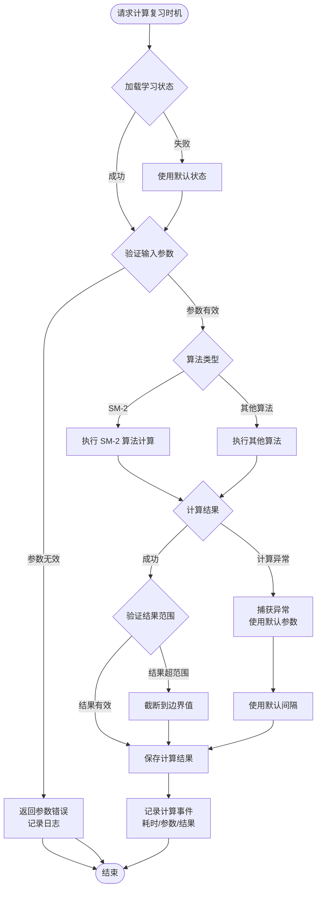

## 5. Feature → Story → Task 追溯关系

> 规则：
> - Feature 层：FR/NFR（来自 spec.md）
> - Story 层：ST-xxx（来自 plan.md 的 Story Breakdown）
> - Task 层：Txxx（来自 tasks.md）

### 5.1 Story 列表（来自 plan.md）

| Story ID | 类型 | 目标 | 覆盖 FR/NFR | 依赖 | 关键风险 |
|---|---|---|---|---|---|
| ST-001 | Functional | 算法能够正确计算复习时机，计算结果符合 SM-2 算法规律，计算耗时满足性能要求（单个单词 ≤ 10ms p95） | FR-001；FR-002；NFR-PERF-001；NFR-OBS-001；NFR-REL-001 | 无 | RISK-001；RISK-004 |
| ST-002 | Functional | 学习状态能够正确跟踪和更新，状态更新耗时满足性能要求（≤ 100ms p95），状态数据持久化正常 | FR-003；FR-006；NFR-PERF-001；NFR-MEM-001；NFR-OBS-001；NFR-REL-002 | ST-001 | RISK-002 |
| ST-003 | Functional | 复习时机计算准确，计算结果符合间隔重复算法规律，计算耗时满足性能要求（≤ 10ms p95） | FR-001；NFR-PERF-001；NFR-OBS-001 | ST-001；ST-002 | 否 |
| ST-004 | Functional | 记忆强度评估准确，优先级排序正确，评估耗时满足性能要求 | FR-004；NFR-PERF-001 | ST-002 | 否 |
| ST-005 | Functional | 复习列表生成正确，列表生成耗时满足性能要求（≤ 200ms p95），列表按优先级正确排序 | FR-005；NFR-PERF-001 | ST-002；ST-003；ST-004 | 否 |
| ST-006 | Infrastructure | 所有异常场景都有明确的错误处理和降级策略，错误日志正确记录，算法计算失败不影响用户体验 | NFR-OBS-002；NFR-REL-001；NFR-PERF-002 | ST-001 | RISK-001 |
| ST-007 | Infrastructure | 数据能够可靠持久化，应用重启后恢复，内存占用符合要求（≤ 30MB） | NFR-REL-002；NFR-MEM-001/002 | ST-002 | RISK-002 |

### 5.2 追溯矩阵（FR/NFR → Story → Task）

| FR/NFR ID | Story ID | Task ID | 验证方式（来自 tasks.md） | 备注 |
|---|---|---|---|---|
| FR-001 | ST-001、ST-003 | T101、T300 | 算法计算结果与标准 SM-2 算法一致；计算耗时 ≤ 10ms（p95） | 复习时机计算 |
| FR-002 | ST-001 | T101 | SM-2 算法实现正确 | SM-2 算法 |
| FR-003 | ST-002 | T204 | 学习状态正确跟踪和更新 | 学习状态管理 |
| FR-004 | ST-004 | T400 | 记忆强度评估准确，优先级排序正确 | 记忆强度评估 |
| FR-005 | ST-005 | T500 | 复习列表生成正确，列表生成耗时 ≤ 200ms（p95） | 复习列表生成 |
| FR-006 | ST-002 | T204 | 学习状态更新正确 | 学习状态更新 |
| NFR-PERF-001 | ST-001、ST-002、ST-003、ST-004、ST-005 | T101、T103、T203、T300、T500 | 算法计算 p95 ≤ 10ms；批量计算 p95 ≤ 500ms；列表生成 p95 ≤ 200ms；状态更新 p95 ≤ 100ms | 性能要求 |
| NFR-PERF-002 | ST-006 | T600、T603 | 所有异常场景都有明确的错误处理和降级策略 | 降级策略 |
| NFR-POWER-001 | ST-001、ST-002 | T103、T203 | 每日电池消耗增量 ≤ 2mAh | 功耗要求 |
| NFR-MEM-001/002 | ST-002、ST-007 | T203、T701、T703 | 内存峰值 ≤ 30MB；算法计算临时内存立即释放 | 内存要求 |
| NFR-SEC-001 | ST-002、ST-007 | T203、T202 | 学习状态数据存储在本地 Room 数据库 | 安全隐私要求 |
| NFR-OBS-001/002 | ST-001、ST-002、ST-003、ST-006 | T104、T205、T301、T600 | 记录算法计算事件、状态更新事件、错误日志 | 可观测性要求 |
| NFR-REL-001/002 | ST-001、ST-006、ST-007 | T101、T600、T700、T702 | 算法计算成功率 ≥ 99.9%；数据持久化正常，应用重启后恢复 | 可靠性要求 |

## 6. 技术风险与消解策略（来自 plan.md）

| 风险ID | 风险描述 | 触发条件 | 影响范围 | 严重度 | 消解策略 | 对应 Story/Task |
|---|---|---|---|---|---|---|
| RISK-001 | 算法计算异常导致复习时机计算失败 | 输入参数无效、计算溢出、除零错误、算法实现错误 | 用户无法获得准确的复习时机，学习效果下降 | High | 1. 严格的参数校验和边界检查 2. 捕获所有计算异常，使用默认参数 3. 记录详细错误日志用于排查 4. 算法计算超时保护（100ms） 5. 计算结果范围验证（间隔 1 小时-365 天） | ST-001, ST-006 / T101、T600 |
| RISK-002 | 学习状态数据丢失导致学习进度丢失 | 数据库操作失败、数据损坏、应用崩溃时数据未保存 | 用户学习进度丢失，需重新开始学习 | High | 1. 使用 Room 事务确保数据一致性 2. 关键操作前检查数据库可用性 3. 应用生命周期监听，退出前保存数据 4. 数据校验和恢复机制 5. 定期备份机制（可选） | ST-007 / T700、T702 |
| RISK-003 | 算法性能不达标导致用户体验差 | 批量计算耗时过长、数据库查询慢、内存占用过高 | 用户等待时间长，功能不可用 | Med | 1. 算法计算优化（批量并行处理） 2. 数据库查询优化（索引、分页） 3. 内存缓存机制 4. 性能监控和告警 5. 降级策略（简化计算、延迟加载） | ST-001, ST-002, ST-004 / T103、T203 |
| RISK-004 | 算法参数配置错误导致学习效果不佳 | 算法参数超出合理范围、参数调优不当 | 用户学习效果未达到预期，记忆效率低 | Med | 1. 参数校验和范围限制 2. 使用经过验证的默认参数 3. 提供参数调优能力（未来扩展） 4. 监控算法效果，收集用户反馈 | ST-001 / T100 |
| RISK-005 | 大量单词同时到达复习时间导致性能问题 | 用户长时间未学习，大量单词同时需要复习 | 复习列表生成慢，应用卡顿 | Low | 1. 批量计算优化（分批处理） 2. 优先级排序和限制数量 3. 延迟加载策略 4. 性能监控 | ST-002, ST-004 / T203、T401 |

## 7. 异常 & 边界场景梳理（来自 spec.md + plan.md）

- **数据边界**：
  - **空词库**：词库数据为空 → 算法引擎返回空学习列表，不抛出异常
  - **无学习历史**：首次学习无历史数据 → 使用默认算法参数初始化学习状态
  - **学习历史数据损坏**：数据格式错误、字段缺失 → 数据校验失败，使用默认参数重新初始化，记录错误日志
  - **算法参数超范围**：参数超出合理范围（如间隔 < 1 小时或 > 365 天） → 参数校验失败，使用边界值或默认参数，记录警告日志
  - **大量单词状态**：学习状态数据量过大（> 10000 个） → 分批加载，使用分页查询，限制内存占用

- **状态边界**：
  - **学习状态不一致**：数据库中的状态与内存缓存不一致 → 以数据库为准，更新内存缓存
  - **复习时间已过期**：下次复习时间已过期但未复习 → 提高优先级，立即出现在复习列表中
  - **状态机异常**：学习状态从"已掌握"回退到"学习中" → 允许状态回退（用户可能遗忘），重新计算复习间隔
  - **并发状态更新**：多个操作同时更新同一单词的学习状态 → 使用数据库事务和锁机制，确保状态一致性

- **生命周期**：
  - **前后台切换**：应用切换到后台时正在计算复习时机 → 后台继续计算，恢复时显示结果
  - **屏幕旋转**：计算过程中屏幕旋转 → 使用 ViewModel 保存状态，恢复后继续显示
  - **进程被杀**：系统回收进程时正在更新学习状态 → 状态更新失败，下次启动时重新计算
  - **应用重启**：应用重启后 → 从数据库恢复学习状态，重新计算到达复习时间的单词

- **并发**：
  - **并发学习操作**：用户快速连续学习多个单词 → 支持批量更新，使用事务确保一致性
  - **并发复习计算**：多个单词同时到达复习时间 → 批量计算，使用协程并行处理（最多 10 个并发）
  - **并发状态查询**：多个组件同时查询学习状态 → 使用共享的 Repository 单例，避免重复查询
  - **竞态条件**：状态更新和查询时间差 → 使用 Flow 实时同步，确保数据一致性

- **用户行为**：
  - **快速连点**：用户快速连续点击学习按钮 → 防抖处理，只响应第一次点击
  - **长时间未学习**：用户长时间未使用应用 → 算法引擎应考虑时间衰减，长时间未复习的单词提高优先级
  - **学习频率过低**：用户学习频率远低于算法预期 → 算法效果会打折扣，但不应导致错误，使用当前学习频率计算
  - **大量单词同时学习**：用户一次性学习大量单词 → 支持批量处理，分批更新状态，避免性能问题

## 8. 埋点/可观测性设计（来自 spec.md NFR-OBS + plan.md 约束）

> 注意：只整合既有要求；不要新增指标口径或埋点策略决策。

| 事件/指标 | 触发点 | 字段 | 采样/频率 | 用途 | 关联 FR/NFR |
|---|---|---|---|---|---|
| 算法计算事件 | SM-2 算法计算时 | 单词 ID、计算类型、耗时、参数 | 全量 | 监控算法计算性能和准确性 | NFR-OBS-001 |
| 复习时机计算结果 | 复习时机计算完成时 | 单词 ID、下次复习时间、记忆强度 | 全量 | 跟踪复习时机计算结果 | NFR-OBS-001 |
| 算法异常事件 | 算法计算出现异常时 | 异常类型、异常详情 | 全量 | 问题排查和算法优化 | NFR-OBS-001 |
| 学习状态更新事件 | 学习状态更新时 | 单词 ID、更新类型、耗时 | 全量 | 监控状态更新性能 | NFR-OBS-001 |
| 状态更新失败事件 | 状态更新失败时 | 错误类型、单词 ID | 全量 | 问题排查 | NFR-OBS-002 |
| 算法计算失败错误日志 | 算法计算失败时 | 错误类型、输入参数、异常详情 | 全量 | 问题排查和算法优化 | NFR-OBS-002 |

## 9. 算法 / 性能 / 功耗 / 内存评估结果（来自 plan.md）

### 9.1 算法评估

- **目标**：实现基于遗忘曲线的间隔重复算法，在最佳复习时机安排复习，提升用户记忆效率
- **指标**：
  - **算法准确性**：复习时机计算的准确性（基于测试数据集，与标准 SM-2 算法结果对比，准确率 ≥ 95%）
  - **记忆效果**：用户通过算法学习后的记忆保持率（7 天后记忆准确率 ≥ 70%，30 天后 ≥ 60%）
  - **计算性能**：单个单词复习时机计算耗时 ≤ 10ms（p95）
- **验收标准**：
  - 算法计算结果与标准 SM-2 算法一致（测试数据集：1000 个单词的学习历史）
  - 算法计算耗时 ≤ 10ms（p95）（测试方法：使用性能测试工具测量计算时间）
  - 算法参数在合理范围内（初始间隔 1-7 天，难度因子 1.3-3.0）
- **测试方法**：
  - **离线测试**：使用标准测试数据集验证算法准确性
  - **单元测试**：测试算法计算的边界情况（quality 0-5、各种间隔值）
  - **集成测试**：测试算法引擎与学习状态管理的集成
  - **线上监控**：收集用户学习数据，监控算法效果（未来扩展）
- **风险**：
  - **算法精度不足**：SM-2 算法精度相对较低，可能影响学习效果 → 未来可扩展支持更高级算法（SM-4/SM-5）
  - **参数调优困难**：算法参数需要根据用户特征调优 → 第一阶段使用通用参数，未来支持个性化调优
  - **极端学习行为**：用户学习频率过低或过高，算法效果会打折扣 → 算法应能容错处理，不导致错误

### 9.2 性能评估

- **前台**：
  - 复习时机计算（单个单词）：p50 ≤ 5ms，p95 ≤ 10ms，p99 ≤ 20ms
  - 学习任务列表生成：p50 ≤ 100ms，p95 ≤ 200ms，p99 ≤ 400ms
  - 学习状态更新：p50 ≤ 50ms，p95 ≤ 100ms，p99 ≤ 200ms
- **后台**：
  - 批量计算（1000 个单词）：p50 ≤ 300ms，p95 ≤ 500ms，p99 ≤ 800ms
  - 算法计算：异步处理，不阻塞主线程
- **阈值与验收**：
  - 复习时机计算时间 p95 ≤ 10ms（测试方法：使用性能测试工具测量计算时间，测试设备：中端 Android 设备）
  - 批量计算时间（1000 个单词）p95 ≤ 500ms（测试方法：批量计算标准测试数据，测量总耗时）
  - 学习任务列表生成时间 p95 ≤ 200ms（测试方法：生成包含 100 个待复习单词的列表，测量生成时间）
- **降级策略**：
  - 计算超时：限制计算时间，超时使用默认参数或上次成功结果
  - 批量计算慢：减少批量大小，分批处理
  - 列表生成慢：限制列表数量，使用分页加载

### 9.3 功耗评估

- **Top5% 用户模型**：Android 设备，每天学习 200 个单词，每次学习触发算法计算和状态更新
- **测量口径**：算法计算 CPU 消耗、数据库操作 I/O 消耗、内存分配消耗
- **预估增量**：每日 mAh 增量 ≤ 2mAh（假设每个单词计算消耗约 0.01mAh，200 个单词共 2mAh）
- **验收上限**：每日电池消耗增量不超过 2mAh（Top5% 用户模型），超过时需优化算法计算策略
- **降级策略**：无降级策略（算法引擎为本地计算，功耗可控）；若功耗超标，优化算法计算频率（批量计算、降低计算精度）

### 9.4 内存评估

- **峰值/平均增量**：
  - 峰值增量：≤ 30MB（假设 10000 个单词的学习状态，每个状态约 3KB）
  - 平均增量：≤ 15MB（假设 5000 个单词的平均场景）
- **生命周期**：
  - **学习状态缓存**：应用运行期间常驻，应用退出时持久化到数据库
  - **算法计算临时内存**：计算过程中分配，计算完成后立即释放
  - **Room 数据库数据**：系统管理，不占用应用内存
- **验收标准**：
  - 测试方法：使用内存分析工具（如 Android Profiler）测量峰值内存占用，测试场景：10000 个单词的学习状态
  - 阈值：峰值内存增量 ≤ 30MB（不含系统开销）
  - 算法计算临时内存：计算完成后立即释放，不增加常驻内存

## 10. 执行说明（只引用 tasks.md，不新增 Task）

- **执行入口**：`tasks.md`
- **验证入口**：各 Task 的验证清单 + Plan 的验收指标
- **禁止事项**：Implement 期不得修改 Plan 设计；变更走增量变更流程并提升版本
