# Plan（工程级蓝图）：间隔重复学习算法引擎

**Epic**：EPIC-001 - 无痛记忆单词神器APP
**Feature ID**：FEAT-002
**Feature Version**：v0.1.0（来自 `spec.md`）
**Plan Version**：v0.1.0
**当前工作分支**：`epic/EPIC-001-word-memory-app`
**Feature 目录**：`specs/epics/EPIC-001-word-memory-app/features/FEAT-002-spaced-repetition-algorithm/`
**日期**：2026-01-22
**输入**：来自 `Feature 目录/spec.md`

> 规则：
> - Plan 阶段必须包含工程决策、风险评估、算法/功耗/性能/内存评估（量化 + 验收指标）。
> - Implement 阶段**不得**擅自改写 Plan 的技术决策；若必须变更，走增量变更流程并提升 Version。

## 变更记录（增量变更）

| 版本 | 日期 | 变更范围（Feature/Story/Task） | 变更摘要 | 影响模块 | 是否需要回滚设计 |
|---|---|---|---|---|---|
| v0.1.0 | 2026-01-22 | Feature | 初始版本：创建 Plan 工程级蓝图，完成技术选型、架构设计和 Story 拆分 |  | 否 |

## 概述

**核心需求**：实现基于遗忘曲线的间隔重复学习算法引擎，支持复习时机计算、学习状态管理和记忆强度评估，为学习功能提供核心算法能力。

**关键工程决策**：
1. **算法选型**：使用 SM-2（SuperMemo 2）算法作为核心算法，成熟稳定，易于实现和调优
2. **学习状态存储**：使用 Room 数据库存储学习状态和复习记录，支持复杂查询和事务
3. **算法计算**：本地计算，不依赖网络，使用协程异步执行，避免阻塞主线程
4. **接口设计**：提供统一的算法引擎接口，封装算法实现细节，便于业务 Feature 接入

## Plan-A：工程决策 & 风险评估（必须量化）

### A0. 领域概念（Domain Concepts / Glossary，必须）

> **目的**：统一命名与语义口径，成为后续“架构图/流程图/类图/时序图/接口契约”的**命名权威**。
>
> 要求：
> - 只写本 Feature 涉及或新引入的领域概念；已有概念可引用来源（其他 Feature/EPIC/已有模块文档）
> - 每个概念必须给出：名称、定义、关键属性/状态、与其他概念的关系（可用表格或简易概念图）

#### A0.1 领域概念词汇表（必须）

| 概念（中文） | 名称（英文/代码名） | 定义（一句话） | 关键属性/状态（Top3） | 不变量/约束 | 关联概念 |
|---|---|---|---|---|---|
| 学习状态 | LearningState | 表示一个单词的学习进度和记忆状态 | wordId（单词ID）、nextReviewAt（下次复习时间）、memoryStrength（记忆强度） | wordId 唯一；nextReviewAt >= 当前时间；memoryStrength 范围 0.0-1.0 | 复习记录（一对多） |
| 复习记录 | ReviewRecord | 记录一次复习操作的结果和历史 | wordId（单词ID）、reviewedAt（复习时间）、quality（复习质量） | quality 范围 0-5（SM-2 标准）；reviewedAt <= 当前时间 | 学习状态（多对一） |
| 复习时机 | ReviewTiming | 根据算法计算出的下次复习时间点 | nextReviewAt（下次复习时间戳）、intervalDays（复习间隔天数） | nextReviewAt >= 当前时间；intervalDays >= 1 且 <= 365 | 学习状态（一对一） |
| 记忆强度 | MemoryStrength | 评估单词在用户记忆中的牢固程度 | strength（强度值，0.0-1.0）、lastReviewedAt（最后复习时间） | strength 范围 0.0-1.0；值越大表示记忆越牢固 | 学习状态（一对一） |
| 算法参数 | AlgorithmParameters | SM-2 算法的配置参数 | initialIntervalDays（初始间隔）、minEaseFactor（最小难度因子）、maxIntervalDays（最大间隔） | initialIntervalDays >= 1；minEaseFactor >= 1.3；maxIntervalDays <= 365 | SM-2 算法（一对多） |
| 复习质量 | ReviewQuality | 用户对单词复习结果的评分 | quality（质量值，0-5） | quality 范围 0-5（SM-2 标准：0=完全忘记，5=完全记住） | 复习记录（一对一） |
| 学习任务 | LearningTask | 需要用户学习或复习的单词任务 | wordId（单词ID）、dueAt（到期时间）、priorityScore（优先级评分） | dueAt <= 当前时间表示已到期；priorityScore 越大优先级越高 | 学习状态（一对一） |
| 间隔重复算法 | SpacedRepetitionAlgorithm | 基于遗忘曲线的科学记忆方法，在最佳时机安排复习 | algorithmType（算法类型，如 SM-2）、parameters（算法参数） | 算法计算必须可复现；计算结果符合遗忘曲线规律 | 学习状态（多对一） |

#### A0.2 概念关系图（推荐，可选）

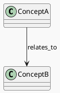

### A1. 技术选型（候选方案对比 + 决策理由）

| 决策点 | 候选方案 | 优缺点 | 约束/风险 | 决策 | 决策理由 |
|---|---|---|---|---|---|
| 间隔重复算法 | A: SM-2（SuperMemo 2）<br>B: SM-4/SM-5<br>C: Anki 算法<br>D: 自定义算法 | A: 成熟稳定、实现简单、参数少，但精度相对较低<br>B: 精度更高，但实现复杂、参数多<br>C: 开源成熟，但算法细节复杂<br>D: 完全可控，但需要大量测试和调优 | 第一阶段需要快速实现，算法精度要求适中，易于理解和调优 | A: SM-2 算法 | SM-2 算法成熟稳定，实现简单，参数少易于调优，满足第一阶段需求 |
| 学习状态存储 | A: Room 数据库<br>B: SharedPreferences<br>C: 文件存储（JSON） | A: 类型安全、查询方便、支持事务，但增加依赖<br>B: 简单轻量，但查询能力弱、不适合复杂数据<br>C: 灵活，但查询性能差、无事务支持 | 学习状态数据量大（10000 个单词），需要复杂查询和事务支持 | A: Room 数据库 | 学习状态数据量大且需要复杂查询（按复习时间、记忆强度排序），Room 提供类型安全和查询能力 |
| 算法计算方式 | A: 同步计算（主线程）<br>B: 异步计算（协程）<br>C: 后台服务计算 | A: 简单，但阻塞主线程<br>B: 不阻塞主线程、易于管理，但需要协程管理<br>C: 独立进程，但复杂度高 | 性能要求：单个单词计算 ≤ 10ms，不能阻塞主线程 | B: 异步计算（协程） | 使用协程在 IO 线程执行算法计算，不阻塞主线程，满足性能要求 |
| 算法引擎接口 | A: 函数式接口（suspend 函数）<br>B: 回调式接口<br>C: 事件驱动接口 | A: 简洁、类型安全、易于测试，符合 Kotlin 协程规范<br>B: 灵活，但回调地狱、难以测试<br>C: 解耦，但复杂度高 | 需要与业务 Feature 集成，接口应简洁易用 | A: 函数式接口（suspend 函数） | 符合 Kotlin 协程规范，类型安全，易于测试和集成 |

### A2. Feature 全景架构（0 层框架图：边界 + 外部依赖）

> **目的**：一张图展示本 Feature 的全貌——它在系统中的位置、与外部的关系、内部的核心组件。
>
> 要求：
> - 明确 Feature 边界：哪些是本 Feature 新增/修改的，哪些是复用已有的
> - 明确外部依赖的**故障模式**与应对策略
> - 无论 Feature 大小，都必须产出全景图（小 Feature 图更简单，但不能省略）

#### A2.1 Feature 全景架构图（必须）

> 一张图展示：Feature 边界、内部核心组件、外部依赖、数据/控制流向

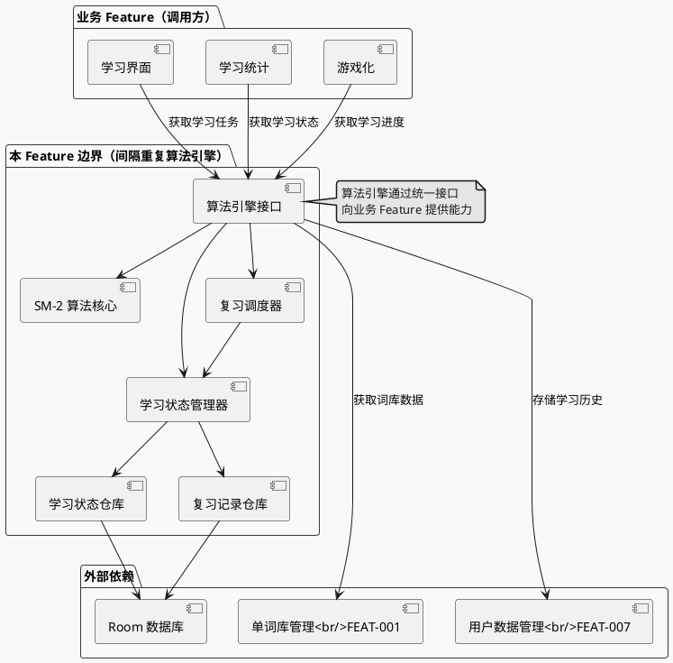

#### A2.1.1 架构设计说明（必须：理由/决策/思考）

> 用文字把“为什么这样画”说清楚，便于评审与后续实现期不走样。

- **边界与职责**：
  - 本 Feature 负责间隔重复算法的实现、学习状态管理和复习调度，是 Platform-Capability Feature
  - 算法引擎通过统一接口向业务 Feature 提供能力，业务 Feature 不关心算法实现细节
  - 明确不做：机器学习模型训练、个性化算法调优（第一阶段）、算法可视化展示
- **分层与依赖方向**：
  - API 层（算法引擎接口）→ Core 层（算法实现）→ Domain 层（状态管理）→ Data 层（数据访问）→ Storage 层（Room 数据库）
  - 禁止业务 Feature 直接访问 Data 层，必须通过算法引擎接口
- **关键数据流**：
  - 学习状态数据：System of Record 是 Room 数据库，内存缓存用于性能优化
  - 词库数据：从 FEAT-001 获取，只读访问
  - 学习历史：通过 FEAT-007 存储，算法引擎负责计算和更新
- **外部依赖策略**：
  - 词库数据缺失：返回空列表，记录错误日志，不阻塞算法计算
  - 学习历史数据损坏：容错处理，使用默认参数重新初始化，记录错误日志
  - 数据库操作失败：捕获异常，使用默认参数或降级策略，记录错误日志
- **可演进性**：
  - 算法接口支持版本化，未来可扩展支持其他算法（SM-4/SM-5）
  - 算法参数可配置，支持未来个性化调优
  - 数据模型支持迁移，Room 数据库版本管理

#### A2.2 外部依赖清单（必须）

| 依赖项 | 类型 | 提供方（团队名称） | 提供的能力 | 通信方式 | 故障模式 | 我方策略 |
|--------|------|------------------|-----------|----------|----------|----------|
| 单词库管理（FEAT-001） | 内部 Feature | 本团队 | 词库数据、单词列表 | Kotlin 函数调用（Repository 接口） | 词库数据缺失、数据格式错误 | 返回空列表，记录错误日志 |
| 用户账户与数据管理（FEAT-007） | 内部 Feature | 本团队 | 学习历史数据存储和查询 | Kotlin 函数调用（Repository 接口） | 数据库不可用、数据损坏 | 使用默认参数，容错处理，记录错误日志 |
| Android Room 数据库 | 设备能力 | Android 系统 | 学习状态数据存储 | 系统 API | 数据库操作失败、存储空间不足 | 捕获异常，使用默认参数，记录错误日志 |

#### A2.3 通信与交互约束（必须）

- **协议**：Kotlin 函数调用（本地调用，无网络）
- **超时与重试**：
  - 算法计算超时：100ms，超时使用默认参数
  - 数据库操作：Room 自动重试机制，失败时使用默认参数
  - 无网络请求，无需退避策略
- **错误处理**：
  - 统一错误类型：Sealed Class（SrsError：InvalidInput、CalculationOverflow、DbReadFailed、DbWriteFailed、DataCorrupted、Cancelled、Unknown）
  - 用户提示策略：算法计算失败不直接提示用户，返回空列表或默认结果；数据库失败提示"保存失败，请重试"
- **数据一致性**：
  - 强一致：学习状态更新使用 Room 事务，确保状态和记录一致性
  - 补偿策略：复习记录写入失败不阻塞主流程，状态已保存即可，记录失败仅影响统计

### A3. Feature 内部设计（1 层设计：组件拆分 + 静态结构 + 动态协作）

> **目的**：展示 Feature 内部"长什么样"——组件划分、类/接口关系、协作方式。
>
> 要求：
> - 无论 Feature 大小，都要明确内部组件划分（即使只有 1-2 个组件）
> - 必须产出：**组件清单 + 全局类图 + 组件协作说明**
> - 每个组件的详细设计（类图/时序图/异常）在 A3.4 细化

#### A3.0 整体设计说明（必须：关键点/决策/思考）

> **目的**：先把整体方案“讲清楚”，再进入组件级拆分与细化，确保评审从整体到局部理解一致。
>
> 要求：
> - 这里写“为什么这样设计”（关键点/取舍/边界），不要堆细节实现
> - 与 A2（全景架构）保持一致：A2 讲外部边界与依赖，这里讲内部方案与协作
> - 所有结论必须可追溯：引用到 spec/plan 的决策点（必要时写 `TODO(Clarify)`）

##### A3.0.1 Feature 内部总体框架图（1 层组件图，必须）

> **目的**：用“组件图”把 Feature 内部设计**一图讲清楚**：组件边界、依赖方向（静态结构）与关键交互（动态协作）。
>
> **硬性要求（不可省略）**：
> - 图中必须覆盖 `A3.1 组件清单` 的**全部组件**（至少用同名节点表示）
> - **静态结构**：用**实线箭头**（`-->`）表示依赖/调用方向（谁依赖谁）
> - **动态协作**：用**虚线箭头**（`..>`）表示事件/回调/异步消息（如适用；若纯同步，可省略虚线但要说明原因）
> - 图中必须标注**跨层约束**（例如：UI 不得直接依赖 DataSource）
>
> 说明：使用 PlantUML Component Diagram 绘制，主题为 mars。

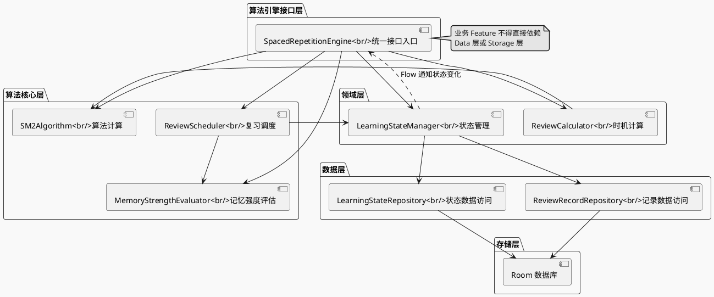

##### A3.0.2 整体设计关键点（必须）

- **关键点 1**：分层清晰、依赖单向（API → Core/Domain → Data → Storage），上层不依赖下层实现细节，便于测试和维护
- **关键点 2**：算法计算本地执行，不依赖网络，失败可降级（使用默认参数），确保算法引擎始终可用
- **关键点 3**：并发与取消语义明确，使用协程管理异步操作，共享状态使用线程安全容器或 Mutex 保护，避免重入/竞态
- **关键点 4**：可观测性最小闭环（日志/埋点/错误记录），关键操作可追踪，算法计算事件、状态更新事件、异常事件都有记录

##### A3.0.3 关键设计决策清单（必须）

| 决策点 | 候选方案 | 决策 | 决策理由 | 影响范围（组件/接口/数据） | 引用来源 |
|---|---|---|---|---|---|
| 分层架构 | A: 单层扁平<br>B: 三层（API/Domain/Data）<br>C: 五层（API/Core/Domain/Data/Storage） | C: 五层架构 | 职责清晰，便于测试和维护，符合 Clean Architecture 原则 | 所有组件 | plan.md:A1 |
| 状态管理策略 | A: 内存缓存<br>B: 数据库直查<br>C: 缓存+数据库 | C: 缓存+数据库 | 平衡性能和数据一致性，支持实时查询和持久化 | LearningStateManager, Repository | plan.md:A1 |
| 错误处理策略 | A: 异常抛出<br>B: Result 封装<br>C: 回调式 | B: Result 封装 | 类型安全，易于测试，符合 Kotlin 协程规范 | 所有组件 | plan.md:A1 |
| 算法计算线程 | A: 主线程<br>B: IO 线程<br>C: 后台服务 | B: IO 线程 | 不阻塞主线程，满足性能要求 | SM2Algorithm, ReviewCalculator | plan.md:A1 |

##### A3.0.4 核心协作策略（必须）

- **分层与依赖方向**：API → Core/Domain → Data → Storage；跨层只能通过接口/契约；禁止下层反依赖上层
- **线程/并发模型**：主线程仅用于接口调用入口；IO 线程执行算法计算和数据库操作；使用协程管理异步操作；共享状态使用线程安全容器或 Mutex 保护
- **错误与失败传播**：使用 Result<T> 封装结果；底层异常转换为领域错误（SrsError）；算法计算失败使用默认参数降级；关键错误记录日志
- **数据一致性与补偿**：学习状态更新使用 Room 事务确保一致性；复习记录写入失败不阻塞主流程（降级处理）；应用退出时确保数据持久化

##### A3.0.5 主要风险与权衡（必须）

- **权衡点**：性能 vs 数据一致性（使用缓存提升性能，但需保证缓存与数据库一致性）
- **已知风险**：算法计算异常 → 需降级策略（详见 A5 风险与消解策略）

#### A3.1 组件清单与职责（必须）

> **重要**：本表是 Feature 的**组件目录（Component Catalog）**，驱动后续详细设计。
> - `A3.4 组件详细设计` 必须 **1:1 覆盖**本表的每个组件
> - 组件粒度建议：按职责边界划分（UI/ViewModel/UseCase/Repository/DataSource 等）

| 组件 | 职责（一句话） | 输入/输出 | 依赖 | 约束 |
|------|---------------|-----------|------|------|
| 算法引擎接口层 | 提供统一的算法引擎接口，封装算法实现细节 | 输入：学习/复习请求<br>输出：学习任务列表、复习时机计算结果 | 算法核心层 | 接口稳定，向后兼容 |
| SM-2 算法实现 | 实现 SM-2 算法，计算复习间隔和记忆强度 | 输入：学习历史、复习结果<br>输出：下次复习时间、记忆强度 | 无 | 算法计算不能阻塞主线程 |
| 记忆强度评估器 | 评估单词记忆强度，用于优先级排序 | 输入：学习次数、复习间隔、正确率<br>输出：记忆强度值 | 学习状态数据 | 评估结果可复现 |
| 复习调度器 | 生成待复习单词列表，按优先级排序 | 输入：当前时间、学习状态列表<br>输出：待复习单词列表 | 学习状态管理器 | 列表生成时间 ≤ 200ms |
| 学习状态管理器 | 管理单词学习状态，跟踪学习进度 | 输入：学习/复习操作<br>输出：更新后的学习状态 | 学习状态仓库 | 状态更新必须幂等 |
| 复习时机计算器 | 计算单词的下次复习时间 | 输入：学习状态、算法参数<br>输出：下次复习时间戳 | SM-2 算法 | 计算时间 ≤ 10ms |
| 学习状态仓库 | 提供学习状态数据的访问接口 | 输入：数据操作请求<br>输出：学习状态实体 | Room 数据库 | 支持事务、查询优化 |
| 复习记录仓库 | 提供复习历史记录的访问接口 | 输入：数据操作请求<br>输出：复习记录实体 | Room 数据库 | 支持历史查询 |

#### A3.2 Feature 全局类图（静态结构，必须）

> 一张图展示 Feature 涉及的**所有关键类/接口/数据结构**及其依赖关系。
> 这是 Feature 的"静态全景"，后续 A3.4 会对每个组件细化。
>
> **硬性要求（不可省略）**：
> - **必须覆盖所有关键类/接口**：UI / ViewModel / UseCase(or Interactor) / Repository / DataSource(若存在) / Entity / DTO / Error(错误体系) / Mapper(or Converter) / 其他核心抽象
> - **类与接口必须写出成员变量与方法（签名级别）**：字段名 + 类型；方法名 + 参数 + 返回值（必要时标注 throws/错误类型）
> - **依赖方向必须正确**：上层依赖下层；禁止“下层反依赖上层”（除非通过接口回调且在图中显式体现）
> - **与动态图互校**：端到端时序图/流程图中出现的参与者与关键调用，必须在此类图中找到对应类/接口
>
> PlantUML 类图提示：
> - 成员变量：`+fieldName: Type`（必要时用注释补充线程/生命周期约束）
> - 方法：`+methodName(param: Type): ReturnType`
> - 接口：`<<interface>>`；抽象类：`<<abstract>>`；密封类/错误体系可用 `<<sealed>>` 注释表达

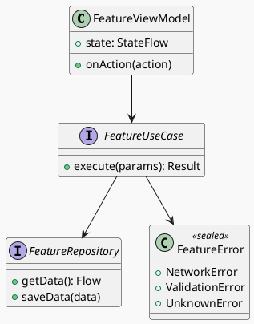

#### A3.2.1 关键类/接口清单（必须：与类图互校）

> 目的：让“全景类图”不只是图，还能快速定位每个关键抽象的职责与稳定性。

| 类/接口 | 类型（class/interface/data） | 所属层级（UI/Domain/Data/External） | 核心职责（一句话） | 关键方法（列 1-3 个） | 变更频率预期（高/中/低） |
|---|---|---|---|---|---|
| `FeatureViewModel` | class | UI |  |  | 中 |
| `FeatureUseCase` | interface | Domain |  |  | 中 |
| `FeatureRepository` | interface | Data |  |  | 低 |

#### A3.3 组件协作与通信（必须）

> 说明组件之间"谁调用谁、传什么、失败怎么办"

- **调用关系**：[UI → ViewModel → UseCase → Repository → DataSource]
- **通信方式**：函数调用 / Flow / Callback / Event（按实际）
- **线程模型**：[主线程：UI/ViewModel] → [IO线程：Repository/DataSource]
- **错误传播**：[DataSource 抛异常 → Repository 捕获转换 → UseCase 返回 Result → ViewModel 更新 State]

#### A3.3.1 Feature 端到端时序图集（必须：全景动态协作，覆盖全部流程与异常）

> **目的**：给评审一个“端到端动态全景”的全集视图：本 Feature 设计里的每个关键流程都必须对应一张“端到端全景时序图”。
>
> **硬性要求（不可省略）**：
> - **必须是 Feature 级全景**：每张时序图都要覆盖 UI→Domain→Data→External 的完整链路（不要只画某个组件内部）
> - **必须覆盖全部关键流程**：每个关键用户流程/系统流程都要有对应端到端时序图（多流程→多时序图）
> - **必须覆盖全部关键异常（同图）**：每个流程都必须在**同一张**时序图中用 `alt/else` 覆盖关键失败模式（至少：权限/参数校验/超时/弱网/限流/不可用/数据损坏/并发重入/取消）；**不得**把“成功/异常”拆成两张图，也不得把异常拆成多张图
> - **互校规则**：
>   - 流程图（A3.3.2）里每个流程必须能映射到这里对应的那张“端到端全景时序图”
>   - 异常清单（A3.4 组件 / Story）里的每个关键异常都必须能映射到这里某张时序图的 `alt/else` 分支（或反向亦然）

##### A3.3.1.0 时序图清单与覆盖矩阵（必须）

| Seq ID | 对应流程（A3.3.2） | 名称 | 覆盖范围（正常+异常） | 覆盖的关键异常（EX-xxx） | 备注 |
|---|---|---|---|---|---|
| SEQ-001 | 流程 1 | [流程 1 - 端到端全景时序] | 正常 + 全部关键异常（alt/else） | EX-001/EX-002/... |  |

##### 时序图模板 - 端到端全景（每个流程 1 张，必须同图含正常+异常）

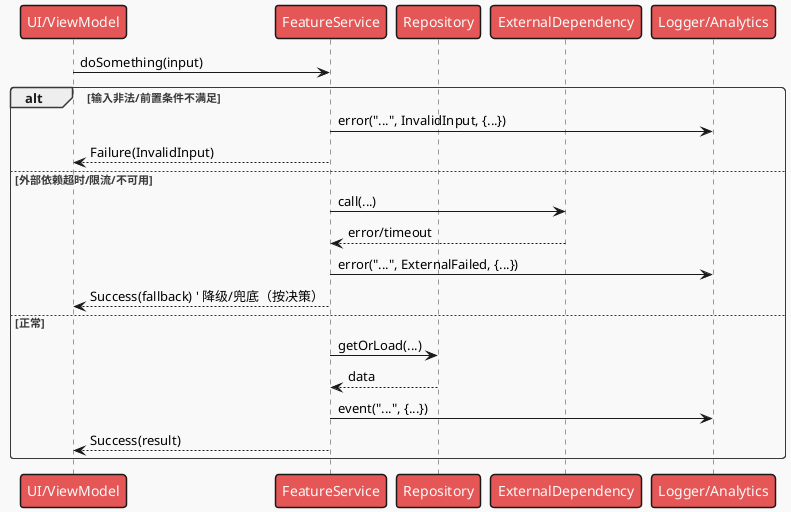

#### A3.3.2 Feature 关键流程（流程图，必须）

> **目的**：展示 Feature 的核心用户流程，从触发到完成的完整路径。
>
> 要求：
> - 每个关键流程一张图，覆盖正常 + **全部关键异常分支**
> - **不得**将异常分支拆分为“异常专用流程图”；复杂异常也必须放在同一张流程图中（可用子流程/注释/分组表达，但仍需同图）
> - 流程图侧重"做什么"（业务视角），时序图侧重"怎么调用"（技术视角）

##### 流程 1：[流程名称]

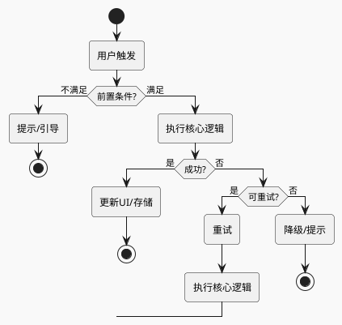

###### 流程 1 - 异常分支映射（必须）

> 目的：确保异常流程“无遗漏、可追踪”，并能与时序图/异常清单互相校验。

| 分支ID | 对应异常ID（EX-xxx） | 触发条件 | 对策（重试/降级/回滚/补偿） | 用户提示 | 覆盖的 NFR |
|---|---|---|---|---|---|
| BR-001 | EX-001 |  |  |  | NFR-OBS-??? |

##### 流程 2：[流程名称]

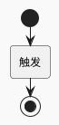

#### A3.4 组件详细设计（每个组件必须）

> **要求**：对 A3.1 中的每个组件，产出以下内容：
> - **组件类图**：该组件内部的类/接口细节
> - **组件全景时序图（同图）**：同一张 PlantUML 时序图中覆盖正常 + 关键异常（用 `alt/else`），不得拆分成功/异常两张图
> - **异常清单表**：与时序图互校，确保无遗漏

##### 组件：[组件名]

- **组件定位**：[它解决什么问题]
- **设计目标**：[性能/可测试性/可扩展性等]
- **核心数据结构**：[关键实体/状态/DTO]
- **对外接口**：[暴露的方法签名、错误类型]
- **策略与算法**：[缓存/重试/合并等策略，如适用]
- **失败与降级**：[超时/IO失败/数据异常的处理]

###### 组件类图（必须）

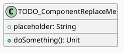

###### 时序图 - 全景（同图含正常+异常，必须）

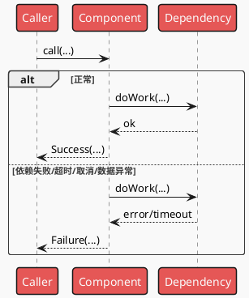

###### 异常清单（必须，与时序图互校）

| 异常ID | 触发点 | 触发条件 | 错误类型 | 可重试 | 对策 | 用户提示 | 日志字段 |
|--------|--------|----------|----------|--------|------|----------|----------|
| EX-001 |  |  |  | 是/否 |  |  |  |

> **互校规则**：
> - 异常清单每一行 ↔ 时序图中有对应 alt/else 分支
> - 时序图每个失败分支 ↔ 异常清单中有明确对策

##### （Capability Feature）交付物与接入契约（若适用）

> 适用于：埋点/组件库/算法SDK 等横切能力 Feature

- **交付物形态**：SDK / 资源包 / 配置 / 服务接口
- **对外接口**：初始化、调用方式、生命周期
- **版本与兼容**：SemVer、向后兼容策略
- **验收标准**：可测量的完成定义

##### （算法 Feature）算法交付清单（若适用）

- **模型提供**：来源/版本/输入输出
- **推理部署**：端侧/服务端、运行时
- **降级策略**：无模型/低端机/失败时的兜底
- **监控**：指标/告警/灰度

### A4. 技术风险与消解策略（绑定 Story/Task）

| 风险ID | 风险描述 | 触发条件 | 影响范围 | 严重度 | 消解策略 | 对应 Story/Task |
|---|---|---|---|---|---|---|
| RISK-001 |  |  |  | High/Med/Low |  | ST-??? / T??? |

### A5. 边界 & 异常场景枚举（数据/状态/生命周期/并发/用户行为）

- **数据边界**：[空/超大/非法/重复/过期等]
- **状态边界**：[状态机不可达/回退/重入等]
- **生命周期**：[前后台切换/旋转/进程被杀/恢复等]
- **并发**：[多线程/协程/并发写/竞态等]
- **用户行为**：[快速连点/断网/弱网/权限拒绝等]

#### A5.1 场景 → 应对措施对照表（必须）

> 目的：把“枚举”落到“可执行对策”，并与 A3.3.2 / A3.3.1 / A3.4 的异常分支互校。

| 场景ID | 场景类别 | 触发条件（可复现） | 影响 | 预期行为（对用户/对系统） | 技术对策（重试/退避/降级/回滚/补偿/去重/限流） | 观测信号（日志/埋点/指标） | 映射（流程/时序/异常ID） |
|---|---|---|---|---|---|---|---|
| SC-001 | 数据 |  |  |  |  |  | 流程1 / SEQ-001 / EX-001 |

### A6. 算法评估（如适用）

- **目标**：[要优化什么？]
- **指标**：[准确率/召回率/误报率/时延等]
- **验收标准**：[量化阈值]
- **测试方法**：[离线数据集/线上灰度/AB/回放]
- **风险**：[数据漂移/极端样本/可解释性]

### A7. 功耗评估（必须量化）

- **Top5% 用户模型**：[设备/网络/使用频次/场景]
- **测量口径**：[电流/唤醒/网络请求/定位等]
- **预估增量**：每日 \(mAh\) 增量 ≤ [阈值]（或每次操作平均 ≤ [阈值]）
- **验收上限**：[明确上限与失败处置]
- **降级策略**：[达到阈值时如何降级/关闭]

### A8. 性能评估（必须量化）

- **前台**：[关键路径 p50/p95/p99 时延预算与阈值]
- **后台**：[任务时延/调度频次/失败重试]
- **验收指标**：[阈值 + 测试方法]
- **降级策略**：[缓存/降采样/降精度/延后等]

### A9. 内存评估（必须量化）

- **峰值增量**：≤ [阈值] MB
- **平均增量**：≤ [阈值] MB
- **生命周期**：[在哪些生命周期阶段常驻/释放]
- **风险与对策**：[泄漏点/大对象/缓存策略]
- **验收标准**：[测试方法 + 阈值]

## Plan-B：技术规约 & 实现约束（保留原 spec-kit 输出内容）

### B1. 技术背景（用于统一工程上下文）

> 注意：为保证工具链自动提取信息，下列字段名需保留英文 Key（括号内可补充中文）。

**Language/Version**：[例如：Kotlin 2.x / Java 17 / 需明确]
**Primary Dependencies**：[例如：Jetpack Compose、Room、Ktor 或 需明确]
**Storage**：[如适用，例如：Room/SQLite、DataStore、文件 或 N/A]
**Test Framework**：[例如：JUnit、Robolectric、XCTest、pytest 或 需明确]
**Target Platform**：[例如：Android 8+、iOS 15+、Linux server 或 需明确]
**Project Type**：[single / web / mobile - 决定源码结构]
**Performance Targets**：[例如：60fps、启动耗时、p95 时延等 或 需明确]
**Constraints**：[例如：p95 <200ms、内存 <100MB、离线可用等 或 需明确]
**Scale/Scope**：[例如：DAU、数据规模、页面数等 或 需明确]

### B2. 架构细化（实现必须遵循）

- **分层约束**：[例如：UI 只能调用 Domain；Domain 不能依赖 UI]
- **线程/并发模型**：[主线程/IO/协程/锁策略]
- **错误处理规范**：[统一错误码/异常封装/用户提示]
- **日志与可观测性**：[结构化字段、采样、敏感信息脱敏]

### B3. 数据模型（引用或内联）

- 若已有 `data-model.md`：在此引用并补充关键约束
- 若未单独拆分：在此列出实体、字段、关系、状态机与校验规则

#### B3.1 存储形态与边界（必须）

> 目的：先明确"数据落在哪里、谁负责持久化、数据生命周期"，再谈表结构/键结构。

- **存储形态**：Room/SQLite / DataStore / SharedPreferences / 文件（JSON/CSV/二进制） / 远端服务 / N/A
- **System of Record（权威来源）**：哪一份数据是权威（例如：DB 为准、文件为准、服务端为准）
- **缓存与派生数据**：哪些字段是派生/可重建的（可用于迁移与降级）
- **生命周期**：常驻/前台/后台/退出时持久化；清理/归档策略
- **数据规模与增长**：数量级、写入频次、读写热点（用于索引与分页策略）

#### B3.2 物理数据结构（若使用持久化存储则必填）

> 要求：写到"可实现/可评审/可迁移"的粒度。
> - 若使用数据库：必须列出每张表的字段、约束、索引、外键、典型查询与迁移策略。
> - 若使用 KV/文件：必须写出键名/文件名规则、序列化结构（JSON schema/字段表）、版本与迁移策略。

##### （数据库）表结构清单

| 表 | 用途 | 主键/唯一约束 | 索引 | 外键 | 典型查询（Top3） | 数据量级 |
|---|---|---|---|---|---|---|
|  |  |  |  |  |  |  |

##### （数据库）字段说明模板（每表一份）

**表**：`<table_name>`

| 字段 | 类型 | 约束（NOT NULL/默认值/范围） | 含义 | 来源/生成方式 | 用途（读写场景） |
|---|---|---|---|---|---|
|  |  |  |  |  |  |

##### （数据库）迁移与兼容策略

- **Schema 版本**：v1 / v2 / …（例如：Room `version`）
- **向后兼容**：新增列默认值；字段废弃策略；索引变更策略
- **迁移策略**：Migration 列表、失败回滚/重试策略、数据回填/重建策略

##### （KV/文件）键/文件结构清单（如适用）

| Key/文件 | 用途 | 结构版本 | Schema/字段说明位置 | 迁移策略 |
|---|---|---|---|---|
|  |  |  |  |  |

### B4. 接口规范/协议（引用或内联）

- 若已有 `contracts/`：在此引用端点/协议文件（OpenAPI/Proto/JSON Schema 等）
- 明确版本策略、兼容策略、错误响应格式

#### B4.1 本 Feature 对外提供的接口（必须：Capability Feature/跨模块复用场景）

> 目的：把"能力交付物"写成可联调的契约（不是仅写类名/方法名）。

- **接口清单**：对外暴露的 API/SDK/Repository 接口列表（含用途、调用方）
- **输入/输出**：字段含义、必填/可选、默认值、范围、示例
- **错误语义**：错误码/错误类型、可重试/不可重试、用户可见提示策略
- **幂等与副作用**：哪些调用必须幂等、幂等键/语义、重复调用的效果
- **并发/线程模型**：调用是否线程安全；协程/线程调度要求；取消语义
- **版本与兼容**：SemVer/接口版本号；新增/弃用策略；向后兼容约束

#### B4.2 本 Feature 依赖的外部接口/契约（必须：存在外部依赖时）

> 目的：把 A2.2 的"依赖清单"下沉到"调用级契约"，避免实现期口径不一致。

- **依赖接口清单**：依赖的模块/服务/API（含 owner/路径）
- **调用约束**：超时/重试/退避/限流；缓存策略；一致性假设
- **失败模式与降级**：超时/限流/不一致/不可用时如何处理（与 A2.2 对齐）

#### B4.3 契约工件（contracts/）与引用方式（推荐）

> 推荐：把可机读的契约沉淀为文件，便于测试与演进。

- **contracts/**：`openapi.yaml` / `*.proto` / `json-schema/*.json` / `errors.md` 等
- **变更流程**：契约变更必须更新版本 + 兼容策略 + 关联 Story/Task

### B5. 合规性检查（关卡）

*关卡：必须在进入 Implement 前通过；若不通过，必须明确整改项并绑定到 Story/Task。*

[基于章程/合规性文件确定的检查项]

### B6. 项目结构（本 Feature）

```text
specs/[###-feature-short-name]/
├── spec.md                     # Feature 规格说明（/speckit.specify）
├── plan.md                     # 本文件（/speckit.plan）
├── full-design.md               # 全量技术方案文档（/speckit.fulldesign）
├── tasks.md                    # 任务拆解（/speckit.tasks）
├── research.md                 # 可选：调研产物
├── data-model.md               # 可选：数据模型
├── quickstart.md               # 可选：快速验证/联调指南
└── contracts/                  # 可选：接口契约
```

### B7. 源代码结构（代码库根目录）

<!--
  需执行操作：将下方的占位目录树替换为该功能的具体目录结构。
  删除未使用的选项，并使用实际路径扩展选定的结构（例如：apps/admin、packages/something）。
-->

```text
# 选项1：单项目（默认）
src/
tests/

# 选项2：Web 应用
backend/
frontend/

# 选项3：移动应用 + 接口
api/
android/ 或 ios/
```

**结构决策**：[记录选定的结构，并引用上述捕获的实际目录]

## Story Breakdown（Plan 阶段末尾，必须）

> 规则：
> - Story 是 Feature 的最小可开发单元，用于覆盖对应 FR/NFR。
> - Story 类型必须标注：Functional / Design-Enabler / Infrastructure / Optimization。
> - 这里**只做拆分与映射**，不生成 Task；Task 在 `/speckit.tasks` 阶段生成，且不得改写这里的设计决策。

### Story 列表

#### ST-001：SM-2 算法实现

- **类型**：Functional
- **描述**：实现 SM-2（SuperMemo 2）间隔重复算法，计算复习间隔和记忆强度，支持根据复习结果动态调整算法参数
- **目标**：算法能够正确计算复习时机，计算结果符合 SM-2 算法规律，计算耗时满足性能要求（单个单词 ≤ 10ms p95）
- **覆盖 FR/NFR**：FR-001；FR-002；NFR-PERF-001（算法计算耗时）；NFR-OBS-001（算法计算事件记录）；NFR-REL-001（计算成功率）
- **依赖**：无（基础设施 Story）
- **可并行**：是（与其他 Story 无依赖关系）
- **关键风险**：是（关联 RISK-001：算法计算异常；RISK-004：算法参数配置错误）
- **验收/验证方式（高层）**：算法计算结果与标准 SM-2 算法一致，计算耗时 ≤ 10ms（p95），算法参数在合理范围内；细化到 tasks.md

#### ST-002：学习状态管理

- **类型**：Functional
- **描述**：实现学习状态管理功能，跟踪单词的学习次数、最后复习时间、记忆强度、下次复习时间，支持学习状态的创建、更新和查询
- **目标**：学习状态能够正确跟踪和更新，状态更新耗时满足性能要求（≤ 100ms p95），状态数据持久化正常
- **覆盖 FR/NFR**：FR-003；FR-006；NFR-PERF-001（状态更新耗时）；NFR-MEM-001（状态缓存内存占用）；NFR-OBS-001（状态更新事件）；NFR-REL-002（状态持久化）
- **依赖**：ST-001（需要算法计算结果更新状态）
- **可并行**：否（依赖 ST-001 完成）
- **关键风险**：是（关联 RISK-002：数据丢失风险）
- **验收/验证方式（高层）**：学习状态正确跟踪和更新，状态更新耗时符合要求，状态数据持久化正常；细化到 tasks.md

#### ST-003：复习时机计算

- **类型**：Functional
- **描述**：实现复习时机计算功能，根据学习历史（学习次数、最后复习时间、回答正确率）计算下次复习时间
- **目标**：复习时机计算准确，计算结果符合间隔重复算法规律，计算耗时满足性能要求（≤ 10ms p95）
- **覆盖 FR/NFR**：FR-001；NFR-PERF-001（计算耗时）；NFR-OBS-001（计算事件记录）
- **依赖**：ST-001（需要 SM-2 算法）、ST-002（需要学习状态数据）
- **可并行**：否（依赖 ST-001、ST-002 完成）
- **关键风险**：否
- **验收/验证方式（高层）**：复习时机计算准确，计算耗时符合要求，计算结果符合算法规律；细化到 tasks.md

#### ST-004：记忆强度评估和优先级排序

- **类型**：Functional
- **描述**：实现记忆强度评估功能，基于学习次数、复习间隔、正确率评估单词记忆强度，并用于优先级排序
- **目标**：记忆强度评估准确，优先级排序正确，评估耗时满足性能要求
- **覆盖 FR/NFR**：FR-004；NFR-PERF-001（评估耗时）
- **依赖**：ST-002（需要学习状态数据）
- **可并行**：否（依赖 ST-002 完成）
- **关键风险**：否
- **验收/验证方式（高层）**：记忆强度评估准确，优先级排序正确；细化到 tasks.md

#### ST-005：复习列表生成

- **类型**：Functional
- **描述**：实现复习列表生成功能，根据复习时间到达情况生成待复习单词列表，并按优先级排序
- **目标**：复习列表生成正确，列表生成耗时满足性能要求（≤ 200ms p95），列表按优先级正确排序
- **覆盖 FR/NFR**：FR-005；NFR-PERF-001（列表生成耗时）
- **依赖**：ST-002（需要学习状态数据）、ST-003（需要复习时机计算）、ST-004（需要优先级排序）
- **可并行**：否（依赖其他 Story 完成）
- **关键风险**：否
- **验收/验证方式（高层）**：复习列表生成正确，生成耗时符合要求，列表排序正确；细化到 tasks.md

#### ST-006：错误处理和异常场景

- **类型**：Infrastructure
- **描述**：实现错误处理机制，覆盖算法计算异常、数据损坏、参数无效、计算超时等异常场景，提供明确的错误处理和降级策略
- **目标**：所有异常场景都有明确的错误处理和降级策略，错误日志正确记录，算法计算失败不影响用户体验
- **覆盖 FR/NFR**：NFR-OBS-002（错误日志记录）；NFR-REL-001（错误处理）；NFR-PERF-002（降级策略）
- **依赖**：ST-001（算法实现）
- **可并行**：否（依赖 ST-001 完成）
- **关键风险**：是（关联 RISK-001：算法计算异常）
- **验收/验证方式（高层）**：所有异常场景都有明确的错误处理和降级策略，错误日志正确记录；细化到 tasks.md

#### ST-007：数据持久化和生命周期管理

- **类型**：Infrastructure
- **描述**：实现学习状态数据持久化机制，确保应用崩溃或退出时学习状态能够保存，重启后恢复；管理学习状态缓存内存生命周期
- **目标**：数据能够可靠持久化，应用重启后恢复，内存占用符合要求（≤ 30MB）
- **覆盖 FR/NFR**：NFR-REL-002（数据持久化）；NFR-MEM-001/002（内存生命周期）
- **依赖**：ST-002（学习状态管理）
- **可并行**：否（依赖 ST-002 完成）
- **关键风险**：是（关联 RISK-002：数据丢失风险）
- **验收/验证方式（高层）**：数据持久化正常，应用重启后恢复，内存占用符合要求；细化到 tasks.md

### Feature → Story 覆盖矩阵

| FR/NFR ID | 覆盖的 Story ID | 备注 |
|---|---|---|
| FR-001 | ST-001、ST-003 | 复习时机计算（算法实现和计算功能） |
| FR-002 | ST-001 | SM-2 算法实现 |
| FR-003 | ST-002 | 学习状态管理 |
| FR-004 | ST-004 | 记忆强度评估 |
| FR-005 | ST-005 | 复习列表生成 |
| FR-006 | ST-002 | 学习状态更新（包含在状态管理中） |
| NFR-PERF-001 | ST-001、ST-002、ST-003、ST-004、ST-005 | 性能要求（算法计算、状态更新、列表生成） |
| NFR-PERF-002 | ST-006 | 降级策略 |
| NFR-POWER-001 | ST-001、ST-002 | 功耗要求（算法计算和状态更新） |
| NFR-MEM-001/002 | ST-002、ST-007 | 内存占用和生命周期 |
| NFR-SEC-001 | ST-002、ST-007 | 安全隐私要求（本地存储） |
| NFR-OBS-001/002 | ST-001、ST-002、ST-003、ST-006 | 可观测性要求 |
| NFR-REL-001/002 | ST-001、ST-006、ST-007 | 可靠性要求 |

## Story Detailed Design（L2 二层详细设计：面向开发落码，强烈建议）

> 目标：把每个 Story 的"实现方法"写清楚，做到**不写每行代码**也能明确指导开发如何落地。
>
> 规则：
> - 本节内容属于 Plan 的一部分，视为**权威技术决策输入**（必须纳入版本管理与变更记录）。
> - tasks.md 的每个 Task 应明确引用对应 Story 的详细设计入口（例如：`plan.md:ST-001:4.2 时序图`）。
> - 对每个 Story，必须同时覆盖：**静态结构（类/接口/数据）**、**动态交互（时序）**、**异常矩阵（无遗漏）**、**并发/取消语义**、**验证方式**。
>
> **硬约束（Story 级设计边界）**：
> - **Story 级设计不得新增组件级概念**。Story Detailed Design 只能在 A3.1/A3.4 已定义的组件边界内做细化，不得：
>   - 新增组件（A3.1 未列出的组件）
>   - 新增核心类/接口（A3.2 全局类图未定义的关键抽象）
>   - 新增错误类型/错误码体系（A3.4 异常清单未覆盖的错误分类）
> - **若发现需要新增上述内容**，必须：
>   1. 回到 A3.1/A3.4 修订组件级设计
>   2. 提升 Plan Version（例如 v0.1.0 → v0.2.0）
>   3. 在变更记录中注明影响范围
> - **Review 否决依据**：任何违反此约束的 Story 设计输出，应被驳回并要求修订。

### ST-001 Detailed Design：[标题]

#### 1) 目标 & Done 定义（DoD）

- **目标**：[一句话说明交付能力]
- **DoD（可验证）**：
  - [ ] [功能验收：引用 FR-xxx]
  - [ ] [性能/功耗/内存阈值：引用 NFR-xxx，给出测量方法]
  - [ ] [可靠性/可观测性：引用 NFR-xxx，给出日志/埋点/告警最小集]

#### 2) 代码落点与边界（开发导航）

- **新增/修改目录与文件（建议到包/文件级）**：
  - `app/src/main/...` / `src/...`：[文件路径与职责]
- **分层与依赖约束**：复用 Plan-B:B2（必要时补充本 Story 的额外约束）
- **对外暴露点**：[Repository/UseCase/ViewModel/Service 等；列出函数签名级别的入口]

#### 3) 核心接口与数据契约（签名级别 + 错误语义）

- **接口清单**：
  - `interface XxxRepository { ... }`
  - `class XxxUseCase { ... }`
- **输入/输出约束**：必填/可选、默认值、范围、示例
- **错误语义**：错误类型（Sealed Class/错误码）、可重试/不可重试、用户可见提示策略
- **取消语义**：协程取消/线程中断时必须保证的资源释放与一致性（避免半写入）

#### 4) 静态结构设计（类图/关系图）

```plantuml
@startuml
!theme mars

' TODO: 画清本 Story 新增/修改的核心类、接口、依赖方向
' 要求：至少包含 UI/ViewModel/UseCase/Repository/DataSource(若有)/Error/Entity
class TODO_StoryReplaceMe {
  + placeholder: String
  + execute(): Unit
}

@enduml
```

#### 5) 动态交互设计（时序图）

##### 时序图（同图含正常 + 全部关键异常，必须）

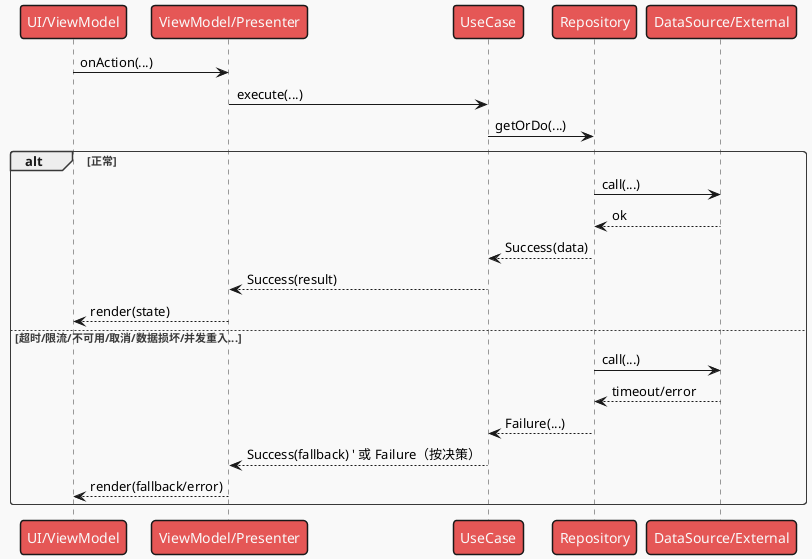

#### 6) 异常场景矩阵（无遗漏清单）

| 场景ID | 触发点（组件/步骤） | 触发条件 | 错误类型/错误码 | 是否可重试 | 用户提示/引导 | 回滚与一致性策略 | 日志/埋点字段 | 覆盖 NFR |
|---|---|---|---|---|---|---|---|---|
| EX-001 |  |  |  | 是/否 |  |  |  | NFR-OBS-??? |

> 校验规则（必须通过）：
> - 上表每一条异常都能在“时序图（同图含正常+异常）”中找到对应 `alt/else` 分支；
> - 时序图中的每个失败分支也必须在上表中有明确对策。

#### 7) 并发 / 生命周期 / 资源管理

- **并发策略**：串行/并行；互斥（Mutex/队列）；共享状态保护
- **线程/协程模型**：哪些在主线程、哪些在 IO；切线程边界点
- **生命周期**：旋转/前后台切换/进程被杀（若在范围内则写恢复策略；不适用写原因）
- **资源释放**：文件句柄/游标/连接/缓存的释放时机

#### 8) 验证与测试设计（可执行）

- **单元测试**：覆盖核心逻辑与错误分支（与异常矩阵对齐）
- **集成/端到端**：覆盖用户主流程与关键异常流程
- **NFR 验证**：性能/功耗/内存测量方法、数据集/设备模型、阈值

#### 9) 与 Tasks 的映射（可选但推荐）

| 设计要点 | 建议 Task | 备注 |
|---|---|---|
|  | T??? |  |

### ST-002 Detailed Design：[标题]

（复用 ST-001 的结构）

## 复杂度跟踪（仅当合规性检查存在需说明理由的违规项时填写）

| 违规项 | 必要性说明 | 舍弃更简单方案的原因 |
|---|---|---|
| [例如：第4个子项目] | [当前需求] | [为何更简单方案不满足] |
