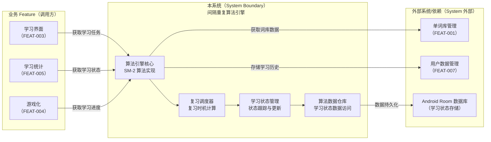
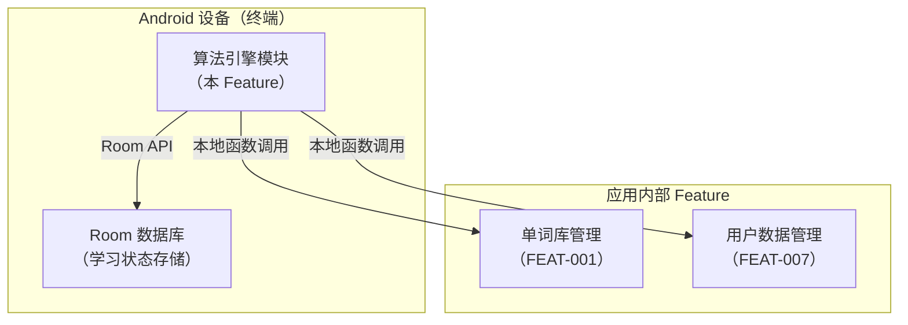
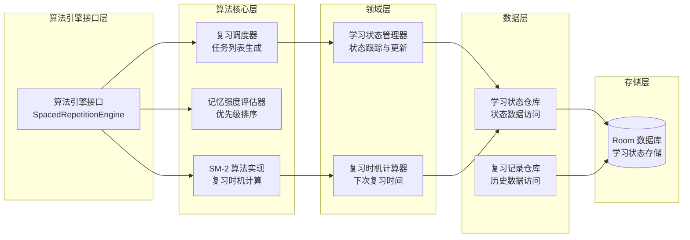
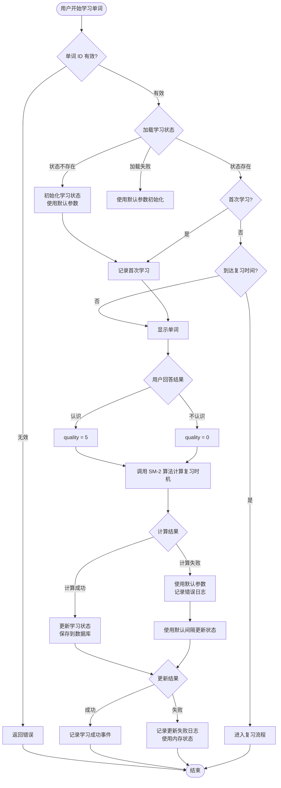
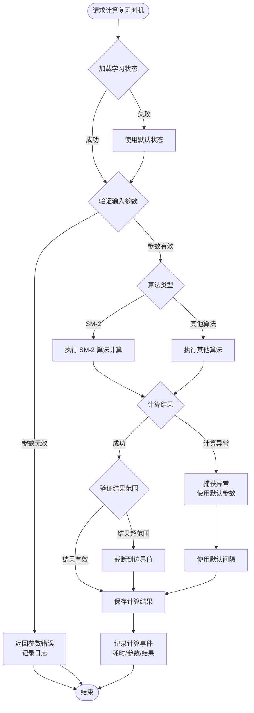

# Plan（工程级蓝图）：间隔重复学习算法引擎

**Epic**：EPIC-001 - 无痛记忆单词神器APP
**Feature ID**：FEAT-002
**Feature Version**：v0.1.0（来自 `spec.md`）
**Plan Version**：v0.1.0
**当前工作分支**：`epic/EPIC-001-word-memory-app`
**Feature 目录**：`specs/epics/EPIC-001-word-memory-app/features/FEAT-002-spaced-repetition-algorithm/`
**日期**：2026-01-18
**输入**：来自 `Feature 目录/spec.md`

> 规则：
> - Plan 阶段必须包含工程决策、风险评估、算法/功耗/性能/内存评估（量化 + 验收指标）。
> - Implement 阶段**不得**擅自改写 Plan 的技术决策；若必须变更，走增量变更流程并提升 Version。

## 变更记录（增量变更）

| 版本 | 日期 | 变更范围（Feature/Story/Task） | 变更摘要 | 影响模块 | 是否需要回滚设计 |
|---|---|---|---|---|---|
| v0.1.0 | 2026-01-18 | Feature | 初始版本：创建 Plan 工程级蓝图，完成技术选型、架构设计和 Story 拆分 |  | 否 |

## 概述

**核心需求**：实现基于遗忘曲线的间隔重复学习算法引擎，支持复习时机计算、学习状态管理和记忆强度评估，为学习功能提供核心算法能力。

**关键工程决策**：
1. **算法选型**：使用 SM-2（SuperMemo 2）算法作为核心算法，成熟稳定，易于实现和调优
2. **学习状态存储**：使用 Room 数据库存储学习状态和复习记录，支持复杂查询和事务
3. **算法计算**：本地计算，不依赖网络，使用协程异步执行，避免阻塞主线程
4. **接口设计**：提供统一的算法引擎接口，封装算法实现细节，便于业务 Feature 接入

## Plan-A：工程决策 & 风险评估（必须量化）

### A1. 技术选型（候选方案对比 + 决策理由）

| 决策点 | 候选方案 | 优缺点 | 约束/风险 | 决策 | 决策理由 |
|---|---|---|---|---|---|
| 间隔重复算法 | A: SM-2（SuperMemo 2）<br>B: SM-4/SM-5<br>C: Anki 算法<br>D: 自定义算法 | A: 成熟稳定、实现简单、参数少，但精度相对较低<br>B: 精度更高，但实现复杂、参数多<br>C: 开源成熟，但算法细节复杂<br>D: 完全可控，但需要大量测试和调优 | 第一阶段需要快速实现，算法精度要求适中，易于理解和调优 | A: SM-2 算法 | SM-2 算法成熟稳定，实现简单，参数少易于调优，满足第一阶段需求 |
| 学习状态存储 | A: Room 数据库<br>B: SharedPreferences<br>C: 文件存储（JSON） | A: 类型安全、查询方便、支持事务，但增加依赖<br>B: 简单轻量，但查询能力弱、不适合复杂数据<br>C: 灵活，但查询性能差、无事务支持 | 学习状态数据量大（10000 个单词），需要复杂查询和事务支持 | A: Room 数据库 | 学习状态数据量大且需要复杂查询（按复习时间、记忆强度排序），Room 提供类型安全和查询能力 |
| 算法计算方式 | A: 同步计算（主线程）<br>B: 异步计算（协程）<br>C: 后台服务计算 | A: 简单，但阻塞主线程<br>B: 不阻塞主线程、易于管理，但需要协程管理<br>C: 独立进程，但复杂度高 | 性能要求：单个单词计算 ≤ 10ms，不能阻塞主线程 | B: 异步计算（协程） | 使用协程在 IO 线程执行算法计算，不阻塞主线程，满足性能要求 |
| 算法引擎接口 | A: 函数式接口（suspend 函数）<br>B: 回调式接口<br>C: 事件驱动接口 | A: 简洁、类型安全、易于测试，符合 Kotlin 协程规范<br>B: 灵活，但回调地狱、难以测试<br>C: 解耦，但复杂度高 | 需要与业务 Feature 集成，接口应简洁易用 | A: 函数式接口（suspend 函数） | 符合 Kotlin 协程规范，类型安全，易于测试和集成 |

### A2. 0 层架构设计（对外系统边界、部署、通信、交互）

> 定义：0 层架构设计反映“本系统与外部系统之间的关系”。必须覆盖：结构、部署、通信方式、交互方式与边界。
>
> 要求：
> - 同时给出“一句话描述每个模块/外部系统的职责与边界”。
> - 明确外部依赖的**故障模式**（超时/限流/不可用/返回不一致）与本系统应对策略（重试/降级/兜底/提示）。
> - 明确通信方式（协议/鉴权/重试/幂等/超时/限流）与部署拓扑（端/服务/第三方）。

#### A2.1 外部系统与依赖清单（必须）

| 外部系统/依赖 | 类型（三方/内部服务/设备能力） | 关键能力/数据 | 通信方式（协议/鉴权） | SLA/限流/超时 | 故障模式 | 我方策略 |
|---|---|---|---|---|---|---|
| 单词库管理（FEAT-001） | 内部 Feature | 词库数据、单词列表 | Kotlin 函数调用（Repository 接口） | 本地调用，无网络 | 词库数据缺失、数据格式错误 | 返回空列表，记录错误日志 |
| 用户账户与数据管理（FEAT-007） | 内部 Feature | 学习历史数据存储和查询 | Kotlin 函数调用（Repository 接口） | 本地数据库，无网络 | 数据库不可用、数据损坏 | 使用默认参数，容错处理，记录错误日志 |
| Android Room 数据库 | 设备能力 | 学习状态数据存储 | 系统 API | 本地数据库，无网络 | 数据库操作失败、存储空间不足 | 捕获异常，使用默认参数，记录错误日志 |

#### A2.2 0 层架构图（系统边界 + 外部交互）




#### A2.3 部署视图（必须）

> 要求：说明各节点部署位置（端上/服务端/第三方）、网络边界、以及关键链路的通信方式。




#### A2.4 通信与交互说明（必须）

- **协议**：REST / gRPC / WebSocket / MQ / 文件 / 设备能力（按实际选择）
- **鉴权**：OAuth2 / JWT / mTLS / API Key（按实际选择）
- **超时与重试**：超时阈值、最大重试次数、退避策略、重试白名单接口
- **幂等**：哪些请求必须幂等、幂等键策略
- **限流**：外部限流策略与我方退避/降级
- **数据一致性**：强一致/最终一致、补偿策略

### A3. 1 层架构设计（系统内部框架图 + 模块拆分 + 接口协议）

> 定义：1 层架构设计描述“系统内部的模块拆分与协作”，包括框架图、模块职责、模块交互、通信方式、接口协议等。

#### A3.1 1 层框架图（必须）



#### A3.2 模块拆分与职责（必须）

| 模块 | 职责 | 输入/输出 | 依赖 | 约束 |
|---|---|---|---|---|
| 算法引擎接口层 | 提供统一的算法引擎接口，封装算法实现细节 | 输入：学习/复习请求<br>输出：学习任务列表、复习时机计算结果 | 算法核心层 | 接口稳定，向后兼容 |
| SM-2 算法实现 | 实现 SM-2 算法，计算复习间隔和记忆强度 | 输入：学习历史、复习结果<br>输出：下次复习时间、记忆强度 | 无 | 算法计算不能阻塞主线程 |
| 记忆强度评估器 | 评估单词记忆强度，用于优先级排序 | 输入：学习次数、复习间隔、正确率<br>输出：记忆强度值 | 学习状态数据 | 评估结果可复现 |
| 复习调度器 | 生成待复习单词列表，按优先级排序 | 输入：当前时间、学习状态列表<br>输出：待复习单词列表 | 学习状态管理器 | 列表生成时间 ≤ 200ms |
| 学习状态管理器 | 管理单词学习状态，跟踪学习进度 | 输入：学习/复习操作<br>输出：更新后的学习状态 | 学习状态仓库 | 状态更新必须幂等 |
| 复习时机计算器 | 计算单词的下次复习时间 | 输入：学习状态、算法参数<br>输出：下次复习时间戳 | SM-2 算法 | 计算时间 ≤ 10ms |
| 学习状态仓库 | 提供学习状态数据的访问接口 | 输入：数据操作请求<br>输出：学习状态实体 | Room 数据库 | 支持事务、查询优化 |
| 复习记录仓库 | 提供复习历史记录的访问接口 | 输入：数据操作请求<br>输出：复习记录实体 | Room 数据库 | 支持历史查询 |

#### A3.3 模块协作与通信方式（必须）

> 要求：写清楚"谁调用谁、通过什么方式、传什么、失败如何处理"。如果是异步（队列/事件），必须写清楚消费语义与重放/去重。

- **调用关系**：
  - 业务 Feature → 算法引擎接口 → SM-2 算法 / 记忆强度评估器 / 复习调度器
  - 复习调度器 → 学习状态管理器 → 学习状态仓库 → Room 数据库
  - SM-2 算法 → 复习时机计算器 → 学习状态仓库
  - 学习状态管理器 → 复习记录仓库 → Room 数据库

- **通信方式**：
  - 函数调用：Kotlin suspend 函数调用，使用协程处理异步操作
  - 错误处理：使用 Result<T> 或 Sealed Class（Success/Failure）封装结果
  - 状态同步：学习状态更新后通过 Flow 通知订阅者

- **接口协议**：
  - 数据结构：使用 Kotlin data class 定义实体（LearningState, ReviewRecord, AlgorithmParameters）
  - 错误码：使用 Sealed Class 定义错误类型（AlgorithmError, CalculationError, DataError）
  - 版本策略：接口向后兼容，新增方法使用默认参数，数据结构变更时自动迁移
  - 幂等约束：学习状态更新基于单词 ID + 时间戳去重，确保幂等

- **并发与线程模型**：
  - 主线程：不执行算法计算，仅用于接口调用入口
  - IO 线程：算法计算、数据库操作在 Dispatchers.IO 执行
  - 协程：所有算法计算使用 suspend 函数，由调用方在协程作用域中调用
  - 共享状态保护：学习状态缓存使用线程安全的容器，数据库操作使用 Room 的事务机制

#### A3.4 关键模块设计（详细设计 + 取舍，必须）

> 要求：对“关键模块/高风险模块/承载 NFR 的模块”做细化。若包含多个模块，则分模块说明。

##### 模块：[模块名，如 Cache / Sync Engine / Auth / Scheduler]

- **模块定位**：[它解决什么问题、在 1 层架构中的位置]
- **设计目标**：[性能/功耗/一致性/可扩展性/可观测性等]
- **核心数据结构/状态**：[关键实体/状态机/缓存键/索引]
- **对外接口（协议）**：[输入/输出、错误码、版本策略、幂等要求]
- **策略与算法**：[缓存淘汰/LRU、批处理、合并、退避、优先级等]
- **失败与降级**：[超时/限流/不可用/数据损坏/回滚策略]
- **安全与隐私**：[敏感数据处理、加密、权限]
- **可观测性**：[关键日志/指标/埋点]
- **优缺点**：
  - **优点**：[为什么这样做更好]
  - **缺点/代价**：[维护复杂度/资源消耗/边界问题]
  - **替代方案与否决理由**：[A/B/C 对比与否决原因]

#####（Capability Feature 场景）交付物与接入契约（若适用则必填）

> 适用：本 Feature 为“埋点/可观测性”“动效合集/组件库”“算法能力/模型SDK”等横切能力时。

- **交付物形态**：SDK / 资源包 / 配置 / 模型文件 / 服务接口（按实际）
- **对外接口（业务接入）**：初始化方式、调用方式、依赖注入点、生命周期要求
- **事件/协议/契约**：事件名/字段/版本；API 协议；资源命名规范；模型输入输出张量定义（按实际）
- **版本与兼容策略**：SemVer/灰度/回滚；向后兼容策略；弃用策略
- **验收标准**：可测量的完成定义（性能/正确性/稳定性/合规），并明确验证入口

##### 模块：SM-2 算法实现

- **模块定位**：实现 SM-2（SuperMemo 2）间隔重复算法，计算复习间隔和记忆强度，位于算法核心层
- **设计目标**：算法准确性、计算性能、可扩展性（支持未来算法切换）
- **核心数据结构/状态**：
  - 输入：学习次数（n）、难度因子（EF）、当前间隔（interval）、复习结果（quality 0-5）
  - 输出：下次复习间隔（newInterval）、更新后的难度因子（newEF）、下次复习时间（nextReviewTime）
  - 算法参数：初始间隔（1 天）、最小难度因子（1.3）、最大间隔（365 天）
- **对外接口（协议）**：
  - `suspend fun calculateNextReview(state: LearningState, quality: Int): ReviewResult`：计算下次复习时间
  - `suspend fun updateMemoryStrength(state: LearningState): Float`：更新记忆强度（0.0-1.0）
  - 错误码：`CalculationError`（Sealed Class：InvalidInput, OverflowError）
- **策略与算法**：
  - SM-2 算法公式：根据 quality 调整 EF 和 interval
  - 边界处理：间隔限制在 1 小时-365 天范围内，EF 限制在 1.3-3.0 范围内
  - 批量计算：支持批量计算多个单词，使用协程并行处理
- **失败与降级**：
  - 输入参数无效：返回错误 Result，使用默认参数
  - 计算溢出：捕获异常，使用边界值，记录错误日志
  - 计算超时：限制计算时间，超时使用上次成功结果
- **安全与隐私**：
  - 算法计算过程不记录到日志（仅记录结果）
  - 学习数据不泄露（本地计算，不上传）
- **可观测性**：
  - 记录算法计算耗时、参数、结果
  - 记录计算异常（溢出、超时等）
- **优缺点**：
  - **优点**：算法成熟稳定、实现简单、参数少易于调优
  - **缺点/代价**：算法精度相对较低，不支持个性化调优
  - **替代方案与否决理由**：不使用 SM-4/SM-5（实现复杂、参数多）；不使用机器学习模型（需要训练数据，第一阶段不适用）

##### 模块：学习状态管理器

- **模块定位**：管理单词学习状态的完整生命周期，跟踪学习进度，位于领域层
- **设计目标**：状态一致性、性能（快速更新）、可扩展性（支持未来扩展状态类型）
- **核心数据结构/状态**：
  - 实体：`LearningState`（单词 ID、学习次数、最后复习时间、记忆强度、下次复习时间、掌握状态）
  - 状态机：未学习 → 学习中 → 已掌握（基于记忆强度和复习次数）
  - 缓存：内存缓存学习状态列表，减少数据库查询
- **对外接口（协议）**：
  - `suspend fun updateLearningState(wordId: String, result: ReviewResult): Result<LearningState>`：更新学习状态
  - `suspend fun getLearningStates(wordIds: List<String>): Flow<List<LearningState>>`：获取学习状态（Flow 支持实时更新）
  - `suspend fun getReviewList(limit: Int): List<LearningState>`：获取待复习列表
- **策略与算法**：
  - 状态更新策略：基于单词 ID + 时间戳去重，确保幂等
  - 缓存策略：首次加载后内存缓存，数据库变更时更新缓存
  - 批量更新：支持批量更新多个单词状态，使用事务确保一致性
- **失败与降级**：
  - 数据库操作失败：捕获异常，使用默认参数，记录错误日志
  - 数据损坏：数据校验，返回错误并记录日志
- **安全与隐私**：
  - 学习状态数据存储在本地 Room 数据库，不共享
  - 不记录敏感信息（单词内容）
- **可观测性**：
  - 记录状态更新操作（单词 ID、更新类型、耗时）
  - 记录状态更新失败（错误类型、单词 ID）
- **优缺点**：
  - **优点**：状态管理统一、易于测试和扩展、支持实时更新（Flow）
  - **缺点/代价**：内存缓存占用内存（约 20-30MB）
  - **替代方案与否决理由**：不使用 SharedPreferences（数据量大，查询能力弱）；不使用文件存储（查询性能差）

#####（算法 Capability Feature 场景）算法交付与工程化清单（若适用则必填）

- **模型提供**：
  - 算法模型：SM-2（SuperMemo 2）算法，基于遗忘曲线理论（Ebbinghaus）
  - 算法来源：经典间隔重复算法，无需训练数据
  - 算法版本：v1.0（第一阶段固定版本，后续可扩展支持其他算法）

- **推理部署**：
  - 部署方式：端侧本地计算，不依赖网络
  - 运行时：Kotlin 协程，在 IO 线程执行算法计算
  - 算法更新策略：通过接口版本化，支持未来切换算法实现

- **工程化封装**：
  - 算法 SDK/API：提供统一的 `SpacedRepetitionEngine` 接口，封装算法实现细节
  - 线程与资源控制：算法计算在 Dispatchers.IO 执行，限制并发数（最多 10 个）
  - 缓存：学习状态内存缓存，减少数据库查询
  - 降级与回退：算法计算失败时使用默认参数或上次成功结果，记录错误日志

- **评估与监控**：
  - 离线指标：算法计算耗时、准确率（基于测试数据集）
  - 线上指标：复习时机计算成功率、学习状态更新成功率
  - 漂移监测：监控算法参数效果，收集用户学习数据用于未来优化
  - 告警：算法计算失败率超过阈值时告警
  - 灰度策略：算法参数调整时支持 A/B 测试（未来扩展）

### A4. 关键流程设计（每个流程一张流程图，含正常 + 全部异常）

> 定义：关键流程设计必须用**流程图（flowchart）**描述，且流程图中必须覆盖正常流程与所有关键异常分支（失败/超时/并发/生命周期等）。
>
> 要求：
> - 若存在多个关键流程（如“登录”“同步”“下单”“上传”等），则每个流程单独一张图。
> - 每张图必须包含：触发条件、关键决策点、外部依赖调用、重试/降级/兜底路径、最终可观测信号（日志/指标/埋点）。

#### 流程 1：单词学习流程



#### 流程 2：复习时机计算流程



### A5. 技术风险与消解策略（绑定 Story/Task）

| 风险ID | 风险描述 | 触发条件 | 影响范围 | 严重度 | 消解策略 | 对应 Story/Task |
|---|---|---|---|---|---|---|
| RISK-001 | 算法计算异常导致复习时机计算失败 | 输入参数无效、计算溢出、除零错误、算法实现错误 | 用户无法获得准确的复习时机，学习效果下降 | High | 1. 严格的参数校验和边界检查 2. 捕获所有计算异常，使用默认参数 3. 记录详细错误日志用于排查 4. 算法计算超时保护（100ms） 5. 计算结果范围验证（间隔 1 小时-365 天） | ST-001, ST-005 |
| RISK-002 | 学习状态数据丢失导致学习进度丢失 | 数据库操作失败、数据损坏、应用崩溃时数据未保存 | 用户学习进度丢失，需重新开始学习 | High | 1. 使用 Room 事务确保数据一致性 2. 关键操作前检查数据库可用性 3. 应用生命周期监听，退出前保存数据 4. 数据校验和恢复机制 5. 定期备份机制（可选） | ST-006 |
| RISK-003 | 算法性能不达标导致用户体验差 | 批量计算耗时过长、数据库查询慢、内存占用过高 | 用户等待时间长，功能不可用 | Med | 1. 算法计算优化（批量并行处理） 2. 数据库查询优化（索引、分页） 3. 内存缓存机制 4. 性能监控和告警 5. 降级策略（简化计算、延迟加载） | ST-001, ST-002, ST-004 |
| RISK-004 | 算法参数配置错误导致学习效果不佳 | 算法参数超出合理范围、参数调优不当 | 用户学习效果未达到预期，记忆效率低 | Med | 1. 参数校验和范围限制 2. 使用经过验证的默认参数 3. 提供参数调优能力（未来扩展） 4. 监控算法效果，收集用户反馈 | ST-001 |
| RISK-005 | 大量单词同时到达复习时间导致性能问题 | 用户长时间未学习，大量单词同时需要复习 | 复习列表生成慢，应用卡顿 | Low | 1. 批量计算优化（分批处理） 2. 优先级排序和限制数量 3. 延迟加载策略 4. 性能监控 | ST-002, ST-004 |

### A6. 边界 & 异常场景枚举（数据/状态/生命周期/并发/用户行为）

- **数据边界**：
  - **空词库**：词库数据为空 → 算法引擎返回空学习列表，不抛出异常
  - **无学习历史**：首次学习无历史数据 → 使用默认算法参数初始化学习状态
  - **学习历史数据损坏**：数据格式错误、字段缺失 → 数据校验失败，使用默认参数重新初始化，记录错误日志
  - **算法参数超范围**：参数超出合理范围（如间隔 < 1 小时或 > 365 天） → 参数校验失败，使用边界值或默认参数，记录警告日志
  - **大量单词状态**：学习状态数据量过大（> 10000 个） → 分批加载，使用分页查询，限制内存占用

- **状态边界**：
  - **学习状态不一致**：数据库中的状态与内存缓存不一致 → 以数据库为准，更新内存缓存
  - **复习时间已过期**：下次复习时间已过期但未复习 → 提高优先级，立即出现在复习列表中
  - **状态机异常**：学习状态从"已掌握"回退到"学习中" → 允许状态回退（用户可能遗忘），重新计算复习间隔
  - **并发状态更新**：多个操作同时更新同一单词的学习状态 → 使用数据库事务和锁机制，确保状态一致性

- **生命周期**：
  - **前后台切换**：应用切换到后台时正在计算复习时机 → 后台继续计算，恢复时显示结果
  - **屏幕旋转**：计算过程中屏幕旋转 → 使用 ViewModel 保存状态，恢复后继续显示
  - **进程被杀**：系统回收进程时正在更新学习状态 → 状态更新失败，下次启动时重新计算
  - **应用重启**：应用重启后 → 从数据库恢复学习状态，重新计算到达复习时间的单词

- **并发**：
  - **并发学习操作**：用户快速连续学习多个单词 → 支持批量更新，使用事务确保一致性
  - **并发复习计算**：多个单词同时到达复习时间 → 批量计算，使用协程并行处理（最多 10 个并发）
  - **并发状态查询**：多个组件同时查询学习状态 → 使用共享的 Repository 单例，避免重复查询
  - **竞态条件**：状态更新和查询时间差 → 使用 Flow 实时同步，确保数据一致性

- **用户行为**：
  - **快速连点**：用户快速连续点击学习按钮 → 防抖处理，只响应第一次点击
  - **长时间未学习**：用户长时间未使用应用 → 算法引擎应考虑时间衰减，长时间未复习的单词提高优先级
  - **学习频率过低**：用户学习频率远低于算法预期 → 算法效果会打折扣，但不应导致错误，使用当前学习频率计算
  - **大量单词同时学习**：用户一次性学习大量单词 → 支持批量处理，分批更新状态，避免性能问题

### A7. 算法评估（如适用）

- **目标**：实现基于遗忘曲线的间隔重复算法，在最佳复习时机安排复习，提升用户记忆效率
- **指标**：
  - **算法准确性**：复习时机计算的准确性（基于测试数据集，与标准 SM-2 算法结果对比，准确率 ≥ 95%）
  - **记忆效果**：用户通过算法学习后的记忆保持率（7 天后记忆准确率 ≥ 70%，30 天后 ≥ 60%）
  - **计算性能**：单个单词复习时机计算耗时 ≤ 10ms（p95）
- **验收标准**：
  - 算法计算结果与标准 SM-2 算法一致（测试数据集：1000 个单词的学习历史）
  - 算法计算耗时 ≤ 10ms（p95）（测试方法：使用性能测试工具测量计算时间）
  - 算法参数在合理范围内（初始间隔 1-7 天，难度因子 1.3-3.0）
- **测试方法**：
  - **离线测试**：使用标准测试数据集验证算法准确性
  - **单元测试**：测试算法计算的边界情况（quality 0-5、各种间隔值）
  - **集成测试**：测试算法引擎与学习状态管理的集成
  - **线上监控**：收集用户学习数据，监控算法效果（未来扩展）
- **风险**：
  - **算法精度不足**：SM-2 算法精度相对较低，可能影响学习效果 → 未来可扩展支持更高级算法（SM-4/SM-5）
  - **参数调优困难**：算法参数需要根据用户特征调优 → 第一阶段使用通用参数，未来支持个性化调优
  - **极端学习行为**：用户学习频率过低或过高，算法效果会打折扣 → 算法应能容错处理，不导致错误

### A8. 功耗评估（必须量化）

- **Top5% 用户模型**：Android 设备，每天学习 200 个单词，每次学习触发算法计算和状态更新
- **测量口径**：算法计算 CPU 消耗、数据库操作 I/O 消耗、内存分配消耗
- **预估增量**：每日 mAh 增量 ≤ 2mAh（假设每个单词计算消耗约 0.01mAh，200 个单词共 2mAh）
- **验收上限**：每日电池消耗增量不超过 2mAh（Top5% 用户模型），超过时需优化算法计算策略
- **降级策略**：无降级策略（算法引擎为本地计算，功耗可控）；若功耗超标，优化算法计算频率（批量计算、降低计算精度）

### A9. 性能评估（必须量化）

- **前台**：
  - 复习时机计算（单个单词）：p50 ≤ 5ms，p95 ≤ 10ms，p99 ≤ 20ms
  - 学习任务列表生成：p50 ≤ 100ms，p95 ≤ 200ms，p99 ≤ 400ms
  - 学习状态更新：p50 ≤ 50ms，p95 ≤ 100ms，p99 ≤ 200ms
- **后台**：
  - 批量计算（1000 个单词）：p50 ≤ 300ms，p95 ≤ 500ms，p99 ≤ 800ms
  - 算法计算：异步处理，不阻塞主线程
- **验收指标**：
  - 复习时机计算时间 p95 ≤ 10ms（测试方法：使用性能测试工具测量计算时间，测试设备：中端 Android 设备）
  - 批量计算时间（1000 个单词）p95 ≤ 500ms（测试方法：批量计算标准测试数据，测量总耗时）
  - 学习任务列表生成时间 p95 ≤ 200ms（测试方法：生成包含 100 个待复习单词的列表，测量生成时间）
- **降级策略**：
  - 计算超时：限制计算时间，超时使用默认参数或上次成功结果
  - 批量计算慢：减少批量大小，分批处理
  - 列表生成慢：限制列表数量，使用分页加载

### A10. 内存评估（必须量化）

- **峰值增量**：≤ 30MB（假设 10000 个单词的学习状态，每个状态约 3KB）
- **平均增量**：≤ 15MB（假设 5000 个单词的平均场景）
- **生命周期**：
  - **学习状态缓存**：应用运行期间常驻，应用退出时持久化到数据库
  - **算法计算临时内存**：计算过程中分配，计算完成后立即释放
  - **Room 数据库数据**：系统管理，不占用应用内存
- **风险与对策**：
  - **风险点**：大量学习状态缓存导致内存占用过高；批量计算时临时内存分配过多
  - **对策**：学习状态缓存限制数量（最多 10000 个），超出部分使用数据库查询；批量计算分批处理，限制并发数；已掌握单词的状态数据可归档或清理
- **验收标准**：
  - 测试方法：使用内存分析工具（如 Android Profiler）测量峰值内存占用，测试场景：10000 个单词的学习状态
  - 阈值：峰值内存增量 ≤ 30MB（不含系统开销）
  - 算法计算临时内存：计算完成后立即释放，不增加常驻内存

## Plan-B：技术规约 & 实现约束（保留原 spec-kit 输出内容）

### B1. 技术背景（用于统一工程上下文）

> 注意：为保证工具链自动提取信息，下列字段名需保留英文 Key（括号内可补充中文）。

**Language/Version**：Kotlin 1.9+ / Java 17（Android 开发）
**Primary Dependencies**：Room 数据库（学习状态存储）、Kotlin Coroutines（异步）、AndroidX Lifecycle（生命周期）
**Storage**：Room 数据库（学习状态和复习记录存储）
**Test Framework**：JUnit 5、Kotlin Coroutines Test、MockK（Mocking）、Robolectric（Android 单元测试）
**Target Platform**：Android 8.0+（API Level 26+）
**Project Type**：mobile（Android 应用）
**Performance Targets**：复习时机计算 p95 ≤ 10ms、批量计算（1000 个单词）p95 ≤ 500ms、学习任务列表生成 p95 ≤ 200ms
**Constraints**：内存峰值 ≤ 30MB、本地存储 ≤ 100MB（学习状态数据）、离线可用（无需网络）
**Scale/Scope**：单用户本地应用、学习单词数量 ≤ 10000 个、算法计算本地执行

### B2. 架构细化（实现必须遵循）

- **分层约束**：
  - 算法引擎接口层：提供统一接口，封装算法实现细节
  - 算法核心层：实现算法逻辑，不依赖业务层
  - 领域层：管理学习状态，协调算法计算和数据访问
  - 数据层：提供数据访问抽象，不包含业务逻辑
  - 存储层：仅负责数据持久化

- **线程/并发模型**：
  - 主线程：不执行算法计算，仅用于接口调用入口
  - IO 线程：算法计算、数据库操作在 Dispatchers.IO 执行
  - 协程：所有算法计算使用 suspend 函数，由调用方在协程作用域中调用
  - 共享状态保护：学习状态缓存使用线程安全的容器，数据库操作使用 Room 的事务机制

- **错误处理规范**：
  - 使用 Result<T> 或 Sealed Class（Success/Failure）封装结果
  - 错误类型：Sealed Class（AlgorithmError, CalculationError, DataError）
  - 异常转换：底层异常转换为领域错误，不直接向上抛出系统异常
  - 算法计算异常：捕获所有计算异常，使用默认参数或降级策略

- **日志与可观测性**：
  - 结构化日志：使用结构化日志库（如 Timber），包含操作类型、结果、耗时
  - 关键事件记录：算法计算、复习时机计算、学习状态更新、算法异常
  - 敏感信息脱敏：不记录单词内容，只记录单词 ID 和元数据
  - 采样：高频操作（如批量计算）采样记录，低频操作（如学习状态更新）全量记录

### B3. 数据模型（引用或内联）

**核心实体**：

1. **LearningState（学习状态）**
   - `wordId: String`：单词唯一标识
   - `learningCount: Int`：学习次数
   - `lastReviewTime: Long`：最后复习时间戳（毫秒）
   - `memoryStrength: Float`：记忆强度（0.0-1.0）
   - `nextReviewTime: Long`：下次复习时间戳（毫秒）
   - `mastered: Boolean`：是否已掌握
   - `difficultyFactor: Float`：难度因子（EF，1.3-3.0）
   - `currentInterval: Long`：当前复习间隔（毫秒）

2. **ReviewRecord（复习记录）**
   - `wordId: String`：单词唯一标识
   - `reviewTime: Long`：复习时间戳（毫秒）
   - `quality: Int`：复习质量（0-5，SM-2 算法）
   - `interval: Long`：复习间隔（毫秒）
   - `result: ReviewResult`：复习结果（正确/错误）

3. **AlgorithmParameters（算法参数）**
   - `initialInterval: Long`：初始间隔（1 天，毫秒）
   - `minDifficultyFactor: Float`：最小难度因子（1.3）
   - `maxInterval: Long`：最大间隔（365 天，毫秒）

**数据关系**：
- 一个单词对应一个学习状态记录（一对一）
- 一个单词可以有多个复习记录（一对多）
- 算法参数全局共享（单例）

**校验规则**：
- 单词 ID：非空，长度 ≤ 100 字符
- 学习次数：≥ 0
- 记忆强度：0.0-1.0
- 复习间隔：1 小时-365 天（毫秒）
- 难度因子：1.3-3.0

### B4. 接口规范/协议（引用或内联）

**算法引擎接口**：

```kotlin
interface SpacedRepetitionEngine {
    suspend fun calculateNextReview(
        wordId: String,
        quality: Int
    ): Result<ReviewResult>
    
    suspend fun getLearningTaskList(
        limit: Int = 50
    ): Result<List<LearningState>>
    
    suspend fun updateLearningState(
        wordId: String,
        quality: Int
    ): Result<LearningState>
    
    suspend fun getLearningState(wordId: String): Flow<LearningState?>
    
    suspend fun getReviewList(limit: Int): Result<List<LearningState>>
}
```

**版本策略**：
- 接口版本：使用接口版本号（v1.0），新增方法使用默认参数，确保向后兼容
- 数据结构版本：使用 Room 数据库版本号，数据结构变更时自动迁移

**兼容策略**：
- 向后兼容：新增字段使用默认值，删除字段时保留字段但标记为废弃
- 数据迁移：Room 数据库版本升级时，自动迁移旧数据

**错误响应格式**：
- Result<T>：Success(value: T) / Failure(error: AlgorithmError)
- AlgorithmError（Sealed Class）：CalculationError, DataError, InvalidInputError

### B5. 合规性检查（关卡）

*关卡：必须在进入 Implement 前通过；若不通过，必须明确整改项并绑定到 Story/Task。*

**隐私合规检查**：
- [x] 学习状态数据存储在本地 Room 数据库，不共享（符合 NFR-SEC-001）
- [x] 算法计算在本地设备执行，不上传云端（符合 EPIC 隐私要求）
- [x] 不记录敏感信息（单词内容），只记录单词 ID 和元数据

**性能检查**：
- [x] 复习时机计算时间 ≤ 10ms（p95）（符合 NFR-PERF-001）
- [x] 批量计算时间（1000 个单词）≤ 500ms（p95）（符合 NFR-PERF-001）
- [x] 学习任务列表生成时间 ≤ 200ms（p95）（符合 NFR-PERF-001）

**内存检查**：
- [x] 内存峰值 ≤ 30MB（符合 NFR-MEM-001）
- [x] 算法计算使用临时内存，计算完成后立即释放

**可测试性检查**：
- [x] 算法核心层可独立测试（不依赖 Android 组件）
- [x] 学习状态管理器可单元测试（使用 Mock Repository）
- [x] 算法计算可单元测试（使用测试数据集）

### B6. 项目结构（本 Feature）

```text
specs/[###-feature-short-name]/
├── spec.md                     # Feature 规格说明（/speckit.specify）
├── plan.md                     # 本文件（/speckit.plan）
├── full-design.md               # 全量技术方案文档（/speckit.fulldesign）
├── tasks.md                    # 任务拆解（/speckit.tasks）
├── research.md                 # 可选：调研产物
├── data-model.md               # 可选：数据模型
├── quickstart.md               # 可选：快速验证/联调指南
└── contracts/                  # 可选：接口契约
```

### B7. 源代码结构（代码库根目录）

<!--
  需执行操作：将下方的占位目录树替换为该功能的具体目录结构。
  删除未使用的选项，并使用实际路径扩展选定的结构（例如：apps/admin、packages/something）。
-->

```text
# 选项1：单项目（默认）
src/
tests/

# 选项2：Web 应用
backend/
frontend/

# 选项3：移动应用 + 接口
api/
android/ 或 ios/
```

**结构决策**：选项3 - 移动应用（Android 应用结构）

```
app/src/main/java/com/jacky/verity/algorithm/
├── api/
│   └── SpacedRepetitionEngine.kt        # 算法引擎接口
├── core/
│   ├── sm2/
│   │   ├── SM2Algorithm.kt              # SM-2 算法实现
│   │   └── AlgorithmParameters.kt       # 算法参数
│   ├── evaluator/
│   │   └── MemoryStrengthEvaluator.kt   # 记忆强度评估器
│   └── scheduler/
│       └── ReviewScheduler.kt            # 复习调度器
├── domain/
│   ├── manager/
│   │   └── LearningStateManager.kt      # 学习状态管理器
│   └── calculator/
│       └── ReviewCalculator.kt           # 复习时机计算器
├── data/
│   ├── repository/
│   │   ├── LearningStateRepository.kt
│   │   └── ReviewRecordRepository.kt
│   └── database/
│       ├── LearningDatabase.kt           # Room 数据库
│       ├── dao/
│       │   ├── LearningStateDao.kt
│       │   └── ReviewRecordDao.kt
│       └── entity/
│           ├── LearningStateEntity.kt
│           └── ReviewRecordEntity.kt
└── di/
    └── AlgorithmModule.kt                # 依赖注入模块
```

## Story Breakdown（Plan 阶段末尾，必须）

> 规则：
> - Story 是 Feature 的最小可开发单元，用于覆盖对应 FR/NFR。
> - Story 类型必须标注：Functional / Design-Enabler / Infrastructure / Optimization。
> - 这里**只做拆分与映射**，不生成 Task；Task 在 `/speckit.tasks` 阶段生成，且不得改写这里的设计决策。

### Story 列表

#### ST-001：SM-2 算法实现

- **类型**：Functional
- **描述**：实现 SM-2（SuperMemo 2）间隔重复算法，计算复习间隔和记忆强度，支持根据复习结果动态调整算法参数
- **目标**：算法能够正确计算复习时机，计算结果符合 SM-2 算法规律，计算耗时满足性能要求（单个单词 ≤ 10ms p95）
- **覆盖 FR/NFR**：FR-001；FR-002；NFR-PERF-001（算法计算耗时）；NFR-OBS-001（算法计算事件记录）；NFR-REL-001（计算成功率）
- **依赖**：无（基础设施 Story）
- **可并行**：是（与其他 Story 无依赖关系）
- **关键风险**：是（关联 RISK-001：算法计算异常；RISK-004：算法参数配置错误）
- **验收/验证方式（高层）**：算法计算结果与标准 SM-2 算法一致，计算耗时 ≤ 10ms（p95），算法参数在合理范围内；细化到 tasks.md

#### ST-002：学习状态管理

- **类型**：Functional
- **描述**：实现学习状态管理功能，跟踪单词的学习次数、最后复习时间、记忆强度、下次复习时间，支持学习状态的创建、更新和查询
- **目标**：学习状态能够正确跟踪和更新，状态更新耗时满足性能要求（≤ 100ms p95），状态数据持久化正常
- **覆盖 FR/NFR**：FR-003；FR-006；NFR-PERF-001（状态更新耗时）；NFR-MEM-001（状态缓存内存占用）；NFR-OBS-001（状态更新事件）；NFR-REL-002（状态持久化）
- **依赖**：ST-001（需要算法计算结果更新状态）
- **可并行**：否（依赖 ST-001 完成）
- **关键风险**：是（关联 RISK-002：数据丢失风险）
- **验收/验证方式（高层）**：学习状态正确跟踪和更新，状态更新耗时符合要求，状态数据持久化正常；细化到 tasks.md

#### ST-003：复习时机计算

- **类型**：Functional
- **描述**：实现复习时机计算功能，根据学习历史（学习次数、最后复习时间、回答正确率）计算下次复习时间
- **目标**：复习时机计算准确，计算结果符合间隔重复算法规律，计算耗时满足性能要求（≤ 10ms p95）
- **覆盖 FR/NFR**：FR-001；NFR-PERF-001（计算耗时）；NFR-OBS-001（计算事件记录）
- **依赖**：ST-001（需要 SM-2 算法）、ST-002（需要学习状态数据）
- **可并行**：否（依赖 ST-001、ST-002 完成）
- **关键风险**：否
- **验收/验证方式（高层）**：复习时机计算准确，计算耗时符合要求，计算结果符合算法规律；细化到 tasks.md

#### ST-004：记忆强度评估和优先级排序

- **类型**：Functional
- **描述**：实现记忆强度评估功能，基于学习次数、复习间隔、正确率评估单词记忆强度，并用于优先级排序
- **目标**：记忆强度评估准确，优先级排序正确，评估耗时满足性能要求
- **覆盖 FR/NFR**：FR-004；NFR-PERF-001（评估耗时）
- **依赖**：ST-002（需要学习状态数据）
- **可并行**：否（依赖 ST-002 完成）
- **关键风险**：否
- **验收/验证方式（高层）**：记忆强度评估准确，优先级排序正确；细化到 tasks.md

#### ST-005：复习列表生成

- **类型**：Functional
- **描述**：实现复习列表生成功能，根据复习时间到达情况生成待复习单词列表，并按优先级排序
- **目标**：复习列表生成正确，列表生成耗时满足性能要求（≤ 200ms p95），列表按优先级正确排序
- **覆盖 FR/NFR**：FR-005；NFR-PERF-001（列表生成耗时）
- **依赖**：ST-002（需要学习状态数据）、ST-003（需要复习时机计算）、ST-004（需要优先级排序）
- **可并行**：否（依赖其他 Story 完成）
- **关键风险**：否
- **验收/验证方式（高层）**：复习列表生成正确，生成耗时符合要求，列表排序正确；细化到 tasks.md

#### ST-006：错误处理和异常场景

- **类型**：Infrastructure
- **描述**：实现错误处理机制，覆盖算法计算异常、数据损坏、参数无效、计算超时等异常场景，提供明确的错误处理和降级策略
- **目标**：所有异常场景都有明确的错误处理和降级策略，错误日志正确记录，算法计算失败不影响用户体验
- **覆盖 FR/NFR**：NFR-OBS-002（错误日志记录）；NFR-REL-001（错误处理）；NFR-PERF-002（降级策略）
- **依赖**：ST-001（算法实现）
- **可并行**：否（依赖 ST-001 完成）
- **关键风险**：是（关联 RISK-001：算法计算异常）
- **验收/验证方式（高层）**：所有异常场景都有明确的错误处理和降级策略，错误日志正确记录；细化到 tasks.md

#### ST-007：数据持久化和生命周期管理

- **类型**：Infrastructure
- **描述**：实现学习状态数据持久化机制，确保应用崩溃或退出时学习状态能够保存，重启后恢复；管理学习状态缓存内存生命周期
- **目标**：数据能够可靠持久化，应用重启后恢复，内存占用符合要求（≤ 30MB）
- **覆盖 FR/NFR**：NFR-REL-002（数据持久化）；NFR-MEM-001/002（内存生命周期）
- **依赖**：ST-002（学习状态管理）
- **可并行**：否（依赖 ST-002 完成）
- **关键风险**：是（关联 RISK-002：数据丢失风险）
- **验收/验证方式（高层）**：数据持久化正常，应用重启后恢复，内存占用符合要求；细化到 tasks.md

### Feature → Story 覆盖矩阵

| FR/NFR ID | 覆盖的 Story ID | 备注 |
|---|---|---|
| FR-001 | ST-001、ST-003 | 复习时机计算（算法实现和计算功能） |
| FR-002 | ST-001 | SM-2 算法实现 |
| FR-003 | ST-002 | 学习状态管理 |
| FR-004 | ST-004 | 记忆强度评估 |
| FR-005 | ST-005 | 复习列表生成 |
| FR-006 | ST-002 | 学习状态更新（包含在状态管理中） |
| NFR-PERF-001 | ST-001、ST-002、ST-003、ST-004、ST-005 | 性能要求（算法计算、状态更新、列表生成） |
| NFR-PERF-002 | ST-006 | 降级策略 |
| NFR-POWER-001 | ST-001、ST-002 | 功耗要求（算法计算和状态更新） |
| NFR-MEM-001/002 | ST-002、ST-007 | 内存占用和生命周期 |
| NFR-SEC-001 | ST-002、ST-007 | 安全隐私要求（本地存储） |
| NFR-OBS-001/002 | ST-001、ST-002、ST-003、ST-006 | 可观测性要求 |
| NFR-REL-001/002 | ST-001、ST-006、ST-007 | 可靠性要求 |

## 复杂度跟踪（仅当合规性检查存在需说明理由的违规项时填写）

| 违规项 | 必要性说明 | 舍弃更简单方案的原因 |
|---|---|---|
| [例如：第4个子项目] | [当前需求] | [为何更简单方案不满足] |