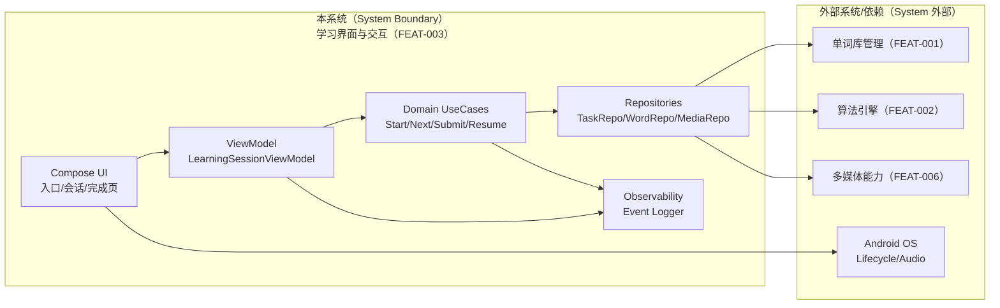
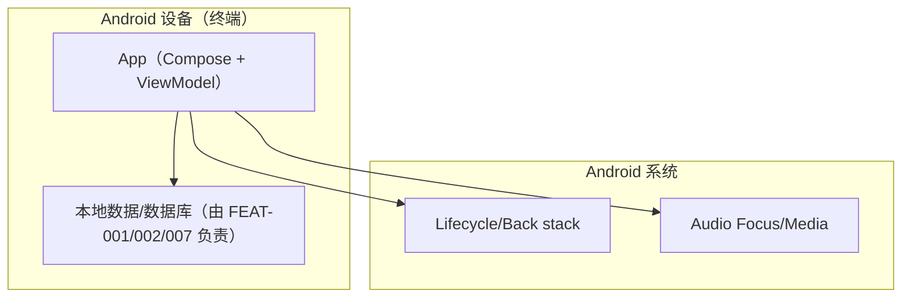
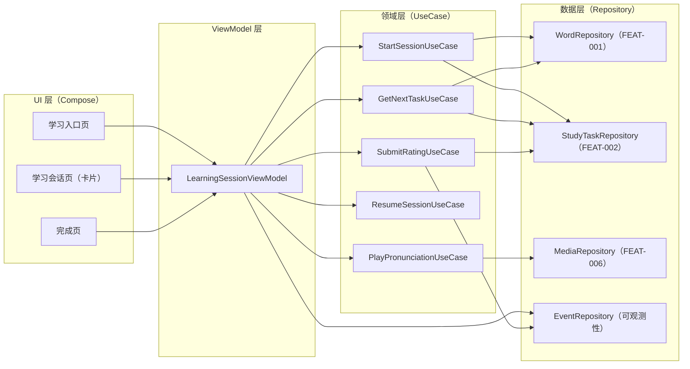

# Full Design：学习界面与交互

**Epic**：EPIC-001 - 无痛记忆单词神器APP  
**Feature ID**：FEAT-003  
**Feature Version**：v0.1.0  
**Plan Version**：v0.1.0  
**Tasks Version**：v0.1.0  
**Full Design Version**：v0.1.0

**分支**：`epic/EPIC-001-word-memory-app`  
**日期**：2026-01-19  
**输入工件**：
- `spec.md`
- `plan.md`
- `tasks.md`
- `research.md` / `data-model.md` / `contracts/` / `quickstart.md`（不存在）

> Agent 规则（强制）：
> - 本文档**只能整合现有产物**（spec/plan/tasks 等），**不得新增技术决策**。
> - 若遇到决策缺口，只能标注为 `TODO(Clarify): ...` 并指向应补齐的来源文档/章节。
> - 本文档用于评审与执行：层次必须清晰、结构化、可追溯。

## 变更记录（增量变更）

| 版本 | 日期 | 变更范围（Feature/Story/Task） | 变更摘要 | 影响模块 | 是否需要回滚设计 |
|---|---|---|---|---|---|
| v0.1.0 | 2026-01-19 | Feature | 初始版本：整合 spec.md、plan.md、tasks.md 生成 Full Design 文档 |  | 否 |

## 1. 背景与范围（来自 spec.md）

- **背景**：
  - 学习界面是用户高频使用的核心路径，直接决定学习是否“顺畅、无痛、可持续”
  - 若交互流程不清晰/反馈不及时，用户会频繁中断，影响学习效率与留存
  - 需要将算法给出的学习任务（新学/复习）转化为直观的“卡片式学习体验”

- **目标**：
  - **用户目标**：用户能以最少步骤完成“看词 → 看答案 → 标记认识/不认识 → 下一题”的循环，并能随时看进度与退出/继续
  - **业务目标**：提升核心学习流程的完成率、连续学习体验，降低流失
  - **平台目标**：沉淀可复用的学习 UI 组件与交互规范，为后续游戏化/统计等功能提供统一入口与事件

- **价值**：
  - **用户价值**：学习流程清晰、操作顺手、反馈及时；在碎片时间也能稳定完成学习
  - **业务价值**：更高的日活与学习时长、更好的留存
  - **技术价值**：形成标准化的学习会话（session）与 UI 状态管理方式，降低后续扩展成本

- **In Scope**：
  - 单词卡片展示：单词/音标/释义（答案默认隐藏）、可选多媒体区域（图片/例句/发音入口）
  - 学习操作：显示答案/翻转；认识/不认识/跳过（或稍后）三类反馈；按钮与手势交互并存
  - 学习流程导航：开始学习/复习入口；题目切换；完成页
  - 学习进度提示：本轮已完成/总数、剩余数量；“今天还需复习/学习”的空状态
  - 基础可访问性：TalkBack 可聚焦与可读的关键控件（按钮、进度、答案显示）

- **Out of Scope**：
  - 复杂的学习游戏/关卡/多人对战（由游戏化 Feature 承担）
  - 词库导入与管理（由单词库管理 Feature 承担）
  - 间隔重复算法细节与参数调优（由算法引擎 Feature 承担）
  - 多媒体资源的下载/缓存/版本管理细节（由多媒体支持 Capability 承担）

- **依赖关系**：
  - **上游依赖**：
    - **单词库管理（FEAT-001）**：当前选择词库、单词基础信息
    - **间隔重复学习算法引擎（FEAT-002）**：学习任务列表、提交学习反馈后返回下一任务/更新状态
    - **多媒体支持（FEAT-006）**：发音/图片/例句等资源的获取与播放/展示（本 Feature 只负责 UI 接入与降级）
    - **用户账户与数据管理（FEAT-007）**：学习会话与学习记录的本地持久化（若方案中需要）
  - **下游影响**：
    - **学习进度与统计（FEAT-005）**：依赖学习事件与会话数据做统计展示
    - **游戏化与激励机制（FEAT-004）**：依赖学习完成/连续学习等事件触发奖励

## 2. 0 层架构设计（对外系统边界、部署、通信、交互）（来自 plan.md）

> 定义：0 层架构设计反映"本系统与外部系统之间的关系"。必须覆盖：结构、部署、通信方式、交互方式与边界。
>
> 规则：本节只允许**复用/整合** `plan.md` 中已经明确的内容；不得新增技术决策。若 plan 缺失，用 `TODO(Clarify)` 指回 plan 对应章节补齐。

### 2.1 外部系统与依赖清单（来自 plan.md）

| 外部系统/依赖 | 类型 | 关键能力/数据 | 通信方式（协议/鉴权） | SLA/限流/超时 | 故障模式 | 我方策略 | 引用来源 |
|---|---|---|---|---|---|---|---|
| 单词库管理（FEAT-001） | 内部 Feature | 当前词库、单词内容（wordId → 展示字段） | Kotlin 函数调用（Repository 接口） | 本地调用 | 词库未选择/数据缺失 | 引导用户先选择词库；空状态兜底 | plan.md:A2.1 |
| 间隔重复算法引擎（FEAT-002） | 内部 Feature | 学习任务、提交反馈、学习状态 | Kotlin suspend/Flow（Engine 接口） | 本地调用；提交反馈超时建议 3s（软超时） | 返回空任务/提交失败/数据不一致 | 空状态；失败停留当前题+重试；记录错误事件 | plan.md:A2.1 |
| 多媒体支持（FEAT-006） | 内部 Feature | 发音/图片/例句等资源的可用性与加载/播放 | Kotlin 接口调用 | 本地调用；播放启动建议 1s（软超时） | 资源缺失/加载失败/播放失败 | 隐藏/置灰入口；提示原因；不阻断学习 | plan.md:A2.1 |
| Android 系统（生命周期/音频） | 设备能力 | 前后台、旋转、音频焦点 | 系统 API | 系统级 | 进程回收/焦点丢失 | 恢复 UI 状态；停止播放；允许重试 | plan.md:A2.1 |

### 2.2 0 层架构图（系统边界 + 外部交互）（来自 plan.md）



### 2.3 部署视图（来自 plan.md）



### 2.4 通信与交互说明（来自 plan.md）

- **协议**：设备能力（Android 系统 API）+ 应用内函数调用（suspend/Flow）
- **鉴权**：N/A（本地调用）；隐私通过"数据不出端 + 日志脱敏"保障
- **超时与重试**：
  - 提交反馈：软超时 3s；失败允许用户重试（FR-006）
  - 获取下一题：软超时 3s；失败提示并允许重试/退出
  - 多媒体播放：启动软超时 1s；失败提示不阻断
- **幂等**：同一题在一次提交完成前必须防重复提交；重复提交需在 Repository 层去重（基于 `sessionId + taskId + rating` 或由算法引擎提供幂等键）
- **限流**：无外部限流；内部限流：同一会话只允许 1 个 in-flight 提交
- **数据一致性**：学习进度权威在算法引擎；UI 只展示与提交。提交成功才切题（避免 UI 与引擎状态漂移）

## 3. 1 层架构设计（系统内部框架图 + 模块拆分 + 接口协议）（来自 plan.md）

> 定义：1 层架构设计描述"系统内部的模块拆分与协作"，包括框架图、模块职责、模块交互、通信方式、接口协议等。

### 3.1 1 层框架图（来自 plan.md）



### 3.2 模块拆分与职责（来自 plan.md）

| 模块 | 职责 | 输入/输出 | 依赖 | 约束 |
|---|---|---|---|---|
| UI（Compose） | 展示卡片、按钮/手势、进度、空状态、完成页 | 输入：ViewModel 状态<br>输出：用户事件 | ViewModel | 不持有业务状态权威；不直接访问 Repository |
| ViewModel | 处理用户事件、并发保护、状态恢复、错误映射 | 输入：用户事件/UseCase 结果<br>输出：`StateFlow<UiState>` | UseCase | 提交期间防重复；失败停留当前题 |
| UseCase | 流程编排：开始会话/取题/提交/恢复/播放发音 | 输入：业务参数<br>输出：业务结果 | Repositories | suspend；明确可重试错误 |
| StudyTaskRepository | 封装算法引擎接口（获取任务/提交反馈） | 输入：sessionType、taskId、rating | FEAT-002 | 要求幂等/去重；超时策略统一 |
| WordRepository | 将 wordId 映射为展示字段（拼写/释义/音标/例句/图片引用） | 输入：wordId<br>输出：WordCardModel | FEAT-001 | 不在日志中输出完整内容文本 |
| MediaRepository | 播放/加载多媒体资源 | 输入：wordId 或 mediaRef | FEAT-006 | 失败不阻断；释放资源 |
| EventRepository | 记录可观测事件（脱敏） | 输入：事件名+字段 | N/A | 不记录释义正文；可采样 |

### 3.3 模块协作与通信方式（来自 plan.md）

- **调用关系**：UI → ViewModel → UseCase → Repository →（FEAT-001/002/006）
- **通信方式**：
  - UI 观察：`StateFlow` + `collectAsStateWithLifecycle`
  - 异步：Kotlin 协程（`viewModelScope` + `Dispatchers.IO/Default`）
  - 错误传播：`Result<T>` 或 `sealed class Failure { retryable: Boolean }`
- **接口协议**：数据结构、版本策略、错误码、重试/幂等约束（引用 plan.md:Plan-B:B4.2）
- **并发与线程模型**：
  - 主线程：Compose 渲染与事件分发
  - Default/IO：取题、提交、媒体准备
  - 并发保护：提交时 UI 禁用 + VM 内 `Mutex`/原子状态，确保同一题仅 1 次提交

### 3.4 关键模块设计（详细设计 + 取舍）（来自 plan.md）

#### 模块：LearningSessionViewModel（会话状态机）

- **模块定位**：学习会话的"唯一 UI 状态源"，维护当前任务、是否显示答案、提交状态与错误提示；位于 ViewModel 层
- **设计目标**：一致性（不跳题/不丢进度）、并发安全（防重复提交）、可恢复（旋转/进程回收）、可观测（事件口径统一）
- **核心状态（建议 UiState）**：
  - `sessionType`：学习/复习
  - `progress`：done/total/remaining（从引擎或会话上下文）
  - `currentTask`：taskId、wordId、taskKind、排序信息（可选）
  - `card`：WordCardModel（拼写/音标/释义/例句/图片引用/是否有发音）
  - `isAnswerRevealed`：Boolean（由 `SavedStateHandle` 保存）
  - `submitState`：Idle/Loading/Failed(retryable)/Success
- **对外事件**：
  - `onRevealAnswer()`
  - `onRate(rating: UserRating)`
  - `onSwipeGesture(action)`
  - `onPlayPronunciation()`
  - `onExitRequest()`（返回确认）
- **失败与降级**：
  - 取题失败：显示错误 + 重试按钮；允许退出
  - 提交失败：停留当前题 + 重试；不改变进度
  - 空任务：空状态（今日已完成）
- **优缺点与替代方案**：不把会话状态分散到多个 `remember`（难以保证并发与恢复一致性）

#### 模块：StudyTaskRepository（算法引擎适配层）

- **模块定位**：将 FEAT-002 的引擎接口适配为 UI 可用的会话语义（Start/Next/Submit），并统一超时/重试/幂等
- **设计目标**：口径统一、错误语义清晰（可重试/不可重试）、幂等提交、防重复
- **策略与算法**：
  - 同一 `taskId` 在一次 `submit` 完成前拒绝新提交
  - 若引擎支持幂等键：使用 `sessionId+taskId`；否则在 repo 内做去重缓存（短期）
- **失败与降级**：超时/失败返回可重试错误；数据损坏返回不可重试错误
- **可观测性**：记录 submit 耗时、失败类型、重试次数（脱敏）

### 3.5 数据模型与存储设计（物理）（来自 plan.md）

本 Feature 不新增权威业务数据模型；但需要明确"会话与 UI 状态"的最小契约。

#### 存储形态与边界

- **存储形态**：
  - 会话权威：算法引擎/学习状态（FEAT-002，可能落 Room）
  - UI 短暂状态：`SavedStateHandle`/`rememberSaveable`（仅保存非敏感布尔/索引/id）
- **System of Record（权威来源）**：FEAT-002 的学习状态/任务调度结果
- **缓存与派生数据**：当前卡片展示字段为派生数据（wordId → WordCardModel）
- **生命周期**：会话页在前台常驻；退出即释放缓存；必要状态（答案显示）跨旋转/回收恢复
- **数据规模与增长**：每次仅缓存 1-2 张卡片；事件记录按采样/聚合（避免过量）

#### 核心实体（来自 spec.md）

- **学习任务（StudyTask）**：由算法引擎提供的待学习/待复习任务，至少包含 wordId、任务类型（新学/复习）、优先级/序号（如有）
- **学习会话（LearningSession）**：一次用户发起的学习过程，包含会话类型（学习/复习）、开始/结束时间、已完成数、任务集合引用
- **卡片状态（CardViewState）**：单词卡片的 UI 状态，包含"答案是否显示"、当前题序、加载状态（提交中/失败重试）
- **用户反馈（UserRating）**：用户对当前题的结果枚举（认识/不认识/跳过），用于提交给算法引擎与统计系统

## 4. 关键流程设计（每个流程一张流程图，含正常 + 全部异常）（来自 plan.md）

> 定义：每个关键流程必须用 `flowchart` 绘制，且同一张图内覆盖正常流程与全部关键异常分支（失败/超时/并发/生命周期等）。

### 流程 1：开始会话并展示第 1 张卡片（FR-001/002）

```mermaid
flowchart TD
  Start([用户点击开始学习/复习]) --> Precheck{已选择词库?}
  Precheck -->|否| GoLibrary[引导去选择/导入词库] --> End([End])
  Precheck -->|是| LoadTasks[向算法引擎请求任务(软超时3s)]

  LoadTasks -->|空列表| Empty[空状态: 今日已完成/暂无可学] --> End
  LoadTasks -->|失败| Err[错误提示 + 重试/返回] --> End
  LoadTasks -->|成功| GetWord[根据wordId取卡片数据]

  GetWord -->|失败| WordErr[展示最小信息/提示缺失 + 允许继续] --> Show
  GetWord -->|成功| Show[展示卡片(答案默认隐藏)] --> End
```

### 流程 2：显示答案 → 提交反馈 → 切题（FR-003/004/006）

```mermaid
flowchart TD
  Start([用户在会话页]) --> Reveal{答案已显示?}
  Reveal -->|否| ShowAns[显示答案/扩展区] --> WaitRate[等待用户反馈]
  Reveal -->|是| WaitRate

  WaitRate --> Rate[点击/手势: 认识/不认识/跳过]
  Rate --> Lock[进入提交中: UI禁用 + 防重复提交]
  Lock --> Submit[提交反馈到算法引擎(软超时3s)]

  Submit -->|成功| Next[获取下一题] --> Reset[答案状态重置为隐藏] --> End([End])
  Submit -->|失败/超时| Fail[停留当前题 + 提示可重试] --> Retry{用户重试?}
  Retry -->|是| Submit
  Retry -->|否| End
```

## 5. Feature → Story → Task 追溯关系

> 规则：
> - Feature 层：FR/NFR（来自 spec.md）
> - Story 层：ST-xxx（来自 plan.md 的 Story Breakdown）
> - Task 层：Txxx（来自 tasks.md）

### 5.1 Story 列表（来自 plan.md）

| Story ID | 类型 | 目标 | 覆盖 FR/NFR | 依赖 | 关键风险 |
|---|---|---|---|---|---|
| ST-001 | Design-Enabler | 可从入口进入会话并正常返回；完成页可展示并回到入口 | FR-001、FR-007、FR-008 | ST-002 可并行；Navigation Compose | 否 |
| ST-002 | Functional | 展示当前单词卡片；答案默认隐藏；显示答案后展示释义与扩展区域占位 | FR-002 | WordRepository（FEAT-001）接口桩 | 否 |
| ST-003 | Functional | 提交一致性与可恢复，严格满足 FR-006 | FR-003、FR-004、FR-006、NFR-REL-001 | StudyTaskRepository（FEAT-002）接口 | 是（RISK-002） |
| ST-004 | Functional | 手势与按钮结果一致，且不会引入重复提交/误触不可控 | FR-005 | ST-003 | Med（误触与可访问性） |
| ST-005 | Functional | 播放失败不影响学习主流程；资源释放正确 | FR-009、NFR-POWER-001 | MediaRepository（FEAT-006）接口桩 | 是（RISK-004） |
| ST-006 | Infrastructure | 满足"不回退超过 1 题"的恢复策略 | FR-008、NFR-REL-002 | ST-003 | 是（RISK-003） |
| ST-007 | Optimization | 满足 NFR-PERF 与 NFR-MEM 门槛 | NFR-PERF-001、NFR-PERF-002、NFR-MEM-001 | ST-002、（可选）图片加载库 | 是（RISK-001） |
| ST-008 | Infrastructure | 满足 NFR-OBS 与 NFR-SEC；为后续统计/游戏化复用事件口径 | NFR-OBS-001、NFR-OBS-002、NFR-SEC-001 | ST-001/002/003（需要埋点点位） | 是（RISK-005） |

### 5.2 追溯矩阵（FR/NFR → Story → Task）

| FR/NFR ID | Story ID | Task ID | 验证方式（来自 tasks.md） | 备注 |
|---|---|---|---|---|
| FR-001 | ST-001 | T100-T103 | 手工走通导航；UI 测试验证 back stack 与退出确认 | 入口与进入会话 |
| FR-002 | ST-002 | T200-T202 | UI 测试：进入后默认隐藏；点击后显示 | 默认隐藏 + 显示答案 |
| FR-003 | ST-003 | T300-T304 | 模拟失败/超时；验证不跳题且可重试；验证进度更新 | 三类反馈 |
| FR-004 | ST-003 | T300-T304 | 模拟失败/超时；验证不跳题且可重试；验证进度更新 | 成功切题 + 进度更新 |
| FR-005 | ST-004 | T400-T401 | 手势触发与按钮触发的结果一致；可在无障碍场景下弱化手势 | 手势一致性 |
| FR-006 | ST-003 | T300-T304 | 模拟失败/超时；验证不跳题且可重试；验证进度更新 | 防重复提交 + 失败重试 |
| FR-007 | ST-001 | T100-T103 | 手工走通导航；UI 测试验证 back stack 与退出确认 | 完成页 |
| FR-008 | ST-001、ST-006 | T100-T103、T600-T602 | 旋转/后台/进程回收后恢复；monkey 测试 | 返回确认 + 生命周期恢复 |
| FR-009 | ST-005 | T500-T503 | 播放成功/失败/切后台停止；功耗 profiler 对比验证无异常唤醒 | 发音入口 |
| FR-010 | ST-002、ST-007 | T200-T202、T700-T704 | UI 测试：进入后默认隐藏；点击后显示；Frame metrics 长帧占比与 profiler 峰值内存验证 | 扩展信息展示 + 内存预算 |
| NFR-PERF-001 | ST-007 | T700-T704 | Frame metrics / JankStats 统计长帧占比；手工 profile 验证切题期间主线程无重 IO/大对象分配 | 首帧/切题阈值 |
| NFR-PERF-002 | ST-007 | T700-T704 | Frame metrics 长帧占比与 profiler 峰值内存验证 | 长帧占比 |
| NFR-POWER-001 | ST-005 | T500-T503 | 播放成功/失败/切后台停止；功耗 profiler 对比验证无异常唤醒 | 播放触发与省电策略 |
| NFR-MEM-001 | ST-007 | T700-T704 | Android Studio Memory profiler：会话页进入→切 30 题→退出，观察峰值与回落；无持续增长 | 图片峰值内存 |
| NFR-SEC-001 | ST-008 | T800-T803 | 审查事件字段；单测验证脱敏；手工验证关键路径都有事件 | 日志/埋点脱敏 |
| NFR-OBS-001 | ST-008 | T800-T803 | 审查事件字段；单测验证脱敏；手工验证关键路径都有事件 | 关键事件 |
| NFR-OBS-002 | ST-008 | T800-T803 | 审查事件字段；单测验证脱敏；手工验证关键路径都有事件 | 错误定位字段 |
| NFR-REL-001 | ST-003 | T300-T304 | 模拟失败/超时；验证不跳题且可重试；验证进度更新 | crash-free/提交成功率（以事件+崩溃统计验证） |
| NFR-REL-002 | ST-006 | T600-T602 | 旋转/后台/进程回收后恢复；monkey 测试 | 进程回收恢复策略 |

## 6. 技术风险与消解策略（来自 plan.md）

| 风险ID | 风险描述 | 触发条件 | 影响范围 | 严重度 | 消解策略 | 对应 Story/Task |
|---|---|---|---|---|---|---|
| RISK-001 | 切题/滑动导致卡顿（长帧） | 图片过大、重组过多、动画过重 | 体验、留存 | High | 图片采样+占位；减少重组；用 Frame metrics 验收 | ST-007 / T700-T704 |
| RISK-002 | 反馈提交竞态导致"跳题/重复提交" | 快速连点/手势重复触发 | 进度一致性 | High | VM+Repo 双重并发保护；幂等键/去重；UI 禁用 | ST-003 / T300-T304 |
| RISK-003 | 进程回收后恢复不一致 | SavedState 未覆盖关键字段 | 可靠性 | Med | 权威进度交给引擎；UI 状态进 SavedState；恢复验收用 monkey/旋转 | ST-006 / T600-T602 |
| RISK-004 | 音频播放资源泄漏/焦点处理错误 | 多次播放/切后台 | 功耗、崩溃 | Med | 通过 FEAT-006 统一播放器；在 `onStop` 释放；焦点丢失停止 | ST-005 / T500-T503 |
| RISK-005 | 日志/埋点泄露内容文本 | 直接记录释义/例句 | 隐私合规 | High | 事件字段仅允许 wordId/枚举/耗时；审查与测试关卡 | ST-008 / T800-T803 |

## 7. 异常 & 边界场景梳理（来自 spec.md + plan.md）

- **数据边界**：
  - 无词库/无任务：空状态
  - 单词字段缺失：按"最小可展示字段"降级（至少拼写），缺失字段不占位
  - 多媒体缺失：入口隐藏或置灰
- **状态边界**：
  - 答案未显示时禁止提交反馈（或自动先显示答案再允许）
  - 提交中禁止切题/重复提交
- **生命周期**：
  - 旋转/切后台/返回：保持当前题与答案显示状态；返回弹窗确认
  - 进程回收：至少恢复到同一题（或下一题，不回退超过 1 题）
- **并发**：
  - 同时触发按钮与手势：只允许 1 条提交管线生效
  - 多媒体播放与提交并行：互不阻塞；播放失败不影响提交
- **用户行为**：
  - 快速连点/误触：节流 + 禁用
  - 无障碍：按钮为主路径；手势可弱化；状态变化可感知

## 8. 埋点/可观测性设计（来自 spec.md NFR-OBS + plan.md 约束）

> 注意：只整合既有要求；不要新增指标口径或埋点策略决策。

| 事件/指标 | 触发点 | 字段 | 采样/频率 | 用途 | 关联 FR/NFR |
|---|---|---|---|---|---|
| 进入学习界面 | 用户进入学习会话页 | sessionType、wordId | 每次 | 统计学习启动 | NFR-OBS-001 |
| 退出学习界面 | 用户退出学习会话页 | sessionType、completedCount | 每次 | 统计学习完成情况 | NFR-OBS-001 |
| 显示答案 | 用户点击显示答案 | wordId、elapsedMs | 每次 | 分析学习行为 | NFR-OBS-001 |
| 提交反馈 | 用户提交认识/不认识/跳过 | wordId、rating、elapsedMs、retryCount | 每次 | 统计学习结果与耗时 | NFR-OBS-001 |
| 完成会话 | 本轮学习完成 | sessionType、completedCount、totalTime | 每次 | 统计学习完成情况 | NFR-OBS-001 |
| 提交失败 | 提交反馈失败 | wordId、errorType、retryable | 每次失败 | 问题排查与错误分析 | NFR-OBS-001、NFR-OBS-002 |
| 崩溃/关键错误 | 应用崩溃或关键错误 | sessionType、taskIndex、libraryId（不含敏感内容） | 每次 | 错误定位与问题排查 | NFR-OBS-002 |

**字段白名单约束**（来自 plan.md B2）：
- 允许：`sessionType`、`wordId`、`taskId`（如可用）、`rating`、`elapsedMs`、`errorType`、`retryCount`
- 禁止：释义/例句正文、图片 URL（若包含敏感信息）

## 9. 算法 / 性能 / 功耗 / 内存评估结果（来自 plan.md）

### 9.1 算法评估

本 Feature 不新增算法；算法正确性与调度策略由 FEAT-002 负责。本 Feature 的验收关注"接口调用正确 + 一致性 + 体验指标"。

### 9.2 性能评估

- **前台关键路径**：
  - 进入学习会话首帧：p95 ≤ 500ms（在任务/单词数据可用的前提下）
  - 提交成功后切题 UI 更新：p95 ≤ 100ms
  - 连续学习 30 题：长帧（>100ms）占比 ≤ 1%
- **验收指标 & 测试方法**：
  - Frame metrics / JankStats（或 FrameTimeline）：统计长帧占比
  - 手工 profile：打开 Android Studio profiler 验证切题期间主线程无重 IO/大对象分配
- **降级策略**：
  - 图片：降低分辨率/禁用 crossfade；延迟加载
  - 文本：避免昂贵的富文本处理；减少不必要重组

### 9.3 功耗评估

- **Top5% 用户模型**：
  - 每日学习 30 分钟；包含发音播放（每分钟 1 次，约 30 次/天）；图片卡片占比 30%
- **测量口径**：
  - Android Studio Energy Profiler（粗）
  - 对比基线：关闭发音/图片 vs 开启发音/图片
- **预估增量**：学习界面相关功耗增量 ≤ 5mAh/天（与 `spec.md` 一致）
- **验收上限**：
  - 若超过阈值：默认关闭"自动预加载多媒体"（若实现）；降低图片预取；减少动画
- **降级策略**：
  - 低电量模式/省电模式：禁用多媒体预取；仅用户点击才加载/播放

### 9.4 内存评估

- **峰值增量**：展示含图片的卡片时，额外峰值内存 ≤ 30MB（与 `spec.md` 一致）
- **平均增量**：会话常驻状态增量 ≤ 10MB（不含系统/其它模块）
- **生命周期**：
  - 仅缓存当前/下一张卡片数据；离开会话页释放对图片/播放器的引用
- **风险与对策**：
  - 大图 OOM：强制采样、限制最大解码尺寸、占位图
  - 泄漏：播放器与 ImageLoader 不持有 Activity；在 `DisposableEffect`/VM `onCleared` 释放
- **验收标准**：
  - Android Studio Memory profiler：会话页进入→切 30 题→退出，观察峰值与回落；无持续增长

## 10. 执行说明（只引用 tasks.md，不新增 Task）

- **执行入口**：`tasks.md`
- **验证入口**：各 Task 的验证清单 + Plan 的验收指标
- **禁止事项**：Implement 期不得修改 Plan 设计；变更走增量变更流程并提升版本

### 10.1 任务汇总（来自 tasks.md）

- **任务总数**：约 50+ 个任务
- **Story 任务分布**：
  - ST-001：4 个任务（T100-T103）
  - ST-002：3 个任务（T200-T202）
  - ST-003：5 个任务（T300-T304）
  - ST-004：2 个任务（T400-T401）
  - ST-005：4 个任务（T500-T503）
  - ST-006：3 个任务（T600-T602）
  - ST-007：5 个任务（T700-T704）
  - ST-008：4 个任务（T800-T803）
- **MVP 范围建议**：ST-001 + ST-002 + ST-003（形成最小可用学习流程）

### 10.2 执行顺序（来自 tasks.md）

- **阶段 0**：准备（版本对齐）
- **阶段 1**：环境搭建（目录结构、依赖、工具配置）
- **阶段 2**：核心基础（数据模型、Repository 接口、UseCase 骨架、ViewModel 骨架）
- **阶段 3-10**：Story 阶段（ST-001 至 ST-008）
- **可并行 Story**：ST-001、ST-002、ST-003、ST-005、ST-008 可在核心基础完成后并行启动
