# Plan（工程级蓝图）：学习界面与交互

**Epic**：EPIC-001 - 无痛记忆单词神器APP  
**Feature ID**：FEAT-003  
**Feature Version**：v0.1.0（来自 `spec.md`）  
**Plan Version**：v0.2.0  
**当前工作分支**：`epic/EPIC-001-word-memory-app`  
**Feature 目录**：`specs/epics/EPIC-001-word-memory-app/features/FEAT-003-learning-ui/`  
**日期**：2026-01-19  
**输入**：来自 `Feature 目录/spec.md`

> 规则：
> - Plan 阶段必须包含工程决策、风险评估、算法/功耗/性能/内存评估（量化 + 验收指标）。
> - Implement 阶段**不得**擅自改写 Plan 的技术决策；若必须变更，走增量变更流程并提升 Version。

## 变更记录（增量变更）

| 版本 | 日期 | 变更范围（Feature/Story/Task） | 变更摘要 | 影响模块 | 是否需要回滚设计 |
|---|---|---|---|---|---|
| v0.1.0 | 2026-01-19 | Feature | 初始版本：创建 Plan 工程级蓝图，完成架构设计、关键流程、量化指标与 Story 拆分 | 学习 UI、会话状态、可观测性 | 否 |
| v0.2.0 | 2026-01-19 | Feature | 按新规范补齐模块级 UML：为 A3.2 的 7 个模块（UI/ViewModel/UseCase/StudyTaskRepository/WordRepository/MediaRepository/EventRepository）补齐 UML 类图 + 成功/异常时序图 + 异常清单表 | A3.4 所有模块 | 否 |

## 概述

**核心需求**：提供卡片式学习会话界面，将算法引擎（FEAT-002）提供的学习任务转化为“展示 → 显示答案 → 提交反馈 → 下一题”的高频循环；支持中断/继续、失败重试、多媒体入口（发音/图片/例句）及可观测性与隐私约束。

**关键工程决策**：
1. **架构模式**：沿用 EPIC 内已有 Plan 风格（FEAT-001/002）：Compose UI + ViewModel + UseCase + Repository（Result/Sealed Error + Flow/StateFlow）。
2. **导航与入口**：使用 Navigation Compose 管理“入口页/学习会话/完成页”，便于回退与深链扩展。
3. **会话与状态恢复**：学习进度的权威来源为算法引擎（FEAT-002）的学习状态；UI 仅持有“当前题 UI 状态（如答案显示）”并通过 `SavedStateHandle`/`rememberSaveable` 保障旋转/进程回收恢复。
4. **交互一致性**：按钮为必选主路径；手势为增强路径（可关闭/可回退），与按钮复用同一提交管线，避免双实现口径漂移。
5. **多媒体接入**：本 Feature 不实现资源管理；通过 `MediaCapability`/`PronunciationPlayer` 等接口接入 FEAT-006，失败不阻断主流程。

## Plan-A：工程决策 & 风险评估（必须量化）

### A1. 技术选型（候选方案对比 + 决策理由）

| 决策点 | 候选方案 | 优缺点 | 约束/风险 | 决策 | 决策理由 |
|---|---|---|---|---|---|
| 导航实现 | A: Navigation Compose<br>B: 手写 Router（状态机/when） | A: 标准化 back stack、deep link、易测试<br>B: 依赖少但易长成“巨型 when” | 需要多页面（入口/会话/完成），且要支持“退出确认/恢复” | A | 与 Compose 生态契合，且便于后续扩展 |
| UI 状态管理 | A: ViewModel + StateFlow + SavedStateHandle<br>B: 全部 `rememberSaveable` | A: 逻辑集中、可测试、可做重试/并发保护<br>B: 简单，但异步/错误/并发会失控 | 需要提交反馈、失败重试、防重复提交 | A | 与 FEAT-001/002 风格一致，便于共享基础设施 |
| 反馈提交结果建模 | A: `Result<T>` + `sealed class Error`<br>B: Exception 直抛 | A: 可控、可映射到 UI 文案、可重试语义清晰<br>B: 简单但容易遗漏分类与重试策略 | FR-006 要求明确重试与停留当前题 | A | 让“可重试/不可重试”成为显式契约 |
| 手势实现 | A: `Modifier.pointerInput` + gesture detector（自定义）<br>B: 仅按钮不做手势 | A: 体验更高效，但要处理可访问性与误触<br>B: 实现简单 | FR-005 要求至少一种高频手势；且必须与按钮一致 | A | 作为可选增强，默认开启但可在可访问性模式下弱化 |
| 图片加载（若有） | A: Coil Compose<br>B: 手写 Bitmap 解码 | A: 成熟、缓存/采样完善<br>B: 可控但极易 OOM/泄漏 | NFR-MEM 预算严格（峰值 ≤ 30MB） | A | 让成熟库承担采样与缓存策略，降低风险 |
| 发音播放 | A: 依赖 FEAT-006 的播放器接口（内部可能用 Media3/MediaPlayer/TTS）<br>B: 本 Feature 直接用 MediaPlayer | A: 职责清晰、复用、可替换<br>B: 快但与 FEAT-006 重复 | Feature 边界：多媒体能力不在本 Feature 负责 | A | 与 spec 的“只负责 UI 接入与降级”一致 |

### A2. 0 层架构设计（对外系统边界、部署、通信、交互）

#### A2.1 外部系统与依赖清单（必须）

| 外部系统/依赖 | 类型（三方/内部服务/设备能力） | 关键能力/数据 | 通信方式（协议/鉴权） | SLA/限流/超时 | 故障模式 | 我方策略 |
|---|---|---|---|---|---|---|
| 单词库管理（FEAT-001） | 内部 Feature | 当前词库、单词内容（wordId → 展示字段） | Kotlin 函数调用（Repository 接口） | 本地调用 | 词库未选择/数据缺失 | 引导用户先选择词库；空状态兜底 |
| 间隔重复算法引擎（FEAT-002） | 内部 Feature | 学习任务、提交反馈、学习状态 | Kotlin suspend/Flow（Engine 接口） | 本地调用；提交反馈超时建议 3s（软超时） | 返回空任务/提交失败/数据不一致 | 空状态；失败停留当前题+重试；记录错误事件 |
| 多媒体支持（FEAT-006） | 内部 Feature | 发音/图片/例句等资源的可用性与加载/播放 | Kotlin 接口调用 | 本地调用；播放启动建议 1s（软超时） | 资源缺失/加载失败/播放失败 | 隐藏/置灰入口；提示原因；不阻断学习 |
| Android 系统（生命周期/音频） | 设备能力 | 前后台、旋转、音频焦点 | 系统 API | 系统级 | 进程回收/焦点丢失 | 恢复 UI 状态；停止播放；允许重试 |

#### A2.2 0 层架构图（系统边界 + 外部交互）

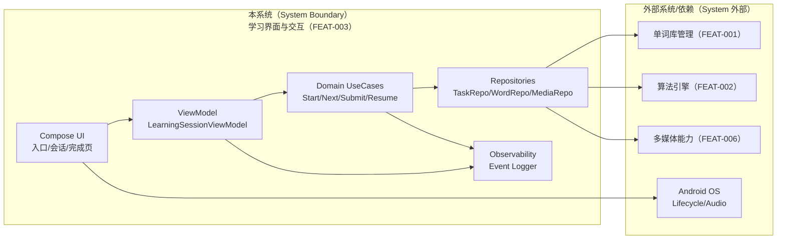
```mermaid
flowchart LR
  subgraph System["本系统（System Boundary）<br/>学习界面与交互（FEAT-003）"]
    UI["Compose UI<br/>入口/会话/完成页"]
    VM["ViewModel<br/>LearningSessionViewModel"]
    UC["Domain UseCases<br/>Start/Next/Submit/Resume"]
    Repo["Repositories<br/>TaskRepo/WordRepo/MediaRepo"]
    Obs["Observability<br/>Event Logger"]
  end

  subgraph External["外部系统/依赖（System 外部）"]
    Lib["单词库管理（FEAT-001）"]
    Algo["算法引擎（FEAT-002）"]
    Media["多媒体能力（FEAT-006）"]
    OS["Android OS<br/>Lifecycle/Audio"]
  end

  UI --> VM
  VM --> UC
  UC --> Repo
  Repo --> Lib
  Repo --> Algo
  Repo --> Media
  VM --> Obs
  UC --> Obs
  UI --> OS
```

#### A2.3 部署视图（必须）

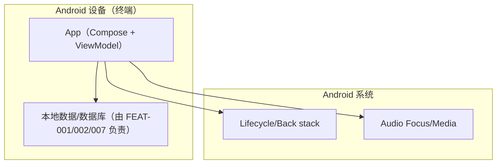
```mermaid
flowchart TB
  subgraph Device["Android 设备（终端）"]
    App["App（Compose + ViewModel）"]
    Local["本地数据/数据库（由 FEAT-001/002/007 负责）"]
  end
  subgraph Android["Android 系统"]
    Lifecycle["Lifecycle/Back stack"]
    Audio["Audio Focus/Media"]
  end
  App --> Local
  App --> Lifecycle
  App --> Audio
```

#### A2.4 通信与交互说明（必须）

- **协议**：设备能力（Android 系统 API）+ 应用内函数调用（suspend/Flow）
- **鉴权**：N/A（本地调用）；隐私通过“数据不出端 + 日志脱敏”保障
- **超时与重试**：
  - 提交反馈：软超时 3s；失败允许用户重试（FR-006）
  - 获取下一题：软超时 3s；失败提示并允许重试/退出
  - 多媒体播放：启动软超时 1s；失败提示不阻断
- **幂等**：同一题在一次提交完成前必须防重复提交；重复提交需在 Repository 层去重（基于 `sessionId + taskId + rating` 或由算法引擎提供幂等键）
- **限流**：无外部限流；内部限流：同一会话只允许 1 个 in-flight 提交
- **数据一致性**：学习进度权威在算法引擎；UI 只展示与提交。提交成功才切题（避免 UI 与引擎状态漂移）

### A3. 1 层架构设计（系统内部框架图 + 模块拆分 + 接口协议）

#### A3.1 1 层框架图（必须）

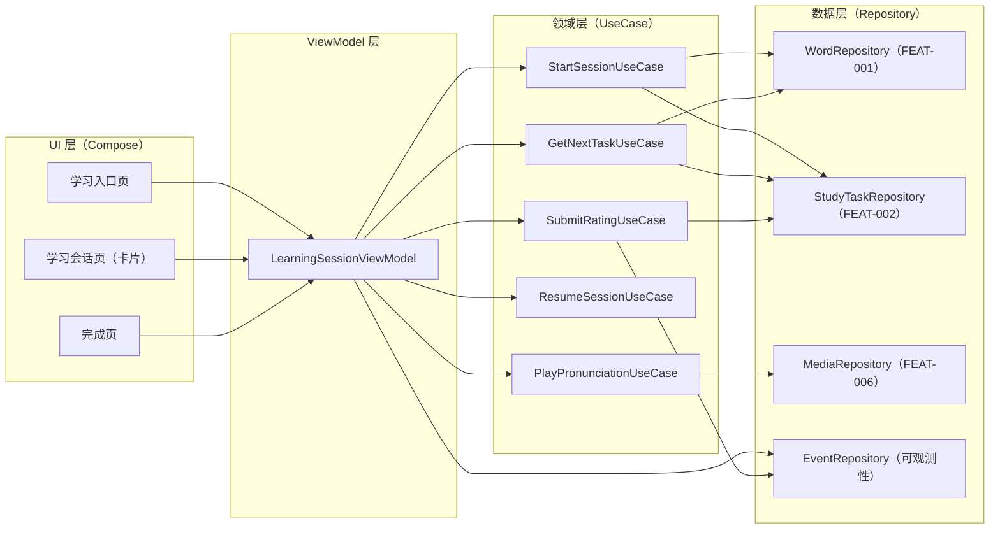
```mermaid
flowchart LR
  subgraph UI["UI 层（Compose）"]
    Entry["学习入口页"]
    Session["学习会话页（卡片）"]
    Done["完成页"]
  end

  subgraph VM["ViewModel 层"]
    LearningVM["LearningSessionViewModel"]
  end

  subgraph Domain["领域层（UseCase）"]
    Start["StartSessionUseCase"]
    Next["GetNextTaskUseCase"]
    Submit["SubmitRatingUseCase"]
    Resume["ResumeSessionUseCase"]
    Play["PlayPronunciationUseCase"]
  end

  subgraph Data["数据层（Repository）"]
    WordRepo["WordRepository（FEAT-001）"]
    TaskRepo["StudyTaskRepository（FEAT-002）"]
    MediaRepo["MediaRepository（FEAT-006）"]
    EventRepo["EventRepository（可观测性）"]
  end

  Entry --> LearningVM
  Session --> LearningVM
  Done --> LearningVM

  LearningVM --> Start
  LearningVM --> Next
  LearningVM --> Submit
  LearningVM --> Resume
  LearningVM --> Play

  Start --> TaskRepo
  Next --> TaskRepo
  Submit --> TaskRepo
  Start --> WordRepo
  Next --> WordRepo
  Play --> MediaRepo
  LearningVM --> EventRepo
  Submit --> EventRepo
```

#### A3.2 模块拆分与职责（必须）

| 模块 | 职责 | 输入/输出 | 依赖 | 约束 |
|---|---|---|---|---|
| UI（Compose） | 展示卡片、按钮/手势、进度、空状态、完成页 | 输入：ViewModel 状态<br>输出：用户事件 | ViewModel | 不持有业务状态权威；不直接访问 Repository |
| ViewModel | 处理用户事件、并发保护、状态恢复、错误映射 | 输入：用户事件/UseCase 结果<br>输出：`StateFlow<UiState>` | UseCase | 提交期间防重复；失败停留当前题 |
| UseCase | 流程编排：开始会话/取题/提交/恢复/播放发音 | 输入：业务参数<br>输出：业务结果 | Repositories | suspend；明确可重试错误 |
| StudyTaskRepository | 封装算法引擎接口（获取任务/提交反馈） | 输入：sessionType、taskId、rating | FEAT-002 | 要求幂等/去重；超时策略统一 |
| WordRepository | 将 wordId 映射为展示字段（拼写/释义/音标/例句/图片引用） | 输入：wordId<br>输出：WordCardModel | FEAT-001 | 不在日志中输出完整内容文本 |
| MediaRepository | 播放/加载多媒体资源 | 输入：wordId 或 mediaRef | FEAT-006 | 失败不阻断；释放资源 |
| EventRepository | 记录可观测事件（脱敏） | 输入：事件名+字段 | N/A | 不记录释义正文；可采样 |

#### A3.3 模块协作与通信方式（必须）

- **调用关系**：UI → ViewModel → UseCase → Repository →（FEAT-001/002/006）
- **通信方式**：
  - UI 观察：`StateFlow` + `collectAsStateWithLifecycle`
  - 异步：Kotlin 协程（`viewModelScope` + `Dispatchers.IO/Default`）
  - 错误传播：`Result<T>` 或 `sealed class Failure { retryable: Boolean }`
- **并发与线程模型**：
  - 主线程：Compose 渲染与事件分发
  - Default/IO：取题、提交、媒体准备
  - 并发保护：提交时 UI 禁用 + VM 内 `Mutex`/原子状态，确保同一题仅 1 次提交

#### A3.4 关键模块设计（详细设计 + 取舍，必须）

> **重要（模块级 UML 规范）**：
> - 以 `A3.2 模块拆分与职责` 为准：每个模块必须在本节拥有一个对应小节。
> - 每个模块小节必须包含：
>   - **UML 类图（1 张）**：描述模块内部关键类/接口/数据结构，以及依赖方向
>   - **UML 时序图（成功，1 张）**：描述主调用链路（包含线程/协程边界点、关键状态更新点）
>   - **UML 时序图（异常，1 张）**：用 `alt/else` 覆盖关键异常（超时/IO失败/权限/并发重入/取消/数据损坏等）
>   - **异常清单表**：列出异常 → 对策（可重试/不可重试、回滚、一致性、用户提示、可观测性）

##### 模块：UI（Compose）

- **模块定位**：学习界面的 UI 展示层，包括入口页、会话页（卡片）、完成页；位于 UI 层（Jetpack Compose）
- **设计目标**：流畅的交互体验、可访问性、状态响应式更新
- **核心数据结构/状态**：
  - `LearningUiState`：从 ViewModel 观察的状态（`StateFlow`）
  - `CardDisplayState`：卡片展示状态（答案显示/隐藏、加载中）
- **对外接口（协议）**：通过 Compose 事件回调传递给 ViewModel
- **策略与算法**：响应式 UI（状态驱动）、手势检测（`Modifier.pointerInput`）
- **失败与降级**：UI 层不处理业务失败，仅展示 ViewModel 提供的错误状态
- **安全与隐私**：不在 UI 层记录日志，仅展示内容
- **可观测性**：无（由 ViewModel 层统一记录）
- **优缺点**：
  - **优点**：声明式 UI，状态驱动，易于测试
  - **缺点/代价**：需要理解 Compose 重组机制，避免过度重组
  - **替代方案与否决理由**：XML Layout 不符合 EPIC 技术约束（必须使用 Compose）

###### UML 类图（静态，必须）

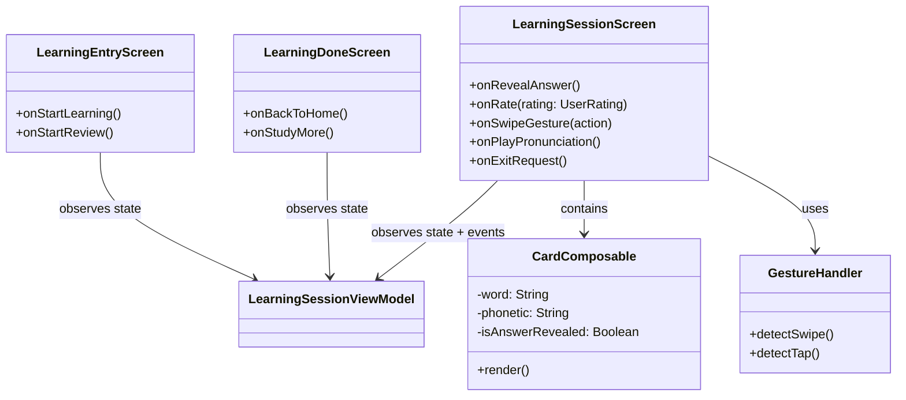
```mermaid
classDiagram
    class LearningEntryScreen {
        +onStartLearning()
        +onStartReview()
    }
    class LearningSessionScreen {
        +onRevealAnswer()
        +onRate(rating: UserRating)
        +onSwipeGesture(action)
        +onPlayPronunciation()
        +onExitRequest()
    }
    class LearningDoneScreen {
        +onBackToHome()
        +onStudyMore()
    }
    class CardComposable {
        -word: String
        -phonetic: String
        -isAnswerRevealed: Boolean
        +render()
    }
    class GestureHandler {
        +detectSwipe()
        +detectTap()
    }
    
    LearningEntryScreen --> LearningSessionViewModel : observes state
    LearningSessionScreen --> LearningSessionViewModel : observes state + events
    LearningDoneScreen --> LearningSessionViewModel : observes state
    LearningSessionScreen --> CardComposable : contains
    LearningSessionScreen --> GestureHandler : uses
```

###### UML 时序图 - 成功链路（动态，必须）

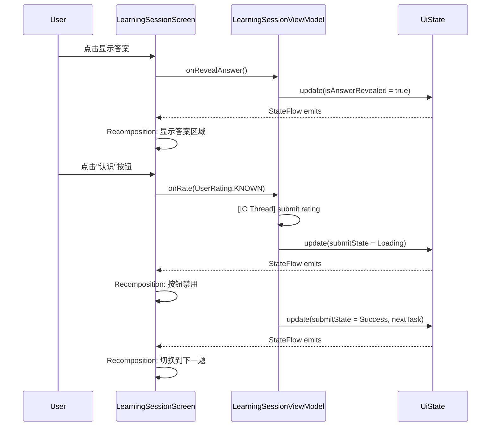
```mermaid
sequenceDiagram
    participant User
    participant UI as LearningSessionScreen
    participant VM as LearningSessionViewModel
    participant State as UiState
    
    User->>UI: 点击显示答案
    UI->>VM: onRevealAnswer()
    VM->>State: update(isAnswerRevealed = true)
    State-->>UI: StateFlow emits
    UI->>UI: Recomposition: 显示答案区域
    
    User->>UI: 点击"认识"按钮
    UI->>VM: onRate(UserRating.KNOWN)
    VM->>VM: [IO Thread] submit rating
    VM->>State: update(submitState = Loading)
    State-->>UI: StateFlow emits
    UI->>UI: Recomposition: 按钮禁用
    
    VM->>State: update(submitState = Success, nextTask)
    State-->>UI: StateFlow emits
    UI->>UI: Recomposition: 切换到下一题
```

###### UML 时序图 - 异常链路（动态，必须）

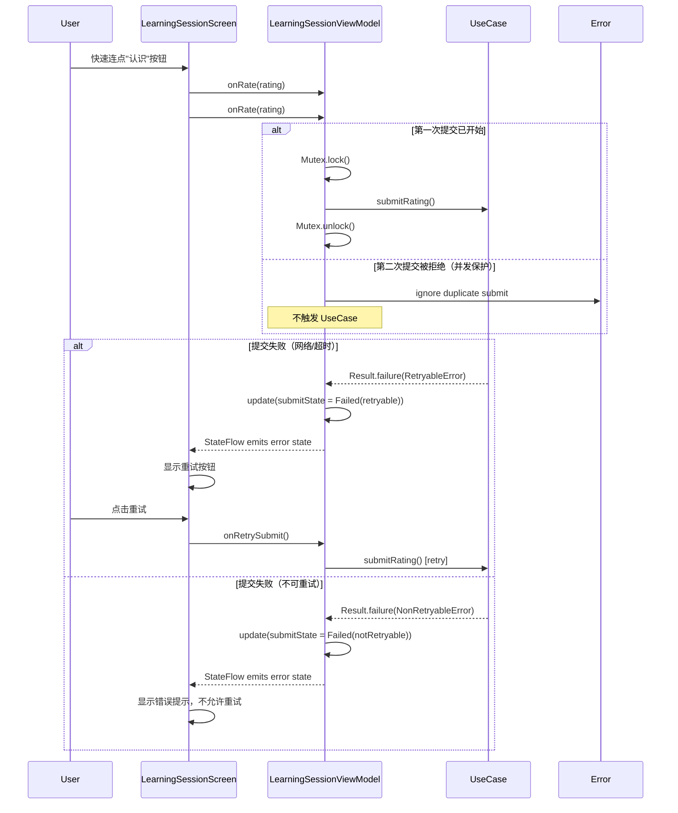
```mermaid
sequenceDiagram
    participant User
    participant UI as LearningSessionScreen
    participant VM as LearningSessionViewModel
    participant UseCase
    participant Error
    
    User->>UI: 快速连点"认识"按钮
    UI->>VM: onRate(rating) #1
    UI->>VM: onRate(rating) #2
    
    alt 第一次提交已开始
        VM->>VM: Mutex.lock()
        VM->>UseCase: submitRating()
        VM->>VM: Mutex.unlock()
    else 第二次提交被拒绝（并发保护）
        VM->>Error: ignore duplicate submit
        Note over VM: 不触发 UseCase
    end
    
    alt 提交失败（网络/超时）
        UseCase-->>VM: Result.failure(RetryableError)
        VM->>VM: update(submitState = Failed(retryable))
        VM-->>UI: StateFlow emits error state
        UI->>UI: 显示重试按钮
        User->>UI: 点击重试
        UI->>VM: onRetrySubmit()
        VM->>UseCase: submitRating() [retry]
    else 提交失败（不可重试）
        UseCase-->>VM: Result.failure(NonRetryableError)
        VM->>VM: update(submitState = Failed(notRetryable))
        VM-->>UI: StateFlow emits error state
        UI->>UI: 显示错误提示，不允许重试
    end
```

###### 关键异常清单（必须，且与异常时序图互校）

| 异常ID | 触发点（步骤/组件） | 触发条件 | 错误类型/错误码 | 可重试 | 对策（降级/回滚/一致性） | 用户提示 | 日志/埋点字段 | 关联 NFR |
|---|---|---|---|---|---|---|---|---|
| EX-UI-001 | UI 点击事件处理 | 快速连点/手势重复触发 | 重复事件 | 否 | ViewModel 层并发保护，忽略重复 | 无（按钮已禁用） | event: duplicate_submit | NFR-REL-001 |
| EX-UI-002 | Compose 重组 | 状态更新导致过度重组 | 性能问题 | 否 | 优化状态粒度，使用 `remember` 缓存 | 无（用户体验卡顿） | performance: jank_detected | NFR-PERF-002 |

##### 模块：ViewModel

- **模块定位**：学习会话的“唯一 UI 状态源”，维护当前任务、是否显示答案、提交状态与错误提示；位于 ViewModel 层
- **设计目标**：一致性（不跳题/不丢进度）、并发安全（防重复提交）、可恢复（旋转/进程回收）、可观测（事件口径统一）
- **核心数据结构/状态**：
  - `LearningUiState`：sealed class 包含所有 UI 状态（Loading/Content/Error/Empty/Done）
  - `submitMutex`：`Mutex` 用于并发保护提交操作
  - `SavedStateHandle`：保存 `isAnswerRevealed`、`currentTaskId` 等恢复所需状态
- **对外接口（协议）**：
  - `val uiState: StateFlow<LearningUiState>`
  - `fun onRevealAnswer()`
  - `fun onRate(rating: UserRating)`
  - `fun onRetrySubmit()`
- **策略与算法**：状态机管理（Loading → Content → Submit → Next），并发保护（`Mutex`），状态恢复（`SavedStateHandle`）
- **失败与降级**：
  - 取题失败：显示错误 + 重试按钮；允许退出
  - 提交失败：停留当前题 + 重试；不改变进度
  - 空任务：空状态（今日已完成）
- **安全与隐私**：不记录内容文本，仅记录 wordId/枚举
- **可观测性**：记录进入/退出、显示答案、提交（成功/失败）事件
- **优缺点**：
  - **优点**：集中状态管理，可测试，支持恢复
  - **缺点/代价**：状态类可能较大，需要合理拆分
  - **替代方案与否决理由**：不把会话状态分散到多个 `remember`（难以保证并发与恢复一致性）

###### UML 类图（静态，必须）

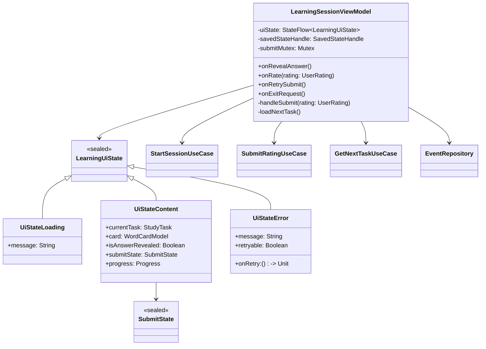
```mermaid
classDiagram
    class LearningSessionViewModel {
        -uiState: StateFlow~LearningUiState~
        -savedStateHandle: SavedStateHandle
        -submitMutex: Mutex
        +onRevealAnswer()
        +onRate(rating: UserRating)
        +onRetrySubmit()
        +onExitRequest()
        -handleSubmit(rating: UserRating)
        -loadNextTask()
    }
    class LearningUiState {
        <<sealed>>
    }
    class UiStateLoading {
        +message: String
    }
    class UiStateContent {
        +currentTask: StudyTask
        +card: WordCardModel
        +isAnswerRevealed: Boolean
        +submitState: SubmitState
        +progress: Progress
    }
    class UiStateError {
        +message: String
        +retryable: Boolean
        +onRetry: () -> Unit
    }
    class SubmitState {
        <<sealed>>
    }
    class StartSessionUseCase
    class SubmitRatingUseCase
    class GetNextTaskUseCase
    class EventRepository
    
    LearningSessionViewModel --> LearningUiState
    LearningUiState <|-- UiStateLoading
    LearningUiState <|-- UiStateContent
    LearningUiState <|-- UiStateError
    UiStateContent --> SubmitState
    LearningSessionViewModel --> StartSessionUseCase
    LearningSessionViewModel --> SubmitRatingUseCase
    LearningSessionViewModel --> GetNextTaskUseCase
    LearningSessionViewModel --> EventRepository
```

###### UML 时序图 - 成功链路（动态，必须）

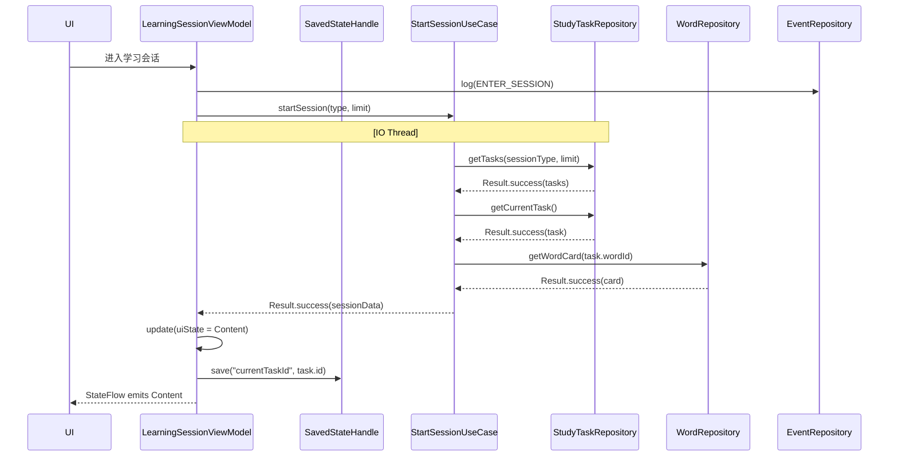
```mermaid
sequenceDiagram
    participant UI
    participant VM as LearningSessionViewModel
    participant SavedState as SavedStateHandle
    participant UseCase as StartSessionUseCase
    participant TaskRepo as StudyTaskRepository
    participant WordRepo as WordRepository
    participant EventRepo as EventRepository
    
    UI->>VM: 进入学习会话
    VM->>EventRepo: log(ENTER_SESSION)
    VM->>UseCase: startSession(type, limit)
    
    Note over VM,TaskRepo: [IO Thread]
    UseCase->>TaskRepo: getTasks(sessionType, limit)
    TaskRepo-->>UseCase: Result.success(tasks)
    UseCase->>TaskRepo: getCurrentTask()
    TaskRepo-->>UseCase: Result.success(task)
    UseCase->>WordRepo: getWordCard(task.wordId)
    WordRepo-->>UseCase: Result.success(card)
    
    UseCase-->>VM: Result.success(sessionData)
    VM->>VM: update(uiState = Content)
    VM->>SavedState: save("currentTaskId", task.id)
    VM-->>UI: StateFlow emits Content
```

###### UML 时序图 - 异常链路（动态，必须）

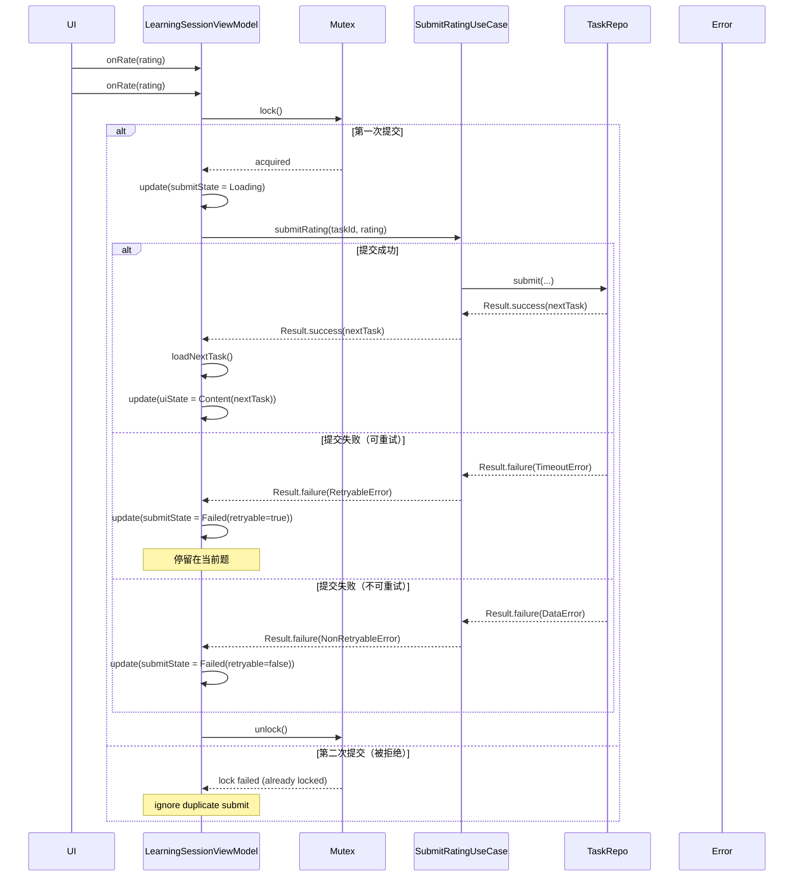
```mermaid
sequenceDiagram
    participant UI
    participant VM as LearningSessionViewModel
    participant Mutex
    participant UseCase as SubmitRatingUseCase
    participant TaskRepo
    participant Error
    
    UI->>VM: onRate(rating) #1
    UI->>VM: onRate(rating) #2 [快速连点]
    
    VM->>Mutex: lock()
    alt 第一次提交
        Mutex-->>VM: acquired
        VM->>VM: update(submitState = Loading)
        VM->>UseCase: submitRating(taskId, rating)
        
        alt 提交成功
            UseCase->>TaskRepo: submit(...)
            TaskRepo-->>UseCase: Result.success(nextTask)
            UseCase-->>VM: Result.success(nextTask)
            VM->>VM: loadNextTask()
            VM->>VM: update(uiState = Content(nextTask))
        else 提交失败（可重试）
            TaskRepo-->>UseCase: Result.failure(TimeoutError)
            UseCase-->>VM: Result.failure(RetryableError)
            VM->>VM: update(submitState = Failed(retryable=true))
            Note over VM: 停留在当前题
        else 提交失败（不可重试）
            TaskRepo-->>UseCase: Result.failure(DataError)
            UseCase-->>VM: Result.failure(NonRetryableError)
            VM->>VM: update(submitState = Failed(retryable=false))
        end
        VM->>Mutex: unlock()
    else 第二次提交（被拒绝）
        Mutex-->>VM: lock failed (already locked)
        Note over VM: ignore duplicate submit
    end
```

###### 关键异常清单（必须，且与异常时序图互校）

| 异常ID | 触发点（步骤/组件） | 触发条件 | 错误类型/错误码 | 可重试 | 对策（降级/回滚/一致性） | 用户提示 | 日志/埋点字段 | 关联 NFR |
|---|---|---|---|---|---|---|---|---|
| EX-VM-001 | 提交反馈 | 快速连点导致重复提交 | 并发重入 | 否 | Mutex 保护，忽略重复请求 | 按钮已禁用，无提示 | event: duplicate_submit, wordId | NFR-REL-001 |
| EX-VM-002 | 提交反馈 | 算法引擎超时（3s） | TimeoutError | 是 | 停留当前题，允许重试 | "提交失败，请重试" | event: submit_failed, errorType: timeout, wordId | NFR-REL-001 |
| EX-VM-003 | 提交反馈 | 算法引擎数据错误 | DataError | 否 | 停留当前题，不允许重试，记录错误 | "提交失败，请稍后再试" | event: submit_failed, errorType: data_error, wordId | NFR-OBS-002 |
| EX-VM-004 | 获取任务 | 算法引擎返回空任务 | EmptyTasks | 否 | 显示空状态 | "今日已完成" | event: empty_tasks | NFR-OBS-001 |
| EX-VM-005 | 获取任务 | 算法引擎不可用 | EngineUnavailable | 是 | 显示错误，允许重试 | "获取任务失败，请重试" | event: get_task_failed, errorType: unavailable | NFR-REL-001 |
| EX-VM-006 | 状态恢复 | SavedStateHandle 数据损坏 | CorruptedState | 否 | 从算法引擎重新获取当前任务 | 静默恢复，无提示 | event: state_recovery_failed | NFR-REL-002 |

##### 模块：UseCase

- **模块定位**：业务流程编排层，封装“开始会话/取题/提交/恢复/播放发音”等用例；位于领域层
- **设计目标**：业务逻辑集中、可测试、错误语义清晰（可重试/不可重试）
- **核心数据结构/状态**：
  - `StartSessionUseCase`：输入 `SessionType, Int`，输出 `Result<SessionData>`
  - `SubmitRatingUseCase`：输入 `sessionId, taskId, UserRating`，输出 `Result<StudyTask?>`
  - `GetNextTaskUseCase`：输入 `sessionId`，输出 `Result<StudyTask?>`
- **对外接口（协议）**：suspend 函数，返回 `Result<T>` 或 sealed class
- **策略与算法**：错误分类（retryable vs non-retryable），超时处理（协程超时）
- **失败与降级**：错误封装为 `Failure` sealed class，包含 `retryable` 标志
- **安全与隐私**：不记录内容文本，UseCase 层仅传递 wordId
- **可观测性**：不直接记录，由 ViewModel 统一记录
- **优缺点**：
  - **优点**：业务逻辑集中，易于测试和复用
  - **缺点/代价**：增加一层抽象，可能过度设计
  - **替代方案与否决理由**：将业务逻辑放在 ViewModel 中会导致 ViewModel 臃肿且难以测试

###### UML 类图（静态，必须）

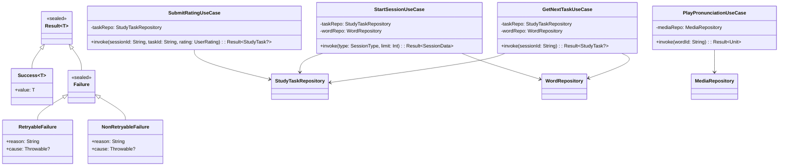
```mermaid
classDiagram
    class StartSessionUseCase {
        -taskRepo: StudyTaskRepository
        -wordRepo: WordRepository
        +invoke(type: SessionType, limit: Int): Result~SessionData~
    }
    class SubmitRatingUseCase {
        -taskRepo: StudyTaskRepository
        +invoke(sessionId: String, taskId: String, rating: UserRating): Result~StudyTask?~
    }
    class GetNextTaskUseCase {
        -taskRepo: StudyTaskRepository
        -wordRepo: WordRepository
        +invoke(sessionId: String): Result~StudyTask?~
    }
    class PlayPronunciationUseCase {
        -mediaRepo: MediaRepository
        +invoke(wordId: String): Result~Unit~
    }
    class Result~T~ {
        <<sealed>>
    }
    class Success~T~ {
        +value: T
    }
    class Failure {
        <<sealed>>
    }
    class RetryableFailure {
        +reason: String
        +cause: Throwable?
    }
    class NonRetryableFailure {
        +reason: String
        +cause: Throwable?
    }
    class StudyTaskRepository
    class WordRepository
    class MediaRepository
    
    StartSessionUseCase --> StudyTaskRepository
    StartSessionUseCase --> WordRepository
    SubmitRatingUseCase --> StudyTaskRepository
    GetNextTaskUseCase --> StudyTaskRepository
    GetNextTaskUseCase --> WordRepository
    PlayPronunciationUseCase --> MediaRepository
    Result~T~ <|-- Success~T~
    Result~T~ <|-- Failure
    Failure <|-- RetryableFailure
    Failure <|-- NonRetryableFailure
```

###### UML 时序图 - 成功链路（动态，必须）

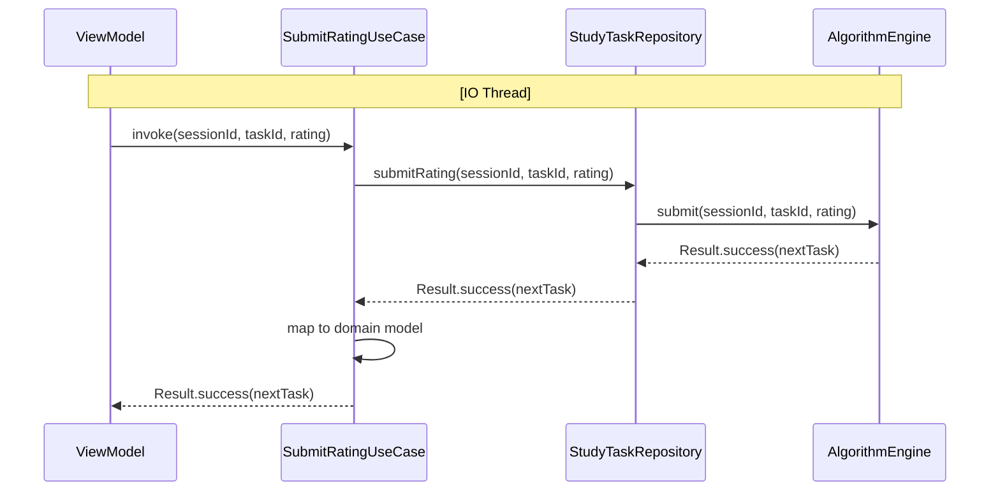
```mermaid
sequenceDiagram
    participant VM as ViewModel
    participant UC as SubmitRatingUseCase
    participant Repo as StudyTaskRepository
    participant Engine as AlgorithmEngine
    
    Note over VM,Engine: [IO Thread]
    VM->>UC: invoke(sessionId, taskId, rating)
    UC->>Repo: submitRating(sessionId, taskId, rating)
    Repo->>Engine: submit(sessionId, taskId, rating)
    Engine-->>Repo: Result.success(nextTask)
    Repo-->>UC: Result.success(nextTask)
    UC->>UC: map to domain model
    UC-->>VM: Result.success(nextTask)
```

###### UML 时序图 - 异常链路（动态，必须）

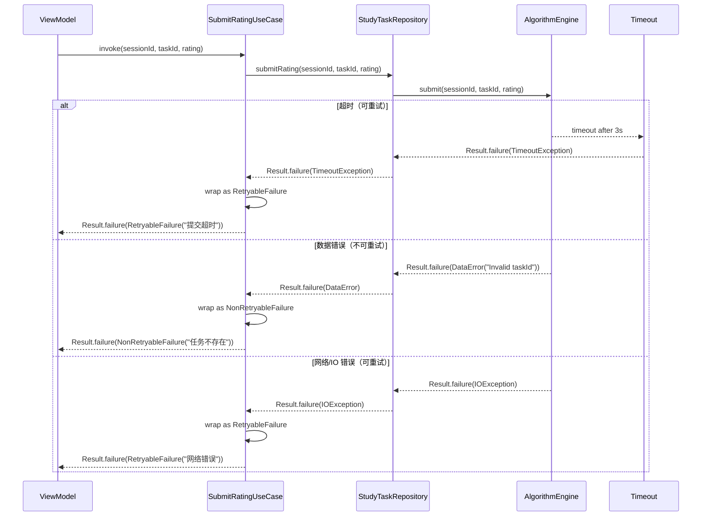
```mermaid
sequenceDiagram
    participant VM as ViewModel
    participant UC as SubmitRatingUseCase
    participant Repo as StudyTaskRepository
    participant Engine as AlgorithmEngine
    participant Timeout
    
    VM->>UC: invoke(sessionId, taskId, rating)
    UC->>Repo: submitRating(sessionId, taskId, rating)
    Repo->>Engine: submit(sessionId, taskId, rating)
    
    alt 超时（可重试）
        Engine-->>Timeout: timeout after 3s
        Timeout-->>Repo: Result.failure(TimeoutException)
        Repo-->>UC: Result.failure(TimeoutException)
        UC->>UC: wrap as RetryableFailure
        UC-->>VM: Result.failure(RetryableFailure("提交超时"))
    else 数据错误（不可重试）
        Engine-->>Repo: Result.failure(DataError("Invalid taskId"))
        Repo-->>UC: Result.failure(DataError)
        UC->>UC: wrap as NonRetryableFailure
        UC-->>VM: Result.failure(NonRetryableFailure("任务不存在"))
    else 网络/IO 错误（可重试）
        Engine-->>Repo: Result.failure(IOException)
        Repo-->>UC: Result.failure(IOException)
        UC->>UC: wrap as RetryableFailure
        UC-->>VM: Result.failure(RetryableFailure("网络错误"))
    end
```

###### 关键异常清单（必须，且与异常时序图互校）

| 异常ID | 触发点（步骤/组件） | 触发条件 | 错误类型/错误码 | 可重试 | 对策（降级/回滚/一致性） | 用户提示 | 日志/埋点字段 | 关联 NFR |
|---|---|---|---|---|---|---|---|---|
| EX-UC-001 | 提交反馈 | 算法引擎超时（3s） | TimeoutException | 是 | 封装为 RetryableFailure | 由 ViewModel 提供 | errorType: timeout | NFR-REL-001 |
| EX-UC-002 | 提交反馈 | 算法引擎数据错误 | DataError | 否 | 封装为 NonRetryableFailure | 由 ViewModel 提供 | errorType: data_error | NFR-OBS-002 |
| EX-UC-003 | 获取任务 | 算法引擎不可用 | EngineUnavailable | 是 | 封装为 RetryableFailure | 由 ViewModel 提供 | errorType: unavailable | NFR-REL-001 |
| EX-UC-004 | 获取单词卡片 | 词库数据缺失 | WordNotFound | 否 | 封装为 NonRetryableFailure，使用最小字段降级 | 由 ViewModel 提供 | errorType: word_not_found | NFR-REL-001 |

##### 模块：StudyTaskRepository

- **模块定位**：将 FEAT-002 的引擎接口适配为 UI 可用的会话语义（Start/Next/Submit），并统一超时/重试/幂等；位于数据层
- **设计目标**：口径统一、错误语义清晰（可重试/不可重试）、幂等提交、防重复
- **核心数据结构/状态**：
  - `pendingSubmits: MutableMap<String, Job>`：正在提交的任务 ID 映射，用于去重
  - `timeoutDuration: Duration = 3.seconds`：提交超时时间
- **对外接口（协议）**：
  - `suspend fun startSession(type: SessionType, limit: Int): Result<SessionContext>`
  - `suspend fun getCurrentTask(sessionId: String): Result<StudyTask>`
  - `suspend fun submitRating(sessionId: String, taskId: String, rating: UserRating): Result<StudyTask?>`
- **策略与算法**：幂等与并发策略（同一 `taskId` 在一次 `submit` 完成前拒绝新提交）
- **失败与降级**：超时使用协程 `withTimeout`，失败返回 `Result.failure`
- **安全与隐私**：不记录内容文本，仅记录 wordId/taskId
- **可观测性**：记录 submit 耗时、失败类型、重试次数（脱敏）
- **优缺点**：
  - **优点**：统一接口，错误处理集中，幂等保证
  - **缺点/代价**：增加一层抽象，需要维护去重缓存
  - **替代方案与否决理由**：直接调用算法引擎会导致错误处理和超时逻辑分散，难以保证一致性

###### UML 类图（静态，必须）

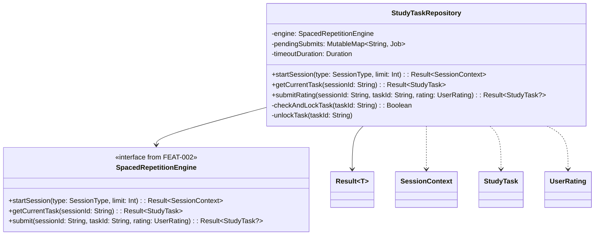
```mermaid
classDiagram
    class StudyTaskRepository {
        -engine: SpacedRepetitionEngine
        -pendingSubmits: MutableMap~String, Job~
        -timeoutDuration: Duration
        +startSession(type: SessionType, limit: Int): Result~SessionContext~
        +getCurrentTask(sessionId: String): Result~StudyTask~
        +submitRating(sessionId: String, taskId: String, rating: UserRating): Result~StudyTask?~
        -checkAndLockTask(taskId: String): Boolean
        -unlockTask(taskId: String)
    }
    class SpacedRepetitionEngine {
        <<interface from FEAT-002>>
        +startSession(type: SessionType, limit: Int): Result~SessionContext~
        +getCurrentTask(sessionId: String): Result~StudyTask~
        +submit(sessionId: String, taskId: String, rating: UserRating): Result~StudyTask?~
    }
    class Result~T~
    class SessionContext
    class StudyTask
    class UserRating
    
    StudyTaskRepository --> SpacedRepetitionEngine
    StudyTaskRepository --> Result~T~
    StudyTaskRepository ..> SessionContext
    StudyTaskRepository ..> StudyTask
    StudyTaskRepository ..> UserRating
```

###### UML 时序图 - 成功链路（动态，必须）

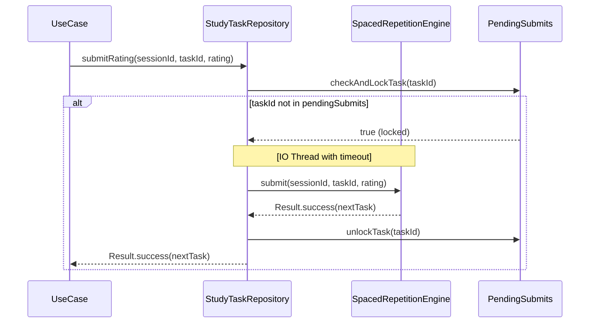
```mermaid
sequenceDiagram
    participant UC as UseCase
    participant Repo as StudyTaskRepository
    participant Engine as SpacedRepetitionEngine
    participant Lock as PendingSubmits
    
    UC->>Repo: submitRating(sessionId, taskId, rating)
    Repo->>Lock: checkAndLockTask(taskId)
    alt taskId not in pendingSubmits
        Lock-->>Repo: true (locked)
        Note over Repo,Engine: [IO Thread with timeout]
        Repo->>Engine: submit(sessionId, taskId, rating)
        Engine-->>Repo: Result.success(nextTask)
        Repo->>Lock: unlockTask(taskId)
        Repo-->>UC: Result.success(nextTask)
    end
```

###### UML 时序图 - 异常链路（动态，必须）

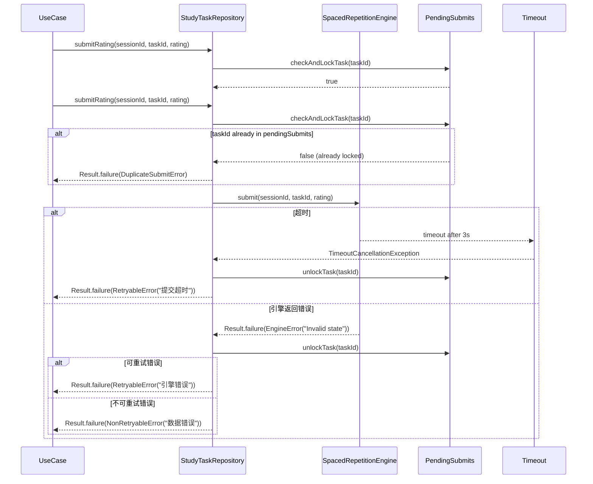
```mermaid
sequenceDiagram
    participant UC as UseCase
    participant Repo as StudyTaskRepository
    participant Engine as SpacedRepetitionEngine
    participant Lock as PendingSubmits
    participant Timeout
    
    UC->>Repo: submitRating(sessionId, taskId, rating) #1
    Repo->>Lock: checkAndLockTask(taskId)
    Lock-->>Repo: true
    
    UC->>Repo: submitRating(sessionId, taskId, rating) #2 [重复]
    Repo->>Lock: checkAndLockTask(taskId)
    alt taskId already in pendingSubmits
        Lock-->>Repo: false (already locked)
        Repo-->>UC: Result.failure(DuplicateSubmitError)
    end
    
    Repo->>Engine: submit(sessionId, taskId, rating)
    alt 超时
        Engine-->>Timeout: timeout after 3s
        Timeout-->>Repo: TimeoutCancellationException
        Repo->>Lock: unlockTask(taskId)
        Repo-->>UC: Result.failure(RetryableError("提交超时"))
    else 引擎返回错误
        Engine-->>Repo: Result.failure(EngineError("Invalid state"))
        Repo->>Lock: unlockTask(taskId)
        alt 可重试错误
            Repo-->>UC: Result.failure(RetryableError("引擎错误"))
        else 不可重试错误
            Repo-->>UC: Result.failure(NonRetryableError("数据错误"))
        end
    end
```

###### 关键异常清单（必须，且与异常时序图互校）

| 异常ID | 触发点（步骤/组件） | 触发条件 | 错误类型/错误码 | 可重试 | 对策（降级/回滚/一致性） | 用户提示 | 日志/埋点字段 | 关联 NFR |
|---|---|---|---|---|---|---|---|---|
| EX-REPO-001 | 提交反馈 | 同一 taskId 重复提交 | DuplicateSubmitError | 否 | 拒绝重复提交，返回错误 | 由 ViewModel 处理 | event: duplicate_submit, taskId | NFR-REL-001 |
| EX-REPO-002 | 提交反馈 | 算法引擎超时（3s） | TimeoutError | 是 | 解锁 taskId，返回可重试错误 | 由 ViewModel 提供 | event: submit_timeout, elapsedMs, taskId | NFR-REL-001 |
| EX-REPO-003 | 提交反馈 | 算法引擎返回错误（可重试） | RetryableError | 是 | 解锁 taskId，返回可重试错误 | 由 ViewModel 提供 | event: submit_failed, errorType, taskId | NFR-REL-001 |
| EX-REPO-004 | 提交反馈 | 算法引擎返回错误（不可重试） | NonRetryableError | 否 | 解锁 taskId，返回不可重试错误 | 由 ViewModel 提供 | event: submit_failed, errorType, taskId | NFR-REL-001 |
| EX-REPO-005 | 获取任务 | 算法引擎不可用 | EngineUnavailable | 是 | 返回可重试错误 | 由 ViewModel 提供 | event: get_task_failed, errorType | NFR-REL-001 |

##### 模块：WordRepository

- **模块定位**：将 wordId 映射为展示字段（拼写/释义/音标/例句/图片引用）；位于数据层
- **设计目标**：提供单词卡片数据，不记录内容文本到日志
- **核心数据结构/状态**：
  - `WordCardModel`：包含 wordId、word、phonetic、definition、examples、imageRef、hasPronunciation
- **对外接口（协议）**：
  - `suspend fun getWordCard(wordId: String): Result<WordCardModel>`
- **策略与算法**：从 FEAT-001 获取词库数据，转换为核心模型
- **失败与降级**：单词不存在时返回错误，由 UseCase 处理降级（最小字段展示）
- **安全与隐私**：不在日志中输出完整内容文本，仅记录 wordId
- **可观测性**：不记录（由上层统一记录）
- **优缺点**：
  - **优点**：封装词库访问，便于替换实现
  - **缺点/代价**：增加一层抽象
  - **替代方案与否决理由**：直接访问 FEAT-001 会导致耦合，且难以保证隐私约束

###### UML 类图（静态，必须）

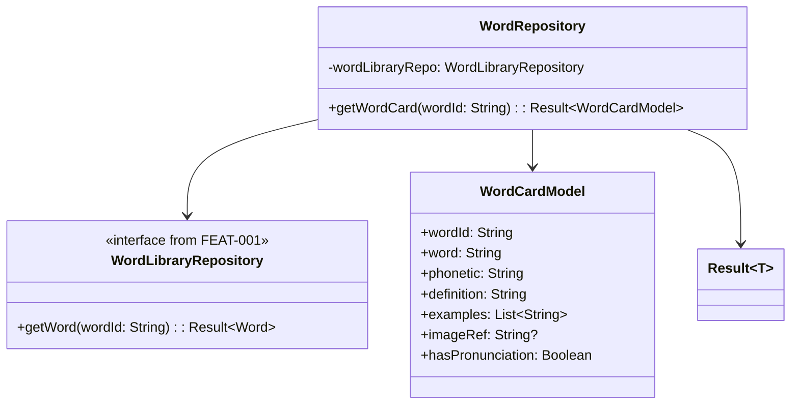
```mermaid
classDiagram
    class WordRepository {
        -wordLibraryRepo: WordLibraryRepository
        +getWordCard(wordId: String): Result~WordCardModel~
    }
    class WordLibraryRepository {
        <<interface from FEAT-001>>
        +getWord(wordId: String): Result~Word~
    }
    class WordCardModel {
        +wordId: String
        +word: String
        +phonetic: String
        +definition: String
        +examples: List~String~
        +imageRef: String?
        +hasPronunciation: Boolean
    }
    class Result~T~
    
    WordRepository --> WordLibraryRepository
    WordRepository --> WordCardModel
    WordRepository --> Result~T~
```

###### UML 时序图 - 成功链路（动态，必须）

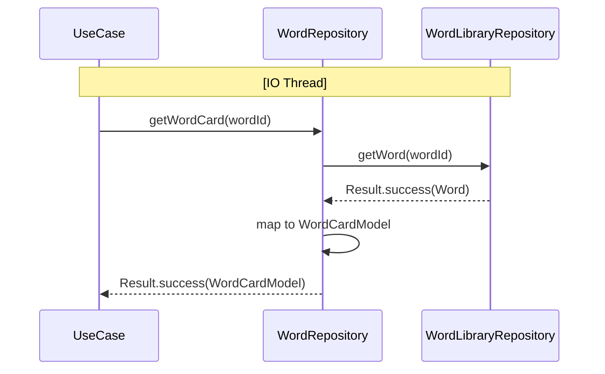
```mermaid
sequenceDiagram
    participant UC as UseCase
    participant Repo as WordRepository
    participant LibRepo as WordLibraryRepository
    
    Note over UC,LibRepo: [IO Thread]
    UC->>Repo: getWordCard(wordId)
    Repo->>LibRepo: getWord(wordId)
    LibRepo-->>Repo: Result.success(Word)
    Repo->>Repo: map to WordCardModel
    Repo-->>UC: Result.success(WordCardModel)
```

###### UML 时序图 - 异常链路（动态，必须）

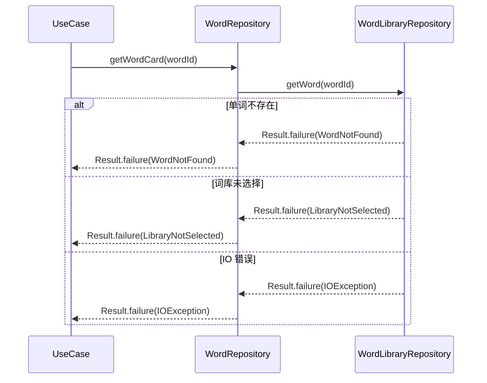
```mermaid
sequenceDiagram
    participant UC as UseCase
    participant Repo as WordRepository
    participant LibRepo as WordLibraryRepository
    
    UC->>Repo: getWordCard(wordId)
    Repo->>LibRepo: getWord(wordId)
    
    alt 单词不存在
        LibRepo-->>Repo: Result.failure(WordNotFound)
        Repo-->>UC: Result.failure(WordNotFound)
    else 词库未选择
        LibRepo-->>Repo: Result.failure(LibraryNotSelected)
        Repo-->>UC: Result.failure(LibraryNotSelected)
    else IO 错误
        LibRepo-->>Repo: Result.failure(IOException)
        Repo-->>UC: Result.failure(IOException)
    end
```

###### 关键异常清单（必须，且与异常时序图互校）

| 异常ID | 触发点（步骤/组件） | 触发条件 | 错误类型/错误码 | 可重试 | 对策（降级/回滚/一致性） | 用户提示 | 日志/埋点字段 | 关联 NFR |
|---|---|---|---|---|---|---|---|---|
| EX-WORD-001 | 获取单词卡片 | 单词不存在 | WordNotFound | 否 | 由 UseCase 处理降级（最小字段） | 由 ViewModel 提供 | errorType: word_not_found, wordId | NFR-REL-001 |
| EX-WORD-002 | 获取单词卡片 | 词库未选择 | LibraryNotSelected | 否 | 引导用户选择词库 | 由 ViewModel 提供 | errorType: library_not_selected | NFR-REL-001 |
| EX-WORD-003 | 获取单词卡片 | IO 错误 | IOException | 是 | 返回可重试错误 | 由 ViewModel 提供 | errorType: io_error, wordId | NFR-REL-001 |

##### 模块：MediaRepository

- **模块定位**：播放/加载多媒体资源；位于数据层
- **设计目标**：失败不阻断学习主流程，正确释放资源
- **核心数据结构/状态**：
  - `hasPronunciation(wordId: String): Boolean`：检查是否有发音资源
  - `suspend fun playPronunciation(wordId: String): Result<Unit>`：播放发音
- **对外接口（协议）**：
  - `fun hasPronunciation(wordId: String): Boolean`
  - `suspend fun playPronunciation(wordId: String): Result<Unit>`
- **策略与算法**：通过 FEAT-006 接口播放，失败不抛出异常（返回 Result）
- **失败与降级**：资源缺失/播放失败返回 `Result.failure`，不影响学习流程
- **安全与隐私**：不记录资源内容
- **可观测性**：可选记录播放成功/失败（不影响主流程）
- **优缺点**：
  - **优点**：封装多媒体访问，便于替换实现
  - **缺点/代价**：增加一层抽象
  - **替代方案与否决理由**：直接访问 FEAT-006 会导致耦合，且难以保证资源释放和降级策略

###### UML 类图（静态，必须）

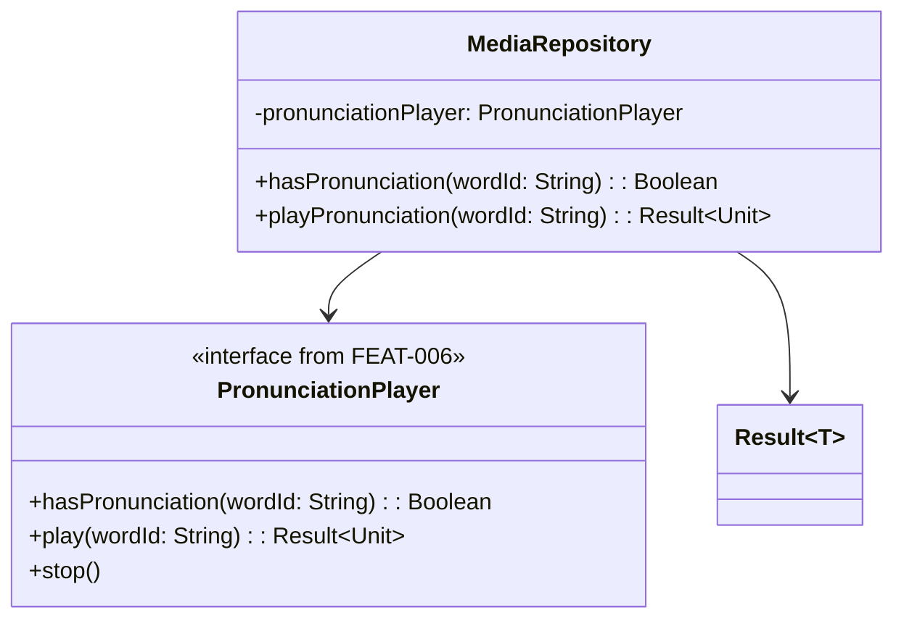
```mermaid
classDiagram
    class MediaRepository {
        -pronunciationPlayer: PronunciationPlayer
        +hasPronunciation(wordId: String): Boolean
        +playPronunciation(wordId: String): Result~Unit~
    }
    class PronunciationPlayer {
        <<interface from FEAT-006>>
        +hasPronunciation(wordId: String): Boolean
        +play(wordId: String): Result~Unit~
        +stop()
    }
    class Result~T~
    
    MediaRepository --> PronunciationPlayer
    MediaRepository --> Result~T~
```

###### UML 时序图 - 成功链路（动态，必须）

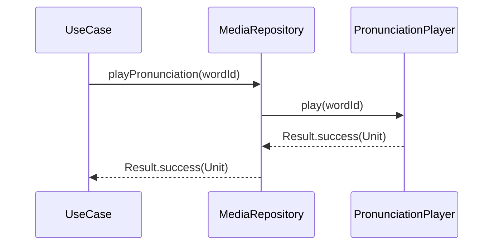
```mermaid
sequenceDiagram
    participant UC as UseCase
    participant Repo as MediaRepository
    participant Player as PronunciationPlayer
    
    UC->>Repo: playPronunciation(wordId)
    Repo->>Player: play(wordId)
    Player-->>Repo: Result.success(Unit)
    Repo-->>UC: Result.success(Unit)
```

###### UML 时序图 - 异常链路（动态，必须）

```mermaid
sequenceDiagram
    participant UC as UseCase
    participant Repo as MediaRepository
    participant Player as PronunciationPlayer
    
    UC->>Repo: playPronunciation(wordId)
    
    alt 资源不存在
        Repo->>Player: hasPronunciation(wordId)
        Player-->>Repo: false
        Repo-->>UC: Result.failure(ResourceNotFound)
    else 播放失败
        Repo->>Player: play(wordId)
        Player-->>Repo: Result.failure(PlaybackError)
        Repo-->>UC: Result.failure(PlaybackError)
        Note over UC: 不影响学习流程，静默失败
    else 播放超时
        Repo->>Player: play(wordId)
        Player-->>Timeout: timeout after 1s
        Timeout-->>Repo: TimeoutException
        Repo->>Player: stop()
        Repo-->>UC: Result.failure(TimeoutError)
    end
```

###### 关键异常清单（必须，且与异常时序图互校）

| 异常ID | 触发点（步骤/组件） | 触发条件 | 错误类型/错误码 | 可重试 | 对策（降级/回滚/一致性） | 用户提示 | 日志/埋点字段 | 关联 NFR |
|---|---|---|---|---|---|---|---|---|
| EX-MEDIA-001 | 播放发音 | 资源不存在 | ResourceNotFound | 否 | 隐藏/置灰入口，不提示 | 入口已隐藏/置灰 | event: pronunciation_not_found, wordId | NFR-POWER-001 |
| EX-MEDIA-002 | 播放发音 | 播放失败 | PlaybackError | 否 | 静默失败，不影响学习 | 可选：Toast "播放失败" | event: playback_failed, wordId | NFR-POWER-001 |
| EX-MEDIA-003 | 播放发音 | 播放超时（1s） | TimeoutError | 否 | 停止播放，静默失败 | 无 | event: playback_timeout, wordId | NFR-POWER-001 |

##### 模块：EventRepository

- **模块定位**：记录可观测事件（脱敏）；位于数据层
- **设计目标**：统一事件口径，保证隐私合规（不记录内容文本）
- **核心数据结构/状态**：
  - `LearningEvent`：sealed class 包含所有事件类型
  - 事件字段白名单：`sessionType`、`wordId`、`taskId`、`rating`、`elapsedMs`、`errorType`、`retryCount`
- **对外接口（协议）**：
  - `fun logEvent(event: LearningEvent)`
- **策略与算法**：事件采样（可选），字段白名单校验
- **失败与降级**：事件记录失败不应影响业务逻辑（静默失败或使用本地缓存）
- **安全与隐私**：字段白名单，禁止记录释义/例句正文
- **可观测性**：本模块即为可观测性实现
- **优缺点**：
  - **优点**：集中事件管理，便于统一口径和隐私合规
  - **缺点/代价**：增加一层抽象
  - **替代方案与否决理由**：分散记录事件会导致口径不一致，难以保证隐私合规

###### UML 类图（静态，必须）

```mermaid
classDiagram
    class EventRepository {
        -eventLogger: EventLogger
        +logEvent(event: LearningEvent)
        -validateEvent(event: LearningEvent): Boolean
    }
    class LearningEvent {
        <<sealed>>
    }
    class EnterSessionEvent {
        +sessionType: SessionType
        +timestamp: Long
    }
    class ExitSessionEvent {
        +sessionType: SessionType
        +elapsedMs: Long
    }
    class RevealAnswerEvent {
        +wordId: String
        +taskId: String
    }
    class SubmitRatingEvent {
        +wordId: String
        +taskId: String
        +rating: UserRating
        +elapsedMs: Long
        +success: Boolean
    }
    class EventLogger {
        <<interface>>
        +log(event: Map~String, Any~)
    }
    
    EventRepository --> LearningEvent
    LearningEvent <|-- EnterSessionEvent
    LearningEvent <|-- ExitSessionEvent
    LearningEvent <|-- RevealAnswerEvent
    LearningEvent <|-- SubmitRatingEvent
    EventRepository --> EventLogger
```

###### UML 时序图 - 成功链路（动态，必须）

```mermaid
sequenceDiagram
    participant VM as ViewModel
    participant Repo as EventRepository
    participant Logger as EventLogger
    
    VM->>Repo: logEvent(SubmitRatingEvent(...))
    Repo->>Repo: validateEvent(event)
    alt 事件字段合法
        Repo->>Repo: serialize to map (only whitelist fields)
        Repo->>Logger: log(eventMap)
        Logger-->>Repo: success
    end
```

###### UML 时序图 - 异常链路（动态，必须）

```mermaid
sequenceDiagram
    participant VM as ViewModel
    participant Repo as EventRepository
    participant Logger as EventLogger
    
    VM->>Repo: logEvent(event)
    Repo->>Repo: validateEvent(event)
    
    alt 事件包含禁止字段（如释义正文）
        Repo->>Repo: validation failed
        Note over Repo: 移除禁止字段或拒绝记录
        Repo-->>VM: validation error (静默处理，不抛异常)
    else 日志记录失败
        Repo->>Logger: log(eventMap)
        Logger-->>Repo: IOException
        Note over Repo: 静默失败，不影响业务
        Repo-->>VM: success (业务不受影响)
    end
```

###### 关键异常清单（必须，且与异常时序图互校）

| 异常ID | 触发点（步骤/组件） | 触发条件 | 错误类型/错误码 | 可重试 | 对策（降级/回滚/一致性） | 用户提示 | 日志/埋点字段 | 关联 NFR |
|---|---|---|---|---|---|---|---|---|
| EX-EVENT-001 | 记录事件 | 事件包含禁止字段（如释义正文） | ValidationError | 否 | 移除禁止字段或拒绝记录，不抛异常 | 无（静默处理） | N/A（事件被拒绝） | NFR-SEC-001 |
| EX-EVENT-002 | 记录事件 | 日志记录失败（IO 错误） | IOException | 否 | 静默失败，不影响业务逻辑 | 无 | N/A | NFR-OBS-001 |

### A4. 关键流程设计（每个流程一张流程图，含正常 + 全部异常）

#### 流程 1：开始会话并展示第 1 张卡片（FR-001/002）

```mermaid
flowchart TD
  Start([用户点击开始学习/复习]) --> Precheck{已选择词库?}
  Precheck -->|否| GoLibrary[引导去选择/导入词库] --> End([End])
  Precheck -->|是| LoadTasks[向算法引擎请求任务(软超时3s)]

  LoadTasks -->|空列表| Empty[空状态: 今日已完成/暂无可学] --> End
  LoadTasks -->|失败| Err[错误提示 + 重试/返回] --> End
  LoadTasks -->|成功| GetWord[根据wordId取卡片数据]

  GetWord -->|失败| WordErr[展示最小信息/提示缺失 + 允许继续] --> Show
  GetWord -->|成功| Show[展示卡片(答案默认隐藏)] --> End
```

#### 流程 2：显示答案 → 提交反馈 → 切题（FR-003/004/006）

```mermaid
flowchart TD
  Start([用户在会话页]) --> Reveal{答案已显示?}
  Reveal -->|否| ShowAns[显示答案/扩展区] --> WaitRate[等待用户反馈]
  Reveal -->|是| WaitRate

  WaitRate --> Rate[点击/手势: 认识/不认识/跳过]
  Rate --> Lock[进入提交中: UI禁用 + 防重复提交]
  Lock --> Submit[提交反馈到算法引擎(软超时3s)]

  Submit -->|成功| Next[获取下一题] --> Reset[答案状态重置为隐藏] --> End([End])
  Submit -->|失败/超时| Fail[停留当前题 + 提示可重试] --> Retry{用户重试?}
  Retry -->|是| Submit
  Retry -->|否| End
```

### A5. 技术风险与消解策略（绑定 Story/Task）

| 风险ID | 风险描述 | 触发条件 | 影响范围 | 严重度 | 消解策略 | 对应 Story |
|---|---|---|---|---|---|---|
| RISK-001 | 切题/滑动导致卡顿（长帧） | 图片过大、重组过多、动画过重 | 体验、留存 | High | 图片采样+占位；减少重组；用 Frame metrics 验收 | ST-007 |
| RISK-002 | 反馈提交竞态导致“跳题/重复提交” | 快速连点/手势重复触发 | 进度一致性 | High | VM+Repo 双重并发保护；幂等键/去重；UI 禁用 | ST-003 |
| RISK-003 | 进程回收后恢复不一致 | SavedState 未覆盖关键字段 | 可靠性 | Med | 权威进度交给引擎；UI 状态进 SavedState；恢复验收用 monkey/旋转 | ST-006 |
| RISK-004 | 音频播放资源泄漏/焦点处理错误 | 多次播放/切后台 | 功耗、崩溃 | Med | 通过 FEAT-006 统一播放器；在 `onStop` 释放；焦点丢失停止 | ST-005 |
| RISK-005 | 日志/埋点泄露内容文本 | 直接记录释义/例句 | 隐私合规 | High | 事件字段仅允许 wordId/枚举/耗时；审查与测试关卡 | ST-008 |

### A6. 边界 & 异常场景枚举（数据/状态/生命周期/并发/用户行为）

- **数据边界**：
  - 无词库/无任务：空状态
  - 单词字段缺失：按“最小可展示字段”降级（至少拼写），缺失字段不占位
  - 多媒体缺失：入口隐藏或置灰
- **状态边界**：
  - 答案未显示时禁止提交反馈（或自动先显示答案再允许）
  - 提交中禁止切题/重复提交
- **生命周期**：
  - 旋转/切后台/返回：保持当前题与答案显示状态；返回弹窗确认
  - 进程回收：至少恢复到同一题（或下一题，不回退超过 1 题）
- **并发**：
  - 同时触发按钮与手势：只允许 1 条提交管线生效
  - 多媒体播放与提交并行：互不阻塞；播放失败不影响提交
- **用户行为**：
  - 快速连点/误触：节流 + 禁用
  - 无障碍：按钮为主路径；手势可弱化；状态变化可感知

### A7. 算法评估（如适用）

本 Feature 不新增算法；算法正确性与调度策略由 FEAT-002 负责。本 Feature 的验收关注“接口调用正确 + 一致性 + 体验指标”。

### A8. 功耗评估（必须量化）

- **Top5% 用户模型**：
  - 每日学习 30 分钟；包含发音播放（每分钟 1 次，约 30 次/天）；图片卡片占比 30%
- **测量口径**：
  - Android Studio Energy Profiler（粗）
  - 对比基线：关闭发音/图片 vs 开启发音/图片
- **预估增量**：学习界面相关功耗增量 ≤ 5mAh/天（与 `spec.md` 一致）
- **验收上限**：
  - 若超过阈值：默认关闭“自动预加载多媒体”（若实现）；降低图片预取；减少动画
- **降级策略**：
  - 低电量模式/省电模式：禁用多媒体预取；仅用户点击才加载/播放

### A9. 性能评估（必须量化）

- **前台关键路径**：
  - 进入学习会话首帧：p95 ≤ 500ms（在任务/单词数据可用的前提下）
  - 提交成功后切题 UI 更新：p95 ≤ 100ms
  - 连续学习 30 题：长帧（>100ms）占比 ≤ 1%
- **验收指标 & 测试方法**：
  - Frame metrics / JankStats（或 FrameTimeline）：统计长帧占比
  - 手工 profile：打开 Android Studio profiler 验证切题期间主线程无重 IO/大对象分配
- **降级策略**：
  - 图片：降低分辨率/禁用 crossfade；延迟加载
  - 文本：避免昂贵的富文本处理；减少不必要重组

### A10. 内存评估（必须量化）

- **峰值增量**：展示含图片的卡片时，额外峰值内存 ≤ 30MB（与 `spec.md` 一致）
- **平均增量**：会话常驻状态增量 ≤ 10MB（不含系统/其它模块）
- **生命周期**：
  - 仅缓存当前/下一张卡片数据；离开会话页释放对图片/播放器的引用
- **风险与对策**：
  - 大图 OOM：强制采样、限制最大解码尺寸、占位图
  - 泄漏：播放器与 ImageLoader 不持有 Activity；在 `DisposableEffect`/VM `onCleared` 释放
- **验收标准**：
  - Android Studio Memory profiler：会话页进入→切 30 题→退出，观察峰值与回落；无持续增长

## Plan-B：技术规约 & 实现约束（保留原 spec-kit 输出内容）

### B1. 技术背景（用于统一工程上下文）

> 注意：为保证工具链自动提取信息，下列字段名需保留英文 Key（括号内可补充中文）。

**Language/Version**：Kotlin（与项目 Gradle 版本对齐）  
**Primary Dependencies**：Jetpack Compose、AndroidX Lifecycle/ViewModel、Kotlin Coroutines、(建议) Navigation Compose、(建议) Coil Compose（图片）  
**Storage**：N/A（本 Feature 不引入新的权威持久化；权威进度由 FEAT-002/007 管理）  
**Test Framework**：JUnit（单测）、Robolectric（可选）、Compose UI Test（UI）  
**Target Platform**：Android 8.0+（API 26+）  
**Project Type**：mobile（单项目：`app/`）  
**Performance Targets**：首帧 p95 ≤ 500ms；切题 p95 ≤ 100ms；长帧占比 ≤ 1%  
**Constraints**：不记录内容文本到日志/埋点；提交反馈必须幂等与防重复；可访问性必须可用  
**Scale/Scope**：单次会话 20-50 题；每日 30 分钟 Top5% 用户；图片卡片占比 30%

### B2. 架构细化（实现必须遵循）

- **分层约束**：
  - UI 仅与 ViewModel 交互
  - ViewModel 仅依赖 UseCase
  - UseCase 仅依赖 Repository 接口（可替换实现）
- **线程/并发模型**：
  - IO/Default：取题、提交、多媒体准备
  - 主线程：UI 更新
  - 提交并发：VM/Repo 双重保护，保证一次只提交 1 次
- **错误处理规范**：
  - 对用户：明确“可重试/不可重试”文案；失败不丢状态
  - 对开发：统一 `Failure` 类型（含 `reason`、`retryable`、`cause`）
- **日志与可观测性**：
  - 事件字段白名单：`sessionType`、`wordId`、`taskId`（如可用）、`rating`、`elapsedMs`、`errorType`、`retryCount`
  - 禁止记录：释义/例句正文、图片 URL（若包含敏感信息）

### B3. 数据模型（引用或内联）

本 Feature 不新增权威业务数据模型；但需要明确“会话与 UI 状态”的最小契约，避免实现期口径漂移。

#### B3.1 存储形态与边界（必须）

- **存储形态**：
  - 会话权威：算法引擎/学习状态（FEAT-002，可能落 Room）
  - UI 短暂状态：`SavedStateHandle`/`rememberSaveable`（仅保存非敏感布尔/索引/id）
- **System of Record（权威来源）**：FEAT-002 的学习状态/任务调度结果
- **缓存与派生数据**：当前卡片展示字段为派生数据（wordId → WordCardModel）
- **生命周期**：会话页在前台常驻；退出即释放缓存；必要状态（答案显示）跨旋转/回收恢复
- **数据规模与增长**：每次仅缓存 1-2 张卡片；事件记录按采样/聚合（避免过量）

### B4. 接口规范/协议（引用或内联）

#### B4.1 本 Feature 对外提供的接口（必须：Capability Feature/跨模块复用场景）

本 Feature 不对外提供复用 SDK；对外暴露的仅是 UI 页面（导航路由）。

#### B4.2 本 Feature 依赖的外部接口/契约（必须：存在外部依赖时）

> 目的：把 A2.1 的“依赖清单”下沉到“调用级契约”，避免实现期口径不一致。

- **算法引擎（FEAT-002）建议契约（示例）**：
  - `suspend fun startSession(type: SessionType, limit: Int): Result<SessionContext>`
  - `suspend fun getCurrentTask(sessionId: String): Result<StudyTask>`
  - `suspend fun submit(sessionId: String, taskId: String, rating: UserRating): Result<StudyTask?>`（返回下一题；若无则 `null`）
  - 错误语义：`retryable`（超时/临时 IO） vs `notRetryable`（数据损坏/非法状态）
- **词库（FEAT-001）建议契约（示例）**：
  - `suspend fun getWordCard(wordId: String): Result<WordCardModel>`
- **多媒体（FEAT-006）建议契约（示例）**：
  - `fun hasPronunciation(wordId: String): Boolean`
  - `suspend fun playPronunciation(wordId: String): Result<Unit>`
  - 失败不影响学习主流程

### B5. 合规性检查（关卡）

*关卡：必须在进入 Implement 前通过；若不通过，必须明确整改项并绑定到 Story/Task。*

- [ ] 不记录敏感内容文本（释义/例句正文）到日志/埋点（NFR-SEC-001）
- [ ] 手势不作为唯一通路（按钮为主路径，满足可访问性）
- [ ] 提交反馈幂等/防重复提交（FR-006）
- [ ] 关键事件可观测（进入/退出/显示答案/提交/失败/完成）（NFR-OBS-001）

### B6. 项目结构（本 Feature）

```text
specs/epics/EPIC-001-word-memory-app/features/FEAT-003-learning-ui/
├── spec.md
├── plan.md
├── full-design.md
├── tasks.md
└── checklists/
    └── requirements.md
```

### B7. 源代码结构（代码库根目录）

```text
app/
└── src/main/java/com/jacky/verity/
    ├── MainActivity.kt
    └── feature/learning/               # 建议新增（本 Feature）
        ├── ui/                         # Compose screens
        ├── vm/                         # ViewModel + UiState
        ├── domain/                     # UseCases
        └── data/                       # Repositories adapters（接口 + 实现）
```

**结构决策**：本仓库为 Android 单项目（`app/`），在 `com.jacky.verity.feature.learning` 下落地本 Feature 的分层结构。

## Story Breakdown（Plan 阶段末尾，必须）

### Story 列表

#### ST-001：学习入口与导航骨架

- **类型**：Design-Enabler
- **描述**：建立学习入口页/会话页/完成页的导航与路由，提供开始学习/复习入口与返回路径
- **目标**：可从入口进入会话并正常返回；完成页可展示并回到入口
- **覆盖 FR/NFR**：FR-001、FR-007、FR-008
- **依赖**：ST-002（会话页 UI）可并行；依赖 Navigation Compose（若采用）
- **可并行**：是（与 ST-002/003 并行，先搭骨架）
- **关键风险**：否
- **验收/验证方式（高层）**：手工走通导航；UI 测试验证 back stack 与退出确认

#### ST-002：卡片展示与答案显示（基础交互）

- **类型**：Functional
- **描述**：实现会话页卡片 UI，默认隐藏答案，支持显示答案/翻转
- **目标**：展示当前单词卡片；答案默认隐藏；显示答案后展示释义与扩展区域占位
- **覆盖 FR/NFR**：FR-002
- **依赖**：WordRepository（FEAT-001）接口桩；可先用 fake
- **可并行**：是
- **关键风险**：否
- **验收/验证方式（高层）**：UI 测试：进入后默认隐藏；点击后显示

#### ST-003：提交反馈管线（按钮 + 防重复 + 失败重试）

- **类型**：Functional
- **描述**：实现认识/不认识/跳过三类反馈按钮；提交中禁用；失败停留当前题并可重试；成功切题与进度更新
- **目标**：提交一致性与可恢复，严格满足 FR-006
- **覆盖 FR/NFR**：FR-003、FR-004、FR-006、NFR-REL-001
- **依赖**：StudyTaskRepository（FEAT-002）接口；需要错误分类 retryable
- **可并行**：与 ST-002 并行
- **关键风险**：是（RISK-002）
- **验收/验证方式（高层）**：模拟失败/超时；验证不跳题且可重试；验证进度更新

#### ST-004：手势交互与一致性

- **类型**：Functional
- **描述**：新增至少一种高频手势（如左右滑动触发认识/不认识），并与按钮复用同一提交逻辑
- **目标**：手势与按钮结果一致，且不会引入重复提交/误触不可控
- **覆盖 FR/NFR**：FR-005
- **依赖**：ST-003
- **可并行**：否（依赖提交管线）
- **关键风险**：Med（误触与可访问性）
- **验收/验证方式（高层）**：手势触发与按钮触发的结果一致；可在无障碍场景下弱化手势

#### ST-005：发音入口与播放接入（降级不阻断）

- **类型**：Functional
- **描述**：当有发音资源时提供播放入口；无资源时隐藏/置灰并提示；处理生命周期停止播放
- **目标**：播放失败不影响学习主流程；资源释放正确
- **覆盖 FR/NFR**：FR-009、NFR-POWER-001
- **依赖**：MediaRepository（FEAT-006）接口桩
- **可并行**：是（与 ST-002 并行）
- **关键风险**：是（RISK-004）
- **验收/验证方式（高层）**：播放成功/失败/切后台停止；功耗 profiler 对比验证无异常唤醒

#### ST-006：中断与恢复（旋转/后台/进程回收）

- **类型**：Infrastructure
- **描述**：通过 `SavedStateHandle`/`rememberSaveable` 恢复“当前题 + 答案显示状态”；返回弹窗确认与退出保存（由引擎保证进度权威）
- **目标**：满足“不回退超过 1 题”的恢复策略
- **覆盖 FR/NFR**：FR-008、NFR-REL-002
- **依赖**：ST-003
- **可并行**：否（依赖基础会话与提交）
- **关键风险**：是（RISK-003）
- **验收/验证方式（高层）**：旋转/后台/进程回收后恢复；monkey 测试

#### ST-007：性能与内存预算落地（图片/重组/长帧）

- **类型**：Optimization
- **描述**：引入图片采样与缓存策略（若有图片），控制重组与动画，建立 Frame metrics 验收脚本/口径
- **目标**：满足 NFR-PERF 与 NFR-MEM 门槛
- **覆盖 FR/NFR**：NFR-PERF-001、NFR-PERF-002、NFR-MEM-001
- **依赖**：ST-002、（可选）图片加载库
- **可并行**：是（可在 UI 初版后并行优化）
- **关键风险**：是（RISK-001）
- **验收/验证方式（高层）**：Frame metrics 长帧占比与 profiler 峰值内存验证

#### ST-008：可观测性与隐私关卡（事件口径 + 脱敏）

- **类型**：Infrastructure
- **描述**：实现关键事件记录（进入/退出/显示答案/提交/失败/完成），并通过字段白名单保证不记录内容正文
- **目标**：满足 NFR-OBS 与 NFR-SEC；为后续统计/游戏化复用事件口径
- **覆盖 FR/NFR**：NFR-OBS-001、NFR-OBS-002、NFR-SEC-001
- **依赖**：ST-001/002/003（需要埋点点位）
- **可并行**：是
- **关键风险**：是（RISK-005）
- **验收/验证方式（高层）**：审查事件字段；单测验证脱敏；手工验证关键路径都有事件

### Feature → Story 覆盖矩阵

| FR/NFR ID | 覆盖的 Story ID | 备注 |
|---|---|---|
| FR-001 | ST-001 | 入口与进入会话 |
| FR-002 | ST-002 | 默认隐藏 + 显示答案 |
| FR-003 | ST-003 | 三类反馈 |
| FR-004 | ST-003 | 成功切题 + 进度更新 |
| FR-005 | ST-004 | 手势一致性 |
| FR-006 | ST-003 | 防重复提交 + 失败重试 |
| FR-007 | ST-001 | 完成页 |
| FR-008 | ST-001、ST-006 | 返回确认 + 生命周期恢复 |
| FR-009 | ST-005 | 发音入口 |
| FR-010 | ST-002、ST-007 | 扩展信息展示 + 内存预算 |
| NFR-PERF-001 | ST-007 | 首帧/切题阈值 |
| NFR-PERF-002 | ST-007 | 长帧占比 |
| NFR-POWER-001 | ST-005 | 播放触发与省电策略 |
| NFR-MEM-001 | ST-007 | 图片峰值内存 |
| NFR-SEC-001 | ST-008 | 日志/埋点脱敏 |
| NFR-OBS-001 | ST-008 | 关键事件 |
| NFR-OBS-002 | ST-008 | 错误定位字段 |
| NFR-REL-001 | ST-003 | crash-free/提交成功率（以事件+崩溃统计验证） |
| NFR-REL-002 | ST-006 | 进程回收恢复策略 |

## 复杂度跟踪（仅当合规性检查存在需说明理由的违规项时填写）

无。