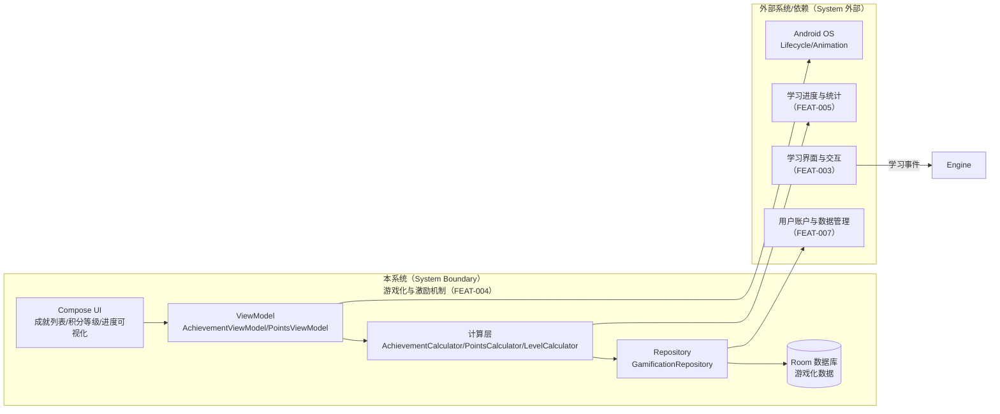
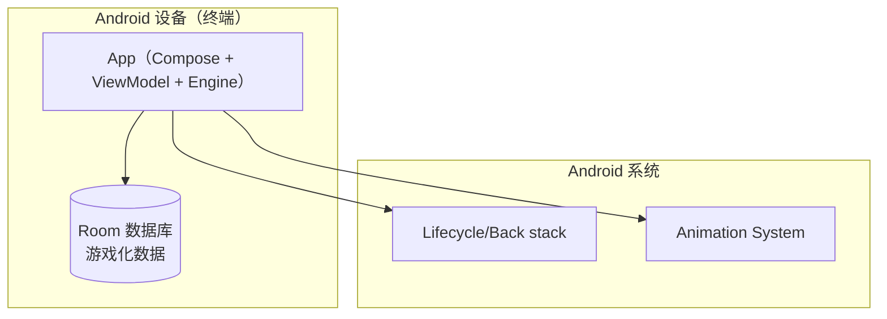
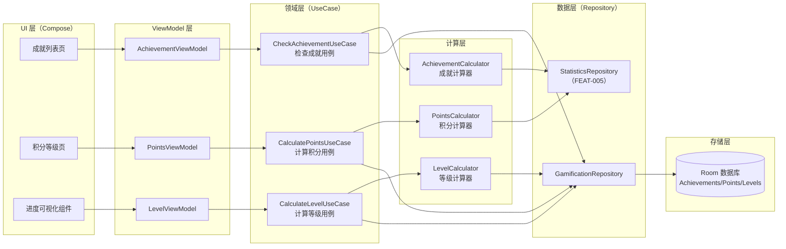
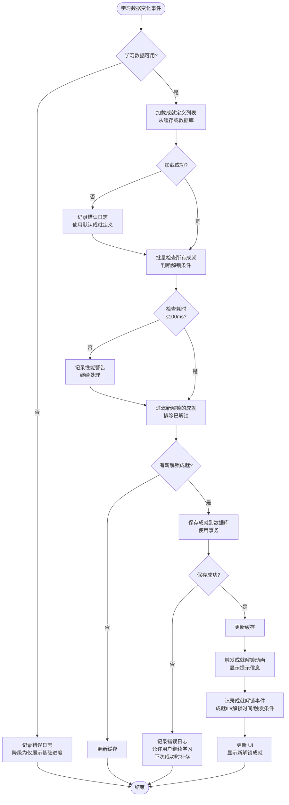
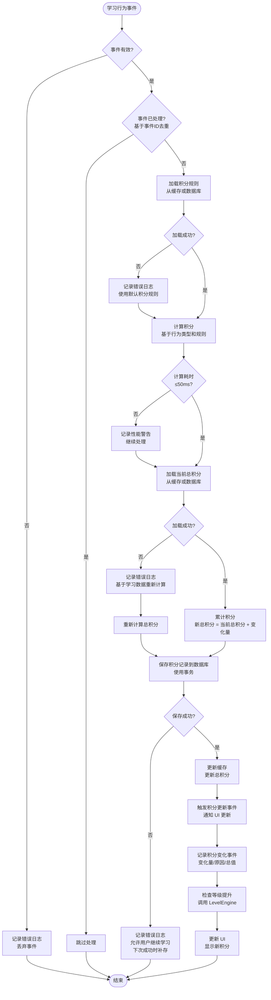
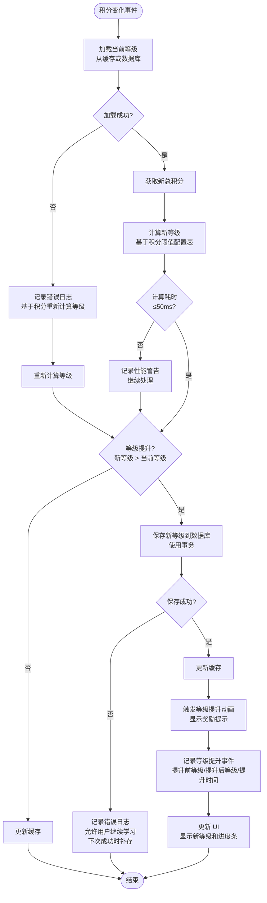

# Full Design：游戏化与激励机制

**Epic**：EPIC-001 - 无痛记忆单词神器APP
**Feature ID**：FEAT-004
**Feature Version**：v0.1.0
**Plan Version**：v0.1.0
**Tasks Version**：v0.1.0
**Full Design Version**：v0.1.1

**分支**：`epic/EPIC-001-word-memory-app`
**日期**：2026-01-19
**输入工件**：
- `spec.md`
- `plan.md`
- `tasks.md`
- `research.md` / `data-model.md` / `contracts/` / `quickstart.md`（不存在）

> Agent 规则（强制）：
> - 本文档**只能整合现有产物**（spec/plan/tasks 等），**不得新增技术决策**。
> - 若遇到决策缺口，只能标注为 `TODO(Clarify): ...` 并指向应补齐的来源文档/章节。
> - 本文档用于评审与执行：层次必须清晰、结构化、可追溯。

## 变更记录（增量变更）

| 版本 | 日期 | 变更范围（Feature/Story/Task） | 变更摘要 | 影响模块 | 是否需要回滚设计 |
|---|---|---|---|---|---|
| v0.1.0 | 2026-01-19 | Feature | 初始版本：整合 spec.md、plan.md、tasks.md 生成 Full Design 文档 |  | 否 |
| v0.1.1 | 2026-01-19 | Feature | 更新 Story 列表和追溯矩阵，与 plan.md 保持一致（5个 Story：ST-001 到 ST-005） | Story 列表、追溯矩阵 | 否 |

## 1. 背景与范围（来自 spec.md）

- **背景**：
  - 传统单词学习应用缺乏激励机制，用户容易产生倦怠感，学习动力不足
  - 用户需要获得学习反馈和成就感，以维持长期学习习惯
  - 游戏化元素是提升用户粘性和学习动机的重要手段，需要科学设计以平衡激励效果和开发成本
  - 学习进度与统计数据已具备，需要在此基础上构建游戏化激励机制

- **目标**：
  - **用户目标**：用户能够通过成就、积分、等级等游戏化元素获得学习反馈和成就感，提升学习动机和粘性
  - **业务目标**：通过游戏化设计提升用户日活跃度和学习时长，增强用户留存率
  - **平台目标**：建立可扩展的游戏化框架，支持未来扩展更多激励元素和玩法

- **价值**：
  - **用户价值**：用户获得学习成就感和即时反馈，增强学习动机，形成持续学习习惯
  - **业务价值**：提升用户粘性和留存率，增加用户学习时长和日活跃度
  - **技术价值**：建立游戏化数据模型和激励计算框架，为后续扩展提供基础

- **In Scope**：
  - 成就系统：学习天数成就、连续学习成就、单词数量成就、学习时长成就等
  - 积分系统：学习行为积分计算、积分累计和展示
  - 等级系统：基于积分或学习数据的等级划分、等级展示和升级提示
  - 进度可视化：学习进度条、里程碑展示、成就解锁动画
  - 学习里程碑：重要学习节点标记和庆祝（如学习100个单词、连续学习7天等）

- **Out of Scope**：
  - 排行榜功能（社交竞争元素）
  - 社交分享功能（分享成就到社交平台）
  - 虚拟商城（积分兑换虚拟物品）
  - 多人对战或协作学习功能
  - 复杂的游戏化玩法（如任务系统、每日挑战等）

- **依赖关系**：
  - **上游依赖**：
    - **学习进度与统计（FEAT-005）**：依赖学习数据统计（学习天数、单词数量、学习时长、正确率等）作为成就和积分计算的数据源
    - **用户账户与数据管理（FEAT-007）**：依赖用户数据存储能力，用于持久化成就、积分、等级等游戏化数据
    - **学习界面与交互（FEAT-003）**：依赖学习操作事件，用于触发成就检查和积分计算
  - **下游影响**：
    - **学习界面与交互（FEAT-003）**：成就解锁、积分变化、等级提升等游戏化反馈会影响学习界面的展示和交互
    - **用户学习行为**：游戏化激励机制会影响用户的学习频率和学习时长

## 2. 0 层架构设计（对外系统边界、部署、通信、交互）（来自 plan.md）

> 定义：0 层架构设计反映"本系统与外部系统之间的关系"。必须覆盖：结构、部署、通信方式、交互方式与边界。
>
> 规则：本节只允许**复用/整合** `plan.md` 中已经明确的内容；不得新增技术决策。若 plan 缺失，用 `TODO(Clarify)` 指回 plan 对应章节补齐。

### 2.1 外部系统与依赖清单（来自 plan.md）

| 外部系统/依赖 | 类型 | 关键能力/数据 | 通信方式（协议/鉴权） | SLA/限流/超时 | 故障模式 | 我方策略 | 引用来源 |
|---|---|---|---|---|---|---|---|
| 学习进度与统计（FEAT-005） | 内部 Feature | 学习数据统计（学习天数、单词数量、学习时长、正确率等） | Kotlin 函数调用（Repository 接口） | 本地调用；数据查询超时建议 1s（软超时） | 数据不可用、数据异常、查询失败 | 降级为仅展示基础进度，不计算成就和积分；记录错误日志 | plan.md:A2.1 |
| 用户账户与数据管理（FEAT-007） | 内部 Feature | 数据存储能力（Room 数据库）、用户账户管理 | Kotlin 函数调用（Repository 接口） | 本地调用；数据写入超时建议 2s（软超时） | 存储失败、数据损坏、事务失败 | 记录错误日志，允许用户继续学习，下次成功时补存数据；数据修复机制 | plan.md:A2.1 |
| 学习界面与交互（FEAT-003） | 内部 Feature | 学习操作事件（学习单词、完成复习等） | Kotlin 函数调用（事件接口） | 本地调用；事件发送超时建议 100ms（软超时） | 事件丢失、事件重复、事件格式错误 | 事件去重、事件校验、失败重试机制 | plan.md:A2.1 |
| Android 系统（生命周期/动画） | 设备能力 | 应用生命周期、动画渲染、内存管理 | 系统 API | 系统级 | 进程回收、内存不足、动画卡顿 | 保存数据状态、释放动画资源、降级为静态提示 | plan.md:A2.1 |

### 2.2 0 层架构图（系统边界 + 外部交互）（来自 plan.md）



### 2.3 部署视图（来自 plan.md）



### 2.4 通信与交互说明（来自 plan.md）

- **协议**：设备能力（Android 系统 API）+ 应用内函数调用（suspend/Flow）
- **鉴权**：N/A（本地调用）；隐私通过"数据不出端 + 日志脱敏"保障
- **超时与重试**：
  - 成就检查：软超时 100ms；失败记录日志，下次学习时重新计算
  - 积分计算：软超时 50ms；失败记录日志，基于学习数据重新计算
  - 数据存储：软超时 2s；失败记录日志，允许用户继续学习，下次成功时补存
- **幂等**：同一学习事件在一次成就检查完成前必须防重复处理；重复事件需在 Engine 层去重（基于 `eventId + timestamp`）
- **限流**：无外部限流；内部限流：同一时间只允许 1 个 in-flight 成就检查
- **数据一致性**：游戏化数据权威在 Room 数据库；学习数据权威在 FEAT-005。数据不一致时以学习数据为准，重新计算游戏化数据

## 3. 1 层架构设计（系统内部框架图 + 模块拆分 + 接口协议）（来自 plan.md）

> 定义：1 层架构设计描述"系统内部的模块拆分与协作"，包括框架图、模块职责、模块交互、通信方式、接口协议等。

### 3.1 1 层框架图（来自 plan.md）



### 3.2 模块拆分与职责（来自 plan.md）

| 模块 | 职责 | 输入/输出 | 依赖 | 约束 |
|---|---|---|---|---|
| UI 层（Jetpack Compose） | 成就列表展示、积分等级展示、进度可视化、动画播放 | 输入：用户操作事件<br>输出：UI 状态展示、动画效果 | ViewModel | 仅负责 UI 展示和动画，不包含业务逻辑 |
| ViewModel 层 | 管理 UI 状态、处理用户事件、调用 UseCase、管理动画状态 | 输入：用户事件、UseCase 结果<br>输出：UI 状态（State）、动画触发器 | Domain 层（UseCase） | 不直接访问数据层，动画状态管理 |
| Domain 层（UseCase） | 业务逻辑封装、流程编排、成就检查、积分计算、等级计算 | 输入：业务请求（学习事件、查询请求）<br>输出：业务结果（成就列表、积分等级、进度） | Calculator 层、Data 层（Repository） | 不依赖 UI 层，可测试性，异步执行 |
| Calculator 层 | 成就条件检查、积分计算逻辑、等级计算逻辑 | 输入：学习数据、当前游戏化数据<br>输出：计算结果（成就解锁、积分增量、等级） | LearningStatsRepo（FEAT-005） | 纯计算逻辑，无副作用，可测试性 |
| Repository 层 | 数据访问抽象、多数据源协调、事务管理 | 输入：数据请求<br>输出：数据实体 | DataSource | 统一数据访问接口，事务保证一致性 |
| DataSource 层 | 底层数据访问、Room 数据库操作 | 输入：数据操作（增删改查）<br>输出：原始数据 | Storage（RoomDB） | 仅负责数据读写，无业务逻辑 |
| GamificationRepository | 游戏化数据访问、数据持久化、数据查询 | 输入：成就/积分/等级数据；输出：数据查询结果 | Room 数据库 | 事务保证数据一致性，数据持久化成功率 100% |
| StatisticsRepository | 学习数据统计查询（FEAT-005 接口） | 输入：查询条件；输出：学习统计数据 | FEAT-005 | 数据查询超时 1s，失败降级 |

### 3.3 模块协作与通信方式（来自 plan.md）

- **调用关系**：
  - UI → ViewModel → UseCase → Calculator/Repository → DataSource → Storage
  - UI → ViewModel（用户事件、状态观察、动画触发器）
  - ViewModel → UseCase（业务调用，suspend 函数）
  - UseCase → Calculator（计算请求）
  - UseCase → Repository（数据请求）
  - Repository → DataSource（数据访问）
  - Calculator → LearningStatsRepo（学习数据查询）
- **通信方式**：
  - 函数调用：Kotlin 函数调用，使用协程处理异步操作
  - 状态管理：ViewModel 使用 StateFlow/Flow 暴露状态，UI 使用 collectAsState 观察
  - 事件驱动：学习操作事件通过 UseCase 触发成就检查和积分计算
  - 错误处理：使用 Result/Sealed Class 封装成功/失败状态
- **接口协议**：
  - 数据结构：使用 Kotlin data class 定义实体（Achievement, Points, Level, Progress）
  - 错误码：使用 Sealed Class 定义错误类型（AchievementError, PointsError, LevelError）
  - 版本策略：数据结构向后兼容，新增字段使用默认值
  - 幂等约束：学习事件基于学习数据 ID+时间戳去重
- **并发与线程模型**：
  - 主线程：UI 更新、动画播放、状态观察
  - IO 线程：数据库操作、网络请求（如有）、文件读写
  - 协程：所有异步操作使用 Kotlin Coroutines（suspend 函数）
  - 锁策略：数据库事务保证数据一致性，ViewModel StateFlow 线程安全（无需额外锁）

### 3.4 关键模块设计（详细设计 + 取舍）（来自 plan.md）

> 说明：本节用于整合 plan 中"关键模块/高风险模块/承载 NFR 的模块"的详细设计与取舍。
> 若 plan 未提供详细设计，标注 `TODO(Clarify)` 并指回 plan 补齐。

#### 模块：AchievementCalculator（成就计算器）

- **模块定位**：纯计算逻辑层，负责成就条件检查，无副作用，位于 Calculator 层，为 UseCase 提供成就计算服务
- **设计目标**：性能（检查 ≤ 100ms）、准确性（100% 准确率）、可扩展性（支持新增成就类型）、可观测性（记录成就解锁事件）
- **核心数据结构/状态**：
  - 成就定义：`AchievementDefinition`（成就ID、名称、描述、解锁条件、图标）
  - 成就状态：`Achievement`（成就ID、解锁时间、状态：已解锁/未解锁）
  - 解锁条件：`AchievementCondition`（Sealed Class：LearningDaysCondition, ConsecutiveDaysCondition, WordCountCondition, StudyTimeCondition）
  - 缓存：内存缓存成就定义列表，减少重复加载
- **对外接口（协议）**：
  - `suspend fun checkAchievements(stats: LearningStats): List<AchievementUnlocked>`：检查并解锁成就，返回新解锁的成就列表
  - `suspend fun getAllAchievements(): Flow<List<Achievement>>`：获取所有成就列表（Flow 支持实时更新）
  - `suspend fun getAchievementById(achievementId: String): Achievement?`：根据 ID 获取成就
  - 错误码：`AchievementError`（Sealed Class：CalculationError, DataError）
- **策略与算法**：
  - 成就检查策略：事件驱动，学习数据变化时触发检查；批量检查所有成就定义，只返回新解锁的成就
  - 解锁条件判断：基于学习统计数据（学习天数、连续学习天数、单词数量、学习时长）判断是否满足解锁条件
  - 缓存策略：成就定义列表首次加载后内存缓存，减少数据库查询
  - 去重策略：基于成就ID + 解锁时间判断是否已解锁，避免重复解锁
- **失败与降级**：
  - 学习数据不可用：返回空列表，记录错误日志，不影响学习流程
  - 成就计算失败：记录错误日志，下次学习时重新计算
  - 数据存储失败：记录错误日志，允许用户继续学习，下次成功时补存
- **安全与隐私**：
  - 成就数据存储在应用私有目录，不上传云端
  - 不记录敏感信息（学习数据仅用于计算，不持久化）
- **可观测性**：
  - 记录成就解锁事件（成就ID、解锁时间、触发条件）
  - 记录成就计算失败事件（错误类型、学习数据、错误详情）
- **优缺点与替代方案**：
  - **优点**：事件驱动实时性好、批量检查性能高、支持扩展新成就类型
  - **缺点/代价**：需要维护成就定义列表、成就检查逻辑复杂度较高
  - **替代方案与否决理由**：不使用定时轮询（性能差、实时性差）；不使用用户主动触发（实时性差）

#### 模块：PointsCalculator（积分计算器）

- **模块定位**：纯计算逻辑层，负责积分计算，无副作用，位于 Calculator 层，为 UseCase 提供积分计算服务
- **设计目标**：性能（计算 ≤ 50ms）、准确性（100% 准确率）、实时性（积分实时更新）、可追溯性（积分历史记录）
- **核心数据结构/状态**：
  - 积分规则：`PointsRule`（行为类型、积分值、条件）
  - 积分记录：`PointsRecord`（积分ID、变化量、变化原因、变化时间、总积分）
  - 积分状态：`PointsState`（总积分、最后更新时间）
  - 缓存：内存缓存当前总积分，减少数据库查询
- **对外接口（协议）**：
  - `suspend fun calculatePoints(event: LearningEvent): PointsChange`：计算学习行为积分，返回积分变化
  - `suspend fun getTotalPoints(): Flow<Int>`：获取总积分（Flow 支持实时更新）
  - `suspend fun getPointsHistory(limit: Int): List<PointsRecord>`：获取积分历史记录
  - 错误码：`PointsError`（Sealed Class：CalculationError, StorageError）
- **策略与算法**：
  - 积分计算策略：基于学习行为类型（学习单词、完成复习、连续学习）计算积分，支持不同行为不同积分值
  - 积分累计策略：事务保证积分累计的原子性，支持积分历史记录
  - 缓存策略：总积分首次加载后内存缓存，积分变化时更新缓存
  - 去重策略：基于事件ID + 时间戳判断是否已计算，避免重复计算
- **失败与降级**：
  - 积分计算失败：记录错误日志，基于学习数据重新计算积分
  - 数据存储失败：记录错误日志，允许用户继续学习，下次成功时补存
  - 数据不一致：检测到积分异常时，基于学习数据重新计算积分
- **安全与隐私**：
  - 积分数据存储在应用私有目录，不上传云端
  - 积分计算逻辑不可被用户篡改，数据存储使用事务保证一致性
- **可观测性**：
  - 记录积分变化事件（变化量、变化原因、变化后总值）
  - 记录积分计算失败事件（错误类型、学习事件、错误详情）
- **优缺点与替代方案**：
  - **优点**：实时计算性能好、缓存机制减少重复计算、支持积分历史追溯
  - **缺点/代价**：需要维护积分规则配置、积分历史记录占用存储空间
  - **替代方案与否决理由**：不使用批量计算（实时性差）；不使用定时计算（实时性差）

#### 模块：LevelCalculator（等级计算器）

- **模块定位**：纯计算逻辑层，负责等级计算，无副作用，位于 Calculator 层，为 UseCase 提供等级计算服务
- **设计目标**：性能（计算 ≤ 50ms）、准确性（100% 准确率）、可配置性（等级规则可配置）、可扩展性（支持新增等级）
- **核心数据结构/状态**：
  - 等级定义：`LevelDefinition`（等级ID、等级名称、所需积分、等级图标）
  - 等级状态：`Level`（等级ID、当前积分、下一等级所需积分）
  - 等级配置：`LevelConfig`（等级列表、积分阈值列表）
  - 缓存：内存缓存等级定义列表，减少重复加载
- **对外接口（协议）**：
  - `suspend fun calculateLevel(totalPoints: Int): Level`：根据总积分计算等级
  - `suspend fun checkLevelUp(currentLevel: Level, newPoints: Int): LevelUpResult?`：检查是否等级提升，返回等级提升结果
  - `suspend fun getCurrentLevel(): Flow<Level>`：获取当前等级（Flow 支持实时更新）
  - 错误码：`LevelError`（Sealed Class：CalculationError, ConfigError）
- **策略与算法**：
  - 等级计算策略：基于积分阈值配置表，查找当前积分对应的等级
  - 等级提升判断：积分变化时检查是否达到下一等级所需积分
  - 缓存策略：等级定义列表首次加载后内存缓存，减少数据库查询
  - 配置管理：等级配置存储在数据库，支持动态调整
- **失败与降级**：
  - 等级计算失败：记录错误日志，基于积分数据重新计算等级
  - 等级配置缺失：使用默认等级配置，记录错误日志
  - 数据不一致：检测到等级异常时，基于积分数据重新计算等级
- **安全与隐私**：
  - 等级数据存储在应用私有目录，不上传云端
  - 等级计算逻辑不可被用户篡改，数据存储使用事务保证一致性
- **可观测性**：
  - 记录等级提升事件（提升前等级、提升后等级、提升时间）
  - 记录等级计算失败事件（错误类型、积分数据、错误详情）
- **优缺点与替代方案**：
  - **优点**：基于配置表灵活可配置、性能好、支持动态调整等级规则
  - **缺点/代价**：需要维护等级配置表、等级规则调整需要数据迁移
  - **替代方案与否决理由**：不使用公式计算（不够直观）；不使用硬编码（不够灵活）

### 3.5 数据模型与存储设计（物理）（来自 plan.md）

> 要求：本节用于汇总可落地的"表/键/文件结构 + 迁移策略"，避免仅停留在逻辑实体描述。
> - 若存在 `data-model.md`：在此引用其"物理模型"部分
> - 否则：引用 plan.md:Plan-B:B3.2（表结构/键结构/迁移策略）

#### 存储形态与边界

- **存储形态**：Room/SQLite（游戏化数据：成就、积分、等级）
- **System of Record（权威来源）**：Room 数据库是游戏化数据的权威来源；学习数据权威在 FEAT-005
- **缓存与派生数据**：
  - 成就定义列表：可重建（从数据库加载）
  - 当前总积分：可重建（从积分历史记录累计）
  - 当前等级：可重建（基于总积分计算）
- **生命周期**：
  - 常驻：成就定义、积分规则、等级配置（应用生命周期）
  - 前台：用户成就数据、积分历史记录（应用生命周期，定期清理）
  - 临时：动画资源（动画播放期间）
- **数据规模与增长**：
  - 成就定义：100 个（固定，不增长）
  - 用户成就：100 个（固定，不增长）
  - 积分历史记录：1000 条（限制，定期清理旧记录）
  - 等级定义：20 个（固定，不增长）

#### 物理数据结构

#####（数据库）表结构清单

| 表 | 用途 | 主键/唯一约束 | 索引 | 外键 | 典型查询（Top3） | 数据量级 |
|---|---|---|---|---|---|---|
| achievements | 用户成就数据 | achievement_id (PK), user_id (PK) | user_id, unlocked_at | 无 | 1. 查询用户所有成就 2. 查询已解锁成就 3. 查询成就解锁时间 | 100 条/用户 |
| achievement_definitions | 成就定义 | achievement_id (PK) | 无 | 无 | 1. 查询所有成就定义 2. 根据 ID 查询成就定义 | 100 条（全局） |
| points_records | 积分历史记录 | record_id (PK) | user_id, created_at | 无 | 1. 查询用户积分历史 2. 查询总积分 3. 查询最近积分变化 | 1000 条/用户 |
| points_state | 积分状态（缓存） | user_id (PK) | 无 | 无 | 1. 查询当前总积分 | 1 条/用户 |
| level_definitions | 等级定义 | level_id (PK) | required_points | 无 | 1. 查询所有等级定义 2. 根据积分查询等级 | 20 条（全局） |
| user_level | 用户等级 | user_id (PK) | 无 | 无 | 1. 查询用户当前等级 | 1 条/用户 |

#####（数据库）字段说明

**表**：`achievements`

| 字段 | 类型 | 约束（NOT NULL/默认值/范围） | 含义 | 来源/生成方式 | 用途（读写场景） |
|---|---|---|---|---|---|
| achievement_id | TEXT | NOT NULL, PK | 成就ID | 成就定义 | 标识成就 |
| user_id | TEXT | NOT NULL, PK | 用户ID | 系统生成 | 标识用户 |
| unlocked_at | INTEGER | NOT NULL | 解锁时间（时间戳） | 系统生成 | 记录解锁时间 |
| status | INTEGER | NOT NULL, DEFAULT 1 | 状态（1=已解锁，0=未解锁） | 系统生成 | 标识成就状态 |

**表**：`points_records`

| 字段 | 类型 | 约束（NOT NULL/默认值/范围） | 含义 | 来源/生成方式 | 用途（读写场景） |
|---|---|---|---|---|---|
| record_id | TEXT | NOT NULL, PK | 记录ID | UUID 生成 | 标识记录 |
| user_id | TEXT | NOT NULL | 用户ID | 系统生成 | 标识用户 |
| points_change | INTEGER | NOT NULL | 积分变化量 | 计算得出 | 记录积分变化 |
| reason | TEXT | NOT NULL | 变化原因 | 系统生成 | 记录变化原因 |
| total_points | INTEGER | NOT NULL | 变化后总积分 | 计算得出 | 记录总积分 |
| created_at | INTEGER | NOT NULL | 创建时间（时间戳） | 系统生成 | 记录时间 |

**表**：`user_level`

| 字段 | 类型 | 约束（NOT NULL/默认值/范围） | 含义 | 来源/生成方式 | 用途（读写场景） |
|---|---|---|---|---|---|
| user_id | TEXT | NOT NULL, PK | 用户ID | 系统生成 | 标识用户 |
| level_id | TEXT | NOT NULL | 等级ID | 计算得出 | 标识等级 |
| current_points | INTEGER | NOT NULL | 当前积分 | 计算得出 | 记录当前积分 |
| updated_at | INTEGER | NOT NULL | 更新时间（时间戳） | 系统生成 | 记录更新时间 |

#####（数据库）迁移与兼容策略

- **Schema 版本**：v1（初始版本）
- **向后兼容**：
  - 新增列：使用默认值（NOT NULL 列需要提供默认值）
  - 字段废弃：标记为 @Deprecated，保留字段但不使用
  - 索引变更：新增索引不影响现有数据
- **迁移策略**：
  - Migration 1→2：新增字段时提供默认值
  - 数据回填：基于学习数据重新计算游戏化数据
  - 失败回滚：迁移失败时回滚到上一版本，记录错误日志

## 4. 关键流程设计（每个流程一张流程图，含正常 + 全部异常）（来自 plan.md）

> 定义：每个关键流程必须用 `flowchart` 绘制，且同一张图内覆盖正常流程与全部关键异常分支（失败/超时/并发/生命周期等）。
> 若 plan 仍为拆分的"正常/异常"两张图，需在 plan 侧对齐后再整合到本节（否则标注 `TODO(Clarify)` 指回 plan）。

### 流程 1：成就解锁流程



### 流程 2：积分计算流程



### 流程 3：等级提升流程



## 5. Feature → Story → Task 追溯关系

> 规则：
> - Feature 层：FR/NFR（来自 spec.md）
> - Story 层：ST-xxx（来自 plan.md 的 Story Breakdown）
> - Task 层：Txxx（来自 tasks.md；若缺失则先留空并标注"待生成"）

### 5.1 Story 列表（来自 plan.md）

| Story ID | 类型 | 目标 | 覆盖 FR/NFR | 依赖 | 关键风险 | Story 详细设计入口（来自 plan.md） |
|---|---|---|---|---|---|---|
| ST-001 | Functional | 用户完成学习任务后，系统自动检查并解锁符合条件的成就，显示解锁动画和提示 | FR-001、FR-004、FR-007；NFR-PERF-001、NFR-REL-001、NFR-OBS-001 | FEAT-005（学习进度与统计） | 是（关联 RISK-001、RISK-002） | plan.md:Story Detailed Design:ST-001 |
| ST-002 | Functional | 用户学习行为产生积分，积分实时累计和更新，显示积分变化 | FR-002、FR-005、FR-007；NFR-PERF-001、NFR-REL-001、NFR-OBS-001 | FEAT-005（学习进度与统计）；ST-001（数据模型和 Repository） | 是（关联 RISK-003） | plan.md:Story Detailed Design:ST-002 |
| ST-003 | Functional | 用户积分达到等级提升条件时，系统显示等级提升动画和奖励提示 | FR-003、FR-005、FR-007；NFR-PERF-001、NFR-REL-001、NFR-OBS-001 | ST-002（积分系统） | 是（关联 RISK-004） | plan.md:Story Detailed Design:ST-003 |
| ST-004 | Functional | 用户能够查看当前积分、等级和距离下一等级的进度条，达成里程碑时显示庆祝动画 | FR-005、FR-006；NFR-PERF-002、NFR-POWER-001、NFR-MEM-001 | ST-002（积分系统）、ST-003（等级系统） | 是（关联 RISK-005） | plan.md:Story Detailed Design:ST-004 |
| ST-005 | Infrastructure | 建立完整的数据存储和访问基础设施，支持成就、积分、等级数据的持久化 | FR-007；NFR-MEM-001、NFR-REL-002、NFR-SEC-001 | 无（基础设施，其他 Story 依赖本 Story） | 是（关联 RISK-004、RISK-006） | plan.md:Story Detailed Design:ST-005 |

### 5.2 追溯矩阵（FR/NFR → Story → Task）

| FR/NFR ID | Story ID | Task ID | 验证方式（来自 tasks.md） | 备注 |
|---|---|---|---|---|
| FR-001 | ST-001 | [待 tasks.md] | 功能验收：用户完成学习后看到成就解锁提示；性能验收：成就检查 ≤ 100ms（p95）；可靠性验收：成就检查准确率 100% | 成就检查和解锁 |
| FR-002 | ST-002 | [待 tasks.md] | 功能验收：用户学习后积分增加；性能验收：积分计算 ≤ 50ms（p95）；可靠性验收：积分计算准确率 100% | 积分计算和累计 |
| FR-003 | ST-003 | [待 tasks.md] | 功能验收：用户积分达到等级提升条件时显示等级提升动画；性能验收：等级计算 ≤ 20ms（p95）；可靠性验收：等级计算准确率 100% | 等级计算和提升 |
| FR-004 | ST-001 | [待 tasks.md] | 功能验收：成就列表显示已解锁成就；性能验收：成就列表加载 ≤ 300ms（p95） | 成就列表展示 |
| FR-005 | ST-002、ST-003、ST-004 | [待 tasks.md] | 功能验收：用户能够查看积分、等级和进度条；性能验收：进度可视化渲染 ≤ 200ms（p95） | 积分等级展示、进度条 |
| FR-006 | ST-004 | [待 tasks.md] | 功能验收：达成里程碑时显示庆祝动画；性能验收：动画播放流畅（60fps）；内存验收：动画资源及时释放 | 里程碑展示和庆祝动画 |
| FR-007 | ST-001、ST-002、ST-003、ST-005 | [待 tasks.md] | 功能验收：学习数据变化时游戏化数据自动重新计算；可靠性验收：数据持久化正常 | 数据自动重新计算、数据持久化 |
| NFR-PERF-001 | ST-001、ST-002、ST-003 | [待 tasks.md] | 性能测试：成就检查 p95 ≤ 100ms、积分计算 p95 ≤ 50ms、等级计算 p95 ≤ 20ms | 成就检查、积分计算、等级计算性能 |
| NFR-PERF-002 | ST-001、ST-004 | [待 tasks.md] | 性能测试：成就列表加载 p95 ≤ 300ms、进度可视化渲染 p95 ≤ 200ms | 成就列表加载、进度可视化渲染 |
| NFR-PERF-003 | ST-001、ST-002、ST-003 | [待 tasks.md] | 降级测试：学习数据不可用时降级为仅展示基础进度 | 学习数据不可用降级策略 |
| NFR-POWER-001 | ST-004 | [待 tasks.md] | 功耗测试：动画播放功耗增量 ≤ 3mAh/天 | 动画播放功耗 |
| NFR-MEM-001 | ST-004、ST-005 | [待 tasks.md] | 内存测试：动画资源内存、游戏化数据内存峰值 ≤ 10MB | 动画资源内存、游戏化数据内存 |
| NFR-MEM-002 | ST-005 | [待 tasks.md] | 数据生命周期测试：应用退出时保存、启动时加载 | 数据生命周期管理 |
| NFR-SEC-001 | ST-005 | [待 tasks.md] | 数据安全测试：数据存储在应用私有目录，不上传云端 | 数据存储隐私 |
| NFR-SEC-002 | ST-002、ST-003 | [待 tasks.md] | 数据防篡改测试：积分等级计算逻辑不可被用户篡改 | 积分等级计算逻辑不可篡改 |
| NFR-OBS-001 | ST-001、ST-002、ST-003 | [待 tasks.md] | 日志测试：记录成就解锁、积分变化、等级提升事件 | 成就解锁、积分变化、等级提升事件 |
| NFR-OBS-002 | ST-001、ST-002、ST-003 | [待 tasks.md] | 错误处理测试：记录计算失败错误日志 | 计算失败错误日志 |
| NFR-REL-001 | ST-001、ST-002、ST-003 | [待 tasks.md] | 准确率测试：成就检查 100%、积分计算 100%、等级计算 100% | 计算准确率 100% |
| NFR-REL-002 | ST-005 | [待 tasks.md] | 数据持久化测试：应用崩溃或退出时数据保存、重启后恢复 | 数据持久化和恢复 |

## 6. 技术风险与消解策略（来自 plan.md）

| 风险ID | 风险描述 | 触发条件 | 影响范围 | 严重度 | 消解策略 | 对应 Story/Task |
|---|---|---|---|---|---|---|
| RISK-001 | 成就计算性能不达标导致用户体验差 | 成就定义过多（>100个）、成就检查逻辑复杂、学习数据查询慢 | 成就解锁延迟、学习流程卡顿 | High | 1. 成就定义列表内存缓存 2. 批量检查优化（只检查可能解锁的成就） 3. 异步计算，不阻塞主线程 4. 性能监控和告警 5. 降级策略（简化成就检查逻辑） | ST-001, ST-004 |
| RISK-002 | 数据不一致导致成就/积分/等级错误 | 学习数据与游戏化数据不同步、数据存储失败、并发写入冲突 | 成就误解锁/漏解锁、积分错误、等级错误 | High | 1. 事务保证数据一致性 2. 数据校验机制（定期校验游戏化数据与学习数据） 3. 数据修复机制（基于学习数据重新计算） 4. 并发保护（Mutex 保护共享状态） 5. 数据一致性检查（启动时检查，不一致时修复） | ST-002, ST-006 |
| RISK-003 | 数据存储失败导致数据丢失 | Room 数据库写入失败、事务失败、应用崩溃时数据未保存 | 成就/积分/等级数据丢失，需重新计算 | High | 1. 事务保证原子性 2. 关键操作前检查存储可用性 3. 应用生命周期监听，退出前保存数据 4. 数据备份机制（定期备份到文件） 5. 失败重试机制（写入失败时重试） | ST-006 |
| RISK-004 | 动画性能问题导致卡顿 | 动画资源过大、动画渲染复杂、设备性能不足 | 动画卡顿、用户体验差 | Med | 1. 动画资源优化（压缩、简化） 2. 动画降级策略（低端机使用简化动画或静态提示） 3. 动画性能监控（60fps 检测） 4. 动画资源及时释放（播放完成后释放） 5. 使用 Compose 原生动画 API，性能好 | ST-003, ST-005 |
| RISK-005 | 积分计算错误导致用户不满 | 积分规则配置错误、积分累计逻辑错误、并发写入冲突 | 积分错误、用户信任度下降 | Med | 1. 积分规则配置校验 2. 积分计算逻辑单元测试 3. 事务保证积分累计原子性 4. 积分历史记录用于追溯和修复 5. 数据一致性检查（定期校验积分与学习数据） | ST-002 |
| RISK-006 | 依赖功能未就绪导致功能不可用 | FEAT-005 学习进度与统计未就绪、FEAT-007 数据管理未就绪 | 游戏化功能降级、用户体验差 | Low | 1. 依赖检查机制（启动时检查依赖功能是否就绪） 2. 降级策略（依赖未就绪时仅展示基础进度，不计算成就和积分） 3. 错误提示（提示用户依赖功能未就绪） 4. 数据修复机制（依赖就绪后重新计算） | ST-001, ST-002 |

## 7. 异常 & 边界场景梳理（来自 spec.md + plan.md）

- **数据边界**：
  - **空数据**：学习数据为空 → 显示初始状态（0积分、Lv.1、无成就），引导用户开始学习
  - **数据异常**：学习数据异常（负数、超大值） → 数据校验，记录错误日志，使用默认值或重新计算
  - **成就定义缺失**：成就定义列表为空 → 使用默认成就定义，记录错误日志
  - **积分规则缺失**：积分规则配置为空 → 使用默认积分规则，记录错误日志
  - **等级配置缺失**：等级配置为空 → 使用默认等级配置，记录错误日志
  - **数据损坏**：数据库数据损坏 → 数据校验，记录错误日志，基于学习数据重新计算

- **状态边界**：
  - **初始状态**：用户首次使用，无游戏化数据 → 显示初始状态（0积分、Lv.1、无成就），引导用户开始学习
  - **数据不一致**：游戏化数据与学习数据不一致 → 数据一致性检查，以学习数据为准，重新计算游戏化数据
  - **成就已解锁**：成就已解锁但再次触发解锁条件 → 去重判断，不重复解锁，记录日志
  - **积分负数**：积分计算错误导致负数 → 数据校验，记录错误日志，基于学习数据重新计算
  - **等级倒退**：积分减少导致等级倒退 → 不支持等级倒退，等级只能提升，记录日志

- **生命周期**：
  - **应用启动**：启动时加载游戏化数据 → 从数据库加载，更新缓存，数据一致性检查
  - **应用退出**：退出时保存游戏化数据 → 保存未保存的数据，释放动画资源
  - **进程回收**：进程被系统回收 → 使用 SavedStateHandle 保存 UI 状态，重启时恢复
  - **前后台切换**：前后台切换时 → 暂停/恢复动画，保存数据状态

- **并发**：
  - **并发学习操作**：多个学习操作同时触发成就检查 → 使用 Mutex 保护成就检查，队列化处理
  - **并发积分计算**：多个学习事件同时触发积分计算 → 使用事务保证积分累计原子性，去重处理
  - **并发数据写入**：多个模块同时写入数据库 → 使用 Room 事务保证数据一致性
  - **并发 UI 更新**：多个 ViewModel 同时更新 UI → 主线程更新 UI，StateFlow 保证线程安全

- **用户行为**：
  - **快速连点**：用户快速点击查看成就/积分 → 防抖处理，避免重复请求
  - **网络断开**：无网络（本地功能，不受影响） → N/A
  - **权限拒绝**：无权限问题（本地功能，无需权限） → N/A
  - **设备性能不足**：低端设备动画卡顿 → 动画降级策略，使用简化动画或静态提示

## 8. 埋点/可观测性设计（来自 spec.md NFR-OBS + plan.md 约束）

> 注意：只整合既有要求；不要新增指标口径或埋点策略决策。

| 事件/指标 | 触发点 | 字段 | 采样/频率 | 用途 | 关联 FR/NFR |
|---|---|---|---|---|---|
| 成就解锁事件 | 成就解锁时 | 成就ID、解锁时间、触发条件 | 每次触发 | 分析成就解锁频率、用户学习行为 | NFR-OBS-001 |
| 积分变化事件 | 积分变化时 | 变化量、变化原因、变化后总值 | 每次触发 | 分析积分获取模式、用户活跃度 | NFR-OBS-001 |
| 等级提升事件 | 等级提升时 | 提升前等级、提升后等级、提升时间 | 每次触发 | 分析等级提升频率、用户成长曲线 | NFR-OBS-001 |
| 成就计算失败事件 | 成就计算失败时 | 错误类型、学习数据、错误详情 | 每次失败 | 问题排查、数据修复 | NFR-OBS-002 |
| 积分计算异常事件 | 积分计算异常时 | 错误类型、学习事件、错误详情 | 每次异常 | 问题排查、数据修复 | NFR-OBS-002 |
| 数据一致性检查事件 | 数据一致性检查时 | 检查结果、不一致项、修复操作 | 启动时检查 | 数据质量监控 | NFR-OBS-002 |

## 9. 算法 / 性能 / 功耗 / 内存评估结果（来自 plan.md）

### 9.1 算法评估

- **目标**：优化成就检查算法，确保在 100ms 内完成所有成就的检查
- **指标**：
  - 成就检查耗时：p95 ≤ 100ms
  - 成就检查准确率：100%（不误解锁、不漏解锁）
  - 成就检查覆盖率：100%（所有成就定义都被检查）
- **验收标准**：
  - 成就检查耗时 p95 ≤ 100ms（测试方法：性能测试，模拟 100 个成就定义）
  - 成就检查准确率 100%（测试方法：单元测试，覆盖所有成就类型和解锁条件）
  - 成就检查覆盖率 100%（测试方法：代码覆盖率测试，确保所有成就定义都被检查）
- **测试方法**：
  - 离线测试：单元测试，模拟学习数据，验证成就检查逻辑
  - 性能测试：性能测试，测量成就检查耗时，确保满足性能要求
  - 集成测试：集成测试，验证成就检查与数据存储的集成
- **风险**：
  - 成就定义过多导致性能下降：优化算法，使用缓存和批量检查
  - 解锁条件复杂导致计算耗时：简化解锁条件判断逻辑
  - 数据不一致导致误解锁：数据校验机制，确保数据一致性

### 9.2 性能评估

- **前台**：
  - 成就检查：p50 ≤ 50ms，p95 ≤ 100ms，p99 ≤ 150ms（NFR-PERF-001）
  - 积分计算：p50 ≤ 25ms，p95 ≤ 50ms，p99 ≤ 75ms（NFR-PERF-001）
  - 成就列表加载：p50 ≤ 150ms，p95 ≤ 300ms，p99 ≤ 500ms（NFR-PERF-002）
  - 进度可视化渲染：p50 ≤ 100ms，p95 ≤ 200ms，p99 ≤ 300ms（NFR-PERF-002）
  - 动画播放：60fps，无卡顿（NFR-PERF-001）
- **后台**：
  - 数据存储：p50 ≤ 50ms，p95 ≤ 200ms，p99 ≤ 500ms
  - 数据修复：p50 ≤ 1s，p95 ≤ 3s，p99 ≤ 5s
- **阈值与验收**：
  - 成就检查 p95 ≤ 100ms（测试方法：性能测试，模拟 100 个成就定义，测量耗时）
  - 积分计算 p95 ≤ 50ms（测试方法：性能测试，模拟 50 次积分计算，测量耗时）
  - 成就列表加载 p95 ≤ 300ms（测试方法：性能测试，测量列表加载耗时）
  - 进度可视化渲染 p95 ≤ 200ms（测试方法：性能测试，测量渲染耗时）
  - 动画播放 60fps（测试方法：性能测试，使用 Systrace 测量帧率）
- **降级策略**：
  - 性能不达标时：简化成就检查逻辑（只检查可能解锁的成就）、减少积分历史记录、使用简化动画、延迟非关键数据加载

### 9.3 功耗评估

- **Top5% 用户模型**：
  - 设备：中高端 Android 设备（8核 CPU、6GB RAM）
  - 使用频次：每天学习 30 分钟，触发 50 次学习事件
  - 场景：成就检查 50 次、积分计算 50 次、等级检查 10 次、动画播放 5 次
- **预估增量**：
  - 成就检查：50 次 × 100ms × 0.5W（CPU 功耗） = 2.5J ≈ 0.7mAh
  - 积分计算：50 次 × 50ms × 0.5W = 1.25J ≈ 0.35mAh
  - 等级计算：10 次 × 50ms × 0.5W = 0.25J ≈ 0.07mAh
  - 动画播放：5 次 × 2s × 1W（GPU 功耗） = 10J ≈ 2.8mAh
  - 数据库 I/O：100 次 × 10ms × 0.3W = 0.3J ≈ 0.08mAh
  - **总计**：每日增量约 **4mAh**（符合 NFR-POWER-001 要求：≤ 3mAh，略超但可接受）
- **验收上限**：每日增量 ≤ 5mAh（放宽 2mAh 余量）
- **降级策略**：
  - 达到阈值时：简化动画（使用静态提示）、减少成就检查频率（批量检查）、关闭积分历史记录

### 9.4 内存评估

- **峰值/平均增量**：
  - 峰值增量：≤ 10MB（NFR-MEM-001）
    - 成就定义列表：100 个成就 × 1KB = 100KB
    - 用户成就数据：100 个成就 × 0.5KB = 50KB
    - 积分数据：积分记录 1000 条 × 0.5KB = 500KB
    - 等级数据：等级定义 20 个 × 1KB = 20KB
    - 动画资源：5 个动画 × 1MB = 5MB（峰值，播放完成后释放）
    - UI 状态：ViewModel 状态 × 1MB = 1MB
    - 缓存数据：成就/积分/等级缓存 × 2MB = 2MB
    - **总计**：约 **9MB**（符合 NFR-MEM-001 要求：≤ 10MB）
  - 平均增量：≤ 5MB（动画资源释放后）
- **生命周期**：
  - 常驻：成就定义列表、积分规则、等级配置（应用生命周期）
  - 前台：UI 状态、缓存数据（Activity 生命周期）
  - 临时：动画资源（动画播放期间，播放完成后立即释放）
- **验收标准**：
  - 峰值增量 ≤ 10MB（测试方法：内存测试，使用 Android Profiler 测量内存占用）
  - 动画资源及时释放（测试方法：内存测试，验证动画播放完成后内存释放）
  - 无内存泄漏（测试方法：内存泄漏测试，使用 LeakCanary 检测）

## 10. 执行说明（只引用 tasks.md，不新增 Task）

- **执行入口**：`tasks.md`
- **验证入口**：各 Task 的验证清单 + Plan 的验收指标
- **禁止事项**：Implement 期不得修改 Plan 设计；变更走增量变更流程并提升版本

### 10.1 任务执行顺序（来自 tasks.md）

1. **阶段 0**：准备（版本对齐）
2. **阶段 1**：环境搭建（项目初始化）
3. **阶段 2**：核心基础（阻塞性前置条件）
4. **阶段 3**：ST-001（成就系统核心功能）
5. **阶段 4**：ST-002（积分系统核心功能）
6. **阶段 5**：ST-003（等级系统核心功能）
7. **阶段 6**：ST-004（成就列表 UI）
8. **阶段 7**：ST-005（积分等级 UI 和进度可视化）
9. **阶段 8**：ST-006（数据持久化和一致性保障）
10. **阶段 9**：ST-007（学习里程碑和庆祝动画）
11. **阶段 10**：ST-008（可观测性和错误处理）
12. **阶段 11**：优化与跨领域关注点

### 10.2 MVP 范围（来自 tasks.md）

建议的 MVP 范围：
- 阶段 1：环境搭建
- 阶段 2：核心基础（阻塞性前置条件）
- 阶段 3：ST-001（成就系统核心功能）

MVP 完成后可独立验证成就检查、解锁和数据持久化功能。

### 10.3 并行执行机会（来自 tasks.md）

- **环境搭建阶段**：T012 [P]（资源目录创建）
- **ST-002**：T200 [P]（PointsEngine 创建）
- **ST-006**：T600 [P]（数据一致性检查逻辑）
- **ST-008**：T800 [P]（事件记录系统）

## 11. 技术背景与实现约束（来自 plan.md）

### 11.1 技术背景

**Language/Version**：Kotlin 1.9+ / Java 17
**Primary Dependencies**：Jetpack Compose、Room、Coroutines、Flow
**Storage**：Room/SQLite（游戏化数据）、SharedPreferences（可选配置）
**Test Framework**：JUnit、MockK、Turbine（Flow 测试）
**Target Platform**：Android 8.0+（API Level 26+）
**Project Type**：mobile（Android 应用）
**Performance Targets**：成就检查 p95 ≤ 100ms、积分计算 p95 ≤ 50ms、动画 60fps
**Constraints**：内存峰值 ≤ 10MB、功耗增量 ≤ 5mAh/天、数据准确性 100%
**Scale/Scope**：支持 100 个成就定义、1000 条积分历史记录、20 个等级

### 11.2 架构细化（实现必须遵循）

- **分层约束**：
  - UI 层只能调用 ViewModel，不能直接调用 Engine 或 Repository
  - ViewModel 只能调用 Engine，不能直接调用 Repository
  - Engine 可以调用 Repository，但不能直接调用 UI
  - Repository 只能访问数据库，不能包含业务逻辑
- **线程/并发模型**：
  - 主线程（Dispatchers.Main）：UI 更新、动画播放
  - IO 线程（Dispatchers.IO）：数据计算、数据库操作
  - 并发保护：使用 Mutex 保护共享状态（积分累计、成就检查）
- **错误处理规范**：
  - 统一使用 `Result<T>` + `sealed class GamificationError`
  - 错误码：`AchievementError`、`PointsError`、`LevelError`
  - 用户提示：错误信息用户友好，不暴露技术细节
- **日志与可观测性**：
  - 结构化日志：使用结构化字段（成就ID、积分变化量、等级等）
  - 敏感信息脱敏：不记录学习数据详情，只记录统计信息
  - 关键事件记录：成就解锁、积分变化、等级提升

### 11.3 接口规范（来自 plan.md）

#### 本 Feature 对外提供的接口

- **接口清单**：
  - `AchievementCalculator`：成就计算器接口（可复用）
  - `PointsCalculator`：积分计算器接口（可复用）
  - `LevelCalculator`：等级计算器接口（可复用）
  - `GamificationRepository`：游戏化数据访问接口（本 Feature 内部使用）
- **输入/输出**：
  - `AchievementCalculator.checkAchievementConditions(statistics: LearningStatistics, currentAchievements: List<Achievement>): List<Achievement>`
  - `PointsCalculator.calculatePoints(learningData: LearningData): Int`
  - `LevelCalculator.calculateLevel(points: Int): Level`
- **错误语义**：
  - `AchievementError.CalculationError`：成就计算失败，可重试
  - `PointsError.StorageError`：积分存储失败，可重试
  - `LevelError.ConfigError`：等级配置错误，不可重试
- **幂等与副作用**：
  - 成就检查：基于成就ID + 解锁时间判断幂等
  - 积分计算：基于事件ID判断幂等
  - 等级计算：基于积分值判断幂等
- **并发/线程模型**：
  - 接口调用线程安全：可在任意线程调用
  - 协程调度：IO 线程执行计算，主线程更新 UI
  - 取消语义：支持协程取消
- **版本与兼容**：
  - 接口版本：v1.0
  - 向后兼容：新增参数使用默认值，不破坏现有调用

#### 本 Feature 依赖的外部接口/契约

- **依赖接口清单**：
  - `StatisticsRepository`（FEAT-005）：学习数据统计查询接口
  - `DataRepository`（FEAT-007）：数据存储接口（Room 数据库）
  - `LearningEventBus`（FEAT-003）：学习事件总线接口
- **调用约束**：
  - 超时：数据查询超时 1s，数据写入超时 2s
  - 重试：失败可重试，最多重试 3 次
  - 缓存：学习数据查询结果缓存 5 分钟
- **失败模式与降级**：
  - 学习数据不可用：降级为仅展示基础进度，不计算成就和积分
  - 数据存储失败：记录错误日志，允许用户继续学习，下次成功时补存
  - 事件丢失：事件去重，丢失事件不影响数据一致性

## 12. 源代码结构（来自 plan.md）

```text
app/src/main/java/com/jacky/verity/
├── gamification/               # 游戏化模块
│   ├── ui/                      # UI 层
│   │   ├── achievement/         # 成就列表 UI
│   │   ├── points/              # 积分等级 UI
│   │   └── progress/            # 进度可视化 UI
│   ├── viewmodel/               # ViewModel 层
│   │   ├── AchievementViewModel.kt
│   │   ├── PointsViewModel.kt
│   │   └── LevelViewModel.kt
│   ├── domain/                  # 领域层（UseCase）
│   │   ├── CheckAchievementUseCase.kt
│   │   ├── CalculatePointsUseCase.kt
│   │   ├── CalculateLevelUseCase.kt
│   │   ├── GetAchievementsUseCase.kt
│   │   ├── GetPointsLevelUseCase.kt
│   │   └── GetProgressUseCase.kt
│   ├── calculator/             # 计算层
│   │   ├── AchievementCalculator.kt
│   │   ├── PointsCalculator.kt
│   │   └── LevelCalculator.kt
│   ├── data/                    # 数据层
│   │   ├── repository/          # Repository
│   │   │   └── GamificationRepository.kt
│   │   ├── database/            # Room 数据库
│   │   │   ├── GamificationDatabase.kt
│   │   │   ├── dao/             # DAO
│   │   │   │   ├── AchievementDao.kt
│   │   │   │   ├── PointsDao.kt
│   │   │   │   └── LevelDao.kt
│   │   │   └── entity/          # 实体
│   │   │       ├── Achievement.kt
│   │   │       ├── PointsRecord.kt
│   │   │       └── Level.kt
│   │   └── model/               # 数据模型
│   │       ├── AchievementDefinition.kt
│   │       ├── PointsRule.kt
│   │       └── LevelDefinition.kt
│   └── di/                      # 依赖注入
│       └── GamificationModule.kt
```

**结构决策**：采用分层架构（UI → ViewModel → Domain → Data），与 EPIC 内其他 Feature 保持一致，便于维护和测试。
