# Plan（工程级蓝图）：游戏化与激励机制

**Epic**：EPIC-001 - 无痛记忆单词神器APP
**Feature ID**：FEAT-004
**Feature Version**：v0.1.0（来自 `spec.md`）
**Plan Version**：v0.1.0
**当前工作分支**：`epic/EPIC-001-word-memory-app`
**Feature 目录**：`specs/epics/EPIC-001-word-memory-app/features/FEAT-004-gamification-incentive/`
**日期**：2026-01-19
**输入**：来自 `Feature 目录/spec.md`

> 规则：
> - Plan 阶段必须包含工程决策、风险评估、算法/功耗/性能/内存评估（量化 + 验收指标）。
> - Implement 阶段**不得**擅自改写 Plan 的技术决策；若必须变更，走增量变更流程并提升 Version。

## 变更记录（增量变更）

| 版本 | 日期 | 变更范围（Feature/Story/Task） | 变更摘要 | 影响模块 | 是否需要回滚设计 |
|---|---|---|---|---|---|
| v0.1.0 | 2026-01-19 | Feature | 初始版本：创建 Plan 工程级蓝图，完成技术选型、架构设计和 Story 拆分 |  | 否 |

## 概述

**核心需求**：用户能够通过成就系统、积分等级系统和进度可视化功能获得学习反馈和成就感，提升学习动机和粘性。

**关键工程决策**：
1. **存储方案**：使用 Room 数据库存储成就、积分、等级数据，支持复杂查询和事务保证数据一致性
2. **成就检查策略**：学习行为触发时异步检查成就条件，避免阻塞学习流程
3. **积分计算**：基于学习数据实时计算积分，支持事务保证积分与学习数据一致性
4. **等级计算**：基于积分数据计算等级，缓存等级配置避免重复计算
5. **动画播放**：使用 Jetpack Compose Animation API，支持成就解锁、等级提升、里程碑庆祝动画
6. **UI 框架**：Jetpack Compose，符合 EPIC 技术约束

## Plan-A：工程决策 & 风险评估（必须量化）

### A1. 技术选型（候选方案对比 + 决策理由）

| 决策点 | 候选方案 | 优缺点 | 约束/风险 | 决策 | 决策理由 |
|---|---|---|---|---|---|
| 游戏化数据存储 | A: Room 数据库<br>B: DataStore<br>C: SharedPreferences | A: 类型安全、复杂查询、事务支持，但增加依赖<br>B: 类型安全、异步，但查询能力弱<br>C: 简单轻量，但不支持复杂查询和事务 | 需要支持成就列表查询、积分历史、事务保证一致性 | A: Room 数据库 | 成就、积分、等级数据需要复杂查询（列表、排序、过滤）和事务保证数据一致性，Room 提供完整 SQL 支持 |
| 成就检查时机 | A: 学习行为时同步检查<br>B: 学习行为时异步检查<br>C: 定时批量检查 | A: 实时性好，但可能阻塞学习流程<br>B: 不阻塞学习流程，但实时性稍差<br>C: 资源友好，但实时性差 | 性能要求：成就检查 ≤ 100ms（p95），不能阻塞学习流程 | B: 异步检查 | 异步检查保证学习流程流畅性，100ms 内完成检查满足实时性要求 |
| 积分计算策略 | A: 实时计算（每次学习时）<br>B: 批量计算（定时/学习结束后）<br>C: 缓存+增量计算 | A: 准确实时，但计算开销大<br>B: 资源友好，但实时性差<br>C: 平衡实时性和性能，但复杂度高 | 性能要求：积分计算 ≤ 50ms（p95），必须与学习数据一致 | A: 实时计算 | 积分需要实时反馈，50ms 计算时间满足性能要求，实时计算保证数据一致性 |
| 等级配置存储 | A: 硬编码在代码中<br>B: 存储在数据库<br>C: JSON 配置文件 | A: 性能好，但不易扩展<br>B: 易扩展，但查询开销<br>C: 平衡性能和扩展性 | 等级配置相对固定，但可能需要调整 | A: 硬编码 | 等级配置相对固定，硬编码性能最好，后续如需调整可通过版本更新 |
| 动画播放技术 | A: Jetpack Compose Animation<br>B: Lottie<br>C: 自定义 View Animation | A: 原生支持、性能好、符合 EPIC 约束<br>B: 动画丰富，但增加依赖和资源大小<br>C: 灵活，但开发复杂度高 | EPIC 约束：使用 Jetpack Compose；性能要求：60fps | A: Jetpack Compose Animation | 符合 EPIC 技术约束，原生支持性能好，满足 60fps 要求 |
| UI 框架 | A: Jetpack Compose<br>B: XML Layout | A: 声明式、现代化、符合 EPIC 约束<br>B: 传统、成熟，但不符合 EPIC 技术约束 | EPIC 约束：使用 Jetpack Compose | A: Jetpack Compose | 符合 EPIC 技术约束，现代化 UI 框架 |

### A2. 0 层架构设计（对外系统边界、部署、通信、交互）

#### A2.1 外部系统与依赖清单（必须）

| 外部系统/依赖 | 类型（三方/内部服务/设备能力） | 关键能力/数据 | 通信方式（协议/鉴权） | SLA/限流/超时 | 故障模式 | 我方策略 |
|---|---|---|---|---|---|---|
| 学习进度与统计（FEAT-005） | 内部模块 | 学习数据（学习天数、单词数量、学习时长、正确率等） | 模块间函数调用（Repository/UseCase） | 无 SLA | 数据不可用、数据不一致 | 降级为仅展示基础进度，不计算成就和积分；数据不一致时以学习数据为准重新计算 |
| 用户账户与数据管理（FEAT-007） | 内部模块 | 用户数据存储能力 | 模块间函数调用（Repository） | 无 SLA | 存储失败、数据损坏 | 记录错误日志，允许用户继续学习，下次成功时补存数据 |
| 学习界面与交互（FEAT-003） | 内部模块 | 学习操作事件（学习单词、完成复习等） | 模块间函数调用（UseCase/Event） | 无 SLA | 事件丢失、事件重复 | 基于学习数据重新计算游戏化数据，去重处理重复事件 |
| Android Room 数据库 | 设备能力 | 游戏化数据持久化（成就、积分、等级） | 系统 API（Room） | 本地存储，无网络 | 存储空间不足、数据库损坏 | 数据校验、备份恢复机制、存储空间检测 |
| Android 文件系统 | 设备能力 | 动画资源文件存储 | 系统 API（Asset/Resource） | 系统级，存储 I/O | 资源文件丢失 | 使用内置资源，应用打包时包含动画资源 |

#### A2.2 0 层架构图（系统边界 + 外部交互）

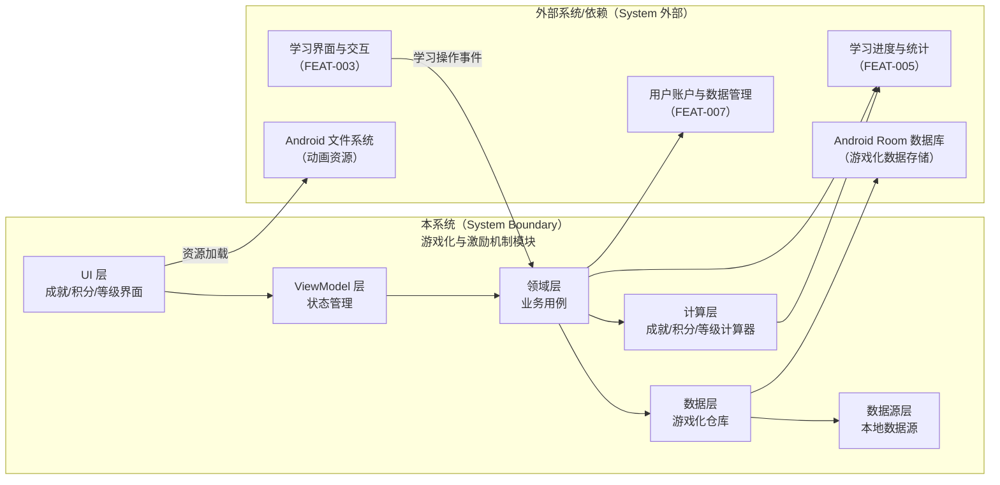
```mermaid
flowchart LR
  subgraph System["本系统（System Boundary）<br/>游戏化与激励机制模块"]
    UI[UI 层<br/>成就/积分/等级界面]
    ViewModel[ViewModel 层<br/>状态管理]
    UseCase[领域层<br/>业务用例]
    Repository[数据层<br/>游戏化仓库]
    Calculator[计算层<br/>成就/积分/等级计算器]
    DataSource[数据源层<br/>本地数据源]
  end
  subgraph External["外部系统/依赖（System 外部）"]
    LearningStats["学习进度与统计<br/>（FEAT-005）"]
    UserData["用户账户与数据管理<br/>（FEAT-007）"]
    LearningUI["学习界面与交互<br/>（FEAT-003）"]
    RoomDB["Android Room 数据库<br/>（游戏化数据存储）"]
    FileSystem["Android 文件系统<br/>（动画资源）"]
  end
  UI --> ViewModel
  ViewModel --> UseCase
  UseCase --> Repository
  UseCase --> Calculator
  Repository --> DataSource
  Calculator --> LearningStats
  Repository --> RoomDB
  UseCase --> LearningStats
  UseCase --> UserData
  LearningUI -->|学习操作事件| UseCase
  UI -->|资源加载| FileSystem
```

#### A2.3 部署视图（必须）

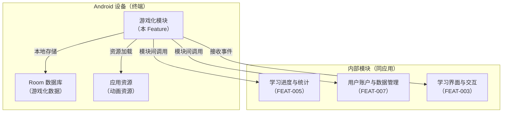
```mermaid
flowchart TB
  subgraph Device["Android 设备（终端）"]
    App["游戏化模块<br/>（本 Feature）"]
    RoomDB["Room 数据库<br/>（游戏化数据）"]
    Assets["应用资源<br/>（动画资源）"]
  end
  subgraph Internal["内部模块（同应用）"]
    LearningStats["学习进度与统计<br/>（FEAT-005）"]
    UserData["用户账户与数据管理<br/>（FEAT-007）"]
    LearningUI["学习界面与交互<br/>（FEAT-003）"]
  end
  App -->|本地存储| RoomDB
  App -->|资源加载| Assets
  App -->|模块间调用| LearningStats
  App -->|模块间调用| UserData
  App -->|接收事件| LearningUI
```

#### A2.4 通信与交互说明（必须）

- **协议**：模块间函数调用（Kotlin suspend 函数/Flow）、本地数据库（Room/SQLite）、应用资源（Asset）
- **鉴权**：无需鉴权（本地操作、模块内调用）
- **超时与重试**：成就检查超时 100ms，超时后记录日志，下次学习时重新检查；积分计算超时 50ms，超时后记录日志，基于学习数据重新计算；数据库操作超时 5 秒，超时后提示用户，允许重试
- **幂等**：学习操作事件：基于学习数据 ID+时间戳去重，防止重复触发积分计算和成就检查
- **限流**：无外部限流（本地操作）；内部限流：并发成就检查队列化，一次只处理一个用户的成就检查；积分计算使用事务保证原子性
- **数据一致性**：强一致（本地数据库），游戏化数据（成就、积分、等级）与学习数据使用事务保证一致性，数据不一致时以学习数据为准重新计算

### A3. 1 层架构设计（系统内部框架图 + 模块拆分 + 接口协议）

#### A3.1 1 层框架图（必须）

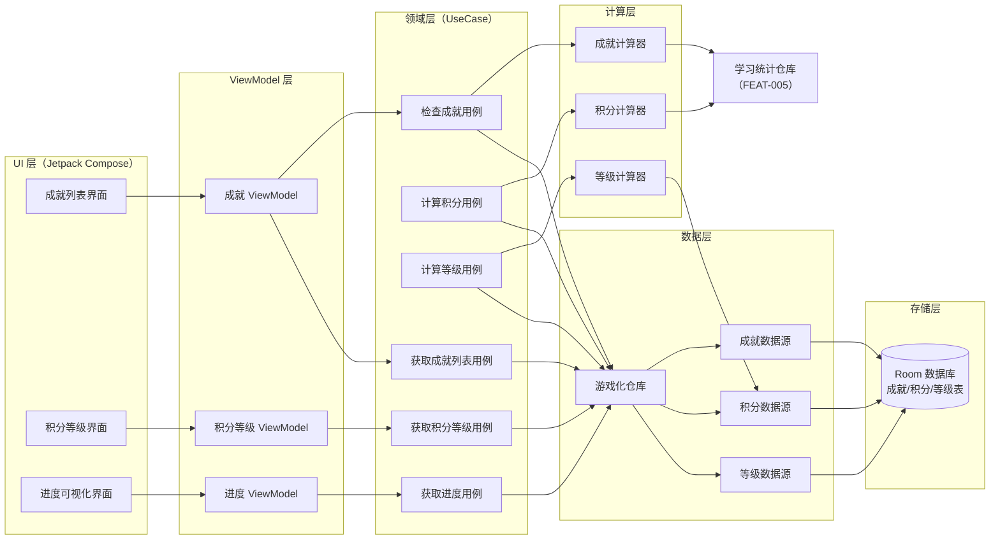
```mermaid
flowchart LR
  subgraph UI["UI 层（Jetpack Compose）"]
    AchievementScreen[成就列表界面]
    PointsLevelScreen[积分等级界面]
    ProgressScreen[进度可视化界面]
  end
  subgraph ViewModel["ViewModel 层"]
    AchievementViewModel[成就 ViewModel]
    PointsLevelViewModel[积分等级 ViewModel]
    ProgressViewModel[进度 ViewModel]
  end
  subgraph Domain["领域层（UseCase）"]
    CheckAchievementUseCase[检查成就用例]
    CalculatePointsUseCase[计算积分用例]
    CalculateLevelUseCase[计算等级用例]
    GetAchievementsUseCase[获取成就列表用例]
    GetPointsLevelUseCase[获取积分等级用例]
    GetProgressUseCase[获取进度用例]
  end
  subgraph Calculator["计算层"]
    AchievementCalculator[成就计算器]
    PointsCalculator[积分计算器]
    LevelCalculator[等级计算器]
  end
  subgraph Data["数据层"]
    GamificationRepository[游戏化仓库]
    AchievementLocalDataSource[成就数据源]
    PointsLocalDataSource[积分数据源]
    LevelLocalDataSource[等级数据源]
  end
  subgraph Storage["存储层"]
    RoomDB[(Room 数据库<br/>成就/积分/等级表)]
  end
  AchievementScreen --> AchievementViewModel
  PointsLevelScreen --> PointsLevelViewModel
  ProgressScreen --> ProgressViewModel
  AchievementViewModel --> CheckAchievementUseCase
  AchievementViewModel --> GetAchievementsUseCase
  PointsLevelViewModel --> GetPointsLevelUseCase
  ProgressViewModel --> GetProgressUseCase
  CheckAchievementUseCase --> AchievementCalculator
  CheckAchievementUseCase --> GamificationRepository
  CalculatePointsUseCase --> PointsCalculator
  CalculatePointsUseCase --> GamificationRepository
  CalculateLevelUseCase --> LevelCalculator
  CalculateLevelUseCase --> GamificationRepository
  GetAchievementsUseCase --> GamificationRepository
  GetPointsLevelUseCase --> GamificationRepository
  GetProgressUseCase --> GamificationRepository
  AchievementCalculator --> LearningStatsRepo[学习统计仓库<br/>（FEAT-005）]
  PointsCalculator --> LearningStatsRepo
  LevelCalculator --> PointsLocalDataSource
  GamificationRepository --> AchievementLocalDataSource
  GamificationRepository --> PointsLocalDataSource
  GamificationRepository --> LevelLocalDataSource
  AchievementLocalDataSource --> RoomDB
  PointsLocalDataSource --> RoomDB
  LevelLocalDataSource --> RoomDB
```

#### A3.2 模块拆分与职责（必须）

> **重要（模块级 UML 规范）**：
> - 本表是本 Feature 的**模块清单（Module Catalog）**，用于驱动后续"模块级详细设计"章节。
> - `A3.4 关键模块设计` 必须 **1:1 覆盖**本表的每个模块（模块名称必须一致；不得遗漏/不得新增幽灵模块）。
> - 对每个模块，必须产出：**1 张 UML 类图（静态） + 2 张 UML 时序图（动态：成功/异常分开）**，并补齐关键异常清单与对策，确保开发可按图落码。

| 模块 | 职责 | 输入/输出 | 依赖 | 约束 |
|---|---|---|---|---|
| UI 层（Jetpack Compose） | 成就列表展示、积分等级展示、进度可视化、动画播放 | 输入：用户操作事件<br>输出：UI 状态展示、动画效果 | ViewModel | 仅负责 UI 展示和动画，不包含业务逻辑 |
| ViewModel 层 | 管理 UI 状态、处理用户事件、调用 UseCase、管理动画状态 | 输入：用户事件、UseCase 结果<br>输出：UI 状态（State）、动画触发器 | Domain 层（UseCase） | 不直接访问数据层，动画状态管理 |
| Domain 层（UseCase） | 业务逻辑封装、流程编排、成就检查、积分计算、等级计算 | 输入：业务请求（学习事件、查询请求）<br>输出：业务结果（成就列表、积分等级、进度） | Calculator 层、Data 层（Repository） | 不依赖 UI 层，可测试性，异步执行 |
| Calculator 层 | 成就条件检查、积分计算逻辑、等级计算逻辑 | 输入：学习数据、当前游戏化数据<br>输出：计算结果（成就解锁、积分增量、等级） | LearningStatsRepo（FEAT-005） | 纯计算逻辑，无副作用，可测试性 |
| Repository 层 | 数据访问抽象、多数据源协调、事务管理 | 输入：数据请求<br>输出：数据实体 | DataSource | 统一数据访问接口，事务保证一致性 |
| DataSource 层 | 底层数据访问、Room 数据库操作 | 输入：数据操作（增删改查）<br>输出：原始数据 | Storage（RoomDB） | 仅负责数据读写，无业务逻辑 |

#### A3.3 模块协作与通信方式（必须）

- **调用关系**：
  - UI → ViewModel → UseCase → Calculator/Repository → DataSource → Storage
  - UI → ViewModel（用户事件、状态观察、动画触发器）
  - ViewModel → UseCase（业务调用，suspend 函数）
  - UseCase → Calculator（计算请求）
  - UseCase → Repository（数据请求）
  - Repository → DataSource（数据访问）
  - Calculator → LearningStatsRepo（学习数据查询）
- **通信方式**：
  - 函数调用：Kotlin 函数调用，使用协程处理异步操作
  - 状态管理：ViewModel 使用 StateFlow/Flow 暴露状态，UI 使用 collectAsState 观察
  - 事件驱动：学习操作事件通过 UseCase 触发成就检查和积分计算
  - 错误处理：使用 Result/Sealed Class 封装成功/失败状态
- **接口协议**：
  - 数据结构：使用 Kotlin data class 定义实体（Achievement, Points, Level, Progress）
  - 错误码：使用 Sealed Class 定义错误类型（AchievementError, PointsError, LevelError）
  - 版本策略：数据结构向后兼容，新增字段使用默认值
  - 幂等约束：学习事件基于学习数据 ID+时间戳去重

#### A3.4 关键模块设计（详细设计 + 取舍，必须）

##### 模块：UI 层（Jetpack Compose）

- **模块定位**：负责游戏化功能的 UI 展示和动画播放，包括成就列表、积分等级展示、进度可视化界面
- **设计目标**：流畅的用户体验（60fps）、响应式状态管理、动画播放流畅无卡顿
- **核心数据结构/状态**：
  - UI State：AchievementListState, PointsLevelState, ProgressState
  - 动画状态：AnimationTrigger, AnimationState
- **对外接口（协议）**：
  - 输入：ViewModel State（StateFlow）
  - 输出：用户操作事件（点击、滑动等）
- **策略与算法**：
  - 状态收集：使用 collectAsState 观察 ViewModel 状态
  - 动画播放：使用 Jetpack Compose Animation API（animateAsState, AnimatedVisibility 等）
  - 列表优化：使用 LazyColumn 虚拟化长列表
- **失败与降级**：
  - 动画资源加载失败：降级为静态图标显示
  - 状态加载失败：显示加载错误提示，允许用户重试
- **安全与隐私**：无敏感数据处理
- **可观测性**：记录页面访问事件、动画播放事件（埋点）
- **优缺点**：
  - **优点**：声明式 UI，状态管理清晰，动画性能好，符合 EPIC 技术约束
  - **缺点/代价**：学习曲线较高，但符合项目技术栈
  - **替代方案与否决理由**：XML Layout 不符合 EPIC 约束，否决

###### UML 类图（静态，必须）

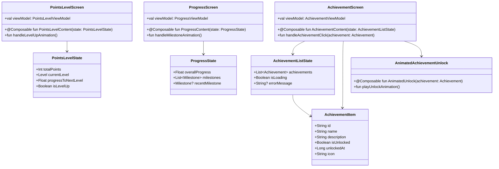
```mermaid
classDiagram
  class AchievementScreen {
    +val viewModel: AchievementViewModel
    +@Composable fun AchievementContent(state: AchievementListState)
    +fun handleAchievementClick(achievement: Achievement)
  }
  class PointsLevelScreen {
    +val viewModel: PointsLevelViewModel
    +@Composable fun PointsLevelContent(state: PointsLevelState)
    +fun handleLevelUpAnimation()
  }
  class ProgressScreen {
    +val viewModel: ProgressViewModel
    +@Composable fun ProgressContent(state: ProgressState)
    +fun handleMilestoneAnimation()
  }
  class AchievementListState {
    +List~Achievement~ achievements
    +Boolean isLoading
    +String? errorMessage
  }
  class PointsLevelState {
    +Int totalPoints
    +Level currentLevel
    +Float progressToNextLevel
    +Boolean isLevelUp
  }
  class ProgressState {
    +Float overallProgress
    +List~Milestone~ milestones
    +Milestone? recentMilestone
  }
  class AchievementItem {
    +String id
    +String name
    +String description
    +Boolean isUnlocked
    +Long unlockedAt
    +String icon
  }
  class AnimatedAchievementUnlock {
    +@Composable fun AnimatedUnlock(achievement: Achievement)
    +fun playUnlockAnimation()
  }
  
  AchievementScreen --> AchievementListState
  AchievementScreen --> AchievementItem
  AchievementScreen --> AnimatedAchievementUnlock
  PointsLevelScreen --> PointsLevelState
  ProgressScreen --> ProgressState
  AchievementListState --> AchievementItem
```

###### UML 时序图 - 成功链路（动态，必须）

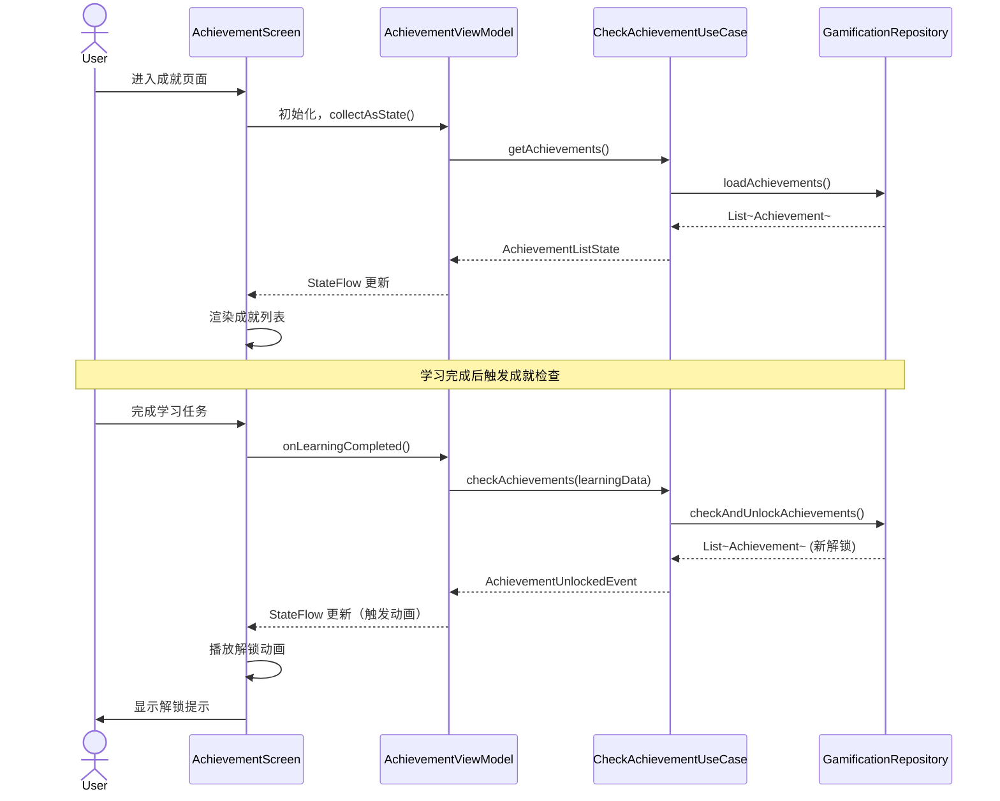
```mermaid
sequenceDiagram
  actor User
  participant UI as AchievementScreen
  participant VM as AchievementViewModel
  participant UC as CheckAchievementUseCase
  participant Repo as GamificationRepository
  
  User->>UI: 进入成就页面
  UI->>VM: 初始化，collectAsState()
  VM->>UC: getAchievements()
  UC->>Repo: loadAchievements()
  Repo-->>UC: List~Achievement~
  UC-->>VM: AchievementListState
  VM-->>UI: StateFlow 更新
  UI->>UI: 渲染成就列表
  
  Note over User,Repo: 学习完成后触发成就检查
  User->>UI: 完成学习任务
  UI->>VM: onLearningCompleted()
  VM->>UC: checkAchievements(learningData)
  UC->>Repo: checkAndUnlockAchievements()
  Repo-->>UC: List~Achievement~ (新解锁)
  UC-->>VM: AchievementUnlockedEvent
  VM-->>UI: StateFlow 更新（触发动画）
  UI->>UI: 播放解锁动画
  UI->>User: 显示解锁提示
```

###### UML 时序图 - 异常链路（动态，必须）

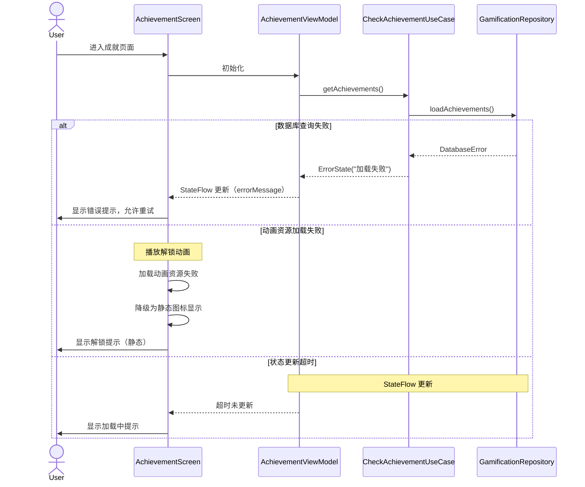
```mermaid
sequenceDiagram
  actor User
  participant UI as AchievementScreen
  participant VM as AchievementViewModel
  participant UC as CheckAchievementUseCase
  participant Repo as GamificationRepository
  
  User->>UI: 进入成就页面
  UI->>VM: 初始化
  VM->>UC: getAchievements()
  UC->>Repo: loadAchievements()
  
  alt 数据库查询失败
    Repo-->>UC: DatabaseError
    UC-->>VM: ErrorState("加载失败")
    VM-->>UI: StateFlow 更新（errorMessage）
    UI->>User: 显示错误提示，允许重试
  else 动画资源加载失败
    Note over UI: 播放解锁动画
    UI->>UI: 加载动画资源失败
    UI->>UI: 降级为静态图标显示
    UI->>User: 显示解锁提示（静态）
  else 状态更新超时
    Note over VM,Repo: StateFlow 更新
    VM-->>UI: 超时未更新
    UI->>User: 显示加载中提示
  end
```

###### 关键异常清单（必须，且与异常时序图互校）

| 异常ID | 触发点（步骤/组件） | 触发条件 | 错误类型/错误码 | 可重试 | 对策（降级/回滚/一致性） | 用户提示 | 日志/埋点字段 | 关联 NFR |
|---|---|---|---|---|---|---|---|---|
| EX-UI-001 | 数据库查询 | 数据库连接失败、查询超时 | DatabaseError | 是 | 记录错误日志，显示错误提示，允许用户重试 | "加载失败，请重试" | error_type, error_message, retry_count | NFR-OBS-002 |
| EX-UI-002 | 动画资源加载 | 动画资源文件丢失、资源解析失败 | ResourceError | 否 | 降级为静态图标显示，记录错误日志 | 无（静默降级） | error_type, resource_path | NFR-PERF-001 |
| EX-UI-003 | 状态更新 | ViewModel 状态更新超时（> 500ms） | TimeoutError | 是 | 显示加载中状态，记录超时日志 | "加载中..." | timeout_duration, operation | NFR-PERF-002 |

##### 模块：ViewModel 层

- **模块定位**：管理游戏化功能的 UI 状态，处理用户事件，调用 UseCase，管理动画触发器
- **设计目标**：响应式状态管理、事件处理、动画触发器管理
- **核心数据结构/状态**：
  - UI State：StateFlow 包装的 UI 状态
  - 动画触发器：MutableStateFlow 管理的动画触发事件
- **对外接口（协议）**：
  - 输入：用户事件（用户操作）
  - 输出：UI State（StateFlow）、动画触发器（StateFlow）
- **策略与算法**：
  - 状态管理：使用 StateFlow 暴露状态，支持 UI 观察
  - 事件处理：将用户事件转换为 UseCase 调用
  - 错误处理：将 UseCase 错误转换为 UI 错误状态
- **失败与降级**：
  - UseCase 调用失败：转换为错误状态，允许用户重试
  - 状态更新失败：记录日志，保持当前状态
- **安全与隐私**：无敏感数据处理
- **可观测性**：记录用户事件（埋点）
- **优缺点**：
  - **优点**：状态管理清晰，生命周期感知，支持协程
  - **缺点/代价**：需要管理多个 StateFlow，但符合 Android 最佳实践
  - **替代方案与否决理由**：LiveData 已过时，StateFlow 是推荐方案

###### UML 类图（静态，必须）

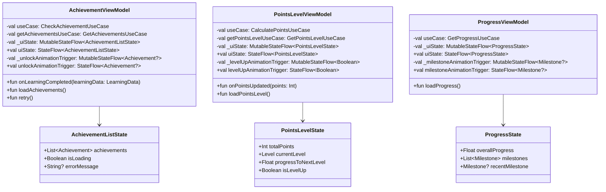
```mermaid
classDiagram
  class AchievementViewModel {
    -val useCase: CheckAchievementUseCase
    -val getAchievementsUseCase: GetAchievementsUseCase
    -val _uiState: MutableStateFlow~AchievementListState~
    +val uiState: StateFlow~AchievementListState~
    -val _unlockAnimationTrigger: MutableStateFlow~Achievement?~
    +val unlockAnimationTrigger: StateFlow~Achievement?~
    +fun onLearningCompleted(learningData: LearningData)
    +fun loadAchievements()
    +fun retry()
  }
  class PointsLevelViewModel {
    -val useCase: CalculatePointsUseCase
    -val getPointsLevelUseCase: GetPointsLevelUseCase
    -val _uiState: MutableStateFlow~PointsLevelState~
    +val uiState: StateFlow~PointsLevelState~
    -val _levelUpAnimationTrigger: MutableStateFlow~Boolean~
    +val levelUpAnimationTrigger: StateFlow~Boolean~
    +fun onPointsUpdated(points: Int)
    +fun loadPointsLevel()
  }
  class ProgressViewModel {
    -val useCase: GetProgressUseCase
    -val _uiState: MutableStateFlow~ProgressState~
    +val uiState: StateFlow~ProgressState~
    -val _milestoneAnimationTrigger: MutableStateFlow~Milestone?~
    +val milestoneAnimationTrigger: StateFlow~Milestone?~
    +fun loadProgress()
  }
  class AchievementListState {
    +List~Achievement~ achievements
    +Boolean isLoading
    +String? errorMessage
  }
  class PointsLevelState {
    +Int totalPoints
    +Level currentLevel
    +Float progressToNextLevel
    +Boolean isLevelUp
  }
  class ProgressState {
    +Float overallProgress
    +List~Milestone~ milestones
    +Milestone? recentMilestone
  }
  
  AchievementViewModel --> AchievementListState
  PointsLevelViewModel --> PointsLevelState
  ProgressViewModel --> ProgressState
```

###### UML 时序图 - 成功链路（动态，必须）

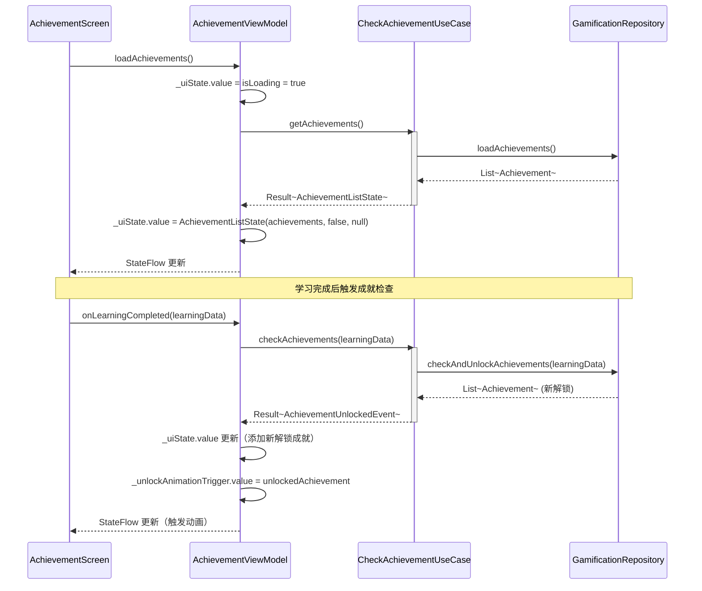
```mermaid
sequenceDiagram
  participant UI as AchievementScreen
  participant VM as AchievementViewModel
  participant UC as CheckAchievementUseCase
  participant Repo as GamificationRepository
  
  UI->>VM: loadAchievements()
  VM->>VM: _uiState.value = isLoading = true
  VM->>UC: getAchievements()
  activate UC
  UC->>Repo: loadAchievements()
  Repo-->>UC: List~Achievement~
  UC-->>VM: Result~AchievementListState~
  deactivate UC
  VM->>VM: _uiState.value = AchievementListState(achievements, false, null)
  VM-->>UI: StateFlow 更新
  
  Note over UI,Repo: 学习完成后触发成就检查
  UI->>VM: onLearningCompleted(learningData)
  VM->>UC: checkAchievements(learningData)
  activate UC
  UC->>Repo: checkAndUnlockAchievements(learningData)
  Repo-->>UC: List~Achievement~ (新解锁)
  UC-->>VM: Result~AchievementUnlockedEvent~
  deactivate UC
  VM->>VM: _uiState.value 更新（添加新解锁成就）
  VM->>VM: _unlockAnimationTrigger.value = unlockedAchievement
  VM-->>UI: StateFlow 更新（触发动画）
```

###### UML 时序图 - 异常链路（动态，必须）

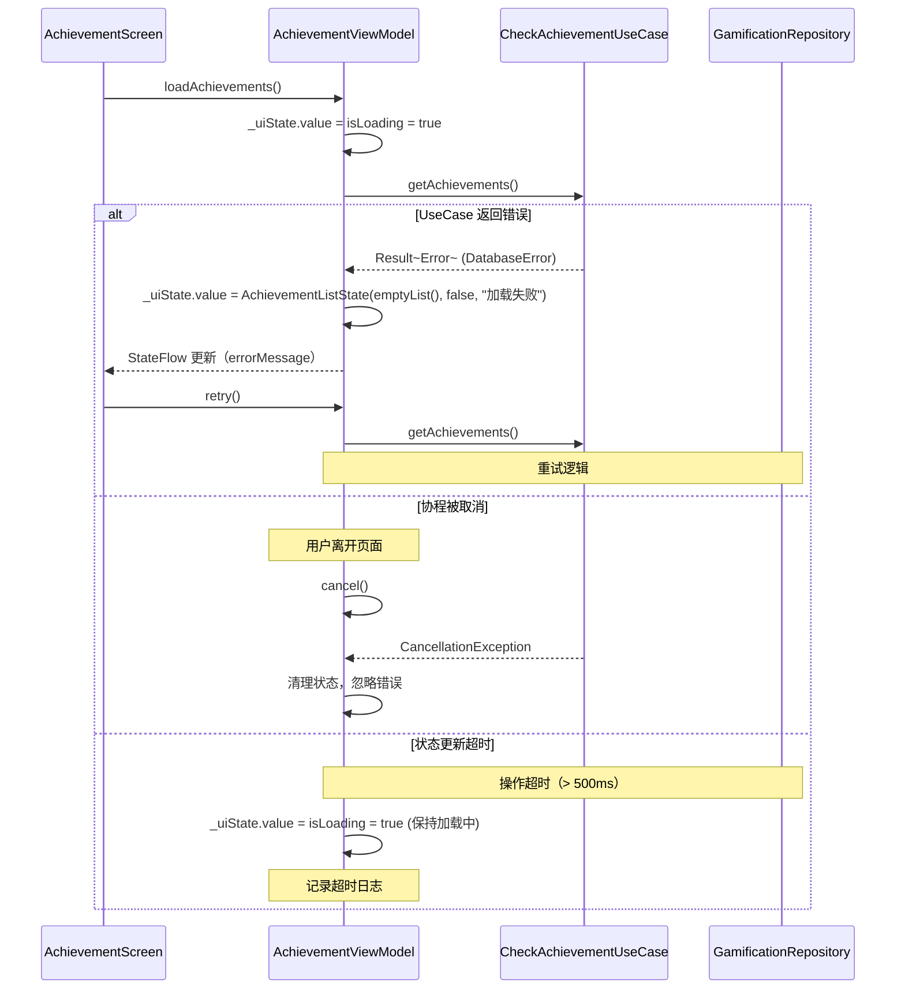
```mermaid
sequenceDiagram
  participant UI as AchievementScreen
  participant VM as AchievementViewModel
  participant UC as CheckAchievementUseCase
  participant Repo as GamificationRepository
  
  UI->>VM: loadAchievements()
  VM->>VM: _uiState.value = isLoading = true
  VM->>UC: getAchievements()
  
  alt UseCase 返回错误
    UC-->>VM: Result~Error~ (DatabaseError)
    VM->>VM: _uiState.value = AchievementListState(emptyList(), false, "加载失败")
    VM-->>UI: StateFlow 更新（errorMessage）
    UI->>VM: retry()
    VM->>UC: getAchievements()
    Note over VM,Repo: 重试逻辑
  else 协程被取消
    Note over VM: 用户离开页面
    VM->>VM: cancel()
    UC-->>VM: CancellationException
    VM->>VM: 清理状态，忽略错误
  else 状态更新超时
    Note over VM,Repo: 操作超时（> 500ms）
    VM->>VM: _uiState.value = isLoading = true (保持加载中)
    Note over VM: 记录超时日志
  end
```

###### 关键异常清单（必须，且与异常时序图互校）

| 异常ID | 触发点（步骤/组件） | 触发条件 | 错误类型/错误码 | 可重试 | 对策（降级/回滚/一致性） | 用户提示 | 日志/埋点字段 | 关联 NFR |
|---|---|---|---|---|---|---|---|---|
| EX-VM-001 | UseCase 调用 | UseCase 返回错误（数据库错误、计算错误） | UseCaseError | 是 | 转换为 UI 错误状态，记录错误日志，允许用户重试 | "操作失败，请重试" | error_type, error_message, usecase_name | NFR-OBS-002 |
| EX-VM-002 | 协程取消 | 用户离开页面，协程被取消 | CancellationException | 否 | 清理状态，忽略取消异常，不显示错误提示 | 无 | cancellation_reason, page_name | NFR-PERF-003 |
| EX-VM-003 | 状态更新超时 | UseCase 调用超时（> 500ms） | TimeoutError | 是 | 保持加载中状态，记录超时日志，允许用户取消 | "加载中..." | timeout_duration, operation | NFR-PERF-002 |

##### 模块：Domain 层（UseCase）

- **模块定位**：封装业务逻辑，编排成就检查、积分计算、等级计算流程
- **设计目标**：业务逻辑封装、可测试性、异步执行、错误处理
- **核心数据结构/状态**：
  - 业务请求：CheckAchievementRequest, CalculatePointsRequest, CalculateLevelRequest
  - 业务结果：AchievementListResult, PointsResult, LevelResult
- **对外接口（协议）**：
  - 输入：业务请求（学习数据、查询参数）
  - 输出：业务结果（Result 封装成功/失败）
- **策略与算法**：
  - 异步执行：使用 suspend 函数，在 IO 线程执行
  - 错误处理：使用 Result 封装成功/失败状态
  - 事务管理：积分计算和成就解锁使用事务保证一致性
- **失败与降级**：
  - 计算失败：记录错误日志，返回错误结果，允许重试
  - 数据不一致：基于学习数据重新计算游戏化数据
- **安全与隐私**：无敏感数据处理
- **可观测性**：记录业务操作事件（成就解锁、积分变化、等级提升）
- **优缺点**：
  - **优点**：业务逻辑集中，可测试性强，异步执行不阻塞 UI
  - **缺点/代价**：需要管理多个 UseCase，但符合 Clean Architecture
  - **替代方案与否决理由**：直接在 ViewModel 中实现业务逻辑违反分层原则，否决

###### UML 类图（静态，必须）


```mermaid
classDiagram
  class CheckAchievementUseCase {
    -val repository: GamificationRepository
    -val calculator: AchievementCalculator
    -val learningStatsRepo: LearningStatsRepository
    +suspend fun execute(learningData: LearningData): Result~List~Achievement~~
    +suspend fun checkAchievements(learningData: LearningData): Result~List~Achievement~~
  }
  class CalculatePointsUseCase {
    -val repository: GamificationRepository
    -val calculator: PointsCalculator
    -val learningStatsRepo: LearningStatsRepository
    +suspend fun execute(learningData: LearningData): Result~PointsResult~
    +suspend fun calculateAndSavePoints(learningData: LearningData): Result~Int~
  }
  class CalculateLevelUseCase {
    -val repository: GamificationRepository
    -val calculator: LevelCalculator
    +suspend fun execute(points: Int): Result~Level~
    +suspend fun calculateLevel(points: Int): Result~Level~
  }
  class GetAchievementsUseCase {
    -val repository: GamificationRepository
    +suspend fun execute(): Result~List~Achievement~~
  }
  class GetPointsLevelUseCase {
    -val repository: GamificationRepository
    +suspend fun execute(): Result~PointsLevelResult~
  }
  class GetProgressUseCase {
    -val repository: GamificationRepository
    -val learningStatsRepo: LearningStatsRepository
    +suspend fun execute(): Result~ProgressResult~
  }
  class AchievementResult {
    +List~Achievement~ achievements
    +List~Achievement~ newlyUnlocked
  }
  class PointsResult {
    +Int totalPoints
    +Int increment
    +String reason
  }
  class LevelResult {
    +Level currentLevel
    +Level? previousLevel
    +Boolean isLevelUp
  }
  
  CheckAchievementUseCase --> AchievementResult
  CalculatePointsUseCase --> PointsResult
  CalculateLevelUseCase --> LevelResult
```

###### UML 时序图 - 成功链路（动态，必须）

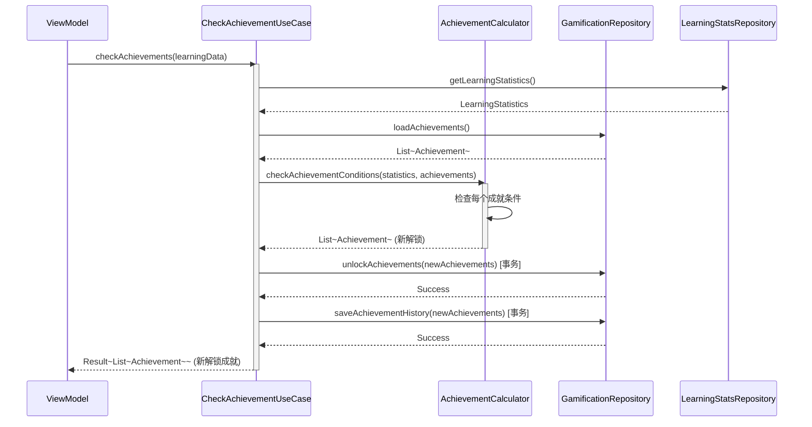
```mermaid
sequenceDiagram
  participant VM as ViewModel
  participant UC as CheckAchievementUseCase
  participant Calc as AchievementCalculator
  participant Repo as GamificationRepository
  participant StatsRepo as LearningStatsRepository
  
  VM->>UC: checkAchievements(learningData)
  activate UC
  UC->>StatsRepo: getLearningStatistics()
  StatsRepo-->>UC: LearningStatistics
  
  UC->>Repo: loadAchievements()
  Repo-->>UC: List~Achievement~
  
  UC->>Calc: checkAchievementConditions(statistics, achievements)
  activate Calc
  Calc->>Calc: 检查每个成就条件
  Calc-->>UC: List~Achievement~ (新解锁)
  deactivate Calc
  
  UC->>Repo: unlockAchievements(newAchievements) [事务]
  Repo-->>UC: Success
  
  UC->>Repo: saveAchievementHistory(newAchievements) [事务]
  Repo-->>UC: Success
  
  UC-->>VM: Result~List~Achievement~~ (新解锁成就)
  deactivate UC
```

###### UML 时序图 - 异常链路（动态，必须）

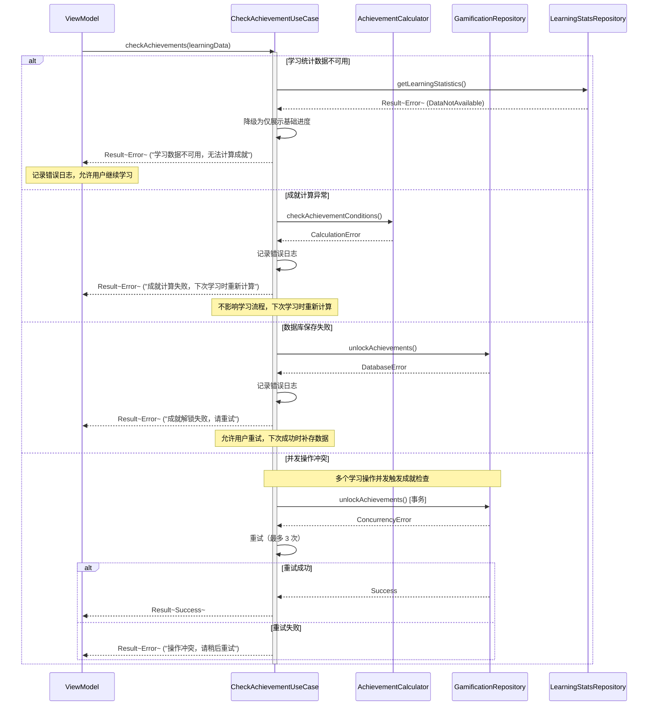
```mermaid
sequenceDiagram
  participant VM as ViewModel
  participant UC as CheckAchievementUseCase
  participant Calc as AchievementCalculator
  participant Repo as GamificationRepository
  participant StatsRepo as LearningStatsRepository
  
  VM->>UC: checkAchievements(learningData)
  activate UC
  
  alt 学习统计数据不可用
    UC->>StatsRepo: getLearningStatistics()
    StatsRepo-->>UC: Result~Error~ (DataNotAvailable)
    UC->>UC: 降级为仅展示基础进度
    UC-->>VM: Result~Error~ ("学习数据不可用，无法计算成就")
    Note over VM: 记录错误日志，允许用户继续学习
  else 成就计算异常
    UC->>Calc: checkAchievementConditions()
    Calc-->>UC: CalculationError
    UC->>UC: 记录错误日志
    UC-->>VM: Result~Error~ ("成就计算失败，下次学习时重新计算")
    Note over UC: 不影响学习流程，下次学习时重新计算
  else 数据库保存失败
    UC->>Repo: unlockAchievements()
    Repo-->>UC: DatabaseError
    UC->>UC: 记录错误日志
    UC-->>VM: Result~Error~ ("成就解锁失败，请重试")
    Note over UC: 允许用户重试，下次成功时补存数据
  else 并发操作冲突
    Note over UC,Repo: 多个学习操作并发触发成就检查
    UC->>Repo: unlockAchievements() [事务]
    Repo-->>UC: ConcurrencyError
    UC->>UC: 重试（最多 3 次）
    alt 重试成功
      Repo-->>UC: Success
      UC-->>VM: Result~Success~
    else 重试失败
      UC-->>VM: Result~Error~ ("操作冲突，请稍后重试")
    end
  end
  deactivate UC
```

###### 关键异常清单（必须，且与异常时序图互校）

| 异常ID | 触发点（步骤/组件） | 触发条件 | 错误类型/错误码 | 可重试 | 对策（降级/回滚/一致性） | 用户提示 | 日志/埋点字段 | 关联 NFR |
|---|---|---|---|---|---|---|---|---|
| EX-UC-001 | 学习数据查询 | 学习统计数据不可用、查询超时 | DataNotAvailable | 是 | 降级为仅展示基础进度，记录错误日志，下次学习时重新计算 | "学习数据不可用" | error_type, data_source | NFR-PERF-003 |
| EX-UC-002 | 成就计算 | 成就计算逻辑异常、计算超时（> 100ms） | CalculationError | 是 | 记录错误日志，不影响学习流程，下次学习时重新计算 | 无（静默处理） | error_type, calculation_type, error_detail | NFR-OBS-002 |
| EX-UC-003 | 数据库保存 | 数据库连接失败、保存失败 | DatabaseError | 是 | 记录错误日志，允许用户重试，下次成功时补存数据 | "保存失败，请重试" | error_type, operation, retry_count | NFR-REL-002 |
| EX-UC-004 | 并发操作 | 多个学习操作并发触发成就检查、事务冲突 | ConcurrencyError | 是 | 使用事务重试（最多 3 次），记录并发冲突日志 | "操作冲突，请稍后重试" | conflict_type, retry_count | NFR-REL-001 |

##### 模块：Calculator 层

- **模块定位**：纯计算逻辑层，负责成就条件检查、积分计算、等级计算，无副作用
- **设计目标**：纯函数、可测试性、高性能（成就检查 ≤ 100ms，积分计算 ≤ 50ms）
- **核心数据结构/状态**：
  - 成就配置：AchievementConfig（成就ID、名称、解锁条件）
  - 积分规则：PointsRule（行为类型、积分值）
  - 等级配置：LevelConfig（等级ID、所需积分）
- **对外接口（协议）**：
  - 输入：学习数据、当前游戏化数据
  - 输出：计算结果（成就解锁列表、积分增量、等级）
- **策略与算法**：
  - 成就检查：遍历成就配置，检查解锁条件（学习天数、单词数量、学习时长等）
  - 积分计算：基于学习行为计算积分（学习单词 +10、完成复习 +5、连续学习 +20 等）
  - 等级计算：基于积分查找等级配置，计算当前等级
- **失败与降级**：
  - 计算异常：抛出异常，由上层 UseCase 处理
  - 配置缺失：返回默认值或空结果
- **安全与隐私**：无敏感数据处理，纯计算逻辑
- **可观测性**：记录计算耗时（性能埋点）
- **优缺点**：
  - **优点**：纯函数易于测试，无副作用，性能好
  - **缺点/代价**：需要维护配置数据，但配置相对固定
  - **替代方案与否决理由**：在 UseCase 中直接计算违反单一职责原则，否决

###### UML 类图（静态，必须）

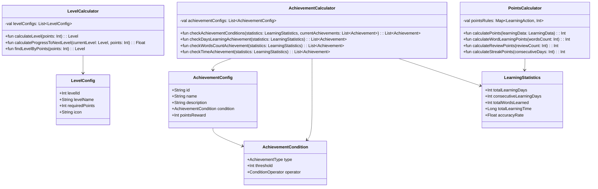
```mermaid
classDiagram
  class AchievementCalculator {
    -val achievementConfigs: List~AchievementConfig~
    +fun checkAchievementConditions(statistics: LearningStatistics, currentAchievements: List~Achievement~): List~Achievement~
    +fun checkDaysLearningAchievement(statistics: LearningStatistics): List~Achievement~
    +fun checkWordsCountAchievement(statistics: LearningStatistics): List~Achievement~
    +fun checkTimeAchievement(statistics: LearningStatistics): List~Achievement~
  }
  class PointsCalculator {
    -val pointsRules: Map~LearningAction, Int~
    +fun calculatePoints(learningData: LearningData): Int
    +fun calculateWordLearningPoints(wordsCount: Int): Int
    +fun calculateReviewPoints(reviewCount: Int): Int
    +fun calculateStreakPoints(consecutiveDays: Int): Int
  }
  class LevelCalculator {
    -val levelConfigs: List~LevelConfig~
    +fun calculateLevel(points: Int): Level
    +fun calculateProgressToNextLevel(currentLevel: Level, points: Int): Float
    +fun findLevelByPoints(points: Int): Level
  }
  class AchievementConfig {
    +String id
    +String name
    +String description
    +AchievementCondition condition
    +Int pointsReward
  }
  class AchievementCondition {
    +AchievementType type
    +Int threshold
    +ConditionOperator operator
  }
  class LevelConfig {
    +Int levelId
    +String levelName
    +Int requiredPoints
    +String icon
  }
  class LearningStatistics {
    +Int totalLearningDays
    +Int consecutiveLearningDays
    +Int totalWordsLearned
    +Long totalLearningTime
    +Float accuracyRate
  }
  
  AchievementCalculator --> AchievementConfig
  AchievementCalculator --> AchievementCondition
  AchievementCalculator --> LearningStatistics
  PointsCalculator --> LearningStatistics
  LevelCalculator --> LevelConfig
  AchievementConfig --> AchievementCondition
```

###### UML 时序图 - 成功链路（动态，必须）

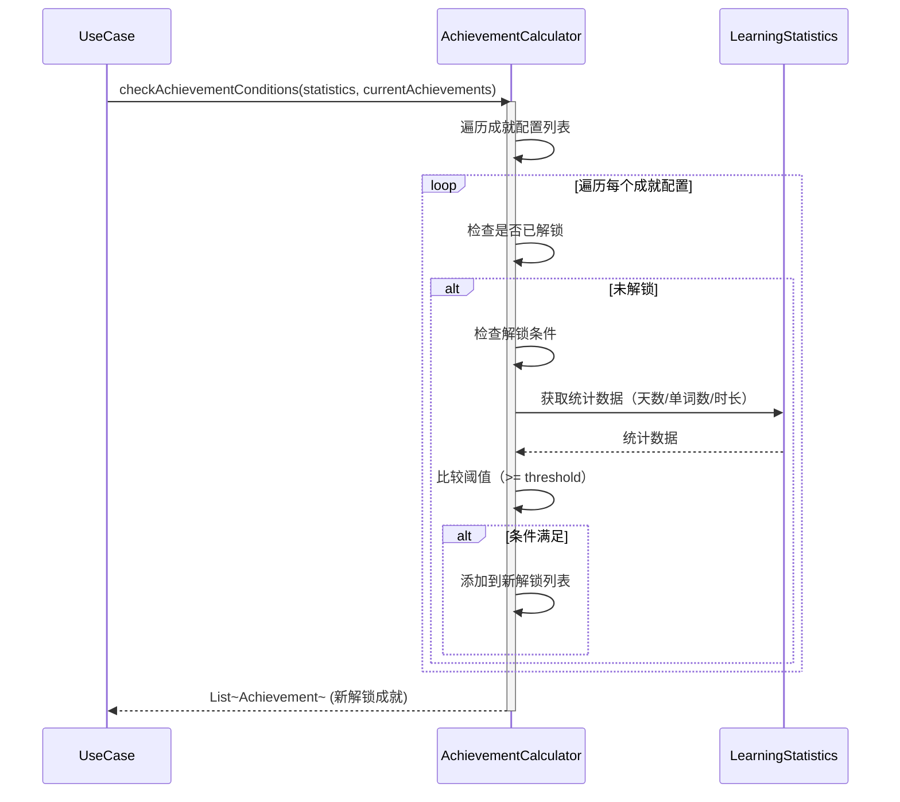
```mermaid
sequenceDiagram
  participant UC as UseCase
  participant Calc as AchievementCalculator
  participant Stats as LearningStatistics
  
  UC->>Calc: checkAchievementConditions(statistics, currentAchievements)
  activate Calc
  Calc->>Calc: 遍历成就配置列表
  
  loop 遍历每个成就配置
    Calc->>Calc: 检查是否已解锁
    alt 未解锁
      Calc->>Calc: 检查解锁条件
      Calc->>Stats: 获取统计数据（天数/单词数/时长）
      Stats-->>Calc: 统计数据
      Calc->>Calc: 比较阈值（>= threshold）
      alt 条件满足
        Calc->>Calc: 添加到新解锁列表
      end
    end
  end
  
  Calc-->>UC: List~Achievement~ (新解锁成就)
  deactivate Calc
```

###### UML 时序图 - 异常链路（动态，必须）

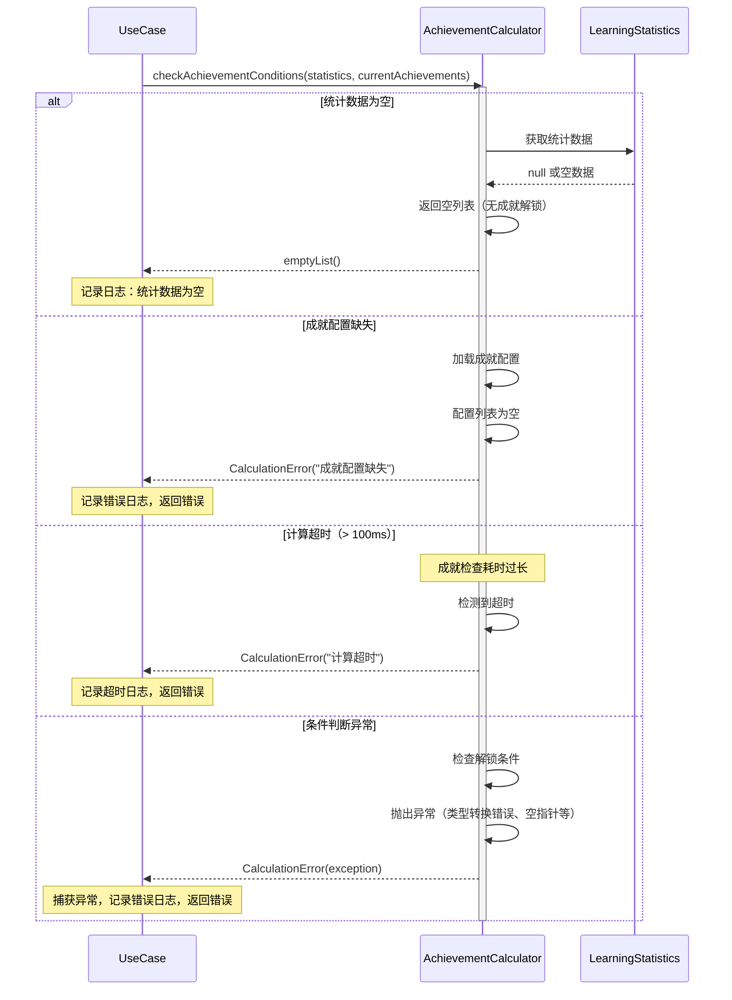
```mermaid
sequenceDiagram
  participant UC as UseCase
  participant Calc as AchievementCalculator
  participant Stats as LearningStatistics
  
  UC->>Calc: checkAchievementConditions(statistics, currentAchievements)
  activate Calc
  
  alt 统计数据为空
    Calc->>Stats: 获取统计数据
    Stats-->>Calc: null 或空数据
    Calc->>Calc: 返回空列表（无成就解锁）
    Calc-->>UC: emptyList()
    Note over UC: 记录日志：统计数据为空
  else 成就配置缺失
    Calc->>Calc: 加载成就配置
    Calc->>Calc: 配置列表为空
    Calc-->>UC: CalculationError("成就配置缺失")
    Note over UC: 记录错误日志，返回错误
  else 计算超时（> 100ms）
    Note over Calc: 成就检查耗时过长
    Calc->>Calc: 检测到超时
    Calc-->>UC: CalculationError("计算超时")
    Note over UC: 记录超时日志，返回错误
  else 条件判断异常
    Calc->>Calc: 检查解锁条件
    Calc->>Calc: 抛出异常（类型转换错误、空指针等）
    Calc-->>UC: CalculationError(exception)
    Note over UC: 捕获异常，记录错误日志，返回错误
  end
  deactivate Calc
```

###### 关键异常清单（必须，且与异常时序图互校）

| 异常ID | 触发点（步骤/组件） | 触发条件 | 错误类型/错误码 | 可重试 | 对策（降级/回滚/一致性） | 用户提示 | 日志/埋点字段 | 关联 NFR |
|---|---|---|---|---|---|---|---|---|
| EX-CALC-001 | 统计数据为空 | 学习统计数据为 null 或空 | DataNotAvailable | 否 | 返回空列表（无成就解锁），记录日志 | 无 | data_type, statistics_fields | NFR-PERF-003 |
| EX-CALC-002 | 成就配置缺失 | 成就配置列表为空或配置损坏 | ConfigurationError | 否 | 返回错误，记录错误日志 | 无（上层处理） | config_type, error_detail | NFR-REL-001 |
| EX-CALC-003 | 计算超时 | 成就检查耗时 > 100ms | TimeoutError | 是 | 返回错误，记录超时日志，允许重试 | 无（上层处理） | timeout_duration, calculation_type | NFR-PERF-001 |
| EX-CALC-004 | 条件判断异常 | 类型转换错误、空指针异常、除零错误等 | CalculationException | 否 | 捕获异常，记录错误日志，返回错误 | 无（上层处理） | exception_type, exception_message, stack_trace | NFR-REL-001 |

##### 模块：Repository 层

- **模块定位**：数据访问抽象层，统一数据访问接口，协调多个数据源，管理事务
- **设计目标**：数据访问抽象、事务管理、数据一致性、缓存策略
- **核心数据结构/状态**：
  - 数据实体：Achievement, Points, Level, PointsHistory
  - 查询参数：AchievementQuery, PointsQuery, LevelQuery
- **对外接口（协议）**：
  - 输入：数据操作请求（增删改查）
  - 输出：数据实体（List/Entity）
- **策略与算法**：
  - 缓存策略：内存缓存成就列表和等级配置，避免频繁查询数据库
  - 事务管理：成就解锁和积分保存使用事务保证原子性
  - 数据一致性：游戏化数据与学习数据使用事务保证一致性
- **失败与降级**：
  - 数据库操作失败：记录错误日志，返回错误结果，允许重试
  - 缓存失效：重新查询数据库，更新缓存
- **安全与隐私**：数据存储在应用私有目录，不上传云端
- **可观测性**：记录数据操作事件（查询、保存、更新）
- **优缺点**：
  - **优点**：数据访问抽象，事务管理，缓存提升性能
  - **缺点/代价**：需要管理缓存一致性，但提升性能值得
  - **替代方案与否决理由**：直接使用 DataSource 违反分层原则，否决

###### UML 类图（静态，必须）

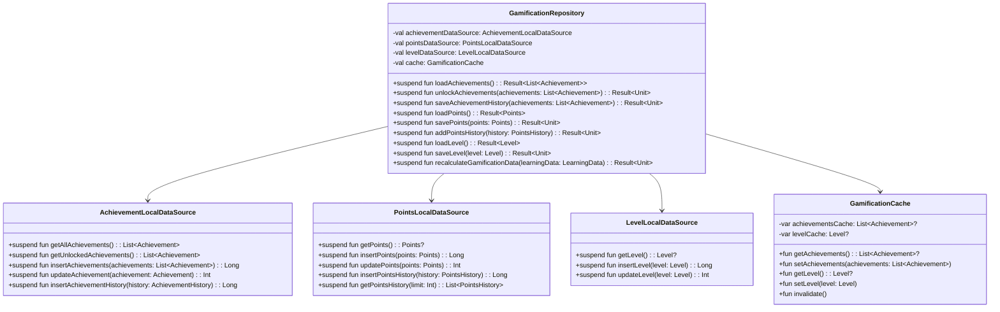
```mermaid
classDiagram
  class GamificationRepository {
    -val achievementDataSource: AchievementLocalDataSource
    -val pointsDataSource: PointsLocalDataSource
    -val levelDataSource: LevelLocalDataSource
    -val cache: GamificationCache
    +suspend fun loadAchievements(): Result~List~Achievement~~
    +suspend fun unlockAchievements(achievements: List~Achievement~): Result~Unit~
    +suspend fun saveAchievementHistory(achievements: List~Achievement~): Result~Unit~
    +suspend fun loadPoints(): Result~Points~
    +suspend fun savePoints(points: Points): Result~Unit~
    +suspend fun addPointsHistory(history: PointsHistory): Result~Unit~
    +suspend fun loadLevel(): Result~Level~
    +suspend fun saveLevel(level: Level): Result~Unit~
    +suspend fun recalculateGamificationData(learningData: LearningData): Result~Unit~
  }
  class AchievementLocalDataSource {
    +suspend fun getAllAchievements(): List~Achievement~
    +suspend fun getUnlockedAchievements(): List~Achievement~
    +suspend fun insertAchievements(achievements: List~Achievement~): Long
    +suspend fun updateAchievement(achievement: Achievement): Int
    +suspend fun insertAchievementHistory(history: AchievementHistory): Long
  }
  class PointsLocalDataSource {
    +suspend fun getPoints(): Points?
    +suspend fun insertPoints(points: Points): Long
    +suspend fun updatePoints(points: Points): Int
    +suspend fun insertPointsHistory(history: PointsHistory): Long
    +suspend fun getPointsHistory(limit: Int): List~PointsHistory~
  }
  class LevelLocalDataSource {
    +suspend fun getLevel(): Level?
    +suspend fun insertLevel(level: Level): Long
    +suspend fun updateLevel(level: Level): Int
  }
  class GamificationCache {
    -var achievementsCache: List~Achievement~?
    -var levelCache: Level?
    +fun getAchievements(): List~Achievement~?
    +fun setAchievements(achievements: List~Achievement~)
    +fun getLevel(): Level?
    +fun setLevel(level: Level)
    +fun invalidate()
  }
  
  GamificationRepository --> AchievementLocalDataSource
  GamificationRepository --> PointsLocalDataSource
  GamificationRepository --> LevelLocalDataSource
  GamificationRepository --> GamificationCache
```

###### UML 时序图 - 成功链路（动态，必须）

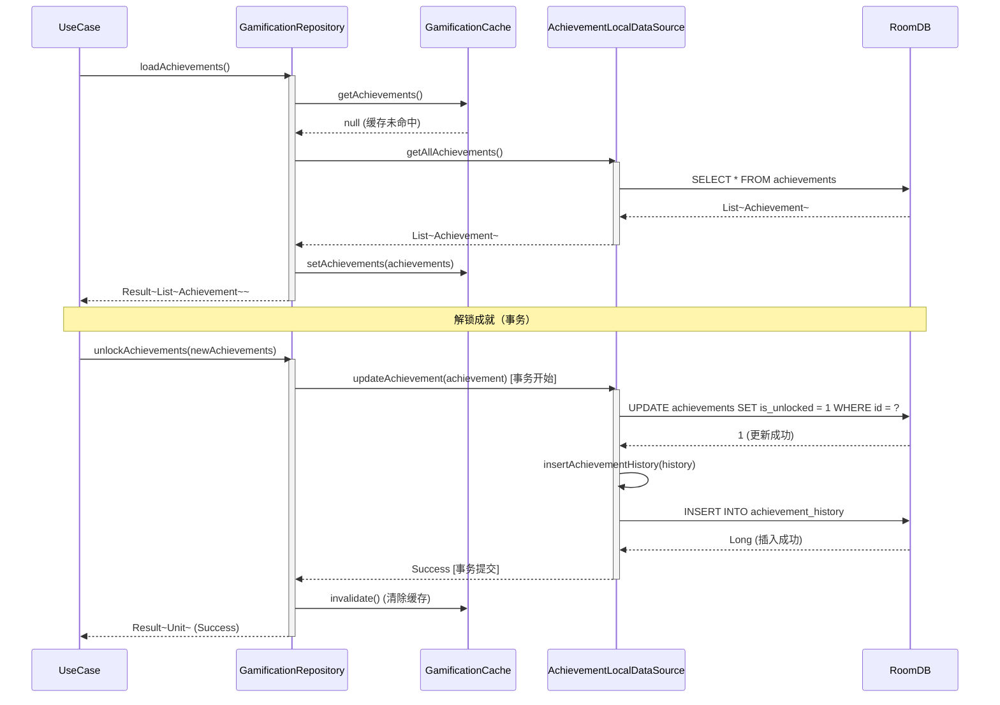
```mermaid
sequenceDiagram
  participant UC as UseCase
  participant Repo as GamificationRepository
  participant Cache as GamificationCache
  participant DS as AchievementLocalDataSource
  participant DB as RoomDB
  
  UC->>Repo: loadAchievements()
  activate Repo
  Repo->>Cache: getAchievements()
  Cache-->>Repo: null (缓存未命中)
  Repo->>DS: getAllAchievements()
  activate DS
  DS->>DB: SELECT * FROM achievements
  DB-->>DS: List~Achievement~
  DS-->>Repo: List~Achievement~
  deactivate DS
  Repo->>Cache: setAchievements(achievements)
  Repo-->>UC: Result~List~Achievement~~
  deactivate Repo
  
  Note over UC,DB: 解锁成就（事务）
  UC->>Repo: unlockAchievements(newAchievements)
  activate Repo
  Repo->>DS: updateAchievement(achievement) [事务开始]
  activate DS
  DS->>DB: UPDATE achievements SET is_unlocked = 1 WHERE id = ?
  DB-->>DS: 1 (更新成功)
  DS->>DS: insertAchievementHistory(history)
  DS->>DB: INSERT INTO achievement_history
  DB-->>DS: Long (插入成功)
  DS-->>Repo: Success [事务提交]
  deactivate DS
  Repo->>Cache: invalidate() (清除缓存)
  Repo-->>UC: Result~Unit~ (Success)
  deactivate Repo
```

###### UML 时序图 - 异常链路（动态，必须）

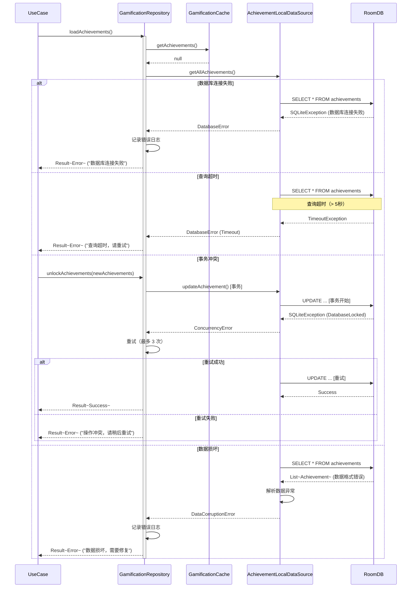
```mermaid
sequenceDiagram
  participant UC as UseCase
  participant Repo as GamificationRepository
  participant Cache as GamificationCache
  participant DS as AchievementLocalDataSource
  participant DB as RoomDB
  
  UC->>Repo: loadAchievements()
  activate Repo
  Repo->>Cache: getAchievements()
  Cache-->>Repo: null
  Repo->>DS: getAllAchievements()
  
  alt 数据库连接失败
    DS->>DB: SELECT * FROM achievements
    DB-->>DS: SQLiteException (数据库连接失败)
    DS-->>Repo: DatabaseError
    Repo->>Repo: 记录错误日志
    Repo-->>UC: Result~Error~ ("数据库连接失败")
  else 查询超时
    DS->>DB: SELECT * FROM achievements
    Note over DS,DB: 查询超时（> 5秒）
    DB-->>DS: TimeoutException
    DS-->>Repo: DatabaseError (Timeout)
    Repo-->>UC: Result~Error~ ("查询超时，请重试")
  else 事务冲突
    UC->>Repo: unlockAchievements(newAchievements)
    Repo->>DS: updateAchievement() [事务]
    DS->>DB: UPDATE ... [事务开始]
    DB-->>DS: SQLiteException (DatabaseLocked)
    DS-->>Repo: ConcurrencyError
    Repo->>Repo: 重试（最多 3 次）
    alt 重试成功
      DS->>DB: UPDATE ... [重试]
      DB-->>DS: Success
      Repo-->>UC: Result~Success~
    else 重试失败
      Repo-->>UC: Result~Error~ ("操作冲突，请稍后重试")
    end
  else 数据损坏
    DS->>DB: SELECT * FROM achievements
    DB-->>DS: List~Achievement~ (数据格式错误)
    DS->>DS: 解析数据异常
    DS-->>Repo: DataCorruptionError
    Repo->>Repo: 记录错误日志
    Repo-->>UC: Result~Error~ ("数据损坏，需要修复")
  end
  deactivate Repo
```

###### 关键异常清单（必须，且与异常时序图互校）

| 异常ID | 触发点（步骤/组件） | 触发条件 | 错误类型/错误码 | 可重试 | 对策（降级/回滚/一致性） | 用户提示 | 日志/埋点字段 | 关联 NFR |
|---|---|---|---|---|---|---|---|---|
| EX-REPO-001 | 数据库连接 | 数据库文件损坏、连接失败 | DatabaseError | 是 | 记录错误日志，返回错误，允许用户重试 | "数据库连接失败，请重试" | error_type, database_path | NFR-REL-002 |
| EX-REPO-002 | 查询超时 | 数据库查询超时（> 5秒） | TimeoutError | 是 | 记录超时日志，返回错误，允许重试 | "查询超时，请重试" | timeout_duration, query_type | NFR-PERF-002 |
| EX-REPO-003 | 事务冲突 | 并发操作导致数据库锁定 | ConcurrencyError | 是 | 重试（最多 3 次，指数退避），记录并发冲突日志 | "操作冲突，请稍后重试" | conflict_type, retry_count | NFR-REL-001 |
| EX-REPO-004 | 数据损坏 | 数据格式错误、解析异常 | DataCorruptionError | 否 | 记录错误日志，返回错误，提示用户需要修复数据 | "数据损坏，需要修复" | error_type, data_type, corruption_detail | NFR-REL-002 |

##### 模块：DataSource 层

- **模块定位**：底层数据访问层，直接操作 Room 数据库，无业务逻辑
- **设计目标**：数据读写、事务支持、错误处理
- **核心数据结构/状态**：
  - 数据库实体：AchievementEntity, PointsEntity, LevelEntity, AchievementHistoryEntity, PointsHistoryEntity
  - DAO：AchievementDao, PointsDao, LevelDao, AchievementHistoryDao, PointsHistoryDao
- **对外接口（协议）**：
  - 输入：数据库操作（增删改查）
  - 输出：数据库实体（Entity/List）
- **策略与算法**：
  - 事务管理：使用 Room 的 @Transaction 注解支持事务
  - 查询优化：使用索引优化查询性能
  - 数据校验：数据插入前校验数据格式
- **失败与降级**：
  - 数据库操作失败：抛出异常，由上层 Repository 处理
  - 数据校验失败：抛出异常，由上层处理
- **安全与隐私**：数据存储在应用私有目录，不上传云端
- **可观测性**：记录数据库操作耗时（性能埋点）
- **优缺点**：
  - **优点**：数据访问简单直接，Room 提供类型安全，支持事务
  - **缺点/代价**：需要维护 DAO 和 Entity，但 Room 自动生成代码减轻负担
  - **替代方案与否决理由**：直接使用 SQLite 需要手动管理，Room 提供类型安全和代码生成，否决

###### UML 类图（静态，必须）


```mermaid
classDiagram
  class AchievementLocalDataSource {
    -val achievementDao: AchievementDao
    -val historyDao: AchievementHistoryDao
    +suspend fun getAllAchievements(): List~Achievement~
    +suspend fun getUnlockedAchievements(): List~Achievement~
    +suspend fun insertAchievements(achievements: List~Achievement~): Long
    +suspend fun updateAchievement(achievement: Achievement): Int
    +suspend fun insertAchievementHistory(history: AchievementHistory): Long
  }
  class PointsLocalDataSource {
    -val pointsDao: PointsDao
    -val historyDao: PointsHistoryDao
    +suspend fun getPoints(): Points?
    +suspend fun insertPoints(points: Points): Long
    +suspend fun updatePoints(points: Points): Int
    +suspend fun insertPointsHistory(history: PointsHistory): Long
    +suspend fun getPointsHistory(limit: Int): List~PointsHistory~
  }
  class LevelLocalDataSource {
    -val levelDao: LevelDao
    +suspend fun getLevel(): Level?
    +suspend fun insertLevel(level: Level): Long
    +suspend fun updateLevel(level: Level): Int
  }
  class AchievementDao {
    +@Query("SELECT * FROM achievements") suspend fun getAll(): List~AchievementEntity~
    +@Query("SELECT * FROM achievements WHERE is_unlocked = 1") suspend fun getUnlocked(): List~AchievementEntity~
    +@Insert suspend fun insert(achievement: AchievementEntity): Long
    +@Update suspend fun update(achievement: AchievementEntity): Int
  }
  class PointsDao {
    +@Query("SELECT * FROM points WHERE user_id = :userId") suspend fun getPoints(userId: String): PointsEntity?
    +@Insert suspend fun insert(points: PointsEntity): Long
    +@Update suspend fun update(points: PointsEntity): Int
  }
  class LevelDao {
    +@Query("SELECT * FROM level WHERE user_id = :userId") suspend fun getLevel(userId: String): LevelEntity?
    +@Insert suspend fun insert(level: LevelEntity): Long
    +@Update suspend fun update(level: LevelEntity): Int
  }
  class AchievementEntity {
    +String id
    +String name
    +String description
    +Boolean isUnlocked
    +Long unlockedAt
    +String icon
  }
  class PointsEntity {
    +String userId
    +Int totalPoints
    +Long updatedAt
  }
  class LevelEntity {
    +String userId
    +Int levelId
    +String levelName
    +Long updatedAt
  }
  
  AchievementLocalDataSource --> AchievementDao
  AchievementLocalDataSource --> AchievementHistoryDao
  PointsLocalDataSource --> PointsDao
  PointsLocalDataSource --> PointsHistoryDao
  LevelLocalDataSource --> LevelDao
  AchievementDao --> AchievementEntity
  PointsDao --> PointsEntity
  LevelDao --> LevelEntity
```

###### UML 时序图 - 成功链路（动态，必须）

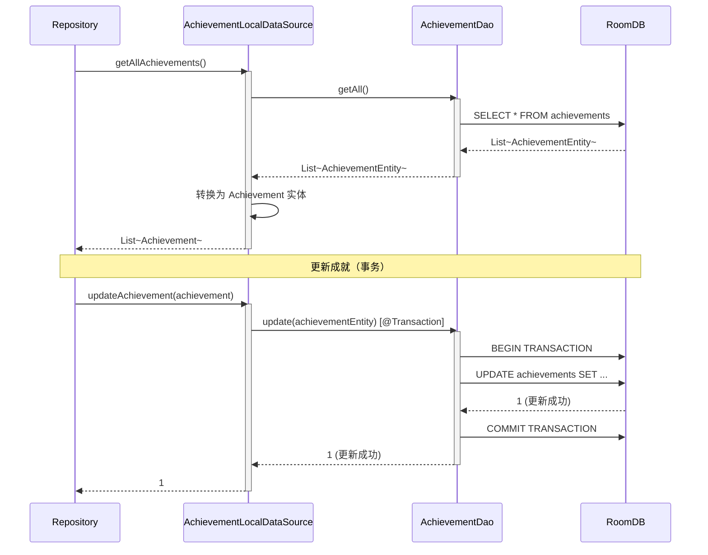
```mermaid
sequenceDiagram
  participant Repo as Repository
  participant DS as AchievementLocalDataSource
  participant DAO as AchievementDao
  participant DB as RoomDB
  
  Repo->>DS: getAllAchievements()
  activate DS
  DS->>DAO: getAll()
  activate DAO
  DAO->>DB: SELECT * FROM achievements
  DB-->>DAO: List~AchievementEntity~
  DAO-->>DS: List~AchievementEntity~
  deactivate DAO
  DS->>DS: 转换为 Achievement 实体
  DS-->>Repo: List~Achievement~
  deactivate DS
  
  Note over Repo,DB: 更新成就（事务）
  Repo->>DS: updateAchievement(achievement)
  activate DS
  DS->>DAO: update(achievementEntity) [@Transaction]
  activate DAO
  DAO->>DB: BEGIN TRANSACTION
  DAO->>DB: UPDATE achievements SET ...
  DB-->>DAO: 1 (更新成功)
  DAO->>DB: COMMIT TRANSACTION
  DAO-->>DS: 1 (更新成功)
  deactivate DAO
  DS-->>Repo: 1
  deactivate DS
```

###### UML 时序图 - 异常链路（动态，必须）

```mermaid
sequenceDiagram
  participant Repo as Repository
  participant DS as AchievementLocalDataSource
  participant DAO as AchievementDao
  participant DB as RoomDB
  
  Repo->>DS: getAllAchievements()
  activate DS
  DS->>DAO: getAll()
  
  alt 数据库连接失败
    DAO->>DB: SELECT * FROM achievements
    DB-->>DAO: SQLiteException (Cannot open database)
    DAO-->>DS: SQLiteException
    DS-->>Repo: DatabaseError
    Note over DS: 记录错误日志
  else 查询结果为空
    DAO->>DB: SELECT * FROM achievements
    DB-->>DAO: emptyList()
    DAO-->>DS: emptyList()
    DS-->>Repo: emptyList()
    Note over DS: 正常情况，返回空列表
  else 数据解析异常
    DAO->>DB: SELECT * FROM achievements
    DB-->>DAO: List~AchievementEntity~ (数据格式错误)
    DAO-->>DS: List~AchievementEntity~
    DS->>DS: 转换为 Achievement（解析异常）
    DS-->>Repo: DataCorruptionError
    Note over DS: 记录错误日志
  else 更新失败（事务回滚）
    Repo->>DS: updateAchievement(achievement)
    DS->>DAO: update() [@Transaction]
    DAO->>DB: BEGIN TRANSACTION
    DAO->>DB: UPDATE ...
    DB-->>DAO: SQLiteException (Constraint violation)
    DAO->>DB: ROLLBACK TRANSACTION
    DAO-->>DS: SQLiteException
    DS-->>Repo: DatabaseError
    Note over DS: 记录错误日志，事务已回滚
  end
  deactivate DS
```

###### 关键异常清单（必须，且与异常时序图互校）

| 异常ID | 触发点（步骤/组件） | 触发条件 | 错误类型/错误码 | 可重试 | 对策（降级/回滚/一致性） | 用户提示 | 日志/埋点字段 | 关联 NFR |
|---|---|---|---|---|---|---|---|---|
| EX-DS-001 | 数据库连接 | 数据库文件损坏、连接失败、权限被拒绝 | SQLiteException | 是 | 抛出异常，由上层 Repository 处理 | 无（上层处理） | error_type, database_path, error_message | NFR-REL-002 |
| EX-DS-002 | 查询结果为空 | 数据库中没有数据 | 正常情况 | 否 | 返回空列表，正常情况 | 无 | query_type | - |
| EX-DS-003 | 数据解析异常 | Entity 数据格式错误、类型转换失败 | DataCorruptionError | 否 | 抛出异常，由上层 Repository 处理，记录错误日志 | 无（上层处理） | error_type, entity_type, corruption_detail | NFR-REL-002 |
| EX-DS-004 | 更新失败（事务回滚） | 约束违反、外键约束、唯一约束冲突 | SQLiteException (Constraint violation) | 是 | 事务自动回滚，抛出异常，由上层 Repository 处理 | 无（上层处理） | error_type, constraint_type, error_message | NFR-REL-001 |

### A4. 关键流程设计（每个流程一张流程图，含正常 + 全部异常）

#### 流程 1：成就检查与解锁流程

```mermaid
flowchart TD
  Start([用户完成学习任务]) --> Event[接收学习操作事件]
  Event --> Precheck{前置条件检查}
  
  Precheck -->|学习数据为空| Degrade1[降级：仅展示基础进度] --> End1([结束：不检查成就])
  Precheck -->|学习数据可用| GetStats[获取学习统计数据]
  
  GetStats -->|成功| LoadAchievements[加载当前成就列表]
  GetStats -->|失败/超时| Degrade2[降级：记录日志，下次重试] --> End2([结束：不检查成就])
  
  LoadAchievements -->|成功| CheckConditions[遍历成就配置，检查解锁条件]
  LoadAchievements -->|失败| LogError1[记录错误日志] --> End3([结束：返回错误])
  
  CheckConditions --> CalcConditions{条件计算}
  CalcConditions -->|计算异常| LogError2[记录错误日志，跳过该成就] --> CheckNext{还有成就？}
  CalcConditions -->|计算成功| Compare[比较阈值]
  
  Compare -->|条件满足| AddToUnlock[添加到新解锁列表]
  Compare -->|条件不满足| CheckNext
  AddToUnlock --> CheckNext
  
  CheckNext -->|是| CheckConditions
  CheckNext -->|否| HasUnlock{有新解锁成就？}
  
  HasUnlock -->|否| End4([结束：无新解锁])
  HasUnlock -->|是| BeginTransaction[开始数据库事务]
  
  BeginTransaction --> UnlockAchievements[更新成就状态为已解锁]
  UnlockAchievements -->|成功| SaveHistory[保存成就解锁历史]
  UnlockAchievements -->|失败| Rollback1[回滚事务] --> LogError3[记录错误日志] --> End5([结束：返回错误])
  
  SaveHistory -->|成功| CommitTransaction[提交事务]
  SaveHistory -->|失败| Rollback2[回滚事务] --> LogError4[记录错误日志] --> End6([结束：返回错误])
  
  CommitTransaction --> TriggerAnimation[触发解锁动画]
  TriggerAnimation --> ShowNotification[显示解锁提示]
  ShowNotification --> UpdateCache[更新缓存]
  UpdateCache --> Success([成功：成就解锁完成])
```

#### 流程 2：积分计算与累计流程

```mermaid
flowchart TD
  Start([学习操作完成]) --> GetLearningData[获取学习数据]
  GetLearningData --> ValidateData{数据校验}
  
  ValidateData -->|数据无效| End1([结束：返回错误])
  ValidateData -->|数据有效| BeginTransaction[开始数据库事务]
  
  BeginTransaction --> LoadCurrentPoints[加载当前积分]
  LoadCurrentPoints -->|成功| CalculatePoints[计算积分增量]
  LoadCurrentPoints -->|失败| Rollback1[回滚事务] --> LogError1[记录错误日志] --> End2([结束：返回错误])
  
  CalculatePoints -->|计算异常| LogError2[记录错误日志] --> Rollback2[回滚事务] --> End3([结束：返回错误])
  CalculatePoints -->|计算成功| Increment[累加积分]
  
  Increment --> SavePoints[保存积分]
  SavePoints -->|成功| SaveHistory[保存积分历史记录]
  SavePoints -->|失败| Rollback3[回滚事务] --> LogError3[记录错误日志] --> End4([结束：返回错误])
  
  SaveHistory -->|成功| CheckLevel{需要检查等级？}
  SaveHistory -->|失败| Rollback4[回滚事务] --> LogError4[记录错误日志] --> End5([结束：返回错误])
  
  CheckLevel -->|否| CommitTransaction[提交事务]
  CheckLevel -->|是| CalculateLevel[计算等级]
  
  CalculateLevel -->|等级提升| SaveLevel[保存等级]
  CalculateLevel -->|等级未变| CommitTransaction
  
  SaveLevel -->|成功| CommitTransaction
  SaveLevel -->|失败| Rollback5[回滚事务] --> LogError5[记录错误日志] --> End6([结束：返回错误])
  
  CommitTransaction --> UpdateUI[更新UI显示]
  UpdateUI --> TriggerLevelUp{等级提升？}
  
  TriggerLevelUp -->|是| PlayLevelUpAnimation[播放等级提升动画]
  TriggerLevelUp -->|否| Success([成功：积分更新完成])
  
  PlayLevelUpAnimation --> ShowLevelUpNotification[显示等级提升提示]
  ShowLevelUpNotification --> Success
```

#### 流程 3：等级计算与提升流程

```mermaid
flowchart TD
  Start([积分变化触发]) --> GetCurrentPoints[获取当前积分]
  GetCurrentPoints -->|成功| LoadLevelConfig[加载等级配置]
  GetCurrentPoints -->|失败| End1([结束：返回错误])
  
  LoadLevelConfig -->|成功| FindLevel[查找对应等级]
  LoadLevelConfig -->|失败| LogError1[记录错误日志] --> End2([结束：返回错误])
  
  FindLevel -->|找到| CompareLevel{比较等级}
  FindLevel -->|未找到| LogError2[记录错误日志：配置错误] --> End3([结束：返回错误])
  
  CompareLevel -->|等级未变| End4([结束：等级未变化])
  CompareLevel -->|等级提升| BeginTransaction[开始数据库事务]
  
  BeginTransaction --> SaveLevel[保存新等级]
  SaveLevel -->|成功| SaveHistory[保存等级历史记录]
  SaveLevel -->|失败| Rollback1[回滚事务] --> LogError3[记录错误日志] --> End5([结束：返回错误])
  
  SaveHistory -->|成功| CommitTransaction[提交事务]
  SaveHistory -->|失败| Rollback2[回滚事务] --> LogError4[记录错误日志] --> End6([结束：返回错误])
  
  CommitTransaction --> TriggerAnimation[触发等级提升动画]
  TriggerAnimation --> ShowNotification[显示等级提升提示]
  ShowNotification --> UpdateCache[更新缓存]
  UpdateCache --> Success([成功：等级提升完成])
```

### A5. 技术风险与消解策略（绑定 Story/Task）

| 风险ID | 风险描述 | 触发条件 | 影响范围 | 严重度 | 消解策略 | 对应 Story/Task |
|---|---|---|---|---|---|---|
| RISK-001 | 学习统计数据不可用，游戏化功能降级 | FEAT-005 未就绪或数据异常 | 成就检查和积分计算功能 | High | 降级策略：仅展示基础进度，不计算成就和积分；数据恢复后自动重新计算；记录错误日志 | ST-001 / T??? |
| RISK-002 | 成就检查计算时间超时（> 100ms），影响学习流程 | 成就数量过多（> 100个）、计算逻辑复杂、设备性能差 | 学习流程流畅性 | Med | 优化成就检查算法：批量检查、缓存配置、提前退出；异步检查不阻塞学习流程；超时后记录日志，下次重试 | ST-001 / T??? |
| RISK-003 | 积分计算不准确，与学习数据不一致 | 并发操作、事务冲突、数据损坏 | 积分和等级数据准确性 | High | 使用事务保证积分计算和保存的原子性；并发控制：队列化积分计算操作；数据修复：基于学习数据重新计算积分 | ST-002 / T??? |
| RISK-004 | 数据库存储失败，游戏化数据丢失 | 存储空间不足、数据库损坏、设备权限问题 | 游戏化数据持久化 | High | 数据校验：保存前校验数据格式；错误处理：保存失败时记录日志，允许重试；数据恢复：应用重启后基于学习数据重新计算 | ST-003 / T??? |
| RISK-005 | 动画播放卡顿（< 60fps），影响用户体验 | 设备性能差、动画资源过大、动画逻辑复杂 | 用户体验 | Med | 优化动画：使用 Compose Animation API、简化动画逻辑、预加载动画资源；降级策略：低端设备降级为简化动画或静态提示 | ST-004 / T??? |
| RISK-006 | 内存占用过高（> 10MB），影响应用性能 | 成就列表过大、动画资源未释放、缓存过多 | 应用内存占用 | Med | 内存优化：使用 LazyColumn 虚拟化列表、动画播放完成后立即释放资源、限制缓存大小；内存监控：记录内存使用情况 | ST-005 / T??? |

### A6. 边界 & 异常场景枚举（数据/状态/生命周期/并发/用户行为）

- **数据边界**：
  - **成就列表为空**：显示引导提示，鼓励用户开始学习
  - **积分数据为负数**：校验数据，确保积分 ≥ 0，异常时重置为 0
  - **等级数据超出范围**：校验等级配置，确保等级在有效范围内，异常时重置为 Lv.1
  - **学习数据为空/null**：降级为仅展示基础进度，不计算成就和积分
  - **成就配置缺失**：使用默认配置或空配置，记录错误日志
  - **等级配置缺失**：使用默认等级配置（Lv.1），记录错误日志

- **状态边界**：
  - **成就状态不一致**：数据库显示已解锁但配置中不存在 → 重新计算成就状态
  - **积分与等级不一致**：等级对应的积分范围不匹配 → 基于积分重新计算等级
  - **游戏化数据与学习数据不一致**：以学习数据为准，重新计算游戏化数据

- **生命周期**：
  - **应用退出时正在计算**：保存计算进度（检查点），下次启动时继续或重新计算
  - **前后台切换时动画播放**：暂停动画，前台恢复时继续播放
  - **进程被杀后恢复**：从数据库加载游戏化数据，验证数据一致性
  - **应用旋转/配置变更**：保存当前状态，恢复时重新加载

- **并发**：
  - **多个学习操作并发触发成就检查**：队列化成就检查操作，串行执行
  - **并发积分计算**：使用数据库事务保证原子性，重试机制处理冲突
  - **并发等级更新**：使用数据库事务保证原子性，重试机制处理冲突
  - **并发查询游戏化数据**：支持并发查询（读操作），写操作使用事务保护

- **用户行为**：
  - **快速连续学习操作**：防抖处理，合并连续的成就检查和积分计算
  - **用户退出应用时正在保存数据**：等待保存完成或记录待保存任务
  - **用户频繁切换页面**：取消未完成的查询操作，避免资源浪费
  - **用户查看成就列表时数据变化**：实时更新列表，使用 Flow 响应式更新

### A7. 算法评估（如适用）

- **目标**：成就检查算法、积分计算算法、等级计算算法
- **指标**：
  - **成就检查准确率**：100%（不误解锁、不漏解锁）
  - **积分计算准确率**：100%（与学习数据一致）
  - **等级计算准确率**：100%（与积分数据一致）
- **验收标准**：
  - 成就检查准确率：100%（测试用例覆盖所有成就条件和边界情况）
  - 积分计算准确率：100%（测试用例覆盖所有积分规则和边界情况）
  - 等级计算准确率：100%（测试用例覆盖所有等级配置和边界情况）
- **测试方法**：
  - **单元测试**：覆盖所有计算逻辑和边界情况（100% 代码覆盖率）
  - **集成测试**：覆盖完整流程（成就检查→积分计算→等级计算）
  - **回归测试**：测试数据一致性（学习数据变化后游戏化数据自动更新）
- **风险**：
  - **数据漂移**：学习数据异常导致游戏化数据错误 → 数据校验和修复机制
  - **极端样本**：大量成就配置（> 1000个）导致检查耗时 → 优化算法和配置管理
  - **可解释性**：用户不理解积分和等级计算规则 → UI 提示和说明

### A8. 功耗评估（必须量化）

- **Top5% 用户模型**：
  - **设备**：Android 8.0+（API Level 26+），中端设备（Snapdragon 660/Helio P60 等级）
  - **网络**：无需网络（本地计算）
  - **使用频次**：每天学习 30 分钟，触发 50 次成就检查和积分计算
  - **场景**：前台使用，动画播放，数据计算和存储
- **测量口径**：
  - **计算开销**：成就检查（≤ 100ms，平均 50ms，CPU 占用 10%）、积分计算（≤ 50ms，平均 25ms，CPU 占用 5%）
  - **动画渲染**：成就解锁动画（2 秒，GPU 占用 30%）、等级提升动画（3 秒，GPU 占用 30%）
  - **数据库操作**：查询（≤ 5ms，平均 2ms）、写入（≤ 10ms，平均 5ms）
- **预估增量**：每日 \(mAh\) 增量 ≤ 3mAh
  - 计算开销：50 次成就检查 × 50ms × 10% CPU = 250ms CPU 时间 ≈ 0.5mAh
  - 动画渲染：5 次动画 × 2.5秒 × 30% GPU = 3.75秒 GPU 时间 ≈ 1.5mAh
  - 数据库操作：100 次操作 × 3.5ms × 5% CPU = 350ms CPU 时间 ≈ 0.5mAh
  - 其他开销：缓存、状态管理 ≈ 0.5mAh
- **验收上限**：每日电池消耗增量 ≤ 3mAh（Top5% 用户，每天学习 30 分钟）
  - **测试方法**：使用 Android Battery Historian 或 Profiler 监控电池消耗
  - **失败处置**：超过阈值时优化计算算法、减少动画时长、降低动画复杂度
- **降级策略**：
  - **低端设备**：简化动画（时长减半）、减少成就检查频率（批量检查）
  - **电池低电量模式**：禁用动画播放，仅显示静态提示
  - **后台运行**：禁用所有游戏化功能，仅在前台时启用

### A9. 性能评估（必须量化）

- **前台**：
  - **成就检查计算时间**：p50 ≤ 50ms，p95 ≤ 100ms，p99 ≤ 150ms
  - **积分计算时间**：p50 ≤ 25ms，p95 ≤ 50ms，p99 ≤ 75ms
  - **等级计算时间**：p50 ≤ 10ms，p95 ≤ 20ms，p99 ≤ 30ms
  - **成就列表加载时间**：p50 ≤ 100ms，p95 ≤ 300ms，p99 ≤ 500ms
  - **进度可视化渲染时间**：p50 ≤ 100ms，p95 ≤ 200ms，p99 ≤ 300ms
  - **动画播放流畅度**：60fps（p95 ≥ 55fps）
- **后台**：
  - **数据保存任务**：≤ 100ms（p95）
  - **数据恢复任务**：≤ 500ms（p95，应用启动时）
- **验收指标**：
  - **阈值**：见上述性能指标
  - **测试方法**：
    - 使用 Android Profiler 监控 CPU 和 GPU 使用情况
    - 使用 Traceview 或 Systrace 分析关键路径耗时
    - 使用 Benchmark 库进行性能测试（100 次迭代，统计 p50/p95/p99）
    - 使用动画性能工具（如 FrameMetrics）监控动画流畅度
- **降级策略**：
  - **计算超时**：记录日志，下次重试；批量处理减少计算次数
  - **列表加载慢**：使用分页加载、虚拟化列表（LazyColumn）、缓存查询结果
  - **动画卡顿**：降低动画复杂度、减少动画时长、禁用低端设备动画
  - **数据库查询慢**：优化索引、使用缓存、异步查询

### A10. 内存评估（必须量化）

- **峰值增量**：≤ 10MB
  - **成就列表数据**：100 个成就 × 200 字节/成就 = 20KB
  - **积分和等级数据**：用户数据 × 1KB = 1KB
  - **动画资源**：成就解锁动画（500KB）+ 等级提升动画（800KB）+ 里程碑动画（500KB） = 1.8MB
  - **缓存数据**：成就列表缓存（20KB）+ 等级配置缓存（10KB） = 30KB
  - **其他开销**：ViewModel、Repository、UseCase 对象 ≈ 8MB
- **平均增量**：≤ 5MB
  - **常驻数据**：成就列表（20KB）+ 积分等级（1KB）+ 缓存（30KB） = 51KB
  - **动画资源**：动画播放时加载（1.8MB），播放完成后释放
  - **计算临时数据**：成就检查临时数据（100KB）+ 积分计算临时数据（50KB） = 150KB
- **生命周期**：
  - **常驻**：ViewModel、Repository、UseCase 对象（应用生命周期）
  - **前台**：UI 状态、缓存数据（页面生命周期）
  - **动画播放时**：动画资源（动画播放期间，播放完成后立即释放）
  - **后台/退出时**：保存数据到数据库，释放动画资源
- **风险与对策**：
  - **泄漏点**：ViewModel 未正确清理、动画资源未释放、缓存无限增长
  - **对策**：
    - ViewModel 使用 ViewModelProvider，自动管理生命周期
    - 动画播放完成后立即释放资源（DisposableEffect）
    - 缓存大小限制（最多 100 个成就列表）
    - 使用内存分析工具（LeakCanary）检测内存泄漏
- **验收标准**：
  - **测试方法**：使用 Android Profiler 监控内存使用情况（堆内存、原生内存）
  - **阈值**：峰值增量 ≤ 10MB，平均增量 ≤ 5MB
  - **场景**：
    - 启动应用，查看成就列表（峰值）
    - 播放成就解锁动画（峰值）
    - 正常使用 10 分钟（平均）
    - 退出应用（内存释放）

## Plan-B：技术规约 & 实现约束（保留原 spec-kit 输出内容）

### B1. 技术背景（用于统一工程上下文）

> 注意：为保证工具链自动提取信息，下列字段名需保留英文 Key（括号内可补充中文）。

**Language/Version**：Kotlin 2.x / Java 17
**Primary Dependencies**：Jetpack Compose、Room、Kotlin Coroutines、Flow
**Storage**：Room/SQLite（游戏化数据：成就、积分、等级表）
**Test Framework**：JUnit、Kotlin Coroutines Test、Robolectric（可选）
**Target Platform**：Android 8.0+（API Level 26+）
**Project Type**：mobile（Android 应用）
**Performance Targets**：60fps 动画、成就检查 ≤ 100ms（p95）、积分计算 ≤ 50ms（p95）、成就列表加载 ≤ 300ms（p95）
**Constraints**：p95 时延预算（见 A9）、内存峰值 ≤ 10MB（见 A10）、功耗增量 ≤ 3mAh/天（见 A8）
**Scale/Scope**：DAU < 1000（单人/小团队开发）、成就数量 < 100、用户数据本地存储

### B2. 架构细化（实现必须遵循）

- **分层约束**：
  - UI 层（Jetpack Compose）只能调用 ViewModel，不能直接调用 UseCase/Repository
  - ViewModel 只能调用 Domain 层（UseCase），不能直接访问数据层
  - Domain 层（UseCase）只能调用 Calculator 和 Repository，不能依赖 UI 层
  - Repository 只能调用 DataSource，不能直接访问数据库
  - DataSource 直接操作 Room 数据库，无业务逻辑
- **线程/并发模型**：
  - **主线程**：UI 更新、动画播放、状态观察
  - **IO 线程**：数据库操作、网络请求（如有）、文件读写
  - **协程**：所有异步操作使用 Kotlin Coroutines（suspend 函数）
  - **锁策略**：数据库事务保证数据一致性，ViewModel StateFlow 线程安全（无需额外锁）
- **错误处理规范**：
  - **错误封装**：使用 Sealed Class 定义错误类型（AchievementError, PointsError, LevelError）
  - **错误传播**：使用 Result 封装成功/失败状态，通过 Flow/StateFlow 传播错误
  - **用户提示**：错误消息由 ViewModel 转换为用户友好的提示，UI 显示错误提示
  - **日志记录**：所有错误必须记录结构化日志（错误类型、错误消息、堆栈跟踪）
- **日志与可观测性**：
  - **结构化字段**：错误类型（error_type）、错误消息（error_message）、操作类型（operation）、用户ID（user_id）
  - **采样策略**：性能埋点采样率 10%（避免日志过多），错误日志 100% 记录
  - **敏感信息脱敏**：用户数据不记录在日志中，仅记录数据摘要（如积分总量、成就数量）

### B3. 数据模型（引用或内联）

#### B3.1 存储形态与边界（必须）

- **存储形态**：Room/SQLite 数据库（游戏化数据：成就表、积分表、等级表、历史记录表）
- **System of Record（权威来源）**：
  - **游戏化数据（成就、积分、等级）**：Room 数据库为准（本地存储）
  - **学习数据（学习天数、单词数量、学习时长）**：FEAT-005 的学习统计模块为准（用于计算游戏化数据）
  - **数据一致性**：游戏化数据依赖学习数据，数据不一致时以学习数据为准重新计算
- **缓存与派生数据**：
  - **成就列表缓存**：内存缓存（ViewModel StateFlow），可重建（从数据库加载）
  - **等级配置缓存**：内存缓存（LevelCalculator），可重建（硬编码配置）
  - **积分和等级**：可重建（基于学习数据重新计算）
- **生命周期**：
  - **常驻数据**：成就、积分、等级数据常驻数据库，应用退出时保存
  - **缓存数据**：前台时保留在内存，后台/退出时释放
  - **动画资源**：动画播放时加载，播放完成后立即释放
- **数据规模与增长**：
  - **成就数量**：< 100 个（固定配置）
  - **积分历史记录**：< 1000 条（按时间清理，保留最近 1000 条）
  - **成就解锁历史**：< 1000 条（按时间清理，保留最近 1000 条）
  - **读写热点**：成就列表查询（读多写少）、积分更新（写多读少）

#### B3.2 物理数据结构（若使用持久化存储则必填）

#####（数据库）表结构清单

| 表 | 用途 | 主键/唯一约束 | 索引 | 外键 | 典型查询（Top3） | 数据量级 |
|---|---|---|---|---|---|---|
| achievements | 成就定义和状态 | id (PRIMARY KEY) | is_unlocked, unlocked_at | 无 | 1) 查询所有成就（已解锁/未解锁）<br>2) 查询已解锁成就<br>3) 更新成就状态 | < 100 |
| points | 用户积分 | user_id (PRIMARY KEY) | updated_at | 无 | 1) 查询用户积分<br>2) 更新用户积分 | 1 |
| points_history | 积分历史记录 | id (PRIMARY KEY, AUTO_INCREMENT) | user_id, created_at | user_id → points.user_id | 1) 查询用户积分历史（按时间排序）<br>2) 查询最近积分变化<br>3) 清理旧记录 | < 1000 |
| level | 用户等级 | user_id (PRIMARY KEY) | updated_at | 无 | 1) 查询用户等级<br>2) 更新用户等级 | 1 |
| achievement_history | 成就解锁历史 | id (PRIMARY KEY, AUTO_INCREMENT) | achievement_id, user_id, unlocked_at | achievement_id → achievements.id<br>user_id → points.user_id | 1) 查询用户成就解锁历史<br>2) 查询成就解锁时间<br>3) 清理旧记录 | < 1000 |

#####（数据库）字段说明模板（每表一份）

**表**：`achievements`

| 字段 | 类型 | 约束（NOT NULL/默认值/范围） | 含义 | 来源/生成方式 | 用途（读写场景） |
|---|---|---|---|---|---|
| id | TEXT | NOT NULL, PRIMARY KEY | 成就ID（唯一标识） | 硬编码配置 | 查询成就、更新成就状态 |
| name | TEXT | NOT NULL | 成就名称 | 硬编码配置 | 显示成就名称 |
| description | TEXT | NOT NULL | 成就描述 | 硬编码配置 | 显示成就描述 |
| icon | TEXT | NOT NULL | 成就图标资源路径 | 硬编码配置 | 显示成就图标 |
| condition_type | TEXT | NOT NULL | 解锁条件类型（days/words/time） | 硬编码配置 | 检查解锁条件 |
| condition_threshold | INTEGER | NOT NULL | 解锁条件阈值 | 硬编码配置 | 检查解锁条件 |
| points_reward | INTEGER | NOT NULL, DEFAULT 0 | 解锁奖励积分 | 硬编码配置 | 解锁时奖励积分 |
| is_unlocked | INTEGER | NOT NULL, DEFAULT 0 (0/1) | 是否已解锁 | 用户行为触发 | 查询已解锁成就、显示成就状态 |
| unlocked_at | INTEGER | NULL | 解锁时间戳（毫秒） | 解锁时生成 | 显示解锁时间、查询解锁历史 |

**表**：`points`

| 字段 | 类型 | 约束（NOT NULL/默认值/范围） | 含义 | 来源/生成方式 | 用途（读写场景） |
|---|---|---|---|---|---|
| user_id | TEXT | NOT NULL, PRIMARY KEY | 用户ID | 应用初始化时创建 | 查询用户积分、更新积分 |
| total_points | INTEGER | NOT NULL, DEFAULT 0, CHECK(total_points >= 0) | 总积分 | 积分计算 | 显示总积分、计算等级 |
| updated_at | INTEGER | NOT NULL | 更新时间戳（毫秒） | 更新时生成 | 查询最近更新时间 |

**表**：`points_history`

| 字段 | 类型 | 约束（NOT NULL/默认值/范围） | 含义 | 来源/生成方式 | 用途（读写场景） |
|---|---|---|---|---|---|
| id | INTEGER | NOT NULL, PRIMARY KEY, AUTO_INCREMENT | 记录ID | 数据库自增 | 查询历史记录 |
| user_id | TEXT | NOT NULL | 用户ID | 当前用户ID | 查询用户积分历史 |
| points_change | INTEGER | NOT NULL | 积分变化量（正数/负数） | 积分计算 | 显示积分变化 |
| reason | TEXT | NOT NULL | 变化原因（learning/review/streak/achievement） | 积分计算 | 显示变化原因 |
| created_at | INTEGER | NOT NULL | 创建时间戳（毫秒） | 创建时生成 | 按时间排序、清理旧记录 |

**表**：`level`

| 字段 | 类型 | 约束（NOT NULL/默认值/范围） | 含义 | 来源/生成方式 | 用途（读写场景） |
|---|---|---|---|---|---|
| user_id | TEXT | NOT NULL, PRIMARY KEY | 用户ID | 应用初始化时创建 | 查询用户等级、更新等级 |
| level_id | INTEGER | NOT NULL, DEFAULT 1 | 等级ID | 等级计算 | 显示等级、查询等级 |
| level_name | TEXT | NOT NULL, DEFAULT "Lv.1" | 等级名称 | 等级配置 | 显示等级名称 |
| updated_at | INTEGER | NOT NULL | 更新时间戳（毫秒） | 更新时生成 | 查询最近更新时间 |

**表**：`achievement_history`

| 字段 | 类型 | 约束（NOT NULL/默认值/范围） | 含义 | 来源/生成方式 | 用途（读写场景） |
|---|---|---|---|---|---|
| id | INTEGER | NOT NULL, PRIMARY KEY, AUTO_INCREMENT | 记录ID | 数据库自增 | 查询历史记录 |
| achievement_id | TEXT | NOT NULL | 成就ID | 解锁的成就ID | 查询成就解锁历史 |
| user_id | TEXT | NOT NULL | 用户ID | 当前用户ID | 查询用户成就解锁历史 |
| unlocked_at | INTEGER | NOT NULL | 解锁时间戳（毫秒） | 解锁时生成 | 按时间排序、清理旧记录 |

#####（数据库）迁移与兼容策略

- **Schema 版本**：v1（初始版本）
- **向后兼容**：
  - 新增列使用默认值（NOT NULL 字段需提供默认值）
  - 字段废弃策略：标记为 @Deprecated，保留字段但不使用，下一个大版本删除
  - 索引变更策略：新增索引不影响查询，删除索引需要迁移数据
- **迁移策略**：
  - **Migration 列表**：v1（初始版本，无需迁移）
  - **失败回滚/重试策略**：迁移失败时回滚到上一个版本，记录错误日志，用户下次启动时重试
  - **数据回填/重建策略**：新版本新增字段时，基于现有数据回填默认值；数据损坏时基于学习数据重新计算游戏化数据

### B4. 接口规范/协议（引用或内联）

#### B4.1 本 Feature 对外提供的接口（必须：Capability Feature/跨模块复用场景）

> 目的：本 Feature 为业务 Feature，但游戏化计算器（Calculator 层）可被其他 Feature 复用（如未来扩展更多游戏化玩法）。

- **接口清单**：
  - `AchievementCalculator`：成就条件检查（可复用）
  - `PointsCalculator`：积分计算（可复用）
  - `LevelCalculator`：等级计算（可复用）
  - `GamificationRepository`：游戏化数据访问（本 Feature 内部使用）
- **输入/输出**：
  - `AchievementCalculator.checkAchievementConditions(statistics: LearningStatistics, currentAchievements: List<Achievement>): List<Achievement>`
    - 输入：学习统计数据、当前成就列表
    - 输出：新解锁成就列表
  - `PointsCalculator.calculatePoints(learningData: LearningData): Int`
    - 输入：学习数据（行为类型、数量）
    - 输出：积分增量
  - `LevelCalculator.calculateLevel(points: Int): Level`
    - 输入：总积分
    - 输出：等级对象
- **错误语义**：
  - **计算错误**：CalculationError（不可重试，记录日志）
  - **配置错误**：ConfigurationError（不可重试，记录日志）
  - **超时错误**：TimeoutError（可重试，记录日志）
- **幂等与副作用**：
  - **成就检查**：幂等（相同输入产生相同输出），无副作用（纯计算）
  - **积分计算**：幂等（相同输入产生相同输出），无副作用（纯计算）
  - **等级计算**：幂等（相同输入产生相同输出），无副作用（纯计算）
- **并发/线程模型**：
  - **线程安全**：所有 Calculator 函数线程安全（无共享状态）
  - **协程要求**：Calculator 函数为同步函数（非 suspend），在 IO 线程调用
  - **取消语义**：不支持取消（纯计算函数，执行时间短）
- **版本与兼容**：
  - **版本策略**：Calculator API 向后兼容（新增参数使用默认值）
  - **兼容策略**：新增成就类型、积分规则、等级配置不影响现有计算逻辑

#### B4.2 本 Feature 依赖的外部接口/契约（必须：存在外部依赖时）

> 目的：依赖 FEAT-005（学习进度与统计）和 FEAT-007（用户账户与数据管理）模块。

- **依赖接口清单**：
  - `LearningStatsRepository`（FEAT-005）：学习统计数据查询
  - `UserDataRepository`（FEAT-007）：用户数据存储能力
- **调用约束**：
  - **超时**：学习数据查询超时 5 秒
  - **重试**：查询失败不重试（记录日志，降级处理）
  - **退避**：不适用（无网络请求）
  - **限流**：无外部限流（本地模块调用）
  - **缓存策略**：不缓存学习数据（实时查询，保证数据一致性）
  - **一致性假设**：学习数据是权威来源，游戏化数据依赖学习数据
- **失败模式与降级**：
  - **学习数据不可用**：降级为仅展示基础进度，不计算成就和积分（见 A2.1）
  - **用户数据存储失败**：记录错误日志，允许用户继续学习，下次成功时补存数据（见 A2.1）

#### B4.3 契约工件（contracts/）与引用方式（推荐）

- **contracts/**：本 Feature 为业务 Feature，不单独定义契约文件；接口定义在代码中（Kotlin interface/class）
- **变更流程**：Calculator API 变更需要更新版本号（Plan Version），向后兼容策略见 B4.1

### B5. 合规性检查（关卡）

*关卡：必须在进入 Implement 前通过；若不通过，必须明确整改项并绑定到 Story/Task。*

- **隐私合规**：
  - ✅ 游戏化数据存储在应用私有目录，不上传云端（符合 EPIC 隐私要求）
  - ✅ 数据仅用于本地展示和激励，不用于用户画像分析
- **性能合规**：
  - ✅ 成就检查计算时间 ≤ 100ms（p95）（见 A9）
  - ✅ 积分计算时间 ≤ 50ms（p95）（见 A9）
  - ✅ 成就列表加载时间 ≤ 300ms（p95）（见 A9）
- **内存合规**：
  - ✅ 游戏化数据内存占用峰值 ≤ 10MB（见 A10）
- **可靠性合规**：
  - ✅ 成就检查准确率 100%（见 A7）
  - ✅ 积分计算准确率 100%（见 A7）
  - ✅ 数据持久化：应用崩溃后数据恢复（见 NFR-REL-002）

### B6. 项目结构（本 Feature）

```text
specs/epics/EPIC-001-word-memory-app/features/FEAT-004-gamification-incentive/
├── spec.md                     # Feature 规格说明（/speckit.specify）
├── plan.md                     # 本文件（/speckit.plan）
├── full-design.md               # 全量技术方案文档（/speckit.fulldesign）
├── tasks.md                    # 任务拆解（/speckit.tasks）
├── checklists/                 # 检查清单（可选）
│   └── requirements.md         # 需求检查清单
└── contracts/                  # 接口契约（可选，本 Feature 不单独定义）
```

### B7. 源代码结构（代码库根目录）

```text
app/src/main/java/com/jacky/verity/
├── gamification/               # 游戏化模块（本 Feature）
│   ├── ui/                     # UI 层（Jetpack Compose）
│   │   ├── achievement/        # 成就列表界面
│   │   ├── points/             # 积分等级界面
│   │   └── progress/           # 进度可视化界面
│   ├── viewmodel/              # ViewModel 层
│   │   ├── AchievementViewModel.kt
│   │   ├── PointsLevelViewModel.kt
│   │   └── ProgressViewModel.kt
│   ├── domain/                 # Domain 层（UseCase）
│   │   ├── CheckAchievementUseCase.kt
│   │   ├── CalculatePointsUseCase.kt
│   │   ├── CalculateLevelUseCase.kt
│   │   ├── GetAchievementsUseCase.kt
│   │   ├── GetPointsLevelUseCase.kt
│   │   └── GetProgressUseCase.kt
│   ├── calculator/             # Calculator 层（计算逻辑）
│   │   ├── AchievementCalculator.kt
│   │   ├── PointsCalculator.kt
│   │   └── LevelCalculator.kt
│   ├── data/                   # Data 层
│   │   ├── repository/         # Repository 层
│   │   │   └── GamificationRepository.kt
│   │   ├── local/              # DataSource 层
│   │   │   ├── AchievementLocalDataSource.kt
│   │   │   ├── PointsLocalDataSource.kt
│   │   │   └── LevelLocalDataSource.kt
│   │   ├── database/           # Room 数据库
│   │   │   ├── GamificationDatabase.kt
│   │   │   ├── dao/            # DAO
│   │   │   │   ├── AchievementDao.kt
│   │   │   │   ├── PointsDao.kt
│   │   │   │   ├── LevelDao.kt
│   │   │   │   ├── PointsHistoryDao.kt
│   │   │   │   └── AchievementHistoryDao.kt
│   │   │   └── entity/         # Entity
│   │   │       ├── AchievementEntity.kt
│   │   │       ├── PointsEntity.kt
│   │   │       ├── LevelEntity.kt
│   │   │       ├── PointsHistoryEntity.kt
│   │   │       └── AchievementHistoryEntity.kt
│   │   └── model/              # 领域模型
│   │       ├── Achievement.kt
│   │       ├── Points.kt
│   │       ├── Level.kt
│   │       └── Progress.kt
│   └── di/                     # 依赖注入（可选）
│       └── GamificationModule.kt
```

**结构决策**：采用 Clean Architecture 分层结构（UI → ViewModel → Domain → Data），符合 Android 最佳实践和 EPIC 技术约束。

## Story Breakdown（Plan 阶段末尾，必须）

> 规则：
> - Story 是 Feature 的最小可开发单元，用于覆盖对应 FR/NFR。
> - Story 类型必须标注：Functional / Design-Enabler / Infrastructure / Optimization。
> - 这里**只做拆分与映射**，不生成 Task；Task 在 `/speckit.tasks` 阶段生成，且不得改写这里的设计决策。

### Story 列表

#### ST-001：成就系统实现（类型：Functional）

- **描述**：实现成就检查和解锁功能，包括成就配置管理、成就条件检查、成就解锁和成就列表展示
- **目标**：用户完成学习任务后，系统自动检查并解锁符合条件的成就，显示解锁动画和提示
- **覆盖 FR/NFR**：FR-001、FR-004、FR-007；NFR-PERF-001、NFR-REL-001、NFR-OBS-001
- **依赖**：FEAT-005（学习进度与统计，提供学习数据）
- **可并行**：否（必须先完成数据模型和 Repository，才能实现成就检查）
- **关键风险**：是（关联 RISK-001、RISK-002）
- **验收/验证方式（高层）**：
  - 功能验收：用户完成学习后看到成就解锁提示，成就列表显示已解锁成就
  - 性能验收：成就检查计算时间 ≤ 100ms（p95），成就列表加载时间 ≤ 300ms（p95）
  - 可靠性验收：成就检查准确率 100%，成就解锁数据正确持久化

#### ST-002：积分系统实现（类型：Functional）

- **描述**：实现积分计算和累计功能，包括积分规则配置、积分计算、积分保存和积分展示
- **目标**：用户学习行为产生积分，积分实时累计和更新，显示积分变化
- **覆盖 FR/NFR**：FR-002、FR-005、FR-007；NFR-PERF-001、NFR-REL-001、NFR-OBS-001
- **依赖**：FEAT-005（学习进度与统计，提供学习数据）；ST-001（数据模型和 Repository）
- **可并行**：否（依赖 ST-001 的数据模型）
- **关键风险**：是（关联 RISK-003）
- **验收/验证方式（高层）**：
  - 功能验收：用户学习后积分增加，积分历史记录正确保存
  - 性能验收：积分计算时间 ≤ 50ms（p95）
  - 可靠性验收：积分计算准确率 100%，积分数据与学习数据一致

#### ST-003：等级系统实现（类型：Functional）

- **描述**：实现等级计算和提升功能，包括等级配置管理、等级计算、等级提升和等级展示
- **目标**：用户积分达到等级提升条件时，系统显示等级提升动画和奖励提示
- **覆盖 FR/NFR**：FR-003、FR-005、FR-007；NFR-PERF-001、NFR-REL-001、NFR-OBS-001
- **依赖**：ST-002（积分系统，提供积分数据）
- **可并行**：否（依赖 ST-002 的积分数据）
- **关键风险**：是（关联 RISK-004）
- **验收/验证方式（高层）**：
  - 功能验收：用户积分达到等级提升条件时显示等级提升动画，等级数据正确保存
  - 性能验收：等级计算时间 ≤ 20ms（p95）
  - 可靠性验收：等级计算准确率 100%，等级数据与积分数据一致

#### ST-004：进度可视化实现（类型：Functional）

- **描述**：实现学习进度可视化功能，包括进度条展示、里程碑展示和里程碑庆祝动画
- **目标**：用户能够查看当前积分、等级和距离下一等级的进度条，达成里程碑时显示庆祝动画
- **覆盖 FR/NFR**：FR-005、FR-006；NFR-PERF-002、NFR-POWER-001、NFR-MEM-001
- **依赖**：ST-002（积分系统）、ST-003（等级系统）
- **可并行**：否（依赖 ST-002 和 ST-003）
- **关键风险**：是（关联 RISK-005）
- **验收/验证方式（高层）**：
  - 功能验收：用户能够查看积分、等级和进度条，达成里程碑时显示庆祝动画
  - 性能验收：进度可视化渲染时间 ≤ 200ms（p95），动画播放流畅（60fps）
  - 内存验收：动画资源播放完成后立即释放，内存占用峰值 ≤ 10MB

#### ST-005：数据模型和存储实现（类型：Infrastructure）

- **描述**：实现游戏化数据的数据模型、Room 数据库设计和数据访问层（Repository、DataSource）
- **目标**：建立完整的数据存储和访问基础设施，支持成就、积分、等级数据的持久化
- **覆盖 FR/NFR**：FR-007；NFR-MEM-001、NFR-REL-002、NFR-SEC-001
- **依赖**：无（基础设施，其他 Story 依赖本 Story）
- **可并行**：否（其他 Story 依赖本 Story）
- **关键风险**：是（关联 RISK-004、RISK-006）
- **验收/验证方式（高层）**：
  - 功能验收：成就、积分、等级数据正确保存和查询，数据持久化正常
  - 可靠性验收：应用重启后数据恢复，数据损坏时能够修复
  - 性能验收：数据库查询时间 ≤ 5ms（p95），数据保存时间 ≤ 10ms（p95）

### Feature → Story 覆盖矩阵

| FR/NFR ID | 覆盖的 Story ID | 备注 |
|---|---|---|
| FR-001 | ST-001 | 成就检查和解锁 |
| FR-002 | ST-002 | 积分计算和累计 |
| FR-003 | ST-003 | 等级计算和提升 |
| FR-004 | ST-001 | 成就列表展示 |
| FR-005 | ST-002、ST-003、ST-004 | 积分等级展示、进度条 |
| FR-006 | ST-004 | 里程碑展示和庆祝动画 |
| FR-007 | ST-001、ST-002、ST-003、ST-005 | 数据自动重新计算、数据持久化 |
| NFR-PERF-001 | ST-001、ST-002、ST-003 | 成就检查、积分计算、等级计算性能 |
| NFR-PERF-002 | ST-001、ST-004 | 成就列表加载、进度可视化渲染 |
| NFR-PERF-003 | ST-001、ST-002、ST-003 | 学习数据不可用降级策略 |
| NFR-POWER-001 | ST-004 | 动画播放功耗 |
| NFR-MEM-001 | ST-004、ST-005 | 动画资源内存、游戏化数据内存 |
| NFR-MEM-002 | ST-005 | 数据生命周期管理 |
| NFR-SEC-001 | ST-005 | 数据存储隐私 |
| NFR-SEC-002 | ST-002、ST-003 | 积分等级计算逻辑不可篡改 |
| NFR-OBS-001 | ST-001、ST-002、ST-003 | 成就解锁、积分变化、等级提升事件 |
| NFR-OBS-002 | ST-001、ST-002、ST-003 | 计算失败错误日志 |
| NFR-REL-001 | ST-001、ST-002、ST-003 | 计算准确率 100% |
| NFR-REL-002 | ST-005 | 数据持久化和恢复 |

## Story Detailed Design（L2 二层详细设计：面向开发落码，强烈建议）

> 目标：把每个 Story 的"实现方法"写清楚，做到**不写每行代码**也能明确指导开发如何落地。
>
> 规则：
> - 本节内容属于 Plan 的一部分，视为**权威技术决策输入**（必须纳入版本管理与变更记录）。
> - tasks.md 的每个 Task 应明确引用对应 Story 的详细设计入口（例如：`plan.md:ST-001:4.2 时序图`）。
> - 对每个 Story，必须同时覆盖：**静态结构（类/接口/数据）**、**动态交互（时序）**、**异常矩阵（无遗漏）**、**并发/取消语义**、**验证方式**。

### ST-001 Detailed Design：成就系统实现

#### 1) 目标 & Done 定义（DoD）

- **目标**：实现成就检查和解锁功能，用户完成学习后自动解锁成就并显示解锁动画
- **DoD（可验证）**：
  - [ ] [功能验收：用户完成学习后看到成就解锁提示，成就列表显示已解锁成就（引用 FR-001、FR-004）]
  - [ ] [性能验收：成就检查计算时间 ≤ 100ms（p95），成就列表加载时间 ≤ 300ms（p95）（引用 NFR-PERF-001、NFR-PERF-002，使用 Android Profiler 测量）]
  - [ ] [可靠性验收：成就检查准确率 100%，成就解锁数据正确持久化（引用 NFR-REL-001、NFR-REL-002，单元测试覆盖所有成就条件）]

#### 2) 代码落点与边界（开发导航）

- **新增/修改目录与文件（建议到包/文件级）**：
  - `app/src/main/java/com/jacky/verity/gamification/domain/CheckAchievementUseCase.kt`：成就检查用例
  - `app/src/main/java/com/jacky/verity/gamification/domain/GetAchievementsUseCase.kt`：获取成就列表用例
  - `app/src/main/java/com/jacky/verity/gamification/calculator/AchievementCalculator.kt`：成就计算器
  - `app/src/main/java/com/jacky/verity/gamification/viewmodel/AchievementViewModel.kt`：成就 ViewModel
  - `app/src/main/java/com/jacky/verity/gamification/ui/achievement/AchievementScreen.kt`：成就列表界面
  - `app/src/main/java/com/jacky/verity/gamification/data/database/entity/AchievementEntity.kt`：成就实体
  - `app/src/main/java/com/jacky/verity/gamification/data/database/dao/AchievementDao.kt`：成就 DAO
- **分层与依赖约束**：复用 Plan-B:B2（UI → ViewModel → UseCase → Repository → DataSource）
- **对外暴露点**：
  - `CheckAchievementUseCase.execute(learningData: LearningData): Result<List<Achievement>>`：检查成就
  - `GetAchievementsUseCase.execute(): Result<List<Achievement>>`：获取成就列表
  - `AchievementViewModel.uiState: StateFlow<AchievementListState>`：UI 状态
  - `AchievementViewModel.unlockAnimationTrigger: StateFlow<Achievement?>`：动画触发器

#### 3) 核心接口与数据契约（签名级别 + 错误语义）

- **接口清单**：
  - `interface AchievementCalculator { fun checkAchievementConditions(...): List<Achievement> }`
  - `class CheckAchievementUseCase(private val repository: GamificationRepository, private val calculator: AchievementCalculator, private val learningStatsRepo: LearningStatsRepository)`
  - `class GetAchievementsUseCase(private val repository: GamificationRepository)`
- **输入/输出约束**：
  - `CheckAchievementUseCase.execute(learningData: LearningData)`：输入学习数据（必填），输出新解锁成就列表（Result 封装）
  - `GetAchievementsUseCase.execute()`：无输入，输出成就列表（Result 封装）
- **错误语义**：
  - `AchievementError.DataNotAvailable`：学习数据不可用（不可重试，降级处理）
  - `AchievementError.CalculationError`：成就计算异常（可重试，记录日志）
  - `AchievementError.DatabaseError`：数据库操作失败（可重试，记录日志）
- **取消语义**：UseCase 使用 suspend 函数，支持协程取消；取消时清理状态，不保存中间结果

#### 4) 静态结构设计（类图/关系图）

```mermaid
classDiagram
  class AchievementScreen {
    +val viewModel: AchievementViewModel
    +@Composable fun AchievementContent()
  }
  class AchievementViewModel {
    -val checkUseCase: CheckAchievementUseCase
    -val getUseCase: GetAchievementsUseCase
    +val uiState: StateFlow~AchievementListState~
    +val unlockAnimationTrigger: StateFlow~Achievement?~
    +fun onLearningCompleted(learningData: LearningData)
    +fun loadAchievements()
  }
  class CheckAchievementUseCase {
    -val repository: GamificationRepository
    -val calculator: AchievementCalculator
    -val learningStatsRepo: LearningStatsRepository
    +suspend fun execute(learningData: LearningData): Result~List~Achievement~~
  }
  class AchievementCalculator {
    -val configs: List~AchievementConfig~
    +fun checkAchievementConditions(statistics: LearningStatistics, achievements: List~Achievement~): List~Achievement~
  }
  class GamificationRepository {
    +suspend fun loadAchievements(): Result~List~Achievement~~
    +suspend fun unlockAchievements(achievements: List~Achievement~): Result~Unit~
  }
  class Achievement {
    +String id
    +String name
    +Boolean isUnlocked
    +Long unlockedAt
  }
  
  AchievementScreen --> AchievementViewModel
  AchievementViewModel --> CheckAchievementUseCase
  AchievementViewModel --> GetAchievementsUseCase
  CheckAchievementUseCase --> AchievementCalculator
  CheckAchievementUseCase --> GamificationRepository
  CheckAchievementUseCase --> LearningStatsRepository
  GamificationRepository --> AchievementEntity
```

#### 5) 动态交互设计（时序图）

##### 5.1 主成功链路（Happy Path）

```mermaid
sequenceDiagram
  actor User
  participant UI as AchievementScreen
  participant VM as AchievementViewModel
  participant UC as CheckAchievementUseCase
  participant Calc as AchievementCalculator
  participant Repo as GamificationRepository
  participant Stats as LearningStatsRepository
  
  User->>UI: 完成学习任务
  UI->>VM: onLearningCompleted(learningData)
  VM->>UC: execute(learningData)
  activate UC
  UC->>Stats: getLearningStatistics()
  Stats-->>UC: LearningStatistics
  UC->>Repo: loadAchievements()
  Repo-->>UC: List~Achievement~
  UC->>Calc: checkAchievementConditions(statistics, achievements)
  activate Calc
  Calc-->>UC: List~Achievement~ (新解锁)
  deactivate Calc
  UC->>Repo: unlockAchievements(newAchievements) [事务]
  Repo-->>UC: Success
  UC-->>VM: Result~Success~ (newAchievements)
  deactivate UC
  VM->>VM: _uiState.value 更新
  VM->>VM: _unlockAnimationTrigger.value = newAchievements.first()
  VM-->>UI: StateFlow 更新
  UI->>UI: 播放解锁动画
  UI->>User: 显示解锁提示
```

##### 5.2 关键异常链路（Failure Paths，必须覆盖全部关键异常）

（见 A3.4 模块：Domain 层（UseCase）的异常时序图）

#### 6) 异常场景矩阵（无遗漏清单）

（见 A3.4 模块：Domain 层（UseCase）的异常清单表，EX-UC-001 至 EX-UC-004）

#### 7) 并发 / 生命周期 / 资源管理

- **并发策略**：成就检查操作队列化，一次只处理一个用户的成就检查；使用数据库事务保证解锁操作的原子性
- **线程/协程模型**：UseCase 在 IO 线程执行（Dispatchers.IO），ViewModel 在主线程更新状态（Dispatchers.Main）
- **生命周期**：应用退出时保存成就数据到数据库；前后台切换时暂停动画，恢复时继续播放
- **资源释放**：成就列表使用 LazyColumn 虚拟化，动画播放完成后立即释放动画资源

#### 8) 验证与测试设计（可执行）

- **单元测试**：
  - `AchievementCalculatorTest`：测试成就条件检查逻辑（覆盖所有成就类型和边界情况）
  - `CheckAchievementUseCaseTest`：测试成就检查流程（Mock Repository 和 LearningStatsRepository）
  - `GamificationRepositoryTest`：测试成就数据访问（使用 In-Memory 数据库）
- **集成测试**：
  - `AchievementFlowTest`：测试完整流程（学习 → 成就检查 → 解锁 → 动画）
- **NFR 验证**：
  - **性能测试**：使用 Benchmark 库测试成就检查耗时（100 次迭代，统计 p50/p95/p99）
  - **可靠性测试**：测试成就检查准确率（100% 测试用例覆盖所有成就条件）

#### 9) 与 Tasks 的映射（可选但推荐）

| 设计要点 | 建议 Task | 备注 |
|---|---|---|
| 数据模型和数据库设计 | T??? | 创建 AchievementEntity 和 AchievementDao |
| 成就配置管理 | T??? | 创建 AchievementConfig 和硬编码配置 |
| 成就计算器实现 | T??? | 实现 AchievementCalculator |
| 成就检查用例实现 | T??? | 实现 CheckAchievementUseCase |
| 成就列表用例实现 | T??? | 实现 GetAchievementsUseCase |
| 成就 ViewModel 实现 | T??? | 实现 AchievementViewModel |
| 成就列表界面实现 | T??? | 实现 AchievementScreen |
| 解锁动画实现 | T??? | 实现解锁动画（Jetpack Compose Animation） |
| 单元测试 | T??? | 编写 AchievementCalculatorTest、CheckAchievementUseCaseTest |
| 集成测试 | T??? | 编写 AchievementFlowTest |
| 性能测试 | T??? | 编写性能测试（Benchmark） |

### ST-002 Detailed Design：积分系统实现

#### 1) 目标 & Done 定义（DoD）

- **目标**：实现积分计算和累计功能，用户学习行为产生积分，积分实时累计和更新
- **DoD（可验证）**：
  - [ ] [功能验收：用户学习后积分增加，积分历史记录正确保存（引用 FR-002）]
  - [ ] [性能验收：积分计算时间 ≤ 50ms（p95）（引用 NFR-PERF-001，使用 Android Profiler 测量）]
  - [ ] [可靠性验收：积分计算准确率 100%，积分数据与学习数据一致（引用 NFR-REL-001，单元测试覆盖所有积分规则）]

#### 2) 代码落点与边界（开发导航）

- **新增/修改目录与文件（建议到包/文件级）**：
  - `app/src/main/java/com/jacky/verity/gamification/domain/CalculatePointsUseCase.kt`：积分计算用例
  - `app/src/main/java/com/jacky/verity/gamification/domain/GetPointsLevelUseCase.kt`：获取积分等级用例
  - `app/src/main/java/com/jacky/verity/gamification/calculator/PointsCalculator.kt`：积分计算器
  - `app/src/main/java/com/jacky/verity/gamification/viewmodel/PointsLevelViewModel.kt`：积分等级 ViewModel
  - `app/src/main/java/com/jacky/verity/gamification/data/database/entity/PointsEntity.kt`：积分实体
  - `app/src/main/java/com/jacky/verity/gamification/data/database/entity/PointsHistoryEntity.kt`：积分历史实体
  - `app/src/main/java/com/jacky/verity/gamification/data/database/dao/PointsDao.kt`：积分 DAO
- **分层与依赖约束**：复用 Plan-B:B2
- **对外暴露点**：
  - `CalculatePointsUseCase.execute(learningData: LearningData): Result<PointsResult>`：计算积分
  - `GetPointsLevelUseCase.execute(): Result<PointsLevelResult>`：获取积分等级
  - `PointsLevelViewModel.uiState: StateFlow<PointsLevelState>`：UI 状态

#### 3) 核心接口与数据契约（签名级别 + 错误语义）

- **接口清单**：
  - `interface PointsCalculator { fun calculatePoints(learningData: LearningData): Int }`
  - `class CalculatePointsUseCase(private val repository: GamificationRepository, private val calculator: PointsCalculator, private val learningStatsRepo: LearningStatsRepository)`
- **输入/输出约束**：
  - `CalculatePointsUseCase.execute(learningData: LearningData)`：输入学习数据（必填），输出积分结果（Result 封装）
- **错误语义**：
  - `PointsError.DataNotAvailable`：学习数据不可用（不可重试，降级处理）
  - `PointsError.CalculationError`：积分计算异常（可重试，记录日志）
  - `PointsError.DatabaseError`：数据库操作失败（可重试，记录日志）
- **取消语义**：UseCase 使用 suspend 函数，支持协程取消；取消时回滚事务，不保存积分变化

#### 4) 静态结构设计（类图/关系图）

（类似 ST-001，参考 A3.4 模块设计）

#### 5) 动态交互设计（时序图）

（见 A4 流程 2：积分计算与累计流程）

#### 6) 异常场景矩阵（无遗漏清单）

（见 A3.4 模块：Domain 层（UseCase）的异常清单表，类似成就系统）

#### 7) 并发 / 生命周期 / 资源管理

- **并发策略**：积分计算使用数据库事务保证原子性；并发积分计算使用队列化或事务重试机制
- **线程/协程模型**：UseCase 在 IO 线程执行，ViewModel 在主线程更新状态
- **生命周期**：应用退出时保存积分数据到数据库；前后台切换时保存积分数据
- **资源释放**：积分历史记录使用分页查询，限制查询数量（最近 100 条）

#### 8) 验证与测试设计（可执行）

- **单元测试**：
  - `PointsCalculatorTest`：测试积分计算逻辑（覆盖所有积分规则和边界情况）
  - `CalculatePointsUseCaseTest`：测试积分计算流程（Mock Repository）
- **集成测试**：
  - `PointsFlowTest`：测试完整流程（学习 → 积分计算 → 保存 → 更新 UI）
- **NFR 验证**：
  - **性能测试**：使用 Benchmark 库测试积分计算耗时（100 次迭代）
  - **可靠性测试**：测试积分计算准确率（100% 测试用例覆盖所有积分规则）

#### 9) 与 Tasks 的映射（可选但推荐）

（类似 ST-001，包括数据模型、计算器、用例、ViewModel、界面、测试等任务）

### ST-003 Detailed Design：等级系统实现

（结构类似 ST-001 和 ST-002，参考 A4 流程 3：等级计算与提升流程）

### ST-004 Detailed Design：进度可视化实现

（结构类似 ST-001，重点在 UI 和动画实现，参考 A3.4 模块：UI 层设计）

### ST-005 Detailed Design：数据模型和存储实现

（结构类似 ST-001，重点在数据模型、数据库设计和 Repository 实现，参考 B3 数据模型设计）


