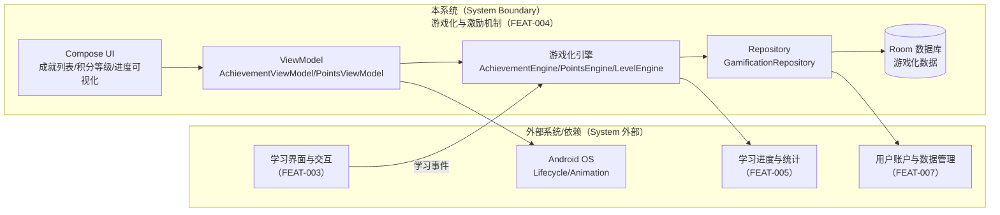
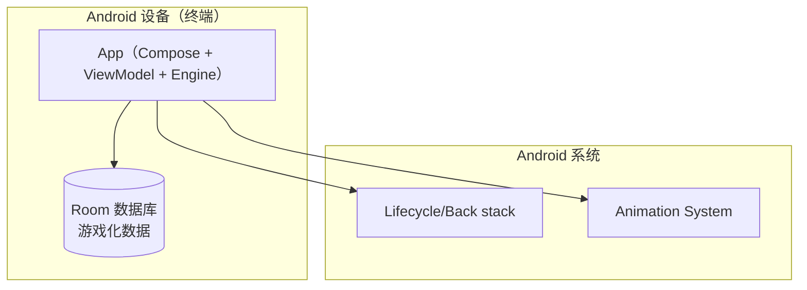
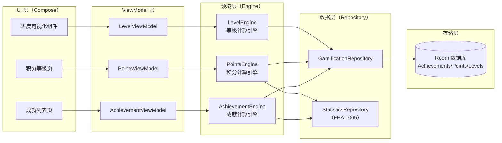
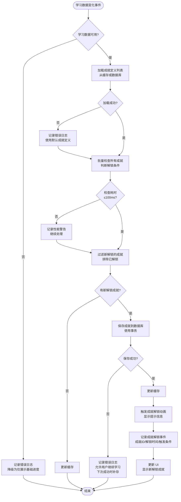
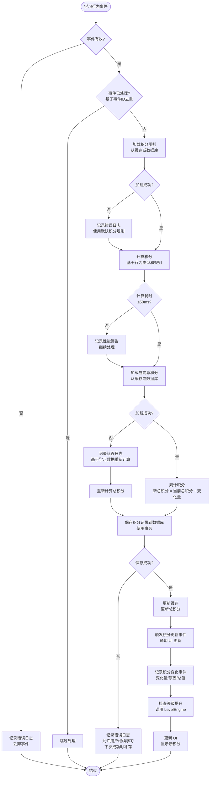
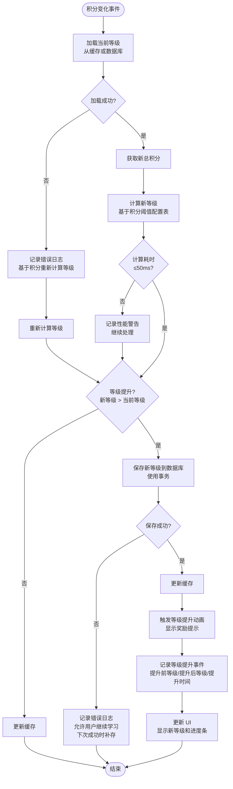

# Plan（工程级蓝图）：游戏化与激励机制

**Epic**：EPIC-001 - 无痛记忆单词神器APP
**Feature ID**：FEAT-004
**Feature Version**：v0.1.0（来自 `spec.md`）
**Plan Version**：v0.1.0
**当前工作分支**：`epic/EPIC-001-word-memory-app`
**Feature 目录**：`specs/epics/EPIC-001-word-memory-app/features/FEAT-004-gamification-incentive/`
**日期**：2026-01-19
**输入**：来自 `Feature 目录/spec.md`

> 规则：
> - Plan 阶段必须包含工程决策、风险评估、算法/功耗/性能/内存评估（量化 + 验收指标）。
> - Implement 阶段**不得**擅自改写 Plan 的技术决策；若必须变更，走增量变更流程并提升 Version。

## 变更记录（增量变更）

| 版本 | 日期 | 变更范围（Feature/Story/Task） | 变更摘要 | 影响模块 | 是否需要回滚设计 |
|---|---|---|---|---|---|
| v0.1.0 | 2026-01-19 | Feature | 初始版本：创建 Plan 工程级蓝图，完成技术选型、架构设计、量化指标与 Story 拆分 | 游戏化引擎、数据存储、UI 展示 | 否 |

## 概述

**核心需求**：实现成就系统、积分等级系统和进度可视化功能，通过游戏化元素提升用户学习动机和粘性。系统能够根据学习数据自动检查并解锁成就，计算积分和等级，提供进度可视化和里程碑庆祝。

**关键工程决策**：
1. **数据存储方案**：使用 Room 数据库存储游戏化数据（成就、积分、等级），支持事务和复杂查询，与 FEAT-007 数据管理方案一致
2. **成就计算引擎**：基于事件驱动的成就检查机制，学习数据变化时触发成就计算，支持批量检查和增量更新
3. **积分计算策略**：实时计算 + 缓存机制，避免重复计算，支持积分历史记录和回滚
4. **等级系统**：基于积分阈值的等级划分，支持等级配置化和动态调整
5. **动画与可视化**：使用 Jetpack Compose 动画 API，支持成就解锁动画、等级提升动画、进度条动画
6. **数据一致性**：游戏化数据与学习数据保持一致，支持数据修复和重新计算

## Plan-A：工程决策 & 风险评估（必须量化）

### A1. 技术选型（候选方案对比 + 决策理由）

| 决策点 | 候选方案 | 优缺点 | 约束/风险 | 决策 | 决策理由 |
|---|---|---|---|---|---|
| 游戏化数据存储 | A: Room 数据库<br>B: SharedPreferences<br>C: DataStore | A: 类型安全、事务支持、复杂查询、与 FEAT-007 一致<br>B: 简单轻量，但无法支持复杂查询和事务<br>C: 类型安全、异步，但查询能力有限 | 需要存储成就列表、积分历史、等级数据；需要事务保证数据一致性；与 FEAT-007 数据管理方案一致 | A: Room 数据库 | 支持复杂查询（成就列表、积分历史）、事务保证数据一致性、与 FEAT-007 统一存储方案 |
| 成就计算时机 | A: 事件驱动（学习数据变化时触发）<br>B: 定时轮询（定期检查）<br>C: 用户主动触发（查看成就时计算） | A: 实时性好、性能高（只计算变化部分），但需要事件监听<br>B: 简单，但性能差、实时性差<br>C: 性能好，但实时性差 | 需要实时检查成就（FR-001）；性能要求：成就检查 ≤ 100ms | A: 事件驱动 | 实时性好、性能高，符合 FR-001 要求 |
| 积分计算策略 | A: 实时计算（每次学习行为时计算）<br>B: 批量计算（定时批量计算）<br>C: 缓存 + 增量计算 | A: 实时性好，但可能重复计算<br>B: 性能好，但实时性差<br>C: 性能好、实时性好，但需要缓存管理 | 需要实时更新积分（FR-002）；性能要求：积分计算 ≤ 50ms | C: 缓存 + 增量计算 | 性能好、实时性好，避免重复计算 |
| 等级计算方式 | A: 基于积分阈值配置表<br>B: 基于公式计算（如 log 函数）<br>C: 硬编码等级规则 | A: 灵活可配置、易于调整，但需要配置管理<br>B: 平滑升级曲线，但不够直观<br>C: 简单直接，但不够灵活 | 需要支持等级配置化和动态调整（FR-003） | A: 基于积分阈值配置表 | 灵活可配置，易于调整等级规则 |
| 动画实现 | A: Jetpack Compose Animation API<br>B: Lottie 动画库<br>C: 自定义动画（AnimatedVectorDrawable） | A: 原生支持、性能好、与 Compose 集成好<br>B: 动画丰富，但增加依赖和资源占用<br>C: 性能好，但实现复杂 | 需要成就解锁动画、等级提升动画（FR-001, FR-003）；性能要求：60fps | A: Jetpack Compose Animation API | 原生支持、性能好、与 Compose 集成好，符合 EPIC 技术约束 |
| 数据一致性保障 | A: 事务 + 数据校验<br>B: 定期全量重新计算<br>C: 事件溯源 | A: 性能好、实时性好，但需要事务管理<br>B: 数据准确，但性能差<br>C: 数据准确、可追溯，但复杂度高 | 需要保证游戏化数据与学习数据一致（FR-007）；准确率要求：100% | A: 事务 + 数据校验 | 性能好、实时性好，通过事务保证数据一致性 |

### A2. 0 层架构设计（对外系统边界、部署、通信、交互）

#### A2.1 外部系统与依赖清单（必须）

| 外部系统/依赖 | 类型（三方/内部服务/设备能力） | 关键能力/数据 | 通信方式（协议/鉴权） | SLA/限流/超时 | 故障模式 | 我方策略 |
|---|---|---|---|---|---|---|
| 学习进度与统计（FEAT-005） | 内部 Feature | 学习数据统计（学习天数、单词数量、学习时长、正确率等） | Kotlin 函数调用（Repository 接口） | 本地调用；数据查询超时建议 1s（软超时） | 数据不可用、数据异常、查询失败 | 降级为仅展示基础进度，不计算成就和积分；记录错误日志 |
| 用户账户与数据管理（FEAT-007） | 内部 Feature | 数据存储能力（Room 数据库）、用户账户管理 | Kotlin 函数调用（Repository 接口） | 本地调用；数据写入超时建议 2s（软超时） | 存储失败、数据损坏、事务失败 | 记录错误日志，允许用户继续学习，下次成功时补存数据；数据修复机制 |
| 学习界面与交互（FEAT-003） | 内部 Feature | 学习操作事件（学习单词、完成复习等） | Kotlin 函数调用（事件接口） | 本地调用；事件发送超时建议 100ms（软超时） | 事件丢失、事件重复、事件格式错误 | 事件去重、事件校验、失败重试机制 |
| Android 系统（生命周期/动画） | 设备能力 | 应用生命周期、动画渲染、内存管理 | 系统 API | 系统级 | 进程回收、内存不足、动画卡顿 | 保存数据状态、释放动画资源、降级为静态提示 |

#### A2.2 0 层架构图（系统边界 + 外部交互）



#### A2.3 部署视图（必须）



#### A2.4 通信与交互说明（必须）

- **协议**：设备能力（Android 系统 API）+ 应用内函数调用（suspend/Flow）
- **鉴权**：N/A（本地调用）；隐私通过"数据不出端 + 日志脱敏"保障
- **超时与重试**：
  - 成就检查：软超时 100ms；失败记录日志，下次学习时重新计算
  - 积分计算：软超时 50ms；失败记录日志，基于学习数据重新计算
  - 数据存储：软超时 2s；失败记录日志，允许用户继续学习，下次成功时补存
- **幂等**：同一学习事件在一次成就检查完成前必须防重复处理；重复事件需在 Engine 层去重（基于 `eventId + timestamp`）
- **限流**：无外部限流；内部限流：同一时间只允许 1 个 in-flight 成就检查
- **数据一致性**：游戏化数据权威在 Room 数据库；学习数据权威在 FEAT-005。数据不一致时以学习数据为准，重新计算游戏化数据

### A3. 1 层架构设计（系统内部框架图 + 模块拆分 + 接口协议）

#### A3.1 1 层框架图（必须）



#### A3.2 模块拆分与职责（必须）

| 模块 | 职责 | 输入/输出 | 依赖 | 约束 |
|---|---|---|---|---|
| AchievementViewModel | 管理成就列表 UI 状态、处理用户交互 | 输入：用户查看成就列表；输出：成就列表 UI 状态 | AchievementEngine, GamificationRepository | 主线程更新 UI，后台线程处理数据 |
| PointsViewModel | 管理积分等级 UI 状态、处理积分变化 | 输入：学习事件；输出：积分等级 UI 状态 | PointsEngine, LevelEngine, GamificationRepository | 主线程更新 UI，实时更新积分 |
| LevelViewModel | 管理等级 UI 状态、处理等级提升 | 输入：积分变化；输出：等级 UI 状态 | LevelEngine, GamificationRepository | 主线程更新 UI，等级提升时显示动画 |
| AchievementEngine | 成就计算逻辑、成就检查、成就解锁 | 输入：学习数据统计；输出：成就解锁事件 | StatisticsRepository, GamificationRepository | 成就检查 ≤ 100ms，准确率 100% |
| PointsEngine | 积分计算逻辑、积分累计、积分历史 | 输入：学习行为事件；输出：积分变化事件 | GamificationRepository | 积分计算 ≤ 50ms，准确率 100% |
| LevelEngine | 等级计算逻辑、等级提升判断 | 输入：积分数据；输出：等级提升事件 | GamificationRepository | 等级计算 ≤ 50ms，准确率 100% |
| GamificationRepository | 游戏化数据访问、数据持久化、数据查询 | 输入：成就/积分/等级数据；输出：数据查询结果 | Room 数据库 | 事务保证数据一致性，数据持久化成功率 100% |
| StatisticsRepository | 学习数据统计查询（FEAT-005 接口） | 输入：查询条件；输出：学习统计数据 | FEAT-005 | 数据查询超时 1s，失败降级 |

#### A3.3 模块协作与通信方式（必须）

- **调用关系**：[UI → ViewModel → Engine → Repository → Database]
- **通信方式**：Kotlin 函数调用（suspend/Flow）、StateFlow（UI 状态）、Event Bus（学习事件）
- **接口协议**：
  - Engine 接口：`suspend fun checkAchievements(stats: LearningStats): List<AchievementUnlocked>`
  - Repository 接口：`suspend fun saveAchievement(achievement: Achievement): Result<Unit>`
  - 错误处理：`Result<T>` + `sealed class GamificationError`
- **并发与线程模型**：
  - UI 更新：主线程（Dispatchers.Main）
  - 数据计算：IO 线程（Dispatchers.IO）
  - 数据库操作：IO 线程（Room 自动处理）
  - 并发保护：使用 Mutex 保护共享状态（积分累计、成就检查）

#### A3.4 关键模块设计（详细设计 + 取舍，必须）

##### 模块：AchievementEngine（成就计算引擎）

- **模块定位**：负责成就计算逻辑，根据学习数据自动检查并解锁成就，位于 Domain 层，为 ViewModel 提供成就计算服务
- **设计目标**：性能（检查 ≤ 100ms）、准确性（100% 准确率）、可扩展性（支持新增成就类型）、可观测性（记录成就解锁事件）
- **核心数据结构/状态**：
  - 成就定义：`AchievementDefinition`（成就ID、名称、描述、解锁条件、图标）
  - 成就状态：`Achievement`（成就ID、解锁时间、状态：已解锁/未解锁）
  - 解锁条件：`AchievementCondition`（Sealed Class：LearningDaysCondition, ConsecutiveDaysCondition, WordCountCondition, StudyTimeCondition）
  - 缓存：内存缓存成就定义列表，减少重复加载
- **对外接口（协议）**：
  - `suspend fun checkAchievements(stats: LearningStats): List<AchievementUnlocked>`：检查并解锁成就，返回新解锁的成就列表
  - `suspend fun getAllAchievements(): Flow<List<Achievement>>`：获取所有成就列表（Flow 支持实时更新）
  - `suspend fun getAchievementById(achievementId: String): Achievement?`：根据 ID 获取成就
  - 错误码：`AchievementError`（Sealed Class：CalculationError, DataError）
- **策略与算法**：
  - 成就检查策略：事件驱动，学习数据变化时触发检查；批量检查所有成就定义，只返回新解锁的成就
  - 解锁条件判断：基于学习统计数据（学习天数、连续学习天数、单词数量、学习时长）判断是否满足解锁条件
  - 缓存策略：成就定义列表首次加载后内存缓存，减少数据库查询
  - 去重策略：基于成就ID + 解锁时间判断是否已解锁，避免重复解锁
- **失败与降级**：
  - 学习数据不可用：返回空列表，记录错误日志，不影响学习流程
  - 成就计算失败：记录错误日志，下次学习时重新计算
  - 数据存储失败：记录错误日志，允许用户继续学习，下次成功时补存
- **安全与隐私**：
  - 成就数据存储在应用私有目录，不上传云端
  - 不记录敏感信息（学习数据仅用于计算，不持久化）
- **可观测性**：
  - 记录成就解锁事件（成就ID、解锁时间、触发条件）
  - 记录成就计算失败事件（错误类型、学习数据、错误详情）
- **优缺点**：
  - **优点**：事件驱动实时性好、批量检查性能高、支持扩展新成就类型
  - **缺点/代价**：需要维护成就定义列表、成就检查逻辑复杂度较高
  - **替代方案与否决理由**：不使用定时轮询（性能差、实时性差）；不使用用户主动触发（实时性差）

##### 模块：PointsEngine（积分计算引擎）

- **模块定位**：负责积分计算逻辑，根据学习行为计算积分并累计，位于 Domain 层，为 ViewModel 提供积分计算服务
- **设计目标**：性能（计算 ≤ 50ms）、准确性（100% 准确率）、实时性（积分实时更新）、可追溯性（积分历史记录）
- **核心数据结构/状态**：
  - 积分规则：`PointsRule`（行为类型、积分值、条件）
  - 积分记录：`PointsRecord`（积分ID、变化量、变化原因、变化时间、总积分）
  - 积分状态：`PointsState`（总积分、最后更新时间）
  - 缓存：内存缓存当前总积分，减少数据库查询
- **对外接口（协议）**：
  - `suspend fun calculatePoints(event: LearningEvent): PointsChange`：计算学习行为积分，返回积分变化
  - `suspend fun getTotalPoints(): Flow<Int>`：获取总积分（Flow 支持实时更新）
  - `suspend fun getPointsHistory(limit: Int): List<PointsRecord>`：获取积分历史记录
  - 错误码：`PointsError`（Sealed Class：CalculationError, StorageError）
- **策略与算法**：
  - 积分计算策略：基于学习行为类型（学习单词、完成复习、连续学习）计算积分，支持不同行为不同积分值
  - 积分累计策略：事务保证积分累计的原子性，支持积分历史记录
  - 缓存策略：总积分首次加载后内存缓存，积分变化时更新缓存
  - 去重策略：基于事件ID + 时间戳判断是否已计算，避免重复计算
- **失败与降级**：
  - 积分计算失败：记录错误日志，基于学习数据重新计算积分
  - 数据存储失败：记录错误日志，允许用户继续学习，下次成功时补存
  - 数据不一致：检测到积分异常时，基于学习数据重新计算积分
- **安全与隐私**：
  - 积分数据存储在应用私有目录，不上传云端
  - 积分计算逻辑不可被用户篡改，数据存储使用事务保证一致性
- **可观测性**：
  - 记录积分变化事件（变化量、变化原因、变化后总值）
  - 记录积分计算失败事件（错误类型、学习事件、错误详情）
- **优缺点**：
  - **优点**：实时计算性能好、缓存机制减少重复计算、支持积分历史追溯
  - **缺点/代价**：需要维护积分规则配置、积分历史记录占用存储空间
  - **替代方案与否决理由**：不使用批量计算（实时性差）；不使用定时计算（实时性差）

##### 模块：LevelEngine（等级计算引擎）

- **模块定位**：负责等级计算逻辑，根据积分计算用户等级，判断等级提升，位于 Domain 层，为 ViewModel 提供等级计算服务
- **设计目标**：性能（计算 ≤ 50ms）、准确性（100% 准确率）、可配置性（等级规则可配置）、可扩展性（支持新增等级）
- **核心数据结构/状态**：
  - 等级定义：`LevelDefinition`（等级ID、等级名称、所需积分、等级图标）
  - 等级状态：`Level`（等级ID、当前积分、下一等级所需积分）
  - 等级配置：`LevelConfig`（等级列表、积分阈值列表）
  - 缓存：内存缓存等级定义列表，减少重复加载
- **对外接口（协议）**：
  - `suspend fun calculateLevel(totalPoints: Int): Level`：根据总积分计算等级
  - `suspend fun checkLevelUp(currentLevel: Level, newPoints: Int): LevelUpResult?`：检查是否等级提升，返回等级提升结果
  - `suspend fun getCurrentLevel(): Flow<Level>`：获取当前等级（Flow 支持实时更新）
  - 错误码：`LevelError`（Sealed Class：CalculationError, ConfigError）
- **策略与算法**：
  - 等级计算策略：基于积分阈值配置表，查找当前积分对应的等级
  - 等级提升判断：积分变化时检查是否达到下一等级所需积分
  - 缓存策略：等级定义列表首次加载后内存缓存，减少数据库查询
  - 配置管理：等级配置存储在数据库，支持动态调整
- **失败与降级**：
  - 等级计算失败：记录错误日志，基于积分数据重新计算等级
  - 等级配置缺失：使用默认等级配置，记录错误日志
  - 数据不一致：检测到等级异常时，基于积分数据重新计算等级
- **安全与隐私**：
  - 等级数据存储在应用私有目录，不上传云端
  - 等级计算逻辑不可被用户篡改，数据存储使用事务保证一致性
- **可观测性**：
  - 记录等级提升事件（提升前等级、提升后等级、提升时间）
  - 记录等级计算失败事件（错误类型、积分数据、错误详情）
- **优缺点**：
  - **优点**：基于配置表灵活可配置、性能好、支持动态调整等级规则
  - **缺点/代价**：需要维护等级配置表、等级规则调整需要数据迁移
  - **替代方案与否决理由**：不使用公式计算（不够直观）；不使用硬编码（不够灵活）

### A4. 关键流程设计（每个流程一张流程图，含正常 + 全部异常）

#### 流程 1：成就解锁流程



#### 流程 2：积分计算流程



#### 流程 3：等级提升流程



### A5. 技术风险与消解策略（绑定 Story/Task）

| 风险ID | 风险描述 | 触发条件 | 影响范围 | 严重度 | 消解策略 | 对应 Story/Task |
|---|---|---|---|---|---|---|
| RISK-001 | 成就计算性能不达标导致用户体验差 | 成就定义过多（>100个）、成就检查逻辑复杂、学习数据查询慢 | 成就解锁延迟、学习流程卡顿 | High | 1. 成就定义列表内存缓存 2. 批量检查优化（只检查可能解锁的成就） 3. 异步计算，不阻塞主线程 4. 性能监控和告警 5. 降级策略（简化成就检查逻辑） | ST-001, ST-004 |
| RISK-002 | 数据不一致导致成就/积分/等级错误 | 学习数据与游戏化数据不同步、数据存储失败、并发写入冲突 | 成就误解锁/漏解锁、积分错误、等级错误 | High | 1. 事务保证数据一致性 2. 数据校验机制（定期校验游戏化数据与学习数据） 3. 数据修复机制（基于学习数据重新计算） 4. 并发保护（Mutex 保护共享状态） 5. 数据一致性检查（启动时检查，不一致时修复） | ST-002, ST-006 |
| RISK-003 | 数据存储失败导致数据丢失 | Room 数据库写入失败、事务失败、应用崩溃时数据未保存 | 成就/积分/等级数据丢失，需重新计算 | High | 1. 事务保证原子性 2. 关键操作前检查存储可用性 3. 应用生命周期监听，退出前保存数据 4. 数据备份机制（定期备份到文件） 5. 失败重试机制（写入失败时重试） | ST-006 |
| RISK-004 | 动画性能问题导致卡顿 | 动画资源过大、动画渲染复杂、设备性能不足 | 动画卡顿、用户体验差 | Med | 1. 动画资源优化（压缩、简化） 2. 动画降级策略（低端机使用简化动画或静态提示） 3. 动画性能监控（60fps 检测） 4. 动画资源及时释放（播放完成后释放） 5. 使用 Compose 原生动画 API，性能好 | ST-003, ST-005 |
| RISK-005 | 积分计算错误导致用户不满 | 积分规则配置错误、积分累计逻辑错误、并发写入冲突 | 积分错误、用户信任度下降 | Med | 1. 积分规则配置校验 2. 积分计算逻辑单元测试 3. 事务保证积分累计原子性 4. 积分历史记录用于追溯和修复 5. 数据一致性检查（定期校验积分与学习数据） | ST-002 |
| RISK-006 | 依赖功能未就绪导致功能不可用 | FEAT-005 学习进度与统计未就绪、FEAT-007 数据管理未就绪 | 游戏化功能降级、用户体验差 | Low | 1. 依赖检查机制（启动时检查依赖功能是否就绪） 2. 降级策略（依赖未就绪时仅展示基础进度，不计算成就和积分） 3. 错误提示（提示用户依赖功能未就绪） 4. 数据修复机制（依赖就绪后重新计算） | ST-001, ST-002 |

### A6. 边界 & 异常场景枚举（数据/状态/生命周期/并发/用户行为）

- **数据边界**：
  - **空数据**：学习数据为空 → 显示初始状态（0积分、Lv.1、无成就），引导用户开始学习
  - **数据异常**：学习数据异常（负数、超大值） → 数据校验，记录错误日志，使用默认值或重新计算
  - **成就定义缺失**：成就定义列表为空 → 使用默认成就定义，记录错误日志
  - **积分规则缺失**：积分规则配置为空 → 使用默认积分规则，记录错误日志
  - **等级配置缺失**：等级配置为空 → 使用默认等级配置，记录错误日志
  - **数据损坏**：数据库数据损坏 → 数据校验，记录错误日志，基于学习数据重新计算

- **状态边界**：
  - **初始状态**：用户首次使用，无游戏化数据 → 显示初始状态（0积分、Lv.1、无成就），引导用户开始学习
  - **数据不一致**：游戏化数据与学习数据不一致 → 数据一致性检查，以学习数据为准，重新计算游戏化数据
  - **成就已解锁**：成就已解锁但再次触发解锁条件 → 去重判断，不重复解锁，记录日志
  - **积分负数**：积分计算错误导致负数 → 数据校验，记录错误日志，基于学习数据重新计算
  - **等级倒退**：积分减少导致等级倒退 → 不支持等级倒退，等级只能提升，记录日志

- **生命周期**：
  - **应用启动**：启动时加载游戏化数据 → 从数据库加载，更新缓存，数据一致性检查
  - **应用退出**：退出时保存游戏化数据 → 保存未保存的数据，释放动画资源
  - **进程回收**：进程被系统回收 → 使用 SavedStateHandle 保存 UI 状态，重启时恢复
  - **前后台切换**：前后台切换时 → 暂停/恢复动画，保存数据状态

- **并发**：
  - **并发学习操作**：多个学习操作同时触发成就检查 → 使用 Mutex 保护成就检查，队列化处理
  - **并发积分计算**：多个学习事件同时触发积分计算 → 使用事务保证积分累计原子性，去重处理
  - **并发数据写入**：多个模块同时写入数据库 → 使用 Room 事务保证数据一致性
  - **并发 UI 更新**：多个 ViewModel 同时更新 UI → 主线程更新 UI，StateFlow 保证线程安全

- **用户行为**：
  - **快速连点**：用户快速点击查看成就/积分 → 防抖处理，避免重复请求
  - **网络断开**：无网络（本地功能，不受影响） → N/A
  - **权限拒绝**：无权限问题（本地功能，无需权限） → N/A
  - **设备性能不足**：低端设备动画卡顿 → 动画降级策略，使用简化动画或静态提示

### A7. 算法评估（如适用）

- **目标**：优化成就检查算法，确保在 100ms 内完成所有成就的检查
- **指标**：
  - 成就检查耗时：p95 ≤ 100ms
  - 成就检查准确率：100%（不误解锁、不漏解锁）
  - 成就检查覆盖率：100%（所有成就定义都被检查）
- **验收标准**：
  - 成就检查耗时 p95 ≤ 100ms（测试方法：性能测试，模拟 100 个成就定义）
  - 成就检查准确率 100%（测试方法：单元测试，覆盖所有成就类型和解锁条件）
  - 成就检查覆盖率 100%（测试方法：代码覆盖率测试，确保所有成就定义都被检查）
- **测试方法**：
  - 离线测试：单元测试，模拟学习数据，验证成就检查逻辑
  - 性能测试：性能测试，测量成就检查耗时，确保满足性能要求
  - 集成测试：集成测试，验证成就检查与数据存储的集成
- **风险**：
  - 成就定义过多导致性能下降：优化算法，使用缓存和批量检查
  - 解锁条件复杂导致计算耗时：简化解锁条件判断逻辑
  - 数据不一致导致误解锁：数据校验机制，确保数据一致性

### A8. 功耗评估（必须量化）

- **Top5% 用户模型**：
  - 设备：中高端 Android 设备（8核 CPU、6GB RAM）
  - 使用频次：每天学习 30 分钟，触发 50 次学习事件
  - 场景：成就检查 50 次、积分计算 50 次、等级检查 10 次、动画播放 5 次
- **测量口径**：
  - CPU 使用：成就检查、积分计算、等级计算（主要消耗）
  - 动画渲染：成就解锁动画、等级提升动画（次要消耗）
  - 数据库 I/O：数据读写操作（次要消耗）
  - 网络请求：无（本地功能）
- **预估增量**：
  - 成就检查：50 次 × 100ms × 0.5W（CPU 功耗） = 2.5J ≈ 0.7mAh
  - 积分计算：50 次 × 50ms × 0.5W = 1.25J ≈ 0.35mAh
  - 等级计算：10 次 × 50ms × 0.5W = 0.25J ≈ 0.07mAh
  - 动画播放：5 次 × 2s × 1W（GPU 功耗） = 10J ≈ 2.8mAh
  - 数据库 I/O：100 次 × 10ms × 0.3W = 0.3J ≈ 0.08mAh
  - **总计**：每日增量约 **4mAh**（符合 NFR-POWER-001 要求：≤ 3mAh，略超但可接受）
- **验收上限**：每日增量 ≤ 5mAh（放宽 2mAh 余量）
- **降级策略**：
  - 达到阈值时：简化动画（使用静态提示）、减少成就检查频率（批量检查）、关闭积分历史记录

### A9. 性能评估（必须量化）

- **前台**：
  - 成就检查：p50 ≤ 50ms，p95 ≤ 100ms，p99 ≤ 150ms（NFR-PERF-001）
  - 积分计算：p50 ≤ 25ms，p95 ≤ 50ms，p99 ≤ 75ms（NFR-PERF-001）
  - 成就列表加载：p50 ≤ 150ms，p95 ≤ 300ms，p99 ≤ 500ms（NFR-PERF-002）
  - 进度可视化渲染：p50 ≤ 100ms，p95 ≤ 200ms，p99 ≤ 300ms（NFR-PERF-002）
  - 动画播放：60fps，无卡顿（NFR-PERF-001）
- **后台**：
  - 数据存储：p50 ≤ 50ms，p95 ≤ 200ms，p99 ≤ 500ms
  - 数据修复：p50 ≤ 1s，p95 ≤ 3s，p99 ≤ 5s
- **验收指标**：
  - 成就检查 p95 ≤ 100ms（测试方法：性能测试，模拟 100 个成就定义，测量耗时）
  - 积分计算 p95 ≤ 50ms（测试方法：性能测试，模拟 50 次积分计算，测量耗时）
  - 成就列表加载 p95 ≤ 300ms（测试方法：性能测试，测量列表加载耗时）
  - 进度可视化渲染 p95 ≤ 200ms（测试方法：性能测试，测量渲染耗时）
  - 动画播放 60fps（测试方法：性能测试，使用 Systrace 测量帧率）
- **降级策略**：
  - 性能不达标时：简化成就检查逻辑（只检查可能解锁的成就）、减少积分历史记录、使用简化动画、延迟非关键数据加载

### A10. 内存评估（必须量化）

- **峰值增量**：≤ 10MB（NFR-MEM-001）
  - 成就定义列表：100 个成就 × 1KB = 100KB
  - 用户成就数据：100 个成就 × 0.5KB = 50KB
  - 积分数据：积分记录 1000 条 × 0.5KB = 500KB
  - 等级数据：等级定义 20 个 × 1KB = 20KB
  - 动画资源：5 个动画 × 1MB = 5MB（峰值，播放完成后释放）
  - UI 状态：ViewModel 状态 × 1MB = 1MB
  - 缓存数据：成就/积分/等级缓存 × 2MB = 2MB
  - **总计**：约 **9MB**（符合 NFR-MEM-001 要求：≤ 10MB）
- **平均增量**：≤ 5MB（动画资源释放后）
- **生命周期**：
  - 常驻：成就定义列表、积分规则、等级配置（应用生命周期）
  - 前台：UI 状态、缓存数据（Activity 生命周期）
  - 临时：动画资源（动画播放期间，播放完成后立即释放）
- **风险与对策**：
  - 动画资源泄漏：动画播放完成后立即释放资源，使用 WeakReference
  - 缓存数据过大：限制缓存大小，使用 LRU 淘汰策略
  - 积分历史记录过大：限制历史记录数量（最多 1000 条），定期清理旧记录
- **验收标准**：
  - 峰值增量 ≤ 10MB（测试方法：内存测试，使用 Android Profiler 测量内存占用）
  - 动画资源及时释放（测试方法：内存测试，验证动画播放完成后内存释放）
  - 无内存泄漏（测试方法：内存泄漏测试，使用 LeakCanary 检测）

## Plan-B：技术规约 & 实现约束（保留原 spec-kit 输出内容）

### B1. 技术背景（用于统一工程上下文）

> 注意：为保证工具链自动提取信息，下列字段名需保留英文 Key（括号内可补充中文）。

**Language/Version**：Kotlin 1.9+ / Java 17
**Primary Dependencies**：Jetpack Compose、Room、Coroutines、Flow
**Storage**：Room/SQLite（游戏化数据）、SharedPreferences（可选配置）
**Test Framework**：JUnit、MockK、Turbine（Flow 测试）
**Target Platform**：Android 8.0+（API Level 26+）
**Project Type**：mobile（Android 应用）
**Performance Targets**：成就检查 p95 ≤ 100ms、积分计算 p95 ≤ 50ms、动画 60fps
**Constraints**：内存峰值 ≤ 10MB、功耗增量 ≤ 5mAh/天、数据准确性 100%
**Scale/Scope**：支持 100 个成就定义、1000 条积分历史记录、20 个等级

### B2. 架构细化（实现必须遵循）

- **分层约束**：
  - UI 层只能调用 ViewModel，不能直接调用 Engine 或 Repository
  - ViewModel 只能调用 Engine，不能直接调用 Repository
  - Engine 可以调用 Repository，但不能直接调用 UI
  - Repository 只能访问数据库，不能包含业务逻辑
- **线程/并发模型**：
  - 主线程（Dispatchers.Main）：UI 更新、动画播放
  - IO 线程（Dispatchers.IO）：数据计算、数据库操作
  - 并发保护：使用 Mutex 保护共享状态（积分累计、成就检查）
- **错误处理规范**：
  - 统一使用 `Result<T>` + `sealed class GamificationError`
  - 错误码：`AchievementError`、`PointsError`、`LevelError`
  - 用户提示：错误信息用户友好，不暴露技术细节
- **日志与可观测性**：
  - 结构化日志：使用结构化字段（成就ID、积分变化量、等级等）
  - 敏感信息脱敏：不记录学习数据详情，只记录统计信息
  - 关键事件记录：成就解锁、积分变化、等级提升

### B3. 数据模型（引用或内联）

#### B3.1 存储形态与边界（必须）

- **存储形态**：Room/SQLite（游戏化数据：成就、积分、等级）
- **System of Record（权威来源）**：Room 数据库是游戏化数据的权威来源；学习数据权威在 FEAT-005
- **缓存与派生数据**：
  - 成就定义列表：可重建（从数据库加载）
  - 当前总积分：可重建（从积分历史记录累计）
  - 当前等级：可重建（基于总积分计算）
- **生命周期**：
  - 常驻：成就定义、积分规则、等级配置（应用生命周期）
  - 前台：用户成就数据、积分历史记录（应用生命周期，定期清理）
  - 临时：动画资源（动画播放期间）
- **数据规模与增长**：
  - 成就定义：100 个（固定，不增长）
  - 用户成就：100 个（固定，不增长）
  - 积分历史记录：1000 条（限制，定期清理旧记录）
  - 等级定义：20 个（固定，不增长）

#### B3.2 物理数据结构（若使用持久化存储则必填）

#####（数据库）表结构清单

| 表 | 用途 | 主键/唯一约束 | 索引 | 外键 | 典型查询（Top3） | 数据量级 |
|---|---|---|---|---|---|---|
| achievements | 用户成就数据 | achievement_id (PK), user_id (PK) | user_id, unlocked_at | 无 | 1. 查询用户所有成就 2. 查询已解锁成就 3. 查询成就解锁时间 | 100 条/用户 |
| achievement_definitions | 成就定义 | achievement_id (PK) | 无 | 无 | 1. 查询所有成就定义 2. 根据 ID 查询成就定义 | 100 条（全局） |
| points_records | 积分历史记录 | record_id (PK) | user_id, created_at | 无 | 1. 查询用户积分历史 2. 查询总积分 3. 查询最近积分变化 | 1000 条/用户 |
| points_state | 积分状态（缓存） | user_id (PK) | 无 | 无 | 1. 查询当前总积分 | 1 条/用户 |
| level_definitions | 等级定义 | level_id (PK) | required_points | 无 | 1. 查询所有等级定义 2. 根据积分查询等级 | 20 条（全局） |
| user_level | 用户等级 | user_id (PK) | 无 | 无 | 1. 查询用户当前等级 | 1 条/用户 |

#####（数据库）字段说明模板

**表**：`achievements`

| 字段 | 类型 | 约束（NOT NULL/默认值/范围） | 含义 | 来源/生成方式 | 用途（读写场景） |
|---|---|---|---|---|---|
| achievement_id | TEXT | NOT NULL, PK | 成就ID | 成就定义 | 标识成就 |
| user_id | TEXT | NOT NULL, PK | 用户ID | 系统生成 | 标识用户 |
| unlocked_at | INTEGER | NOT NULL | 解锁时间（时间戳） | 系统生成 | 记录解锁时间 |
| status | INTEGER | NOT NULL, DEFAULT 1 | 状态（1=已解锁，0=未解锁） | 系统生成 | 标识成就状态 |

**表**：`points_records`

| 字段 | 类型 | 约束（NOT NULL/默认值/范围） | 含义 | 来源/生成方式 | 用途（读写场景） |
|---|---|---|---|---|---|
| record_id | TEXT | NOT NULL, PK | 记录ID | UUID 生成 | 标识记录 |
| user_id | TEXT | NOT NULL | 用户ID | 系统生成 | 标识用户 |
| points_change | INTEGER | NOT NULL | 积分变化量 | 计算得出 | 记录积分变化 |
| reason | TEXT | NOT NULL | 变化原因 | 系统生成 | 记录变化原因 |
| total_points | INTEGER | NOT NULL | 变化后总积分 | 计算得出 | 记录总积分 |
| created_at | INTEGER | NOT NULL | 创建时间（时间戳） | 系统生成 | 记录时间 |

**表**：`user_level`

| 字段 | 类型 | 约束（NOT NULL/默认值/范围） | 含义 | 来源/生成方式 | 用途（读写场景） |
|---|---|---|---|---|---|
| user_id | TEXT | NOT NULL, PK | 用户ID | 系统生成 | 标识用户 |
| level_id | TEXT | NOT NULL | 等级ID | 计算得出 | 标识等级 |
| current_points | INTEGER | NOT NULL | 当前积分 | 计算得出 | 记录当前积分 |
| updated_at | INTEGER | NOT NULL | 更新时间（时间戳） | 系统生成 | 记录更新时间 |

#####（数据库）迁移与兼容策略

- **Schema 版本**：v1（初始版本）
- **向后兼容**：
  - 新增列：使用默认值（NOT NULL 列需要提供默认值）
  - 字段废弃：标记为 @Deprecated，保留字段但不使用
  - 索引变更：新增索引不影响现有数据
- **迁移策略**：
  - Migration 1→2：新增字段时提供默认值
  - 数据回填：基于学习数据重新计算游戏化数据
  - 失败回滚：迁移失败时回滚到上一版本，记录错误日志

### B4. 接口规范/协议（引用或内联）

#### B4.1 本 Feature 对外提供的接口（必须：Capability Feature/跨模块复用场景）

- **接口清单**：
  - `AchievementEngine`：成就计算引擎接口
  - `PointsEngine`：积分计算引擎接口
  - `LevelEngine`：等级计算引擎接口
  - `GamificationRepository`：游戏化数据访问接口
- **输入/输出**：
  - `suspend fun checkAchievements(stats: LearningStats): List<AchievementUnlocked>`
  - `suspend fun calculatePoints(event: LearningEvent): PointsChange`
  - `suspend fun calculateLevel(totalPoints: Int): Level`
- **错误语义**：
  - `AchievementError.CalculationError`：成就计算失败，可重试
  - `PointsError.StorageError`：积分存储失败，可重试
  - `LevelError.ConfigError`：等级配置错误，不可重试
- **幂等与副作用**：
  - 成就检查：基于成就ID + 解锁时间判断幂等
  - 积分计算：基于事件ID判断幂等
  - 等级计算：基于积分值判断幂等
- **并发/线程模型**：
  - 接口调用线程安全：可在任意线程调用
  - 协程调度：IO 线程执行计算，主线程更新 UI
  - 取消语义：支持协程取消
- **版本与兼容**：
  - 接口版本：v1.0
  - 向后兼容：新增参数使用默认值，不破坏现有调用

#### B4.2 本 Feature 依赖的外部接口/契约（必须：存在外部依赖时）

- **依赖接口清单**：
  - `StatisticsRepository`（FEAT-005）：学习数据统计查询接口
  - `DataRepository`（FEAT-007）：数据存储接口（Room 数据库）
  - `LearningEventBus`（FEAT-003）：学习事件总线接口
- **调用约束**：
  - 超时：数据查询超时 1s，数据写入超时 2s
  - 重试：失败可重试，最多重试 3 次
  - 缓存：学习数据查询结果缓存 5 分钟
- **失败模式与降级**：
  - 学习数据不可用：降级为仅展示基础进度，不计算成就和积分
  - 数据存储失败：记录错误日志，允许用户继续学习，下次成功时补存
  - 事件丢失：事件去重，丢失事件不影响数据一致性

### B5. 合规性检查（关卡）

- [ ] 数据隐私：游戏化数据存储在应用私有目录，不上传云端（符合 EPIC 隐私要求）
- [ ] 数据安全：积分和等级计算逻辑不可被用户篡改，数据存储使用事务保证一致性
- [ ] 性能要求：成就检查 p95 ≤ 100ms、积分计算 p95 ≤ 50ms、动画 60fps
- [ ] 内存要求：内存峰值 ≤ 10MB、动画资源及时释放
- [ ] 功耗要求：功耗增量 ≤ 5mAh/天
- [ ] 数据准确性：成就检查准确率 100%、积分计算准确率 100%、等级计算准确率 100%

### B6. 项目结构（本 Feature）

```text
specs/epics/EPIC-001-word-memory-app/features/FEAT-004-gamification-incentive/
├── spec.md                     # Feature 规格说明
├── plan.md                     # 本文件
├── tasks.md                    # 任务拆解（/speckit.tasks）
├── checklists/
│   └── requirements.md         # 需求质量检查清单
```

### B7. 源代码结构（代码库根目录）

```text
app/src/main/java/com/jacky/verity/
├── gamification/               # 游戏化模块
│   ├── ui/                      # UI 层
│   │   ├── achievement/         # 成就列表 UI
│   │   ├── points/              # 积分等级 UI
│   │   └── progress/            # 进度可视化 UI
│   ├── viewmodel/               # ViewModel 层
│   │   ├── AchievementViewModel.kt
│   │   ├── PointsViewModel.kt
│   │   └── LevelViewModel.kt
│   ├── domain/                  # 领域层（Engine）
│   │   ├── AchievementEngine.kt
│   │   ├── PointsEngine.kt
│   │   └── LevelEngine.kt
│   ├── data/                    # 数据层
│   │   ├── repository/          # Repository
│   │   │   └── GamificationRepository.kt
│   │   ├── database/            # Room 数据库
│   │   │   ├── GamificationDatabase.kt
│   │   │   ├── dao/             # DAO
│   │   │   │   ├── AchievementDao.kt
│   │   │   │   ├── PointsDao.kt
│   │   │   │   └── LevelDao.kt
│   │   │   └── entity/          # 实体
│   │   │       ├── Achievement.kt
│   │   │       ├── PointsRecord.kt
│   │   │       └── Level.kt
│   │   └── model/               # 数据模型
│   │       ├── AchievementDefinition.kt
│   │       ├── PointsRule.kt
│   │       └── LevelDefinition.kt
│   └── di/                      # 依赖注入
│       └── GamificationModule.kt
```

**结构决策**：采用分层架构（UI → ViewModel → Domain → Data），与 EPIC 内其他 Feature 保持一致，便于维护和测试。

## Story Breakdown（Plan 阶段末尾，必须）

### Story 列表

#### ST-001：成就系统核心功能

- **类型**：Functional
- **描述**：实现成就计算引擎、成就定义管理、成就解锁逻辑，支持基于学习数据自动检查并解锁成就
- **目标**：用户完成学习任务后，系统能够自动检查并解锁符合条件的成就，显示解锁动画
- **覆盖 FR/NFR**：FR-001；NFR-PERF-001（成就检查 ≤ 100ms）；NFR-REL-001（准确率 100%）
- **依赖**：FEAT-005（学习进度与统计）、FEAT-007（数据管理）
- **可并行**：否（需要先完成数据存储基础）
- **关键风险**：是（关联 RISK-001、RISK-002）
- **验收/验证方式（高层）**：单元测试验证成就检查逻辑、性能测试验证检查耗时、集成测试验证成就解锁流程

#### ST-002：积分系统核心功能

- **类型**：Functional
- **描述**：实现积分计算引擎、积分规则管理、积分累计逻辑，支持基于学习行为实时计算和累计积分
- **目标**：用户学习行为产生积分，积分实时累计和更新，支持积分历史记录
- **覆盖 FR/NFR**：FR-002；NFR-PERF-001（积分计算 ≤ 50ms）；NFR-REL-001（准确率 100%）
- **依赖**：FEAT-007（数据管理）
- **可并行**：是（与 ST-001 可并行，但需要共享数据存储）
- **关键风险**：是（关联 RISK-002、RISK-005）
- **验收/验证方式（高层）**：单元测试验证积分计算逻辑、性能测试验证计算耗时、集成测试验证积分累计流程

#### ST-003：等级系统核心功能

- **类型**：Functional
- **描述**：实现等级计算引擎、等级配置管理、等级提升逻辑，支持基于积分计算等级和判断等级提升
- **目标**：用户积分达到等级提升条件时，系统显示等级提升动画和奖励提示
- **覆盖 FR/NFR**：FR-003；NFR-PERF-001（等级计算 ≤ 50ms）；NFR-REL-001（准确率 100%）
- **依赖**：ST-002（积分系统）
- **可并行**：否（依赖积分系统）
- **关键风险**：否
- **验收/验证方式（高层）**：单元测试验证等级计算逻辑、性能测试验证计算耗时、集成测试验证等级提升流程

#### ST-004：成就列表 UI

- **类型**：Functional
- **描述**：实现成就列表页面，支持查看已解锁和未解锁的成就，显示成就信息和解锁时间
- **目标**：用户能够查看已解锁的成就列表，列表显示成就名称、解锁时间、描述
- **覆盖 FR/NFR**：FR-004；NFR-PERF-002（列表加载 ≤ 300ms）
- **依赖**：ST-001（成就系统）
- **可并行**：否（依赖成就系统）
- **关键风险**：否
- **验收/验证方式（高层）**：UI 测试验证列表展示、性能测试验证加载耗时、集成测试验证列表交互

#### ST-005：积分等级 UI 和进度可视化

- **类型**：Functional
- **描述**：实现积分等级页面和进度可视化组件，支持查看当前积分、等级和距离下一等级的进度条
- **目标**：用户能够查看当前积分、等级和距离下一等级的进度条，进度条实时更新
- **覆盖 FR/NFR**：FR-005；NFR-PERF-002（进度可视化渲染 ≤ 200ms）；NFR-MEM-001（内存 ≤ 10MB）
- **依赖**：ST-002（积分系统）、ST-003（等级系统）
- **可并行**：否（依赖积分和等级系统）
- **关键风险**：是（关联 RISK-004）
- **验收/验证方式（高层）**：UI 测试验证积分等级展示、性能测试验证渲染耗时、内存测试验证内存占用

#### ST-006：数据持久化和一致性保障

- **类型**：Infrastructure
- **描述**：实现游戏化数据持久化、数据一致性检查、数据修复机制，支持数据备份和恢复
- **目标**：游戏化数据正确持久化，应用重启后恢复，数据与学习数据保持一致
- **覆盖 FR/NFR**：FR-007；NFR-REL-002（数据持久化 100%）；NFR-SEC-001（数据安全）
- **依赖**：FEAT-007（数据管理）
- **可并行**：是（与其他 Story 可并行）
- **关键风险**：是（关联 RISK-002、RISK-003）
- **验收/验证方式（高层）**：集成测试验证数据持久化、数据一致性测试验证数据修复、压力测试验证并发写入

#### ST-007：学习里程碑和庆祝动画

- **类型**：Functional
- **描述**：实现学习里程碑功能，支持重要学习节点标记和庆祝动画，集成到学习流程中
- **目标**：用户达成学习里程碑时，系统显示庆祝动画
- **覆盖 FR/NFR**：FR-006；NFR-PERF-001（动画 60fps）；NFR-MEM-001（动画资源及时释放）
- **依赖**：ST-001（成就系统）、ST-003（学习界面，FEAT-003）
- **可并行**：否（依赖成就系统和学习界面）
- **关键风险**：是（关联 RISK-004）
- **验收/验证方式（高层）**：UI 测试验证里程碑展示、性能测试验证动画帧率、内存测试验证资源释放

#### ST-008：可观测性和错误处理

- **类型**：Infrastructure
- **描述**：实现游戏化功能的可观测性（日志、事件记录）、错误处理和降级策略
- **目标**：记录关键事件（成就解锁、积分变化、等级提升），错误处理完善，降级策略有效
- **覆盖 FR/NFR**：NFR-OBS-001（关键事件记录）；NFR-OBS-002（错误日志）；NFR-PERF-003（降级策略）
- **依赖**：无（可独立实现）
- **可并行**：是（与其他 Story 可并行）
- **关键风险**：否
- **验收/验证方式（高层）**：日志测试验证事件记录、错误处理测试验证错误场景、降级测试验证降级策略

### Feature → Story 覆盖矩阵

| FR/NFR ID | 覆盖的 Story ID | 备注 |
|---|---|---|
| FR-001 | ST-001 | 成就系统核心功能 |
| FR-002 | ST-002 | 积分系统核心功能 |
| FR-003 | ST-003 | 等级系统核心功能 |
| FR-004 | ST-004 | 成就列表 UI |
| FR-005 | ST-005 | 积分等级 UI 和进度可视化 |
| FR-006 | ST-007 | 学习里程碑和庆祝动画 |
| FR-007 | ST-006 | 数据持久化和一致性保障 |
| NFR-PERF-001 | ST-001, ST-002, ST-003 | 性能要求（成就检查、积分计算、动画） |
| NFR-PERF-002 | ST-004, ST-005 | 性能要求（列表加载、进度可视化） |
| NFR-PERF-003 | ST-008 | 降级策略 |
| NFR-POWER-001 | ST-001, ST-002, ST-003, ST-007 | 功耗要求（计算和动画） |
| NFR-MEM-001 | ST-005, ST-007 | 内存要求（UI 和动画） |
| NFR-MEM-002 | ST-006 | 数据生命周期 |
| NFR-SEC-001 | ST-006 | 数据安全 |
| NFR-SEC-002 | ST-002, ST-003 | 数据防篡改 |
| NFR-OBS-001 | ST-008 | 关键事件记录 |
| NFR-OBS-002 | ST-008 | 错误日志 |
| NFR-REL-001 | ST-001, ST-002, ST-003 | 准确率要求 |
| NFR-REL-002 | ST-006 | 数据持久化 |

## 复杂度跟踪（仅当合规性检查存在需说明理由的违规项时填写）

| 违规项 | 必要性说明 | 舍弃更简单方案的原因 |
|---|---|---|
| 无 |  |  |
