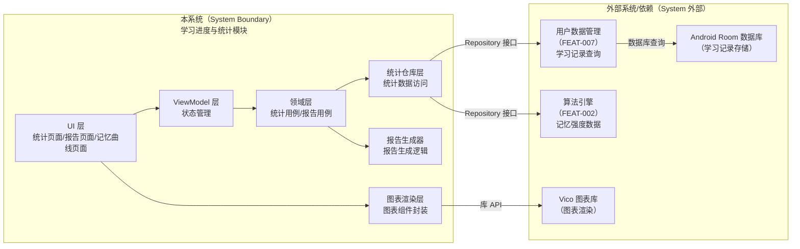
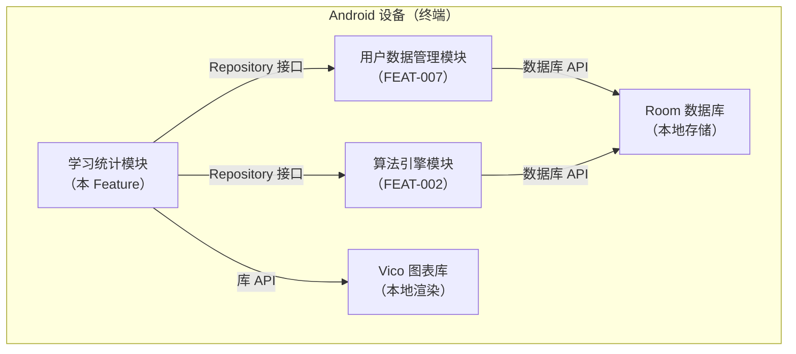
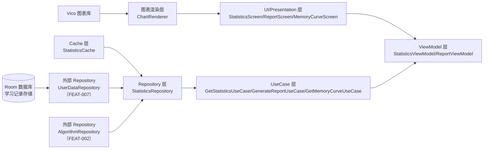
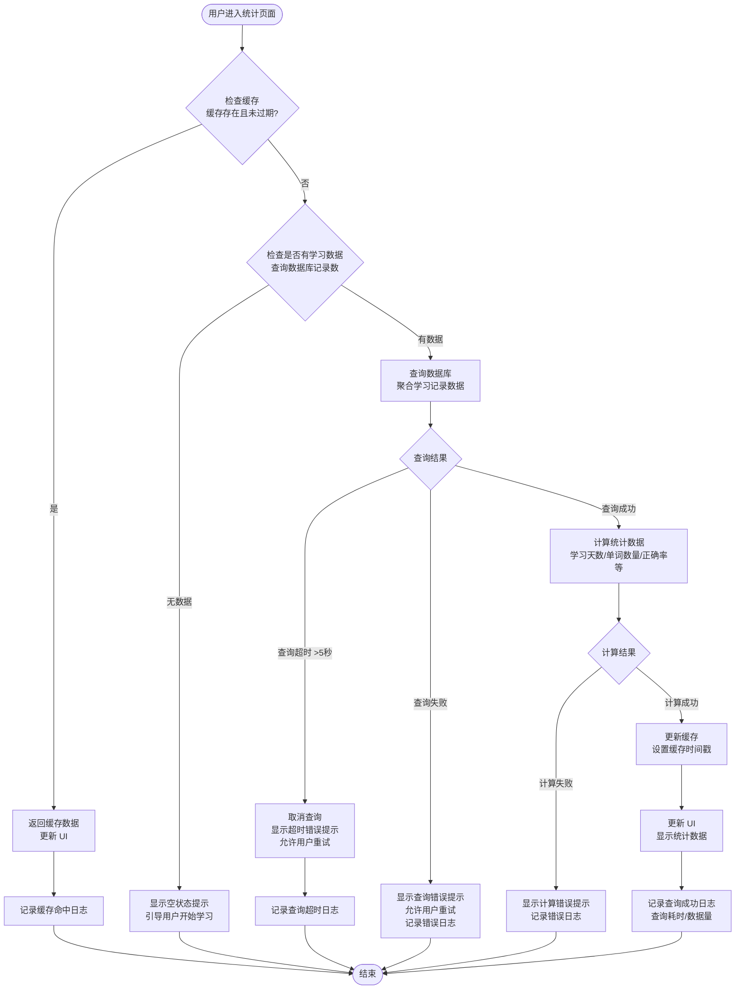
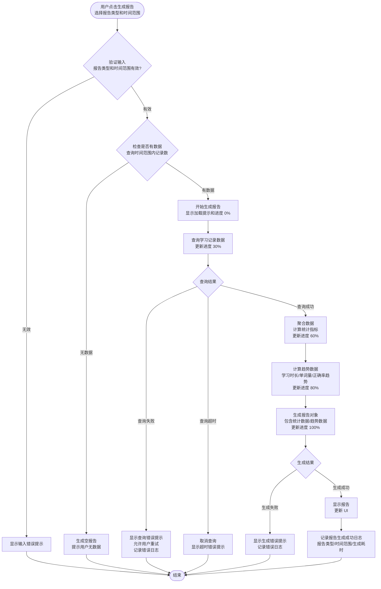
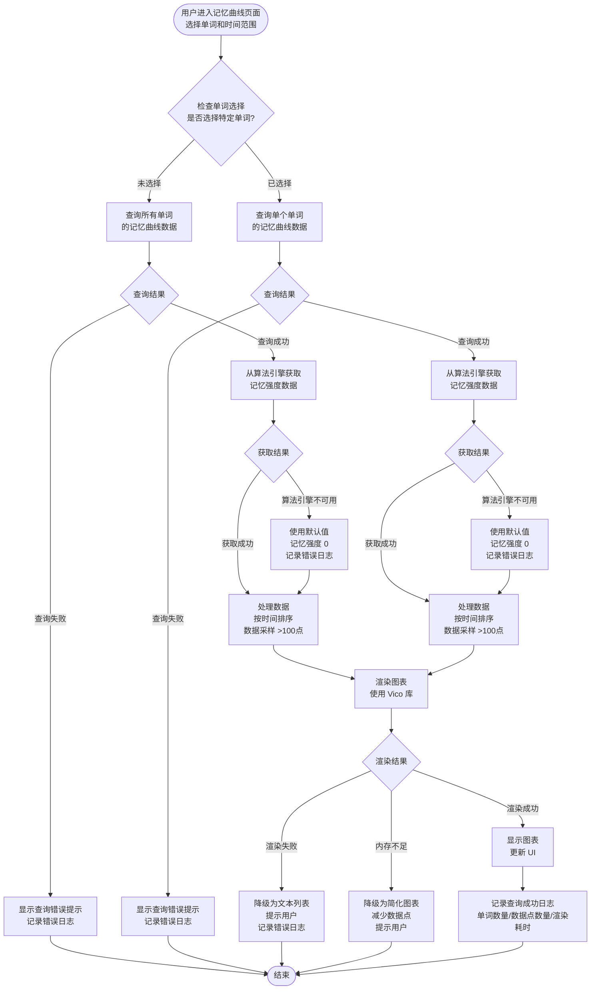

# Full Design：学习进度与统计

**Epic**：EPIC-001 - 无痛记忆单词神器APP
**Feature ID**：FEAT-005
**Feature Version**：v0.1.0
**Plan Version**：v0.1.0
**Tasks Version**：v0.1.0
**Full Design Version**：v0.1.0

**分支**：`epic/EPIC-001-word-memory-app`
**日期**：2026-01-19
**输入工件**：
- `spec.md`
- `plan.md`
- `tasks.md`

> Agent 规则（强制）：
> - 本文档**只能整合现有产物**（spec/plan/tasks 等），**不得新增技术决策**。
> - 若遇到决策缺口，只能标注为 `TODO(Clarify): ...` 并指向应补齐的来源文档/章节。
> - 本文档用于评审与执行：层次必须清晰、结构化、可追溯。

## 变更记录（增量变更）

| 版本 | 日期 | 变更范围（Feature/Story/Task） | 变更摘要 | 影响模块 | 是否需要回滚设计 |
|---|---|---|---|---|---|
| v0.1.0 | 2026-01-19 | Feature | 初始版本：整合 spec.md、plan.md、tasks.md 生成 Full Design 文档 |  | 否 |

## 1. 背景与范围（来自 spec.md）

- **背景**：
  - 用户需要了解自己的学习进度和效果，以便调整学习策略和保持学习动力
  - 现有应用缺乏详细的学习数据统计和可视化展示，用户难以直观了解学习成果
  - 学习统计是用户了解学习效果的重要渠道，需要独立实现以提供完整的数据跟踪能力
  - 记忆曲线展示能够帮助用户理解间隔重复算法的效果，增强学习信心

- **目标**：
  - **用户目标**：用户能够查看详细的学习进度和统计数据，了解学习效果和记忆保持情况
  - **业务目标**：通过数据可视化提升用户学习动机和粘性，增强产品竞争力
  - **平台目标**：建立学习数据统计和分析能力，为后续个性化推荐和优化提供数据基础

- **价值**：
  - **用户价值**：用户可以直观了解学习成果，通过数据反馈调整学习策略，增强学习成就感
  - **业务价值**：通过数据展示提升用户留存率和学习时长，形成用户粘性
  - **技术价值**：建立学习数据统计框架，为后续数据分析和个性化功能提供基础

- **In Scope**：
  - 学习数据统计（学习天数、学习单词数量、复习单词数量、正确率等）
  - 学习报告生成（日报、周报、月报，包含学习时长、单词数量、正确率趋势等）
  - 记忆曲线展示（展示单词记忆强度随时间的变化趋势）
  - 学习趋势分析（学习时长趋势、单词学习量趋势、正确率趋势）
  - 基础数据可视化（图表展示统计数据，如柱状图、折线图等）

- **Out of Scope**：
  - 详细的数据导出（不支持导出为 Excel、PDF 等格式）
  - 高级数据分析（不支持机器学习预测、个性化学习建议推荐）
  - 社交分享（不支持将统计数据分享到社交平台）
  - 多维度数据对比（不支持与其他用户或历史同期数据对比）

- **依赖关系**：
  - **上游依赖**：
    - **用户账户与数据管理（FEAT-007）**：依赖学习数据的存储和查询能力，需要获取用户学习记录、单词学习状态等数据
    - **间隔重复学习算法引擎（FEAT-002）**：依赖算法引擎提供的单词记忆强度、复习时机等数据
    - **学习界面与交互（FEAT-003）**：依赖学习操作产生的学习记录数据（学习时间、正确率等）
  - **下游影响**：
    - **游戏化与激励机制（FEAT-004）**：为成就系统、积分系统提供统计数据基础（学习天数、连续学习等）
    - **用户学习行为**：统计数据展示影响用户的学习决策和学习动机

## 2. 0 层架构设计（对外系统边界、部署、通信、交互）（来自 plan.md）

> 定义：0 层架构设计反映"本系统与外部系统之间的关系"。必须覆盖：结构、部署、通信方式、交互方式与边界。
>
> 规则：本节只允许**复用/整合** `plan.md` 中已经明确的内容；不得新增技术决策。若 plan 缺失，用 `TODO(Clarify)` 指回 plan 对应章节补齐。

### 2.1 外部系统与依赖清单（来自 plan.md）

| 外部系统/依赖 | 类型 | 关键能力/数据 | 通信方式（协议/鉴权） | SLA/限流/超时 | 故障模式 | 我方策略 | 引用来源 |
|---|---|---|---|---|---|---|---|
| 用户账户与数据管理（FEAT-007） | 内部 Feature | 学习记录数据存储和查询、学习历史数据 | Kotlin 函数调用（Repository 接口） | 本地数据库，查询超时 5 秒 | 数据库不可用、查询超时、数据损坏 | 显示错误提示，允许重试，记录错误日志 | plan.md:A2.1 |
| 间隔重复算法引擎（FEAT-002） | 内部 Feature | 单词记忆强度数据、复习记录 | Kotlin 函数调用（Repository 接口） | 本地计算，无网络 | 算法引擎不可用、数据缺失 | 使用默认值（记忆强度 0），记录错误日志 | plan.md:A2.1 |
| Android Room 数据库 | 设备能力 | 学习记录数据存储 | 系统 API | 本地数据库，无网络 | 数据库操作失败、存储空间不足 | 捕获异常，显示错误提示，记录错误日志 | plan.md:A2.1 |
| Vico 图表库 | 第三方库 | 图表渲染能力 | 库 API 调用 | 本地渲染，无网络 | 图表渲染失败、内存不足 | 降级为文本列表，提示用户，记录错误日志 | plan.md:A2.1 |

### 2.2 0 层架构图（系统边界 + 外部交互）（来自 plan.md）



### 2.3 部署视图（来自 plan.md）



### 2.4 通信与交互说明（来自 plan.md）

- **协议**：Kotlin 函数调用（suspend 函数）、Flow 数据流、Repository 接口
- **鉴权**：无需鉴权（本地调用）
- **超时与重试**：数据库查询超时 5 秒，查询失败允许用户重试，不自动重试（避免重复计算）
- **幂等**：统计数据查询和报告生成是幂等的，重复调用返回相同结果（使用缓存）
- **限流**：无外部限流，内部限制并发查询数量（最多 3 个并发查询）
- **数据一致性**：最终一致，统计数据基于学习记录数据聚合，数据更新后缓存失效

## 3. 1 层架构设计（系统内部框架图 + 模块拆分 + 接口协议）（来自 plan.md）

> 定义：1 层架构设计描述"系统内部的模块拆分与协作"，包括框架图、模块职责、模块交互、通信方式、接口协议等。

### 3.1 1 层框架图（来自 plan.md）



### 3.2 模块拆分与职责（来自 plan.md）

| 模块 | 职责 | 输入/输出 | 依赖 | 约束 |
|---|---|---|---|---|
| StatisticsScreen | 统计数据页面 UI，展示学习天数、单词数量、正确率等 | 输入：ViewModel 状态<br/>输出：用户交互事件 | ViewModel | Jetpack Compose |
| ReportScreen | 报告页面 UI，展示日报/周报/月报 | 输入：ViewModel 状态<br/>输出：用户交互事件 | ViewModel | Jetpack Compose |
| MemoryCurveScreen | 记忆曲线页面 UI，展示单词记忆强度曲线 | 输入：ViewModel 状态<br/>输出：用户交互事件 | ViewModel | Jetpack Compose |
| StatisticsViewModel | 统计数据状态管理，处理用户交互 | 输入：UseCase 数据流<br/>输出：UI 状态 | UseCase | 生命周期感知 |
| ReportViewModel | 报告状态管理，处理报告生成请求 | 输入：UseCase 数据流<br/>输出：UI 状态 | UseCase | 生命周期感知 |
| GetStatisticsUseCase | 获取统计数据用例，聚合学习记录数据 | 输入：时间范围<br/>输出：统计数据 | StatisticsRepository | 异步执行 |
| GenerateReportUseCase | 生成报告用例，生成日报/周报/月报 | 输入：报告类型、时间范围<br/>输出：报告数据 | StatisticsRepository | 异步执行 |
| GetMemoryCurveUseCase | 获取记忆曲线数据用例，获取单词记忆强度数据 | 输入：单词 ID、时间范围<br/>输出：记忆曲线数据 | StatisticsRepository | 异步执行 |
| StatisticsRepository | 统计数据仓库，封装数据访问逻辑 | 输入：查询参数<br/>输出：统计数据 | UserDataRepository、AlgorithmRepository、Cache | 数据聚合 |
| StatisticsCache | 统计数据缓存，缓存计算结果 | 输入：统计数据<br/>输出：缓存的统计数据 | 无 | 内存缓存，1 小时失效 |
| ChartRenderer | 图表渲染封装，封装 Vico 图表组件 | 输入：图表数据<br/>输出：Compose UI | Vico 库 | 数据采样、性能优化 |

### 3.3 模块协作与通信方式（来自 plan.md）

- **调用关系**：[UI → ViewModel → UseCase → Repository → 外部 Repository → 数据库]
- **通信方式**：Kotlin suspend 函数调用、Flow 数据流、协程异步执行
- **接口协议**：
  - Repository 接口：`suspend fun getStatistics(timeRange: TimeRange): Result<Statistics>`
  - UseCase 接口：`suspend fun getStatistics(timeRange: TimeRange): Flow<Statistics>`
  - ViewModel 接口：`val statistics: StateFlow<StatisticsState>`
- **并发与线程模型**：
  - UI 层：主线程（Compose）
  - ViewModel：主线程（状态更新）
  - UseCase：IO 线程（数据查询和计算）
  - Repository：IO 线程（数据库查询）
  - 缓存：内存缓存，线程安全（使用 ConcurrentHashMap）

### 3.4 关键模块设计（详细设计 + 取舍）（来自 plan.md）

> 说明：本节用于整合 plan 中"关键模块/高风险模块/承载 NFR 的模块"的详细设计与取舍。
> 若 plan 未提供详细设计，标注 `TODO(Clarify)` 并指回 plan 补齐。

#### 模块：StatisticsRepository（统计数据仓库层）

- **模块定位**：统一统计数据访问接口，封装数据聚合逻辑，位于 Data 层，为 UseCase 提供统计数据访问服务
- **设计目标**：数据一致性、性能优化（缓存、聚合查询）、可测试性、可扩展性
- **核心数据结构/状态**：
  - 实体：`LearningStatistics`（学习统计）、`LearningTrendData`（学习趋势数据）、`MemoryCurveData`（记忆曲线数据）
  - 状态：统计数据缓存（Map<TimeRange, Statistics>）、缓存时间戳（Map<TimeRange, Long>）
  - 缓存：内存缓存统计数据，减少重复查询和计算
- **对外接口（协议）**：
  - `suspend fun getStatistics(timeRange: TimeRange): Result<LearningStatistics>`：获取统计数据
  - `suspend fun getTrendData(timeRange: TimeRange, metric: TrendMetric): Flow<List<LearningTrendData>>`：获取趋势数据
  - `suspend fun getMemoryCurve(wordId: String?, timeRange: TimeRange): Result<List<MemoryCurveData>>`：获取记忆曲线数据
  - 错误码：`StatisticsError`（Sealed Class：QueryError, CalculationError, CacheError）
- **策略与算法**：
  - 缓存策略：统计数据缓存 1 小时，缓存键为时间范围，缓存失效时重新计算
  - 聚合策略：使用 Room 数据库聚合查询（SUM、COUNT、AVG），减少内存占用
  - 数据采样策略：趋势数据点超过 100 个时，进行数据采样（每 10 个点取 1 个）
- **失败与降级**：
  - 数据库查询失败：返回错误 Result，由调用方处理
  - 查询超时（>5 秒）：取消查询，返回超时错误，提示用户重试
  - 数据计算失败：返回错误 Result，记录错误日志
  - 缓存失效：重新查询和计算
- **安全与隐私**：
  - 统计数据仅存储在本地，不上传云端
  - 统计数据不包含敏感信息（仅聚合数据）
- **可观测性**：
  - 记录查询操作日志（时间范围、查询耗时、结果数量）
  - 记录错误操作（查询失败、计算失败）
  - 记录缓存命中率
- **优缺点与替代方案**：
  - **优点**：数据访问统一、缓存提升性能、聚合查询减少内存占用
  - **缺点/代价**：内存缓存占用少量内存（约 10MB）
  - **替代方案与否决理由**：不使用持久化缓存（数据实时性要求不高，内存缓存足够）；不使用同步查询（会阻塞主线程）

#### 模块：ReportGenerator（报告生成器）

- **模块定位**：负责学习报告的生成，支持日报/周报/月报三种类型，位于 Domain 层
- **设计目标**：性能（快速生成）、可扩展性（支持新报告类型）、错误处理
- **核心数据结构/状态**：
  - 输入：报告类型（Daily/Weekly/Monthly）、时间范围
  - 输出：`LearningReport` 实体（包含报告类型、时间范围、统计数据、趋势数据）
  - 生成状态：进度百分比（0-100%）
- **对外接口（协议）**：
  - `suspend fun generateReport(type: ReportType, timeRange: TimeRange, onProgress: (Int) -> Unit): Result<LearningReport>`：生成报告，支持进度回调
  - 错误码：`ReportError`（Sealed Class：GenerationError, DataError, TimeoutError）
- **策略与算法**：
  - 生成策略：按需生成，异步执行，支持进度反馈
  - 数据聚合：基于时间范围聚合学习记录数据，计算统计指标
  - 趋势计算：计算学习时长、单词学习量、正确率的趋势变化
- **失败与降级**：
  - 数据缺失：返回空报告，提示用户无数据
  - 生成超时（>10 秒）：取消生成，返回超时错误，提示用户重试
  - 计算失败：返回错误 Result，记录错误日志
- **安全与隐私**：
  - 报告数据不包含敏感信息（仅聚合数据）
- **可观测性**：
  - 记录报告生成操作日志（报告类型、时间范围、生成耗时）
  - 记录报告生成失败原因
- **优缺点与替代方案**：
  - **优点**：按需生成满足用户需求、异步不阻塞 UI、支持进度反馈
  - **缺点/代价**：生成耗时（2 秒内），需要进度反馈
  - **替代方案与否决理由**：不使用预生成（占用资源、数据可能过期）；不使用同步生成（会阻塞主线程）

#### 模块：ChartRenderer（图表渲染封装层）

- **模块定位**：封装 Vico 图表库，提供统一的图表渲染接口，位于 UI 层
- **设计目标**：性能（快速渲染）、内存效率（数据采样）、可复用性
- **核心数据结构/状态**：
  - 输入：图表数据（List<DataPoint>）、图表类型（Line/Bar）
  - 输出：Compose UI（Chart 组件）
  - 渲染状态：数据点数量、是否降级
- **对外接口（协议）**：
  - `@Composable fun LineChart(data: List<DataPoint>, modifier: Modifier = Modifier): Unit`：渲染折线图
  - `@Composable fun BarChart(data: List<DataPoint>, modifier: Modifier = Modifier): Unit`：渲染柱状图
- **策略与算法**：
  - 数据采样策略：数据点超过 100 个时，进行数据采样（每 10 个点取 1 个）
  - 性能优化：使用 `remember` 缓存图表数据，避免重复计算
  - 降级策略：内存不足时降级为文本列表
- **失败与降级**：
  - 图表渲染失败：降级为文本列表，提示用户
  - 内存不足：降级为简化图表（减少数据点），提示用户
- **安全与隐私**：
  - 图表数据不包含敏感信息
- **可观测性**：
  - 记录图表渲染性能指标（渲染耗时、数据点数量、是否降级）
- **优缺点与替代方案**：
  - **优点**：封装 Vico 库，提供统一接口，支持数据采样和性能优化
  - **缺点/代价**：数据采样可能丢失细节
  - **替代方案与否决理由**：不使用自研图表（开发成本高）；不使用 MPAndroidChart（不符合 Compose 规范）

### 3.5 数据模型与存储设计（物理）（来自 plan.md）

> 要求：本节用于汇总可落地的"表/键/文件结构 + 迁移策略"，避免仅停留在逻辑实体描述。

#### 存储形态与边界

- **存储形态**：内存缓存（统计数据缓存）、Room 数据库（通过 FEAT-007 查询学习记录数据）
- **System of Record（权威来源）**：FEAT-007 用户数据管理模块的 Room 数据库是学习记录数据的权威来源
- **缓存与派生数据**：
  - 统计数据是派生数据，基于学习记录数据聚合计算
  - 统计数据可重建，缓存失效时重新查询和计算
  - 报告数据是派生数据，基于统计数据生成
- **生命周期**：
  - 统计数据缓存：常驻内存，1 小时失效，页面退出时清理
  - 报告数据：按需生成，不持久化，生成后常驻内存直到页面退出
  - 图表数据：页面使用期间常驻内存，页面退出时释放

#### 内存缓存结构

| Key | Value | 用途 | 生命周期 |
|---|---|---|---|
| `statistics_${timeRange}` | `LearningStatistics` | 缓存统计数据 | 1 小时失效，页面退出时清理 |
| `trend_${timeRange}_${metric}` | `List<LearningTrendData>` | 缓存趋势数据 | 1 小时失效，页面退出时清理 |
| `memory_curve_${wordId}_${timeRange}` | `List<MemoryCurveData>` | 缓存记忆曲线数据 | 1 小时失效，页面退出时清理 |

#### 数据实体定义（Kotlin Data Class）

```kotlin
// 学习统计数据
data class LearningStatistics(
    val learningDays: Int,              // 学习天数
    val totalWordsLearned: Int,         // 学习单词总数
    val totalWordsReviewed: Int,        // 复习单词总数
    val averageAccuracy: Float,         // 平均正确率
    val totalLearningTime: Long,        // 总学习时长（毫秒）
    val timeRange: TimeRange            // 时间范围
)

// 学习趋势数据
data class LearningTrendData(
    val date: Long,                     // 日期（时间戳）
    val learningTime: Long,            // 学习时长（毫秒）
    val wordsLearned: Int,              // 学习单词数量
    val accuracy: Float                // 正确率
)

// 记忆曲线数据
data class MemoryCurveData(
    val wordId: String,                 // 单词 ID
    val timestamp: Long,                // 时间点（时间戳）
    val memoryStrength: Float           // 记忆强度（0-1）
)

// 学习报告
data class LearningReport(
    val type: ReportType,               // 报告类型（Daily/Weekly/Monthly）
    val timeRange: TimeRange,           // 时间范围
    val statistics: LearningStatistics, // 统计数据
    val trendData: List<LearningTrendData>, // 趋势数据
    val generatedAt: Long              // 生成时间（时间戳）
)

// 时间范围
data class TimeRange(
    val startTime: Long,                // 开始时间（时间戳）
    val endTime: Long                   // 结束时间（时间戳）
)

// 报告类型
enum class ReportType {
    Daily, Weekly, Monthly
}

// 趋势指标
enum class TrendMetric {
    LearningTime, WordsLearned, Accuracy
}
```

## 4. 关键流程设计（每个流程一张流程图，含正常 + 全部异常）（来自 plan.md）

> 定义：每个关键流程必须用 `flowchart` 绘制，且同一张图内覆盖正常流程与全部关键异常分支（失败/超时/并发/生命周期等）。

### 流程 1：统计数据查询流程



### 流程 2：报告生成流程



### 流程 3：记忆曲线查询流程



## 5. Feature → Story → Task 追溯关系

> 规则：
> - Feature 层：FR/NFR（来自 spec.md）
> - Story 层：ST-xxx（来自 plan.md 的 Story Breakdown）
> - Task 层：Txxx（来自 tasks.md）

### 5.1 Story 列表（来自 plan.md）

| Story ID | 类型 | 目标 | 覆盖 FR/NFR | 依赖 | 关键风险 |
|---|---|---|---|---|---|
| ST-001 | Functional | 用户能够查看基础统计数据，数据准确可靠，查询响应迅速 | FR-001、FR-005；NFR-PERF-001、NFR-REL-001、NFR-REL-002 | FEAT-007 | RISK-001、RISK-002、RISK-005 |
| ST-002 | Infrastructure | 统计数据缓存命中率 ≥ 80%，缓存大小 ≤ 10MB，缓存失效时间 1 小时 | NFR-PERF-001、NFR-MEM-001、NFR-REL-003 | ST-001 | RISK-004 |
| ST-003 | Functional | 用户能够查看学习趋势图表，图表渲染流畅，数据准确 | FR-002；NFR-PERF-001、NFR-MEM-001 | ST-001 | RISK-003、RISK-004 |
| ST-004 | Functional | 用户能够查看记忆曲线，图表渲染流畅，数据准确 | FR-003、FR-008；NFR-PERF-001、NFR-MEM-001 | FEAT-002、ST-003 | RISK-003、RISK-005 |
| ST-005 | Functional | 用户能够生成和查看报告，报告内容完整准确，生成时间 p95 ≤ 2 秒 | FR-004、FR-007；NFR-PERF-001、NFR-REL-001 | ST-001、ST-003 | RISK-002 |
| ST-006 | Functional | 用户能够看到友好的空状态提示和错误提示，错误处理完善 | FR-006、FR-007；NFR-OBS-002、NFR-REL-001 | ST-001 | 无 |
| ST-007 | Optimization | 统计数据查询和图表渲染性能满足要求，降级策略有效 | NFR-PERF-002、NFR-PERF-003、NFR-MEM-001 | ST-001、ST-003 | RISK-001、RISK-003 |
| ST-008 | Infrastructure | 关键操作都有日志记录，性能指标可观测，错误日志便于排查 | NFR-OBS-001、NFR-OBS-002、NFR-OBS-003 | ST-001、ST-003、ST-005 | 无 |

### 5.2 追溯矩阵（FR/NFR → Story → Task）

| FR/NFR ID | Story ID | Task ID | 验证方式（来自 tasks.md） | 备注 |
|---|---|---|---|---|
| FR-001 | ST-001 | T100-T104 | 用户能够成功查看统计数据，数据准确，查询时间 p95 ≤ 1 秒 | 基础统计数据查询 |
| FR-002 | ST-003 | T120-T123 | 用户能够查看学习趋势图表，图表渲染时间 p95 ≤ 500ms | 学习趋势图表 |
| FR-003 | ST-004 | T130-T133 | 用户能够查看记忆曲线，图表渲染时间 p95 ≤ 500ms | 记忆曲线展示 |
| FR-004 | ST-005 | T140-T142 | 用户能够生成和查看报告，报告生成时间 p95 ≤ 2 秒 | 报告生成 |
| FR-005 | ST-001 | T103 | 用户能够选择时间范围查看统计数据 | 时间范围选择 |
| FR-006 | ST-006 | T150 | 无学习数据时显示空状态提示 | 空状态提示 |
| FR-007 | ST-005、ST-006 | T141、T151 | 统计数据计算或加载时显示加载提示 | 加载提示和错误处理 |
| FR-008 | ST-004 | T130-T133 | 用户能够查看单个单词的记忆曲线 | 单个单词记忆曲线 |
| NFR-PERF-001 | ST-001、ST-003、ST-004、ST-005、ST-007 | T104、T123、T133、T142、T162 | 页面加载 p95 ≤ 1 秒，图表渲染 p95 ≤ 500ms，报告生成 p95 ≤ 2 秒 | 性能要求 |
| NFR-PERF-002 | ST-007 | T160 | 查询超时时限制查询时间范围 | 查询超时降级 |
| NFR-PERF-003 | ST-007 | T161 | 图表数据点 >100 个时进行数据采样 | 图表数据采样 |
| NFR-POWER-001 | ST-001、ST-003、ST-004 | T100-T104、T120-T123、T130-T133 | 每日电池消耗增量 ≤ 10mAh | 功耗要求 |
| NFR-MEM-001 | ST-002、ST-003、ST-004、ST-007 | T112、T123、T133、T162 | 内存占用峰值 ≤ 50MB | 内存要求 |
| NFR-MEM-002 | ST-002、ST-003、ST-004 | T110-T112、T123、T133 | 页面退出时清理图表数据和缓存 | 内存生命周期 |
| NFR-SEC-001 | ST-001 | T100-T104 | 统计数据仅存储在本地，不上传云端 | 隐私要求 |
| NFR-SEC-002 | ST-001 | T100-T104 | 统计数据展示不包含敏感信息 | 隐私要求 |
| NFR-OBS-001 | ST-008 | T170-T171 | 记录统计数据查看事件和报告生成事件 | 可观测性 |
| NFR-OBS-002 | ST-006、ST-008 | T152、T173 | 记录错误日志 | 错误日志 |
| NFR-OBS-003 | ST-008 | T172 | 记录图表渲染性能指标 | 性能指标 |
| NFR-REL-001 | ST-001、ST-005、ST-006 | T104、T142、T152 | 查询成功率 ≥ 99.5%，报告生成成功率 ≥ 99% | 可靠性要求 |
| NFR-REL-002 | ST-001 | T104 | 统计数据准确性误差 ≤ 0.1% | 数据准确性 |
| NFR-REL-003 | ST-002 | T111-T112 | 缓存命中率 ≥ 80%，缓存失效时间 1 小时 | 缓存策略 |

## 6. 技术风险与消解策略（来自 plan.md）

| 风险ID | 风险描述 | 触发条件 | 影响范围 | 严重度 | 消解策略 | 对应 Story/Task |
|---|---|---|---|---|---|---|
| RISK-001 | 数据库查询超时，统计数据加载失败 | 数据量过大（>10 万条记录）、查询时间范围过长（>1 年） | 统计数据查询功能 | High | 限制查询时间范围（最多 3 个月）、分页加载数据、显示加载提示和进度 | ST-007 / T160 |
| RISK-002 | 统计数据计算耗时过长，页面响应慢 | 数据量大、计算逻辑复杂 | 统计数据页面加载 | Med | 异步计算、显示计算进度、缓存计算结果 | ST-002 / T110-T112 |
| RISK-003 | 图表渲染性能问题，页面卡顿 | 数据点过多（>100 个）、内存不足 | 图表展示功能 | Med | 数据采样（每 10 个点取 1 个）、限制显示数据点数量、使用简化图表 | ST-007 / T161 |
| RISK-004 | 内存占用过高，应用崩溃 | 统计数据缓存过大、图表数据未释放 | 应用内存占用 | High | 限制缓存大小（<10MB）、页面退出时清理缓存、及时释放图表数据 | ST-002、ST-003、ST-004 / T110-T112、T123、T133 |
| RISK-005 | 依赖 Feature 不可用，统计数据缺失 | FEAT-007 或 FEAT-002 未实现或异常 | 统计数据功能 | High | 容错处理、使用默认值、记录错误日志、提示用户 | ST-001、ST-004 / T100、T130 |

## 7. 异常 & 边界场景梳理（来自 spec.md + plan.md）

- **数据边界**：
  - 空数据：无学习记录时显示空状态提示
  - 超大数据量：查询时间范围限制为最多 1 年，单次查询数据量限制为 10 万条记录
  - 非法时间范围：时间范围无效时提示用户重新选择
  - 数据过期：缓存数据过期（>1 小时）时重新查询
- **状态边界**：
  - 页面状态：加载中、成功、失败、空状态
  - 缓存状态：缓存命中、缓存未命中、缓存过期
  - 报告生成状态：未生成、生成中、生成成功、生成失败
- **生命周期**：
  - 前后台切换：页面进入后台时暂停查询，返回前台时恢复查询
  - 页面旋转：保存页面状态，旋转后恢复
  - 进程被杀：统计数据不持久化，下次进入时重新查询
  - 应用退出：清理内存缓存，释放图表数据
- **并发**：
  - 并发查询：限制并发查询数量（最多 3 个），使用队列管理
  - 并发缓存更新：使用线程安全的缓存（ConcurrentHashMap）
  - 并发图表渲染：Compose 自动处理并发渲染
- **用户行为**：
  - 快速切换时间范围：取消之前的查询，发起新查询
  - 频繁刷新：使用防抖（debounce），避免频繁查询
  - 网络断开：无需网络，本地查询不受影响
  - 权限拒绝：无需额外权限，不受影响

## 8. 埋点/可观测性设计（来自 spec.md NFR-OBS + plan.md 约束）

> 注意：只整合既有要求；不要新增指标口径或埋点策略决策。

| 事件/指标 | 触发点 | 字段 | 采样/频率 | 用途 | 关联 FR/NFR |
|---|---|---|---|---|---|
| 统计数据查看事件 | 用户进入统计页面 | 页面类型、时间范围、查看时长 | 每次查看 | 了解用户查看统计数据的习惯 | NFR-OBS-001 |
| 报告生成事件 | 用户生成报告 | 报告类型、生成耗时、是否成功 | 每次生成 | 监控报告生成性能和成功率 | NFR-OBS-001 |
| 图表渲染性能指标 | 图表渲染完成 | 渲染耗时、数据点数量、是否降级 | 每次渲染 | 监控图表渲染性能，优化渲染策略 | NFR-OBS-003 |
| 统计数据查询失败事件 | 查询失败 | 错误类型、查询参数、错误详情 | 每次失败 | 排查查询失败原因 | NFR-OBS-002 |
| 报告生成失败事件 | 报告生成失败 | 报告类型、时间范围、错误详情 | 每次失败 | 排查报告生成失败原因 | NFR-OBS-002 |
| 图表渲染失败事件 | 图表渲染失败 | 图表类型、数据点数量、错误详情 | 每次失败 | 排查图表渲染失败原因 | NFR-OBS-002 |

## 9. 算法 / 性能 / 功耗 / 内存评估结果（来自 plan.md）

### 9.1 算法评估

> 本 Feature 不涉及算法评估，统计数据计算为简单的聚合查询（SUM、COUNT、AVG），无需算法评估。

### 9.2 性能评估

- **前台**：
  - 统计数据页面加载：p50 ≤ 500ms，p95 ≤ 1 秒，p99 ≤ 1.5 秒
  - 图表渲染：p50 ≤ 200ms，p95 ≤ 500ms，p99 ≤ 800ms
  - 报告生成：p50 ≤ 1 秒，p95 ≤ 2 秒，p99 ≤ 3 秒
  - 记忆曲线查询：p50 ≤ 300ms，p95 ≤ 600ms，p99 ≤ 1 秒
- **后台**：
  - 统计数据计算：异步执行，不阻塞主线程
  - 缓存更新：后台更新，不影响前台性能
- **阈值与验收**：
  - 统计数据页面加载时间：p95 ≤ 1 秒（测试方法：使用性能分析工具测量页面加载耗时）
  - 图表渲染时间：p95 ≤ 500ms（测试方法：使用性能分析工具测量图表渲染耗时）
  - 报告生成时间：p95 ≤ 2 秒（测试方法：使用性能分析工具测量报告生成耗时）
- **降级策略**：
  - 查询超时：限制查询时间范围、分页加载
  - 渲染卡顿：数据采样、简化图表
  - 计算耗时：异步计算、显示进度、缓存结果

### 9.3 功耗评估

- **Top5% 用户模型**：
  - 设备：中高端 Android 设备（如 Pixel 6、Samsung Galaxy S21）
  - 使用频次：每天查看统计数据 5 次，每次查看 2 分钟
  - 场景：前台查看统计数据、生成报告、查看记忆曲线
- **预估增量**：每日 \(mAh\) 增量 ≤ 10mAh
  - 数据库查询：每次查询约 0.5mAh（5 次/天 = 2.5mAh）
  - 图表渲染：每次渲染约 0.3mAh（5 次/天 = 1.5mAh）
  - 屏幕点亮：查看统计数据时屏幕点亮（2 分钟/次 × 5 次 = 10 分钟，约 6mAh）
  - 总计：约 10mAh/天
- **验收上限**：每日电池消耗增量 ≤ 10mAh（或每次操作平均 ≤ 2mAh）
- **降级策略**：达到阈值时减少数据查询频率、简化图表渲染、限制缓存大小

### 9.4 内存评估

- **峰值/平均增量**：
  - 峰值增量：≤ 50MB（统计数据缓存约 10MB、图表数据约 20MB、报告数据约 10MB、UI 组件约 10MB）
  - 平均增量：≤ 30MB（统计数据缓存约 5MB、图表数据约 15MB、UI 组件约 10MB）
- **生命周期**：
  - 页面进入：加载统计数据、初始化图表组件（内存增加约 30MB）
  - 页面使用：统计数据缓存、图表数据常驻（内存保持约 30MB）
  - 页面退出：清理统计数据缓存、释放图表数据（内存减少约 20MB）
  - 应用退出：清理所有缓存（内存完全释放）
- **验收标准**：
  - 统计数据页面内存占用峰值 ≤ 50MB（测试方法：使用内存分析工具测量页面内存占用）
  - 页面退出后内存释放 ≥ 80%（测试方法：测量页面退出前后的内存占用差异）

## 10. 执行说明（只引用 tasks.md，不新增 Task）

- **执行入口**：`tasks.md`
- **验证入口**：各 Task 的验证清单 + Plan 的验收指标
- **禁止事项**：Implement 期不得修改 Plan 设计；变更走增量变更流程并提升版本

### 10.1 任务组织

- **阶段 0**：准备（版本对齐、设计冻结）
- **阶段 1**：环境搭建（项目初始化、依赖配置）
- **阶段 2**：核心基础（数据模型、错误类型、依赖注入）
- **阶段 3-10**：Story 实现（ST-001 至 ST-008）

### 10.2 关键依赖

- **FEAT-007 用户数据管理模块**：必须提供 `UserDataRepository` 接口，支持学习记录数据查询
- **FEAT-002 间隔重复算法引擎**：必须提供 `AlgorithmRepository` 接口，支持记忆强度数据查询
- **Vico 图表库**：必须添加到项目依赖中

### 10.3 MVP 范围建议

- **MVP Story**：ST-001（统计数据查询）+ ST-006（空状态和错误处理）
- **MVP 验证**：统计数据查询功能可用，空状态和错误处理完善，查询时间 p95 ≤ 1 秒
