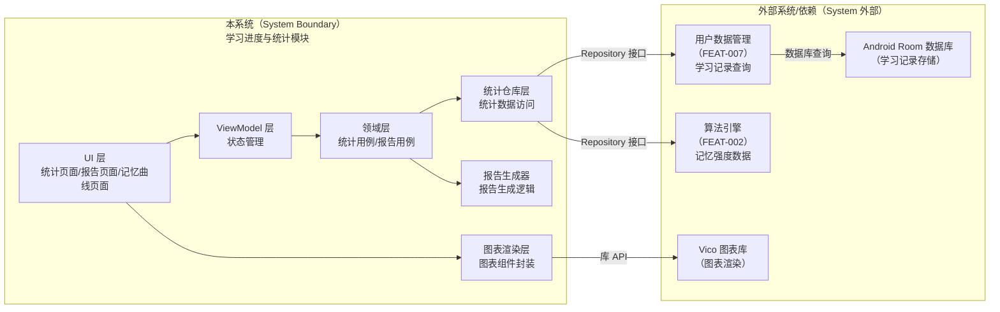
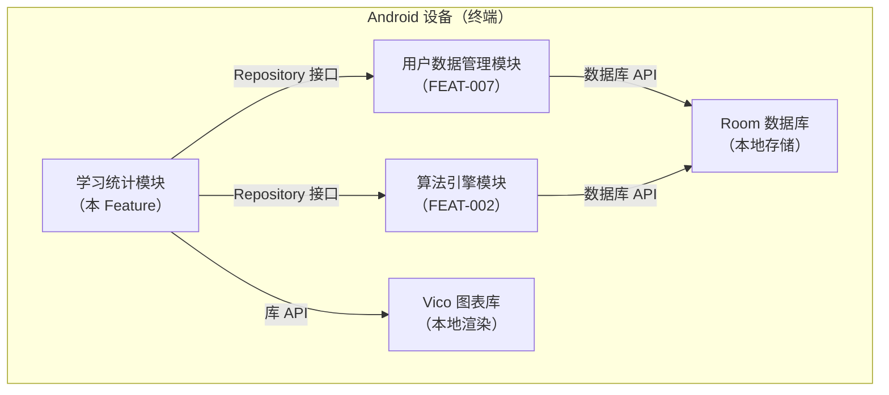
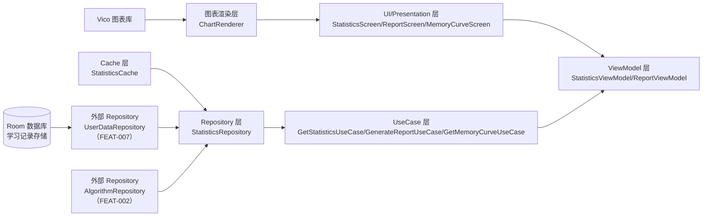
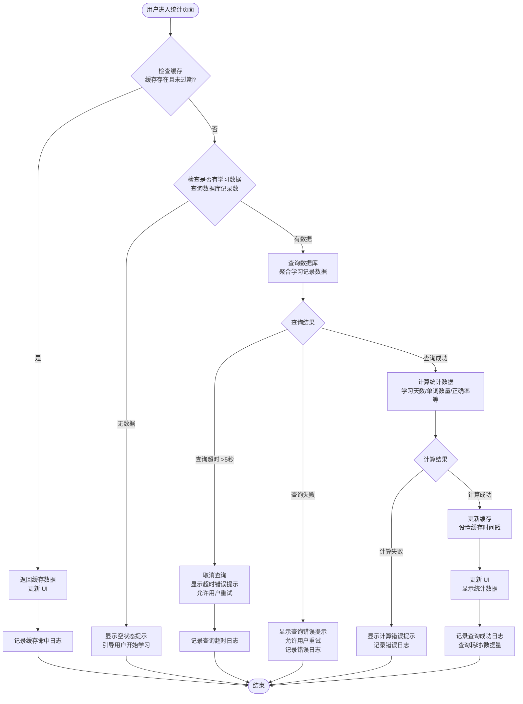
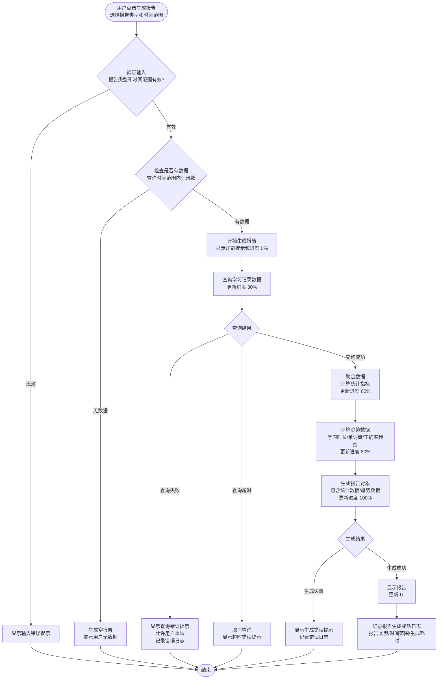
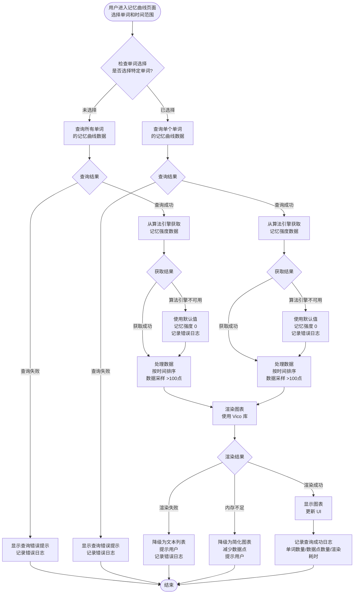

# Plan（工程级蓝图）：学习进度与统计

**Epic**：EPIC-001 - 无痛记忆单词神器APP
**Feature ID**：FEAT-005
**Feature Version**：v0.1.0（来自 `spec.md`）
**Plan Version**：v0.1.0
**当前工作分支**：`epic/EPIC-001-word-memory-app`
**Feature 目录**：`specs/epics/EPIC-001-word-memory-app/features/FEAT-005-learning-progress-stats/`
**日期**：2026-01-19
**输入**：来自 `Feature 目录/spec.md`

> 规则：
> - Plan 阶段必须包含工程决策、风险评估、算法/功耗/性能/内存评估（量化 + 验收指标）。
> - Implement 阶段**不得**擅自改写 Plan 的技术决策；若必须变更，走增量变更流程并提升 Version。

## 变更记录（增量变更）

| 版本 | 日期 | 变更范围（Feature/Story/Task） | 变更摘要 | 影响模块 | 是否需要回滚设计 |
|---|---|---|---|---|---|
| v0.1.0 | 2026-01-19 | Feature | 初始版本：创建 Plan 工程级蓝图，完成技术选型、架构设计和 Story 拆分 |  | 否 |

## 概述

**核心需求**：用户能够查看详细的学习进度和统计数据，包括学习天数、学习单词数量、复习单词数量、正确率等基础统计；能够查看学习趋势图表和记忆曲线；能够生成和查看日报、周报、月报。

**关键工程决策**：
1. **数据查询方案**：依赖 FEAT-007 用户账户与数据管理，通过 Repository 接口查询学习记录数据，使用 Room 数据库聚合查询
2. **图表渲染方案**：使用 Vico（Jetpack Compose 图表库），轻量级、性能好，支持折线图、柱状图等
3. **统计数据计算**：使用协程异步计算，支持进度反馈，计算结果缓存 1 小时避免重复计算
4. **报告生成策略**：按需生成，异步计算，支持日报/周报/月报三种类型
5. **记忆曲线数据**：依赖 FEAT-002 间隔重复算法引擎，获取单词记忆强度数据

## Plan-A：工程决策 & 风险评估（必须量化）

### A1. 技术选型（候选方案对比 + 决策理由）

| 决策点 | 候选方案 | 优缺点 | 约束/风险 | 决策 | 决策理由 |
|---|---|---|---|---|---|
| 图表渲染库 | A: Vico（Jetpack Compose 图表库）<br>B: MPAndroidChart（传统 View）<br>C: 自研图表组件 | A: 轻量级、Compose 原生、性能好，但功能相对简单<br>B: 功能丰富、成熟，但需要 View 系统、不符合 Compose 规范<br>C: 完全可控，但开发成本高 | EPIC 约束：使用 Jetpack Compose；性能要求：图表渲染 ≤ 500ms | A: Vico | 符合 EPIC 技术约束，Compose 原生支持，性能好，满足需求 |
| 统计数据计算方式 | A: 同步计算（主线程）<br>B: 异步计算（协程）<br>C: 后台服务计算 | A: 简单，但阻塞主线程<br>B: 不阻塞主线程、易于管理，但需要协程管理<br>C: 独立进程，但复杂度高 | 性能要求：页面加载 ≤ 1 秒；数据量大（10 万条记录） | B: 异步计算（协程） | 使用协程在 IO 线程执行统计计算，不阻塞主线程，满足性能要求 |
| 统计数据缓存策略 | A: 不缓存（每次查询）<br>B: 内存缓存（1 小时）<br>C: 持久化缓存（数据库） | A: 数据实时，但查询频繁、性能差<br>B: 性能好、数据相对实时，但内存占用<br>C: 持久化，但复杂度高、数据可能过期 | 性能要求：查询响应 ≤ 1 秒；数据实时性要求不高（1 小时内） | B: 内存缓存（1 小时） | 平衡性能和数据实时性，内存占用可控（<10MB），满足需求 |
| 报告生成方式 | A: 实时生成（每次查看）<br>B: 按需生成（异步）<br>C: 预生成（定时任务） | A: 数据实时，但生成耗时<br>B: 按需生成、异步不阻塞，但需要进度反馈<br>C: 查看快速，但占用资源、数据可能过期 | 性能要求：报告生成 ≤ 2 秒；用户按需查看 | B: 按需生成（异步） | 按需生成满足用户需求，异步不阻塞 UI，支持进度反馈 |
| 数据查询方式 | A: 直接查询数据库<br>B: 通过 Repository 接口<br>C: 通过 UseCase 层 | A: 简单直接，但耦合度高<br>B: 解耦、可测试，但需要 Repository 实现<br>C: 业务封装，但需要 UseCase 实现 | 依赖 FEAT-007；需要解耦和可测试性 | B: 通过 Repository 接口 | 通过 Repository 接口解耦，依赖 FEAT-007 的数据访问层，符合架构规范 |

### A2. 0 层架构设计（对外系统边界、部署、通信、交互）

> 定义：0 层架构设计反映"本系统与外部系统之间的关系"。必须覆盖：结构、部署、通信方式、交互方式与边界。
>
> 要求：
> - 同时给出"一句话描述每个模块/外部系统的职责与边界"。
> - 明确外部依赖的**故障模式**（超时/限流/不可用/返回不一致）与本系统应对策略（重试/降级/兜底/提示）。
> - 明确通信方式（协议/鉴权/重试/幂等/超时/限流）与部署拓扑（端/服务/第三方）。

#### A2.1 外部系统与依赖清单（必须）

| 外部系统/依赖 | 类型（三方/内部服务/设备能力） | 关键能力/数据 | 通信方式（协议/鉴权） | SLA/限流/超时 | 故障模式 | 我方策略 |
|---|---|---|---|---|---|---|
| 用户账户与数据管理（FEAT-007） | 内部 Feature | 学习记录数据存储和查询、学习历史数据 | Kotlin 函数调用（Repository 接口） | 本地数据库，查询超时 5 秒 | 数据库不可用、查询超时、数据损坏 | 显示错误提示，允许重试，记录错误日志 |
| 间隔重复算法引擎（FEAT-002） | 内部 Feature | 单词记忆强度数据、复习记录 | Kotlin 函数调用（Repository 接口） | 本地计算，无网络 | 算法引擎不可用、数据缺失 | 使用默认值（记忆强度 0），记录错误日志 |
| Android Room 数据库 | 设备能力 | 学习记录数据存储 | 系统 API | 本地数据库，无网络 | 数据库操作失败、存储空间不足 | 捕获异常，显示错误提示，记录错误日志 |
| Vico 图表库 | 第三方库 | 图表渲染能力 | 库 API 调用 | 本地渲染，无网络 | 图表渲染失败、内存不足 | 降级为文本列表，提示用户，记录错误日志 |

#### A2.2 0 层架构图（系统边界 + 外部交互）



#### A2.3 部署视图（必须）

> 要求：说明各节点部署位置（端上/服务端/第三方）、网络边界、以及关键链路的通信方式。



#### A2.4 通信与交互说明（必须）

- **协议**：Kotlin 函数调用（suspend 函数）、Flow 数据流、Repository 接口
- **鉴权**：无需鉴权（本地调用）
- **超时与重试**：数据库查询超时 5 秒，查询失败允许用户重试，不自动重试（避免重复计算）
- **幂等**：统计数据查询和报告生成是幂等的，重复调用返回相同结果（使用缓存）
- **限流**：无外部限流，内部限制并发查询数量（最多 3 个并发查询）
- **数据一致性**：最终一致，统计数据基于学习记录数据聚合，数据更新后缓存失效

### A3. 1 层架构设计（系统内部框架图 + 模块拆分 + 接口协议）

> 定义：1 层架构设计描述"系统内部的模块拆分与协作"，包括框架图、模块职责、模块交互、通信方式、接口协议等。

#### A3.1 1 层框架图（必须）



#### A3.2 模块拆分与职责（必须）

| 模块 | 职责 | 输入/输出 | 依赖 | 约束 |
|---|---|---|---|---|
| StatisticsScreen | 统计数据页面 UI，展示学习天数、单词数量、正确率等 | 输入：ViewModel 状态<br/>输出：用户交互事件 | ViewModel | Jetpack Compose |
| ReportScreen | 报告页面 UI，展示日报/周报/月报 | 输入：ViewModel 状态<br/>输出：用户交互事件 | ViewModel | Jetpack Compose |
| MemoryCurveScreen | 记忆曲线页面 UI，展示单词记忆强度曲线 | 输入：ViewModel 状态<br/>输出：用户交互事件 | ViewModel | Jetpack Compose |
| StatisticsViewModel | 统计数据状态管理，处理用户交互 | 输入：UseCase 数据流<br/>输出：UI 状态 | UseCase | 生命周期感知 |
| ReportViewModel | 报告状态管理，处理报告生成请求 | 输入：UseCase 数据流<br/>输出：UI 状态 | UseCase | 生命周期感知 |
| GetStatisticsUseCase | 获取统计数据用例，聚合学习记录数据 | 输入：时间范围<br/>输出：统计数据 | StatisticsRepository | 异步执行 |
| GenerateReportUseCase | 生成报告用例，生成日报/周报/月报 | 输入：报告类型、时间范围<br/>输出：报告数据 | StatisticsRepository | 异步执行 |
| GetMemoryCurveUseCase | 获取记忆曲线数据用例，获取单词记忆强度数据 | 输入：单词 ID、时间范围<br/>输出：记忆曲线数据 | StatisticsRepository | 异步执行 |
| StatisticsRepository | 统计数据仓库，封装数据访问逻辑 | 输入：查询参数<br/>输出：统计数据 | UserDataRepository、AlgorithmRepository、Cache | 数据聚合 |
| StatisticsCache | 统计数据缓存，缓存计算结果 | 输入：统计数据<br/>输出：缓存的统计数据 | 无 | 内存缓存，1 小时失效 |
| ChartRenderer | 图表渲染封装，封装 Vico 图表组件 | 输入：图表数据<br/>输出：Compose UI | Vico 库 | 数据采样、性能优化 |

#### A3.3 模块协作与通信方式（必须）

> 要求：写清楚"谁调用谁、通过什么方式、传什么、失败如何处理"。如果是异步（队列/事件），必须写清楚消费语义与重放/去重。

- **调用关系**：[UI → ViewModel → UseCase → Repository → 外部 Repository → 数据库]
- **通信方式**：Kotlin suspend 函数调用、Flow 数据流、协程异步执行
- **接口协议**：
  - Repository 接口：`suspend fun getStatistics(timeRange: TimeRange): Result<Statistics>`
  - UseCase 接口：`suspend fun getStatistics(timeRange: TimeRange): Flow<Statistics>`
  - ViewModel 接口：`val statistics: StateFlow<StatisticsState>`
- **并发与线程模型**：
  - UI 层：主线程（Compose）
  - ViewModel：主线程（状态更新）
  - UseCase：IO 线程（数据查询和计算）
  - Repository：IO 线程（数据库查询）
  - 缓存：内存缓存，线程安全（使用 ConcurrentHashMap）

#### A3.4 关键模块设计（详细设计 + 取舍，必须）

> 要求：对"关键模块/高风险模块/承载 NFR 的模块"做细化。若包含多个模块，则分模块说明。

##### 模块：StatisticsRepository（统计数据仓库层）

- **模块定位**：统一统计数据访问接口，封装数据聚合逻辑，位于 Data 层，为 UseCase 提供统计数据访问服务
- **设计目标**：数据一致性、性能优化（缓存、聚合查询）、可测试性、可扩展性
- **核心数据结构/状态**：
  - 实体：`LearningStatistics`（学习统计）、`LearningTrendData`（学习趋势数据）、`MemoryCurveData`（记忆曲线数据）
  - 状态：统计数据缓存（Map<TimeRange, Statistics>）、缓存时间戳（Map<TimeRange, Long>）
  - 缓存：内存缓存统计数据，减少重复查询和计算
- **对外接口（协议）**：
  - `suspend fun getStatistics(timeRange: TimeRange): Result<LearningStatistics>`：获取统计数据
  - `suspend fun getTrendData(timeRange: TimeRange, metric: TrendMetric): Flow<List<LearningTrendData>>`：获取趋势数据
  - `suspend fun getMemoryCurve(wordId: String?, timeRange: TimeRange): Result<List<MemoryCurveData>>`：获取记忆曲线数据
  - 错误码：`StatisticsError`（Sealed Class：QueryError, CalculationError, CacheError）
- **策略与算法**：
  - 缓存策略：统计数据缓存 1 小时，缓存键为时间范围，缓存失效时重新计算
  - 聚合策略：使用 Room 数据库聚合查询（SUM、COUNT、AVG），减少内存占用
  - 数据采样策略：趋势数据点超过 100 个时，进行数据采样（每 10 个点取 1 个）
- **失败与降级**：
  - 数据库查询失败：返回错误 Result，由调用方处理
  - 查询超时（>5 秒）：取消查询，返回超时错误，提示用户重试
  - 数据计算失败：返回错误 Result，记录错误日志
  - 缓存失效：重新查询和计算
- **安全与隐私**：
  - 统计数据仅存储在本地，不上传云端
  - 统计数据不包含敏感信息（仅聚合数据）
- **可观测性**：
  - 记录查询操作日志（时间范围、查询耗时、结果数量）
  - 记录错误操作（查询失败、计算失败）
  - 记录缓存命中率
- **优缺点**：
  - **优点**：数据访问统一、缓存提升性能、聚合查询减少内存占用
  - **缺点/代价**：内存缓存占用少量内存（约 10MB）
  - **替代方案与否决理由**：不使用持久化缓存（数据实时性要求不高，内存缓存足够）；不使用同步查询（会阻塞主线程）

##### 模块：ReportGenerator（报告生成器）

- **模块定位**：负责学习报告的生成，支持日报/周报/月报三种类型，位于 Domain 层
- **设计目标**：性能（快速生成）、可扩展性（支持新报告类型）、错误处理
- **核心数据结构/状态**：
  - 输入：报告类型（Daily/Weekly/Monthly）、时间范围
  - 输出：`LearningReport` 实体（包含报告类型、时间范围、统计数据、趋势数据）
  - 生成状态：进度百分比（0-100%）
- **对外接口（协议）**：
  - `suspend fun generateReport(type: ReportType, timeRange: TimeRange, onProgress: (Int) -> Unit): Result<LearningReport>`：生成报告，支持进度回调
  - 错误码：`ReportError`（Sealed Class：GenerationError, DataError, TimeoutError）
- **策略与算法**：
  - 生成策略：按需生成，异步执行，支持进度反馈
  - 数据聚合：基于时间范围聚合学习记录数据，计算统计指标
  - 趋势计算：计算学习时长、单词学习量、正确率的趋势变化
- **失败与降级**：
  - 数据缺失：返回空报告，提示用户无数据
  - 生成超时（>10 秒）：取消生成，返回超时错误，提示用户重试
  - 计算失败：返回错误 Result，记录错误日志
- **安全与隐私**：
  - 报告数据不包含敏感信息（仅聚合数据）
- **可观测性**：
  - 记录报告生成操作日志（报告类型、时间范围、生成耗时）
  - 记录报告生成失败原因
- **优缺点**：
  - **优点**：按需生成满足用户需求、异步不阻塞 UI、支持进度反馈
  - **缺点/代价**：生成耗时（2 秒内），需要进度反馈
  - **替代方案与否决理由**：不使用预生成（占用资源、数据可能过期）；不使用同步生成（会阻塞主线程）

##### 模块：ChartRenderer（图表渲染封装层）

- **模块定位**：封装 Vico 图表库，提供统一的图表渲染接口，位于 UI 层
- **设计目标**：性能（快速渲染）、内存效率（数据采样）、可复用性
- **核心数据结构/状态**：
  - 输入：图表数据（List<DataPoint>）、图表类型（Line/Bar）
  - 输出：Compose UI（Chart 组件）
  - 渲染状态：数据点数量、是否降级
- **对外接口（协议）**：
  - `@Composable fun LineChart(data: List<DataPoint>, modifier: Modifier = Modifier): Unit`：渲染折线图
  - `@Composable fun BarChart(data: List<DataPoint>, modifier: Modifier = Modifier): Unit`：渲染柱状图
- **策略与算法**：
  - 数据采样策略：数据点超过 100 个时，进行数据采样（每 10 个点取 1 个）
  - 性能优化：使用 `remember` 缓存图表数据，避免重复计算
  - 降级策略：内存不足时降级为文本列表
- **失败与降级**：
  - 图表渲染失败：降级为文本列表，提示用户
  - 内存不足：降级为简化图表（减少数据点），提示用户
- **安全与隐私**：
  - 图表数据不包含敏感信息
- **可观测性**：
  - 记录图表渲染性能指标（渲染耗时、数据点数量、是否降级）
- **优缺点**：
  - **优点**：封装 Vico 库，提供统一接口，支持数据采样和性能优化
  - **缺点/代价**：数据采样可能丢失细节
  - **替代方案与否决理由**：不使用自研图表（开发成本高）；不使用 MPAndroidChart（不符合 Compose 规范）

### A4. 关键流程设计（每个流程一张流程图，含正常 + 全部异常）

> 定义：关键流程设计必须用**流程图（flowchart）**描述，且流程图中必须覆盖正常流程与所有关键异常分支（失败/超时/并发/生命周期等）。
>
> 要求：
> - 若存在多个关键流程（如"登录""同步""下单""上传"等），则每个流程单独一张图。
> - 每张图必须包含：触发条件、关键决策点、外部依赖调用、重试/降级/兜底路径、最终可观测信号（日志/指标/埋点）。

#### 流程 1：统计数据查询流程



#### 流程 2：报告生成流程



#### 流程 3：记忆曲线查询流程



### A5. 技术风险与消解策略（绑定 Story/Task）

| 风险ID | 风险描述 | 触发条件 | 影响范围 | 严重度 | 消解策略 | 对应 Story/Task |
|---|---|---|---|---|---|---|
| RISK-001 | 数据库查询超时，统计数据加载失败 | 数据量过大（>10 万条记录）、查询时间范围过长（>1 年） | 统计数据查询功能 | High | 限制查询时间范围（最多 3 个月）、分页加载数据、显示加载提示和进度 | ST-002 / T??? |
| RISK-002 | 统计数据计算耗时过长，页面响应慢 | 数据量大、计算逻辑复杂 | 统计数据页面加载 | Med | 异步计算、显示计算进度、缓存计算结果 | ST-002 / T??? |
| RISK-003 | 图表渲染性能问题，页面卡顿 | 数据点过多（>100 个）、内存不足 | 图表展示功能 | Med | 数据采样（每 10 个点取 1 个）、限制显示数据点数量、使用简化图表 | ST-004 / T??? |
| RISK-004 | 内存占用过高，应用崩溃 | 统计数据缓存过大、图表数据未释放 | 应用内存占用 | High | 限制缓存大小（<10MB）、页面退出时清理缓存、及时释放图表数据 | ST-003 / T??? |
| RISK-005 | 依赖 Feature 不可用，统计数据缺失 | FEAT-007 或 FEAT-002 未实现或异常 | 统计数据功能 | High | 容错处理、使用默认值、记录错误日志、提示用户 | ST-001 / T??? |

### A6. 边界 & 异常场景枚举（数据/状态/生命周期/并发/用户行为）

- **数据边界**：
  - 空数据：无学习记录时显示空状态提示
  - 超大数据量：查询时间范围限制为最多 1 年，单次查询数据量限制为 10 万条记录
  - 非法时间范围：时间范围无效时提示用户重新选择
  - 数据过期：缓存数据过期（>1 小时）时重新查询
- **状态边界**：
  - 页面状态：加载中、成功、失败、空状态
  - 缓存状态：缓存命中、缓存未命中、缓存过期
  - 报告生成状态：未生成、生成中、生成成功、生成失败
- **生命周期**：
  - 前后台切换：页面进入后台时暂停查询，返回前台时恢复查询
  - 页面旋转：保存页面状态，旋转后恢复
  - 进程被杀：统计数据不持久化，下次进入时重新查询
  - 应用退出：清理内存缓存，释放图表数据
- **并发**：
  - 并发查询：限制并发查询数量（最多 3 个），使用队列管理
  - 并发缓存更新：使用线程安全的缓存（ConcurrentHashMap）
  - 并发图表渲染：Compose 自动处理并发渲染
- **用户行为**：
  - 快速切换时间范围：取消之前的查询，发起新查询
  - 频繁刷新：使用防抖（debounce），避免频繁查询
  - 网络断开：无需网络，本地查询不受影响
  - 权限拒绝：无需额外权限，不受影响

### A7. 算法评估（如适用）

> 本 Feature 不涉及算法评估，统计数据计算为简单的聚合查询（SUM、COUNT、AVG），无需算法评估。

### A8. 功耗评估（必须量化）

- **Top5% 用户模型**：
  - 设备：中高端 Android 设备（如 Pixel 6、Samsung Galaxy S21）
  - 使用频次：每天查看统计数据 5 次，每次查看 2 分钟
  - 场景：前台查看统计数据、生成报告、查看记忆曲线
- **测量口径**：
  - CPU 使用：统计数据计算（IO 线程）、图表渲染（主线程）
  - 屏幕点亮：查看统计数据时屏幕保持点亮
  - 数据库 I/O：查询学习记录数据（本地数据库，无网络）
- **预估增量**：每日 \(mAh\) 增量 ≤ 10mAh
  - 数据库查询：每次查询约 0.5mAh（5 次/天 = 2.5mAh）
  - 图表渲染：每次渲染约 0.3mAh（5 次/天 = 1.5mAh）
  - 屏幕点亮：查看统计数据时屏幕点亮（2 分钟/次 × 5 次 = 10 分钟，约 6mAh）
  - 总计：约 10mAh/天
- **验收上限**：每日电池消耗增量 ≤ 10mAh（或每次操作平均 ≤ 2mAh）
- **降级策略**：达到阈值时减少数据查询频率、简化图表渲染、限制缓存大小

### A9. 性能评估（必须量化）

- **前台**：
  - 统计数据页面加载：p50 ≤ 500ms，p95 ≤ 1 秒，p99 ≤ 1.5 秒
  - 图表渲染：p50 ≤ 200ms，p95 ≤ 500ms，p99 ≤ 800ms
  - 报告生成：p50 ≤ 1 秒，p95 ≤ 2 秒，p99 ≤ 3 秒
  - 记忆曲线查询：p50 ≤ 300ms，p95 ≤ 600ms，p99 ≤ 1 秒
- **后台**：
  - 统计数据计算：异步执行，不阻塞主线程
  - 缓存更新：后台更新，不影响前台性能
- **验收指标**：
  - 统计数据页面加载时间：p95 ≤ 1 秒（测试方法：使用性能分析工具测量页面加载耗时）
  - 图表渲染时间：p95 ≤ 500ms（测试方法：使用性能分析工具测量图表渲染耗时）
  - 报告生成时间：p95 ≤ 2 秒（测试方法：使用性能分析工具测量报告生成耗时）
- **降级策略**：
  - 查询超时：限制查询时间范围、分页加载
  - 渲染卡顿：数据采样、简化图表
  - 计算耗时：异步计算、显示进度、缓存结果

### A10. 内存评估（必须量化）

- **峰值增量**：≤ 50MB
  - 统计数据缓存：约 10MB（缓存多个时间范围的统计数据）
  - 图表数据：约 20MB（最多 100 个数据点，每个数据点约 200KB）
  - 报告数据：约 10MB（报告对象和趋势数据）
  - UI 组件：约 10MB（Compose UI 组件）
- **平均增量**：≤ 30MB
  - 统计数据缓存：约 5MB（缓存常用时间范围的统计数据）
  - 图表数据：约 15MB（平均 50 个数据点）
  - UI 组件：约 10MB
- **生命周期**：
  - 页面进入：加载统计数据、初始化图表组件（内存增加约 30MB）
  - 页面使用：统计数据缓存、图表数据常驻（内存保持约 30MB）
  - 页面退出：清理统计数据缓存、释放图表数据（内存减少约 20MB）
  - 应用退出：清理所有缓存（内存完全释放）
- **风险与对策**：
  - 泄漏点：统计数据缓存未释放、图表数据未释放
  - 大对象：报告对象、趋势数据列表
  - 缓存策略：限制缓存大小（<10MB）、缓存失效时间（1 小时）、页面退出时清理缓存
- **验收标准**：
  - 统计数据页面内存占用峰值 ≤ 50MB（测试方法：使用内存分析工具测量页面内存占用）
  - 页面退出后内存释放 ≥ 80%（测试方法：测量页面退出前后的内存占用差异）

## Plan-B：技术规约 & 实现约束（保留原 spec-kit 输出内容）

### B1. 技术背景（用于统一工程上下文）

> 注意：为保证工具链自动提取信息，下列字段名需保留英文 Key（括号内可补充中文）。

**Language/Version**：Kotlin 1.9+ / Java 17
**Primary Dependencies**：Jetpack Compose、Room、Coroutines、Flow、Vico（图表库）
**Storage**：Room/SQLite（通过 FEAT-007 用户数据管理模块）
**Test Framework**：JUnit、MockK、Robolectric、Compose UI Test
**Target Platform**：Android 8.0+（API Level 26+）
**Project Type**：mobile（Android 应用）
**Performance Targets**：页面加载 p95 ≤ 1 秒、图表渲染 p95 ≤ 500ms、报告生成 p95 ≤ 2 秒
**Constraints**：内存占用峰值 ≤ 50MB、统计数据查询时间范围 ≤ 1 年、图表数据点数量 ≤ 100 个
**Scale/Scope**：单用户、本地数据、无云端同步

### B2. 架构细化（实现必须遵循）

- **分层约束**：
  - UI 层只能调用 ViewModel，不能直接调用 UseCase 或 Repository
  - ViewModel 只能调用 UseCase，不能直接调用 Repository
  - UseCase 只能调用 Repository，不能直接访问数据库
  - Repository 可以调用外部 Repository（FEAT-007、FEAT-002）和数据库
- **线程/并发模型**：
  - UI 层：主线程（Compose）
  - ViewModel：主线程（状态更新），使用 `viewModelScope` 启动协程
  - UseCase：IO 线程（数据查询和计算），使用 `Dispatchers.IO`
  - Repository：IO 线程（数据库查询），使用 `Dispatchers.IO`
  - 缓存：线程安全（使用 `ConcurrentHashMap`）
- **错误处理规范**：
  - 统一错误类型：`Result<T>` 封装成功/失败结果
  - 错误码：Sealed Class（`StatisticsError`、`ReportError`）
  - 用户提示：错误信息用户友好，提供重试选项
  - 日志记录：记录错误详情，便于排查
- **日志与可观测性**：
  - 结构化日志：使用统一日志格式，包含操作类型、参数、结果、耗时
  - 关键操作日志：统计数据查询、报告生成、记忆曲线查询
  - 性能指标：查询耗时、渲染耗时、缓存命中率
  - 错误日志：查询失败、计算失败、渲染失败

### B3. 数据模型（引用或内联）

> 本 Feature 的数据模型依赖 FEAT-007 用户数据管理模块的学习记录数据，不单独定义数据表。本 Feature 主要定义统计数据的聚合结果和报告数据。

#### B3.1 存储形态与边界（必须）

- **存储形态**：内存缓存（统计数据缓存）、Room 数据库（通过 FEAT-007 查询学习记录数据）
- **System of Record（权威来源）**：FEAT-007 用户数据管理模块的 Room 数据库是学习记录数据的权威来源
- **缓存与派生数据**：
  - 统计数据是派生数据，基于学习记录数据聚合计算
  - 统计数据可重建，缓存失效时重新查询和计算
  - 报告数据是派生数据，基于统计数据生成
- **生命周期**：
  - 统计数据缓存：常驻内存，1 小时失效，页面退出时清理
  - 报告数据：按需生成，不持久化，生成后常驻内存直到页面退出
  - 图表数据：页面使用期间常驻内存，页面退出时释放
- **数据规模与增长**：
  - 学习记录数据：数量级 10 万条（假设用户学习 1 年，每天学习 100 个单词）
  - 统计数据：数量级 100 条（不同时间范围的统计数据）
  - 报告数据：数量级 10 条（日报/周报/月报）

#### B3.2 物理数据结构（若使用持久化存储则必填）

> 本 Feature 不直接使用持久化存储，统计数据通过 FEAT-007 查询学习记录数据后聚合计算。统计数据缓存使用内存缓存（ConcurrentHashMap），不持久化。

##### 内存缓存结构

| Key | Value | 用途 | 生命周期 |
|---|---|---|---|
| `statistics_${timeRange}` | `LearningStatistics` | 缓存统计数据 | 1 小时失效，页面退出时清理 |
| `trend_${timeRange}_${metric}` | `List<LearningTrendData>` | 缓存趋势数据 | 1 小时失效，页面退出时清理 |
| `memory_curve_${wordId}_${timeRange}` | `List<MemoryCurveData>` | 缓存记忆曲线数据 | 1 小时失效，页面退出时清理 |

##### 数据实体定义（Kotlin Data Class）

```kotlin
// 学习统计数据
data class LearningStatistics(
    val learningDays: Int,              // 学习天数
    val totalWordsLearned: Int,         // 学习单词总数
    val totalWordsReviewed: Int,        // 复习单词总数
    val averageAccuracy: Float,         // 平均正确率
    val totalLearningTime: Long,        // 总学习时长（毫秒）
    val timeRange: TimeRange            // 时间范围
)

// 学习趋势数据
data class LearningTrendData(
    val date: Long,                     // 日期（时间戳）
    val learningTime: Long,            // 学习时长（毫秒）
    val wordsLearned: Int,              // 学习单词数量
    val accuracy: Float                // 正确率
)

// 记忆曲线数据
data class MemoryCurveData(
    val wordId: String,                 // 单词 ID
    val timestamp: Long,                // 时间点（时间戳）
    val memoryStrength: Float           // 记忆强度（0-1）
)

// 学习报告
data class LearningReport(
    val type: ReportType,               // 报告类型（Daily/Weekly/Monthly）
    val timeRange: TimeRange,           // 时间范围
    val statistics: LearningStatistics, // 统计数据
    val trendData: List<LearningTrendData>, // 趋势数据
    val generatedAt: Long              // 生成时间（时间戳）
)

// 时间范围
data class TimeRange(
    val startTime: Long,                // 开始时间（时间戳）
    val endTime: Long                   // 结束时间（时间戳）
)

// 报告类型
enum class ReportType {
    Daily, Weekly, Monthly
}

// 趋势指标
enum class TrendMetric {
    LearningTime, WordsLearned, Accuracy
}
```

### B4. 接口规范/协议（引用或内联）

#### B4.1 本 Feature 对外提供的接口（必须：Capability Feature/跨模块复用场景）

> 本 Feature 为 Product Feature，不对外提供接口，仅内部使用。

#### B4.2 本 Feature 依赖的外部接口/契约（必须：存在外部依赖时）

> 本 Feature 依赖 FEAT-007 用户数据管理模块和 FEAT-002 间隔重复算法引擎，需要定义接口契约。

##### 依赖接口清单

- **UserDataRepository（FEAT-007）**：
  - `suspend fun getLearningRecords(timeRange: TimeRange): Result<List<LearningRecord>>`：获取学习记录数据
  - `suspend fun getLearningRecordCount(timeRange: TimeRange): Result<Int>`：获取学习记录数量
- **AlgorithmRepository（FEAT-002）**：
  - `suspend fun getMemoryStrength(wordId: String, timestamp: Long): Result<Float>`：获取单词记忆强度
  - `suspend fun getMemoryStrengthHistory(wordId: String, timeRange: TimeRange): Result<List<MemoryStrengthPoint>>`：获取单词记忆强度历史

##### 调用约束

- **超时/重试/退避**：数据库查询超时 5 秒，查询失败不自动重试（由用户手动重试）
- **缓存策略**：统计数据缓存 1 小时，缓存失效时重新查询
- **一致性假设**：统计数据基于学习记录数据聚合，数据更新后缓存失效

##### 失败模式与降级

- **数据库查询失败**：显示错误提示，允许用户重试，记录错误日志
- **算法引擎不可用**：使用默认值（记忆强度 0），记录错误日志，提示用户
- **查询超时**：取消查询，显示超时错误提示，允许用户重试

### B5. 合规性检查（关卡）

*关卡：必须在进入 Implement 前通过；若不通过，必须明确整改项并绑定到 Story/Task。*

- [ ] **性能合规**：统计数据页面加载时间 p95 ≤ 1 秒，图表渲染时间 p95 ≤ 500ms（验收方式：性能测试）
- [ ] **内存合规**：统计数据页面内存占用峰值 ≤ 50MB（验收方式：内存分析工具）
- [ ] **功耗合规**：学习统计功能每日电池消耗增量 ≤ 10mAh（验收方式：功耗测试）
- [ ] **隐私合规**：统计数据仅存储在本地，不上传云端（验收方式：代码审查）
- [ ] **可靠性合规**：统计数据查询成功率 ≥ 99.5%，报告生成成功率 ≥ 99%（验收方式：自动化测试）

### B6. 项目结构（本 Feature）

```text
specs/epics/EPIC-001-word-memory-app/features/FEAT-005-learning-progress-stats/
├── spec.md                     # Feature 规格说明（/speckit.feature）
├── plan.md                     # 本文件（/speckit.plan）
├── tasks.md                    # 任务拆解（/speckit.tasks）
└── checklists/                 # 检查清单
    └── requirements.md         # 需求检查清单
```

### B7. 源代码结构（代码库根目录）

```text
app/src/main/java/com/jacky/verity/
├── statistics/                 # 学习统计模块（本 Feature）
│   ├── ui/                     # UI 层
│   │   ├── StatisticsScreen.kt          # 统计数据页面
│   │   ├── ReportScreen.kt             # 报告页面
│   │   ├── MemoryCurveScreen.kt         # 记忆曲线页面
│   │   └── chart/                       # 图表组件
│   │       └── ChartRenderer.kt         # 图表渲染封装
│   ├── viewmodel/              # ViewModel 层
│   │   ├── StatisticsViewModel.kt       # 统计数据 ViewModel
│   │   └── ReportViewModel.kt           # 报告 ViewModel
│   ├── domain/                 # 领域层
│   │   ├── usecase/                     # 用例
│   │   │   ├── GetStatisticsUseCase.kt  # 获取统计数据用例
│   │   │   ├── GenerateReportUseCase.kt # 生成报告用例
│   │   │   └── GetMemoryCurveUseCase.kt # 获取记忆曲线用例
│   │   └── model/                       # 领域模型
│   │       ├── LearningStatistics.kt    # 学习统计数据
│   │       ├── LearningReport.kt         # 学习报告
│   │       └── MemoryCurveData.kt        # 记忆曲线数据
│   └── data/                   # 数据层
│       ├── repository/                  # 仓库
│       │   └── StatisticsRepository.kt   # 统计数据仓库
│       └── cache/                       # 缓存
│           └── StatisticsCache.kt        # 统计数据缓存
```

**结构决策**：采用 Clean Architecture 分层结构，UI 层使用 Jetpack Compose，数据层通过 Repository 接口访问外部数据源（FEAT-007、FEAT-002）。

## Story Breakdown（Plan 阶段末尾，必须）

> 规则：
> - Story 是 Feature 的最小可开发单元，用于覆盖对应 FR/NFR。
> - Story 类型必须标注：Functional / Design-Enabler / Infrastructure / Optimization。
> - 这里**只做拆分与映射**，不生成 Task；Task 在 `/speckit.tasks` 阶段生成，且不得改写这里的设计决策。

### Story 列表

#### ST-001：实现统计数据查询功能

- **类型**：Functional
- **描述**：实现统计数据查询功能，支持查询学习天数、学习单词数量、复习单词数量、平均正确率等基础统计数据，支持选择时间范围查询
- **目标**：用户能够查看基础统计数据，数据准确可靠，查询响应迅速
- **覆盖 FR/NFR**：FR-001、FR-005；NFR-PERF-001、NFR-REL-001、NFR-REL-002
- **依赖**：FEAT-007 用户数据管理模块（提供学习记录数据查询接口）
- **可并行**：否（需要先实现数据访问层）
- **关键风险**：是（关联 RISK-001、RISK-002、RISK-005）
- **验收/验证方式（高层）**：用户能够成功查看统计数据，数据准确，查询时间 p95 ≤ 1 秒

#### ST-002：实现统计数据缓存机制

- **类型**：Infrastructure
- **描述**：实现统计数据缓存机制，缓存计算结果 1 小时，减少重复查询和计算，提升性能
- **目标**：统计数据缓存命中率 ≥ 80%，缓存大小 ≤ 10MB，缓存失效时间 1 小时
- **覆盖 FR/NFR**：NFR-PERF-001、NFR-MEM-001、NFR-REL-003
- **依赖**：ST-001（统计数据查询功能）
- **可并行**：否（依赖 ST-001）
- **关键风险**：是（关联 RISK-004）
- **验收/验证方式（高层）**：缓存命中率 ≥ 80%，缓存大小 ≤ 10MB，缓存失效时间 1 小时

#### ST-003：实现学习趋势图表功能

- **类型**：Functional
- **描述**：实现学习趋势图表功能，支持查看学习时长趋势、单词学习量趋势、正确率趋势，使用 Vico 图表库渲染折线图
- **目标**：用户能够查看学习趋势图表，图表渲染流畅，数据准确
- **覆盖 FR/NFR**：FR-002；NFR-PERF-001、NFR-MEM-001
- **依赖**：ST-001（统计数据查询功能）、Vico 图表库
- **可并行**：否（依赖 ST-001）
- **关键风险**：是（关联 RISK-003、RISK-004）
- **验收/验证方式（高层）**：用户能够查看学习趋势图表，图表渲染时间 p95 ≤ 500ms

#### ST-004：实现记忆曲线展示功能

- **类型**：Functional
- **描述**：实现记忆曲线展示功能，支持查看单词记忆强度随时间的变化趋势，支持查看单个单词的记忆曲线，使用 Vico 图表库渲染折线图
- **目标**：用户能够查看记忆曲线，图表渲染流畅，数据准确
- **覆盖 FR/NFR**：FR-003、FR-008；NFR-PERF-001、NFR-MEM-001
- **依赖**：FEAT-002 间隔重复算法引擎（提供记忆强度数据）、ST-003（图表渲染功能）
- **可并行**：否（依赖 FEAT-002、ST-003）
- **关键风险**：是（关联 RISK-003、RISK-005）
- **验收/验证方式（高层）**：用户能够查看记忆曲线，图表渲染时间 p95 ≤ 500ms

#### ST-005：实现报告生成功能

- **类型**：Functional
- **描述**：实现报告生成功能，支持生成日报、周报、月报，报告包含学习时长、单词数量、正确率等关键信息和趋势数据，支持异步生成和进度反馈
- **目标**：用户能够生成和查看报告，报告内容完整准确，生成时间 p95 ≤ 2 秒
- **覆盖 FR/NFR**：FR-004、FR-007；NFR-PERF-001、NFR-REL-001
- **依赖**：ST-001（统计数据查询功能）、ST-003（趋势图表功能）
- **可并行**：否（依赖 ST-001、ST-003）
- **关键风险**：是（关联 RISK-002）
- **验收/验证方式（高层）**：用户能够生成和查看报告，报告生成时间 p95 ≤ 2 秒

#### ST-006：实现空状态和错误处理

- **类型**：Functional
- **描述**：实现空状态提示和错误处理，当无学习数据时显示空状态提示引导用户开始学习，当查询失败或计算失败时显示错误提示并允许用户重试
- **目标**：用户能够看到友好的空状态提示和错误提示，错误处理完善
- **覆盖 FR/NFR**：FR-006、FR-007；NFR-OBS-002、NFR-REL-001
- **依赖**：ST-001（统计数据查询功能）
- **可并行**：是（可与 ST-001 并行开发）
- **关键风险**：否
- **验收/验证方式（高层）**：无学习数据时显示空状态提示，查询失败时显示错误提示并允许重试

#### ST-007：实现性能优化和降级策略

- **类型**：Optimization
- **描述**：实现性能优化和降级策略，包括数据采样（数据点 >100 个时采样）、查询超时处理（限制查询时间范围）、图表渲染降级（内存不足时简化图表）
- **目标**：统计数据查询和图表渲染性能满足要求，降级策略有效
- **覆盖 FR/NFR**：NFR-PERF-002、NFR-PERF-003、NFR-MEM-001
- **依赖**：ST-001（统计数据查询功能）、ST-003（图表渲染功能）
- **可并行**：否（依赖 ST-001、ST-003）
- **关键风险**：是（关联 RISK-001、RISK-003）
- **验收/验证方式（高层）**：查询超时时限制查询时间范围，图表数据点 >100 个时进行数据采样

#### ST-008：实现可观测性和日志记录

- **类型**：Infrastructure
- **描述**：实现可观测性和日志记录，记录统计数据查看事件、报告生成事件、图表渲染性能指标、错误日志等
- **目标**：关键操作都有日志记录，性能指标可观测，错误日志便于排查
- **覆盖 FR/NFR**：NFR-OBS-001、NFR-OBS-002、NFR-OBS-003
- **依赖**：ST-001（统计数据查询功能）、ST-003（图表渲染功能）、ST-005（报告生成功能）
- **可并行**：是（可与功能开发并行）
- **关键风险**：否
- **验收/验证方式（高层）**：关键操作都有日志记录，性能指标可观测

### Feature → Story 覆盖矩阵

| FR/NFR ID | 覆盖的 Story ID | 备注 |
|---|---|---|
| FR-001 | ST-001 | 基础统计数据查询 |
| FR-002 | ST-003 | 学习趋势图表 |
| FR-003 | ST-004 | 记忆曲线展示 |
| FR-004 | ST-005 | 报告生成 |
| FR-005 | ST-001 | 时间范围选择 |
| FR-006 | ST-006 | 空状态提示 |
| FR-007 | ST-005、ST-006 | 加载提示和错误处理 |
| FR-008 | ST-004 | 单个单词记忆曲线 |
| NFR-PERF-001 | ST-001、ST-003、ST-004、ST-005、ST-007 | 性能要求 |
| NFR-PERF-002 | ST-007 | 查询超时降级 |
| NFR-PERF-003 | ST-007 | 图表数据采样 |
| NFR-POWER-001 | ST-001、ST-003、ST-004 | 功耗要求 |
| NFR-MEM-001 | ST-002、ST-003、ST-004、ST-007 | 内存要求 |
| NFR-MEM-002 | ST-002、ST-003、ST-004 | 内存生命周期 |
| NFR-SEC-001 | ST-001 | 隐私要求 |
| NFR-SEC-002 | ST-001 | 隐私要求 |
| NFR-OBS-001 | ST-008 | 可观测性 |
| NFR-OBS-002 | ST-006、ST-008 | 错误日志 |
| NFR-OBS-003 | ST-008 | 性能指标 |
| NFR-REL-001 | ST-001、ST-005、ST-006 | 可靠性要求 |
| NFR-REL-002 | ST-001 | 数据准确性 |
| NFR-REL-003 | ST-002 | 缓存策略 |

## 复杂度跟踪（仅当合规性检查存在需说明理由的违规项时填写）

| 违规项 | 必要性说明 | 舍弃更简单方案的原因 |
|---|---|---|
| 无 |  |  |
