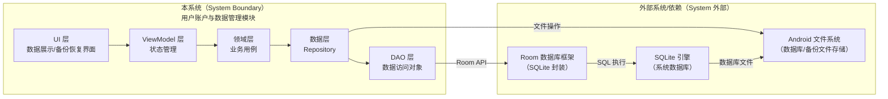
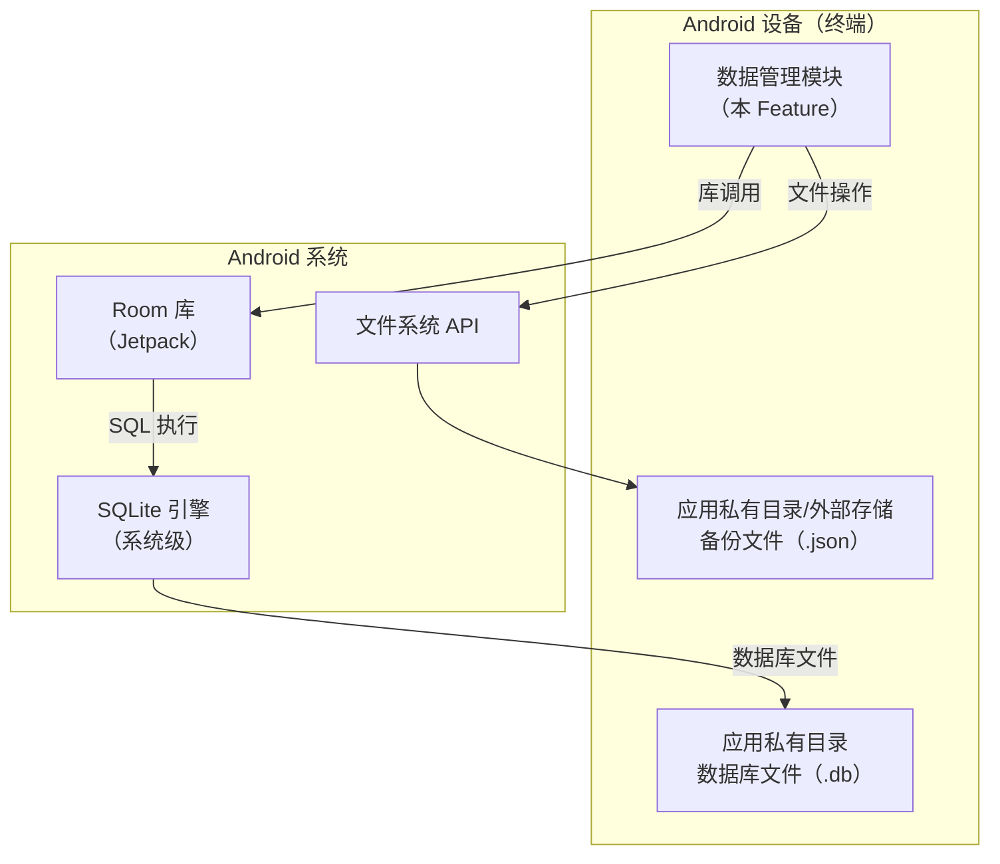
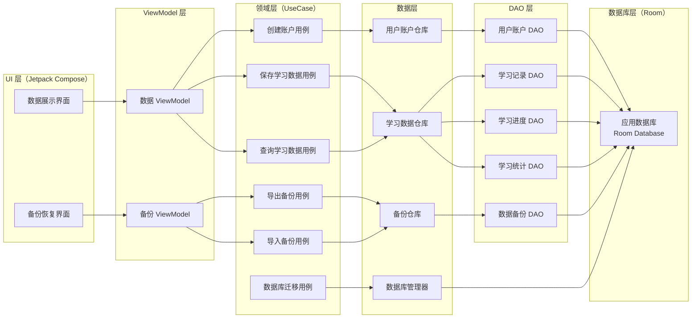
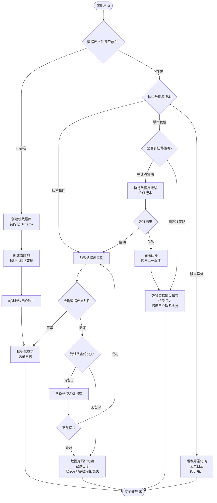
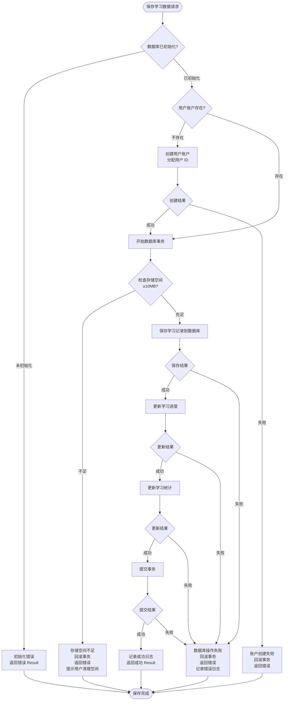
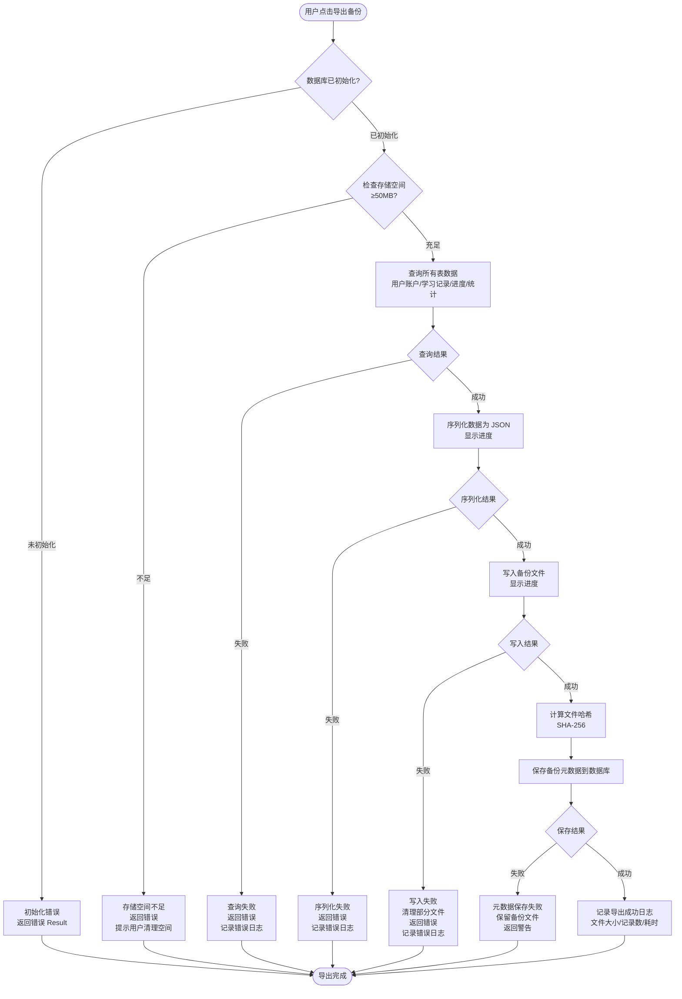
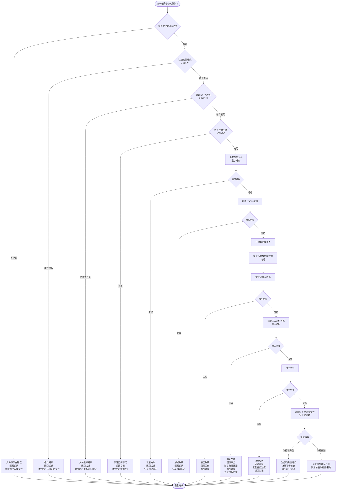

# Full Design：用户账户与数据管理

**Epic**：EPIC-001 - 无痛记忆单词神器APP
**Feature ID**：FEAT-005
**Feature Version**：v0.1.0
**Plan Version**：v0.1.0
**Tasks Version**：v0.1.0
**Full Design Version**：v0.1.0

**分支**：`epic/EPIC-001-word-memory-app`
**日期**：2026-01-19
**输入工件**：
- `spec.md`
- `plan.md`
- `tasks.md`
- `research.md` / `data-model.md` / `contracts/` / `quickstart.md`（不存在）

> Agent 规则（强制）：
> - 本文档**只能整合现有产物**（spec/plan/tasks 等），**不得新增技术决策**。
> - 若遇到决策缺口，只能标注为 `TODO(Clarify): ...` 并指向应补齐的来源文档/章节。
> - 本文档用于评审与执行：层次必须清晰、结构化、可追溯。

## 变更记录（增量变更）

| 版本 | 日期 | 变更范围（Feature/Story/Task） | 变更摘要 | 影响模块 | 是否需要回滚设计 |
|---|---|---|---|---|---|
| v0.1.0 | 2026-01-19 | Feature | 初始版本：整合 spec.md、plan.md、tasks.md 生成 Full Design 文档 |  | 否 |

## 1. 背景与范围（来自 spec.md）

- **背景**：
  - 应用需要可靠地存储和管理用户的学习数据（学习记录、进度、统计等）
  - 用户需要个人账户来标识和管理自己的学习数据
  - 数据持久化是应用的基础能力，所有功能模块都依赖数据存储和查询
  - 现有应用缺乏统一的数据管理能力，需要建立可扩展的数据存储框架
  - 数据丢失风险会影响用户学习进度和信任度，需要实现数据备份和恢复机制

- **目标**：
  - **用户目标**：用户的学习数据能够可靠存储，不丢失，应用重启后数据完整恢复
  - **业务目标**：建立统一的数据管理能力，为所有功能模块提供稳定的数据存储和访问接口
  - **平台目标**：建立可扩展的数据模型和存储框架，支持未来扩展更多数据类型和功能

- **价值**：
  - **用户价值**：用户学习数据安全可靠，不会因应用崩溃或设备问题而丢失，提升用户信任度
  - **业务价值**：为产品提供数据管理基础设施，支撑所有功能模块的数据需求
  - **技术价值**：建立统一的数据访问接口，降低各模块的数据管理复杂度，便于维护和扩展

- **In Scope**：
  - 本地数据库设计（数据模型、表结构、索引设计）
  - 学习数据持久化（学习记录、进度、统计数据的存储和查询）
  - 用户账户管理（用户账户创建、标识、基本信息管理）
  - 数据备份和恢复（数据导出、导入、备份文件管理）
  - 数据库迁移和版本管理（数据库版本升级、数据迁移策略）

- **Out of Scope**：
  - 云端同步（第一阶段仅支持本地存储）
  - 多设备数据同步（不支持跨设备数据同步）
  - 数据加密传输（本地数据不涉及网络传输）
  - 用户认证和登录（第一阶段仅支持本地账户，无需登录）
  - 数据分析和挖掘（仅提供数据存储和查询，不包含数据分析功能）

- **依赖关系**：
  - **上游依赖**：
    - Android 平台：SQLite 数据库、SharedPreferences、文件系统 API
    - Room 数据库框架（可选）：Android Jetpack Room 库用于数据库操作（若采用）
    - 数据模型定义：需要明确各功能模块的数据模型需求（学习记录、词库、统计等）
  - **下游影响**：
    - 单词库管理（FEAT-001）：依赖数据存储能力存储词库元数据
    - 间隔重复学习算法引擎（FEAT-002）：依赖数据存储能力存储学习状态和复习记录
    - 学习界面与交互（FEAT-003）：依赖数据存储能力查询和更新学习进度
    - 游戏化与激励机制（FEAT-004）：依赖数据存储能力存储成就、积分等数据
    - 学习进度与统计（FEAT-005）：依赖数据存储能力查询和聚合学习数据
    - 多媒体支持（FEAT-006）：依赖数据存储能力存储多媒体资源元数据

## 2. 0 层架构设计（对外系统边界、部署、通信、交互）（来自 plan.md）

> 定义：0 层架构设计反映"本系统与外部系统之间的关系"。必须覆盖：结构、部署、通信方式、交互方式与边界。
>
> 规则：本节只允许**复用/整合** `plan.md` 中已经明确的内容；不得新增技术决策。若 plan 缺失，用 `TODO(Clarify)` 指回 plan 对应章节补齐。

### 2.1 外部系统与依赖清单（来自 plan.md）

| 外部系统/依赖 | 类型 | 关键能力/数据 | 通信方式（协议/鉴权） | SLA/限流/超时 | 故障模式 | 我方策略 | 引用来源 |
|---|---|---|---|---|---|---|---|
| Room 数据库框架 | 内部库（Android Jetpack） | SQLite 数据库封装、类型安全 API、迁移支持 | 本地库调用 | 数据库操作性能要求 | 数据库文件损坏、迁移失败 | 数据库损坏检测、备份恢复、迁移回滚 | plan.md:A2.1 |
| SQLite 数据库引擎 | 设备能力（Android 系统） | 关系型数据库、ACID 事务、SQL 查询 | 系统 API（通过 Room） | 系统级，I/O 性能 | 存储空间不足、文件系统错误 | 检测空间、错误处理、用户提示 | plan.md:A2.1 |
| Android 文件系统 | 设备能力 | 数据库文件存储、备份文件存储 | 系统 API | 文件 I/O | 存储空间不足、权限被拒绝 | 检测空间、权限检查、错误提示 | plan.md:A2.1 |
| SharedPreferences（可选） | 设备能力 | 用户偏好设置（如备份路径） | 系统 API | 本地存储 | 存储失败 | 降级处理、错误日志 | plan.md:A2.1 |

### 2.2 0 层架构图（系统边界 + 外部交互）（来自 plan.md）

### 2.3 部署视图（来自 plan.md）

### 2.4 通信与交互说明（来自 plan.md）

- **协议**：本地数据库操作（Room API）、本地文件存储（文件系统 API）
- **鉴权**：无需鉴权（本地操作，应用沙箱保护）
- **超时与重试**：数据库操作超时 5 秒，查询失败不重试（本地操作）；备份恢复操作超时 30 秒，失败时允许用户重试
- **幂等**：数据库写入使用事务确保原子性；备份导出操作：基于时间戳生成唯一文件名，可重复导出
- **限流**：无外部限流（本地操作）；内部限流：数据库连接池限制并发连接数（Room 默认配置）
- **数据一致性**：强一致（ACID 事务），数据库操作使用事务，确保数据一致性

## 3. 1 层架构设计（系统内部框架图 + 模块拆分 + 接口协议）（来自 plan.md）

> 定义：1 层架构设计描述"系统内部的模块拆分与协作"，包括框架图、模块职责、模块交互、通信方式、接口协议等。

### 3.1 1 层框架图（来自 plan.md）

### 3.2 模块拆分与职责（来自 plan.md）

| 模块 | 职责 | 输入/输出 | 依赖 | 约束 |
|---|---|---|---|---|
| UI 层（Jetpack Compose） | 数据展示、备份恢复界面、用户交互 | 输入：用户操作事件 输出：UI 状态展示 | ViewModel | 仅负责 UI 展示，不包含业务逻辑 |
| ViewModel 层 | 管理 UI 状态、处理用户事件、调用 UseCase | 输入：用户事件、UseCase 结果 输出：UI 状态（State） | Domain 层（UseCase） | 不直接访问数据层 |
| Domain 层（UseCase） | 业务逻辑封装、流程编排、数据转换 | 输入：业务请求 输出：业务结果 | Data 层（Repository） | 不依赖 UI 层，可测试性 |
| Repository 层 | 数据访问抽象、多数据源协调、业务逻辑封装 | 输入：数据请求 输出：数据实体 | DAO 层 | 统一数据访问接口，未来可扩展云端同步 |
| DAO 层 | 数据库访问封装、SQL 查询执行 | 输入：数据操作请求 输出：数据实体/结果 | Database（Room） | 仅负责数据库操作，不包含业务逻辑 |
| Database 层（Room） | 数据库定义、实体映射、迁移管理 | 输入：数据库配置 输出：数据库实例 | SQLite | 数据库 Schema 定义、版本管理 |

### 3.3 模块协作与通信方式（来自 plan.md）

- **调用关系**：
  - UI → ViewModel → UseCase → Repository → DAO → Database
  - UI → ViewModel（用户事件、状态观察）
  - ViewModel → UseCase（业务调用，suspend 函数）
  - UseCase → Repository（数据请求）
  - Repository → DAO（数据库操作）
  - DAO → Database（SQL 执行）
  - DatabaseManager → Database（初始化、迁移）
- **通信方式**：
  - 函数调用：Kotlin 函数调用，使用协程处理异步操作
  - 状态管理：ViewModel 使用 StateFlow/Flow 暴露状态，UI 使用 collectAsState 观察
  - 错误处理：使用 Result/Sealed Class 封装成功/失败状态
- **接口协议**：
  - 数据结构：使用 Room Entity 定义实体（@Entity 注解）
  - 错误码：使用 Sealed Class 定义错误类型（DatabaseError, BackupError）
  - 版本策略：数据库版本号（Room version），向后兼容策略
  - 幂等约束：数据库写入使用事务，确保原子性
- **并发与线程模型**：
  - 主线程：UI 操作、状态更新
  - IO 线程：数据库操作、文件 I/O（Dispatchers.IO）
  - 协程：UseCase 和 Repository 使用 suspend 函数，由 ViewModel 在 ViewModelScope 中调用
  - 共享状态保护：Room DAO 方法使用 suspend 函数，Room 自动处理线程安全；ViewModel 使用线程安全的状态容器（StateFlow）

### 3.4 关键模块设计（详细设计 + 取舍）（来自 plan.md）

#### 模块：DatabaseManager（数据库管理器）

- **模块定位**：负责数据库初始化、版本管理、迁移执行，位于 Data 层，应用启动时调用
- **设计目标**：可靠性（100% 初始化成功率）、性能（初始化时间 <100ms）、可扩展性（支持版本升级）
- **核心数据结构/状态**：
  - 数据库版本：当前版本号（Room version）
  - 迁移策略：Migration 列表
  - 初始化状态：未初始化/初始化中/已初始化/初始化失败
- **对外接口（协议）**：
  - `suspend fun initializeDatabase(): Result<AppDatabase>`：初始化数据库
  - `fun getDatabase(): AppDatabase?`：获取数据库实例（已初始化）
  - 错误码：`DatabaseError`（Sealed Class：InitializationError, MigrationError, CorruptionError）
- **策略与算法**：
  - 初始化策略：单例模式，应用启动时初始化一次
  - 版本检测：Room 自动检测数据库版本，触发迁移
  - 迁移策略：增量迁移（每个版本一个 Migration），数据不丢失
  - 损坏检测：数据库打开时检测，若损坏则尝试从备份恢复
- **失败与降级**：
  - 初始化失败：返回错误 Result，记录日志，提示用户
  - 迁移失败：回滚到上一版本，记录错误日志，提示用户联系支持
  - 数据库损坏：尝试从备份恢复，若不可用则提示用户数据可能丢失
- **安全与隐私**：
  - 数据库文件存储在应用私有目录，不共享
  - 不记录敏感数据到日志
- **可观测性**：
  - 记录数据库初始化事件（耗时、版本、成功/失败）
  - 记录数据库迁移事件（旧版本、新版本、迁移结果、耗时）
  - 记录数据库损坏事件（检测时间、恢复结果）
- **优缺点与替代方案**：
  - **优点**：集中管理数据库生命周期，易于维护和扩展；Room 内置迁移支持，降低复杂度
  - **缺点/代价**：增加一层抽象，但收益大于成本
  - **替代方案与否决理由**：不使用手动 SQLite 初始化（Room 提供更好的抽象和迁移支持）

#### 模块：LearningDataRepository（学习数据仓库）

- **模块定位**：统一学习数据的访问接口，封装底层 DAO 细节，提供数据访问抽象，位于 Data 层
- **设计目标**：性能（查询 ≤100ms p95）、一致性（事务保证）、可测试性、可扩展性（未来支持缓存）
- **核心数据结构/状态**：
  - 实体：`LearningRecord`、`LearningProgress`、`LearningStatistics`
  - 查询结果：Flow<List<T>>（支持实时更新）
- **对外接口（协议）**：
  - `suspend fun saveLearningRecord(record: LearningRecord): Result<Unit>`：保存学习记录
  - `suspend fun getLearningRecords(userId: String, startDate: Long?, endDate: Long?): Flow<List<LearningRecord>>`：查询学习记录
  - `suspend fun updateLearningProgress(progress: LearningProgress): Result<Unit>`：更新学习进度
  - `suspend fun getLearningProgress(userId: String): Flow<LearningProgress?>`：查询学习进度
  - `suspend fun saveLearningStatistics(statistics: LearningStatistics): Result<Unit>`：保存学习统计
  - `suspend fun getLearningStatistics(userId: String, startDate: Long?, endDate: Long?): Flow<List<LearningStatistics>>`：查询学习统计
  - 错误码：`DatabaseError`
- **策略与算法**：
  - 批量操作：使用 @Transaction 批量插入/更新，提升性能
  - 查询优化：使用索引加速查询（userId、日期字段）
  - 实时更新：使用 Flow 返回查询结果，支持数据变化实时通知
- **失败与降级**：
  - 数据库操作失败：返回错误 Result，由调用方处理
  - 查询超时（>5秒）：取消查询，返回空结果，记录日志
- **安全与隐私**：
  - 数据存储在应用私有目录
  - 查询结果不包含敏感信息
- **可观测性**：
  - 记录数据操作事件（操作类型、表名、记录数、耗时、成功/失败）
  - 记录查询超时事件
- **优缺点与替代方案**：
  - **优点**：统一数据访问接口，易于测试和扩展；Flow 支持实时更新；事务保证一致性
  - **缺点/代价**：Repository 层增加代码量，但收益大于成本
  - **替代方案与否决理由**：不使用直接 DAO 调用（耦合度高、难以测试和扩展）

#### 模块：BackupRepository（备份仓库）

- **模块定位**：负责数据备份导出和恢复，位于 Data 层
- **设计目标**：可靠性（备份成功率 ≥99%）、性能（导出 1000 条记录 ≤5 秒）、完整性（数据不丢失）
- **核心数据结构/状态**：
  - 备份文件格式：JSON（包含所有表数据）
  - 备份元数据：备份时间、文件大小、记录数
- **对外接口（协议）**：
  - `suspend fun exportBackup(filePath: String, onProgress: (Int) -> Unit): Result<DataBackup>`：导出备份
  - `suspend fun importBackup(filePath: String, onProgress: (Int) -> Unit): Result<Unit>`：导入备份
  - `suspend fun validateBackupFile(filePath: String): Result<BackupMetadata>`：验证备份文件
  - 错误码：`BackupError`（Sealed Class：ExportError, ImportError, FormatError, CorruptionError）
- **策略与算法**：
  - 导出策略：查询所有表数据，序列化为 JSON，写入文件
  - 导入策略：读取 JSON 文件，反序列化，批量插入数据库（使用事务）
  - 完整性校验：导出后计算文件哈希（SHA-256），导入时验证
  - 进度计算：基于已处理记录数 / 总记录数
- **失败与降级**：
  - 导出失败：清理部分文件，返回错误，记录日志
  - 导入失败：回滚事务，恢复原数据，返回错误
  - 文件格式错误：返回格式错误，提示用户选择正确文件
- **安全与隐私**：
  - 备份文件可选择存储位置（私有目录或外部存储）
  - 外部存储时提示用户注意数据安全
- **可观测性**：
  - 记录备份导出事件（文件大小、记录数、耗时、成功/失败）
  - 记录备份恢复事件（文件大小、记录数、恢复前后数据量、耗时、成功/失败）
- **优缺点与替代方案**：
  - **优点**：JSON 格式可读性强，便于调试；事务保证导入原子性；完整性校验保证数据正确性
  - **缺点/代价**：JSON 文件较大（约 1-2MB/1000 条记录），但在可接受范围内
  - **替代方案与否决理由**：不使用 SQLite 文件复制（版本兼容性问题）；不使用二进制格式（可读性差）

### 3.5 数据模型与存储设计（物理）（来自 plan.md）

> 要求：本节用于汇总可落地的"表/键/文件结构 + 迁移策略"，避免仅停留在逻辑实体描述。

#### 存储形态与边界

- **存储形态**：Room/SQLite（数据库文件）、文件系统（JSON 备份文件）
- **System of Record（权威来源）**：SQLite 数据库为准，备份文件为导出副本
- **缓存与派生数据**：
  - 学习进度：可从学习记录计算得出（派生数据），但为提升查询性能，独立存储
  - 学习统计：可从学习记录聚合得出（派生数据），但为提升查询性能，按日存储
- **生命周期**：
  - 数据库文件：常驻（应用生命周期）
  - 查询结果缓存：前台期间（界面显示期间）
  - 备份文件：用户手动管理（可选择保留或删除）
- **数据规模与增长**：
  - 用户账户：1 条记录（单用户应用）
  - 学习记录：预计 1-10 万条（每日约 50-500 条）
  - 学习进度：1 条记录
  - 学习统计：预计 365-3650 条（每日 1 条，1-10 年）
  - 数据备份：用户自定义（预计 1-10 个备份文件）

#### 物理数据结构

#####（数据库）表结构清单

| 表 | 用途 | 主键/唯一约束 | 索引 | 外键 | 典型查询（Top3） | 数据量级 |
|---|---|---|---|---|---|---|
| user_account | 用户账户 | userId (PRIMARY KEY) | userId | 无 | 1. 查询当前用户账户 2. 创建用户账户 3. 更新最后活跃时间 | 1 条 |
| learning_record | 学习记录 | recordId (PRIMARY KEY) | userId, wordId, learningTime | userId → user_account.userId | 1. 按用户 ID 查询学习记录 2. 按日期范围查询 3. 按单词 ID 查询 | 1-10 万条 |
| learning_progress | 学习进度 | progressId (PRIMARY KEY) | userId (UNIQUE) | userId → user_account.userId | 1. 查询用户学习进度 2. 更新学习进度 | 1 条 |
| learning_statistics | 学习统计 | statisticsId (PRIMARY KEY) | userId, statisticsDate | userId → user_account.userId | 1. 按用户 ID 和日期查询 2. 按日期范围查询统计 3. 查询最新统计 | 365-3650 条 |
| data_backup | 数据备份元数据 | backupId (PRIMARY KEY) | backupTime | 无 | 1. 查询备份列表 2. 按时间查询备份 3. 删除备份记录 | 1-10 条 |

#####（数据库）字段说明

**表**：`user_account`

| 字段 | 类型 | 约束（NOT NULL/默认值/范围） | 含义 | 来源/生成方式 | 用途（读写场景） |
|---|---|---|---|---|---|
| userId | TEXT | PRIMARY KEY, NOT NULL | 用户唯一标识符 | UUID 生成 | 所有查询和关联 |
| createdAt | INTEGER | NOT NULL | 账户创建时间（Unix 时间戳，毫秒） | 系统时间 | 创建时写入，查询时读取 |
| lastActiveAt | INTEGER | NOT NULL | 最后活跃时间（Unix 时间戳，毫秒） | 系统时间 | 每次操作时更新 |

**表**：`learning_record`

| 字段 | 类型 | 约束（NOT NULL/默认值/范围） | 含义 | 来源/生成方式 | 用途（读写场景） |
|---|---|---|---|---|---|
| recordId | TEXT | PRIMARY KEY, NOT NULL | 学习记录唯一标识符 | UUID 生成 | 所有查询和关联 |
| userId | TEXT | NOT NULL, FOREIGN KEY | 用户 ID | 关联 user_account | 按用户查询、关联查询 |
| wordId | TEXT | NOT NULL | 单词 ID | 来自 FEAT-001 词库管理 | 按单词查询 |
| learningTime | INTEGER | NOT NULL | 学习时间（Unix 时间戳，毫秒） | 系统时间 | 按日期范围查询、排序 |
| result | INTEGER | NOT NULL, 0 或 1 | 学习结果（0=不认识，1=认识） | 用户输入 | 统计正确率 |
| reviewInterval | INTEGER | NOT NULL, ≥ 0 | 复习间隔（天） | 来自 FEAT-002 算法引擎 | 复习计划查询 |

**表**：`learning_progress`

| 字段 | 类型 | 约束（NOT NULL/默认值/范围） | 含义 | 来源/生成方式 | 用途（读写场景） |
|---|---|---|---|---|---|
| progressId | TEXT | PRIMARY KEY, NOT NULL | 进度 ID | UUID 生成 | 所有查询 |
| userId | TEXT | NOT NULL, UNIQUE, FOREIGN KEY | 用户 ID | 关联 user_account | 查询用户进度 |
| totalLearningDays | INTEGER | NOT NULL, DEFAULT 0, ≥ 0 | 总学习天数 | 从学习记录计算 | 进度展示 |
| totalWordsLearned | INTEGER | NOT NULL, DEFAULT 0, ≥ 0 | 总学习单词数 | 从学习记录计算 | 进度展示 |
| currentWordsCount | INTEGER | NOT NULL, DEFAULT 0, ≥ 0 | 当前学习单词数 | 从学习记录计算 | 进度展示 |
| lastLearningTime | INTEGER | NOT NULL | 最后学习时间（Unix 时间戳，毫秒） | 系统时间 | 进度展示 |

**表**：`learning_statistics`

| 字段 | 类型 | 约束（NOT NULL/默认值/范围） | 含义 | 来源/生成方式 | 用途（读写场景） |
|---|---|---|---|---|---|
| statisticsId | TEXT | PRIMARY KEY, NOT NULL | 统计 ID | UUID 生成 | 所有查询 |
| userId | TEXT | NOT NULL, FOREIGN KEY | 用户 ID | 关联 user_account | 按用户查询 |
| statisticsDate | INTEGER | NOT NULL | 统计日期（Unix 时间戳，毫秒，日期部分） | 系统时间 | 按日期查询、聚合 |
| wordsLearned | INTEGER | NOT NULL, DEFAULT 0, ≥ 0 | 当日学习单词数 | 从学习记录聚合 | 统计展示 |
| accuracy | REAL | NOT NULL, DEFAULT 0.0, 0.0-1.0 | 正确率（0.0-1.0） | 从学习记录计算 | 统计展示 |
| learningDuration | INTEGER | NOT NULL, DEFAULT 0, ≥ 0 | 学习时长（秒） | 从学习记录计算 | 统计展示 |

**表**：`data_backup`

| 字段 | 类型 | 约束（NOT NULL/默认值/范围） | 含义 | 来源/生成方式 | 用途（读写场景） |
|---|---|---|---|---|---|
| backupId | TEXT | PRIMARY KEY, NOT NULL | 备份 ID | UUID 生成 | 所有查询 |
| backupTime | INTEGER | NOT NULL | 备份时间（Unix 时间戳，毫秒） | 系统时间 | 查询备份列表、排序 |
| filePath | TEXT | NOT NULL | 备份文件路径 | 用户选择或系统生成 | 恢复时定位文件 |
| fileSize | INTEGER | NOT NULL, ≥ 0 | 文件大小（字节） | 文件系统 | 备份信息展示 |
| recordCount | INTEGER | NOT NULL, ≥ 0 | 记录数 | 备份时统计 | 备份信息展示 |

#####（数据库）迁移与兼容策略

- **Schema 版本**：v1（初始版本）
- **向后兼容**：
  - 新增列：使用默认值（DEFAULT 约束）或允许 NULL
  - 字段废弃：保留字段，标记为废弃，新版本不再使用
  - 索引变更：新增索引不影响旧版本，删除索引需在迁移中处理
- **迁移策略**：
  - Migration 列表：每个版本升级一个 Migration（例如：Migration(1, 2)）
  - 失败回滚：迁移失败时回滚到上一版本，保持数据库可访问
  - 数据回填：新增字段需要回填默认值的，在迁移中执行 UPDATE 语句
  - 测试验证：每个 Migration 必须编写测试验证迁移正确性

## 4. 关键流程设计（每个流程一张流程图，含正常 + 全部异常）（来自 plan.md）

> 定义：每个关键流程必须用 `flowchart` 绘制，且同一张图内覆盖正常流程与全部关键异常分支（失败/超时/并发/生命周期等）。

### 流程 1：数据库初始化流程

### 流程 2：学习数据保存流程

### 流程 3：数据备份导出流程

### 流程 4：数据备份恢复流程

## 5. Feature → Story → Task 追溯关系

> 规则：
> - Feature 层：FR/NFR（来自 spec.md）
> - Story 层：ST-xxx（来自 plan.md 的 Story Breakdown）
> - Task 层：Txxx（来自 tasks.md）

### 5.1 Story 列表（来自 plan.md）

| Story ID | 类型 | 目标 | 覆盖 FR/NFR | 依赖 | 关键风险 |
|---|---|---|---|---|---|
| ST-001 | Infrastructure | 数据库能够自动初始化，支持版本升级和数据迁移，初始化时间 <100ms | FR-006；FR-007；NFR-PERF-001；NFR-REL-001；NFR-REL-003；NFR-OBS-001 | Room 数据库框架、SQLite 引擎 | 是（RISK-001、RISK-002） |
| ST-002 | Functional | 用户账户能够自动创建，提供唯一用户 ID，支持账户信息查询和更新 | FR-001；NFR-PERF-001；NFR-REL-001 | ST-001 | 否 |
| ST-003 | Functional | 学习数据能够正确存储和查询，支持条件查询，查询性能符合要求 | FR-002；FR-003；NFR-PERF-001；NFR-PERF-002；NFR-REL-001；NFR-OBS-001 | ST-001、ST-002 | 是（RISK-003、RISK-005） |
| ST-004 | Functional | 能够导出完整数据备份，能够从备份文件恢复数据，备份恢复成功率 ≥99% | FR-004；FR-005；NFR-PERF-003；NFR-REL-002；NFR-OBS-003 | ST-001、ST-003 | 是（RISK-004） |
| ST-005 | Infrastructure | 所有数据库操作错误能够正确处理和记录，关键事件能够记录日志 | FR-008；NFR-OBS-001；NFR-OBS-002；NFR-OBS-003 | 所有其他 Story | 否 |
| ST-006 | Optimization | 存储空间不足时能够检测和提示，数据库性能优化，内存占用符合要求 | NFR-PERF-001；NFR-PERF-002；NFR-MEM-001；NFR-MEM-002；NFR-POWER-001 | ST-001、ST-003 | 是（RISK-003、RISK-006） |

### 5.2 追溯矩阵（FR/NFR → Story → Task）

| FR/NFR ID | Story ID | Task ID | 验证方式（来自 tasks.md） | 备注 |
|---|---|---|---|---|
| FR-001 | ST-002 | T200-T204 | 单元测试验证账户管理；用户 ID 唯一性验证 | 用户账户管理 |
| FR-002 | ST-003 | T300-T308 | 单元测试、集成测试、性能测试；单表查询 p95 ≤100ms、批量插入 ≤1 秒 | 学习数据持久化 |
| FR-003 | ST-003 | T300-T308 | 单元测试、集成测试；按条件查询验证 | 学习数据查询 |
| FR-004 | ST-004 | T400-T407 | 集成测试、性能测试；导出 1000 条记录 ≤5 秒 | 数据备份导出 |
| FR-005 | ST-004 | T400-T407 | 集成测试、性能测试；恢复 ≤10 秒、成功率 ≥99% | 数据备份恢复 |
| FR-006 | ST-001 | T100-T108 | 单元测试验证初始化逻辑和迁移逻辑；迁移失败能够回滚 | 数据库版本升级 |
| FR-007 | ST-001 | T106、T108 | 单元测试验证初始化逻辑；初始化时间 <100ms | 数据库初始化 |
| FR-008 | ST-005 | T500-T504 | 单元测试验证错误处理逻辑；错误日志格式统一 | 错误处理 |
| NFR-PERF-001 | ST-003、ST-006 | T308、T604 | 性能测试；单表查询 p95 ≤100ms、批量插入 ≤1 秒 | 查询性能 |
| NFR-PERF-002 | ST-003、ST-006 | T308、T604 | 性能测试；单条记录插入 p95 ≤50ms、批量更新 p95 ≤500ms | 写入性能 |
| NFR-PERF-003 | ST-004 | T407 | 性能测试；导出 1000 条记录 ≤5 秒、恢复 ≤10 秒 | 备份恢复性能 |
| NFR-PERF-004 | ST-005 | T500 | 错误处理测试；查询失败返回空结果、写入失败提示用户 | 降级策略 |
| NFR-POWER-001 | ST-006 | T604 | 性能测试；每日电池消耗增量 ≤10mAh | 功耗优化 |
| NFR-MEM-001 | ST-006 | T603、T604 | 内存分析；内存峰值 ≤25MB | 内存占用 |
| NFR-MEM-002 | ST-006 | T603、T604 | 内存分析；查询完成后释放结果集、批量操作完成后释放临时内存 | 内存生命周期 |
| NFR-SEC-001 | ST-001、ST-004 | T106、T403 | 代码审查；数据存储在应用私有目录 | 数据存储位置 |
| NFR-SEC-002 | ST-001 | T106 | 代码审查；数据库文件仅应用自身可访问 | 数据库访问权限 |
| NFR-SEC-003 | ST-004 | T403 | 代码审查；备份文件存储位置选择、外部存储时提示用户 | 备份文件存储 |
| NFR-OBS-001 | ST-001、ST-003、ST-005 | T021、T501、T502 | 日志测试；记录数据库操作事件、版本升级事件 | 数据库操作事件 |
| NFR-OBS-002 | ST-005 | T500、T504 | 日志测试；记录错误日志（错误类型、SQL 语句、错误详情、堆栈信息） | 错误日志 |
| NFR-OBS-003 | ST-004、ST-005 | T503 | 日志测试；记录备份导出/恢复事件（文件大小、记录数、耗时、成功/失败） | 备份恢复事件 |
| NFR-REL-001 | ST-001、ST-003 | T108、T307 | 集成测试；数据库操作成功率 ≥99.9%、数据持久化成功率 100% | 操作成功率 |
| NFR-REL-002 | ST-004 | T406 | 集成测试；备份恢复成功率 ≥99%、备份文件完整性校验通过率 100% | 备份恢复成功率 |
| NFR-REL-003 | ST-001 | T107、T108 | 单元测试；版本升级成功率 ≥99%、迁移失败能够回滚 | 版本升级成功率 |
| NFR-REL-004 | ST-001、ST-003 | T106、T304 | 崩溃测试；崩溃时事务自动回滚、数据处于一致状态 | 崩溃恢复 |

## 6. 技术风险与消解策略（来自 plan.md）

| 风险ID | 风险描述 | 触发条件 | 影响范围 | 严重度 | 消解策略 | 对应 Story/Task |
|---|---|---|---|---|---|---|
| RISK-001 | 数据库初始化失败，导致应用无法使用 | 数据库文件损坏、迁移失败、存储空间不足 | 所有功能模块 | High | 数据库损坏检测、备份恢复机制、错误提示和日志记录 | ST-001 / T106、T108 |
| RISK-002 | 数据库版本迁移失败，导致数据丢失 | 迁移策略错误、数据不兼容、迁移过程中应用崩溃 | 用户学习数据 | High | 迁移前备份、迁移回滚机制、迁移测试验证 | ST-001 / T107、T108 |
| RISK-003 | 数据库操作性能不达标，影响用户体验 | 查询未使用索引、批量操作未优化、数据库连接泄漏 | 数据查询和写入性能 | Med | 索引优化、批量操作优化、连接池管理、性能测试 | ST-003、ST-006 / T601、T602、T604 |
| RISK-004 | 数据备份恢复失败，用户数据丢失 | 备份文件损坏、恢复过程失败、数据不一致 | 用户数据安全性 | High | 备份文件完整性校验、恢复事务回滚、数据验证 | ST-004 / T403、T406 |
| RISK-005 | 并发写入导致数据不一致 | 多线程同时写入、事务未正确使用 | 数据一致性 | Med | 使用数据库事务、Room 线程安全保证、并发测试 | ST-003 / T304、T307 |
| RISK-006 | 存储空间不足导致数据操作失败 | 数据库文件增长、备份文件积累 | 数据持久化功能 | Med | 存储空间检测、数据清理机制、用户提示 | ST-006 / T600 |

## 7. 异常 & 边界场景梳理（来自 spec.md + plan.md）

- **数据边界**：
  - 空数据：空表查询、空备份文件
  - 超大数据：数据库文件 >100MB、备份文件 >50MB、单条记录 >1KB
  - 非法数据：字段类型错误、约束违反、外键不存在
  - 重复数据：重复用户账户、重复学习记录
  - 过期数据：备份文件版本过旧、数据库版本过旧
- **状态边界**：
  - 状态机不可达：数据库未初始化时执行操作、迁移过程中的操作
  - 状态回退：迁移失败回滚、恢复失败回滚
  - 状态重入：并发初始化、并发迁移
- **生命周期**：
  - 前后台切换：应用进入后台时数据库操作、恢复时数据库状态
  - 进程被杀：数据库事务中断、数据写入中断
  - 应用恢复：崩溃后数据库状态、数据一致性检查
- **并发**：
  - 多线程写入：同时保存学习记录、同时更新进度
  - 协程并发：多个协程同时查询、同时写入
  - 并发迁移：迁移过程中执行查询/写入操作
- **用户行为**：
  - 快速连点：快速连续导出备份、快速连续恢复
  - 权限拒绝：文件系统访问权限被拒绝
  - 存储清理：用户手动删除数据库文件、删除备份文件

## 8. 埋点/可观测性设计（来自 spec.md NFR-OBS + plan.md 约束）

> 注意：只整合既有要求；不要新增指标口径或埋点策略决策。

| 事件/指标 | 触发点 | 字段 | 采样/频率 | 用途 | 关联 FR/NFR |
|---|---|---|---|---|---|
| 数据库操作事件 | 数据库操作（查询/写入/更新/删除）前后 | 操作类型、表名、记录数、耗时、成功/失败 | 全量（错误操作） 采样（查询操作） | 性能监控、错误排查 | NFR-OBS-001 |
| 数据库版本升级事件 | 数据库迁移执行时 | 旧版本、新版本、迁移结果、耗时 | 全量 | 版本管理、迁移问题排查 | NFR-OBS-001 |
| 数据库初始化事件 | 应用启动时数据库初始化 | 耗时、版本、成功/失败 | 全量 | 启动性能监控、初始化问题排查 | NFR-OBS-001 |
| 数据库错误日志 | 数据库操作失败时 | 错误类型、SQL 语句、错误详情、堆栈信息 | 全量 | 错误排查、问题定位 | NFR-OBS-002 |
| 备份导出事件 | 备份导出操作完成时 | 文件大小、记录数、耗时、成功/失败 | 全量 | 备份操作监控、性能分析 | NFR-OBS-003 |
| 备份恢复事件 | 备份恢复操作完成时 | 文件大小、记录数、恢复前后数据量、耗时、成功/失败 | 全量 | 恢复操作监控、数据完整性验证 | NFR-OBS-003 |

## 9. 算法 / 性能 / 功耗 / 内存评估结果（来自 plan.md）

### 9.1 算法评估

> 本 Feature 不涉及复杂算法，主要为数据库操作和文件 I/O，无需算法评估。

### 9.2 性能评估

- **前台**：
  - 数据库查询（单表，p50/p95/p99）：≤ 30ms / ≤ 100ms / ≤ 200ms
  - 数据库写入（单条记录，p50/p95/p99）：≤ 20ms / ≤ 50ms / ≤ 100ms
  - 数据库批量写入（100 条记录，p50/p95/p99）：≤ 200ms / ≤ 500ms / ≤ 1000ms
  - 数据库初始化（p50/p95/p99）：≤ 50ms / ≤ 100ms / ≤ 200ms
- **后台**：
  - 数据备份导出（1000 条记录）：≤ 3 秒（p50） / ≤ 5 秒（p95） / ≤ 10 秒（p99）
  - 数据备份恢复（1000 条记录）：≤ 5 秒（p50） / ≤ 10 秒（p95） / ≤ 20 秒（p99）
  - 数据库迁移（v1→v2，1000 条记录）：≤ 1 秒（p50） / ≤ 2 秒（p95） / ≤ 5 秒（p99）
- **阈值与验收**：
  - 单表查询 p95 ≤ 100ms（NFR-PERF-001）
  - 多表关联查询 p95 ≤ 500ms（NFR-PERF-001）
  - 批量插入（100 条记录）≤ 1 秒（NFR-PERF-001）
  - 单条记录插入 p95 ≤ 50ms（NFR-PERF-002）
  - 批量更新（50 条记录）p95 ≤ 500ms（NFR-PERF-002）
  - 数据备份导出（1000 条记录）≤ 5 秒（NFR-PERF-003）
  - 数据恢复 ≤ 10 秒（NFR-PERF-003）
  - **测试方法**：使用 Android Profiler 测量数据库操作耗时，使用自动化测试验证性能指标
- **降级策略**：
  - 查询超时（>5秒）：取消查询，返回空结果，记录日志
  - 写入超时（>5秒）：回滚事务，返回错误，提示用户
  - 备份导出超时（>30秒）：取消操作，清理部分文件，返回错误

### 9.3 功耗评估

- **Top5% 用户模型**：
  - 设备：中高端 Android 设备（CPU 性能中等）
  - 使用频次：每天 100 次数据库操作（查询 80 次、写入 20 次）
  - 场景：学习记录保存、进度查询、统计查询
  - 备份操作：每周 1 次数据备份导出（1000 条记录）
- **预估增量**：
  - 单次数据库操作（查询/写入）：约 0.05mAh
  - 每日数据库操作（100 次）：约 5mAh
  - 单次备份导出（1000 条记录，5 秒）：约 0.5mAh
  - 每周备份操作（1 次）：约 0.5mAh
  - **每日总增量**：约 5.07mAh（主要来自数据库 I/O 操作）
- **验收上限**：每日电池消耗增量 ≤ 10mAh（NFR-POWER-001）
- **降级策略**：达到阈值时，优化批量操作、减少非必要查询、延迟备份操作

### 9.4 内存评估

- **峰值/平均增量**：
  - 数据库连接池：≤ 2MB（常驻）
  - 查询结果缓存：≤ 20MB（峰值）/ ≤ 10MB（平均）
  - 备份导出临时内存：≤ 10MB（操作期间）
  - 备份恢复临时内存：≤ 15MB（操作期间）
  - **总峰值增量**：≤ 25MB（NFR-MEM-001）
  - **总平均增量**：≤ 12MB
- **生命周期**：
  - 常驻：数据库连接池（应用生命周期）
  - 前台：查询结果缓存（界面显示期间）
  - 操作完成：备份导出/恢复临时内存（操作完成后立即释放）
  - 应用退出：关闭所有数据库连接，清理缓存
- **验收标准**：
  - 峰值内存增量 ≤ 25MB（NFR-MEM-001、NFR-MEM-002）
  - 查询完成后立即释放结果集内存（NFR-MEM-002）
  - 批量操作完成后释放临时内存（NFR-MEM-002）
  - 应用退出时关闭所有数据库连接（NFR-MEM-002）
  - **测试方法**：使用 Android Profiler 监控内存使用，使用 LeakCanary 检测内存泄漏

## 10. 执行说明（只引用 tasks.md，不新增 Task）

- **执行入口**：`tasks.md`
- **验证入口**：各 Task 的验证清单 + Plan 的验收指标
- **禁止事项**：Implement 期不得修改 Plan 设计；变更走增量变更流程并提升版本

**关键里程碑**：
1. 完成阶段 0-2（准备、环境搭建、核心基础）→ 基础层就绪
2. 完成 ST-001（数据库初始化）→ **MVP 核心基础设施就绪**
3. 完成 ST-002（用户账户管理）→ 账户管理可用
4. 完成 ST-003（学习数据持久化）→ 数据持久化可用
5. 完成 ST-004（数据备份恢复）→ 备份恢复可用
6. 完成 ST-005（错误处理和可观测性）→ 错误处理完善
7. 完成 ST-006（存储空间管理和优化）→ 性能优化完成

**任务总数**：61 个任务（来自 tasks.md）
**预计工期**：根据团队规模和并行度调整（建议：2-3 周完成 MVP，4-6 周完成全部 Story）
