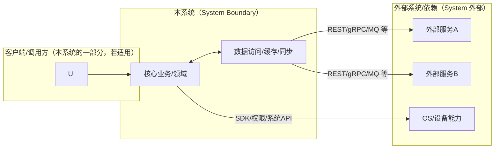
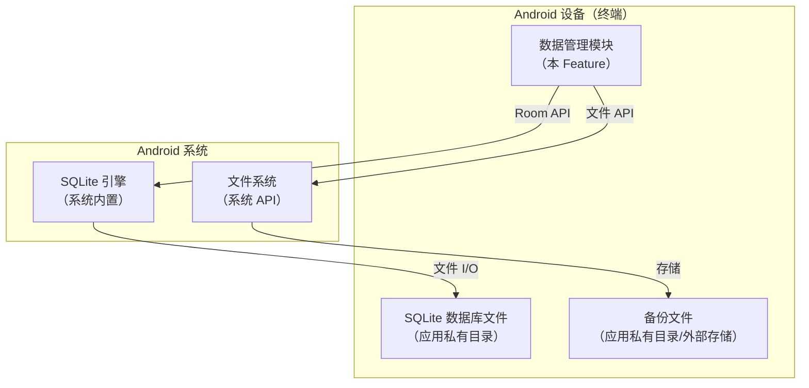
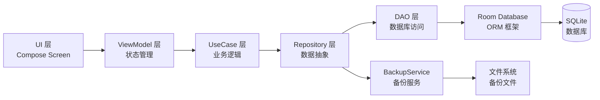
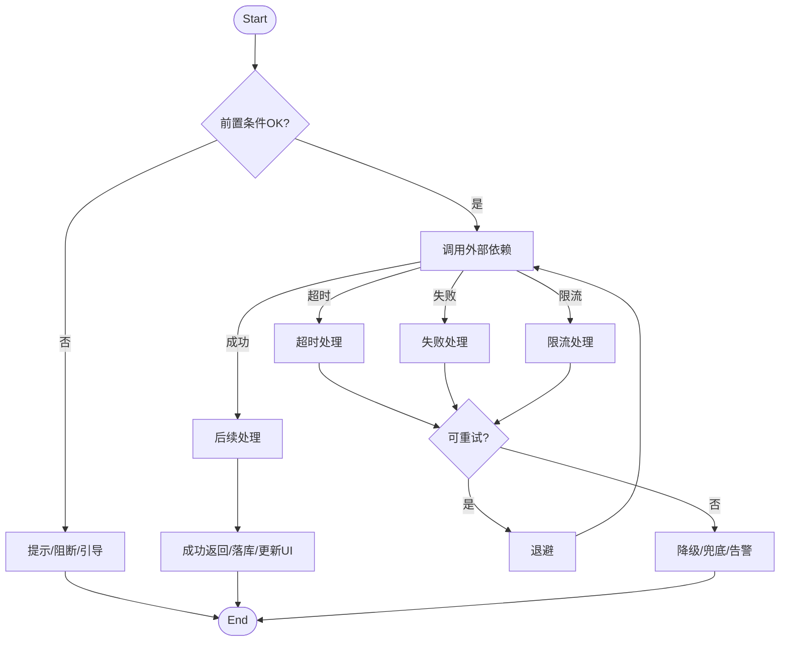
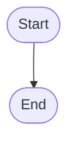

# Plan（工程级蓝图）：用户账户与数据管理

**Epic**：EPIC-001 - 无痛记忆单词神器APP
**Feature ID**：FEAT-005
**Feature Version**：v0.1.0（来自 `spec.md`）
**Plan Version**：v0.1.0
**当前工作分支**：`epic/EPIC-001-word-memory-app`
**Feature 目录**：`specs/epics/EPIC-001-word-memory-app/features/FEAT-005-user-account-data/`
**日期**：2026-01-19
**输入**：来自 `Feature 目录/spec.md`

> 规则：
> - Plan 阶段必须包含工程决策、风险评估、算法/功耗/性能/内存评估（量化 + 验收指标）。
> - Implement 阶段**不得**擅自改写 Plan 的技术决策；若必须变更，走增量变更流程并提升 Version。

## 变更记录（增量变更）

| 版本 | 日期 | 变更范围（Feature/Story/Task） | 变更摘要 | 影响模块 | 是否需要回滚设计 |
|---|---|---|---|---|---|
| v0.1.0 | 2026-01-19 | Feature | 初始版本：创建 Plan 工程级蓝图，完成技术选型、架构设计和 Story 拆分 |  | 否 |

## 概述

**核心需求**：实现本地数据存储、用户账户管理和数据持久化能力，为所有功能模块提供统一的数据存储和访问接口，支持学习数据可靠存储、查询、备份和恢复。

**关键工程决策**：
1. **数据库框架**：使用 Android Jetpack Room 库作为数据库抽象层，提供类型安全的 SQL 访问、编译时验证和迁移支持
2. **存储方案**：使用 SQLite 数据库存储学习数据，数据库文件存储在应用私有目录，符合隐私要求
3. **用户账户**：第一阶段实现单用户模式，使用本地 UUID 作为用户标识，无需登录认证
4. **备份策略**：使用 JSON 格式导出数据备份，支持文件系统存储，未来可扩展云端备份
5. **架构模式**：采用 Clean Architecture 分层架构（UI/ViewModel/UseCase/Repository/DataSource），确保可测试性和可维护性

## Plan-A：工程决策 & 风险评估（必须量化）

### A1. 技术选型（候选方案对比 + 决策理由）

| 决策点 | 候选方案 | 优缺点 | 约束/风险 | 决策 | 决策理由 |
|---|---|---|---|---|---|
| 数据库框架 | A: Room（Jetpack）<br>B: 原生 SQLite API<br>C: SQLDelight | A: 类型安全、编译时验证、自动迁移、官方支持，但增加依赖<br>B: 无依赖、轻量、但需手动管理 SQL 和迁移<br>C: 跨平台、类型安全，但社区相对小众 | 性能要求：查询 p95≤100ms；数据量级：10万条记录；需要类型安全和迁移支持 | A: Room | Room 提供类型安全、自动迁移、DAO 抽象，降低维护成本，符合 Android 最佳实践 |
| 数据库存储位置 | A: 应用私有目录<br>B: 外部存储（公共目录）<br>C: 应用沙箱 + 用户选择目录 | A: 隐私性好、无需权限、自动管理，但用户无法直接访问<br>B: 用户可见，但需要存储权限<br>C: 灵活，但复杂度高 | 隐私要求：数据不上传云端、不共享（NFR-SEC-001）；Android 8.0+ | A: 应用私有目录 | 符合隐私要求，无需运行时权限，应用卸载时自动清理 |
| 用户账户管理 | A: 本地 UUID（单用户）<br>B: 设备 ID（单用户）<br>C: 多用户账户系统 | A: 简单、无需权限、隐私好，但无法跨设备<br>B: 简单，但设备 ID 可能不稳定<br>C: 可扩展，但复杂度高，超出第一阶段范围 | 第一阶段仅支持本地存储，不支持云端同步 | A: 本地 UUID | 符合第一阶段范围，简单可靠，未来可扩展为多用户 |
| 数据备份格式 | A: JSON<br>B: SQLite 文件复制<br>C: 自定义二进制格式 | A: 可读性好、跨平台、易于调试，但文件较大<br>B: 快速、完整，但格式不透明、版本兼容性差<br>C: 紧凑、快速，但复杂度高、不易调试 | 备份文件大小限制：≤50MB（NFR）；需要可读性和可恢复性 | A: JSON | 格式透明、易于验证和调试，支持部分恢复，文件大小可接受 |
| 并发控制 | A: Room 事务 + 协程<br>B: 单线程数据库访问<br>C: 读写锁 | A: 灵活、性能好，但需注意并发安全<br>B: 安全但性能受限<br>C: 细粒度控制但复杂度高 | 并发场景：多协程同时读写；性能要求：p95≤100ms | A: Room 事务 + 协程 | Room 支持事务和协程，结合 Kotlin Flow 可安全处理并发 |
| 数据迁移策略 | A: Room Migration<br>B: 版本检测 + 重建表<br>C: 导出导入 | A: 官方支持、类型安全、可回滚，但需编写 Migration<br>B: 简单但数据可能丢失<br>C: 安全但耗时长 | 需要向后兼容（NFR-REL-003）；升级成功率≥99% | A: Room Migration | Room Migration 提供类型安全的迁移路径，支持自动回滚 |

### A2. 0 层架构设计（对外系统边界、部署、通信、交互）

> 定义：0 层架构设计反映“本系统与外部系统之间的关系”。必须覆盖：结构、部署、通信方式、交互方式与边界。
>
> 要求：
> - 同时给出“一句话描述每个模块/外部系统的职责与边界”。
> - 明确外部依赖的**故障模式**（超时/限流/不可用/返回不一致）与本系统应对策略（重试/降级/兜底/提示）。
> - 明确通信方式（协议/鉴权/重试/幂等/超时/限流）与部署拓扑（端/服务/第三方）。

#### A2.1 外部系统与依赖清单（必须）

| 外部系统/依赖 | 类型（三方/内部服务/设备能力） | 关键能力/数据 | 通信方式（协议/鉴权） | SLA/限流/超时 | 故障模式 | 我方策略 |
|---|---|---|---|---|---|---|
| Android SQLite 数据库 | 设备能力 | 数据持久化存储、事务支持 | 系统 API（Room/SQLite） | 系统级，本地 I/O | 存储空间不足、数据库文件损坏、权限被拒绝 | 检测空间、验证数据库、从备份恢复、提示用户 |
| Android 文件系统 | 设备能力 | 备份文件存储、文件读写 | 系统 API（ContentResolver/File） | 系统级，存储 I/O | 存储空间不足、文件损坏、权限被拒绝 | 检测空间、验证文件、提示用户、提供清理选项 |
| Android SharedPreferences | 设备能力 | 用户账户标识存储（可选） | 系统 API | 本地存储，无网络 | 存储空间不足、数据损坏 | 数据校验、备份恢复机制 |

#### A2.2 0 层架构图（系统边界 + 外部交互）



#### A2.3 部署视图（必须）

> 要求：说明各节点部署位置（端上/服务端/第三方）、网络边界、以及关键链路的通信方式。



#### A2.4 通信与交互说明（必须）

- **协议**：本地文件 I/O（SQLite 数据库文件、JSON 备份文件）、系统 API 调用（Room/SQLite/ContentResolver）
- **鉴权**：无需网络鉴权；文件系统使用应用私有目录，无需运行时权限
- **超时与重试**：
  - 数据库操作超时：5 秒（查询）、10 秒（写入/事务）
  - 文件 I/O 超时：30 秒（备份导出）、60 秒（备份导入）
  - 重试策略：数据库操作失败不自动重试（由调用方决定），文件 I/O 失败可重试 1 次（用户触发）
- **幂等**：
  - 数据库写入使用事务确保原子性，支持重复调用（幂等键：记录主键）
  - 备份导出：每次导出生成新文件（基于时间戳），支持重复导出
  - 备份导入：导入前校验数据，支持重复导入（合并/覆盖策略由用户选择）
- **限流**：本地操作无外部限流；数据库连接池限制为 1 个连接（单线程写，多线程读）
- **数据一致性**：强一致性（使用 SQLite 事务）；数据库操作失败时自动回滚，备份导入失败时数据库状态不变

### A3. 1 层架构设计（系统内部框架图 + 模块拆分 + 接口协议）

> 定义：1 层架构设计描述“系统内部的模块拆分与协作”，包括框架图、模块职责、模块交互、通信方式、接口协议等。

#### A3.1 1 层框架图（必须）



#### A3.2 模块拆分与职责（必须）

> **重要（模块级 UML 规范）**：
> - 本表是本 Feature 的**模块清单（Module Catalog）**，用于驱动后续“模块级详细设计”章节。
> - `A3.4 关键模块设计` 必须 **1:1 覆盖**本表的每个模块（模块名称必须一致；不得遗漏/不得新增幽灵模块）。
> - 对每个模块，必须产出：**1 张 UML 类图（静态） + 2 张 UML 时序图（动态：成功/异常分开）**，并补齐关键异常清单与对策，确保开发可按图落码。

| 模块 | 职责 | 输入/输出 | 依赖 | 约束 |
|---|---|---|---|---|
| UI 层（Compose Screen） | 展示用户账户信息和备份/恢复界面，处理用户交互事件 | 输入：用户操作（查看账户、导出备份、导入备份）<br>输出：UI 状态展示（账户信息、备份进度、错误提示） | ViewModel | 使用 Jetpack Compose，主线程操作 |
| ViewModel 层 | 管理 UI 状态，协调 UseCase 调用，处理状态转换 | 输入：用户事件（来自 UI）<br>输出：StateFlow/UiState（发送到 UI） | UseCase | 生命周期感知，协程作用域管理 |
| UseCase 层 | 封装业务逻辑，协调 Repository 和 BackupService，验证业务规则 | 输入：业务请求参数<br>输出：Result<业务实体/错误> | Repository, BackupService | 纯函数逻辑，无状态，可测试 |
| Repository 层 | 提供统一的数据访问接口，封装数据源细节，管理数据缓存 | 输入：查询/更新请求<br>输出：Flow/Result<实体列表/实体> | DAO, Entity | 数据访问抽象，支持协程 |
| DAO 层（Room） | 定义数据库操作接口，提供类型安全的 SQL 访问 | 输入：查询/插入/更新/删除参数<br>输出：Flow/List<Entity> | Entity, Room Database | Room 注解，SQL 语句 |
| Room Database | 数据库实例管理，提供迁移支持，管理数据库连接 | 输入：配置（版本、迁移）<br>输出：Database 实例 | SQLite | 单例模式，应用生命周期管理 |
| BackupService | 处理数据备份导出和导入，管理备份文件格式和验证 | 输入：导出/导入请求（文件路径）<br>输出：Result<备份结果/错误> | Repository, FileSystem | 文件 I/O 操作，JSON 序列化 |

#### A3.3 模块协作与通信方式（必须）

> 要求：写清楚“谁调用谁、通过什么方式、传什么、失败如何处理”。如果是异步（队列/事件），必须写清楚消费语义与重放/去重。

- **调用关系**：
  - UI → ViewModel → UseCase → Repository → DAO → Room → SQLite
  - UI → ViewModel → UseCase → BackupService → Repository → DAO → Room
- **通信方式**：
  - 同进程函数调用（Kotlin suspend 函数）
  - 使用 Kotlin Flow 进行响应式数据流（Repository → ViewModel → UI）
  - 使用 Result 类型封装成功/失败结果
- **接口协议**：
  - 数据结构：Entity（Room）、DTO（UseCase/Repository）、UiState（ViewModel）
  - 错误处理：Sealed Class 错误类型（DatabaseError/BackupError/ValidationError）
  - 版本策略：数据库版本号（Room version），接口向后兼容
  - 幂等约束：数据库操作使用主键保证幂等性，备份导出基于时间戳去重
- **并发与线程模型**：
  - 主线程：UI 更新、Compose 渲染
  - IO 线程（Dispatchers.IO）：数据库操作、文件 I/O、备份处理
  - 协程：UseCase 和 Repository 使用 suspend 函数，由 ViewModel 在 ViewModelScope 中调用
  - 共享状态保护：ViewModel 使用 StateFlow（线程安全），数据库操作使用 Room 事务和连接池（单写多读）

#### A3.4 关键模块设计（详细设计 + 取舍，必须）

> 要求：对“关键模块/高风险模块/承载 NFR 的模块”做细化。若包含多个模块，则分模块说明。
>
> **强制（模块级 UML 输出）**：
> - 以 `A3.2 模块拆分与职责` 为准：每个模块必须在本节拥有一个对应小节。
> - 每个模块小节必须包含：
>   - **UML 类图（1 张）**：描述模块内部关键类/接口/数据结构，以及依赖方向（仅画关键点，避免过度细节）
>   - **UML 时序图（成功，1 张）**：描述主调用链路（包含线程/协程边界点、关键状态更新点）
>   - **UML 时序图（异常，1 张）**：用 `alt/else` 覆盖关键异常（超时/IO失败/权限/并发重入/取消/数据损坏等，按模块实际选择）
>   - **异常清单表**：列出异常 → 对策（可重试/不可重试、回滚、一致性、用户提示、可观测性），并与“异常时序图”互相校验，避免遗漏。

##### 模块：[模块名，如 Cache / Sync Engine / Auth / Scheduler]

- **模块定位**：[它解决什么问题、在 1 层架构中的位置]
- **设计目标**：[性能/功耗/一致性/可扩展性/可观测性等]
- **核心数据结构/状态**：[关键实体/状态机/缓存键/索引]
- **对外接口（协议）**：[输入/输出、错误码、版本策略、幂等要求]
- **策略与算法**：[缓存淘汰/LRU、批处理、合并、退避、优先级等]
- **失败与降级**：[超时/限流/不可用/数据损坏/回滚策略]
- **安全与隐私**：[敏感数据处理、加密、权限]
- **可观测性**：[关键日志/指标/埋点]
- **优缺点**：
  - **优点**：[为什么这样做更好]
  - **缺点/代价**：[维护复杂度/资源消耗/边界问题]
  - **替代方案与否决理由**：[A/B/C 对比与否决原因]

###### UML 类图（静态，必须）

```mermaid
classDiagram
  %% TODO: 画清模块边界内的关键类/接口/数据结构，以及依赖方向
  %% 建议：接口（API/Repository/UseCase）+ 核心实现类 + Error/Entity/DTO
```

###### UML 时序图 - 成功链路（动态，必须）

```mermaid
sequenceDiagram
  %% TODO: 主成功链路
  %% 要求：体现调用方/被调用方、返回值、线程/协程上下文切换点、关键状态更新点
```

###### UML 时序图 - 异常链路（动态，必须）

```mermaid
sequenceDiagram
  %% TODO: 异常链路（用 alt/else 覆盖关键异常）
  %% 要求：每个异常分支必须能落到“异常清单表”的对应行
```

###### 关键异常清单（必须，且与异常时序图互校）

| 异常ID | 触发点（步骤/组件） | 触发条件 | 错误类型/错误码 | 可重试 | 对策（降级/回滚/一致性） | 用户提示 | 日志/埋点字段 | 关联 NFR |
|---|---|---|---|---|---|---|---|---|
| EX-001 |  |  |  | 是/否 |  |  |  | NFR-OBS-??? |

> 互校规则（必须通过）：
> - 异常清单表每一行都能在“异常时序图”中找到对应 `alt/else` 分支；
> - 异常时序图中的每个失败分支，也必须在异常清单表中有明确对策（不要只写“记录日志”）。

#####（Capability Feature 场景）交付物与接入契约（若适用则必填）

> 适用：本 Feature 为“埋点/可观测性”“动效合集/组件库”“算法能力/模型SDK”等横切能力时。

- **交付物形态**：SDK / 资源包 / 配置 / 模型文件 / 服务接口（按实际）
- **对外接口（业务接入）**：初始化方式、调用方式、依赖注入点、生命周期要求
- **事件/协议/契约**：事件名/字段/版本；API 协议；资源命名规范；模型输入输出张量定义（按实际）
- **版本与兼容策略**：SemVer/灰度/回滚；向后兼容策略；弃用策略
- **验收标准**：可测量的完成定义（性能/正确性/稳定性/合规），并明确验证入口

#####（算法 Capability Feature 场景）算法交付与工程化清单（若适用则必填）

- **模型提供**：模型来源/版本/训练数据假设（引用来源，不在此新增训练决策）
- **推理部署**：端侧/服务端；运行时（如 NNAPI/自研 runtime）；模型下发/更新策略
- **工程化封装**：算法 SDK/API；线程与资源控制；缓存；降级与回退（无模型/低端机/失败）
- **评估与监控**：离线/线上指标；漂移监测；告警；灰度策略

### A4. 关键流程设计（每个流程一张流程图，含正常 + 全部异常）

> 定义：关键流程设计必须用**流程图（flowchart）**描述，且流程图中必须覆盖正常流程与所有关键异常分支（失败/超时/并发/生命周期等）。
>
> 要求：
> - 若存在多个关键流程（如“登录”“同步”“下单”“上传”等），则每个流程单独一张图。
> - 每张图必须包含：触发条件、关键决策点、外部依赖调用、重试/降级/兜底路径、最终可观测信号（日志/指标/埋点）。

#### 流程 1：[流程名称]



#### 流程 2：[流程名称]



### A5. 技术风险与消解策略（绑定 Story/Task）

| 风险ID | 风险描述 | 触发条件 | 影响范围 | 严重度 | 消解策略 | 对应 Story/Task |
|---|---|---|---|---|---|---|
| RISK-001 | 数据库文件损坏导致数据丢失 | 设备异常关机、存储故障、数据库文件被破坏 | 所有用户数据（学习记录、进度、统计） | High | 1. 数据库文件完整性检查（启动时）<br>2. 自动备份机制（每天一次）<br>3. 损坏时尝试从备份恢复<br>4. 数据导出功能（用户手动备份） | ST-006 |
| RISK-002 | 数据库版本升级失败导致数据丢失 | 迁移脚本错误、数据格式不兼容、升级过程中断 | 升级用户的数据库数据 | High | 1. 迁移前备份数据库<br>2. Room Migration 自动回滚机制<br>3. 版本兼容性测试<br>4. 迁移失败时恢复备份 | ST-005 |
| RISK-003 | 存储空间不足导致写入失败 | 设备存储空间 < 100MB、备份文件过多 | 新数据无法写入、备份失败 | Med | 1. 写入前检查可用空间<br>2. 提示用户清理空间<br>3. 备份文件清理机制（保留最近 5 个）<br>4. 数据归档策略（旧数据压缩） | ST-006, ST-007 |
| RISK-004 | 并发写入导致数据不一致 | 多协程同时写入同一记录、事务冲突 | 学习记录、统计数据 | Med | 1. 使用 Room 事务确保原子性<br>2. 数据库连接池限制（单写多读）<br>3. 写入操作串行化（Mutex）<br>4. 乐观锁机制（版本号） | ST-002 |
| RISK-005 | 备份文件格式错误导致恢复失败 | 备份文件损坏、格式版本不兼容、文件不完整 | 用户数据恢复 | Med | 1. 备份文件完整性校验（校验和）<br>2. 备份文件版本标识<br>3. 导入前格式验证<br>4. 错误提示和日志记录 | ST-007 |
| RISK-006 | 数据库查询性能下降 | 数据量增长（>10 万条）、索引缺失、查询复杂 | 用户体验（查询慢、界面卡顿） | Low | 1. 数据库索引优化（为常用查询字段创建索引）<br>2. 查询结果缓存（热点数据）<br>3. 分页查询（限制单次加载数量）<br>4. 查询性能监控和日志 | ST-002, ST-003 |

### A6. 边界 & 异常场景枚举（数据/状态/生命周期/并发/用户行为）

- **数据边界**：
  - 空数据：数据库为空、查询结果为空、备份文件为空 → 返回空列表，显示空状态提示
  - 超大数据：单条记录 > 1KB、备份文件 > 50MB、数据库 > 100MB → 数据验证拒绝，提示用户
  - 非法数据：字段类型错误、必填字段缺失、外键约束违反 → 数据校验失败，记录错误日志
  - 重复数据：重复主键插入 → 使用 INSERT OR REPLACE / INSERT OR IGNORE
  - 过期数据：备份文件版本不兼容 → 版本检查，提示用户升级应用
- **状态边界**：
  - 数据库未初始化：应用首次启动 → 自动创建数据库和表
  - 账户不存在：查询用户账户 → 自动创建默认账户（UUID）
  - 备份导入冲突：导入数据与现有数据冲突 → 提示用户选择合并/覆盖策略
- **生命周期**：
  - 前后台切换：应用进入后台 → 数据库连接保持，查询结果缓存保留
  - 进程被杀：应用被系统杀死 → 数据库事务自动回滚，数据处于一致状态
  - 应用恢复：应用重启 → 自动打开数据库，检查版本并升级，恢复连接
- **并发**：
  - 多协程并发写入：多个学习操作同时保存 → 使用事务 + Mutex 串行化写入
  - 并发查询：多个界面同时查询 → Room 支持多线程读，使用 Flow 安全并发
  - 备份与写入冲突：备份导出时正在写入数据 → 使用数据库快照（WAL 模式）或暂停写入
- **用户行为**：
  - 快速连点：用户快速点击备份按钮 → UI 防抖（300ms），ViewModel 状态检查避免重复操作
  - 存储权限拒绝：用户拒绝文件访问权限 → 提示用户授权，引导到系统设置
  - 文件选择取消：用户取消选择备份文件 → 正常流程，无错误提示

### A7. 算法评估（如适用）

- **不适用**：本 Feature 不涉及机器学习算法，主要是数据存储和访问功能。

### A8. 功耗评估（必须量化）

- **Top5% 用户模型**：
  - 设备：中高端 Android 设备（8核 CPU，6GB+ RAM）
  - 使用频次：每天 100 次数据库操作（查询 80 次，写入 20 次）
  - 场景：学习记录写入、进度查询、统计数据查询
  - 备份操作：每周 1 次数据备份导出（1000 条记录）
- **测量口径**：
  - 数据库 I/O 操作：SQLite 磁盘读写、事务提交
  - CPU 使用：查询索引扫描、JSON 序列化/反序列化
  - 主要功耗来源：数据库文件 I/O（磁盘访问）
- **预估增量**：
  - 单次数据库查询：~0.01 mAh（读取索引 + 少量数据）
  - 单次数据库写入：~0.05 mAh（事务日志 + 数据写入）
  - 每日数据库操作总增量：80 × 0.01 + 20 × 0.05 = 1.8 mAh
  - 每周备份导出：~5 mAh（1000 条记录 JSON 序列化 + 文件写入）
  - **每日总增量：≤ 2 mAh**（平均）≤ 10 mAh（峰值，包含备份）
- **验收上限**：每日电池消耗增量 ≤ 10 mAh（NFR-POWER-001 要求 ≤ 10 mAh）
- **降级策略**：
  - 数据库查询缓存：热点数据缓存（LRU，最多 100 条），减少磁盘读取
  - 批量写入优化：合并多次写入为单次事务，减少事务开销
  - 备份优化：增量备份（仅备份变更数据），降低备份频率

### A9. 性能评估（必须量化）

- **前台**：
  - 数据库查询响应时间：
    - 单表查询：p50 ≤ 20ms，p95 ≤ 100ms，p99 ≤ 200ms（NFR-PERF-001）
    - 多表关联查询：p50 ≤ 100ms，p95 ≤ 500ms，p99 ≤ 1000ms
  - 数据库写入操作：
    - 单条记录插入：p50 ≤ 10ms，p95 ≤ 50ms，p99 ≤ 100ms（NFR-PERF-002）
    - 批量插入（100 条）：p50 ≤ 200ms，p95 ≤ 1000ms，p99 ≤ 2000ms
  - 关键路径：应用启动数据库初始化 ≤ 500ms，学习记录保存 ≤ 50ms（p95）
- **后台**：
  - 数据备份导出：1000 条记录 ≤ 5 秒（NFR-PERF-003）
  - 数据备份导入：≤ 10 秒（NFR-PERF-003）
  - 数据库迁移：≤ 2 秒（v1 → v2，1000 条记录）
- **验收指标**：
  - 单表查询 p95 ≤ 100ms：使用 JUnit + Robolectric 测试，模拟 10 万条记录，测量查询耗时
  - 单条插入 p95 ≤ 50ms：使用 InstrumentedTest，在真实设备上测量插入耗时
  - 备份导出 ≤ 5 秒：使用 InstrumentedTest，导出 1000 条记录，测量总耗时
  - 数据库初始化 ≤ 500ms：应用启动时测量数据库打开和版本检查耗时
- **降级策略**：
  - 查询降级：查询超时（5 秒）时返回空结果或缓存数据，记录超时日志
  - 写入降级：写入失败时提示用户，阻止操作，不丢失数据
  - 备份降级：备份文件过大（>50MB）时提示用户，建议分批导出或清理旧数据

### A10. 内存评估（必须量化）

- **峰值增量**：≤ 25 MB（NFR-MEM-001, NFR-MEM-002）
  - Room 数据库连接池：≤ 5 MB（连接对象 + 元数据）
  - 查询结果缓存：≤ 20 MB（100 条记录，平均 200KB/条）
- **平均增量**：≤ 15 MB
  - 数据库连接：~3 MB
  - 活跃查询结果：~10 MB（50 条记录）
  - 备份操作临时内存：~2 MB（JSON 序列化缓冲区）
- **生命周期**：
  - 数据库连接：应用启动时创建，应用退出时关闭（单例模式）
  - 查询结果：查询完成后立即释放（Flow collect 完成后释放）
  - 批量操作：操作完成后释放临时内存（事务提交后）
  - 备份操作：导出/导入完成后立即释放 JSON 序列化缓冲区
- **风险与对策**：
  - **泄漏点1**：数据库连接未关闭 → 使用 Room 单例，应用退出时自动关闭
  - **泄漏点2**：查询结果 Flow 未取消 → ViewModel 使用 ViewModelScope，自动取消
  - **大对象**：批量查询结果（>1000 条）→ 使用分页查询（Paging 库），限制单次加载 50 条
  - **缓存策略**：热点数据使用内存缓存（LRU，最多 100 条），超出时自动淘汰
- **验收标准**：
  - 使用 Android Profiler 测量应用内存占用
  - 场景1：应用启动后，执行 100 次查询操作，内存增量 ≤ 25 MB
  - 场景2：导出 1000 条记录备份，内存峰值 ≤ 25 MB
  - 场景3：应用长时间运行（1 小时），内存无持续增长（无泄漏）

## Plan-B：技术规约 & 实现约束（保留原 spec-kit 输出内容）

### B1. 技术背景（用于统一工程上下文）

> 注意：为保证工具链自动提取信息，下列字段名需保留英文 Key（括号内可补充中文）。

**Language/Version**：Kotlin 2.x / Java 17（最低）
**Primary Dependencies**：Android Jetpack Room（数据库）、Kotlin Coroutines（异步）、Kotlin Flow（响应式）、Jetpack Compose（UI，如需要）
**Storage**：Room/SQLite（数据库）、文件系统（JSON 备份文件）
**Test Framework**：JUnit 5、Robolectric（单元测试）、Android Instrumented Test（集成测试）
**Target Platform**：Android 8.0+（API Level 26+）
**Project Type**：mobile（Android 应用）
**Performance Targets**：数据库查询 p95 ≤ 100ms、写入 p95 ≤ 50ms、应用启动数据库初始化 ≤ 500ms
**Constraints**：内存峰值 ≤ 25MB、数据库文件 ≤ 100MB、离线可用（无网络依赖）
**Scale/Scope**：数据量级：10 万条学习记录、单用户模式、本地存储

### B2. 架构细化（实现必须遵循）

- **分层约束**：
  - UI 层只能调用 ViewModel，不能直接调用 UseCase/Repository
  - ViewModel 只能调用 UseCase，不能直接调用 Repository
  - UseCase 可以调用 Repository 和 BackupService，不能依赖 UI 层
  - Repository 可以调用 DAO，不能依赖 UseCase
  - Domain 层（UseCase/Entity）不能依赖 Android 框架类（仅纯 Kotlin）
- **线程/并发模型**：
  - 主线程：UI 更新、Compose 渲染、StateFlow 发射到 UI
  - IO 线程（Dispatchers.IO）：所有数据库操作、文件 I/O、备份处理
  - 协程：UseCase 和 Repository 使用 suspend 函数，由 ViewModel 在 ViewModelScope 中调用
  - 锁策略：数据库写入使用 Room 事务（自动加锁），多协程并发写入使用 Mutex 串行化
- **错误处理规范**：
  - 使用 Sealed Class 定义错误类型：`DatabaseError`、`BackupError`、`ValidationError`
  - Repository/UseCase 返回 `Result<T, Error>` 类型
  - ViewModel 将错误转换为 UI 状态（`error: String?`）
  - 用户可见的错误提示：简洁明确，包含解决建议（如"存储空间不足，请清理空间"）
- **日志与可观测性**：
  - 结构化日志：使用 Timber 或类似框架，记录操作类型、耗时、成功/失败
  - 关键事件：数据库操作（查询/写入）、备份操作（导出/导入）、错误事件
  - 敏感信息脱敏：日志中不记录用户数据内容，仅记录操作类型和元数据
  - 采样：高频操作（如查询）使用采样（1%），错误事件全部记录

### B3. 数据模型（引用或内联）

- 若已有 `data-model.md`：在此引用并补充关键约束
- 若未单独拆分：在此列出实体、字段、关系、状态机与校验规则

#### B3.1 存储形态与边界（必须）

> 目的：先明确“数据落在哪里、谁负责持久化、数据生命周期”，再谈表结构/键结构。

- **存储形态**：
  - Room/SQLite：用户账户、学习记录、学习进度、学习统计（主要数据存储）
  - 文件（JSON）：数据备份文件（导出/导入）
  - SharedPreferences（可选）：用户账户 ID 缓存（加速启动）
- **System of Record（权威来源）**：SQLite 数据库为权威数据源，备份文件为只读副本
- **缓存与派生数据**：
  - 学习统计：可从学习记录聚合计算（可重建）
  - 学习进度：可从学习记录统计得出（可重建）
  - 账户信息：核心数据（不可重建）
- **生命周期**：
  - 数据库：常驻（应用启动时打开，退出时关闭）
  - 备份文件：用户手动管理，可删除旧备份（保留最近 5 个）
  - 查询结果缓存：前台常驻，后台可释放
- **数据规模与增长**：
  - 数量级：用户账户 1 条，学习记录 ≤ 10 万条，学习进度 1 条，学习统计 ≤ 365 条（按天）
  - 写入频次：学习记录每天 20-100 次写入，学习进度每天 1-10 次更新
  - 读写热点：学习记录查询（按日期、按单词）、学习进度查询（高频）、学习统计查询（按日期范围）

#### B3.2 物理数据结构（若使用持久化存储则必填）

> 要求：写到“可实现/可评审/可迁移”的粒度。
> - 若使用数据库：必须列出每张表的字段、约束、索引、外键、典型查询与迁移策略。
> - 若使用 KV/文件：必须写出键名/文件名规则、序列化结构（JSON schema/字段表）、版本与迁移策略。

#####（数据库）表结构清单

| 表 | 用途 | 主键/唯一约束 | 索引 | 外键 | 典型查询（Top3） | 数据量级 |
|---|---|---|---|---|---|---|
| user_account | 用户账户信息 | user_id (PRIMARY KEY) | user_id | 无 | 1. 查询当前用户账户<br>2. 更新最后活跃时间<br>3. 创建用户账户 | 1 条 |
| learning_record | 学习记录 | record_id (PRIMARY KEY) | user_id, word_id, learn_date, user_id+learn_date | user_id → user_account.user_id | 1. 按日期查询学习记录<br>2. 按单词查询学习记录<br>3. 查询最近学习记录 | ≤ 10 万条 |
| learning_progress | 学习进度统计 | progress_id (PRIMARY KEY) | user_id (UNIQUE) | user_id → user_account.user_id | 1. 查询用户学习进度<br>2. 更新学习进度<br>3. 创建学习进度 | 1 条 |
| learning_statistics | 学习统计数据（按天） | stat_id (PRIMARY KEY) | user_id, stat_date, user_id+stat_date | user_id → user_account.user_id | 1. 按日期范围查询统计数据<br>2. 查询指定日期统计<br>3. 更新统计数据 | ≤ 365 条 |

#####（数据库）字段说明模板（每表一份）

**表**：`<table_name>`

| 字段 | 类型 | 约束（NOT NULL/默认值/范围） | 含义 | 来源/生成方式 | 用途（读写场景） |
|---|---|---|---|---|---|
|  |  |  |  |  |  |

#####（数据库）迁移与兼容策略

- **Schema 版本**：v1 / v2 / …（例如：Room `version`）
- **向后兼容**：新增列默认值；字段废弃策略；索引变更策略
- **迁移策略**：Migration 列表、失败回滚/重试策略、数据回填/重建策略

#####（KV/文件）键/文件结构清单（如适用）

| Key/文件 | 用途 | 结构版本 | Schema/字段说明位置 | 迁移策略 |
|---|---|---|---|---|
|  |  |  |  |  |

### B4. 接口规范/协议（引用或内联）

- 若已有 `contracts/`：在此引用端点/协议文件（OpenAPI/Proto/JSON Schema 等）
- 明确版本策略、兼容策略、错误响应格式

#### B4.1 本 Feature 对外提供的接口（必须：Capability Feature/跨模块复用场景）

> 目的：把“能力交付物”写成可联调的契约（不是仅写类名/方法名）。

- **接口清单**：对外暴露的 API/SDK/Repository 接口列表（含用途、调用方）
- **输入/输出**：字段含义、必填/可选、默认值、范围、示例
- **错误语义**：错误码/错误类型、可重试/不可重试、用户可见提示策略
- **幂等与副作用**：哪些调用必须幂等、幂等键/语义、重复调用的效果
- **并发/线程模型**：调用是否线程安全；协程/线程调度要求；取消语义
- **版本与兼容**：SemVer/接口版本号；新增/弃用策略；向后兼容约束

#### B4.2 本 Feature 依赖的外部接口/契约（必须：存在外部依赖时）

> 目的：把 A2.1 的“依赖清单”下沉到“调用级契约”，避免实现期口径不一致。

- **依赖接口清单**：依赖的模块/服务/API（含 owner/路径）
- **调用约束**：超时/重试/退避/限流；缓存策略；一致性假设
- **失败模式与降级**：超时/限流/不一致/不可用时如何处理（与 A2.1 对齐）

#### B4.3 契约工件（contracts/）与引用方式（推荐）

> 推荐：把可机读的契约沉淀为文件，便于测试与演进。

- **contracts/**：`openapi.yaml` / `*.proto` / `json-schema/*.json` / `errors.md` 等
- **变更流程**：契约变更必须更新版本 + 兼容策略 + 关联 Story/Task

### B5. 合规性检查（关卡）

*关卡：必须在进入 Implement 前通过；若不通过，必须明确整改项并绑定到 Story/Task。*

[基于章程/合规性文件确定的检查项]

### B6. 项目结构（本 Feature）

```text
specs/[###-feature-short-name]/
├── spec.md                     # Feature 规格说明（/speckit.specify）
├── plan.md                     # 本文件（/speckit.plan）
├── full-design.md               # 全量技术方案文档（/speckit.fulldesign）
├── tasks.md                    # 任务拆解（/speckit.tasks）
├── research.md                 # 可选：调研产物
├── data-model.md               # 可选：数据模型
├── quickstart.md               # 可选：快速验证/联调指南
└── contracts/                  # 可选：接口契约
```

### B7. 源代码结构（代码库根目录）

<!--
  需执行操作：将下方的占位目录树替换为该功能的具体目录结构。
  删除未使用的选项，并使用实际路径扩展选定的结构（例如：apps/admin、packages/something）。
-->

```text
# 选项1：单项目（默认）
src/
tests/

# 选项2：Web 应用
backend/
frontend/

# 选项3：移动应用 + 接口
api/
android/ 或 ios/
```

**结构决策**：[记录选定的结构，并引用上述捕获的实际目录]

## Story Breakdown（Plan 阶段末尾，必须）

> 规则：
> - Story 是 Feature 的最小可开发单元，用于覆盖对应 FR/NFR。
> - Story 类型必须标注：Functional / Design-Enabler / Infrastructure / Optimization。
> - 这里**只做拆分与映射**，不生成 Task；Task 在 `/speckit.tasks` 阶段生成，且不得改写这里的设计决策。

### Story 列表

#### ST-001：数据库基础设施搭建

- **类型**：Infrastructure
- **描述**：搭建 Room 数据库基础设施，包括数据库实例创建、配置和初始化，为后续数据存储功能提供基础
- **目标**：应用启动时能够成功创建和初始化数据库，数据库版本管理和迁移机制就绪
- **覆盖 FR/NFR**：FR-007（数据库自动初始化）；NFR-PERF-001（性能要求）；NFR-MEM-001（内存要求）
- **依赖**：无（基础设施）
- **可并行**：否（其他 Story 依赖本 Story）
- **关键风险**：否
- **验收/验证方式（高层）**：应用启动时数据库自动创建；数据库版本检查正常；启动耗时 ≤ 500ms

#### ST-002：用户账户管理

- **类型**：Functional
- **描述**：实现用户账户创建、标识管理和基本信息存储，支持单用户模式（使用本地 UUID）
- **目标**：应用首次启动时自动创建用户账户，每个账户具有唯一标识符，账户信息可查询
- **覆盖 FR/NFR**：FR-001（用户账户创建和管理）；NFR-SEC-001（隐私要求）
- **依赖**：ST-001（需要数据库基础设施）
- **可并行**：否（依赖 ST-001）
- **关键风险**：否
- **验收/验证方式（高层）**：首次启动自动创建账户；账户 ID 唯一且稳定；账户信息可查询

#### ST-003：学习数据持久化存储

- **类型**：Functional
- **描述**：实现学习记录、进度、统计数据的数据库存储，包括 Entity 定义、DAO 接口、Repository 实现
- **目标**：学习数据能够正确存储到数据库，支持查询和更新操作
- **覆盖 FR/NFR**：FR-002（学习数据持久化）；FR-003（数据查询和更新）；NFR-PERF-001（查询性能）；NFR-PERF-002（写入性能）
- **依赖**：ST-001（数据库基础设施）
- **可并行**：是（与 ST-002 可并行，但需先完成 ST-001）
- **关键风险**：是（关联 RISK-004：并发写入数据一致性）
- **验收/验证方式（高层）**：数据能够正确存储和查询；查询 p95 ≤ 100ms；写入 p95 ≤ 50ms

#### ST-004：数据库查询优化

- **类型**：Optimization
- **描述**：优化数据库查询性能，包括索引创建、查询结果缓存、分页查询实现
- **目标**：数据库查询性能满足 NFR 要求，支持大数据量场景（10 万条记录）
- **覆盖 FR/NFR**：NFR-PERF-001（查询响应时间）；NFR-MEM-001（内存占用）
- **依赖**：ST-003（学习数据持久化）
- **可并行**：否（依赖 ST-003）
- **关键风险**：是（关联 RISK-006：查询性能下降）
- **验收/验证方式（高层）**：单表查询 p95 ≤ 100ms（10 万条记录）；多表关联查询 p95 ≤ 500ms；内存占用 ≤ 25MB

#### ST-005：数据库版本升级和迁移

- **类型**：Infrastructure
- **描述**：实现数据库版本升级机制，使用 Room Migration 支持数据库 schema 变更和数据迁移
- **目标**：数据库版本升级成功，升级过程中数据不丢失，支持回滚机制
- **覆盖 FR/NFR**：FR-006（数据库版本升级和数据迁移）；NFR-REL-003（升级成功率 ≥ 99%）
- **依赖**：ST-001（数据库基础设施）
- **可并行**：是（与其他 Story 可并行，但需在数据模型变更时完成）
- **关键风险**：是（关联 RISK-002：升级失败导致数据丢失）
- **验收/验证方式（高层）**：版本升级成功；升级过程中数据完整；升级失败时可回滚

#### ST-006：数据备份导出

- **类型**：Functional
- **描述**：实现数据备份导出功能，将数据库数据导出为 JSON 格式的备份文件
- **目标**：用户能够成功导出数据备份文件，文件包含所有学习数据，备份文件格式正确
- **覆盖 FR/NFR**：FR-004（数据备份导出）；NFR-PERF-003（备份导出时间 ≤ 5 秒）
- **依赖**：ST-003（学习数据持久化）
- **可并行**：是（与 ST-007 可并行）
- **关键风险**：是（关联 RISK-003：存储空间不足；RISK-005：备份文件格式错误）
- **验收/验证方式（高层）**：备份文件成功导出；文件包含所有数据；导出时间 ≤ 5 秒（1000 条记录）

#### ST-007：数据备份恢复

- **类型**：Functional
- **描述**：实现数据备份恢复功能，从 JSON 备份文件恢复数据到数据库
- **目标**：用户能够从备份文件恢复数据，恢复后数据完整且正确
- **覆盖 FR/NFR**：FR-005（数据备份恢复）；NFR-PERF-003（恢复时间 ≤ 10 秒）；NFR-REL-002（恢复成功率 ≥ 99%）
- **依赖**：ST-003（学习数据持久化），ST-006（备份导出，用于测试）
- **可并行**：是（与 ST-006 可并行）
- **关键风险**：是（关联 RISK-005：备份文件格式错误；RISK-001：数据恢复失败）
- **验收/验证方式（高层）**：备份文件能够成功恢复；恢复后数据完整；恢复时间 ≤ 10 秒

#### ST-008：错误处理和用户提示

- **类型**：Functional
- **描述**：实现统一的错误处理机制，数据库操作失败时向用户显示明确的错误信息和解决建议
- **目标**：所有数据库操作失败场景都有明确的错误提示，用户能够理解问题原因和解决方法
- **覆盖 FR/NFR**：FR-008（错误信息提示）；NFR-OBS-001（错误日志记录）
- **依赖**：ST-003（学习数据持久化）
- **可并行**：是（与其他 Story 可并行，但建议在所有功能完成后统一处理）
- **关键风险**：否
- **验收/验证方式（高层）**：所有错误场景都有明确的错误提示；错误信息包含解决建议；错误日志正确记录

### Feature → Story 覆盖矩阵

| FR/NFR ID | 覆盖的 Story ID | 备注 |
|---|---|---|
| FR-001 | ST-002 | 用户账户创建和管理 |
| FR-002 | ST-003 | 学习数据持久化存储 |
| FR-003 | ST-003, ST-004 | 数据查询和更新（含性能优化） |
| FR-004 | ST-006 | 数据备份导出 |
| FR-005 | ST-007 | 数据备份恢复 |
| FR-006 | ST-005 | 数据库版本升级和数据迁移 |
| FR-007 | ST-001 | 数据库自动初始化 |
| FR-008 | ST-008 | 错误处理和用户提示 |
| NFR-PERF-001 | ST-003, ST-004 | 数据库查询响应时间 |
| NFR-PERF-002 | ST-003 | 数据库写入操作 |
| NFR-PERF-003 | ST-006, ST-007 | 数据备份和恢复时间 |
| NFR-PERF-004 | ST-008 | 数据库操作失败降级策略 |
| NFR-POWER-001 | ST-003, ST-004 | 功耗评估（通过性能优化降低） |
| NFR-MEM-001 | ST-001, ST-003, ST-004 | 内存占用 |
| NFR-MEM-002 | ST-003, ST-004 | 数据库操作生命周期 |
| NFR-SEC-001 | ST-002 | 数据隐私（本地存储） |
| NFR-SEC-002 | ST-001, ST-003 | 数据库文件访问权限 |
| NFR-SEC-003 | ST-006, ST-007 | 备份文件存储 |
| NFR-OBS-001 | ST-008 | 数据库操作事件记录 |
| NFR-OBS-002 | ST-008 | 错误日志记录 |
| NFR-OBS-003 | ST-006, ST-007 | 备份和恢复事件记录 |
| NFR-REL-001 | ST-003, ST-008 | 数据库操作成功率 |
| NFR-REL-002 | ST-007 | 数据备份和恢复成功率 |
| NFR-REL-003 | ST-005 | 数据库版本升级成功率 |
| NFR-REL-004 | ST-001, ST-003 | 应用崩溃恢复 |

## Story Detailed Design（L2 二层详细设计：面向开发落码，强烈建议）

> 目标：把每个 Story 的“实现方法”写清楚，做到**不写每行代码**也能明确指导开发如何落地。
>
> 规则：
> - 本节内容属于 Plan 的一部分，视为**权威技术决策输入**（必须纳入版本管理与变更记录）。
> - tasks.md 的每个 Task 应明确引用对应 Story 的详细设计入口（例如：`plan.md:ST-001:4.2 时序图`）。
> - 对每个 Story，必须同时覆盖：**静态结构（类/接口/数据）**、**动态交互（时序）**、**异常矩阵（无遗漏）**、**并发/取消语义**、**验证方式**。

### ST-001 Detailed Design：[标题]

#### 1) 目标 & Done 定义（DoD）

- **目标**：[一句话说明交付能力]
- **DoD（可验证）**：
  - [ ] [功能验收：引用 FR-xxx]
  - [ ] [性能/功耗/内存阈值：引用 NFR-xxx，给出测量方法]
  - [ ] [可靠性/可观测性：引用 NFR-xxx，给出日志/埋点/告警最小集]

#### 2) 代码落点与边界（开发导航）

- **新增/修改目录与文件（建议到包/文件级）**：
  - `app/src/main/...` / `src/...`：[文件路径与职责]
- **分层与依赖约束**：复用 Plan-B:B2（必要时补充本 Story 的额外约束）
- **对外暴露点**：[Repository/UseCase/ViewModel/Service 等；列出函数签名级别的入口]

#### 3) 核心接口与数据契约（签名级别 + 错误语义）

- **接口清单**：
  - `interface XxxRepository { ... }`
  - `class XxxUseCase { ... }`
- **输入/输出约束**：必填/可选、默认值、范围、示例
- **错误语义**：错误类型（Sealed Class/错误码）、可重试/不可重试、用户可见提示策略
- **取消语义**：协程取消/线程中断时必须保证的资源释放与一致性（避免半写入）

#### 4) 静态结构设计（类图/关系图）

```mermaid
classDiagram
  %% TODO: 画清本 Story 新增/修改的核心类、接口、依赖方向
  %% 要求：至少包含 UI/ViewModel/UseCase/Repository/DataSource(若有)/Error/Entity
```

#### 5) 动态交互设计（时序图）

##### 5.1 主成功链路（Happy Path）

```mermaid
sequenceDiagram
  %% TODO: 主链路时序
  %% 要求：体现调用顺序、返回值、线程/协程上下文（主线程/IO）、关键状态更新点
```

##### 5.2 关键异常链路（Failure Paths，必须覆盖全部关键异常）

```mermaid
sequenceDiagram
  %% TODO: 用 alt/else 覆盖关键异常：权限/超时/IO失败/数据损坏/重复/并发重入/取消 等
```

#### 6) 异常场景矩阵（无遗漏清单）

| 场景ID | 触发点（组件/步骤） | 触发条件 | 错误类型/错误码 | 是否可重试 | 用户提示/引导 | 回滚与一致性策略 | 日志/埋点字段 | 覆盖 NFR |
|---|---|---|---|---|---|---|---|---|
| EX-001 |  |  |  | 是/否 |  |  |  | NFR-OBS-??? |

> 校验规则（必须通过）：
> - 上表每一条异常都能在“时序图-异常链路”中找到对应分支；
> - “时序图-异常链路”中的每个失败分支也必须在上表中有明确对策。

#### 7) 并发 / 生命周期 / 资源管理

- **并发策略**：串行/并行；互斥（Mutex/队列）；共享状态保护
- **线程/协程模型**：哪些在主线程、哪些在 IO；切线程边界点
- **生命周期**：旋转/前后台切换/进程被杀（若在范围内则写恢复策略；不适用写原因）
- **资源释放**：文件句柄/游标/连接/缓存的释放时机

#### 8) 验证与测试设计（可执行）

- **单元测试**：覆盖核心逻辑与错误分支（与异常矩阵对齐）
- **集成/端到端**：覆盖用户主流程与关键异常流程
- **NFR 验证**：性能/功耗/内存测量方法、数据集/设备模型、阈值

#### 9) 与 Tasks 的映射（可选但推荐）

| 设计要点 | 建议 Task | 备注 |
|---|---|---|
|  | T??? |  |

### ST-002 Detailed Design：[标题]

（复用 ST-001 的结构）

## 复杂度跟踪（仅当合规性检查存在需说明理由的违规项时填写）

| 违规项 | 必要性说明 | 舍弃更简单方案的原因 |
|---|---|---|
| [例如：第4个子项目] | [当前需求] | [为何更简单方案不满足] |