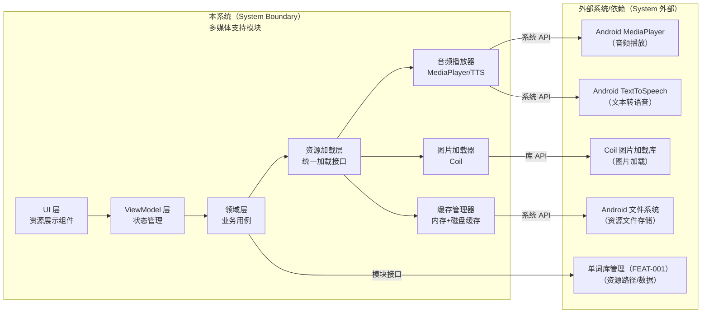
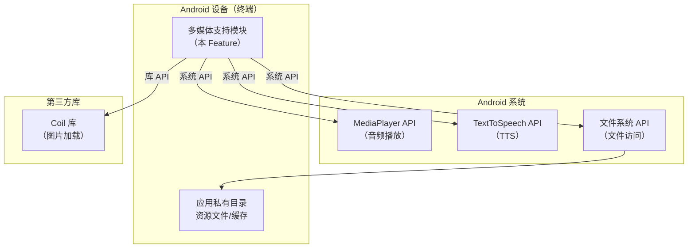
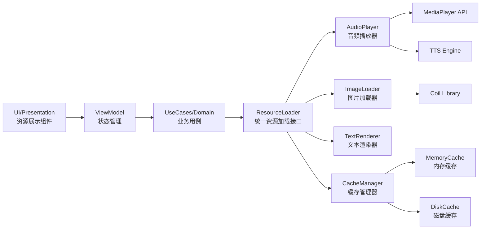
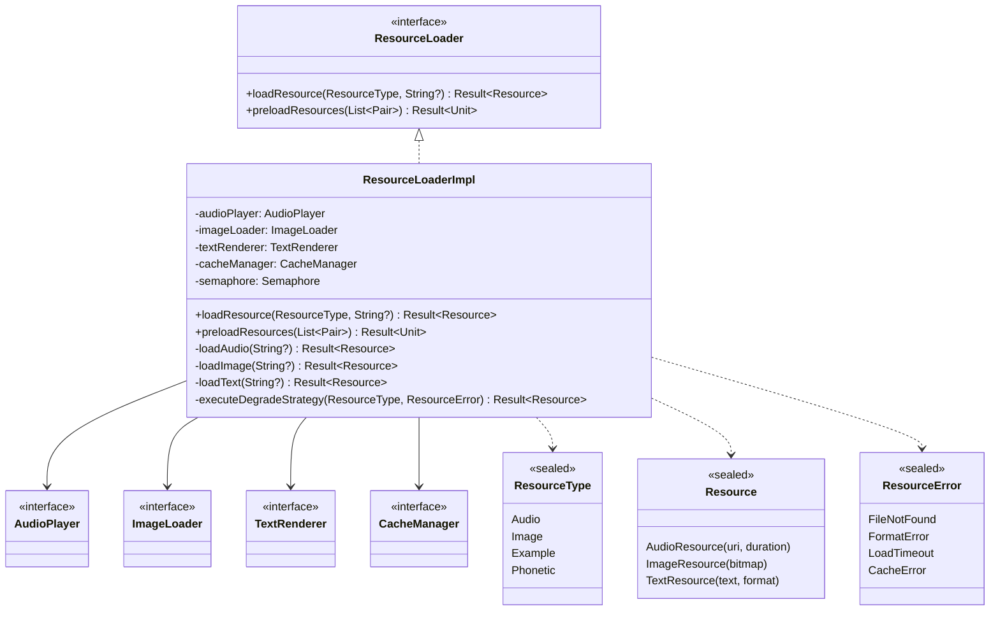
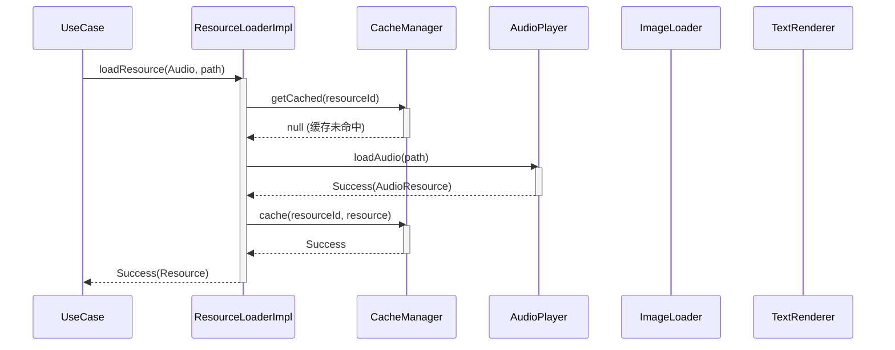
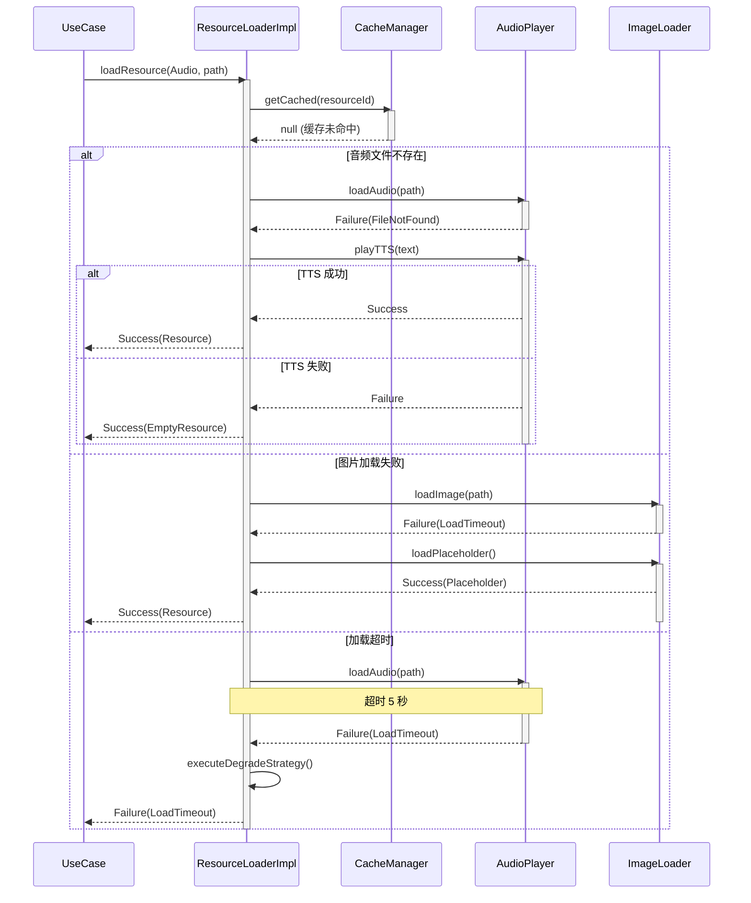
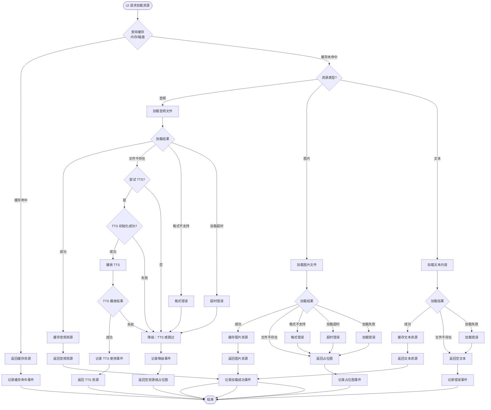
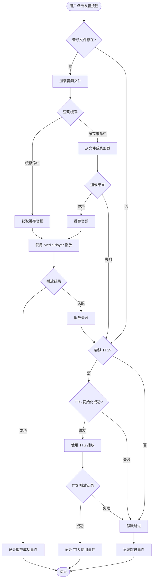
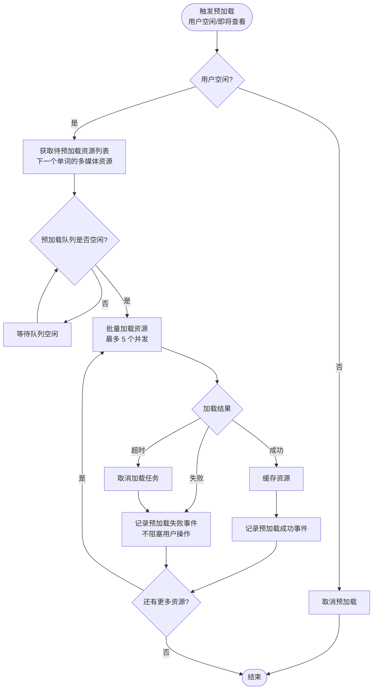

# Full Design：多媒体支持

**Epic**：EPIC-001 - 无痛记忆单词神器APP
**Feature ID**：FEAT-006
**Feature Version**：v0.1.0
**Plan Version**：v0.1.0
**Tasks Version**：v0.1.0
**Full Design Version**：v0.1.0

**分支**：`epic/EPIC-001-word-memory-app`
**日期**：2026-01-19
**输入工件**：
- `spec.md`
- `plan.md`
- `tasks.md`
- `research.md` / `data-model.md` / `contracts/` / `quickstart.md`（按实际存在）

> Agent 规则（强制）：
> - 本文档**只能整合现有产物**（spec/plan/tasks 等），**不得新增技术决策**。
> - 若遇到决策缺口，只能标注为 `TODO(Clarify): ...` 并指向应补齐的来源文档/章节。
> - 本文档用于评审与执行：层次必须清晰、结构化、可追溯。

## 变更记录（增量变更）

| 版本 | 日期 | 变更范围（Feature/Story/Task） | 变更摘要 | 影响模块 | 是否需要回滚设计 |
|---|---|---|---|---|---|
| v0.1.0 | 2026-01-19 | Feature | 初始版本：整合 spec.md、plan.md、tasks.md，生成 Full Design 全量技术方案文档 |  | 否 |

## 1. 背景与范围（来自 spec.md）

### 背景
- 单词学习需要多感官刺激来提升记忆效果，仅文字展示难以满足高效学习需求
- 用户需要听到单词发音来学习正确读音，需要图片辅助理解单词含义，需要例句了解单词用法
- 现有应用缺乏统一的多媒体资源管理能力，资源加载和缓存策略分散，影响性能和用户体验
- 多媒体资源管理是跨 Feature 的平台能力，需要独立封装以统一资源加载、缓存和管理策略

### 目标
- **用户目标**：用户能够在学习单词时听到发音、看到图片和例句，提升学习效果和体验
- **业务目标**：建立多媒体资源管理能力，为学习界面和其他功能提供统一的多媒体支持
- **平台目标**：建立可扩展的多媒体资源管理框架，支持未来扩展更多资源类型和来源

### 价值
- **用户价值**：通过多感官学习提升记忆效果，增强学习体验的丰富性和趣味性
- **业务价值**：为产品提供多媒体能力支撑，提升产品竞争力和用户满意度
- **技术价值**：建立统一的资源管理框架，优化资源加载性能，降低内存占用

### In Scope
- 单词发音播放（支持音频文件播放和 TTS 文本转语音）
- 图片展示（支持单词相关图片的加载和显示）
- 例句展示（支持单词例句的文本展示）
- 音标显示（支持单词音标的文本显示）
- 多媒体资源缓存管理（本地缓存策略，减少重复加载）
- 资源加载失败降级处理（资源不可用时的降级方案）

### Out of Scope
- 视频内容支持（第一阶段不支持视频）
- 动画效果（不支持复杂的动画资源）
- 语音识别（不支持用户语音输入识别）
- 在线资源下载（第一阶段仅支持本地资源，不支持在线下载）
- 资源编辑功能（不支持用户编辑或上传多媒体资源）

### 依赖关系
- **上游依赖**：
  - **单词库管理（FEAT-001）**：依赖词库中的多媒体资源数据（音频文件路径、图片路径、例句文本等）
  - **Android 平台**：MediaPlayer API（音频播放）、ImageView/Coil/Glide（图片加载）、TTS 引擎（文本转语音）
  - **存储系统**：本地文件系统或应用私有存储（资源文件存储）
- **下游影响**：
  - **学习界面与交互（FEAT-003）**：依赖多媒体支持能力展示单词发音、图片、例句
  - **间隔重复学习算法引擎（FEAT-002）**：可能依赖多媒体资源加载状态（可选，用于优化学习调度）

## 2. 0 层架构设计（对外系统边界、部署、通信、交互）（来自 plan.md）

> 定义：0 层架构设计反映"本系统与外部系统之间的关系"。必须覆盖：结构、部署、通信方式、交互方式与边界。
>
> 规则：本节只允许**复用/整合** `plan.md` 中已经明确的内容；不得新增技术决策。若 plan 缺失，用 `TODO(Clarify)` 指回 plan 对应章节补齐。

### 2.1 外部系统与依赖清单（来自 plan.md）

| 外部系统/依赖 | 类型 | 关键能力/数据 | 通信方式（协议/鉴权） | SLA/限流/超时 | 故障模式 | 我方策略 | 引用来源 |
|---|---|---|---|---|---|---|---|
| Android MediaPlayer | 设备能力 | 音频文件播放 | 系统 API | 系统级，无 SLA | 文件不存在、格式不支持、播放失败 | 降级到 TTS 或静默跳过 | plan.md:A2.1 |
| Android TextToSpeech | 设备能力 | 文本转语音 | 系统 API | 系统级，初始化可能失败 | TTS 引擎不可用、初始化失败 | 静默跳过发音，不影响其他功能 | plan.md:A2.1 |
| Coil 图片加载库 | 三方库 | 图片异步加载、缓存 | 库 API（协程） | 库级，无 SLA | 图片文件不存在、格式不支持、加载失败 | 显示占位图或隐藏图片区域 | plan.md:A2.1 |
| Android 文件系统 | 设备能力 | 资源文件存储、读取 | 系统 API（ContentResolver/File） | 系统级，存储 I/O | 存储空间不足、文件损坏、权限被拒绝 | 检测空间、验证文件、跳过缓存 | plan.md:A2.1 |
| 单词库管理（FEAT-001） | 内部服务 | 多媒体资源路径/数据 | 模块接口（函数调用） | 本地调用，无网络 | 资源路径不存在、数据格式错误 | 返回错误，由调用方处理 | plan.md:A2.1 |

### 2.2 0 层架构图（系统边界 + 外部交互）（来自 plan.md）

### 2.3 部署视图（来自 plan.md）

### 2.4 通信与交互说明（来自 plan.md）

- **协议**：系统 API（MediaPlayer、TTS、文件系统）、库 API（Coil 协程接口）
- **鉴权**：无需鉴权（本地系统 API 和库调用）
- **超时与重试**：
  - 音频播放：无超时（播放完成或失败），失败不重试（直接降级到 TTS）
  - 图片加载：超时 5 秒，失败不重试（显示占位图）
  - TTS 初始化：超时 3 秒，失败不重试（静默跳过）
- **幂等**：资源加载操作幂等（重复加载相同资源返回缓存结果）
- **限流**：无外部限流（本地操作）
- **数据一致性**：缓存数据最终一致（资源文件更新后缓存失效）

## 3. 1 层架构设计（系统内部框架图 + 模块拆分 + 接口协议）（来自 plan.md）

> 定义：1 层架构设计描述"系统内部的模块拆分与协作"，包括框架图、模块职责、模块交互、通信方式、接口协议等。

### 3.1 1 层框架图（来自 plan.md）

### 3.2 模块拆分与职责（来自 plan.md）

| 模块 | 职责 | 输入/输出 | 依赖 | 约束 |
|---|---|---|---|---|
| ResourceLoader（资源加载器） | 统一资源加载接口，封装资源类型差异，提供统一的加载 API | 输入：资源类型、资源路径；输出：加载结果（资源对象或错误） | AudioPlayer、ImageLoader、TextRenderer、CacheManager | 异步加载，不阻塞主线程 |
| AudioPlayer（音频播放器） | 音频播放功能，支持音频文件播放和 TTS，提供播放控制接口 | 输入：音频文件路径或文本；输出：播放状态（成功/失败） | MediaPlayer API、TTS Engine | 播放启动延迟 ≤ 500ms |
| ImageLoader（图片加载器） | 图片加载功能，封装 Coil 库，提供图片加载接口 | 输入：图片路径；输出：图片对象或错误 | Coil Library | 加载时间 ≤ 1秒 |
| TextRenderer（文本渲染器） | 文本渲染功能，支持例句和音标显示，提供格式化接口 | 输入：文本内容、格式参数；输出：格式化文本 | 无外部依赖 | 渲染时间 ≤ 100ms |
| CacheManager（缓存管理器） | 资源缓存管理，实现两级缓存（内存+磁盘），提供缓存查询和更新接口 | 输入：资源 ID、资源对象；输出：缓存命中结果或缓存对象 | MemoryCache、DiskCache | 缓存命中率 ≥ 70%，查询时间 ≤ 50ms |
| MemoryCache（内存缓存） | 内存缓存实现，使用 LRU 策略，管理内存中的资源对象 | 输入：资源 ID、资源对象；输出：缓存对象或 null | 无外部依赖 | 内存占用 ≤ 50MB |
| DiskCache（磁盘缓存） | 磁盘缓存实现，管理应用私有目录中的缓存文件 | 输入：资源 ID、资源文件；输出：缓存文件路径或 null | 文件系统 API | 缓存总大小 ≤ 100MB |

### 3.3 模块协作与通信方式（来自 plan.md）

- **调用关系**：[UI → ViewModel → UseCase → ResourceLoader → AudioPlayer/ImageLoader/TextRenderer/CacheManager]
- **通信方式**：函数调用（Kotlin suspend 函数）、协程（Coroutine）
- **接口协议**：
  - ResourceLoader：`suspend fun loadResource(type: ResourceType, path: String): Result<Resource>`
  - AudioPlayer：`suspend fun playAudio(path: String?): Result<Unit>`、`suspend fun playTTS(text: String): Result<Unit>`
  - ImageLoader：`suspend fun loadImage(path: String): Result<ImageBitmap>`
  - CacheManager：`suspend fun getCached(id: String): Resource?`、`suspend fun cache(id: String, resource: Resource): Result<Unit>`
- **并发与线程模型**：
  - 主线程：UI 更新、状态管理（StateFlow）
  - IO 线程：资源加载、文件 I/O、缓存操作（Dispatchers.IO）
  - 协程：所有资源加载操作使用 suspend 函数，由 ViewModel 在 ViewModelScope 中调用

### 3.4 关键模块设计（详细设计 + 取舍）（来自 plan.md）

> 说明：本节用于整合 plan 中"关键模块/高风险模块/承载 NFR 的模块"的详细设计与取舍。
> 若 plan 未提供详细设计，标注 `TODO(Clarify)` 并指回 plan 补齐。

#### 模块：ResourceLoader（资源加载器）

- **模块定位**：统一资源加载接口，封装不同资源类型（音频/图片/文本）的加载差异，提供统一的加载 API，位于 Data 层，为 UseCase 提供资源加载服务
- **设计目标**：统一接口、性能优化（缓存）、降级处理、可扩展性（支持新资源类型）
- **核心数据结构/状态**：
  - 资源类型：`ResourceType`（Sealed Class：Audio、Image、Example、Phonetic）
  - 资源对象：`Resource`（Sealed Class：AudioResource、ImageResource、TextResource）
  - 加载状态：`LoadingState`（Loading、Success、Error）
- **对外接口（协议）**：
  - `suspend fun loadResource(type: ResourceType, path: String?): Result<Resource>`：加载资源
  - `suspend fun preloadResources(resources: List<Pair<ResourceType, String?>>): Result<Unit>`：预加载资源
  - 错误码：`ResourceError`（Sealed Class：FileNotFound、FormatError、LoadTimeout、CacheError）
- **策略与算法**：
  - 缓存策略：加载前先查询缓存，缓存命中直接返回，缓存未命中加载后缓存
  - 降级策略：音频文件不存在 → TTS；图片加载失败 → 占位图；文本加载失败 → 空文本
  - 并发控制：使用协程并发加载多个资源，控制并发数量（最多 5 个并发）
- **失败与降级**：
  - 音频文件不存在：降级到 TTS，TTS 失败则静默跳过
  - 图片加载失败：返回占位图资源，由 UI 层显示占位图
  - 缓存查询失败：跳过缓存，直接加载资源
  - 加载超时：取消加载任务，返回超时错误，执行降级策略
- **安全与隐私**：
  - 资源文件存储在应用私有目录，不共享
  - 不记录资源文件内容到日志，只记录元数据（路径、大小）
- **可观测性**：
  - 记录资源加载成功/失败事件（资源类型、路径、耗时、缓存命中情况）
  - 记录降级策略执行事件（降级类型、原因）
- **优缺点**：
  - **优点**：统一接口便于使用和维护，缓存提升性能，降级策略保证可用性
  - **缺点/代价**：实现复杂度较高（需要处理多种资源类型和降级场景）
  - **替代方案与否决理由**：不使用单一资源加载器（难以扩展）；不使用同步加载（会阻塞主线程）

#### 模块：CacheManager（缓存管理器）

- **模块定位**：资源缓存管理，实现两级缓存（内存缓存 + 磁盘缓存），优化资源加载性能，位于 Data 层
- **设计目标**：性能优化（缓存命中率 ≥ 70%）、内存控制（内存占用 ≤ 50MB）、持久化（磁盘缓存）
- **核心数据结构/状态**：
  - 缓存键：资源 ID（资源类型 + 资源路径的哈希值）
  - 内存缓存：`LruCache<String, Resource>`（LRU 策略，最大容量 50MB）
  - 磁盘缓存：应用私有目录下的缓存文件（`cache/multimedia/`）
  - 缓存元数据：缓存文件大小、缓存时间、访问次数
- **对外接口（协议）**：
  - `suspend fun getCached(id: String): Resource?`：查询缓存（先查内存，再查磁盘）
  - `suspend fun cache(id: String, resource: Resource): Result<Unit>`：缓存资源（同时写入内存和磁盘）
  - `suspend fun clearCache(): Result<Unit>`：清空缓存
  - `suspend fun getCacheSize(): Long`：获取缓存大小
- **策略与算法**：
  - LRU 淘汰：内存缓存使用 LRU 策略，容量满时淘汰最久未使用的资源
  - 磁盘缓存清理：缓存总大小超过 100MB 时，清理最久未访问的缓存文件
  - 缓存过期：内存缓存不过期（应用退出时清理），磁盘缓存不过期（手动清理或容量满时清理）
- **失败与降级**：
  - 内存缓存写入失败：跳过内存缓存，只写入磁盘缓存
  - 磁盘缓存写入失败：跳过磁盘缓存，只写入内存缓存
  - 缓存查询失败：返回 null，由调用方直接加载资源
- **安全与隐私**：
  - 缓存文件存储在应用私有目录，不共享
  - 缓存文件不包含敏感信息（只包含资源内容）
- **可观测性**：
  - 记录缓存命中/未命中事件（资源 ID、缓存类型）
  - 记录缓存清理事件（清理大小、清理原因）
- **优缺点**：
  - **优点**：两级缓存提供最佳性能，LRU 策略符合访问模式，磁盘缓存持久化
  - **缺点/代价**：实现复杂度较高（需要管理两级缓存和清理策略），磁盘缓存占用存储空间
  - **替代方案与否决理由**：不使用仅内存缓存（应用重启后失效）；不使用仅磁盘缓存（首次加载慢）

> 注：其他模块（AudioPlayer、ImageLoader、TextRenderer、MemoryCache、DiskCache）的详细设计见 plan.md:A3.4，本节不重复展开。

### 3.5 数据模型与存储设计（物理）（来自 plan.md）

**核心实体**：

1. **MultimediaResource（多媒体资源实体）**
   - `id: String`：资源唯一标识（资源类型 + 资源路径的哈希值）
   - `type: ResourceType`：资源类型（Audio、Image、Example、Phonetic）
   - `path: String?`：资源文件路径（可为空，如 TTS 生成的音频）
   - `size: Long`：资源大小（字节）
   - `cached: Boolean`：是否已缓存
   - `cachedAt: Long?`：缓存时间戳（毫秒）

2. **ResourceType（资源类型枚举）**
   - Audio：音频资源
   - Image：图片资源
   - Example：例句资源
   - Phonetic：音标资源

3. **Resource（资源对象 Sealed Class）**
   - `AudioResource(uri: Uri, duration: Long?)`：音频资源
   - `ImageResource(bitmap: ImageBitmap)`：图片资源
   - `TextResource(text: String, format: TextFormat?)`：文本资源（例句、音标）

4. **ResourceCache（资源缓存实体）**
   - `id: String`：缓存键（资源 ID）
   - `type: ResourceType`：资源类型
   - `cachedPath: String`：缓存文件路径（磁盘缓存）或内存引用（内存缓存）
   - `cachedAt: Long`：缓存时间戳
   - `accessCount: Int`：访问次数（用于 LRU 淘汰）
   - `size: Long`：缓存大小

**存储形态**：文件（资源文件） + 内存缓存（LRU Cache） + 磁盘缓存（应用私有目录）

**磁盘缓存文件结构**：
- `cache/multimedia/{resourceId}`：缓存的资源文件
- `cache/multimedia/metadata.json`：缓存元数据（JSON 格式）

详细物理数据结构见 plan.md:Plan-B:B3.2。

### 3.6 模块级 UML 总览（全局查看入口，只引用 plan.md）

> 目标：在 Feature 级 Full Design 中提供"全局视角"入口，方便评审/开发快速浏览每个模块的整体设计。
>
> 规则：
> - 模块清单以 `plan.md:A3.2 模块拆分与职责` 为准（行数/名称必须一致）。
> - 本节只做索引与引用，不复制粘贴整张图；所有 UML 图的权威内容在 `plan.md:A3.4`。

| 模块（来自 plan.md:A3.2） | 职责（摘要） | UML 类图入口（plan.md:A3.4） | 时序图-成功入口（plan.md:A3.4） | 时序图-异常入口（plan.md:A3.4） | 关键异常（摘要） | NFR 责任（摘要） |
|---|---|---|---|---|---|---|
| ResourceLoader | 统一资源加载接口，封装资源类型差异 | plan.md:A3.4:ResourceLoader:UML类图 | plan.md:A3.4:ResourceLoader:时序-成功 | plan.md:A3.4:ResourceLoader:时序-异常 | 文件不存在、格式错误、超时、并发限制 | PERF/OBS/REL |
| AudioPlayer | 音频播放功能，支持音频文件和 TTS | plan.md:A3.4:AudioPlayer:UML类图 | plan.md:A3.4:AudioPlayer:时序-成功 | plan.md:A3.4:AudioPlayer:时序-异常 | 文件不存在、格式错误、TTS 初始化失败 | PERF/POWER/REL/OBS |
| ImageLoader | 图片加载功能，封装 Coil 库 | plan.md:A3.4:ImageLoader:UML类图 | plan.md:A3.4:ImageLoader:时序-成功 | plan.md:A3.4:ImageLoader:时序-异常 | 文件不存在、格式错误、加载超时 | PERF/MEM/REL/OBS |
| TextRenderer | 文本渲染功能，支持例句和音标 | plan.md:A3.4:TextRenderer:UML类图 | plan.md:A3.4:TextRenderer:时序-成功 | plan.md:A3.4:TextRenderer:时序-异常 | 文本为空、格式化失败 | PERF |
| CacheManager | 资源缓存管理，两级缓存 | plan.md:A3.4:CacheManager:UML类图 | plan.md:A3.4:CacheManager:时序-成功 | plan.md:A3.4:CacheManager:时序-异常 | 容量满、空间不足、I/O 失败 | PERF/MEM/REL/OBS |
| MemoryCache | 内存缓存实现，LRU 策略 | plan.md:A3.4:MemoryCache:UML类图 | plan.md:A3.4:MemoryCache:时序-成功 | plan.md:A3.4:MemoryCache:时序-异常 | 容量满、写入失败 | MEM |
| DiskCache | 磁盘缓存实现，文件系统 | plan.md:A3.4:DiskCache:UML类图 | plan.md:A3.4:DiskCache:时序-成功 | plan.md:A3.4:DiskCache:时序-异常 | 空间不足、I/O 失败、元数据损坏 | MEM/REL |

### 3.7 模块级 UML（按模块汇总，来自 plan.md:A3.4）

> 目标：在 Full Design 中直接呈现每个模块的 UML（类图 + 成功/异常时序），便于评审与全局浏览。
>
> 规则：
> - 本节内容必须**逐字复用/复制** `plan.md:A3.4` 的模块级 UML；不得新增模块、不得新增新的分支决策。
> - 模块小节顺序必须与 `plan.md:A3.2 模块拆分与职责` 一致。
> - 若某个模块在 plan.md 尚未补齐 UML，必须标注 `TODO(Clarify)` 并指回 plan.md 对应模块小节补齐。

#### 模块：ResourceLoader（资源加载器）（来自 plan.md:A3.2）

##### UML 类图（来自 plan.md:A3.4）

##### UML 时序图 - 成功链路（来自 plan.md:A3.4）

##### UML 时序图 - 异常链路（来自 plan.md:A3.4）

> 注：其他模块（AudioPlayer、ImageLoader、TextRenderer、CacheManager、MemoryCache、DiskCache）的 UML 图详见 plan.md:A3.4，本节省略以保持文档长度合理。

## 4. 关键流程设计（每个流程一张流程图，含正常 + 全部异常）（来自 plan.md）

> 定义：每个关键流程必须用 `flowchart` 绘制，且同一张图内覆盖正常流程与全部关键异常分支（失败/超时/并发/生命周期等）。
> 若 plan 仍为拆分的"正常/异常"两张图，需在 plan 侧对齐后再整合到本节（否则标注 `TODO(Clarify)` 指回 plan）。

### 流程 1：资源加载流程（音频/图片/文本）

### 流程 2：音频播放流程

### 流程 3：资源预加载流程

## 5. Feature → Story → Task 追溯关系

> 规则：
> - Feature 层：FR/NFR（来自 spec.md）
> - Story 层：ST-xxx（来自 plan.md 的 Story Breakdown）
> - Task 层：Txxx（来自 tasks.md；若缺失则先留空并标注"待生成"）

### 5.1 Story 列表（来自 plan.md）

| Story ID | 类型 | 目标 | 覆盖 FR/NFR | 依赖 | 关键风险 | Story 详细设计入口（来自 plan.md） |
|---|---|---|---|---|---|---|
| ST-001 | Infrastructure | ResourceLoader 接口可用，支持资源类型识别和加载路由，错误处理完善 | FR-005；NFR-PERF-003；NFR-OBS-001 | 无 | 否 | plan.md:Story Breakdown:ST-001 |
| ST-002 | Functional | 用户能够播放单词发音（音频文件或 TTS），播放启动延迟 ≤ 500ms（p95），降级策略正常工作 | FR-001；FR-006；NFR-PERF-001；NFR-POWER-001；NFR-OBS-002；NFR-REL-001；NFR-REL-003 | ST-001 | 是（RISK-001、RISK-004） | plan.md:Story Breakdown:ST-002 |
| ST-003 | Functional | 用户能够看到单词相关图片，图片加载时间 ≤ 1 秒（p95），加载失败时显示占位图 | FR-002；FR-007；NFR-PERF-001；NFR-MEM-001；NFR-OBS-001；NFR-REL-001；NFR-REL-003 | ST-001 | 是（RISK-002） | plan.md:Story Breakdown:ST-003 |
| ST-004 | Functional | 用户能够看到单词例句和音标，文本渲染时间 ≤ 100ms（p95），格式正确清晰 | FR-003；FR-004；NFR-PERF-001 | ST-001 | 否 | plan.md:Story Breakdown:ST-004 |
| ST-005 | Infrastructure | 资源缓存正常工作，缓存命中率 ≥ 70%，缓存查询时间 ≤ 50ms（p95），内存占用 ≤ 50MB | FR-005；NFR-PERF-002；NFR-MEM-001；NFR-MEM-003；NFR-REL-002 | ST-001 | 是（RISK-003、RISK-006） | plan.md:Story Breakdown:ST-005 |
| ST-006 | Optimization | 资源预加载功能正常工作，预加载不影响用户操作，预加载资源在用户查看时已就绪 | FR-008；NFR-POWER-002 | ST-001、ST-002、ST-003、ST-004、ST-005 | 否 | plan.md:Story Breakdown:ST-006 |
| ST-007 | Infrastructure | 所有异常场景都有明确的错误处理和降级策略，用户能够理解错误原因，功能可用性得到保障 | FR-006；FR-007；NFR-PERF-003；NFR-REL-003；NFR-OBS-003 | ST-001、ST-002、ST-003、ST-004、ST-005 | 是（RISK-001、RISK-002、RISK-004） | plan.md:Story Breakdown:ST-007 |

### 5.2 追溯矩阵（FR/NFR → Story → Task）

| FR/NFR ID | Story ID | Task ID | 验证方式（来自 tasks.md） | 备注 |
|---|---|---|---|---|
| FR-001 | ST-002 | T200-T204 | 能够播放音频文件和 TTS，播放启动延迟 ≤ 500ms（p95），降级策略正常工作 | 音频播放功能 |
| FR-002 | ST-003 | T300-T303 | 能够加载和显示图片，加载时间 ≤ 1 秒（p95），加载失败时显示占位图 | 图片加载功能 |
| FR-003 | ST-004 | T400-T402 | 能够显示例句和音标，渲染时间 ≤ 100ms（p95），格式正确 | 文本渲染功能（例句） |
| FR-004 | ST-004 | T400-T402 | 能够显示例句和音标，渲染时间 ≤ 100ms（p95），格式正确 | 文本渲染功能（音标） |
| FR-005 | ST-001、ST-005 | T100-T102、T500-T504 | ResourceLoader 接口可用；缓存正常工作，缓存命中率 ≥ 70%，查询时间 ≤ 50ms（p95） | 资源缓存机制 |
| FR-006 | ST-002、ST-007 | T200-T204、T700-T702 | 音频文件不存在时降级到 TTS，TTS 失败则静默跳过 | 音频降级方案 |
| FR-007 | ST-003、ST-007 | T300-T303、T700-T702 | 图片加载失败时显示占位图或隐藏图片区域 | 图片降级方案 |
| FR-008 | ST-006 | T600-T601 | 预加载功能正常工作，预加载资源在用户查看时已就绪 | 资源预加载功能 |
| NFR-PERF-001 | ST-002、ST-003、ST-004 | T201、T301、T401 | 音频播放启动延迟 ≤ 500ms（p95），图片加载时间 ≤ 1 秒（p95），文本渲染时间 ≤ 100ms（p95） | 性能要求 |
| NFR-PERF-002 | ST-005 | T500-T504 | 缓存命中率 ≥ 70%，缓存查询时间 ≤ 50ms（p95） | 缓存性能要求 |
| NFR-PERF-003 | ST-001、ST-007 | T102、T700 | 降级策略执行时间 ≤ 200ms | 降级策略执行时间 |
| NFR-POWER-001 | ST-002 | T201 | 每日电池消耗增量 ≤ 10mAh | 音频播放功耗 |
| NFR-POWER-002 | ST-006 | T600-T601 | 预加载不消耗过多电池 | 预加载功耗约束 |
| NFR-MEM-001 | ST-003、ST-005 | T301、T501-T503 | 内存峰值 ≤ 50MB，单个音频播放内存占用 ≤ 5MB | 内存占用要求 |
| NFR-MEM-002 | ST-001、ST-002、ST-003 | T101、T201、T301 | 资源加载完成后及时释放临时内存 | 临时内存释放 |
| NFR-MEM-003 | ST-005 | T503 | 应用退出时清理内存缓存，磁盘缓存保留 | 缓存生命周期 |
| NFR-SEC-001 | ST-001、ST-005 | T102、T502 | 资源文件存储在应用私有目录，不共享 | 资源存储位置 |
| NFR-SEC-002 | ST-001 | T101 | 不申请全局存储权限，使用应用私有目录 | 权限使用 |
| NFR-SEC-003 | ST-002 | T201 | TTS 数据不上传云端，使用本地 TTS 引擎 | TTS 数据隐私 |
| NFR-OBS-001 | ST-001、ST-003 | T102、T302 | 记录资源加载成功/失败事件（资源类型、路径、耗时、缓存命中情况） | 资源加载事件记录 |
| NFR-OBS-002 | ST-002 | T202 | 记录音频播放事件（播放成功/失败、播放时长、TTS 使用情况） | 音频播放事件记录 |
| NFR-OBS-003 | ST-007 | T701 | 资源加载失败时记录错误日志（错误类型、文件路径、错误详情） | 错误日志记录 |
| NFR-REL-001 | ST-002、ST-003 | T201、T301 | 资源加载成功率 ≥ 95%；音频播放成功率 ≥ 98%；图片加载成功率 ≥ 95% | 资源加载/播放成功率 |
| NFR-REL-002 | ST-005 | T502-T503 | 缓存数据持久化：应用崩溃或退出时，缓存元数据必须保存 | 缓存数据持久化 |
| NFR-REL-003 | ST-002、ST-003、ST-007 | T201、T301、T700 | 降级方案执行成功率 100%，不得导致功能异常或崩溃 | 降级方案执行成功率 |

## 6. 技术风险与消解策略（来自 plan.md）

| 风险ID | 风险描述 | 触发条件 | 影响范围 | 严重度 | 消解策略 | 对应 Story/Task |
|---|---|---|---|---|---|---|
| RISK-001 | 音频文件不存在导致播放失败 | 词库中音频文件路径错误或文件缺失 | 用户无法听到发音，影响学习体验 | Med | 降级到 TTS，TTS 失败则静默跳过，不影响其他功能 | ST-002 / T201-T204 |
| RISK-002 | 图片加载失败导致界面异常 | 图片文件不存在、格式不支持、加载超时 | 用户无法看到图片，界面显示异常 | Med | 显示占位图或隐藏图片区域，不影响其他内容展示 | ST-003 / T301-T303 |
| RISK-003 | 资源缓存占用内存过大 | 缓存资源过多，超过 50MB 限制 | 应用内存占用过高，可能导致 OOM | High | 实现 LRU 淘汰策略，限制内存缓存容量，定期清理 | ST-005 / T501-T503 |
| RISK-004 | TTS 引擎初始化失败 | 系统 TTS 引擎不可用或初始化超时 | 音频降级方案失效，用户无法听到发音 | Low | 静默跳过发音功能，不影响其他功能，记录错误日志 | ST-002 / T201 |
| RISK-005 | 资源加载并发过多导致性能问题 | 同时加载多个资源，超过并发限制 | 资源加载变慢，影响用户体验 | Med | 控制并发数量（最多 5 个），使用队列管理加载任务 | ST-001 / T101 |
| RISK-006 | 磁盘缓存空间不足 | 缓存文件过多，超过 100MB 限制 | 新资源无法缓存，影响性能 | Med | 实现缓存清理策略，清理最久未访问的缓存文件 | ST-005 / T502-T503 |

## 7. 异常 & 边界场景梳理（来自 spec.md + plan.md）

- **数据边界**：
  - **空数据**：资源路径为空 → 返回空资源或占位图
  - **超大文件**：音频文件 > 5MB、图片文件 > 10MB → 警告用户，继续加载（流式处理）
  - **非法格式**：不支持的音频/图片格式 → 尝试转换或显示错误提示
  - **损坏文件**：文件损坏无法读取 → 返回错误，执行降级策略
  - **重复资源**：相同资源重复加载 → 返回缓存结果，不重复加载

- **状态边界**：
  - **播放状态冲突**：上一个音频未播放完成时播放新音频 → 停止上一个音频，播放新音频
  - **缓存状态不一致**：内存缓存和磁盘缓存不一致 → 以磁盘缓存为准，更新内存缓存
  - **加载状态竞争**：同一资源同时被多个请求加载 → 共享加载任务，避免重复加载

- **生命周期**：
  - **前后台切换**：应用切换到后台时正在播放音频 → 暂停播放，恢复时继续播放（可选）
  - **屏幕旋转**：加载资源过程中屏幕旋转 → 使用 ViewModel 保存状态，恢复后继续显示
  - **进程被杀**：系统回收进程时正在加载资源 → 加载失败，下次启动时重新加载
  - **应用退出**：应用退出时正在加载资源 → 取消加载任务，清理内存缓存，保留磁盘缓存

- **并发**：
  - **并发加载**：同时加载多个资源 → 使用协程并发加载，控制并发数量（最多 5 个）
  - **并发播放**：同时播放多个音频 → 只允许一个音频播放，新播放请求停止上一个
  - **并发缓存**：同时缓存多个资源 → 使用锁或协程互斥，确保缓存一致性

- **用户行为**：
  - **快速连点**：用户快速连续点击发音按钮 → 防抖处理，只响应第一次点击
  - **取消加载**：加载过程中用户取消 → 取消加载任务，释放资源
  - **网络断开**：若未来支持在线资源，网络断开 → 使用本地缓存，显示离线提示

## 8. 埋点/可观测性设计（来自 spec.md NFR-OBS + plan.md 约束）

> 注意：只整合既有要求；不要新增指标口径或埋点策略决策。

| 事件/指标 | 触发点 | 字段 | 采样/频率 | 用途 | 关联 FR/NFR |
|---|---|---|---|---|---|
| resource_load_success | 资源加载成功 | 资源类型、文件大小、加载耗时、缓存命中情况 | 全量记录 | 监控资源加载性能，分析缓存效果 | NFR-OBS-001 |
| resource_load_failed | 资源加载失败 | 资源类型、错误类型、文件路径（脱敏） | 全量记录 | 排查资源加载问题，优化降级策略 | NFR-OBS-001、NFR-OBS-003 |
| cache_hit | 缓存命中 | 资源 ID、缓存类型（内存/磁盘） | 采样记录（高频操作） | 监控缓存命中率，优化缓存策略 | NFR-OBS-001 |
| cache_miss | 缓存未命中 | 资源 ID、缓存类型 | 采样记录（高频操作） | 分析缓存未命中原因 | NFR-OBS-001 |
| audio_play_success | 音频播放成功 | 播放时长、是否使用 TTS | 全量记录 | 监控音频播放性能，分析 TTS 使用情况 | NFR-OBS-002 |
| audio_play_failed | 音频播放失败 | 错误类型、是否尝试 TTS | 全量记录 | 排查音频播放问题 | NFR-OBS-002 |
| tts_play_success | TTS 播放成功 | 播放时长、文本长度 | 全量记录 | 分析 TTS 使用效果 | NFR-OBS-002 |
| cache_clear | 缓存清理 | 清理大小、清理原因（容量满/空间不足） | 全量记录 | 监控缓存清理频率，优化缓存策略 | NFR-OBS-001 |

## 9. 算法 / 性能 / 功耗 / 内存评估结果（来自 plan.md）

### 9.1 算法评估

- **不适用**：多媒体支持 Feature 不涉及算法模型，无需算法评估

### 9.2 性能评估

- **前台**：
  - 音频播放启动延迟：p50 ≤ 200ms，p95 ≤ 500ms，p99 ≤ 800ms
  - 图片加载时间：p50 ≤ 500ms，p95 ≤ 1 秒，p99 ≤ 2 秒
  - 例句文本渲染时间：p50 ≤ 50ms，p95 ≤ 100ms，p99 ≤ 200ms
  - 缓存查询时间：p50 ≤ 10ms，p95 ≤ 50ms，p99 ≤ 100ms
- **后台**：
  - 资源预加载：异步处理，不阻塞主线程，显示进度指示器（可选）
  - 缓存清理：异步处理，不阻塞主线程
- **阈值与验收**：
  - 音频播放启动延迟 p95 ≤ 500ms（测试方法：使用性能测试工具测量播放启动时间，测试设备：中端 Android 设备）
  - 图片加载时间 p95 ≤ 1 秒（测试方法：加载标准测试图片，测量加载时间）
  - 例句文本渲染时间 p95 ≤ 100ms（测试方法：渲染标准测试文本，测量渲染时间）
  - 缓存查询时间 p95 ≤ 50ms（测试方法：查询缓存，测量查询时间）
  - 缓存命中率 ≥ 70%（测试方法：模拟用户重复查看相同单词，统计缓存命中率）
- **降级策略**：
  - 音频播放超时：取消播放，降级到 TTS 或静默跳过
  - 图片加载超时：取消加载，显示占位图
  - 缓存查询慢：跳过缓存，直接加载资源
  - 资源加载慢：显示加载指示器，允许用户取消

### 9.3 功耗评估

- **Top5% 用户模型**：Android 设备，每天学习 30 个单词（每个单词播放 1 次音频、加载 1 张图片），音频播放总时长约 2 分钟，图片加载总数量 30 张
- **预估增量**：每日 mAh 增量 ≤ 10mAh
  - 音频播放：每个单词播放约 2 秒，30 个单词共 60 秒，功耗约 5mAh（MediaPlayer 解码和播放）
  - 图片解码：每张图片解码约 0.1 秒，30 张图片共 3 秒，功耗约 2mAh（图片解码）
  - 文件 I/O：资源加载和缓存操作，功耗约 3mAh（文件读写）
- **验收上限**：每日电池消耗增量不超过 10mAh（Top5% 用户模型），超过时需优化资源加载策略或减少预加载频率
- **降级策略**：
  - 达到功耗阈值时：减少资源预加载频率，只在用户明确需要时加载
  - 后台时：暂停资源预加载，不消耗电池
  - 低电量模式：禁用资源预加载，只加载用户主动请求的资源

### 9.4 内存评估

- **峰值/平均增量**：
  - 峰值增量：≤ 50MB
    - 内存缓存：最大 50MB（LRU 缓存，假设缓存 100 张图片，每张平均 500KB）
    - 单个音频播放：最大 5MB（MediaPlayer 解码缓冲区）
    - 图片加载临时内存：每张图片解码临时内存约 2MB，加载完成后释放
  - 平均增量：≤ 30MB（假设缓存 50 张图片的平均场景）
- **生命周期**：
  - **内存缓存**：应用生命周期内常驻，应用退出时清理
  - **音频播放缓冲区**：播放过程中分配，播放完成后释放
  - **图片解码临时内存**：解码过程中分配，解码完成后释放（Coil 自动管理）
  - **磁盘缓存**：系统管理，不占用应用内存
- **验收标准**：
  - 测试方法：使用内存分析工具（如 Android Profiler）测量峰值内存占用，测试场景：加载 100 张图片（每张 500KB）并播放音频
  - 阈值：峰值内存增量 ≤ 50MB（不含系统开销）
  - 内存泄漏：使用 LeakCanary 检测内存泄漏，确保无内存泄漏
  - 临时内存释放：图片加载完成后立即释放临时内存，不增加常驻内存

## 10. 执行说明（只引用 tasks.md，不新增 Task）

- **执行入口**：`tasks.md`
- **验证入口**：各 Task 的验证清单 + Plan 的验收指标
- **禁止事项**：Implement 期不得修改 Plan 设计；变更走增量变更流程并提升版本

**任务统计**（来自 tasks.md）：
- **总任务数**：42 个任务
- **Story 任务分布**：
  - ST-001：3 个任务
  - ST-002：5 个任务
  - ST-003：4 个任务
  - ST-004：3 个任务
  - ST-005：5 个任务
  - ST-006：2 个任务
  - ST-007：3 个任务
- **建议 MVP 范围**：ST-001、ST-002、ST-003（基础能力 + 音频播放 + 图片加载）
