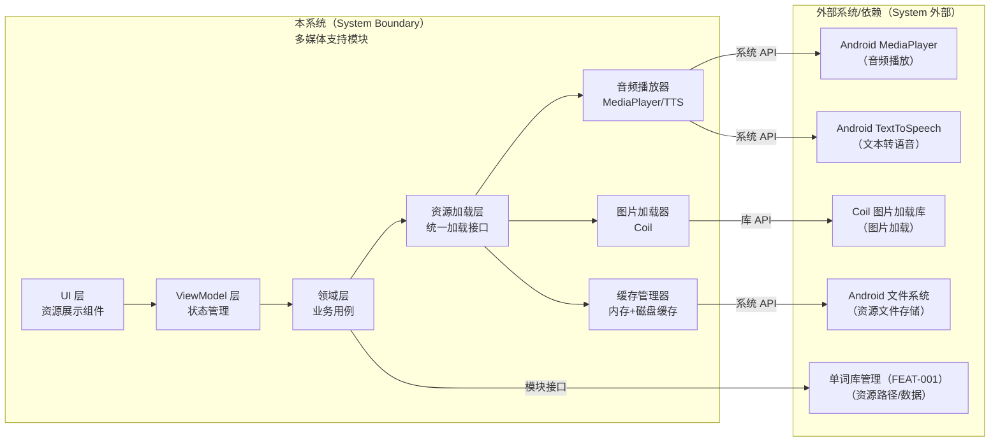
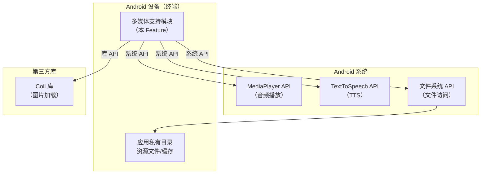
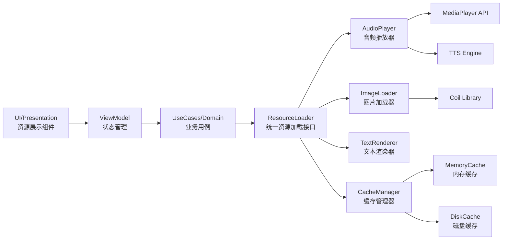
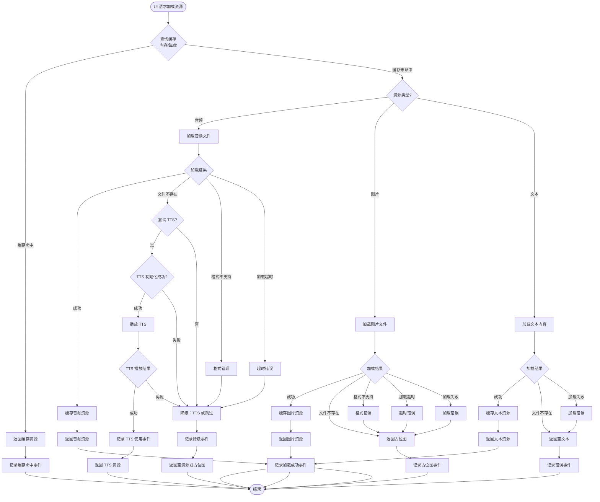
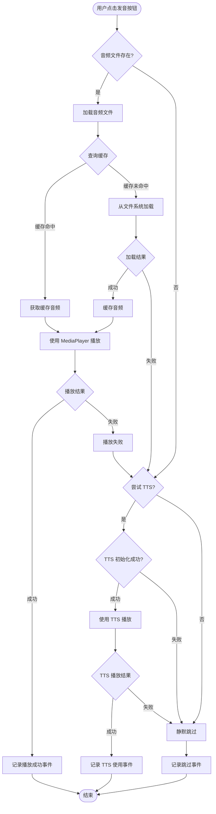
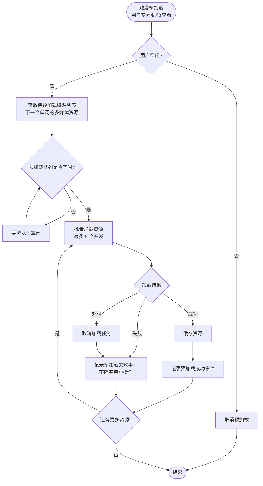

# Plan（工程级蓝图）：多媒体支持

**Epic**：EPIC-001 - 无痛记忆单词神器APP
**Feature ID**：FEAT-006
**Feature Version**：v0.1.0（来自 `spec.md`）
**Plan Version**：v0.1.0
**当前工作分支**：`epic/EPIC-001-word-memory-app`
**Feature 目录**：`specs/epics/EPIC-001-word-memory-app/features/FEAT-006-multimedia-support/`
**日期**：2026-01-19
**输入**：来自 `Feature 目录/spec.md`

> 规则：
> - Plan 阶段必须包含工程决策、风险评估、算法/功耗/性能/内存评估（量化 + 验收指标）。
> - Implement 阶段**不得**擅自改写 Plan 的技术决策；若必须变更，走增量变更流程并提升 Version。

## 变更记录（增量变更）

| 版本 | 日期 | 变更范围（Feature/Story/Task） | 变更摘要 | 影响模块 | 是否需要回滚设计 |
|---|---|---|---|---|---|
| v0.1.0 | 2026-01-19 | Feature | 初始版本：创建 Plan 工程级蓝图，完成技术选型、架构设计和 Story 拆分 |  | 否 |

## 概述

**核心需求**：实现多媒体资源管理能力，支持单词发音（音频文件播放和 TTS）、图片展示、例句展示、音标显示，提供统一的资源加载、缓存和降级策略，为学习界面和其他功能提供多媒体支持。

**关键工程决策**：
1. **音频播放**：使用 Android MediaPlayer API，支持音频文件播放；使用系统 TTS 引擎作为降级方案
2. **图片加载**：使用 Coil 图片加载库，支持异步加载、内存缓存、磁盘缓存，性能优异
3. **资源缓存**：实现两级缓存（内存缓存 + 磁盘缓存），内存缓存使用 LRU 策略，磁盘缓存使用文件系统
4. **降级策略**：音频文件不存在时使用 TTS，图片加载失败时显示占位图，确保功能可用性

## Plan-A：工程决策 & 风险评估（必须量化）

### A1. 技术选型（候选方案对比 + 决策理由）

| 决策点 | 候选方案 | 优缺点 | 约束/风险 | 决策 | 决策理由 |
|---|---|---|---|---|---|
| 音频播放引擎 | A: MediaPlayer<br>B: ExoPlayer<br>C: SoundPool | A: 系统自带、简单易用，但功能相对基础<br>B: 功能强大、性能好，但库体积大（~2MB）<br>C: 适合短音频，但不适合长音频 | 音频文件 ≤ 5MB，播放需求简单（播放/暂停），性能要求：启动延迟 ≤ 500ms | A: MediaPlayer | MediaPlayer 系统自带，无需额外依赖，满足简单播放需求，性能足够 |
| 图片加载库 | A: Coil<br>B: Glide<br>C: Picasso | A: Kotlin 协程原生、轻量（~200KB）、性能好<br>B: 功能强大、成熟稳定，但体积大（~1MB）<br>C: 轻量简单，但功能较少 | 图片文件 ≤ 10MB，加载时间 ≤ 1秒，内存占用 ≤ 50MB | A: Coil | Coil 专为 Kotlin 协程设计，API 简洁，性能优异，体积小，符合项目技术栈 |
| TTS 引擎 | A: Android TextToSpeech<br>B: 第三方 TTS SDK<br>C: 在线 TTS 服务 | A: 系统自带、无需网络、隐私好，但语音质量依赖系统<br>B: 语音质量好，但增加依赖和体积<br>C: 语音质量最好，但需要网络、隐私问题 | 隐私要求：TTS 数据不上传云端（NFR-SEC-003），离线可用 | A: Android TextToSpeech | 系统自带，无需网络，符合隐私要求，满足离线使用需求 |
| 资源缓存策略 | A: 内存缓存 + 磁盘缓存<br>B: 仅内存缓存<br>C: 仅磁盘缓存 | A: 性能最优，但实现复杂<br>B: 实现简单，但应用重启后失效<br>C: 持久化，但首次加载慢 | 缓存命中率 ≥ 70%，内存占用 ≤ 50MB，缓存查询 ≤ 50ms | A: 内存缓存 + 磁盘缓存 | 两级缓存提供最佳性能，内存缓存快速响应，磁盘缓存持久化，满足性能和内存要求 |
| 缓存淘汰策略 | A: LRU（最近最少使用）<br>B: FIFO（先进先出）<br>C: LFU（最少使用频率） | A: 符合访问模式，实现简单<br>B: 实现简单，但不符合访问模式<br>C: 更精确，但实现复杂 | 内存缓存容量有限，需要自动淘汰 | A: LRU | LRU 符合用户访问模式（最近查看的单词更可能再次查看），实现简单高效 |

### A2. 0 层架构设计（对外系统边界、部署、通信、交互）

> 定义：0 层架构设计反映"本系统与外部系统之间的关系"。必须覆盖：结构、部署、通信方式、交互方式与边界。
>
> 要求：
> - 同时给出"一句话描述每个模块/外部系统的职责与边界"。
> - 明确外部依赖的**故障模式**（超时/限流/不可用/返回不一致）与本系统应对策略（重试/降级/兜底/提示）。
> - 明确通信方式（协议/鉴权/重试/幂等/超时/限流）与部署拓扑（端/服务/第三方）。

#### A2.1 外部系统与依赖清单（必须）

| 外部系统/依赖 | 类型（三方/内部服务/设备能力） | 关键能力/数据 | 通信方式（协议/鉴权） | SLA/限流/超时 | 故障模式 | 我方策略 |
|---|---|---|---|---|---|---|
| Android MediaPlayer | 设备能力 | 音频文件播放 | 系统 API | 系统级，无 SLA | 文件不存在、格式不支持、播放失败 | 降级到 TTS 或静默跳过 |
| Android TextToSpeech | 设备能力 | 文本转语音 | 系统 API | 系统级，初始化可能失败 | TTS 引擎不可用、初始化失败 | 静默跳过发音，不影响其他功能 |
| Coil 图片加载库 | 三方库 | 图片异步加载、缓存 | 库 API（协程） | 库级，无 SLA | 图片文件不存在、格式不支持、加载失败 | 显示占位图或隐藏图片区域 |
| Android 文件系统 | 设备能力 | 资源文件存储、读取 | 系统 API（ContentResolver/File） | 系统级，存储 I/O | 存储空间不足、文件损坏、权限被拒绝 | 检测空间、验证文件、跳过缓存 |
| 单词库管理（FEAT-001） | 内部服务 | 多媒体资源路径/数据 | 模块接口（函数调用） | 本地调用，无网络 | 资源路径不存在、数据格式错误 | 返回错误，由调用方处理 |

#### A2.2 0 层架构图（系统边界 + 外部交互）



#### A2.3 部署视图（必须）

> 要求：说明各节点部署位置（端上/服务端/第三方）、网络边界、以及关键链路的通信方式。



#### A2.4 通信与交互说明（必须）

- **协议**：系统 API（MediaPlayer、TTS、文件系统）、库 API（Coil 协程接口）
- **鉴权**：无需鉴权（本地系统 API 和库调用）
- **超时与重试**：
  - 音频播放：无超时（播放完成或失败），失败不重试（直接降级到 TTS）
  - 图片加载：超时 5 秒，失败不重试（显示占位图）
  - TTS 初始化：超时 3 秒，失败不重试（静默跳过）
- **幂等**：资源加载操作幂等（重复加载相同资源返回缓存结果）
- **限流**：无外部限流（本地操作）
- **数据一致性**：缓存数据最终一致（资源文件更新后缓存失效）

### A3. 1 层架构设计（系统内部框架图 + 模块拆分 + 接口协议）

> 定义：1 层架构设计描述"系统内部的模块拆分与协作"，包括框架图、模块职责、模块交互、通信方式、接口协议等。

#### A3.1 1 层框架图（必须）



#### A3.2 模块拆分与职责（必须）

| 模块 | 职责 | 输入/输出 | 依赖 | 约束 |
|---|---|---|---|---|
| ResourceLoader（资源加载器） | 统一资源加载接口，封装资源类型差异，提供统一的加载 API | 输入：资源类型、资源路径；输出：加载结果（资源对象或错误） | AudioPlayer、ImageLoader、TextRenderer、CacheManager | 异步加载，不阻塞主线程 |
| AudioPlayer（音频播放器） | 音频播放功能，支持音频文件播放和 TTS，提供播放控制接口 | 输入：音频文件路径或文本；输出：播放状态（成功/失败） | MediaPlayer API、TTS Engine | 播放启动延迟 ≤ 500ms |
| ImageLoader（图片加载器） | 图片加载功能，封装 Coil 库，提供图片加载接口 | 输入：图片路径；输出：图片对象或错误 | Coil Library | 加载时间 ≤ 1秒 |
| TextRenderer（文本渲染器） | 文本渲染功能，支持例句和音标显示，提供格式化接口 | 输入：文本内容、格式参数；输出：格式化文本 | 无外部依赖 | 渲染时间 ≤ 100ms |
| CacheManager（缓存管理器） | 资源缓存管理，实现两级缓存（内存+磁盘），提供缓存查询和更新接口 | 输入：资源 ID、资源对象；输出：缓存命中结果或缓存对象 | MemoryCache、DiskCache | 缓存命中率 ≥ 70%，查询时间 ≤ 50ms |
| MemoryCache（内存缓存） | 内存缓存实现，使用 LRU 策略，管理内存中的资源对象 | 输入：资源 ID、资源对象；输出：缓存对象或 null | 无外部依赖 | 内存占用 ≤ 50MB |
| DiskCache（磁盘缓存） | 磁盘缓存实现，管理应用私有目录中的缓存文件 | 输入：资源 ID、资源文件；输出：缓存文件路径或 null | 文件系统 API | 缓存总大小 ≤ 100MB |

#### A3.3 模块协作与通信方式（必须）

> 要求：写清楚"谁调用谁、通过什么方式、传什么、失败如何处理"。如果是异步（队列/事件），必须写清楚消费语义与重放/去重。

- **调用关系**：[UI → ViewModel → UseCase → ResourceLoader → AudioPlayer/ImageLoader/TextRenderer/CacheManager]
- **通信方式**：函数调用（Kotlin suspend 函数）、协程（Coroutine）
- **接口协议**：
  - ResourceLoader：`suspend fun loadResource(type: ResourceType, path: String): Result<Resource>`
  - AudioPlayer：`suspend fun playAudio(path: String?): Result<Unit>`、`suspend fun playTTS(text: String): Result<Unit>`
  - ImageLoader：`suspend fun loadImage(path: String): Result<ImageBitmap>`
  - CacheManager：`suspend fun getCached(id: String): Resource?`、`suspend fun cache(id: String, resource: Resource): Result<Unit>`
- **并发与线程模型**：
  - 主线程：UI 更新、状态管理（StateFlow）
  - IO 线程：资源加载、文件 I/O、缓存操作（Dispatchers.IO）
  - 协程：所有资源加载操作使用 suspend 函数，由 ViewModel 在 ViewModelScope 中调用

#### A3.4 关键模块设计（详细设计 + 取舍，必须）

> 要求：对"关键模块/高风险模块/承载 NFR 的模块"做细化。若包含多个模块，则分模块说明。

##### 模块：ResourceLoader（资源加载器）

- **模块定位**：统一资源加载接口，封装不同资源类型（音频/图片/文本）的加载差异，提供统一的加载 API，位于 Data 层，为 UseCase 提供资源加载服务
- **设计目标**：统一接口、性能优化（缓存）、降级处理、可扩展性（支持新资源类型）
- **核心数据结构/状态**：
  - 资源类型：`ResourceType`（Sealed Class：Audio、Image、Example、Phonetic）
  - 资源对象：`Resource`（Sealed Class：AudioResource、ImageResource、TextResource）
  - 加载状态：`LoadingState`（Loading、Success、Error）
- **对外接口（协议）**：
  - `suspend fun loadResource(type: ResourceType, path: String?): Result<Resource>`：加载资源
  - `suspend fun preloadResources(resources: List<Pair<ResourceType, String?>>): Result<Unit>`：预加载资源
  - 错误码：`ResourceError`（Sealed Class：FileNotFound、FormatError、LoadTimeout、CacheError）
- **策略与算法**：
  - 缓存策略：加载前先查询缓存，缓存命中直接返回，缓存未命中加载后缓存
  - 降级策略：音频文件不存在 → TTS；图片加载失败 → 占位图；文本加载失败 → 空文本
  - 并发控制：使用协程并发加载多个资源，控制并发数量（最多 5 个并发）
- **失败与降级**：
  - 音频文件不存在：降级到 TTS，TTS 失败则静默跳过
  - 图片加载失败：返回占位图资源，由 UI 层显示占位图
  - 缓存查询失败：跳过缓存，直接加载资源
  - 加载超时：取消加载任务，返回超时错误，执行降级策略
- **安全与隐私**：
  - 资源文件存储在应用私有目录，不共享
  - 不记录资源文件内容到日志，只记录元数据（路径、大小）
- **可观测性**：
  - 记录资源加载成功/失败事件（资源类型、路径、耗时、缓存命中情况）
  - 记录降级策略执行事件（降级类型、原因）
- **优缺点**：
  - **优点**：统一接口便于使用和维护，缓存提升性能，降级策略保证可用性
  - **缺点/代价**：实现复杂度较高（需要处理多种资源类型和降级场景）
  - **替代方案与否决理由**：不使用单一资源加载器（难以扩展）；不使用同步加载（会阻塞主线程）

##### 模块：CacheManager（缓存管理器）

- **模块定位**：资源缓存管理，实现两级缓存（内存缓存 + 磁盘缓存），优化资源加载性能，位于 Data 层
- **设计目标**：性能优化（缓存命中率 ≥ 70%）、内存控制（内存占用 ≤ 50MB）、持久化（磁盘缓存）
- **核心数据结构/状态**：
  - 缓存键：资源 ID（资源类型 + 资源路径的哈希值）
  - 内存缓存：`LruCache<String, Resource>`（LRU 策略，最大容量 50MB）
  - 磁盘缓存：应用私有目录下的缓存文件（`cache/multimedia/`）
  - 缓存元数据：缓存文件大小、缓存时间、访问次数
- **对外接口（协议）**：
  - `suspend fun getCached(id: String): Resource?`：查询缓存（先查内存，再查磁盘）
  - `suspend fun cache(id: String, resource: Resource): Result<Unit>`：缓存资源（同时写入内存和磁盘）
  - `suspend fun clearCache(): Result<Unit>`：清空缓存
  - `suspend fun getCacheSize(): Long`：获取缓存大小
- **策略与算法**：
  - LRU 淘汰：内存缓存使用 LRU 策略，容量满时淘汰最久未使用的资源
  - 磁盘缓存清理：缓存总大小超过 100MB 时，清理最久未访问的缓存文件
  - 缓存过期：内存缓存不过期（应用退出时清理），磁盘缓存不过期（手动清理或容量满时清理）
- **失败与降级**：
  - 内存缓存写入失败：跳过内存缓存，只写入磁盘缓存
  - 磁盘缓存写入失败：跳过磁盘缓存，只写入内存缓存
  - 缓存查询失败：返回 null，由调用方直接加载资源
- **安全与隐私**：
  - 缓存文件存储在应用私有目录，不共享
  - 缓存文件不包含敏感信息（只包含资源内容）
- **可观测性**：
  - 记录缓存命中/未命中事件（资源 ID、缓存类型）
  - 记录缓存清理事件（清理大小、清理原因）
- **优缺点**：
  - **优点**：两级缓存提供最佳性能，LRU 策略符合访问模式，磁盘缓存持久化
  - **缺点/代价**：实现复杂度较高（需要管理两级缓存和清理策略），磁盘缓存占用存储空间
  - **替代方案与否决理由**：不使用仅内存缓存（应用重启后失效）；不使用仅磁盘缓存（首次加载慢）

#####（Capability Feature 场景）交付物与接入契约（若适用则必填）

> 适用：本 Feature 为"埋点/可观测性""动效合集/组件库""算法能力/模型SDK"等横切能力时。

- **交付物形态**：SDK（多媒体资源加载 SDK）
- **对外接口（业务接入）**：
  - 初始化：`MultimediaSupport.initialize(context: Context)`
  - 资源加载：`ResourceLoader.loadResource(type, path)`
  - 音频播放：`AudioPlayer.playAudio(path)`、`AudioPlayer.playTTS(text)`
  - 图片加载：`ImageLoader.loadImage(path)`
  - 依赖注入：通过 Hilt/Koin 注入 `ResourceLoader`、`AudioPlayer`、`ImageLoader`
  - 生命周期：跟随 Application 生命周期，应用退出时清理缓存
- **事件/协议/契约**：
  - 资源加载事件：`resource_load_success`、`resource_load_failed`（资源类型、路径、耗时、缓存命中）
  - 音频播放事件：`audio_play_success`、`audio_play_failed`、`tts_play_success`（播放时长、TTS 使用情况）
  - 缓存事件：`cache_hit`、`cache_miss`、`cache_clear`（资源 ID、缓存类型）
- **版本与兼容策略**：
  - 版本号：SemVer（1.0.0）
  - 向后兼容：新增资源类型时保持旧接口兼容，新增参数使用默认值
  - 弃用策略：接口弃用前提供 2 个版本周期的警告期
- **验收标准**：
  - 性能：资源加载时间符合 NFR-PERF-001，缓存命中率 ≥ 70%
  - 正确性：资源加载成功率 ≥ 95%，降级策略执行成功率 100%
  - 稳定性：内存占用 ≤ 50MB，无内存泄漏
  - 合规：资源存储在私有目录，不上传云端

### A4. 关键流程设计（每个流程一张流程图，含正常 + 全部异常）

> 定义：关键流程设计必须用**流程图（flowchart）**描述，且流程图中必须覆盖正常流程与所有关键异常分支（失败/超时/并发/生命周期等）。
>
> 要求：
> - 若存在多个关键流程（如"登录""同步""下单""上传"等），则每个流程单独一张图。
> - 每张图必须包含：触发条件、关键决策点、外部依赖调用、重试/降级/兜底路径、最终可观测信号（日志/指标/埋点）。

#### 流程 1：资源加载流程（音频/图片/文本）



#### 流程 2：音频播放流程



#### 流程 3：资源预加载流程



### A5. 技术风险与消解策略（绑定 Story/Task）

| 风险ID | 风险描述 | 触发条件 | 影响范围 | 严重度 | 消解策略 | 对应 Story/Task |
|---|---|---|---|---|---|---|
| RISK-001 | 音频文件不存在导致播放失败 | 词库中音频文件路径错误或文件缺失 | 用户无法听到发音，影响学习体验 | Med | 降级到 TTS，TTS 失败则静默跳过，不影响其他功能 | ST-002 / T??? |
| RISK-002 | 图片加载失败导致界面异常 | 图片文件不存在、格式不支持、加载超时 | 用户无法看到图片，界面显示异常 | Med | 显示占位图或隐藏图片区域，不影响其他内容展示 | ST-003 / T??? |
| RISK-003 | 资源缓存占用内存过大 | 缓存资源过多，超过 50MB 限制 | 应用内存占用过高，可能导致 OOM | High | 实现 LRU 淘汰策略，限制内存缓存容量，定期清理 | ST-005 / T??? |
| RISK-004 | TTS 引擎初始化失败 | 系统 TTS 引擎不可用或初始化超时 | 音频降级方案失效，用户无法听到发音 | Low | 静默跳过发音功能，不影响其他功能，记录错误日志 | ST-002 / T??? |
| RISK-005 | 资源加载并发过多导致性能问题 | 同时加载多个资源，超过并发限制 | 资源加载变慢，影响用户体验 | Med | 控制并发数量（最多 5 个），使用队列管理加载任务 | ST-001 / T??? |
| RISK-006 | 磁盘缓存空间不足 | 缓存文件过多，超过 100MB 限制 | 新资源无法缓存，影响性能 | Med | 实现缓存清理策略，清理最久未访问的缓存文件 | ST-005 / T??? |

### A6. 边界 & 异常场景枚举（数据/状态/生命周期/并发/用户行为）

- **数据边界**：
  - **空数据**：资源路径为空 → 返回空资源或占位图
  - **超大文件**：音频文件 > 5MB、图片文件 > 10MB → 警告用户，继续加载（流式处理）
  - **非法格式**：不支持的音频/图片格式 → 尝试转换或显示错误提示
  - **损坏文件**：文件损坏无法读取 → 返回错误，执行降级策略
  - **重复资源**：相同资源重复加载 → 返回缓存结果，不重复加载

- **状态边界**：
  - **播放状态冲突**：上一个音频未播放完成时播放新音频 → 停止上一个音频，播放新音频
  - **缓存状态不一致**：内存缓存和磁盘缓存不一致 → 以磁盘缓存为准，更新内存缓存
  - **加载状态竞争**：同一资源同时被多个请求加载 → 共享加载任务，避免重复加载

- **生命周期**：
  - **前后台切换**：应用切换到后台时正在播放音频 → 暂停播放，恢复时继续播放（可选）
  - **屏幕旋转**：加载资源过程中屏幕旋转 → 使用 ViewModel 保存状态，恢复后继续显示
  - **进程被杀**：系统回收进程时正在加载资源 → 加载失败，下次启动时重新加载
  - **应用退出**：应用退出时正在加载资源 → 取消加载任务，清理内存缓存，保留磁盘缓存

- **并发**：
  - **并发加载**：同时加载多个资源 → 使用协程并发加载，控制并发数量（最多 5 个）
  - **并发播放**：同时播放多个音频 → 只允许一个音频播放，新播放请求停止上一个
  - **并发缓存**：同时缓存多个资源 → 使用锁或协程互斥，确保缓存一致性

- **用户行为**：
  - **快速连点**：用户快速连续点击发音按钮 → 防抖处理，只响应第一次点击
  - **取消加载**：加载过程中用户取消 → 取消加载任务，释放资源
  - **网络断开**：若未来支持在线资源，网络断开 → 使用本地缓存，显示离线提示

### A7. 算法评估（如适用）

- **不适用**：多媒体支持 Feature 不涉及算法模型，无需算法评估

### A8. 功耗评估（必须量化）

- **Top5% 用户模型**：Android 设备，每天学习 30 个单词（每个单词播放 1 次音频、加载 1 张图片），音频播放总时长约 2 分钟，图片加载总数量 30 张
- **测量口径**：音频播放功耗（MediaPlayer 解码和播放）、图片解码功耗（Coil 图片解码）、文件 I/O 操作（资源加载和缓存）
- **预估增量**：每日 mAh 增量 ≤ 10mAh
  - 音频播放：每个单词播放约 2 秒，30 个单词共 60 秒，功耗约 5mAh（MediaPlayer 解码和播放）
  - 图片解码：每张图片解码约 0.1 秒，30 张图片共 3 秒，功耗约 2mAh（图片解码）
  - 文件 I/O：资源加载和缓存操作，功耗约 3mAh（文件读写）
- **验收上限**：每日电池消耗增量不超过 10mAh（Top5% 用户模型），超过时需优化资源加载策略或减少预加载频率
- **降级策略**：
  - 达到功耗阈值时：减少资源预加载频率，只在用户明确需要时加载
  - 后台时：暂停资源预加载，不消耗电池
  - 低电量模式：禁用资源预加载，只加载用户主动请求的资源

### A9. 性能评估（必须量化）

- **前台**：
  - 音频播放启动延迟：p50 ≤ 200ms，p95 ≤ 500ms，p99 ≤ 800ms
  - 图片加载时间：p50 ≤ 500ms，p95 ≤ 1 秒，p99 ≤ 2 秒
  - 例句文本渲染时间：p50 ≤ 50ms，p95 ≤ 100ms，p99 ≤ 200ms
  - 缓存查询时间：p50 ≤ 10ms，p95 ≤ 50ms，p99 ≤ 100ms
- **后台**：
  - 资源预加载：异步处理，不阻塞主线程，显示进度指示器（可选）
  - 缓存清理：异步处理，不阻塞主线程
- **验收指标**：
  - 音频播放启动延迟 p95 ≤ 500ms（测试方法：使用性能测试工具测量播放启动时间，测试设备：中端 Android 设备）
  - 图片加载时间 p95 ≤ 1 秒（测试方法：加载标准测试图片，测量加载时间）
  - 例句文本渲染时间 p95 ≤ 100ms（测试方法：渲染标准测试文本，测量渲染时间）
  - 缓存查询时间 p95 ≤ 50ms（测试方法：查询缓存，测量查询时间）
  - 缓存命中率 ≥ 70%（测试方法：模拟用户重复查看相同单词，统计缓存命中率）
- **降级策略**：
  - 音频播放超时：取消播放，降级到 TTS 或静默跳过
  - 图片加载超时：取消加载，显示占位图
  - 缓存查询慢：跳过缓存，直接加载资源
  - 资源加载慢：显示加载指示器，允许用户取消

### A10. 内存评估（必须量化）

- **峰值增量**：≤ 50MB
  - 内存缓存：最大 50MB（LRU 缓存，假设缓存 100 张图片，每张平均 500KB）
  - 单个音频播放：最大 5MB（MediaPlayer 解码缓冲区）
  - 图片加载临时内存：每张图片解码临时内存约 2MB，加载完成后释放
- **平均增量**：≤ 30MB（假设缓存 50 张图片的平均场景）
- **生命周期**：
  - **内存缓存**：应用生命周期内常驻，应用退出时清理
  - **音频播放缓冲区**：播放过程中分配，播放完成后释放
  - **图片解码临时内存**：解码过程中分配，解码完成后释放（Coil 自动管理）
  - **磁盘缓存**：系统管理，不占用应用内存
- **风险与对策**：
  - **风险点**：内存缓存过多导致 OOM；大图片解码导致内存溢出；音频播放缓冲区过大
  - **对策**：
    - 实现 LRU 淘汰策略，限制内存缓存容量（50MB）
    - 使用 Coil 自动内存管理，图片解码后自动释放临时内存
    - 限制音频文件大小（≤ 5MB），避免大文件导致内存溢出
    - 应用退出时清理内存缓存，释放所有资源
- **验收标准**：
  - 测试方法：使用内存分析工具（如 Android Profiler）测量峰值内存占用，测试场景：加载 100 张图片（每张 500KB）并播放音频
  - 阈值：峰值内存增量 ≤ 50MB（不含系统开销）
  - 内存泄漏：使用 LeakCanary 检测内存泄漏，确保无内存泄漏
  - 临时内存释放：图片加载完成后立即释放临时内存，不增加常驻内存

## Plan-B：技术规约 & 实现约束（保留原 spec-kit 输出内容）

### B1. 技术背景（用于统一工程上下文）

> 注意：为保证工具链自动提取信息，下列字段名需保留英文 Key（括号内可补充中文）。

**Language/Version**：Kotlin 1.9+ / Java 17（Android 开发）
**Primary Dependencies**：Jetpack Compose（UI）、Kotlin Coroutines（异步）、Coil（图片加载）、AndroidX Lifecycle（生命周期）
**Storage**：文件系统（资源文件存储在应用私有目录）、内存缓存（LRU Cache）、磁盘缓存（应用私有目录）
**Test Framework**：JUnit 5、Kotlin Coroutines Test、MockK（Mocking）、Robolectric（Android 单元测试）
**Target Platform**：Android 8.0+（API Level 26+）
**Project Type**：mobile（Android 应用）
**Performance Targets**：音频播放启动延迟 p95 ≤ 500ms、图片加载时间 p95 ≤ 1 秒、缓存查询时间 p95 ≤ 50ms
**Constraints**：内存峰值 ≤ 50MB、缓存总大小 ≤ 100MB、离线可用（无需网络）
**Scale/Scope**：单用户本地应用、资源文件数量 ≤ 10000 个、单个资源文件 ≤ 10MB

### B2. 架构细化（实现必须遵循）

- **分层约束**：
  - UI 层（Compose）只能调用 ViewModel，不能直接访问资源加载层
  - ViewModel 只能调用 UseCase，不能直接访问 ResourceLoader
  - UseCase 只能调用 ResourceLoader，不能直接访问 AudioPlayer/ImageLoader
  - ResourceLoader 可以调用多个加载器（AudioPlayer/ImageLoader/TextRenderer）和 CacheManager，但不能跨层访问
- **线程/并发模型**：
  - 主线程：UI 操作、状态更新（StateFlow）
  - IO 线程：资源加载、文件 I/O、缓存操作（Dispatchers.IO）
  - 协程：所有资源加载操作使用 suspend 函数，由 ViewModel 在 ViewModelScope 中调用
  - 共享状态：使用 StateFlow（线程安全）而非 MutableStateFlow（需 Mutex 保护）
  - 并发控制：使用 Semaphore 或 Channel 控制并发数量（最多 5 个并发加载任务）
- **错误处理规范**：
  - 使用 Result<T> 或 Sealed Class（Success/Failure）封装结果
  - 错误类型：Sealed Class（ResourceError：FileNotFound、FormatError、LoadTimeout、CacheError）
  - 用户提示：统一使用字符串资源（strings.xml），错误信息用户友好
  - 异常转换：底层异常转换为领域错误，不直接向上抛出系统异常
  - 降级策略：资源加载失败时执行降级策略（TTS、占位图、空文本），不抛出异常
- **日志与可观测性**：
  - 结构化日志：使用结构化日志库（如 Timber），包含操作类型、资源类型、结果、耗时
  - 关键事件记录：资源加载成功/失败、音频播放、缓存命中/未命中、降级策略执行
  - 敏感信息脱敏：不记录资源文件完整路径、资源内容，只记录元数据（资源类型、大小）
  - 采样：高频操作（如缓存查询）采样记录，低频操作（如资源加载）全量记录

### B3. 数据模型（引用或内联）

**核心实体**：

1. **MultimediaResource（多媒体资源实体）**
   - `id: String`：资源唯一标识（资源类型 + 资源路径的哈希值）
   - `type: ResourceType`：资源类型（Audio、Image、Example、Phonetic）
   - `path: String?`：资源文件路径（可为空，如 TTS 生成的音频）
   - `size: Long`：资源大小（字节）
   - `cached: Boolean`：是否已缓存
   - `cachedAt: Long?`：缓存时间戳（毫秒）

2. **ResourceType（资源类型枚举）**
   - Audio：音频资源
   - Image：图片资源
   - Example：例句资源
   - Phonetic：音标资源

3. **Resource（资源对象 Sealed Class）**
   - `AudioResource(uri: Uri, duration: Long?)`：音频资源
   - `ImageResource(bitmap: ImageBitmap)`：图片资源
   - `TextResource(text: String, format: TextFormat?)`：文本资源（例句、音标）

4. **ResourceCache（资源缓存实体）**
   - `id: String`：缓存键（资源 ID）
   - `type: ResourceType`：资源类型
   - `cachedPath: String`：缓存文件路径（磁盘缓存）或内存引用（内存缓存）
   - `cachedAt: Long`：缓存时间戳
   - `accessCount: Int`：访问次数（用于 LRU 淘汰）
   - `size: Long`：缓存大小

**数据关系**：
- 一个单词可以有多个多媒体资源（一对多：一个单词可以有音频、图片、例句、音标）
- 一个资源可以有一个缓存记录（一对一：资源 ID 对应一个缓存记录）

**校验规则**：
- 资源 ID：非空，长度 ≤ 100 字符
- 资源路径：可为空（如 TTS 生成的音频），非空时必须是有效路径
- 资源大小：≥ 0，≤ 10MB（单个资源文件）

#### B3.1 存储形态与边界（必须）

- **存储形态**：文件（资源文件） + 内存缓存（LRU Cache） + 磁盘缓存（应用私有目录）
- **System of Record（权威来源）**：
  - 资源内容：应用私有目录内的资源文件为准（来自词库）
  - 资源缓存：内存缓存和磁盘缓存为派生数据，可随时重建
- **缓存与派生数据**：
  - 内存缓存（如 `LruCache<String, Resource>`）为派生数据，可随时从磁盘缓存或资源文件重建
  - 磁盘缓存为派生数据，可随时从资源文件重建
- **生命周期**：
  - 资源文件：来自词库，随词库生命周期
  - 内存缓存：应用生命周期内常驻，应用退出时清理
  - 磁盘缓存：持久化，应用退出时保留，下次启动时恢复
- **数据规模与增长**：
  - 资源文件数量 ≤ 10000 个（假设 1000 个单词，每个单词 10 个资源）
  - 单个资源文件 ≤ 10MB
  - 缓存总大小 ≤ 100MB

#### B3.2 物理数据结构（键/文件结构设计）

> 要求：明确"键名/字段含义/序列化结构/版本迁移"，避免实现期各处随意拼 Key。

#####（内存缓存）LRU Cache 结构

- **缓存键**：资源 ID（`${resourceType}_${resourcePathHash}`）
- **缓存值**：Resource 对象（AudioResource、ImageResource、TextResource）
- **容量限制**：50MB（按资源大小计算）
- **淘汰策略**：LRU（最近最少使用）

#####（磁盘缓存）文件结构清单

| 文件路径 | 用途 | 结构版本 | Schema/字段说明 | 迁移策略 |
|---|---|---|---|---|
| `cache/multimedia/{resourceId}` | 缓存的资源文件 | v1 | 原始资源文件（音频/图片/文本） | 缓存文件无版本，失效时删除重建 |
| `cache/multimedia/metadata.json` | 缓存元数据 | v1 | 见下方 `CacheMetadata` | 新增字段默认值；旧字段保留并废弃 |

#####（磁盘缓存）JSON 结构：`CacheMetadata`（建议）

```json
{
  "version": 1,
  "caches": [
    {
      "id": "string",
      "type": "Audio|Image|Example|Phonetic",
      "cachedPath": "string",
      "cachedAt": 1730000000000,
      "accessCount": 123,
      "size": 123456
    }
  ],
  "totalSize": 12345678
}
```

#####（资源文件）资源文件命名与位置（建议）

- **目录**：来自词库管理（FEAT-001），资源文件路径由词库提供
- **文件名**：由词库管理决定，本 Feature 不负责资源文件命名
- **覆盖策略**：资源文件由词库管理，本 Feature 只读取，不修改

### B4. 接口规范/协议（引用或内联）

#### B4.1 本 Feature 对外提供的接口（多媒体资源加载）

**ResourceLoader 接口（对外）**：

```kotlin
interface ResourceLoader {
    suspend fun loadResource(
        type: ResourceType,
        path: String?
    ): Result<Resource>
    
    suspend fun preloadResources(
        resources: List<Pair<ResourceType, String?>>
    ): Result<Unit>
    
    suspend fun clearCache(): Result<Unit>
    
    suspend fun getCacheSize(): Long
}
```

**AudioPlayer 接口（对外）**：

```kotlin
interface AudioPlayer {
    suspend fun playAudio(path: String?): Result<Unit>
    
    suspend fun playTTS(text: String): Result<Unit>
    
    fun stopAudio()
    
    fun isPlaying(): Boolean
}
```

**ImageLoader 接口（对外）**：

```kotlin
interface ImageLoader {
    suspend fun loadImage(path: String): Result<ImageBitmap>
    
    suspend fun loadImageWithPlaceholder(
        path: String,
        placeholder: ImageBitmap?
    ): Result<ImageBitmap>
}
```

**输入约束（契约）**：
- `type`：必须是有效的 ResourceType（Audio、Image、Example、Phonetic）
- `path`：可为空（如 TTS 生成的音频），非空时必须是有效路径
- `text`：TTS 文本，非空，长度 ≤ 1000 字符

**并发与取消语义**：
- 支持并发加载（多个资源同时加载），但控制并发数量（最多 5 个）
- 协程取消：取消时停止加载任务，释放资源，不留下半加载状态
- 音频播放：同时只允许一个音频播放，新播放请求停止上一个

#### B4.2 本 Feature 依赖的外部接口/契约（依赖方）

- **Android MediaPlayer API**：
  - 依赖点：音频文件播放、播放控制（播放/暂停/停止）
  - 失败模式：文件不存在/格式不支持/播放失败 → 映射为 `ResourceError.FileNotFound` 或 `ResourceError.FormatError`
- **Android TextToSpeech API**：
  - 依赖点：文本转语音、TTS 初始化
  - 失败模式：TTS 引擎不可用/初始化失败 → 映射为降级策略（静默跳过）
- **Coil 图片加载库**：
  - 依赖点：图片异步加载、图片缓存
  - 失败模式：图片文件不存在/格式不支持/加载失败 → 映射为占位图
- **单词库管理（FEAT-001）**：
  - 依赖点：资源文件路径/数据
  - 失败模式：资源路径不存在/数据格式错误 → 返回错误，由调用方处理

#### B4.3 契约工件（contracts/）（推荐）

- 建议新增 `contracts/`：
  - `resource-types.md`：资源类型定义与示例（避免"资源类型不规范"口径不一致）
  - `errors.md`：ResourceError 错误码/语义（可重试/不可重试）
  - `cache-strategy.md`：缓存策略说明（LRU 淘汰、缓存清理）

**版本策略**：
- 数据结构版本：使用字段版本号（添加字段时设置默认值，确保向后兼容）
- API 版本：内部 API 无版本号（不对外暴露），数据结构变更时兼容处理

**兼容策略**：
- 向后兼容：新增资源类型时保持旧接口兼容，新增参数使用默认值
- 数据迁移：缓存元数据结构变更时，自动迁移旧数据（读取时转换）

**错误响应格式**：
- Result<T>：Success(value: T) / Failure(error: ResourceError)
- ResourceError（Sealed Class）：FileNotFound、FormatError、LoadTimeout、CacheError

### B5. 合规性检查（关卡）

*关卡：必须在进入 Implement 前通过；若不通过，必须明确整改项并绑定到 Story/Task。*

**隐私合规检查**：
- [x] 资源文件存储在应用私有目录，不共享（符合 NFR-SEC-001）
- [x] 不申请全局存储权限，使用应用私有目录（符合 NFR-SEC-002）
- [x] 资源数据不上传云端，TTS 使用本地引擎（符合 NFR-SEC-003）

**性能检查**：
- [x] 音频播放启动延迟 ≤ 500ms（p95）（符合 NFR-PERF-001）
- [x] 图片加载时间 ≤ 1 秒（p95）（符合 NFR-PERF-001）
- [x] 缓存查询时间 ≤ 50ms（p95）（符合 NFR-PERF-002）
- [x] 缓存命中率 ≥ 70%（符合 NFR-PERF-002）

**内存检查**：
- [x] 内存峰值 ≤ 50MB（符合 NFR-MEM-001）
- [x] 单个音频播放内存占用 ≤ 5MB（符合 NFR-MEM-001）
- [x] 资源加载完成后及时释放临时内存（符合 NFR-MEM-002）

**可测试性检查**：
- [x] ResourceLoader 和 AudioPlayer 可独立测试（不依赖 Android 组件，使用 Mock）
- [x] ViewModel 可单元测试（使用 TestCoroutineDispatcher）
- [x] UI 组件可 Compose 预览测试

### B6. 项目结构（本 Feature）

```text
specs/epics/EPIC-001-word-memory-app/features/FEAT-006-multimedia-support/
├── spec.md                     # Feature 规格说明（/speckit.feature）
├── plan.md                     # 本文件（/speckit.plan）
├── full-design.md               # 全量技术方案文档（/speckit.fulldesign）
├── tasks.md                    # 任务拆解（/speckit.tasks）
├── checklists/
│   └── requirements.md         # 需求质量检查清单
└── contracts/                  # 可选：接口契约
    ├── resource-types.md
    ├── errors.md
    └── cache-strategy.md
```

### B7. 源代码结构（代码库根目录）

**结构决策**：选项3 - 移动应用（Android 应用结构）

```
app/src/main/java/com/jacky/verity/multimedia/
├── ui/
│   ├── components/
│   │   ├── AudioPlayerButton.kt      # 音频播放按钮组件
│   │   ├── ImageView.kt               # 图片展示组件
│   │   └── TextDisplay.kt            # 文本展示组件
├── viewmodel/
│   └── MultimediaViewModel.kt        # 多媒体 ViewModel（可选，若需要）
├── domain/
│   ├── usecase/
│   │   ├── LoadResourceUseCase.kt
│   │   ├── PlayAudioUseCase.kt
│   │   └── PreloadResourcesUseCase.kt
│   └── model/
│       ├── ResourceType.kt           # 资源类型
│       ├── Resource.kt               # 资源对象
│       └── ResourceError.kt          # 错误类型
├── data/
│   ├── loader/
│   │   ├── ResourceLoader.kt         # 资源加载器接口
│   │   └── ResourceLoaderImpl.kt    # 资源加载器实现
│   ├── audio/
│   │   ├── AudioPlayer.kt            # 音频播放器接口
│   │   └── AudioPlayerImpl.kt        # 音频播放器实现（MediaPlayer + TTS）
│   ├── image/
│   │   ├── ImageLoader.kt            # 图片加载器接口
│   │   └── ImageLoaderImpl.kt        # 图片加载器实现（Coil）
│   ├── text/
│   │   └── TextRenderer.kt           # 文本渲染器
│   └── cache/
│       ├── CacheManager.kt           # 缓存管理器接口
│       ├── CacheManagerImpl.kt       # 缓存管理器实现
│       ├── MemoryCache.kt            # 内存缓存（LRU）
│       └── DiskCache.kt              # 磁盘缓存
└── di/
    └── MultimediaModule.kt            # 依赖注入模块
```

## Story Breakdown（Plan 阶段末尾，必须）

> 规则：
> - Story 是 Feature 的最小可开发单元，用于覆盖对应 FR/NFR。
> - Story 类型必须标注：Functional / Design-Enabler / Infrastructure / Optimization。
> - 这里**只做拆分与映射**，不生成 Task；Task 在 `/speckit.tasks` 阶段生成，且不得改写这里的设计决策。

### Story 列表

#### ST-001：资源加载器基础框架

- **类型**：Infrastructure
- **描述**：实现 ResourceLoader 基础框架，提供统一的资源加载接口，支持资源类型识别、加载路由、错误处理
- **目标**：ResourceLoader 接口可用，支持资源类型识别和加载路由，错误处理完善
- **覆盖 FR/NFR**：FR-005（资源缓存）；NFR-PERF-003（降级策略执行时间）；NFR-OBS-001（资源加载事件记录）
- **依赖**：无（基础设施 Story）
- **可并行**：是（与其他 Story 无依赖关系）
- **关键风险**：否
- **验收/验证方式（高层）**：ResourceLoader 接口可用，支持资源类型识别，错误处理完善；细化到 tasks.md

#### ST-002：音频播放功能

- **类型**：Functional
- **描述**：实现音频播放功能，支持音频文件播放（MediaPlayer）和 TTS 文本转语音（TextToSpeech），提供播放控制接口
- **目标**：用户能够播放单词发音（音频文件或 TTS），播放启动延迟 ≤ 500ms（p95），降级策略正常工作
- **覆盖 FR/NFR**：FR-001（音频播放）；FR-006（音频降级方案）；NFR-PERF-001（音频播放启动延迟）；NFR-POWER-001（音频播放功耗）；NFR-OBS-002（音频播放事件记录）；NFR-REL-001（音频播放成功率）；NFR-REL-003（降级方案执行成功率）
- **依赖**：ST-001（需要 ResourceLoader 框架）
- **可并行**：否（依赖 ST-001 完成）
- **关键风险**：是（关联 RISK-001：音频文件不存在；RISK-004：TTS 引擎初始化失败）
- **验收/验证方式（高层）**：能够播放音频文件和 TTS，播放启动延迟符合要求，降级策略正常工作；细化到 tasks.md

#### ST-003：图片加载功能

- **类型**：Functional
- **描述**：实现图片加载功能，使用 Coil 库加载图片，支持异步加载、占位图显示、加载失败降级
- **目标**：用户能够看到单词相关图片，图片加载时间 ≤ 1 秒（p95），加载失败时显示占位图
- **覆盖 FR/NFR**：FR-002（图片展示）；FR-007（图片降级方案）；NFR-PERF-001（图片加载时间）；NFR-MEM-001（图片内存占用）；NFR-OBS-001（图片加载事件记录）；NFR-REL-001（图片加载成功率）；NFR-REL-003（降级方案执行成功率）
- **依赖**：ST-001（需要 ResourceLoader 框架）
- **可并行**：是（与 ST-002 无依赖关系）
- **关键风险**：是（关联 RISK-002：图片加载失败）
- **验收/验证方式（高层）**：能够加载和显示图片，加载时间符合要求，加载失败时显示占位图；细化到 tasks.md

#### ST-004：文本渲染功能

- **类型**：Functional
- **描述**：实现文本渲染功能，支持例句和音标显示，提供文本格式化接口
- **目标**：用户能够看到单词例句和音标，文本渲染时间 ≤ 100ms（p95），格式正确清晰
- **覆盖 FR/NFR**：FR-003（例句展示）；FR-004（音标显示）；NFR-PERF-001（文本渲染时间）
- **依赖**：ST-001（需要 ResourceLoader 框架）
- **可并行**：是（与 ST-002、ST-003 无依赖关系）
- **关键风险**：否
- **验收/验证方式（高层）**：能够显示例句和音标，渲染时间符合要求，格式正确；细化到 tasks.md

#### ST-005：资源缓存管理

- **类型**：Infrastructure
- **描述**：实现资源缓存管理，支持两级缓存（内存缓存 + 磁盘缓存），实现 LRU 淘汰策略和缓存清理机制
- **目标**：资源缓存正常工作，缓存命中率 ≥ 70%，缓存查询时间 ≤ 50ms（p95），内存占用 ≤ 50MB
- **覆盖 FR/NFR**：FR-005（资源缓存机制）；NFR-PERF-002（缓存命中率和查询时间）；NFR-MEM-001（缓存内存占用）；NFR-MEM-003（缓存生命周期）；NFR-REL-002（缓存数据持久化）
- **依赖**：ST-001（需要 ResourceLoader 框架）
- **可并行**：是（与 ST-002、ST-003、ST-004 无依赖关系，但建议在功能 Story 之前完成）
- **关键风险**：是（关联 RISK-003：资源缓存占用内存过大；RISK-006：磁盘缓存空间不足）
- **验收/验证方式（高层）**：缓存正常工作，缓存命中率和查询时间符合要求，内存占用符合要求；细化到 tasks.md

#### ST-006：资源预加载功能

- **类型**：Optimization
- **描述**：实现资源预加载功能，在用户空闲时或即将查看时提前加载资源，提升用户体验
- **目标**：资源预加载功能正常工作，预加载不影响用户操作，预加载资源在用户查看时已就绪
- **覆盖 FR/NFR**：FR-008（资源预加载）；NFR-POWER-002（预加载功耗约束）
- **依赖**：ST-001、ST-002、ST-003、ST-004、ST-005（需要所有资源加载和缓存功能）
- **可并行**：否（依赖所有功能 Story 完成）
- **关键风险**：否
- **验收/验证方式（高层）**：预加载功能正常工作，预加载资源在用户查看时已就绪，预加载不消耗过多电池；细化到 tasks.md

#### ST-007：错误处理和异常场景

- **类型**：Infrastructure
- **描述**：实现完善的错误处理机制，覆盖所有异常场景（文件不存在、格式不支持、加载超时、缓存失败等），提供明确的错误提示和降级策略
- **目标**：所有异常场景都有明确的错误处理和降级策略，用户能够理解错误原因，功能可用性得到保障
- **覆盖 FR/NFR**：FR-006（音频降级方案）；FR-007（图片降级方案）；NFR-PERF-003（降级策略执行时间）；NFR-REL-003（降级方案执行成功率）；NFR-OBS-003（错误日志记录）
- **依赖**：ST-001、ST-002、ST-003、ST-004、ST-005（需要所有功能模块）
- **可并行**：否（依赖所有功能 Story 完成）
- **关键风险**：是（关联 RISK-001、RISK-002、RISK-004：各种资源加载失败场景）
- **验收/验证方式（高层）**：所有异常场景都有明确的错误处理和降级策略，降级策略执行时间符合要求，错误日志记录完善；细化到 tasks.md

### Feature → Story 覆盖矩阵

| FR/NFR ID | 覆盖的 Story ID | 备注 |
|---|---|---|
| FR-001 | ST-002 | 音频播放功能 |
| FR-002 | ST-003 | 图片加载功能 |
| FR-003 | ST-004 | 文本渲染功能（例句） |
| FR-004 | ST-004 | 文本渲染功能（音标） |
| FR-005 | ST-005 | 资源缓存管理 |
| FR-006 | ST-002、ST-007 | 音频降级方案 |
| FR-007 | ST-003、ST-007 | 图片降级方案 |
| FR-008 | ST-006 | 资源预加载功能 |
| NFR-PERF-001 | ST-002、ST-003、ST-004 | 性能要求（音频/图片/文本） |
| NFR-PERF-002 | ST-005 | 缓存性能要求 |
| NFR-PERF-003 | ST-001、ST-007 | 降级策略执行时间 |
| NFR-POWER-001 | ST-002 | 音频播放功耗 |
| NFR-POWER-002 | ST-006 | 预加载功耗约束 |
| NFR-MEM-001 | ST-003、ST-005 | 内存占用要求 |
| NFR-MEM-002 | ST-001、ST-002、ST-003 | 临时内存释放 |
| NFR-MEM-003 | ST-005 | 缓存生命周期 |
| NFR-SEC-001 | ST-001、ST-005 | 资源存储位置 |
| NFR-SEC-002 | ST-001 | 权限使用 |
| NFR-SEC-003 | ST-002 | TTS 数据隐私 |
| NFR-OBS-001 | ST-001、ST-003 | 资源加载事件记录 |
| NFR-OBS-002 | ST-002 | 音频播放事件记录 |
| NFR-OBS-003 | ST-007 | 错误日志记录 |
| NFR-REL-001 | ST-002、ST-003 | 资源加载/播放成功率 |
| NFR-REL-002 | ST-005 | 缓存数据持久化 |
| NFR-REL-003 | ST-002、ST-003、ST-007 | 降级方案执行成功率 |

## 复杂度跟踪（仅当合规性检查存在需说明理由的违规项时填写）

| 违规项 | 必要性说明 | 舍弃更简单方案的原因 |
|---|---|---|
| 无 |  |  |
