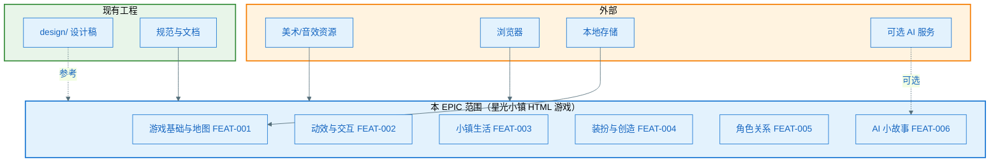
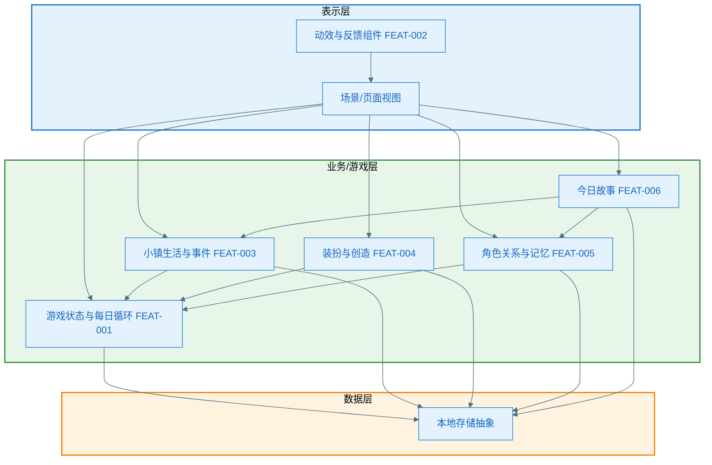

# EPIC 架构：EPIC-003 - 星光小镇（Starlit Town）

（各 Feature 的 plan 的 A2/A3.1 须继承本架构；须基于现有工程与 spec，遵循 constitution 的演进式设计原则。）

**Epic**：EPIC-003 - 星光小镇（Starlit Town）
**Epic Version**：v0.1.0（来自 `epic.md`）
**epic-arch Version**：v0.1.0
**创建/更新日期**：2025-02-05
**输入**：`epic.md`、各 `features/*/spec.md`、现有工程与设计稿、`.specify/memory/constitution.md`

> **原则**：从**整个 EPIC 需求**整体看待与设计技术架构，保证各 Feature 的 plan 基于同一套 0 层/1 层与规范；本 EPIC 交付物为**独立 HTML/Web 游戏**，与仓库内现有 Android 应用并列，须基于 spec 与设计稿做最小可行实现，不引入与 EPIC 技术栈不符的框架。

## 0 层架构（EPIC 与外部/现有工程边界）

> **目的**：明确本 EPIC 在整体系统中的位置、与外部系统及现有工程的边界、主要子系统或模块划分。各 Feature 的 plan 的 A2（Feature 全景架构）须在本图约束下展开。

- **边界说明**：
  - **EPIC 内**：星光小镇完整 HTML 游戏（入口、地图与每日循环、小镇生活、装扮与创造、角色关系、AI 小故事、动效与交互）。游戏实现为 EPIC 内新建交付物（如独立目录下的 HTML/CSS/JS 应用），与仓库内现有 Android 应用无共用运行时。
  - **外部**：浏览器环境（PC/平板）、本地存储（IndexedDB/localStorage）、可选外部 AI 服务（故事生成）、美术/音效资源；无后端账号体系。
  - **现有工程**：本仓库的规范与文档（specs、constitution、ux-design）；`design/` 下设计稿（HTML 原型、design-system.css）为体验与布局参考，非运行时依赖。
- **主要子系统/模块**：游戏基础与地图（FEAT-001）、动效与交互能力（FEAT-002）、小镇生活（FEAT-003）、装扮与创造（FEAT-004）、角色关系（FEAT-005）、AI 小故事（FEAT-006）。

### 0 层架构图（必须）

## 1 层架构（分层与模块职责）

> **目的**：明确 EPIC 内各层/模块的职责与依赖方向，与未来游戏代码分层衔接。各 Feature 的 plan 的 A3.1（第一层整体框架）须在本图约束下展开。

- **分层说明**：
  - **表示层**：HTML 页面、场景视图、可复用 UI 组件；动效与交互组件（FEAT-002）供各场景/面板复用。仅依赖下层，不直接访问存储。
  - **业务/游戏层**：游戏状态与每日循环（FEAT-001）、场景活动与小事件（FEAT-003）、装扮与创造状态（FEAT-004）、角色关系与情绪记忆（FEAT-005）、故事生成/模板（FEAT-006）。负责规则、流程与状态聚合；通过存储抽象读写持久化数据。
  - **数据层**：本地存储抽象（IndexedDB 优先，localStorage 降级）；统一键/结构约定，供进度、装扮、关系、事件等持久化。由 FEAT-001 Owner 提供契约，各 Feature 在契约下读写各自数据。
- **模块职责**：见下表；Owner Feature 见 epic.md「跨 Feature 技术策略」。

| 模块/能力           | 职责简述                         | Owner Feature |
|--------------------|----------------------------------|---------------|
| 入口与路由         | 游戏入口、场景切换、每日阶段推进 | FEAT-001      |
| 本地存储抽象       | 进度、状态持久化契约与降级       | FEAT-001      |
| 动效/反馈组件      | 统一点击/过渡动效、降级配置      | FEAT-002      |
| 小镇生活与事件     | 场景活动、2–3 小事件、总结入口   | FEAT-003      |
| 装扮与创造         | 换装、房间/宠物/裙子设计、持久化 | FEAT-004      |
| 角色关系与记忆     | NPC、互动记忆、差异化反馈        | FEAT-005      |
| 今日故事           | 当日事件聚合、模板/AI 故事输出   | FEAT-006      |

### 1 层架构图（必须）

## 规范与约束（所有 Feature plan 必须遵守）

> 与 `epic.md` 的「跨 Feature 技术策略」中「技术约束」对齐或细化；不得与 constitution 冲突。本 EPIC 为 Web 技术栈，constitution 中 Android 技术栈条款不直接适用，但演进式设计、差距分析、最小改动、文档纪律等原则仍须遵守。

- **技术栈**：HTML/CSS/JavaScript；兼容主流现代浏览器（Chrome、Safari、Edge 等）；无强制框架（可选用轻量路由/状态辅助），不得引入与纯前端交付物不符的重型框架。目标环境：PC 与平板浏览器。
- **存储**：以 IndexedDB 为主、localStorage 为降级；由 FEAT-001 定义存储抽象与键/结构约定，其他 Feature 按约定读写；无后端，数据全部本地化。
- **资源与性能**：首屏加载时间 ≤ 3 秒（常规网络）；场景切换响应 ≤ 500ms；图片/音效控制体积，动效资源 ≤ 500KB（见 FEAT-002）；单页应用内存增量可控，无显著泄漏。
- **分层与依赖**：表示层 → 业务层 → 数据层；禁止数据层或业务层依赖表示层；跨 Feature 通过约定接口/事件或共享状态访问，禁止循环依赖。
- **接口/契约**：跨 Feature 能力通过明确接口或数据契约消费（如 FEAT-003 调用 FEAT-004 换装入口、FEAT-006 读取当日事件与关系数据）；存储键与结构在 epic-arch / FEAT-001 plan 中约定，各 Feature 不得私自占用全局键。
- **线程与并发**：主线程负责 UI 与交互；存储读写宜异步（IndexedDB 异步 API），不阻塞主线程；若使用 Web Worker，仅限可选重计算，不改变「存储抽象由 FEAT-001 统一」的边界。
- **依赖注入**：不强制 DI 框架；若引入，须轻量且与纯前端交付物一致。
- **合规与安全**：面向 7–8 岁儿童的内容合规；不收集个人敏感信息；AI 生成内容需审核或模板兜底；用户输入（如宠物命名）需敏感词过滤与长度限制。
- **可观测性**：关键操作（入口加载、场景切换、存储失败、故事降级等）可日志或埋点，便于排查与验收；符合隐私合规。

## 与「跨 Feature 技术策略」的对应

| epic-arch 章节     | epic.md「跨 Feature 技术策略」对应项 |
|--------------------|--------------------------------------|
| 0 层架构图         | 共享能力识别（HTML 游戏入口、动效组件库、本地存储抽象）、Feature Plan 执行顺序 |
| 1 层架构图         | 共享能力识别、技术约束               |
| 规范与约束         | 技术约束（技术栈、存储、资源、合规） |

> 与 epic.md 该节已对齐；后续变更须双向同步。

## 变更记录（增量变更）

| 版本   | 日期       | 变更范围 | 变更摘要 | 影响 Feature / plan |
|--------|------------|----------|----------|----------------------|
| v0.1.0 | 2025-02-05 | 初始     | 初版     | —                    |
