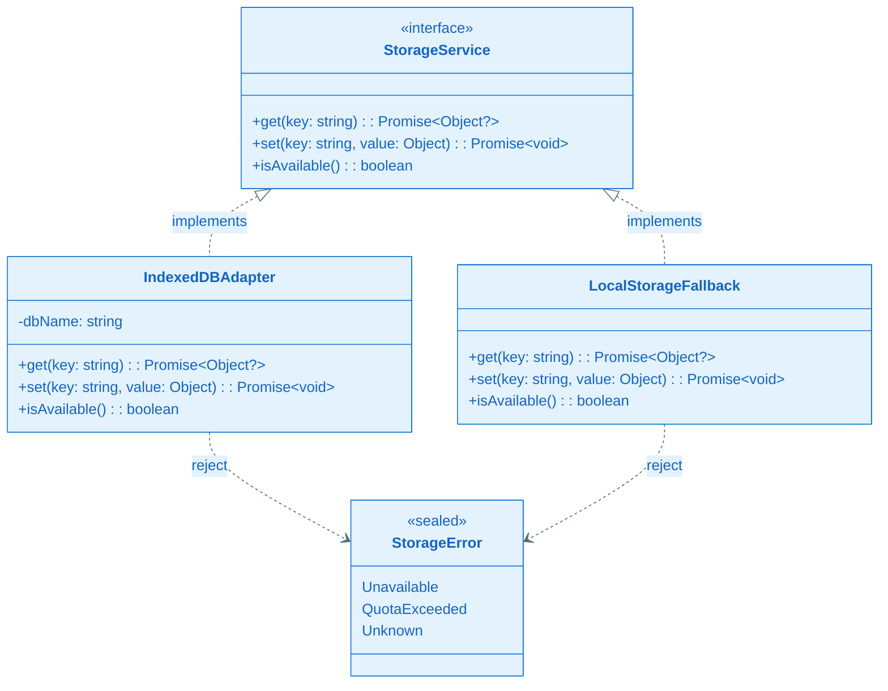
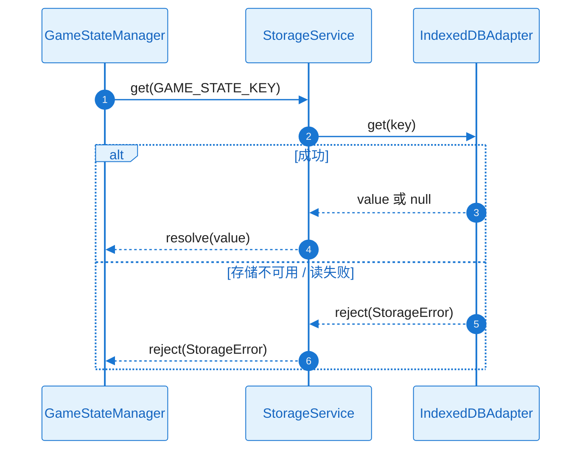
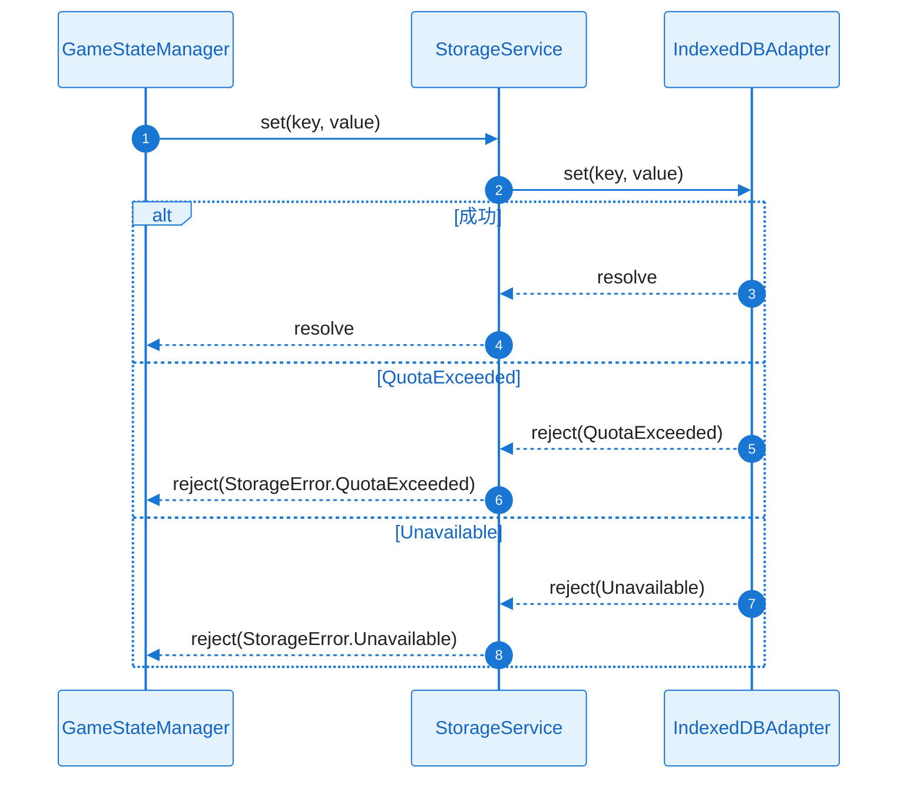
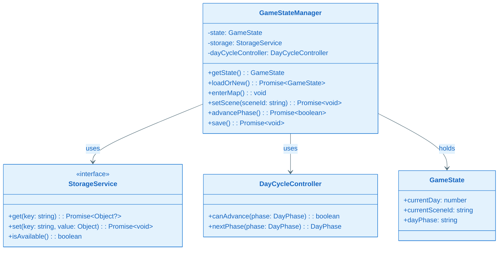
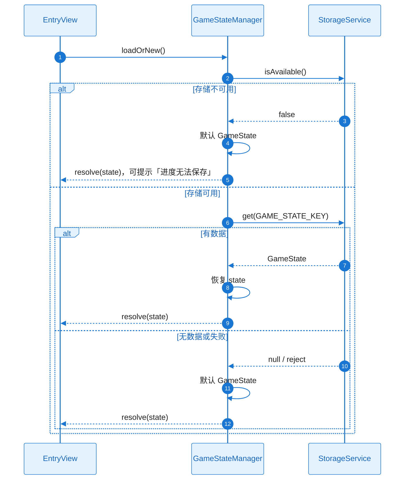
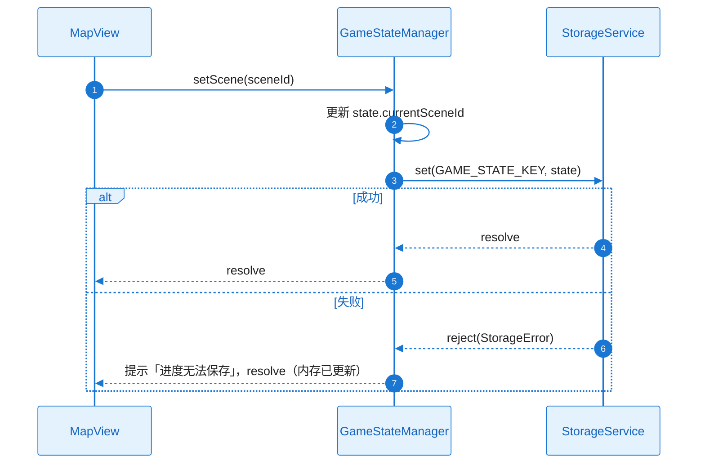
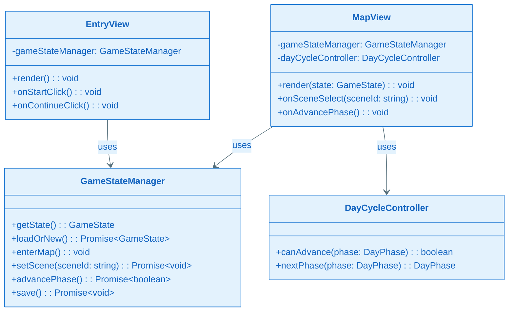
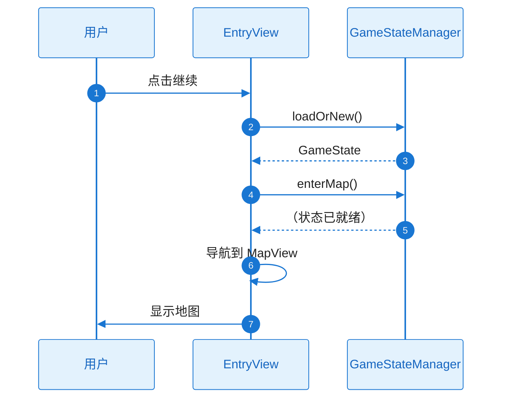
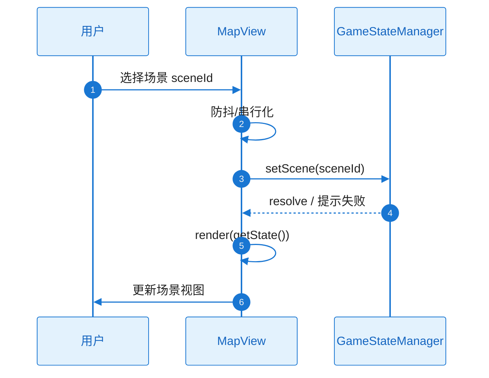

# L2 Story 详细设计（二层详细设计）

本文档与 **plan.md** 配套使用：当 Plan Level = Deep 时，各 Story 的 L2 详细设计在此文档中编写；plan.md 中通过「Story Detailed Design」章节引用本文档。

**Feature**：FEAT-001 - 游戏基础框架与地图

---

## 文档约定

- 对每个 Story，必须同时覆盖：**需求描述**、**功能设计（类图/时序图/触发条件/系统响应）**。
- 类图、时序图须基于本工程实际架构与真实代码，遵循 `.cursor/rules/specify-diagram-requirements.mdc`。
- tasks.md 的每个 Task 应明确引用对应 Story 的详细设计入口（例如：`L2_story_detail_design.md:ST-001:功能设计:时序图`）。

---

### ST-001 Detailed Design：存储抽象与键约定（Infrastructure）

#### 1) 需求及描述

- **需求描述**：实现 StorageService 接口及 IndexedDBAdapter、LocalStorageFallback；约定键名与 GameState 结构（B3），供本 Feature 与下游 Feature 使用。关联 FR-004、FR-005；NFR-REL-001、NFR-OBS-001。
- **需求依赖**：无（本 Story 为基础设施）。
- **使用范围**：GameStateManager、以及 FEAT-003/004/005/006 按约定键读写。
- **使用接口**：`get(key: string): Promise<Object | null>`；`set(key: string, value: Object): Promise<void>`；`isAvailable(): boolean`。
- **DoD（验收标准）**：
  - [ ] 单元测试：get/set/isAvailable 可用；IndexedDB 不可用时降级到 localStorage 或 isAvailable() 为 false（FR-004、FR-005）
  - [ ] 存储读写失败可打点/日志（NFR-OBS-001）；降级路径可测（NFR-REL-001）

#### 2) 功能设计

##### 功能设计关键说明

**核心实现思路**：
- 定义 StorageService 接口（get/set/isAvailable），由 IndexedDBAdapter 实现主路径、LocalStorageFallback 实现降级路径；工厂或启动时检测 IndexedDB 可用性并返回对应实现。
- 键约定与 GameState 结构在 B3 中已定义（如 `starlit.gameState`），本 Story 仅实现读写与可用性检测，不持有业务状态。

**关键类与职责划分**：
- **StorageService**：接口，定义 get/set/isAvailable 契约。
- **IndexedDBAdapter**：实现 StorageService，使用单库单对象库，key 为字符串、value 为可序列化对象。
- **LocalStorageFallback**：实现 StorageService，使用 JSON.stringify/parse 读写；isAvailable() 检测 localStorage 是否存在且可写。
- 检测逻辑（如 `indexedDB` in window 及 open 尝试）可在工厂或适配器内部完成，失败时返回 LocalStorageFallback 或标记 isAvailable() 为 false。

**失败处理与边界**：
- get/set 失败时 reject(StorageError)：Unavailable（存储不可用）、QuotaExceeded（空间不足）、Unknown。isAvailable() 为 false 时调用方不调用 get/set 或先提示用户。
- 无异步取消语义；单线程调用，无资源释放顺序依赖。

##### 类图（按项目实际架构，与 plan 全景类图对应）

**关键类职责说明**：

| 类/接口 | 核心职责 | 关键方法说明 |
|---------|----------|--------------|
| StorageService | 持久化抽象，键值读写与可用性 | get：按 key 取 value，无则 null；set：写入；isAvailable：是否可用 |
| IndexedDBAdapter | IndexedDB 实现 | 同接口；isAvailable 检测 indexedDB 与 open 成功 |
| LocalStorageFallback | localStorage 降级实现 | 同接口；value 用 JSON 序列化 |
| StorageError | 错误类型 | Unavailable / QuotaExceeded / Unknown |

##### 时序图（含正常+异常）

**get(key) 流程**：

**set(key, value) 流程（含 QuotaExceeded）**：

##### 触发条件与系统响应

| 触发条件 | 系统响应（正常流程） | 异常处理 |
|----------|----------------------|----------|
| 调用 get(key) | 返回已存储的 value 或 null | 存储不可用/读失败 → reject(StorageError) |
| 调用 set(key, value) | 写入成功并 resolve | Unavailable → reject；QuotaExceeded → reject，由调用方清理后重试 |
| 调用 isAvailable() | 返回 true/false | 无异常；false 时调用方不写或提示 |

##### 异常矩阵

| 异常ID | 触发条件 | 错误类型 | 可重试 | 对策 |
|--------|----------|----------|--------|------|
| EX-001 | IndexedDB/localStorage 不可用 | StorageError.Unavailable | 否 | isAvailable() 为 false；调用方提示 |
| EX-002 | 读/写过程失败 | StorageError.Unknown | 视情况 | 打点/日志；调用方提示 |
| EX-003 | 空间不足 | StorageError.QuotaExceeded | 是（清理后） | 由调用方按时间清理后重试 |

##### 验证与测试设计

- **单元测试**：Mock 或真实 IndexedDB/localStorage；测试 get 空键返回 null、set 后 get 一致；测试 isAvailable 在隐私模式或禁用存储时为 false；测试 set 超配额时 reject QuotaExceeded。
- **引用入口**：`L2_story_detail_design.md:ST-001:功能设计:时序图`

---

### ST-002 Detailed Design：GameState 持久化与 GameStateManager（Design-Enabler）

#### 1) 需求及描述

- **需求描述**：GameState 数据模型与 GameStateManager 单例；loadOrNew、save、setScene、advancePhase 与 StorageService 集成；错误与提示策略。关联 FR-003、FR-004、FR-005；NFR-REL-001。
- **需求依赖**：ST-001（StorageService、键约定可用）。
- **使用范围**：EntryView、MapView 及后续 Feature 通过 getState() 或事件消费状态。
- **使用接口**：getState()、loadOrNew()、enterMap()、setScene(sceneId)、advancePhase()、save()。
- **DoD（验收标准）**：
  - [ ] 进度可保存与恢复；存储失败时提示且不阻塞（FR-004、FR-005、NFR-REL-001）
  - [ ] 集成测试：保存后刷新恢复；QuotaExceeded 清理与重试（plan A4/A5）

#### 2) 功能设计

##### 功能设计关键说明

**核心实现思路**：
- GameStateManager 单例持有 GameState（currentDay, currentSceneId, dayPhase）；通过注入或获取 StorageService 实例进行持久化。loadOrNew() 先 isAvailable()，再 get(GAME_STATE_KEY)，有数据则恢复、无则默认 GameState；setScene/advancePhase 更新内存 state 后调用 set(GAME_STATE_KEY, state)，失败时提示「进度无法保存」且不回滚内存状态。
- DayCycleController 纯函数或无状态：canAdvance(phase)、nextPhase(phase) 按 morning→daytime→evening 规则。

**关键类与职责划分**：
- **GameStateManager**：持有 state、storage、dayCycleController；协调 loadOrNew、setScene、advancePhase、save；捕获 Storage 错误并转为用户可感知的提示或 reject。
- **DayCycleController**：canAdvance 校验是否可推进；nextPhase 返回下一阶段。
- **GameState**：数据模型，与 B3 一致。

**失败处理与边界**：
- 存储失败时内存状态已更新，仅提示用户；不阻塞 UI。QuotaExceeded 时可由本层或上层按时间清理最早数据后重试（见 plan A4）。快速连续 setScene/advancePhase 需串行化或防抖，避免竞态（RISK-003）。

##### 类图（按项目实际架构，与 plan A3.2.1 对应）

**关键类职责说明**：

| 类/接口 | 核心职责 | 关键方法说明 |
|---------|----------|--------------|
| GameStateManager | 持有状态并协调存储与阶段 | loadOrNew：读存储或默认；setScene/advancePhase：更新后持久化；失败提示 |
| DayCycleController | 阶段规则 | canAdvance：是否可推进；nextPhase：返回下一阶段 |
| GameState | 当前日/场景/阶段 | 与 B3 结构一致 |

##### 时序图（含正常+异常）

**loadOrNew()**：

**setScene(sceneId) 与持久化失败**：

##### 触发条件与系统响应

| 触发条件 | 系统响应（正常流程） | 异常处理 |
|----------|----------------------|----------|
| loadOrNew() | 返回恢复或默认 GameState | 存储不可用/读失败：仍返回默认状态，可选提示 |
| setScene(sceneId) | 更新 state 并持久化，resolve | 持久化失败：内存已更新，提示「进度无法保存」 |
| advancePhase() | canAdvance 为 true 时更新 dayPhase 并持久化，返回 true | 不可推进返回 false；持久化失败同 setScene |
| save() | 将当前 state 写入存储 | 失败时 reject 或提示 |

##### 并发/生命周期/资源管理

- 单例；setScene/advancePhase 串行化或防抖，避免并发写导致状态竞态（RISK-003）。
- 无显式资源释放；Storage 由上层或工厂创建，生命周期与页面一致。

##### 验证与测试设计

- **集成测试**：保存后刷新页面再 loadOrNew，校验恢复一致；模拟 QuotaExceeded 后清理重试；存储不可用时 loadOrNew 返回默认且可进入地图。
- **引用入口**：`L2_story_detail_design.md:ST-002:功能设计:时序图`

---

### ST-003 Detailed Design：入口与地图 UI（Functional）

#### 1) 需求及描述

- **需求描述**：EntryView（开始/继续）、MapView（地图与场景切换、日阶段展示）；与 GameStateManager/DayCycleController 绑定；首屏加载与场景切换性能达标。关联 FR-001、FR-002、FR-003；NFR-PERF-001、NFR-MEM-001。
- **需求依赖**：ST-002（GameStateManager、loadOrNew、setScene、advancePhase 可用）。
- **使用范围**：用户入口与地图导航；其他 Feature 可挂载场景内容。
- **使用接口**：EntryView：render()、onStartClick()、onContinueClick()；MapView：render(state)、onSceneSelect(sceneId)、onAdvancePhase()。
- **DoD（验收标准）**：
  - [ ] 用户可进入游戏、切换场景、推进阶段；首屏 ≤3s、切换 ≤500ms（FR-001～FR-003，NFR-PERF-001）
  - [ ] 单页内存增量 ≤100MB；无显著泄漏（NFR-MEM-001）

#### 2) 功能设计

##### 功能设计关键说明

**核心实现思路**：
- EntryView 渲染入口页；点击「开始」或「继续」前可调用 GameStateManager.loadOrNew() 得到是否有进度，再调用 enterMap() 并导航到地图视图。MapView 根据 getState() 渲染当前场景与日阶段；onSceneSelect 调用 setScene；onAdvancePhase 调用 advancePhase()；防抖或串行化避免快速连点（RISK-003）。
- 首屏：控制资源体积与加载顺序，保证从 URL 到可交互 ≤3s；场景切换仅更新视图与 state，目标 ≤500ms。

**关键类与职责划分**：
- **EntryView**：持有 GameStateManager 引用；render 输出入口 DOM；onStartClick/onContinueClick 触发 loadOrNew 与 enterMap。
- **MapView**：持有 GameStateManager、DayCycleController；render(state) 根据 currentSceneId、dayPhase 渲染；onSceneSelect/onAdvancePhase 调用 Manager 并更新 UI。

**失败处理与边界**：
- 存储失败已在 GameStateManager 层提示；UI 不重复弹窗。快速连点通过防抖或禁用按钮至请求完成，避免竞态。

##### 类图（与 plan A3.2.1 一致）

**关键类职责说明**：

| 类/接口 | 核心职责 | 关键方法说明 |
|---------|----------|--------------|
| EntryView | 入口页渲染与开始/继续 | render：挂载入口 UI；onStartClick/onContinueClick：loadOrNew 后 enterMap |
| MapView | 地图与场景、阶段展示与交互 | render(state)：按 state 渲染；onSceneSelect：setScene；onAdvancePhase：advancePhase |

##### 时序图（含正常+异常）

**入口点击继续并进入地图**：

**场景切换（含防抖/串行）**：

##### 触发条件与系统响应

| 触发条件 | 系统响应（正常流程） | 异常处理 |
|----------|----------------------|----------|
| 打开 URL | 加载资源后展示 EntryView | 加载超时/失败：进度提示或重试 |
| 点击开始/继续 | loadOrNew 后 enterMap，显示地图 | 存储不可用已由 Manager 侧提示 |
| 选择场景 | setScene 后 re-render 地图 | 持久化失败提示，UI 已更新 |
| 推进阶段 | advancePhase 后 re-render 日阶段 | 不可推进时按钮禁用或无反应；持久化失败提示 |

##### 性能与内存

- 首屏：控制 JS/CSS/图片体积，懒加载非首屏资源；验收首屏 ≤3s（NFR-PERF-001）。
- 场景切换：仅更新 DOM 与 state，无重载页面；验收 ≤500ms。
- 内存：避免全局大缓存；页面卸载时解绑监听（NFR-MEM-001）。

##### 验证与测试设计

- **E2E/手动**：完整一日骨架（入口→地图→切换场景→推进阶段→刷新恢复）；性能测量首屏与切换时延；内存进出 10 次无泄漏。
- **引用入口**：`L2_story_detail_design.md:ST-003:功能设计:时序图`
