# Plan（工程级蓝图）：游戏基础框架与地图

**Epic**：EPIC-003 - 星光小镇（Starlit Town）
**Feature ID**：FEAT-001
**Feature Version**：v0.1.0（来自 `spec.md`）
**Plan Version**：v0.1.0
**Plan Level**：Deep
**当前工作分支**：`epic/EPIC-003-starlit-town`
**Feature 目录**：`specs/epics/EPIC-003-starlit-town/features/FEAT-001-game-foundation/`
**日期**：2025-02-05
**输入**：来自 `Feature 目录/spec.md`

> 规则：
> - Plan 阶段必须包含工程决策、风险评估、算法/功耗/性能/内存评估（量化 + 验收指标）。
> - Implement 阶段**不得**擅自改写 Plan 的技术决策；若必须变更，走增量变更流程并提升 Version。
> - **图表规范**：样式遵循 `.cursor/rules/mermaid-style-guide.mdc`；内容与结构须基于本工程实际架构与真实代码，遵循 `.cursor/rules/specify-diagram-requirements.mdc`。

## 变更记录（增量变更）

| 版本 | 日期 | 变更范围（Feature/Story/Task） | 变更摘要 | 影响模块 | 是否需要回滚设计 |
|---|---|---|---|---|---|
| v0.1.0 | 2025-02-05 | Feature | 初始版本 | — | 否 |
| v0.2.0 | 2025-02-05 | Standard 阶段 | A3.3、Story Breakdown、A4–A11 | Plan-A | 否 |
| v0.3.0 | 2025-02-05 | Deep 阶段 | Story Detailed Design（L2） | plan.md + L2_story_detail_design.md | 否 |

## Plan 前置检查（必须，在开始设计前完成）

### 前置检查清单

- [x] 已阅读 `epic.md` 的"跨 Feature 技术策略"章节
- [x] 若 EPIC 根下存在 **`epic-arch.md`**，已阅读并在其 **0 层/1 层架构与规范约束**下做 A2、A3.1（不得脱离 EPIC 架构另画一套）
- [x] 已确认本 Feature 在 Plan 执行顺序中的位置（顺序 1，无前置依赖）
- [x] 已检查前置 Feature 的 plan（无前置 Feature）
- [x] 本 Feature 需要设计的共享能力已在 EPIC 级登记为 Owner（HTML 游戏入口、本地存储抽象）

### 依赖的共享能力（从其他 Feature 复用）

| 依赖的共享能力 | Owner Feature | Owner Plan 状态 | 如何获取/引用 |
|---|---|---|---|
| 无 | — | — | 本 Feature 为基础设施，无上游共享依赖 |

### 本 Feature 提供的共享能力（供其他 Feature 复用）

| 共享能力名称 | 消费方 Feature | 设计位置（本 plan 章节） | 接口/契约位置 |
|---|---|---|---|
| HTML 游戏入口 | FEAT-002, FEAT-003, FEAT-004, FEAT-005, FEAT-006 | A3.1, A3.2 | Plan-B:B4.1 |
| 本地存储抽象 | FEAT-003, FEAT-004, FEAT-005, FEAT-006 | A3.1, A3.2 | Plan-B:B3, B4.1 |

### 前置检查结论

- **检查日期**：2025-02-05
- **检查人**：SE/TL
- **结论**：通过
- **备注**：无

---

## 概述

本 Feature 提供星光小镇 HTML 游戏的基础设施：游戏入口（开始/继续）、地图导航与场景切换、每日循环骨架（早上/白天/晚上）、本地存储抽象（IndexedDB 优先、localStorage 降级）。核心工程决策：存储由本 Feature 统一抽象并约定键/结构，供后续 Feature 按契约读写；表示层不直接访问存储；场景切换与阶段推进由业务层驱动，UI 仅响应状态变化。

## Plan-A：工程决策 & 风险评估（必须量化）

### A0. 领域概念（Domain Concepts / Glossary，必须）

#### A0.1 领域概念词汇表（必须）

| 概念（中文） | 名称（英文/代码名） | 定义（一句话） | 关键属性/状态（Top3） | 不变量/约束 | 关联概念 |
|---|---|---|---|---|---|
| 游戏状态 | GameState | 当前游戏进度与上下文 | currentDay, currentSceneId, dayPhase | currentDay ≥ 1；dayPhase 枚举 | Scene, DayCycle |
| 场景 | Scene | 可切换的地图位置 | sceneId, name | sceneId 枚举：home/school/park/shop/forest | GameState |
| 每日循环 | DayCycle | 一日内时间阶段 | phase | phase: morning / daytime / evening | GameState |
| 日阶段 | DayPhase | 早上/白天/晚上 | — | 枚举值固定 | DayCycle |

#### A0.2 概念关系图（推荐，可选）

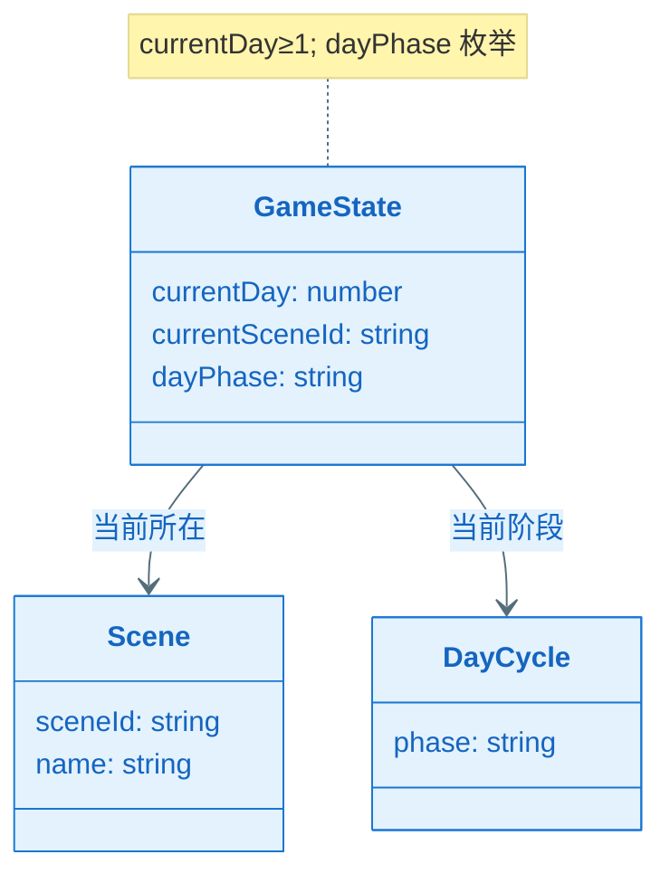

### A1. 技术选型（候选方案对比 + 决策理由）

| 决策点 | 候选方案 | 优缺点 | 约束/风险 | 决策 | 决策理由 |
|---|---|---|---|---|---|
| 本地存储 | IndexedDB / localStorage / 双轨 | IndexedDB 容量大、结构化；localStorage 兼容好、同步 API | IndexedDB 异步、部分环境不支持 | IndexedDB 为主、localStorage 降级 | spec 澄清：IndexedDB 优先；降级时提示并允许无保存游玩 |
| 路由/场景切换 | Hash 路由 / History API / 手写状态 | Hash 无需服务端；History 更友好 | 纯前端无服务端 | 轻量手写状态 + 可选 Hash | 与 EPIC 约束一致，不引入重型框架 |
| 状态管理 | 全局单例 / 事件总线 / 无框架 | 单例简单、可预测 | 需避免循环依赖 | 全局 GameStateManager 单例 | 范围小，单页应用；后续可演进为事件驱动 |

### A2. Feature 全景架构（0 层框架图：边界 + 外部依赖）

#### A2.1 Feature 全景架构图（必须）

> 继承 epic-arch 的 0 层：本 Feature 覆盖「游戏基础与地图」在 EPIC 内的边界及与浏览器、本地存储的关系。

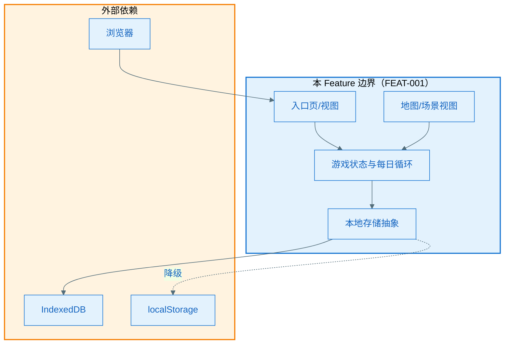

#### A2.1.1 架构设计说明（必须：理由/决策/思考）

- **边界与职责**：本 Feature 负责入口、地图、每日循环骨架与存储抽象；不包含具体业务玩法（装扮、NPC、小游戏）、美术与动效实现（由 FEAT-002 等提供）。Out of Scope：后端账号、多端同步。
- **分层与依赖方向**：表示层（EntryView、MapView）仅依赖业务层（GameStateManager、DayCycleController）；业务层依赖数据层（StorageService）；禁止表示层或业务层被数据层依赖。
- **关键数据流**：GameState 为 System of Record，持久化由 StorageService 写入 IndexedDB（或降级 localStorage）；读取在启动与恢复时进行，写入在阶段推进、场景切换等关键节点；无服务端，无缓存多源一致性需求。
- **外部依赖策略**：IndexedDB/localStorage 不可用时，检测并提示「进度无法保存」，允许继续以无保存模式游玩；存储满时按时间清理最早游戏日数据并可选提示。
- **可演进性**：StorageService 以接口形式暴露，键与结构在 Plan-B 约定，便于其他 Feature 按命名空间扩展；场景 ID 与阶段枚举可扩展。

#### A2.2 外部依赖清单（若有则必填，无依赖时标注 N/A）

| 依赖项 | 类型 | 提供方 | 提供的能力 | 通信方式 | 故障模式 | 我方策略 |
|--------|------|--------|-----------|----------|----------|----------|
| IndexedDB | 浏览器 API | 浏览器 | 持久化键值/结构化存储 | 异步 API | 不可用/满/损坏 | 降级 localStorage；不可用时提示、允许无保存游玩 |
| localStorage | 浏览器 API | 浏览器 | 持久化键值 | 同步 API | 不可用/满 | 仅作降级；满时按时间清理并提示 |

#### A2.3 通信与交互约束（必须）

- **协议**：浏览器存储 API（IndexedDB/localStorage）；层间为函数调用/事件。
- **超时与重试**：存储读写异步，不设业务超时；失败即降级或提示，不阻塞主线程。
- **错误处理**：统一错误类型（StorageUnavailable、QuotaExceeded 等）；用户提示策略见 A5。
- **数据一致性**：单写单读、无并发写冲突；页面刷新/关闭前尽量持久化最近状态。

### A3. Feature 内部设计

#### A3.1 第一层：整体框架设计（必须）

##### A3.1.1 内部总体框架图（必须）

> 继承 epic-arch 的 1 层：表示层 → 业务/游戏层 → 数据层；本 Feature 仅包含入口与地图的 UI、游戏状态与每日循环、本地存储抽象。

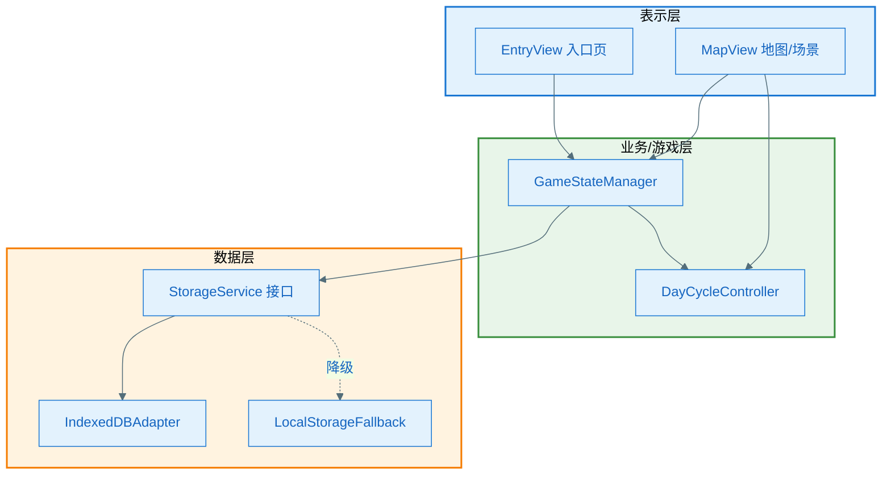

##### A3.1.2 总体设计说明（必须）

###### A3.1.2.1 组件清单与职责（必须）

| 组件 | 所属模块 | 职责（一句话） | 输入/输出 | 依赖 | 约束 |
|------|----------|----------------|-----------|------|------|
| EntryView | 表示层 | 渲染入口页（开始/继续），响应用户点击进入地图 | 用户点击 → 调用 GameStateManager 进入/恢复 | GameStateManager | 不直接访问存储 |
| MapView | 表示层 | 渲染地图与场景切换、日阶段展示，触发切换与阶段推进 | 用户选择场景/阶段 → 调用 GameStateManager / DayCycleController | GameStateManager, DayCycleController | 不直接访问存储 |
| GameStateManager | 业务层 | 维护 GameState（当前日、场景、阶段），协调加载/保存与恢复 | 读/写 GameState；暴露 getState/setScene/advancePhase 等 | StorageService, DayCycleController | 主线程；存储读写异步 |
| DayCycleController | 业务层 | 每日循环阶段规则（早上→白天→晚上）与推进 | 当前阶段 → 可推进则更新 GameState | GameStateManager | 与 GameStateManager 协同 |
| StorageService | 数据层 | 持久化 GameState 及约定键结构，提供 get/set/clear | key/value 读写；返回 Promise | IndexedDBAdapter 或 LocalStorageFallback | 异步；降级时提示 |
| IndexedDBAdapter | 数据层 | 使用 IndexedDB 实现 StorageService 契约 | 同 StorageService | 浏览器 IndexedDB | 异步 |
| LocalStorageFallback | 数据层 | 存储不可用时以 localStorage 实现部分契约或仅提示 | 同 StorageService（能力可能受限） | 浏览器 localStorage | 同步 API，调用处需适配 |

###### A3.1.2.2 组件协作时序图（必须）

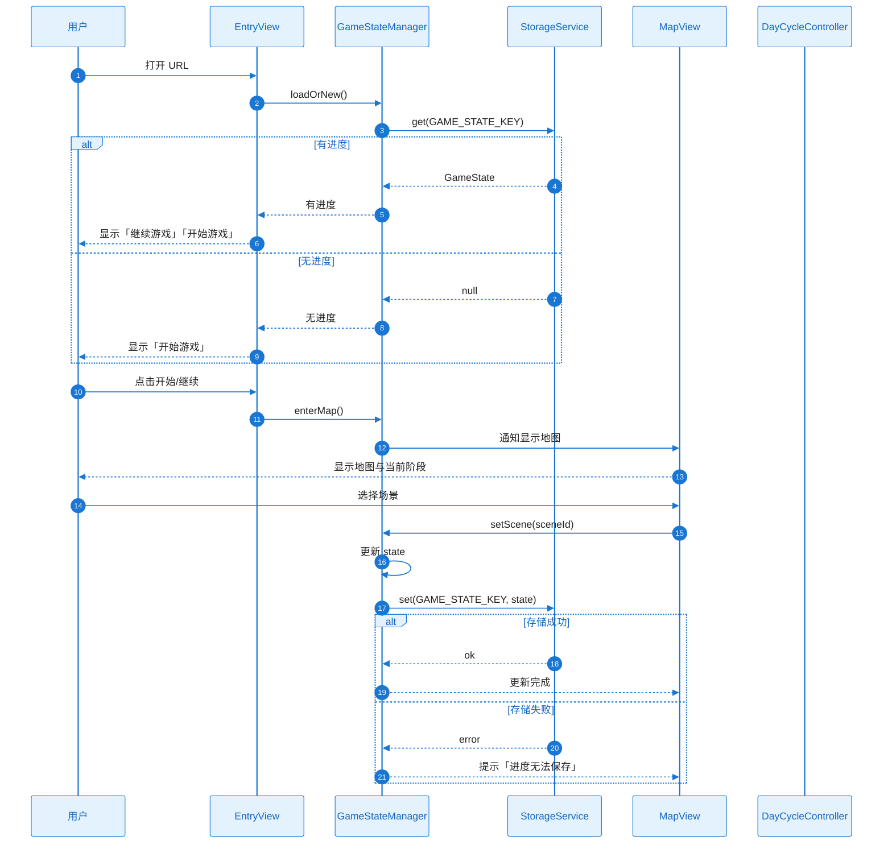

###### A3.1.2.3 关键设计决策（必须）

| 决策点 | 候选方案 | 决策 | 决策理由 | 影响范围 | 引用来源 |
|--------|----------|------|----------|----------|----------|
| 存储抽象形态 | 接口 + 双实现 | StorageService 接口 + IndexedDBAdapter / LocalStorageFallback | 兼容与降级需求 | 数据层、B3/B4 | spec 澄清 |
| 状态归属 | 分散 / 单例 | GameStateManager 单例持有一份 GameState | 简单可预测，无多源 | 业务层、表示层消费 | A1 |
| 阶段推进入口 | MapView 直接改 / 经 Controller | 经 DayCycleController 校验与推进 | 规则集中、易扩展 | DayCycleController, GameStateManager | FR-003 |

###### A3.1.2.4 主要风险与权衡

- **权衡点**：存储可用性 vs 体验——不可用时允许继续游玩，不阻塞。
- **已知风险**：IndexedDB 在部分隐私模式或旧环境中不可用 → 降级与提示（详见 A5）。

---

#### A3.2 第二层：Feature 全景（必须）

##### A3.2.1 全景类图（必须）

> 本 EPIC 为纯 HTML/JS 交付物，无 Android/Kotlin；以下类名为实现时采用的模块/类（ES 模块 + 类或工厂函数）。

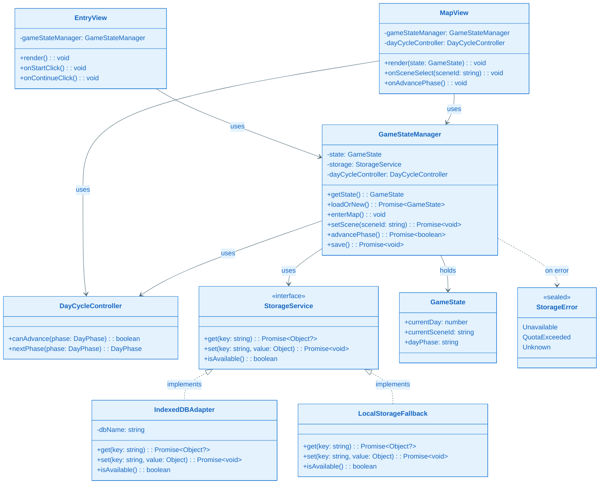

###### 关键类职责说明

| 类/接口 | 层级 | 职责 | 关键方法 |
|---------|------|------|----------|
| EntryView | 表示层 | 入口页渲染与开始/继续点击 | render(), onStartClick(), onContinueClick() |
| MapView | 表示层 | 地图与场景渲染、场景选择与阶段推进触发 | render(state), onSceneSelect(), onAdvancePhase() |
| GameStateManager | 业务层 | 持有 GameState，协调加载/保存/场景/阶段 | getState(), loadOrNew(), setScene(), advancePhase(), save() |
| DayCycleController | 业务层 | 每日阶段规则与推进 | canAdvance(), nextPhase() |
| StorageService | 数据层 | 持久化抽象 | get(), set(), isAvailable() |
| IndexedDBAdapter | 数据层 | IndexedDB 实现 | get(), set(), isAvailable() |
| LocalStorageFallback | 数据层 | localStorage 降级实现 | get(), set(), isAvailable() |
| GameState | 数据模型 | 当前日、场景、阶段 | currentDay, currentSceneId, dayPhase |
| StorageError | 领域错误 | 存储不可用/满/未知 | — |

##### A3.2.2 Feature 时序图集（方法调用流程，必须）

| Seq ID | 流程名称 | 覆盖的异常（EX-xxx） |
|--------|----------|----------------------|
| SEQ-001 | 启动并进入地图 | EX-001, EX-002 |
| SEQ-002 | 场景切换与持久化 | EX-002, EX-003 |
| SEQ-003 | 阶段推进与持久化 | EX-002 |

###### SEQ-001：启动并进入地图

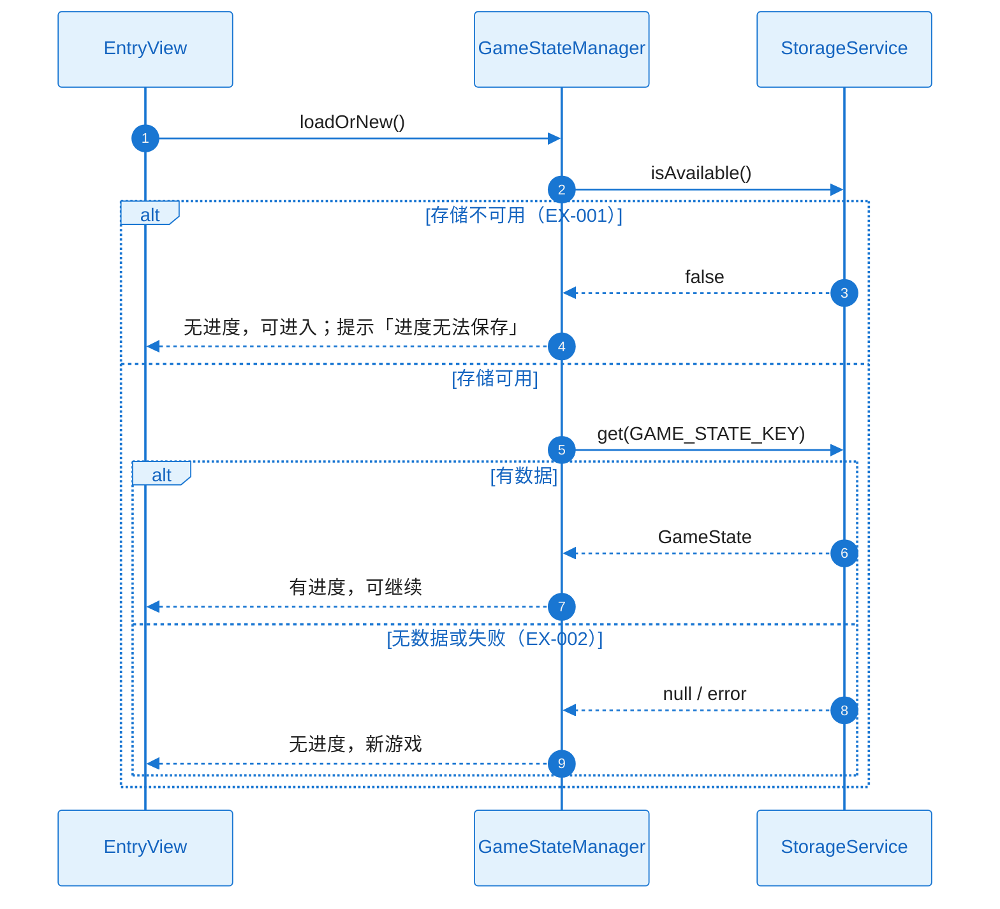

###### SEQ-002：场景切换与持久化

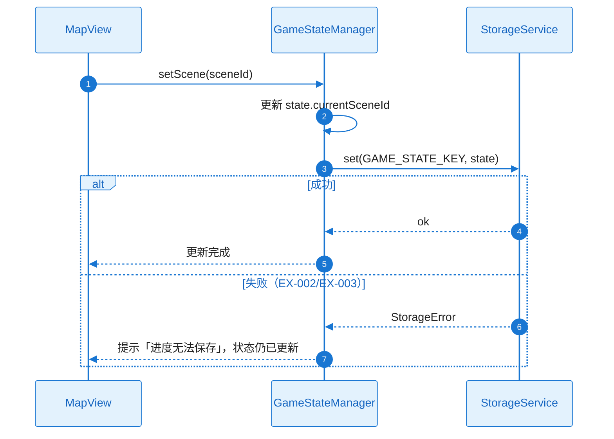

###### SEQ-003：阶段推进与持久化

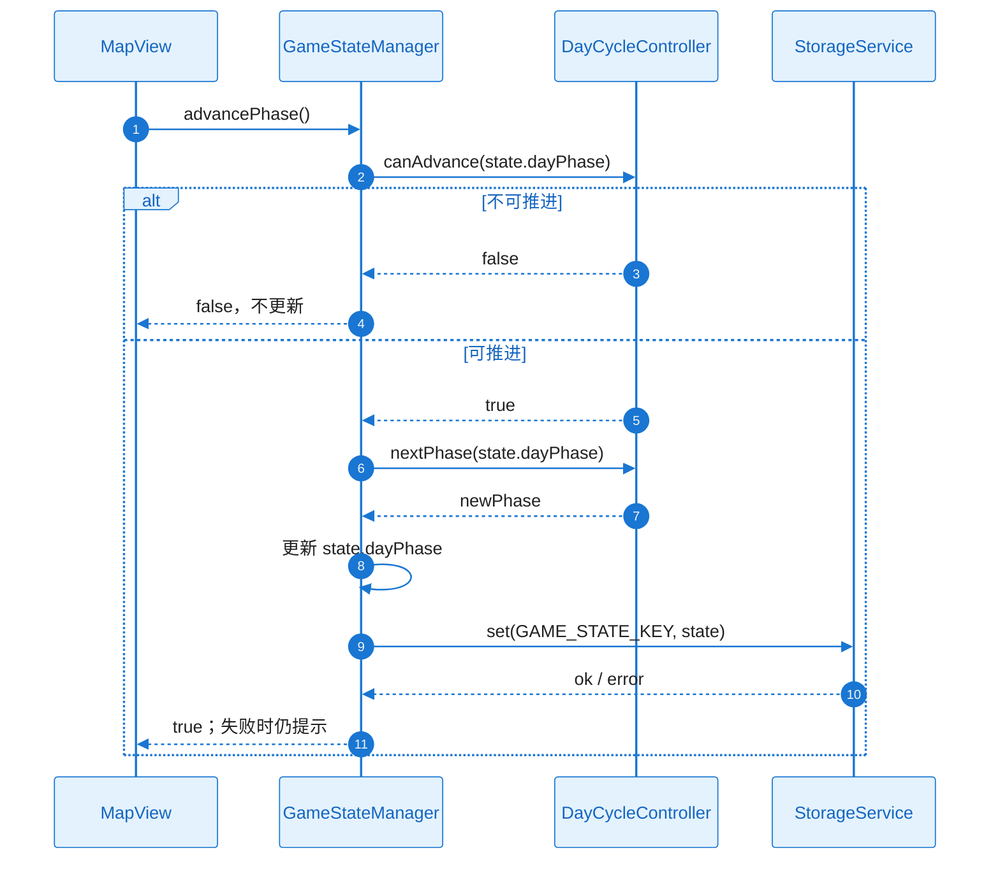

##### A3.2.3 Feature 流程图集（逻辑流程，必须）

###### 流程 1：启动并进入地图

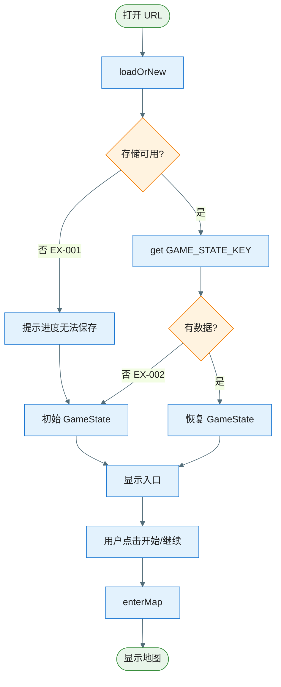

| 分支 | 异常ID | 触发条件 | 对策 |
|------|--------|----------|------|
| 存储不可用 | EX-001 | IndexedDB/localStorage 不可用 | 提示「进度无法保存」，允许继续 |
| 无数据/读失败 | EX-002 | get 返回 null 或抛错 | 视为新游戏，继续进入 |

###### 流程 2：场景切换与持久化

```mermaid
%%{init: {'theme': 'base', 'themeVariables': { 'primaryColor': '#E3F2FD', 'primaryTextColor': '#212121', 'primaryBorderColor': '#1976D2', 'lineColor': '#546E7A'}}}%%
flowchart TD
  Start([用户选场景]) --> SetScene[setScene(sceneId)]
  SetScene --> Update[更新 state.currentSceneId]
  Update --> Save[set GAME_STATE_KEY]
  Save --> Result{写入结果?}
  Result -->|成功| Ok[更新 UI]
  Result -->|失败 EX-002/EX-003| Prompt[提示进度无法保存]
  Ok --> End([结束])
  Prompt --> End

  style Start fill:#E8F5E9,stroke:#388E3C
  style End fill:#E8F5E9,stroke:#388E3C
  style Result fill:#FFF3E0,stroke:#F57C00
```

| 分支 | 异常ID | 触发条件 | 对策 |
|------|--------|----------|------|
| 写入失败 | EX-002 | 存储不可用 | 提示，内存状态已更新 |
| 空间不足 | EX-003 | QuotaExceeded | 按时间清理最早数据后重试或提示 |

##### A3.2.4 关键设计详解（若适用）

本节对 A3.1.2.3 已覆盖的决策已足够，不另增设计点；存储键与结构在 Plan-B 中约定。

---

#### A3.3 第三层：组件内部详细设计（Plan Level = Standard 时执行）

##### 组件：GameStateManager

- **定位**：业务层单例，持有 GameState，协调加载/保存/场景切换/阶段推进。
- **对外接口**：getState()、loadOrNew()、enterMap()、setScene(sceneId)、advancePhase()、save()；失败通过 Promise reject 或返回值传递 StorageError。
- **失败与降级**：存储失败时更新内存状态并提示「进度无法保存」，不阻塞 UI。

###### 组件类图

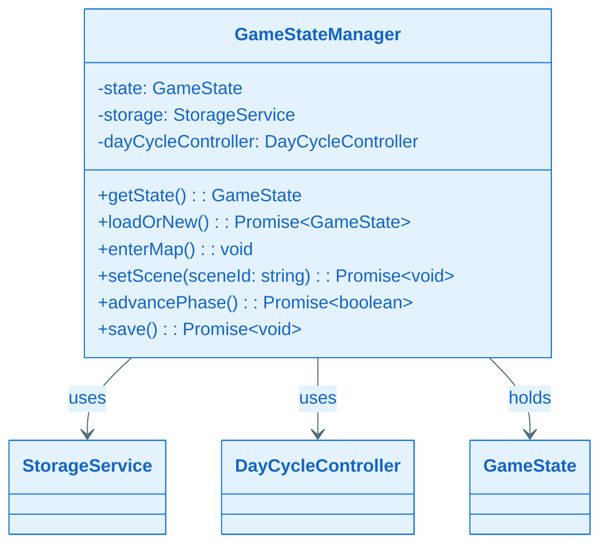

###### 组件时序图（含正常+异常）

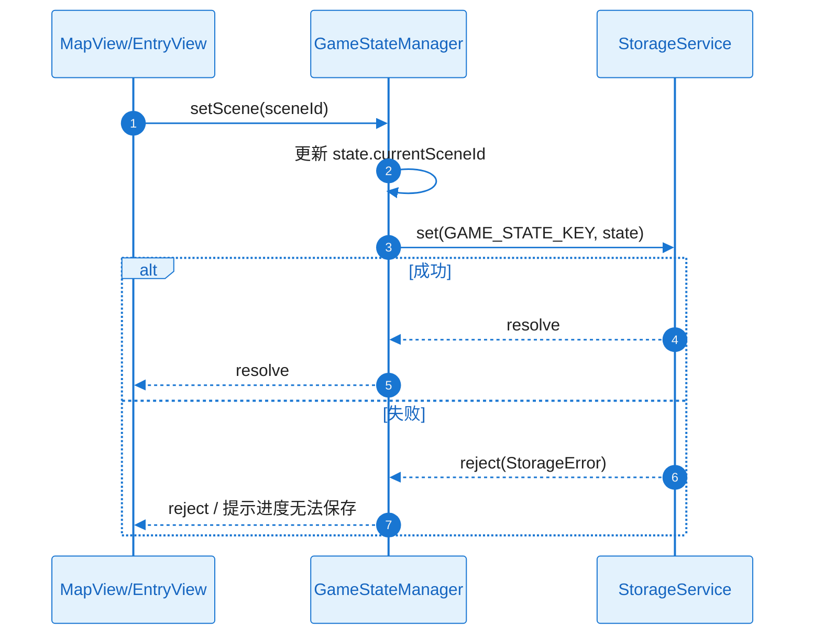

###### 异常清单

| 异常ID | 触发条件 | 错误类型 | 可重试 | 对策 |
|--------|----------|----------|--------|------|
| EX-002 | 存储不可用 | StorageError.Unavailable | 否 | 提示，内存状态已更新 |
| EX-003 | 空间不足 | StorageError.QuotaExceeded | 是（清理后） | 按时间清理最早数据后重试或提示 |

##### 组件：StorageService（IndexedDBAdapter / LocalStorageFallback）

- **定位**：数据层抽象，IndexedDB 优先、localStorage 降级，供 GameStateManager 及后续 Feature 按键读写。
- **对外接口**：get(key)、set(key, value)、isAvailable()；失败返回 Promise reject(StorageError)。
- **失败与降级**：IndexedDB 不可用时切换 LocalStorageFallback；两者均不可用时 isAvailable() 为 false，调用方提示用户。

###### 组件流程图（含正常+异常）

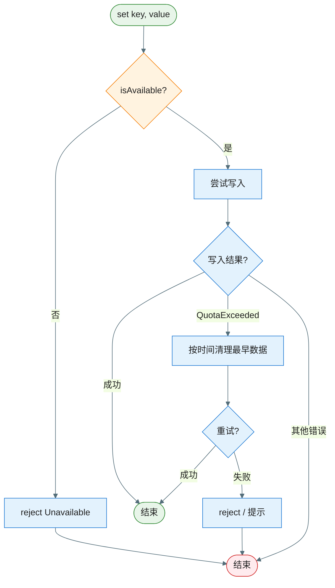

---

### A4. 技术风险与消解策略（绑定 Story/Task）

| 风险ID | 风险描述 | 触发条件 | 影响范围 | 严重度 | 消解策略 | 对应 Story/Task |
|--------|----------|----------|----------|--------|----------|-----------------|
| RISK-001 | IndexedDB 在隐私模式/旧环境不可用 | 浏览器限制 | 进度无法持久化 | Med | LocalStorageFallback + 提示「进度无法保存」 | ST-001, ST-002 |
| RISK-002 | 存储空间不足 | 数据增长 | 写入失败 | Low | 按时间清理最早游戏日数据；提示用户 | ST-002 |
| RISK-003 | 快速连续切换场景导致状态竞态 | 用户快速操作 | 状态不一致或重复写 | Low | 串行化 setScene/advancePhase 或防抖 | ST-003 |

### A5. 边界 & 异常场景枚举

- **数据边界**：currentDay ≥ 1；currentSceneId/dayPhase 枚举校验；空/非法键不写入。
- **状态边界**：阶段仅允许 morning→daytime→evening 顺序推进；不可回退。
- **生命周期**：页面刷新/关闭前尽量触发 save；恢复时 loadOrNew 读持久化或给默认 GameState。
- **并发**：单页单实例；多标签同时写存储不保证，建议单页使用。
- **用户行为**：快速连点场景/阶段 → 防抖或串行化，避免重复请求存储。

#### A5.1 场景 → 应对措施对照表（必须）

| 场景ID | 场景类别 | 触发条件（可复现） | 影响 | 预期行为 | 技术对策 | 设计对策 | 映射 |
|--------|----------|-------------------|------|----------|----------|----------|------|
| SC-001 | 数据 | 存储不可用 | 无法保存 | 提示「进度无法保存」，内存状态已更新 | LocalStorageFallback / 提示 | N/A | 流程1 / EX-002 |
| SC-002 | 数据 | QuotaExceeded | 写入失败 | 清理最早数据重试或提示 | 按时间清理 + 重试 | 提示用户 | EX-003 |
| SC-003 | 生命周期 | 页面刷新 | 进度丢失风险 | 恢复时从存储加载或默认 | loadOrNew 读持久化 | N/A | SEQ-001 |
| SC-004 | 用户行为 | 快速连续切换场景 | 状态/写竞态 | 不卡顿、不重复弹提示 | 串行化或防抖 | N/A | ST-003 |

### A6. 算法评估（如适用）

不适用（本 Feature 无推荐/检测/分类等算法）。

### A7. 功耗评估

不适用（Web 浏览器环境，无独立功耗预算；见 spec NFR-POWER-001）。

### A8. 性能评估（必须量化，基于场景）

#### A8.1 测试设备基线

| 维度 | 定义 |
|------|------|
| 设备/环境 | PC 或平板浏览器（Chrome/Safari/Edge），4G/WiFi RTT < 100ms |

#### A8.2 性能场景与指标

| 场景 | 指标 | 验收标准 (p95) |
|------|------|----------------|
| 首屏加载 | 从 URL 到主界面可交互 | ≤ 3s |
| 场景切换 | 从点击到视图切换完成 | ≤ 500ms |

#### A8.3 降级策略

| 触发条件 | 降级策略 |
|----------|----------|
| 低端设备/慢网络 | 减少首屏资源体积；加载中展示进度提示 |
| 存储慢 | 异步保存不阻塞 UI；失败提示 |

### A9. 内存评估（必须量化，基于场景）

| 场景 | 验收标准 | 主要来源 | 优化方向 |
|------|----------|----------|----------|
| 前台正常使用 | 单页内存增量 ≤ 100MB | DOM、JS 状态、少量缓存 | 避免全局缓存大对象 |
| 长时间运行（30 分钟） | 无持续增长 | 监听器/定时器未释放 | 页面卸载时解绑 |
| 内存泄漏检测（进出 10 次） | 回到 Baseline ±5MB | 存储/事件监听 | 单例与生命周期一致 |

### A10. 安全评估（如适用）

不收集个人敏感信息；本地存储仅游戏进度；符合儿童内容合规（NFR-SEC-001）。不适用额外安全评估。

### A11. 兼容性评估（必须）

- **系统/环境**：Chrome、Safari、Edge 等主流现代浏览器；PC 与平板。
- **存储**：支持 IndexedDB 的环境优先；否则 localStorage 降级并提示。
- **不兼容场景**：不支持 IndexedDB 且无 localStorage 的极旧环境 → 仅提示「进度无法保存」，允许无保存模式游玩。

**兼容性结论**：本 Feature 兼容主流现代浏览器，降级路径明确，兼容性风险较低。

---

## Plan-B：技术规约 & 实现约束

### B0. Plan-A ↔ Plan-B 一致性与互校（必须）

| Plan-A（决策/假设/约束） | Plan-B（落点） | 自检规则（必须通过） |
|---|---|---|
| A0 领域概念命名 | B3/B4 | GameState、Scene、DayPhase 与 B3 一致 |
| A1 技术选型 | B1/B2 | IndexedDB 为主、localStorage 降级在 B2/B3 体现 |
| A2 外部依赖与故障策略 | B4.2 | 存储不可用/满的语义与 A2.2 一致 |
| A3 数据一致性/缓存假设 | B3.1 | 单写单读、无缓存多源 |
| A3 错误与失败传播 | B2/B4 | StorageError 与用户提示策略一致 |

### B1. 技术背景（用于统一工程上下文）

**Language/Version**：JavaScript（ES6+），HTML5，CSS3  
**Primary Dependencies**：无强制框架；可选轻量路由/状态辅助  
**Storage**：IndexedDB 为主，localStorage 降级；键/结构由本 Feature 约定（见 B3）  
**Test Framework**：可选 Jest / 手写测试；浏览器环境需可测存储模拟  
**Target Platform**：PC 与平板浏览器（Chrome、Safari、Edge 等）  
**Project Type**：web（独立 HTML 游戏，与仓库内 Android 应用并列）  
**Performance Targets**：首屏 ≤3s，场景切换 ≤500ms（见 spec NFR-PERF-001）  
**Constraints**：无后端；本地存储仅游戏进度；儿童内容合规  
**Scale/Scope**：单用户、单设备；数据量级为进度与状态，小规模  

### B2. 架构细化（实现必须遵循）

- **分层约束**：表示层仅调用业务层；业务层不依赖表示层；数据层不依赖业务层/表示层。禁止 UI 直连 Storage。
- **线程/并发模型**：主线程负责 UI 与业务；存储读写异步（IndexedDB），不阻塞主线程。
- **错误处理规范**：StorageService 失败返回/抛出 StorageError；业务层转换为用户提示（「进度无法保存」等），不抛未处理异常到 UI。
- **日志与可观测性**：入口加载、场景切换、存储读写失败可打点/日志，符合 NFR-OBS-001；敏感信息不落日志。

### B3. 数据模型（引用或内联）

#### B3.1 存储形态与边界（必须）

- **存储形态**：IndexedDB（首选）或 localStorage（降级）；无后端。
- **System of Record**：本地持久化数据为权威；内存中 GameState 与持久化一致（保存成功后）。
- **缓存与派生数据**：无多级缓存；其他 Feature 按约定键读写各自命名空间。
- **生命周期**：常驻至用户关闭/刷新；关键操作后异步保存；清理策略：空间不足时按时间清理最早游戏日数据。
- **数据规模与增长**：单用户进度，键数量与单键体积均小。

#### B3.2 物理数据结构（若使用持久化存储则必填）

本 Feature 使用 KV 形态（IndexedDB 单库单对象库，或 localStorage 键值）。

##### （KV/文件）键/文件结构清单（如适用）

| Key | 用途 | 结构版本 | Schema/字段说明 | 迁移策略 |
|-----|------|----------|-----------------|----------|
| `starlit.gameState` | 游戏进度（本 Feature） | v1 | 见下 GameState 结构 | 新增字段带默认值；未来版本号可写入 value |
| （其他 Feature 键由各 Feature plan 约定，前缀建议如 `starlit.*`） | — | — | — | — |

**GameState 结构（v1）**：

| 字段 | 类型 | 约束 | 含义 |
|------|------|------|------|
| currentDay | number | ≥ 1 | 游戏内第 N 天 |
| currentSceneId | string | 枚举：home/school/park/shop/forest | 当前场景 |
| dayPhase | string | 枚举：morning/daytime/evening | 当前日阶段 |

### B4. 接口规范/协议（引用或内联）

#### B4.1 本 Feature 对外提供的接口（必须：Capability Feature/跨模块复用场景）

- **StorageService（存储抽象）**  
  - **用途**：供 FEAT-003/004/005/006 按约定键读写持久化数据。  
  - **方法**：`get(key: string): Promise<Object | null>`；`set(key: string, value: Object): Promise<void>`；`isAvailable(): boolean`。  
  - **错误语义**：get/set 失败可 reject 或返回 Result 型；错误类型 StorageError（Unavailable / QuotaExceeded / Unknown）。可重试：QuotaExceeded 清理后重试；Unavailable 不重试。用户提示：统一「进度无法保存」或具体 Toast。  
  - **并发**：单线程；异步 API 不保证多标签页同时写，建议单页使用。  
  - **版本与兼容**：键命名空间 `starlit.*`；新增键不破坏既有键；value 结构版本化时向后兼容。

- **游戏入口与路由（入口/地图展示与切换）**  
  - **用途**：供其他 Feature 挂载场景内容（如 FEAT-003 场景内活动）。  
  - **约定**：GameStateManager 暴露 getState()；MapView 根据 state.currentSceneId / state.dayPhase 切换视图；其他 Feature 通过事件或共享 state 订阅变化（具体在集成时约定）。  

#### B4.2 本 Feature 依赖的外部接口/契约（必须：存在外部依赖时）

- **浏览器 IndexedDB / localStorage**：标准 Web API；无自定义契约。故障与降级见 A2.2。

#### B4.3 契约工件（contracts/）与引用方式（推荐）

- 可选：在 `contracts/` 下提供 `storage-keys.md` 或 JSON Schema 描述 `starlit.gameState` 等键与结构；变更须更新 Plan Version 或变更记录。

### B5. 合规性检查（关卡）

- 不收集个人敏感信息；本地存储仅游戏进度；符合儿童内容合规（epic-arch 与 spec）。
- 进入 Implement 前确认：存储键命名空间与 B3/B4 一致；其他 Feature 不占用 `starlit.gameState` 或与本 Feature 约定冲突。

### B6. 项目结构（本 Feature）

```text
specs/epics/EPIC-003-starlit-town/features/FEAT-001-game-foundation/
├── spec.md
├── plan.md
├── tasks.md                    # 待 /speckit.tasks 生成
└── checklists/
```

### B7. 源代码结构（代码库根目录）

本 EPIC 交付物为独立 HTML 游戏，与现有 Android 应用并列；建议在仓库内单独目录（例如 `starlit-town/` 或 `web/starlit-town/`）下放置 HTML/CSS/JS，具体由项目约定。

```text
# 示例：Web 游戏独立目录
starlit-town/
├── index.html
├── css/
├── js/
│   ├── entry/
│   ├── map/
│   ├── game/
│   └── storage/
└── assets/
```

**结构决策**：以「表示层 / 业务层 / 数据层」对应目录或模块划分；StorageService 与键约定在 B3/B4 中已定义，实现时按此落点。

---

## Story Breakdown（Plan Level = Standard 时执行）

### Story 列表

#### ST-001：存储抽象与键约定（Infrastructure）

- **类型**：Infrastructure
- **描述**：实现 StorageService 接口及 IndexedDBAdapter、LocalStorageFallback；约定键名与 GameState 结构（B3），供本 Feature 与下游 Feature 使用。
- **目标**：get/set/isAvailable 可用；IndexedDB 不可用时降级到 localStorage 或提示。
- **预估工作量**：3 人天
- **覆盖 FR/NFR**：FR-004、FR-005；NFR-REL-001、NFR-OBS-001
- **依赖**：无
- **可并行**：否
- **关键风险**：是（RISK-001）
- **验收/验证方式**：单元测试存储读写与降级路径；浏览器环境可测。
- **交付物**：StorageService、IndexedDBAdapter、LocalStorageFallback、B3 键/结构实现。

#### ST-002：GameState 持久化与 GameStateManager（Design-Enabler）

- **类型**：Design-Enabler / Infrastructure
- **描述**：GameState 数据模型与 GameStateManager 单例；loadOrNew、save、setScene、advancePhase 与 StorageService 集成；错误与提示策略。
- **目标**：进度可保存与恢复；存储失败时提示且不阻塞。
- **预估工作量**：4 人天
- **覆盖 FR/NFR**：FR-003、FR-004、FR-005；NFR-REL-001
- **依赖**：ST-001
- **可并行**：否
- **关键风险**：是（RISK-002、RISK-003）
- **验收/验证方式**：集成测试：保存后刷新恢复；QuotaExceeded 清理与重试。
- **交付物**：GameState、GameStateManager、DayCycleController 与存储集成。

#### ST-003：入口与地图 UI（Functional）

- **类型**：Functional
- **描述**：EntryView（开始/继续）、MapView（地图与场景切换、日阶段展示）；与 GameStateManager/DayCycleController 绑定；首屏加载与场景切换性能达标。
- **目标**：用户可进入游戏、切换场景、推进阶段；首屏 ≤3s、切换 ≤500ms。
- **预估工作量**：5 人天
- **覆盖 FR/NFR**：FR-001、FR-002、FR-003；NFR-PERF-001、NFR-MEM-001
- **依赖**：ST-002
- **可并行**：否
- **关键风险**：否
- **验收/验证方式**：E2E 或手动：完整一日骨架；性能指标测量。
- **交付物**：EntryView、MapView、入口与地图资源。

### Story 依赖关系图

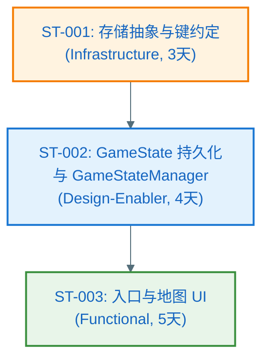

### Feature → Story 覆盖矩阵

| FR/NFR ID | 覆盖的 Story ID | 备注 |
|-----------|-----------------|------|
| FR-001 | ST-003 | 入口 |
| FR-002 | ST-003 | 场景切换 |
| FR-003 | ST-002, ST-003 | 每日循环 + UI 推进 |
| FR-004, FR-005 | ST-001, ST-002 | 存储与恢复 |
| NFR-PERF-001 | ST-003 | 首屏/切换 |
| NFR-MEM-001 | ST-003 | 单页内存 |
| NFR-REL-001 | ST-001, ST-002 | 存储降级与提示 |
| NFR-OBS-001 | ST-001, ST-002 | 日志/打点 |

### Story 工作量汇总

| Story ID | 类型 | 预估工作量（人天） | 依赖关系 | 是否并行 |
|----------|------|-------------------|----------|----------|
| ST-001 | Infrastructure | 3 | 无 | — |
| ST-002 | Design-Enabler | 4 | ST-001 | 否 |
| ST-003 | Functional | 5 | ST-002 | 否 |
| **总计** | — | **12 人天** | — | — |

---

## Story Detailed Design（L2 二层详细设计：Plan Level = Deep 时执行）

各 Story 的 L2 详细设计写在 **[L2_story_detail_design.md](./L2_story_detail_design.md)** 中；必须与 plan.md 同目录放置。tasks.md 的每个 Task 应明确引用对应 Story 的详细设计入口（例如：`L2_story_detail_design.md:ST-001:功能设计:时序图`）。

**硬约束（Story 级设计边界）**：Story Detailed Design 只能在 A3.1.2.1/A3.3 已定义的组件边界内做细化，不得新增组件、新增 A3.2.1 未定义的核心类/接口或 A3.3 异常清单未覆盖的错误分类；若需新增须先回到 A3 修订并提升 Plan Version。
