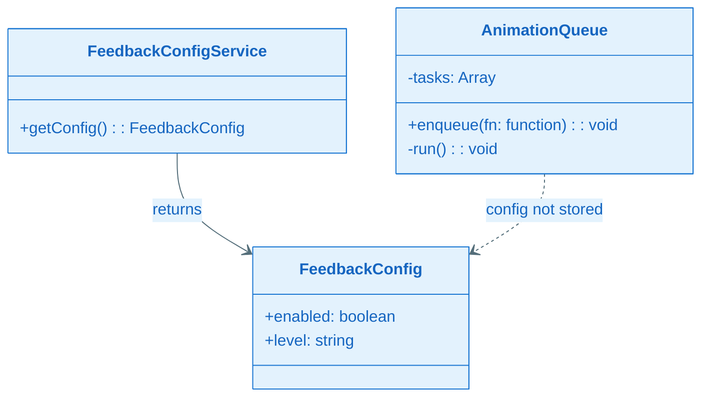
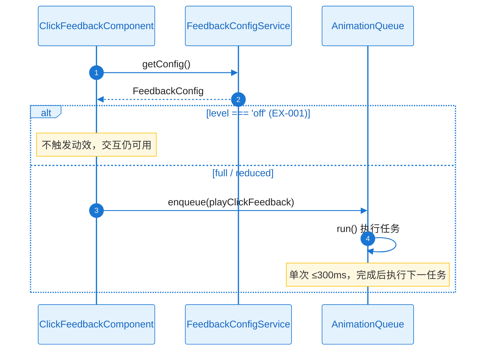
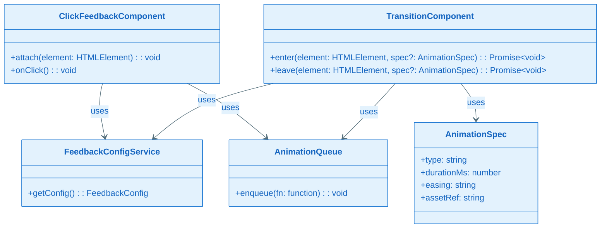
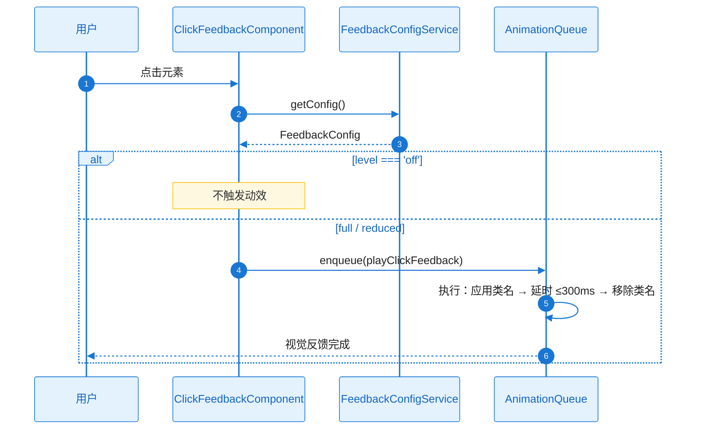
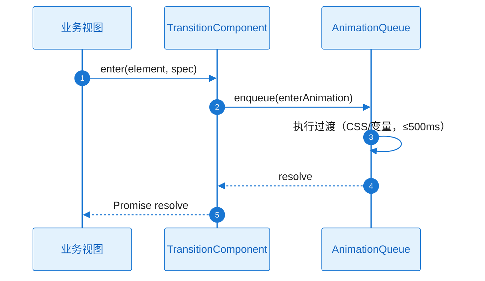

# L2 Story 详细设计（二层详细设计）

本文档与 **plan.md** 配套使用：当 Plan Level = Deep 时，各 Story 的 L2 详细设计在此文档中编写；plan.md 中通过「Story Detailed Design」章节引用本文档。

**Feature**：FEAT-002 - 动效与交互体验能力

---

## 文档约定

- 对每个 Story，必须同时覆盖：**需求描述**、**功能设计（类图/时序图/触发条件/系统响应）**。
- 类图、时序图须基于本工程实际架构与真实代码，遵循 `.cursor/rules/specify-diagram-requirements.mdc`。
- tasks.md 的每个 Task 应明确引用对应 Story 的详细设计入口（例如：`L2_story_detail_design.md:ST-001:功能设计:时序图`）。

---

### ST-001 Detailed Design：动效规范与资源（Infrastructure）

#### 1) 需求及描述

- **需求描述**：产出动效规范文档与 design-system.css 变量（时长、缓动、可爱风）；动效相关资源体积 ≤500KB，供各 Feature 引用统一规范。关联 FR-003；NFR-PERF-002。
- **需求依赖**：无。
- **使用范围**：ST-002、ST-003 及后续 Feature 的动效实现引用规范与变量；资源被懒加载或按需引用。
- **使用接口**：规范文档（可读）、design-system.css 中动效相关 CSS 变量（如 `--anim-duration-click`、`--anim-easing`）；无运行时 API。
- **DoD（验收标准）**：
  - [ ] 规范文档与 design-system.css 动效变量可被团队引用（FR-003）
  - [ ] 动效资源（CSS/JS/雪碧图等）总体积 ≤500KB（NFR-PERF-002）

#### 2) 功能设计

##### 功能设计关键说明

**核心实现思路**：
- 在 EPIC 或本 Feature 的 design 目录下产出动效规范文档，明确：点击反馈时长（如 ≤300ms）、过渡动效时长（如 ≤500ms）、缓动函数、可爱风原则；在 design-system.css 中定义变量（如 `--anim-duration-click`、`--anim-duration-transition`、`--anim-easing`），实现时引用变量而非魔数。
- 资源清单与体积预算：列出动效相关 CSS/图片/雪碧图，构建或打包后测量总体积 ≤500KB；非首屏动效可懒加载以控制首屏体积。

**关键产出与职责**：
- **规范文档**：定义时长、缓动、风格；无代码类，仅文档与约定。
- **design-system.css**：动效变量集中定义，与 design/ 视觉规范对齐。
- **占位/示例资源**：可选占位图或示例动画资源，用于验证体积与引用路径。

**失败处理与边界**：
- 无运行时异常；资源加载失败在 ST-003 组件侧 catch 降级。本 Story 仅保证规范与体积达标。

##### 类图（本 Story 无运行时类）

本 Story 为文档与资源产出，无 A3.2.1 中对应运行时类；类图省略。实现时 ST-002/ST-003 使用的 FeedbackConfigService、AnimationQueue、ClickFeedbackComponent、TransitionComponent 等与 plan A3.2.1 一致。

##### 触发条件与系统响应

| 触发条件 | 系统响应（正常流程） | 异常处理 |
|----------|----------------------|----------|
| 开发引用规范/变量 | 按文档与 CSS 变量实现动效 | N/A |
| 构建/打包 | 动效资源纳入体积统计 | 超标则裁剪或懒加载 |

##### 验证与测试设计

- **验收**：资源体积测量（≤500KB）；规范文档与 design-system.css 可读且被 ST-002/ST-003 引用。
- **引用入口**：`L2_story_detail_design.md:ST-001:功能设计`

---

### ST-002 Detailed Design：FeedbackConfigService 与 AnimationQueue（Design-Enabler）

#### 1) 需求及描述

- **需求描述**：实现 FeedbackConfigService（getConfig、降级 3 级：full/reduced/off）与 AnimationQueue（串行执行动效任务）；降级时静默不抛错。关联 FR-004；NFR-REL-001。
- **需求依赖**：ST-001（规范与变量可用）。
- **使用范围**：ClickFeedbackComponent、TransitionComponent 及业务视图通过 getConfig() 与 enqueue() 使用。
- **使用接口**：FeedbackConfigService.getConfig(): FeedbackConfig；AnimationQueue.enqueue(fn: function): void（内部 run 驱动执行）。
- **DoD（验收标准）**：
  - [ ] 配置可读、队列串行不堆叠、异常不阻塞（FR-004、NFR-REL-001）
  - [ ] 单元测试：队列串行与降级路径（level === 'off' 时不触发动效）

#### 2) 功能设计

##### 功能设计关键说明

**核心实现思路**：
- FeedbackConfigService 提供 getConfig() 返回 FeedbackConfig（enabled、level：'full'|'reduced'|'off'）；level 可由设备/性能检测或静态配置决定，低端设备可降级为 reduced 或 off（RISK-001）。
- AnimationQueue 维护 FIFO 任务队列；enqueue(task) 将任务入队，内部 run() 串行执行，当前任务完成（Promise resolve）后再执行下一任务；单次仅一个 task 运行，避免连续点击导致动效堆叠。task 内异常 catch 后静默，不阻塞队列。

**关键类与职责划分**：
- **FeedbackConfigService**：提供当前反馈配置；无状态或从环境/配置读取。
- **AnimationQueue**：enqueue、内部 run 循环；任务为返回 Promise 的函数。
- **FeedbackConfig**：数据对象，enabled、level。

**失败处理与边界**：
- getConfig() 不抛错；level === 'off' 时调用方不触发动效。队列 task 异常 catch 后静默，符合 NFR-REL-001。

##### 类图（与 plan A3.2.1 对应）

**关键类职责说明**：

| 类/接口 | 核心职责 | 关键方法说明 |
|---------|----------|--------------|
| FeedbackConfigService | 提供当前反馈配置 | getConfig()：返回 enabled、level（full/reduced/off） |
| AnimationQueue | 串行执行动效任务 | enqueue(fn)：入队；run()：内部 FIFO 执行，单任务完成后执行下一任务 |
| FeedbackConfig | 配置数据 | enabled、level |

##### 时序图（含正常+降级）

**getConfig 与 enqueue 串行执行**：

##### 触发条件与系统响应

| 触发条件 | 系统响应（正常流程） | 异常处理 |
|----------|----------------------|----------|
| getConfig() | 返回 FeedbackConfig | 不抛错；缺省可用 full 或 reduced |
| enqueue(fn) | 任务入队，run() 串行执行 | task 内异常 catch 静默，队列继续 |

##### 异常矩阵

| 异常ID | 触发条件 | 错误类型 | 可重试 | 对策 |
|--------|----------|----------|--------|------|
| EX-001 | FeedbackConfig.level === 'off' | 配置降级 | 否 | 不触发动效，交互仍可用 |

##### 验证与测试设计

- **单元测试**：getConfig 返回结构正确；队列多任务串行（先入先出）；task 抛错时队列不中断、后续任务仍执行；level off 时调用方不 enqueue 或 enqueue 无效果（由调用方保证）。
- **引用入口**：`L2_story_detail_design.md:ST-002:功能设计:时序图`

---

### ST-003 Detailed Design：ClickFeedbackComponent 与 TransitionComponent（Functional）

#### 1) 需求及描述

- **需求描述**：ClickFeedbackComponent（attach 到可点击元素、统一点击反馈）；TransitionComponent（enter/leave 面板切换过渡）；与 AnimationQueue、FeedbackConfigService 集成；单次点击反馈 ≤300ms、过渡 ≤500ms。关联 FR-001、FR-002；NFR-PERF-001、NFR-MEM-001。
- **需求依赖**：ST-002（FeedbackConfigService、AnimationQueue 可用）。
- **使用范围**：业务视图挂载点击反馈与过渡动效；其他 Feature 复用。
- **使用接口**：ClickFeedbackComponent.attach(element)、onClick()；TransitionComponent.enter(element, spec?)、leave(element, spec?)。
- **DoD（验收标准）**：
  - [ ] 业务方可挂载统一点击与过渡动效；单次 ≤300ms、过渡 ≤500ms（FR-001、FR-002，NFR-PERF-001）
  - [ ] 动效增量内存可控，无显著泄漏（NFR-MEM-001）

#### 2) 功能设计

##### 功能设计关键说明

**核心实现思路**：
- ClickFeedbackComponent：attach(element) 在 element 上绑定点击监听；点击时调用 FeedbackConfigService.getConfig()，若 level !== 'off' 则向 AnimationQueue.enqueue 传入播放点击反馈的函数（应用 CSS 类名/变量，时长从 design-system 或 AnimationSpec 取，≤300ms），反馈完成后移除类名。
- TransitionComponent：enter(element, spec?) / leave(element, spec?) 接收目标元素与可选 AnimationSpec；将进入/离开动画封装为 task 入队 AnimationQueue，使用 CSS transition/animation 或变量（≤500ms），Promise 在动效结束时 resolve。spec 缺省时使用默认时长与缓动。

**关键类与职责划分**：
- **ClickFeedbackComponent**：attach() 绑定点击；onClick 内 getConfig + enqueue(playClickFeedback)。
- **TransitionComponent**：enter/leave 接收 element 与可选 spec；enqueue 过渡任务，返回 Promise。
- **AnimationSpec**：type、durationMs、easing、assetRef（可选）；与 plan A3.2.1 一致。

**失败处理与边界**：
- 资源加载失败或执行异常在 play 入口 catch，降级为不应用动效，不向业务抛错（NFR-REL-001）。无效 element 不挂载或 no-op。

##### 类图（与 plan A3.2.1 对应）

**关键类职责说明**：

| 类/接口 | 核心职责 | 关键方法说明 |
|---------|----------|--------------|
| ClickFeedbackComponent | 统一点击反馈 | attach(element)：绑定点击；onClick：getConfig 后 enqueue 反馈任务（≤300ms） |
| TransitionComponent | 进入/离开过渡 | enter/leave(element, spec?)：enqueue 过渡任务，≤500ms，返回 Promise |
| AnimationSpec | 单次动效规格 | type、durationMs、easing、assetRef |

##### 时序图（含正常+降级）

**点击反馈**：

**面板切换过渡**：

##### 触发条件与系统响应

| 触发条件 | 系统响应（正常流程） | 异常处理 |
|----------|----------------------|----------|
| 用户点击已 attach 元素 | getConfig 后 enqueue 反馈，≤300ms 完成 | level off 不触效；执行异常 catch 静默 |
| enter(element, spec?) | 入队进入动效，≤500ms 后 resolve | 资源/执行失败：resolve 且不应用动效 |
| leave(element, spec?) | 入队离开动效，≤500ms 后 resolve | 同上 |

##### 并发/资源管理

- 队列串行，无并发写；多元素 attach 共享同一 AnimationQueue 实例或每页单例。资源（CSS/图片）复用，不 per-call 创建大对象；队列长度可设上限防内存增长（NFR-MEM-001）。

##### 验证与测试设计

- **接入测试**：挂载 ClickFeedback 与 Transition 到示例页；验证点击反馈与过渡时长；降级 level off 时无动效；快速连点不堆叠。
- **性能测量**：单次点击反馈 ≤300ms；过渡 ≤500ms（p95）。
- **引用入口**：`L2_story_detail_design.md:ST-003:功能设计:时序图`
