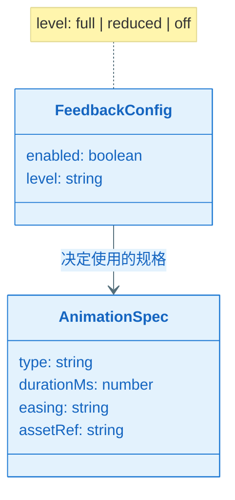
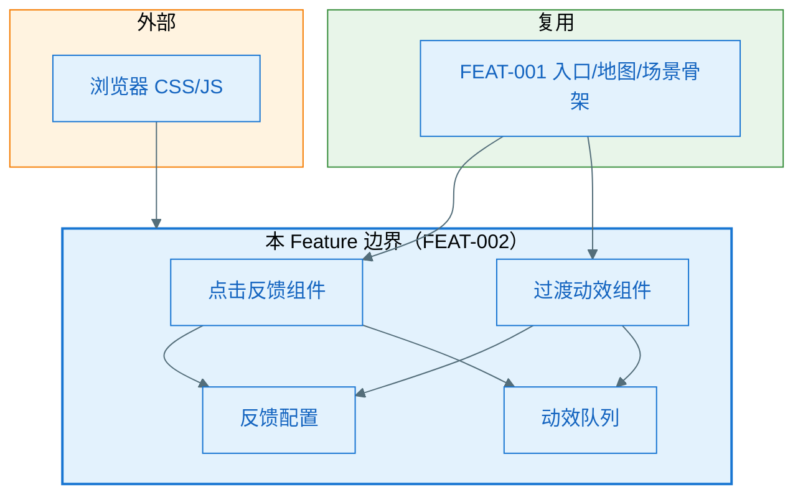
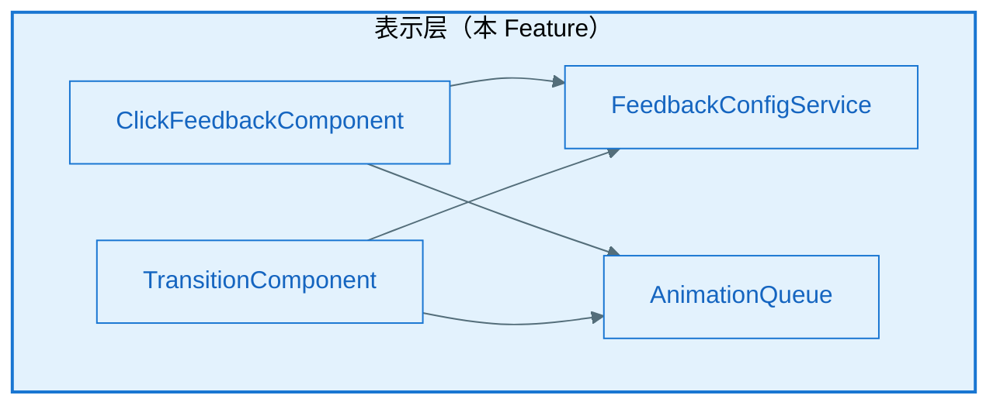
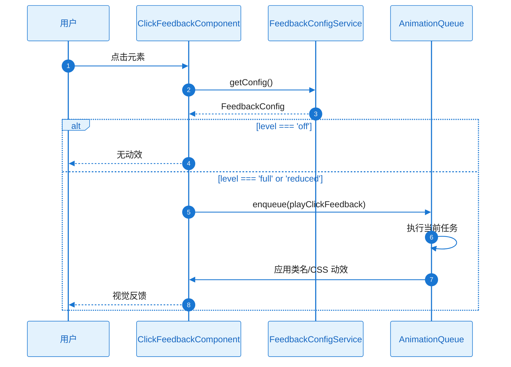
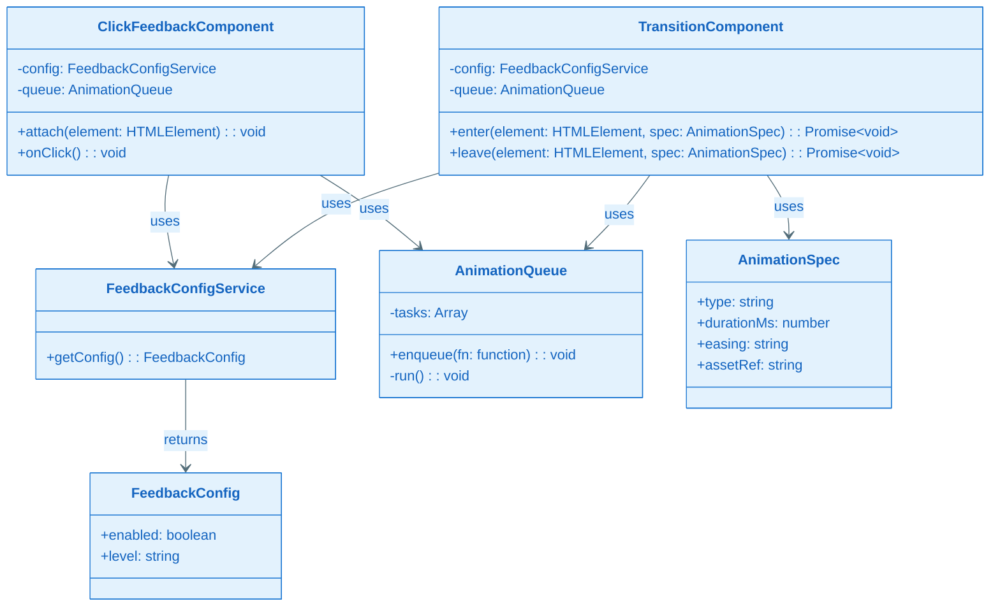
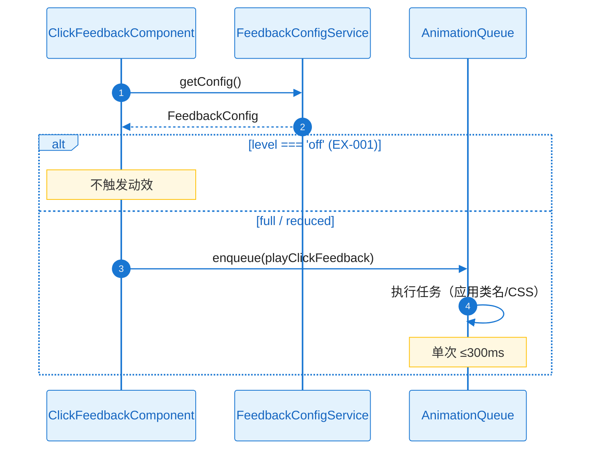
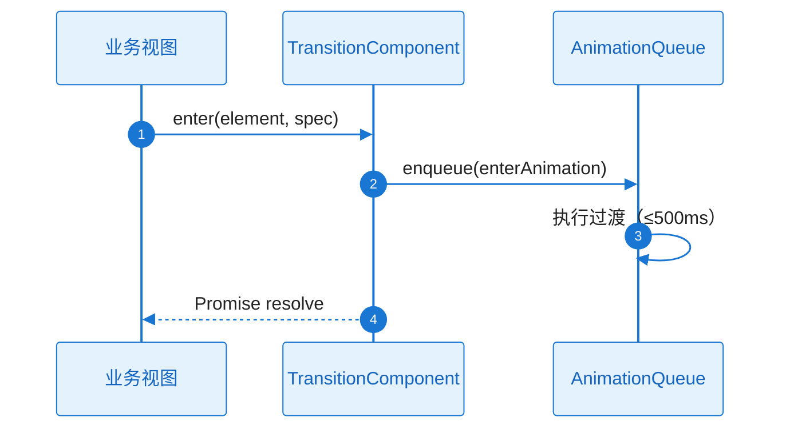
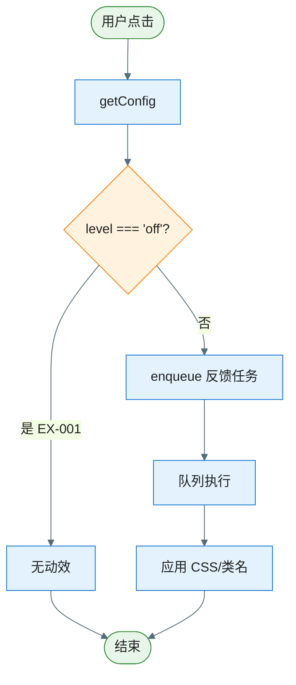
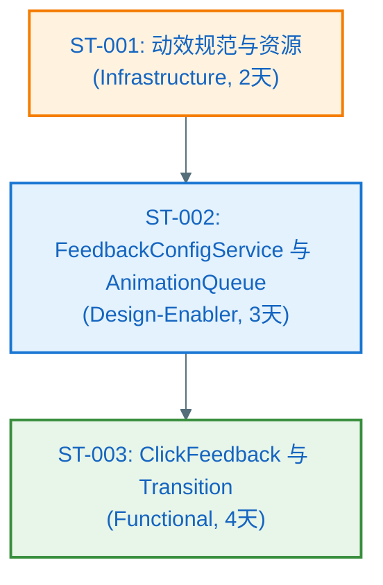

# Plan（工程级蓝图）：动效与交互体验能力

**Epic**：EPIC-003 - 星光小镇（Starlit Town）
**Feature ID**：FEAT-002
**Feature Version**：v0.1.0（来自 `spec.md`）
**Plan Version**：v0.1.0
**Plan Level**：Standard
**当前工作分支**：`epic/EPIC-003-starlit-town`
**Feature 目录**：`specs/epics/EPIC-003-starlit-town/features/FEAT-002-animations-interactions/`
**日期**：2025-02-05
**输入**：来自 `Feature 目录/spec.md`

> 规则：
> - Plan 阶段必须包含工程决策、风险评估与性能/资源验收指标。
> - **图表规范**：样式遵循 `.cursor/rules/mermaid-style-guide.mdc`；内容与结构须基于本工程实际架构与真实代码，遵循 `.cursor/rules/specify-diagram-requirements.mdc`。

## 变更记录（增量变更）

| 版本 | 日期 | 变更范围（Feature/Story/Task） | 变更摘要 | 影响模块 | 是否需要回滚设计 |
|---|---|---|---|---|---|
| v0.1.0 | 2025-02-05 | Feature | 初始版本 | — | 否 |
| v0.2.0 | 2025-02-05 | Standard 阶段 | A3.3、Story Breakdown、A4–A11 | Plan-A | 否 |

## Plan 前置检查（必须，在开始设计前完成）

### 前置检查清单

- [x] 已阅读 `epic.md` 的"跨 Feature 技术策略"章节
- [x] 已阅读 `epic-arch.md` 并在其 0 层/1 层架构与规范约束下做 A2、A3.1
- [x] 已确认本 Feature 在 Plan 执行顺序中的位置（顺序 2，依赖 FEAT-001）
- [x] 已检查前置 Feature 的 plan（FEAT-001 plan 已存在，可引用入口与场景骨架）
- [x] 本 Feature 需要设计的共享能力已在 EPIC 级登记为 Owner（动效组件库、交互规范）

### 依赖的共享能力（从其他 Feature 复用）

| 依赖的共享能力 | Owner Feature | Owner Plan 状态 | 如何获取/引用 |
|---|---|---|---|
| HTML 游戏入口、场景切换与页面骨架 | FEAT-001 | Plan Ready | 引用 FEAT-001 plan.md A3.2、Plan-B B4.1；在 FEAT-001 的 EntryView/MapView 及场景容器上挂载动效 |

### 本 Feature 提供的共享能力（供其他 Feature 复用）

| 共享能力名称 | 消费方 Feature | 设计位置（本 plan 章节） | 接口/契约位置 |
|---|---|---|---|
| 动效组件库（点击反馈、过渡动效） | FEAT-003, FEAT-004, FEAT-005 | A3.1, A3.2 | Plan-B:B4.1 |
| 动效规范与降级配置 | FEAT-003, FEAT-004, FEAT-005 | A0, A1, Plan-B | Plan-B:B3, B4.1 |

### 前置检查结论

- **检查日期**：2025-02-05
- **检查人**：SE/TL
- **结论**：通过
- **备注**：无

---

## 概述

本 Feature 提供星光小镇统一的动效与交互体验能力：可复用的点击/触摸反馈组件、场景或面板切换的过渡动效组件、动效规范（时长、缓动、可爱风）及降级配置（完整/简化/关闭）。核心工程决策：以 CSS 动画为主、JS 辅助控制，保证性能与 500KB 资源预算；通过 FeedbackConfig 与队列化执行避免连续点击时动效堆叠与卡顿；不持久化配置，降级级别可由运行时常量或未来配置注入。

## Plan-A：工程决策 & 风险评估（必须量化）

### A0. 领域概念（Domain Concepts / Glossary，必须）

#### A0.1 领域概念词汇表（必须）

| 概念（中文） | 名称（英文/代码名） | 定义（一句话） | 关键属性/状态（Top3） | 不变量/约束 | 关联概念 |
|---|---|---|---|---|---|
| 动效规格 | AnimationSpec | 单次动效的类型、时长、缓动与资源引用 | type, durationMs, easing, assetRef | durationMs ≤ 500；type 枚举 | FeedbackConfig |
| 反馈配置 | FeedbackConfig | 是否启用动效及降级级别 | enabled, level | level: full / reduced / off | AnimationSpec |

#### A0.2 概念关系图（推荐，可选）



### A1. 技术选型（候选方案对比 + 决策理由）

| 决策点 | 候选方案 | 优缺点 | 约束/风险 | 决策 | 决策理由 |
|---|---|---|---|---|---|
| 动效实现 | CSS 动画 / JS 动画 / 混合 | CSS 性能好、易降级；JS 控制细 | 复杂序列用 JS | CSS 为主、JS 辅助（类名/事件控制） | NFR 要求主线程不长时间阻塞；符合 300ms/500ms 时长 |
| 降级策略 | 运行时检测 / 配置注入 / 固定关闭 | 检测可自适应；配置可产品控制 | 检测有误判 | 配置注入 + 可选运行时检测 | spec 澄清：完整/简化/关闭 3 级；低端可降至 30fps |
| 连续点击 | 防抖 / 队列 | 防抖会丢失反馈；队列保证每次反馈 | 队列需限长 | 队列依次执行 | spec 澄清：队列，保证每次都有反馈、避免堆叠 |

### A2. Feature 全景架构（0 层框架图：边界 + 外部依赖）

#### A2.1 Feature 全景架构图（必须）

> 继承 epic-arch 的 0 层：本 Feature 覆盖「动效与交互」在 EPIC 内的边界；依赖 FEAT-001 的入口与场景骨架，无独立后端或存储。



#### A2.1.1 架构设计说明（必须：理由/决策/思考）

- **边界与职责**：本 Feature 仅负责动效资产、反馈与过渡组件及规范；不包含业务逻辑或各场景玩法。Out of Scope：美术资源制作（仅规范与占位）、业务侧状态。
- **分层与依赖方向**：动效组件属于表示层（epic-arch 1 层）；依赖 FEAT-001 提供的页面/场景容器挂载点；不依赖数据层或存储。
- **关键数据流**：FeedbackConfig 为只读配置（内存）；无持久化；动效资源（CSS/JS/雪碧图）随页面加载，总体积 ≤ 500KB。
- **外部依赖策略**：浏览器性能不足时通过降级级别简化或关闭动效；资源加载失败时占位或无动效降级，不阻塞主流程。
- **可演进性**：AnimationSpec 可扩展类型与参数；FeedbackConfig 未来可接配置服务或本地持久化（本版不做）。

#### A2.2 外部依赖清单（若有则必填，无依赖时标注 N/A）

| 依赖项 | 类型 | 提供方 | 提供的能力 | 通信方式 | 故障模式 | 我方策略 |
|--------|------|--------|-----------|----------|----------|----------|
| 浏览器 CSS/JS 能力 | 平台 | 浏览器 | 动画、过渡、DOM | 标准 API | 不支持或低性能 | 降级为简化/关闭；资源缺失时无动效降级 |

#### A2.3 通信与交互约束（必须）

- **协议**：层内函数调用、DOM 类名/属性；无网络与存储。
- **超时与重试**：单次动效有最大时长（300ms/500ms），超时自动结束；不重试。
- **错误处理**：资源缺失或执行异常时静默降级，不抛未处理异常到业务。
- **数据一致性**：不适用（无持久化）。

### A3. Feature 内部设计

#### A3.1 第一层：整体框架设计（必须）

##### A3.1.1 内部总体框架图（必须）

> 继承 epic-arch 的 1 层：本 Feature 仅占表示层中的「动效与反馈组件」；业务/游戏层与数据层由其他 Feature 负责。



##### A3.1.2 总体设计说明（必须）

###### A3.1.2.1 组件清单与职责（必须）

| 组件 | 所属模块 | 职责（一句话） | 输入/输出 | 依赖 | 约束 |
|------|----------|----------------|-----------|------|------|
| ClickFeedbackComponent | 表示层 | 对可点击元素提供统一点击/触摸反馈（如缩放、高亮） | 元素 + 事件 → 应用 CSS/类名或轻量 JS 动效 | FeedbackConfigService, AnimationQueue | 单次 ≤300ms；队列执行 |
| TransitionComponent | 表示层 | 提供场景或面板切换的过渡动效 | 进入/离开元素 → 应用过渡动画 | FeedbackConfigService, AnimationQueue | 单次 ≤500ms |
| FeedbackConfigService | 表示层 | 提供当前降级级别（full/reduced/off）与是否启用 | 无输入 → 返回 FeedbackConfig | 无 | 只读；可注入或常量 |
| AnimationQueue | 表示层 | 串行执行动效请求，避免连续点击导致堆叠 | 入队(动画任务) → 依次执行 | 无 | 主线程；单队列 |

###### A3.1.2.2 组件协作时序图（必须）



###### A3.1.2.3 关键设计决策（必须）

| 决策点 | 候选方案 | 决策 | 决策理由 | 影响范围 | 引用来源 |
|--------|----------|------|----------|----------|----------|
| 动效载体 | CSS / JS 驱动 | CSS 为主、JS 控制类名/时机 | 性能、主线程不长时间阻塞 | ClickFeedbackComponent, TransitionComponent | NFR-PERF-001 |
| 连续点击 | 防抖 / 队列 | 队列 | spec 澄清：保证每次都有反馈、避免堆叠 | AnimationQueue | spec 澄清 |
| 降级级别 | 2 级 / 3 级 | full / reduced / off | spec 澄清：3 级 | FeedbackConfigService | spec 澄清 |

###### A3.1.2.4 主要风险与权衡

- **权衡点**：动效丰富度 vs 资源与性能——资源 ≤500KB，时长 ≤300ms/500ms；低端可降至 30fps。
- **已知风险**：资源加载失败 → 占位或无动效降级（NFR-REL-001）。

---

#### A3.2 第二层：Feature 全景（必须）

##### A3.2.1 全景类图（必须）



###### 关键类职责说明

| 类/接口 | 层级 | 职责 | 关键方法 |
|---------|------|------|----------|
| ClickFeedbackComponent | 表示层 | 挂载到可点击元素并触发统一点击反馈 | attach(), onClick() |
| TransitionComponent | 表示层 | 执行进入/离开过渡动效 | enter(), leave() |
| FeedbackConfigService | 表示层 | 提供当前反馈配置 | getConfig() |
| AnimationQueue | 表示层 | 串行执行动效任务 | enqueue(), run() |
| AnimationSpec | 数据/配置 | 单次动效规格 | type, durationMs, easing |
| FeedbackConfig | 数据/配置 | 启用与降级级别 | enabled, level |

##### A3.2.2 Feature 时序图集（方法调用流程，必须）

| Seq ID | 流程名称 | 覆盖的异常（EX-xxx） |
|--------|----------|----------------------|
| SEQ-001 | 点击反馈 | EX-001（降级关闭） |
| SEQ-002 | 面板切换过渡 | EX-001 |

###### SEQ-001：点击反馈



###### SEQ-002：面板切换过渡



##### A3.2.3 Feature 流程图集（逻辑流程，必须）

###### 流程 1：点击反馈



| 分支 | 异常ID | 触发条件 | 对策 |
|------|--------|----------|------|
| 降级关闭 | EX-001 | FeedbackConfig.level === 'off' | 不触发动效，交互仍可用 |

##### A3.2.4 关键设计详解（若适用）

- 资源加载失败或执行异常：在资源加载处或 play 入口 catch，降级为不应用动效或占位，不向上抛错，符合 NFR-REL-001。不在 A3.2 单独开流程图。

---

#### A3.3 第三层：组件内部详细设计（Plan Level = Standard 时执行）

##### 组件：AnimationQueue

- **定位**：串行执行动效任务，避免连续点击导致动效堆叠与卡顿。
- **对外接口**：enqueue(task: () => Promise<void>): void；内部 FIFO 执行，单次仅一个 task 运行。
- **失败与降级**：task 内异常 catch 后静默，不阻塞队列后续任务。

###### 异常清单

| 异常ID | 触发条件 | 错误类型 | 可重试 | 对策 |
|--------|----------|----------|--------|------|
| EX-001 | FeedbackConfig.level === 'off' | 配置降级 | 否 | 不触发动效，交互仍可用 |

##### 组件：ClickFeedbackComponent / TransitionComponent

- **定位**：对外挂载点，attach(element) 或 enter/leave(element, spec?)；内部通过 AnimationQueue 与 CSS 类名/变量应用动效。
- **失败与降级**：资源加载失败或执行异常时 resolve 且不应用动效，不向业务抛错。

---

### A4. 技术风险与消解策略（绑定 Story/Task）

| 风险ID | 风险描述 | 触发条件 | 影响范围 | 严重度 | 消解策略 | 对应 Story/Task |
|--------|----------|----------|----------|--------|----------|-----------------|
| RISK-001 | 低端设备帧率不足 | 低端/高负载 | 卡顿 | Med | FeedbackConfig 降级（reduced/off）；单次 ≤300ms | ST-002, ST-003 |
| RISK-002 | 动效资源体积超标 | 资源合入 | 首屏变慢 | Low | 资源 ≤500KB 预算；懒加载非首屏动效 | ST-001 |

### A5. 边界 & 异常场景枚举

- **数据边界**：AnimationSpec 缺省时使用默认（≤500ms）；无效 element 不挂载。
- **状态边界**：队列空时无操作；降级为 off 时 attach 仍可调用但不触发动效。
- **用户行为**：连续快速点击 → 队列依次执行，避免堆叠。

#### A5.1 场景 → 应对措施对照表（必须）

| 场景ID | 场景类别 | 触发条件 | 影响 | 预期行为 | 技术对策 | 设计对策 | 映射 |
|--------|----------|----------|------|----------|----------|----------|------|
| SC-001 | 性能 | 低端设备 | 卡顿 | 降级或关闭动效 | FeedbackConfig reduced/off | N/A | RISK-001 |
| SC-002 | 资源 | 资源加载失败 | 无动效 | 占位或不应用，不阻塞 | catch 静默降级 | N/A | NFR-REL-001 |
| SC-003 | 用户行为 | 快速连点 | 堆叠卡顿 | 队列串行 | AnimationQueue | N/A | FR-001/002 |

### A6. 算法评估（如适用）

不适用。

### A7. 功耗评估

不适用（Web 环境，NFR-POWER-001）。

### A8. 性能评估（必须量化）

#### A8.1 测试设备基线

PC/平板浏览器；目标 60fps，低端可 30fps。

#### A8.2 性能场景与指标

| 场景 | 指标 | 验收标准 (p95) |
|------|------|----------------|
| 点击反馈 | 单次动效时长 | ≤ 300ms |
| 场景/面板切换 | 过渡动效时长 | ≤ 500ms |
| 动效期间 | 主线程阻塞 | 不长时间阻塞；60fps 目标 |
| 动效资源 | CSS/JS/雪碧图总体积 | ≤ 500KB |

#### A8.3 降级策略

| 触发条件 | 降级策略 |
|----------|----------|
| 低端设备/低帧率 | FeedbackConfig reduced 或 off；缩短时长或关闭 |
| 资源加载失败 | 不应用动效，不阻塞主流程 |

### A9. 内存评估

| 场景 | 验收标准 | 主要来源 | 优化方向 |
|------|----------|----------|----------|
| 动效组件与资源 | 增量可控，无显著增长 | CSS/类名/队列任务 | 队列长度上限；资源复用 |

### A10. 安全评估（如适用）

无额外数据收集；动效不涉及用户输入（NFR-SEC-001）。N/A。

### A11. 兼容性评估（必须）

- **浏览器**：支持 CSS transition/animation 与 DOM API；不支持时降级为无动效。
- **设备**：低端设备通过 FeedbackConfig 降级，保证可玩。

**兼容性结论**：主流现代浏览器兼容；低端降级路径明确。

---

## Plan-B：技术规约 & 实现约束

### B0. Plan-A ↔ Plan-B 一致性与互校（必须）

| Plan-A（决策/假设/约束） | Plan-B（落点） | 自检规则（必须通过） |
|---|---|---|
| A0 领域概念命名 | B3/B4 | AnimationSpec、FeedbackConfig 与 B3 一致 |
| A1 技术选型 | B1/B2 | CSS 为主、队列、降级 3 级在 B2 体现 |
| A2 外部依赖与故障策略 | B4.2 | 降级与资源缺失策略一致 |
| A3 无持久化 | B3 | 无存储形态；Config 为只读内存 |

### B1. 技术背景（用于统一工程上下文）

**Language/Version**：JavaScript（ES6+），HTML5，CSS3  
**Primary Dependencies**：无强制框架；动效以 CSS 为主、可选轻量 JS 辅助  
**Storage**：N/A（本 Feature 不持久化）  
**Test Framework**：可选 Jest / 手写；需可测 FeedbackConfig 注入与队列行为  
**Target Platform**：PC 与平板浏览器（Chrome、Safari、Edge 等）  
**Project Type**：web（EPIC 内表示层能力）  
**Performance Targets**：单次反馈 ≤300ms，过渡 ≤500ms；60fps 目标，低端可 30fps；动效资源 ≤500KB  
**Constraints**：主线程不长时间阻塞；资源缺失时降级不阻塞  

### B2. 架构细化（实现必须遵循）

- **分层约束**：本 Feature 仅表示层；不依赖业务层或数据层；依赖 FEAT-001 提供的 DOM 挂载点。
- **线程/并发模型**：主线程；AnimationQueue 串行，避免动效堆叠。
- **错误处理规范**：资源或执行异常静默降级，不向业务抛未处理异常。
- **日志与可观测性**：可选：降级触发时记录日志（NFR-OBS-001）。

### B3. 数据模型（引用或内联）

#### B3.1 存储形态与边界（必须）

- **存储形态**：N/A。FeedbackConfig、AnimationSpec 均为内存只读或注入；无持久化。

#### B3.2 物理数据结构（若使用持久化存储则必填）

- 不适用。AnimationSpec、FeedbackConfig 为运行时对象/接口，可由常量或未来配置模块提供。

### B4. 接口规范/协议（引用或内联）

#### B4.1 本 Feature 对外提供的接口（必须：Capability Feature/跨模块复用场景）

- **ClickFeedbackComponent（或等价工厂/方法）**  
  - **用途**：供 FEAT-003/004/005 在可点击元素上挂载统一点击反馈。  
  - **接口**：`attach(element: HTMLElement): void`；内部在 element 上绑定点击并经由 AnimationQueue 触发动效。  
  - **错误语义**：降级时无动效；不抛错。

- **TransitionComponent（或等价工厂/方法）**  
  - **用途**：供各 Feature 做场景或面板切换时的过渡。  
  - **接口**：`enter(element: HTMLElement, spec?: AnimationSpec): Promise<void>`；`leave(element: HTMLElement, spec?: AnimationSpec): Promise<void>`。可选 spec 缺省时使用默认过渡规格（≤500ms）。  
  - **错误语义**：资源缺失或异常时 resolve 且不应用动效，不 reject。

- **FeedbackConfigService**  
  - **用途**：供业务或本 Feature 内部读取当前降级级别。  
  - **接口**：`getConfig(): FeedbackConfig`（enabled: boolean, level: 'full' | 'reduced' | 'off'）。

- **动效规范文档**  
  - **用途**：各 Feature 实现一致风格（时长、缓动、可爱风）。  
  - **交付**：规范文档或 design-system.css 中的变量（见 ux-design 与 design/css/design-system.css）。

#### B4.2 本 Feature 依赖的外部接口/契约（必须：存在外部依赖时）

- **FEAT-001**：入口与地图/场景 DOM 骨架，供挂载动效的容器存在；无形式化契约，依赖 FEAT-001 的 plan 与实现约定。
- **浏览器**：CSS 动画、transition、DOM API；不支持时降级。

### B5. 合规性检查（关卡）

- 无额外数据收集；动效不涉及用户输入内容（NFR-SEC-001）。进入 Implement 前确认：资源体积 ≤500KB；降级路径可验收。

### B6. 项目结构（本 Feature）

```text
specs/epics/EPIC-003-starlit-town/features/FEAT-002-animations-interactions/
├── spec.md
├── plan.md
├── tasks.md                    # 待 /speckit.tasks 生成
└── checklists/
```

### B7. 源代码结构（代码库根目录）

本 Feature 为 EPIC 内表示层能力，建议与 FEAT-001 同属同一 Web 游戏目录（如 `starlit-town/`），子目录或模块名体现动效与交互，例如：

```text
starlit-town/
├── js/
│   ├── animations/
│   │   ├── ClickFeedbackComponent.js
│   │   ├── TransitionComponent.js
│   │   ├── FeedbackConfigService.js
│   │   └── AnimationQueue.js
│   └── ...
└── css/
    └── design-system.css       # 与 design/ 对齐，含动效变量
```

**结构决策**：动效组件与队列、配置服务集中置于 animations 模块；与 design-system.css 配合实现规范（FR-003）。

---

## Story Breakdown（Plan Level = Standard 时执行）

### Story 列表

#### ST-001：动效规范与资源（Infrastructure）

- **类型**：Infrastructure
- **描述**：动效规范文档与 design-system.css 变量（时长、缓动、可爱风）；动效相关资源体积 ≤500KB。
- **目标**：各 Feature 可引用统一规范；资源预算达标。
- **预估工作量**：2 人天
- **覆盖 FR/NFR**：FR-003；NFR-PERF-002
- **依赖**：无
- **可并行**：否
- **关键风险**：否
- **验收/验证方式**：资源体积测量；规范文档可读。
- **交付物**：规范文档、design-system.css 动效变量、占位/示例资源。

#### ST-002：FeedbackConfigService 与 AnimationQueue（Design-Enabler）

- **类型**：Design-Enabler
- **描述**：FeedbackConfigService（getConfig、降级 3 级）；AnimationQueue 串行执行；降级时静默不抛错。
- **目标**：配置可读、队列不堆叠、异常不阻塞。
- **预估工作量**：3 人天
- **覆盖 FR/NFR**：FR-004；NFR-REL-001
- **依赖**：ST-001
- **可并行**：否
- **关键风险**：是（RISK-001）
- **验收/验证方式**：单元测试队列串行与降级路径。
- **交付物**：FeedbackConfigService、AnimationQueue。

#### ST-003：ClickFeedbackComponent 与 TransitionComponent（Functional）

- **类型**：Functional
- **描述**：ClickFeedbackComponent（attach）；TransitionComponent（enter/leave）；与 AnimationQueue 集成；单次 ≤300ms、过渡 ≤500ms。
- **目标**：业务方可挂载统一点击与过渡动效；性能达标。
- **预估工作量**：4 人天
- **覆盖 FR/NFR**：FR-001、FR-002；NFR-PERF-001、NFR-MEM-001
- **依赖**：ST-002
- **可并行**：否
- **关键风险**：否
- **验收/验证方式**：接入测试；性能测量。
- **交付物**：ClickFeedbackComponent、TransitionComponent、B4.1 接口实现。

### Story 依赖关系图



### Feature → Story 覆盖矩阵

| FR/NFR ID | 覆盖的 Story ID | 备注 |
|-----------|-----------------|------|
| FR-001 | ST-003 | 点击反馈 |
| FR-002 | ST-003 | 过渡动效 |
| FR-003 | ST-001 | 规范与资源 |
| FR-004 | ST-002 | 降级配置 |
| NFR-PERF-001 | ST-003 | 时长与帧率 |
| NFR-PERF-002 | ST-001 | 资源体积 |
| NFR-MEM-001 | ST-003 | 增量可控 |
| NFR-REL-001 | ST-002, ST-003 | 降级不阻塞 |

### Story 工作量汇总

| Story ID | 类型 | 预估工作量（人天） | 依赖关系 | 是否并行 |
|----------|------|-------------------|----------|----------|
| ST-001 | Infrastructure | 2 | 无 | — |
| ST-002 | Design-Enabler | 3 | ST-001 | 否 |
| ST-003 | Functional | 4 | ST-002 | 否 |
| **总计** | — | **9 人天** | — | — |
