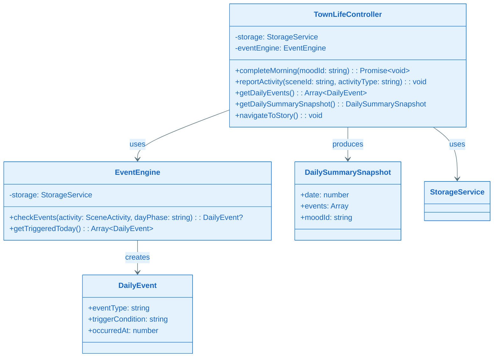
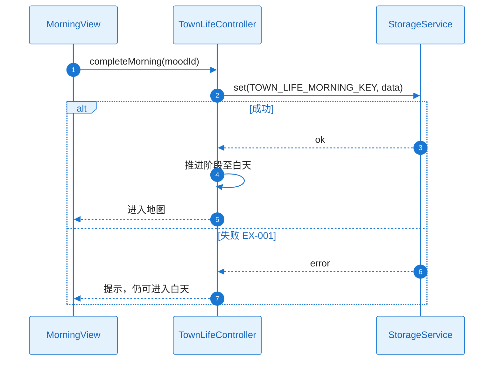
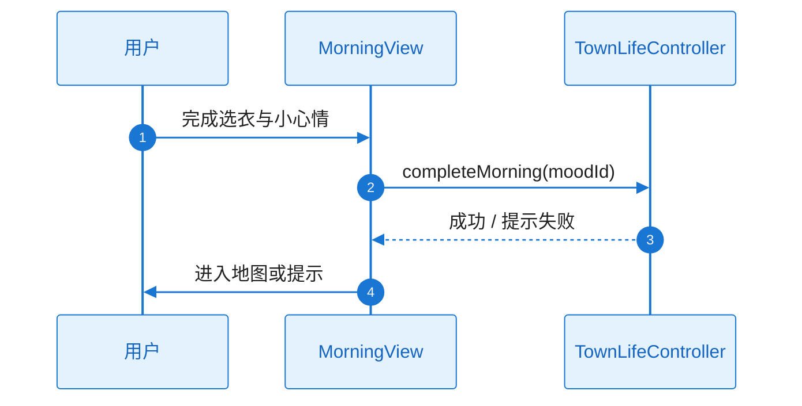
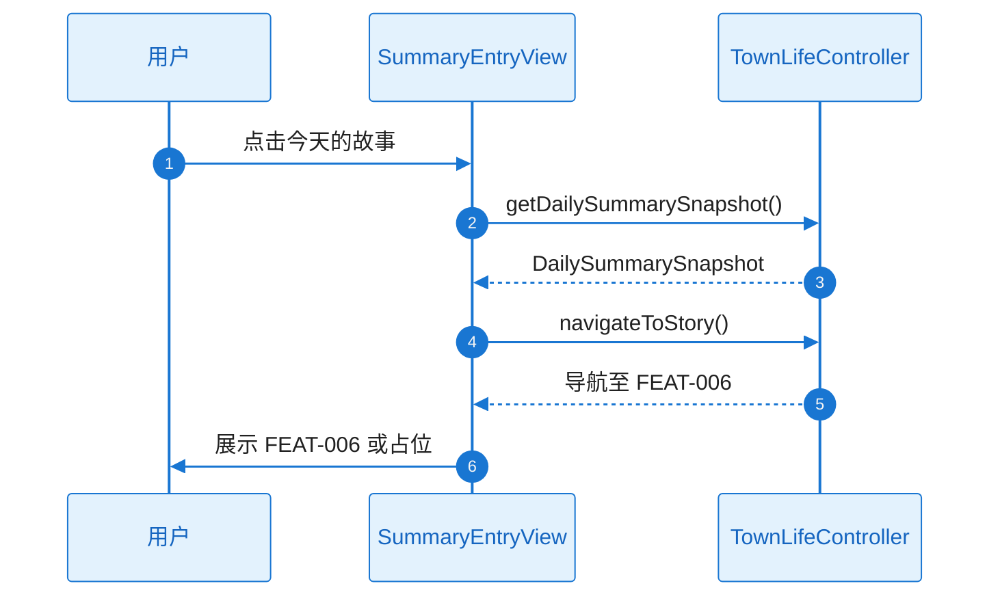

# L2 Story 详细设计（二层详细设计）

本文档与 **plan.md** 配套使用：当 Plan Level = Deep 时，各 Story 的 L2 详细设计在此文档中编写；plan.md 中通过「Story Detailed Design」章节引用本文档。

**Feature**：FEAT-003 - 小镇生活

---

## 文档约定

- 对每个 Story，必须同时覆盖：**需求描述**、**功能设计（类图/时序图/触发条件/系统响应）**。
- 类图、时序图须基于本工程实际架构与真实代码，遵循 `.cursor/rules/specify-diagram-requirements.mdc`。
- tasks.md 的每个 Task 应明确引用对应 Story 的详细设计入口（例如：`L2_story_detail_design.md:ST-001:功能设计:时序图`）。

---

### ST-001 Detailed Design：存储键与每日快照结构（Infrastructure）

#### 1) 需求及描述

- **需求描述**：本 Feature 存储键命名空间与 DailyEvent、DailySummarySnapshot 结构（B3）；与 FEAT-001 无冲突，与 FEAT-006 契约对齐。关联 FR-004、FR-005；NFR-REL-001。
- **需求依赖**：FEAT-001 StorageService。
- **使用范围**：TownLifeController、EventEngine 读写；getDailySummarySnapshot() 产出供 FEAT-006。
- **使用接口**：通过 StorageService.get/set 使用约定键（如 `starlit.townLife.dailyEvents`、`starlit.townLife.morning` 等）；DailySummarySnapshot 结构见 B3。
- **DoD（验收标准）**：
  - [ ] 键/结构可读写；快照生成逻辑可产出 FEAT-006 所需输入（FR-004、FR-005、NFR-REL-001）
  - [ ] 存储读写与快照结构单元测试通过

#### 2) 功能设计

##### 功能设计关键说明

**核心实现思路**：在 B3 中定义键名与 DailyEvent、DailySummarySnapshot 的字段；实现时使用 FEAT-001 的 StorageService，按键读写；快照由当日 events + date + moodId 等组装，结构与 FEAT-006 输入契约一致。**关键类与职责**：无新增运行时类；数据结构 DailyEvent、DailySummarySnapshot 与 plan A3.2.1 一致。**失败处理**：存储失败时由调用方（ST-002）提示，当次会话有效。

##### 触发条件与系统响应

| 触发条件 | 系统响应（正常流程） | 异常处理 |
|----------|----------------------|----------|
| 读写当日事件/早上数据 | get/set 按 B3 键与结构 | 存储不可用：调用方提示，当次会话有效 |
| 生成快照 | 组装 DailySummarySnapshot 返回 | 无数据时返回空或默认结构 |

##### 验证与测试设计

- 单元测试：按键 set 后 get 一致；快照结构字段与 FEAT-006 契约一致。
- **引用入口**：`L2_story_detail_design.md:ST-001:功能设计`

---

### ST-002 Detailed Design：EventEngine 与 TownLifeController（Design-Enabler）

#### 1) 需求及描述

- **需求描述**：EventEngine 小事件规则（每日 2–3 个）；TownLifeController 协调早上/场景活动/总结入口；与存储集成。关联 FR-001、FR-004、FR-005；NFR-OBS-001。
- **需求依赖**：ST-001。
- **使用范围**：MorningView、SceneViews、SummaryEntryView 及 FEAT-006 通过 getDailySummarySnapshot/navigateToStory 使用。
- **使用接口**：TownLifeController.completeMorning(moodId)、reportActivity(sceneId, activityType)、getDailyEvents()、getDailySummarySnapshot()、navigateToStory()；EventEngine.checkEvents(activity, dayPhase)、getTriggeredToday()。
- **DoD（验收标准）**：
  - [ ] 小事件可触发（每日 2–3 个）；早上流程与晚上总结入口可调用；FEAT-004/006 占位契约可用（RISK-001）

#### 2) 功能设计

##### 功能设计关键说明

**核心实现思路**：EventEngine 根据 SceneActivity 与 dayPhase 判断是否满足触发条件，今日已触发数 < 3 时按规则+随机产出 DailyEvent，并写入存储。TownLifeController 调用 StorageService 读写早上数据与事件列表；completeMorning 写入后推进阶段；reportActivity 调用 EventEngine.checkEvents，若有事件则追加存储并可供 UI 展示；getDailySummarySnapshot 组装当日 events、date、moodId 供 FEAT-006；navigateToStory 为导航入口（可传快照或由 FEAT-006 拉取）。**关键类与职责**：TownLifeController、EventEngine、SceneActivity、DailyEvent、DailySummarySnapshot 与 plan A3.2.1 一致。**失败处理**：存储失败提示，当次会话有效；不向 UI 抛未处理异常。

##### 类图（与 plan A3.2.1 对应）

##### 时序图（早上完成并进入白天，含 EX-001）

##### 触发条件与系统响应

| 触发条件 | 系统响应（正常流程） | 异常处理 |
|----------|----------------------|----------|
| completeMorning(moodId) | 写入存储并推进阶段，进入地图 | EX-001：提示，仍可进入白天 |
| reportActivity(sceneId, activityType) | EventEngine.checkEvents，若触发则追加事件并可供 UI 展示 | 存储失败时当次会话有效 |
| getDailySummarySnapshot() | 返回当日快照（date, events, moodId） | 无数据时返回空或默认 |
| navigateToStory() | 导航至 FEAT-006，可传快照或由 FEAT-006 拉取 | 占位时走契约约定 |

##### 验证与测试设计

- 规则与快照逻辑单元测试；FEAT-004/006 占位契约集成验证。
- **引用入口**：`L2_story_detail_design.md:ST-002:功能设计:时序图`

---

### ST-003 Detailed Design：MorningView 与场景视图（Functional）

#### 1) 需求及描述

- **需求描述**：MorningView（选衣+小心情，调用 FEAT-004 或占位）；SceneViews（家/学校/公园/商店/森林）与活动入口；与 FEAT-001 阶段推进协同。关联 FR-001、FR-002、FR-003；NFR-PERF-001。
- **需求依赖**：ST-002。
- **使用范围**：用户早上流程与各场景入口。
- **使用接口**：MorningView 调用 TownLifeController.completeMorning(moodId)；SceneViews 调用 reportActivity 与 FEAT-001 场景/阶段协同。
- **DoD（验收标准）**：
  - [ ] 用户可完成早上选衣与小心情并进入白天；可进入各场景并看到对应内容与活动（FR-001～FR-003）；响应达标（NFR-PERF-001）

#### 2) 功能设计

##### 功能设计关键说明

**核心实现思路**：MorningView 渲染选衣与小心情 UI，可选调用 FEAT-004 换装或占位；用户确认后调用 completeMorning(moodId)，成功后进入地图。SceneViews 按 FEAT-001 的 currentSceneId 渲染家/学校/公园/商店/森林内容，提供活动入口并调用 reportActivity(sceneId, activityType)；与 GameStateManager 协同阶段推进。**关键类与职责**：MorningView、SceneViews 为表示层，依赖 TownLifeController、FEAT-001 GameStateManager。**失败处理**：存储失败已在 Controller 层提示；UI 不重复弹窗。

##### 时序图（早上完成）

##### 触发条件与系统响应

| 触发条件 | 系统响应（正常流程） | 异常处理 |
|----------|----------------------|----------|
| 用户完成早上并确认 | completeMorning → 进入地图 | 存储失败：提示，仍可进入白天 |
| 用户进入场景并触发活动 | reportActivity → 可能触发小事件 | 无事件不阻塞 |

##### 验证与测试设计

- E2E/手动：早上流程与场景进入；性能响应测量。
- **引用入口**：`L2_story_detail_design.md:ST-003:功能设计:时序图`

---

### ST-004 Detailed Design：SummaryEntryView 与小事件展示（Functional）

#### 1) 需求及描述

- **需求描述**：晚上「今天的故事」入口（导航至 FEAT-006）；白天 2–3 小事件展示（弹窗/浮层）；与 TownLifeController、EventEngine 集成。关联 FR-004、FR-005；NFR-PERF-001。
- **需求依赖**：ST-002。
- **使用范围**：晚上总结入口；白天小事件展示。
- **使用接口**：SummaryEntryView 调用 getDailySummarySnapshot()、navigateToStory()；小事件 UI 从 getDailyEvents() 或 EventEngine.getTriggeredToday() 获取并展示。
- **DoD（验收标准）**：
  - [ ] 用户可触发并看到小事件；晚上可进入总结入口（FR-004、FR-005）；响应达标（NFR-PERF-001）

#### 2) 功能设计

##### 功能设计关键说明

**核心实现思路**：小事件在 reportActivity 触发后由 TownLifeController/EventEngine 写入存储；SummaryEntryView 或场景内浮层通过 getDailyEvents()/getTriggeredToday() 取列表并展示（弹窗/浮层）。晚上入口调用 getDailySummarySnapshot() 取得快照后 navigateToStory() 跳转 FEAT-006（传快照或由 FEAT-006 拉取）。**关键类与职责**：SummaryEntryView 为表示层；小事件展示组件消费 TownLifeController/EventEngine 数据。**失败处理**：存储不可用时当日事件可仅内存；导航占位时按 B4.2 契约。

##### 时序图（晚上进入总结）

##### 触发条件与系统响应

| 触发条件 | 系统响应（正常流程） | 异常处理 |
|----------|----------------------|----------|
| 白天触发小事件 | 事件写入后 UI 取列表展示 | 存储失败：当次会话有效 |
| 晚上点击总结入口 | getDailySummarySnapshot → navigateToStory | 无快照时传空或默认；FEAT-006 占位按契约 |

##### 验证与测试设计

- 小事件触发与展示；总结入口导航；性能响应。
- **引用入口**：`L2_story_detail_design.md:ST-004:功能设计:时序图`
