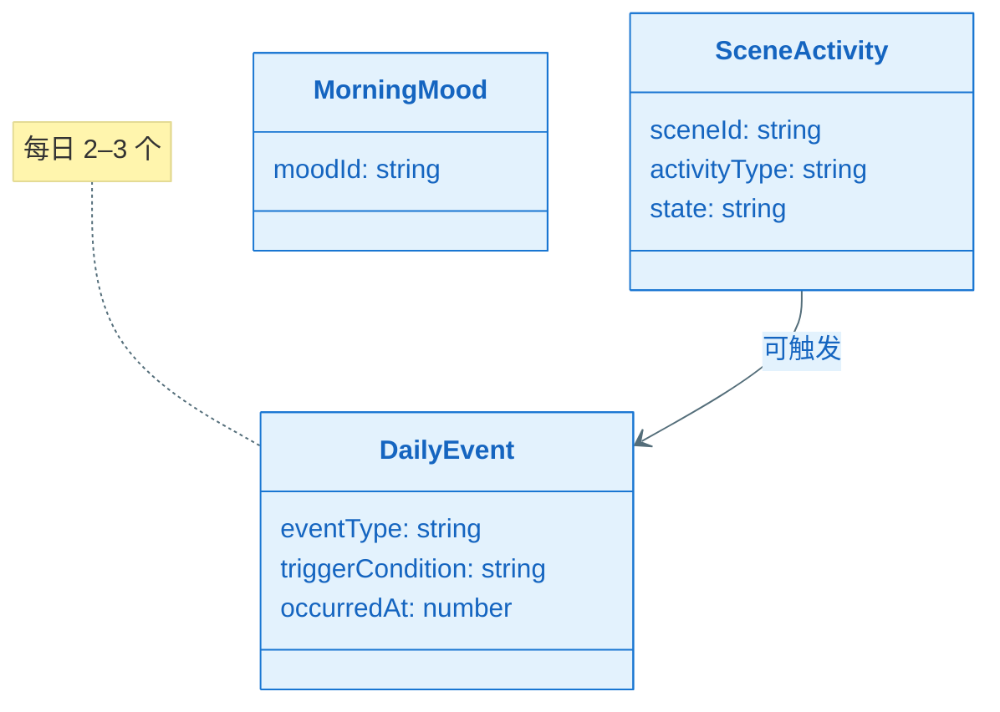
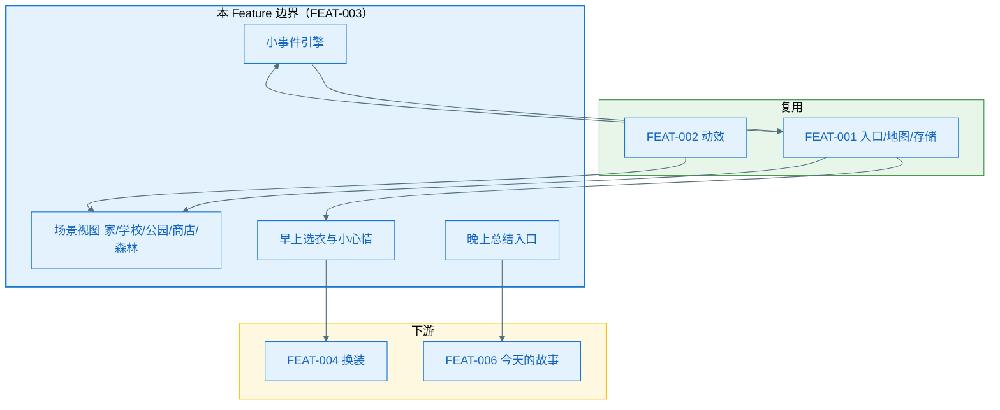
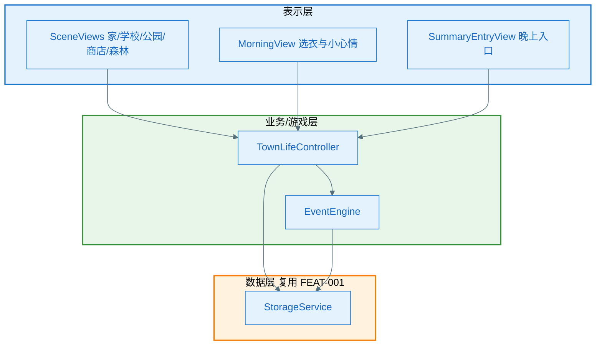
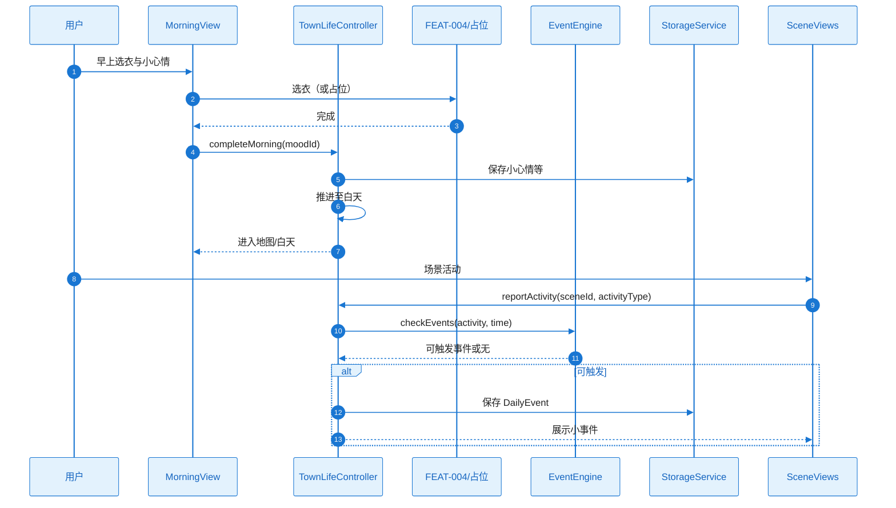
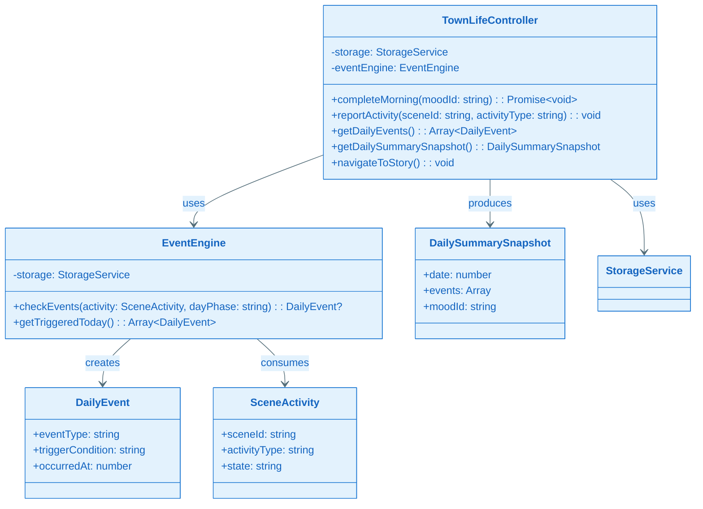
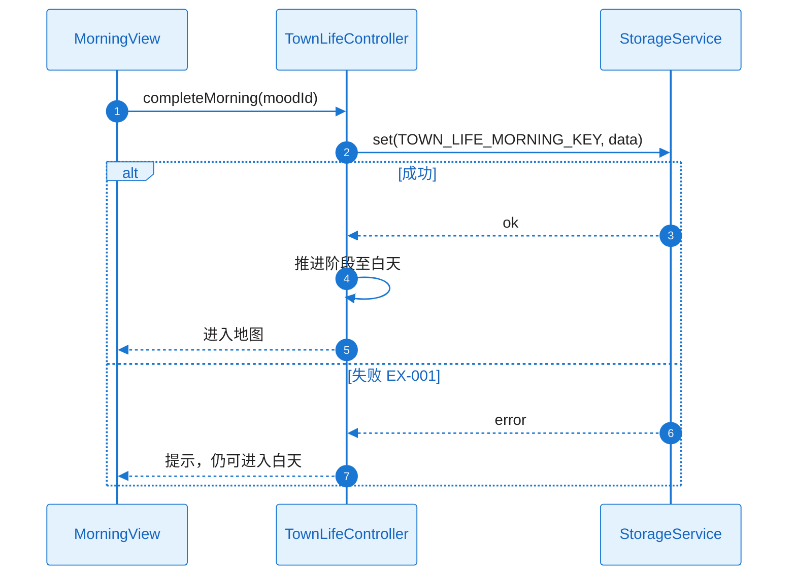
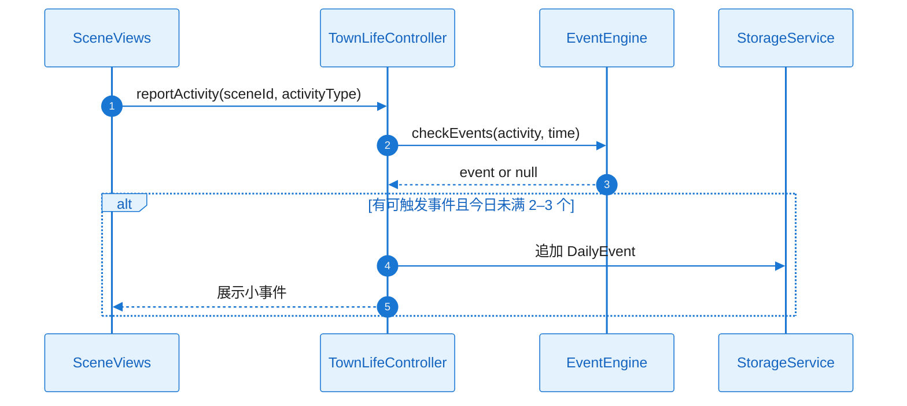
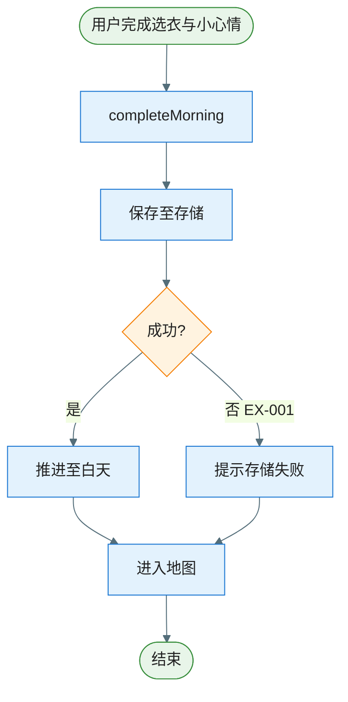
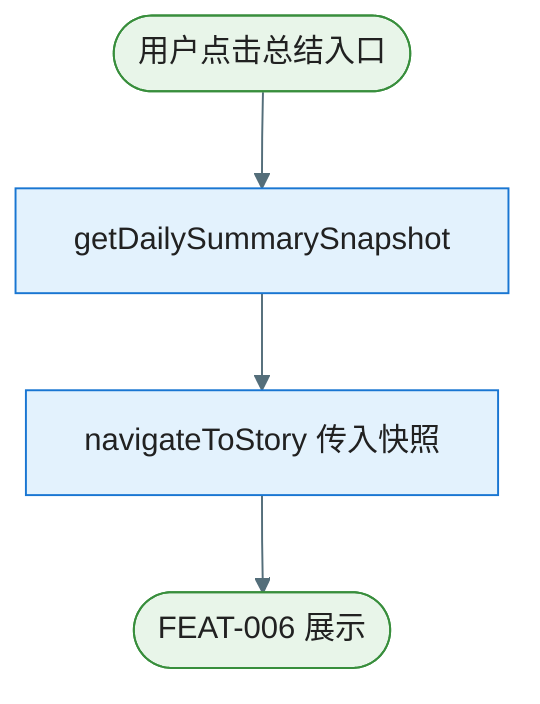
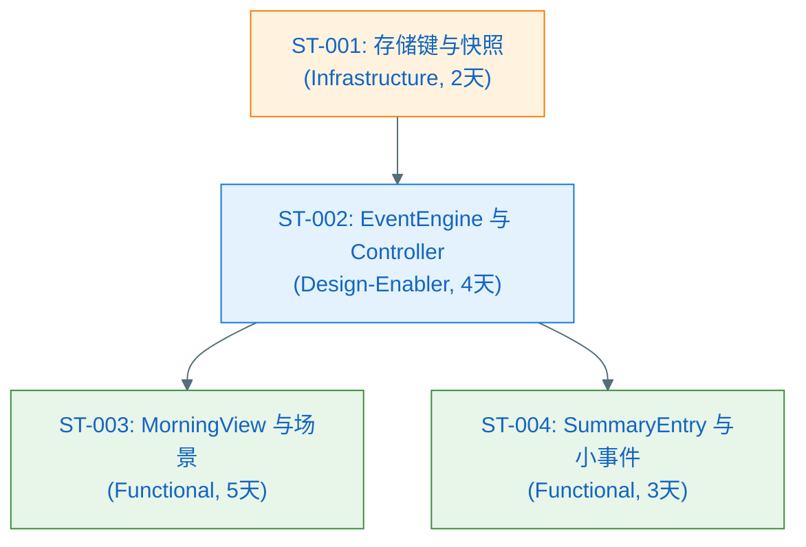

# Plan（工程级蓝图）：小镇生活系统

**Epic**：EPIC-003 - 星光小镇（Starlit Town）
**Feature ID**：FEAT-003
**Feature Version**：v0.1.0（来自 `spec.md`）
**Plan Version**：v0.1.0
**Plan Level**：Standard
**当前工作分支**：`epic/EPIC-003-starlit-town`
**Feature 目录**：`specs/epics/EPIC-003-starlit-town/features/FEAT-003-town-life/`
**日期**：2025-02-05
**输入**：来自 `Feature 目录/spec.md`

> 规则：
> - Plan 阶段必须包含工程决策、风险评估与性能/资源验收指标。
> - **图表规范**：样式遵循 `.cursor/rules/mermaid-style-guide.mdc`；内容与结构须基于本工程实际架构与真实代码，遵循 `.cursor/rules/specify-diagram-requirements.mdc`。

## 变更记录（增量变更）

| 版本 | 日期 | 变更范围（Feature/Story/Task） | 变更摘要 | 影响模块 | 是否需要回滚设计 |
|---|---|---|---|---|---|
| v0.1.0 | 2025-02-05 | Feature | 初始版本 | — | 否 |
| v0.2.0 | 2025-02-05 | Standard 阶段 | A3.3、Story Breakdown、A4–A11 | Plan-A | 否 |

## Plan 前置检查（必须，在开始设计前完成）

### 前置检查清单

- [x] 已阅读 `epic.md` 的"跨 Feature 技术策略"章节
- [x] 已阅读 `epic-arch.md` 并在其 0 层/1 层架构与规范约束下做 A2、A3.1
- [x] 已确认本 Feature 在 Plan 执行顺序中的位置（顺序 3，依赖 FEAT-001、FEAT-002）
- [x] 已检查前置 Feature 的 plan（FEAT-001、FEAT-002 plan 已存在）
- [x] 本 Feature 不担任共享能力 Owner，消费 FEAT-001 存储与入口、FEAT-002 动效

### 依赖的共享能力（从其他 Feature 复用）

| 依赖的共享能力 | Owner Feature | Owner Plan 状态 | 如何获取/引用 |
|---|---|---|---|
| HTML 游戏入口、场景切换、本地存储 | FEAT-001 | Plan Ready | FEAT-001 plan.md A3.2、Plan-B B4.1；存储键约定见 FEAT-001 B3，本 Feature 使用独立键命名空间 |
| 动效组件库、交互规范 | FEAT-002 | Plan Ready | FEAT-002 plan.md A3.2、Plan-B B4.1；场景内点击/切换可挂载动效 |

### 本 Feature 提供的共享能力（供其他 Feature 复用）

| 共享能力名称 | 消费方 Feature | 设计位置（本 plan 章节） | 接口/契约位置 |
|---|---|---|---|
| 无（本 Feature 为 Product Feature） | — | — | FEAT-006 依赖本 Feature 的晚上总结入口与当日事件数据，通过事件/数据契约消费，见 Plan-B B4.2 |

### 前置检查结论

- **检查日期**：2025-02-05
- **检查人**：SE/TL
- **结论**：通过
- **备注**：早上选衣调用 FEAT-004 接口或占位；总结入口与 FEAT-006 衔接，数据契约在 B4.2 约定。

---

## 概述

本 Feature 实现小镇生活主舞台：家（卧室/衣柜/宠物角）、学校、公园、商店、神秘森林各场景与典型活动；早上选衣服与小心情（3–5 种预设）；白天 2–3 个小事件（基于场景活动+时间规则随机触发）；晚上总结入口。核心工程决策：场景活动与 DailyEvent 状态通过 FEAT-001 存储抽象持久化，使用本 Feature 约定键；早上选衣与 FEAT-004 通过接口或占位衔接；晚上总结入口导航至 FEAT-006，当日事件数据以结构化快照供 FEAT-006 消费。

## Plan-A：工程决策 & 风险评估（必须量化）

### A0. 领域概念（Domain Concepts / Glossary，必须）

#### A0.1 领域概念词汇表（必须）

| 概念（中文） | 名称（英文/代码名） | 定义（一句话） | 关键属性/状态（Top3） | 不变量/约束 | 关联概念 |
|---|---|---|---|---|---|
| 场景活动 | SceneActivity | 某场景内的活动类型与状态 | sceneId, activityType, state | 与 FEAT-001 Scene 对应 | DailyEvent |
| 每日小事件 | DailyEvent | 白天触发的 2–3 个小事件 | eventType, triggerCondition, occurredAt | 每日 2–3 个，规则+随机 | SceneActivity |
| 日阶段 | DayPhase | 早上/白天/晚上 | phase | 与 FEAT-001 DayCycle 一致 | — |
| 小心情 | MorningMood | 早上选择的预设心情 | moodId | 3–5 种预设，无对错 | — |

#### A0.2 概念关系图（推荐，可选）



### A1. 技术选型（候选方案对比 + 决策理由）

| 决策点 | 候选方案 | 优缺点 | 约束/风险 | 决策 | 决策理由 |
|---|---|---|---|---|---|
| 小事件触发 | 纯随机 / 规则+随机 | 规则+随机可控制数量与相关性 | 需定义简单规则 | 基于场景活动+时间规则随机触发 | spec 澄清：每日 2–3 个 |
| 早上选衣 | 本 Feature 内实现 / 调用 FEAT-004 | 调用 FEAT-004 避免重复 | FEAT-004 未就绪时需占位 | 调用 FEAT-004 接口或占位 | spec 澄清：本 Feature 仅提供入口与流程 |
| 当日事件聚合 | 实时聚合 / 快照 | 快照便于 FEAT-006 消费与超时边界 | 需在阶段推进时写快照 | 晚上进入总结前写当日事件快照 | 与 FEAT-006 契约一致 |

### A2. Feature 全景架构（0 层框架图：边界 + 外部依赖）

#### A2.1 Feature 全景架构图（必须）

> 继承 epic-arch 的 0 层：本 Feature 覆盖「小镇生活与事件」在 EPIC 内的边界；依赖 FEAT-001（入口/地图/存储）、FEAT-002（动效）；与 FEAT-004（选衣）、FEAT-006（总结）通过接口或导航衔接。



#### A2.1.1 架构设计说明（必须：理由/决策/思考）

- **边界与职责**：本 Feature 负责场景内容、早上流程、小事件与总结入口；不实现装扮具体逻辑（FEAT-004）、NPC 关系与情绪记忆（FEAT-005）、故事生成（FEAT-006）。
- **分层与依赖方向**：表示层（各场景视图、早上/晚上 UI）依赖业务层（TownLifeController、EventEngine）；业务层依赖 FEAT-001 的 GameStateManager 与 StorageService；禁止表示层直连存储。
- **关键数据流**：SceneActivity、DailyEvent、当日快照通过 FEAT-001 存储约定键读写；晚上进入总结前生成当日事件快照，供 FEAT-006 读取。
- **外部依赖策略**：存储不可用时小事件与进度降级为当次会话有效；FEAT-004/FEAT-006 未就绪时用占位完成验收。
- **可演进性**：小事件规则可扩展；当日快照结构在 B3/B4 约定，便于 FEAT-006 消费。

#### A2.2 外部依赖清单（若有则必填，无依赖时标注 N/A）

| 依赖项 | 类型 | 提供方 | 提供的能力 | 通信方式 | 故障模式 | 我方策略 |
|--------|------|--------|-----------|----------|----------|----------|
| FEAT-001 StorageService | 内部 | FEAT-001 | 持久化 | 接口调用 | 不可用/满 | 降级当次会话有效，与 FEAT-001 一致 |
| FEAT-004 换装入口 | 内部 | FEAT-004 | 选衣界面/占位 | 导航或接口 | 未实现 | 占位按钮或简单选择完成流程 |

#### A2.3 通信与交互约束（必须）

- **协议**：层间函数调用/事件；存储为 FEAT-001 约定异步 API。
- **超时与重试**：存储读写同 FEAT-001；小事件展示不阻塞主线程。
- **错误处理**：存储失败时友好提示或降级；小事件触发条件不满足时无事件或默认提示。
- **数据一致性**：场景与事件状态与 FEAT-001 存储一致；晚上快照为当日只读快照。

### A3. Feature 内部设计

#### A3.1 第一层：整体框架设计（必须）

##### A3.1.1 内部总体框架图（必须）

> 继承 epic-arch 的 1 层：表示层（场景视图、早上/晚上 UI）→ 业务/游戏层（TownLifeController、EventEngine）→ 数据层（复用 FEAT-001 StorageService）。



##### A3.1.2 总体设计说明（必须）

###### A3.1.2.1 组件清单与职责（必须）

| 组件 | 所属模块 | 职责（一句话） | 输入/输出 | 依赖 | 约束 |
|------|----------|----------------|-----------|------|------|
| SceneViews | 表示层 | 渲染家/学校/公园/商店/森林场景内容与活动入口 | 用户操作 → 调用 TownLifeController | TownLifeController, FEAT-002 动效 | 不直连存储 |
| MorningView | 表示层 | 早上选衣与小心情选择，进入白天 | 用户选择 → 调用 TownLifeController；选衣调用 FEAT-004 或占位 | TownLifeController | 与 FEAT-001 阶段推进协同 |
| SummaryEntryView | 表示层 | 晚上「今天的故事」入口，导航至 FEAT-006 | 用户点击 → 导航 + 提供当日快照 | TownLifeController | 仅晚上阶段显示 |
| TownLifeController | 业务层 | 协调场景活动、早上流程、小事件与总结入口；读写存储 | 视图事件 → 更新状态/持久化/导航 | EventEngine, StorageService, FEAT-001 GameStateManager | 存储键见 B3 |
| EventEngine | 业务层 | 小事件触发规则（场景活动+时间），每日 2–3 个 | 当前活动与时间 → 可触发事件列表/触发 | StorageService | 规则可配置 |

###### A3.1.2.2 组件协作时序图（必须）



###### A3.1.2.3 关键设计决策（必须）

| 决策点 | 候选方案 | 决策 | 决策理由 | 影响范围 | 引用来源 |
|--------|----------|------|----------|----------|----------|
| 当日事件供 FEAT-006 | 实时查询 / 快照 | 晚上写快照 | 边界清晰、超时可控 | TownLifeController, B3 | spec、FEAT-006 依赖 |
| 小事件触发 | 纯随机 / 规则+随机 | 规则+随机 | 每日 2–3 个可控 | EventEngine | spec 澄清 |

###### A3.1.2.4 主要风险与权衡

- **权衡点**：小事件丰富度 vs 实现成本——先规则化，后续可扩展。
- **已知风险**：FEAT-004/FEAT-006 未就绪时需占位与契约约定，见 B4.2。

---

#### A3.2 第二层：Feature 全景（必须）

##### A3.2.1 全景类图（必须）



###### 关键类职责说明

| 类/接口 | 层级 | 职责 | 关键方法 |
|---------|------|------|----------|
| TownLifeController | 业务层 | 协调早上流程、场景活动、小事件、总结入口与存储 | completeMorning(), reportActivity(), getDailySummarySnapshot(), navigateToStory() |
| EventEngine | 业务层 | 小事件触发规则与今日已触发列表 | checkEvents(), getTriggeredToday() |
| SceneActivity | 数据模型 | 场景活动状态 | sceneId, activityType, state |
| DailyEvent | 数据模型 | 单条小事件 | eventType, occurredAt |
| DailySummarySnapshot | 数据模型 | 当日事件快照供 FEAT-006 | date, events, moodId |

##### A3.2.2 Feature 时序图集（方法调用流程，必须）

| Seq ID | 流程名称 | 覆盖的异常（EX-xxx） |
|--------|----------|----------------------|
| SEQ-001 | 早上完成选衣与小心情并进入白天 | EX-001（存储失败） |
| SEQ-002 | 场景活动上报与小事件触发 | — |
| SEQ-003 | 晚上进入总结入口并提供快照 | EX-002（存储失败） |

###### SEQ-001：早上完成选衣与小心情并进入白天



###### SEQ-002：场景活动上报与小事件触发



##### A3.2.3 Feature 流程图集（逻辑流程，必须）

###### 流程 1：早上完成并进入白天



| 分支 | 异常ID | 触发条件 | 对策 |
|------|--------|----------|------|
| 存储失败 | EX-001 | set 失败 | 提示，仍可进入白天（当次会话有效） |

###### 流程 2：晚上进入总结入口



##### A3.2.4 关键设计详解（若适用）

- 小事件规则与数量控制：在 EventEngine 内实现「今日已触发数 < 3 且规则满足时随机触发」，具体规则在 Implement 阶段细化；不在此展开算法。

---

#### A3.3 第三层：组件内部详细设计（Plan Level = Standard 时执行）

##### 组件：EventEngine

- **定位**：小事件触发规则（场景活动+时间），每日 2–3 个；与 StorageService 读写当日事件。
- **对外接口**：checkEvents(activity, time) → 可触发事件列表/触发；依赖存储键约定（B3）。
- **失败与降级**：存储失败时当日事件可仅内存有效；不向 UI 抛未处理异常。

##### 组件：TownLifeController

- **定位**：协调早上流程、场景活动、小事件与总结入口；暴露 getDailySummarySnapshot() 供 FEAT-006。
- **失败与降级**：FEAT-004/FEAT-006 未就绪时使用占位与契约约定（B4.2）。

---

### A4. 技术风险与消解策略（绑定 Story/Task）

| 风险ID | 风险描述 | 触发条件 | 影响范围 | 严重度 | 消解策略 | 对应 Story/Task |
|--------|----------|----------|----------|--------|----------|-----------------|
| RISK-001 | FEAT-004/006 未就绪 | 集成期 | 选衣/故事占位 | Med | 占位 UI 与 B4.2 契约 | ST-002, ST-004 |
| RISK-002 | 存储不可用 | 浏览器限制 | 当日状态丢失 | Low | 当次会话有效、提示 | ST-001 |

### A5. 边界 & 异常场景枚举

- **数据边界**：每日事件 ≤3；快照结构与 FEAT-006 契约一致；存储键命名空间独立。
- **状态边界**：早上未完成选衣/小心情可提供「默认出门」；场景自由切换，状态可保存。
- **用户行为**：未完成某场景活动即切换 → 允许；小事件条件不满足 → 无事件不阻塞。

#### A5.1 场景 → 应对措施对照表（必须）

| 场景ID | 场景类别 | 触发条件 | 影响 | 预期行为 | 技术对策 | 设计对策 | 映射 |
|--------|----------|----------|------|----------|----------|----------|------|
| SC-001 | 依赖 | FEAT-006 未就绪 | 总结无故事 | 简单摘要占位 | getDailySummarySnapshot 契约 | 占位列表 | B4.2 |
| SC-002 | 存储 | 存储不可用 | 状态不持久 | 当次会话有效 | 降级提示 | N/A | RISK-002 |

### A6. 算法评估（如适用）

不适用（小事件规则为配置+随机，无 ML 算法）。

### A7. 功耗评估

不适用（Web 环境）。

### A8. 性能评估（必须量化）

| 场景 | 指标 | 验收标准 (p95) |
|------|------|----------------|
| 场景内活动响应 | 响应时间 | ≤ 500ms |
| 小事件展示 | 主线程 | 不长时间阻塞 |

### A9. 内存评估

场景与事件相关状态增量可控，无显著泄漏；进出场景/日切换无持续增长。

### A10. 安全评估（如适用）

不收集个人敏感信息；内容符合儿童合规。N/A。

### A11. 兼容性评估（必须）

与 FEAT-001 存储、FEAT-002 动效、FEAT-004/006 契约兼容；浏览器同 FEAT-001。**兼容性结论**：依赖契约清晰，兼容性风险较低。

---

## Plan-B：技术规约 & 实现约束

### B0. Plan-A ↔ Plan-B 一致性与互校（必须）

| Plan-A（决策/假设/约束） | Plan-B（落点） | 自检规则（必须通过） |
|---|---|---|
| A0 领域概念命名 | B3/B4 | SceneActivity、DailyEvent、DailySummarySnapshot 与 B3 一致 |
| A1 技术选型 | B2/B3 | 存储键命名空间、快照结构在 B3/B4.2 约定 |
| A2 外部依赖与故障策略 | B4.2 | 与 FEAT-001、FEAT-004、FEAT-006 契约一致 |

### B1. 技术背景（用于统一工程上下文）

**Language/Version**：JavaScript（ES6+），HTML5，CSS3  
**Primary Dependencies**：FEAT-001 StorageService、FEAT-001 GameStateManager（阶段/场景）；可选 FEAT-002 动效  
**Storage**：复用 FEAT-001；键命名空间 `starlit.townLife.*`（见 B3）  
**Target Platform**：PC 与平板浏览器  
**Project Type**：web  
**Performance Targets**：场景内活动响应 ≤500ms；小事件展示不阻塞主线程  
**Constraints**：与 FEAT-001 存储一致；异常时友好提示或降级  

### B2. 架构细化（实现必须遵循）

- **分层约束**：表示层不直连存储；业务层通过 FEAT-001 提供的 StorageService 读写；禁止循环依赖。
- **线程/并发模型**：主线程；存储异步不阻塞。
- **错误处理规范**：存储失败时提示或降级为当次会话；小事件不满足条件时无事件或默认提示。
- **日志与可观测性**：关键操作（场景进入、小事件触发、总结入口）可日志或埋点（NFR-OBS-001）。

### B3. 数据模型（引用或内联）

#### B3.1 存储形态与边界（必须）

- **存储形态**：复用 FEAT-001 IndexedDB/localStorage；本 Feature 使用独立键命名空间。
- **System of Record**：本地持久化为权威；与 FEAT-001 GameState 协同（阶段、场景）。
- **缓存与派生数据**：当日事件快照为派生，晚上生成一次供 FEAT-006 消费。
- **生命周期**：场景活动与 DailyEvent 随游戏进度持久化；快照可仅内存传递或短期键存储（与 FEAT-006 约定）。

#### B3.2 物理数据结构（若使用持久化存储则必填）

| Key | 用途 | 结构版本 | Schema/字段说明 | 迁移策略 |
|-----|------|----------|-----------------|----------|
| `starlit.townLife.morning` | 早上选择（小心情等） | v1 | moodId: string | 新增字段带默认值 |
| `starlit.townLife.activities` | 场景活动状态 | v1 | sceneId → { activityType, state } | 同上 |
| `starlit.townLife.dailyEvents` | 当日小事件列表 | v1 | Array<{ eventType, triggerCondition, occurredAt }> | 同上 |
| `starlit.townLife.dailySummary` | 当日快照（可选持久化） | v1 | date, events, moodId；供 FEAT-006 | 同上 |

### B4. 接口规范/协议（引用或内联）

#### B4.1 本 Feature 对外提供的接口（必须：Capability Feature/跨模块复用场景）

- **getDailySummarySnapshot()**  
  - **用途**：供 FEAT-006 获取当日事件快照作为故事输入。  
  - **接口**：`getDailySummarySnapshot(): DailySummarySnapshot`（或等价异步）。  
  - **DailySummarySnapshot**：date（游戏日或时间戳）、events（当日小事件与活动摘要）、moodId（早上小心情）。  
  - **错误语义**：无存储时返回空或默认快照，不抛错。

#### B4.2 本 Feature 依赖的外部接口/契约（必须：存在外部依赖时）

- **FEAT-001**：StorageService（get/set）、GameStateManager（阶段推进、当前场景）；存储键命名空间不冲突。  
- **FEAT-004**：早上选衣入口或占位（导航或调用接口）；未就绪时占位完成流程。  
- **FEAT-006**：晚上总结为导航至 FEAT-006 视图并传入 DailySummarySnapshot（或由 FEAT-006 主动拉取）；契约在 FEAT-006 plan 中对齐。

### B5. 合规性检查（关卡）

- 不收集个人敏感信息；内容符合儿童合规。进入 Implement 前确认：存储键与 FEAT-001 约定无冲突；FEAT-006 快照结构已对齐。

### B6. 项目结构（本 Feature）

```text
specs/epics/EPIC-003-starlit-town/features/FEAT-003-town-life/
├── spec.md
├── plan.md
├── tasks.md
└── checklists/
```

### B7. 源代码结构（代码库根目录）

与 FEAT-001/002 同属 EPIC Web 游戏目录，例如：

```text
starlit-town/
├── js/
│   ├── town-life/
│   │   ├── TownLifeController.js
│   │   ├── EventEngine.js
│   │   ├── MorningView.js
│   │   ├── SummaryEntryView.js
│   │   └── scenes/
│   └── ...
```

**结构决策**：业务逻辑（Controller、EventEngine）与视图（MorningView、SummaryEntryView、scenes）分离；存储键与 B3 一致。

---

## Story Breakdown（Plan Level = Standard 时执行）

### Story 列表

#### ST-001：存储键与每日快照结构（Infrastructure）

- **类型**：Infrastructure
- **描述**：本 Feature 存储键命名空间与 DailyEvent、DailySummarySnapshot 结构（B3）；与 FEAT-001 无冲突，与 FEAT-006 契约对齐。
- **目标**：键/结构可读写；getDailySummarySnapshot() 可产出供 FEAT-006 的输入。
- **预估工作量**：2 人天
- **覆盖 FR/NFR**：FR-004、FR-005；NFR-REL-001
- **依赖**：FEAT-001 StorageService
- **可并行**：否
- **关键风险**：否
- **验收/验证方式**：存储读写与快照结构单元测试。
- **交付物**：B3 键与结构实现、快照生成逻辑。

#### ST-002：EventEngine 与 TownLifeController（Design-Enabler）

- **类型**：Design-Enabler
- **描述**：EventEngine 小事件规则（每日 2–3 个）；TownLifeController 协调早上/场景活动/总结入口；与存储集成。
- **目标**：小事件可触发；早上流程与晚上总结入口可调用。
- **预估工作量**：4 人天
- **覆盖 FR/NFR**：FR-001、FR-004、FR-005；NFR-OBS-001
- **依赖**：ST-001
- **可并行**：否
- **关键风险**：是（RISK-001）
- **验收/验证方式**：规则与快照逻辑测试；FEAT-004/006 占位契约。
- **交付物**：EventEngine、TownLifeController、B4.2 契约实现。

#### ST-003：MorningView 与场景视图（Functional）

- **类型**：Functional
- **描述**：MorningView（选衣+小心情，调用 FEAT-004 或占位）；SceneViews（家/学校/公园/商店/森林）与活动入口；与 FEAT-001 阶段推进协同。
- **目标**：用户可完成早上选衣与小心情并进入白天；可进入各场景并看到对应内容与活动。
- **预估工作量**：5 人天
- **覆盖 FR/NFR**：FR-001、FR-002、FR-003；NFR-PERF-001
- **依赖**：ST-002
- **可并行**：否
- **关键风险**：否
- **验收/验证方式**：E2E/手动：早上流程与场景进入。
- **交付物**：MorningView、SceneViews、场景内容与活动反馈。

#### ST-004：SummaryEntryView 与小事件展示（Functional）

- **类型**：Functional
- **描述**：晚上「今天的故事」入口（导航至 FEAT-006）；白天 2–3 小事件展示（弹窗/浮层）；与 TownLifeController、EventEngine 集成。
- **目标**：用户可触发并看到小事件；晚上可进入总结入口。
- **预估工作量**：3 人天
- **覆盖 FR/NFR**：FR-004、FR-005；NFR-PERF-001
- **依赖**：ST-002
- **可并行**：否
- **关键风险**：否
- **验收/验证方式**：小事件触发与展示；总结入口导航。
- **交付物**：SummaryEntryView、小事件 UI、导航至 FEAT-006。

### Story 依赖关系图



### Feature → Story 覆盖矩阵

| FR/NFR ID | 覆盖的 Story ID | 备注 |
|-----------|-----------------|------|
| FR-001 | ST-002, ST-003 | 早上选衣与小心情 |
| FR-002 | ST-003 | 各场景入口与内容 |
| FR-003 | ST-003 | 场景活动 |
| FR-004 | ST-001, ST-002, ST-004 | 小事件 |
| FR-005 | ST-002, ST-004 | 晚上总结入口 |
| NFR-PERF-001 | ST-003, ST-004 | 响应与展示 |
| NFR-REL-001 | ST-001, ST-002 | 存储一致 |
| NFR-OBS-001 | ST-002 | 日志/埋点 |

### Story 工作量汇总

| Story ID | 类型 | 预估工作量（人天） | 依赖关系 | 是否并行 |
|----------|------|-------------------|----------|----------|
| ST-001 | Infrastructure | 2 | FEAT-001 | — |
| ST-002 | Design-Enabler | 4 | ST-001 | 否 |
| ST-003 | Functional | 5 | ST-002 | 否 |
| ST-004 | Functional | 3 | ST-002 | 否 |
| **总计** | — | **14 人天** | — | — |
