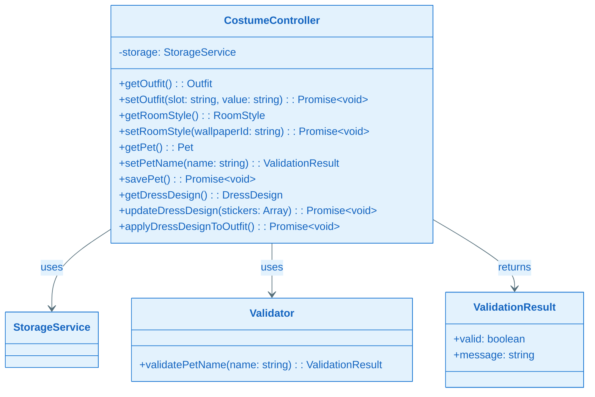
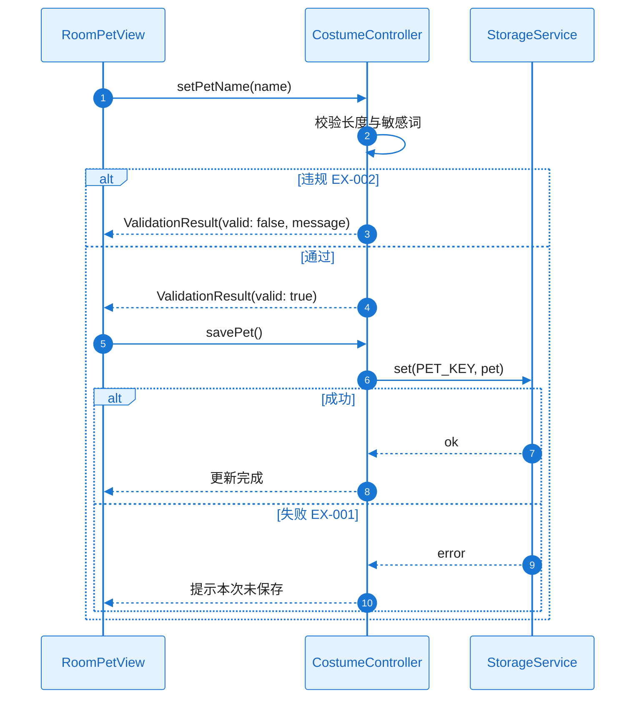
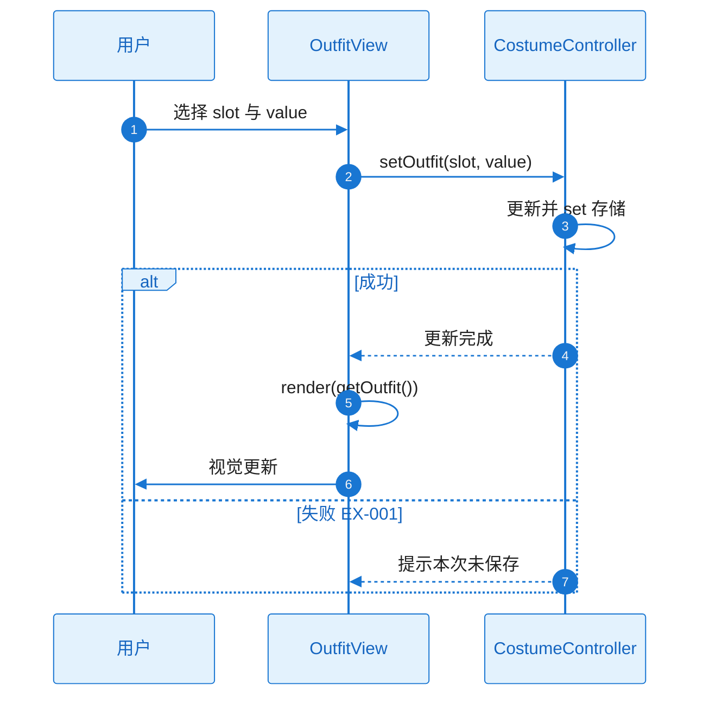
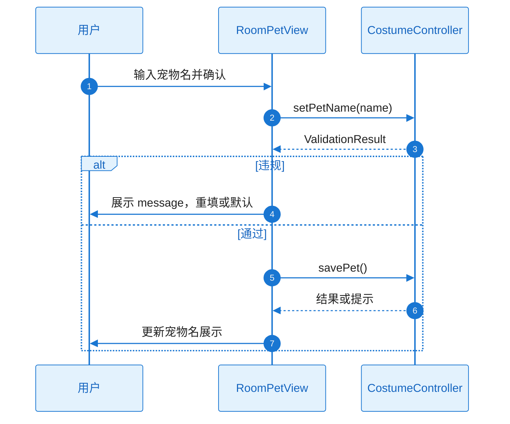

# L2 Story 详细设计（二层详细设计）

本文档与 **plan.md** 配套使用：当 Plan Level = Deep 时，各 Story 的 L2 详细设计在此文档中编写；plan.md 中通过「Story Detailed Design」章节引用本文档。

**Feature**：FEAT-004 - 服装创作

---

## 文档约定

- 对每个 Story，必须同时覆盖：**需求描述**、**功能设计（类图/时序图/触发条件/系统响应）**。
- 类图、时序图须基于本工程实际架构与真实代码，遵循 `.cursor/rules/specify-diagram-requirements.mdc`。
- tasks.md 的每个 Task 应明确引用对应 Story 的详细设计入口（例如：`L2_story_detail_design.md:ST-001:功能设计:时序图`）。

---

### ST-001 Detailed Design：存储键与数据模型（Infrastructure）

#### 1) 需求及描述

- **需求描述**：装扮、房间墙纸、宠物名、裙子设计的存储键与结构（B3）；与 FEAT-001 命名空间约定一致。关联 FR-006；NFR-REL-001。
- **需求依赖**：FEAT-001 StorageService。
- **使用范围**：CostumeController 读写；各 View 通过 Controller 间接使用。
- **使用接口**：通过 StorageService.get/set 使用 B3 约定键（如 OUTFIT_KEY、PET_KEY、ROOM_STYLE_KEY、DRESS_DESIGN_KEY 等）。
- **DoD（验收标准）**：
  - [ ] 键与 B3 一致；可读写、可恢复（FR-006、NFR-REL-001）
  - [ ] 存储读写与结构单元测试通过

#### 2) 功能设计

##### 功能设计关键说明

**核心实现思路**：在 B3 中定义各键名与 Outfit、RoomStyle、Pet、DressDesign 结构；实现时使用 FEAT-001 StorageService 按键读写；无新增运行时类，仅数据结构与键约定。**失败处理**：存储不可用时由 ST-002 调用方提示，当次会话有效。

##### 触发条件与系统响应

| 触发条件 | 系统响应（正常流程） | 异常处理 |
|----------|----------------------|----------|
| 读写装扮/房间/宠物/裙子 | get/set 按 B3 键与结构 | 存储不可用：提示「本次未保存」 |

##### 验证与测试设计

- 单元测试：各键 set 后 get 一致；结构与 B3 一致。
- **引用入口**：`L2_story_detail_design.md:ST-001:功能设计`

---

### ST-002 Detailed Design：CostumeController 与 Validator（Design-Enabler）

#### 1) 需求及描述

- **需求描述**：CostumeController 协调换装/墙纸/宠物/裙子；Validator 敏感词与长度校验；与存储集成。关联 FR-001～FR-006；NFR-SEC-001。
- **需求依赖**：ST-001。
- **使用范围**：OutfitView、RoomPetView、DressDesignView。
- **使用接口**：getOutfit()、setOutfit(slot, value)、getRoomStyle()、setRoomStyle(wallpaperId)、getPet()、setPetName(name)、savePet()、getDressDesign()、updateDressDesign(stickers)、applyDressDesignToOutfit()；Validator 校验返回 ValidationResult(valid, message)。
- **DoD（验收标准）**：
  - [ ] 业务逻辑集中；命名合规（≤10 字、敏感词过滤）（NFR-SEC-001）；存储集成与降级提示

#### 2) 功能设计

##### 功能设计关键说明

**核心实现思路**：CostumeController 持有 Outfit、RoomStyle、Pet、DressDesign 状态，通过 StorageService 读写；setOutfit/setRoomStyle 等更新内存后 set 存储，失败时提示「本次未保存」。setPetName 先经 Validator 校验长度 ≤10 与敏感词，违规则返回 ValidationResult(valid: false, message)；通过则更新 Pet 并 savePet() 持久化。updateDressDesign/applyDressDesignToOutfit 按 B3 与业务规则更新并保存。**关键类与职责**：CostumeController、Validator、Outfit、RoomStyle、Pet、DressDesign、ValidationResult 与 plan A3.2.1 一致。**失败处理**：存储失败提示；校验违规返回 ValidationResult 供 UI 提示。

##### 类图（与 plan A3.2.1 对应）

##### 时序图（宠物命名校验与保存，含 EX-001/EX-002）

##### 触发条件与系统响应

| 触发条件 | 系统响应（正常流程） | 异常处理 |
|----------|----------------------|----------|
| setOutfit/setRoomStyle/updateDressDesign/applyDressDesignToOutfit | 更新内存并 set 存储 | EX-001：提示本次未保存 |
| setPetName(name) | 校验通过返回 valid: true；否则 valid: false + message | EX-002：违规提示重填或默认名 |
| savePet() | set(PET_KEY, pet) | EX-001：提示本次未保存 |

##### 验证与测试设计

- 单元测试：Validator 长度与敏感词；CostumeController 与存储集成；失败路径提示。
- **引用入口**：`L2_story_detail_design.md:ST-002:功能设计:时序图`

---

### ST-003 Detailed Design：换装与风格标签 UI（Functional）

#### 1) 需求及描述

- **需求描述**：OutfitView（发型/裙子/鞋子/背包、风格标签）；与 CostumeController 绑定；即时视觉反馈。关联 FR-001、FR-002；NFR-PERF-001、NFR-MEM-001。
- **需求依赖**：ST-002。
- **使用范围**：用户换装与风格展示。
- **使用接口**：OutfitView 调用 getOutfit()、setOutfit(slot, value)；展示风格标签（styleTag）。
- **DoD（验收标准）**：
  - [ ] 用户可完成换装并看到更新；风格标签可展示（FR-001、FR-002）；响应与内存达标（NFR-PERF-001、NFR-MEM-001）

#### 2) 功能设计

##### 功能设计关键说明

**核心实现思路**：OutfitView 根据 getOutfit() 渲染各 slot 与风格标签；用户选择 slot 与 value 时调用 setOutfit(slot, value)，成功后 re-render；资源按需加载，控制内存。**关键类与职责**：OutfitView 表示层，依赖 CostumeController。**失败处理**：存储失败由 Controller 提示；UI 不重复弹窗。

##### 时序图（换装并保存）

##### 触发条件与系统响应

| 触发条件 | 系统响应（正常流程） | 异常处理 |
|----------|----------------------|----------|
| 用户选择装扮项 | setOutfit → 更新 UI | 存储失败：提示本次未保存 |

##### 验证与测试设计

- E2E/手动：换装与保存；风格标签展示；性能与内存。
- **引用入口**：`L2_story_detail_design.md:ST-003:功能设计:时序图`

---

### ST-004 Detailed Design：房间墙纸、宠物命名、裙子设计 UI（Functional）

#### 1) 需求及描述

- **需求描述**：RoomPetView（墙纸、宠物命名）；DressDesignView（贴纸式裙子设计并应用）；与 CostumeController 绑定。关联 FR-003、FR-004、FR-005；NFR-PERF-001、NFR-SEC-001。
- **需求依赖**：ST-002。
- **使用范围**：用户墙纸/宠物/裙子设计操作。
- **使用接口**：RoomPetView 调用 setRoomStyle、setPetName、savePet；DressDesignView 调用 getDressDesign、updateDressDesign、applyDressDesignToOutfit。
- **DoD（验收标准）**：
  - [ ] 用户可更换墙纸、为宠物命名、设计裙子并看到效果；命名合规校验（FR-003～FR-005，NFR-SEC-001）

#### 2) 功能设计

##### 功能设计关键说明

**核心实现思路**：RoomPetView 渲染墙纸选择与宠物名输入；选择墙纸后 setRoomStyle(wallpaperId)；输入名字后 setPetName(name)，若 ValidationResult.valid 为 false 则展示 message，否则 savePet()。DressDesignView 渲染贴纸列表（≤10）；updateDressDesign(stickers) 更新设计，applyDressDesignToOutfit() 应用至装扮并保存。**关键类与职责**：RoomPetView、DressDesignView 表示层；CostumeController 提供接口。**失败处理**：校验违规展示 message；存储失败由 Controller 提示。

##### 时序图（宠物命名）

##### 触发条件与系统响应

| 触发条件 | 系统响应（正常流程） | 异常处理 |
|----------|----------------------|----------|
| 更换墙纸 | setRoomStyle(wallpaperId) → 更新 UI | 存储失败：提示 |
| 宠物命名 | setPetName → 校验 → savePet 或提示违规 | EX-002：展示 message；EX-001：提示本次未保存 |
| 贴纸设计并应用 | updateDressDesign → applyDressDesignToOutfit | 存储失败：提示；资源失败 EX-003：占位或不应用 |

##### 验证与测试设计

- 墙纸/命名/贴纸操作与校验；合规与存储失败路径。
- **引用入口**：`L2_story_detail_design.md:ST-004:功能设计:时序图`
