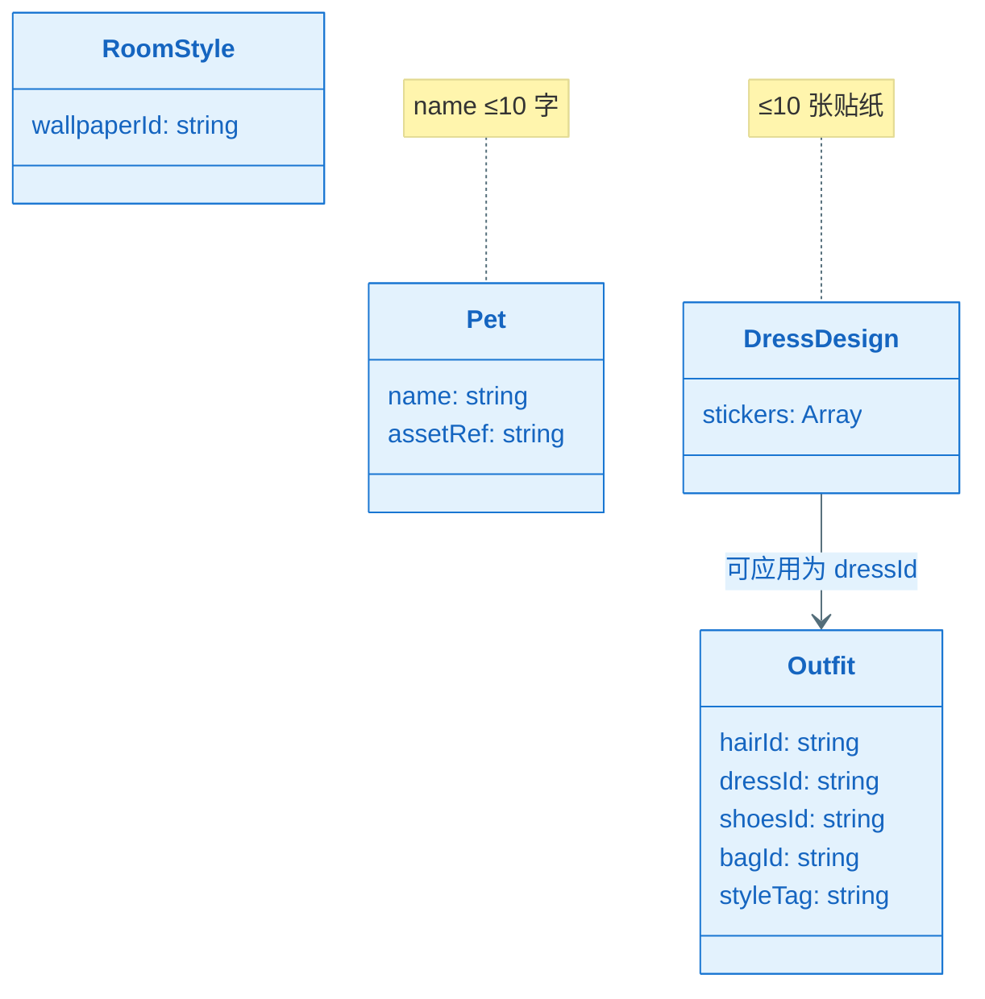
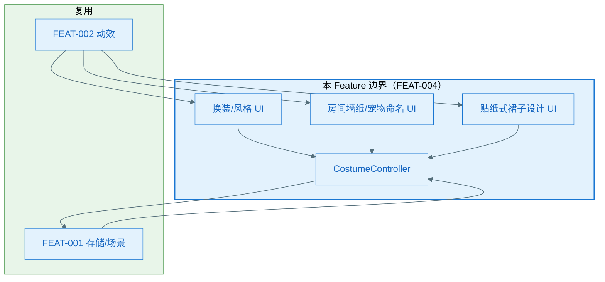
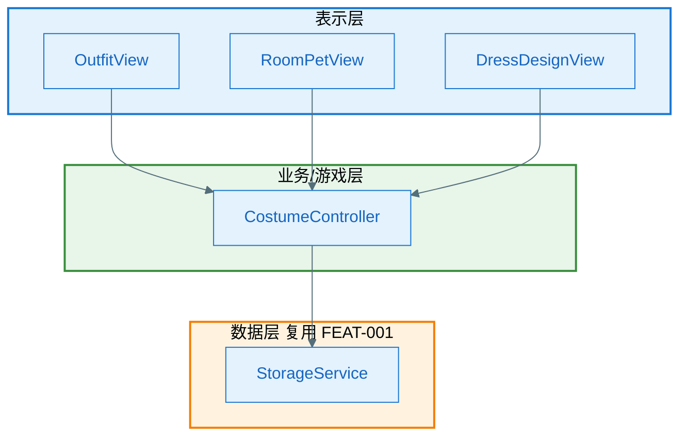
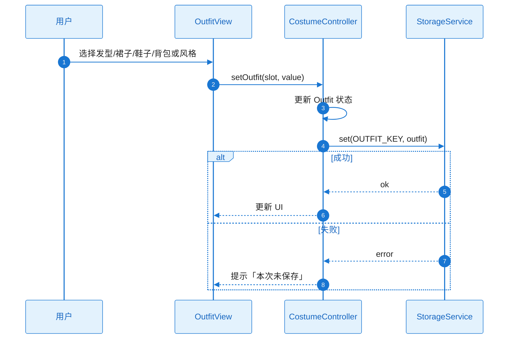
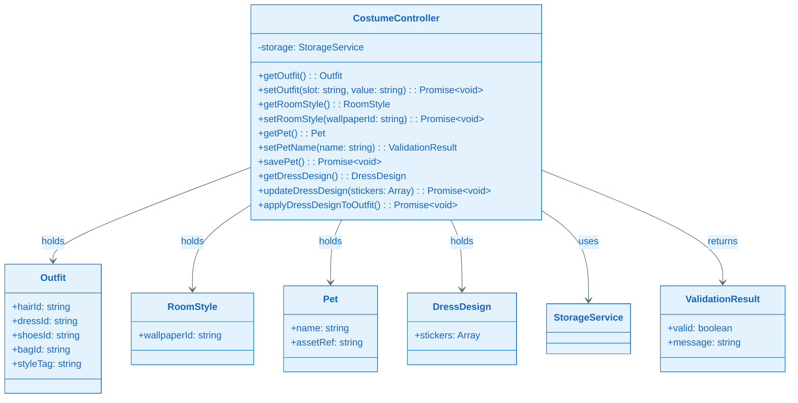
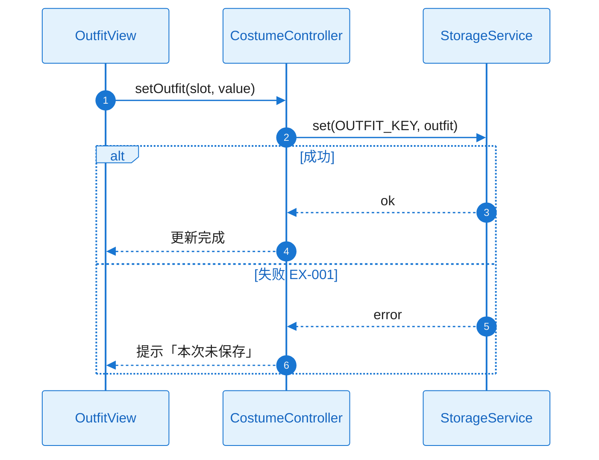
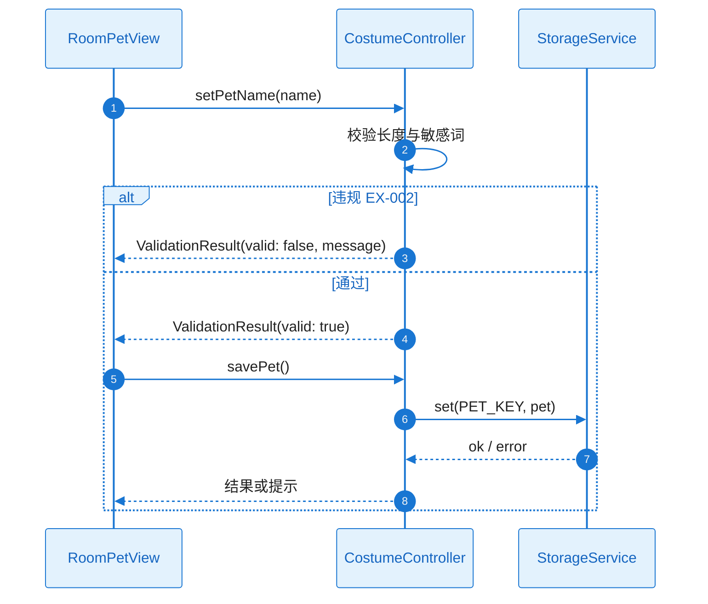
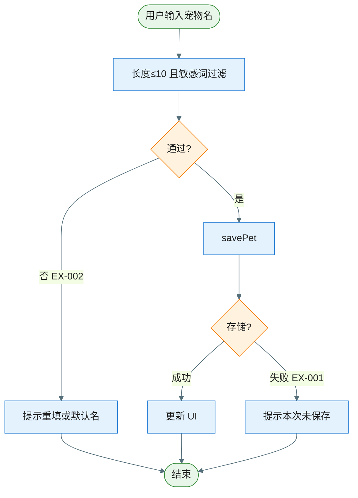
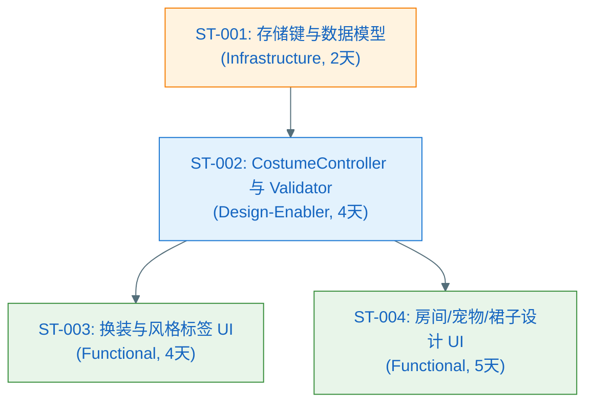

# Plan（工程级蓝图）：装扮与创造系统

**Epic**：EPIC-003 - 星光小镇（Starlit Town）
**Feature ID**：FEAT-004
**Feature Version**：v0.1.0（来自 `spec.md`）
**Plan Version**：v0.1.0
**Plan Level**：Standard
**当前工作分支**：`epic/EPIC-003-starlit-town`
**Feature 目录**：`specs/epics/EPIC-003-starlit-town/features/FEAT-004-costume-creation/`
**日期**：2025-02-05
**输入**：来自 `Feature 目录/spec.md`

> 规则：
> - Plan 阶段必须包含工程决策、风险评估与性能/合规验收指标。
> - **图表规范**：样式遵循 `.cursor/rules/mermaid-style-guide.mdc`；内容与结构须基于本工程实际架构与真实代码，遵循 `.cursor/rules/specify-diagram-requirements.mdc`。

## 变更记录（增量变更）

| 版本 | 日期 | 变更范围（Feature/Story/Task） | 变更摘要 | 影响模块 | 是否需要回滚设计 |
|---|---|---|---|---|---|
| v0.1.0 | 2025-02-05 | Feature | 初始版本 | — | 否 |
| v0.2.0 | 2025-02-05 | Standard 阶段 | A3.3、Story Breakdown、A4–A11 | Plan-A | 否 |

## Plan 前置检查（必须，在开始设计前完成）

### 前置检查清单

- [x] 已阅读 `epic.md` 的"跨 Feature 技术策略"章节
- [x] 已阅读 `epic-arch.md` 并在其 0 层/1 层架构与规范约束下做 A2、A3.1
- [x] 已确认本 Feature 在 Plan 执行顺序中的位置（顺序 4，依赖 FEAT-001、FEAT-002）
- [x] 已检查前置 Feature 的 plan（FEAT-001、FEAT-002 plan 已存在）
- [x] 本 Feature 不担任共享能力 Owner，消费 FEAT-001 存储、FEAT-002 动效

### 依赖的共享能力（从其他 Feature 复用）

| 依赖的共享能力 | Owner Feature | Owner Plan 状态 | 如何获取/引用 |
|---|---|---|---|
| 场景切换、本地存储 | FEAT-001 | Plan Ready | FEAT-001 plan.md A3.2、Plan-B B4.1；存储键使用本 Feature 命名空间 |
| 动效组件库、交互规范 | FEAT-002 | Plan Ready | FEAT-002 plan.md A3.2、Plan-B B4.1；换装/墙纸/贴纸交互可挂载动效 |

### 本 Feature 提供的共享能力（供其他 Feature 复用）

| 共享能力名称 | 消费方 Feature | 设计位置（本 plan 章节） | 接口/契约位置 |
|---|---|---|---|
| 换装入口/界面（早上选衣等） | FEAT-003 | A3.1, A3.2 | Plan-B B4.1 |

### 前置检查结论

- **检查日期**：2025-02-05
- **检查人**：SE/TL
- **结论**：通过
- **备注**：FEAT-003 早上选衣调用本 Feature 换装入口或占位。

---

## 概述

本 Feature 实现装扮与创造：发型/裙子/鞋子/背包装扮与风格标签（甜甜/酷酷/森林/星星）；房间墙纸；宠物命名（敏感词过滤+长度≤10 字）；贴纸式裙子设计（单件≤10 张贴纸）。核心工程决策：无属性数值、无失败设计；所有状态通过 FEAT-001 存储抽象持久化；宠物命名做合规与敏感词过滤；贴纸/墙纸资源加载失败时降级为预设或占位；初期全部免费解锁，无购买流程。

## Plan-A：工程决策 & 风险评估（必须量化）

### A0. 领域概念（Domain Concepts / Glossary，必须）

#### A0.1 领域概念词汇表（必须）

| 概念（中文） | 名称（英文/代码名） | 定义（一句话） | 关键属性/状态（Top3） | 不变量/约束 | 关联概念 |
|---|---|---|---|---|---|
| 装扮 | Outfit | 角色外观：发型/裙子/鞋子/背包槽位及风格标签 | hairId, dressId, shoesId, bagId, styleTag | 未选用默认；风格标签单选 | DressDesign |
| 房间样式 | RoomStyle | 家场景墙纸 | wallpaperId | 与家场景绑定 | — |
| 宠物 | Pet | 宠物角宠物名称与展示 | name, assetRef | 名称≤10 字、敏感词过滤 | — |
| 裙子设计 | DressDesign | 贴纸式设计数据，可应用为裙子槽位 | stickers: Array（贴纸 ID、位置）；≤10 张 | 单件≤10 张贴纸 | Outfit |

#### A0.2 概念关系图（推荐，可选）



### A1. 技术选型（候选方案对比 + 决策理由）

| 决策点 | 候选方案 | 优缺点 | 约束/风险 | 决策 | 决策理由 |
|---|---|---|---|---|---|
| 装扮持久化 | FEAT-001 存储 / 独立存储 | 统一键与契约，无重复 | 键命名空间约定 | 使用 FEAT-001 StorageService，本 Feature 键命名空间 | epic-arch：存储由 FEAT-001 统一 |
| 宠物命名校验 | 前端校验 / 前后端 / 仅长度 | 儿童合规需敏感词 | 敏感词表维护 | 前端敏感词过滤 + 长度≤10 字 | spec 澄清；epic-arch 合规 |
| 贴纸资源 | 预加载 / 按需加载 | 按需控制内存与首屏 | 失败需降级 | 按需加载；失败时预设或占位 | NFR-REL-001、NFR-MEM-001 |

### A2. Feature 全景架构（0 层框架图：边界 + 外部依赖）

#### A2.1 Feature 全景架构图（必须）

> 继承 epic-arch 的 0 层：本 Feature 覆盖「装扮与创造」在 EPIC 内边界；依赖 FEAT-001（存储、场景）、FEAT-002（动效）。



#### A2.1.1 架构设计说明（必须：理由/决策/思考）

- **边界与职责**：本 Feature 负责换装、房间墙纸、宠物命名、贴纸式裙子设计及持久化；不负责商店购买流程（初期全部免费）、AI 生成、属性数值。
- **分层与依赖方向**：表示层（各装扮/房间/宠物/设计视图）依赖业务层（CostumeController）；业务层依赖 FEAT-001 StorageService；禁止表示层直连存储。
- **关键数据流**：Outfit、RoomStyle、Pet、DressDesign 通过 FEAT-001 约定键读写；选择即生效，保存与 FEAT-001 同步，失败时提示。
- **外部依赖策略**：存储不可用时当次会话有效并提示；资源加载失败时预设或占位，不崩溃。
- **可演进性**：槽位与风格标签可扩展；贴纸数据结构在 B3 约定。

### A2.2 外部依赖清单（若有则必填，无依赖时标注 N/A）

| 依赖项 | 类型 | 提供方 | 提供的能力 | 通信方式 | 故障模式 | 我方策略 |
|--------|------|--------|-----------|----------|----------|----------|
| FEAT-001 StorageService | 内部 | FEAT-001 | 持久化 | 接口调用 | 不可用/满 | 提示、当次会话降级 |
| 素材资源（贴纸/墙纸/装扮图） | 本地/静态 | 项目 | 图片/资源 | 加载 | 失败 | 预设或占位，不阻塞 |

#### A2.3 通信与交互约束（必须）

- **协议**：层间函数调用；存储为 FEAT-001 异步 API。
- **超时与重试**：存储读写同 FEAT-001；资源加载失败不重试，直接降级。
- **错误处理**：存储失败提示「本次未保存」；命名违规提示重填或默认名；资源缺失用占位。
- **数据一致性**：装扮与创造状态与 FEAT-001 存储一致。

### A3. Feature 内部设计

#### A3.1 第一层：整体框架设计（必须）

##### A3.1.1 内部总体框架图（必须）

> 继承 epic-arch 的 1 层：表示层（换装/房间/宠物/设计视图）→ 业务层（CostumeController）→ 数据层（FEAT-001 StorageService）。



##### A3.1.2 总体设计说明（必须）

###### A3.1.2.1 组件清单与职责（必须）

| 组件 | 所属模块 | 职责（一句话） | 输入/输出 | 依赖 | 约束 |
|------|----------|----------------|-----------|------|------|
| OutfitView | 表示层 | 换装与风格标签选择，即时展示外观 | 用户选择 → 调用 CostumeController 更新并保存 | CostumeController, FEAT-002 | 不直连存储 |
| RoomPetView | 表示层 | 房间墙纸选择、宠物命名输入与校验 | 用户选择/输入 → 调用 CostumeController；命名需校验 | CostumeController, FEAT-002 | 命名≤10 字、敏感词过滤 |
| DressDesignView | 表示层 | 贴纸式裙子设计，应用至角色 | 用户贴纸操作 → 调用 CostumeController；≤10 张 | CostumeController, FEAT-002 | 资源失败降级 |
| CostumeController | 业务层 | 装扮/房间/宠物/设计状态管理与持久化 | 视图事件 → 更新状态、校验、调用 StorageService | StorageService | 存储键见 B3 |

###### A3.1.2.2 组件协作时序图（必须）



###### A3.1.2.3 关键设计决策（必须）

| 决策点 | 候选方案 | 决策 | 决策理由 | 影响范围 | 引用来源 |
|--------|----------|------|----------|----------|----------|
| 命名校验 | 仅长度 / 长度+敏感词 | 长度≤10 + 敏感词过滤 | 儿童合规 | RoomPetView, CostumeController | spec 澄清、epic-arch |
| 贴纸上限 | 无 / 10 张 | 单件≤10 张 | spec 澄清 | DressDesignView, DressDesign | spec 澄清 |

###### A3.1.2.4 主要风险与权衡

- **权衡点**：素材丰富度 vs 资源体积——按需加载、控制首屏与 NFR-PERF。
- **已知风险**：存储满或不可写 → 当次会话可操作并提示，与 FEAT-001 策略一致。

---

#### A3.2 第二层：Feature 全景（必须）

##### A3.2.1 全景类图（必须）



###### 关键类职责说明

| 类/接口 | 层级 | 职责 | 关键方法 |
|---------|------|------|----------|
| CostumeController | 业务层 | 装扮/房间/宠物/设计状态与持久化、命名校验 | setOutfit(), setRoomStyle(), setPetName(), savePet(), updateDressDesign(), applyDressDesignToOutfit() |
| Outfit | 数据模型 | 发型/裙子/鞋子/背包/风格 | — |
| RoomStyle | 数据模型 | 墙纸 ID | — |
| Pet | 数据模型 | 宠物名称与资源 | — |
| DressDesign | 数据模型 | 贴纸列表（≤10） | — |
| ValidationResult | 领域 | 命名校验结果 | valid, message |

##### A3.2.2 Feature 时序图集（方法调用流程，必须）

| Seq ID | 流程名称 | 覆盖的异常（EX-xxx） |
|--------|----------|----------------------|
| SEQ-001 | 换装并保存 | EX-001（存储失败） |
| SEQ-002 | 宠物命名校验与保存 | EX-002（违规）、EX-001 |
| SEQ-003 | 贴纸设计并应用 | EX-003（资源失败） |

###### SEQ-001：换装并保存



###### SEQ-002：宠物命名校验与保存



##### A3.2.3 Feature 流程图集（逻辑流程，必须）

###### 流程 1：宠物命名



| 分支 | 异常ID | 触发条件 | 对策 |
|------|--------|----------|------|
| 命名违规 | EX-002 | 超长或敏感词 | 提示重填或使用默认名 |
| 存储失败 | EX-001 | set 失败 | 提示「本次未保存」 |

##### A3.2.4 关键设计详解（若适用）

- 敏感词过滤：在 CostumeController 或独立 Validator 模块实现；敏感词表可配置或内置最小集；与 epic-arch 合规一致。

---

#### A3.3 第三层：组件内部详细设计（Plan Level = Standard 时执行）

##### 组件：CostumeController

- **定位**：协调换装、房间墙纸、宠物命名、裙子设计；读写 FEAT-001 StorageService；校验与敏感词（Validator）。
- **失败与降级**：存储不可用时当次会话有效并提示；敏感词/超长命名提示重填或默认。

##### 组件：Validator（敏感词/长度）

- **定位**：宠物命名等用户输入：长度 ≤10 字、敏感词过滤；违规则返回错误类型供 UI 提示。

---

### A4. 技术风险与消解策略（绑定 Story/Task）

| 风险ID | 风险描述 | 触发条件 | 影响范围 | 严重度 | 消解策略 | 对应 Story/Task |
|--------|----------|----------|----------|--------|----------|-----------------|
| RISK-001 | 存储不可用 | 浏览器限制 | 状态不持久 | Low | 当次会话有效、提示 | ST-001 |
| RISK-002 | 敏感词/违规输入 | 用户输入 | 合规风险 | Med | Validator + 提示/默认名 | ST-002 |

### A5. 边界 & 异常场景枚举

- **数据边界**：未选品类用默认；宠物名 ≤10 字、敏感词过滤；贴纸/墙纸资源加载失败降级。
- **用户行为**：命名违规则提示重填或使用默认名；存储满时提示本次未保存。

#### A5.1 场景 → 应对措施对照表（必须）

| 场景ID | 场景类别 | 触发条件 | 影响 | 预期行为 | 技术对策 | 设计对策 | 映射 |
|--------|----------|----------|------|----------|----------|----------|------|
| SC-001 | 输入 | 敏感词/超长 | 不合规 | 提示重填或默认 | Validator | 文案提示 | RISK-002 |
| SC-002 | 存储 | 不可用/满 | 不保存 | 当次可用+提示 | 与 FEAT-001 一致 | N/A | RISK-001 |

### A6. 算法评估（如适用）

不适用。

### A7. 功耗评估

不适用（Web 环境）。

### A8. 性能评估（必须量化）

换装、墙纸切换、贴纸操作响应 ≤500ms；素材加载不阻塞主线程；资源可按需加载。

### A9. 内存评估

装扮与创造相关资源与状态增量可控；贴纸/墙纸按需加载，无显著泄漏。

### A10. 安全评估（如适用）

宠物命名等用户输入需合规与内容过滤（儿童适用）；敏感词过滤+长度限制（NFR-SEC-001）。

### A11. 兼容性评估（必须）

与 FEAT-001 存储、FEAT-002 动效、FEAT-003 场景兼容；浏览器同 EPIC。**兼容性结论**：依赖清晰，风险较低。

---

## Plan-B：技术规约 & 实现约束

### B0. Plan-A ↔ Plan-B 一致性与互校（必须）

| Plan-A（决策/假设/约束） | Plan-B（落点） | 自检规则（必须通过） |
|---|---|---|
| A0 领域概念命名 | B3/B4 | Outfit、RoomStyle、Pet、DressDesign 与 B3 一致 |
| A1 技术选型 | B2/B3 | 存储键命名空间、校验策略在 B3/B5 体现 |
| A2 外部依赖与故障策略 | B4.2 | 与 FEAT-001 一致 |

### B1. 技术背景（用于统一工程上下文）

**Language/Version**：JavaScript（ES6+），HTML5，CSS3  
**Primary Dependencies**：FEAT-001 StorageService；可选 FEAT-002 动效  
**Storage**：复用 FEAT-001；键命名空间 `starlit.costume.*`（见 B3）  
**Target Platform**：PC 与平板浏览器  
**Project Type**：web  
**Performance Targets**：换装/墙纸/贴纸响应 ≤500ms；素材按需加载不阻塞  
**Constraints**：无属性数值、无失败设计；儿童合规与敏感词过滤  

### B2. 架构细化（实现必须遵循）

- **分层约束**：表示层不直连存储；业务层通过 FEAT-001 StorageService 读写。
- **错误处理规范**：存储失败提示；命名违规返回 ValidationResult；资源加载失败降级不抛未处理异常。
- **日志与可观测性**：关键操作（换装、墙纸、宠物命名、裙子设计保存）可日志或埋点（NFR-OBS-001）。

### B3. 数据模型（引用或内联）

#### B3.1 存储形态与边界（必须）

- **存储形态**：复用 FEAT-001 IndexedDB/localStorage；本 Feature 使用独立键命名空间。
- **System of Record**：本地持久化为权威；与 FEAT-001 协同。

#### B3.2 物理数据结构（若使用持久化存储则必填）

| Key | 用途 | 结构版本 | Schema/字段说明 | 迁移策略 |
|-----|------|----------|----------------|----------|
| `starlit.costume.outfit` | 装扮状态 | v1 | hairId, dressId, shoesId, bagId, styleTag | 新增字段默认值 |
| `starlit.costume.roomStyle` | 房间墙纸 | v1 | wallpaperId | 同上 |
| `starlit.costume.pet` | 宠物 | v1 | name, assetRef | 同上 |
| `starlit.costume.dressDesign` | 裙子设计 | v1 | stickers: Array（≤10），每项含 id、position 等 | 同上 |

### B4. 接口规范/协议（引用或内联）

#### B4.1 本 Feature 对外提供的接口（必须：Capability Feature/跨模块复用场景）

- **换装入口/界面**  
  - **用途**：供 FEAT-003 早上选衣调用或嵌入。  
  - **接口**：可由 FEAT-003 导航至本 Feature 的 OutfitView，或提供 `openOutfitForMorning(): Promise<void>` 等；选衣完成后返回 FEAT-003 流程。  
  - **错误语义**：存储失败时仍可操作，提示保存失败。

#### B4.2 本 Feature 依赖的外部接口/契约（必须：存在外部依赖时）

- **FEAT-001**：StorageService（get/set）；键命名空间不冲突。  
- **FEAT-002**：动效可选；未就绪时基础交互即可。

### B5. 合规性检查（关卡）

- 宠物命名：敏感词过滤 + 长度≤10 字；内容符合儿童合规（NFR-SEC-001）。进入 Implement 前确认：敏感词表或策略已定义。

### B6. 项目结构（本 Feature）

```text
specs/epics/EPIC-003-starlit-town/features/FEAT-004-costume-creation/
├── spec.md
├── plan.md
├── tasks.md
└── checklists/
```

### B7. 源代码结构（代码库根目录）

与 EPIC Web 游戏目录一致，例如：

```text
starlit-town/
├── js/
│   ├── costume/
│   │   ├── CostumeController.js
│   │   ├── OutfitView.js
│   │   ├── RoomPetView.js
│   │   ├── DressDesignView.js
│   │   └── validation/
│   └── ...
```

**结构决策**：业务逻辑（CostumeController、validation）与视图分离；存储键与 B3 一致。

---

## Story Breakdown（Plan Level = Standard 时执行）

### Story 列表

#### ST-001：存储键与数据模型（Infrastructure）

- **类型**：Infrastructure
- **描述**：装扮、房间墙纸、宠物名、裙子设计的存储键与结构（B3）；与 FEAT-001 命名空间约定一致。
- **目标**：可读写、可恢复；键与 B3 一致。
- **预估工作量**：2 人天
- **覆盖 FR/NFR**：FR-006；NFR-REL-001
- **依赖**：FEAT-001 StorageService
- **可并行**：否
- **关键风险**：否
- **验收/验证方式**：存储读写与结构测试。
- **交付物**：B3 键与结构实现。

#### ST-002：CostumeController 与 Validator（Design-Enabler）

- **类型**：Design-Enabler
- **描述**：CostumeController 协调换装/墙纸/宠物/裙子；Validator 敏感词与长度校验；与存储集成。
- **目标**：业务逻辑集中；命名合规（≤10 字、敏感词过滤）。
- **预估工作量**：4 人天
- **覆盖 FR/NFR**：FR-001–FR-006；NFR-SEC-001
- **依赖**：ST-001
- **可并行**：否
- **关键风险**：是（RISK-002）
- **验收/验证方式**：单元测试校验与存储集成。
- **交付物**：CostumeController、Validator、B4.1 接口。

#### ST-003：换装与风格标签 UI（Functional）

- **类型**：Functional
- **描述**：OutfitView（发型/裙子/鞋子/背包、风格标签）；与 CostumeController 绑定；即时视觉反馈。
- **目标**：用户可完成换装并看到更新；风格标签可展示。
- **预估工作量**：4 人天
- **覆盖 FR/NFR**：FR-001、FR-002；NFR-PERF-001、NFR-MEM-001
- **依赖**：ST-002
- **可并行**：否
- **关键风险**：否
- **验收/验证方式**：E2E/手动换装与保存。
- **交付物**：OutfitView、换装资源与绑定。

#### ST-004：房间墙纸、宠物命名、裙子设计 UI（Functional）

- **类型**：Functional
- **描述**：RoomPetView（墙纸、宠物命名）；DressDesignView（贴纸式裙子设计并应用）；与 CostumeController 绑定。
- **目标**：用户可更换墙纸、为宠物命名、设计裙子并看到效果；命名合规校验。
- **预估工作量**：5 人天
- **覆盖 FR/NFR**：FR-003、FR-004、FR-005；NFR-PERF-001、NFR-SEC-001
- **依赖**：ST-002
- **可并行**：否
- **关键风险**：否
- **验收/验证方式**：墙纸/命名/贴纸操作与校验。
- **交付物**：RoomPetView、DressDesignView、资源与绑定。

### Story 依赖关系图



### Feature → Story 覆盖矩阵

| FR/NFR ID | 覆盖的 Story ID | 备注 |
|-----------|-----------------|------|
| FR-001, FR-002 | ST-003 | 换装与风格 |
| FR-003, FR-004, FR-005 | ST-004 | 墙纸/宠物/裙子 |
| FR-006 | ST-001, ST-002 | 持久化 |
| NFR-PERF-001 | ST-003, ST-004 | 响应 |
| NFR-MEM-001 | ST-003, ST-004 | 资源按需 |
| NFR-SEC-001 | ST-002, ST-004 | 敏感词/合规 |
| NFR-REL-001 | ST-001, ST-002 | 存储降级 |

### Story 工作量汇总

| Story ID | 类型 | 预估工作量（人天） | 依赖关系 | 是否并行 |
|----------|------|-------------------|----------|----------|
| ST-001 | Infrastructure | 2 | FEAT-001 | — |
| ST-002 | Design-Enabler | 4 | ST-001 | 否 |
| ST-003 | Functional | 4 | ST-002 | 否 |
| ST-004 | Functional | 5 | ST-002 | 否 |
| **总计** | — | **15 人天** | — | — |
