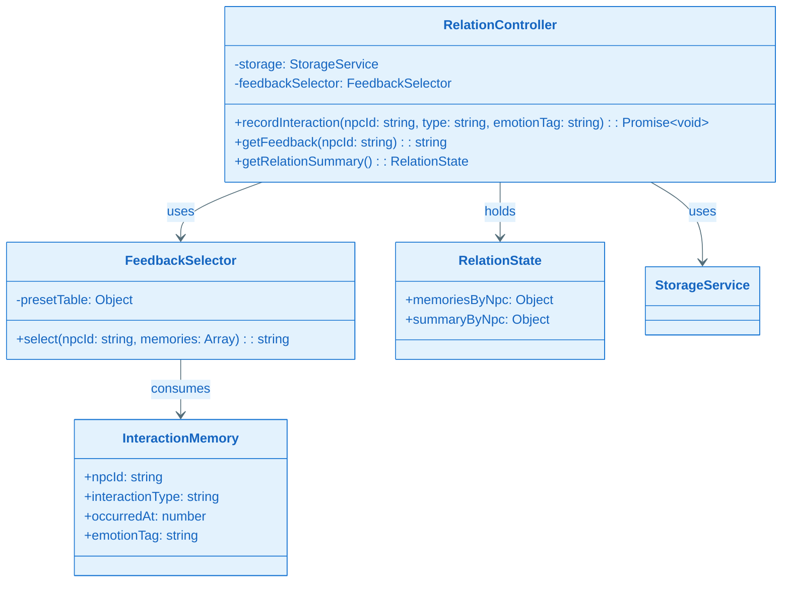
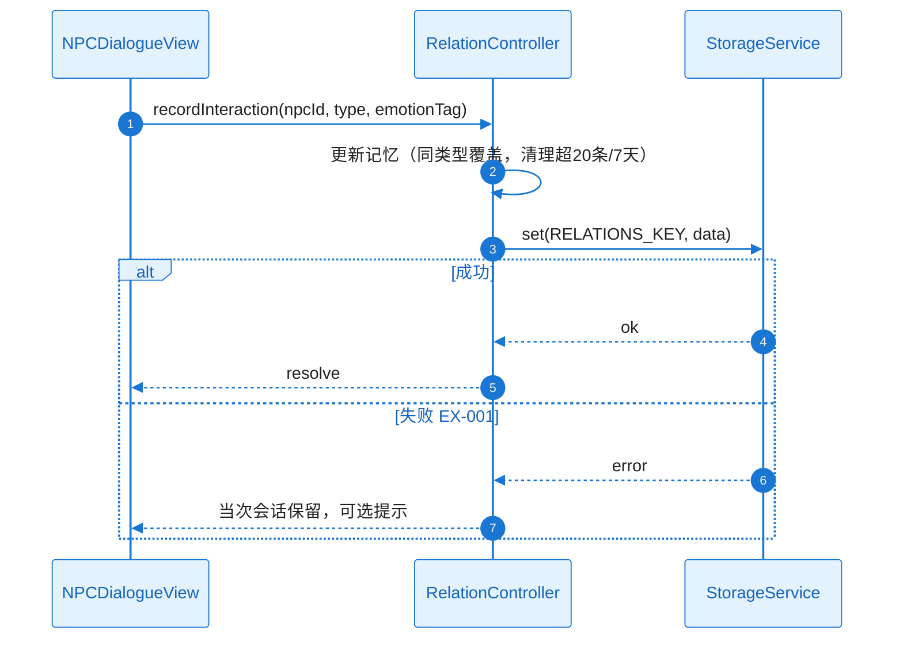
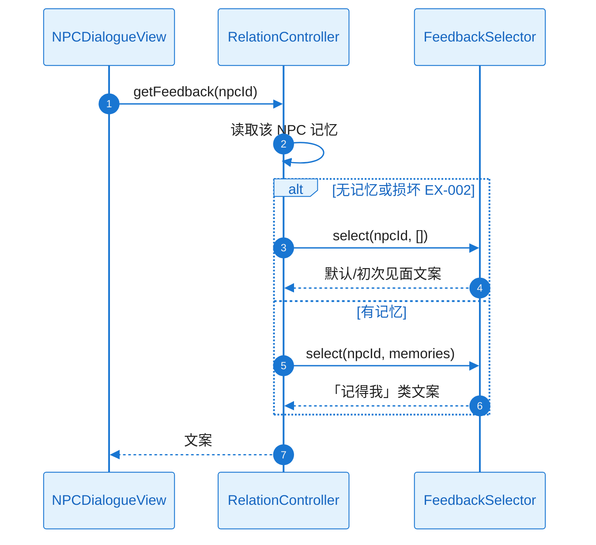
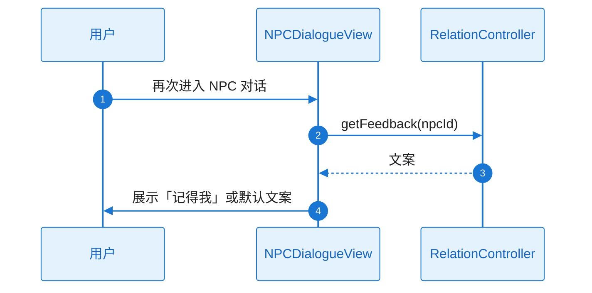

# L2 Story 详细设计（二层详细设计）

本文档与 **plan.md** 配套使用：当 Plan Level = Deep 时，各 Story 的 L2 详细设计在此文档中编写；plan.md 中通过「Story Detailed Design」章节引用本文档。

**Feature**：FEAT-005 - 角色关系

---

## 文档约定

- 对每个 Story，必须同时覆盖：**需求描述**、**功能设计（类图/时序图/触发条件/系统响应）**。
- 类图、时序图须基于本工程实际架构与真实代码，遵循 `.cursor/rules/specify-diagram-requirements.mdc`。
- tasks.md 的每个 Task 应明确引用对应 Story 的详细设计入口（例如：`L2_story_detail_design.md:ST-001:功能设计:时序图`）。

---

### ST-001 Detailed Design：存储键与记忆数据模型（Infrastructure）

#### 1) 需求及描述

- **需求描述**：互动记忆与关系状态的存储键与结构（B3）；20 条/7 天、同类型覆盖策略；与 FEAT-001 命名空间一致；getRelationSummary() 可产出供 FEAT-006。关联 FR-002、FR-005；NFR-REL-001。
- **需求依赖**：FEAT-001 StorageService。
- **使用范围**：RelationController 读写；FEAT-006 通过 getRelationSummary() 消费。
- **使用接口**：通过 StorageService.get/set 使用 B3 约定键（如 RELATIONS_KEY）；InteractionMemory、RelationState 结构见 B3。
- **DoD（验收标准）**：
  - [ ] 可读写、可恢复；摘要可产出供 FEAT-006（FR-002、FR-005、NFR-REL-001）
  - [ ] 存储与摘要结构单元测试通过

#### 2) 功能设计

##### 功能设计关键说明

**核心实现思路**：B3 定义 RELATIONS_KEY 及 InteractionMemory 列表、同类型覆盖、20 条/7 天清理策略；实现时 RelationController 读入后按策略更新（同类型覆盖、超 20 条或超 7 天裁剪），再 set 回存储。RelationState/memoriesByNpc/summaryByNpc 由内存结构组装，供 getRelationSummary() 返回。**失败处理**：存储不可用时当次会话有效、可选提示。

##### 触发条件与系统响应

| 触发条件 | 系统响应（正常流程） | 异常处理 |
|----------|----------------------|----------|
| 读写关系数据 | get/set 按 B3 键与策略 | 存储不可用：当次会话有效、提示 |

##### 验证与测试设计

- 单元测试：键与结构、同类型覆盖与 20 条/7 天逻辑、摘要结构。
- **引用入口**：`L2_story_detail_design.md:ST-001:功能设计`

---

### ST-002 Detailed Design：RelationController 与 FeedbackSelector（Design-Enabler）

#### 1) 需求及描述

- **需求描述**：RelationController 协调互动记录、记忆读写、getRelationSummary；FeedbackSelector 按 NPC/性格/互动历史选取预设文案。关联 FR-001～FR-004；NFR-OBS-001。
- **需求依赖**：ST-001。
- **使用范围**：NPCDialogueView、FEAT-006（getRelationSummary）。
- **使用接口**：recordInteraction(npcId, type, emotionTag)、getFeedback(npcId)、getRelationSummary()；FeedbackSelector.select(npcId, memories)。
- **DoD（验收标准）**：
  - [ ] 互动可记录；“记得我”反馈可区分性格；与 FEAT-006 契约就绪（RISK-002 降级默认反馈）

#### 2) 功能设计

##### 功能设计关键说明

**核心实现思路**：recordInteraction 时更新内存记忆（同类型覆盖、清理超 20 条/7 天），再 set(RELATIONS_KEY)；失败时当次会话保留。getFeedback(npcId) 读取该 NPC 记忆，若空或损坏（EX-002）则 FeedbackSelector.select(npcId, []) 返回默认/初次见面文案，否则 select(npcId, memories) 返回「记得我」类文案。FeedbackSelector 预设表按 (personalityType, interactionType, emotionTag, isFirstMeet) 等维度索引。**关键类与职责**：RelationController、FeedbackSelector、InteractionMemory、RelationState 与 plan A3.2.1 一致。**失败处理**：存储失败当次会话有效；记忆损坏降级默认反馈，不崩溃。

##### 类图（与 plan A3.2.1 对应）

##### 时序图（记录互动并持久化，含 EX-001）

##### 时序图（再次对话获取反馈，含 EX-002）

##### 触发条件与系统响应

| 触发条件 | 系统响应（正常流程） | 异常处理 |
|----------|----------------------|----------|
| recordInteraction | 更新记忆并 set 存储 | EX-001：当次会话保留，可选提示 |
| getFeedback(npcId) | 按记忆选预设文案返回 | EX-002：默认/初次见面文案 |
| getRelationSummary() | 返回 RelationState | 无数据时返回空或默认结构 |

##### 验证与测试设计

- 记忆读写与反馈选取逻辑测试；B4.1 契约与 FEAT-006 对接。
- **引用入口**：`L2_story_detail_design.md:ST-002:功能设计:时序图`

---

### ST-003 Detailed Design：NPCDialogueView 与场景集成（Functional）

#### 1) 需求及描述

- **需求描述**：NPCDialogueView 展示对话与“记得我”反馈；与 FEAT-003 场景内 NPC 入口集成；与 RelationController 绑定。关联 FR-001、FR-003、FR-004；NFR-PERF-001、NFR-MEM-001。
- **需求依赖**：ST-002。
- **使用范围**：用户与 NPC 对话及再次见面反馈。
- **使用接口**：NPCDialogueView 调用 recordInteraction、getFeedback；与 FEAT-003 场景入口衔接。
- **DoD（验收标准）**：
  - [ ] 用户可与 NPC 互动并再次见面时看到差异化反馈（FR-001、FR-003、FR-004）；响应与内存达标（NFR-PERF-001、NFR-MEM-001）

#### 2) 功能设计

##### 功能设计关键说明

**核心实现思路**：NPCDialogueView 在用户完成一次互动时调用 recordInteraction(npcId, type, emotionTag)；再次进入对话时调用 getFeedback(npcId) 并展示文案。与 FEAT-003 场景内 NPC 入口集成（点击 NPC 进入本视图）。**关键类与职责**：NPCDialogueView 表示层，依赖 RelationController。**失败处理**：存储失败已在 Controller 侧处理；记忆损坏时 getFeedback 返回默认文案，UI 正常展示。

##### 时序图（再次对话获取反馈）

##### 触发条件与系统响应

| 触发条件 | 系统响应（正常流程） | 异常处理 |
|----------|----------------------|----------|
| 用户完成互动 | recordInteraction → 可选提示 | EX-001：当次会话保留 |
| 用户再次进入对话 | getFeedback → 展示文案 | EX-002：展示默认/初次见面文案 |

##### 验证与测试设计

- E2E/手动：互动与再次见面反馈；性能与内存。
- **引用入口**：`L2_story_detail_design.md:ST-003:功能设计:时序图`
