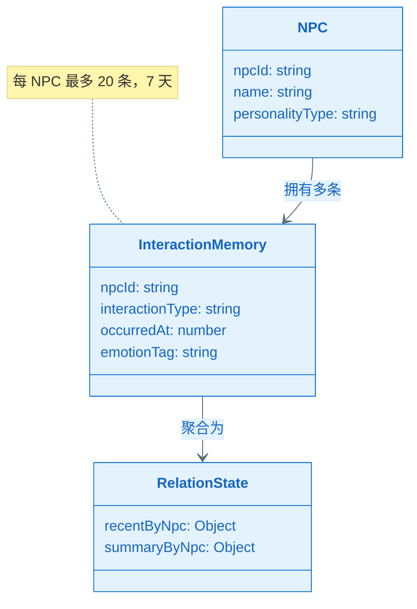
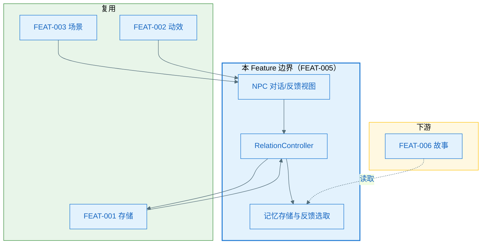
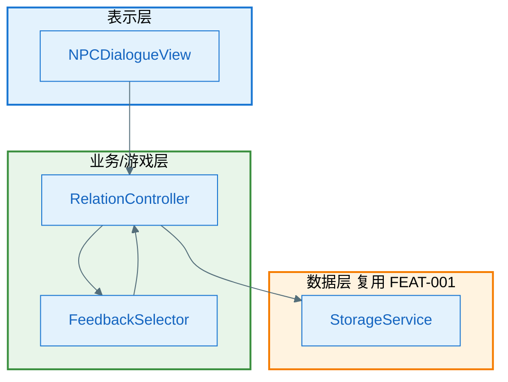
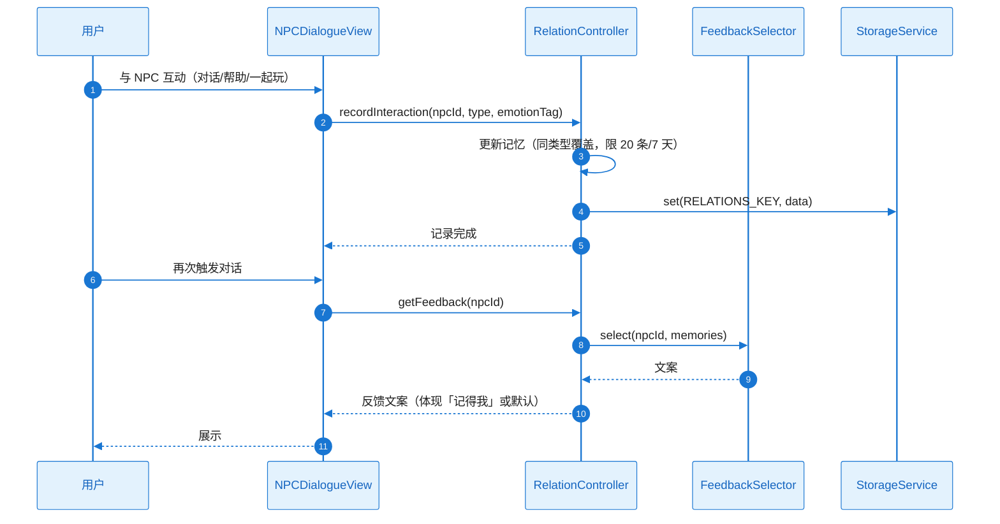
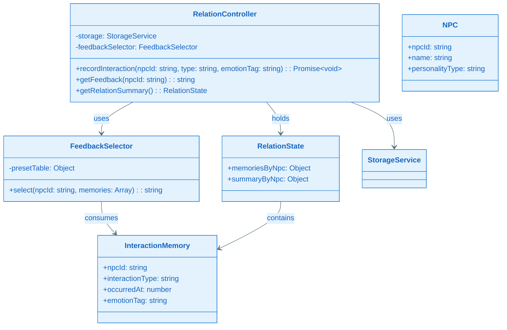
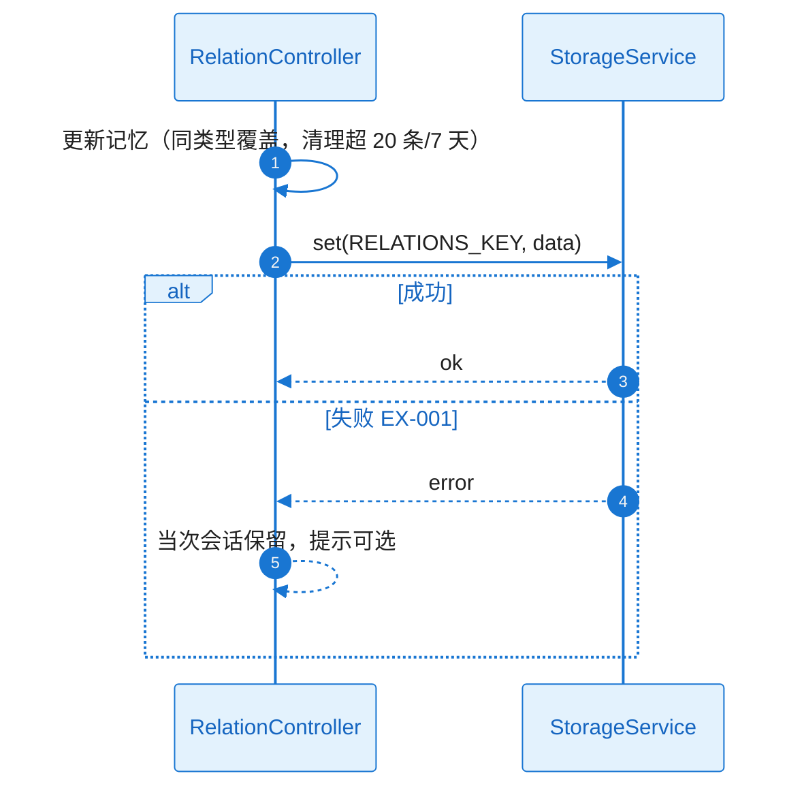
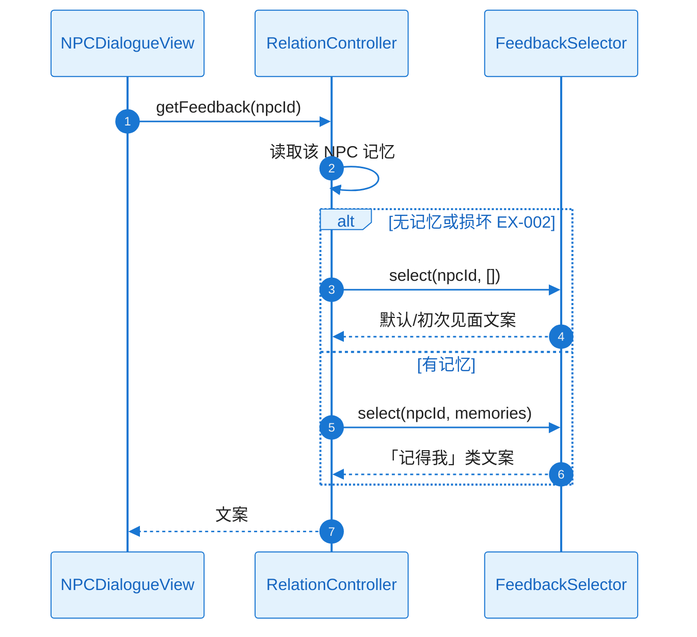
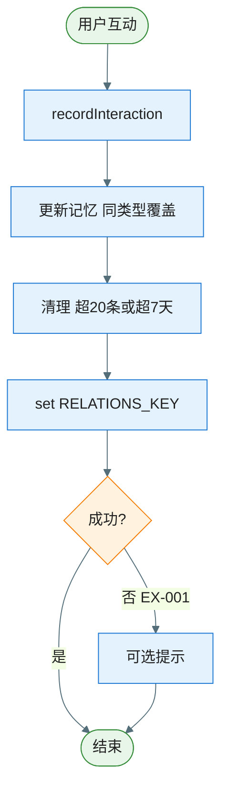
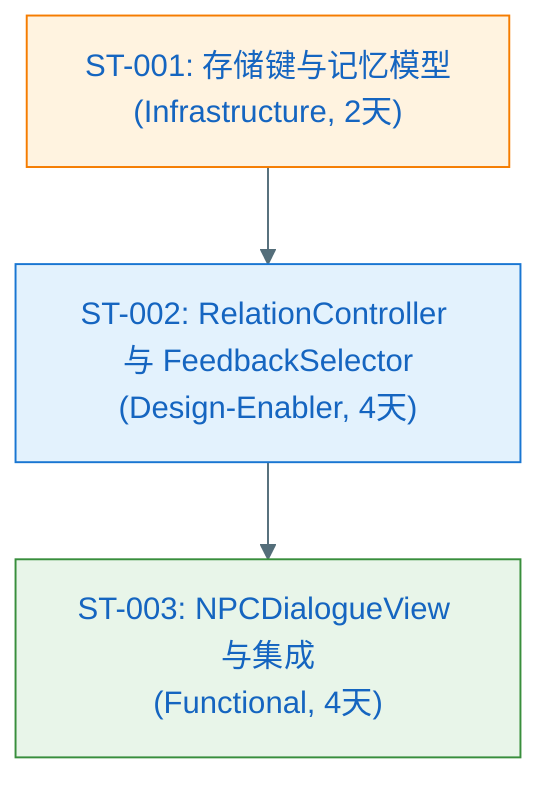

# Plan（工程级蓝图）：角色关系系统

**Epic**：EPIC-003 - 星光小镇（Starlit Town）
**Feature ID**：FEAT-005
**Feature Version**：v0.1.0（来自 `spec.md`）
**Plan Version**：v0.1.0
**Plan Level**：Deep
**当前工作分支**：`epic/EPIC-003-starlit-town`
**Feature 目录**：`specs/epics/EPIC-003-starlit-town/features/FEAT-005-character-relations/`
**日期**：2025-02-05
**输入**：来自 `Feature 目录/spec.md`

> 规则：
> - Plan 阶段必须包含工程决策、风险评估与性能/合规验收指标。
> - **图表规范**：样式遵循 `.cursor/rules/mermaid-style-guide.mdc`；内容与结构须基于本工程实际架构与真实代码，遵循 `.cursor/rules/specify-diagram-requirements.mdc`。

## 变更记录（增量变更）

| 版本 | 日期 | 变更范围（Feature/Story/Task） | 变更摘要 | 影响模块 | 是否需要回滚设计 |
|---|---|---|---|---|---|
| v0.1.0 | 2025-02-05 | Feature | 初始版本 | — | 否 |
| v0.2.0 | 2025-02-05 | Standard 阶段 | A3.3、Story Breakdown、A4–A11 | Plan-A | 否 |
| v0.3.0 | 2025-02-05 | Deep 阶段 | Story Detailed Design（L2） | plan.md + L2_story_detail_design.md | 否 |
| v0.3.1 | 2025-02-05 | 覆盖矩阵 | 显式补充 NFR-SEC-001 映射（speckit.analyze B3） | Feature→Story 矩阵 | 否 |

## Plan 前置检查（必须，在开始设计前完成）

### 前置检查清单

- [x] 已阅读 `epic.md` 的"跨 Feature 技术策略"章节
- [x] 已阅读 `epic-arch.md` 并在其 0 层/1 层架构与规范约束下做 A2、A3.1
- [x] 已确认本 Feature 在 Plan 执行顺序中的位置（顺序 5，依赖 FEAT-001、FEAT-002、FEAT-003）
- [x] 已检查前置 Feature 的 plan（FEAT-001/002/003 plan 已存在）
- [x] 本 Feature 不担任共享能力 Owner，消费 FEAT-001 存储、FEAT-002 动效、FEAT-003 场景

### 依赖的共享能力（从其他 Feature 复用）

| 依赖的共享能力 | Owner Feature | Owner Plan 状态 | 如何获取/引用 |
|---|---|---|---|
| 场景切换、本地存储 | FEAT-001 | Plan Ready | FEAT-001 plan.md A3.2、Plan-B B4.1；存储键使用本 Feature 命名空间 |
| 动效组件库 | FEAT-002 | Plan Ready | FEAT-002 plan.md A3.2、Plan-B B4.1；对话/反馈可挂载动效 |
| 学校/公园等 NPC 出现场景 | FEAT-003 | Plan Ready | FEAT-003 场景视图内挂载 NPC 与对话入口 |

### 本 Feature 提供的共享能力（供其他 Feature 复用）

| 共享能力名称 | 消费方 Feature | 设计位置（本 plan 章节） | 接口/契约位置 |
|---|---|---|---|
| 互动记忆与关系状态（供故事引用） | FEAT-006 | A3.2, Plan-B B4.1 | Plan-B B4.1 |

### 前置检查结论

- **检查日期**：2025-02-05
- **检查人**：SE/TL
- **结论**：通过
- **备注**：FEAT-006 可引用本 Feature 的互动记忆与关系状态生成故事。

---

## 概述

本 Feature 实现角色关系系统：NPC（如最好朋友、傲娇同学、温柔老师、小动物）；情绪记忆机制（记录互动类型、时间、简单情绪标签）；无数值好感，通过预设文案体现「记得我」；不同性格差异化反馈（黏人/傲娇/温柔）。核心工程决策：反馈内容按「NPC 性格 × 互动类型 × 情绪标签」选择预设文案，无 AI 生成；每 NPC 最多 20 条记忆、保留最近 7 天；同一会话内同类型互动最近一次覆盖，累计印象用于反馈选取；状态通过 FEAT-001 存储持久化。

## Plan-A：工程决策 & 风险评估（必须量化）

### A0. 领域概念（Domain Concepts / Glossary，必须）

#### A0.1 领域概念词汇表（必须）

| 概念（中文） | 名称（英文/代码名） | 定义（一句话） | 关键属性/状态（Top3） | 不变量/约束 | 关联概念 |
|---|---|---|---|---|---|
| NPC | NPC | 非玩家角色，有性格与反馈风格 | npcId, name, personalityType | personalityType: 黏人/傲娇/温柔等 | InteractionMemory |
| 互动记忆 | InteractionMemory | 单次与 NPC 的互动记录 | npcId, interactionType, occurredAt, emotionTag | 每 NPC 最多 20 条，最近 7 天；互动类型：对话/帮助/一起玩 | RelationState |
| 关系状态 | RelationState | 用户与各 NPC 的最近/累计互动摘要（无数值） | 各 NPC 的最近互动与累计印象 | 供反馈与 FEAT-006 使用 | NPC, InteractionMemory |
| 情绪标签 | EmotionTag | 简单情绪分类 | — | 开心/感激/平静/期待（4 种） | InteractionMemory |

#### A0.2 概念关系图（推荐，可选）



### A1. 技术选型（候选方案对比 + 决策理由）

| 决策点 | 候选方案 | 优缺点 | 约束/风险 | 决策 | 决策理由 |
|---|---|---|---|---|---|
| 反馈内容生成 | AI 生成 / 预设文案+规则 | 预设可控、合规简单 | 丰富度依赖文案量 | 按 NPC 性格 × 互动类型 × 情绪标签选预设文案 | spec 澄清；无 AI 依赖 |
| 记忆更新策略 | 追加 / 覆盖同类型 | 覆盖同类型避免爆炸 | 需定义「同类型」 | 最近一次覆盖同类型，累计印象参与反馈选取 | spec 澄清 |
| 记忆容量与窗口 | 无限 / 20 条+7 天 | 20 条+7 天控制规模 | 需清理策略 | 每 NPC 最多 20 条，保留最近 7 天 | spec 澄清 |

### A2. Feature 全景架构（0 层框架图：边界 + 外部依赖）

#### A2.1 Feature 全景架构图（必须）

> 继承 epic-arch 的 0 层：本 Feature 覆盖「角色关系与记忆」在 EPIC 内边界；依赖 FEAT-001（存储）、FEAT-002（动效）、FEAT-003（场景）；为 FEAT-006 提供互动记忆与关系状态。



#### A2.1.1 架构设计说明（必须：理由/决策/思考）

- **边界与职责**：本 Feature 负责 NPC、互动记录、情绪记忆与「记得我」反馈；不负责 AI 对话、复杂剧情树。
- **分层与依赖方向**：表示层（NPC 对话/反馈 UI）依赖业务层（RelationController）；业务层依赖 FEAT-001 StorageService 与内存中的记忆/反馈逻辑；禁止表示层直连存储。
- **关键数据流**：InteractionMemory 与 RelationState 通过 FEAT-001 约定键读写；反馈由 RelationController 根据记忆与规则选取预设文案。
- **外部依赖策略**：存储不可用时当次会话保留记忆，关闭前不持久化；记忆损坏或丢失时降级为默认反馈。
- **可演进性**：预设文案可扩展；FEAT-006 通过接口或约定键读取关系/记忆摘要。

### A2.2 外部依赖清单（若有则必填，无依赖时标注 N/A）

| 依赖项 | 类型 | 提供方 | 提供的能力 | 通信方式 | 故障模式 | 我方策略 |
|--------|------|--------|-----------|----------|----------|----------|
| FEAT-001 StorageService | 内部 | FEAT-001 | 持久化 | 接口调用 | 不可用/满 | 当次会话有效并提示；损坏时默认反馈 |
| FEAT-003 场景 | 内部 | FEAT-003 | NPC 出现场景与入口 | 视图挂载 | — | — |

#### A2.3 通信与交互约束（必须）

- **协议**：层间函数调用；存储为 FEAT-001 异步 API。
- **错误处理**：存储失败时提示或降级为默认反馈；记忆数据损坏时降级，不崩溃。
- **数据一致性**：关系与记忆状态与 FEAT-001 存储一致；同一会话内同类型覆盖、累计印象参与反馈选取。

### A3. Feature 内部设计

#### A3.1 第一层：整体框架设计（必须）

##### A3.1.1 内部总体框架图（必须）

> 继承 epic-arch 的 1 层：表示层（NPC 对话/反馈视图）→ 业务层（RelationController、FeedbackSelector）→ 数据层（FEAT-001 StorageService）。



##### A3.1.2 总体设计说明（必须）

###### A3.1.2.1 组件清单与职责（必须）

| 组件 | 所属模块 | 职责（一句话） | 输入/输出 | 依赖 | 约束 |
|------|----------|----------------|-----------|------|------|
| NPCDialogueView | 表示层 | 展示 NPC 对话与「记得我」反馈 | 用户触发对话 → 调用 RelationController 获取反馈并展示 | RelationController, FEAT-002 | 不直连存储 |
| RelationController | 业务层 | 记录互动、持久化记忆、获取反馈文案 | 互动事件 → 写入记忆；对话请求 → 返回反馈文案 | FeedbackSelector, StorageService | 每 NPC 最多 20 条、7 天清理 |
| FeedbackSelector | 业务层 | 按 NPC 性格 × 互动类型 × 情绪标签选取预设文案 | 记忆与 NPC → 文案 ID 或文案内容 | 预设文案表/配置 | 无好感数值 |

###### A3.1.2.2 组件协作时序图（必须）



###### A3.1.2.3 关键设计决策（必须）

| 决策点 | 候选方案 | 决策 | 决策理由 | 影响范围 | 引用来源 |
|--------|----------|------|----------|----------|----------|
| 反馈生成 | AI / 预设+规则 | 预设+规则（性格×类型×情绪） | spec 澄清；合规与可控 | FeedbackSelector | spec 澄清 |
| 同类型覆盖 | 追加 / 覆盖 | 最近一次覆盖同类型 | spec 澄清 | RelationController | spec 澄清 |

###### A3.1.2.4 主要风险与权衡

- **权衡点**：反馈丰富度 vs 文案维护成本——预设文案表可逐步扩展。
- **已知风险**：记忆数据损坏或丢失 → 降级为默认/初次见面反馈，不崩溃。

---

#### A3.2 第二层：Feature 全景（必须）

##### A3.2.1 全景类图（必须）



###### 关键类职责说明

| 类/接口 | 层级 | 职责 | 关键方法 |
|---------|------|------|----------|
| RelationController | 业务层 | 记录互动、持久化、获取反馈、提供关系摘要 | recordInteraction(), getFeedback(), getRelationSummary() |
| FeedbackSelector | 业务层 | 按性格×类型×情绪选预设文案 | select() |
| NPC | 数据模型 | NPC 标识与性格 | npcId, name, personalityType |
| InteractionMemory | 数据模型 | 单条互动记忆 | npcId, interactionType, occurredAt, emotionTag |
| RelationState | 数据模型 | 各 NPC 记忆与摘要（供 FEAT-006） | memoriesByNpc, summaryByNpc |

##### A3.2.2 Feature 时序图集（方法调用流程，必须）

| Seq ID | 流程名称 | 覆盖的异常（EX-xxx） |
|--------|----------|----------------------|
| SEQ-001 | 记录互动并持久化 | EX-001（存储失败） |
| SEQ-002 | 再次对话获取「记得我」反馈 | EX-002（记忆损坏/缺失） |

###### SEQ-001：记录互动并持久化



###### SEQ-002：再次对话获取「记得我」反馈



##### A3.2.3 Feature 流程图集（逻辑流程，必须）

###### 流程 1：记录互动



| 分支 | 异常ID | 触发条件 | 对策 |
|------|--------|----------|------|
| 存储失败 | EX-001 | set 失败 | 当次会话保留，可选提示 |
| 记忆损坏/缺失 | EX-002 | 读取异常或空 | 默认/初次见面反馈 |

##### A3.2.4 关键设计详解（若适用）

- 预设文案表结构：可按 (npcId, personalityType, interactionType, emotionTag, isFirstMeet) 等维度索引文案；Implement 阶段细化。与 FEAT-006 的契约：通过 getRelationSummary() 或约定键提供摘要，供故事生成输入。

---

#### A3.3 第三层：组件内部详细设计（Plan Level = Standard 时执行）

##### 组件：RelationController

- **定位**：协调互动记录、记忆读写、反馈选取；暴露 getRelationSummary() 供 FEAT-006；存储键与 20 条/7 天策略（B3）。
- **失败与降级**：存储不可用时当次会话有效；记忆损坏时降级为默认反馈。

##### 组件：FeedbackSelector

- **定位**：根据 NPC、互动历史、性格类型选取预设文案；无好感数值，仅文案与情绪表达。

---

### A4. 技术风险与消解策略（绑定 Story/Task）

| 风险ID | 风险描述 | 触发条件 | 影响范围 | 严重度 | 消解策略 | 对应 Story/Task |
|--------|----------|----------|----------|--------|----------|-----------------|
| RISK-001 | 存储不可用 | 浏览器限制 | 关系不持久 | Low | 当次会话有效、提示 | ST-001 |
| RISK-002 | 记忆数据损坏 | 异常/迁移 | 反馈异常 | Low | 降级默认反馈，不崩溃 | ST-002 |

### A5. 边界 & 异常场景枚举

- **数据边界**：首次见面无“记得”表述；同类型记忆最近一次覆盖；20 条/7 天策略（B3）。
- **用户行为**：同一会话多次互动 → 覆盖同类型，累计印象参与反馈选取。

#### A5.1 场景 → 应对措施对照表（必须）

| 场景ID | 场景类别 | 触发条件 | 影响 | 预期行为 | 技术对策 | 设计对策 | 映射 |
|--------|----------|----------|------|----------|----------|----------|------|
| SC-001 | 数据 | 首次见面 | 无记忆 | 默认/初次见面反馈 | FeedbackSelector | N/A | FR-003 |
| SC-002 | 存储 | 不可用/损坏 | 不持久或异常 | 当次有效或默认反馈 | 降级、提示 | N/A | RISK-001/002 |

### A6. 算法评估（如适用）

不适用（预设文案选取，无 ML）。

### A7. 功耗评估

不适用（Web 环境）。

### A8. 性能评估（必须量化）

互动与反馈展示响应 ≤500ms；记忆读写不阻塞主线程。

### A9. 内存评估

关系与记忆数据增量可控，无显著泄漏。

### A10. 安全评估（如适用）

记忆数据仅存本地；内容符合儿童合规（NFR-SEC-001）。

### A11. 兼容性评估（必须）

与 FEAT-001 存储、FEAT-002 动效、FEAT-003 场景、FEAT-006 契约兼容。**兼容性结论**：依赖契约清晰，风险较低。

---

## Plan-B：技术规约 & 实现约束

### B0. Plan-A ↔ Plan-B 一致性与互校（必须）

| Plan-A（决策/假设/约束） | Plan-B（落点） | 自检规则（必须通过） |
|---|---|---|
| A0 领域概念命名 | B3/B4 | NPC、InteractionMemory、RelationState 与 B3 一致 |
| A1 技术选型 | B2/B3 | 存储键、20 条/7 天、同类型覆盖在 B3 体现 |
| A2 与 FEAT-006 的契约 | B4.1 | getRelationSummary 或键约定供 FEAT-006 消费 |

### B1. 技术背景（用于统一工程上下文）

**Language/Version**：JavaScript（ES6+），HTML5，CSS3  
**Primary Dependencies**：FEAT-001 StorageService；FEAT-002 动效可选；FEAT-003 场景挂载  
**Storage**：复用 FEAT-001；键命名空间 `starlit.relations.*`（见 B3）  
**Target Platform**：PC 与平板浏览器  
**Project Type**：web  
**Performance Targets**：互动与反馈展示响应 ≤500ms；记忆读写不阻塞主线程  
**Constraints**：无好感数值；记忆仅存本地；儿童合规  

### B2. 架构细化（实现必须遵循）

- **分层约束**：表示层不直连存储；业务层通过 FEAT-001 StorageService 读写。
- **错误处理规范**：存储失败时提示或降级为默认反馈；记忆损坏时降级，不抛未处理异常。
- **日志与可观测性**：关键操作（互动记录、记忆触发）可日志或埋点（NFR-OBS-001）。

### B3. 数据模型（引用或内联）

#### B3.1 存储形态与边界（必须）

- **存储形态**：复用 FEAT-001 IndexedDB/localStorage；本 Feature 使用独立键命名空间。
- **System of Record**：本地持久化为权威；记忆每 NPC 最多 20 条，保留最近 7 天。

#### B3.2 物理数据结构（若使用持久化存储则必填）

| Key | 用途 | 结构版本 | Schema/字段说明 | 迁移策略 |
|-----|------|----------|----------------|----------|
| `starlit.relations.memories` | 各 NPC 互动记忆列表 | v1 | npcId → Array<{ interactionType, occurredAt, emotionTag }>；每 NPC 最多 20 条，7 天外剔除 | 新增字段默认值 |
| `starlit.relations.summary` | 关系摘要（供 FEAT-006） | v1 | summaryByNpc：最近互动与累计印象描述（无数值） | 同上 |

### B4. 接口规范/协议（引用或内联）

#### B4.1 本 Feature 对外提供的接口（必须：Capability Feature/跨模块复用场景）

- **getRelationSummary()**  
  - **用途**：供 FEAT-006 获取互动记忆与关系摘要作为故事输入。  
  - **接口**：`getRelationSummary(): RelationState`（或等价异步）。  
  - **RelationState**：memoriesByNpc、summaryByNpc（无数值，仅摘要描述）。  
  - **错误语义**：存储异常时返回空或默认摘要，不抛错。

#### B4.2 本 Feature 依赖的外部接口/契约（必须：存在外部依赖时）

- **FEAT-001**：StorageService（get/set）；键命名空间不冲突。  
- **FEAT-003**：场景视图中 NPC 挂载点与对话触发入口；无形式化契约，依赖 FEAT-003 实现约定。

### B5. 合规性检查（关卡）

- 记忆数据仅存本地、不上传；内容符合儿童合规（NFR-SEC-001）。进入 Implement 前确认：预设文案无不当内容；FEAT-006 消费契约已对齐。

### B6. 项目结构（本 Feature）

```text
specs/epics/EPIC-003-starlit-town/features/FEAT-005-character-relations/
├── spec.md
├── plan.md
├── tasks.md
└── checklists/
```

### B7. 源代码结构（代码库根目录）

与 EPIC Web 游戏目录一致，例如：

```text
starlit-town/
├── js/
│   ├── relations/
│   │   ├── RelationController.js
│   │   ├── FeedbackSelector.js
│   │   ├── NPCDialogueView.js
│   │   └── presets/
│   └── ...
```

**结构决策**：业务逻辑（RelationController、FeedbackSelector）与视图（NPCDialogueView）分离；预设文案可放在 presets 或配置；存储键与 B3 一致。

---

## Story Breakdown（Plan Level = Standard 时执行）

### Story 列表

#### ST-001：存储键与记忆数据模型（Infrastructure）

- **类型**：Infrastructure
- **描述**：互动记忆与关系状态的存储键与结构（B3）；20 条/7 天、同类型覆盖策略；与 FEAT-001 命名空间一致。
- **目标**：可读写、可恢复；getRelationSummary() 可产出供 FEAT-006。
- **预估工作量**：2 人天
- **覆盖 FR/NFR**：FR-002、FR-005；NFR-REL-001
- **依赖**：FEAT-001 StorageService
- **可并行**：否
- **关键风险**：否
- **验收/验证方式**：存储与摘要结构测试。
- **交付物**：B3 键与结构、摘要生成逻辑。

#### ST-002：RelationController 与 FeedbackSelector（Design-Enabler）

- **类型**：Design-Enabler
- **描述**：RelationController 协调互动记录、记忆读写、getRelationSummary；FeedbackSelector 按 NPC/性格/互动历史选取预设文案。
- **目标**：互动可记录；“记得我”反馈可区分性格；与 FEAT-006 契约就绪。
- **预估工作量**：4 人天
- **覆盖 FR/NFR**：FR-001–FR-004；NFR-OBS-001
- **依赖**：ST-001
- **可并行**：否
- **关键风险**：是（RISK-002）
- **验收/验证方式**：记忆读写与反馈选取逻辑测试；B4.1 契约。
- **交付物**：RelationController、FeedbackSelector、预设文案结构、B4.1。

#### ST-003：NPCDialogueView 与场景集成（Functional）

- **类型**：Functional
- **描述**：NPCDialogueView 展示对话与“记得我”反馈；与 FEAT-003 场景内 NPC 入口集成；与 RelationController 绑定。
- **目标**：用户可与 NPC 互动并再次见面时看到差异化反馈。
- **预估工作量**：4 人天
- **覆盖 FR/NFR**：FR-001、FR-003、FR-004；NFR-PERF-001、NFR-MEM-001
- **依赖**：ST-002
- **可并行**：否
- **关键风险**：否
- **验收/验证方式**：E2E/手动互动与再次见面反馈。
- **交付物**：NPCDialogueView、场景内集成、预设文案展示。

### Story 依赖关系图



### Feature → Story 覆盖矩阵

| FR/NFR ID | 覆盖的 Story ID | 备注 |
|-----------|-----------------|------|
| FR-001 | ST-002, ST-003 | NPC 与互动 |
| FR-002, FR-005 | ST-001, ST-002 | 记忆与持久化 |
| FR-003, FR-004 | ST-002, ST-003 | “记得我”与性格 |
| NFR-PERF-001 | ST-003 | 响应 |
| NFR-MEM-001 | ST-003 | 内存可控 |
| NFR-SEC-001 | ST-001, ST-002, ST-003 | 记忆仅存本地、内容合规 |
| NFR-OBS-001 | ST-002 | 日志/埋点 |
| NFR-REL-001 | ST-001, ST-002 | 存储降级 |

### Story 工作量汇总

| Story ID | 类型 | 预估工作量（人天） | 依赖关系 | 是否并行 |
|----------|------|-------------------|----------|----------|
| ST-001 | Infrastructure | 2 | FEAT-001 | — |
| ST-002 | Design-Enabler | 4 | ST-001 | 否 |
| ST-003 | Functional | 4 | ST-002 | 否 |
| **总计** | — | **10 人天** | — | — |

---

## Story Detailed Design（L2 二层详细设计：Plan Level = Deep 时执行）

各 Story 的 L2 详细设计写在 **[L2_story_detail_design.md](./L2_story_detail_design.md)** 中；必须与 plan.md 同目录放置。tasks.md 的每个 Task 应明确引用对应 Story 的详细设计入口（例如：`L2_story_detail_design.md:ST-001:功能设计:时序图`）。

**硬约束（Story 级设计边界）**：Story Detailed Design 只能在 A3.1.2.1/A3.3 已定义的组件边界内做细化，不得新增组件、新增 A3.2.1 未定义的核心类/接口或 A3.3 异常清单未覆盖的错误分类；若需新增须先回到 A3 修订并提升 Plan Version。
