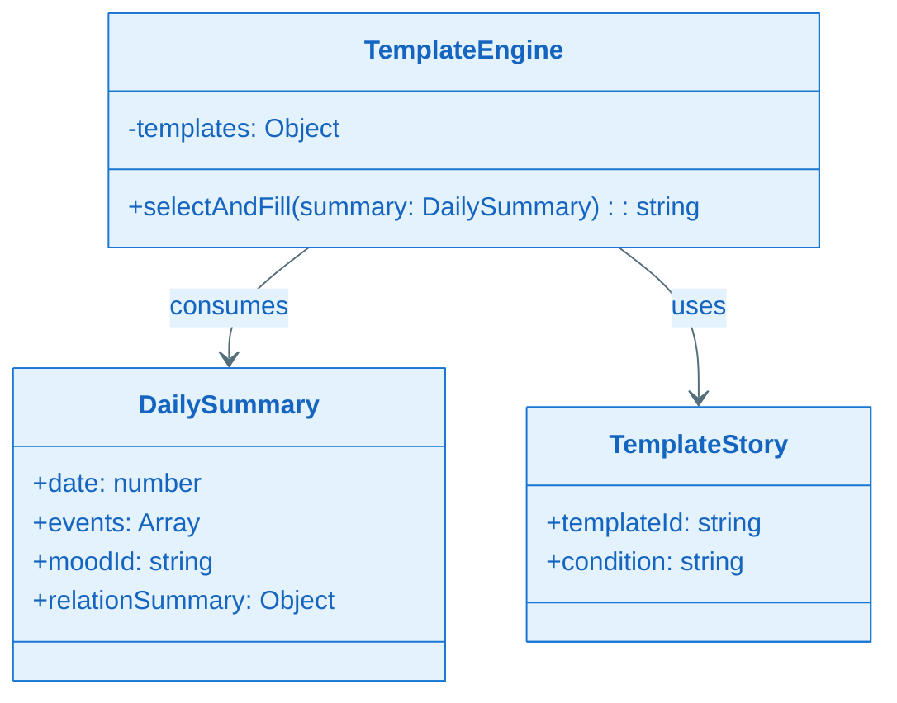
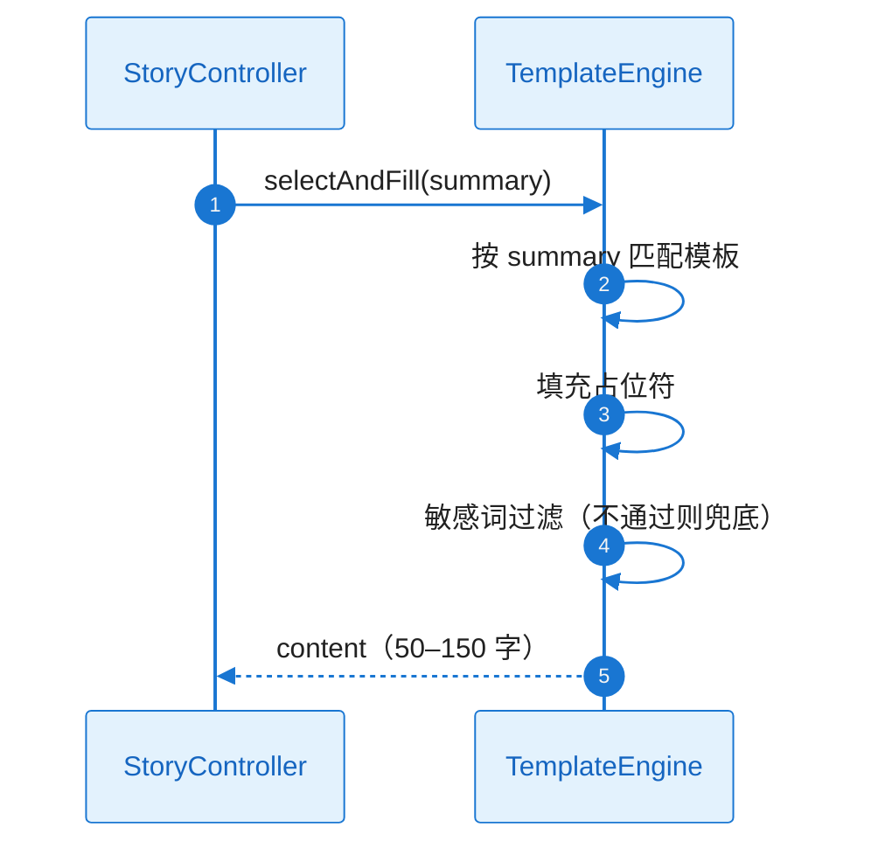
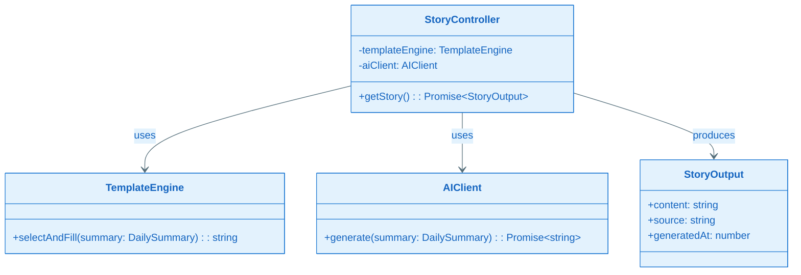
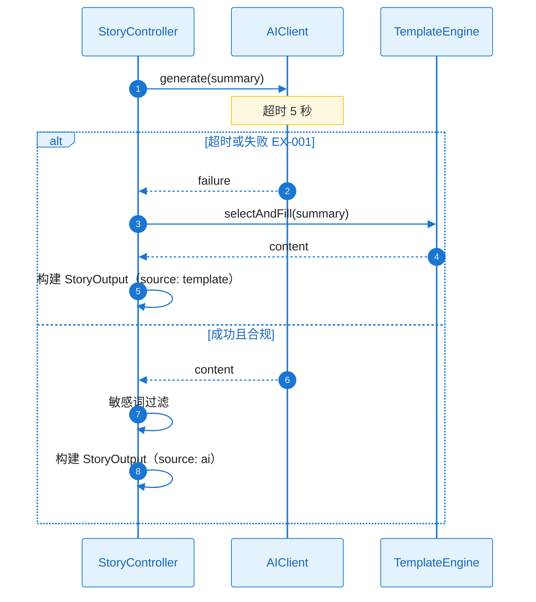
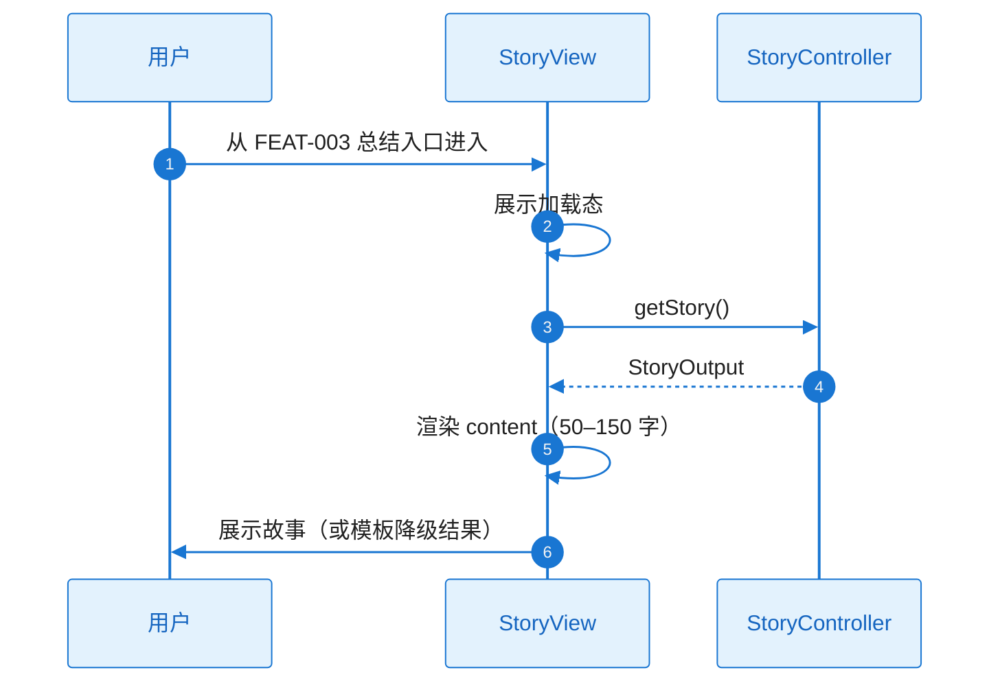

# L2 Story 详细设计（二层详细设计）

本文档与 **plan.md** 配套使用：当 Plan Level = Deep 时，各 Story 的 L2 详细设计在此文档中编写；plan.md 中通过「Story Detailed Design」章节引用本文档。

**Feature**：FEAT-006 - AI 小故事

---

## 文档约定

- 对每个 Story，必须同时覆盖：**需求描述**、**功能设计（类图/时序图/触发条件/系统响应）**。
- 类图、时序图须基于本工程实际架构与真实代码，遵循 `.cursor/rules/specify-diagram-requirements.mdc`。
- tasks.md 的每个 Task 应明确引用对应 Story 的详细设计入口（例如：`L2_story_detail_design.md:ST-001:功能设计:时序图`）。

---

### ST-001 Detailed Design：输入契约与当日数据聚合（Infrastructure）

#### 1) 需求及描述

- **需求描述**：对接 FEAT-003 getDailySummarySnapshot()、FEAT-005 getRelationSummary() 或约定键；DailySummary 结构与 B4.2 一致。关联 FR-002；NFR-REL-001。
- **需求依赖**：FEAT-003、FEAT-005 契约就绪。
- **使用范围**：StoryController 获取故事输入。
- **使用接口**：调用 FEAT-003 getDailySummarySnapshot()、FEAT-005 getRelationSummary()；组装 DailySummary（date, events, moodId, relationSummary）。
- **DoD（验收标准）**：
  - [ ] 可获取当日事件与关系摘要，作为故事输入（FR-002、NFR-REL-001）
  - [ ] 契约调用与数据结构单元测试通过

#### 2) 功能设计

##### 功能设计关键说明

**核心实现思路**：StoryController 或本 Story 提供的聚合层调用 FEAT-003 TownLifeController.getDailySummarySnapshot()、FEAT-005 RelationController.getRelationSummary()；将快照与 relationSummary 组装为 DailySummary（与 B4.2 一致），供 TemplateEngine/StoryController 消费。FEAT-003/005 未就绪时可用 Mock 或约定键兜底。**失败处理**：依赖不可用时返回空或默认 DailySummary，不崩溃；下游模板可处理“无活动”等默认故事。

##### 触发条件与系统响应

| 触发条件 | 系统响应（正常流程） | 异常处理 |
|----------|----------------------|----------|
| 获取故事输入 | 调用 FEAT-003/005 并组装 DailySummary | 依赖不可用：空或默认结构，下游模板兜底 |

##### 验证与测试设计

- 契约调用与 DailySummary 结构测试；Mock 依赖时的聚合逻辑。
- **引用入口**：`L2_story_detail_design.md:ST-001:功能设计`

---

### ST-002 Detailed Design：TemplateEngine 与模板库（Design-Enabler）

#### 1) 需求及描述

- **需求描述**：模板库（无活动/有场景/有事件/有互动等）；模板选择逻辑与 DailySummary 匹配；50–150 字日记式输出；敏感词过滤与兜底。关联 FR-003、FR-004、FR-005；NFR-REL-001、NFR-SEC-001。
- **需求依赖**：ST-001。
- **使用范围**：StoryController 在无 AI 或降级时调用。
- **使用接口**：TemplateEngine.selectAndFill(summary: DailySummary): string。
- **DoD（验收标准）**：
  - [ ] 无 AI 或降级时 100% 可输出合规故事（RISK-001、RISK-002）；敏感词兜底测试通过

#### 2) 功能设计

##### 功能设计关键说明

**核心实现思路**：模板库按条件（无活动、有场景、有事件、有互动等）与 DailySummary 匹配，选出适用模板；填充占位符（如日期、事件摘要、关系摘要）后输出 50–150 字日记式文本。敏感词过滤在输出前执行，不通过则替换为安全兜底句或换用更保守模板。**关键类与职责**：TemplateEngine、TemplateStory、DailySummary 与 plan A3.2.1 一致。**失败处理**：无匹配模板时使用默认“今天休息了一下”等；过滤失败必走兜底，不向用户展示不当内容。

##### 类图（与 plan A3.2.1 对应）

##### 时序图（模板路径）

##### 触发条件与系统响应

| 触发条件 | 系统响应（正常流程） | 异常处理 |
|----------|----------------------|----------|
| selectAndFill(summary) | 匹配模板并填充，返回 50–150 字 | 无匹配/过滤不通过：默认模板或兜底句 |

##### 验证与测试设计

- 模板选择与输出、敏感词兜底测试；无活动/有事件等条件覆盖。
- **引用入口**：`L2_story_detail_design.md:ST-002:功能设计:时序图`

---

### ST-003 Detailed Design：StoryController 与 AIClient（可选）（Design-Enabler）

#### 1) 需求及描述

- **需求描述**：StoryController 协调输入、调用 TemplateEngine 或 AIClient；超时 5 秒降级模板；AIClient 可选（外部 AI），失败即走模板。关联 FR-001、FR-003、FR-004；NFR-PERF-001、NFR-REL-001、NFR-OBS-001。
- **需求依赖**：ST-002。
- **使用范围**：StoryView 通过 getStory() 触发生成。
- **使用接口**：StoryController.getStory(): Promise<StoryOutput>；AIClient.generate(summary): Promise<string>（可选）。
- **DoD（验收标准）**：
  - [ ] 入口可触发生成；AI 故障时 100% 降级，不空白不崩溃（RISK-001）；超时与降级路径、日志/埋点测试通过

#### 2) 功能设计

##### 功能设计关键说明

**核心实现思路**：getStory() 先聚合 DailySummary（ST-001）；若使用 AI 则调用 AIClient.generate(summary)，超时 5 秒；成功且敏感词过滤通过则用 AI 内容构建 StoryOutput，否则调用 TemplateEngine.selectAndFill(summary) 降级。不使用 AI 或 AIClient 未接入时直接走模板。**关键类与职责**：StoryController、TemplateEngine、AIClient、DailySummary、StoryOutput 与 plan A3.2.1 一致。**失败处理**：AI 超时/失败/限流/不合规 → 100% 模板；敏感词不通过 → 模板兜底；关键路径打点（NFR-OBS-001）。

##### 类图（与 plan A3.2.1 对应）

##### 时序图（AI 超时降级 EX-001）

##### 触发条件与系统响应

| 触发条件 | 系统响应（正常流程） | 异常处理 |
|----------|----------------------|----------|
| getStory() | 聚合输入 → AI 或模板 → StoryOutput | EX-001：超时/失败/不合规 → 100% 模板 |

##### 验证与测试设计

- 超时与降级路径测试；日志/埋点；与 FEAT-003 入口衔接。
- **引用入口**：`L2_story_detail_design.md:ST-003:功能设计:时序图`

---

### ST-004 Detailed Design：今天的故事视图（Functional）

#### 1) 需求及描述

- **需求描述**：故事展示视图（日记式、50–150 字）；由 FEAT-003 总结入口进入；与 StoryController 绑定；加载态与错误态。关联 FR-001、FR-003；NFR-PERF-001、NFR-MEM-001。
- **需求依赖**：ST-003。
- **使用范围**：用户晚上进入「今天的故事」查看。
- **使用接口**：StoryView 调用 StoryController.getStory()，展示 StoryOutput.content；加载中与失败时展示加载态/错误态。
- **DoD（验收标准）**：
  - [ ] 用户可在晚上进入并看到故事（FR-001、FR-003）；响应 ≤500ms；AI 故障时仍见模板故事（NFR-PERF-001、NFR-MEM-001）

#### 2) 功能设计

##### 功能设计关键说明

**核心实现思路**：由 FEAT-003 navigateToStory() 进入本视图；挂载时调用 getStory()，展示加载态；成功则渲染 content（50–150 字日记式）；失败或降级仍展示模板故事，不空白。可展示 source（template/ai）用于调试或隐藏。**关键类与职责**：StoryView 表示层，依赖 StoryController。**失败处理**：getStory 内部已 100% 降级，视图仅需处理加载与最终 content 展示；网络或依赖异常时由 Controller 返回模板结果。

##### 时序图（用户进入并展示故事）

##### 触发条件与系统响应

| 触发条件 | 系统响应（正常流程） | 异常处理 |
|----------|----------------------|----------|
| 用户进入今天的故事 | getStory() → 展示 content | 内部已降级模板，视图不空白；可展示错误态仅当聚合完全不可用 |

##### 验证与测试设计

- E2E/手动：入口→故事展示；降级场景仍见模板故事；响应 ≤500ms。
- **引用入口**：`L2_story_detail_design.md:ST-004:功能设计:时序图`
