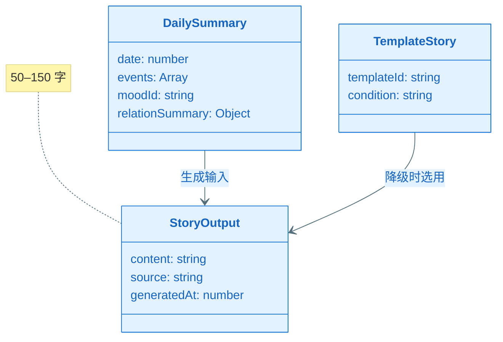
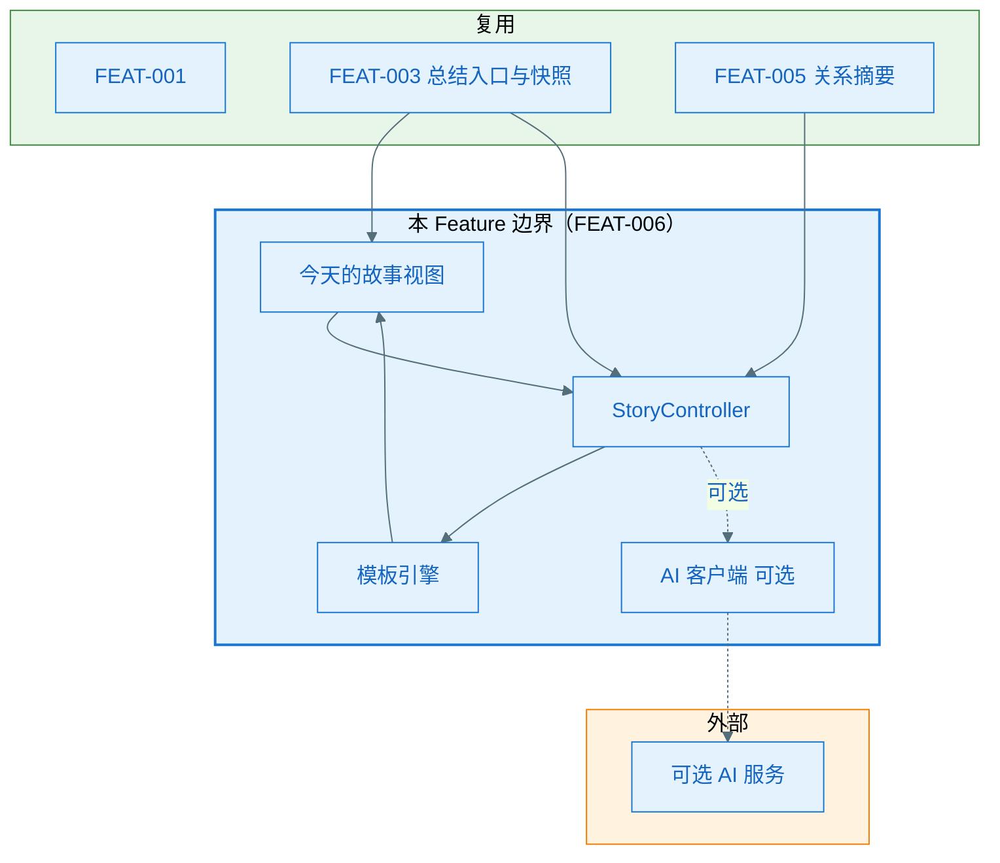
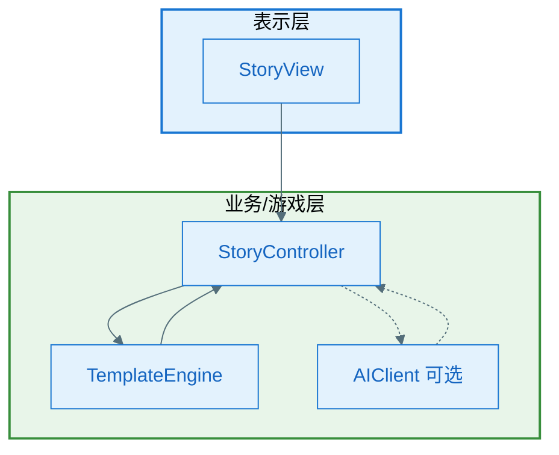
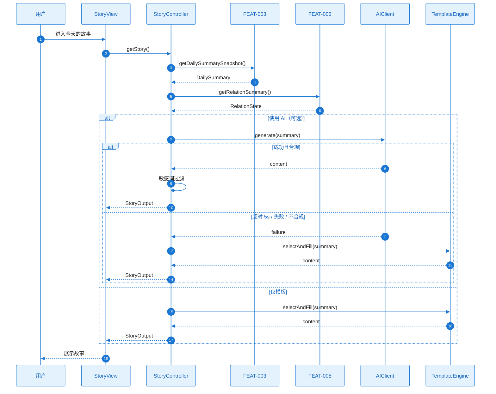
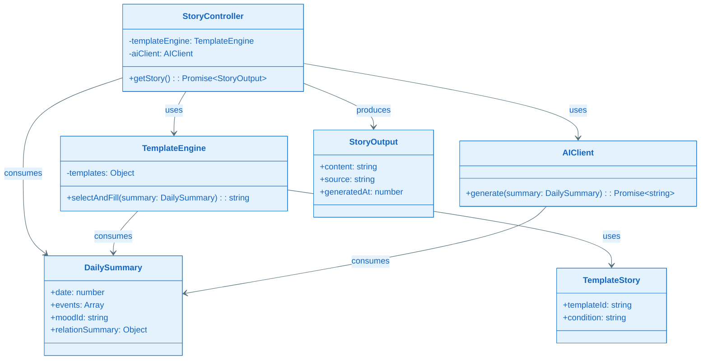
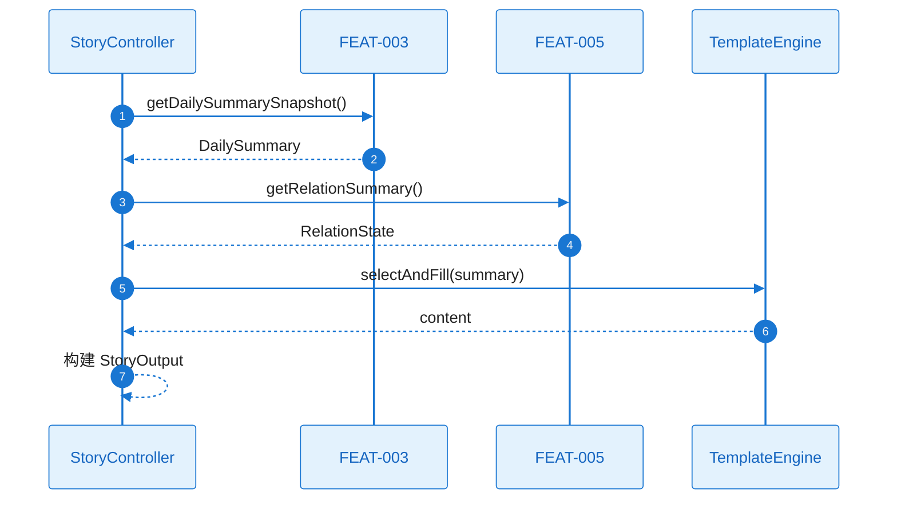
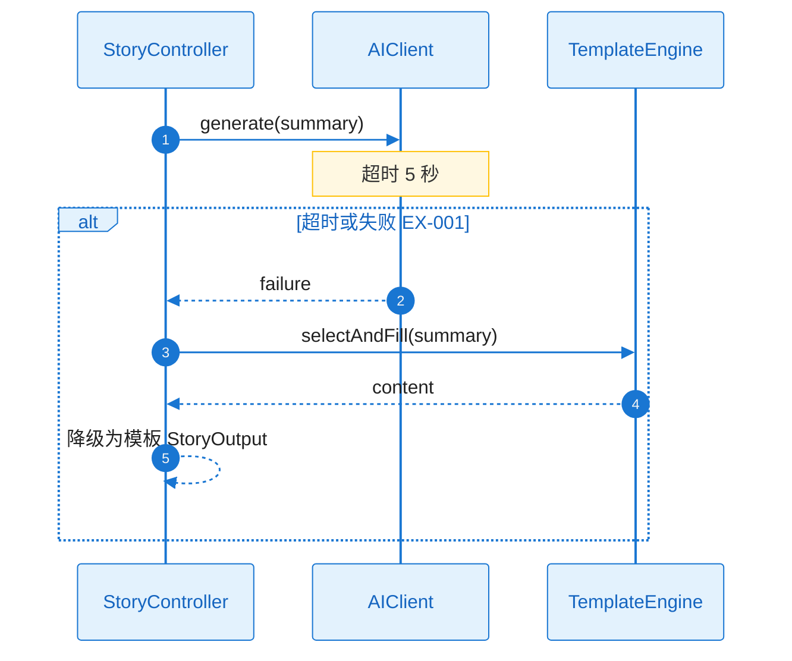
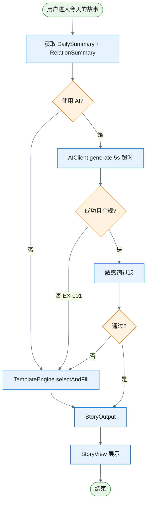

# Plan（工程级蓝图）：AI 小故事（日记式）

**Epic**：EPIC-003 - 星光小镇（Starlit Town）
**Feature ID**：FEAT-006
**Feature Version**：v0.1.0（来自 `spec.md`）
**Plan Version**：v0.1.0
**Plan Level**：Lite
**当前工作分支**：`epic/EPIC-003-starlit-town`
**Feature 目录**：`specs/epics/EPIC-003-starlit-town/features/FEAT-006-ai-story/`
**日期**：2025-02-05
**输入**：来自 `Feature 目录/spec.md`

> 规则：
> - Plan 阶段必须包含工程决策、风险评估与性能/合规验收指标。
> - **图表规范**：样式遵循 `.cursor/rules/mermaid-style-guide.mdc`；内容与结构须基于本工程实际架构与真实代码，遵循 `.cursor/rules/specify-diagram-requirements.mdc`。

## 变更记录（增量变更）

| 版本 | 日期 | 变更范围（Feature/Story/Task） | 变更摘要 | 影响模块 | 是否需要回滚设计 |
|---|---|---|---|---|---|
| v0.1.0 | 2025-02-05 | Feature | 初始版本 | — | 否 |

## Plan 前置检查（必须，在开始设计前完成）

### 前置检查清单

- [x] 已阅读 `epic.md` 的"跨 Feature 技术策略"章节
- [x] 已阅读 `epic-arch.md` 并在其 0 层/1 层架构与规范约束下做 A2、A3.1
- [x] 已确认本 Feature 在 Plan 执行顺序中的位置（顺序 6，依赖 FEAT-001、FEAT-003、FEAT-005；可选 FEAT-004）
- [x] 已检查前置 Feature 的 plan（FEAT-001/003/005 plan 已存在）
- [x] 本 Feature 不担任共享能力 Owner，消费 FEAT-003 总结入口与当日事件、FEAT-005 关系摘要

### 依赖的共享能力（从其他 Feature 复用）

| 依赖的共享能力 | Owner Feature | Owner Plan 状态 | 如何获取/引用 |
|---|---|---|---|
| 游戏入口、存储 | FEAT-001 | Plan Ready | FEAT-001 plan.md A3.2、Plan-B B4.1 |
| 晚上总结入口与当日事件数据 | FEAT-003 | Plan Ready | FEAT-003 plan.md A3.2、Plan-B B4.1；getDailySummarySnapshot() 或等价 |
| 互动记忆与关系摘要 | FEAT-005 | Plan Ready | FEAT-005 plan.md A3.2、Plan-B B4.1；getRelationSummary() 或等价 |
| 装扮等（可选） | FEAT-004 | Plan Ready | FEAT-004 可提供装扮摘要供故事引用，可选 |

### 本 Feature 提供的共享能力（供其他 Feature 复用）

| 共享能力名称 | 消费方 Feature | 设计位置（本 plan 章节） | 接口/契约位置 |
|---|---|---|---|
| 无 | — | — | — |

### 前置检查结论

- **检查日期**：2025-02-05
- **检查人**：SE/TL
- **结论**：通过
- **备注**：先模板化故事，AI 为可选增强；超时 5 秒降级为模板；故事 50–150 字；不强制持久化历史。

---

## 概述

本 Feature 实现晚上「今天的故事」：从 FEAT-003 总结入口进入；获取当日事件（FEAT-003 快照）与可选关系摘要（FEAT-005）；基于当日事件生成或选择简短、日记式故事（50–150 字）；支持 AI 生成或模板化降级；AI 不可用/超时（5 秒）/限流时 100% 降级为预设模板；内容需敏感词过滤与模板兜底以符合儿童合规。核心工程决策：初期以模板为主、AI 可选；故事当次可展示，不强制持久化历史；输入数据契约与 FEAT-003、FEAT-005 对齐。

## Plan-A：工程决策 & 风险评估（必须量化）

### A0. 领域概念（Domain Concepts / Glossary，必须）

#### A0.1 领域概念词汇表（必须）

| 概念（中文） | 名称（英文/代码名） | 定义（一句话） | 关键属性/状态（Top3） | 不变量/约束 | 关联概念 |
|---|---|---|---|---|---|
| 每日总结输入 | DailySummary | 当日事件与可选关系等快照 | date, events, moodId, relationSummary | 来自 FEAT-003/005 | StoryOutput |
| 故事输出 | StoryOutput | 展示用故事文本与来源 | content, source, generatedAt | content 50–150 字；source: AI/模板 | TemplateStory |
| 模板故事 | TemplateStory | 降级或默认时使用的预设故事 | templateId, condition | 适用条件如「无活动」「有互动」 | StoryOutput |

#### A0.2 概念关系图（推荐，可选）



### A1. 技术选型（候选方案对比 + 决策理由）

| 决策点 | 候选方案 | 优缺点 | 约束/风险 | 决策 | 决策理由 |
|---|---|---|---|---|---|
| 故事生成 | 仅模板 / 仅 AI / 模板+AI 降级 | 模板可控合规；AI 可增强 | AI 需超时与兜底 | 先模板，AI 可选；超时 5 秒走模板 | spec 澄清；NFR-REL-001 |
| 故事历史 | 不持久化 / 持久化 | 不持久化实现简单 | 无法回顾历史 | 当次可展示，不强制持久化历史 | spec 澄清 |
| 内容安全 | 仅模板 / AI+审核 | 模板无生成风险；AI 需兜底 | 儿童合规硬性 | 敏感词过滤 + 模板兜底 | spec 澄清、epic-arch |

### A2. Feature 全景架构（0 层框架图：边界 + 外部依赖）

#### A2.1 Feature 全景架构图（必须）

> 继承 epic-arch 的 0 层：本 Feature 覆盖「今日故事」在 EPIC 内边界；依赖 FEAT-001、FEAT-003（总结入口与当日事件）、FEAT-005（关系摘要）；可选外部 AI 服务；AI 故障时 100% 模板降级。



#### A2.1.1 架构设计说明（必须：理由/决策/思考）

- **边界与职责**：本 Feature 负责晚上「今天的故事」入口后的视图、获取当日输入、生成/选择故事与展示；不负责总结入口本身（FEAT-003）、长剧情或多结局。
- **分层与依赖方向**：表示层（StoryView）依赖业务层（StoryController）；业务层依赖 FEAT-003 快照、FEAT-005 关系摘要、模板引擎与可选 AI 客户端；禁止表示层直连外部 AI。
- **关键数据流**：DailySummary 来自 FEAT-003（及 FEAT-005 摘要）；StoryController 据此调用模板或 AI；输出 50–150 字，当次展示；不强制写回存储。
- **外部依赖策略**：AI 不可用/超时（5 秒）/限流/内容异常时 100% 降级为预设模板；敏感词过滤 + 模板兜底保证儿童合规。
- **可演进性**：模板库可扩展；AI 接口可替换；输入契约与 FEAT-003/005 已约定。

### A2.2 外部依赖清单（若有则必填，无依赖时标注 N/A）

| 依赖项 | 类型 | 提供方 | 提供的能力 | 通信方式 | 故障模式 | 我方策略 |
|--------|------|--------|-----------|----------|----------|----------|
| FEAT-003 当日快照 | 内部 | FEAT-003 | getDailySummarySnapshot() | 接口调用 | 无数据 | 使用空或默认快照，展示「今天休息了一下」等 |
| FEAT-005 关系摘要 | 内部 | FEAT-005 | getRelationSummary() | 接口调用 | 无数据 | 可选，无则模板不引用关系 |
| 外部 AI 服务（可选） | 外部 | 第三方 | 文本生成 | HTTP/API | 不可用/超时/限流/不合规 | 5 秒超时后 100% 模板降级；敏感词+模板兜底 |

#### A2.3 通信与交互约束（必须）

- **协议**：层间函数调用；与 FEAT-003/005 接口约定见 B4.2；AI 为可选 HTTP/API。
- **超时**：AI 调用超时阈值 5 秒，超时即走模板。
- **错误处理**：AI 失败或内容不合规不向用户展示异常，统一降级为模板；入口响应 ≤500ms（不含 AI 时）。
- **数据一致性**：故事为当次生成/选择结果，不强制与存储同步；输入与 FEAT-003/005 契约一致。

### A3. Feature 内部设计

#### A3.1 第一层：整体框架设计（必须）

##### A3.1.1 内部总体框架图（必须）

> 继承 epic-arch 的 1 层：表示层（StoryView）→ 业务层（StoryController、TemplateEngine、可选 AIClient）→ 依赖 FEAT-003/005 与可选外部 AI。



##### A3.1.2 总体设计说明（必须）

###### A3.1.2.1 组件清单与职责（必须）

| 组件 | 所属模块 | 职责（一句话） | 输入/输出 | 依赖 | 约束 |
|------|----------|----------------|-----------|------|------|
| StoryView | 表示层 | 展示「今天的故事」日记式文案与加载/错误态 | 用户进入 → 调用 StoryController 获取故事并展示 | StoryController | 入口响应 ≤500ms（不含 AI 等待） |
| StoryController | 业务层 | 获取当日输入、决定 AI 或模板、执行生成、敏感词与兜底 | 无入参 → 拉取快照与摘要、调用 AI 或模板、返回 StoryOutput | TemplateEngine, AIClient, FEAT-003, FEAT-005 | 超时 5 秒降级；100% 有内容 |
| TemplateEngine | 业务层 | 按条件选择并填充模板，输出 50–150 字 | DailySummary → 选模板 → 填充 → 文本 | 模板库/配置 | 无活动等默认模板 |
| AIClient | 业务层（可选） | 调用外部 AI 生成故事；超时与错误向上返回失败 | 输入摘要 → 请求 API → 文本或失败 | 外部 API | 超时 5 秒；失败则 Controller 走模板 |

###### A3.1.2.2 组件协作时序图（必须）



###### A3.1.2.3 关键设计决策（必须）

| 决策点 | 候选方案 | 决策 | 决策理由 | 影响范围 | 引用来源 |
|--------|----------|------|----------|----------|----------|
| 优先级 | 先 AI / 先模板 | 先模板，AI 可选 | spec 澄清 | StoryController | spec 澄清 |
| 超时 | 3s / 5s / 10s | 5 秒 | spec 澄清 | AIClient, StoryController | spec 澄清 |
| 内容安全 | 仅模板 / AI+兜底 | 敏感词过滤 + 模板兜底 | spec 澄清、NFR-SEC-001 | StoryController | spec 澄清 |

###### A3.1.2.4 主要风险与权衡

- **权衡点**：故事个性化（AI）vs 合规与可靠性——模板保证 100% 可用；AI 增强时严格超时与兜底。
- **已知风险**：AI 返回不合规内容 → 敏感词过滤 + 不通过则使用模板兜底，不向用户展示不当内容。

---

#### A3.2 第二层：Feature 全景（必须）

##### A3.2.1 全景类图（必须）



###### 关键类职责说明

| 类/接口 | 层级 | 职责 | 关键方法 |
|---------|------|------|----------|
| StoryController | 业务层 | 协调输入获取、AI/模板选择、生成与兜底 | getStory() |
| TemplateEngine | 业务层 | 按条件选模板并填充，输出 50–150 字 | selectAndFill() |
| AIClient | 业务层（可选） | 调用外部 AI，超时 5 秒 | generate() |
| DailySummary | 数据模型 | 当日事件与关系摘要（来自 FEAT-003/005） | — |
| StoryOutput | 数据模型 | 故事文本与来源 | content, source |
| TemplateStory | 数据/配置 | 模板与适用条件 | templateId, condition |

##### A3.2.2 Feature 时序图集（方法调用流程，必须）

| Seq ID | 流程名称 | 覆盖的异常（EX-xxx） |
|--------|----------|----------------------|
| SEQ-001 | 获取故事（模板路径） | — |
| SEQ-002 | 获取故事（AI 超时降级） | EX-001 |

###### SEQ-001：获取故事（模板路径）



###### SEQ-002：获取故事（AI 超时降级 EX-001）



##### A3.2.3 Feature 流程图集（逻辑流程，必须）

###### 流程 1：获取并展示故事



| 分支 | 异常ID | 触发条件 | 对策 |
|------|--------|----------|------|
| AI 超时/失败/不合规 | EX-001 | 5 秒超时或返回异常或内容不合规 | 100% 降级为模板故事 |

##### A3.2.4 关键设计详解（若适用）

- 模板选择条件：可按「无活动」「有场景无事件」「有事件」「有互动」等与 DailySummary 匹配；Implement 阶段细化。与 FEAT-003/005 的契约：DailySummary 与 RelationState 结构以 FEAT-003、FEAT-005 plan 的 B4.1 为准。

---

## Plan-B：技术规约 & 实现约束

### B0. Plan-A ↔ Plan-B 一致性与互校（必须）

| Plan-A（决策/假设/约束） | Plan-B（落点） | 自检规则（必须通过） |
|---|---|---|
| A0 领域概念命名 | B3/B4 | DailySummary、StoryOutput、TemplateStory 与 B3 一致 |
| A1 技术选型 | B2/B4 | 超时 5 秒、模板兜底、敏感词在 B2/B4 体现 |
| A2 输入契约 | B4.2 | 与 FEAT-003、FEAT-005 接口对齐 |

### B1. 技术背景（用于统一工程上下文）

**Language/Version**：JavaScript（ES6+），HTML5，CSS3  
**Primary Dependencies**：FEAT-003 getDailySummarySnapshot、FEAT-005 getRelationSummary；可选外部 AI API  
**Storage**：故事当次展示，不强制持久化历史；若持久化则可用 FEAT-001 约定键  
**Target Platform**：PC 与平板浏览器  
**Project Type**：web  
**Performance Targets**：入口响应 ≤500ms；AI 超时 5 秒后降级  
**Constraints**：儿童内容合规；AI 故障时 100% 模板；50–150 字  

### B2. 架构细化（实现必须遵循）

- **分层约束**：表示层不直连 FEAT-003/005 或 AI；业务层通过 StoryController 统一拉取输入与生成。
- **错误处理规范**：AI 失败或内容不合规不向用户暴露，统一降级为模板；入口不因 AI 挂起超过 5 秒。
- **日志与可观测性**：故事生成成功/降级/失败可日志（NFR-OBS-001）；便于内容质量与排查。

### B3. 数据模型（引用或内联）

#### B3.1 存储形态与边界（必须）

- **存储形态**：故事当次可展示，不强制持久化历史；若需历史可由 FEAT-001 键存储（如 `starlit.story.history`），本版可不实现。
- **System of Record**：当日输入以 FEAT-003/005 为准；故事输出为派生，来源 AI/模板。

#### B3.2 物理数据结构（若使用持久化存储则必填）

- 当次展示可不落库。若持久化故事历史：Key 如 `starlit.story.history`，value 为 Array<StoryOutput> 或按日存储；Schema 含 content、source、generatedAt。

### B4. 接口规范/协议（引用或内联）

#### B4.1 本 Feature 对外提供的接口（必须：Capability Feature/跨模块复用场景）

- 无对外共享能力；FEAT-003 通过导航进入本 Feature 的「今天的故事」视图并传入或由本 Feature 拉取 DailySummary。

#### B4.2 本 Feature 依赖的外部接口/契约（必须：存在外部依赖时）

- **FEAT-003**：`getDailySummarySnapshot(): DailySummary`（或等价）；结构含 date、events、moodId 等，见 FEAT-003 plan B3/B4.1。  
- **FEAT-005**：`getRelationSummary(): RelationState`（或等价）；结构见 FEAT-005 plan B3/B4.1。  
- **外部 AI（可选）**：API 契约（请求/响应、超时 5 秒、错误处理）；最小化上报数据，符合隐私与儿童合规。

### B5. 合规性检查（关卡）

- AI 生成内容需审核或模板兜底；敏感词过滤；不向用户展示不当内容；不向外部泄露用户当日活动详情（最小化数据与合规协议）。进入 Implement 前确认：模板库无不当内容；AI 兜底路径可验收。

### B6. 项目结构（本 Feature）

```text
specs/epics/EPIC-003-starlit-town/features/FEAT-006-ai-story/
├── spec.md
├── plan.md
├── tasks.md
└── checklists/
```

### B7. 源代码结构（代码库根目录）

与 EPIC Web 游戏目录一致，例如：

```text
starlit-town/
├── js/
│   ├── story/
│   │   ├── StoryController.js
│   │   ├── StoryView.js
│   │   ├── TemplateEngine.js
│   │   ├── AIClient.js
│   │   └── templates/
│   └── ...
```

**结构决策**：StoryController 协调输入与生成；TemplateEngine 与模板库集中管理；AIClient 可选；与 FEAT-003/005 的调用在 Controller 内完成，契约见 B4.2。
