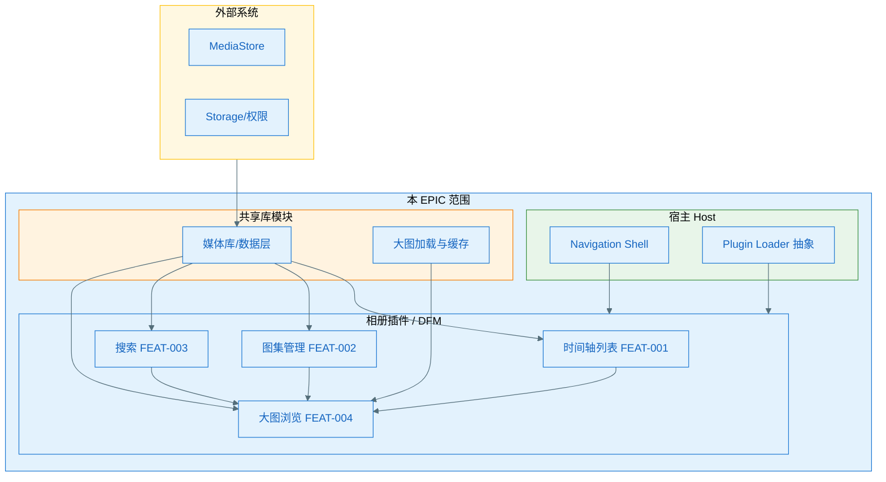
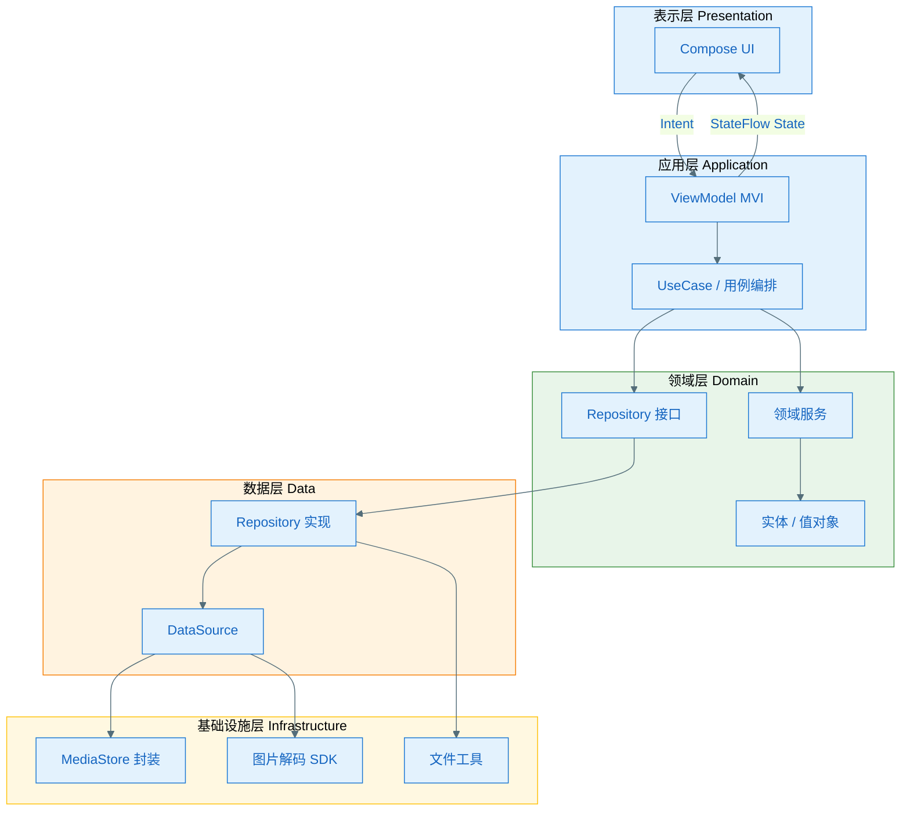

# EPIC 架构：EPIC-004 - Android 端相册 App 一期

（各 Feature 的 plan 的 A2/A3.1 须继承本架构；须基于现有工程代码，遵循 constitution。）

**Epic**：EPIC-004 - Android 端相册 App 一期
**Epic Version**：v0.1.9（来自 `epic.md`）
**epic-arch Version**：v0.1.0
**创建/更新日期**：2026-02-12
**输入**：`epic.md`、各 `features/*/spec.md`、现有工程代码、`.specify/memory/constitution.md`、用户架构约束

> **原则**：从**整个 EPIC 需求**整体看待与设计技术架构，保证各 Feature 的 plan 基于同一套 0 层/1 层与规范；须基于**现有工程代码**做演进式设计，遵循 constitution。本架构采纳用户指定的：插件化框架 + 轻量插件、DDD、MVI、Jetpack Compose、Kotlin 2.1.21。

## 0 层架构（EPIC 与外部/现有工程边界）

### 边界说明

- **本 EPIC 范围**：相册一期四大功能（时间轴、图集、搜索、大图），采用**插件化框架**组织；大功能模块以**插件 APK**（内销）或 **AAB DFM**（外销）交付，小子功能以**轻量插件**（AAR 动态加载）方式扩展。
- **外部依赖**：Android MediaStore、Storage Access Framework、存储与照片权限。
- **现有工程衔接**：宿主 App（`:app`）作为 Host，提供导航壳、插件加载与基础能力；本 EPIC 新增相册业务模块，可演进为插件或 DFM 形态；现有 `MainActivity` 与 Compose Theme 作为基础复用。

### 主要子系统/模块

| 模块                        | 形态           | 说明                                 |
| ------------------------- | ------------ | ---------------------------------- |
| **Host（宿主）**              | app 模块       | 主壳、导航、插件框架、基础设施                    |
| **Gallery Plugin（相册主模块）** | 插件 APK / DFM | 时间轴、图集、搜索、大图（四大 Feature 合一或按需拆分）   |
| **轻量插件（可选）**              | AAR 动态加载     | 小子功能如特定过滤器、格式扩展等                   |
| **媒体库/数据层**               | 库模块          | 共享 MediaStore 抽象与索引（由时间轴 Owner 设计） |
| **大图加载与缓存**               | 库模块          | 大图采样、解码、缓存（由大图浏览 Owner 设计）         |

### 0 层架构图

### 插件化策略（内销 vs 外销）

| 发行形态     | 插件形态            | 加载方式                                            | 框架/技术                         |
| -------- | --------------- | ----------------------------------------------- | ----------------------------- |
| **内销**   | 插件 APK          | 运行时加载、侧载                                        | Shadow / VirtualAPK 等插件框架     |
| **外销**   | AAB DFM         | Play Feature Delivery（install-time / on-demand） | Play Core Library、SplitCompat |
| **统一抽象** | `IPluginLoader` | 内销实现加载 APK，外销实现加载 DFM                           | 通过 Build Variant 切换实现类        |

### 轻量插件（小子功能）

| 项目     | 说明                                                         |
| ------ | ---------------------------------------------------------- |
| **形态** | AAR 包（类、资源、可选 .so）                                         |
| **加载** | 动态下载 → DexClassLoader 加载类 + AssetManager.addAssetPath 加载资源 |
| **接口** | 宿主定义接口，轻量插件实现；宿主 ClassLoader 加载接口，插件 ClassLoader 加载实现      |
| **适用** | 体积小、独立可替换的子能力（如特定滤镜、格式扩展等）                                 |

## 1 层架构（分层与模块职责）

### 分层说明（DDD + 四层）

| 层级        | 名称             | 职责                               | 与现有工程对应                       |
| --------- | -------------- | -------------------------------- | ----------------------------- |
| **应用层**   | Application    | 应用逻辑、用例编排、MVI Intent 处理          | 新增，对应 ViewModel / UseCase 调用链 |
| **领域层**   | Domain         | 业务逻辑、业务规则、领域服务、实体与值对象            | 新增                            |
| **数据层**   | Data           | Repository 实现、DataSource、本地/远程数据 | 新增                            |
| **基础设施层** | Infrastructure | 基础工具、SDK 封装、MediaStore 封装、文件访问   | 新增或复用现有工具                     |

依赖方向：应用层 → 领域层 → 数据层；基础设施层被数据层与领域层依赖，不反向依赖业务。

### MVI 架构约定

- **State**：不可变数据类，表示 UI 与业务状态。
- **Intent**：用户意图（点击、滑动、输入等）或系统事件。
- **Reducer**：`(State, Intent) -> State`，纯函数更新状态。
- **ViewModel**：接收 Intent，调用 UseCase/Repository，通过 Reducer 产出新 State，经 `StateFlow` 导出；不直接持有可变的 UI 引用。
- **UI**：Compose 消费 `stateFlow.collectAsState()`，根据 State 渲染；发送 Intent 至 ViewModel。

### 模块职责

| 模块       | 职责                             | Owner Feature |
| -------- | ------------------------------ | ------------- |
| 媒体库/数据层  | MediaStore 抽象、索引、媒体项查询、图集 CRUD | FEAT-001      |
| 列表 UI/导航 | 网格列表、快滑条、日/月/年切换、进入大图契约        | FEAT-001      |
| 大图加载与缓存  | 大图采样、解码、内存缓存、Bitmap 回收         | FEAT-004      |

### 1 层架构图

## 规范与约束（所有 Feature plan 必须遵守）

### 技术栈

| 项目         | 约定                              |
| ---------- | ------------------------------- |
| **语言**     | Kotlin 2.1.21                   |
| **UI**     | Jetpack Compose                 |
| **构建**     | Gradle Kotlin DSL               |
| **最低 API** | Android 10（API 29，与 epic.md 一致） |
| **目标 API** | Android 15（API 35）              |
| **架构**     | DDD 四层 + MVI                    |
| **依赖注入**   | Hilt（推荐，Plan 阶段落实）              |

### 分层与依赖

- **依赖方向**：表示层 → 应用层 → 领域层 ← 数据层；基础设施层仅被数据层/领域层依赖。
- **禁止**：领域层、数据层不得依赖 Android UI 或 ViewModel；基础设施层不得依赖业务层。
- **模块边界**：媒体库/数据层、大图加载由指定 Feature Owner 设计，其他 Feature 通过接口消费。

### 接口与契约

- **跨 Feature**：Repository 接口定义在领域层；媒体项、图集等实体在领域层共享。
- **错误语义**：使用 `Result<T>` 或 `sealed class` 表示成功/失败，不抛未捕获异常到 UI。
- **线程**：IO 操作统一在 `Dispatchers.IO`；主线程仅处理 UI 与 State 更新。

### 插件化与构建

- **插件框架选型**：须同时支持内销插件 APK 与外销 AAB DFM；通过 Product Flavor（如 `domestic` / `overseas`）或 Build Variant 切换 `IPluginLoader` 实现。
- **轻量插件**：AAR 形态通过 DexClassLoader + AssetManager 加载；宿主接口、插件实现分离，避免 ClassLoader 冲突。
- **演进路径**：一期可先采用单模块（`:app` + `:feature-gallery`）实现，接口与分包按插件化预留；后续再拆分为插件 APK / DFM。

### 其他约束

- **安全**：仅访问用户授权的媒体库与存储；遵守 Android 存储与隐私规范。
- **性能**：列表缩图即滑即现无白块；大图进入无黑图、滑动丝滑；内存可控（见 epic.md NFR）。
- **可观测性**：本期可不实现埋点；若引入需统一事件口径。

## 与「跨 Feature 技术策略」的对应

| epic-arch 章节 | epic.md「跨 Feature 技术策略」对应项                   |
| ------------ | -------------------------------------------- |
| 0 层架构图       | 共享能力识别（媒体库/数据层、列表 UI、大图加载）、Feature Plan 执行顺序 |
| 1 层架构图       | 共享能力识别、技术约束（分层、依赖方向）                         |
| 规范与约束        | 技术约束（媒体库复用、列表契约、大图加载责任）、插件化与 DDD/MVI 约定      |
| 插件化策略        | 内销插件 APK、外销 AAB DFM 兼容；轻量插件 AAR 动态加载         |

## 变更记录（增量变更）

| 版本     | 日期         | 变更范围 | 变更摘要                                       | 影响 Feature / plan |
| ------ | ---------- | ---- | ------------------------------------------ | ----------------- |
| v0.1.0 | 2026-02-12 | 初始   | 初版：插件化 + DDD + MVI + Compose，Kotlin 2.1.21 | —                 |
