# Plan（工程级蓝图）：时间轴列表浏览

**Epic**：EPIC-004 - Android 端相册 App 一期
**Feature ID**：FEAT-001
**Feature Version**：v0.1.2（来自 `spec.md`）
**Plan Version**：v0.1.8
**Plan Level**：Deep
**当前工作分支**：`epic/EPIC-004-android-gallery`
**Feature 目录**：`specs/epics/EPIC-004-android-gallery/features/FEAT-001-timeline-list/`
**日期**：2026-02-12
**输入**：来自 `Feature 目录/spec.md`

## 变更记录（增量变更）

| 版本     | 日期         | 变更范围（Feature/Story/Task） | 变更摘要                                        | 影响模块                 | 是否需要回滚设计 |
| ------ | ---------- | ------------------------ | ------------------------------------------- | -------------------- | -------- |
| v0.1.0 | 2026-02-12 | Feature                  | 初始版本，Lite 阶段                                |                      | 否        |
| v0.1.1 | 2026-02-12 | 概述、A3                    | 由 feature-update 级联：日/月/年视图切换自然过渡动画、视觉焦点保持  | FR-002, NFR-PERF-003 | 否        |
| v0.1.2 | 2026-02-12 | A3.2.1                   | 修正 Mermaid 语法：菱形节点加引号、空态节点移除易混淆字符           | 流程 1                 | 否        |
| v0.1.3 | 2026-02-12 | Standard 阶段              | A3.3、Story Breakdown、A4-A11                 | 全文                   | 否        |
| v0.1.4 | 2026-02-12 | A3.2.4                   | 疑难点 4 双指捏合与日/月/年视图切换、疑难点 5 点击进入大图共享元素过渡实现方案 | FR-003, FR-006       | 否        |
| v0.1.5 | 2026-02-12 | A0.3、A3.2.2              | DDD 与面向对象 7 大原则对应表、关键类职责 DDD/原则列            | 对齐 epic-arch         | 否        |
| v0.1.6 | 2026-02-12 | A2.1.1、A3.2.2            | 明确时间轴单屏、日/月/年为 viewMode 三种展示模式               | 澄清界面结构           | 否        |
| v0.1.7 | 2026-02-14 | Deep 阶段                 | Story Detailed Design（L2）：ST-001～ST-005，见 story_detail_design.md | Story Detailed Design | 否        |
| v0.1.8 | 2026-02-14 | A3.2 Story 依赖图         | 移除 Story 依赖图中节点标签的 `<br/>`，改为单行文本 | Mermaid 渲染          | 否        |

## Plan 前置检查（必须，在开始设计前完成）

### 前置检查清单

- [x] 已阅读 `epic.md` 的"跨 Feature 技术策略"章节
- [x] 若 EPIC 根下存在 **`epic-arch.md`**，已阅读并在其 **0 层/1 层架构与规范约束**下做 A2、A3.1（不得脱离 EPIC 架构另画一套）；已对齐 **DDD 设计要点**与**面向对象 7 大原则**
- [x] 已确认本 Feature 在 Plan 执行顺序中的位置（顺序 1，无前置依赖）
- [x] 已检查前置 Feature 的 plan（如果存在），识别可复用组件（无前置）
- [x] 本 Feature 需要设计的共享能力已在 EPIC 级登记为 Owner

### 依赖的共享能力（从其他 Feature 复用）

| 依赖的共享能力 | Owner Feature | Owner Plan 状态 | 如何获取/引用               |
| ------- | ------------- | ------------- | --------------------- |
| 无       | —             | —             | 本 Feature 为基础 Feature |

### 本 Feature 提供的共享能力（供其他 Feature 复用）

| 共享能力名称   | 消费方 Feature                  | 设计位置（本 plan 章节）        | 接口/契约位置                                 |
| -------- | ---------------------------- | ---------------------- | --------------------------------------- |
| 媒体库/数据层  | FEAT-002, FEAT-003, FEAT-004 | A3.1、A3.2、Plan-B B3/B4 | Plan-B:B4.1 MediaRepository 接口          |
| 列表 UI/导航 | FEAT-002, FEAT-003           | A3.2、Plan-B B4.1       | Plan-B:B4.1 进入大图契约（MediaViewerEntry 契约） |

### 前置检查结论

- **检查日期**：2026-02-12
- **结论**：通过
- **备注**：本 Feature 为媒体库/数据层与列表 UI/导航的 Owner，其他 Feature 须复用本 plan 定义的接口与契约。

---

## 概述

从系统媒体库按时间轴展示照片列表，支持日/月/年视图切换、双指无极缩放（日 3/6 列、月 15 列、年 32 列）、快滑条与筛选，点击进入大图入口。作为相册核心入口，本 Feature 负责设计**媒体库/数据层**与**列表 UI/导航**，供图集、搜索、大图浏览复用。

**视图切换体验约束**（NFR-PERF-003）：日/月/年视图切换时需有自然过渡动画；切换后**视觉焦点保持**——用户在当前视图所见的媒体项，切换至月/年视图后仍为视觉焦点，不得直接刷新跳至新视图顶部。

**关键工程决策**：一期采用单模块演进（`:app` + `:feature-gallery`），媒体库抽象与 Repository 接口定义在 `:feature-gallery` 内，按 epic-arch 的 **DDD 四层 + MVI** 组织，设计方案须显式遵循 **DDD 设计要点**与**面向对象 7 大原则**（见 epic-arch 规范与约束）；接口与分包按后续拆分为 `:gallery-media` 库模块预留。

## Plan-A：工程决策 & 风险评估（必须量化）

### A0. 领域概念（Domain Concepts / Glossary，必须）

#### A0.1 领域概念词汇表（必须）

| 概念（中文）  | 名称（英文/代码名）         | 定义（一句话）             | 关键属性/状态（Top3）                       | 不变量/约束             | 关联概念  |
| ------- | ------------------ | ------------------- | ----------------------------------- | ------------------ | ----- |
| 媒体项     | MediaItem          | 来自系统媒体库的照片/视频元数据    | id, contentUri, dateTaken, mimeType | 来自 MediaStore 权威来源 | 时间轴分组 |
| 时间轴分组   | TimelineGroup      | 按日/月/年维度的分组单位       | groupKey, items, dateLabel          | groupKey 与视图维度一致   | 媒体项   |
| 视图维度    | TimelineViewMode   | 日/月/年视图枚举           | Day, Month, Year                    | 决定列数与日期显示          | 时间轴分组 |
| 筛选条件    | FilterCondition    | 用户选择的过滤条件（仅照片、按类型等） | mediaTypeFilter                     | 可选                 | 媒体项   |
| 进入大图上下文 | MediaViewerContext | 传递给大图浏览的上下文         | itemList, currentIndex, source      | 由列表提供              | 媒体项   |

#### A0.2 概念关系图（推荐，可选）

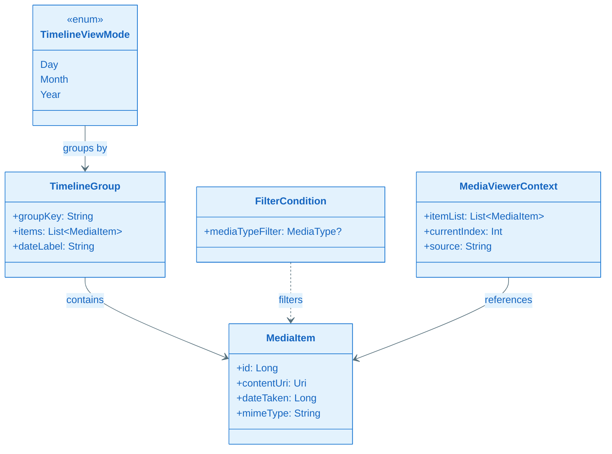
```mermaid
%%{init: {'theme': 'base', 'themeVariables': { 'primaryColor': '#E3F2FD', 'primaryTextColor': '#1565C0', 'primaryBorderColor': '#1976D2', 'lineColor': '#546E7A'}}}%%
classDiagram
    direction TB

    class MediaItem {
        +id: Long
        +contentUri: Uri
        +dateTaken: Long
        +mimeType: String
    }

    class TimelineGroup {
        +groupKey: String
        +items: List~MediaItem~
        +dateLabel: String
    }

    class TimelineViewMode {
        <<enum>>
        Day
        Month
        Year
    }

    class FilterCondition {
        +mediaTypeFilter: MediaType?
    }

    class MediaViewerContext {
        +itemList: List~MediaItem~
        +currentIndex: Int
        +source: String
    }

    TimelineGroup --> MediaItem : contains
    TimelineViewMode --> TimelineGroup : groups by
    FilterCondition ..> MediaItem : filters
    MediaViewerContext --> MediaItem : references
```

#### A0.3 DDD 与面向对象原则对应（须对齐 epic-arch）

| 领域概念                     | DDD 类型                    | 7 大原则体现                                       |
| ------------------------ | ------------------------- | --------------------------------------------- |
| **MediaItem**            | 实体 (Entity)，id 为 identity | 不可变 data class；聚合根                            |
| **TimelineViewMode**     | 值对象 (Value Object)        | 无 identity，枚举或 sealed；OCP 扩展新维度时增加 case       |
| **FilterCondition**      | 值对象                       | sealed 扩展；OCP                                 |
| **TimelineGroup**        | 值对象 / 领域模型                | 由 MediaItem 分组而成，无独立持久化                       |
| **MediaViewerContext**   | 值对象，跨 Feature 契约          | 不可变；迪米特法则：通过契约传递，不暴露 Repository               |
| **MediaRepository**      | Repository 接口（领域层）        | DIP：ViewModel 依赖接口；ISP：仅媒体查询，与 Album 分离       |
| **MediaRepositoryImpl**  | Repository 实现（数据层）        | SRP：仅实现数据获取；LSP：可替换 MediaRepository           |
| **MediaStoreDataSource** | DataSource（数据层）           | SRP：仅 ContentResolver 封装；组合复用：被 Repository 组合 |
| **TimelineViewModel**    | 应用层编排                     | SRP：仅处理 Intent 与 State；合成复用：组合 Repository     |
| **TimelineError**        | 领域错误类型                    | sealed 扩展；OCP                                 |

**分组逻辑**：按日/月/年分组建议抽为领域服务 `TimelineGroupingService.group(flow, viewMode): Flow<GroupedMedia>`，ViewModel 不直接操作原始 PagingData 分组，符合 SRP 与领域层职责。

### A1. 技术方案选型

#### 1. 媒体库访问方式

| 方案                         | 优势                    | 劣势                             |
| -------------------------- | --------------------- | ------------------------------ |
| 方案 A：直接 MediaStore API     | 无额外依赖、系统原生            | 需自行处理 ContentResolver、投影、排序、分页 |
| 方案 B：Paging 3 + MediaStore | 内置分页、异步、与 Compose 集成好 | 增加 Paging 依赖与适配器编写             |

**采用方案 B**。理由：列表需支持大量媒体项、即滑即现（NFR-PERF-002），Paging 3 提供分页与预取，与 Compose LazyVerticalGrid 结合可满足性能要求；现有工程无 MediaStore 封装，新增 Paging 成本可控。

#### 2. 缩图加载

| 方案                                   | 优势                      | 劣势                       |
| ------------------------------------ | ----------------------- | ------------------------ |
| 方案 A：Glide                           | 成熟、缩略图支持好、内存管理完善        | 额外依赖                     |
| 方案 B：Coil                            | Kotlin 优先、Compose 支持、轻量 | 媒体库缩略图需 load(ContentUri) |
| 方案 C：手动 BitmapFactory + inSampleSize | 无依赖                     | 需自行实现缓存、回收、占位            |

**采用方案 B（Coil）**。理由：项目已用 Compose，Coil 的 `AsyncImage` 与 Compose 集成好；支持 ContentUri、placeholder、内存缓存；比 Glide 更轻量，与 Kotlin 生态一致。

#### 3. 日/月/年切换与快滑条

| 方案                                  | 优势   | 劣势          |
| ----------------------------------- | ---- | ----------- |
| 方案 A：单一 LazyVerticalGrid + 分组头      | 结构简单 | 快滑条需自定义计算位置 |
| 方案 B：LazyVerticalStaggeredGrid + 分组 | 符合需求 | 需实现快滑条与分组映射 |

**采用方案 A**。理由：使用 `LazyVerticalGrid` + 分组标题 item（`item { DateHeader(...) }`）；快滑条通过 `LazyListState` 的 `firstVisibleItemIndex` 与分组数据映射到日期；实现路径清晰，易于多语言日期格式化（`DateFormat` / `SimpleDateFormat` 配合 `Locale`）。**视图切换保持焦点**：切换前记录当前可见的媒体项（如 firstVisibleItem 对应的 MediaItem.id 或 dateTaken）；切换后按该媒体项在新视图分组中的位置滚动定位，并使用 `animateScrollToItem` 实现自然过渡，避免直接 `scrollToItem(0)` 导致跳至顶部。

### A2. Feature 0层设计

#### A2.1 Feature 0层架构图（必须）

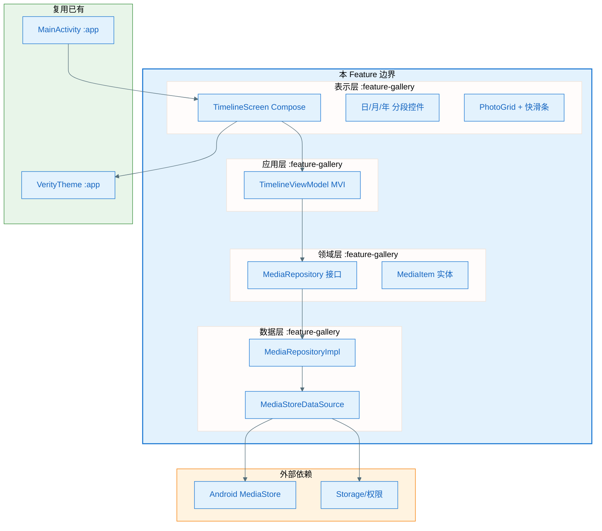
```mermaid
%%{init: {'theme': 'base', 'themeVariables': { 'primaryColor': '#E3F2FD', 'primaryTextColor': '#1565C0', 'primaryBorderColor': '#1976D2', 'lineColor': '#546E7A'}}}%%
flowchart TB
    subgraph FeatureBoundary["本 Feature 边界"]
        subgraph UILayer["表示层 :feature-gallery"]
            TimelineScreen["TimelineScreen Compose"]
            SegmentedBar["日/月/年 分段控件"]
            PhotoGrid["PhotoGrid + 快滑条"]
        end
        subgraph AppLayer["应用层 :feature-gallery"]
            TimelineViewModel["TimelineViewModel MVI"]
        end
        subgraph DomainLayer["领域层 :feature-gallery"]
            MediaRepository["MediaRepository 接口"]
            MediaItemEntity["MediaItem 实体"]
        end
        subgraph DataLayer["数据层 :feature-gallery"]
            MediaRepositoryImpl["MediaRepositoryImpl"]
            MediaStoreDataSource["MediaStoreDataSource"]
        end
    end

    subgraph Reused["复用已有"]
        MainActivity["MainActivity :app"]
        VerityTheme["VerityTheme :app"]
    end

    subgraph External["外部依赖"]
        MediaStore["Android MediaStore"]
        Storage["Storage/权限"]
    end

    MainActivity --> TimelineScreen
    TimelineScreen --> TimelineViewModel
    TimelineViewModel --> MediaRepository
    MediaRepository --> MediaRepositoryImpl
    MediaRepositoryImpl --> MediaStoreDataSource
    MediaStoreDataSource --> MediaStore
    MediaStoreDataSource --> Storage
    TimelineScreen --> VerityTheme

    style FeatureBoundary fill:#E3F2FD,stroke:#1976D2,stroke-width:2px
    style Reused fill:#E8F5E9,stroke:#388E3C
    style External fill:#FFF3E0,stroke:#F57C00
```

#### A2.1.1 架构设计说明（必须）

- **界面与视图模式**：时间轴仅有一个 **TimelineScreen**（单屏）。**日视图、月视图、年视图**不是三个独立 Screen，而是该屏幕内由 **TimelineViewMode**（Day / Month / Year）驱动的三种展示模式：顶栏「日/月/年」分段控件（SegmentedBar）切换 `viewMode`，同一 LazyVerticalGrid 根据 `viewMode` 切换列数（日 3/6、月 15、年 32）与分组维度（按日/月/年分组），数据来自同一 `MediaRepository.getMediaPager(viewMode, filter)`。
- **边界与职责**：本 Feature 负责时间轴列表的完整数据流与 UI，包括 MediaStore 抽象（供 FEAT-002、003、004 复用）、列表展示、进入大图契约。Out of Scope：大图具体实现、图集 CRUD、搜索 UI。
- **分层与依赖方向**：表示层 → 应用层 → 领域层 ← 数据层；UI 不直连 DataSource。
- **关键数据流**：MediaStore 为 System of Record；通过 Paging 3 分页加载，内存缓存由 Coil 负责；列表 state 由 ViewModel 的 MVI StateFlow 管理。
- **外部依赖策略**：MediaStore 不可用时返回空/错误，UI 展示空态或引导授权；权限拒绝时提示并引导设置，不崩溃。
- **可演进性**：MediaRepository 接口、MediaViewerContext 契约预留；后续可拆出 `:gallery-media` 库模块。

#### A2.2 外部依赖清单

| 依赖项        | 类型     | 提供方      | 提供的能力   | 通信方式            | 故障模式     | 我方策略      |
| ---------- | ------ | -------- | ------- | --------------- | -------- | --------- |
| MediaStore | OS/SDK | Android  | 媒体元数据查询 | ContentResolver | 权限拒绝/不可用 | 空态+引导授权   |
| 存储/照片权限    | OS     | Android  | 媒体库访问   | 运行时权限 API       | 用户拒绝     | 引导授权、降级展示 |
| Coil       | 第三方    | Coil     | 缩图加载、缓存 | 库 API           | 加载失败     | 占位图、错误态   |
| Paging 3   | 第三方    | AndroidX | 分页      | 库 API           | —        | —         |

#### A2.3 通信与交互约束

- **协议**：函数调用、ContentResolver 查询、系统权限 API
- **超时与重试**：MediaStore 查询在主线程外（Dispatchers.IO），无网络故不设超时；权限申请走系统流程
- **错误处理**：使用 `Result<T>` 或 `sealed class` 表示成功/失败；UI 通过 State 的 error 字段展示
- **数据一致性**：MediaStore 为权威；列表通过 Paging 的 refresh 或 ContentObserver 反映变更

### A3. Feature 1层设计

#### A3.1 第一层：整体框架设计（必须）

##### A3.1.1 内部总体框架图（必须）

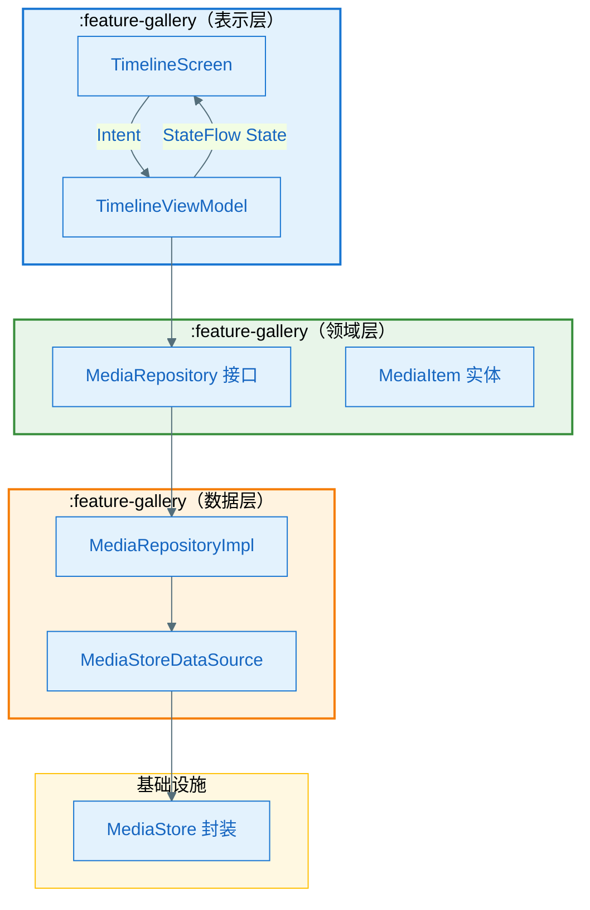
```mermaid
%%{init: {'theme': 'base', 'themeVariables': { 'primaryColor': '#E3F2FD', 'primaryTextColor': '#1565C0', 'primaryBorderColor': '#1976D2', 'lineColor': '#546E7A'}}}%%
flowchart TB
    subgraph UILayer[":feature-gallery（表示层）"]
        TimelineScreen["TimelineScreen"]
        TimelineViewModel["TimelineViewModel"]
    end

    subgraph DomainLayer[":feature-gallery（领域层）"]
        MediaRepository["MediaRepository 接口"]
        MediaItemEntity["MediaItem 实体"]
    end

    subgraph DataLayer[":feature-gallery（数据层）"]
        MediaRepositoryImpl["MediaRepositoryImpl"]
        MediaStoreDataSource["MediaStoreDataSource"]
    end

    subgraph Infra["基础设施"]
        MediaStoreWrap["MediaStore 封装"]
    end

    TimelineScreen -->|Intent| TimelineViewModel
    TimelineViewModel -->|StateFlow State| TimelineScreen
    TimelineViewModel --> MediaRepository
    MediaRepository --> MediaRepositoryImpl
    MediaRepositoryImpl --> MediaStoreDataSource
    MediaStoreDataSource --> MediaStoreWrap

    style UILayer fill:#E3F2FD,stroke:#1976D2,stroke-width:2px
    style DomainLayer fill:#E8F5E9,stroke:#388E3C,stroke-width:2px
    style DataLayer fill:#FFF3E0,stroke:#F57C00,stroke-width:2px
    style Infra fill:#FFF8E1,stroke:#FFC107
```

**跨层约束**：UI 不得直接依赖 MediaStoreDataSource；Domain 不得依赖 UI

##### A3.1.2 总体设计说明

###### A3.1.2.1 组件清单与职责（必须）

| 组件                   | 所属模块             | 职责（一句话）                              | 输入/输出                  | 依赖                   | 约束                             |
| -------------------- | ---------------- | ------------------------------------ | ---------------------- | -------------------- | ------------------------------ |
| TimelineScreen       | :feature-gallery | 时间轴列表 Compose UI，日/月/年切换、快滑条、网格、进入大图 | 用户操作 → UI 渲染           | TimelineViewModel    | 主线程                            |
| TimelineViewModel    | :feature-gallery | MVI 状态管理，处理 Intent，调用 Repository     | Intent → StateFlow     | MediaRepository      | 主线程发 State，IO 在 Dispatchers.IO |
| MediaRepository      | :feature-gallery | 媒体项查询抽象                              | 查询条件 → Flow/PagingData | —                    | 接口定义在领域层                       |
| MediaRepositoryImpl  | :feature-gallery | 实现 MediaStore 查询与 Paging             | 同上                     | MediaStoreDataSource | Dispatchers.IO                 |
| MediaStoreDataSource | :feature-gallery | MediaStore ContentResolver 封装        | 查询参数 → List/Flow       | MediaStore           | Dispatchers.IO                 |
| MediaItem            | :feature-gallery | 媒体项实体                                | —                      | —                    | 不可变数据类                         |

###### A3.1.2.2 组件协作时序图（必须）

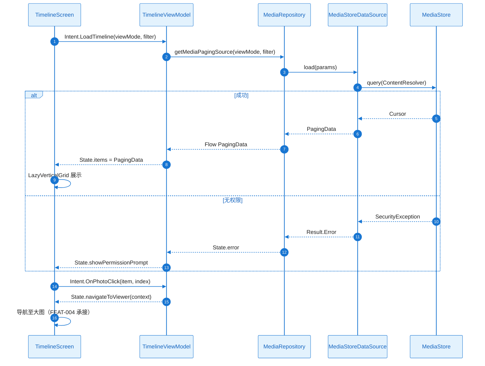
```mermaid
%%{init: {'theme': 'base', 'themeVariables': { 'actorBkg': '#E3F2FD', 'actorBorder': '#1976D2', 'actorTextColor': '#1565C0', 'signalColor': '#1976D2', 'signalTextColor': '#212121', 'noteBkgColor': '#FFF8E1', 'noteBorderColor': '#FFC107'}}}%%
sequenceDiagram
    autonumber

    participant UI as TimelineScreen
    participant VM as TimelineViewModel
    participant Repo as MediaRepository
    participant DS as MediaStoreDataSource
    participant MS as MediaStore

    UI->>VM: Intent.LoadTimeline(viewMode, filter)
    VM->>Repo: getMediaPagingSource(viewMode, filter)
    Repo->>DS: load(params)
    DS->>MS: query(ContentResolver)

    alt 成功
        MS-->>DS: Cursor
        DS-->>Repo: PagingData
        Repo-->>VM: Flow PagingData
        VM-->>UI: State.items = PagingData
        UI->>UI: LazyVerticalGrid 展示
    else 无权限
        MS-->>DS: SecurityException
        DS-->>Repo: Result.Error
        Repo-->>VM: State.error
        VM-->>UI: State.showPermissionPrompt
    end

    UI->>VM: Intent.OnPhotoClick(item, index)
    VM-->>UI: State.navigateToViewer(context)
    UI->>UI: 导航至大图（FEAT-004 承接）
```

---

#### A3.2 第二层：Feature 全景（必须）

##### A3.2.1 Feature 流程图集（逻辑流程，必须）

###### 流程 1：加载时间轴列表

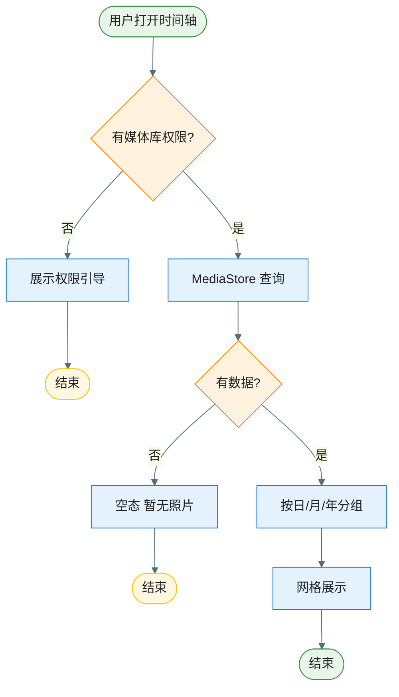
```mermaid
%%{init: {'theme': 'base', 'themeVariables': { 'primaryColor': '#E3F2FD', 'primaryTextColor': '#212121', 'primaryBorderColor': '#1976D2', 'lineColor': '#546E7A'}}}%%
flowchart TD
    Start([用户打开时间轴]) --> CheckPerm{"有媒体库权限?"}
    CheckPerm -->|否| ShowPrompt[展示权限引导]
    ShowPrompt --> EndPrompt([结束])
    CheckPerm -->|是| Load[MediaStore 查询]
    Load --> HasData{"有数据?"}
    HasData -->|否| Empty["空态 暂无照片"]
    Empty --> EndEmpty([结束])
    HasData -->|是| Group[按日/月/年分组]
    Group --> Render[网格展示]
    Render --> EndOK([结束])

    style Start fill:#E8F5E9,stroke:#388E3C
    style EndOK fill:#E8F5E9,stroke:#388E3C
    style EndPrompt fill:#FFF8E1,stroke:#FFC107
    style EndEmpty fill:#FFF8E1,stroke:#FFC107
    style CheckPerm fill:#FFF3E0,stroke:#F57C00
    style HasData fill:#FFF3E0,stroke:#F57C00
```

###### 流程 2：切换视图/筛选/快滑条

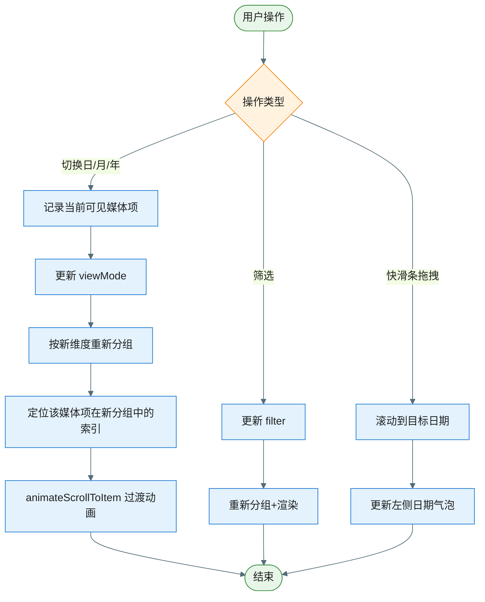
```mermaid
%%{init: {'theme': 'base', 'themeVariables': { 'primaryColor': '#E3F2FD', 'primaryTextColor': '#212121', 'primaryBorderColor': '#1976D2', 'lineColor': '#546E7A'}}}%%
flowchart TD
    Start([用户操作]) --> Type{操作类型}
    Type -->|切换日/月/年| RecordFocus[记录当前可见媒体项]
    RecordFocus --> ChangeView[更新 viewMode]
    ChangeView --> ReGroup[按新维度重新分组]
    ReGroup --> Locate[定位该媒体项在新分组中的索引]
    Locate --> AnimateScroll[animateScrollToItem 过渡动画]
    AnimateScroll --> End([结束])
    Type -->|筛选| ChangeFilter[更新 filter]
    Type -->|快滑条拖拽| ScrollTo[滚动到目标日期]
    ChangeFilter --> Refresh[重新分组+渲染]
    ScrollTo --> UpdateDate[更新左侧日期气泡]
    Refresh --> End
    UpdateDate --> End

    style Start fill:#E8F5E9,stroke:#388E3C
    style End fill:#E8F5E9,stroke:#388E3C
    style Type fill:#FFF3E0,stroke:#F57C00
```

| 分支    | 异常ID   | 触发条件                 | 对策                   |
| ----- | ------ | -------------------- | -------------------- |
| 无权限   | EX-001 | READ_MEDIA_IMAGES 拒绝 | 展示引导授权               |
| 媒体库为空 | EX-002 | 查询结果为空               | 空态「暂无照片」             |
| 查询异常  | EX-003 | ContentResolver 异常   | State.error，Toast 提示 |

##### A3.2.2 全景类图（必须）

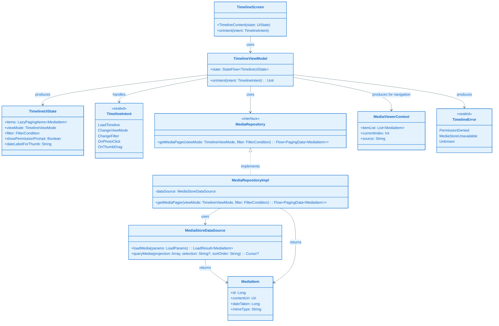
```mermaid
%%{init: {'theme': 'base', 'themeVariables': { 'primaryColor': '#E3F2FD', 'primaryTextColor': '#1565C0', 'primaryBorderColor': '#1976D2', 'lineColor': '#546E7A'}}}%%
classDiagram
    direction TB

    class TimelineScreen {
        +TimelineContent(state: UiState)
        +onIntent(intent: TimelineIntent)
    }

    class TimelineViewModel {
        +state: StateFlow~TimelineUiState~
        +onIntent(intent: TimelineIntent): Unit
    }

    class TimelineUiState {
        +items: LazyPagingItems~MediaItem~
        +viewMode: TimelineViewMode
        +filter: FilterCondition
        +showPermissionPrompt: Boolean
        +dateLabelForThumb: String
    }

    class TimelineIntent {
        <<sealed>>
        LoadTimeline
        ChangeViewMode
        ChangeFilter
        OnPhotoClick
        OnThumbDrag
    }

    class MediaRepository {
        <<interface>>
        +getMediaPager(viewMode: TimelineViewMode, filter: FilterCondition): Flow~PagingData~MediaItem~~
    }

    class MediaRepositoryImpl {
        -dataSource: MediaStoreDataSource
        +getMediaPager(viewMode: TimelineViewMode, filter: FilterCondition): Flow~PagingData~MediaItem~~
    }

    class MediaStoreDataSource {
        +loadMedia(params: LoadParams): LoadResult~MediaItem~
        +queryMedia(projection: Array, selection: String?, sortOrder: String): Cursor?
    }

    class MediaItem {
        +id: Long
        +contentUri: Uri
        +dateTaken: Long
        +mimeType: String
    }

    class MediaViewerContext {
        +itemList: List~MediaItem~
        +currentIndex: Int
        +source: String
    }

    class TimelineError {
        <<sealed>>
        PermissionDenied
        MediaStoreUnavailable
        Unknown
    }

    TimelineScreen --> TimelineViewModel : uses
    TimelineViewModel --> MediaRepository : uses
    TimelineViewModel --> TimelineUiState : produces
    TimelineViewModel --> TimelineIntent : handles
    MediaRepository <|.. MediaRepositoryImpl : implements
    MediaRepositoryImpl --> MediaStoreDataSource : uses
    MediaStoreDataSource --> MediaItem : returns
    MediaRepositoryImpl --> MediaItem : returns
    TimelineViewModel --> MediaViewerContext : produces for navigation
    TimelineViewModel --> TimelineError : produces
```

###### 关键类职责说明

| 类/接口                 | 层级  | 职责                                 | 关键方法                          | DDD/原则                             |
| -------------------- | --- | ---------------------------------- | ----------------------------- | ---------------------------------- |
| TimelineScreen       | 表示层 | 时间轴**单屏**；日/月/年由 viewMode + SegmentedBar 切换，同一网格不同列数与分组 | TimelineContent(), onIntent() | SRP：仅渲染与发 Intent；迪米特：不直连 Data      |
| TimelineViewModel    | 应用层 | MVI 状态管理，处理用户 Intent，协调 Repository | onIntent(), state             | SRP、合成复用；DIP：依赖 MediaRepository 接口 |
| MediaRepository      | 领域层 | 媒体项查询抽象，供多 Feature 复用              | getMediaPager()               | Repository 模式；ISP：职责单一             |
| MediaRepositoryImpl  | 数据层 | 实现 Paging 与 MediaStore 查询          | getMediaPager()               | LSP：可替换接口；SRP：仅数据获取                |
| MediaStoreDataSource | 数据层 | ContentResolver 封装，执行查询            | loadMedia(), queryMedia()     | SRP；合成复用：被 Repository 组合           |
| MediaItem            | 领域层 | 媒体项实体，id 为 identity                | —                             | 实体 (Entity)；不可变                    |
| MediaViewerContext   | 领域层 | 进入大图传递的上下文契约                       | —                             | 值对象；迪米特：跨 Feature 契约               |
| TimelineError        | 领域层 | 错误类型体系                             | —                             | 值对象 sealed；OCP                     |

##### A3.2.3 关键时序图集（方法调用流程，必须）

| Seq ID  | 流程名称     | 覆盖的异常（EX-xxx）          |
| ------- | -------- | ---------------------- |
| SEQ-001 | 加载时间轴列表  | EX-001, EX-002, EX-003 |
| SEQ-002 | 点击照片进入大图 | —                      |

###### SEQ-001：加载时间轴列表

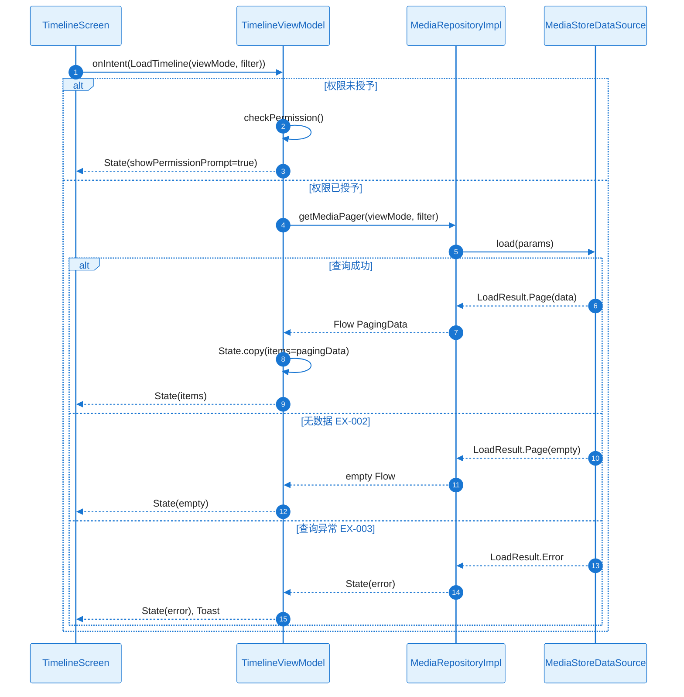
```mermaid
%%{init: {'theme': 'base', 'themeVariables': { 'actorBkg': '#E3F2FD', 'actorBorder': '#1976D2', 'actorTextColor': '#1565C0', 'signalColor': '#1976D2', 'signalTextColor': '#212121', 'noteBkgColor': '#FFF8E1', 'noteBorderColor': '#FFC107'}}}%%
sequenceDiagram
    autonumber

    participant UI as TimelineScreen
    participant VM as TimelineViewModel
    participant Repo as MediaRepositoryImpl
    participant DS as MediaStoreDataSource

    UI->>VM: onIntent(LoadTimeline(viewMode, filter))

    alt 权限未授予
        VM->>VM: checkPermission()
        VM-->>UI: State(showPermissionPrompt=true)
    else 权限已授予
        VM->>Repo: getMediaPager(viewMode, filter)
        Repo->>DS: load(params)

        alt 查询成功
            DS-->>Repo: LoadResult.Page(data)
            Repo-->>VM: Flow PagingData
            VM->>VM: State.copy(items=pagingData)
            VM-->>UI: State(items)
        else 无数据 EX-002
            DS-->>Repo: LoadResult.Page(empty)
            Repo-->>VM: empty Flow
            VM-->>UI: State(empty)
        else 查询异常 EX-003
            DS-->>Repo: LoadResult.Error
            Repo-->>VM: State(error)
            VM-->>UI: State(error), Toast
        end
    end
```

###### SEQ-002：点击照片进入大图

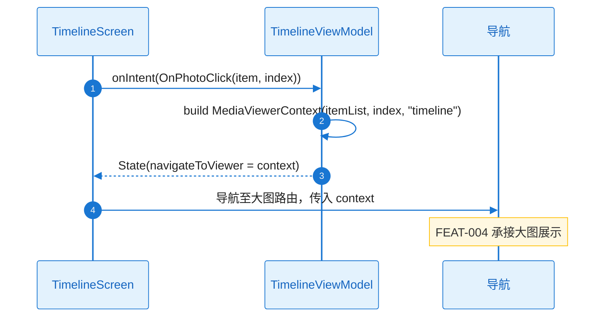
```mermaid
%%{init: {'theme': 'base', 'themeVariables': { 'actorBkg': '#E3F2FD', 'actorBorder': '#1976D2', 'actorTextColor': '#1565C0', 'signalColor': '#1976D2', 'signalTextColor': '#212121', 'noteBkgColor': '#FFF8E1', 'noteBorderColor': '#FFC107'}}}%%
sequenceDiagram
    autonumber

    participant UI as TimelineScreen
    participant VM as TimelineViewModel
    participant Nav as 导航

    UI->>VM: onIntent(OnPhotoClick(item, index))
    VM->>VM: build MediaViewerContext(itemList, index, "timeline")
    VM-->>UI: State(navigateToViewer = context)
    UI->>Nav: 导航至大图路由，传入 context
    Note over Nav: FEAT-004 承接大图展示
```

##### A3.2.4 疑难点与亮点设计详解（若适用）

###### 疑难点 1：快滑条与分组映射

- **类型**：疑难点
- **背景说明**：快滑条 thumb 需根据拖拽位置映射到 LazyList 的 firstVisibleItemIndex，再反推对应分组的日期，用于左侧日期气泡显示。分组标题与网格项混合排列，索引计算需考虑分组头占用。
- **核心方案**：维护 `indexToGroupKey: Map<Int, String>`，在数据加载时按分组预先计算每个 item 的 globalIndex；快滑条按比例 (thumbPosition / totalHeight) 估算 targetIndex，二分查找对应 groupKey，格式化日期显示。
- **边界条件**：快速滚动时避免频繁更新日期气泡造成卡顿，可 debounce 或采样。

###### 疑难点 2：即滑即现无白块（NFR-PERF-002）

- **类型**：疑难点
- **背景说明**：列表滑动时缩图需以最快速度出现，不得出现白块。Coil 自带内存与磁盘缓存，但 Paging 预取与 Coil 的 placeholder 需配合。
- **核心方案**：Paging 的 `pageSize` 与 `prefetchDistance` 调优，确保滑动时提前加载；Coil 的 `AsyncImage` 使用 `placeholder` 为低分辨率占位（如同一缩略图的小尺寸）或骨架色块，避免纯白；`crossfade` 可选开启，时长宜短（如 100ms）。

###### 疑难点 3：视图切换过渡动画与视觉焦点保持（NFR-PERF-003）

- **类型**：疑难点
- **背景说明**：日/月/年视图切换时需自然过渡动画，且用户在当前视图所见的媒体项，切换后仍为视觉焦点，不得直接刷新跳至新视图顶部。由于日/月/年分组维度不同，同一媒体项在不同视图中的分组与索引位置不同， naïve 的切换会触发重新分组并默认 scrollTo(0)。
- **核心方案**：切换前通过 `LazyListState.firstVisibleItemIndex` 或可见区域中心对应的 `MediaItem` 记录「焦点媒体项」（如 id 或 dateTaken）；切换后按新 viewMode 重新分组，在分组数据中查找该媒体项对应的 globalIndex；使用 `animateScrollToItem(index)` 平滑滚动至该位置，实现视觉焦点保持。过渡动画：Compose 的 `animateScrollToItem` 自带平滑滚动；列表内容变化可使用 `AnimatedContent` 或 `Crossfade` 配合 `key(viewMode)` 实现列数变化的过渡。
- **边界条件**：若焦点媒体项在新视图中不存在（如数据刷新导致），可 fallback 至最接近的日期位置或列表顶部，避免异常。

###### 疑难点 4：双指捏合与日/月/年视图切换及动画（FR-003，ux-design 双指无极缩放）

- **类型**：疑难点
- **背景说明**：ux-design 约定「列表上双指 pinch → 网格密度连续变化，列数在约定范围内」；spec 约定日 3/6 列、月 15 列、年 32 列。需实现 pinch 手势驱动 viewMode 切换，并配合自然过渡动画。
- **pinch 与 viewMode 映射**：
  - 使用 `pointerInput` + `detectTransformGestures` 监听 `zoom`（scale）变化；
  - 维护连续 scale 或累计 scale，映射到离散 viewMode：scale 小（捏合缩小）→ 年 32 列；scale 大（张开放大）→ 日 3/6 列；中间段 → 月 15 列；
  - 建议设阈值：如 scale < 0.7 → Year，0.7 ≤ scale < 1.2 → Month，scale ≥ 1.2 → Day；或按列数区间线性插值；
  - 日视图中再按 scale 细分 3 列 / 6 列。
- **切换动画实现**：
  - **列数变化**：`AnimatedContent(targetState = viewMode, label = "viewMode")` 或 `Crossfade` 配合 `key(viewMode)`，内部根据 viewMode 使用不同 `GridCells.Fixed(columns)`；
  - **视觉焦点保持**：同疑难点 3，切换前记录焦点 MediaItem，切换后 `animateScrollToItem(targetIndex)`；
  - **可选**：使用 `graphicsLayer` 在 pinch 过程中做 scale 的微调过渡，使捏合到阈值瞬间更平滑。
- **备选方案**：若需更精细的「无极」列数（非 3/15/32 离散），可参考 `pinch-zoom-grid` 等库，用 scale 直接计算 `columns = (baseColumns * scale).toInt().coerceIn(min, max)`，再与 viewMode 做区间映射。

###### 疑难点 5：点击进入大图共享元素过渡（FR-006，ux-design 共享元素过渡 300–350ms）

- **类型**：疑难点（跨 FEAT-001 / FEAT-004）
- **背景说明**：ux-design 约定「进入大图：共享元素过渡 + 淡入，300–350ms，无黑图」；目标效果为缩略图从列表位置平滑放大至全屏大图，自然过渡。
- **Compose 实现**：使用 `SharedTransitionLayout` + `Modifier.sharedElement()` + `rememberSharedContentState(key)`：
  - 列表侧（TimelineScreen 网格项）：在 `AsyncImage` 或包裹图片的 `Box` 上添加 `Modifier.sharedElement(rememberSharedContentState(key = "image-${item.id}"), animatedVisibilityScope = animatedContentScope)`；
  - 大图侧（PhotoViewerScreen）：同样使用 `key = "image-${currentItem.id}"` 与列表项匹配；
  - key 必须唯一且两端一致，建议用 `MediaItem.id`（如 contentUri 或 _ID），禁止用 index（列表与大图 currentIndex 可能不同步）。
- **与 Navigation 集成**：
  - 用 `SharedTransitionLayout` 包裹 `NavHost`；`composable` 的 content lambda 提供 `AnimatedContentScope`（即 `this@composable`）；
  - 将 `sharedTransitionScope = this@SharedTransitionLayout`、`animatedContentScope = this@composable` 通过参数或 CompositionLocal 传递给列表与大图屏幕；
  - 列表点击时 `navController.navigate("viewer/${item.id}")`（或传 currentIndex，大图根据 context 取 item），两端共享同一 key。
- **Modifier 顺序**：`sharedElement` 前的 modifier 决定 bounds 约束；`size`/`fillMaxSize` 等需在 `sharedElement` 前或按两端一致顺序放置，避免动画跳跃（见 [Modifier ordering](https://developer.android.com/develop/ui/compose/animation/shared-elements#modifier-ordering)）。
- **无黑图配合**：大图进入时立即启动当前页解码；过渡 300ms 内尽量完成；未完成时用缩略图或低分辨率占位（见 FEAT-004 进入过渡设计）。

---

#### A3.3 第三层：组件内部详细设计（Plan Level = Standard 时执行）

##### 组件 1：MediaRepositoryImpl + MediaStoreDataSource（数据层 Paging 与 MediaStore 查询）

- **定位**：实现媒体库分页加载与 ContentResolver 查询，详见 A3.2.4 疑难点 2 即滑即现。
- **对外接口**：`MediaRepository.getMediaPager(viewMode, filter): Flow<PagingData<MediaItem>>`
- **失败与降级**：权限拒绝返回空/State.error；查询异常封装为 TimelineError.MediaStoreUnavailable

###### 技术实现路径（开发可照此落码）

| 步骤  | 落点                                                       | 实现要点                                                                                                                                                                                                   |
| --- | -------------------------------------------------------- | ------------------------------------------------------------------------------------------------------------------------------------------------------------------------------------------------------ |
| 1   | `MediaStoreDataSource` 继承 `PagingSource<Int, MediaItem>` | 实现 `load(params: LoadParams<Int>): LoadResult<Int, MediaItem>`；`params.key` 为 null 时从 offset=0 开始，否则为上一页的 `nextKey`                                                                                    |
| 2   | 构建 MediaStore 查询                                         | `contentResolver.query(MediaStore.Images.Media.EXTERNAL_CONTENT_URI, projection, selection, selectionArgs, sortOrder)`；若支持视频则用 `MediaStore 的 getContentUri("external")` 或 UNION 查询                     |
| 3   | projection                                               | `arrayOf(_ID, DATA 或 _ID, DATE_TAKEN, MIME_TYPE)`；DATA 可用 `contentUri` 动态构建，或直接用 `_ID` 建 URI                                                                                                           |
| 4   | selection / sortOrder                                    | 按 viewMode：Day→按 `DATE_TAKEN` 降序；filter 有 `mediaTypeFilter` 时加 `MIME_TYPE LIKE ?`；sortOrder 固定为 `DATE_TAKEN DESC`                                                                                      |
| 5   | 分页                                                       | `params.loadSize` 为 pageSize（建议 60）；`cursor.moveToPosition(params.key ?: 0)` 后读取 `loadSize` 条，`nextKey = offset + loadSize`，`prevKey = (offset - loadSize).coerceAtLeast(0)`                           |
| 6   | cursorToMediaItem                                        | 从 Cursor 取 `getLong(0)`、`getLong(2)`、`getString(3)` 等，构建 `MediaItem(id, ContentUri.parse(uri), dateTaken, mimeType)`                                                                                   |
| 7   | 异常                                                       | `try { query(...) } catch (e: SecurityException) { LoadResult.Error(e) }`；Cursor 为 null 或 empty 返回 `LoadResult.Page(emptyList(), null, null)`                                                          |
| 8   | MediaRepositoryImpl                                      | 注入 `MediaStoreDataSource` 的工厂（需 viewMode、filter 闭包）；`Pager(PagingConfig(...)) { dataSourceFactory() }.flow`，见下方「快滑条跳页」配置                                                                               |
| 9   | **getRefreshKey**（跳页必需）                                  | `override fun getRefreshKey(state: PagingState<Int, MediaItem>): Int? = state.anchorPosition?.let { (it / pageSize) * pageSize }`；anchorPosition 为用户跳转目标位置，返回对齐到 page 边界的 offset，refresh 后从该 offset 加载 |

###### 快滑条跳页与 Paging 3 配合（Jump Loading）

快滑条拖拽到远端时，目标 item 可能尚未加载。Paging 3 通过 **placeholders + jumpThreshold + getRefreshKey** 支持跳页：

| 机制                            | 作用                                                                                              |
| ----------------------------- | ----------------------------------------------------------------------------------------------- |
| **enablePlaceholders = true** | 未加载位显示 null，允许 `scrollToItem(targetIndex)` 滚动到未加载位置；LazyPagingItems 请求时返回 null，Paging 据此触发 load |
| **jumpThreshold**             | 当访问位置超出已加载范围超过此阈值时，Paging 放弃逐页加载，改为 **invalidate + refresh**，从新位置重新分页                           |
| **getRefreshKey**             | refresh 时调用，返回新 PagingSource 的初始 load key，使首页包含用户跳转目标                                           |

**PagingConfig 推荐（含跳页）**：

```kotlin
PagingConfig(
  pageSize = 60,
  prefetchDistance = 30,
  enablePlaceholders = true,   // 默认 true，跳页必需
  initialLoadSize = 60,
  maxSize = (60 + 30) * 5,    // 内存内保留约 5 页
  jumpThreshold = 120         // 超出已加载 2 页即触发 refresh 跳转
)
```

**跳页流程**：

1. 用户拖拽 thumb → `targetIndex = (thumbY / trackH * totalItemCount)`；调用 `listState.animateScrollToItem(targetIndex)`
2. LazyList 向 LazyPagingItems 请求 `item(targetIndex)`
3. 若 targetIndex 超出已加载范围且 `> jumpThreshold`，Paging 调用 `PagingSource.invalidate()`
4. 新 PagingSource 创建后，`getRefreshKey(state)` 被调用；`state.anchorPosition` 为当前视口锚点（接近 targetIndex）
5. 返回 `(anchorPosition / pageSize) * pageSize` 作为 key，`load(LoadParams(key = key))` 从该 offset 加载
6. 加载完成后 LazyPagingItems 有数据，列表展示目标区域

**totalItemCount 来源**：MediaStore 需单独 `COUNT(*)` 查询得到总数，用于快滑条比例计算；或使用 `LazyPagingItems.itemCount`（placeholders 模式下会返回 Placeholder 预估值，可满足比例计算）。

**分组头情况**：若 LazyList 为「分组头 + 媒体项」混合（displayedIndex ≠ pagingIndex），快滑条拖拽的 targetIndex 为 displayedIndex；`animateScrollToItem(targetIndex)` 后，实际访问的 Paging 位为对应的 mediaIndex（displayedIndex 减去前面分组头数）。Paging 的 `anchorPosition` 为 media 维度，`getRefreshKey` 返回的 key 亦为 media offset，无需额外转换。

###### 关键数据结构

```
MediaStore 投影字段索引（按 projection 顺序）：
  [0] _ID (Long)
  [1] DATA 或 _ID（用于构建 contentUri: ContentUris.withAppendedId(EXTERNAL_CONTENT_URI, id)）
  [2] DATE_TAKEN (Long)
  [3] MIME_TYPE (String)
```

###### 线程与生命周期

| 项目              | 约束                                                               |
| --------------- | ---------------------------------------------------------------- |
| 执行线程            | `load()` 由 Paging 3 在 `Dispatchers.IO` 调用（默认）                    |
| 取消              | Paging 的 `LoadResult` 返回后 Job 可 cancel，Cursor 需在 finally 中 close |
| ContentResolver | 来自 Application Context，ViewModel 或 Repository 注入                 |

###### 组件详细类图

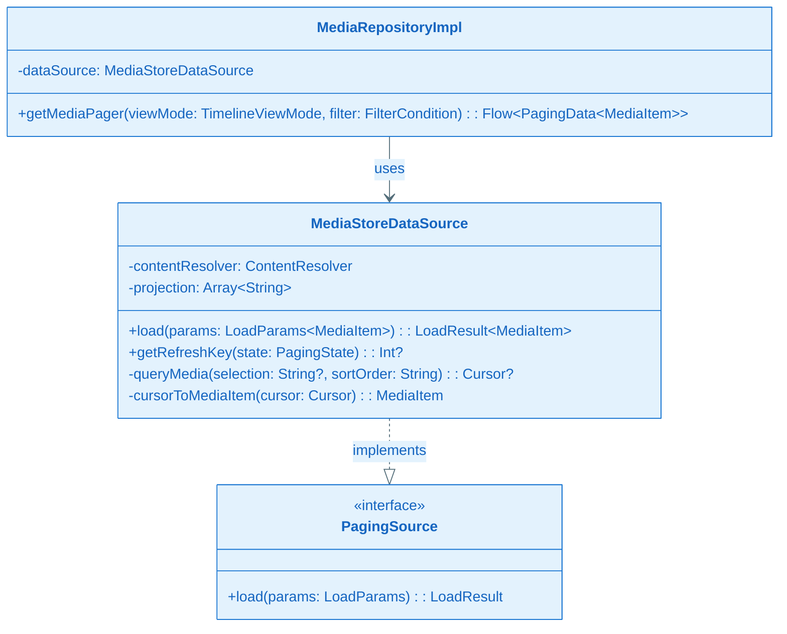
```mermaid
%%{init: {'theme': 'base', 'themeVariables': { 'primaryColor': '#E3F2FD', 'primaryTextColor': '#1565C0', 'primaryBorderColor': '#1976D2', 'lineColor': '#546E7A'}}}%%
classDiagram
    direction TB

    class MediaRepositoryImpl {
        -dataSource: MediaStoreDataSource
        +getMediaPager(viewMode: TimelineViewMode, filter: FilterCondition): Flow~PagingData~MediaItem~~
    }

    class MediaStoreDataSource {
        -contentResolver: ContentResolver
        -projection: Array~String~
        +load(params: LoadParams~MediaItem~): LoadResult~MediaItem~
        +getRefreshKey(state: PagingState): Int?
        -queryMedia(selection: String?, sortOrder: String): Cursor?
        -cursorToMediaItem(cursor: Cursor): MediaItem
    }

    class PagingSource {
        <<interface>>
        +load(params: LoadParams): LoadResult
    }

    MediaRepositoryImpl --> MediaStoreDataSource : uses
    MediaStoreDataSource ..|> PagingSource : implements
```

###### 组件完整详细时序图 1：load 成功与异常

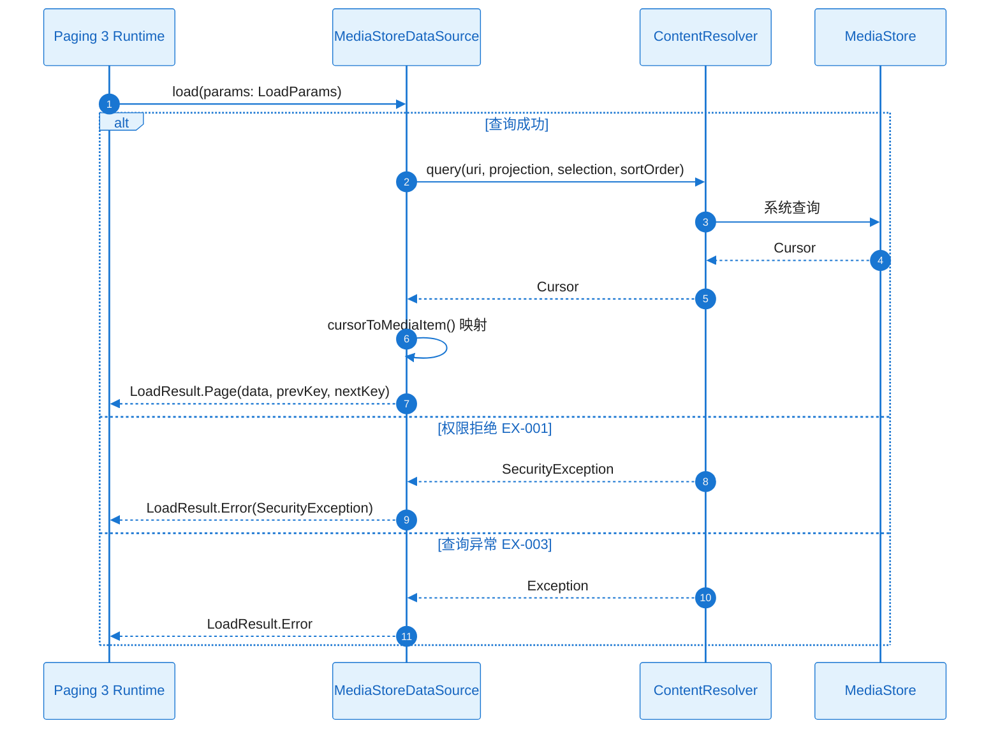
```mermaid
%%{init: {'theme': 'base', 'themeVariables': { 'actorBkg': '#E3F2FD', 'actorBorder': '#1976D2', 'actorTextColor': '#1565C0', 'signalColor': '#1976D2', 'signalTextColor': '#212121', 'noteBkgColor': '#FFF8E1', 'noteBorderColor': '#FFC107'}}}%%
sequenceDiagram
    autonumber

    participant Paging as Paging 3 Runtime
    participant DS as MediaStoreDataSource
    participant CR as ContentResolver
    participant MS as MediaStore

    Paging->>DS: load(params: LoadParams)

    alt 查询成功
        DS->>CR: query(uri, projection, selection, sortOrder)
        CR->>MS: 系统查询
        MS-->>CR: Cursor
        CR-->>DS: Cursor
        DS->>DS: cursorToMediaItem() 映射
        DS-->>Paging: LoadResult.Page(data, prevKey, nextKey)
    else 权限拒绝 EX-001
        CR-->>DS: SecurityException
        DS-->>Paging: LoadResult.Error(SecurityException)
    else 查询异常 EX-003
        CR-->>DS: Exception
        DS-->>Paging: LoadResult.Error
    end
```

###### 异常清单（数据层组件）

| 异常ID   | 触发条件                 | 错误类型                  | 可重试      | 对策                         |
| ------ | -------------------- | --------------------- | -------- | -------------------------- |
| EX-001 | READ_MEDIA_IMAGES 拒绝 | PermissionDenied      | 是（引导授权后） | State.showPermissionPrompt |
| EX-002 | 查询结果为空               | —                     | 否        | 空态展示                       |
| EX-003 | ContentResolver 异常   | MediaStoreUnavailable | 否        | State.error + Toast        |

##### 组件 2：TimelineViewModel（MVI 状态管理与视图切换焦点保持）

- **定位**：处理用户 Intent、协调 Repository、维护 MVI State；实现视图切换时视觉焦点保持，详见 A3.2.4 疑难点 3。
- **对外接口**：`onIntent(intent: TimelineIntent)`，State 经 StateFlow 导出
- **失败与降级**：权限/查询失败写入 State.error；焦点定位失败 fallback 至顶部

###### 技术实现路径（开发可照此落码）

| 步骤  | 落点                                                | 实现要点                                                                                                                                                                                                                          |
| --- | ------------------------------------------------- | ----------------------------------------------------------------------------------------------------------------------------------------------------------------------------------------------------------------------------- |
| 1   | `recordFocusedItem()`                             | 从 `LazyListState.firstVisibleItemIndex` 或 `layoutInfo.visibleItemsInfo.firstOrNull()?.index` 取得当前可见首项索引；通过 `LazyPagingItems` 的 snapshot 或 `items.itemSnapshotList` 取得对应 `MediaItem`；返回 `MediaItem(id, dateTaken)` 或至少可唯一识别的字段 |
| 2   | 视图切换时                                             | `ChangeViewMode(newMode)` → 先 `recordFocusedItem()` 得到 `focusedItem`；更新 `state.copy(viewMode=newMode)`；触发重新分组（viewMode 变化会令 Paging 的 key 变化，需刷新或重新 collect）                                                                   |
| 3   | `scrollToFocusedItemInNewViewMode(item, newMode)` | 新分组数据就绪后，在分组列表中查找 `item.id` 或 `item.dateTaken` 匹配的项的 globalIndex；若分组结构为 `List<TimelineGroup>`，则 `groups.flatMapIndexed { idx, g -> g.items.map { idx to it } }.indexOfFirst { it.second.id == item.id }` 得到 index；返回该 index   |
| 4   | 滚动调用                                              | UI 层持有 `LazyListState`，ViewModel 通过 State 下发 `scrollTargetIndex: Int?`；`LaunchedEffect(scrollTargetIndex)` 中 `if (target != null) { listState.animateScrollToItem(target); vm.onIntent(ClearScrollTarget) }`                  |
| 5   | 分组数据来源                                            | 分组在 UI 层或 ViewModel 层做：从 `LazyPagingItems` 的 `itemSnapshotList` 按 `dateTaken` 与 viewMode 分组；或 ViewModel 维护 `Flow<Map<ViewMode, List<TimelineGroup>>>`，由 Paging 数据 derive                                                      |
| 6   | 快滑条 indexToGroupKey                               | 分组数据加载时构建 `globalIndexToGroupKey: Map<Int, String>`，每个 item 的 globalIndex = 前面所有分组 header 数 + 本组内 index；快滑条拖拽时 `targetIndex = (thumbPosition / totalHeight * totalItemCount).toInt().coerceIn(0, totalItemCount-1)`           |
| 7   | 线程                                                | `reduce` 纯函数在主线程；Repository 的 `flow` collect 在 `viewModelScope.launch`，可切 `Dispatchers.IO` 若需                                                                                                                                 |

###### 状态与数据流

```
Intent.ChangeViewMode(newMode) 触发:
  1. focusedItem = recordFocusedItem()  // 依赖 LazyListState，需 UI 以 callback 或 State 提供
  2. state = state.copy(viewMode=newMode, pendingScrollToItem=null)
  3. 分组数据刷新（Paging refresh 或重组）
  4. 计算 targetIndex = scrollToFocusedItemInNewViewMode(focusedItem, newMode)
  5. state = state.copy(pendingScrollToItem=targetIndex)
  6. UI LaunchedEffect(pendingScrollToItem) 执行 animateScrollToItem
  7. Intent.ClearScrollTarget → state = state.copy(pendingScrollToItem=null)
```

**注意**：`recordFocusedItem` 需 LazyListState，有两种实现：(a) ViewModel 持有 LazyListState（不推荐，State 应在 UI）；(b) UI 在 `onIntent(ChangeViewMode)` 前通过 `onScrollIndexChanged(firstVisibleIndex)` 上报，ViewModel State 含 `lastVisibleItemIndex`，`recordFocusedItem` 用 `items[lastVisibleItemIndex]` 推导。推荐 (b)。

###### 组件详细类图

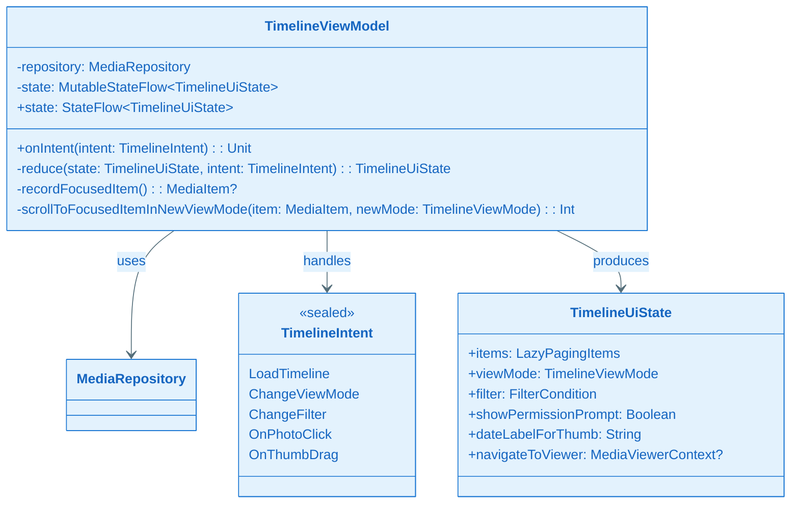
```mermaid
%%{init: {'theme': 'base', 'themeVariables': { 'primaryColor': '#E3F2FD', 'primaryTextColor': '#1565C0', 'primaryBorderColor': '#1976D2', 'lineColor': '#546E7A'}}}%%
classDiagram
    direction TB

    class TimelineViewModel {
        -repository: MediaRepository
        -state: MutableStateFlow~TimelineUiState~
        +state: StateFlow~TimelineUiState~
        +onIntent(intent: TimelineIntent): Unit
        -reduce(state: TimelineUiState, intent: TimelineIntent): TimelineUiState
        -recordFocusedItem(): MediaItem?
        -scrollToFocusedItemInNewViewMode(item: MediaItem, newMode: TimelineViewMode): Int
    }

    class TimelineIntent {
        <<sealed>>
        LoadTimeline
        ChangeViewMode
        ChangeFilter
        OnPhotoClick
        OnThumbDrag
    }

    class TimelineUiState {
        +items: LazyPagingItems
        +viewMode: TimelineViewMode
        +filter: FilterCondition
        +showPermissionPrompt: Boolean
        +dateLabelForThumb: String
        +navigateToViewer: MediaViewerContext?
    }

    TimelineViewModel --> MediaRepository : uses
    TimelineViewModel --> TimelineIntent : handles
    TimelineViewModel --> TimelineUiState : produces
```

###### 组件完整详细时序图 2：ChangeViewMode 焦点保持

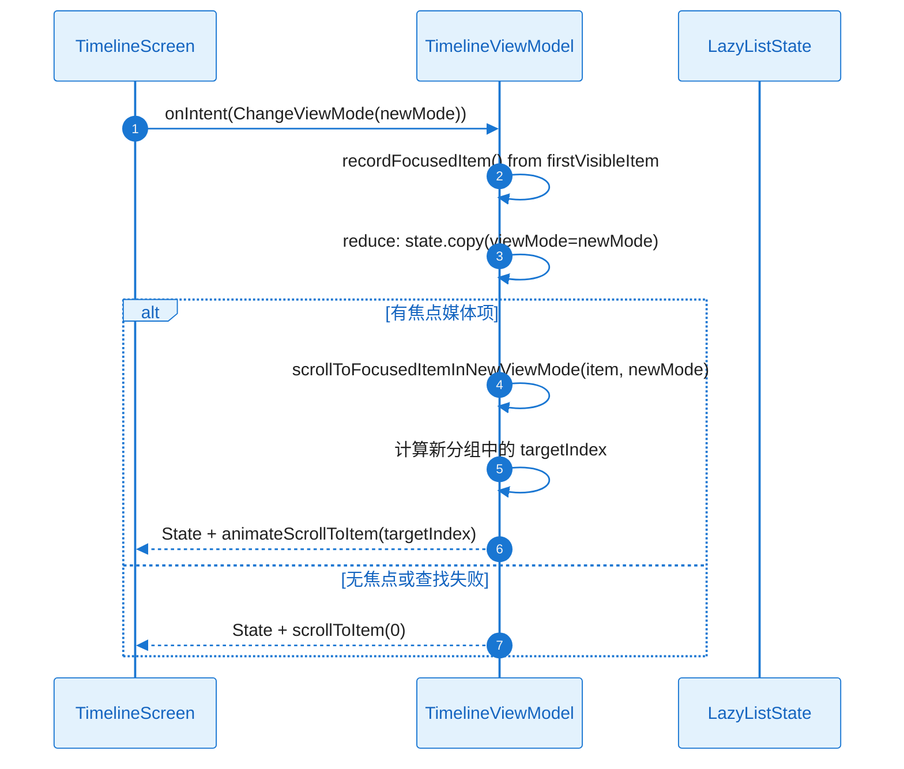
```mermaid
%%{init: {'theme': 'base', 'themeVariables': { 'actorBkg': '#E3F2FD', 'actorBorder': '#1976D2', 'actorTextColor': '#1565C0', 'signalColor': '#1976D2', 'signalTextColor': '#212121', 'noteBkgColor': '#FFF8E1', 'noteBorderColor': '#FFC107'}}}%%
sequenceDiagram
    autonumber

    participant UI as TimelineScreen
    participant VM as TimelineViewModel
    participant Lazy as LazyListState

    UI->>VM: onIntent(ChangeViewMode(newMode))
    VM->>VM: recordFocusedItem() from firstVisibleItem
    VM->>VM: reduce: state.copy(viewMode=newMode)

    alt 有焦点媒体项
        VM->>VM: scrollToFocusedItemInNewViewMode(item, newMode)
        VM->>VM: 计算新分组中的 targetIndex
        VM-->>UI: State + animateScrollToItem(targetIndex)
    else 无焦点或查找失败
        VM-->>UI: State + scrollToItem(0)
    end
```

###### 异常清单（ViewModel 组件）

| 异常ID | 触发条件          | 错误类型 | 可重试 | 对策                 |
| ---- | ------------- | ---- | --- | ------------------ |
| —    | 焦点媒体项在新视图中不存在 | —    | 否   | fallback 至最接近日期或顶部 |

##### 组件 3：快滑条（FastScrollBar）

- **定位**：列表右侧的垂直滚动条，thumb 可拖拽快速定位；thumb 与列表之间显示当前行对应日期气泡。详见 A3.2.4 疑难点 1、spec 日期显示与快滑条规范。
- **对外接口**：Compose 可组合函数；接收 `listState`、`totalItemCount`、`indexToDateLabel`、`onThumbDrag` 等
- **失败与降级**：空列表时不渲染或禁用；totalItemCount=0 时 thumb 不显示

###### 布局结构（按 spec：thumb 右侧、日期气泡在 thumb 与列表之间）

```
Row( modifier.fillMaxSize ) {
  // 左侧：LazyVerticalGrid 列表（含分组标题 + 媒体项）
  LazyVerticalGrid(...) { ... }

  // 中间：日期气泡（thumb 左侧、列表右侧的缝隙区）
  Box(
    modifier = Modifier.width(日期气泡区域宽).align(Alignment.CenterVertically),
    contentAlignment = Alignment.Center
  ) {
    Text(dateLabelForThumb)  // 来自 State.dateLabelForThumb
  }

  // 右侧：快滑条轨道 + thumb
  Box(
    modifier = Modifier
      .width(快滑条轨道宽, 如 24.dp)
      .fillMaxHeight()
      .pointerInput(Unit) { detectDragGestures(...) }
  ) {
    // 轨道背景（半透明）
    Box(modifier.fillMaxSize(), ...)
    // thumb 滑块，垂直位置 = firstVisibleItemIndex / totalItemCount * 轨道高
    Box(
      modifier = Modifier
        .offset(y = thumbOffsetPx)
        .size(thumbWidth, thumbHeight)
        .align(Alignment.TopCenter)
    )
  }
}
```

###### 技术实现路径（开发可照此落码）

| 步骤  | 落点                 | 实现要点                                                                                                                                                                                                                                                                     |
| --- | ------------------ | ------------------------------------------------------------------------------------------------------------------------------------------------------------------------------------------------------------------------------------------------------------------------ |
| 1   | 布局层级               | `Row` 内含 `LazyVerticalGrid`（flex 占满）、`日期气泡 Box`（固定宽约 56–72dp）、`快滑条轨道 Box`（固定宽 20–24dp）；列表与气泡、轨道之间可用 4–8dp 间距                                                                                                                                                             |
| 2   | thumb 位置计算         | `thumbOffsetPx = (firstVisibleItemIndex.toFloat() / max(1, totalItemCount - 1)) * (trackHeightPx - thumbHeightPx)`；边界 clamp 使 thumb 不超出轨道                                                                                                                                |
| 3   | 列表滚动 → thumb 同步    | `LaunchedEffect(listState.firstVisibleItemIndex) { ... }` 或 `derivedStateOf`；当 `listState.firstVisibleItemIndex` 变化时更新 thumb 的 offset；同时通过 `indexToDateLabel(firstVisibleItemIndex)` 更新 State.dateLabelForThumb，驱动日期气泡刷新                                                 |
| 4   | 拖拽 thumb → 列表滚动    | `detectVerticalDragGestures`；`offsetY` 为拖拽位移，换算为 `targetIndex = (offsetY / trackHeightPx * totalItemCount).toInt().coerceIn(0, totalItemCount-1)`；调用 `listState.animateScrollToItem(targetIndex)`；若 targetIndex 超出已加载范围，Paging 3 的 jump 机制会触发（见组件 1「快滑条跳页与 Paging 3 配合」） |
| 5   | indexToDateLabel   | 输入 globalIndex（含分组头）；查 `indexToGroupKey[index]` 得到 groupKey（如 "2026-02-12" 日视图、"2026-02" 月视图、"2026" 年视图）；用 `DateFormat` 或 `SimpleDateFormat` 按 viewMode 与 Locale 格式化；日视图特殊处理「今天」「昨天」                                                                                     |
| 6   | indexToGroupKey 构建 | 分组数据为 `List<TimelineGroup>`，每组 1 个 header + N 个 items；遍历构建扁平列表时，header 占 index i，items 占 i+1..i+1+N-1，均映射到该组 groupKey；`var idx=0; groups.forEach { g -> indexToGroupKey[idx++]=g.groupKey; g.items.forEach { indexToGroupKey[idx++]=g.groupKey } }`                      |
| 7   | debounce 日期气泡      | 快速滚动时避免每帧都更新日期文案，可 `derivedStateOf` + `snapshotFlow` 配合 `debounce(100)` 或仅在 `firstVisibleItemIndex` 变化时更新                                                                                                                                                                |
| 8   | thumb 视觉           | 圆角矩形或圆形，宽度略小于轨道；可用 `surface` 或 `Canvas` 绘制；设计稿要求毛玻璃质感时用 `BlurredEdgeBackground` 或 `Modifier.background(brush=...)`                                                                                                                                                       |
| 9   | 空列表 / 单页           | totalItemCount ≤ 1 时 thumb 可隐藏或置灰不可拖拽                                                                                                                                                                                                                                    |

###### 关键数据结构

```
indexToGroupKey: Map<Int, String>  // globalIndex → groupKey (如 "2026-02-12" / "2026-02" / "2026")
groupKey 格式化:
  日视图: "今天"/"昨天"/"2026年2月12日"（按 Locale）
  月视图: "2026年2月"
  年视图: "2026年"
```

###### 拖拽 → 滚动时序

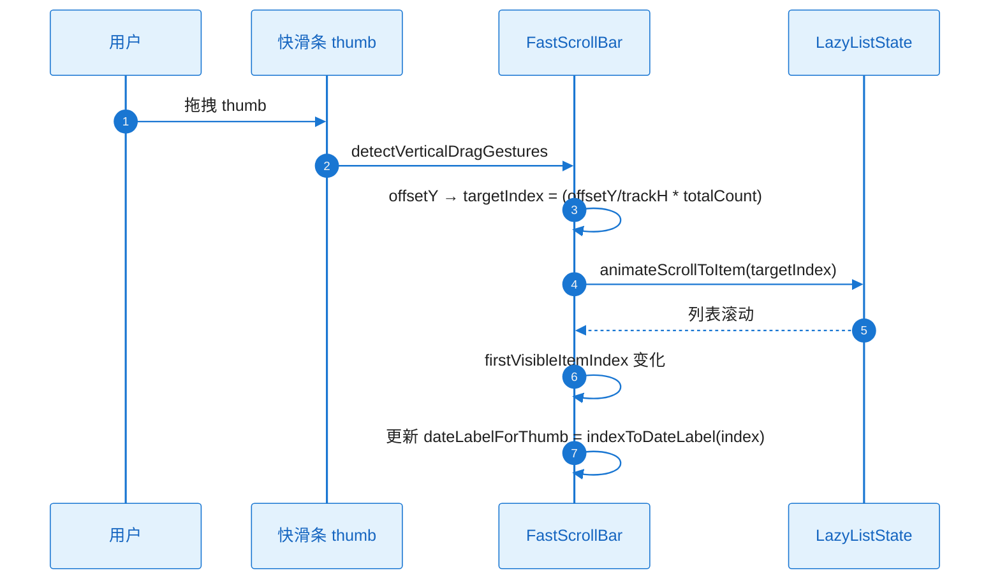
```mermaid
%%{init: {'theme': 'base', 'themeVariables': { 'actorBkg': '#E3F2FD', 'actorBorder': '#1976D2', 'actorTextColor': '#1565C0', 'signalColor': '#1976D2', 'signalTextColor': '#212121', 'noteBkgColor': '#FFF8E1', 'noteBorderColor': '#FFC107'}}}%%
sequenceDiagram
    autonumber

    participant User as 用户
    participant Thumb as 快滑条 thumb
    participant Compose as FastScrollBar
    participant ListState as LazyListState

    User->>Thumb: 拖拽 thumb
    Thumb->>Compose: detectVerticalDragGestures
    Compose->>Compose: offsetY → targetIndex = (offsetY/trackH * totalCount)
    Compose->>ListState: animateScrollToItem(targetIndex)
    ListState-->>Compose: 列表滚动
    Compose->>Compose: firstVisibleItemIndex 变化
    Compose->>Compose: 更新 dateLabelForThumb = indexToDateLabel(index)
```

###### 类图（Compose 可组合函数）

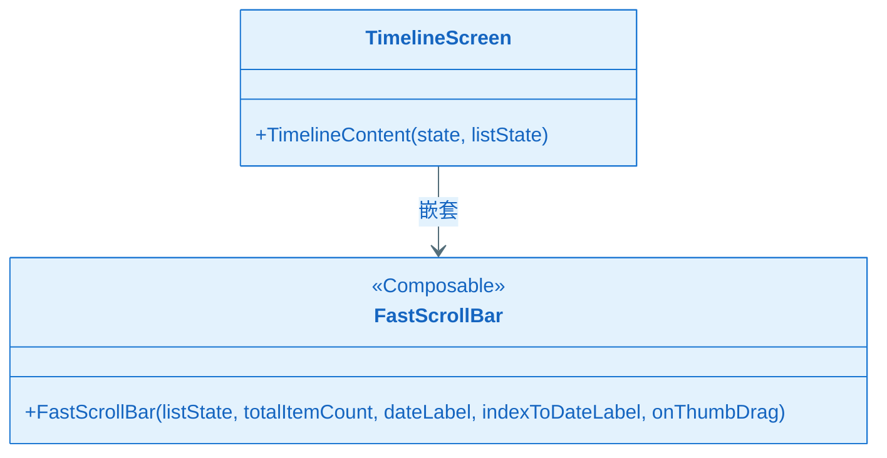
```mermaid
%%{init: {'theme': 'base', 'themeVariables': { 'primaryColor': '#E3F2FD', 'primaryTextColor': '#1565C0', 'primaryBorderColor': '#1976D2', 'lineColor': '#546E7A'}}}%%
classDiagram
    direction TB

    class FastScrollBar {
        <<Composable>>
        +FastScrollBar(listState, totalItemCount, dateLabel, indexToDateLabel, onThumbDrag)
    }

    class TimelineScreen {
        +TimelineContent(state, listState)
    }

    TimelineScreen --> FastScrollBar : 嵌套
```

---

### A4. 技术风险与消解策略（Plan Level = Standard 时输出）

| 风险ID     | 风险描述        | 触发条件      | 影响范围   | 严重度 | 消解策略                                      | 对应 Story/Task  |
| -------- | ----------- | --------- | ------ | --- | ----------------------------------------- | -------------- |
| RISK-001 | 大图景内存占用过高   | 大量高清图、低端机 | 列表缩图缓存 | Med | Coil 缓存策略、Paging pageSize 控制              | ST-003, ST-004 |
| RISK-002 | 视图切换时焦点定位失败 | 数据刷新、分组变化 | 用户体验   | Low | fallback 至最接近日期或顶部                        | ST-002         |
| RISK-003 | 媒体库变更未及时反映  | 外部删除/新增照片 | 列表一致性  | Low | ContentObserver 监听 MediaStore 变更并 refresh | ST-001         |

### A5. 边界 & 异常场景枚举（Plan Level = Standard 时输出）

- **数据边界**：媒体库为空、单日/月/年媒体项极多（分组内 item 数 >1000）、日期非法
- **状态边界**：切换视图时 Paging 正在加载、快滑条拖拽与列表滚动并发
- **生命周期**：旋转时 LazyListState 重建、进程被杀后恢复
- **并发**：Intent 快速连发（如快速切换日/月/年）、Paging 预取与 Coil 加载
- **用户行为**：权限拒绝、快速滚动+缩放同时操作

#### A5.1 场景 → 应对措施对照表（必须）

| 场景ID   | 场景类别 | 触发条件（可复现）              | 影响     | 预期行为     | 技术对策                                       | 设计对策 | 观测信号 | 映射                 |
| ------ | ---- | ---------------------- | ------ | -------- | ------------------------------------------ | ---- | ---- | ------------------ |
| SC-001 | 权限   | 用户拒绝 READ_MEDIA_IMAGES | 无数据    | 展示引导授权   | checkPermission、State.showPermissionPrompt | 引导文案 | —    | 流程1/SEQ-001/EX-001 |
| SC-002 | 数据   | 媒体库为空                  | 空列表    | 空态「暂无照片」 | LoadResult.Page(empty)                     | 空态文案 | —    | EX-002             |
| SC-003 | 生命周期 | 旋转屏幕                   | 列表位置丢失 | 保持滚动位置   | rememberSaveable LazyListState             | N/A  | —    | —                  |
| SC-004 | 并发   | 快速切换日/月/年              | 中间态闪烁  | 最终状态正确   | debounce 或 cancel 前序 job                   | N/A  | —    | RISK-002           |

### A6. 算法评估（如适用）

本 Feature 不涉及推荐/检测/分类等算法，本节 N/A。

### A7. 功耗评估（Plan Level = Standard 时输出）

#### A7.1 Top 5% 重度用户模型

| 维度   | 定义                       |
| ---- | ------------------------ |
| 设备型号 | 中端机型，4000mAh 电池          |
| 使用频次 | 每天浏览时间轴 5–10 次，单次 1–3 分钟 |
| 使用场景 | 前台使用，列表滚动 + 缩图加载         |

#### A7.2 功耗与温升场景评估

##### 场景 1：时间轴列表滚动与缩图加载

| 参数         | 数值             | 计算                       |
| ---------- | -------------- | ------------------------ |
| 电流增量       | 约 50 mA        | 相对 Baseline，Coil 解码 + 滚动 |
| 使用时长       | 60 秒           | 单次浏览                     |
| 每日使用次数     | 5 次            | Top5% 用户                 |
| 功能渗透率      | 5%             | 相册核心入口                   |
| **每日功耗增量** | **约 0.21 mAh** | 50×60/3600×5×5%/5%       |
| **预估温升**   | **< 0.5°C**    | 短时操作修正系数 0.4             |

#### A7.3 汇总与验收标准

| 场景        | 每日功耗 (mAh) | 温升 (°C) | 是否达标 |
| --------- | ---------- | ------- | ---- |
| 列表滚动 + 缩图 | 0.21       | < 0.5   | ✅    |
| **总计**    | **0.21**   | —       | —    |

**验收标准**：每日功耗增量 ≤ 10 mAh；单场景温升 ≤ 0.5°C。

#### A7.4 降级策略

| 触发条件        | 降级策略           |
| ----------- | -------------- |
| 低电量（<20%）   | 降低 Paging 预取距离 |
| 高温保护（>40°C） | 降低解码并发         |

### A8. 性能评估（Plan Level = Standard 时输出）

#### A8.1 测试设备基线

| 维度   | 定义            |
| ---- | ------------- |
| 设备型号 | 小米 11 或同档位中端机 |
| 系统版本 | Android 12    |
| 网络环境 | N/A（本地媒体库）    |

#### A8.2 性能场景与指标

##### A8.2.1 页面首屏加载 (TTI)

| 场景    | 指标  | 验收标准 (p95) | 实测   |
| ----- | --- | ---------- | ---- |
| 时间轴首屏 | TTI | ≤ 1000ms   | [实测] |

##### A8.2.2 UI 交互场景（必须）

| 指标类型          | 验收标准                   | 说明              |
| ------------- | ---------------------- | --------------- |
| 点击/输入响应 (p95) | ≤ 200ms                | 视图切换、筛选、点击照片    |
| 列表滚动流畅度       | ≥ 55fps 平均，≥ 50fps p95 | 对齐 NFR-PERF-001 |
| 缩图即滑即现        | 无白块                    | 对齐 NFR-PERF-002 |
| 视图切换动画        | 自然过渡 + 焦点保持            | 对齐 NFR-PERF-003 |

#### A8.3 验收标准汇总

| 场景类型  | 核心指标 | 验收标准 (p95)                  |
| ----- | ---- | --------------------------- |
| 首屏加载  | TTI  | ≤ 1000ms                    |
| UI 交互 | 响应时延 | ≤ 200ms                     |
| UI 交互 | 帧率   | ≥ 55fps (平均), ≥ 50fps (p95) |
| 缩图    | 无白块  | 即滑即现                        |

#### A8.4 降级策略

| 触发条件           | 降级策略             |
| -------------- | ---------------- |
| 低端设备           | 降低 pageSize、减少预取 |
| 高负载（CPU > 80%） | 降低 Coil 解码优先级    |

### A9. 内存评估（Plan Level = Standard 时输出）

#### A9.1 内存场景与增量分解

| 场景      | 验收标准             | 主要内存来源                         | 预估 (MB) | 实测 (MB) | 优化方向       |
| ------- | ---------------- | ------------------------------ | ------- | ------- | ---------- |
| 前台正常使用  | PSS ≤ 80MB       | Coil 缩图缓存、LazyPagingItems、分组数据 | 50–70   | [实测]    | 缓存 size 限制 |
| 前台重度滚动  | PSS ≤ 120MB      | 峰值缩图缓存                         | 80–100  | [实测]    | 回收策略       |
| 进出 10 次 | 回到 Baseline ±5MB | LazyList、ViewModel             | —       | [实测]    | 泄漏检测       |

**失败处置**：内存增量 > 100MB 或泄漏须修复。

### A10. 安全评估（如适用）

| 安全点   | 防护措施                | 验收标准 |
| ----- | ------------------- | ---- |
| 媒体库访问 | 仅 READ_MEDIA_IMAGES | 最小权限 |
| 权限申请  | 首次使用时申请             | 非启动时 |
| 拒绝后   | 引导授权、降级展示           | 不崩溃  |

### A11. 兼容性评估（Plan Level = Standard 时输出）

- **系统版本**：Android 10+ (API 29+)，与 epic.md 一致
- **设备兼容**：中端及以上，低端机降级（降低 pageSize）
- **屏幕兼容**：dp/sp、WindowInsets 适配刘海/挖孔
- **多语言**：日期格式随 Locale 变化（FR-007）
- **数据库升级**：N/A（无本地 DB）
- **APK 版本**：覆盖安装兼容

**兼容性结论**：本需求兼容 API 29+，需重点测试低端机与多语言日期格式，整体风险较低。

---

## Plan-B：技术规约 & 实现约束

### B0. Plan-A ↔ Plan-B 一致性与互校（必须）

| Plan-A（决策/假设/约束）    | Plan-B（落点）  | 自检规则      |
| ------------------- | ----------- | --------- |
| A0 领域概念命名           | B3、B4、Story | 术语一致      |
| A1 技术选型 Paging+Coil | B1、B2       | 依赖匹配      |
| A2 外部依赖与故障策略        | B4.2        | 超时/错误语义一致 |
| A3 MediaStore 为 SoR | B3.1        | 缓存策略一致    |
| A3 错误传播             | B2、B4       | 错误类型一致    |

### B1. 技术背景

**Language/Version**：Kotlin 2.1.21
**Primary Dependencies**：Jetpack Compose、Paging 3、Coil、Lifecycle、Material3
**Storage**：MediaStore（ContentResolver），无本地 DB
**Test Framework**：JUnit、Robolectric（可选）
**Target Platform**：Android 10+ (API 29+)
**Project Type**：mobile
**Performance Targets**：列表 60fps、缩图即滑即现无白块、视图切换自然过渡且焦点保持
**Constraints**：内存可控、主线程不阻塞
**Scale/Scope**：媒体库规模 1k–100k 级

### B2. 架构细化（实现必须遵循）

- **分层约束**：UI 仅调用 ViewModel；ViewModel 调用 Repository；DataSource 仅被 Repository 使用
- **线程模型**：IO 在 `Dispatchers.IO`；State 更新与 `collectAsState()` 在主线程
- **错误处理**：`Result<T>` 或 `sealed class TimelineError`；不抛未捕获异常到 UI
- **日志**：关键路径可日志，敏感信息脱敏

### B3. 数据模型

#### B3.1 存储形态与边界（必须）

- **存储形态**：MediaStore（系统 ContentProvider），无本地 DB
- **System of Record**：MediaStore 为权威
- **缓存与派生**：Coil 负责缩图缓存；Paging 负责内存分页缓存
- **生命周期**：随进程；无持久化
- **数据规模**：1k–100k 媒体项，分页加载

#### B3.2 物理数据结构

无本地表结构；MediaStore 投影字段包括：`_id`、`DATA`（或 `CONTENT_URI`）、`DATE_TAKEN`、`MIME_TYPE` 等，见 MediaStore.Media 定义。MediaItem 映射上述字段。

### B4. 接口规范/协议

#### B4.1 本 Feature 对外提供的接口（必须）

| 接口                 | 用途        | 调用方               |
| ------------------ | --------- | ----------------- |
| MediaRepository    | 媒体项查询（分页） | FEAT-002、FEAT-003 |
| MediaViewerContext | 进入大图上下文契约 | FEAT-004、导航层      |

**MediaViewerContext 契约**：

- `itemList: List<MediaItem>`：当前列表（或子集）
- `currentIndex: Int`：当前选中索引
- `source: String`：来源标识（"timeline" / "album" / "search"）

**错误语义**：PermissionDenied、MediaStoreUnavailable、Unknown；可重试：PermissionDenied 引导用户授权后可重试。

#### B4.2 本 Feature 依赖的外部接口/契约

| 依赖                         | 调用约束             | 失败模式              |
| -------------------------- | ---------------- | ----------------- |
| MediaStore ContentResolver | query 在 IO 线程    | 权限拒绝、无数据、异常       |
| Coil ImageLoader           | load(ContentUri) | 加载失败用 placeholder |

### B5. 合规性检查

- [ ] 仅访问用户授权的媒体库
- [ ] 权限在首次需要时申请
- [ ] 拒绝后降级展示，不崩溃

### B6. 项目结构（本 Feature）

```
specs/epics/EPIC-004-android-gallery/features/FEAT-001-timeline-list/
├── spec.md
├── plan.md
└── checklists/
    └── requirements.md
```

### B7. 源代码结构（代码库根目录）

```text
app/                          # 宿主（已有）
  src/main/java/.../MainActivity.kt

feature-gallery/              # 新增：相册模块（一期含时间轴）
  src/main/java/.../gallery/
    timeline/
      TimelineScreen.kt
      TimelineViewModel.kt
      TimelineIntent.kt
      TimelineUiState.kt
    data/
      MediaRepository.kt
      MediaRepositoryImpl.kt
      MediaStoreDataSource.kt
    domain/
      MediaItem.kt
      MediaViewerContext.kt
      MediaRepository.kt       # 接口（与 data 层同名接口）
```

**结构决策**：一期在 `:feature-gallery` 内实现，按 DDD 分包；media 数据层可后续拆为 `:gallery-media` 库模块，接口先行保持稳定。

---

## Story Breakdown（Plan Level = Standard 时执行）

### Story 列表

#### ST-001：数据库与媒体库数据访问基础设施

- **类型**：Infrastructure
- **描述**：实现 MediaStoreDataSource、MediaRepositoryImpl，Paging 3 分页加载媒体项，支持 viewMode 与 filter 条件
- **目标**：MediaRepository.getMediaPager 可返回 Flow<PagingData<MediaItem>>，供 UI 消费
- **预估工作量**：4 人天
- **覆盖 FR/NFR**：FR-001；NFR-REL-001
- **依赖**：无
- **可并行**：否（基础）
- **验收/验证方式**：单元测试 MediaStoreDataSource.load；集成测试 Repository 返回有效 PagingData
- **交付物**：MediaRepositoryImpl、MediaStoreDataSource、MediaItem、MediaRepository 接口

#### ST-002：TimelineViewModel 与 MVI 状态管理

- **类型**：Functional / Design-Enabler
- **描述**：实现 TimelineViewModel、TimelineIntent、TimelineUiState；处理 LoadTimeline、ChangeViewMode、ChangeFilter、OnPhotoClick、OnThumbDrag；视图切换焦点保持（recordFocusedItem、scrollToFocusedItemInNewViewMode）
- **目标**：StateFlow 正确输出 state；视图切换有自然过渡且焦点保持
- **预估工作量**：5 人天
- **覆盖 FR/NFR**：FR-002、FR-003、FR-004、FR-005、FR-006；NFR-PERF-003
- **依赖**：ST-001
- **可并行**：否
- **关键风险**：是（RISK-002）
- **验收/验证方式**：单元测试 reduce 逻辑；集成测试视图切换焦点保持
- **交付物**：TimelineViewModel、TimelineIntent、TimelineUiState、MediaViewerContext 契约

#### ST-003：时间轴列表 UI（LazyVerticalGrid、日/月/年分段、快滑条、筛选）

- **类型**：Functional
- **描述**：TimelineScreen Compose UI；LazyVerticalGrid + 分组标题；日/月/年 SegmentedBar；快滑条（thumb 右侧、日期气泡左侧）；筛选入口；多语言日期格式化
- **目标**：UI 渲染符合 ux-design；快滑条与日期显示符合规范
- **预估工作量**：5 人天
- **覆盖 FR/NFR**：FR-004、FR-005、FR-007；NFR-PERF-001
- **依赖**：ST-002
- **可并行**：否
- **验收/验证方式**：UI 测试；快滑条交互、日期格式多语言验证
- **交付物**：TimelineScreen、快滑条组件、日期格式化工具

#### ST-004：缩图加载与即滑即现优化

- **类型**：Optimization
- **描述**：集成 Coil；AsyncImage + ContentUri；Paging pageSize/prefetchDistance 调优；placeholder 策略；无白块验证
- **目标**：缩图即滑即现，无白块
- **预估工作量**：3 人天
- **覆盖 FR/NFR**：NFR-PERF-002、NFR-MEM-001
- **依赖**：ST-003
- **可并行**：否
- **关键风险**：是（RISK-001）
- **验收/验证方式**：滚动流畅度测试；内存 profiling
- **交付物**：Coil 集成、调优参数、验收报告

#### ST-005：进入大图导航与 MediaViewerContext

- **类型**：Functional
- **描述**：点击照片时构建 MediaViewerContext，导航至大图路由（FEAT-004 承接）
- **目标**：点击照片可进入大图
- **预估工作量**：2 人天
- **覆盖 FR/NFR**：FR-006
- **依赖**：ST-002、ST-003
- **可并行**：可与 ST-004 并行（不同改动路径）
- **验收/验证方式**：端到端测试点击进入大图
- **交付物**：导航集成、MediaViewerContext 传递

### Story 依赖关系图

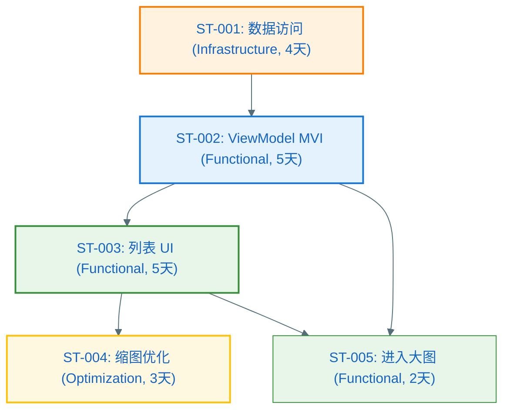
```mermaid
%%{init: {'theme': 'base', 'themeVariables': { 'primaryColor': '#E3F2FD', 'primaryTextColor': '#1565C0', 'primaryBorderColor': '#1976D2', 'lineColor': '#546E7A'}}}%%
flowchart TD
    ST001["ST-001: 数据访问 (Infrastructure, 4天)"]
    ST002["ST-002: ViewModel MVI (Functional, 5天)"]
    ST003["ST-003: 列表 UI (Functional, 5天)"]
    ST004["ST-004: 缩图优化 (Optimization, 3天)"]
    ST005["ST-005: 进入大图 (Functional, 2天)"]

    ST001 --> ST002
    ST002 --> ST003
    ST003 --> ST004
    ST002 --> ST005
    ST003 --> ST005

    style ST001 fill:#FFF3E0,stroke:#F57C00,stroke-width:2px
    style ST002 fill:#E3F2FD,stroke:#1976D2,stroke-width:2px
    style ST003 fill:#E8F5E9,stroke:#388E3C,stroke-width:2px
    style ST004 fill:#FFF8E1,stroke:#FFC107,stroke-width:2px
    style ST005 fill:#E8F5E9,stroke:#388E3C
```

### Feature → Story 覆盖矩阵

| FR/NFR ID            | 覆盖的 Story ID   | 备注        |
| -------------------- | -------------- | --------- |
| FR-001               | ST-001         | 媒体库读取     |
| FR-002               | ST-002, ST-003 | 视图切换、焦点保持 |
| FR-003               | ST-002, ST-003 | 双指缩放      |
| FR-004               | ST-002, ST-003 | 快滑条、普通滚动  |
| FR-005               | ST-002, ST-003 | 筛选        |
| FR-006               | ST-002, ST-005 | 进入大图      |
| FR-007               | ST-003         | 日期格式      |
| NFR-PERF-001/002/003 | ST-003, ST-004 | 性能        |
| NFR-REL-001          | ST-001         | 权限降级      |
| NFR-SEC-001          | ST-001         | 权限        |

### Story 工作量汇总

| Story ID | 类型             | 预估工作量（人天） | 依赖关系           | 是否并行          |
| -------- | -------------- | --------- | -------------- | ------------- |
| ST-001   | Infrastructure | 4         | 无              | —             |
| ST-002   | Functional     | 5         | ST-001         | 否             |
| ST-003   | Functional     | 5         | ST-002         | 否             |
| ST-004   | Optimization   | 3         | ST-003         | 否             |
| ST-005   | Functional     | 2         | ST-002, ST-003 | 可与 ST-004 并行  |
| **总计**   | —              | **19 人天** | —              | 实际日历约 15–17 天 |

---

## Story Detailed Design（Plan Level = Deep 时执行）

各 Story 的 L2 二层详细设计已写入 **[story_detail_design.md](./story_detail_design.md)**，覆盖 ST-001～ST-005，包含：目标与 DoD、代码落点与边界、核心接口与契约、类图、时序图（含正常+异常）、异常矩阵、并发/生命周期/资源管理、验证与测试设计。

tasks.md 的 Task 应引用：`story_detail_design.md:ST-xxx:功能设计:时序图` 等入口。
