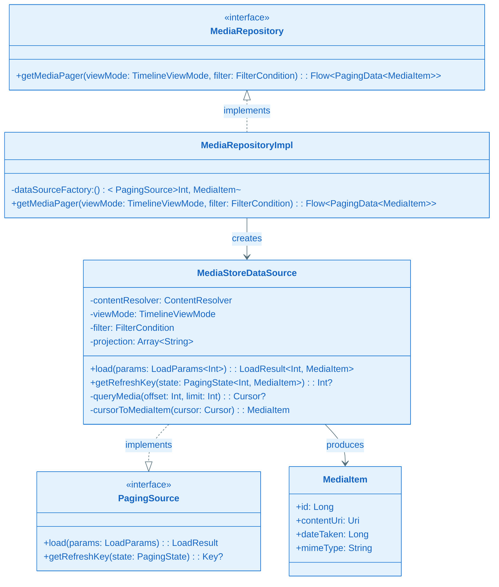
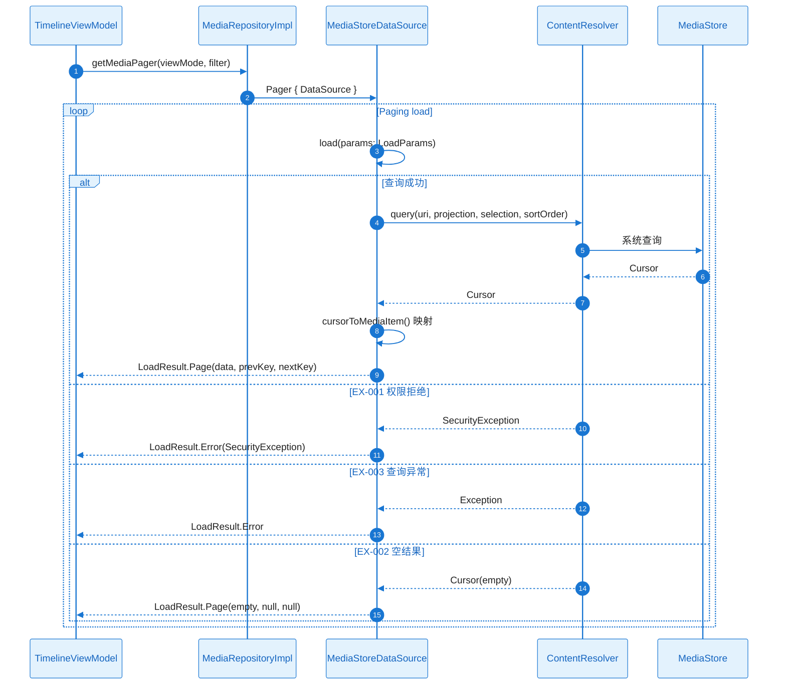
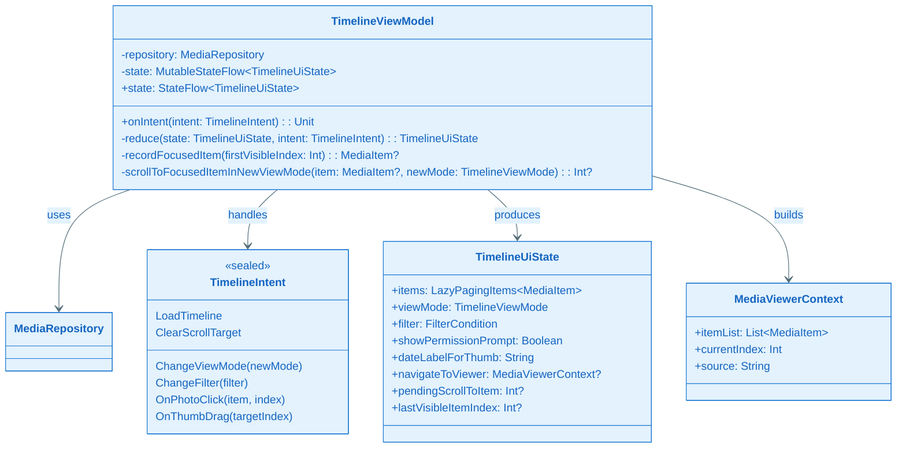
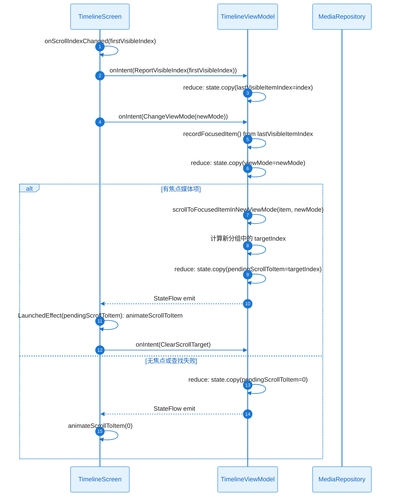
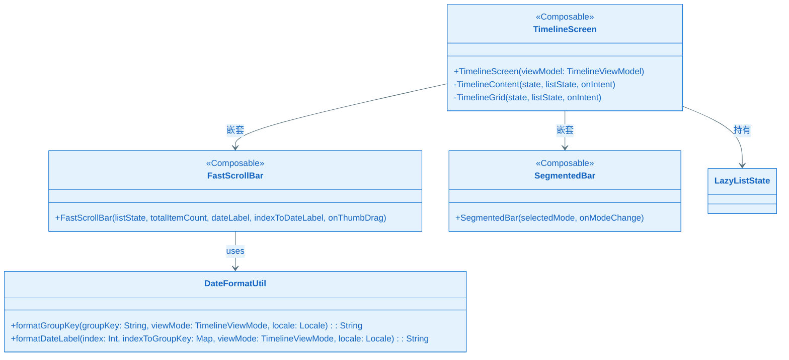
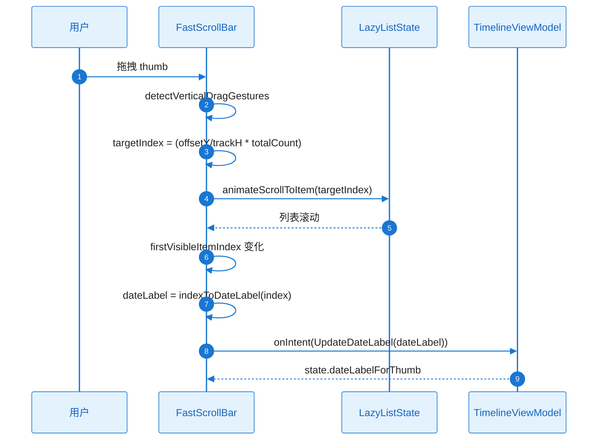
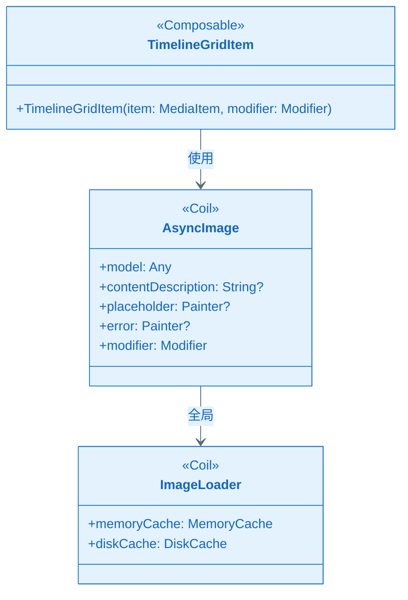
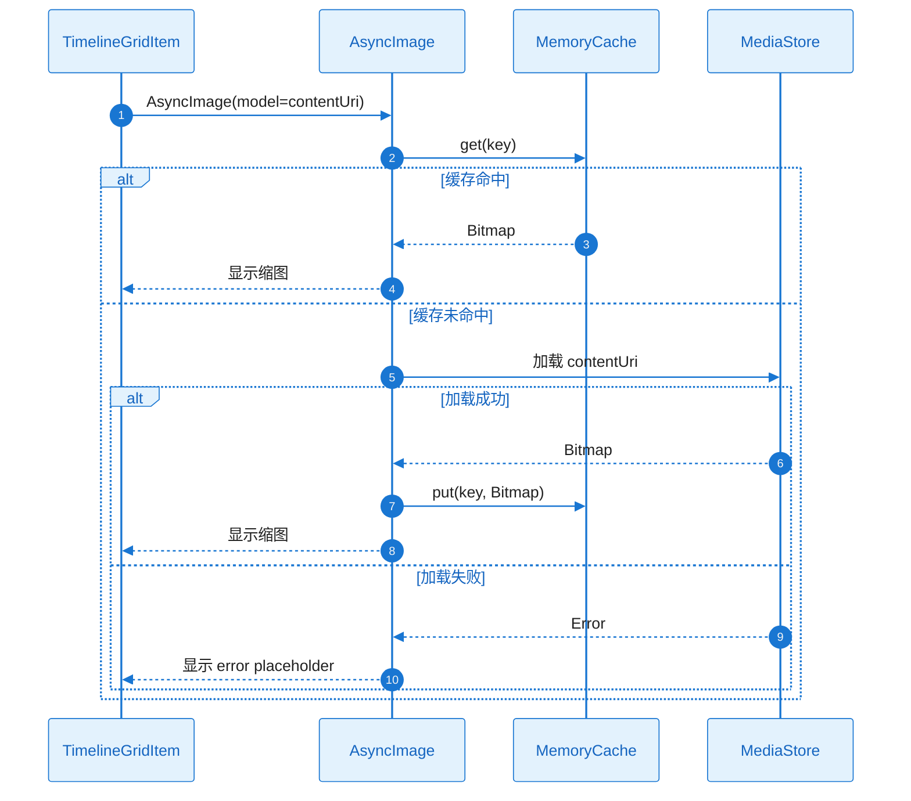
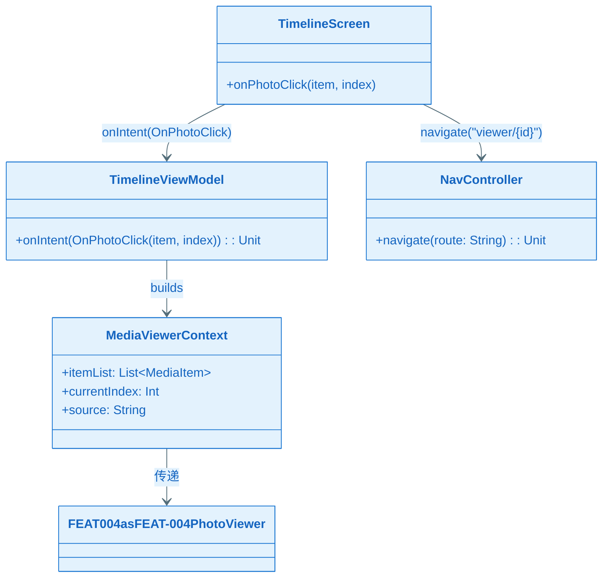
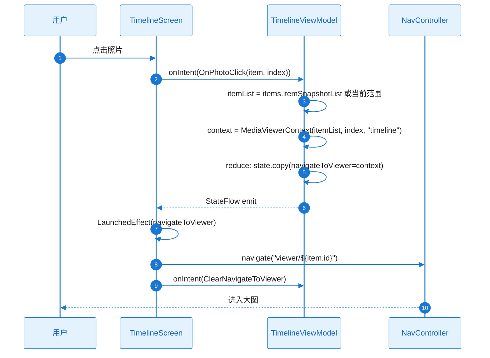

# L2 Story 详细设计（二层详细设计）：FEAT-001 时间轴列表浏览

本文档与 **plan.md** 配套使用：Plan Level = Deep 时，各 Story 的 L2 详细设计在此文档中编写。

**Feature**：FEAT-001 时间轴列表浏览  
**Plan Version**：v0.1.7  
**覆盖 Story**：ST-001～ST-005

---

## ST-001 Detailed Design：数据库与媒体库数据访问基础设施

#### 1) 需求及描述

- **需求描述**：实现 MediaStoreDataSource、MediaRepositoryImpl，基于 Paging 3 分页加载媒体项，支持 viewMode（日/月/年）与 filter 条件。作为时间轴的数据基础，供 TimelineViewModel 消费。
- **需求依赖**：无；Android MediaStore、ContentResolver、Paging 3 库
- **使用范围**：TimelineViewModel、FEAT-002/003/004 的媒体数据消费
- **使用接口**：`MediaRepository.getMediaPager(viewMode, filter): Flow<PagingData<MediaItem>>`
- **DoD（验收标准）**：
  - [ ] MediaStoreDataSource 正确实现 PagingSource，支持按 DATE_TAKEN 降序分页
  - [ ] MediaRepositoryImpl 返回 Flow<PagingData<MediaItem>>，viewMode/filter 变化时刷新
  - [ ] 权限拒绝时返回 LoadResult.Error，空结果返回 LoadResult.Page(empty)
  - [ ] 单元测试 MediaStoreDataSource.load；集成测试 Repository 返回有效 PagingData

#### 2) 功能设计

##### 功能设计关键说明

**核心实现思路**：
- MediaStoreDataSource 继承 PagingSource<Int, MediaItem>，load() 中通过 ContentResolver.query 查询 MediaStore.Images.Media，按 DATE_TAKEN DESC 排序，按 params.key 分页。
- MediaRepositoryImpl 持有 DataSource 工厂（闭包含 viewMode、filter），通过 Pager + PagingConfig 构建 Flow；viewMode/filter 变化时 invalidate 触发 refresh。

**关键类与职责划分**：
- MediaStoreDataSource：执行 MediaStore 查询、Cursor 转 MediaItem、分页 offset 计算、getRefreshKey 支持快滑条跳页
- MediaRepositoryImpl：构建 Pager、注入 DataSource 工厂、暴露 getMediaPager
- MediaItem：数据模型（id, contentUri, dateTaken, mimeType）
- MediaRepository：接口定义

**失败处理与边界**：
- SecurityException → LoadResult.Error，上层 State.showPermissionPrompt
- 查询异常 → LoadResult.Error，上层 Toast
- 空 Cursor → LoadResult.Page(empty, null, null)

##### 类图（完整详细）

**关键类职责说明**：

| 类/接口 | 核心职责 | 关键方法说明 |
|---------|----------|--------------|
| MediaRepository | 媒体库数据访问契约 | getMediaPager：按 viewMode/filter 返回分页 Flow |
| MediaRepositoryImpl | 实现 Paging 3 集成 | 构建 Pager，DataSource 工厂含 viewMode/filter |
| MediaStoreDataSource | MediaStore 查询与分页 | load：ContentResolver.query 分页；getRefreshKey：跳页锚点 |
| MediaItem | 媒体项数据模型 | id/contentUri/dateTaken/mimeType |

##### 时序图（完整详细：正常+异常）

##### 触发条件与系统响应

| 触发条件 | 系统响应（正常流程） | 异常处理 |
|----------|----------------------|----------|
| ViewModel 首次 collect | Paging 调用 load(key=null)，从 offset=0 加载第一页 | EX-001：State.showPermissionPrompt；EX-003：Toast |
| 滑动到底部 | load(nextKey) 加载下一页 | 同上 |
| 快滑条跳页 | invalidate→getRefreshKey→load(key) 从锚点加载 | 同上 |
| viewMode/filter 变化 | invalidate，新 PagingSource 加载 | 同上 |

##### 异常矩阵

| 异常ID | 触发条件 | 错误类型 | 可重试 | 对策 |
|--------|----------|----------|--------|------|
| EX-001 | READ_MEDIA_IMAGES 拒绝 | PermissionDenied | 是（引导授权后） | State.showPermissionPrompt |
| EX-002 | 查询结果为空 | — | 否 | 空态展示 |
| EX-003 | ContentResolver 异常 | MediaStoreUnavailable | 否 | State.error + Toast |

##### 并发/生命周期/资源管理

| 项目 | 约束 |
|------|------|
| 执行线程 | load() 由 Paging 3 在 Dispatchers.IO 调用 |
| 取消 | LoadResult 返回后 Job 可 cancel；Cursor 在 finally 中 close |
| ContentResolver | 来自 Application Context，ViewModel/Repository 注入 |

##### 验证与测试设计

- **单元测试**：MediaStoreDataSource.load 成功/空/权限拒绝/异常；getRefreshKey 返回正确 offset
- **集成测试**：MediaRepositoryImpl.getMediaPager 返回非空 Flow，collect 得到 PagingData
- **Mock**：ContentResolver、Context

---

## ST-002 Detailed Design：TimelineViewModel 与 MVI 状态管理

#### 1) 需求及描述

- **需求描述**：实现 TimelineViewModel、TimelineIntent、TimelineUiState；处理 LoadTimeline、ChangeViewMode、ChangeFilter、OnPhotoClick、OnThumbDrag；实现视图切换时视觉焦点保持（recordFocusedItem、scrollToFocusedItemInNewViewMode）。
- **需求依赖**：ST-001（MediaRepository）
- **使用范围**：TimelineScreen Compose UI
- **使用接口**：`onIntent(intent: TimelineIntent)`；`state: StateFlow<TimelineUiState>`
- **DoD（验收标准）**：
  - [ ] StateFlow 正确输出 state；视图切换有自然过渡且焦点保持
  - [ ] 单元测试 reduce 逻辑；集成测试视图切换焦点保持

#### 2) 功能设计

##### 功能设计关键说明

**核心实现思路**：
- MVI 模式：Intent → reduce → 新 State；Repository.flow.collect 写入 state.items；ChangeViewMode 时先 recordFocusedItem（依赖 UI 上报 firstVisibleItemIndex），再 reduce 更新 viewMode，计算 scrollToFocusedItemInNewViewMode 得到 targetIndex，下发 pendingScrollToItem。
- UI 层 LaunchedEffect(pendingScrollToItem) 执行 animateScrollToItem，完成后 ClearScrollTarget。

**关键类与职责划分**：
- TimelineViewModel：接收 Intent、调用 Repository、reduce 纯函数、recordFocusedItem/scrollToFocusedItemInNewViewMode
- TimelineIntent：LoadTimeline、ChangeViewMode、ChangeFilter、OnPhotoClick、OnThumbDrag、ClearScrollTarget
- TimelineUiState：items、viewMode、filter、showPermissionPrompt、dateLabelForThumb、navigateToViewer、pendingScrollToItem

**失败处理与边界**：
- 焦点媒体项在新视图中不存在 → fallback 至最接近日期或 scrollToItem(0)

##### 类图（完整详细）

**关键类职责说明**：

| 类/接口 | 核心职责 | 关键方法说明 |
|---------|----------|--------------|
| TimelineViewModel | MVI 状态管理、视图切换焦点保持 | onIntent：分发；reduce：纯函数；recordFocusedItem/scrollToFocusedItemInNewViewMode：焦点逻辑 |
| TimelineIntent | 用户意图密封类 | ChangeViewMode/ChangeFilter/OnPhotoClick 等 |
| TimelineUiState | UI 状态不可变数据类 | items/viewMode/filter/pendingScrollToItem 等 |
| MediaViewerContext | 进入大图上下文契约 | itemList/currentIndex/source |

##### 时序图（完整详细：ChangeViewMode 焦点保持）

##### 触发条件与系统响应

| 触发条件 | 系统响应（正常流程） | 异常处理 |
|----------|----------------------|----------|
| ChangeViewMode | recordFocusedItem→reduce(viewMode)→计算 targetIndex→pendingScrollToItem | 焦点不存在→scrollToItem(0) |
| OnPhotoClick | 构建 MediaViewerContext→navigateToViewer | — |
| OnThumbDrag | 下发 targetIndex，UI 调用 animateScrollToItem | — |
| LoadTimeline | collect Repository.flow→state.items | 权限/错误→showPermissionPrompt/error |

##### 异常矩阵

| 异常ID | 触发条件 | 错误类型 | 可重试 | 对策 |
|--------|----------|----------|--------|------|
| — | 焦点媒体项在新视图中不存在 | — | 否 | fallback 至最接近日期或顶部 |

##### 并发/生命周期/资源管理

| 项目 | 约束 |
|------|------|
| 线程 | reduce 纯函数主线程；Repository flow collect 在 viewModelScope.launch |
| 取消 | viewModelScope 取消时取消 collect |
| 焦点上报 | UI 通过 onScrollIndexChanged 或 State.lastVisibleItemIndex 上报 |

##### 验证与测试设计

- **单元测试**：reduce(ChangeViewMode)、reduce(OnPhotoClick) 等；scrollToFocusedItemInNewViewMode 边界
- **集成测试**：切换 viewMode 后列表滚动至焦点项
- **Mock**：MediaRepository

---

## ST-003 Detailed Design：时间轴列表 UI（LazyVerticalGrid、日/月/年分段、快滑条、筛选）

#### 1) 需求及描述

- **需求描述**：TimelineScreen Compose UI；LazyVerticalGrid + 分组标题；日/月/年 SegmentedBar；快滑条（thumb 右侧、日期气泡左侧）；筛选入口；多语言日期格式化。
- **需求依赖**：ST-002（TimelineViewModel、TimelineUiState）
- **使用范围**：时间轴主屏
- **使用接口**：TimelineScreen(state, onIntent)、FastScrollBar(...)
- **DoD（验收标准）**：
  - [ ] UI 渲染符合 ux-design；快滑条与日期显示符合规范
  - [ ] UI 测试；快滑条交互、日期格式多语言验证

#### 2) 功能设计

##### 功能设计关键说明

**核心实现思路**：
- Row 布局：LazyVerticalGrid（左侧）+ 日期气泡 Box（中间）+ 快滑条轨道（右侧）；viewMode 决定 GridCells.Fixed(columns)：日 3/6、月 15、年 32。
- 分组：从 LazyPagingItems 按 dateTaken 与 viewMode 分组，每组渲染 header + items；构建 indexToGroupKey 供快滑条 dateLabel。
- 快滑条：thumb 位置 = firstVisibleItemIndex/totalItemCount * trackHeight；拖拽时 targetIndex = (offsetY/trackHeight * totalItemCount)，animateScrollToItem。

**关键类与职责划分**：
- TimelineScreen：主 Composable，消费 state、发送 onIntent、嵌套 FastScrollBar
- FastScrollBar：thumb 轨道、日期气泡、detectVerticalDragGestures
- DateFormatUtil：indexToDateLabel、groupKey 格式化（今天/昨天/完整日期）

**失败处理与边界**：
- totalItemCount=0：thumb 隐藏或禁用
- 快速滚动：dateLabel debounce 避免卡顿

##### 类图（完整详细）

**关键类职责说明**：

| 类/接口 | 核心职责 | 关键方法说明 |
|---------|----------|--------------|
| TimelineScreen | 时间轴主屏 Compose UI | 消费 state、发送 onIntent、布局 Row+Grid |
| FastScrollBar | 快滑条 thumb+日期气泡 | 同步 listState、拖拽→animateScrollToItem |
| DateFormatUtil | 多语言日期格式化 | formatGroupKey、formatDateLabel（今天/昨天/完整） |
| SegmentedBar | 日/月/年切换入口 | 选中项、onModeChange→ChangeViewMode |

##### 时序图（完整详细：快滑条拖拽→列表滚动）

##### 触发条件与系统响应

| 触发条件 | 系统响应（正常流程） | 异常处理 |
|----------|----------------------|----------|
| 拖拽快滑条 thumb | 计算 targetIndex→animateScrollToItem | 超出已加载→Paging jump |
| 列表滚动 | firstVisibleItemIndex 变化→更新 dateLabel | debounce 日期气泡 |
| 点击 SegmentedBar | onIntent(ChangeViewMode) | — |
| 筛选入口点击 | 打开筛选 UI→onIntent(ChangeFilter) | — |

##### 异常矩阵

| 异常ID | 触发条件 | 错误类型 | 可重试 | 对策 |
|--------|----------|----------|--------|------|
| — | totalItemCount=0 | — | 否 | thumb 隐藏 |

##### 并发/生命周期/资源管理

| 项目 | 约束 |
|------|------|
| 重组 | LazyListState 用 rememberSaveable 保持旋转 |
| 日期气泡 | debounce 或 derivedStateOf 避免每帧更新 |

##### 验证与测试设计

- **UI 测试**：Compose Test 验证 Grid 列数、SegmentedBar 切换、快滑条拖拽
- **快滑条**：拖拽后 firstVisibleItemIndex 与 targetIndex 一致
- **日期格式**：切换 Locale 验证今天/昨天/完整日期

---

## ST-004 Detailed Design：缩图加载与即滑即现优化

#### 1) 需求及描述

- **需求描述**：集成 Coil；AsyncImage + ContentUri；Paging pageSize/prefetchDistance 调优；placeholder 策略；无白块验证。
- **需求依赖**：ST-003（TimelineScreen 网格项）
- **使用范围**：TimelineScreen 网格项缩图
- **使用接口**：AsyncImage(model = item.contentUri, contentDescription = null, modifier, placeholder)
- **DoD（验收标准）**：
  - [ ] 缩图即滑即现，无白块
  - [ ] 滚动流畅度测试；内存 profiling

#### 2) 功能设计

##### 功能设计关键说明

**核心实现思路**：
- Coil AsyncImage 加载 contentUri；placeholder 使用低分辨率占位或骨架色块，避免纯白；crossfade 可选 100ms。
- PagingConfig：pageSize=60、prefetchDistance=30，确保滑动时提前加载。
- 内存：Coil 默认内存缓存；低端机可调低 maxSize。

**关键类与职责划分**：
- TimelineGridItem：Composable，包裹 AsyncImage，传入 contentUri、placeholder、modifier
- Coil 配置：Application 中 ImageLoader.Builder 配置 memoryCache、diskCache

**失败处理与边界**：
- 加载失败：error placeholder 或占位图
- 内存紧张：Coil 自动回收；Paging maxSize 限制

##### 类图（完整详细）

**关键类职责说明**：

| 类/接口 | 核心职责 | 关键方法说明 |
|---------|----------|--------------|
| TimelineGridItem | 网格项 Composable | 包裹 AsyncImage，传入 contentUri、placeholder |
| AsyncImage | Coil 图片加载 | model=contentUri，placeholder 避免白块 |
| ImageLoader | Coil 全局配置 | memoryCache、diskCache |

##### 时序图（完整详细：缩图加载正常+失败）

##### 触发条件与系统响应

| 触发条件 | 系统响应（正常流程） | 异常处理 |
|----------|----------------------|----------|
| 网格项进入可见区域 | Coil 加载 contentUri，显示 placeholder→缩图 crossfade | 失败→error placeholder |
| 滑动 | Paging prefetch 提前加载 | — |

##### 异常矩阵

| 异常ID | 触发条件 | 错误类型 | 可重试 | 对策 |
|--------|----------|----------|--------|------|
| — | 图片损坏/URI 无效 | — | 否 | error placeholder |

##### 并发/生命周期/资源管理

| 项目 | 约束 |
|------|------|
| 内存 | Coil 自动回收；Paging maxSize 限制 |
| 取消 | 离开 composition 时 Coil 取消加载 |

##### 验证与测试设计

- **滚动流畅度**：滑动时帧率 ≥55fps
- **内存 profiling**：长时间滚动 PSS 无持续增长
- **无白块**：快速滑动无空白格

---

## ST-005 Detailed Design：进入大图导航与 MediaViewerContext

#### 1) 需求及描述

- **需求描述**：点击照片时构建 MediaViewerContext（itemList, currentIndex, source），导航至大图路由（FEAT-004 承接）；可选共享元素过渡（Modifier.sharedElement）。
- **需求依赖**：ST-002（TimelineViewModel）、ST-003（TimelineScreen）
- **使用范围**：TimelineScreen 网格项点击
- **使用接口**：MediaViewerContext(itemList, currentIndex, source)；navController.navigate("viewer/${item.id}")
- **DoD（验收标准）**：
  - [ ] 点击照片可进入大图
  - [ ] 端到端测试点击进入大图

#### 2) 功能设计

##### 功能设计关键说明

**核心实现思路**：
- 点击时 OnPhotoClick(item, index)；ViewModel 从 LazyPagingItems snapshot 构建 itemList（或当前已加载范围），currentIndex=index，source="timeline"；State.navigateToViewer = MediaViewerContext。
- UI 层 LaunchedEffect(navigateToViewer) 执行 navController.navigate，然后 ClearNavigateToViewer。
- 共享元素：Modifier.sharedElement(key = "image-${item.id}") 包裹网格项图片；大图侧相同 key。

**关键类与职责划分**：
- MediaViewerContext：契约数据类，itemList/currentIndex/source
- TimelineViewModel：OnPhotoClick 时构建 MediaViewerContext，写入 navigateToViewer
- TimelineScreen：点击时 onIntent(OnPhotoClick)；LaunchedEffect 导航

**失败处理与边界**：
- itemList 为空：不导航或 fallback
- 大图路由未注册：Navigation 抛出

##### 类图（完整详细）

**关键类职责说明**：

| 类/接口 | 核心职责 | 关键方法说明 |
|---------|----------|--------------|
| MediaViewerContext | 进入大图上下文契约 | itemList/currentIndex/source |
| TimelineViewModel | OnPhotoClick 处理 | 构建 MediaViewerContext，navigateToViewer |
| TimelineScreen | 点击事件 | 调用 onIntent(OnPhotoClick) |

##### 时序图（完整详细：点击进入大图）

##### 触发条件与系统响应

| 触发条件 | 系统响应（正常流程） | 异常处理 |
|----------|----------------------|----------|
| 点击网格项 | OnPhotoClick→MediaViewerContext→navigate | itemList 空→不导航 |

##### 异常矩阵

| 异常ID | 触发条件 | 错误类型 | 可重试 | 对策 |
|--------|----------|----------|--------|------|
| — | 大图路由未注册 | — | 否 | 确保 FEAT-004 路由已注册 |

##### 并发/生命周期/资源管理

| 项目 | 约束 |
|------|------|
| navigateToViewer | 单次使用后 ClearNavigateToViewer，避免重复导航 |
| 共享元素 | key 用 item.id，两端一致 |

##### 验证与测试设计

- **端到端测试**：点击照片→大图屏幕显示对应项
- **共享元素**：过渡动画 300–350ms（若实现）
