# Plan（工程级蓝图）：图集管理

**Epic**：EPIC-004 - Android 端相册 App 一期
**Feature ID**：FEAT-002
**Feature Version**：v0.1.1（来自 `spec.md`）
**Plan Version**：v0.1.4
**Plan Level**：Deep
**当前工作分支**：`epic/EPIC-004-android-gallery`
**Feature 目录**：`specs/epics/EPIC-004-android-gallery/features/FEAT-002-album-management/`
**日期**：2026-02-12
**输入**：来自 `Feature 目录/spec.md`

## 变更记录（增量变更）

| 版本 | 日期 | 变更范围（Feature/Story/Task） | 变更摘要 | 影响模块 | 是否需要回滚设计 |
|---|---|---|---|---|---|
| v0.1.0 | 2026-02-12 | Feature | 初始版本，Lite 阶段 |  | 否 |
| v0.1.1 | 2026-02-12 | Standard 阶段 | A3.3、Story Breakdown、A4-A11 | 全文 | 否 |
| v0.1.2 | 2026-02-12 | A0.3、A3.2.2、概述 | DDD 与 7 大原则对应表、关键类职责 DDD/原则列、前置检查对齐 | 对齐 epic-arch | 否 |
| v0.1.3 | 2026-02-12 | A3.2.2 | 全景类图 Mermaid 关系线去掉 class 前缀，修复 Invalid Mermaid Codes | 类图渲染 | 否 |
| v0.1.4 | 2026-02-14 | Deep 阶段 | Story Detailed Design（L2）：ST-001～ST-004，见 story_detail_design.md | Story Detailed Design | 否 |

## Plan 前置检查（必须，在开始设计前完成）

### 前置检查清单

- [x] 已阅读 `epic.md` 的"跨 Feature 技术策略"章节
- [x] 若 EPIC 根下存在 **`epic-arch.md`**，已阅读并在其 **0 层/1 层架构与规范约束**下做 A2、A3.1；已对齐 **DDD 设计要点**与**面向对象 7 大原则**
- [x] 已确认本 Feature 在 Plan 执行顺序中的位置（顺序 2，依赖 FEAT-001）
- [x] 已检查前置 Feature 的 plan（FEAT-001 plan 已完成），识别可复用组件
- [x] 本 Feature 需要设计的共享能力已在 EPIC 级登记

### 依赖的共享能力（从其他 Feature 复用）

| 依赖的共享能力 | Owner Feature | Owner Plan 状态 | 如何获取/引用 |
|---|---|---|---|
| 媒体库/数据层 | FEAT-001 | Plan Ready | 引用 FEAT-001 plan.md: MediaRepository 接口、MediaItem 实体、Plan-B:B4.1 |
| 列表 UI/导航 | FEAT-001 | Plan Ready | 引用 FEAT-001 plan.md: MediaViewerContext 契约、进入大图入口、Plan-B:B4.1 |
| 列表网格组件 | FEAT-001 | Plan Ready | 复用时间轴列表的网格展示模式（Paging+Coil），图集内列表采用相同契约 |

### 本 Feature 提供的共享能力（供其他 Feature 复用）

| 共享能力名称 | 消费方 Feature | 设计位置（本 plan 章节） | 接口/契约位置 |
|---|---|---|---|
| 图集数据与 UI | FEAT-003 | A3.1、A3.2、Plan-B B4.1 | Plan-B:B4.1 AlbumRepository 接口、Album 实体 |

### 前置检查结论

- **检查日期**：2026-02-12
- **结论**：通过
- **备注**：FEAT-001 plan 已就绪，可复用 MediaRepository、MediaItem、MediaViewerContext；本 Feature 提供 AlbumRepository 供 FEAT-003 搜索的图集维度条件使用。

---

## 概述

展示媒体库图集列表（系统图集与用户自建），支持新增/删除用户图集、向图集添加或移出照片、按媒体类型查看图集内容，并可从图集进入大图。复用 FEAT-001 的媒体库抽象与列表契约，本 Feature 负责**图集 CRUD** 与**图集维度 UI**，为 FEAT-003 搜索提供图集条件数据。

**关键工程决策**：设计方案须显式遵循 **DDD 设计要点**与**面向对象 7 大原则**（见 epic-arch 规范与约束）。用户自建图集持久化采用 Room（与 epic-arch 演进路径一致）；系统/媒体库图集通过 MediaStore 的 bucket/album 查询获取；图集内列表复用 FEAT-001 的 MediaRepository 按 albumId 筛选，进入大图使用同一 MediaViewerContext 契约。

## Plan-A：工程决策 & 风险评估（必须量化）

### A0. 领域概念（Domain Concepts / Glossary，必须）

#### A0.1 领域概念词汇表（必须）

| 概念（中文） | 名称（英文/代码名） | 定义（一句话） | 关键属性/状态（Top3） | 不变量/约束 | 关联概念 |
|---|---|---|---|---|---|
| 图集 | Album | 媒体库图集或用户自建图集 | id, name, type (System/User), itemCount | 系统图集不可删 | 媒体项 |
| 图集类型 | AlbumType | 系统图集 vs 用户图集 | System, User | System 不可删 | 图集 |
| 媒体类型筛选 | MediaTypeFilter | 图集内按类型查看 | Image, Video, Gif, LivePhoto, DolbyVideo | 可选 | 媒体项 |
| 选图面板 | MediaPickerPanel | 多选照片添加至图集的面板 | selectedItems, targetAlbum | 与图集关联 | 图集、媒体项 |
| 创建图集弹窗 | CreateAlbumDialog | 输入图集名称创建用户图集 | albumName | 非空校验 | 图集 |

#### A0.2 概念关系图（推荐，可选）

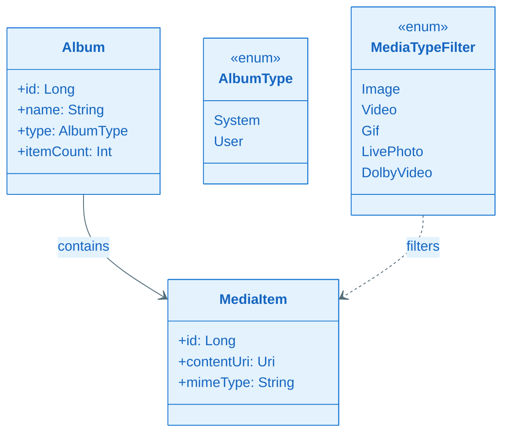
```mermaid
%%{init: {'theme': 'base', 'themeVariables': { 'primaryColor': '#E3F2FD', 'primaryTextColor': '#1565C0', 'primaryBorderColor': '#1976D2', 'lineColor': '#546E7A'}}}%%
classDiagram
    direction TB
    
    class Album {
        +id: Long
        +name: String
        +type: AlbumType
        +itemCount: Int
    }
    
    class AlbumType {
        <<enum>>
        System
        User
    }
    
    class MediaItem {
        +id: Long
        +contentUri: Uri
        +mimeType: String
    }
    
    class MediaTypeFilter {
        <<enum>>
        Image
        Video
        Gif
        LivePhoto
        DolbyVideo
    }
    
    Album --> MediaItem : contains
    MediaTypeFilter ..> MediaItem : filters
```

#### A0.3 DDD 与面向对象原则对应（须对齐 epic-arch）

| 领域概念 | DDD 类型 | 7 大原则体现 |
|----------|----------|--------------|
| **Album** | 实体 (Entity)，id 为 identity，聚合根 | 不可变 data class；AlbumRepository 按聚合根提供接口 |
| **AlbumType** | 值对象 | 枚举；OCP |
| **MediaTypeFilter** | 值对象 | sealed 扩展；OCP |
| **MediaPickerPanel** | UI 概念（非领域） | SRP：仅多选与确认 |
| **AlbumRepository** | Repository 接口（领域层） | DIP、ISP：与 MediaRepository 分离；LSP：Impl 可替换 |
| **AlbumRepositoryImpl** | Repository 实现（数据层） | SRP：仅 CRUD；合成复用：组合 AlbumDao、MediaStore |
| **AlbumListViewModel / AlbumDetailViewModel** | 应用层编排 | SRP、合成复用；DIP：依赖 Repository 接口 |
| **AlbumListScreen / AlbumDetailScreen** | 表示层 | SRP、迪米特：不直连 Data |

### A1. 技术方案选型

#### 1. 用户图集持久化

| 方案 | 优势 | 劣势 |
|---|---|---|
| 方案 A：Room | 类型安全、迁移支持、与 Android 生态一致 | 需维护 schema |
| 方案 B：DataStore/SharedPreferences | 轻量 | 不适合关系型图集-媒体项 |
| 方案 C：JSON 文件 | 无依赖 | 并发与一致性难保证 |

**采用方案 A（Room）**。理由：图集与媒体项为多对多关系，Room 支持 @Relation、Migration；epic-arch 已约定数据层形态；与 MediaStore 并存，Room 仅存用户图集元数据与关联关系，媒体项仍以 MediaStore 为 SoR。

#### 2. 系统图集获取

| 方案 | 优势 | 劣势 |
|---|---|---|
| 方案 A：MediaStore 的 bucket 查询 | 系统原生、与 MediaStore 一致 | bucket 概念与「图集」可能不完全对齐，需验证 API |
| 方案 B：MediaStore 的 Collections | Android 10+ 有 MediaStore 集合类 | 需查 API 可用性 |

**采用方案 A**。理由：MediaStore.MediaColumns.BUCKET_ID、BUCKET_DISPLAY_NAME 可获取系统相册分组；与 MediaStore 查询统一，复用 FEAT-001 的 DataSource 能力扩展。

#### 3. 选图面板实现

| 方案 | 优势 | 劣势 |
|---|---|---|
| 方案 A：独立全屏/Modal 页面 | 清晰 | 需额外导航 |
| 方案 B：BottomSheet + 网格 | 符合 ux-design 的选图面板 | 与创建图集弹窗区分 |

**采用方案 B**。理由：ux-design 定义选图面板为多选网格 + 添加 N 张；BottomSheet 可展示网格，确认后关闭并执行添加；与 Dialog（创建图集）区分明显。

### A2. Feature 0层设计

#### A2.1 Feature 0层架构图（必须）

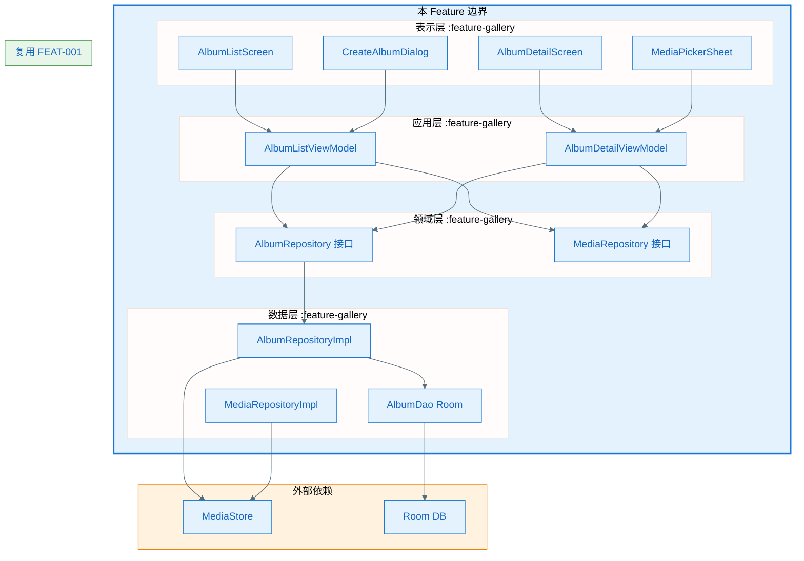
```mermaid
%%{init: {'theme': 'base', 'themeVariables': { 'primaryColor': '#E3F2FD', 'primaryTextColor': '#1565C0', 'primaryBorderColor': '#1976D2', 'lineColor': '#546E7A'}}}%%
flowchart TB
    subgraph FeatureBoundary["本 Feature 边界"]
        subgraph UILayer["表示层 :feature-gallery"]
            AlbumListScreen["AlbumListScreen"]
            AlbumDetailScreen["AlbumDetailScreen"]
            CreateAlbumDialog["CreateAlbumDialog"]
            MediaPickerSheet["MediaPickerSheet"]
        end
        subgraph AppLayer["应用层 :feature-gallery"]
            AlbumListViewModel["AlbumListViewModel"]
            AlbumDetailViewModel["AlbumDetailViewModel"]
        end
        subgraph DomainLayer["领域层 :feature-gallery"]
            AlbumRepository["AlbumRepository 接口"]
            MediaRepository["MediaRepository 接口"]
        end
        subgraph DataLayer["数据层 :feature-gallery"]
            AlbumRepositoryImpl["AlbumRepositoryImpl"]
            AlbumDao["AlbumDao Room"]
            MediaRepositoryImpl["MediaRepositoryImpl"]
        end
    end

    subgraph Reused["复用 FEAT-001"]
        MediaRepositoryImpl
    end

    subgraph External["外部依赖"]
        MediaStore["MediaStore"]
        RoomDB["Room DB"]
    end

    AlbumListScreen --> AlbumListViewModel
    AlbumDetailScreen --> AlbumDetailViewModel
    AlbumListViewModel --> AlbumRepository
    AlbumListViewModel --> MediaRepository
    AlbumDetailViewModel --> AlbumRepository
    AlbumDetailViewModel --> MediaRepository
    AlbumRepository --> AlbumRepositoryImpl
    AlbumRepositoryImpl --> AlbumDao
    AlbumRepositoryImpl --> MediaStore
    MediaRepositoryImpl --> MediaStore
    AlbumDao --> RoomDB
    CreateAlbumDialog --> AlbumListViewModel
    MediaPickerSheet --> AlbumDetailViewModel

    style FeatureBoundary fill:#E3F2FD,stroke:#1976D2,stroke-width:2px
    style Reused fill:#E8F5E9,stroke:#388E3C
    style External fill:#FFF3E0,stroke:#F57C00
```

#### A2.1.1 架构设计说明（必须）

- **边界与职责**：本 Feature 负责图集列表、图集详情、创建图集、选图面板；复用 FEAT-001 的 MediaRepository 与 MediaViewerContext；提供 AlbumRepository 供 FEAT-003 搜索。Out of Scope：大图具体实现、搜索 UI。
- **分层与依赖方向**：表示层 → 应用层 → 领域层 ← 数据层。
- **关键数据流**：用户图集元数据存 Room；媒体项关联（albumId ↔ mediaId）存 Room；系统图集来自 MediaStore bucket 查询；媒体项 SoR 仍为 MediaStore。
- **外部依赖策略**：Room 写入失败 → Toast 提示；MediaStore 不可用 → 同 FEAT-001 降级。
- **可演进性**：AlbumRepository 接口稳定；Room 表结构支持 Migration。

#### A2.2 外部依赖清单

| 依赖项 | 类型 | 提供方 | 提供的能力 | 故障模式 | 我方策略 |
|--------|------|--------|-----------|----------|----------|
| MediaStore | OS | Android | 系统图集、媒体项 | 同 FEAT-001 | 空态/引导 |
| Room | 第三方 | AndroidX | 用户图集持久化 | 迁移失败、写入失败 | Migration 测试；Toast 提示 |
| FEAT-001 MediaRepository | 内部 | FEAT-001 | 媒体项查询 | — | 接口消费 |
| FEAT-001 MediaViewerContext | 内部 | FEAT-001 | 进入大图契约 | — | 构造并传递 |

#### A2.3 通信与交互约束

- **协议**：函数调用、ContentResolver、Room DAO
- **错误处理**：Result/sealed class；增删失败 Toast 提示
- **数据一致性**：用户图集 CRUD 后刷新列表；添加/移出照片后刷新图集内列表；与 FEAT-001 共享 MediaStore 为媒体项 SoR

### A3. Feature 1层设计

#### A3.1 第一层：整体框架设计（必须）

##### A3.1.1 内部总体框架图（必须）

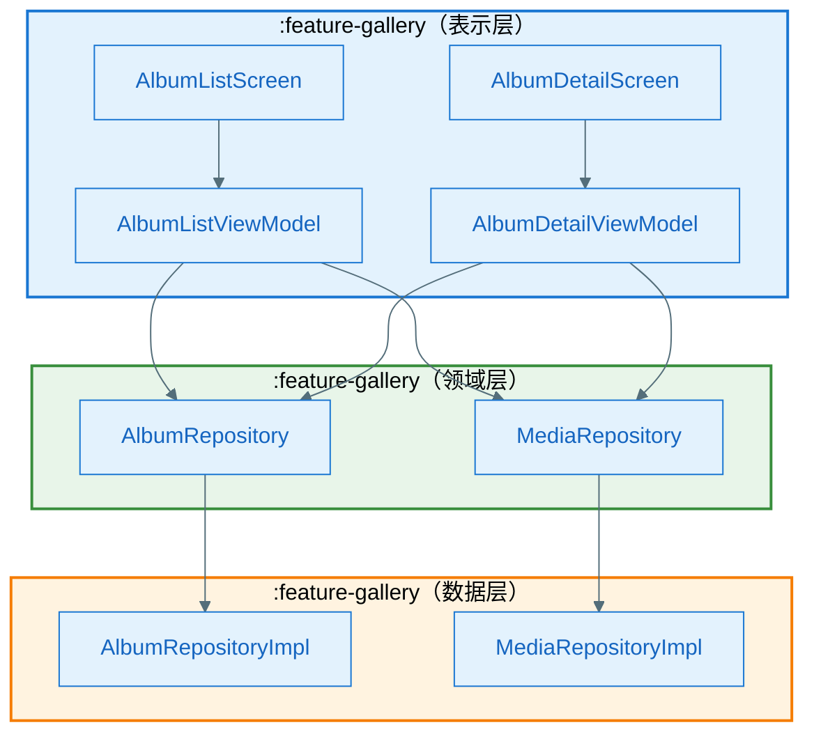
```mermaid
%%{init: {'theme': 'base', 'themeVariables': { 'primaryColor': '#E3F2FD', 'primaryTextColor': '#1565C0', 'primaryBorderColor': '#1976D2', 'lineColor': '#546E7A'}}}%%
flowchart TB
    subgraph UILayer[":feature-gallery（表示层）"]
        AlbumListScreen["AlbumListScreen"]
        AlbumDetailScreen["AlbumDetailScreen"]
        AlbumListViewModel["AlbumListViewModel"]
        AlbumDetailViewModel["AlbumDetailViewModel"]
    end

    subgraph DomainLayer[":feature-gallery（领域层）"]
        AlbumRepository["AlbumRepository"]
        MediaRepository["MediaRepository"]
    end

    subgraph DataLayer[":feature-gallery（数据层）"]
        AlbumRepositoryImpl["AlbumRepositoryImpl"]
        MediaRepositoryImpl["MediaRepositoryImpl"]
    end

    AlbumListScreen --> AlbumListViewModel
    AlbumDetailScreen --> AlbumDetailViewModel
    AlbumListViewModel --> AlbumRepository
    AlbumListViewModel --> MediaRepository
    AlbumDetailViewModel --> AlbumRepository
    AlbumDetailViewModel --> MediaRepository
    AlbumRepository --> AlbumRepositoryImpl
    MediaRepository --> MediaRepositoryImpl

    style UILayer fill:#E3F2FD,stroke:#1976D2,stroke-width:2px
    style DomainLayer fill:#E8F5E9,stroke:#388E3C,stroke-width:2px
    style DataLayer fill:#FFF3E0,stroke:#F57C00,stroke-width:2px
```

##### A3.1.2 总体设计说明

###### A3.1.2.1 组件清单与职责（必须）

| 组件 | 所属模块 | 职责 | 输入/输出 | 依赖 |
|------|----------|------|-----------|------|
| AlbumListScreen | :feature-gallery | 图集列表 UI，新增、删除入口 | 用户操作 → UI | AlbumListViewModel |
| AlbumDetailScreen | :feature-gallery | 图集内照片列表，按类型筛选，添加/移出 | 同上 | AlbumDetailViewModel |
| AlbumListViewModel | :feature-gallery | 图集列表 MVI 状态 | Intent → State | AlbumRepository |
| AlbumDetailViewModel | :feature-gallery | 图集详情 MVI 状态 | Intent → State | AlbumRepository, MediaRepository |
| AlbumRepository | :feature-gallery | 图集 CRUD 抽象 | CRUD 操作 | — |
| AlbumRepositoryImpl | :feature-gallery | 系统图集 + 用户图集合并实现 | 同上 | AlbumDao, MediaStore |
| CreateAlbumDialog | :feature-gallery | 创建图集弹窗 | 名称输入 → 创建 | AlbumListViewModel |
| MediaPickerSheet | :feature-gallery | 选图面板多选添加 | 多选 → 添加 | AlbumDetailViewModel |

###### A3.1.2.2 组件协作时序图（必须）

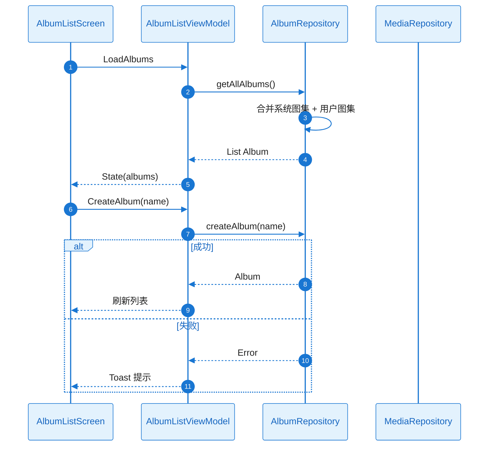
```mermaid
%%{init: {'theme': 'base', 'themeVariables': { 'actorBkg': '#E3F2FD', 'actorBorder': '#1976D2', 'actorTextColor': '#1565C0', 'signalColor': '#1976D2', 'signalTextColor': '#212121', 'noteBkgColor': '#FFF8E1', 'noteBorderColor': '#FFC107'}}}%%
sequenceDiagram
    autonumber
    
    participant UI as AlbumListScreen
    participant VM as AlbumListViewModel
    participant Repo as AlbumRepository
    participant MR as MediaRepository

    UI->>VM: LoadAlbums
    VM->>Repo: getAllAlbums()
    Repo->>Repo: 合并系统图集 + 用户图集
    Repo-->>VM: List Album
    VM-->>UI: State(albums)
    
    UI->>VM: CreateAlbum(name)
    VM->>Repo: createAlbum(name)
    alt 成功
        Repo-->>VM: Album
        VM-->>UI: 刷新列表
    else 失败
        Repo-->>VM: Error
        VM-->>UI: Toast 提示
    end
```

---

#### A3.2 第二层：Feature 全景（必须）

##### A3.2.1 Feature 流程图集（逻辑流程，必须）

###### 流程 1：查看图集列表

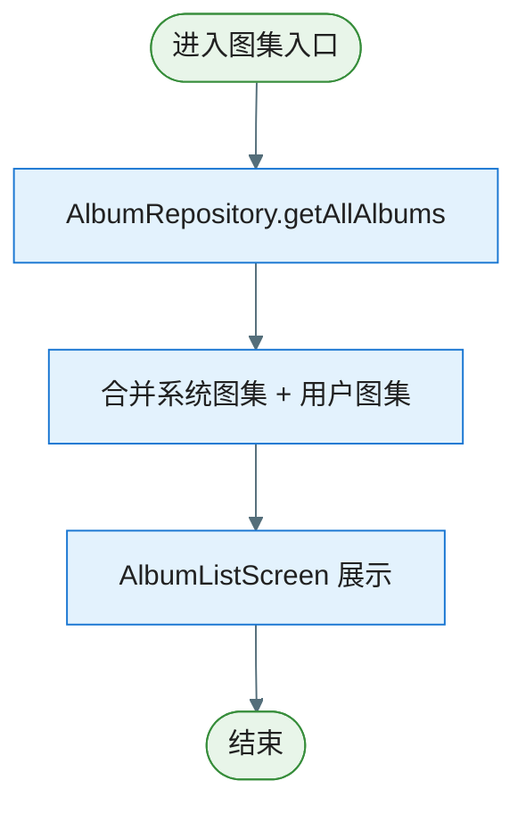
```mermaid
%%{init: {'theme': 'base', 'themeVariables': { 'primaryColor': '#E3F2FD', 'primaryTextColor': '#212121', 'primaryBorderColor': '#1976D2', 'lineColor': '#546E7A'}}}%%
flowchart TD
    Start([进入图集入口]) --> Load[AlbumRepository.getAllAlbums]
    Load --> Merge[合并系统图集 + 用户图集]
    Merge --> Render[AlbumListScreen 展示]
    Render --> End([结束])

    style Start fill:#E8F5E9,stroke:#388E3C
    style End fill:#E8F5E9,stroke:#388E3C
```

###### 流程 2：添加照片到图集

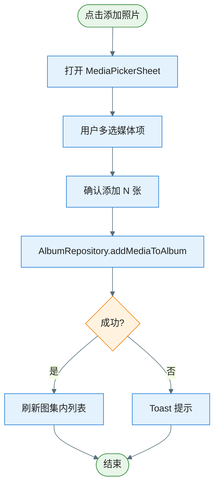
```mermaid
%%{init: {'theme': 'base', 'themeVariables': { 'primaryColor': '#E3F2FD', 'primaryTextColor': '#212121', 'primaryBorderColor': '#1976D2', 'lineColor': '#546E7A'}}}%%
flowchart TD
    Start([点击添加照片]) --> Open[打开 MediaPickerSheet]
    Open --> Select[用户多选媒体项]
    Select --> Confirm[确认添加 N 张]
    Confirm --> Repo[AlbumRepository.addMediaToAlbum]
    Repo --> Success{成功?}
    Success -->|是| Refresh[刷新图集内列表]
    Success -->|否| Toast[Toast 提示]
    Refresh --> End([结束])
    Toast --> End

    style Start fill:#E8F5E9,stroke:#388E3C
    style End fill:#E8F5E9,stroke:#388E3C
    style Success fill:#FFF3E0,stroke:#F57C00
```

##### A3.2.2 全景类图（必须）

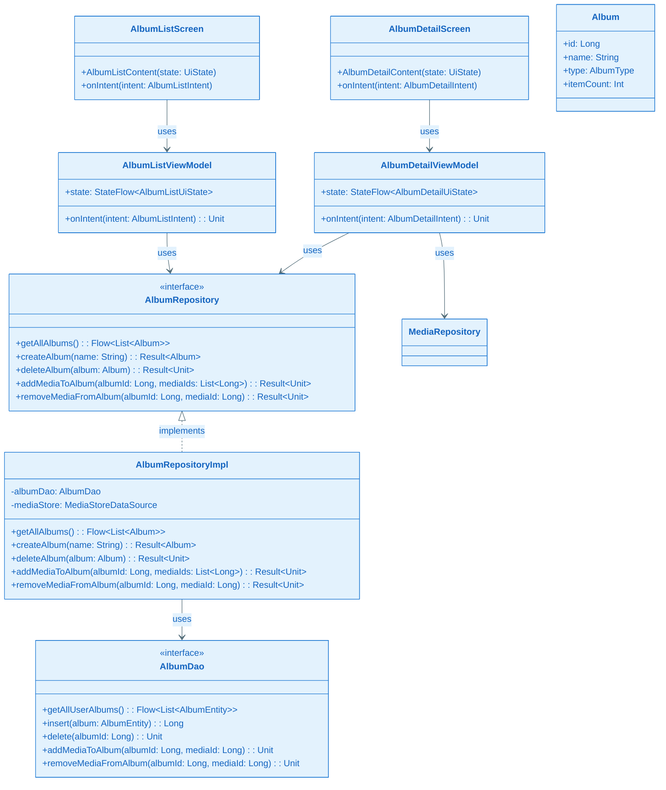
```mermaid
%%{init: {'theme': 'base', 'themeVariables': { 'primaryColor': '#E3F2FD', 'primaryTextColor': '#1565C0', 'primaryBorderColor': '#1976D2', 'lineColor': '#546E7A'}}}%%
classDiagram
    direction TB

    class AlbumListScreen {
        +AlbumListContent(state: UiState)
        +onIntent(intent: AlbumListIntent)
    }

    class AlbumDetailScreen {
        +AlbumDetailContent(state: UiState)
        +onIntent(intent: AlbumDetailIntent)
    }

    class AlbumListViewModel {
        +state: StateFlow~AlbumListUiState~
        +onIntent(intent: AlbumListIntent): Unit
    }

    class AlbumDetailViewModel {
        +state: StateFlow~AlbumDetailUiState~
        +onIntent(intent: AlbumDetailIntent): Unit
    }

    class AlbumRepository {
        <<interface>>
        +getAllAlbums(): Flow~List~Album~~
        +createAlbum(name: String): Result~Album~
        +deleteAlbum(album: Album): Result~Unit~
        +addMediaToAlbum(albumId: Long, mediaIds: List~Long~): Result~Unit~
        +removeMediaFromAlbum(albumId: Long, mediaId: Long): Result~Unit~
    }

    class AlbumRepositoryImpl {
        -albumDao: AlbumDao
        -mediaStore: MediaStoreDataSource
        +getAllAlbums(): Flow~List~Album~~
        +createAlbum(name: String): Result~Album~
        +deleteAlbum(album: Album): Result~Unit~
        +addMediaToAlbum(albumId: Long, mediaIds: List~Long~): Result~Unit~
        +removeMediaFromAlbum(albumId: Long, mediaId: Long): Result~Unit~
    }

    class Album {
        +id: Long
        +name: String
        +type: AlbumType
        +itemCount: Int
    }

    class AlbumDao {
        <<interface>>
        +getAllUserAlbums(): Flow~List~AlbumEntity~~
        +insert(album: AlbumEntity): Long
        +delete(albumId: Long): Unit
        +addMediaToAlbum(albumId: Long, mediaId: Long): Unit
        +removeMediaFromAlbum(albumId: Long, mediaId: Long): Unit
    }

    AlbumListScreen --> AlbumListViewModel : uses
    AlbumDetailScreen --> AlbumDetailViewModel : uses
    AlbumListViewModel --> AlbumRepository : uses
    AlbumDetailViewModel --> AlbumRepository : uses
    AlbumDetailViewModel --> MediaRepository : uses
    AlbumRepository <|.. AlbumRepositoryImpl : implements
    AlbumRepositoryImpl --> AlbumDao : uses
```

###### 关键类职责说明

| 类/接口 | 层级 | 职责 | 关键方法 | DDD/原则 |
|---------|------|------|----------|----------|
| AlbumListScreen | 表示层 | 图集列表 UI | AlbumListContent(), onIntent() | SRP、迪米特：不直连 Data |
| AlbumDetailScreen | 表示层 | 图集内照片列表，类型筛选 | AlbumDetailContent(), onIntent() | SRP |
| AlbumListViewModel | 应用层 | 图集列表 MVI | onIntent(), state | SRP、合成复用；DIP：依赖 AlbumRepository |
| AlbumDetailViewModel | 应用层 | 图集详情 MVI | onIntent(), state | SRP；DIP：依赖 AlbumRepository、MediaRepository |
| AlbumRepository | 领域层 | 图集 CRUD 抽象 | getAllAlbums(), createAlbum(), addMediaToAlbum() | Repository 模式；ISP |
| AlbumRepositoryImpl | 数据层 | 系统+用户图集合并实现 | 同上 | LSP、SRP；合成复用：组合 Dao、MediaStore |
| Album | 领域层 | 图集实体，id 为 identity | — | 实体 (Entity)；聚合根 |

##### A3.2.3 关键时序图集（方法调用流程，必须）

| Seq ID | 流程名称 | 覆盖的异常 |
|--------|----------|-------------|
| SEQ-001 | 加载图集列表 | EX-001 |
| SEQ-002 | 创建图集 | EX-002 |
| SEQ-003 | 添加照片到图集 | EX-003 |

###### SEQ-001：加载图集列表

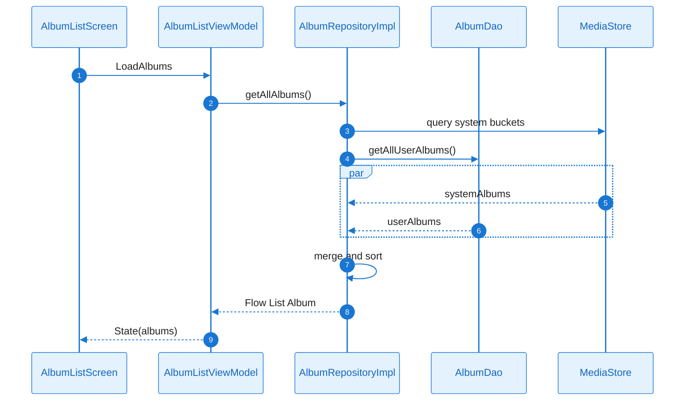
```mermaid
%%{init: {'theme': 'base', 'themeVariables': { 'actorBkg': '#E3F2FD', 'actorBorder': '#1976D2', 'actorTextColor': '#1565C0', 'signalColor': '#1976D2', 'signalTextColor': '#212121', 'noteBkgColor': '#FFF8E1', 'noteBorderColor': '#FFC107'}}}%%
sequenceDiagram
    autonumber
    
    participant UI as AlbumListScreen
    participant VM as AlbumListViewModel
    participant Repo as AlbumRepositoryImpl
    participant Dao as AlbumDao
    participant MS as MediaStore

    UI->>VM: LoadAlbums
    VM->>Repo: getAllAlbums()
    Repo->>MS: query system buckets
    Repo->>Dao: getAllUserAlbums()
    par
        MS-->>Repo: systemAlbums
        Dao-->>Repo: userAlbums
    end
    Repo->>Repo: merge and sort
    Repo-->>VM: Flow List Album
    VM-->>UI: State(albums)
```

###### SEQ-002：创建图集

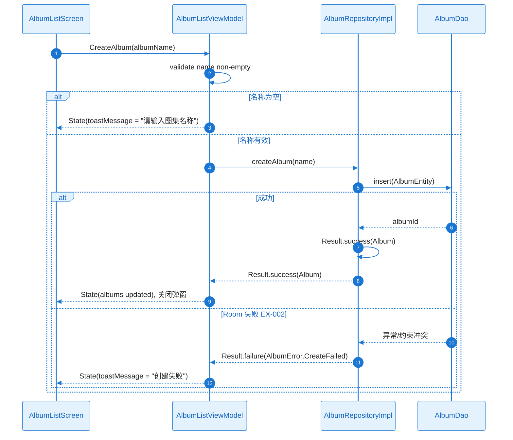
```mermaid
%%{init: {'theme': 'base', 'themeVariables': { 'actorBkg': '#E3F2FD', 'actorBorder': '#1976D2', 'actorTextColor': '#1565C0', 'signalColor': '#1976D2', 'signalTextColor': '#212121', 'noteBkgColor': '#FFF8E1', 'noteBorderColor': '#FFC107'}}}%%
sequenceDiagram
    autonumber

    participant UI as AlbumListScreen
    participant VM as AlbumListViewModel
    participant Repo as AlbumRepositoryImpl
    participant Dao as AlbumDao

    UI->>VM: CreateAlbum(albumName)
    VM->>VM: validate name non-empty

    alt 名称为空
        VM-->>UI: State(toastMessage = "请输入图集名称")
    else 名称有效
        VM->>Repo: createAlbum(name)
        Repo->>Dao: insert(AlbumEntity)

        alt 成功
            Dao-->>Repo: albumId
            Repo->>Repo: Result.success(Album)
            Repo-->>VM: Result.success(Album)
            VM-->>UI: State(albums updated), 关闭弹窗
        else Room 失败 EX-002
            Dao-->>Repo: 异常/约束冲突
            Repo-->>VM: Result.failure(AlbumError.CreateFailed)
            VM-->>UI: State(toastMessage = "创建失败")
        end
    end
```

###### SEQ-003：添加照片到图集

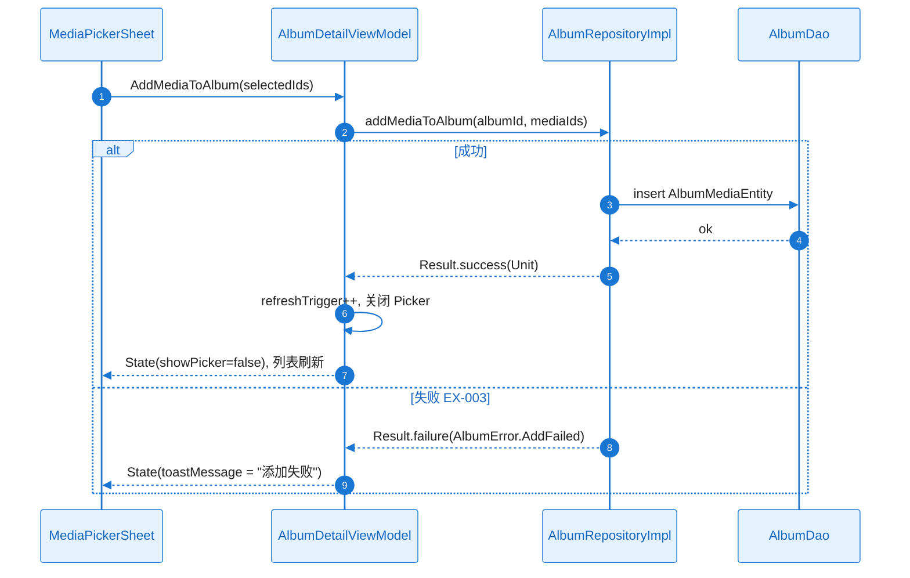
```mermaid
%%{init: {'theme': 'base', 'themeVariables': { 'actorBkg': '#E3F2FD', 'actorBorder': '#1976D2', 'actorTextColor': '#1565C0', 'signalColor': '#1976D2', 'signalTextColor': '#212121', 'noteBkgColor': '#FFF8E1', 'noteBorderColor': '#FFC107'}}}%%
sequenceDiagram
    autonumber

    participant UI as MediaPickerSheet
    participant VM as AlbumDetailViewModel
    participant Repo as AlbumRepositoryImpl
    participant Dao as AlbumDao

    UI->>VM: AddMediaToAlbum(selectedIds)
    VM->>Repo: addMediaToAlbum(albumId, mediaIds)

    alt 成功
        Repo->>Dao: insert AlbumMediaEntity
        Dao-->>Repo: ok
        Repo-->>VM: Result.success(Unit)
        VM->>VM: refreshTrigger++, 关闭 Picker
        VM-->>UI: State(showPicker=false), 列表刷新
    else 失败 EX-003
        Repo-->>VM: Result.failure(AlbumError.AddFailed)
        VM-->>UI: State(toastMessage = "添加失败")
    end
```

#### A3.3 第三层：组件内部详细设计

##### 组件 1：AlbumRepositoryImpl（系统图集 + 用户图集合并）

- **定位**：合并 MediaStore bucket 查询与 Room 用户图集，提供统一图集列表；实现 CRUD。
- **对外接口**：getAllAlbums()、createAlbum()、deleteAlbum()、addMediaToAlbum()、removeMediaFromAlbum()
- **失败与降级**：Room 写入失败返回 Result.Error；系统图集查询失败返回空列表

###### 技术实现路径（开发可照此落码）

| 步骤 | 落点 | 实现要点 |
|------|------|----------|
| 1 | `querySystemBuckets()` | MediaStore 无原生 GROUP BY，需查询 `projection=(_ID, BUCKET_ID, BUCKET_DISPLAY_NAME, DATE_TAKEN)` 全量或分页后，在内存中 `groupBy { it.bucketId }` 得到唯一 bucket 列表，每组 count 为 itemCount；或逐 bucket 查询 `COUNT(*) WHERE BUCKET_ID=?`。构建 `Album(id=bucketId, name=bucketDisplayName, type=System, itemCount)`，id 可用 `"sys_$bucketId"` 字符串或专用 Long 域与 Room id 区分 |
| 2 | itemCount 计算 | 系统 bucket 的 itemCount 可二次查询 `count(*) WHERE BUCKET_ID=?`，或单次查询用 `COUNT(*)` 在 GROUP BY 中；注意 Cursor 列索引与 projection 一致 |
| 3 | Room 表 album | `id` 自增主键，`name` TEXT，`type` TEXT 默认 'User'，`createdAt` LONG；`album_media` 表 `album_id` + `media_id` 复合主键 |
| 4 | `getAllUserAlbums()` | DAO 返回 `Flow<List<AlbumEntity>>`；AlbumEntity 需 @Relation 或手动 join 得到每个 user album 的 itemCount（`SELECT album_id, COUNT(*) FROM album_media GROUP BY album_id`） |
| 5 | `mergeSystemAndUser(system, user)` | 排序规则：先系统图集按 BUCKET_DISPLAY_NAME 升序，再用户图集按 createdAt 降序；或统一按 name 升序；合并后 `Flow.combine(flowSystem, flowUser) { s, u -> merge(s, u) }` |
| 6 | `createAlbum(name)` | `albumDao.insert(AlbumEntity(name=name, type="User", createdAt=System.currentTimeMillis()))`；检查 name 非空、trim；重名可用 `@Insert(onConflict=REPLACE)` 或先查询存在则返回 `Result.failure(AlbumError.CreateFailed)` |
| 7 | `addMediaToAlbum(albumId, mediaIds)` | 校验 albumId 为 User 类型；`mediaIds.forEach { albumMediaDao.insert(AlbumMediaEntity(albumId, it)) }`；使用 `@Insert(onConflict=IGNORE)` 防重复；在 `withContext(Dispatchers.IO)` 内执行 |
| 8 | `removeMediaFromAlbum(albumId, mediaId)` | `albumMediaDao.deleteByAlbumAndMedia(albumId, mediaId)` |
| 9 | `deleteAlbum(album)` | 校验 `album.type == User`；先 `albumMediaDao.deleteByAlbumId(album.id)`，再 `albumDao.delete(album.id)` |

###### 关键数据结构

```
系统 bucket 查询投影（GROUP BY BUCKET_ID）:
  BUCKET_ID (Long) → Album.id，注意与 Room 自增 id 区分，可用负 id 或 prefix（如 "sys_"+bucketId）
  BUCKET_DISPLAY_NAME (String) → Album.name
  COUNT(*) 或单独 count 查询 → itemCount

排序规则：系统图集先、按名称；用户图集后、按创建时间倒序
```

###### 线程与生命周期

| 项目 | 约束 |
|------|------|
| 执行线程 | getAllAlbums 的 Flow 在 collect 时于 Dispatchers.IO；create/add/remove 需 `runBlocking` 或 `suspend` + `withContext(IO)` |
| 事务 | addMediaToAlbum 多 mediaIds 时可包裹 `@Transaction` 或 `database.runInTransaction` |

###### 组件详细类图

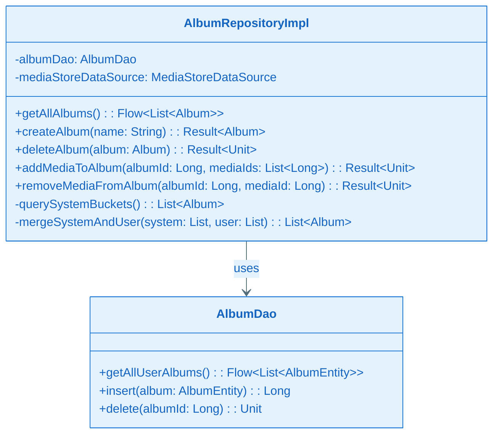
```mermaid
%%{init: {'theme': 'base', 'themeVariables': { 'primaryColor': '#E3F2FD', 'primaryTextColor': '#1565C0', 'primaryBorderColor': '#1976D2', 'lineColor': '#546E7A'}}}%%
classDiagram
    direction TB
    
    class AlbumRepositoryImpl {
        -albumDao: AlbumDao
        -mediaStoreDataSource: MediaStoreDataSource
        +getAllAlbums(): Flow~List~Album~~
        +createAlbum(name: String): Result~Album~
        +deleteAlbum(album: Album): Result~Unit~
        +addMediaToAlbum(albumId: Long, mediaIds: List~Long~): Result~Unit~
        +removeMediaFromAlbum(albumId: Long, mediaId: Long): Result~Unit~
        -querySystemBuckets(): List~Album~
        -mergeSystemAndUser(system: List, user: List): List~Album~
    }
    
    class AlbumDao {
        +getAllUserAlbums(): Flow~List~AlbumEntity~~
        +insert(album: AlbumEntity): Long
        +delete(albumId: Long): Unit
    }
    
    AlbumRepositoryImpl --> AlbumDao : uses
```

###### 异常清单

| 异常ID | 触发条件 | 错误类型 | 可重试 | 对策 |
|--------|----------|----------|--------|------|
| EX-001 | MediaStore 权限拒绝 | PermissionDenied | 是 | 空态 |
| EX-002 | Room insert 失败（重名等） | AlbumError.CreateFailed | 否 | Toast |
| EX-003 | addMediaToAlbum 失败 | AlbumError.AddFailed | 否 | Toast |

###### 组件完整详细时序图：createAlbum 与 addMediaToAlbum

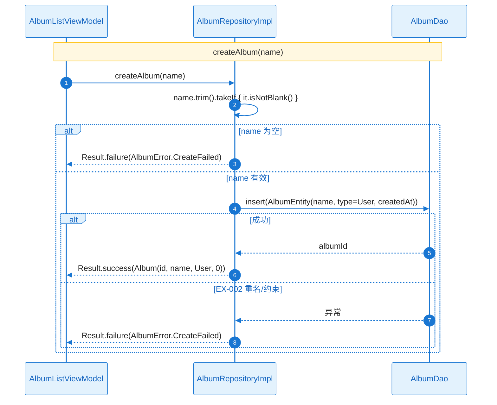
```mermaid
%%{init: {'theme': 'base', 'themeVariables': { 'actorBkg': '#E3F2FD', 'actorBorder': '#1976D2', 'actorTextColor': '#1565C0', 'signalColor': '#1976D2', 'signalTextColor': '#212121', 'noteBkgColor': '#FFF8E1', 'noteBorderColor': '#FFC107'}}}%%
sequenceDiagram
    autonumber

    participant VM as AlbumListViewModel
    participant Repo as AlbumRepositoryImpl
    participant Dao as AlbumDao

    Note over VM, Dao: createAlbum(name)
    VM->>Repo: createAlbum(name)
    Repo->>Repo: name.trim().takeIf { it.isNotBlank() }

    alt name 为空
        Repo-->>VM: Result.failure(AlbumError.CreateFailed)
    else name 有效
        Repo->>Dao: insert(AlbumEntity(name, type=User, createdAt))
        alt 成功
            Dao-->>Repo: albumId
            Repo-->>VM: Result.success(Album(id, name, User, 0))
        else EX-002 重名/约束
            Dao-->>Repo: 异常
            Repo-->>VM: Result.failure(AlbumError.CreateFailed)
        end
    end
```

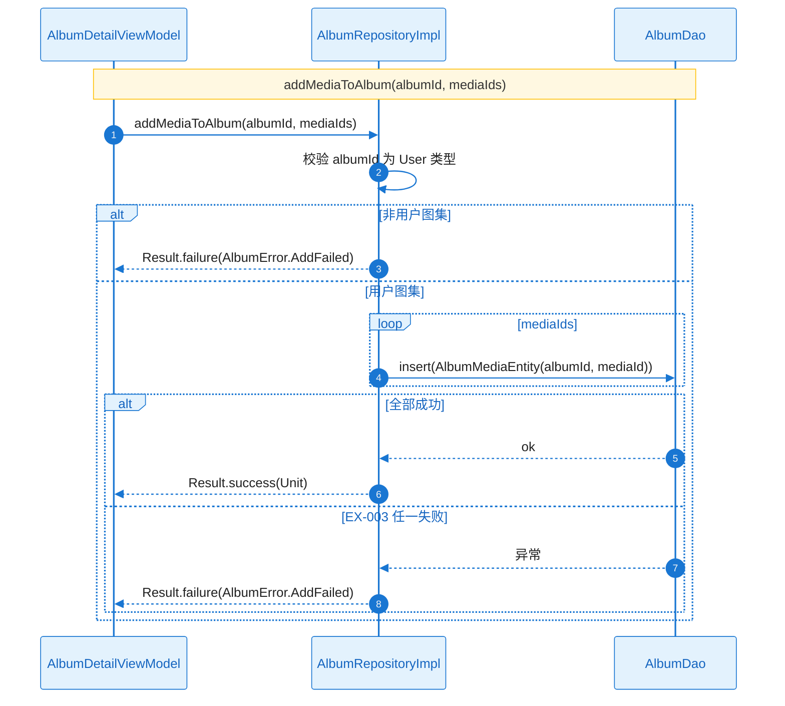
```mermaid
%%{init: {'theme': 'base', 'themeVariables': { 'actorBkg': '#E3F2FD', 'actorBorder': '#1976D2', 'actorTextColor': '#1565C0', 'signalColor': '#1976D2', 'signalTextColor': '#212121', 'noteBkgColor': '#FFF8E1', 'noteBorderColor': '#FFC107'}}}%%
sequenceDiagram
    autonumber

    participant VM as AlbumDetailViewModel
    participant Repo as AlbumRepositoryImpl
    participant Dao as AlbumDao

    Note over VM, Dao: addMediaToAlbum(albumId, mediaIds)
    VM->>Repo: addMediaToAlbum(albumId, mediaIds)
    Repo->>Repo: 校验 albumId 为 User 类型

    alt 非用户图集
        Repo-->>VM: Result.failure(AlbumError.AddFailed)
    else 用户图集
        loop mediaIds
            Repo->>Dao: insert(AlbumMediaEntity(albumId, mediaId))
        end
        alt 全部成功
            Dao-->>Repo: ok
            Repo-->>VM: Result.success(Unit)
        else EX-003 任一失败
            Dao-->>Repo: 异常
            Repo-->>VM: Result.failure(AlbumError.AddFailed)
        end
    end
```

##### 组件 2：AlbumDetailViewModel + MediaPickerSheet

- **定位**：图集内列表管理、按 MediaTypeFilter 筛选、选图面板多选添加、移出照片。
- **对外接口**：onIntent(AlbumDetailIntent)；State 含 items、mediaTypeFilter、showPicker
- **失败与降级**：添加/移出失败 Toast

###### 技术实现路径（开发可照此落码）

| 步骤 | 落点 | 实现要点 |
|------|------|----------|
| 1 | 图集内列表数据源 | 复用 MediaRepository，扩展 `getMediaPagerByAlbum(albumId, mediaTypeFilter)` 或 FEAT-001 的 getMediaPager 增加 `albumId` 参数；selection 加 `_ID IN (SELECT media_id FROM album_media WHERE album_id=?)`；mediaTypeFilter 对应 MIME_TYPE 过滤（Image→image/%，Video→video/%，GIF→image/gif，LivePhoto→需 HEIC+mov 配对，Dolby→video/ 等） |
| 2 | MediaPickerSheet 数据源 | 从时间轴或全库选图：调用 `MediaRepository.getMediaPager(viewMode=Day, filter=null)` 或独立 `getAllMediaForPicker()`；BottomSheet 内 LazyVerticalGrid 多选，`selectedIds: Set<Long>` 由 ViewModel State 管理 |
| 3 | 添加照片流程 | `AddMediaToAlbum(mediaIds)` → `albumRepository.addMediaToAlbum(albumId, mediaIds)`；成功则 `refresh()` 图集内列表（Paging refresh 或重新 collect）；失败则 `State.copy(toastMessage = "添加失败")` |
| 4 | 移出照片 | `RemoveMedia(mediaId)` → `albumRepository.removeMediaFromAlbum(albumId, mediaId)`；成功后同上刷新 |
| 5 | MediaTypeFilter UI | TabRow 或 ChipGroup：Image/Video/GIF/LivePhoto/DolbyVideo；选择后更新 `State.mediaTypeFilter`，触发重新查询 |
| 6 | 进入大图 | 与 FEAT-001 一致，构造 `MediaViewerContext(itemList=当前图集内可见 items, currentIndex, source="album")`；itemList 可从 LazyPagingItems.snapshot() 或 ViewModel 维护的当前页数据获取 |

###### 状态与数据流

```
AddMedia 流程:
  UI(MediaPickerSheet) 确认 → onIntent(AddMediaToAlbum(selectedIds))
  → ViewModel: viewModelScope.launch(Dispatchers.IO) {
        albumRepository.addMediaToAlbum(albumId, selectedIds)
            .onSuccess { _pagingData.refresh() 或 State.refreshTrigger++ }
            .onFailure { State = State.copy(toastMessage = "添加失败") }
    }
```

###### 组件详细类图

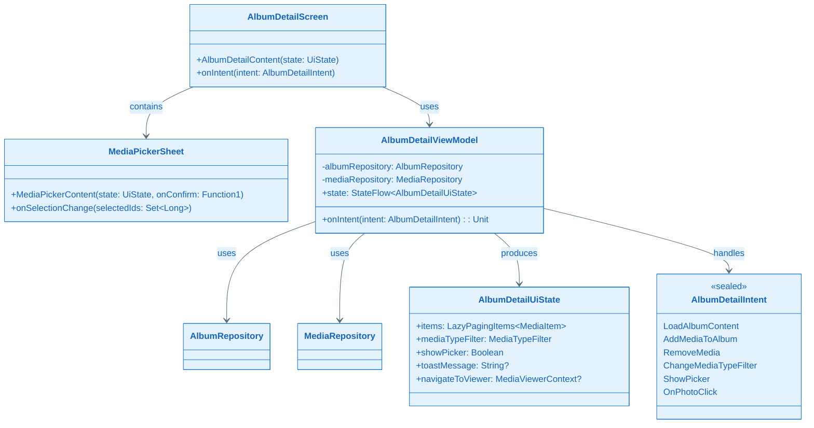
```mermaid
%%{init: {'theme': 'base', 'themeVariables': { 'primaryColor': '#E3F2FD', 'primaryTextColor': '#1565C0', 'primaryBorderColor': '#1976D2', 'lineColor': '#546E7A'}}}%%
classDiagram
    direction TB

    class AlbumDetailScreen {
        +AlbumDetailContent(state: UiState)
        +onIntent(intent: AlbumDetailIntent)
    }

    class MediaPickerSheet {
        +MediaPickerContent(state: UiState, onConfirm: Function1)
        +onSelectionChange(selectedIds: Set~Long~)
    }

    class AlbumDetailViewModel {
        -albumRepository: AlbumRepository
        -mediaRepository: MediaRepository
        +state: StateFlow~AlbumDetailUiState~
        +onIntent(intent: AlbumDetailIntent): Unit
    }

    class AlbumDetailUiState {
        +items: LazyPagingItems~MediaItem~
        +mediaTypeFilter: MediaTypeFilter
        +showPicker: Boolean
        +toastMessage: String?
        +navigateToViewer: MediaViewerContext?
    }

    class AlbumDetailIntent {
        <<sealed>>
        LoadAlbumContent
        AddMediaToAlbum
        RemoveMedia
        ChangeMediaTypeFilter
        ShowPicker
        OnPhotoClick
    }

    AlbumDetailScreen --> AlbumDetailViewModel : uses
    AlbumDetailScreen --> MediaPickerSheet : contains
    AlbumDetailViewModel --> AlbumRepository : uses
    AlbumDetailViewModel --> MediaRepository : uses
    AlbumDetailViewModel --> AlbumDetailUiState : produces
    AlbumDetailViewModel --> AlbumDetailIntent : handles
```

###### 组件完整详细时序图：AddMedia 与进入大图

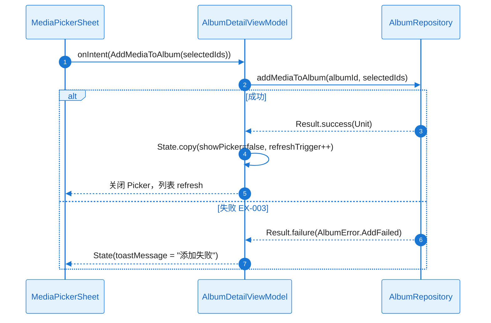
```mermaid
%%{init: {'theme': 'base', 'themeVariables': { 'actorBkg': '#E3F2FD', 'actorBorder': '#1976D2', 'actorTextColor': '#1565C0', 'signalColor': '#1976D2', 'signalTextColor': '#212121', 'noteBkgColor': '#FFF8E1', 'noteBorderColor': '#FFC107'}}}%%
sequenceDiagram
    autonumber

    participant UI as MediaPickerSheet
    participant VM as AlbumDetailViewModel
    participant Repo as AlbumRepository

    UI->>VM: onIntent(AddMediaToAlbum(selectedIds))
    VM->>Repo: addMediaToAlbum(albumId, selectedIds)

    alt 成功
        Repo-->>VM: Result.success(Unit)
        VM->>VM: State.copy(showPicker=false, refreshTrigger++)
        VM-->>UI: 关闭 Picker，列表 refresh
    else 失败 EX-003
        Repo-->>VM: Result.failure(AlbumError.AddFailed)
        VM-->>UI: State(toastMessage = "添加失败")
    end
```

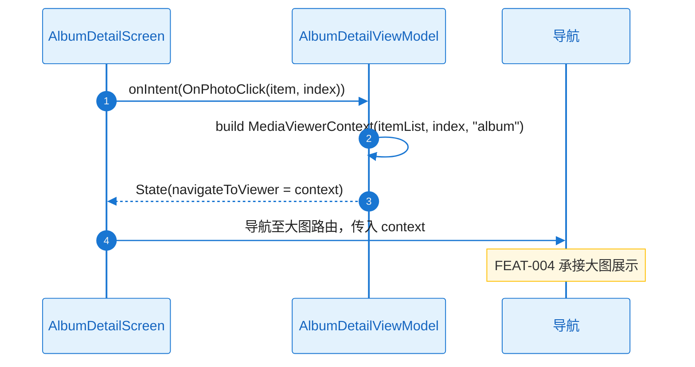
```mermaid
%%{init: {'theme': 'base', 'themeVariables': { 'actorBkg': '#E3F2FD', 'actorBorder': '#1976D2', 'actorTextColor': '#1565C0', 'signalColor': '#1976D2', 'signalTextColor': '#212121', 'noteBkgColor': '#FFF8E1', 'noteBorderColor': '#FFC107'}}}%%
sequenceDiagram
    autonumber

    participant UI as AlbumDetailScreen
    participant VM as AlbumDetailViewModel
    participant Nav as 导航

    UI->>VM: onIntent(OnPhotoClick(item, index))
    VM->>VM: build MediaViewerContext(itemList, index, "album")
    VM-->>UI: State(navigateToViewer = context)
    UI->>Nav: 导航至大图路由，传入 context
    Note over Nav: FEAT-004 承接大图展示
```

###### 异常清单

| 异常ID | 触发条件 | 错误类型 | 可重试 | 对策 |
|--------|----------|----------|--------|------|
| EX-003 | addMediaToAlbum 失败 | AlbumError | 否 | Toast |

---

### A4. 技术风险与消解策略

| 风险ID | 风险描述 | 触发条件 | 影响范围 | 严重度 | 消解策略 | 对应 Story |
|--------|----------|----------|----------|--------|----------|-------------|
| RISK-001 | Room Migration 失败 | schema 变更 | 用户图集丢失 | High | Migration 单元测试、灰度 | ST-001 |
| RISK-002 | 系统图集与用户图集合并顺序不稳定 | 数据源时序 | 列表跳动 | Low | 固定排序规则 | ST-001 |

### A5. 边界 & 异常场景枚举

- **数据边界**：空图集、图集名称重复、mediaId 不存在
- **状态边界**：添加/移出与列表刷新并发
- **生命周期**：旋转时 Picker 状态
- **用户行为**：快速连点添加、删除系统图集（禁止）

#### A5.1 场景 → 应对措施对照表

| 场景ID | 场景类别 | 触发条件 | 影响 | 预期行为 | 技术对策 | 设计对策 | 映射 |
|--------|----------|----------|------|----------|----------|----------|------|
| SC-001 | 权限 | MediaStore 拒绝 | 系统图集为空 | 空态/引导 | 同 FEAT-001 | 引导 | EX-001 |
| SC-002 | 数据 | 图集名重复 | 创建失败 | Toast 提示 | Result.Error | 提示重试 | EX-002 |
| SC-003 | 用户 | 删除系统图集 | 禁止 | 无删除入口 | type=System 隐藏删除 | N/A | — |

### A6. 算法评估

N/A（本 Feature 不涉及算法）

### A7. 功耗评估

#### A7.1 Top 5% 重度用户模型

| 维度 | 定义 |
|------|------|
| 设备 | 中端机型 |
| 使用频次 | 每天图集操作 3–5 次 |
| 场景 | 前台浏览、添加/移出照片 |

#### A7.2 场景评估

| 场景 | 电流增量 | 时长 | 每日功耗 |
|------|----------|------|----------|
| 图集列表浏览 | ~40 mA | 30s | ~0.07 mAh |
| 添加照片 | ~50 mA | 10s | ~0.01 mAh |

**验收标准**：每日功耗 ≤ 5 mAh；温升 ≤ 0.5°C

#### A7.4 降级策略

| 触发条件 | 降级策略 |
|----------|----------|
| 低电量 | 降低预取 |
| 高温 | 暂停后台同步（若后续有） |

### A8. 性能评估

| 场景 | 指标 | 验收标准 (p95) |
|------|------|----------------|
| 图集列表加载 | TTI | ≤ 800ms |
| 图集内列表 | 滚动帧率 | ≥ 55fps |
| 缩图 | 无白块 | 即滑即现 |

#### A8.4 降级策略

| 触发条件 | 降级策略 |
|----------|----------|
| 低端机 | 降低 pageSize |

### A9. 内存评估

| 场景 | 验收标准 | 主要来源 |
|------|----------|----------|
| 图集列表 | PSS ≤ 60MB | 列表、缩图缓存 |
| 图集内列表 | PSS ≤ 90MB | 同 FEAT-001 |
| 进出 10 次 | 回 Baseline ±5MB | 泄漏检测 |

### A10. 安全评估

| 安全点 | 防护措施 |
|--------|----------|
| 媒体库访问 | 同 FEAT-001，最小权限 |
| 系统图集 | 不可删除，仅读 |

### A11. 兼容性评估

- **系统**：Android 10+ (API 29+)
- **设备**：中端及以上
- **Room Migration**：v1 初版；后续变更需 Migration 测试
- **MediaStore bucket**：验证 BUCKET_ID 在各机型一致性

**兼容性结论**：风险较低，需重点测试 Room Migration 与多机型 bucket 查询。

---

## Plan-B：技术规约 & 实现约束

### B0. Plan-A ↔ Plan-B 一致性与互校（必须）

| Plan-A | Plan-B | 自检 |
|---|---|---|
| A0 领域概念 | B3、B4 | 术语一致 |
| A1 Room 用户图集 | B3.2 | 表结构匹配 |
| A2 复用 MediaRepository | B4.2 | 接口引用正确 |
| A3 错误传播 | B2、B4 | 错误类型一致 |

### B1. 技术背景

**Language/Version**：Kotlin 2.1.21
**Primary Dependencies**：Jetpack Compose、Room、Coil、Lifecycle、Material3
**Storage**：Room（用户图集）+ MediaStore（系统图集、媒体项）
**Target Platform**：Android 10+ (API 29+)
**Performance Targets**：图集列表与图集内列表缩图即滑即现

### B2. 架构细化

- **分层约束**：同 FEAT-001
- **线程模型**：IO 在 Dispatchers.IO
- **错误处理**：Result/sealed class；增删失败 Toast

### B3. 数据模型

#### B3.1 存储形态与边界

- **存储形态**：Room（用户图集元数据 + album_media 关联表）；MediaStore（系统图集、媒体项 SoR）
- **System of Record**：MediaStore 为媒体项 SoR；Room 为用户图集与关联 SoR
- **缓存**：Coil 缩图；图集列表可 Flow 热数据

#### B3.2 物理数据结构（Room）

| 表 | 用途 | 主键 | 说明 |
|---|---|---|---|
| album | 用户图集元数据 | id | name, type=User, createdAt |
| album_media | 图集-媒体项关联 | albumId, mediaId | 多对多 |

**Migration**：v1 初版；后续新增字段需 Migration。

### B4. 接口规范/协议

#### B4.1 本 Feature 对外提供的接口

| 接口 | 用途 | 调用方 |
|---|---|---|
| AlbumRepository | 图集 CRUD、查询 | FEAT-003 搜索（图集维度条件） |
| Album 实体 | 图集数据 | FEAT-003 |

#### B4.2 本 Feature 依赖的外部接口

| 依赖 | 引用 |
|---|---|
| MediaRepository | FEAT-001 plan.md Plan-B:B4.1 |
| MediaViewerContext | FEAT-001 plan.md Plan-B:B4.1 |

### B5. 合规性检查

- [ ] 仅操作用户授权范围内的媒体库
- [ ] 系统图集不提供删除
- [ ] 增删失败明确提示

### B6. 项目结构（本 Feature）

```
specs/epics/EPIC-004-android-gallery/features/FEAT-002-album-management/
├── spec.md
├── plan.md
└── checklists/
    └── requirements.md
```

### B7. 源代码结构（代码库根目录）

```text
feature-gallery/
  src/main/java/.../gallery/
    album/
      AlbumListScreen.kt
      AlbumDetailScreen.kt
      AlbumListViewModel.kt
      AlbumDetailViewModel.kt
      CreateAlbumDialog.kt
      MediaPickerSheet.kt
    data/
      album/
        AlbumRepositoryImpl.kt
        AlbumDao.kt
        AlbumEntity.kt
        AlbumDatabase.kt
    domain/
      Album.kt
      AlbumRepository.kt
```

**说明**：与 FEAT-001 共处 `:feature-gallery`，按 album 分包；AlbumDatabase 可与时序数据层共用或独立，视后续 Migration 需求。

---

## Story Breakdown（Plan Level = Standard 时执行）

### Story 列表

#### ST-001：Room 数据库与图集数据访问

- **类型**：Infrastructure
- **描述**：AlbumDatabase、AlbumEntity、AlbumDao、album_media 关联表；AlbumRepositoryImpl 合并系统 bucket + 用户图集；getAllAlbums、createAlbum、deleteAlbum、addMediaToAlbum、removeMediaFromAlbum
- **目标**：图集 CRUD 可用，列表正确合并系统+用户
- **预估工作量**：5 人天
- **覆盖 FR/NFR**：FR-001、FR-002、FR-003、FR-004；NFR-REL-001
- **依赖**：FEAT-001 MediaRepository
- **可并行**：否
- **关键风险**：是（RISK-001）
- **验收/验证方式**：单元测试 DAO、Repository；Migration 测试
- **交付物**：AlbumDatabase、AlbumDao、AlbumRepositoryImpl

#### ST-002：图集列表 UI 与创建/删除

- **类型**：Functional
- **描述**：AlbumListScreen、AlbumListViewModel、CreateAlbumDialog；新增图集、删除用户图集（系统图集无删除入口）
- **目标**：图集列表展示、创建、删除可用
- **预估工作量**：4 人天
- **覆盖 FR/NFR**：FR-001、FR-002、FR-003
- **依赖**：ST-001
- **可并行**：否
- **验收/验证方式**：UI 测试
- **交付物**：AlbumListScreen、CreateAlbumDialog

#### ST-003：图集内列表与按类型筛选

- **类型**：Functional
- **描述**：AlbumDetailScreen、AlbumDetailViewModel；MediaRepository 按 albumId 筛选；MediaTypeFilter（图片、视频、GIF、实况、杜比）；复用 FEAT-001 网格+进入大图
- **目标**：图集内照片列表、按类型查看、进入大图
- **预估工作量**：5 人天
- **覆盖 FR/NFR**：FR-005、FR-006；NFR-PERF-001
- **依赖**：ST-001、FEAT-001
- **可并行**：否
- **验收/验证方式**：UI 测试类型筛选
- **交付物**：AlbumDetailScreen、MediaTypeFilter 集成

#### ST-004：选图面板与添加/移出照片

- **类型**：Functional
- **描述**：MediaPickerSheet（BottomSheet + 多选网格）；添加照片、移出照片；失败 Toast
- **目标**：向图集添加、移出照片，数据一致
- **预估工作量**：4 人天
- **覆盖 FR/NFR**：FR-004；NFR-REL-001
- **依赖**：ST-003
- **可并行**：否
- **验收/验证方式**：端到端测试添加/移出
- **交付物**：MediaPickerSheet、添加/移出逻辑

### Story 依赖关系图

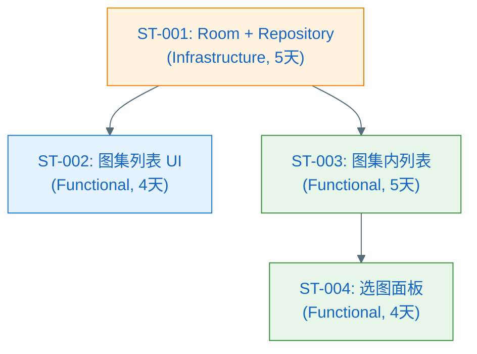
```mermaid
%%{init: {'theme': 'base', 'themeVariables': { 'primaryColor': '#E3F2FD', 'primaryTextColor': '#1565C0', 'primaryBorderColor': '#1976D2', 'lineColor': '#546E7A'}}}%%
flowchart TD
    ST001["ST-001: Room + Repository<br/>(Infrastructure, 5天)"]
    ST002["ST-002: 图集列表 UI<br/>(Functional, 4天)"]
    ST003["ST-003: 图集内列表<br/>(Functional, 5天)"]
    ST004["ST-004: 选图面板<br/>(Functional, 4天)"]
    
    ST001 --> ST002
    ST001 --> ST003
    ST003 --> ST004
    
    style ST001 fill:#FFF3E0,stroke:#F57C00
    style ST002 fill:#E3F2FD,stroke:#1976D2
    style ST003 fill:#E8F5E9,stroke:#388E3C
    style ST004 fill:#E8F5E9,stroke:#388E3C
```

### Feature → Story 覆盖矩阵

| FR/NFR ID | 覆盖的 Story ID |
|-----------|-----------------|
| FR-001 | ST-001, ST-002 |
| FR-002 | ST-001, ST-002 |
| FR-003 | ST-001, ST-002 |
| FR-004 | ST-001, ST-004 |
| FR-005 | ST-003 |
| FR-006 | ST-003 |
| NFR-PERF-001 | ST-003 |
| NFR-REL-001 | ST-001, ST-004 |

### Story 工作量汇总

| Story ID | 类型 | 预估（人天） | 依赖 |
|----------|------|-------------|------|
| ST-001 | Infrastructure | 5 | 无 |
| ST-002 | Functional | 4 | ST-001 |
| ST-003 | Functional | 5 | ST-001 |
| ST-004 | Functional | 4 | ST-003 |
| **总计** | — | **18 人天** | — |

---

## Story Detailed Design（Plan Level = Deep 时执行）

各 Story 的 L2 二层详细设计已写入 **[story_detail_design.md](./story_detail_design.md)**，覆盖 ST-001～ST-004，包含：目标与 DoD、代码落点与边界、核心接口与契约、类图、时序图（含正常+异常）、异常矩阵、并发/生命周期/资源管理、验证与测试设计。

tasks.md 的 Task 应引用：`story_detail_design.md:ST-xxx:功能设计:时序图` 等入口。
