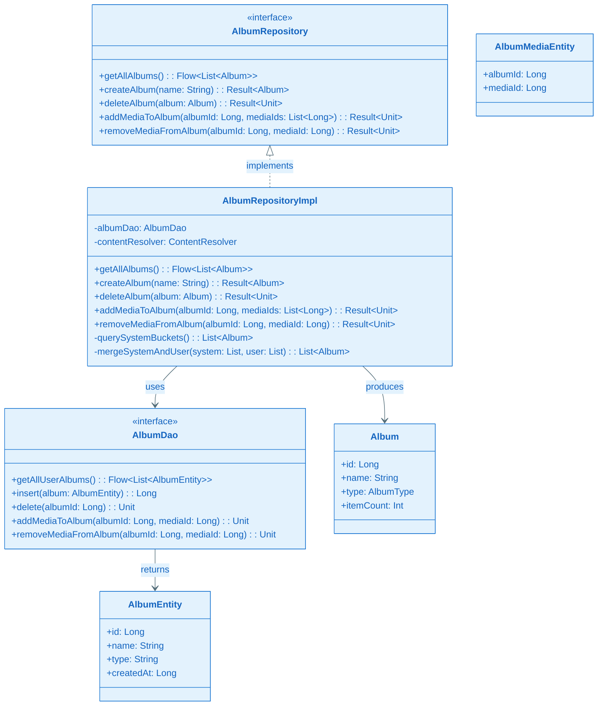
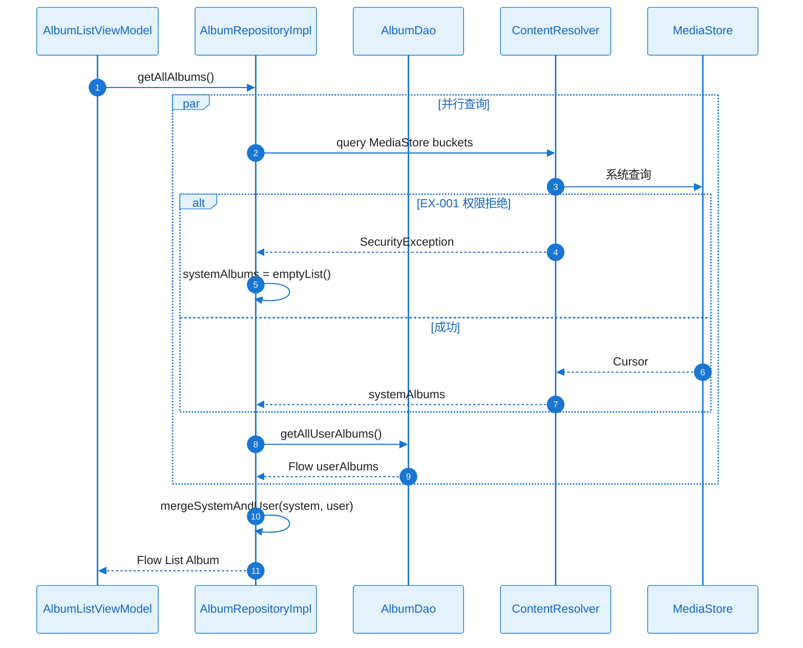
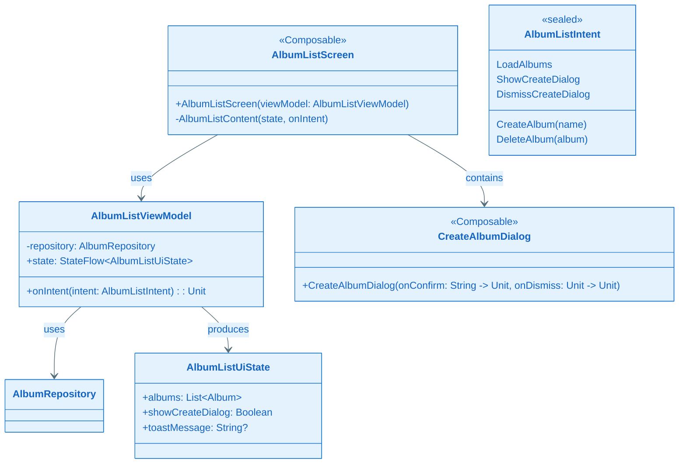
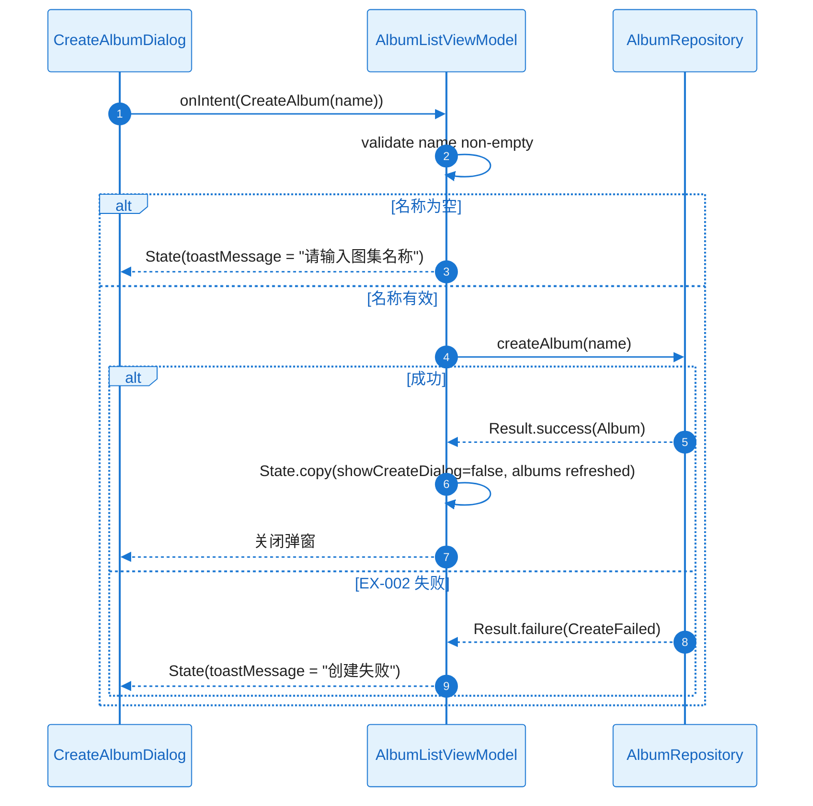
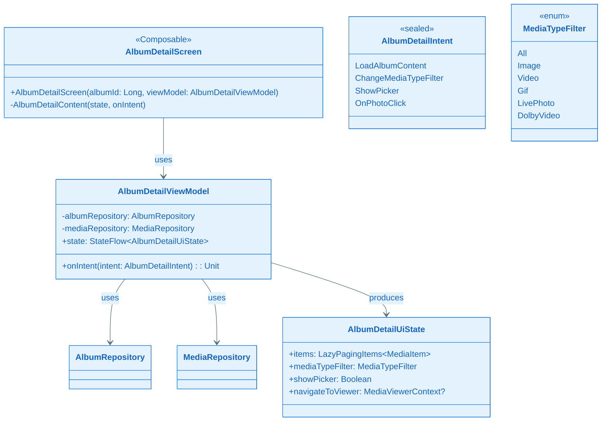
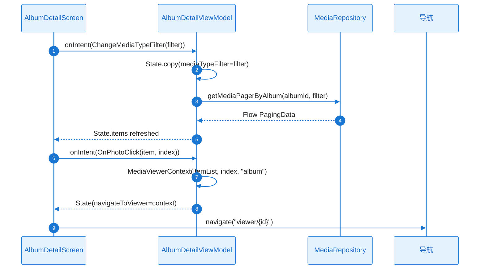
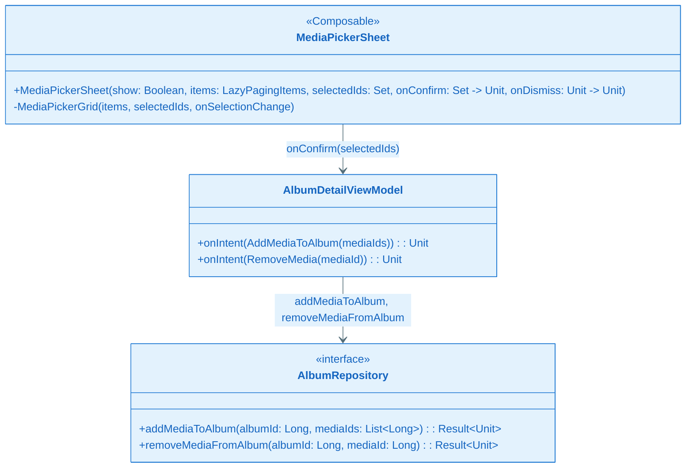
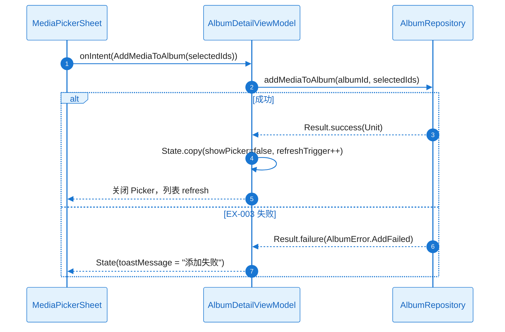

# L2 Story 详细设计（二层详细设计）：FEAT-002 图集管理

本文档与 **plan.md** 配套使用：Plan Level = Deep 时，各 Story 的 L2 详细设计在此文档中编写。

**Feature**：FEAT-002 图集管理  
**Plan Version**：v0.1.4  
**覆盖 Story**：ST-001～ST-004

---

## ST-001 Detailed Design：Room 数据库与图集数据访问

#### 1) 需求及描述

- **需求描述**：实现 AlbumDatabase、AlbumEntity、AlbumDao、album_media 关联表；AlbumRepositoryImpl 合并系统 bucket（MediaStore）与用户图集（Room）；getAllAlbums、createAlbum、deleteAlbum、addMediaToAlbum、removeMediaFromAlbum。
- **需求依赖**：FEAT-001 MediaRepository（接口与 MediaItem）；Android MediaStore、Room
- **使用范围**：AlbumListViewModel、AlbumDetailViewModel、FEAT-003 图集维度条件
- **使用接口**：`AlbumRepository.getAllAlbums(): Flow<List<Album>>`；`createAlbum(name)`；`deleteAlbum(album)`；`addMediaToAlbum(albumId, mediaIds)`；`removeMediaFromAlbum(albumId, mediaId)`
- **DoD（验收标准）**：
  - [ ] 图集 CRUD 可用；列表正确合并系统+用户
  - [ ] 单元测试 DAO、Repository；Migration 测试

#### 2) 功能设计

##### 功能设计关键说明

**核心实现思路**：
- 系统图集通过 MediaStore 查询 BUCKET_ID、BUCKET_DISPLAY_NAME，内存 groupBy 得到唯一 bucket 列表；itemCount 二次 count 或单次 GROUP BY。
- 用户图集 Room 表 album（id, name, type, createdAt）、album_media（album_id, media_id）；AlbumDao 提供 insert/delete/addMedia/removeMedia；getAllUserAlbums 需 join 或 @Relation 得到 itemCount。
- mergeSystemAndUser：Flow.combine(flowSystem, flowUser)，固定排序（系统先按 name，用户后按 createdAt 倒序）。

**关键类与职责划分**：
- AlbumRepositoryImpl：querySystemBuckets、mergeSystemAndUser、CRUD 实现
- AlbumDao：Room DAO，getAllUserAlbums、insert、delete、addMedia、removeMedia
- AlbumEntity、AlbumMediaEntity：Room 实体
- Album：领域实体（id, name, type, itemCount）

**失败处理与边界**：
- MediaStore 权限拒绝 → 系统图集空，Result/Flow 中处理
- Room insert 重名/约束 → Result.failure(AlbumError.CreateFailed)
- addMedia 失败 → Result.failure(AlbumError.AddFailed)

##### 类图（完整详细）

**关键类职责说明**：

| 类/接口 | 核心职责 | 关键方法说明 |
|---------|----------|--------------|
| AlbumRepository | 图集 CRUD 契约 | getAllAlbums、createAlbum、deleteAlbum、addMedia、removeMedia |
| AlbumRepositoryImpl | 系统+用户图集合并实现 | querySystemBuckets、mergeSystemAndUser、CRUD |
| AlbumDao | Room DAO | getAllUserAlbums、insert、delete、addMedia、removeMedia |
| Album | 领域图集实体 | id/name/type/itemCount |

##### 时序图（完整详细：getAllAlbums 正常+异常）

##### 触发条件与系统响应

| 触发条件 | 系统响应（正常流程） | 异常处理 |
|----------|----------------------|----------|
| getAllAlbums | querySystemBuckets + getAllUserAlbums → merge → Flow | EX-001：systemAlbums 空 |
| createAlbum(name) | insert AlbumEntity → Result.success | EX-002：Result.failure(CreateFailed) |
| deleteAlbum | 校验 type=User → delete album_media → delete album | 非 User 返回 failure |
| addMediaToAlbum | insert AlbumMediaEntity 批量 | EX-003：Result.failure(AddFailed) |
| removeMediaFromAlbum | delete album_media 行 | — |

##### 异常矩阵

| 异常ID | 触发条件 | 错误类型 | 可重试 | 对策 |
|--------|----------|----------|--------|------|
| EX-001 | MediaStore 权限拒绝 | PermissionDenied | 是 | 空态/引导 |
| EX-002 | Room insert 失败（重名） | AlbumError.CreateFailed | 否 | Toast |
| EX-003 | addMediaToAlbum 失败 | AlbumError.AddFailed | 否 | Toast |

##### 并发/生命周期/资源管理

| 项目 | 约束 |
|------|------|
| 执行线程 | getAllAlbums Flow 在 Dispatchers.IO collect；CRUD 用 withContext(IO) |
| 事务 | addMediaToAlbum 多 mediaIds 用 @Transaction 或 runInTransaction |
| Migration | v1 初版；后续 schema 变更需 Migration 测试 |

##### 验证与测试设计

- **单元测试**：AlbumDao insert/delete/addMedia/removeMedia；AlbumRepositoryImpl merge 顺序
- **Migration 测试**：Room Migration 单元测试
- **Mock**：ContentResolver、AlbumDao

---

## ST-002 Detailed Design：图集列表 UI 与创建/删除

#### 1) 需求及描述

- **需求描述**：AlbumListScreen、AlbumListViewModel、CreateAlbumDialog；图集列表展示、新增图集、删除用户图集（系统图集无删除入口）。
- **需求依赖**：ST-001（AlbumRepository）
- **使用范围**：图集主屏
- **使用接口**：AlbumListScreen(viewModel)；CreateAlbumDialog(onConfirm, onDismiss)
- **DoD（验收标准）**：
  - [ ] 图集列表展示、创建、删除可用
  - [ ] UI 测试

#### 2) 功能设计

##### 功能设计关键说明

**核心实现思路**：
- AlbumListViewModel collect AlbumRepository.getAllAlbums() → State.albums；CreateAlbum(name) → createAlbum → 成功后刷新；DeleteAlbum(album) 校验 type=User → deleteAlbum。
- AlbumListScreen 展示 LazyColumn/Grid 图集卡片；FAB 或菜单触发 CreateAlbumDialog；长按/菜单删除（仅 User 图集显示删除入口）。
- CreateAlbumDialog：TextField 输入名称，确认时 onConfirm(name)；空名称校验。

**关键类与职责划分**：
- AlbumListScreen：图集列表 UI、CreateAlbumDialog 触发
- AlbumListViewModel：LoadAlbums、CreateAlbum、DeleteAlbum、State 管理
- CreateAlbumDialog：输入名称、确认/取消

##### 类图（完整详细）

**关键类职责说明**：

| 类/接口 | 核心职责 | 关键方法说明 |
|---------|----------|--------------|
| AlbumListScreen | 图集列表 UI | 消费 state、发送 onIntent、显示 CreateAlbumDialog |
| AlbumListViewModel | 图集列表 MVI | LoadAlbums、CreateAlbum、DeleteAlbum |
| CreateAlbumDialog | 创建图集弹窗 | onConfirm(name)、onDismiss |

##### 时序图（完整详细：CreateAlbum 正常+异常）

##### 触发条件与系统响应

| 触发条件 | 系统响应（正常流程） | 异常处理 |
|----------|----------------------|----------|
| LoadAlbums | collect getAllAlbums → State.albums | EX-001：空列表 |
| CreateAlbum(name) | createAlbum → 关闭弹窗、刷新 | EX-002：Toast |
| DeleteAlbum(album) | 校验 type=User → deleteAlbum → 刷新 | 非 User 无删除入口 |

##### 异常矩阵

| 异常ID | 触发条件 | 错误类型 | 可重试 | 对策 |
|--------|----------|----------|--------|------|
| EX-002 | createAlbum 失败 | AlbumError.CreateFailed | 否 | Toast |

##### 验证与测试设计

- **UI 测试**：列表渲染、CreateAlbumDialog 输入确认、删除仅 User 图集

---

## ST-003 Detailed Design：图集内列表与按类型筛选

#### 1) 需求及描述

- **需求描述**：AlbumDetailScreen、AlbumDetailViewModel；MediaRepository 按 albumId 筛选；MediaTypeFilter（图片、视频、GIF、实况、杜比）；复用 FEAT-001 网格+进入大图。
- **需求依赖**：ST-001、FEAT-001（MediaRepository、MediaViewerContext）
- **使用范围**：图集详情屏
- **使用接口**：AlbumDetailScreen(albumId)；MediaRepository.getMediaPagerByAlbum(albumId, mediaTypeFilter)
- **DoD（验收标准）**：
  - [ ] 图集内照片列表、按类型查看、进入大图
  - [ ] UI 测试类型筛选

#### 2) 功能设计

##### 功能设计关键说明

**核心实现思路**：
- MediaRepository 扩展 getMediaPagerByAlbum(albumId, mediaTypeFilter)：selection 加 albumId（用户图集 JOIN album_media；系统图集 BUCKET_ID）；mediaTypeFilter 对应 MIME_TYPE（Image→image/%，Video→video/%，GIF→image/gif 等）。
- AlbumDetailViewModel collect getMediaPagerByAlbum → State.items；ChangeMediaTypeFilter(filter) → 刷新；OnPhotoClick → MediaViewerContext → navigateToViewer。
- AlbumDetailScreen：TabRow/ChipGroup MediaTypeFilter；LazyVerticalGrid 复用 FEAT-001 网格；点击进入大图。

**关键类与职责划分**：
- AlbumDetailScreen：图集内列表、MediaTypeFilter UI、进入大图
- AlbumDetailViewModel：LoadAlbumContent、ChangeMediaTypeFilter、OnPhotoClick
- MediaRepository：getMediaPagerByAlbum（扩展）

##### 类图（完整详细）

**关键类职责说明**：

| 类/接口 | 核心职责 | 关键方法说明 |
|---------|----------|--------------|
| AlbumDetailScreen | 图集内列表 UI | MediaTypeFilter Tab、LazyVerticalGrid、OnPhotoClick |
| AlbumDetailViewModel | 图集详情 MVI | LoadAlbumContent、ChangeMediaTypeFilter、OnPhotoClick |
| MediaTypeFilter | 媒体类型筛选枚举 | Image/Video/GIF/LivePhoto/DolbyVideo |

##### 时序图（完整详细：ChangeMediaTypeFilter + OnPhotoClick）

##### 触发条件与系统响应

| 触发条件 | 系统响应（正常流程） | 异常处理 |
|----------|----------------------|----------|
| LoadAlbumContent | getMediaPagerByAlbum → State.items | — |
| ChangeMediaTypeFilter | 刷新 getMediaPagerByAlbum | — |
| OnPhotoClick | MediaViewerContext → navigate | — |

##### 验证与测试设计

- **UI 测试**：MediaTypeFilter 切换后列表仅显示该类型；点击进入大图

---

## ST-004 Detailed Design：选图面板与添加/移出照片

#### 1) 需求及描述

- **需求描述**：MediaPickerSheet（BottomSheet + 多选网格）；添加照片、移出照片；失败 Toast。
- **需求依赖**：ST-003（AlbumDetailScreen、AlbumDetailViewModel）
- **使用范围**：图集详情屏内
- **使用接口**：MediaPickerSheet(state, onConfirm, onDismiss)；AlbumRepository.addMediaToAlbum、removeMediaFromAlbum
- **DoD（验收标准）**：
  - [ ] 向图集添加、移出照片，数据一致
  - [ ] 端到端测试添加/移出

#### 2) 功能设计

##### 功能设计关键说明

**核心实现思路**：
- MediaPickerSheet：ModalBottomSheet + LazyVerticalGrid 多选；数据源 MediaRepository.getMediaPager（全库或时间轴）；selectedIds: Set<Long> 由 State 管理；确认时 onIntent(AddMediaToAlbum(selectedIds))。
- 移出：图集内长按/菜单 RemoveMedia(mediaId) → removeMediaFromAlbum → 刷新。
- 添加成功后 refreshTrigger++，关闭 Picker，列表 refresh；失败 Toast。

**关键类与职责划分**：
- MediaPickerSheet：BottomSheet、多选网格、确认/取消
- AlbumDetailViewModel：AddMediaToAlbum、RemoveMedia、State.showPicker/selectedIds

##### 类图（完整详细）

**关键类职责说明**：

| 类/接口 | 核心职责 | 关键方法说明 |
|---------|----------|--------------|
| MediaPickerSheet | 多选照片 BottomSheet | 多选网格、onConfirm(selectedIds)、onDismiss |
| AlbumDetailViewModel | 添加/移出处理 | AddMediaToAlbum、RemoveMedia |

##### 时序图（完整详细：AddMediaToAlbum 正常+异常）

##### 触发条件与系统响应

| 触发条件 | 系统响应（正常流程） | 异常处理 |
|----------|----------------------|----------|
| AddMediaToAlbum(selectedIds) | addMediaToAlbum → 关闭 Picker、refresh | EX-003：Toast |
| RemoveMedia(mediaId) | removeMediaFromAlbum → refresh | — |

##### 异常矩阵

| 异常ID | 触发条件 | 错误类型 | 可重试 | 对策 |
|--------|----------|----------|--------|------|
| EX-003 | addMediaToAlbum 失败 | AlbumError.AddFailed | 否 | Toast |

##### 验证与测试设计

- **端到端测试**：选图添加→图集内列表更新；移出→列表更新
