# Plan（工程级蓝图）：搜索

**Epic**：EPIC-004 - Android 端相册 App 一期
**Feature ID**：FEAT-003
**Feature Version**：v0.1.0（来自 `spec.md`）
**Plan Version**：v0.1.4
**Plan Level**：Deep
**当前工作分支**：`epic/EPIC-004-android-gallery`
**Feature 目录**：`specs/epics/EPIC-004-android-gallery/features/FEAT-003-search/`
**日期**：2026-02-12
**输入**：来自 `Feature 目录/spec.md`

## 变更记录（增量变更）

| 版本 | 日期 | 变更范围（Feature/Story/Task） | 变更摘要 | 影响模块 | 是否需要回滚设计 |
|---|---|---|---|---|---|
| v0.1.0 | 2026-02-12 | Feature | 初始版本，Lite 阶段 |  | 否 |
| v0.1.1 | 2026-02-12 | Standard 阶段 | A3.3、Story Breakdown、A4-A11 | 全文 | 否 |
| v0.1.2 | 2026-02-12 | A0.3、A3.2.2、概述 | DDD 与 7 大原则对应表、关键类职责 DDD/原则列、前置检查对齐 | 对齐 epic-arch | 否 |
| v0.1.3 | 2026-02-12 | A3.2.1、A3.2.2 | 流程 1 执行搜索流程图与全景类图 Mermaid 语法修复，消除 Invalid Mermaid Codes | 流程图、类图渲染 | 否 |
| v0.1.4 | 2026-02-14 | Deep 阶段 | Story Detailed Design（L2）：ST-001～ST-002，见 story_detail_design.md | Story Detailed Design | 否 |

## Plan 前置检查（必须，在开始设计前完成）

### 前置检查清单

- [x] 已阅读 `epic.md` 的"跨 Feature 技术策略"章节
- [x] 若 EPIC 根下存在 **`epic-arch.md`**，已阅读并在其 **0 层/1 层架构与规范约束**下做 A2、A3.1；已对齐 **DDD 设计要点**与**面向对象 7 大原则**
- [x] 已确认本 Feature 在 Plan 执行顺序中的位置（顺序 3，依赖 FEAT-001、FEAT-002）
- [x] 已检查前置 Feature 的 plan（FEAT-001、FEAT-002 已完成）
- [x] 本 Feature 无提供的共享能力（消费方角色）

### 依赖的共享能力（从其他 Feature 复用）

| 依赖的共享能力 | Owner Feature | Owner Plan 状态 | 如何获取/引用 |
|---|---|---|---|
| 媒体库/数据层 | FEAT-001 | Plan Ready | MediaRepository、MediaItem，FEAT-001 plan.md Plan-B:B4.1 |
| 列表 UI/导航 | FEAT-001 | Plan Ready | MediaViewerContext、进入大图契约，FEAT-001 plan.md Plan-B:B4.1 |
| 图集数据与 UI | FEAT-002 | Plan Ready | AlbumRepository、Album 实体，FEAT-002 plan.md Plan-B:B4.1 |

### 本 Feature 提供的共享能力（供其他 Feature 复用）

| 共享能力名称 | 消费方 Feature | 设计位置 | 接口/契约位置 |
|---|---|---|---|
| 无 | — | — | 本 Feature 为纯消费方 |

### 前置检查结论

- **检查日期**：2026-02-12
- **结论**：通过
- **备注**：复用 FEAT-001 MediaRepository、MediaViewerContext；复用 FEAT-002 AlbumRepository 获取图集列表作为搜索条件；结果列表复用 FEAT-001 的列表展示模式与进入大图契约。

---

## 概述

提供自然语言检索与结构化条件（关键词、日期范围、图集）搜索能力，展示搜索结果列表并支持从结果进入大图。复用 FEAT-001 的 MediaRepository、列表展示与 MediaViewerContext；复用 FEAT-002 的 AlbumRepository 提供图集维度条件。本 Feature 负责**搜索条件解析**、**查询构建**与**搜索结果 UI**。

**关键工程决策**：设计方案须显式遵循 **DDD 设计要点**与**面向对象 7 大原则**（见 epic-arch 规范与约束）。自然语言采用「规则解析 + 降级」策略；SearchQueryParser 为领域服务（无 Android 依赖）。结构化条件直接构建 MediaStore 查询。结果列表复用 FEAT-001 的网格 + Paging + Coil 模式，进入大图使用 MediaViewerContext，source="search"。

## Plan-A：工程决策 & 风险评估（必须量化）

### A0. 领域概念（Domain Concepts / Glossary，必须）

#### A0.1 领域概念词汇表（必须）

| 概念（中文） | 名称（英文/代码名） | 定义（一句话） | 关键属性/状态（Top3） | 不变量/约束 | 关联概念 |
|---|---|---|---|---|---|
| 搜索条件 | SearchQuery | 用户输入的查询（自然语言或结构化） | queryText, keyword, dateRange, albumId | 至少一种有效条件 | 搜索结果 |
| 结构化条件 | SearchCondition | 可执行的 MediaStore 查询条件 | keyword, dateFrom, dateTo, albumId | 与 MediaStore 投影对应 | 搜索条件 |
| 搜索结果 | SearchResult | 匹配的媒体项列表 | items, totalCount | 来自 MediaStore | 媒体项 |
| 自然语言解析 | NaturalLanguageParser | 将自然语言映射为结构化条件 | input → SearchCondition | 解析失败时降级 | 搜索条件 |

#### A0.2 概念关系图（可选）

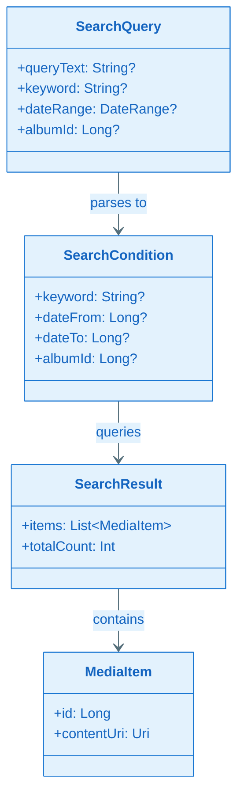

#### A0.3 DDD 与面向对象原则对应（须对齐 epic-arch）

| 领域概念 | DDD 类型 | 7 大原则体现 |
|----------|----------|--------------|
| **SearchCondition** | 值对象 | 不可变；OCP：sealed 扩展新条件类型 |
| **SearchQueryParser** | 领域服务 (Domain Service) | 无 Android 依赖；SRP：仅解析；接口在领域层 |
| **SearchResult** | 值对象 | 来自 MediaRepository，非持久化 |
| **MediaRepository.search** | Repository 扩展（领域层） | OCP：扩展方法，不修改 getMediaPager 签名；ISP |
| **SearchViewModel** | 应用层编排 | SRP、合成复用；DIP：依赖 MediaRepository、AlbumRepository |
| **SearchScreen** | 表示层 | SRP、迪米特：不直连 Data |

### A1. 技术方案选型

#### 1. 自然语言解析

| 方案 | 优势 | 劣势 |
|---|---|---|
| 方案 A：规则/正则解析 | 无额外依赖、可控、可扩展 | 覆盖有限 |
| 方案 B：本地 LLM/NLP | 理解力强 | 体积大、延迟高、低端机不支持 |
| 方案 C：纯结构化条件 | 实现简单 | 不满足 FR-001 自然语言 |

**采用方案 A（规则解析 + 降级）**。理由：一期以结构化条件为主；自然语言通过预定义规则（如「上周」→ dateRange、「图集 X」→ albumId）映射；无法解析时降级为 keyword 模糊匹配或提示用户细化；满足 FR-001 的「自然语言描述意图」在合理范围内，同时控制实现成本。

#### 2. 查询执行

| 方案 | 优势 | 劣势 |
|---|---|---|
| 方案 A：MediaRepository 扩展 | 复用 FEAT-001 接口 | 需扩展 query 参数 |
| 方案 B：独立 SearchRepository | 职责清晰 | 与 MediaRepository 可能重复 |

**采用方案 A**。理由：MediaRepository 增加 `search(condition: SearchCondition): Flow<PagingData<MediaItem>>` 或类似方法；MediaStoreDataSource 支持 selection/selectionArgs 扩展；保持单一数据入口，符合 epic-arch 媒体库由 FEAT-001 Owner 的约定。

#### 3. 结果列表 UI

| 方案 | 优势 | 劣势 |
|---|---|---|
| 方案 A：复用时间轴网格组件 | 一致、即滑即现 | 无分组头，结果扁平 |
| 方案 B：独立 SearchResultsScreen | 可定制 | 重复实现 |

**采用方案 A**。理由：搜索结果为扁平列表，无需日/月/年分组；复用 FEAT-001 的 LazyVerticalGrid + Paging + Coil 模式，传入 PagingData 即可；进入大图使用 MediaViewerContext，source="search"。

### A2. Feature 0层设计

#### A2.1 Feature 0层架构图（必须）

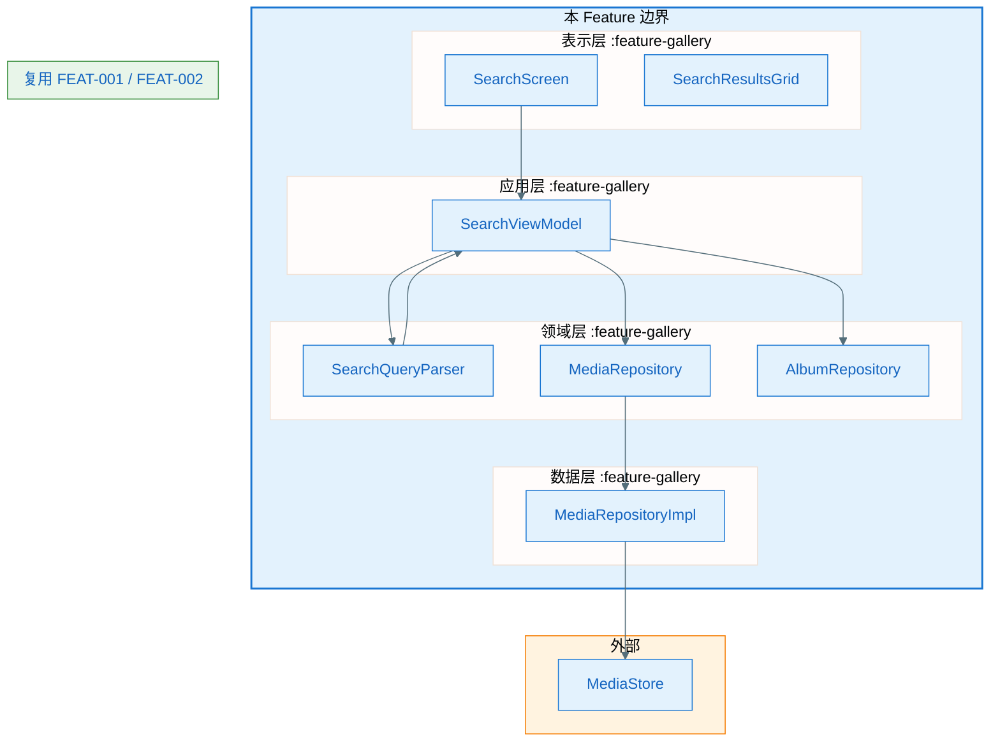

#### A2.1.1 架构设计说明（必须）

- **边界与职责**：本 Feature 负责搜索入口 UI、条件解析、查询构建、结果展示、进入大图；不新增媒体库实现，仅扩展 MediaRepository 的 search 能力；不提供共享能力。
- **分层与依赖方向**：表示层 → 应用层 → 领域层 ← 数据层。
- **关键数据流**：用户输入 → SearchQueryParser → SearchCondition → MediaRepository.search() → PagingData → UI；图集条件来自 AlbumRepository.getAllAlbums()。
- **外部依赖策略**：查询失败、无结果 → 空态提示；MediaStore 不可用 → 同 FEAT-001。
- **可演进性**：SearchQueryParser 可后续扩展规则或接入轻量 NLP。

#### A2.2 外部依赖清单

| 依赖项 | 类型 | 提供方 | 故障模式 | 我方策略 |
|--------|------|--------|----------|----------|
| MediaRepository（扩展） | 内部 | FEAT-001 | 同 FEAT-001 | 接口扩展 |
| AlbumRepository | 内部 | FEAT-002 | — | 接口消费 |
| MediaViewerContext | 内部 | FEAT-001 | — | 构造传递 |

#### A2.3 通信与交互约束

- **协议**：函数调用
- **错误处理**：无结果 → 空态「无匹配结果」；解析失败 → 提示用户细化；MediaStore 异常 → Toast
- **数据一致性**：搜索结果来自 MediaStore，与时间轴/图集共享 SoR

### A3. Feature 1层设计

#### A3.1 第一层：整体框架设计（必须）

##### A3.1.1 内部总体框架图（必须）

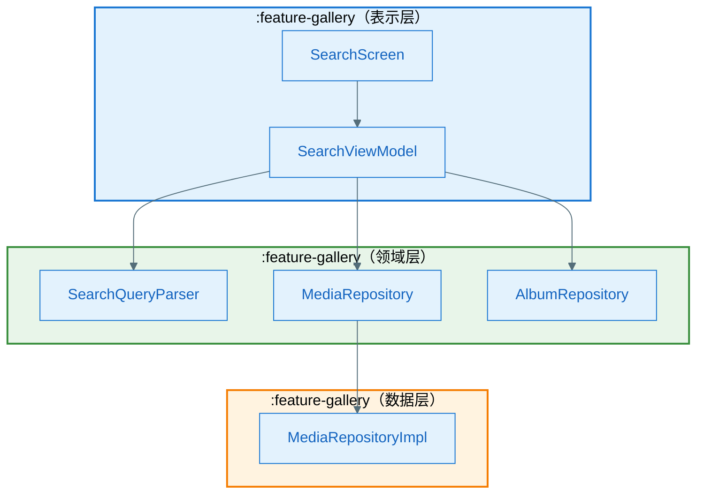

##### A3.1.2 总体设计说明

###### A3.1.2.1 组件清单与职责（必须）

| 组件 | 所属模块 | 职责 | 输入/输出 | 依赖 |
|------|----------|------|-----------|------|
| SearchScreen | :feature-gallery | 搜索框 + 条件 Chip + 结果网格 | 用户输入 → UI | SearchViewModel |
| SearchViewModel | :feature-gallery | 搜索 MVI 状态、解析、查询、导航 | Intent → State | SearchQueryParser, MediaRepository, AlbumRepository |
| SearchQueryParser | :feature-gallery | 自然语言/结构化 → SearchCondition | queryText, conditions → SearchCondition | — |

###### A3.1.2.2 组件协作时序图（必须）

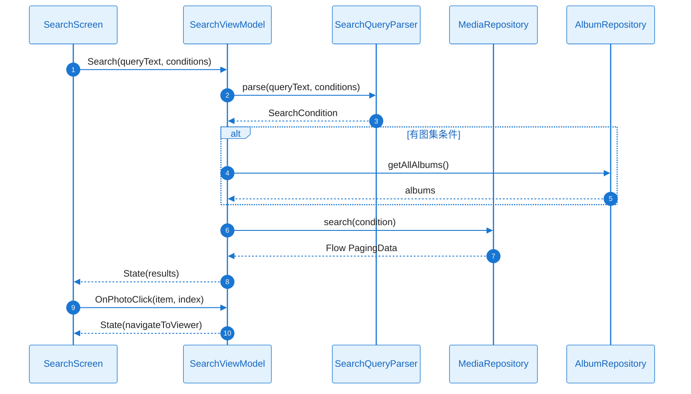

---

#### A3.2 第二层：Feature 全景（必须）

##### A3.2.1 Feature 流程图集（逻辑流程，必须）

###### 流程 1：执行搜索

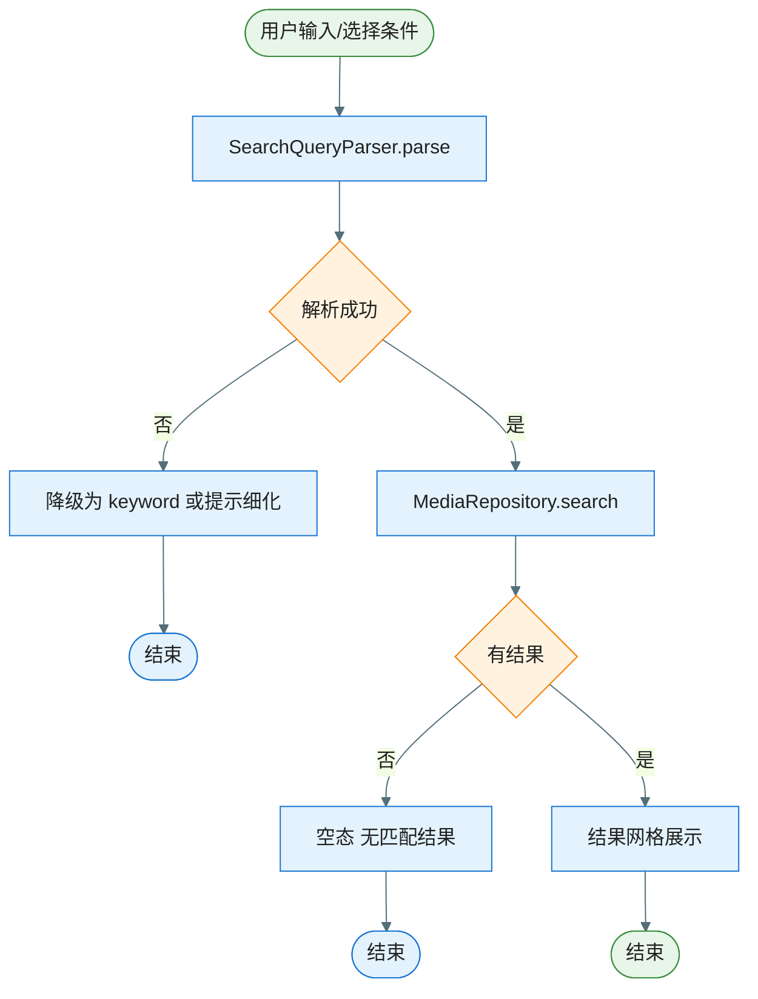

##### A3.2.2 全景类图（必须）

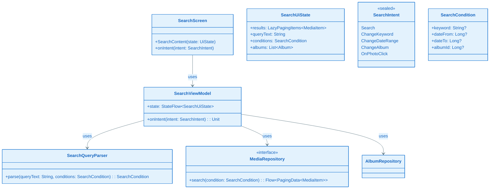

###### 关键类职责说明

| 类/接口 | 层级 | 职责 | 关键方法 | DDD/原则 |
|---------|------|------|----------|----------|
| SearchScreen | 表示层 | 搜索 UI | SearchContent(), onIntent() | SRP、迪米特：不直连 Data |
| SearchViewModel | 应用层 | 搜索 MVI | onIntent(), state | SRP、合成复用；DIP：依赖 Repository |
| SearchQueryParser | 领域层 | 解析查询（自然语言→SearchCondition） | parse() | 领域服务；SRP |
| SearchCondition | 领域层 | 结构化条件 | — | 值对象；OCP |
| MediaRepository.search | 领域层 | 扩展方法 | search(condition) | OCP：接口扩展；ISP |

##### A3.2.3 关键时序图集（方法调用流程，必须）

| Seq ID | 流程名称 | 覆盖的异常 |
|--------|----------|-------------|
| SEQ-001 | 执行搜索 | EX-001, EX-002 |
| SEQ-002 | 点击结果进入大图 | — |

###### SEQ-001：执行搜索

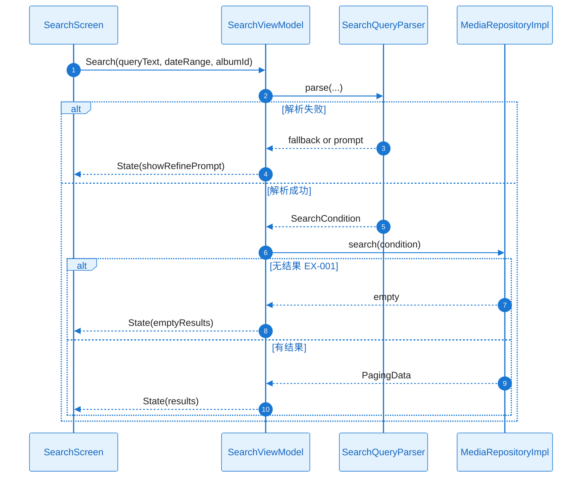

###### SEQ-002：点击结果进入大图

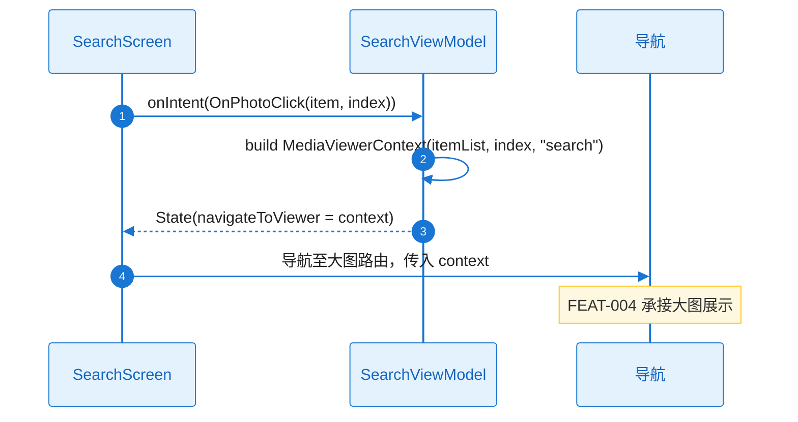

#### A3.3 第三层：组件内部详细设计

##### 组件 1：SearchQueryParser

- **定位**：将自然语言/结构化输入解析为 SearchCondition；解析失败时降级为 keyword 或返回 null 提示细化
- **对外接口**：`parse(queryText: String, conditions: SearchCondition): Result<SearchCondition>`
- **失败与降级**：无法解析 → Result.failure 或 fallback 为 keyword LIKE

###### 技术实现路径（开发可照此落码）

| 步骤 | 落点 | 实现要点 |
|------|------|----------|
| 1 | 规则表结构 | `temporalRules: Map<String, Pair<Long, Long>>`：如 "上周"→(7天前0点, 今天24点)，"昨天"→(昨日0点, 昨日24点)，"去年"→(去年1月1日, 去年12月31日)；`albumKeywords: Map<String, (String) -> Long?>`：输入 "图集 X" 时从 `albums: List<Album>` 按 name 模糊匹配返回 albumId |
| 2 | `matchTemporalKeyword(text)` | 遍历 temporalRules.keys，若 `text.contains(key)` 或 `text.trim().equals(key, ignoreCase=true)` 则返回对应 DateRange；支持多语言：中文 "上周"/"昨天"/"今年"，英文 "last week"/"yesterday" 等 |
| 3 | `matchAlbumKeyword(text, albums)` | 正则 `"图集\s*(.+)"` 或 `"in\s+(.+)"` 提取图集名；`albums.find { it.name.equals(extracted, ignoreCase=true) }?.id` 或 `startsWith`/`contains` 取第一个匹配 |
| 4 | 解析优先级 | 先检查 conditions 中已有的 dateRange、albumId（来自 UI Chip 选择）；若 queryText 非空，先 matchTemporalKeyword，再 matchAlbumKeyword，最后 fallbackToKeyword |
| 5 | `fallbackToKeyword(text)` | `SearchCondition(keyword=text.trim().takeIf { it.isNotBlank() }, dateFrom=null, dateTo=null, albumId=null)`；keyword 将用于 MediaStore `DISPLAY_NAME LIKE %keyword%` 或 `_DATA LIKE %keyword%` |
| 6 | 返回值 | 解析到任一有效条件 → `Result.success(condition)`；完全无法解析且 queryText 空白 → `Result.failure(ParseFailed)`；可解析出 keyword → success，ViewModel 不强制 showRefinePrompt |
| 7 | 线程 | 纯计算，无 IO，可在调用方线程执行；若 albums 需异步获取，则 parse 签名可为 `parse(queryText, conditions, albums: List<Album>)` |

###### 规则表示例（可扩展）

```
temporalRules:
  "上周" / "last week" → dateRange(now - 7d, now)
  "昨天" / "yesterday" → dateRange(yesterday_start, yesterday_end)
  "今年" / "this year" → dateRange(year_start, now)
  "2024年" / "2024" → dateRange(2024-01-01, 2024-12-31)
```

###### 组件详细类图

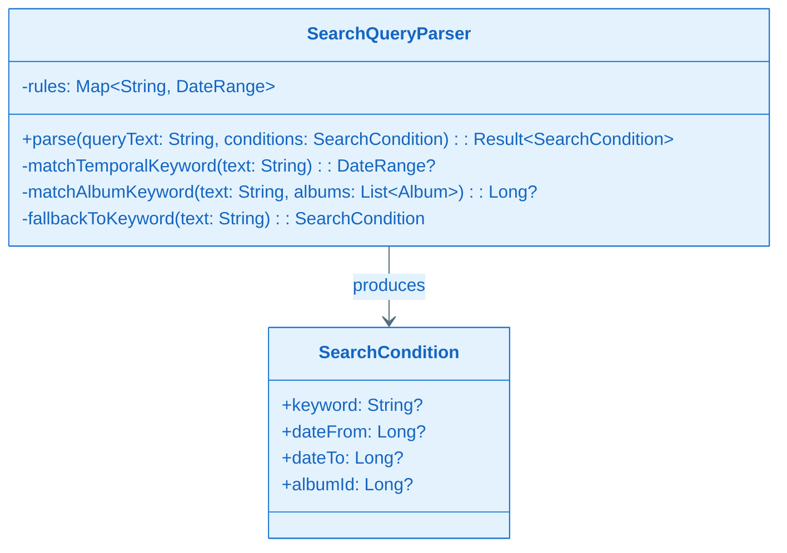

###### 异常清单

| 异常ID | 触发条件 | 错误类型 | 可重试 | 对策 |
|--------|----------|----------|--------|------|
| EX-001 | 无匹配结果 | — | 否 | 空态「无匹配结果」 |
| EX-002 | 解析失败/歧义 | ParseFailed | 否 | 降级 keyword 或提示细化 |

###### 组件完整详细时序图：parse 成功/失败/降级

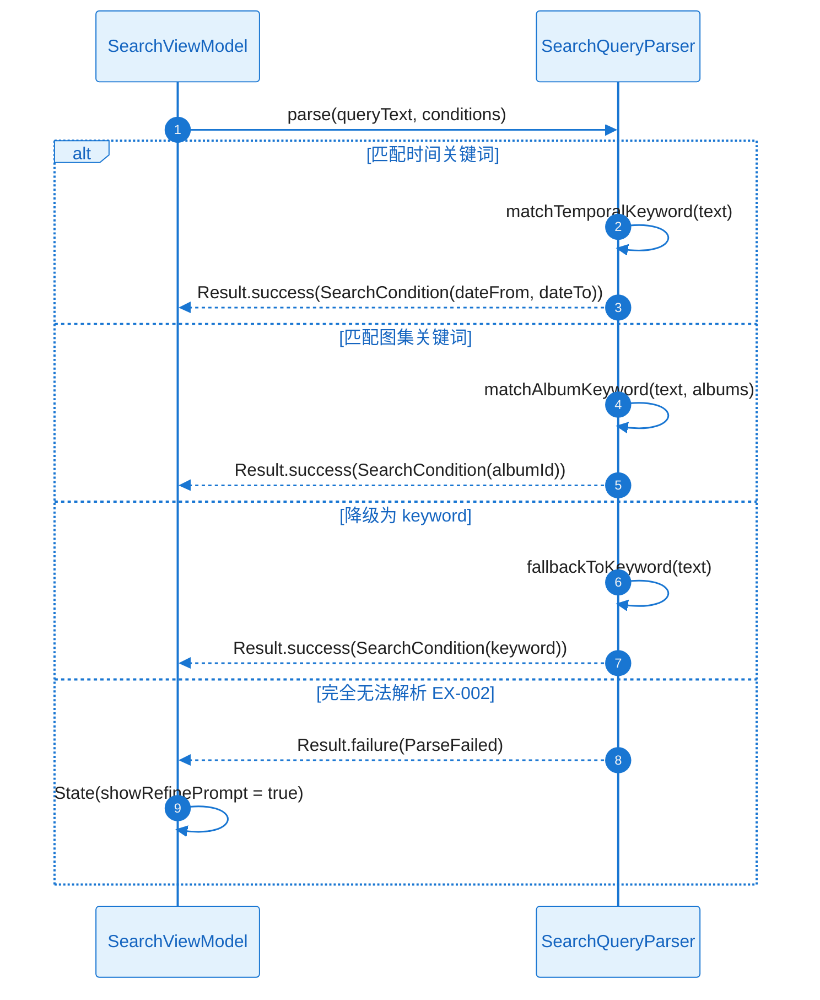

##### 组件 2：MediaRepository.search 扩展（FEAT-001 内实现）

- **定位**：根据 SearchCondition 构建 MediaStore selection/selectionArgs，执行查询
- **对外接口**：`search(condition: SearchCondition): Flow<PagingData<MediaItem>>`
- **失败与降级**：同 FEAT-001 MediaStore 异常

###### 技术实现路径（开发可照此落码）

| 步骤 | 落点 | 实现要点 |
|------|------|----------|
| 1 | SearchPagingSource | 新建 `SearchMediaPagingSource(contentResolver, condition)` 或扩展现有 `MediaStoreDataSource` 支持 condition 参数；`load(params)` 内根据 condition 构建 selection |
| 2 | selection 构建 | 初始 `mutableListOf<String>()`、`args = mutableListOf<String>()`；若 `condition.keyword != null` 则 add `"$DISPLAY_NAME LIKE ?"` 且 args.add("%${condition.keyword}%")；若 `condition.dateFrom != null` 则 add `"$DATE_TAKEN >= ?"` 且 args.add(condition.dateFrom)；若 `condition.dateTo != null` 则 add `"$DATE_TAKEN <= ?"`；若 `condition.albumId != null` 则 add `"$BUCKET_ID = ?"` 且 args.add(condition.albumId)（注意 albumId 为系统 bucket 时用 BUCKET_ID，为用户图集时需 JOIN album_media 表，见下） |
| 3 | 用户图集 albumId | 用户图集 id 为 Room 自增 id，对应 `album_media.album_id`；MediaStore 无直接关联，需 `_ID IN (SELECT media_id FROM album_media WHERE album_id = ?)`；需在 FEAT-002 的 AlbumDatabase 可访问处执行，或通过 ContentResolver 无法直接查 Room，故需：先 `albumMediaDao.getMediaIdsByAlbumId(albumId)` 得到 List<Long>，再 selection 加 `"_ID IN (${mediaIds.joinToString(",") { "?" }})"` 且 args.addAll(mediaIds)。若 mediaIds 过多（如 >1000）可分批 query 再合并 |
| 4 | sortOrder | 固定 `DATE_TAKEN DESC` |
| 5 | Pager 配置 | `Pager(PagingConfig(pageSize=60, prefetchDistance=30)) { SearchMediaPagingSource(cr, condition) }.flow`；condition 变化时需重新创建 PagingSource（新 Flow），ViewModel 中 `flatMapLatest { condition -> repository.search(condition) }` |
| 6 | debounce | 用户输入时 debounce 300–500ms 再触发 Search，避免每字都查 |

###### 关键数据结构

```
SearchCondition:
  keyword: String?   → selection "$DISPLAY_NAME LIKE ?" OR "$DATA LIKE ?"
  dateFrom: Long?    → DATE_TAKEN >= ?
  dateTo: Long?      → DATE_TAKEN <= ?
  albumId: Long?     → 若 < 0 或约定值表示系统 bucket 用 BUCKET_ID；否则为用户图集，用 _ID IN (SELECT media_id FROM album_media WHERE album_id=?)
```

###### 组件详细类图

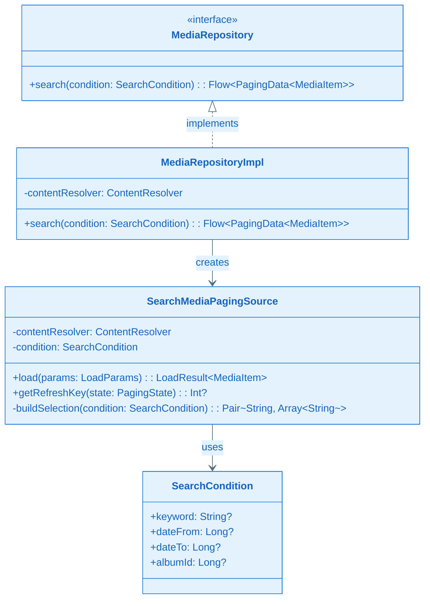

###### 组件完整详细时序图：search load 成功/空结果/异常

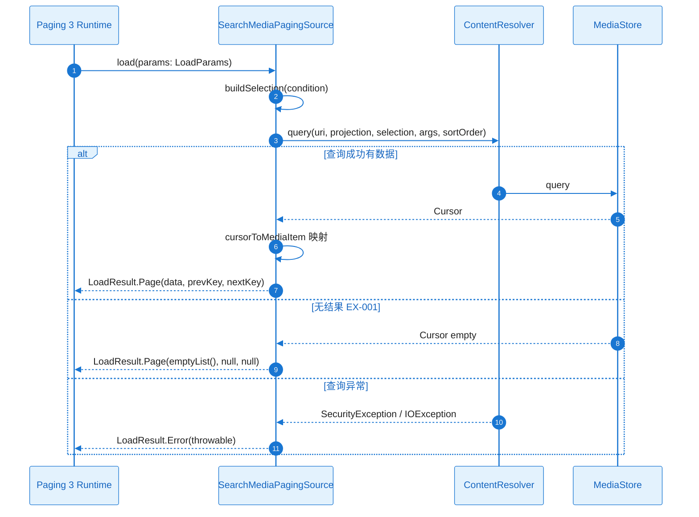

---

### A4. 技术风险与消解策略

| 风险ID | 风险描述 | 触发条件 | 影响范围 | 严重度 | 消解策略 | 对应 Story |
|--------|----------|----------|----------|--------|----------|-------------|
| RISK-001 | 自然语言解析覆盖不足 | 用户输入非常规表述 | 无结果或错误结果 | Med | 规则表扩展、降级提示 | ST-001 |
| RISK-002 | 大结果集性能 | 全库 keyword 搜索 | 响应慢 | Low | 分页、debounce 输入 | ST-002 |

### A5. 边界 & 异常场景枚举

- **数据边界**：空查询、超长 keyword、无效 dateRange、albumId 不存在
- **用户行为**：快速连续输入、解析歧义
- **并发**：搜索与列表刷新

#### A5.1 场景 → 应对措施对照表

| 场景ID | 场景类别 | 触发条件 | 影响 | 预期行为 | 技术对策 | 设计对策 | 映射 |
|--------|----------|----------|------|----------|----------|----------|------|
| SC-001 | 数据 | 无匹配结果 | 空列表 | 空态「无匹配结果」 | empty PagingData | 空态文案 | EX-001 |
| SC-002 | 用户 | 解析失败 | 无结果 | 提示细化或降级 | fallback keyword | 引导 | EX-002 |

### A6. 算法评估

N/A（规则解析，非 ML 算法）

### A7. 功耗评估

| 场景 | 电流增量 | 时长 | 每日功耗 |
|------|----------|------|----------|
| 搜索输入+结果 | ~45 mA | 20s | ~0.05 mAh |

**验收标准**：每日功耗 ≤ 5 mAh

### A8. 性能评估

| 场景 | 指标 | 验收标准 (p95) |
|------|------|----------------|
| 搜索响应 | 首屏 TTI | ≤ 1500ms |
| 结果列表 | 滚动帧率 | ≥ 55fps |
| 缩图 | 无白块 | 即滑即现 |

### A9. 内存评估

| 场景 | 验收标准 | 主要来源 |
|------|----------|----------|
| 搜索结果 | PSS ≤ 80MB | Paging、Coil 缓存 |
| 进出 10 次 | 回 Baseline ±5MB | 泄漏检测 |

### A10. 安全评估

同 FEAT-001，仅搜索用户授权媒体库。

### A11. 兼容性评估

- **系统**：Android 10+ (API 29+)
- **MediaStore 查询**：DATE_TAKEN、DISPLAY_NAME、BUCKET_ID 在各机型验证
- **自然语言**：规则表可按语言扩展（中文「上周」、英文 "last week"）

**兼容性结论**：风险较低。

---

## Plan-B：技术规约 & 实现约束

### B0. Plan-A ↔ Plan-B 一致性与互校（必须）

| Plan-A | Plan-B | 自检 |
|---|---|---|
| A0 领域概念 | B3、B4 | 术语一致 |
| A1 规则解析 | B2 | 策略一致 |
| A2 复用 MediaRepository | B4.2 | 接口扩展正确 |
| A3 进入大图 | B4.2 | MediaViewerContext 正确 |

### B1. 技术背景

**Language/Version**：Kotlin 2.1.21
**Primary Dependencies**：Jetpack Compose、Paging 3、Coil、Lifecycle、Material3
**Storage**：MediaStore（无本地索引，直接查询）
**Target Platform**：Android 10+ (API 29+)
**Performance Targets**：搜索响应可接受、结果列表缩图即滑即现

### B2. 架构细化

- **分层约束**：同 FEAT-001
- **线程模型**：IO 在 Dispatchers.IO
- **错误处理**：无结果空态；解析失败提示；MediaStore 异常 Toast
- **自然语言规则**：预定义规则表（如「上周」→  dateRange）；正则/关键字匹配；兜底为 keyword LIKE

### B3. 数据模型

#### B3.1 存储形态与边界

- **存储形态**：无本地存储；MediaStore 直接查询
- **System of Record**：MediaStore
- **缓存**：Coil 缩图；查询结果 Paging 内存分页

### B4. 接口规范/协议

#### B4.1 本 Feature 对外提供的接口

无（纯消费方）。

#### B4.2 本 Feature 依赖的外部接口

| 依赖 | 引用 |
|---|---|
| MediaRepository | FEAT-001 plan.md；需扩展 `search(condition: SearchCondition)` |
| AlbumRepository | FEAT-002 plan.md Plan-B:B4.1 |
| MediaViewerContext | FEAT-001 plan.md Plan-B:B4.1；构造时 source="search" |

**MediaRepository 扩展契约**：
- `fun search(condition: SearchCondition): Flow<PagingData<MediaItem>>`
- SearchCondition 含 keyword、dateFrom、dateTo、albumId；对应 MediaStore selection/selectionArgs

### B5. 合规性检查

- [ ] 仅搜索用户授权范围内的媒体库
- [ ] 无结果/失败有明确提示

### B6. 项目结构（本 Feature）

```
specs/epics/EPIC-004-android-gallery/features/FEAT-003-search/
├── spec.md
├── plan.md
└── checklists/
    └── requirements.md
```

### B7. 源代码结构（代码库根目录）

```text
feature-gallery/
  src/main/java/.../gallery/
    search/
      SearchScreen.kt
      SearchViewModel.kt
      SearchIntent.kt
      SearchUiState.kt
      SearchQueryParser.kt
      SearchCondition.kt
```

**说明**：与 FEAT-001、FEAT-002 共处 `:feature-gallery`；MediaRepository 的 search 扩展在 `data` 层实现；SearchQueryParser 为独立领域组件。

---

## Story Breakdown（Plan Level = Standard 时执行）

### Story 列表

#### ST-001：MediaRepository.search 扩展与 SearchQueryParser

- **类型**：Infrastructure / Design-Enabler
- **描述**：MediaRepository 增加 search(condition)；MediaStoreDataSource 支持 selection/selectionArgs；SearchQueryParser 规则解析（日期、图集、keyword）；解析失败降级
- **目标**：search 可返回 PagingData；解析常见自然语言
- **预估工作量**：5 人天
- **覆盖 FR/NFR**：FR-001、FR-002；NFR-REL-001
- **依赖**：FEAT-001、FEAT-002
- **可并行**：否
- **关键风险**：是（RISK-001）
- **验收/验证方式**：单元测试 Parser；集成测试 search
- **交付物**：SearchQueryParser、MediaRepository.search、SearchCondition

#### ST-002：搜索 UI 与结果列表

- **类型**：Functional
- **描述**：SearchScreen、SearchViewModel；搜索框、条件 Chip（日期、图集）；结果网格复用 FEAT-001；进入大图 MediaViewerContext source="search"
- **目标**：搜索入口可用、结果展示、进入大图
- **预估工作量**：4 人天
- **覆盖 FR/NFR**：FR-001、FR-002、FR-003；NFR-PERF-001、NFR-PERF-002
- **依赖**：ST-001
- **可并行**：否
- **验收/验证方式**：UI 测试、端到端搜索
- **交付物**：SearchScreen、SearchViewModel、SearchIntent、SearchUiState

### Story 依赖关系图

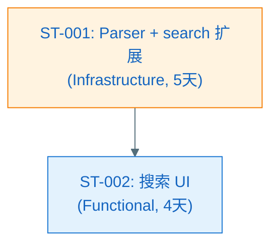

### Feature → Story 覆盖矩阵

| FR/NFR ID | 覆盖的 Story ID |
|-----------|-----------------|
| FR-001 | ST-001, ST-002 |
| FR-002 | ST-001, ST-002 |
| FR-003 | ST-002 |
| NFR-PERF-001/002 | ST-002 |
| NFR-REL-001 | ST-001 |

### Story 工作量汇总

| Story ID | 类型 | 预估（人天） | 依赖 |
|----------|------|-------------|------|
| ST-001 | Infrastructure | 5 | FEAT-001, FEAT-002 |
| ST-002 | Functional | 4 | ST-001 |
| **总计** | — | **9 人天** | — |

---

## Story Detailed Design（Plan Level = Deep 时执行）

各 Story 的 L2 二层详细设计已写入 **[story_detail_design.md](./story_detail_design.md)**，覆盖 ST-001～ST-002，包含：目标与 DoD、代码落点与边界、核心接口与契约、类图、时序图（含正常+异常）、异常矩阵、并发/生命周期/资源管理、验证与测试设计。

tasks.md 的 Task 应引用：`story_detail_design.md:ST-xxx:功能设计:时序图` 等入口。
