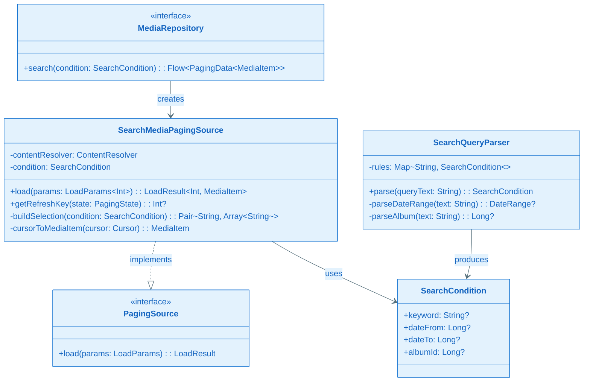
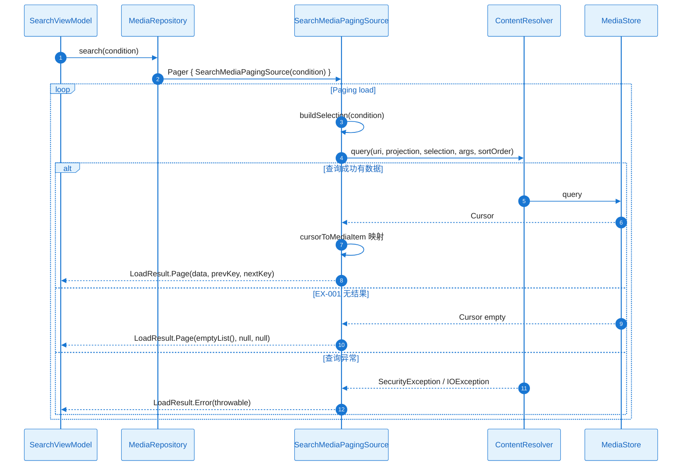
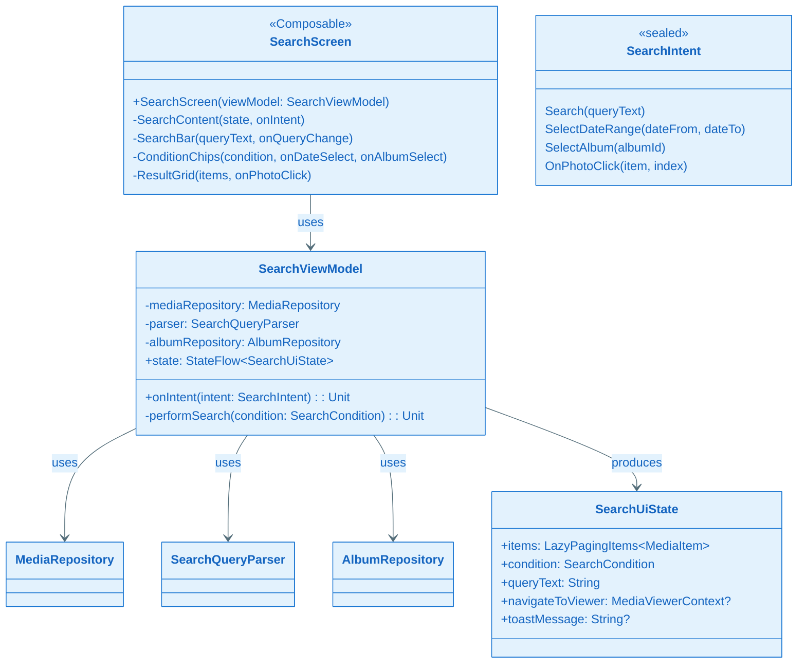
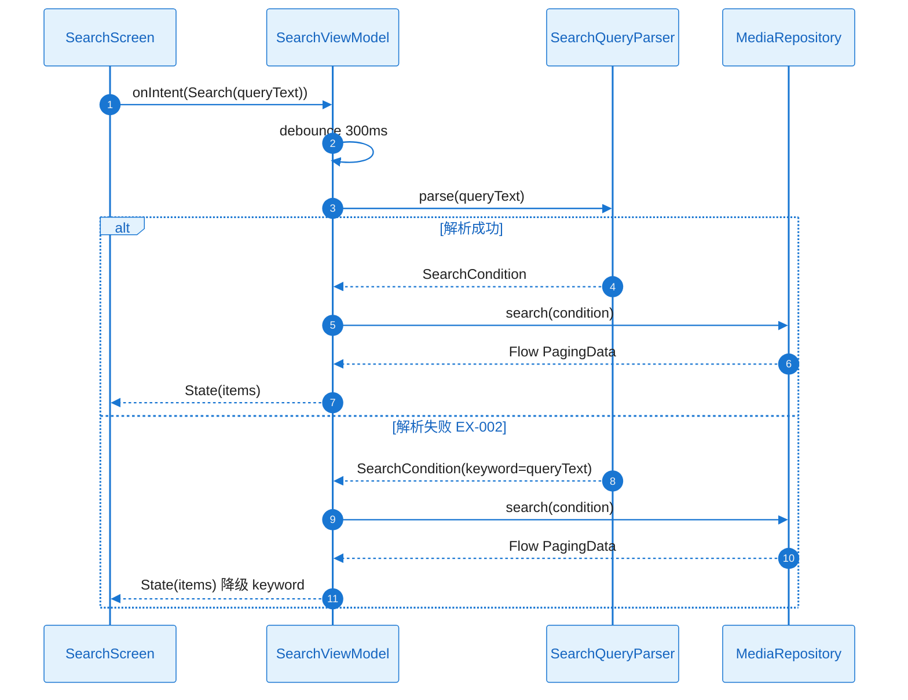

# L2 Story 详细设计（二层详细设计）：FEAT-003 搜索

本文档与 **plan.md** 配套使用：Plan Level = Deep 时，各 Story 的 L2 详细设计在此文档中编写。

**Feature**：FEAT-003 搜索  
**Plan Version**：v0.1.4  
**覆盖 Story**：ST-001～ST-002

---

## ST-001 Detailed Design：MediaRepository.search 扩展与 SearchQueryParser

#### 1) 需求及描述

- **需求描述**：MediaRepository 增加 search(condition: SearchCondition)；MediaStoreDataSource 或 SearchMediaPagingSource 支持 selection/selectionArgs；SearchQueryParser 规则解析（日期、图集、keyword）；解析失败降级为 keyword LIKE。
- **需求依赖**：FEAT-001（MediaRepository、MediaItem）、FEAT-002（AlbumRepository 图集条件）
- **使用范围**：SearchViewModel、FEAT-001 MediaRepository 扩展
- **使用接口**：`MediaRepository.search(condition: SearchCondition): Flow<PagingData<MediaItem>>`；`SearchQueryParser.parse(queryText: String): SearchCondition`
- **DoD（验收标准）**：
  - [ ] search 可返回 PagingData；解析常见自然语言（如「上周」「昨天」「xxx 图集」）
  - [ ] 单元测试 Parser；集成测试 search

#### 2) 功能设计

##### 功能设计关键说明

**核心实现思路**：
- SearchCondition 数据类：keyword、dateFrom、dateTo、albumId；对应 MediaStore selection：DATE_TAKEN BETWEEN、DISPLAY_NAME LIKE、BUCKET_ID。
- SearchMediaPagingSource 或扩展 MediaStoreDataSource：接收 SearchCondition，buildSelection(condition) 构建 selection/selectionArgs；load() 执行 ContentResolver.query。
- SearchQueryParser 纯 Kotlin（无 Android 依赖）：规则表「上周」→ dateRange、「xxx 图集」→ albumId；正则/关键字匹配；解析失败返回 SearchCondition(keyword=queryText)，降级为 keyword LIKE。

**关键类与职责划分**：
- MediaRepository：search(condition) 接口扩展
- SearchMediaPagingSource：PagingSource<Int, MediaItem>，buildSelection、load、getRefreshKey
- SearchQueryParser：parse(queryText) → SearchCondition
- SearchCondition：keyword、dateFrom、dateTo、albumId

**失败处理与边界**：
- 解析失败 → 降级 keyword=queryText
- MediaStore 权限拒绝 → LoadResult.Error
- 无结果 → LoadResult.Page(empty)

##### 类图（完整详细）

**关键类职责说明**：

| 类/接口 | 核心职责 | 关键方法说明 |
|---------|----------|--------------|
| MediaRepository | search 接口扩展 | search(condition) 返回 PagingData Flow |
| SearchMediaPagingSource | 搜索 PagingSource | buildSelection、load、getRefreshKey |
| SearchQueryParser | 自然语言规则解析 | parse(queryText) → SearchCondition |
| SearchCondition | 可执行查询条件 | keyword/dateFrom/dateTo/albumId |

##### 时序图（完整详细：search 正常+异常）

##### 触发条件与系统响应

| 触发条件 | 系统响应（正常流程） | 异常处理 |
|----------|----------------------|----------|
| search(condition) | buildSelection → query → PagingData | EX-001：空；权限/异常：Error |
| parse(queryText) | 规则匹配 → SearchCondition | 解析失败：降级 keyword=queryText |

##### 异常矩阵

| 异常ID | 触发条件 | 错误类型 | 可重试 | 对策 |
|--------|----------|----------|--------|------|
| EX-001 | 无匹配结果 | — | 否 | 空态展示 |
| EX-002 | 解析失败 | — | 否 | 降级 keyword |
| — | MediaStore 权限/异常 | LoadResult.Error | 是 | Toast |

##### 并发/生命周期/资源管理

| 项目 | 约束 |
|------|------|
| 执行线程 | load() 在 Dispatchers.IO |
| 取消 | Cursor 在 finally 中 close |
| Parser | 无 Android 依赖，纯 Kotlin |

##### 验证与测试设计

- **单元测试**：SearchQueryParser.parse 常见输入（「上周」「昨天」「图集名」）；buildSelection 各条件组合
- **集成测试**：search(condition) 返回有效 PagingData
- **Mock**：ContentResolver

---

## ST-002 Detailed Design：搜索 UI 与结果列表

#### 1) 需求及描述

- **需求描述**：SearchScreen、SearchViewModel；搜索框、条件 Chip（日期、图集）；结果网格复用 FEAT-001；进入大图 MediaViewerContext source="search"。
- **需求依赖**：ST-001（MediaRepository.search、SearchQueryParser）
- **使用范围**：搜索主屏
- **使用接口**：SearchScreen(viewModel)；SearchViewModel.onIntent(SearchIntent)
- **DoD（验收标准）**：
  - [ ] 搜索入口可用、结果展示、进入大图
  - [ ] UI 测试、端到端搜索

#### 2) 功能设计

##### 功能设计关键说明

**核心实现思路**：
- SearchViewModel：用户输入 queryText → debounce → SearchQueryParser.parse → search(condition) → State.items；条件 Chip 选择 dateRange/albumId 时直接构建 SearchCondition。
- SearchScreen：搜索框 OutlinedTextField；条件 Chip（日期、图集）；LazyVerticalGrid 结果网格，复用 FEAT-001 的 AsyncImage + 点击进入大图；OnPhotoClick 构建 MediaViewerContext(itemList, index, "search") → navigate。
- 输入 debounce 300–500ms 减少频繁搜索。

**关键类与职责划分**：
- SearchScreen：搜索框、条件 Chip、结果网格、OnPhotoClick
- SearchViewModel：Search(queryText)、SelectDateRange、SelectAlbum、OnPhotoClick、State 管理
- SearchIntent：Search、SelectDateRange、SelectAlbum、OnPhotoClick
- SearchUiState：items、condition、queryText、navigateToViewer

##### 类图（完整详细）

**关键类职责说明**：

| 类/接口 | 核心职责 | 关键方法说明 |
|---------|----------|--------------|
| SearchScreen | 搜索 UI | 搜索框、条件 Chip、结果网格、OnPhotoClick |
| SearchViewModel | 搜索 MVI | Search、SelectDateRange、SelectAlbum、OnPhotoClick、performSearch |
| SearchUiState | 搜索状态 | items、condition、queryText、navigateToViewer |
| SearchIntent | 用户意图 | Search、SelectDateRange、SelectAlbum、OnPhotoClick |

##### 时序图（完整详细：Search 正常+解析失败）

##### 触发条件与系统响应

| 触发条件 | 系统响应（正常流程） | 异常处理 |
|----------|----------------------|----------|
| Search(queryText) | parse → search → State.items | 解析失败：降级 keyword |
| SelectDateRange | condition.copy(dateFrom, dateTo) → search | — |
| SelectAlbum | condition.copy(albumId) → search | — |
| OnPhotoClick | MediaViewerContext → navigate | — |

##### 异常矩阵

| 异常ID | 触发条件 | 错误类型 | 可重试 | 对策 |
|--------|----------|----------|--------|------|
| EX-001 | 无匹配结果 | — | 否 | 空态「无匹配结果」 |
| EX-002 | 解析失败 | — | 否 | 降级 keyword |

##### 并发/生命周期/资源管理

| 项目 | 约束 |
|------|------|
| debounce | Search(queryText) 输入 debounce 300–500ms |
| 取消 | 新 search 时取消前序 collect |

##### 验证与测试设计

- **UI 测试**：搜索框输入、条件 Chip 选择、结果网格渲染
- **端到端**：输入自然语言→结果展示；点击进入大图
