# Plan（工程级蓝图）：大图浏览

**Epic**：EPIC-004 - Android 端相册 App 一期
**Feature ID**：FEAT-004
**Feature Version**：v0.1.0（来自 `spec.md`）
**Plan Version**：v0.1.4
**Plan Level**：Deep
**当前工作分支**：`epic/EPIC-004-android-gallery`
**Feature 目录**：`specs/epics/EPIC-004-android-gallery/features/FEAT-004-photo-viewer/`
**日期**：2026-02-12
**输入**：来自 `Feature 目录/spec.md`

## 变更记录（增量变更）

| 版本 | 日期 | 变更范围（Feature/Story/Task） | 变更摘要 | 影响模块 | 是否需要回滚设计 |
|---|---|---|---|---|---|
| v0.1.0 | 2026-02-12 | Feature | 初始版本，Lite 阶段 |  | 否 |
| v0.1.1 | 2026-02-12 | Standard 阶段 | A3.3、Story Breakdown、A4-A11 | 全文 | 否 |
| v0.1.2 | 2026-02-12 | A1、A3.2.4 | 进入过渡 Compose 实现（SharedTransitionLayout、sharedElement）、疑难点 1 共享元素过渡 cross-ref | NFR-PERF-001 | 否 |
| v0.1.3 | 2026-02-12 | A0.3、A3.2.2、概述 | DDD 与 7 大原则对应表、关键类职责 DDD/原则列、前置检查对齐 | 对齐 epic-arch | 否 |
| v0.1.4 | 2026-02-14 | Deep 阶段 | Story Detailed Design（L2）：ST-001～ST-004，见 story_detail_design.md | Story Detailed Design | 否 |

## Plan 前置检查（必须，在开始设计前完成）

### 前置检查清单

- [x] 已阅读 `epic.md` 的"跨 Feature 技术策略"章节
- [x] 若 EPIC 根下存在 **`epic-arch.md`**，已阅读并在其 **0 层/1 层架构与规范约束**下做 A2、A3.1；已对齐 **DDD 设计要点**与**面向对象 7 大原则**
- [x] 已确认本 Feature 在 Plan 执行顺序中的位置（顺序 4，依赖 FEAT-001、FEAT-003）
- [x] 已检查前置 Feature 的 plan（FEAT-001、FEAT-002、FEAT-003 已完成）
- [x] 本 Feature 需要设计的共享能力已在 EPIC 级登记为 Owner

### 依赖的共享能力（从其他 Feature 复用）

| 依赖的共享能力 | Owner Feature | Owner Plan 状态 | 如何获取/引用 |
|---|---|---|---|
| 进入大图入口与上下文 | FEAT-001 | Plan Ready | MediaViewerContext 契约，FEAT-001 plan.md Plan-B:B4.1 |
| 媒体项实体 | FEAT-001 | Plan Ready | MediaItem，FEAT-001 plan.md |
| 列表源（时间轴/图集/搜索） | FEAT-001, FEAT-002, FEAT-003 | Plan Ready | MediaViewerContext.source |

### 本 Feature 提供的共享能力（供其他 Feature 复用）

| 共享能力名称 | 消费方 Feature | 设计位置（本 plan 章节） | 接口/契约位置 |
|---|---|---|---|
| 大图加载与缓存 | — | A3.1、A3.2、Plan-B B4.1 | Plan-B:B4.1 ImageLoader 抽象（可选供列表缩图复用） |

### 前置检查结论

- **检查日期**：2026-02-12
- **结论**：通过
- **备注**：本 Feature 为大图加载与缓存的 Owner；接收 MediaViewerContext 作为入口；列表/图集/搜索仅提供 URI 与上下文，大图采样、解码、缓存由本 Feature 统一设计。

---

## 概述

提供缩图轴、大图预览、多格式（图片/实况图/视频）、缩放与左右滑动切换，从时间轴/图集/搜索进入并保持上下文。作为**大图加载与缓存**的 Owner，本 Feature 负责设计采样、解码、内存缓存与 Bitmap 回收策略，满足 NFR-PERF-003（无黑图、丝滑滑动）与 NFR-MEM-001（内存可控）。

**关键工程决策**：设计方案须显式遵循 **DDD 设计要点**与**面向对象 7 大原则**（见 epic-arch 规范与约束）。大图采用「采样加载 + 预加载邻页」策略；BigImageLoader 为领域层接口（ISP：与媒体查询分离）；进入时共享元素过渡 + 同步加载。内存通过 LruCache、inSampleSize、离屏回收可控；视频用 ExoPlayer/Media3。

## Plan-A：工程决策 & 风险评估（必须量化）

### A0. 领域概念（Domain Concepts / Glossary，必须）

#### A0.1 领域概念词汇表（必须）

| 概念（中文） | 名称（英文/代码名） | 定义（一句话） | 关键属性/状态（Top3） | 不变量/约束 | 关联概念 |
|---|---|---|---|---|---|
| 大图上下文 | MediaViewerContext | 进入大图时的列表与索引 | itemList, currentIndex, source | 由入口方构建 | 媒体项 |
| 缩图轴 | ThumbnailStrip | 底部横向缩图列表，快速定位 | items, focusIndex | 焦点项始终居中 | 媒体项 |
| 媒体类型 | MediaViewerType | 图片/实况图/视频 | Image, LivePhoto, Video | 决定渲染与解码策略 | 媒体项 |
| 大图加载器 | BigImageLoader | 大图采样、解码、缓存抽象 | 内存缓存、采样策略 | 离屏回收 | 媒体项 |
| 预加载窗口 | PreloadWindow | 当前页前后各预加载 N 页 | offset | 滑动时无加载态 | 大图加载器 |

#### A0.2 概念关系图（可选）

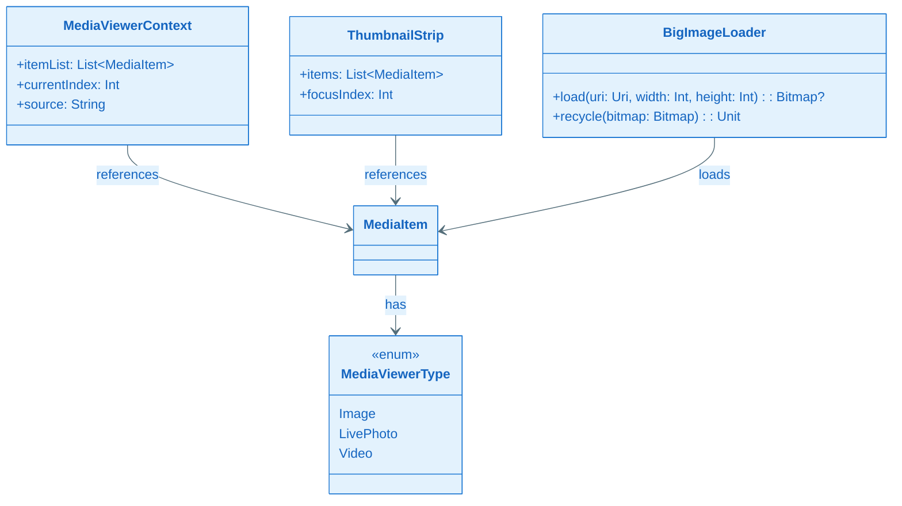
```mermaid
%%{init: {'theme': 'base', 'themeVariables': { 'primaryColor': '#E3F2FD', 'primaryTextColor': '#1565C0', 'primaryBorderColor': '#1976D2', 'lineColor': '#546E7A'}}}%%
classDiagram
    direction TB
    
    class MediaViewerContext {
        +itemList: List~MediaItem~
        +currentIndex: Int
        +source: String
    }
    
    class ThumbnailStrip {
        +items: List~MediaItem~
        +focusIndex: Int
    }
    
    class MediaViewerType {
        <<enum>>
        Image
        LivePhoto
        Video
    }
    
    class BigImageLoader {
        +load(uri: Uri, width: Int, height: Int): Bitmap?
        +recycle(bitmap: Bitmap): Unit
    }
    
    MediaViewerContext --> MediaItem : references
    ThumbnailStrip --> MediaItem : references
    MediaItem --> MediaViewerType : has
    BigImageLoader --> MediaItem : loads
```

#### A0.3 DDD 与面向对象原则对应（须对齐 epic-arch）

| 领域概念 | DDD 类型 | 7 大原则体现 |
|----------|----------|--------------|
| **MediaViewerContext** | 值对象，跨限界上下文契约 | 由 FEAT-001 等构建；迪米特：不暴露 Repository |
| **BigImageLoader** | 领域层接口（非 Repository） | ISP：与 MediaRepository 分离；DIP：ViewModel 依赖接口 |
| **BigImageLoaderImpl** | 数据层实现 | LSP：可替换接口；SRP：仅采样解码缓存；合成复用：组合 ImageDecoder、LruCache |
| **MediaViewerType** | 值对象 | 枚举；OCP |
| **PreloadWindow** | 值对象/领域模型 | 无持久化 |
| **PhotoViewerViewModel** | 应用层编排 | SRP、合成复用；DIP：依赖 BigImageLoader |
| **PhotoViewerScreen** | 表示层 | SRP、迪米特：不直连 Data |

### A1. 技术方案选型

#### 1. 大图展示与滑动

| 方案 | 优势 | 劣势 |
|---|---|---|
| 方案 A：HorizontalPager (Compose) | 与 Compose 一致、易预加载 | 需处理预加载与回收 |
| 方案 B：ViewPager2 | 成熟、offscreenPageLimit | 与 Compose 混用需 AndroidView |
| 方案 C：LazyHorizontalPager | Compose 原生、支持大量页 | 需自己控制预取 |

**采用方案 A（HorizontalPager）**。理由：项目已全 Compose；HorizontalPager 支持 `beyondViewportPageCount` 控制预加载；与 ViewModel + MVI 集成自然；共享元素过渡可用 Modifier.graphicsLayer + AnimatedContent。

#### 2. 大图解码与采样

| 方案 | 优势 | 劣势 |
|---|---|---|
| 方案 A：Coil 直接 load | 复用、有缓存 | 大图可能全图解码，内存高 |
| 方案 B：BitmapFactory + inSampleSize | 精确控制采样 | 需自行缓存与回收 |
| 方案 C：Coil + SubsamplingScaleImageView | 支持大图分块 | 额外依赖、复杂度高 |

**采用方案 B（BitmapFactory + inSampleSize）**。理由：大图场景需严格控制内存；根据 viewport 宽高计算 inSampleSize，只解码所需分辨率；配合 LruCache 与离屏回收，满足 NFR-MEM-001；Coil 仍可用于缩图轴。若后续验证 Coil 的 decode 策略可满足内存预算，可再评估统一。

#### 3. 视频播放

| 方案 | 优势 | 劣势 |
|---|---|---|
| 方案 A：ExoPlayer / Media3 | 成熟、格式支持全 | 依赖体积 |
| 方案 B：VideoView / MediaPlayer | 系统 API | 能力弱、兼容性一般 |

**采用方案 A（ExoPlayer / Media3）**。理由：支持 MP4、MOV、AVI、MKV 等约定格式；与 Jetpack Media3 集成；可控制生命周期与内存释放。

#### 4. 多格式与媒体类型策略（图片 / GIF / 视频 / 实况图）

大图预览需按 **MediaViewerType**（Image / LivePhoto / Video）与**具体格式**选择解码与展示方式，满足 spec FR-002、FR-003、FR-004（多格式、GIF、视频）。

**4.1 媒体类型与展示分支**

| MediaViewerType | 展示组件 / 数据源 | 解码/播放责任 | 说明 |
|-----------------|------------------|---------------|------|
| **Image**（静态图） | 单帧 Bitmap / AsyncImage | BigImageLoader（BitmapFactory + inSampleSize） | JPEG、PNG、WebP、HEIC、BMP、TIFF、ICO，见 4.2 |
| **Image**（GIF） | 动图控件（见 4.3） | GIF 解码器（见 4.3） | 需连续帧与循环播放，单独策略 |
| **LivePhoto** | 静态帧 + 短视频 | 首帧：BigImageLoader；视频段：ExoPlayer/Media3 | HEIC+视频对或系统 Live Photo API |
| **Video** | VideoPlayerComponent | ExoPlayer / Media3 | MP4、MOV、AVI、MKV、WebM、3GP、M4V |

**4.2 图片格式与解码责任**

| 格式 | 解码方式 | 备注 |
|------|----------|------|
| JPEG、PNG、WebP、BMP、TIFF、ICO | BitmapFactory（BigImageLoaderImpl / ImageDecoder） | 与 A3.2.4 组件 1 一致；inSampleSize 控制内存 |
| HEIC | BitmapFactory（API 28+ 原生）；低版本需 AppCompat 或第三方解码库 | 不支持时返回 null → 占位 |
| **GIF** | 见 4.3 | 与静态图分流，避免大 GIF 全帧解码 OOM |

**4.3 GIF 设计要点**

- **需求**：spec FR-003 要求 GIF 可预览（动效播放）。
- **解码**：Android 原生 BitmapFactory 仅解码 GIF 第一帧；**动图播放**需其一：
  - **方案 A**：使用 **Coil** 的 `ImageRequest` 加载 GIF（`ImageLoader.execute(ImageRequest.Builder(context).data(uri).build())`），Compose 侧用 `AsyncImage` 或 Coil 的 `SubcomposeAsyncImage`，Coil 内部用 Android 的 `ImageDecoder`（API 28+）或自研解码，支持循环播放。
  - **方案 B**：使用 **Android ImageDecoder**（API 28+）逐帧解码 GIF，自绘或封装为 Drawable 控制帧间隔与循环。
- **与 BigImageLoader 关系**：GIF 不经过 BigImageLoader 的 LruCache（以 Bitmap 为单位），由 Coil 或专用 GIF 加载管线负责；当前页为 GIF 时，ViewModel 根据 `MediaItem.mediaType` 或 MIME 分支：静态图走 `BigImageLoader.load`，GIF 走 Coil/ImageLoader 或专用 loadGif。
- **内存**：限制单 GIF 解码帧数或分辨率（如最大边长 1024、最多缓存 N 帧），避免超大 GIF 导致 OOM；离屏时释放 GIF 解码资源（与 ST-003 离屏回收一致）。
- **占位**：GIF 加载中或解码失败时使用占位图，对齐 NFR-REL-001。

**4.4 视频与实况图（与 A1.3、ST-004 对齐）**

- **视频**：当前项为 Video 时，大图页展示 **VideoPlayerComponent**，使用 ExoPlayer/Media3 播放 URI；格式不支持时占位+提示。
- **实况图**：首帧用 BigImageLoader 或缩略图；视频段用 ExoPlayer 或系统 Live Photo API（若可用）；**解析与播放细节见 4.4.1**。

**4.4.1 实况图（Live Photo）解析与播放**

实况图 = **主静态图 + 短视频段 + 元数据**，大图预览需先解析出「首帧图」与「视频源」，再按「先静图后视频」或「静图+循环短视频」方式播放。

**（1）格式与来源**

| 来源/标准 | 主文件 | 视频 | 元数据/关联方式 |
|-----------|--------|------|-----------------|
| **Android Motion Photo**（Google/三星等） | HEIC 或 JPEG | MP4 内嵌于同一文件末尾，或 XMP 指向 | XMP：`Container.Directory`（新）/ `GCamera.MicroVideoOffset`（旧） |
| **单文件内嵌** | HEIC/JPEG 内含 MP4 | 同文件内从某偏移起为 MP4 | 在文件中查找 MP4 文件头 `ftyp` 定位视频起始偏移，或读 XMP 得 Length/Offset |
| **系统/MediaStore** | 主图 URI | 若平台提供「配对视频」URI（如 `MediaStore` 扩展或 ContentResolver 查询） | MediaItem 携带 `livePhotoVideoUri` 或等效字段，列表/详情层已解析 |

- **厂商差异**：小米常用旧 MicroVideo；OPPO 等有自有格式；本方案优先支持 **Motion Photo 常见形态**（单文件内嵌 MP4 + XMP 或 ftyp 定位），系统提供配对 URI 时直接使用。

**（2）解析流程（谁在何时解析）**

- **理想**：列表/媒体库层（FEAT-001 或 Media 层）在加载媒体列表时，对 MIME 为 `image/heic`/`image/jpeg` 且带 Motion Photo 标记的项，解析出「视频 URI 或视频在文件内偏移」，写入 **MediaItem**（如 `videoUri: Uri?` / `motionPhotoVideoOffset: Long?`），大图页只消费。
- **若 MediaItem 未带视频信息**：大图页或共享的「实况图解析器」在进入大图时解析：
  1. 用 **ContentResolver.openInputStream(主图 URI)** 读主图文件；
  2. **方式 A**：读 XMP（ExifInterface 或第三方库）取 `MicroVideoOffset` / `Container.Directory` 得到视频长度或偏移；
  3. **方式 B**：在字节流中搜索 **`ftyp`**（MP4 文件头），从该位置起视为 MP4；可写入临时文件或 **InputStream + 偏移** 供 ExoPlayer 使用（Media3 支持 `DataSource.Factory` 从自定义流/偏移读取）。
- **输出**：得到「首帧图 URI = 主图 URI」与「视频源 = 配对 URI 或 主图 URI + offset+length」；首帧用 BigImageLoader 解 HEIC/JPEG 第一帧。

**（3）播放流程**

1. **首帧**：用 **BigImageLoader.load(主图 URI, width, height)** 解码静态首帧（HEIC/JPEG 仅解一帧），或先显示缩略图再替换为首帧。
2. **视频段**：
   - 若有 **videoUri**：**VideoPlayerComponent** 使用 ExoPlayer/Media3 播放该 URI。
   - 若为 **主图 URI + 偏移**：通过 **DataSource.Factory** 提供「从主图 URI 的 InputStream，skip(offset) 后读取」或提取到临时文件后播放；播放结束后可循环或停在最后一帧（产品可配置）。
3. **交互**：默认可先静图展示，用户长按/点击「播放」再播视频段；或进入即自动静音播放一段（与 ux-design 对齐即可）。

**（4）与现有组件的对应关系**

| 步骤 | 组件/数据 | 说明 |
|------|-----------|------|
| 类型识别 | MediaItem.mediaType == LivePhoto | 由列表/媒体库写入或根据 MIME+XMP 推断 |
| 首帧展示 | BigImageLoader + 主图 URI | 与静态图一致 |
| 视频播放 | VideoPlayerComponent + ExoPlayer | 与纯视频页共用，数据源为「配对 URI」或「主图流+偏移」 |
| 解析实现位置 | 可选：LivePhotoParser 工具类 / FEAT-001 媒体加载时 | 输出写入 MediaItem 或 ViewModel 持有的 LivePhotoPayload（stillUri, videoUri 或 offset） |

**（5）异常与降级**

- 无法解析出视频（无 XMP、无 ftyp、格式未知）：仅展示首帧静态图，不报错。
- 视频提取或播放失败：占位或提示「实况图视频无法播放」，不崩溃（NFR-REL-001）。

**4.5 格式不支持 / 损坏**

- 解码失败、格式不支持、文件损坏：统一返回 null 或 Result 失败，UI 展示**占位图 + 可选简短提示**，不崩溃（NFR-REL-001）；与 A2.1.1 外部依赖策略一致。

#### 5. 进入过渡（无黑图）

| 方案 | 优势 | 劣势 |
|---|---|---|
| 方案 A：共享元素过渡 | 自然、符合 ux-design | 需 Transition 配置 |
| 方案 B：淡入 | 简单 | 体验略逊 |
| 方案 C：无动画 | 最快 | 生硬 |

**采用方案 A（共享元素过渡 + 同步加载）**。理由：ux-design 约定 300–350ms 共享元素 + 淡入；进入时立即启动当前页解码，在过渡完成前尽量完成，避免黑图；若解码慢于过渡，使用缩略图或低分辨率占位（非纯黑）。

**Compose 实现**：使用 `SharedTransitionLayout` + `Modifier.sharedElement()`（详见 [Shared element transitions](https://developer.android.com/develop/ui/compose/animation/shared-elements)、[Navigation 集成](https://developer.android.com/develop/ui/compose/animation/shared-elements/navigation)）：

1. **布局层级**：用 `SharedTransitionLayout` 包裹 `NavHost`；`composable` 的 content lambda 提供 `AnimatedContentScope`。
2. **大图侧（本 Feature）**：在 `PhotoViewerScreen` 当前页的图片容器（如 `Box` 或 `AsyncImage`）上添加 `Modifier.sharedElement(rememberSharedContentState(key = "image-${currentItem.id}"), animatedVisibilityScope = animatedContentScope)`；key 必须与列表侧一致（见 FEAT-001 plan A3.2.4 疑难点 5）。
3. **作用域传递**：将 `sharedTransitionScope`、`animatedContentScope` 通过参数或 CompositionLocal 传入 PhotoViewerScreen。
4. **Modifier 顺序**：`sharedElement` 前的 modifier 决定 bounds；`fillMaxSize` / `aspectRatio` 需与列表侧约束顺序一致，避免动画跳跃。
5. **占位与无黑图**：进入时立即启动 BigImageLoader 解码；过渡内未完成时，`AsyncImage` 的 `placeholder` 使用 Coil 缩略图或灰色块，禁止纯黑。

### A2. Feature 0层设计

#### A2.1 Feature 0层架构图（必须）

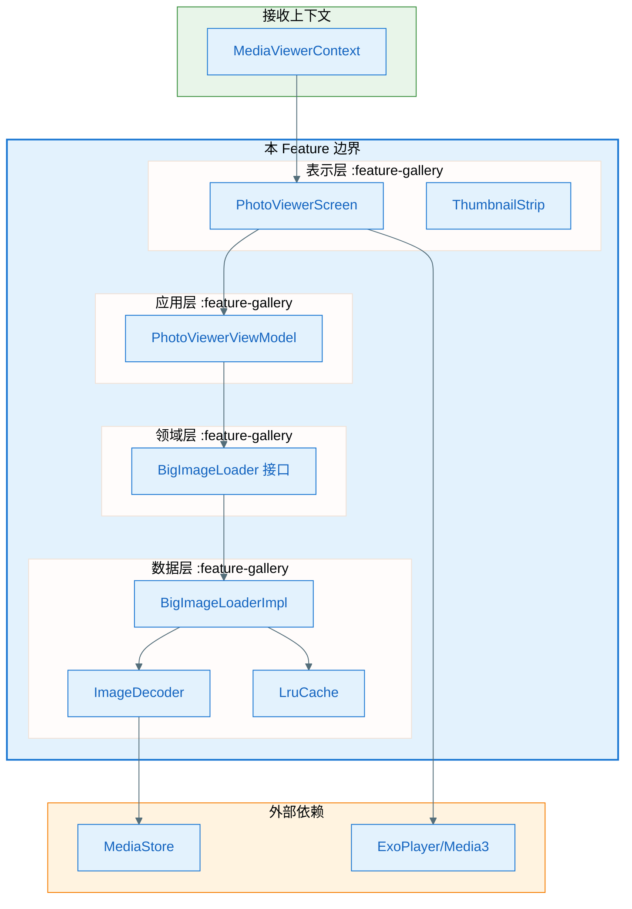
```mermaid
%%{init: {'theme': 'base', 'themeVariables': { 'primaryColor': '#E3F2FD', 'primaryTextColor': '#1565C0', 'primaryBorderColor': '#1976D2', 'lineColor': '#546E7A'}}}%%
flowchart TB
    subgraph FeatureBoundary["本 Feature 边界"]
        subgraph UILayer["表示层 :feature-gallery"]
            PhotoViewerScreen["PhotoViewerScreen"]
            ThumbnailStripCompose["ThumbnailStrip"]
        end
        subgraph AppLayer["应用层 :feature-gallery"]
            PhotoViewerViewModel["PhotoViewerViewModel"]
        end
        subgraph DomainLayer["领域层 :feature-gallery"]
            BigImageLoader["BigImageLoader 接口"]
        end
        subgraph DataLayer["数据层 :feature-gallery"]
            BigImageLoaderImpl["BigImageLoaderImpl"]
            ImageDecoder["ImageDecoder"]
            LruCache["LruCache"]
        end
    end

    subgraph Reused["接收上下文"]
        MediaViewerContext["MediaViewerContext"]
    end

    subgraph External["外部依赖"]
        MediaStore["MediaStore"]
        ExoPlayer["ExoPlayer/Media3"]
    end

    MediaViewerContext --> PhotoViewerScreen
    PhotoViewerScreen --> PhotoViewerViewModel
    PhotoViewerViewModel --> BigImageLoader
    BigImageLoader --> BigImageLoaderImpl
    BigImageLoaderImpl --> ImageDecoder
    BigImageLoaderImpl --> LruCache
    ImageDecoder --> MediaStore
    PhotoViewerScreen --> ExoPlayer

    style FeatureBoundary fill:#E3F2FD,stroke:#1976D2,stroke-width:2px
    style Reused fill:#E8F5E9,stroke:#388E3C
    style External fill:#FFF3E0,stroke:#F57C00
```

#### A2.1.1 架构设计说明（必须）

- **边界与职责**：本 Feature 负责大图全屏 UI、缩图轴、采样解码、缓存、视频播放、进入过渡；接收 MediaViewerContext；不提供列表能力。**多格式（静态图 / GIF / 视频 / 实况图）分流与解码策略见 A1.4**。Out of Scope：编辑、分享。
- **分层与依赖方向**：表示层 → 应用层 → 领域层 ← 数据层。
- **关键数据流**：MediaViewerContext 提供 itemList；ViewModel 按 currentIndex 与 PreloadWindow 调度加载；按 **MediaViewerType** 分支：静态图走 BigImageLoader，GIF 走 Coil/专用管线，视频与实况图走 ExoPlayer；离屏页 Bitmap/GIF/播放器释放。
- **外部依赖策略**：文件损坏/格式不支持 → 占位或提示，不崩溃；解码失败 → 占位图。
- **可演进性**：BigImageLoader 接口可被列表缩图复用（可选）；解码策略可调（inSampleSize 算法、缓存大小）。

#### A2.2 外部依赖清单

| 依赖项 | 类型 | 提供方 | 故障模式 | 我方策略 |
|--------|------|--------|----------|----------|
| MediaStore / ContentResolver | OS | Android | 文件不存在、损坏 | 占位、提示 |
| ExoPlayer / Media3 | 第三方 | AndroidX | 格式不支持 | 占位、提示 |
| BitmapFactory | 系统 | Android | OOM、解码失败 | inSampleSize、try-catch、回收 |
| MediaViewerContext | 内部 | FEAT-001 契约 | — | 由导航传入 |

#### A2.3 通信与交互约束

- **协议**：函数调用、ContentResolver.openInputStream
- **错误处理**：解码失败 → Result/Nullable；UI 展示占位；不崩溃
- **内存**：LruCache 限制（如 50MB）；离屏页主动 recycle；inSampleSize 按 viewport 计算

### A3. Feature 1层设计

#### A3.1 第一层：整体框架设计（必须）

##### A3.1.1 内部总体框架图（必须）

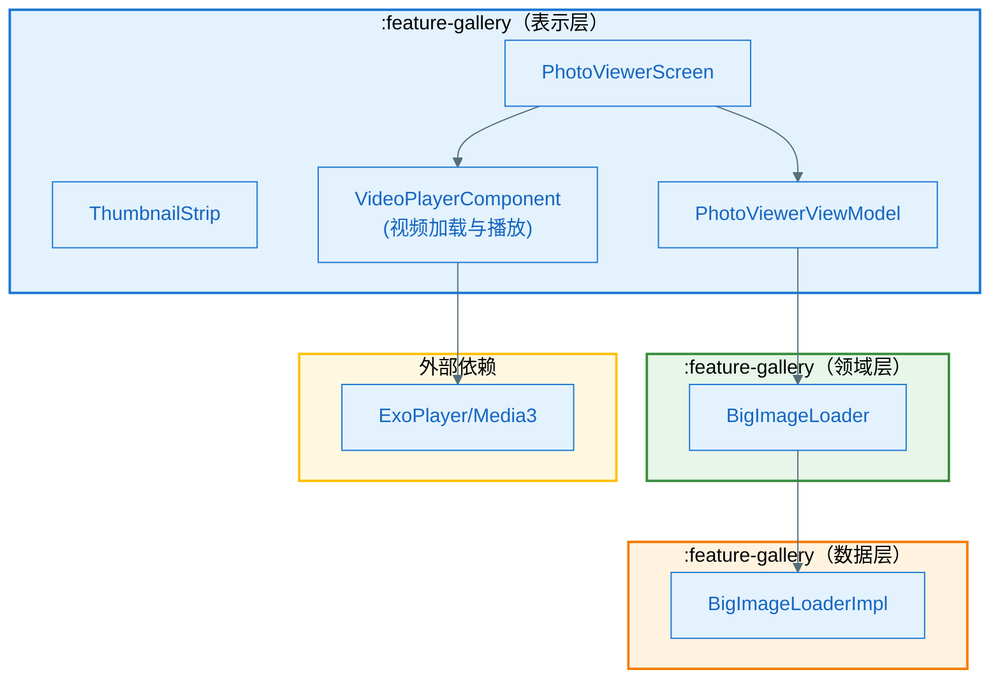
```mermaid
%%{init: {'theme': 'base', 'themeVariables': { 'primaryColor': '#E3F2FD', 'primaryTextColor': '#1565C0', 'primaryBorderColor': '#1976D2', 'lineColor': '#546E7A'}}}%%
flowchart TB
    subgraph UILayer[":feature-gallery（表示层）"]
        PhotoViewerScreen["PhotoViewerScreen"]
        ThumbnailStrip["ThumbnailStrip"]
        PhotoViewerViewModel["PhotoViewerViewModel"]
        VideoPlayerComponent["VideoPlayerComponent\n(视频加载与播放)"]
    end

    subgraph DomainLayer[":feature-gallery（领域层）"]
        BigImageLoader["BigImageLoader"]
    end

    subgraph DataLayer[":feature-gallery（数据层）"]
        BigImageLoaderImpl["BigImageLoaderImpl"]
    end

    subgraph External["外部依赖"]
        ExoPlayer["ExoPlayer/Media3"]
    end

    PhotoViewerScreen --> PhotoViewerViewModel
    PhotoViewerScreen --> VideoPlayerComponent
    PhotoViewerViewModel --> BigImageLoader
    BigImageLoader --> BigImageLoaderImpl
    VideoPlayerComponent --> ExoPlayer

    style UILayer fill:#E3F2FD,stroke:#1976D2,stroke-width:2px
    style DomainLayer fill:#E8F5E9,stroke:#388E3C,stroke-width:2px
    style DataLayer fill:#FFF3E0,stroke:#F57C00,stroke-width:2px
    style External fill:#FFF8E1,stroke:#FFC107,stroke-width:2px
```

**说明**：当当前页为 **Video** 或 **LivePhoto** 视频段时，PhotoViewerScreen 使用 **VideoPlayerComponent** 承载视频加载与播放（ExoPlayer/Media3）；静态图与 GIF 仍经 PhotoViewerViewModel → BigImageLoader 或 Coil 展示。多格式分流详见 A1.4、流程 3。

##### A3.1.2 总体设计说明

###### A3.1.2.1 组件清单与职责（必须）

| 组件 | 所属模块 | 职责 | 输入/输出 | 依赖 |
|------|----------|------|-----------|------|
| PhotoViewerScreen | :feature-gallery | 大图全屏、HorizontalPager、缩放、缩图轴 | context → UI | PhotoViewerViewModel |
| ThumbnailStrip | :feature-gallery | 底部缩图轴，焦点居中 | items, focusIndex | Coil |
| PhotoViewerViewModel | :feature-gallery | 大图 MVI、预加载调度、索引同步 | MediaViewerContext → State | BigImageLoader |
| BigImageLoader | :feature-gallery | 大图采样、解码、缓存、回收 | uri, size → Bitmap? | — |
| BigImageLoaderImpl | :feature-gallery | BitmapFactory + LruCache 实现 | 同上 | ContentResolver |
| VideoPlayerComponent | :feature-gallery | 视频播放 | uri → 播放 | ExoPlayer |

###### A3.1.2.2 组件协作时序图（必须）

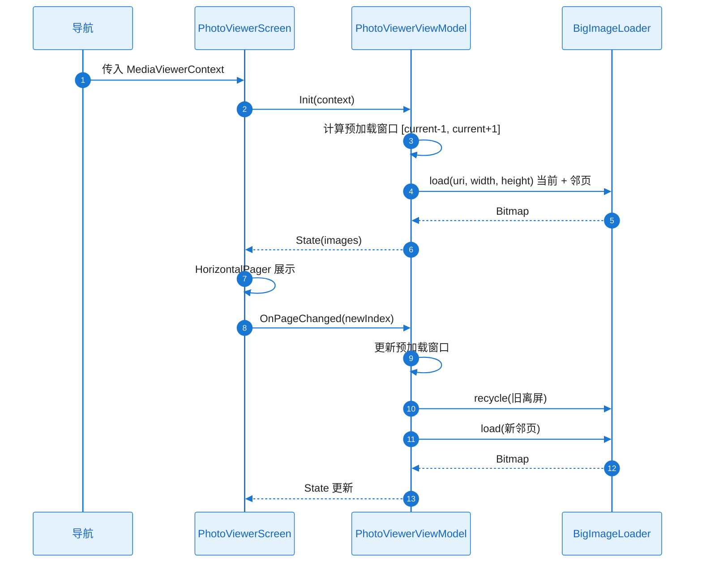
```mermaid
%%{init: {'theme': 'base', 'themeVariables': { 'actorBkg': '#E3F2FD', 'actorBorder': '#1976D2', 'actorTextColor': '#1565C0', 'signalColor': '#1976D2', 'signalTextColor': '#212121', 'noteBkgColor': '#FFF8E1', 'noteBorderColor': '#FFC107'}}}%%
sequenceDiagram
    autonumber
    
    participant Nav as 导航
    participant UI as PhotoViewerScreen
    participant VM as PhotoViewerViewModel
    participant Loader as BigImageLoader

    Nav->>UI: 传入 MediaViewerContext
    UI->>VM: Init(context)
    VM->>VM: 计算预加载窗口 [current-1, current+1]
    VM->>Loader: load(uri, width, height) 当前 + 邻页
    Loader-->>VM: Bitmap
    VM-->>UI: State(images)
    UI->>UI: HorizontalPager 展示
    
    UI->>VM: OnPageChanged(newIndex)
    VM->>VM: 更新预加载窗口
    VM->>Loader: recycle(旧离屏)
    VM->>Loader: load(新邻页)
    Loader-->>VM: Bitmap
    VM-->>UI: State 更新
```

---

#### A3.2 第二层：Feature 全景（必须）

##### A3.2.1 Feature 流程图集（逻辑流程，必须）

###### 流程 1：从列表进入大图

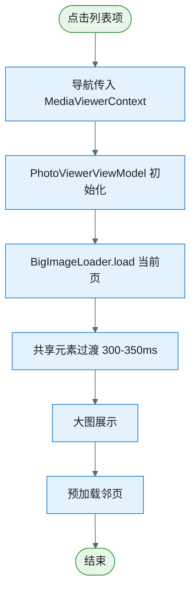
```mermaid
%%{init: {'theme': 'base', 'themeVariables': { 'primaryColor': '#E3F2FD', 'primaryTextColor': '#212121', 'primaryBorderColor': '#1976D2', 'lineColor': '#546E7A'}}}%%
flowchart TD
    Start(["点击列表项"]) --> Nav["导航传入 MediaViewerContext"]
    Nav --> Init["PhotoViewerViewModel 初始化"]
    Init --> Load["BigImageLoader.load 当前页"]
    Load --> Transition["共享元素过渡 300-350ms"]
    Transition --> Show["大图展示"]
    Show --> Preload["预加载邻页"]
    Preload --> End(["结束"])

    style Start fill:#E8F5E9,stroke:#388E3C
    style End fill:#E8F5E9,stroke:#388E3C
```

###### 流程 2：左右滑动切换

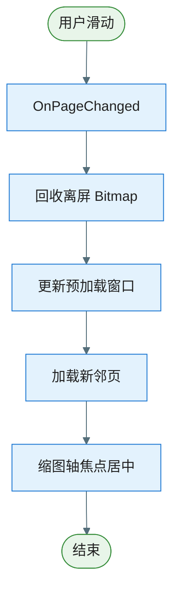
```mermaid
%%{init: {'theme': 'base', 'themeVariables': { 'primaryColor': '#E3F2FD', 'primaryTextColor': '#212121', 'primaryBorderColor': '#1976D2', 'lineColor': '#546E7A'}}}%%
flowchart TD
    Start([用户滑动]) --> PageChange[OnPageChanged]
    PageChange --> Recycle[回收离屏 Bitmap]
    Recycle --> UpdatePreload[更新预加载窗口]
    UpdatePreload --> LoadNew[加载新邻页]
    LoadNew --> SyncThumb[缩图轴焦点居中]
    SyncThumb --> End([结束])

    style Start fill:#E8F5E9,stroke:#388E3C
    style End fill:#E8F5E9,stroke:#388E3C
```

###### 流程 3：按媒体类型选择展示方式（多格式 / GIF / 视频）

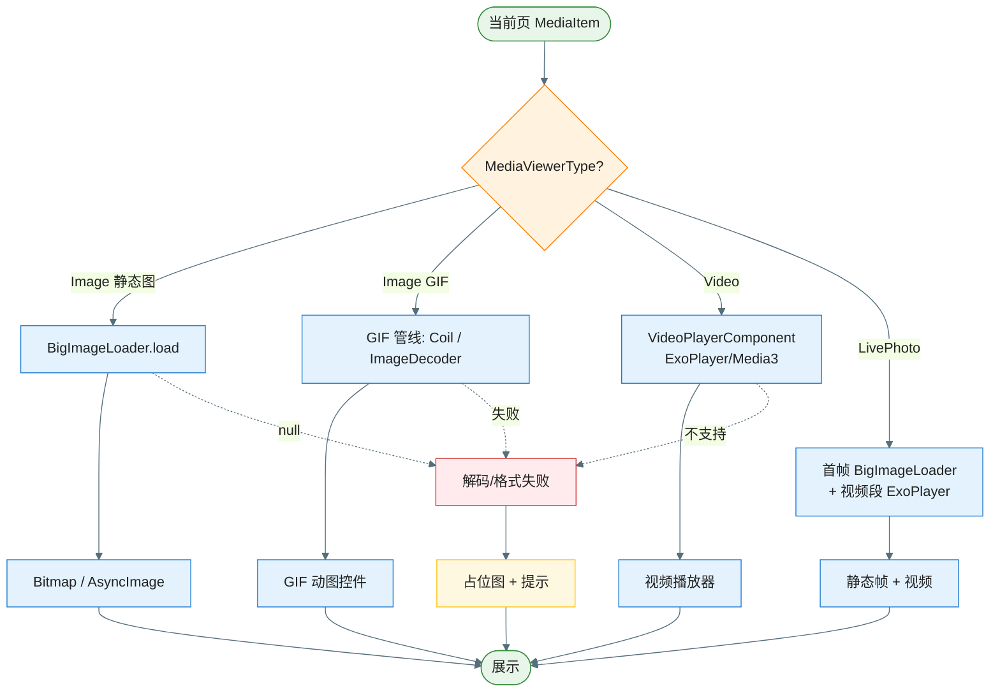
```mermaid
%%{init: {'theme': 'base', 'themeVariables': { 'primaryColor': '#E3F2FD', 'primaryTextColor': '#212121', 'primaryBorderColor': '#1976D2', 'lineColor': '#546E7A'}}}%%
flowchart TD
    Start(["当前页 MediaItem"]) --> Type{"MediaViewerType?"}
    Type -->|Image 静态图| Static["BigImageLoader.load"]
    Type -->|Image GIF| Gif["GIF 管线: Coil / ImageDecoder"]
    Type -->|Video| Video["VideoPlayerComponent\nExoPlayer/Media3"]
    Type -->|LivePhoto| Live["首帧 BigImageLoader\n+ 视频段 ExoPlayer"]
    Static --> Render1["Bitmap / AsyncImage"]
    Gif --> Render2["GIF 动图控件"]
    Video --> Render3["视频播放器"]
    Live --> Render4["静态帧 + 视频"]
    Render1 --> End(["展示"])
    Render2 --> End
    Render3 --> End
    Render4 --> End
    Fail["解码/格式失败"] --> Placeholder["占位图 + 提示"]
    Placeholder --> End
    Static -.->|null| Fail
    Gif -.->|失败| Fail
    Video -.->|不支持| Fail

    style Start fill:#E8F5E9,stroke:#388E3C
    style End fill:#E8F5E9,stroke:#388E3C
    style Type fill:#FFF3E0,stroke:#F57C00
    style Fail fill:#FFEBEE,stroke:#D32F2F
    style Placeholder fill:#FFF8E1,stroke:#FFC107
```

##### A3.2.2 全景类图（必须）

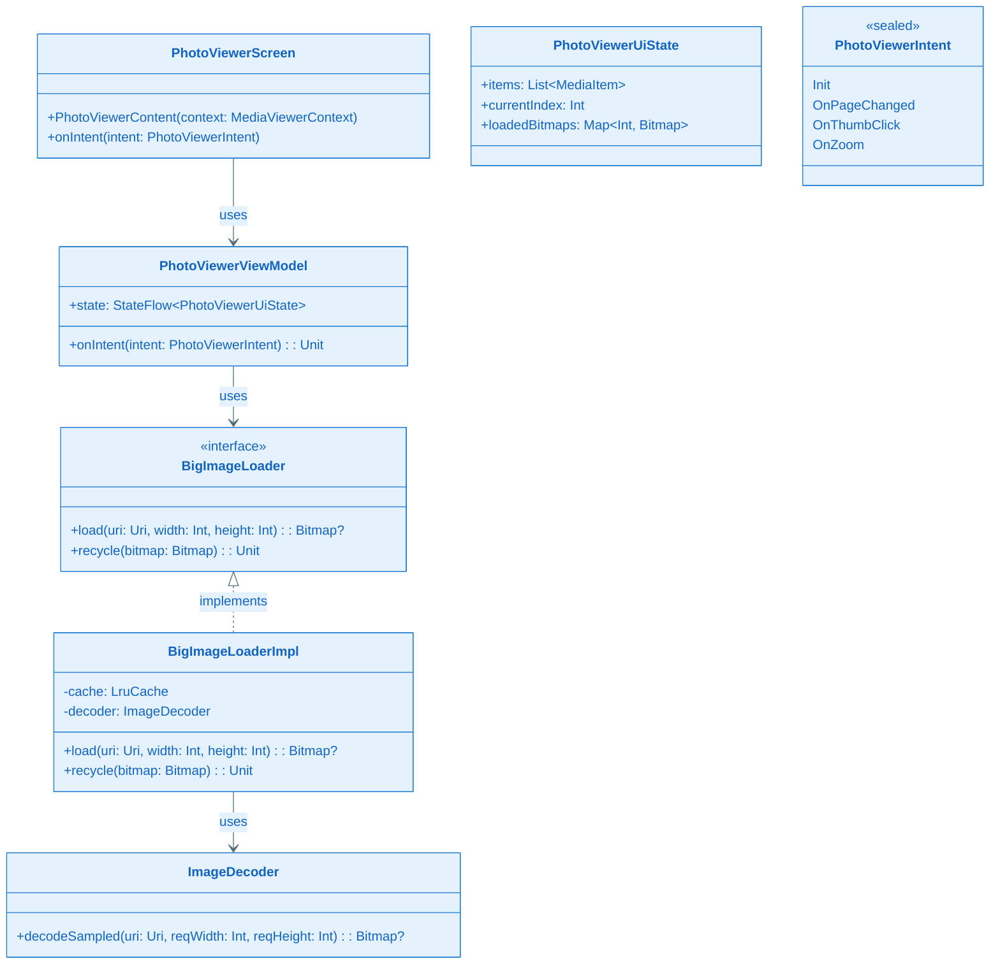
```mermaid
%%{init: {'theme': 'base', 'themeVariables': { 'primaryColor': '#E3F2FD', 'primaryTextColor': '#1565C0', 'primaryBorderColor': '#1976D2', 'lineColor': '#546E7A'}}}%%
classDiagram
    direction TB

    class PhotoViewerScreen {
        +PhotoViewerContent(context: MediaViewerContext)
        +onIntent(intent: PhotoViewerIntent)
    }

    class PhotoViewerViewModel {
        +state: StateFlow~PhotoViewerUiState~
        +onIntent(intent: PhotoViewerIntent): Unit
    }

    class PhotoViewerUiState {
        +items: List~MediaItem~
        +currentIndex: Int
        +loadedBitmaps: Map~Int, Bitmap~
    }

    class PhotoViewerIntent {
        <<sealed>>
        Init
        OnPageChanged
        OnThumbClick
        OnZoom
    }

    class BigImageLoader {
        <<interface>>
        +load(uri: Uri, width: Int, height: Int): Bitmap?
        +recycle(bitmap: Bitmap): Unit
    }

    class BigImageLoaderImpl {
        -cache: LruCache
        -decoder: ImageDecoder
        +load(uri: Uri, width: Int, height: Int): Bitmap?
        +recycle(bitmap: Bitmap): Unit
    }

    class ImageDecoder {
        +decodeSampled(uri: Uri, reqWidth: Int, reqHeight: Int): Bitmap?
    }

    PhotoViewerScreen --> PhotoViewerViewModel : uses
    PhotoViewerViewModel --> BigImageLoader : uses
    BigImageLoader <|.. BigImageLoaderImpl : implements
    BigImageLoaderImpl --> ImageDecoder : uses
```

###### 关键类职责说明

| 类/接口 | 层级 | 职责 | 关键方法 | DDD/原则 |
|---------|------|------|----------|----------|
| PhotoViewerScreen | 表示层 | 大图全屏 UI、HorizontalPager、缩放、缩图轴 | PhotoViewerContent(), onIntent() | SRP、迪米特：不直连 Data |
| PhotoViewerViewModel | 应用层 | 大图 MVI、预加载、索引 | onIntent(), state | SRP、合成复用；DIP：依赖 BigImageLoader |
| BigImageLoader | 领域层 | 大图加载抽象 | load(), recycle() | ISP：与 Repository 分离 |
| BigImageLoaderImpl | 数据层 | 采样解码、LruCache、回收 | load(), recycle() | LSP、SRP；合成复用：组合 ImageDecoder |
| ImageDecoder | 数据层 | inSampleSize 计算与 BitmapFactory 解码 | decodeSampled() | SRP；合成复用：被 Loader 组合 |

##### A3.2.3 关键时序图集（方法调用流程，必须）

| Seq ID | 流程名称 | 覆盖的异常 |
|--------|----------|-------------|
| SEQ-001 | 进入大图加载当前页 | EX-001 |
| SEQ-002 | 滑动切换预加载与回收 | — |
| SEQ-003 | 缩图轴点击切换 | — |

###### SEQ-001：进入大图加载当前页

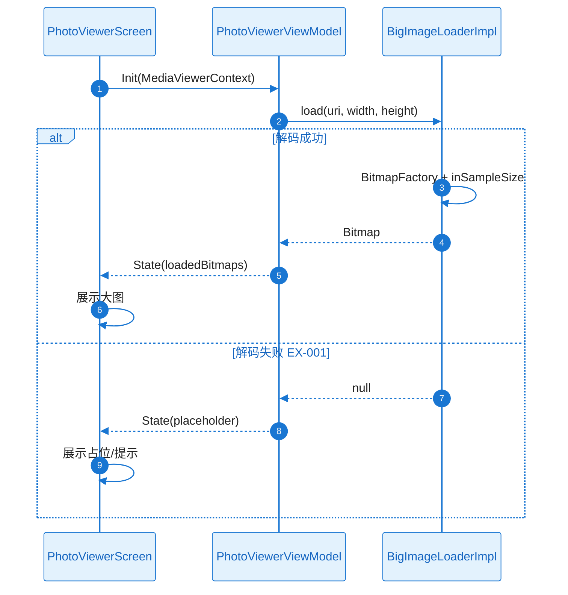
```mermaid
%%{init: {'theme': 'base', 'themeVariables': { 'actorBkg': '#E3F2FD', 'actorBorder': '#1976D2', 'actorTextColor': '#1565C0', 'signalColor': '#1976D2', 'signalTextColor': '#212121', 'noteBkgColor': '#FFF8E1', 'noteBorderColor': '#FFC107'}}}%%
sequenceDiagram
    autonumber
    
    participant UI as PhotoViewerScreen
    participant VM as PhotoViewerViewModel
    participant Loader as BigImageLoaderImpl

    UI->>VM: Init(MediaViewerContext)
    VM->>Loader: load(uri, width, height)
    
    alt 解码成功
        Loader->>Loader: BitmapFactory + inSampleSize
        Loader-->>VM: Bitmap
        VM-->>UI: State(loadedBitmaps)
        UI->>UI: 展示大图
    else 解码失败 EX-001
        Loader-->>VM: null
        VM-->>UI: State(placeholder)
        UI->>UI: 展示占位/提示
    end
```

###### SEQ-002：滑动切换预加载与回收

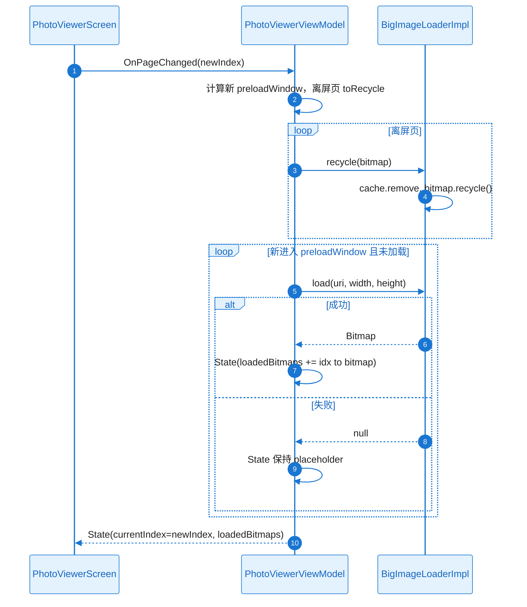
```mermaid
%%{init: {'theme': 'base', 'themeVariables': { 'actorBkg': '#E3F2FD', 'actorBorder': '#1976D2', 'actorTextColor': '#1565C0', 'signalColor': '#1976D2', 'signalTextColor': '#212121', 'noteBkgColor': '#FFF8E1', 'noteBorderColor': '#FFC107'}}}%%
sequenceDiagram
    autonumber

    participant UI as PhotoViewerScreen
    participant VM as PhotoViewerViewModel
    participant Loader as BigImageLoaderImpl

    UI->>VM: OnPageChanged(newIndex)
    VM->>VM: 计算新 preloadWindow，离屏页 toRecycle

    loop 离屏页
        VM->>Loader: recycle(bitmap)
        Loader->>Loader: cache.remove, bitmap.recycle()
    end

    loop 新进入 preloadWindow 且未加载
        VM->>Loader: load(uri, width, height)
        alt 成功
            Loader-->>VM: Bitmap
            VM->>VM: State(loadedBitmaps += idx to bitmap)
        else 失败
            Loader-->>VM: null
            VM->>VM: State 保持 placeholder
        end
    end

    VM-->>UI: State(currentIndex=newIndex, loadedBitmaps)
```

###### SEQ-003：缩图轴点击切换

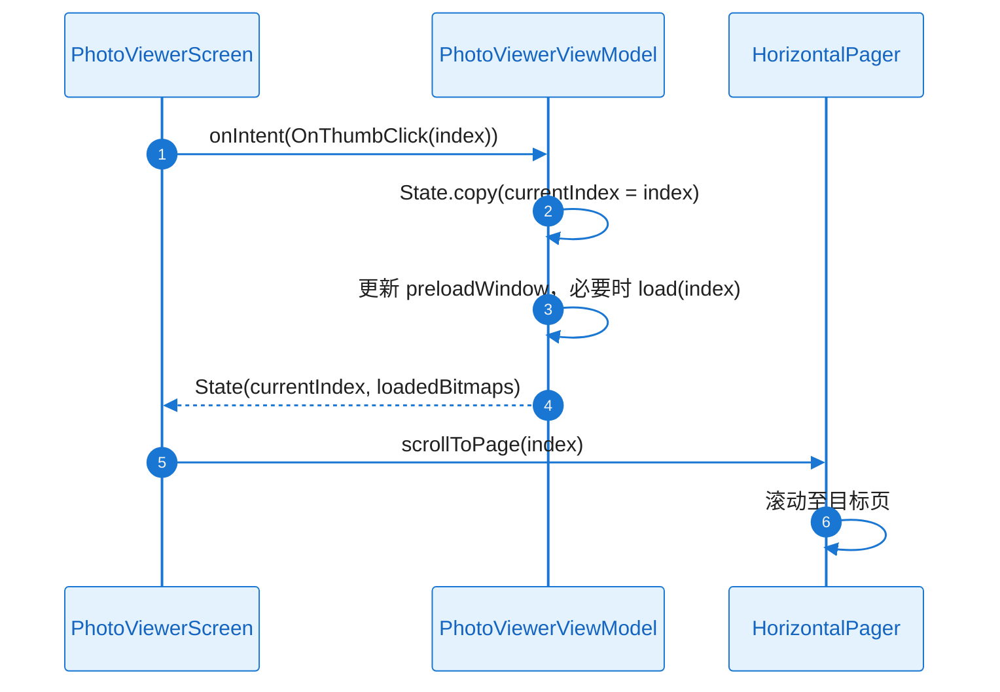
```mermaid
%%{init: {'theme': 'base', 'themeVariables': { 'actorBkg': '#E3F2FD', 'actorBorder': '#1976D2', 'actorTextColor': '#1565C0', 'signalColor': '#1976D2', 'signalTextColor': '#212121', 'noteBkgColor': '#FFF8E1', 'noteBorderColor': '#FFC107'}}}%%
sequenceDiagram
    autonumber

    participant UI as PhotoViewerScreen
    participant VM as PhotoViewerViewModel
    participant Pager as HorizontalPager

    UI->>VM: onIntent(OnThumbClick(index))
    VM->>VM: State.copy(currentIndex = index)
    VM->>VM: 更新 preloadWindow，必要时 load(index)
    VM-->>UI: State(currentIndex, loadedBitmaps)
    UI->>Pager: scrollToPage(index)
    Pager->>Pager: 滚动至目标页
```

##### A3.2.4 疑难点与亮点设计详解（若适用）

###### 疑难点 1：无黑图、丝滑滑动（NFR-PERF-003）

- **类型**：疑难点
- **背景说明**：进入时不能先黑屏再出图；滑动时不能出现加载中态、黑图。需同步加载 + 预加载 + 离屏回收配合。
- **核心方案**：（1）进入时立即启动当前页解码，共享元素过渡内尽量完成；若未完成用缩略图或低分辨率占位。（2）HorizontalPager 的 beyondViewportPageCount=1，预加载左右各 1 页。（3）解码按 viewport 计算 inSampleSize，控制单张内存。（4）离屏页主动 recycle，减少峰值。
- **共享元素过渡实现**：Compose API 见本 plan A1「4. 进入过渡」下的 Compose 实现段落；列表侧 key 与作用域传递见 FEAT-001 plan A3.2.4 疑难点 5。两端 `key = "image-${item.id}"` 一致即可实现缩略图→大图的平滑放大过渡（300–350ms）。
- **边界条件**：低端机解码慢时可接受短时低清占位，禁止纯黑。

###### 疑难点 2：内存可控不 OOM（NFR-MEM-001）

- **类型**：疑难点
- **背景说明**：大图解码占内存，连续滑动可能累积。
- **核心方案**：LruCache 限制总内存（如 50MB）；仅缓存当前+邻页；离屏立即 recycle 并从 cache 移除；inSampleSize 确保单张不过大（如 max 2048px）；视频使用 ExoPlayer 的默认释放策略。
- **边界条件**：超大图（如 10000x10000）可进一步降低 inSampleSize 或拒绝加载并提示。

---

#### A3.3 第三层：组件内部详细设计

##### 组件 1：BigImageLoaderImpl + ImageDecoder

- **定位**：大图采样、解码、LruCache、离屏回收，详见 A3.2.4 疑难点 2
- **对外接口**：`load(uri, width, height): Bitmap?`，`recycle(bitmap): Unit`
- **失败与降级**：解码失败返回 null，UI 展示占位

###### 技术实现路径（开发可照此落码）

| 步骤 | 落点 | 实现要点 |
|------|------|----------|
| 1 | inSampleSize 计算 | `BitmapFactory.Options().apply { inJustDecodeBounds = true }; BitmapFactory.decodeStream(inputStream, null, options)` 得到 `outWidth`、`outHeight`；`inSampleSize = max(1, min(outWidth/reqWidth, outHeight/reqHeight))`，且取 2 的幂：`if (inSampleSize > 1) inSampleSize = 2^k where 2^k <= inSampleSize`；限制 max 边长：若 `max(outWidth, outHeight) > 4096` 则再放大 inSampleSize 使解码后 ≤2048 |
| 2 | decodeSampled | `options.inSampleSize = inSampleSize; options.inJustDecodeBounds = false`；`BitmapFactory.decodeStream(ContentResolver.openInputStream(uri), null, options)`；注意 `inputStream` 需 `use { }` 或 try-finally close |
| 3 | LruCache | `object : LruCache<String, Bitmap>(maxSizeBytes) { override fun sizeOf(key: String, value: Bitmap) = value.byteCount }`；maxSizeBytes 建议 50 * 1024 * 1024；key 用 `uri.toString() + "_${reqW}x${reqH}"` 以区分不同尺寸请求 |
| 4 | load 流程 | 先 `cache.get(key)` 若命中直接返回；否则 `decoder.decodeSampled(uri, reqW, reqH)`；非 null 则 `cache.put(key, bitmap)`；return bitmap。全部在 `withContext(Dispatchers.IO)` |
| 5 | recycle 流程 | `cache.remove(key)`（若 key 可反推）；`bitmap.recycle()`；注意仅对非 `isRecycled` 的 Bitmap 调用 recycle，且 recycle 后不可再使用 |
| 6 | 异常 | try-catch `OutOfMemoryError`、`IOException`、`SecurityException`，返回 null；decodeStream 失败也返回 null |
| 7 | HEIC 支持 | API 28+ 默认支持；低版本需 AppCompat 或 third-party 解码库；若不支持可返回 null 显示占位 |
| 8 | 线程 | load/recycle 必须在非主线程（Dispatchers.IO）；caller 为 ViewModel 时 `viewModelScope.launch(Dispatchers.IO) { loader.load(...) }` |

###### inSampleSize 算法（标准实现）

```kotlin
fun calculateInSampleSize(options: BitmapFactory.Options, reqWidth: Int, reqHeight: Int): Int {
    val (w, h) = options.outWidth to options.outHeight
    var inSampleSize = 1
    if (w > reqWidth || h > reqHeight) {
        val halfW = w / 2; val halfH = h / 2
        while (halfW / inSampleSize >= reqWidth && halfH / inSampleSize >= reqHeight) {
            inSampleSize *= 2
        }
    }
    // 限制解码后最大边长 2048，避免超大图 OOM
    val decodedMax = max(w, h) / inSampleSize
    if (decodedMax > 2048) {
        inSampleSize = (max(w, h) / 2048).coerceAtLeast(1)
        // 取 2 的幂
        if (inSampleSize > 1) inSampleSize = 1 shl (31 - Integer.numberOfLeadingZeros(inSampleSize))
    }
    return inSampleSize
}
```

###### 关键数据结构

```
LruCache key: "${uri}" 或 "${uri}_${reqW}x${reqH}"（多尺寸缓存时）
maxCacheSize: 50 * 1024 * 1024
单张解码后预算: 约 2048*2048*4 ≈ 16MB（ARGB_8888）
```

###### 线程与生命周期

| 项目 | 约束 |
|------|------|
| 执行线程 | load、recycle 在 Dispatchers.IO |
| 生命周期 | BigImageLoader 可单例或跟随 PhotoViewerScreen；退出大图时 ViewModel 调用 recycle 清理当前+邻页 |
| Bitmap 使用 | 仅在 Compose 的 `AsyncImage` 或 `Image(bitmap=...)` 中短时持有，切页后立即 recycle |

###### 组件详细类图

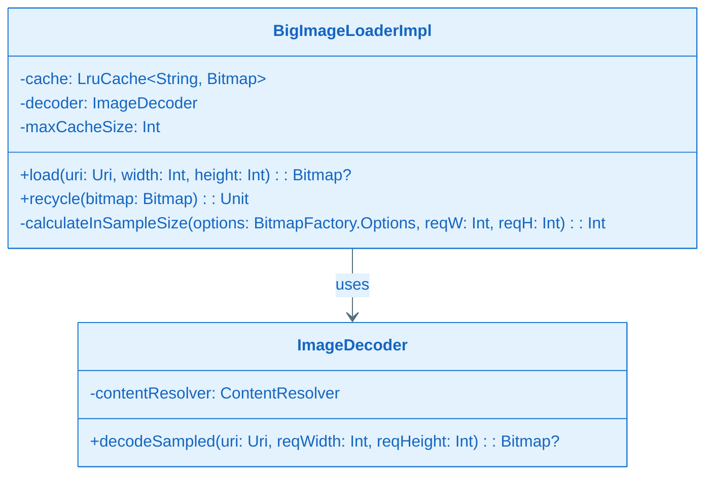
```mermaid
%%{init: {'theme': 'base', 'themeVariables': { 'primaryColor': '#E3F2FD', 'primaryTextColor': '#1565C0', 'primaryBorderColor': '#1976D2', 'lineColor': '#546E7A'}}}%%
classDiagram
    direction TB
    
    class BigImageLoaderImpl {
        -cache: LruCache~String, Bitmap~
        -decoder: ImageDecoder
        -maxCacheSize: Int
        +load(uri: Uri, width: Int, height: Int): Bitmap?
        +recycle(bitmap: Bitmap): Unit
        -calculateInSampleSize(options: BitmapFactory.Options, reqW: Int, reqH: Int): Int
    }
    
    class ImageDecoder {
        -contentResolver: ContentResolver
        +decodeSampled(uri: Uri, reqWidth: Int, reqHeight: Int): Bitmap?
    }
    
    BigImageLoaderImpl --> ImageDecoder : uses
```

###### 异常清单

| 异常ID | 触发条件 | 错误类型 | 可重试 | 对策 |
|--------|----------|----------|--------|------|
| EX-001 | 文件损坏/格式不支持/解码 OOM | DecodeFailed | 否 | 占位图、提示 |

###### 组件完整详细时序图：load 成功/失败与 recycle

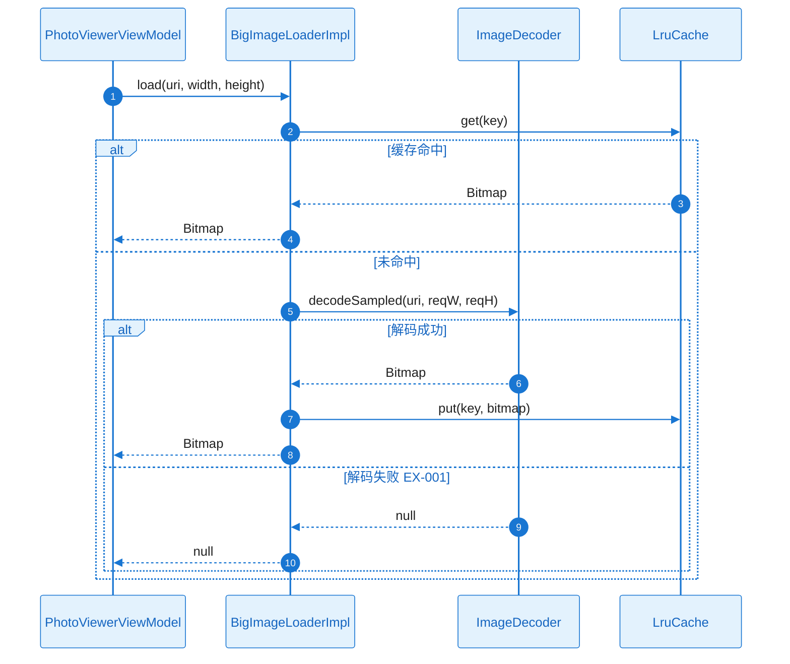
```mermaid
%%{init: {'theme': 'base', 'themeVariables': { 'actorBkg': '#E3F2FD', 'actorBorder': '#1976D2', 'actorTextColor': '#1565C0', 'signalColor': '#1976D2', 'signalTextColor': '#212121', 'noteBkgColor': '#FFF8E1', 'noteBorderColor': '#FFC107'}}}%%
sequenceDiagram
    autonumber

    participant VM as PhotoViewerViewModel
    participant Loader as BigImageLoaderImpl
    participant Decoder as ImageDecoder
    participant Cache as LruCache

    VM->>Loader: load(uri, width, height)
    Loader->>Cache: get(key)

    alt 缓存命中
        Cache-->>Loader: Bitmap
        Loader-->>VM: Bitmap
    else 未命中
        Loader->>Decoder: decodeSampled(uri, reqW, reqH)
        alt 解码成功
            Decoder-->>Loader: Bitmap
            Loader->>Cache: put(key, bitmap)
            Loader-->>VM: Bitmap
        else 解码失败 EX-001
            Decoder-->>Loader: null
            Loader-->>VM: null
        end
    end
```

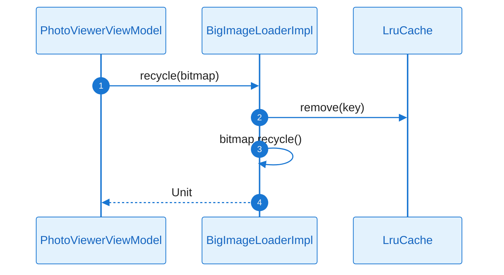
```mermaid
%%{init: {'theme': 'base', 'themeVariables': { 'actorBkg': '#E3F2FD', 'actorBorder': '#1976D2', 'actorTextColor': '#1565C0', 'signalColor': '#1976D2', 'signalTextColor': '#212121', 'noteBkgColor': '#FFF8E1', 'noteBorderColor': '#FFC107'}}}%%
sequenceDiagram
    autonumber

    participant VM as PhotoViewerViewModel
    participant Loader as BigImageLoaderImpl
    participant Cache as LruCache

    VM->>Loader: recycle(bitmap)
    Loader->>Cache: remove(key)
    Loader->>Loader: bitmap.recycle()
    Loader-->>VM: Unit
```

##### 组件 2：PhotoViewerViewModel 预加载与回收

- **定位**：按 currentIndex 计算 PreloadWindow，调度 load/recycle；详见 A3.2.4 疑难点 1
- **对外接口**：onIntent(Init, OnPageChanged, OnThumbClick)
- **失败与降级**：load 返回 null 时 State 使用 placeholder key

###### 技术实现路径（开发可照此落码）

| 步骤 | 落点 | 实现要点 |
|------|------|----------|
| 1 | Init 流程 | 接收 `MediaViewerContext(itemList, currentIndex, source)`；`state = PhotoViewerUiState(items=itemList, currentIndex=currentIndex)`；立即 `preloadWindow = [currentIndex-1, currentIndex, currentIndex+1].filter { it in 0..itemList.lastIndex }` |
| 2 | 预加载调度 | `viewModelScope.launch(Dispatchers.IO) { preloadWindow.forEach { idx -> loader.load(itemList[idx].contentUri, viewportW, viewportH)?.let { withContext(Main) { state = state.copy(loadedBitmaps = state.loadedBitmaps + (idx to it)) } } } }`；viewportW/H 从 UI 传入或默认 screen 宽高 |
| 3 | OnPageChanged(newIndex) | 更新 `state = state.copy(currentIndex=newIndex)`；计算新 preloadWindow = `[newIndex-1, newIndex, newIndex+1].filter { it in 0..itemList.lastIndex }`；离屏页 = 旧 loadedBitmaps.keys 中不在新 preloadWindow 的；对离屏页调用 `loader.recycle(bitmap)` 并从 state.loadedBitmaps 移除；对新进入 preloadWindow 且未加载的页执行 load |
| 4 | loadedBitmaps 结构 | `Map<Int, Bitmap>`，key 为 itemList 的 index；UI 的 `HorizontalPager` 的 `page` 即 index，直接 `state.loadedBitmaps[page]` 取 Bitmap 展示；null 时显示 placeholder |
| 5 | 进入过渡无黑图 | 进入时先同步（在主线程可接受短阻塞）或立即 async 启动当前页 load；共享元素过渡 300ms 内尽量完成；若未完成，用 Coil 加载的缩略图（列表已有）或低分辨率预解码作为 placeholder；禁止纯黑—可 `AsyncImage` 的 placeholder = 灰色块或缩略图 |
| 6 | beyondViewportPageCount | HorizontalPager 的 `beyondViewportPageCount = 1`，Compose 会预加载相邻页；与 ViewModel 的 preload 配合，ViewModel 负责 Bitmap 级别 load，Compose 负责 pager 的 page 预创建 |
| 7 | 退出清理 | `viewModelScope.cancel()` 会取消未完成 load；`onCleared()` 中 `state.loadedBitmaps.values.forEach { loader.recycle(it) }` |
| 8 | 竞态 | 快速滑动时，旧页的 load 可能晚于 OnPageChanged；用 `currentLoadJob?.cancel()` 取消过时 load；或 load 完成时检查 `idx` 是否仍在 preloadWindow，若已滑走则直接 recycle 不写入 state |

###### 状态与数据流

```
Init(context):
  items = context.itemList
  currentIndex = context.currentIndex
  preloadWindow = [currentIndex-1, currentIndex, currentIndex+1].filterValid()
  for idx in preloadWindow: asyncLoad(idx)

OnPageChanged(newIndex):
  oldWindow = preloadWindow
  preloadWindow = [newIndex-1, newIndex, newIndex+1].filterValid()
  toRecycle = oldWindow - preloadWindow
  toLoad = preloadWindow - loadedBitmaps.keys
  toRecycle.forEach { recycle(it); loadedBitmaps.remove(it) }
  toLoad.forEach { asyncLoad(it) }
  currentIndex = newIndex
```

###### 组件详细类图

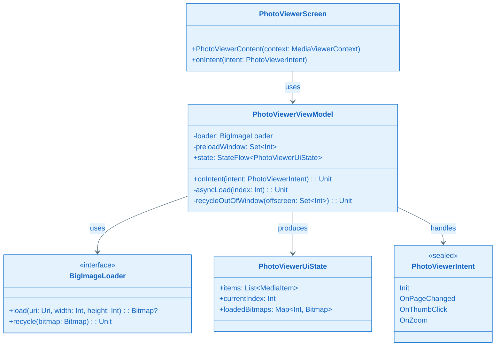
```mermaid
%%{init: {'theme': 'base', 'themeVariables': { 'primaryColor': '#E3F2FD', 'primaryTextColor': '#1565C0', 'primaryBorderColor': '#1976D2', 'lineColor': '#546E7A'}}}%%
classDiagram
    direction TB

    class PhotoViewerScreen {
        +PhotoViewerContent(context: MediaViewerContext)
        +onIntent(intent: PhotoViewerIntent)
    }

    class PhotoViewerViewModel {
        -loader: BigImageLoader
        -preloadWindow: Set~Int~
        +state: StateFlow~PhotoViewerUiState~
        +onIntent(intent: PhotoViewerIntent): Unit
        -asyncLoad(index: Int): Unit
        -recycleOutOfWindow(offscreen: Set~Int~): Unit
    }

    class PhotoViewerUiState {
        +items: List~MediaItem~
        +currentIndex: Int
        +loadedBitmaps: Map~Int, Bitmap~
    }

    class PhotoViewerIntent {
        <<sealed>>
        Init
        OnPageChanged
        OnThumbClick
        OnZoom
    }

    class BigImageLoader {
        <<interface>>
        +load(uri: Uri, width: Int, height: Int): Bitmap?
        +recycle(bitmap: Bitmap): Unit
    }

    PhotoViewerScreen --> PhotoViewerViewModel : uses
    PhotoViewerViewModel --> BigImageLoader : uses
    PhotoViewerViewModel --> PhotoViewerUiState : produces
    PhotoViewerViewModel --> PhotoViewerIntent : handles
```

###### 组件完整详细时序图：Init 预加载与 OnPageChanged

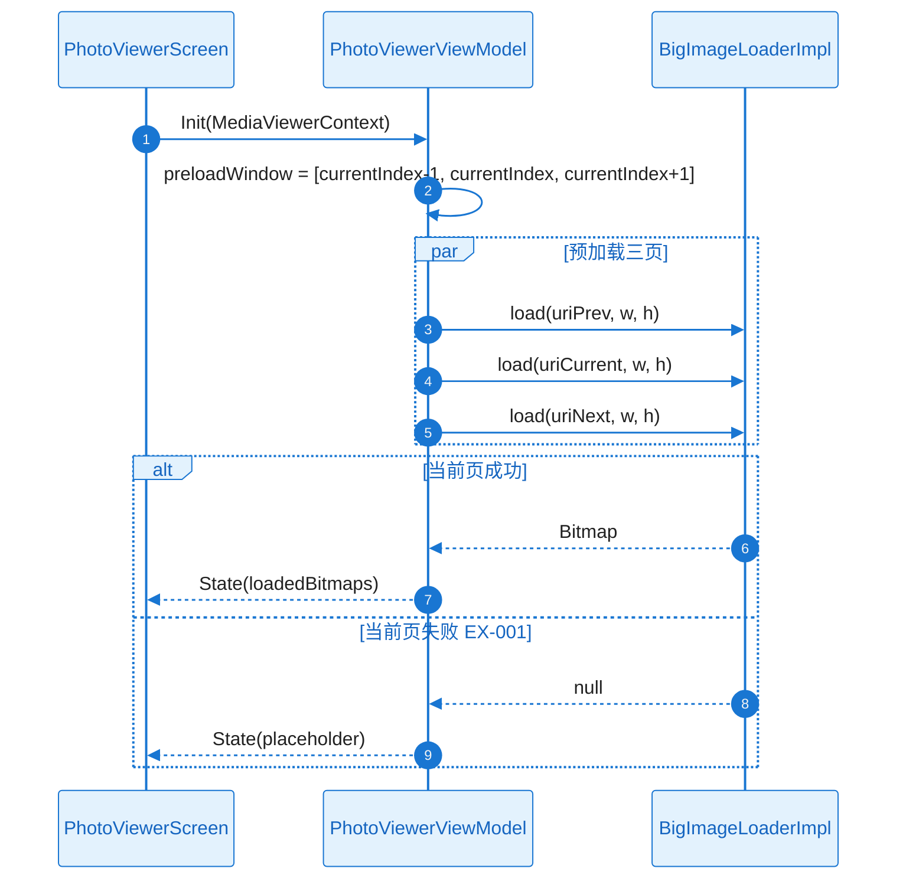
```mermaid
%%{init: {'theme': 'base', 'themeVariables': { 'actorBkg': '#E3F2FD', 'actorBorder': '#1976D2', 'actorTextColor': '#1565C0', 'signalColor': '#1976D2', 'signalTextColor': '#212121', 'noteBkgColor': '#FFF8E1', 'noteBorderColor': '#FFC107'}}}%%
sequenceDiagram
    autonumber

    participant UI as PhotoViewerScreen
    participant VM as PhotoViewerViewModel
    participant Loader as BigImageLoaderImpl

    UI->>VM: Init(MediaViewerContext)
    VM->>VM: preloadWindow = [currentIndex-1, currentIndex, currentIndex+1]

    par 预加载三页
        VM->>Loader: load(uriPrev, w, h)
        VM->>Loader: load(uriCurrent, w, h)
        VM->>Loader: load(uriNext, w, h)
    end

    alt 当前页成功
        Loader-->>VM: Bitmap
        VM-->>UI: State(loadedBitmaps)
    else 当前页失败 EX-001
        Loader-->>VM: null
        VM-->>UI: State(placeholder)
    end
```

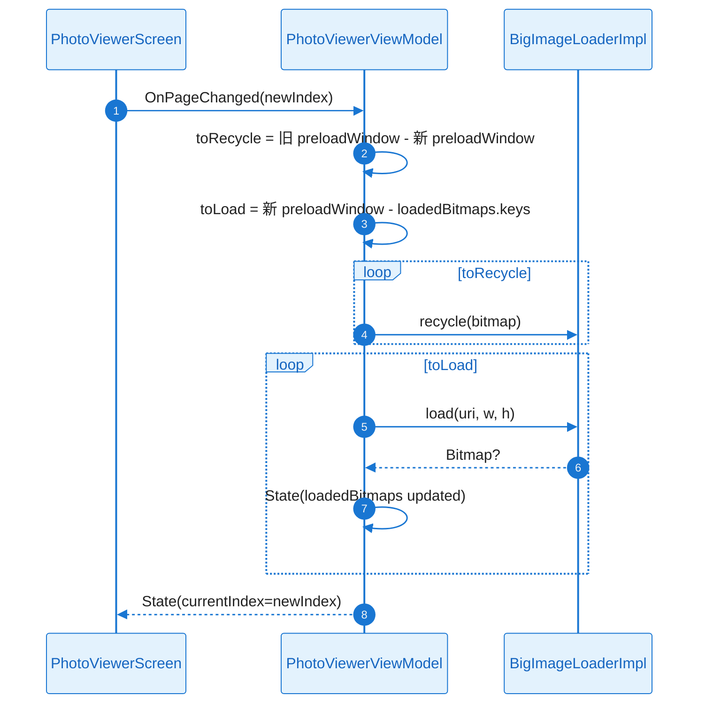
```mermaid
%%{init: {'theme': 'base', 'themeVariables': { 'actorBkg': '#E3F2FD', 'actorBorder': '#1976D2', 'actorTextColor': '#1565C0', 'signalColor': '#1976D2', 'signalTextColor': '#212121', 'noteBkgColor': '#FFF8E1', 'noteBorderColor': '#FFC107'}}}%%
sequenceDiagram
    autonumber

    participant UI as PhotoViewerScreen
    participant VM as PhotoViewerViewModel
    participant Loader as BigImageLoaderImpl

    UI->>VM: OnPageChanged(newIndex)
    VM->>VM: toRecycle = 旧 preloadWindow - 新 preloadWindow
    VM->>VM: toLoad = 新 preloadWindow - loadedBitmaps.keys

    loop toRecycle
        VM->>Loader: recycle(bitmap)
    end

    loop toLoad
        VM->>Loader: load(uri, w, h)
        Loader-->>VM: Bitmap?
        VM->>VM: State(loadedBitmaps updated)
    end

    VM-->>UI: State(currentIndex=newIndex)
```

###### 异常清单

| 异常ID | 触发条件 | 错误类型 | 可重试 | 对策 |
|--------|----------|----------|--------|------|
| EX-001 | 解码失败 | — | 否 | State.placeholder |

---

### A4. 技术风险与消解策略

| 风险ID | 风险描述 | 触发条件 | 影响范围 | 严重度 | 消解策略 | 对应 Story |
|--------|----------|----------|----------|--------|----------|-------------|
| RISK-001 | 大图内存 OOM | 低端机、大量高清图 | 进程被杀 | High | inSampleSize、LruCache、离屏回收 | ST-001 |
| RISK-002 | 进入黑图 | 解码慢于过渡 | 体验差 | Med | 缩略图占位、同步加载 | ST-002 |
| RISK-003 | 视频格式不支持 | 非约定格式 | 无法播放 | Low | 占位、提示 | ST-003 |

### A5. 边界 & 异常场景枚举

- **数据边界**：空 itemList、currentIndex 越界、URI 无效
- **生命周期**：退出大图时回收所有 Bitmap、ExoPlayer release
- **并发**：快速滑动时 load 与 recycle 竞态
- **用户行为**：快速连续滑动、格式不支持

#### A5.1 场景 → 应对措施对照表

| 场景ID | 场景类别 | 触发条件 | 影响 | 预期行为 | 技术对策 | 设计对策 | 映射 |
|--------|----------|----------|------|----------|----------|----------|------|
| SC-001 | 数据 | 文件损坏/格式不支持 | 无法显示 | 占位+提示 | try-catch、null 返回 | 占位图 | EX-001 |
| SC-002 | 内存 | 低端机大图 | OOM 风险 | 不崩溃 | inSampleSize、LruCache | — | RISK-001 |

### A6. 算法评估

N/A（无 ML 算法）

### A7. 功耗评估

| 场景 | 电流增量 | 时长 | 每日功耗 |
|------|----------|------|----------|
| 大图浏览 | ~80 mA | 60s | ~0.13 mAh |
| 视频播放 | ~120 mA | 120s | ~0.8 mAh |

**验收标准**：单次浏览 ≤ 2 mAh；视频播放单次 ≤ 5 mAh

### A8. 性能评估

| 场景 | 指标 | 验收标准 (p95) |
|------|------|----------------|
| 进入大图 | 无黑图 | 共享元素内完成或占位 |
| 滑动切换 | 无加载态 | 滑到即见 |
| 滑动帧率 | 帧率 | ≥ 55fps |

### A9. 内存评估

| 场景 | 验收标准 | 主要来源 |
|------|----------|----------|
| 大图单页 | 单张 ≤ 15MB | Bitmap 解码 |
| 三页预加载 | 总 ≤ 50MB | LruCache |
| 进出 10 次 | 回 Baseline ±10MB | 泄漏检测 |

**失败处置**：OOM 或泄漏须修复

### A10. 安全评估

同 FEAT-001，仅访问用户授权媒体库。

### A11. 兼容性评估

- **系统**：Android 10+ (API 29+)
- **图片格式**：HEIC 需 API 28+；BMP/TIFF/ICO 验证各机型
- **视频格式**：ExoPlayer 支持 MP4、MOV 等；MKV/WebM 需验证
- **低端机**：inSampleSize 激进采样、LruCache 缩小

**兼容性结论**：需重点测试低端机与多格式。

---

## Plan-B：技术规约 & 实现约束

### B0. Plan-A ↔ Plan-B 一致性与互校（必须）

| Plan-A | Plan-B | 自检 |
|---|---|---|
| A0 领域概念 | B3、B4 | 术语一致 |
| A1 BitmapFactory + LruCache | B2、B3 | 策略一致 |
| A2 无黑图、内存可控 | B2、B4 | 验收标准一致 |
| A3 预加载与回收 | B2 | 实现约束一致 |

### B1. 技术背景

**Language/Version**：Kotlin 2.1.21
**Primary Dependencies**：Jetpack Compose、ExoPlayer/Media3、Coil（缩图轴）
**Storage**：无本地存储，ContentUri 直读
**Target Platform**：Android 10+ (API 29+)
**Performance Targets**：进入无黑图、滑动丝滑、内存可控
**Constraints**：PSS 增量 ≤ 100MB；无 OOM；单张解码内存可控

### B2. 架构细化

- **分层约束**：同 FEAT-001
- **线程模型**：解码在 Dispatchers.IO；State 更新在主线程
- **内存策略**：LruCache maxSize 约 50MB；inSampleSize 按 viewport；离屏 recycle
- **预加载**：beyondViewportPageCount=1；当前页进入时同步加载

### B3. 数据模型

#### B3.1 存储形态与边界

- **存储形态**：无持久化；MediaViewerContext 由导航传入
- **System of Record**：MediaStore（媒体文件）
- **缓存**：LruCache 内存缓存 Bitmap；无磁盘缓存（大图）

### B4. 接口规范/协议

#### B4.1 本 Feature 对外提供的接口

| 接口 | 用途 | 调用方 |
|---|---|---|
| BigImageLoader（可选） | 大图加载抽象 | 列表缩图可复用（若需求） |

**当前**：一期列表使用 Coil，大图使用 BigImageLoader；若后续列表需大图预热可复用。

#### B4.2 本 Feature 依赖的外部接口

| 依赖 | 引用 |
|---|---|
| MediaViewerContext | FEAT-001 plan.md Plan-B:B4.1 |
| MediaItem | FEAT-001 plan.md |
| ContentResolver | 系统 API |

### B5. 合规性检查

- [ ] 仅访问用户授权媒体库
- [ ] 文件损坏/格式不支持不崩溃
- [ ] 内存可控，无 OOM

### B6. 项目结构（本 Feature）

```
specs/epics/EPIC-004-android-gallery/features/FEAT-004-photo-viewer/
├── spec.md
├── plan.md
└── checklists/
    └── requirements.md
```

### B7. 源代码结构（代码库根目录）

```text
feature-gallery/
  src/main/java/.../gallery/
    viewer/
      PhotoViewerScreen.kt
      PhotoViewerViewModel.kt
      PhotoViewerIntent.kt
      PhotoViewerUiState.kt
      ThumbnailStrip.kt
      VideoPlayerComponent.kt
    data/
      loader/
        BigImageLoader.kt
        BigImageLoaderImpl.kt
        ImageDecoder.kt
```

**说明**：与 FEAT-001/002/003 共处 `:feature-gallery`；BigImageLoader 可后续拆至 `:gallery-image-loader` 库供列表复用。

---

## Story Breakdown（Plan Level = Standard 时执行）

### Story 列表

#### ST-001：BigImageLoader 与采样解码

- **类型**：Infrastructure / Design-Enabler
- **描述**：BigImageLoader 接口、BigImageLoaderImpl、ImageDecoder；BitmapFactory + inSampleSize；LruCache 50MB；recycle 离屏
- **目标**：load/recycle 可用，内存可控
- **预估工作量**：5 人天
- **覆盖 FR/NFR**：FR-002、FR-003；NFR-MEM-001、NFR-REL-001
- **依赖**：FEAT-001
- **可并行**：否
- **关键风险**：是（RISK-001）
- **验收/验证方式**：单元测试 decode、cache；内存 profiling
- **交付物**：BigImageLoader、BigImageLoaderImpl、ImageDecoder

#### ST-002：大图 UI 与 HorizontalPager

- **类型**：Functional
- **描述**：PhotoViewerScreen、PhotoViewerViewModel；HorizontalPager + beyondViewportPageCount；共享元素过渡；缩放 zoomable；接收 MediaViewerContext
- **目标**：进入大图无黑图、展示当前页
- **预估工作量**：5 人天
- **覆盖 FR/NFR**：FR-005、FR-006；NFR-PERF-001
- **依赖**：ST-001
- **可并行**：否
- **关键风险**：是（RISK-002）
- **验收/验证方式**：UI 测试进入过渡
- **交付物**：PhotoViewerScreen、PhotoViewerViewModel

#### ST-003：滑动切换、预加载、缩图轴

- **类型**：Functional
- **描述**：OnPageChanged 预加载邻页、回收离屏；ThumbnailStrip 焦点居中；缩图轴点击切换
- **目标**：滑动丝滑无黑图、缩图轴可用
- **预估工作量**：4 人天
- **覆盖 FR/NFR**：FR-001、FR-005；NFR-PERF-002
- **依赖**：ST-002
- **可并行**：否
- **验收/验证方式**：滑动流畅度测试
- **交付物**：预加载逻辑、ThumbnailStrip

#### ST-004：视频、实况图与多格式支持

- **类型**：Functional
- **描述**：VideoPlayerComponent（ExoPlayer/Media3）；实况图 HEIC+视频对或系统 API；**GIF 动图**在大图页由 Coil 或 ImageDecoder 管线展示（见 A1.4 多格式策略）；格式不支持占位
- **目标**：视频、实况图、GIF 可播放/展示
- **预估工作量**：4 人天
- **覆盖 FR/NFR**：FR-002、FR-004；NFR-REL-001
- **依赖**：ST-002
- **可并行**：可与 ST-003 并行（不同模块）
- **关键风险**：是（RISK-003）
- **验收/验证方式**：格式支持测试
- **交付物**：VideoPlayerComponent、实况图处理

### Story 依赖关系图

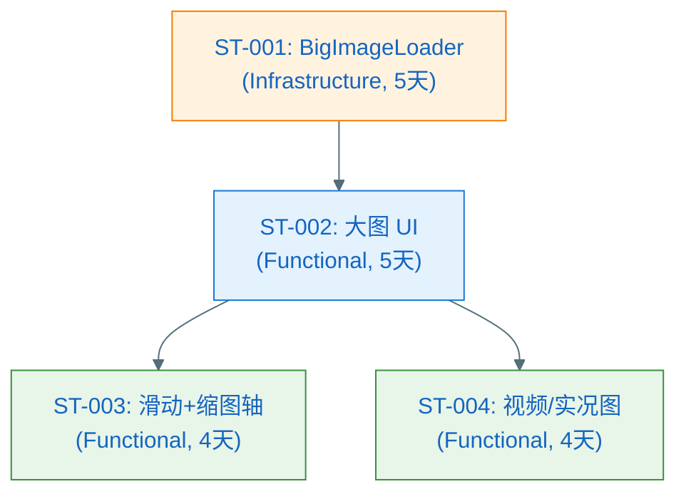
```mermaid
%%{init: {'theme': 'base', 'themeVariables': { 'primaryColor': '#E3F2FD', 'primaryTextColor': '#1565C0', 'primaryBorderColor': '#1976D2', 'lineColor': '#546E7A'}}}%%
flowchart TD
    ST001["ST-001: BigImageLoader<br/>(Infrastructure, 5天)"]
    ST002["ST-002: 大图 UI<br/>(Functional, 5天)"]
    ST003["ST-003: 滑动+缩图轴<br/>(Functional, 4天)"]
    ST004["ST-004: 视频/实况图<br/>(Functional, 4天)"]
    
    ST001 --> ST002
    ST002 --> ST003
    ST002 --> ST004
    
    style ST001 fill:#FFF3E0,stroke:#F57C00
    style ST002 fill:#E3F2FD,stroke:#1976D2
    style ST003 fill:#E8F5E9,stroke:#388E3C
    style ST004 fill:#E8F5E9,stroke:#388E3C
```

### Feature → Story 覆盖矩阵

| FR/NFR ID | 覆盖的 Story ID |
|-----------|-----------------|
| FR-001 | ST-003 |
| FR-002 | ST-001, ST-004 |
| FR-003（图片格式含 GIF） | ST-001（静态图）、ST-004（GIF 管线） |
| FR-004 | ST-004 |
| FR-005 | ST-002, ST-003 |
| FR-006 | ST-002 |
| NFR-PERF-001 | ST-002 |
| NFR-PERF-002 | ST-003 |
| NFR-MEM-001 | ST-001 |
| NFR-REL-001 | ST-001, ST-004 |

### Story 工作量汇总

| Story ID | 类型 | 预估（人天） | 依赖 |
|----------|------|-------------|------|
| ST-001 | Infrastructure | 5 | FEAT-001 |
| ST-002 | Functional | 5 | ST-001 |
| ST-003 | Functional | 4 | ST-002 |
| ST-004 | Functional | 4 | ST-002 |
| **总计** | — | **18 人天** | ST-003 与 ST-004 可并行 |

---

## Story Detailed Design（Plan Level = Deep 时执行）

各 Story 的 L2 二层详细设计已写入 **[story_detail_design.md](./story_detail_design.md)**，覆盖 ST-001～ST-004，包含：目标与 DoD、代码落点与边界、核心接口与契约、类图、时序图（含正常+异常）、异常矩阵、并发/生命周期/资源管理、验证与测试设计。

tasks.md 的 Task 应引用：`story_detail_design.md:ST-xxx:功能设计:时序图` 等入口。
