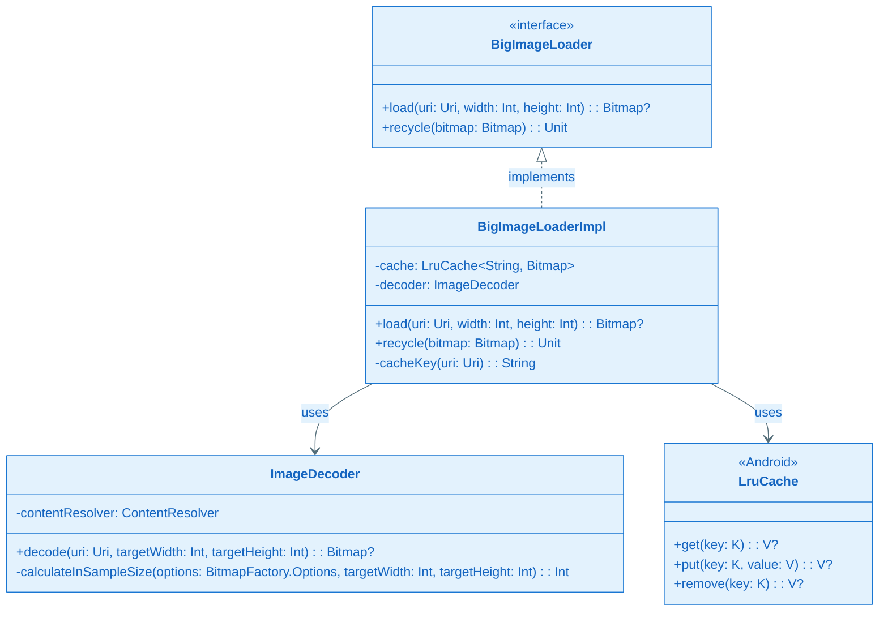
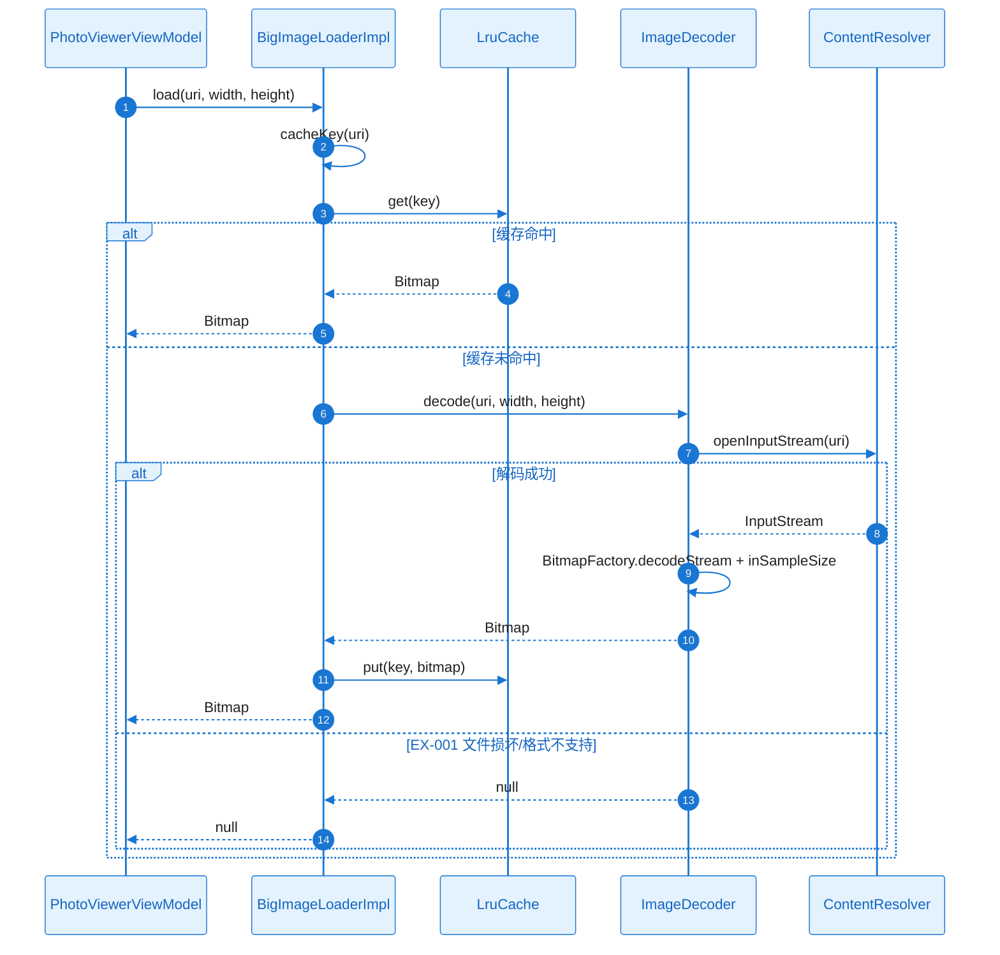
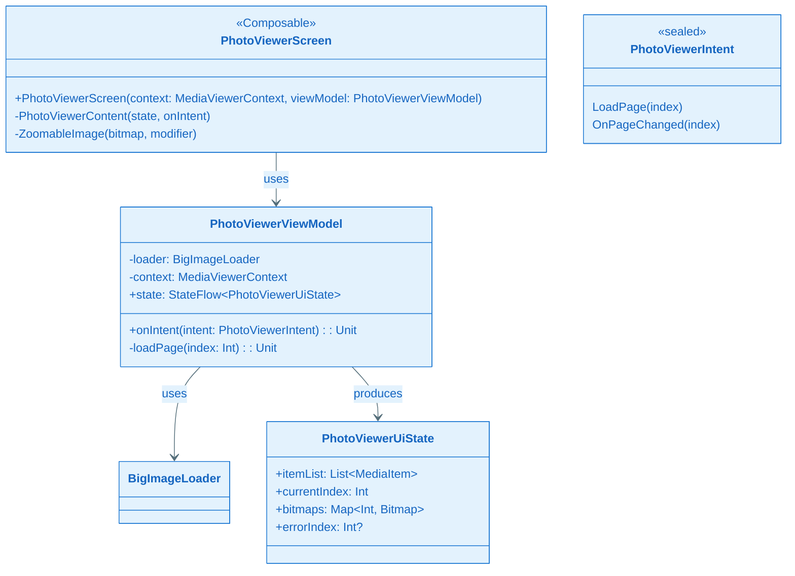
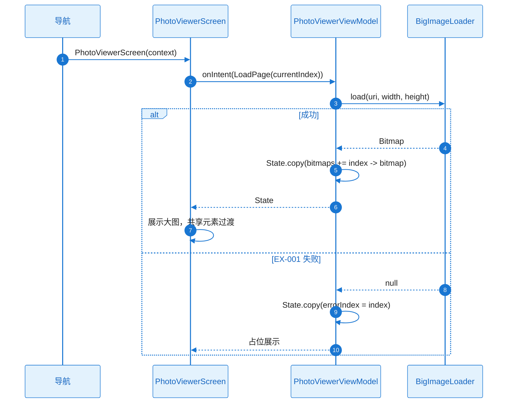
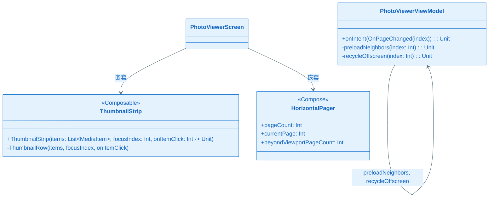
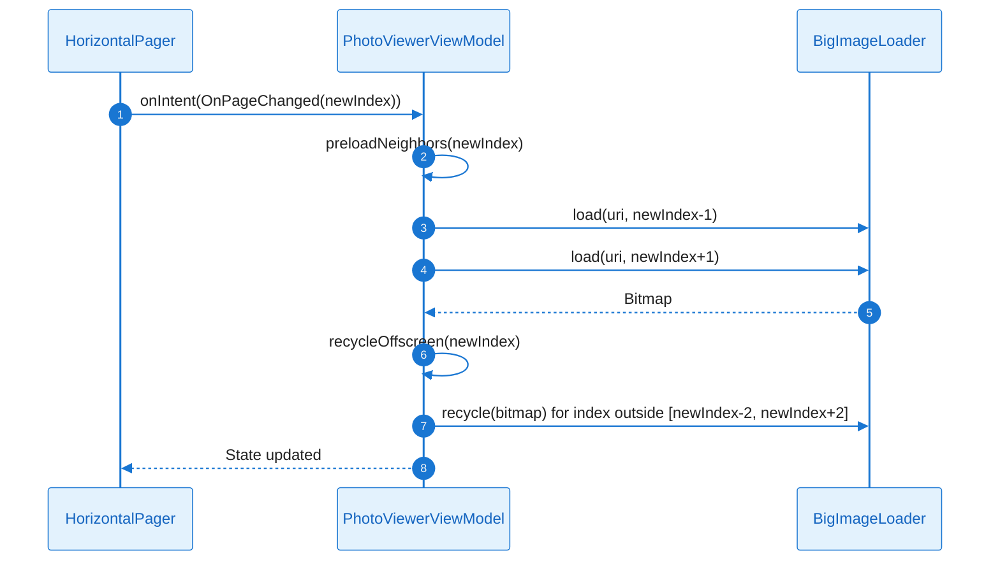
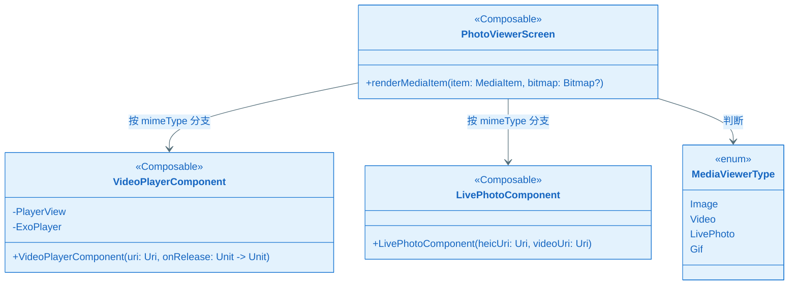
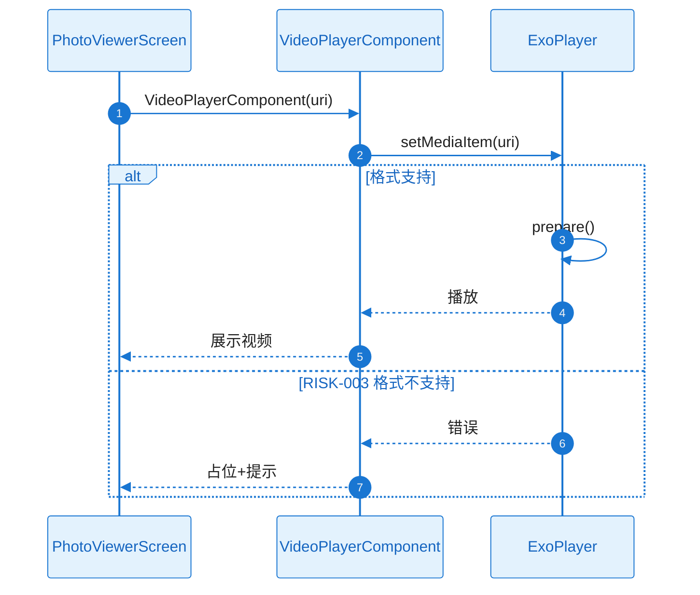

# L2 Story 详细设计（二层详细设计）：FEAT-004 大图浏览

本文档与 **plan.md** 配套使用：Plan Level = Deep 时，各 Story 的 L2 详细设计在此文档中编写。

**Feature**：FEAT-004 大图浏览  
**Plan Version**：v0.1.4  
**覆盖 Story**：ST-001～ST-004

---

## ST-001 Detailed Design：BigImageLoader 与采样解码

#### 1) 需求及描述

- **需求描述**：BigImageLoader 接口、BigImageLoaderImpl、ImageDecoder；BitmapFactory + inSampleSize；LruCache 50MB；recycle 离屏。
- **需求依赖**：FEAT-001（MediaItem、contentUri）
- **使用范围**：PhotoViewerScreen、大图页
- **使用接口**：`BigImageLoader.load(uri: Uri, width: Int, height: Int): Bitmap?`；`BigImageLoader.recycle(bitmap: Bitmap): Unit`
- **DoD（验收标准）**：
  - [ ] load/recycle 可用，内存可控
  - [ ] 单元测试 decode、cache；内存 profiling

#### 2) 功能设计

##### 功能设计关键说明

**核心实现思路**：
- ImageDecoder：ContentResolver.openInputStream(uri) → BitmapFactory.decodeStream；options.inSampleSize 按 width/height 与 viewport 计算；inJustDecodeBounds 先获取尺寸再采样。
- BigImageLoaderImpl：LruCache<String, Bitmap> maxSize 50MB；load 时先查 cache，未命中则 decode；recycle 时从 cache 移除并 bitmap.recycle()。
- 离屏回收：HorizontalPager 页离开 viewport 时调用 recycle(bitmap)。

**关键类与职责划分**：
- BigImageLoader：load、recycle 接口
- BigImageLoaderImpl：LruCache、ImageDecoder 组合
- ImageDecoder：BitmapFactory 封装、inSampleSize 计算

##### 类图（完整详细）

**关键类职责说明**：

| 类/接口 | 核心职责 | 关键方法说明 |
|---------|----------|--------------|
| BigImageLoader | 大图加载契约 | load、recycle |
| BigImageLoaderImpl | LruCache + ImageDecoder 实现 | cache 读写、recycle 回收 |
| ImageDecoder | Bitmap 采样解码 | decode、calculateInSampleSize |

##### 时序图（完整详细：load 正常+异常）

##### 触发条件与系统响应

| 触发条件 | 系统响应（正常流程） | 异常处理 |
|----------|----------------------|----------|
| load(uri, w, h) | 查 cache → 未命中 decode → put cache → 返回 | EX-001：返回 null |
| recycle(bitmap) | 从 cache 移除 → bitmap.recycle() | — |

##### 异常矩阵

| 异常ID | 触发条件 | 错误类型 | 可重试 | 对策 |
|--------|----------|----------|--------|------|
| EX-001 | 文件损坏/格式不支持 | — | 否 | 返回 null，占位展示 |

##### 并发/生命周期/资源管理

| 项目 | 约束 |
|------|------|
| 执行线程 | decode 在 Dispatchers.IO |
| LruCache | maxSize 50MB，evict 时 recycle |
| 离屏回收 | 页面离开 viewport 时 recycle |

##### 验证与测试设计

- **单元测试**：ImageDecoder.decode 各格式；LruCache evict；recycle
- **内存 profiling**：长时间浏览 PSS 无持续增长

---

## ST-002 Detailed Design：大图 UI 与 HorizontalPager

#### 1) 需求及描述

- **需求描述**：PhotoViewerScreen、PhotoViewerViewModel；HorizontalPager + beyondViewportPageCount；共享元素过渡；缩放 zoomable；接收 MediaViewerContext。
- **需求依赖**：ST-001（BigImageLoader）
- **使用范围**：大图主屏
- **使用接口**：PhotoViewerScreen(context: MediaViewerContext)；PhotoViewerViewModel.onIntent(PhotoViewerIntent)
- **DoD（验收标准）**：
  - [ ] 进入大图无黑图、展示当前页
  - [ ] UI 测试进入过渡

#### 2) 功能设计

##### 功能设计关键说明

**核心实现思路**：
- PhotoViewerScreen 接收 MediaViewerContext（itemList, currentIndex, source）；HorizontalPager 初始 page=currentIndex，beyondViewportPageCount=1 预加载邻页。
- 共享元素：Modifier.sharedElement(key = "image-${item.id}") 与 FEAT-001 列表端一致；进入时同步 load 当前页。
- PhotoViewerViewModel：LoadPage(index) → BigImageLoader.load → State.currentBitmap；OnPageChanged(index) → load(index)。

**关键类与职责划分**：
- PhotoViewerScreen：HorizontalPager、zoomable、sharedElement
- PhotoViewerViewModel：LoadPage、OnPageChanged、State 管理
- PhotoViewerUiState：currentIndex、bitmaps、itemList

##### 类图（完整详细）

**关键类职责说明**：

| 类/接口 | 核心职责 | 关键方法说明 |
|---------|----------|--------------|
| PhotoViewerScreen | 大图 UI | HorizontalPager、ZoomableImage、sharedElement |
| PhotoViewerViewModel | 大图 MVI | LoadPage、OnPageChanged |
| PhotoViewerUiState | 大图状态 | itemList、currentIndex、bitmaps |

##### 时序图（完整详细：进入大图 LoadPage）

##### 触发条件与系统响应

| 触发条件 | 系统响应（正常流程） | 异常处理 |
|----------|----------------------|----------|
| 进入大图 | LoadPage(currentIndex) → 展示 | EX-001：占位 |
| OnPageChanged | LoadPage(newIndex) | 同上 |

##### 异常矩阵

| 异常ID | 触发条件 | 错误类型 | 可重试 | 对策 |
|--------|----------|----------|--------|------|
| EX-001 | load 返回 null | — | 否 | 占位展示 |

##### 验证与测试设计

- **UI 测试**：进入大图无黑图；共享元素过渡

---

## ST-003 Detailed Design：滑动切换、预加载、缩图轴

#### 1) 需求及描述

- **需求描述**：OnPageChanged 预加载邻页、回收离屏；ThumbnailStrip 焦点居中；缩图轴点击切换。
- **需求依赖**：ST-002（PhotoViewerScreen、PhotoViewerViewModel）
- **使用范围**：大图主屏内
- **使用接口**：ThumbnailStrip(items, focusIndex, onItemClick)；PhotoViewerViewModel.OnPageChanged
- **DoD（验收标准）**：
  - [ ] 滑动丝滑无黑图、缩图轴可用
  - [ ] 滑动流畅度测试

#### 2) 功能设计

##### 功能设计关键说明

**核心实现思路**：
- OnPageChanged(index)：预加载 index±1 页（loadPage）；回收 index±2 以外页（recycle）。
- ThumbnailStrip：LazyRow 横向缩图；focusIndex 变化时 animateScrollToItem 使焦点居中；点击 onItemClick(index) → HorizontalPager 滚动至 index。
- beyondViewportPageCount=1 确保邻页预加载。

**关键类与职责划分**：
- ThumbnailStrip：LazyRow、焦点居中、onItemClick
- PhotoViewerViewModel：OnPageChanged 预加载与回收逻辑

##### 类图（完整详细）

**关键类职责说明**：

| 类/接口 | 核心职责 | 关键方法说明 |
|---------|----------|--------------|
| ThumbnailStrip | 底部缩图轴 | 焦点居中、onItemClick |
| PhotoViewerViewModel | 预加载与回收 | preloadNeighbors、recycleOffscreen |

##### 时序图（完整详细：OnPageChanged 预加载+回收）

##### 触发条件与系统响应

| 触发条件 | 系统响应（正常流程） | 异常处理 |
|----------|----------------------|----------|
| 滑动切换页 | OnPageChanged → 预加载邻页 → 回收离屏 | — |
| 点击缩图轴 | onItemClick(index) → pagerState.animateScrollToPage(index) | — |

##### 验证与测试设计

- **滑动流畅度**：滑动帧率 ≥55fps
- **缩图轴**：点击后大图切换正确

---

## ST-004 Detailed Design：视频、实况图与多格式支持

#### 1) 需求及描述

- **需求描述**：VideoPlayerComponent（ExoPlayer/Media3）；实况图 HEIC+视频对或系统 API；GIF 由 Coil 或 ImageDecoder 展示；格式不支持占位。
- **需求依赖**：ST-002（PhotoViewerScreen、PhotoViewerViewModel）
- **使用范围**：大图页内
- **使用接口**：VideoPlayerComponent(uri: Uri)；LivePhotoComponent(heicUri: Uri, videoUri: Uri)
- **DoD（验收标准）**：
  - [ ] 视频、实况图、GIF 可播放/展示
  - [ ] 格式支持测试

#### 2) 功能设计

##### 功能设计关键说明

**核心实现思路**：
- MediaItem.mimeType 判断 Image/Video/LivePhoto；Image 含 GIF 时用 Coil 或 ImageDecoder GIF 管线。
- VideoPlayerComponent：ExoPlayer/Media3 SimpleExoPlayer；PlayerView；uri 传入 MediaItem；release 时 player.release()。
- 实况图：HEIC + MOV 配对；系统 LivePhoto API 或自研 HEIC 显示 + 视频叠加播放。
- 格式不支持：mimeType 不在支持列表 → 占位+提示。

**关键类与职责划分**：
- VideoPlayerComponent：ExoPlayer 封装、PlayerView
- LivePhotoComponent：HEIC + 视频组合
- PhotoViewerScreen：按 mimeType 分支渲染 Image/Video/LivePhoto/Gif

##### 类图（完整详细）

**关键类职责说明**：

| 类/接口 | 核心职责 | 关键方法说明 |
|---------|----------|--------------|
| VideoPlayerComponent | 视频播放 | ExoPlayer、PlayerView、release |
| LivePhotoComponent | 实况图 | HEIC + 视频 |
| PhotoViewerScreen | 按类型渲染 | Image/Video/LivePhoto/Gif 分支 |

##### 时序图（完整详细：视频播放 正常+格式不支持）

##### 触发条件与系统响应

| 触发条件 | 系统响应（正常流程） | 异常处理 |
|----------|----------------------|----------|
| 当前页为视频 | VideoPlayerComponent → ExoPlayer 播放 | RISK-003：占位+提示 |
| 当前页为实况图 | LivePhotoComponent | 同上 |
| 当前页为 GIF | Coil/ImageDecoder GIF 管线 | 同上 |
| 格式不支持 | 占位+提示 | NFR-REL-001 |

##### 异常矩阵

| 异常ID | 触发条件 | 错误类型 | 可重试 | 对策 |
|--------|----------|----------|--------|------|
| RISK-003 | 视频格式不支持 | — | 否 | 占位+提示 |
| EX-001 | 文件损坏 | — | 否 | 占位 |

##### 并发/生命周期/资源管理

| 项目 | 约束 |
|------|------|
| ExoPlayer | 离开 composition 时 release |
| 实况图 | 视频叠加需与 HEIC 同步 |

##### 验证与测试设计

- **格式测试**：MP4、MOV、GIF、HEIC 等
- **占位**：不支持格式展示占位
