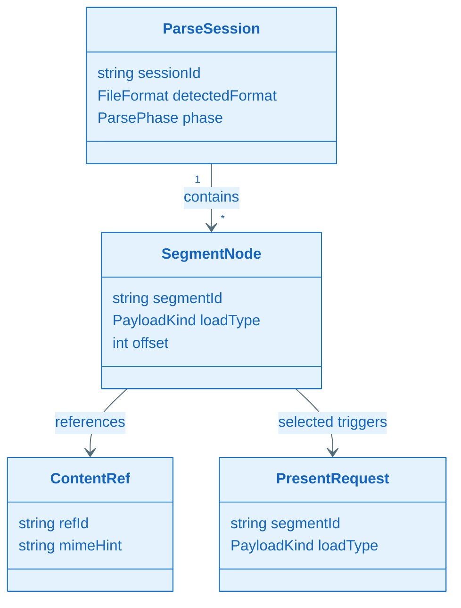
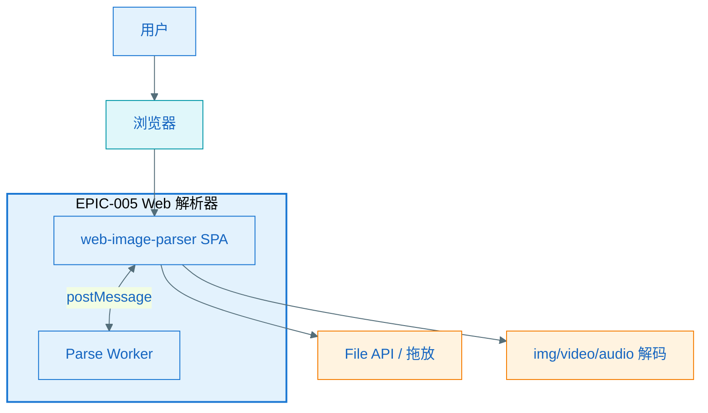
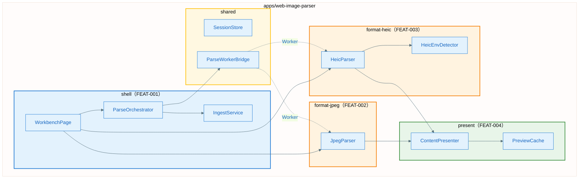
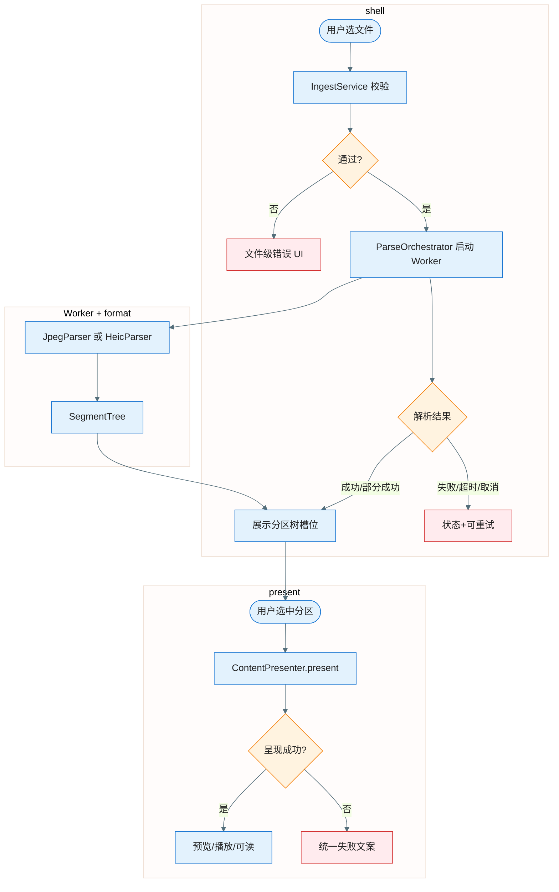
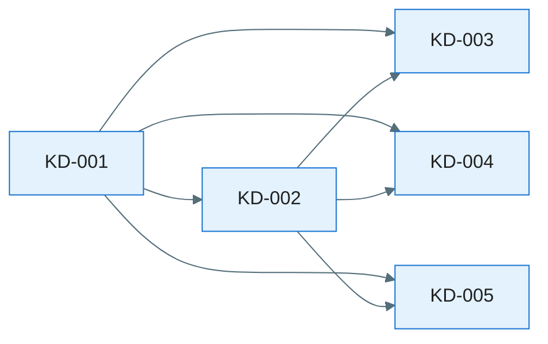
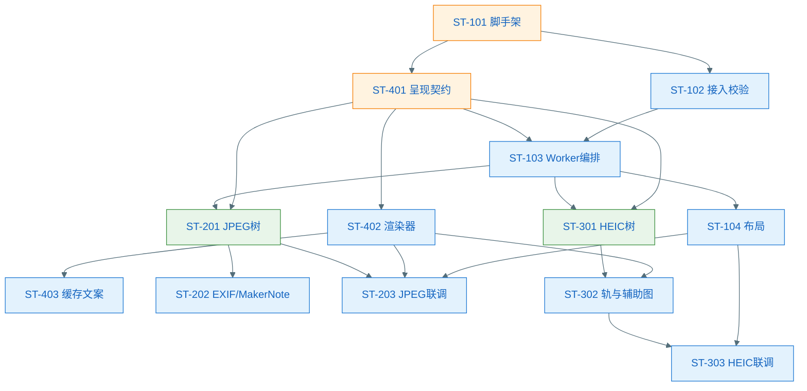

# EPIC 软件设计说明书：EPIC-005 - Web 端图片数据解析器

> **定位**：EPIC 需求级别的技术设计方案，面向人类评审与后续 Task 拆解、Implement 阶段的 AI 编码参考。与 [`tech-spec.md`](./tech-spec.md) 共同约束 tasks.md 与代码实现。

**Epic**：EPIC-005 - Web 端图片数据解析器  
**Epic Version**：v0.1.4（来自 `epic.md`）  
**设计说明书 Version**：v0.1.0  
**创建/更新日期**：2026-05-22  
**当前工作分支**：`epic/EPIC-005-web-image-parser`  
**EPIC 目录**：`specs/epics/EPIC-005-web-image-parser/`  
**实现工程落位**（本期冻结）：`apps/web-image-parser/`（Vite + TypeScript + React SPA）

**本 EPIC 设计文件组成**：

| 文件 / 目录 | 对应章节 | 内容 |
| ----------- | -------- | ---- |
| `epic-design.md`（本文件） | §1～§13 | 设计总览 |
| `key-func-design/KD_*_*.md` | §七 | 5 篇关键设计 |
| `nfr.md` | §八 | 技术评估量化全文 |
| `interface-design.md` | §九 | 模块间契约 |
| `database-design.md` | §十 | **N/A**（见 §十） |
| `analytics-tracking.md` | §十一 | **N/A**（见 §十一） |
| `features/*/l2_design/ST-*.md` | §十三 | 4 篇复杂 Story L2 |

---

## 变更记录（增量变更）

| 版本 | 日期 | 变更范围 | 变更摘要 | 影响模块 | 是否需要回滚设计 |
| ------ | ------------ | ------------------------ | ---- | ---- | -------- |
| v0.1.0 | 2026-05-22 | EPIC 全量 | `/aisdd.epicdesign all` 初版 | 全部 | 否 |

---

## 设计前置检查

### 前置检查清单

- 已阅读 `epic.md`「跨 Feature 技术策略」
- 已阅读 `tech-spec.md` 第一部分 + 四 Feature 第二节
- 共享能力 Owner 与 `epic.md` / `tech-spec.md` §五 一致
- 已通读 FEAT-001～004 `spec.md` 完整场景矩阵
- 差距分析：Verity 仓库**无**既有 Web 实现 → 绿field，类名均为**设计新增**（`<<新增>>`）

### 本 EPIC 跨 Feature 共享能力登记情况

| 共享能力名称 | Owner Feature | 消费方 Feature | 设计/契约位置 |
| ------------ | ------------- | ------------------ | ---------------------------------- |
| 分区内容多形态呈现 | FEAT-004 | FEAT-002、FEAT-003 | KD-002、`interface-design.md` |
| 解析工作台壳与导航 | FEAT-001 | FEAT-002、FEAT-003 | KD-003、`epic-design.md` §五 |
| 会话与 Worker 解析生命周期 | Shared（Shell 编排） | 全部 | KD-001 |
| 文件级错误与隐私口径 | FEAT-001 | 全部 | KD-003、`interface-design.md` |

### P0 场景覆盖快照

| Feature | 场景ID | 场景名称 | 覆盖的设计章节/图表 | 状态 |
|---------|--------|----------|---------------------|------|
| FEAT-001 | SC-001 | 拖放 JPEG 并成功解析 | KD-003 SEQ + KD-001 | 已覆盖 |
| FEAT-001 | SC-007 | 不支持的扩展名 | KD-003 alt | 已覆盖 |
| FEAT-001 | SC-010 | 快速双击触发解析 | KD-003 去重 | 已覆盖 |
| FEAT-002 | SC-001 | 浏览完整 JPEG 分区树 | KD-004 | 已覆盖 |
| FEAT-002 | SC-002 | 选中图像数据段预览 | KD-004 + KD-002 | 已覆盖 |
| FEAT-002 | SC-006 | 截断文件 | KD-004 alt | 已覆盖 |
| FEAT-003 | SC-003 | 运动影像播放 | KD-005 + KD-002 | 已覆盖 |
| FEAT-003 | SC-007 | 不支持环境 | KD-005 FR-005 | 已覆盖 |
| FEAT-004 | SC-001 | 图片分区静态预览 | KD-002 | 已覆盖 |
| FEAT-004 | SC-008 | 视频无法解码 | KD-002 alt | 已覆盖 |
| FEAT-001 | SC-012 | 成功后展示 JPEG 分区树 | KD-003 + KD-004 跨 Feature | 已覆盖 |
| FEAT-003 | SC-012 | 端到端 HEIC | KD-003 + KD-005 | 已覆盖 |

### 前置检查结论

- **检查日期**：2026-05-22
- **结论**：通过
- **备注**：`ux-design.md` 未产出；UI 布局细节在 KD-003 / 各 L2 中按 spec 冻结交互口径

---

## 一、简介

### 1.1 目的和对象

| 项 | 内容 |
|---|---|
| 阅读对象 | 设计 / 开发 / 测试 / 评审 |
| 文档目的 | 定义 Web 端 JPEG/HEIC 结构解析产品的架构、关键方案、契约、Story 与 L2，作为实现与验收依据 |

### 1.2 范围

| 来源文档 | 相对路径 | 范围要点 |
|---|---|---|
| EPIC 规格 | [`epic.md`](./epic.md) | Web 本地解析；JPEG/HEIC；分区树 + 多形态呈现 |
| EPIC 技术规约 | [`tech-spec.md`](./tech-spec.md) | TypeScript SPA、Worker 解析、无持久化 |
| UX | — | N/A（待 `/aisdd.epicuidesign`） |

## 二、需求概述

### 2.1 需求背景

| 来源 | 相对路径 | 要点 |
|---|---|---|
| EPIC | [`epic.md`](./epic.md) §背景与价值 | 结构透明化、可读/预览/播放 |

### 2.2 需求范围及限制（按 Feature 索引）

| Feature ID | spec 路径 | In Scope 摘要 | Out of Scope 摘要 | 关键 NFR 引用 |
|---|---|---|---|---|
| FEAT-001 | [`features/FEAT-001-ingest-workbench/spec.md`](./features/FEAT-001-ingest-workbench/spec.md) | 接入、校验、状态、导航壳 | 分区语义、呈现 | NFR-PERF-001、NFR-SEC-001 |
| FEAT-002 | [`features/FEAT-002-jpeg-structure/spec.md`](./features/FEAT-002-jpeg-structure/spec.md) | JPEG 目录树、负载上报 | HEIC、编辑 | NFR-PERF-001、§解析内容目录 |
| FEAT-003 | [`features/FEAT-003-heic-structure/spec.md`](./features/FEAT-003-heic-structure/spec.md) | HEIC 容器树、环境提示 | JPEG、DRM 破解 | NFR-REL-001、ENV-HEIC-* |
| FEAT-004 | [`features/FEAT-004-content-present/spec.md`](./features/FEAT-004-content-present/spec.md) | 呈现矩阵、契约 Owner | 解析、上传 | NFR-MEM-001、FR-007 |

---

## 三、领域模型

### 3.2 领域概念词汇表

| 概念（中文） | 名称（英文/代码名） | 定义 | 关键属性/状态 | 不变量/约束 | 关联概念 |
| ------ | ---------- | ------- | ------------- | ------ | ---- |
| 解析会话 | ParseSession | 一次「选文件→解析→浏览」的浏览器内上下文 | sessionId、format、bufferRef | 同时仅一个活跃会话 | 分区树、呈现请求 |
| 结构分区 | SegmentNode | 文件中可独立定界的结构单元 | id、parentId、loadType、offset | 按文件顺序排列 | 呈现引用 |
| 负载类型 | PayloadKind | 分区内容形态分类 | image/video/audio/metadata/other/mixed | 驱动呈现矩阵 | SegmentNode |
| 呈现引用 | ContentRef | 会话内指向字节或 Blob 的句柄 | refId、byteRange、mimeHint | 不得传出浏览器 | PresentRequest |
| 解析状态 | ParsePhase | 工作台全局状态 | idle/validating/parsing/success/partial/failed/cancelled | 文件级 | FailureType |

### 3.3 概念关系图

---

## 四、零层架构（EPIC 与外部/现有工程边界）

### 4.1 边界说明

- **EPIC 范围**：`apps/web-image-parser/` 静态 SPA；浏览器内完成读文件、Worker 解析、主线程呈现；**无**后端服务。
- **复用**：Verity 仓库仅复用 `test-assets/` 与 AISDD 文档流程，**无**可复用应用代码。
- **外部**：浏览器 File API、Worker、媒体元素解码能力；HEIC 依赖 Safari/Chromium 解码矩阵。

### 4.2 零层架构图

### 4.3 架构设计说明

- **边界**：所有结构语义解析在 Worker；DOM 仅 Shell + Present；002/003 互不引用。
- **数据流**：File → ArrayBuffer（SoR）→ Worker 建树 → 选中节点 → PresentRequest → 解码缓存 → UI。
- **外部依赖**：HEIC 解码失败 → 环境说明（非上传云端）；视频编码不支持 → 统一播放失败文案（FEAT-004）。
- **演进**：`format-*` 包可插拔新格式；`present` 契约稳定。

### 4.4 外部依赖清单

| 依赖项 | 类型 | 提供方 | 提供的能力 | 通信方式 | 故障模式 | 我方策略 |
| -------- | ------ | --------- | ----- | ------ | --------- | ----- |
| File API | OS/浏览器 | 浏览器 | 读本地文件 | DOM API | 权限拒绝 | PERMISSION_DENIED 提示 |
| Dedicated Worker | 浏览器 | 浏览器 | 后台解析 | postMessage | 崩溃/超时 | 终止+PARSE_TIMEOUT |
| HEIC/HEVC 解码 | 浏览器 | Safari/Chromium | 图像/视频解码 | 媒体 API | 不支持 | ENV_UNSUPPORTED 指引 |
| exifr / libheif（候选） | 第三方库 | npm | EXIF/容器解析 | ES import | 解析异常 | 部分成功+警告 |

---

## 五、一层架构（分层与模块职责）

### 5.1 一层框架图

> **跨层约束**：`present` 不得 import `format-jpeg`/`format-heic` 实现；Format 仅依赖 `present` 的类型契约与 `shared`。

### 5.2 组件清单与职责

| 组件 | 所属模块 | 职责 | 输入/输出 | 依赖 | 约束 |
| ----- | ------------- | ------- | ------- | ----------- | -------------- |
| SessionStore | shared | 托管会话 Buffer 与元数据 | File→Session | — | 单会话 |
| ParseWorkerBridge | shared | Worker 启停、取消、消息路由 | 命令→结果事件 | Worker | 单任务 |
| IngestService | shell | 类型/大小校验 | File→ValidationResult | — | P95≤1s |
| ParseOrchestrator | shell | 状态机、调度 Format 解析 | Session→ParsePhase | Bridge, JP/HP | 防双发 |
| WorkbenchPage | shell | 布局：接入区+树槽+详情槽 | 用户事件→UI | Orch, CP | 主线程 |
| ContentPresenter | present | 执行呈现矩阵 | PresentRequest→PresentResult | Cache, 渲染器 | LRU≤3 |
| JpegParser | format-jpeg | JPEG 段扫描与树 | Buffer→SegmentTree | exifr 等 | Worker 内 |
| HeicParser | format-heic | BMFF/HEIF 树 | Buffer→SegmentTree | mp4box 等 | Worker 内 |
| HeicEnvDetector | format-heic | ENV-A/B/C 探测 | UA→EnvReport | 浏览器 API | 会话缓存 |

### 5.3 组件协作流程图

### 5.4 技术方案选型

#### 选型 1：前端框架

| 方案 | 描述 | 优点 | 缺点 |
| ------------- | ------ | --------- | --------- |
| React 18 + Vite | 组件化 SPA | 生态成熟、Worker 友好 | 包体积略大 |
| Vue 3 + Vite | 同上 | 上手快 | 团队未定型 |

**采用 React 18 + Vite**：与 TypeScript 严格模式、Playwright E2E 配合成熟；三区布局（接入/树/详情）用组件组合清晰。

#### 选型 2：JPEG EXIF / MakerNote

| 方案 | 描述 | 优点 | 缺点 |
| ------------- | ------ | --------- | --------- |
| exifr | 纯 JS EXIF | 浏览器可用、字段级 | MakerNote 厂商需扩展 |
| 自研 IFD 解析 | 完全可控 | 无依赖 | 工期大 |

**采用 exifr + 自研段扫描**：段列表自研扫描保证 PAR 目录覆盖；EXIF/MakerNote 字段级用 exifr 并扩展 Canon/Nikon 等映射表。

#### 选型 3：HEIC 容器

| 方案 | 描述 | 优点 | 缺点 |
| ------------- | ------ | --------- | --------- |
| mp4box.js | BMFF 解析 | 树结构完整 | 包较大 |
| libheif WASM | 解码强 | 预览好 | WASM 加载与 CSP |

**采用 mp4box.js（结构）+ 浏览器原生解码（预览/播放）**：结构解析与呈现解耦；环境不支持时走 HeicEnvDetector 指引。

---

## 六、技术风险与边界场景（设计输入）

### 6.1 技术风险与消解策略

| 风险ID | 风险类别 | 风险描述 | 触发条件 | 影响范围 | 严重度 | 消解策略 | 对应 Feature/Story |
| -------- | --------------------------------------- | ---- | ---- | ---- | ------------ | ---- | ----------------- |
| RISK-001 | 技术方案 | HEIC 浏览器能力不一致 | 非 ENV-A | FEAT-003 | High | HeicEnvDetector + FR-005 文案 | ST-301, ST-303 |
| RISK-002 | 算法快稳省 | 大文件解析阻塞 | 近 50MB | 全部 | Med | Worker + 120s 超时 + 取消 | ST-103 |
| RISK-003 | 算法效果 | 非标准 JPEG/HEIC | 厂商自定义 | 002/003 | Med | PAR-*-099 节点+警告 | ST-201, ST-301 |
| RISK-004 | 用户体验 | 呈现矩阵验收争议 | 混合负载 | FEAT-004 | Med | KD-002 矩阵冻结 | ST-401 |
| RISK-005 | 技术方案 | 视频轨无法播放 | 冷门编码 | 003/004 | Med | FR-009 统一降级 | ST-402 |
| RISK-006 | 数据安全与隐私 | 误上传文件 | 错误配置 | 全部 | High | 无网络请求+代码审查 | ST-101 |

### 6.2.1 场景 → 应对措施对照表

| Feature 名称 | 场景名称 | 场景及影响描述 | 严重程度 | 发生频率 | 技术对策 | 设计对策 |
| ------------- | ------ | ---------------- | ------------ | ------------ | ----------- | --------------- |
| FEAT-001 | SC-010 双击解析 | 重复任务 | Med | Med | Orchestrator 任务令牌去重 | N/A |
| FEAT-001 | SC-009 解析超时 | 用户等待 | Med | Low | 120s watchdog | 超时文案+取消 |
| FEAT-002 | SC-006 截断文件 | 部分树 | High | Med | PARTIAL + 警告节点 | 警告图标 |
| FEAT-003 | SC-007 不支持环境 | HEIC 不可用 | High | Med | ENV_UNSUPPORTED | 建议 Safari |
| FEAT-004 | SC-010 快速切换分区 | 预览错乱 | Med | High | 请求序号+AbortController | N/A |

---

## 七、关键功能与疑难点/亮点设计

**摘要**：5 篇 KD 覆盖会话 Worker 基建、呈现 Owner 契约、工作台编排、JPEG/HEIC 格式解析；依赖 DAG：KD-001 → KD-002 → KD-003/004/005。

### 7.1 关键设计清单

| 编号 | 设计点名称 | 层级/类型 | 前置 KD | 设计文档路径 |
| ------ | ------------ | ----------- | -------------- | ------------ |
| KD-001 | 会话与 Worker 解析基建 | 基础框架 | — | `./key-func-design/KD_001_session_worker.md` |
| KD-002 | 分区内容呈现契约与渲染 | Capability/横切 | KD-001 | `./key-func-design/KD_002_content_present.md` |
| KD-003 | 工作台接入与解析编排 | Infrastructure | KD-001, KD-002 | `./key-func-design/KD_003_workbench_orchestration.md` |
| KD-004 | JPEG 结构解析 | 业务 | KD-001, KD-002 | `./key-func-design/KD_004_jpeg_structure.md` |
| KD-005 | HEIC 结构解析与环境矩阵 | 业务 | KD-001, KD-002 | `./key-func-design/KD_005_heic_structure.md` |

### 7.2 详细设计引用

- [KD-001 会话与 Worker 解析基建](./key-func-design/KD_001_session_worker.md)
- [KD-002 分区内容呈现契约与渲染](./key-func-design/KD_002_content_present.md)
- [KD-003 工作台接入与解析编排](./key-func-design/KD_003_workbench_orchestration.md)
- [KD-004 JPEG 结构解析](./key-func-design/KD_004_jpeg_structure.md)
- [KD-005 HEIC 结构解析与环境矩阵](./key-func-design/KD_005_heic_structure.md)

---

## 八、技术评估（设计产出验证，必须量化）

**摘要**：Web 工具无移动端功耗计量；性能/内存按 `tech-spec` 红线在 `nfr.md` 给出预算与验收方法；算法类 N/A；安全以本地不上传为主达标设计。

→ 详见 **[`nfr.md`](./nfr.md)**

---

## 九、接口设计

**摘要**：无 HTTP API；模块间 TypeScript 契约（Present、Parse、Session）见 `interface-design.md`。

→ 详见 **[`interface-design.md`](./interface-design.md)**

---

## 十、数据库设计

**摘要**：本期无服务端/客户端持久化库表；会话数据仅内存，**不适用**数据库设计。

→ **N/A**（不创建 `database-design.md`；依据 `tech-spec` §四 无跨会话 SoR）

---

## 十一、埋点技术方案

**摘要**：本期不要求第三方埋点；仅 `FailureType` 枚举供测试对账（NFR-OBS）。

→ **N/A**（不创建 `analytics-tracking.md`）

---

## 十二、Story 拆解

### 12.1 拆解策略与约束（摘要）

完整方法论见 [`.cursor/rules/aisdd-story-splitting.mdc`](../../../.cursor/rules/aisdd-story-splitting.mdc)。

### 12.2 拆解说明（本 EPIC）

按**共享内核 → 呈现契约 → 工作台壳 → 格式解析（JPEG 先行、HEIC 并行轨）**拆解；MVP 路径 ST-101→401→103→201→104；HEIC 轨 ST-301 可与 JPEG 后半并行（依赖 101、401）。

### 12.3 Story 自检清单

- [x] 可并行：ST-201 与 ST-401 在 ST-103 后路径不重叠
- [x] 可独立提交：每 ST 对应可编译增量
- [x] 变更边界清晰：见各 ST「改动范围」
- [x] 可估算：见 §12.7
- [x] 工作量适中：单 ST 2～5 人天
- [x] 可验证：各 ST 含验证条件
- [x] 依赖可控：§12.5 无环
- [x] 架构遵从：仅 `apps/web-image-parser` 五模块
- [x] FR 覆盖：§12.6 矩阵完整

### 12.4 Story 列表

#### FEAT-004：分区内容多形态呈现

> **拆解思路**：先契约与策略，再渲染器，最后缓存与文案。

##### ST-401：呈现契约与策略矩阵

- **描述**：定义 `PresentRequest`/`PresentResult`、`PayloadKind`、策略路由
- **目标**：002/003 可类型安全调用 `ContentPresenter.present`
- **改动范围**：`src/present/*`、`src/shared/types/present.ts`
- **预估工作量**：3 人天
- **覆盖 FR/NFR**：FR-001、FR-007 / NFR-SEC-001
- **依赖**：ST-101
- **可并行**：与 ST-102（若 101 已完成）
- **验证条件**：契约单元测试通过；空引用返回 NO_CONTENT

##### ST-402：图片/视频/音频/可读渲染器

- **描述**：实现四类渲染与 FR-009 降级
- **目标**：样例图片 100% 走预览路径
- **改动范围**：`src/present/renderers/*`
- **预估工作量**：5 人天
- **覆盖 FR/NFR**：FR-002～004、FR-010、FR-011 / NFR-PERF-001、002
- **依赖**：ST-401
- **验证条件**：S-JPEG-01 主图预览；视频样例起播≥3s 或失败说明

##### ST-403：预览缓存 LRU 与统一文案

- **描述**：PreviewCache≤3、FR-006 文案表、请求序号防竞态
- **目标**：AC-005、SC-010 通过
- **改动范围**：`src/present/PreviewCache.ts`、`src/present/copy.ts`
- **预估工作量**：2 人天
- **覆盖 FR/NFR**：FR-006、FR-008 / NFR-MEM-001、NFR-REL-001
- **依赖**：ST-402
- **验证条件**：连续 10 分区切换无 OOM；最后选中一致

#### FEAT-001：图片接入与解析工作台

##### ST-101：工程脚手架与 shared 内核

- **描述**：Vite+React+TS 工程、`SessionStore`、类型与失败枚举
- **目标**：空壳可运行、`pnpm test` 通过
- **改动范围**：`apps/web-image-parser/` 根配置、`src/shared/*`
- **预估工作量**：2 人天
- **覆盖 FR/NFR**：— / NFR-SEC-001（基础）
- **依赖**：无
- **共享能力**：是（→ 全部 Feature）
- **验证条件**：`pnpm dev` 启动；SessionStore 单例测试

##### ST-102：文件接入与校验

- **描述**：拖放/选择、50MB、魔数 JPEG/HEIC
- **目标**：FR-001～003、SC-006/007
- **改动范围**：`src/shell/IngestService.ts`、`WorkbenchPage` 接入区
- **预估工作量**：3 人天
- **覆盖 FR/NFR**：FR-001～003 / NFR-PERF-002
- **依赖**：ST-101
- **验证条件**：51MB 拒绝；PNG 拒绝

##### ST-103：Worker 桥接与解析编排

- **描述**：`ParseWorkerBridge`、`ParseOrchestrator` 状态机、取消/超时/去重
- **目标**：KD-001/003 落地
- **改动范围**：`src/shared/ParseWorkerBridge.ts`、`src/shell/ParseOrchestrator.ts`、`src/worker/*`
- **预估工作量**：4 人天
- **覆盖 FR/NFR**：FR-004、FR-006、FR-009 / NFR-POWER-001、NFR-REL-001
- **依赖**：ST-101、ST-401（契约类型）
- **关键风险**：RISK-002
- **验证条件**：SC-010 仅一次任务；取消后状态 CANCELLED
- **L2**：[`features/FEAT-001-ingest-workbench/l2_design/ST-103_worker_orchestration.md`](./features/FEAT-001-ingest-workbench/l2_design/ST-103_worker_orchestration.md)

##### ST-104：浏览框架布局与隐私说明

- **描述**：三区布局、树/详情槽位、隐私 FR-008
- **目标**：解析成功后挂载 format 视图
- **改动范围**：`src/shell/WorkbenchPage.tsx`、`src/shell/layout/*`
- **预估工作量**：3 人天
- **覆盖 FR/NFR**：FR-005、FR-008 / NFR-MEM-001（壳层）
- **依赖**：ST-102、ST-103
- **验证条件**：SC-012 框架可见

#### FEAT-002：JPEG 分区解析与浏览

##### ST-201：JPEG 段扫描与分区树

- **描述**：标记段扫描、PAR 目录 P0、099 未知段
- **改动范围**：`src/format-jpeg/JpegParser.ts`、`SegmentTreeBuilder`
- **预估工作量**：5 人天
- **覆盖 FR/NFR**：FR-001、FR-002、FR-006 / NFR-PERF-001
- **依赖**：ST-103、ST-401
- **L2**：[`features/FEAT-002-jpeg-structure/l2_design/ST-201_jpeg_segment_tree.md`](./features/FEAT-002-jpeg-structure/l2_design/ST-201_jpeg_segment_tree.md)

##### ST-202：EXIF/IPTC/MakerNote 字段级

- **描述**：exifr 集成、厂商 MakerNote 映射
- **预估工作量**：4 人天
- **覆盖 FR/NFR**：FR-009、FR-011、FR-012
- **依赖**：ST-201

##### ST-203：JPEG 与呈现/工作台联调

- **描述**：选中触发 present、状态回传 FR-008
- **预估工作量**：2 人天
- **覆盖 FR/NFR**：FR-003、FR-004、FR-008 / NFR-PERF-002
- **依赖**：ST-201、ST-402、ST-104

#### FEAT-003：HEIC 分区解析与浏览

##### ST-301：BMFF 容器树与 meta 子树

- **描述**：mp4box 建树、FR-011 meta 展开
- **预估工作量**：5 人天
- **依赖**：ST-103、ST-401
- **L2**：[`features/FEAT-003-heic-structure/l2_design/ST-301_heic_container_tree.md`](./features/FEAT-003-heic-structure/l2_design/ST-301_heic_container_tree.md)

##### ST-302：Live Photo / 音视频轨 / 辅助图

- **描述**：iref 关联、音轨 FR-012、深度/HDR FR-013
- **预估工作量**：4 人天
- **依赖**：ST-301、ST-402

##### ST-303：环境检测与 HEIC 联调

- **描述**：HeicEnvDetector、FR-005、与 JPEG 体验一致 FR-008
- **预估工作量**：3 人天
- **依赖**：ST-301、ST-104、ST-203（体验对齐参考）

### 12.5 Story 依赖关系图

### 12.6 Feature → Story 覆盖矩阵

| Feature | FR/NFR ID | 覆盖 Story |
|---|---|---|
| FEAT-001 | FR-001～009 | ST-102, ST-103, ST-104 |
| FEAT-001 | NFR-PERF-001 | ST-103（信号）+ ST-203/303 |
| FEAT-002 | FR-001～012 | ST-201, ST-202, ST-203 |
| FEAT-003 | FR-001～015 | ST-301, ST-302, ST-303 |
| FEAT-004 | FR-001～011 | ST-401, ST-402, ST-403 |
| FEAT-004 | NFR-MEM-001 | ST-403 |

### 12.7 Story 工作量汇总

| Feature | Story | 预估（人天） | 依赖 |
|---|---|---|---|
| FEAT-004 | ST-401 | 3 | ST-101 |
| | ST-402 | 5 | ST-401 |
| | ST-403 | 2 | ST-402 |
| | **小计** | **10** | |
| FEAT-001 | ST-101 | 2 | — |
| | ST-102 | 3 | ST-101 |
| | ST-103 | 4 | ST-101, ST-401 |
| | ST-104 | 3 | ST-102, ST-103 |
| | **小计** | **12** | |
| FEAT-002 | ST-201～203 | 11 | ST-103+ |
| FEAT-003 | ST-301～303 | 12 | ST-103+ |
| | **总计** | **45** | |

> **关键路径**：ST-101 → ST-401 → ST-103 → ST-201 → ST-203（约 18 人天，占 40%）

---

## 十三、二层 Story 详细设计（L2）索引

### 13.1 L2 设计索引表

| Story ID | 标题 | 所属 Feature | 关联 KD | L2 文件路径 | 前置依赖 | 状态 |
| -------- | ---- | ---------- | ------------------ | ------------------- | -------------------------------- | ------- |
| ST-103 | Worker 编排 | FEAT-001 | KD-001, KD-003 | `features/FEAT-001-ingest-workbench/l2_design/ST-103_worker_orchestration.md` | ST-101, ST-401 | 已完成 |
| ST-401 | 呈现契约 | FEAT-004 | KD-002 | `features/FEAT-004-content-present/l2_design/ST-401_present_contract.md` | ST-101 | 已完成 |
| ST-201 | JPEG 段树 | FEAT-002 | KD-004 | `features/FEAT-002-jpeg-structure/l2_design/ST-201_jpeg_segment_tree.md` | ST-103, ST-401 | 已完成 |
| ST-301 | HEIC 容器树 | FEAT-003 | KD-005 | `features/FEAT-003-heic-structure/l2_design/ST-301_heic_container_tree.md` | ST-103, ST-401 | 已完成 |
| ST-102 | 文件接入校验 | FEAT-001 | KD-003 | — | ST-101 | 由 tasks.md DoD 承接（交互简单） |
| ST-104 | 布局隐私 | FEAT-001 | KD-003 | — | ST-103 | 由 tasks.md DoD 承接 |
| ST-202 | MakerNote | FEAT-002 | KD-004 | — | ST-201 | 由 tasks.md DoD 承接（算法增量） |
| ST-203 | JPEG 联调 | FEAT-002 | KD-004, KD-002 | — | ST-201, ST-402 | 由 tasks.md DoD 承接 |
| ST-402 | 渲染器 | FEAT-004 | KD-002 | — | ST-401 | 由 tasks.md DoD 承接（KD-002 已详述） |
| ST-403 | 缓存文案 | FEAT-004 | KD-002 | — | ST-402 | 由 tasks.md DoD 承接 |

### 13.2 L2 Story 依赖关系

| Story ID | 前置依赖 ST | 备注 |
| -------- | ------------------- | ---------------- |
| ST-103 | ST-101, ST-401 | 跨 Feature |
| ST-201 | ST-103, ST-401 | 跨 Feature |
| ST-301 | ST-103, ST-401 | 跨 Feature |

### 13.3 L2 覆盖度检查

- [x] 复杂 ST（103/401/201/301）均有 L2 文件
- [x] 简单 ST 已标注 tasks.md 承接
- [x] L2 与 KD 核心类/契约一致
- [x] §13.1 与 §12.5 依赖一致

---
